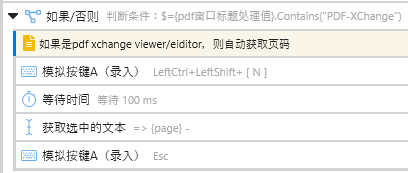

- [[AI]]
	- json生成图谱，ai学习（？）

- [[人体]]
	- [献血1173次，他用特殊血液挽救240万婴儿](https://mp.weixin.qq.com/s/O-PkEIgMeqH254k-5Vl9cg)
	- TODO 芝麻粉等保鲜，防脏，提醒，易取
	- 坐下时裤管罩不住脚后跟
	- 筋膜多含水量会增大？大拇趾冻疮
	- ---
	- 咬合
	- 可以用牙而不是手给[[烤红薯]]等剥皮
	- 全球变暖，冰川移动，牙不齐
	- 上下牙歪角度不对、不对齐，侧卧
	- 口腔溃疡
		- ((679add8b-4ff2-45fa-8e76-b97181f57619))
	- ((67c7cb6e-4adb-4e87-af2c-8f42d22927a0))
	- ((679adcbf-dbc6-4d5b-ba55-82b312e6bd6b))
	- 手腕压迫，中指抬高（？）
	- [三八节特辑：女性一生会听到多少种噪音_哔哩哔哩_bilibili](https://www.bilibili.com/video/BV1i2421T7mg)

- [[市场流程]]
	- ---
	- 软文，推荐一种和推荐多种，但是偏心
	- [[快递门对门自动化]]
	- 一物多上，不同封面等
	- “市场覆盖”
	- “（自由市场）有限理性/选择策略”

- [[情报、反情报]]
	- 自动
		- ((679adcd3-ea75-4997-aea3-09fbf4726c48))
	- 记账分享连同商品评价的导出，比价
	- （“如果你没有这样的需求，应该就是你还没有这样的需求”）

- [[生存狂]]
	- 减少同类（模仿）犯罪的综合成本（制服后治疗、审判、推广）
	- 防身武器质量不好打弯打断
	- 阵法（戚继光）
	- 求生哨随身带，被废墟埋了也能吹——带子可以用嘴拉，循环
		- ((678b0495-560b-48f8-9cfb-bce76331e388)) 容器
	- ((67c7a66c-a619-4730-a7af-17f935328aec))
	- 猫狗防毒检测，物业

- [[直播]]
	- 视频会议自动登录，睡觉模拟器

- [[编程]]
	- ((67c853cb-6c0e-4e3a-ae61-3612921a560e))
	- [[学习，学习，再学习！]]
		- ((67c852ee-ddea-44fe-98f2-042b0ba9f9dc))
	- ((679adca5-2dbe-4df3-ab03-4c7c01631a8a)) （用cursor聊的并非半成品的赛博朋克灰喜鹊css已经应用到本站了，疑似既不灰喜鹊也不如默认主题，乐）
	- 创作者可能需要的
		- ((679adca5-2dbe-4df3-ab03-4c7c01631a8a)) （跟cursor聊的并非半成品的赛博朋克灰喜鹊css已经应用到本站了，疑似既不灰喜鹊也不如默认主题，乐）
	- ((67aa151b-2c04-4dd1-aaf1-20888dd2276a))（“确实没人问，至少暂时我爸没又要我考个啥”）
	- ((67b3ccc4-af06-4719-a14e-55e6236dcdf5)) （可能没啥需要原创的编程，主要是资源测试、选择、打包）
	- 创作者可能需要
	- [[快递门对门自动化]]
	- 暂不优先的
		- ((67c8063d-dc3b-418e-ae09-313458b1eccf))
	- TODO 速读训练（“伪需求？”）
	- “就像跑步APP一样！”
		- ((66db8ac4-2aa3-40b5-853a-354efb808e62))
	- ((67c54f59-8b56-4deb-ba65-0db96d8bb26e))
	- ((66975f62-1708-4381-b805-07200efa2e8a))
	- 插件
	- 翻页识别
	- 钩子
	- 选择
	- [我读了二十多本读书方法的书，总结出了一套高效读书法（如何高效阅读（纪念版））书评](https://book.douban.com/review/12619636/)
		- ((67584135-2930-4ab4-a09e-43465d784164))
	- ((678e30fb-5a6e-4ad6-b381-114997259ace))
	- ((679adca5-2dbe-4df3-ab03-4c7c01631a8a)) （跟cursor聊的并非半成品的赛博朋克灰喜鹊css已经应用到本站了，疑似既不灰喜鹊也不如默认主题，乐）
	- ((67aa151b-2c04-4dd1-aaf1-20888dd2276a))（“确实没人问，至少暂时我爸还没有又要我考个啥”）
	- ((679adca5-2dbe-4df3-ab03-4c7c01631a8a)) （并非半成品的赛博朋克灰喜鹊css已经应用到本站了，乐）
	- ((67c80997-529e-48ca-bc41-cade80f16f0d))

- [[网络套件]]
	- ((679add83-4dc4-4efd-b031-60d314dc5afd))
	- ((67b8240e-62cf-46f8-8c69-647bb8633b20))
	- ((67a1ba4e-c715-4f0c-bc74-867cd2fdb5f4))
	- ((679add33-373e-45d8-9d44-dacacfcd8946))
	- 有不少人想先做个ogas，但一来我还没做出来，二来可能的确需要先从小到大摸索，不然方向不明确，未必会比之前更好

- [[I人亿面]]
	- 视频通话

- [[应试]]
	- TODO AI网课代考

- [[diffs/最近一天的新增]]
	- [[快递门对门自动化]]
	- [[快递门对门自动化]]
	- [[劳动]]
	- [[地图]]
	- 厂房
	- 内部结构估计
	- 距离
	- 逃生路线制定
	- 机器狗/四足机器人
	- “旺铺转让”
	- [流行真是一个圈？“烟卡”再次席卷小学生_腾讯新闻](https://news.qq.com/rain/a/20250103A0A5QW00)
	- [[酒卡]]
	- [[学术]]
	- 最下面的回答：竖屏、放大到280%左右、拖滚动条居中、阅读
	- 横屏： ((65d2b96f-a901-4642-b354-642fd07c3534)) 分屏（可以是自带三分屏布局的较大居中，也可以调成更窄的并保存布局）+ ((673edb30-68eb-44a9-a867-6115ab372287))
	- 方案一：同向切换左右栏与翻页用两个键，右键循环依次（拖滚动条或瞬间右键多少下）切换到下一栏、翻页
	- “懂了，不依赖软件给的翻页信息，恍然大悟”
	- 方案二：同向切换左右栏与翻页用一个键，下键或滚轮页码加1时返回、从左栏（拖滚动条或瞬间右键多少下）到右栏，第二次再翻页并回到左栏
	- [窗口界面控制（预览） - Quicker](https://getquicker.net/KC/Help/Doc/uiautomation)（FlaUI）获取窗口控件信息，但选择控件后页码还不清楚怎么获取
	- [求教，怎样使用脚本获取页码 - Quicker](https://getquicker.net/Common/Topics/ViewTopic/26297)
	- >免费版不支持外部启动功能。
	- TODO [pdf 标注跳转——随写随引 - Dawn99 的回帖 - 链滴](https://ld246.com/article/1619536691753)
	- “复制粘贴”
		- ((67c54f59-8b56-4deb-ba65-0db96d8bb26e))
	- [publications - Difficulty reading scientific papers in two columns - Academia Stack Exchange](https://academia.stackexchange.com/questions/112214/difficulty-reading-scientific-papers-in-two-columns)
	- “你们说得对，但是双栏可以进一步分成相同阅读位置的两个单栏阅读”
	- 最下面的回答：竖屏、放大到280%左右、拖条居中、阅读
	- 应该也可以通过 ((66db8ac4-d558-458d-9528-499eb66f69ee)) 等实现自动化
	- >浅尝辄止😎
	- [[软件]]
	- [让窗口布局更有效率，Windows 平台分屏工具合辑 - 少数派](https://sspai.com/post/43187)
	- 另一种没试过
	- logseq Schrödinger（logseq插件，转为hugo）
	- [GitHub - sawhney17/logseq-schrodinger: A plugin to export pages in Logseq to Hugo.](https://github.com/sawhney17/logseq-schrodinger)
	- 水印
	- [截图自动添加水印 - 知乎](https://zhuanlan.zhihu.com/p/457772044)
		- ((67c6e90a-d68e-43a8-b4a6-bb5c70c4319b))
	- ((67b83917-a140-4671-b5e1-189632de1d37))
	- 可能是相同主题的碎片笔记写了几十上百行，（要整理时）不想自己慢慢整理（比如调整位置，乃至切分）、分类（像logseq还有缩进），又怕AI乱整理，怎么办？可能提示词就能解决（
	- 标记（“第6行第10-12个字左移5厘米”）、计数
	- 家庭影院
	- 绕过运营商、视频平台等“合谋”的机顶盒
	- 能加速的网站不多，但够看本站（绝大部分内容）和（把GitHub）当==跳板==（“搜，都可以搜，有什么不能搜的”）了——“这个公司搞加速也不注重重点关注，糊涂啊”——在“网络加速”界面勾选Github再点击“一键加速”
	- 20250304
		- ((67c6e90a-d68e-43a8-b4a6-bb5c70c4319b))
	- {{embed ((67258d24-c45c-451c-b66c-51a732fa114d))}}
		- ((67c6ecf2-04f0-40e5-a13e-41ac128c066b))
	- ((67c44d51-3697-43a6-8801-4ad2f679b19d))
	- ((67c658ce-9dd1-4a6e-a5a6-3925bbdd68a1))
	- ((67c6c6a0-9649-44eb-ba82-9f4df71491d4))
	- ((67c65ac3-64d2-426f-879b-29026b781354))
	- ((67c66a21-06bc-4ed4-8f1b-35a9383c8c28))
	- ((67c66a63-9135-4b85-b729-9847de903d60))
	- [[酒卡]]
		- ((67c658ce-9dd1-4a6e-a5a6-3925bbdd68a1))
	- [[交通]]
	- 光子支付、光闪付
	- [用“光”来支付，一起看“光闪付”与“光子支付”的优劣-移动支付网](https://www.mpaypass.com.cn/news/201809/30090638.html)
	- 
	- [[睡眠]]
	- TODO 早起手机自动播放音视频 #J
	- [[编程]]
		- ((67258d24-c45c-451c-b66c-51a732fa114d))
	- 本站优化
	- 视觉
		- ((679adca5-2dbe-4df3-ab03-4c7c01631a8a)) （并非半成品的css已经应用到本站了，乐）
	- ((67aa151b-2c04-4dd1-aaf1-20888dd2276a))
	- ((678cad97-d2e6-4dd7-b4c4-34b28dd2b276))
	- ((67b3ccc4-af06-4719-a14e-55e6236dcdf5))
	- 可能是创作者
		- ((67bf0680-cb98-4a03-afce-763a533ca4da))
	- ((67bd7e85-9f5b-4b95-aecc-6251da9916b5))
	- [[快递]]
		- ((66db8ac4-2aa3-40b5-853a-354efb808e62))
	- ((67c54f59-8b56-4deb-ba65-0db96d8bb26e))
	- ((66975f62-1708-4381-b805-07200efa2e8a))
	- ((67584135-2930-4ab4-a09e-43465d784164))
	- ((678e30fb-5a6e-4ad6-b381-114997259ace))
	- ((67a1ba4e-c715-4f0c-bc74-867cd2fdb5f4))
	- [[AI]]
		- ((67c6b995-1d4c-4519-b778-177c324ae31b))
	- 多模态
	- 黑话行话学习器
	- “中译中”
	- 准确翻译用语，无障碍交流
	- [[人体]]
		- ((67c2bebf-58f3-4f5f-b8ac-7e3f0672c17d))
	- 袜子紧束缚血管
	- 水汽通道
	- 拖鞋空了又响，满了又不保暖
		- ((6367366f-e68f-4976-b1e6-45ae8adf1341))
	- 残疾
	- 视障/盲人
	- [你能闭眼读完这篇文章吗？](https://mp.weixin.qq.com/s/dG9i9nAXYFd3dtPnhikR5Q)
	- [心智互动的个人空间-心智互动个人主页-哔哩哔哩视频](https://space.bilibili.com/669853268)
	- [如何看待调查显示「9成视障用户曾遭遇验证码难题」？「互联网无障碍改造行动」能解决这个问题吗？ - 知乎](https://www.zhihu.com/question/492525157)
	- [视障生活指南第5集:盲人如何扫健康码？_哔哩哔哩_bilibili](https://www.bilibili.com/video/av935960765)
	- “我看一下”
	- 盲文板
	- [盲人教你如何上盲文板_哔哩哔哩_bilibili](https://www.bilibili.com/video/BV1ut4y1J7kz)
	- 盲人枪战游戏
	- [盲人玩枪战游戏太6了，不服赶紧来战！](https://www.bilibili.com/video/BV1494y197s8)
		- ((65d547ee-c15f-478f-ad5b-1f57c27ceec8))
	- ((679adcb4-f5d7-4fc4-b6b6-60ed8e404269))
	- ((678a4dd7-30be-4d7c-95e3-4b7bc42654af))
	- 断肢
	- 脚踏
	- [终于能停更了！祝祖国母亲繁荣昌盛！_哔哩哔哩bilibili_英雄联盟](https://www.bilibili.com/video/BV1UC4y1R7uk)
	- [[发明方向]]
		- ((67598a4f-3a19-48c8-8d63-a1e278a45d32))
	- 职业皮套
	- [[被替代品再利用]]
	- 产品特征
	- 不同使用习惯、现有产品配套
	- 形状系列
	- whirlwind tornado hurricane cane
	- [tornado, cyclone, hurricane, storm, typhoon有什么区别？ - 知乎](https://www.zhihu.com/question/24750590)
	- [[双字] Ran-D - Hurricane @小邓字幕组_哔哩哔哩_bilibili](https://www.bilibili.com/video/BV1vW411X7TY)
	- 粗活
	- 细活
	- 核心研发
		- ((67c63951-1f28-4d87-a976-7b5ed63252a2))
	- 蓝海
	- 替代效应
	- 情感伴侣婚育人口
	- 生产力
	- human above machine ham人类超越机器
	- “人类的尊严、自我效能感”
	- 私处
		- ((66ade371-bfc8-4b0f-a967-bf91b6bd9697))
	- [[性玩具]]
		- ((66554936-9464-4c92-81e1-891eb6848b71))
	- [[性侵]]
	- 更多就业
	- 可能是纯公益
		- ((679adcbe-38d7-450d-a38a-3f6cd161f9b9))
	- 残疾人更多就业和消费，会比原来的非残疾人更不好吗？
	- 没啥用（玩具）
	- 手杖
	- 云电脑，在手机上用电脑
	- [[取证、反取证]]
	- “你等一下，我拿笔和纸记一下”
	- [[大脑升级]]
	- 原名：我编的均衡学习/通识选修课《未来可期》
		- ((67b4137c-4f1c-4386-95bc-f24e807916a7))
	- ((67b3ccc4-af06-4719-a14e-55e6236dcdf5))
	- ((67033f84-e5a9-4fc8-8470-abac9aa7611c))
	- ((67aa151b-2c04-4dd1-aaf1-20888dd2276a))
	- ((679add7e-c93d-405e-989d-12a58f230396))
	- ((67a1ba4e-c715-4f0c-bc74-867cd2fdb5f4))
	- ((678cad97-d2e6-4dd7-b4c4-34b28dd2b276))
	- ((67584135-2930-4ab4-a09e-43465d784164))
	- ((67c6bcb0-ac9d-4385-805f-273635657faf))
	- ((678b04ab-ef19-49f8-84b6-2b6e2d23d251))
	- ((670d40f3-496d-4a58-b303-1e7d353f8033))
	- ((67aea416-84e2-463b-882c-57a4c5cde697))
	- ((66095541-fd54-4170-8d30-9141b2aa3f70))
	- ((67c2c25e-8d03-4e33-9a49-34510f1aedb1))
	- ((67b1d7b3-8ed9-43be-a120-2a32ddc32a8b))
	- 视频课：自我介绍、魔法展示、建议
	- 我（“小时候”、分类、省钱不干活等）、时间（“都没时间”、“探索”）、“外围”（迪化：建议方式、知乎问题、素体）、模仿（视频、直播等景观的有效性？）、运动（饮食、理疗）、软件（笔记、博客、流程图、顺带旧项目介绍、其他、网络）
	- 四季生活指南
	- [[春日爆改包]]
	- [[夏日爆改包]]（塞，都往里塞，然后每个季节相对简单地调个包）
	- [[秋日爆改包]]
	- [[冬日爆改包]]（“哈基米的反应速度是人类的七倍！”）
	- [[青年未派]]
		- ((66db8aad-9896-42fd-802e-1a0037523751))
	- ((65f7b702-7360-4df6-b76e-0e1380242385))（历史、科学）
	- >魔鬼藏在细节里
	- [[O2O俱乐部]]
		- ((6669ad2d-7391-4a8e-882a-edeedb1cfd3c))
	- ---
	- [[我的日常]]
	- 可能先集中清 ((66335bea-e054-49b0-89cc-3d88d3d2f697)) ，每天粗整理3000字以上再干别的
		- ((67bd8503-1175-4f02-95d0-7811135a0709))
	- 3、6、9、12月（避开冬夏低温高温；简单点可以在日程设置每91天重复）给 ((65ae0902-a5b1-456f-8002-1da81cd74b46)) 、 ((67402af2-4642-411c-863c-e1f1f5ad93a6)) 、 ((67402aac-ea19-4058-8bcc-9c6ae3791d06)) 、 ((679add83-f5b0-4122-abe4-fae2975b5ef2)) 、旧手机（“可能学习用”）、其他电池和电动工具充电
	- [[手机]]
		- ((679adce8-6586-4223-9aa9-6a6cd6f02444))
	- 换手机传输旧手机数据
	- “互传（APP）——听起来有点刻意简洁到没个性了，换机联盟”
	- 手机店员工可能都没时间帮弄，我这个大忙人则更是孝出强大
	- 手机电量上下限提醒、自动充电断电
	- [有没有控制手机只充电到 80% 的办法或者 app 呢？ - 知乎](https://www.zhihu.com/question/463773701)
	- “懒得root的朋友可以额外幻想手机爹喊你起来运动一下”
	- [手机电池充电到70%、80%自动提醒通知的设置方法-『白云居』](https://baiyunju.cc/9074)
	- [你已经是个成熟的手机了，没电的时候应该会自己充电了_插座_什么值得买](https://post.smzdm.com/p/akxw83nr/)
	- 可能有线（相对）慢充的电池损耗较小
	- 换电池
	- [2025年3月【小米手机八折换电池活动】39款机型，包括note12全系、note11tpro全系、小米12/14系列、k30/50至尊、k40s等热门机型_哔哩哔哩_bilibili](https://www.bilibili.com/video/BV1k4XoYKEmU)
	- [[目录]]
	- [[硬件]]
	- 快速（“一键”）批量删装
		- ((6730654f-5be3-46f4-9cf8-c0a50fc225b6))
	- [[网络]]
	- 听音乐，有些mv油管上有（评论也更丰富），有些音乐spotify上有
		- ((679adda9-5db9-4150-95fd-d51b5005b405))
	- 打不开的网址，你一点都不好奇吗？
	- 企业、店铺缩写加8888
	- “本来完全没得看，现在有短视频”
	- “撒币预装”
	- {{embed ((677df88a-68ff-4d57-bad9-ee3b383f18b1))}}
	- 我们都知道，境外势力和一些没走好合法渠道维权、心怀不满的公民会大量制造fake news试图影响人民群众对党的态度，但科研、程序员、外贸等领域的需要上外网学习交流谈生意，怎么办？
	- [【判刑率99.9%】黑客大佬全面讲解VPN最新实战篇（全），从入门到入狱，网络工程师手把手教学！VPN入门_VPN工作原理_VPN配置_VPN项目_网络安全_哔哩哔哩_bilibili](https://www.bilibili.com/video/BV1q1k7YsEFk)
	- 百度网盘有一个好，免费空间比较大，盗版资源放加密压缩包里一般就不会被和谐
	- [有哪些比较好的百度云盘防和谐的方法？ - 知乎](https://www.zhihu.com/question/417192245)
	- 上网同理，上网就是不断下载和上传流量的过程，流量加密后，就能够把一般带不回去的免费优质内容（可能是盗版的）等走私品带过海关，虽然海关因为看不出具体内容而可能会持续怀疑、关注走私者，所谓天网恢恢疏而不漏，但一般不会拦截流量，不经由它们搞出不得了的大案的话，一般不影响正常使用
	- 最主要的走私方式是加入走私团或多或少分享流量，除此之外就是多花钱请人帮你办好专享走私渠道，就像使用[[索道]]可以在其他人和地面监控设备看不见（“难说”）的情况下进行通讯和货运
	- 低端走私团的费用可以不高于5元/月（各大通用走私工具页面可能有走私团广告链接，我用的是“一元”的；别人免费分享的一般要上电报群看），但相关节点的IP可能被部分网站拒绝，因为同节点IP共用的人多
	- ---
	- 上外网难吗、贵吗？不难、不贵
	- {{embed ((67402acb-9a37-48c8-843f-077a630cf20b))}}
	- 搜verge，可能有广告
	- 系统代理在“设置”或右键任务栏托盘开启
	- 上外网干什么？
	- 打不开的网址，你一点都不好奇吗？
	- 听音乐，有些mv油管上有，有些音乐spotify上有
	- 很多服务用github或谷歌账号会比较方便
	- [[网络套件]]
	- “统一的信息订阅、熟人聊天、微博、支付、广告，微信是（额外功能更多所以）更好的[[RSS]]吗？”
	- 参考（？）
	- 本站优化
	- 修改logseq导出图片模板，增加二维码、时间、水印等
	- 视觉
		- ((679adca5-2dbe-4df3-ab03-4c7c01631a8a)) （并非半成品的css已经应用到本站了，乐）
	- ((679add33-373e-45d8-9d44-dacacfcd8946))
	- ((67b192bf-c765-4376-b7aa-1ceedcea6dd5))
	- ((65d2aef4-03a9-41c1-b9cc-85c2fa6a4abd)) 评价标记（“这已经不是一般的聊天了！”）
	- [[多零工]]
	- 团队信息（还要先整理下，下可能同）
	- ---
	- 标签资源管理器，标签学习机，记忆卡片，遮挡卡
		- ((622b1ce2-e29d-4f11-9315-98b6485347d6))
	- ((67c24479-23c3-4150-874d-c162c85d4dfe))
	- 跨平台（比如我这个博客到微信；“鸡肋？伪需求？”）
		- ((679adda8-459e-467b-8fc6-54802d9551f6))
	- ((668deec5-bacb-497f-8a01-f8f2f0a4ddb0))
	- 未显示的互动信息
	- 我们看到关注者对一个用户的关注、点赞，比如其他对俱乐部和俱乐部的动态的，但是我想它们出现在我的动态乃至手机推送里
	- 订阅
		- ((67c24474-30de-4530-ac81-0901d371acda))
	- 本地化
	- [[记忆]]
		- ((67c3a242-73f2-4fed-8403-85b418d37a92))
	- ((65a920ca-d862-4a13-9473-3404c32df80a))
	- [[速成发明家]]
	- [[大脑升级]]
	- 很多讲究投机取巧的人可能实际上也太“老实”太“路径依赖”、“爱走流程”而想象力不足了（这样的人更可能说什么“想象空间不足”），这并不是说他们不成功，也不是说他们不够聪明，要圆滑老套地说就是“路径依赖”、“（自认为）隔行如隔山”、“求仁得仁”，他们追求的就不是发明各种“稀奇古怪”的玩意，而是按他们认为“可靠”（很大程度上，确实，比如相对稳定的竞争体系由大致很稳定的人构成，关键之一就是搞定“人际关系”，而且发明家也难以例外）的方式搞货币搞情人搞权力
	- [[diffs/最近一天的新增]]
	- [[人体]]
	- [[信念系统]]
		- ((67c24474-30de-4530-ac81-0901d371acda))
	- 20250215
		- ((67b02c3b-effe-4c13-a42b-4fea322fc7ca))
	- 20250218
		- ((67b3ccc4-af06-4719-a14e-55e6236dcdf5))
	- [[Logseq]]
	- [[发明方向]]
	- [[学术]]
	- [[市场流程]]
	- [[本网站、网盘、我]]
		- ((65ae08db-7b92-4199-8748-f67f160e0fa5))
	- [[穴道导引]]
	- [[编程]]
		- ((679adca5-2dbe-4df3-ab03-4c7c01631a8a)) （并非半成品的css已经应用到本站了，乐）
	- [[网络]]
	- [[网络套件]]
	- [[软件协作%2F.org"]]
	- [[软件]]
	- [[香]]
		- ((67ac5ef1-3857-4779-9757-2647da593783))
	- 20240129
	- 20250303
		- ((67c4ece0-bafc-434a-82ac-8963c9db9a1a))
	- [[1050造饭工程]]
		- ((67c4eba5-2cfe-4599-82b1-345988fd2cfd))
	- [[I人亿面]]
	- [[impart]]
	- [[交通安全]]
	- [[人体]]
	- [[信念系统]]
	- [[健身]]
	- [[偶]]
	- [[劳动]]
	- [[卫生卫生]]
	- [[历史]]
	- [[厨具、餐具]]
	- [[口罩]]
	- [[城会玩]]
		- ((679adcb2-c4b6-4650-8037-fe85f48400a7))
	- [[多零工]]
		- ((664978c4-c36e-4b3e-be12-23bb1572ef6e)) ：？
	- [[大学生]]
		- ((67a49a15-487b-4887-b56e-168f31306546))
	- [[天文]]
	- [[学习，学习，再学习！]]
		- ((67c4ef5e-91c5-4e97-a9ec-b4737b4f186b))
	- [[宗教]]
	- [[家居]]
	- [[小区]]
	- [[布设]]
		- ((679add4e-525a-46a2-93e7-c3ad3b9e6857))
	- [[布防]]
	- [[微信]]
	- [[怀疑主义]]
		- ((67c518d0-5a13-430b-871d-4bad15cadbe8))
	- [[性骚扰]]
	- [[手机]]
	- [[护理]]
	- [[教育]]
	- [[旅游]]
	- [[更多能源]]
		- ((6766b6cb-0373-4d48-8a50-6280a89c3600))
	- [[气]]
	- [[游戏]]
	- [[生态伦理]]
	- [[疾病]]
		- ((65654045-65d2-4837-9ffa-c9bc27669d48))
	- [[睡眠]]
	- [[硬件]]
	- [[空净]]
	- [[简单再生餐]]
	- [[素材]]
		- ((67c54840-acfc-4b26-bc8b-2fb6fb348411))
	- [[经络]]
	- [[节日]]
	- [[范式]]
	- [[莫失莫忘]]
	- [[观鸟]]
	- [[记.org"]]
	- [[词联]]
	- [[软件记忆___]]
	- [[速成发明家]]
		- ((67c4f816-2da1-4acf-83ae-bb801cefe201))
	- [[酸奶]]
	- [[钓鱼]]
	- [[饮食]]
	- [[饺子]]
	- [[魔怔英语学爆班]]
	- impressive [[impart]] impact party pantry pastry partner
	- [[1050造饭工程]]
	- 菜份量、热量、营养
	- 换气数（？）
	- [[CDDA]]
	- 不想打直接夜晚跑到边缘再造，天亮上塔
	- 边缘无线发射塔大概没有蜂巢，可以直接看，但也要白天
	- 可以脱离驾驶控制（方向盘脱手），然后射击、拿东西、开智能手机缓存地图，车可能会打转
	- 工具腰带、承重背心，长矛等
	- 注意躯干护甲（有甲不要丢），或者枪法不好时让NPC队友开枪
	- 在城市可以隔着（复式公寓等的）石墙戳
	- 姿势不影响射击耗时
	- [[DayZ]]
	- >单机可以装个dayz navigation和VPP map 省的老切出去看在线地图——评论
	- [[contents]]
	- [[目录]]（左侧栏也有）
	- [[专注具体防护之前]]
	- 青春期与父母闹矛盾可以戴各种各样的人日常忽略的 ((65bcbf46-7772-4bee-be4a-6b7f8f56a859)) ，不要用高音量损害自己的听力
	- [[交通安全]]
	- 内扣短暂远光
	- [[人物面板]]
	- “阳春白雪、曲高和寡、高山流水的标签本就不用公开”
	- [[信念系统]]
	- “财产、货币也算是实力？”
	- 资本主义的寿命预期管理
	- [[儿童]]
	- 儿童贪玩迷恋手机电脑是由家长默认的交换、市场逻辑导致的
		- # 垃圾食品，小孩！吃了变笨不会玩贪吃蛇蛋仔派对迷你世界！
	- [[加密]]
	- 布控球
	- [[历史]]
	- 快速穿越历史课
	- [[厨具、餐具]]
		- ((679addc9-8458-4ad8-b49c-febfb0d7b686))
	- [为什么燃气还需要到户抄表，而不是远程或者集中抄表? - 知乎](https://www.zhihu.com/question/567937839)
	- [[地图]]
	- 赏叶赏花赏景地图
		- ((678b0495-d45c-499b-874c-0897487b947f))
	- [[城会玩]]
		- ((672efebd-64e3-492d-ad82-be03144cc448))
	- [[多零工]]
		- ((67c2dc62-a1b3-4daf-80be-6e8bea0c04bd))
	- [[学习，学习，再学习！]]
	- 如何离家出走、求生、更换监护人、自行求学
	- [[家居]]
	- “擦玻璃，拉窗帘，手腕花，手花圈，”
	- 吧台灯更大更亮更不受约束，且离桌面较近
	- [[小区]]
	- 社区/邻居/居住调查
	- 物业所谓直销低价话术
	- 如何做人民好物业，物业好人民
	- [[市场流程]]
	- [[情报、反情报]]（“做什么？看一眼”）
	- [极客公园 x BiliBili x 宇树科技创始人王兴兴_哔哩哔哩_bilibili](https://www.bilibili.com/video/BV1iT4y177aD)
	- [王兴兴和郭杰瑞_哔哩哔哩_bilibili](https://www.bilibili.com/video/BV1WEFCeSE5r)
	- 商标
	- 增加消费者选择率，可能多数消费者除了查看历史订单、分享链接就是说牌子；还没具体产品乃至具体产品想法时也可以想个好名字
	- [[布设]]
	- 如果产品够简单，可能连“机械”都疑似算不上，可能“加工”、“量产”都不需要......
		- ((67b3e69c-7613-453f-8b1f-8edd5a67dad6))
	- 绘画/P图/建模/动画
	- 如果产品主要是不太复杂的画作，有创意后就可以画了
	- 消费者教育
	- 开辟市场空间、增加消费者选择率
	- 有最初的创意后就可以带着丰富商品描述了，否则甚至不一定能让合作者完全搞懂
	- 游戏百科型商品封面
		- ((679add8a-e464-4eec-a91f-1bce4ab4dcb7))
	- ((66adee71-01d4-4cea-b01b-ad0a969a21bd)) 、专利
	- 可能增加竞争者时间成本
	- 申请专利不需要实物，只要想得美，并且实际上也很美，不实测也能整出有用的专利
	- 生产
	- 电子信息、软件或许在销售、运输环节接近即时生产，但还有其他很多东西并非如此
	- 生产工艺保密
	- “电商现状”罢了，大多并没有“高清特写”、“产品规格”对吧？能把各种多少跨点领域的零件认全了也不一定能精准判定规格，如果还得一个个试，工厂大概会很赶，手工人的产能也不一定跟得上
	- 等卖差不多了再看要不要公开技术细节，公开的话或许意味着竞争者之前的逆向工程多少白干了
	- [QHSE管理体系_百度百科](https://baike.baidu.com/item/QHSE%E7%AE%A1%E7%90%86%E4%BD%93%E7%B3%BB/4981908)
	- 质量管理
	- [质量管理五大工具详解：APQP,PPAP,MSA,FMEA, SPC_哔哩哔哩_bilibili](https://www.bilibili.com/video/BV1Tg4y1T7kv)
	- “搜 ((67a5d975-a3f2-406f-8964-0f061736892a)) 搜的 ”
	- 测试
	- 销售/运输
	- 销售方式极大影响运转难度和竞争烈度
	- 也可以卖情报、反情报服务，商标也可以抢注，创意也可以不走专利直接卖人，产品也可以预售，也可以有毫无理由的赞助，等等，但还是按一般的顺序放最后，毕竟通常最后还得有个运输
		- ((679adcd9-a744-49ca-ac1b-0fc338dd791a))
	- 更高市占率
	- 如果只是想掀起波澜，（除此之外）没有各种世俗的欲望，那固然简单些，但掀大波者往往并非绝对乐观，万一在自己掌控之外出个岔子，比如天网发动全面核战争（可能比无核武器的机器人暴动难顶些），而我在那之前没钱准备生存工程怎么办？
	- 对于一个追求市占率尽可能100%的啸生意，拖、拉长销售时间窗口是致命的，想绕过千奇百怪的“中间商”就要 ((67a40bac-2171-474d-b859-e7913b4b9ef2)) ，因为精明的消费者和竞争者都会拖和赶时间等价格或（通过更快的研发生产广告发货、研发新工艺绕过专利等将）平均成本降下来省钱或把你的市占率抢走，最快不到一天就能超过，现实中的你再强大，也没有“别人”强大，所以应努力组织严密的[[闪销战]]实现大规模快速销售，在那之前，保密也非常重要，不要让网线那头的黑客（“你的上网真的全环节安全吗？”）、窗外架望远镜的邻居（“布豪，是窗外势力！”）、口风不严的身边人（“优秀的匹配机制”）给泄露了
	- [如何通过十发子弹管理 100 人? - 知乎](https://www.zhihu.com/question/26995308)
	- 如果你还有很多[[套件]]——“那很好了”
		- ((67b2b554-acd8-46b2-8705-62fc803aa883))
	- 更进一步：纯自产自销100%市占率
	- “一比8B，优势在我，一口吃下，富得流油”可能做到吗？
	- 限价
	- “建议零售价”
	- “高于这个价买到——卖家就是奸商！”
	- 可以蹭汤喝，但得守规矩
	- 集中需求
	- “为什么消费者要分散在全地上，让我到处跑？”
	- [【BBC】无比震撼的纪录片——沙丁鱼盛宴_哔哩哔哩_bilibili](https://www.bilibili.com/video/BV1Ep4y1D7rw)
	- 销售心态
	- “我知道消费者在哪，我在哪，消费者就在哪”
	- [[地图]]
	- ---
	- 销售渠道/形态
	- 居民一条龙服务
	- 综合“信任度”（“TRUST”）等的大致顺序
	- [[风景]]（“广告啦！”； ((67872c98-e3ad-4701-b1cd-c73ff7fe5ae0)) ）
	- 送货（“blind”外卖也算；也可能跟小区内部商铺组个，或许还没有多少竞争者，这样每天的心肺运动量或许多一分保证了）
		- ((678b048e-5905-473f-b4b8-26b0c14a7cea))
	- ((67a45c17-6d0d-458d-a76f-4fd84fdd15a6))
	- 家教
	- 推销
	- 用的工具也可以卖，没直接涉及的也可以推销
	- [[净水器]]送水时就可以
		- ((67b4137c-4f1c-4386-95bc-f24e807916a7))
	- 送货可以添加让消费者以为是商家或送货公司放置的广告，或是“令人暖心的送货员放的”
	- 谁更可能给你钱，你就向谁推销，学生想破解家里手机电脑WiFi密码啥的，你也可以教
	- [[旅游]]（研学旅行等）
	- 保险（保险公司是有不少旅游活动的；也可以延伸到事前）
	- 物业（垃圾、电力、防盗等方面的事前保险，以及有的公共空间大的露天电影等服务）
	- 占卜
	- 祈福（中学也可能拉学生去烧香拜佛；“如果你是佛，你就出现在那里普度众生”）
	- 遗产规划/家族信托
	- 殡葬（可以积极配合有关部门推广文明殡葬，不扰民）
		- ((679add58-2d75-4b9c-ae11-ecba30be9133))
	- 社区经济（可能C2C、直销为主）
	- “有两个人就是社区了吧？”
	- 聚集活动
	- 电梯广告
	- 艺术品（比如“像是儿童画的画”）广告
	- 麻将馆
		- ((679add46-ead1-414a-a48d-1e61203b89a8))
	- 一楼麻将室，门廊亮灯
	- 露天电影（有较大空地的小区）
	- 菜市场
	- 超市
	- 逢年过节
		- ((67a576e9-3603-4499-a9a1-37b3afb2c813))
	- ((6799d088-f7d3-4e34-ba74-93f5980535f5))
	- 红白事
	- [[喜糖]]
	- 预交货/“先用后付”/“未下单，期待付款”
	- [未付款，期待发货！_哔哩哔哩_bilibili](https://www.bilibili.com/video/BV1om411X7iU)
	- 像 ((679adda7-9eff-43c6-a6fe-e1fbb6832cf1)) 一样别在门把上或哪里：“好用请付款”
	- 赶时间不想费时费力地送货上楼可以简单放单元门上或附近
	- 注意别被人换了付款码
	- 还在门外的可以另雇保洁员等回收
		- ((67bed681-e8d2-4598-8f94-5cff7050814a))
	- ((67bac57a-981f-4a8a-897b-1c1438db9470))
	- ((67ab494f-e593-40b3-b626-40cb97694514)) 销售（肯定有限额，包括出租方的）
	- 公坊/随时随地生产
		- ((67a47c9c-da5b-4ce9-bb5b-9ad33c76b6a1))
	- 本地销售（就）本地采购、生产
	- “最赋能量的一集”
	- 原材料不必由中心生产和运输，至少低运输成本，本地销售也可以支持本地经济，减少排放，降低运输成本、社会物流总费用，这应该也算是区块链的实践
		- ((679a140d-9c15-47bd-b1e2-ee664fa2e4dd))
	- ((660e6a5a-b012-4175-ba9e-d2dea2a93618))
	- [[骑卖新闻]]
	- ---
	- 更多销售、运输
	- 代销分成
		- ((65d367ca-7a9d-4e9b-a7ba-cc0556bfda5d))
	- ((679adda8-7a4c-4f2e-9195-7ccaac8857b0))
	- ((679adcd9-0c63-431e-aca3-0c59a332423b))
	- [[快递]]
		- ((679adcce-c1b2-4690-bd51-072800865efd))
	- AI客服
		- ((67402ab7-6f86-47a2-92f2-708dfc0a8083))
	- “抢生意，没规定不能卖对吧？”
	- 热点
	- 热点不太可能发生在你家，比如全红婵家和梁文峰爷爷家
	- “平滑过渡”、“削峰填谷”
	- “欸！好像更有挑战性！”
	- [[被替代品再利用]]
	- “滚起来辣！”
		- ((679addae-a9bd-44df-b8ce-22e23c9a57a7))
	- ((67c07040-7883-42cc-bf7a-74e389474974))
	- 回收
	- “低买高卖是吧？”
	- >专收长头发！收旧手机，二十元一个，看机说价！
	- “咱这个小区早该管管了！”
		- ((67a47c9c-da5b-4ce9-bb5b-9ad33c76b6a1))
	- ((67b54d8b-ef40-46e0-a61f-46f9b4b51bd5))
	- ((67848a20-e485-4693-a2dc-fa0a1f3c7c74))
	- 翻新
	- 做空
	- 收购
	- “让我看看又（会）有多少企业或其资源可以买个好价钱”
	- “这下什么都想购了”
	- 兜底
	- [[I人亿面]]
	- [[学习，学习，再学习！]]
	- [[多零工]]
	- [[饮食套件]]
	- [[家居套件]]
	- [[布设]]
	- 捕鼠夹
	- [[教育]]
		- ((67c69ba1-11b8-44d7-8c8a-97620138d420))
	- [[无效劳动]]
	- “中美贸易战一开战/AI就说明美国已经败了/中国/人类已经赢了，这辈子的活就干完了”
	- [宇树科技王兴兴： 未来普通老百姓不用上班！ 全人类让机器人养着就行！_哔哩哔哩_bilibili](https://www.bilibili.com/video/BV1Tx9cYWEcu)
	- [打工族要加把劲赚钱！王兴兴：未来依靠机器人养老是100%的事情--快科技--科技改变未来](https://news.mydrivers.com/1/1033/1033103.htm)
	- [王兴兴：未来依靠机器人养老是100%的事情_哔哩哔哩_bilibili](https://www.bilibili.com/video/BV1DL9cYFE3F)
		- # “来源网络，据媒体报道，2月28日的完整直播视频给我放出来啊！”
	- [[望远镜]]
	- 小单筒或双筒望远镜远距离观察
	- 观鸟
	- 物镜大小
	- 物镜越大，亮度越高，所以不一定是越大越好，也要根据观鸟背景的明暗选择，夏季阳光直射的观鸟背景，8乘30mm就够了，傍晚这样的弱光可以用7乘50
	- 视场
	- 有时我们在不高的楼层用望远镜看燕子之类飞得高、飞得有点快、轨迹不太确定的鸟时，可能多次出现眼镜瞅着了但望远镜罩上后视野里没鸟的情况，这固然体现了我们技术的进步空间很大，但很大程度上也与望远镜的视场大小有关（虽然我用的62式视场还挺大）
	- 买什么棱镜的？保罗还是屋脊？
	- 如果你暂时只在家附近观鸟，窗边观鸟，保罗行的，那么先去找鸟，看一般离你多远会飞，在树上也离你十米以上就飞的话，保罗很适合用的，五米以上，也可以
	- 骑行观鸟把鸟都赶跑了，再要找鸟一般也十米以上了
	- 或者能离得远看而不会因为道路狭窄或视角变化看不到鸟
	- 我一开始用的十几年前在铁血君品行网购的复刻版62式望远镜，裸镜575-578g，够用
	- 
	- [同志们公园里观鸟用什么规格比较好【望远镜吧】_百度贴吧](https://tieba.baidu.com/p/8197064590)
	- >公园里有些鸟飞来飞去，你需要视场大点，景深大点的双筒望远镜。有些鸟停在树上或者草坪上不受惊不飞走，可以选择倍率大点的双筒望远镜或者变倍观鸟镜。
	- 总之，没有一款望远镜适合观察所有的鸟。
	- >不同观点，仅供参考。公园观鸟通常是白天。观察飞来飞去的林鸟，视场大、景深大的保罗镜，一定比10X42屋脊镜好。因为屋脊镜的景深没有保罗镜的景深大，来不及对焦。十多年前，我参加过一次公园观鸟活动。我的经验不一定适合别人。如果是停在树上或者草坪上不太走动的鸟，用屋脊镜10X32或者10X42也是挺好的。用变倍观鸟镜就更好。
	- [[游戏]]
	- 游戏动力：杀得更爽？
	- 游戏内时间/进度与现实时间
	- [[炸薯]]
	- 蘸冰淇淋
	- [[狗]]
	- [当机器狗学习如何撒尿....._哔哩哔哩_bilibili](https://www.bilibili.com/video/BV1m3411P7Sk)
		- ((6633474f-7b0e-4856-a9ce-5498d22efe1e))
	- 狗需要穿衣服吗？对狗好坏
	- [[生存狂]]
	- 求生意志是本能吗？
	- 冲击波把食物装备等震碎震坏（？）
	- 疏散引导箱
	- [[电梯]]
		- ((679adcd3-9c3d-46e6-ab23-98dca337df22))
	- 电梯吸烟（不好意思）罚款
	- [[疾病]]
	- 医院、商场（吾悦广场有）免费HIV检测（扫码）？
		- ((679adcbe-38d7-450d-a38a-3f6cd161f9b9))
	- [[直播]]
	- 打榜，嘉年华，骗散户进场
	- [[禁忌]]
	- 拖鞋声音表示马上赶到？
	- [Hava Nagila - The Singing Butts - 单曲 - 网易云音乐](https://music.163.com/song?id=417247638&uct2=U2FsdGVkX1+avXZD/pi9cDgZ1L3PzOAN04EI9M4/E8c=)
	- [[简单再生餐]]
	- 咸鱼
	- 钓鱼送鱼，再送鱼，盐腌，再送回来
	- [[英语]]
	- ---
	- 除了翻译整句，也要词组和词的界面，不同点击发音、显示、添加到anki等
	- [[观鸟]]
		- ((67a41a89-86fd-4b4a-ad47-0fbc27664a93))
	- [[词联]]
	- “（饺子是）包的！”
	- [[酒]]
	- [[酒卡]]
	- 酒文化
	- “小BYD吊酒不喝，讲起酒文化一套一套的，真是醉了”——“莫言醉，空杯切”
		- ((6790aabf-799c-4d4c-b642-99cba6e66127))
	- [[酒卡]]
	- “马卡”是小女生玩的，“烟卡”是小男生玩的，成熟男士一定不能没有酒卡，尤其是高度白酒的酒卡
	- 二级市场
	- 可以租给他人，
	- [[钓鱼]]
		- ((67c6af7e-15a1-49e8-a3df-70c4630e8e90))
	- [[镇江周边旅游路线]]
	- 镇江第一中学东南的运河半岛水杉林
	- 胧月礼宴
	- 水上公园拍婚纱照
	- 127（“恍然大悟”）bride，婚车
	- 12月上旬中旬
	- 大边鞋不便走
	- 摇水杉树
	- 把树上鸟赶跑
	- 苏铁叶片风中颤动声
	- [[防灾减灾]]
	- 台风等把玻璃窗打破造成失眠失温
	- [[音乐]]
	- [美好Hardcore海苔_哔哩哔哩_bilibili](https://www.bilibili.com/video/BV1pT4y1F7ow)
	- [[风景.org"]]
	- :PROPERTIES:
	- :id: 67a41a89-86fd-4b4a-ad47-0fbc27664a93
	- :END:
	- :id: 67a41a89-d0c3-4eaa-bbc6-f11a56d62951
	- [[饮食]]
	- 人多吃饭香有演化基础吗？
	- 人多部落感？
	- 控盐糖液
	- bur bus buss fuss busy but butt
	- fur furniture
	- tornado torpedo

- [[Logseq]]
	- 主题文件路径：logseq图谱文件夹-logseq文件夹-custom.css

- [[学术]]
	- 放大瞬移
	- 放大瞬移横屏版： ((65d2b96f-a901-4642-b354-642fd07c3534)) 分屏（可以是自带三分屏布局的较大居中，也可以调成更窄的并保存布局）+ ((673edb30-68eb-44a9-a867-6115ab372287))
	- 需要获取翻页信号的
	- 自办竞赛，夺取镀金权
	- “复制粘贴”（就变成单栏了）
		- ((67c54f59-8b56-4deb-ba65-0db96d8bb26e))（粘贴了滚动播放更窄的单栏）
	- ---
	- 放大拖条版
	- [publications - Difficulty reading scientific papers in two columns - Academia Stack Exchange](https://academia.stackexchange.com/questions/112214/difficulty-reading-scientific-papers-in-two-columns)
	- “你们（可能）说得对（指文本宽度窄些看起来更快），但是双栏可以进一步分成相同阅读位置的两个单栏阅读，不用眼珠子左右横跳”
	- 最下面的回答：竖屏、放大到280%左右、拖滚动条居中、阅读
	- 放大拖条横屏版： ((65d2b96f-a901-4642-b354-642fd07c3534)) 分屏（可以是自带三分屏布局的较大居中，也可以调成更窄的并保存布局）+ ((673edb30-68eb-44a9-a867-6115ab372287))
	- 应该也可以通过 ((66db8ac4-d558-458d-9528-499eb66f69ee)) 等实现自动化
	- “懂了，不依赖软件给的翻页信号，恍然大悟”
	- 方案零（已完成）：鼠标手势左划右划（模拟按键A（录入）左右键若干下）
	- 方案一：同向切换左右栏与翻页用两个键，右键循环依次（拖滚动条或瞬间右键多少下）切换到下一栏、翻页（“不显示完翻啥页？？）
	- 获取翻页信号
	- 方案二：同向切换左右栏与翻页用一个键，下键或滚轮页码加1时返回、从左栏（拖滚动条或瞬间右键多少下）到右栏，第二次再翻页并回到左栏
	- 目前的半（“存疑”）成品
	- [双栏互切 - by khtazmt - 动作信息 - Quicker](https://getquicker.net/Sharedaction?code=e2fa595d-e37b-472b-af00-08dd5ba67dcf)
	- 获取当前页码
	- [pdf 标注跳转——随写随引 - Dawn99 的回帖 - 链滴](https://ld246.com/article/1619536691753)
	- [摘录助手-增强版 - by zplusless - 动作信息 - Quicker](https://getquicker.net/sharedaction?code=623da485-f979-4fda-414e-08d84e0e87c8)
	- 
	- 
	- 乐，是 ((65c87486-2409-4dc2-9a78-144d3e313ac3)) 的打开跳转到特定页码的窗口的快捷键，其中可以选择复制当前的页码
	- ---
	- 暂未成功的
	- [窗口界面控制（预览） - Quicker](https://getquicker.net/KC/Help/Doc/uiautomation)（FlaUI）获取窗口控件信息，但选择控件后里面的当前页码数字还不清楚怎么获取
	- [求教，怎样使用脚本获取页码 - Quicker](https://getquicker.net/Common/Topics/ViewTopic/26297)
	- >免费版不支持外部启动功能。
	- 判断当前要翻页还是换栏（“完全难得倒他！”）

- [[我的日常]]
	- “我知道你很赶，但你先别继续赶，换种角度解读，你已经尽力拉扯到了晚上九点十点，马上睡觉就成功完成最重要的每日任务啦！”
	- 起床前不看手机（看锁屏时间、照明除外），假装里面又出现了不可战胜的困难，但一起床就相当于buff打满（“旺旺！”）
	- 8:00-9:00左右（可随季节调整）在阳台窗边（可能先专门[[观鸟]]，可能拿[[望远镜]]） ((66f9e4e0-ff6a-4eae-a909-babb5031844d)) （部分或全部）、（头油较少时） ((66a2e981-de03-43de-947d-f3ea9a8260b0))（顺序，头油不往脸上引），同时穿袜子或赤足在能从手部动作分心时简单重复三轮左右 ((678b04b5-8df2-420c-9b6b-e6df413061a5))（无对应手部动作）为主的摇晃，还有 ((66db8aad-6775-459d-a5a1-24bbc7cfae7c)) ，总用时约6-8分钟

- [[软件]]
	- TODO 低效时间侦测、提醒、分析（“伪需求？”）
	- 标记（“第6行第10-12个字左移5个字”）、计数
	- 我的推荐码：512650-2435
	- [推荐码 - Quicker](https://getquicker.net/kc/manual/doc/recommend-code)
	- [动作编辑器的使用 - Quicker](https://getquicker.net/KC/Help/Doc/xaction-editor)
	- 我自制的quicker动作
		- ((676ccae7-a009-41dd-90f3-44b67fe59811))
	- [固定区域截屏OCR翻译 - by khtazmt - 动作信息 - Quicker](https://getquicker.net/Sharedaction?code=9bcb9da7-f600-433c-586e-08dd249242cf)
		- ((670d40fa-e745-42a3-8de2-f978e56777c3))

- 20250208
	- [[个体运输系统]]

- 20250305
	- ((67c7a2fe-e287-4c21-97f2-16d445c75249))
	- ((67c7e642-6562-41ba-95e4-fd8d23e19cda))
	- ((67c800a5-3bc8-46d8-bcb8-974f51928602))
	- ((67c7b119-edaa-4974-894a-8d7cc1a7ab24))
	- ((67c7b45f-cd01-47ae-9d8e-68090c3e7de7))

- [[DayZ]]
	- [持续跑步1分钟 - by khtazmt - 动作信息 - Quicker](https://getquicker.net/Sharedaction?code=6315c044-a977-4cdc-02b1-08dd267f7c7b)
	- [长按鼠标左键 - by khtazmt - 动作信息 - Quicker](https://getquicker.net/Sharedaction?code=1040f2a5-da39-48e0-a709-08dd2875ceca)

- [[为什么要用电脑？]]
	- 电脑学习班
	- 手机已经够好看了，为什么要用难用、不方便携带、在学校单位玩不了的电脑呢？很简单，因为电脑里的世界更精彩！
	- [【神仙技能速成】讲真的，大学生这样用电脑·人生会很不一样！_哔哩哔哩_bilibili](https://www.bilibili.com/video/BV1Me4y1R7V9)
	- [同事这张看着就贵的PPT，原来都是学了这一招！【旁门左道】_哔哩哔哩_bilibili](https://www.bilibili.com/video/BV1ES4y1T7S6)
	- 浏览器的“下载”是名词
	- 如何下载到桌面或更合适的位置（如何新建文件夹进行管理）

- [[交通安全]]
	- 擦着了当时感觉没事也要留车牌号留电话
		- ((67c156ae-0375-4fb7-8250-d7424ba8aa06))

- [[信念系统]]
	- 爸妈给什么就吃什么，老师教什么就学什么，手机上预装什么就用什么，用人单位给什么就用什么
	- 毒独堵

- [[儿童]]
	- 恩情零食
	- 避孕套雪糕

- [[劳动]]
	- [塑料 - 维基百科，自由的百科全书](https://zh.wikipedia.org/wiki/%E5%A1%91%E6%96%99)
	- [关于生物塑料，你需要知道的一切 - 知乎](https://zhuanlan.zhihu.com/p/96407661)
	- 中年大妈家政小公司
	- 自带ro水或便携[[净水器]]清洁，无水垢、颗粒物，不怕停水
		- ((679adde5-4aad-4fdf-8bee-dd79cc0e6795))

- [[卫生卫生]]
	- ((67c7ec4e-fe5b-4e21-a06a-ff742b35237b))

- [[厨具、餐具]]
	- 刀豆撇的好处
	- 外食剩菜打包袋、盒
	- 餐馆有，但可能收费、是塑料的，讲究 ((6645c052-7bce-4b03-9f0d-6354d964b588)) 等可以带玻璃保鲜盒等
	- 软平台防裂骨瓷

- [[发明方向]]
	- ((67c7ae41-a848-42c5-8f37-3cf95f60c4b1))
	- ---

- [[取证、反取证]]
	- 相控阵雷达

- [[呼吸道传染病防治]]
	- TODO “看见病毒”（“特朗普相关”）

- [[外貌]]
	- [你以为的 4 个身材缺陷，其实是中了基因彩票！而且在偷偷保护你的命！](https://mp.weixin.qq.com/s/q2VOkfxX-syaJE2IvJxmvg)

- [[媒体]]
	- 环球网
	- 推流（“加一点。。。”）
		- ((67a6f88d-d1a7-4512-ab1a-c4bae797a575))

- [[宠物]]
	- [当心！养宠物竟可能会染上这么多种病（别不当回事）](https://mp.weixin.qq.com/s/8DhuM2jPXYjJsfzgFZeB_Q)

- [[家居]]
	- 量化隔音等
	- 人人都有家务干！
	- 趴床上用手机，之后手机找不到，在被子下
	- 避免难找的织物（放上面不好找，梯子又没有）
	- 即时消费，住进来后看都不看一眼（？）

- [[工伤、职业病]]
	- ((670d40c7-3b82-4875-a322-9d40179c0fff))
	- AI训练数据标注

- [[布设]]
	- 带圆孔塑料凳
	- pvc管
	- 旗杆

- [[微信]]
	- 面对面建一个只有自己的群

- [[手机]]
	- 微信提醒
	- 不用、怕删了出大事的APP可以都拖到一个文件夹里

- [[拖鞋]]
	- 拖鞋经常光脚踩，潮了踩结构也变化，硬水结构固体导热
		- ((675fb998-e892-4031-8bb7-66425efd0c70))
	- 不合脚拖鞋响
	- 砸地板式走路法，如何纠正，如何减轻噪声

- [[旅游]]
	- [为什么每次坐火车都是卖蓝莓和什么内蒙古奶贝？-步行街主干道-虎扑社区](https://bbs.hupu.com/30867762.html)
	- 旅游队友匹配，磨磨唧唧

- [[旅行.org"]]
	- ***** 野餐垫（够大、反光不强，四角带绳能更方便地兜着东西带到下一处；可以卷起来稍好收纳）、

- [[昆虫厨余转化桶]]
	- 气密虫密

- [[游戏]]
	- 连起来——很多游戏都是连连看

- [[滑板]]
	- “初三在普通滑板上没学会我现在还学不会？”
	- ---
	- [合集·奇 怪 滑 板-无聊的一天Aboringday的个人空间-无聊的一天Aboringday个人主页-哔哩哔哩视频](https://space.bilibili.com/1572140919/lists/1676909?type=season)
		- ((67c7ae85-6b21-4173-b2c5-b45f076e76c2))

- [[狗]]
	- [盘点我国16种田园犬，不要看见就叫土狗啦，人家有名字的哟_哔哩哔哩_bilibili](https://www.bilibili.com/video/BV1ui4y1B7yr)
	- [为什么兽医不养法斗和巴哥？法斗是宠物医院的摇钱树吗？有关短鼻犬的讨论_哔哩哔哩_bilibili](https://www.bilibili.com/video/BV1kb4y1U7ym)
	- [茶杯犬为什么不能养？ - 知乎](https://www.zhihu.com/question/445061645)
	- 狗闻完蹲着，垃圾桶位置，气味带有时间？对着门看等狗出来？
	- 牵人，探探嗅嗅尿尿，美团
	- 喂食条件反射舔手，快快快！
	- 遛狗，预判狗路，尽可能少受牵引牵制
	- 遛狗时间运动
	- 遛狗真的是步行最有效率吗？
	- 增加步行运动量
	- 远程
	- 狗需要穿衣服吗？对狗好坏
	- 电梯缩绳蹲下防狗骚扰
		- ((679add4e-fb55-4be7-b5dc-c1da04bfc5d1)) ，“电梯里没有啊？”
	- 猫狗科普和管理
	- [养犬兄妹的个人空间-养犬兄妹个人主页-哔哩哔哩视频](https://space.bilibili.com/212407011)
		- ((678b0495-560b-48f8-9cfb-bce76331e388))
	- “狗安”
	- 不要嗅闻
	- 狗玩[[滑板]]
	- 法斗
	- [狗狗在商场被围关，然后各种炫技漂移！_哔哩哔哩_bilibili](https://www.bilibili.com/video/BV1Ed4y1D7cE)
	- 中华犬
	- [土狗都能学会滑板太牛了，围观的人觉得不可思议。_哔哩哔哩_bilibili](https://www.bilibili.com/video/BV1nW4y1Q7Si)
	- 边牧
	- [边牧滑滑板别挡我的道_哔哩哔哩_bilibili](https://www.bilibili.com/video/BV19P411C715)
	- TODO 狗不蹬地滑板
	- 我们玩过滑板的人很清楚，有人蹬一下滑老远，但有的人蹬两三四五下滑不远还容易摔，而玩滑板的狗则因体型等各异（且不同于人）而或多或少需要更多腿下板再蹬，很打断节奏，没有充分发挥重心较人低的优势
	- 跑步机式
	- 脚踏式
	- 电动 ((65d55b64-52c2-439a-88d5-7fd8597ca8e8)) 式
	- 狗玩 ((670d40d6-5269-478d-86a6-aa4512170372))
	- [狗狗：只要够努力，没有什么学不成的_哔哩哔哩_bilibili](https://www.bilibili.com/video/BV1Rz421U7zT)
	- ---
	- TODO 远程遛狗
	- 看 ((67c7b124-181d-4810-a780-ee8624d87af0)) 想的
	- [小区封闭主人巧用布条“远程遛狗”：原地转圈圈，还能上厕所-被宠-专为宠物而生,宠物交流集结地](https://www.beichongapp.com/article-2734-1.html)
	- [女子隔离在家用布条“远程”遛狗，网友一看乐了：心疼一楼住户！_哔哩哔哩_bilibili](https://www.bilibili.com/video/BV1ku411o72B)
	- 牵狗
		- ((67c7b233-b4bd-4f73-a4fc-c076c4ba7859))
	- ((675f9e97-39e7-40dc-b794-6896d3b080a3))（“你这狗绳不符合国家标准！”）
	- ((679adcac-7f75-48d1-a971-6e65d97c52ea))
	- [[机器人]]
		- ((67b53e37-a613-49b0-893a-d8fb24a718c0))
	- ((67bfe678-fa35-443f-8cbd-4f74bae4ddc3))

- [[猫]]
	- ((65e49174-b93a-442b-9645-ce7cbb937ce2))

- [[生食]]
	- ((67c7f32a-73a8-4d08-9b79-e75555afd617))
	- TODO 无酒精生腌

- [[目录]]
	- ((679add8a-8a0d-4e0b-91d3-07fee293cf54))
	- 零食研学，冷热水泡腾片，化学反应速率
	- 食物解剖研学，贝鱼虾蟹

- [[睡眠]]
	- 枕头
	- 落枕
	- 随身带枕头
	- 枕头除尘防吸入
	- 换枕头（低了高了都要换）
	- 低枕头（很重要。甚至无枕头，但是头要略高于整体的水平线，或者上半身要略高于下半身，可以垫高床的两脚）
	- 两个枕头可以仰卧垫腘窝（膝盖对面后面）或侧卧夹着（但不一定更舒服，尤其是很多酒店过大过硬的）

- [[禁忌]]
	- ((67c6b12c-fbd9-438c-94ae-7a729be424ac))
	- ((67b3e162-eca8-4996-a243-cb6f1ea07f96))

- [[素材]]
	- cyriak

- [[纳豆]]
	- ---
	- 还没试的
	- 纳豆酱
	- 纳豆汁
	- >非常的新鲜，非常的美味
	- 纳豆牛奶
	- 香醋、奶酪、番茄酱

- [[网络]]
	- [文本对比 - by Cea - 动作信息 - Quicker](https://getquicker.net/Sharedaction?code=8fcf04a1-bf1f-43c4-7e93-08dd23adddae)
	- 多（人的多）版本
		- ((67c7e983-7942-4357-9964-64233da35596)) 也可以
	- 比特彗星bitcomet
	- [比特彗星 BitComet_1.99[beta1]_小像素版_比特彗星吧_百度贴吧](https://tieba.baidu.com/p/8277549974)
	- [比特彗星BitComet某些常见内容的解释_比特彗星用户啥意思_小黑LLB的博客-CSDN博客](https://blog.csdn.net/Enderman_xiaohei/article/details/107180489)
	- 如果可选的bitcomet的浏览器插件总是“捕获文件下载”但BT下不了，可以临时关闭“捕获文件下载”或把下载链接拖到新标签页换回用浏览器下载
	- 选择任务-下方“用户”-“位置”列查看国旗
	- 做种规则
	- [BT下载，下完以后继续分享多少较为合适？ - 知乎](https://www.zhihu.com/question/64192808)
	- 低端走私团的费用可以不高于5元/月（各大通用走私工具页面可能有走私团广告链接，我用的是“一元”的，拉新两人就够年费了；别人免费分享的一般要上电报群看），但相关节点的IP可能被部分网站拒绝，因为同节点IP共用的人多
	- 很多服务用github或谷歌账号（更多）会比较方便

- [[范式]]
	- 同时揉胡子和腋毛（？）

- [[药物剂型]]
	- ---
	- 泡腾片气泡刺激呛、喷嚏卡到喉咙窒息
	- 柠檬酸等口腔溃疡？
	- 猜泡腾片化完时间（“疑似比养臭水更有点意思”）

- [[菜谱]]
	- 蔬菜汁
	- [【4K】《ぽっぴっぽー》初音ミク_哔哩哔哩_bilibili](https://www.bilibili.com/video/BV1Hi4y1m7Lr)

- [[营养素、膳食补充剂]]
	- 补充因为膳食摄入不足或免疫系统过度工作而过度消耗的维生素c等
	- 甘氨酸（甜）
	- 牛磺酸（甜）

- [[虫]]
	- 皮蠹
		- ((679add8c-8e83-4132-933b-c4333a82ad98))

- [[记忆]]
	- 记忆宫殿
	- 图像记忆，以熟记生
	- 不太会比其他视觉记忆更清晰
	- 要搞定语言这种摸不着、文字这种一点大的东西，可能还是要通过
	- [记忆宫殿 (豆瓣)](https://book.douban.com/subject/35863090)
	- [一篇文章读懂记忆宫殿 - 哔哩哔哩](https://www.bilibili.com/read/cv7882274)
	- [如何用记忆宫殿背英语单词? - 知乎](https://www.zhihu.com/question/28613514)
	- [世界上真的存在记忆宫殿吗？常人能掌握吗？ - 刺猬熊的回答 - 知乎](https://www.zhihu.com/question/22519910/answer/27298086)
	- [我用记忆宫殿背下了整本牛津词典_哔哩哔哩_bilibili](https://www.bilibili.com/video/BV185411n7Th)
	- [记忆宫殿入坑后该如何训练？ - 知乎](https://www.zhihu.com/question/374713389)
	- [记忆宫殿对于尝试过的人有用么，与其他记忆方法相比较优缺点又是什么？ - 刺猬熊的回答 - 知乎](https://www.zhihu.com/question/31550403/answer/52428153)
	- [高中生建立记忆宫殿靠谱吗？ - 刺猬熊的回答 - 知乎](https://www.zhihu.com/question/40138660/answer/1141899228)
	- [记忆宫殿培训误人子弟技巧之荒诞夸张联想法编故事_哔哩哔哩_bilibili](https://www.bilibili.com/video/BV1Ad4y157gn)
	- 有肉眼3D实体部分（一般是常经过的地方）的记忆宫殿
	- 地点桩结构
	- “记忆小高层”
	- 柯梓矜记忆大厦
	- [记忆宫殿地点桩 - 哔哩哔哩](https://www.bilibili.com/read/cv11275123)
	- >https://drive.filen.io/f/602a24cb-d179-4ece-9ec6-8249bba30259#AkyJtncIiHNYmjl5r3F2S3HV12GdjfdR
	- 柯梓矜记忆大厦千桩最终版
	- 经典2D图片密室逃脱游戏的遁世感，但是多点奢华感，少些解谜味
	- “记忆地球”
	- “普通的人类朋友们，你们在我的心目中都有位置哦”
	- 标志性建筑、城市名片等类似百度地图上的景点缩略图
	- “意大利高跟鞋”
		- ((66db8ae3-a594-4217-8753-56952d6e8a78))
	- ((66db8abe-7a07-464b-a028-5ffe75390a48))
	- “记忆中国”
	- 《时局图》
	- [两幅《时局图》：警醒国人的画作 - 知乎](https://zhuanlan.zhihu.com/p/683278015)
	- [谢缵泰_百度百科](https://baike.baidu.com/item/%E8%B0%A2%E7%BC%B5%E6%B3%B0/10726044)
	- [语境交织与媒介跨越——清末《时局图》再探-中国社会科学院历史研究所](http://lishisuo.cass.cn/zsyj/zsyj_zwgxsyjs/202112/t20211210_5380879.shtml)
	- “记忆分子”
	- [[化学]]
		- ((67238ead-5ffd-432e-b1c7-fca95dee6f39))
	- “记忆职业病”
	- 人体模型，把病都画上去
	- [[Minecraft]]
		- ((662da7ed-a0af-4534-bacb-55ec5b68caa0))
	- ((668ce74d-93ea-4d7e-bbf4-82599fa47192))
	- ((679addc9-c592-4108-9ac6-292a1db4e9b5))
	- 高度（航空、高原、平原、潜水、煤矿）
	- “记忆 ((670d40c8-1dcb-4f74-bc08-c3cfd8c761ea)) ”
		- ((670bbcc3-75b0-472d-8b75-9caab302aa36))
	- “记忆 [[Minecraft]] ”
	- “记忆高校”
	- [【Minecraft】把40所大学“建”到B站是怎样的体验？网友：代入感很强，已经听到上课铃了！_哔哩哔哩_bilibili](https://www.bilibili.com/video/BV1Uz4y1H7mJ)
		- ((67230b22-73a4-4ad1-83a2-a942a2111c78))
	- ((674140e4-bccb-4439-bb7f-9edcc2b6e6fd))
	- ((675acd63-40ae-4b02-a94a-94cc318286f2))
	- 树下
	- ---
	- 外置记忆桩
	- 学习资料
	- [实用记忆宫殿地点桩精讲_哔哩哔哩_bilibili](https://www.bilibili.com/video/BV1CW411p7LD)
	- [请问记忆宫殿怎么搭建？ - 知乎](https://www.zhihu.com/question/302163028)
	- [今年考试上岸必看！记忆宫殿为什么是最强大的记忆方法？_哔哩哔哩_bilibili](https://www.bilibili.com/video/BV1oC1iYEEFX/)
	- “打牌记牌猜牌”
	- 考古
		- ((67037929-b281-492e-8bcd-1496ac03501f))
	- [[人体象形动作库：互联网时代的百般武艺]]

- [[词联]]
	- 如
	- 如来
	- 如鲠在喉如芒在背如坐针毡如履薄冰
	- 如如
	- 如如不动
	- 妈
	- 宝妈
	- 比“家庭主妇”好听、轻快些，但建议你生和照料你的被附属物，而不是主“家庭”
	- “宝母”
	- “妈宝”
	- “宝马（女）”——“坐在宝马车里哭”
	- 家务的工业化解决方案（包括选择，进一步解放宝妈？）
	- 独立带孩子与独自带孩子
	- 娘
	- 姑
	- 奶
	- 胸器
	- [胸器_百度百科](https://baike.baidu.com/item/%E8%83%B8%E5%99%A8/11065293)
	- [胸器 - 维基词典，自由的多语言词典](https://zh.wiktionary.org/wiki/%E8%83%B8%E5%99%A8)
	- 凶器
	- 奶酪
	- 动奶酪
	- 人奶奶酪
	- [纽约艺术家制作人奶奶酪 - 煎蛋](https://jandan.net/p/20925)
	- 奶贝
		- ((67b83d0d-5b2e-4543-996f-f50a1b56b663))
	- ---
	- 公主
	- “公的主”？
	- 女王
	- “姐就是女王，自信放光芒~”（“所以为什么不是女王节？”）
	- >穿最喜欢的衣服，化最精致的妆。女人要气质悠扬，活得漂亮
	- “甜言或蜜语，去哄小姑娘”
	- 女神
	- ，启动！——坏了，
	- “男性凝视”
	- ---
	- 妇女
	- [「妇女」一词到底经历了什么词义和词性，内涵与外延的变化？ - 知乎](https://www.zhihu.com/question/268303584)
	- [“不是女王女神节，是38劳动妇女节！”_哔哩哔哩_bilibili](https://www.bilibili.com/video/BV1pt421t75Z)
	- 妇女节
	- “三八”
	- “三八线”
	- 国际妇女节
	- [国际妇女节 - 维基百科，自由的百科全书](https://zh.wikipedia.org/zh-cn/%E5%9B%BD%E9%99%85%E5%A6%87%E5%A5%B3%E8%8A%82)
	- 国际劳动妇女节
	- [Wǒmen 都了不起_哔哩哔哩_bilibili](https://www.bilibili.com/video/BV1dy421e7mG)
	- ---
	- 女子
	- 好
	- 好的
	- “坏的”
	- 坏
	- 坏了
	- 差
		- ((67be8813-7fb2-4054-8184-ef1efdf4da65))
	- ((679adcc9-e877-42a3-bad9-1c670efee8bb))
	- 好了
	- 那很好了
	- [那很好了是什么梗【梗指南】_哔哩哔哩_bilibili](https://www.bilibili.com/video/BV1FziUYMEon)
	- ---
	- 女生
	- 姓
	- 贵姓
	- 免贵
	- 3.7女生节
	- 生？
	- ---
	- 女司机
	- ---
	- 宅女
	- ---
	- 乙女
	- 腐女
	- [腐女都是异性恋吗？关于耽美文化的四个迷思_百科TA说](https://baike.baidu.com/tashuo/browse/content?id=3e534ed04e984946fb54287e)
	- ---
	- ---
		- ((65ec51b3-7c45-413e-9c97-1bb5ec1f8b6b))
	- 剩女
	- 媛
		- ((65ea8174-7b97-48a7-93c3-391758b2b46e))
	- ((64631f0c-2973-4219-b842-cf0b3e7fee63))
	- 爱媛橙
	- 攀援
		- ((65ea7179-e224-4c2e-9ef7-5caeda88b645))
	- ---
	- 入赘
		- ((65ea854a-f5b2-4f0f-9de6-4a83ae45ca36))
	- 贝
	- [贝（汉语文字）_百度百科](https://baike.baidu.com/item/%E8%B4%9D/84241)
	- 西周（3,4）的“贝”像猫头？
	- 双壳纲
		- ((65ea7179-e224-4c2e-9ef7-5caeda88b645))

- [[醉酒者背负带]]
	- 可能一个背负带还不太全，考虑到背人者的身体状况和可能的多人搬运时的重量分配、衣物滑动等的影响，可能还需要[[个体运输系统]]中的装备

- [[风景.org"]]
	- ***** 踢树降雪

- [[魔怔英语学爆班]]
	- bear bare
	- brunch branch
	- everywhere at Home Rome tomb homme
	- grenade
	- granada
	- granola