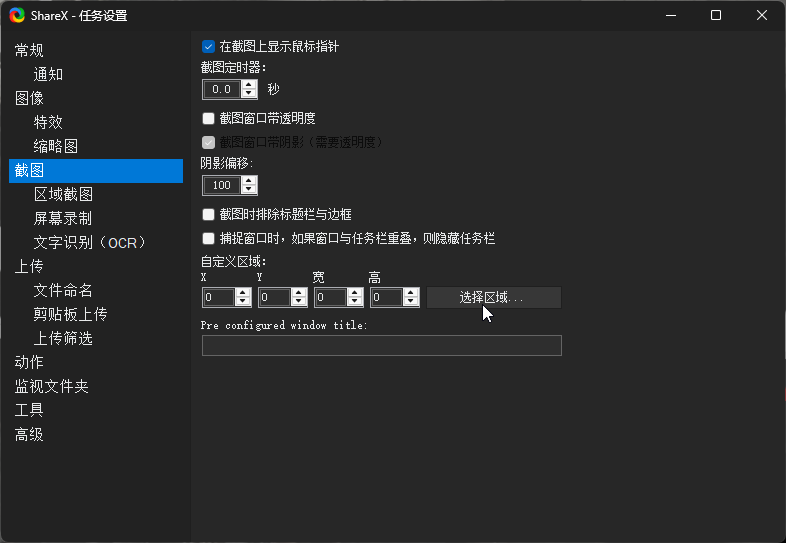

- 20250307
	- ((67ca9fc1-206d-48e8-9589-5706f6dad118))
	- ((67ca9fe4-5b69-43e5-b192-e5bcbeaf8140))
	- ((5d8c74bd-467e-4657-b47b-01f7df7ada6e))
	- ((67cafb68-38d1-44ab-b670-56926dffbef1))

- [[人体]]
	- 跪地护膝

- [[人体象形动作库：互联网时代的百般武艺]]
	- [用墨水告诉你为什么要七步洗手法_哔哩哔哩_bilibili](https://www.bilibili.com/video/BV1nE411w7PU)

- [[信念系统]]
	- 不要瞎比比
		- ((67402b14-8bc7-48bd-b3ff-f298aa74c0ba))
	- ((67a4a6ce-f226-4ea9-8ab5-dbe87269e1dd))

- [[劳动]]
	- {{embed ((67c8f7e5-3d34-4160-91e7-5556fafdb529))}}
	- 质价量
		- ((679adcda-c3b2-416f-97a0-77e32cd475cb))
	- 苯所致白血病
	- 不包括 ((67cafb65-3915-4e05-a6fb-dcaea4ec1945)) 中的对苯二胺
	- [食物链效率_百度百科](https://baike.baidu.com/item/%E9%A3%9F%E7%89%A9%E9%93%BE%E6%95%88%E7%8E%87/22307249)
	- 破产
	- 个人破产
	- [个人可以申请破产，欠债真的不用还了？ - 知乎](https://zhuanlan.zhihu.com/p/75762435)
	- [全国首宗个人破产案：让“诚实而不幸”的人获得新生-中国法院网](https://www.chinacourt.org/article/detail/2022/03/id/6563743.shtml)
		- # “人类不给你破的产，大自然帮你破！来吧！”

- [[卫生卫生]]
	- 手术前洗手
	- 洗手刷
	- 塑料毛刷面被很多人用来梳猫，整体还被加价卖成婴儿感统训练用品

- [[厨具、餐具]]
	- 隔热指套
	- 厨刀
	- 材质碳钢或5Cr不锈钢以上，根据自己食性选择刀型
	- 注意避免重压、敲击、震动撞击等以免刀刃崩口、刀身弯折等
	- 刀鞘（找不到会有一些问题）
	- 防食材粘刀面
	- 切菜不粘刀磁吸条
	- 厨刀种类
	- 片刀
	- 磨刀
	- [【图片】磨刀技巧概要 从入门到精通_磨刀吧_百度贴吧](https://tieba.baidu.com/p/7093259934)
	- [砥石 - 砥石百科](https://whetstone.wiki/index.php?title=%E7%A0%A5%E7%9F%B3)
	- [给自己留个作业视频最后看完成情况 崩口只能荒砥来其他目数真做不来_哔哩哔哩_bilibili](https://www.bilibili.com/video/BV1aT4y1f7jT)
	- （冲孔）漏盆
	- 不锈钢漏盆相对不锈钢网篮可能更适合用钢丝球清洁（可能清洁效率较高、磨损较少，但仍可能残留小段钢丝）
	- 孔更多的沥水更快，大概也更轻
	- 网篮
	- 沥水比漏盆更快
	- （水饺不用漏勺舀，）喷上醋就可以吃了
		- ((679adce8-173d-4479-836b-abdec00658ce))
	- [[厨具、餐具]]沥水
	- [5㎡厨房|自制不占空间的沥水架_哔哩哔哩_bilibili](https://www.bilibili.com/video/BV1hZ4y1m7yP)
	- 干热空气
		- ((65cd7fd5-20a9-403e-b466-9ec2c219eb75))
	- 热风
		- ((679add7f-60d9-4c8a-b844-b3e5a1b07add))
	- 喷油瓶
	- 减油、防粘，一般有预加压和按压两种
	- 与烤盘/蒸盘/砧板按捏住铺在其上的保鲜袋（“塑料”）一角倒饺子
	- 此法根据容器形状，飞溅水花可能较多，注意安全和清洁
		- ((65f30f45-6ba5-434a-8dfe-170f103360a0)) 或类似的不用来捞饺子的工具
	- 盘子接触生食不卫生？或许装饺子后能利于余热消毒灭菌
	- 之后注意观察有没有掉到锅外尤其是锅后的饺子

- [[城会玩]]
	- ((67ca9702-4007-4262-ac74-dac451247f8e))

- [[工伤、职业病]]
	- 跪地（水表井、装修）
		- ((67cb0c55-0c03-4134-b3a0-75a474e24957))

- [[工作有关伤害和疾病]]
	- 白血病
	- 染发剂
	- [长期频繁染发易致白血病，“纯天然”配方也是化学剂_澎湃号·湃客_澎湃新闻-The Paper](https://www.thepaper.cn/newsDetail_forward_1524270)
	- [女子染发3次白细胞降一半 医生：染发或诱发白血病-中新网](https://www.chinanews.com.cn/sh/2015/07-14/7404712.shtml)
	- [科普：有害物质苯是不是会导致白血病_新浪健康_新浪网](https://health.sina.com.cn/news/2014-09-16/1045150504.shtml)
	- [哪4个大众职业最容易得白血病？千万警惕了_染发剂](https://www.sohu.com/a/458881778_120870074)

- [[市场流程]]
	- TODO 人体模型产品目录
	- “全生命周期”
		- ((670d40f0-0a50-4e4e-9685-05cda75398f2))
	- TODO 辅助购物清单软件
	- “宜家是吧？”
	- 不用急于下单，货管够，给消费一点思考时间
		- ((67c156ae-0510-4bcc-9136-03ba68b91fdd))

- [[布设]]
	- 瓦楞纸箱人力跑车
	- “年轻人的第一辆跑车”
	- [【世界上BUG最多的搞笑游戏 每局高达5000个BUG！】 【精准空降到 01:00】](https://www.bilibili.com/video/BV1m4411M7ju/?share_source=copy_web&vd_source=24175964b0df2fcc2c022cae23517fdc&t=60)

- [[心理.org"]]
	- ** [Doobi Doobi Doo (Don't Be Shy) - Cassandra - 单曲 - 网易云音乐](https://music.163.com/song?id=34880251&uct2=U2FsdGVkX18K0wLOCInziAc+6zltkrjRG1Hv9VrjBTQ=)

- [[手机]]
	- 手机语音等唤醒，刷牙、择菜、包饺子时也能看

- [[教育]]
	- 闲着不好
	- >学生通过系统躲避人类所必需的一切劳动，从而获得他那令人羡慕的安逸和清闲，他所得到的只是一种不光彩又无益的安逸，自己也失去了唯一能使空闲时光结出丰硕成果的那种成果。——梭罗《瓦尔登湖》
	- 对部分学生是这样的
	- >教育的目的是让学生们摆脱现实的奴役，而现在的年轻人正意图做着相反的努力，为了适应现实而改变自己。——西塞罗
	- 教的未必是好的
	- [What Did You Learn In School Today?](https://music.163.com/song?id=21432573&userid=77770261)
	- [Teenage Life](https://music.163.com/song?id=1231775&userid=77770261)
	- 试错/“重复发明轮子”的成本
	- 学生有试错空间，但试错也是错，能不错就别错
	- “学术交流”
	- [学 霸 的 讨 论_哔哩哔哩_bilibili](https://www.bilibili.com/video/BV1N44y127zC)
	- 与课堂无关的言语、行为
	- 吵闹
		- ((67cade5c-4904-4a49-9338-7355f74cc29d))
	- 起哄
	- 性相关笑话（“黄色笑话”）
	- [学生开黄色玩笑大家会怎么应对？](https://www.douban.com/group/topic/253013872)
	- [黄色笑话秒懂，我噗的笑了出来](https://www.douban.com/group/topic/220086369/)
	- [2.29%高中生有性行为 黄色笑话对孩子影响最大_新浪教育_新浪网](https://edu.sina.com.cn/zxx/2010-12-09/1114278140.shtml)
	- 家长不要小瞧持续共存的黄色笑话病毒对学生人生的影响
	- 要像游戏里的村民一样给玩家一点核技术震撼
		- ((66c951ff-ddb2-4cf7-9bd8-4d9d5f2db07f))
	- 实际效果：“失去择偶权”
	- “无产者怎么办？”
	- 性相关笑话的不科学之处
	- “坚持不科学=未圣N连”
	- 从黄话到黑话
	- 课外书：《齐泽克的笑话》
	- 有限开禁
	- 藏手机
	- 家人要会藏手机，儿童找到了才能玩，有利于刺激儿童观察世间万物的积极性
		- ((679add7e-2c00-4b54-abd4-b532f34f1a5b))
	- 禁网络
	- 禁外网
	- “小逼崽子背着爸妈上外网串联是吧？！”

- [[无效劳动]]
	- ((675e30d9-1e00-4679-958e-00ff48e30d89))

- [[时间]]
	- 为什么“赶时间”（或“不赶时间”）？或多或少因为你所处的社会环境

- [[游戏]]
	- ((679adca5-9354-42b2-ba4e-f1759a5463ec))
	- 数值类游戏是这样的，玩家明明对数字没有概念，却觉得让它增长很有必要

- [[电路]]
	- [从入门到发射——业余无线电台操作证书与无线电台执照指南 - 查理的自留地](https://www.vachiko.com/archives/amateur_radio_guide_part_one.html)

- [[睡眠]]
	- 7788
	- [最佳睡眠时长竟不是8小时！复旦大学：短睡眠是疾病的“因”，长睡眠是疾病的“果”，睡眠<7小时心脏风险激增！>8小时死亡风险飙升！](https://mp.weixin.qq.com/s/S-Jad5TVreRkxYos3w6g7Q)
	- [我们真需要睡七个小时？一项研究持否定态度 - 纽约时报中文网](https://cn.nytimes.com/lifestyle/20160124/t24sleep/)
	- >一般而言，他们每晚只睡六个半小时，比普通美国人还略少一些。
	- >“西方世界中普遍存在着这么一种担忧，认为我们需要更多的睡眠，而且如果每晚睡不够七个小时，就容易患肥胖症、糖尿病和心脏病，”他说。“可看看（研究中的）这些人，他们的平均睡眠时间比建议的充足睡眠时间少得多，但他们非常健康，既没有患慢性疾病，也不曾失眠。”
	- >西格尔博士说，环境温度可能是一个重要因素。这些人没有在日落时入睡，也没有在日出时醒来，这表明光照暴露对他们的睡眠模式并没有太大的影响。但他们几乎总是在夜晚气温开始下降时入睡，在气温回升时醒来。
	- 这表明，人类或许是在演化中形成了在一天中最冷的时间睡觉的习惯，这可能是一种节能的方式，西格尔博士说。如果夜间气温下降是一个信号，提醒我们的身体入睡的理想时间到了，那么，这说不定就是工业化社会中慢性失眠如此普遍的原因之一。
	- “如今的我们在恒温环境中睡眠，这可是我们的祖先从未经历过的，”西格尔博士说。“在我们的演化过程中，可一直是在夜间气温下降的自然环境中睡觉的。至于能否通过将人置身于可将温度按这一模式调整的环境中来治疗失眠，还有赖于将来的研究。”
	- [最佳睡眠时长竟不是8小时！研究显示：睡眠<7小时，心脏风险激增！>8小时死亡风险大幅增加！晚上10-11点入睡是黄金入睡时段](https://mp.weixin.qq.com/s/czvL-aoUOQyvLmMPjxLjnw)
	- [想睡个好觉？新秘方是睡前4小时进行抗阻运动！BMJ子刊：睡前进行规律的3分钟抗阻运动可以显著延长自由生活睡眠时间、提高睡眠质量](https://mp.weixin.qq.com/s/5edOYfS9xk7MyWbuqWAdDg)
	- 多睡1小时减重
	- [每天多睡1小时可减重20斤？研究发现睡眠时间或为减肥的关键因素](https://mp.weixin.qq.com/s/iOVgyXSsOeX14ubfllWy7w)
	- 补觉2小时以上
	- [假期赖床补觉终于有理由了！两项研究：周末补觉，心血管疾病风险降低70％，抑郁风险减轻19％，但要注意补觉时长](https://mp.weixin.qq.com/s/hwaCcOGrk7OfNRwMhTkAAA)

- [[社会控制]]
	- >人类被同辈压力奴役了多少年，到了所谓互联网时代甚至还在变本加厉，我不禁反思

- [[禁忌]]
	- 身体禁忌
	- 急
		- # 我知道你很急，但是你先别急
	- [[时间]]
	- 内急
	- [吾辈自强，学生吐槽学校的弊端！_哔哩哔哩_bilibili](https://www.bilibili.com/video/BV1bw4m1e7BP)
	- 尿急
	- 憋住
	- 急切高潮
	- “寸止”
	- 急婚、急生、急上学、鸡娃
	- TODO 鸡血（“鸡同急？”）
	- “沉稳”
	- 越急越慢越输
	- 急是有权的表现吗？
		- ((67ad464d-c57b-465a-8ffa-caa273715d9c))
	- 拖鞋声音表示马上赶到？
		- ((67c6b12c-fbd9-438c-94ae-7a729be424ac))
	- 口
	- 屏蔽词
	- >口口口口，口口口口
	- [口口文学是什么梗【梗指南】_哔哩哔哩_bilibili](https://www.bilibili.com/video/BV18R4y1t7b3)
	- [【补档】云社 口口文学 （转载，只为更多人看到以记住）_哔哩哔哩_bilibili](https://www.bilibili.com/video/BV1zW4y1b7D5)
	- [【鲁迅vs罗翔】口个人到底该怎么判？_哔哩哔哩_bilibili](https://www.bilibili.com/video/BV1AB4y1D7Ft)
	- “真理是口不完的！”
		- ((66ade371-e4d0-4dd4-b464-8038134f0017))
	- 口子
	- 奶
	- 屎
	- “为了拉，必须吃”
	- [【爱欲经济学】排泄禁忌的性化路径_哔哩哔哩_bilibili](https://www.bilibili.com/video/BV15N4y1M7q6)
	- 一个洞
		- ((67b3e162-eca8-4996-a243-cb6f1ea07f96))
	- [[卡拉胶]]
	- 通过拉大便（本能顺带）、玩大便（奇技淫巧）和看别人大便（中小学生；二阶/三阶享乐；注目刑/凝视）享乐
	- 哲学其实更多不是男同，而是精屎二元二象禁忌，“do you like 拉大便？”
	- 肛
	- 臀
		- ((64631e88-032c-4f7a-a6e1-dfb805d169cb))
	- 屁
		- ((653dbad9-4f3d-4933-8eb0-82ee30220cda))
	- 撅屁股放屁，放不完的屁
	- [Hava Nagila - The Singing Butts - 单曲 - 网易云音乐](https://music.163.com/song?id=417247638&uct2=U2FsdGVkX1+avXZD/pi9cDgZ1L3PzOAN04EI9M4/E8c=)
	- [为什么是拉屎不是推屎？_哔哩哔哩_bilibili](https://www.bilibili.com/video/BV1wV4y1t75c)
	- [为什么是腹泻不是腹泄？_哔哩哔哩_bilibili](https://www.bilibili.com/video/BV1fF411d7ic)
	- [为什么人类大多不愿意被看见排泄/排遗？ - 知乎](https://www.zhihu.com/question/387081308)
	- [你家猫咪会围观你上厕所吗？ - 知乎](https://www.zhihu.com/question/455840019)
	- [我是男的，喜欢在公共厕所拉屎，喜欢拉屎时候被人看，这是为什么？ - 知乎](https://www.zhihu.com/question/485055789)
		- ((66c7fffa-1ea1-48a4-a401-f23dc2a6953b))
	- 尿
	- 精
		- ((663ad648-3b7d-4a65-aa79-ee3b7b595563))
	- ((657c323f-acb0-4f60-8311-d9b023546879))
	- [[性欲]]
	- [【性的政治学】只有彻底的解放者才有资格获得真正的性解放——拆穿一切性叙事、性识别、性位格，反对男权主义和性多元主义的二极化的性伦理，性解放是政治经济解放的副产品_哔哩哔哩_bilibili](https://www.bilibili.com/video/BV11G4y1x71e)
	- 一阶欲望与二阶欲望（前现代爱情与现代爱情）
	- 一个洞，但还要一根杆
	- 台球、高尔夫？
	- [汉语俗语“吹牛逼”考源_哔哩哔哩_bilibili](https://www.bilibili.com/video/BV1LN411h754)
	- “顾问”
	- [李起帆 - 知乎](https://www.zhihu.com/people/li-qi-fan-96)
	- “精虫上脑”
	- “还精补脑”
	- 释精权（处女情节/崇拜：初夜权）
	- 性教育、泛性消费
	- 消灭“soyboy”
	- 阉割
	- 结扎
	- 阿鲁巴
	- [阿鲁巴（荷兰海外属地）_百度百科](https://baike.baidu.com/item/%E9%98%BF%E9%B2%81%E5%B7%B4/36524)
	- 网络梗表演（唱跳rap、鸡汤来喽等）的替代关系？
	- 促成并旁观的代理人式的性禁忌破除——“破处？破守寡？”
		- ((652e784c-e97a-40e5-b054-3d0e9b28ed97))？
	- “捉人”/“猎头”？
	- 断头台
	- 分数竞争之外的赛道
	- 《美丽新世界》两性幼儿排练性交
	- “扣1佛祖跟你一起笑”
	- [多年前风行全国的阿鲁巴，究竟是怎么发明并流传开的？ - Intro的回答 - 知乎](https://www.zhihu.com/question/67055081/answer/1765743009)
	- >军阀风气熏陶
	- [多年前风行全国的阿鲁巴，究竟是怎么发明并流传开的？ - 阿北的回答 - 知乎](https://www.zhihu.com/question/67055081/answer/1285285535)
	- [多年前风行全国的阿鲁巴，究竟是怎么发明并流传开的？ - 洒洒水的回答 - 知乎](https://www.zhihu.com/question/67055081/answer/1284836107)
	- TODO 兽易小星？
	- [阿鲁巴-中国校园最残忍的游戏_哔哩哔哩_bilibili](https://www.bilibili.com/video/BV1o54y1B7Ga)
	- [如何评价阿鲁巴这种行为？ - 知乎](https://www.zhihu.com/question/21588956)
	- 闹洞房
	- 湿（“好湿好湿”、“大湿兄”；“师”、“屎”？“导湿”）
	- 润
		- ((66ade3ab-f02d-4242-8475-da18e70de1cf))
	- [[疾病]]
		- ((679adce4-7daa-4cee-abca-dd4512f79547))
	- 政治禁忌
		- # 让叔叔、教官上课！
	- [[历史]]

- [[素材]]
	- >What's the lie? What's the truth? What to believe?
	- >学习鲁迅，永远进击
	- [“吔屎啦，梁非凡”非凡哥原版片段_哔哩哔哩_bilibili](https://www.bilibili.com/video/BV1ix411c7mk)

- [[编程]]
	- “你们啊！你们，我感觉你们猿界还要学习一个，你们非常熟悉西方这一套的value,你们毕竟还too young！”

- [[莫失莫忘]]
	- ((679add7d-9572-492a-95e4-c8cbf0b34649))

- [[菜谱]]
	- 经常吃饺子爱蘸醋的朋友都知道，为了给饺子覆盖率较高地蘸上醋，首先醋池要足够大和深，饭碗一般是够的，在里面给饺子翻个面就差不多了，但加醋量在一些节俭的朋友看来多少有点铺张浪费，而水饺表面或多或少有水残留，几个水饺进过醋碗，醋（尤其是那种浓度较低的袋装醋）就被稀释得很不得劲了（当然也有很多口味不咸不淡的朋友并不在乎这一点；当然，如果先在漏勺上颠颠，再合理控距，等待饺子不烫的同时蒸发一部分水，那么稀释程度可以不高），（剩下不少没蘸走的醋直接就倒了，）（最后还要洗几个碗，）有什么办法解决这些不称意的问题吗？

- [[词联]]
	- ((679add89-d481-4a0f-9053-e31bcb1fe7b0))
	- >内卷是果不是因吧？

- [[软件]]
	- [sharex设置截图水印 – 玖伴一鹏](https://www.jiubanyipeng.com/1301.html)
	- 延时截屏（比如看有些不让下载、带保密措施的 ((67402ab0-6f4f-4f5d-a7c6-52aafddba9f1)) 时）
		- ((676bbcec-255b-40b4-9865-5eedb054b3d3))
	- 
	- https://files.catbox.moe/ray5bx.png
	- [截图自动添加水印 - 知乎](https://zhuanlan.zhihu.com/p/457772044)
	- [FastStone Capture 11.0中文破解绿色便携版 - 423Down](https://www.423down.com/660.html)
	- Pixpin
		- ((67ca3cf0-5bc7-4697-a590-79004aad5dec))
	- ((67c6e90a-d68e-43a8-b4a6-bb5c70c4319b))

- [[速成发明家]]
	- 有时——可能确实是“第一名”，甚至“天不生老子，万古如长夜”对吧？以下为可能的原因（“主要是低效分工”）
	- 很多家庭的家庭成员各有各的分工侧重，至少以前主要是妻子做家务，尤其是饮食家务，妻子很可能因为职业上也有差异，不一定操作更多工具、机器，在家务中用来用去就是这么多工具乃至方法（“菜谱”），相对缺少想到新办法的经验材料——而很多丈夫因为下班时间晚正好没看到妻子做饭、累了躺先、“君子远庖厨”、夫妻生活不和谐等因素不太管妻子的家务，要关注也主要关注结果而非过程，明天还要上班，周末要看电视、钓鱼、打牌，等等——因此，如果他是“工人”，他也不一定把自己了解的工具、机器等的知识迁移到妻子日常使用的[[厨具、餐具]]上来

- [[饺子]]
	- ---
	- TODO 不挤汁薄皮健康水饺
	- 更均衡（宏量营养素比例）健康
	- 吸水食材
		- ((679adce7-6fb7-4706-bc2c-63824e113ca9))