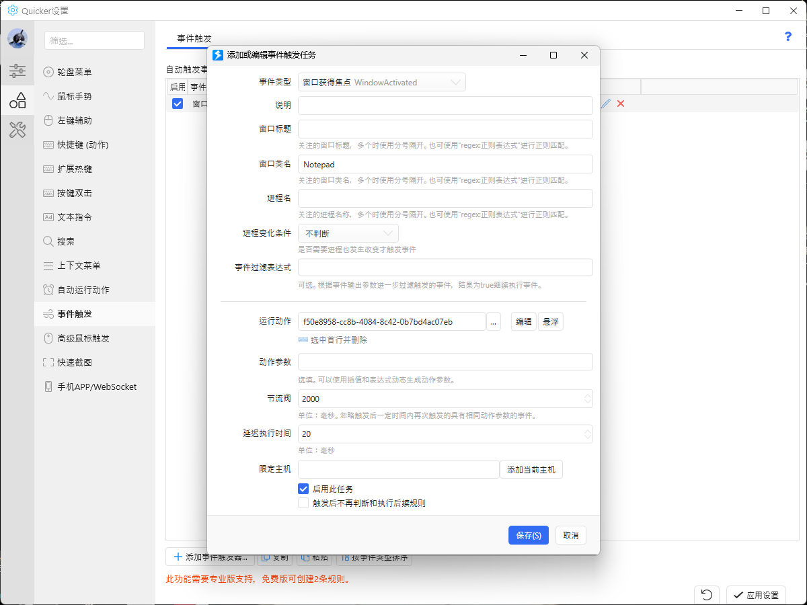
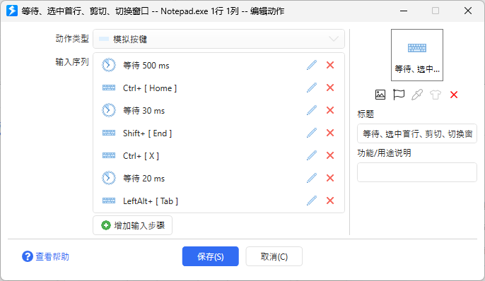

- 20250226
	- ((67bf0680-cb98-4a03-afce-763a533ca4da))
	- [[滴酒不沾套件]]
		- ((67be5860-2e2c-4420-ac70-573fdaae697d))
	- ((679adce6-e4ee-4636-b437-8b5826cecf0c))
	- ((67be8a42-b568-4c2e-aa45-0227856ec772))

- [[AI]]
	- # “祝家人们做人不缺AI，做AI不缺人！”
	- >I call it Alibaba Intelligence
	- [马斯克公开取笑马云，用成就回应当初质疑，思维视野不在一个维度_哔哩哔哩_bilibili](https://www.bilibili.com/video/BV1ka4y1k7oo)
	- “你对此有何观点呢？快来评论区告诉小编吧！”
		- ((679adda6-6fae-47f5-af40-5bef888b36de))
	- ((679addab-9cd2-4424-b773-a36af951a423))
	- [马斯克:被问到AI时代给孩子的建议，马斯克思考了26秒说_哔哩哔哩_bilibili](https://www.bilibili.com/video/BV1sN41167dg)
	- {{embed ((677a958b-570c-4dfc-9a40-6c40a1a37075))}}
	- 数据注入、污染
	- ai模型污染失控机仆（？）

- [[Crying Suns]]
	- # 有剧透，爱玩直接玩！

- [[I人亿面]]
	- “你的ai是本地部署的吗？”
	- 按季度提醒，更新（情感状况等）
	- 解密用公钥
	- 塞大文件
	- “赛博鸽子，塞爆！”
	- 查看不触发病毒
	- 隔离沙箱、虚拟机
	- 谁可以上传、编辑
	- 编辑器输入输出才有效，编辑器密钥
	- 限制上传大小
	- 不可执行
	- 不可连带一起执行
	- 如果不上传
	- 禁止上传，只是帮助你测试，不会留痕，不信把链接下载，工具会分成两个文件，可以拼起来
	- ---
	- 阅读器
	- 过滤超大小容器、特殊字符等，放那没用
	- 自动打开链接
	- 识别链接自动呈现
	- 快速切换线上聊天窗口
	- 线上旁观、支招、直播
	- “骗子也是用来刷经验的”
	- 有确认安全的人陪伴
	- 不去商业性场所
	- 求助功能
	- 脱产就是扩大再生产
	- 骗人来集体活动
	- 剧本杀
	- 对标签的信赖感

- [[《路是这样的》]]
	- “ ((679add3f-c11b-4039-b53b-f0003eca44ec)) 是智慧造成的吗？”

- [[交通]]
	- 现实的统一场论
	- 大楼饼干内存

- [[交通安全]]
	- 盲区，以色列格斗术，太极拳
	- 人对危险/风险的识别、注意力或许也可呈现为正态分布

- [[人]]
	- ((67beae39-d50f-4027-85f5-a9ecd76c8273))
	- ((67bf17db-7c83-4e9e-afda-bbf1c098ebad))
	- ((67bf1694-5261-4bc1-b0a0-73312d41b7fe))

- [[人体]]
	- 不适哥们儿
	- 健康记录，对比
	- “满血”
	- [[口罩]]
	- 鼻梁条
	- “骨固鼓~”
	- 囊肿
	- “正常的性欲被人说成性压抑，真是搞笑”
	- [[晨勃]]
	- 蹲厕上层建筑（防便后冲洗时飞溅等）
	- 马桶脚凳
		- ((67bf252b-b1e7-4918-a44b-86c62d7466fd))
	- 警惕马桶势力
	- 常见体态问题图，旅行者二号
		- ((67be7c27-9885-49e8-b989-062088cb3216))
	- 现代人不要瞎作，该认命认命
	- 定期照镜子、拍照
		- ((67be86b4-71e9-40f0-95e0-bd1148023882))
	- [Cognitive Activity and Onset Age of Incident Alzheimer Disease Dementia - PMC](https://pmc.ncbi.nlm.nih.gov/articles/PMC8408511/)
	- 颞下颌关节与口腔拔智齿的冲突
	- 颞下颌关节紊乱
	- 啃排骨等硬物的关节可能急性
	- 弹响
	- 习惯弹响可能会忽略
	- 双侧咀嚼
	- 注意双侧咀嚼，两边都嚼到哦，一开始慢点，形成“肌肉记忆”自然会变快

- [[人格.org"]]
	- * “ ((679adda6-d8be-45e9-9758-43277d1c8b68)) ？”

- [[人物面板]]
	- 更丰富的选项
	- 管理能力低下的企业才需要限制选项
	- 教程，公告等
		- ((674bf371-e51e-4922-9dad-aee42bdd800d))
	- 注意避免涉密
	- 你还设置了隐藏
	- 与常见字段错开，身边人可能很难从地址出发（还可以不填地址，“多捞哦”）认出来
	- 马斯克禁止上传实时位置
	- 发的定位位置不含较精确的地址
	- 绝对值与相对值
	- 状态设置
	- 你体验到的世界在多大程度上是可接受的
	- （危机）生存能力
		- ((67bebff4-759e-44f0-a8e8-490e474b2d95))
	- ((670d40c8-f2c4-4525-8dda-e040946f50af))
	- 哪些领域大神？有哪些想法
		- ((679adda9-02b0-449b-9854-f3b455d3ff9f))
	- [明尼苏达多项人格测验_百度百科](https://baike.baidu.com/item/%E6%98%8E%E5%B0%BC%E8%8B%8F%E8%BE%BE%E5%A4%9A%E9%A1%B9%E4%BA%BA%E6%A0%BC%E6%B5%8B%E9%AA%8C/7059267)
	- 测试来源（mbti最多填三个）

- [[信念系统]]
	- ((679add61-8b6d-4a52-b65c-3837a22b43f5))
	- 锚定效应，老办法，选一种别的不看了
	- 预期差
	- 家人感觉不到大概率不当回事
	- 他们会说没事没问题的

- [[劳动]]
	- [糖域模型 - 集智百科 - 复杂系统|人工智能|复杂科学|复杂网络|自组织](https://wiki.swarma.org/index.php/%E7%B3%96%E5%9F%9F%E6%A8%A1%E5%9E%8B)
		- ((67bec13c-e9bf-4c93-9de7-5ef135e9a8cb))
	- “挣得越多，价格越高”
	- [贝雷桥_百度百科](https://baike.baidu.com/item/%E8%B4%9D%E9%9B%B7%E6%A1%A5/6553820)
	- 意外险，医疗保险，受益人可以改？
	- “为什么只能卖歌不能卖片？”
	- 你敢长多丑？
	- 种植基质布设
	- 防盗
	- 标语

- [[卫生卫生]]
	- 低效保就业，高效保进步
	- 运动模式、样态
	- 自荐邮件

- [[厨具、餐具]]
	- 钢丝球（尺寸或重量随意；丝瓜络亦可）
	- 钢丝球掉丝
	- 洗洁精/母料
	- TODO 洗洁精瓶（喷雾）
	- TODO 隔脏把（手或手套接触肉、蛋清后？）
	- “我是否在查找：抹布、厨房纸？”
		- ((66039d24-5849-444b-9a2f-7e42bbc289dd))
	- 为什么是小饭碗+合餐大菜盘/碗，而非分餐大饭菜碗？
	- 分类垃圾桶
	- 多个垃圾桶人工分类
		- ((668ce780-d5d0-4885-96f0-2585a49a2e83)) 分类垃圾桶
	- [自动识别四分类垃圾桶_哔哩哔哩_bilibili](https://www.bilibili.com/video/BV15L4y1V71x)

- [[取证、反取证]]
	- 原始载体不能坏

- [[可能暂时不用的旧菜谱]]
	- TODO “Open Sauce”
	- ---
		- ((67a5d975-a3f2-406f-8964-0f061736892a))

- [[地球]]
	- 地球为什么值得人类探索
	- [地球娘 - 萌娘百科 万物皆可萌的百科全书](https://zh.moegirl.org.cn/%E5%9C%B0%E7%90%83%E5%A8%98)

- [[垃圾袋]]
	- 动物油脂塑料袋复用

- [[城会玩]]
	- 媒体，cherry pick，水弹枪打穿纸，青少年保护，然后一起刷短视频成废物

- [[小区]]
	- 双号可能相邻联排
	- 农村
	- 农村布局
	- 农村找房子，送货，推车滑行，滑板车载水
	- 走来走去吗
	- 导航，政务地图对村庄定位更精确吗
	- 单元门
	- 缝隙开隔栅单元门，弯棍
	- 门禁密码撞库
	- 丰富的地图标注，房价等，上市公司，单元门样式

- [[工作有关伤害和疾病]]
	- 工伤、职业病因素占比
	- 非“生活习惯”占比

- [[市场流程]]
	- 市场调查，筛选合作方，消费者教育，awareness
		- ((67bed219-2f77-4995-9c35-9ec43e3b69ac))
	- ((67bed681-e8d2-4598-8f94-5cff7050814a))
	- “最赋能量的一集”

- [[布设]]
	- 抱箍（方的）
		- ((67b33c03-5508-442d-bbd0-d88ff7bbaad1))
	- 粗绳工业演示（？）
		- ((67bf134a-a0ca-404d-8b74-e210a5cace58))
	- ((679adce7-329c-4827-b2bc-2db304d24762))
	- 墙钉、线卡
	- 地面托垫（？）
	- ---
	- 反手结
	- 肥牛卷
	- 金针菇

- [[应试]]
	- 考察的能力范围是有限的
		- ((67bebc3a-acd3-4b92-9a0e-e78fcf36ac85))

- [[急救]]
	- 摄像头能隔着救生毯看清人物吗？

- [[性骚扰]]
	- 预防性骚扰公约、协议
	- “明确、简洁的权限”（抱、摸等）

- [[情报、反情报]]
	- “我为什么不把这些东西都分个类啊？并非无限”
		- ((67b96652-d93d-4d97-ae7b-31b21e2d1767))
	- 关闭拼小圈等购买信息分享
	- “截屏拍照及分享注意点”
	- 收货也可以注意点，讲究的话

- [[手机]]
	- {{embed ((67bf0e6c-ab61-4858-b518-0337a4c936a2))}}

- [[教育]]
	- 教育走流程时间长
	- 文理偏差，出题者不是神（？）
	- Ad Astra/Astra Nova
	- >所以中国教育界一定要有我们自己的马斯克！
	- “经典真有”
	- [马斯克悄然退出Ad Astra学校管理，“追逐星辰”教学模式仍受热捧_腾讯新闻](https://news.qq.com/rain/a/20210125A0AA2Z00)
	- [在马斯克创办的学校读书，颠覆了12岁中国女孩的认知_腾讯新闻](https://news.qq.com/rain/a/20241002A0143800)
	- TODO [七堂危险课：我们是怎样让孩子失去学习热情的_封面在线阅读-QQ阅读](https://book.qq.com/book-read/51274554/)
	- [马斯克2025年新事项：私立学校将正式开课_腾讯新闻](https://news.qq.com/rain/a/20250105A05V7M00)
	- 密涅瓦大学
	- [全美录取率最低的真‧世界大学——Minerva ](https://www.sohu.com/a/423317910_616468)
		- ((67a3f451-f6ce-41a6-89b5-be510b1f0aed))
	- [Barefoot College InternationalBarefoot College International](https://www.barefootcollege.org/)
	- [一所文盲学校,何以改变世界](https://www.sohu.com/a/202012753_227820)
	- [赤脚大学：让祖母成为工程师](https://www.douban.com/note/259848913/?_i=9465056SPSFC4P)
		- ((679adce6-18da-4251-8f38-bbc5f03a56ca))
	- “家长选择套件”
	- “学生也可以选”
		- ((679adcc6-cb0d-4961-b66a-cff177900275))
	- 分段教学校不教的（“无法被判定”）

- [[更多材料]]
	- 金属奶粉罐
	- 金属饼干盒（“丹麦皇冠”）

- [[游戏]]
	- shapez
	- [shapez Demo - Factory Automation Game](https://shapez.io/)
		- ((6301e006-4cca-4261-820f-520826172bbc))
	- 曾有与mindustry的捆绑包
	- “脑力训练”游戏（？）的字母组合传送带（是看逆风笑之类的up玩的还是自己玩的？）
	- drill down
	- [drill down实况+教程_实况](https://www.bilibili.com/video/BV1jm4y1J7L7) /t
		- ((67b093fa-af25-4b81-9968-91f0b063b54c))
	- ((67b531c8-9318-416b-9deb-bafe430aa734)) （相比流水线更看不到“过程”——“什么东西过去了？噢是我幻视啊，那没事了”）
	- [[CDDA]]（“ ((679adda6-a918-4fc1-8fc8-20880d48acbd)) 比较多”）
	- [有哪些玩的是游戏其实是在学习知识的精品游戏？ - 知乎](https://www.zhihu.com/question/283364132)
		- ((67a2ab84-f838-4b78-8deb-31f83d13da06))
	- 游戏agent操作对现实社交模式的影响
	- [地球Online - 萌娘百科 万物皆可萌的百科全书](https://zh.moegirl.org.cn/%E5%9C%B0%E7%90%83Online)

- [[烤红薯]]
	- 快速剥皮
		- ((66039d24-5849-444b-9a2f-7e42bbc289dd))
	- ((677de833-3921-4d03-bd61-e02f1dddd988))

- [[电路]]
	- 无线电探测
	- 机器车
	- [超燃，来看看老外的机器人大战。还有魔法攻击_哔哩哔哩_bilibili](https://www.bilibili.com/video/BV1ot411s7hZ)
		- ((63024c57-8b0f-497d-a0e9-ae77ed2cf1e5)) （后面的关卡有）
	- ((67be8813-7fb2-4054-8184-ef1efdf4da65))

- [[目录]]
	- ((679add39-a61e-4002-ae99-baecb3753011))

- [[直播]]
	- ((67ad5f56-f000-467c-b9c8-d14c3d451f91))
	- 在拼多多听到了剪了音频的，中心冲，“不要两百三百”，但是最后“一双袜子的钱带回家”莫名又合理了，虽说连起来这降幅也不算太小

- [[相亲.org"]]
	- ** 门当户对，到底是什么门、当、户、对？
	- ** 为什么门当互对会被默认为更有优势？

- [[睡眠]]
	- ((679b8144-996e-46d0-8a2e-cca67dfa653b))
	- 进被窝狂喜傻乐蠕动

- [[硬件]]
	- [模板:硬件娘化 - 萌娘百科 万物皆可萌的百科全书](https://zh.moegirl.org.cn/Template:%E7%A1%AC%E4%BB%B6%E5%A8%98%E5%8C%96)
	- TODO [[AI]]用户条款分析
		- ((67be58bd-b5eb-45b7-b7bf-3c3b568eb674))

- [[禁忌]]
	- 湿（“好湿好湿”、“大湿兄”；“师”、“屎”？“导湿”）

- [[简单再生餐]]
	- 塑料、温室、反季节蔬菜、冰箱都是现代产物，“小菜儿”要通过腌制、发酵等工艺延长保质期，通常不是现做的，不能多人边吃边从原容器取或大块菜上切取，控制不好量，干脆用一个盘子装，而在 ((678b048e-5905-473f-b4b8-26b0c14a7cea)) 层面，多吃少吃可能没有多装少装“问题严重”
	- 面条费时，要大碗和猪油（？）
	- 馒头手抓

- [[编程]]
	- ((678cad97-d2e6-4dd7-b4c4-34b28dd2b276))
	- ((67b192bf-c765-4376-b7aa-1ceedcea6dd5))
	- 代码形态，长条，纺织品（？）
	- 瀑布破布
		- ((679adca5-2dbe-4df3-ab03-4c7c01631a8a))

- [[网络套件]]
	- ((67bf0680-cb98-4a03-afce-763a533ca4da))
	- ((679addab-9cd2-4424-b773-a36af951a423))
	- 在线时间
	- 芯片对应单位（保安、保洁、白领等），设计
		- ((67be5860-2e2c-4420-ac70-573fdaae697d))
	- ((678a4e03-a7df-459a-b71f-d61905f5de45))
	- ((67b8240e-62cf-46f8-8c69-647bb8633b20))
	- {{embed ((67792219-4a7a-4052-8a97-f824440854bd))}}
	- 敏感词系统，上传提醒，ai辅助填表
	- 数据公司
		- ((679adda9-679b-436a-95a8-1137b69db664))
	- 兴趣爱好，频率，主观偏好，用户生成标签调用，点击添加或去除标签并选择保留点击来源用户
	- 资料
	- 超大班共学
	- 救世图
	- 产品图
	- 承压顺序
	- 本地化
	- [[地外文明]]

- [[节日]]
	- 更多生日
	- “想帮全天下苦命人过生日”

- [[范式]]
	- 社会知识，常识，公共知识
	- 正义源于嫉妒（？）——休谟《道德原则研究》

- [[衣物]]
	- 纱窗网孔
	- 大开口容器（如脏衣篮、洗衣盆、大花盆、阳台水槽）上架 ((678b04b8-568e-4d03-952a-065991a379dc)) 、冰柜置物筐，可以晾袜子、小内裤等，可用 ((679cc9b6-b785-4ead-ba8f-b917b0dbfbc8)) 等固定
	- 晾晒架（竖直的）
	- 晾晒网（水平的）
	- “凑合用下”
	- 大开口容器（如脏衣篮、洗衣盆、大花盆）上架 ((678b04b8-568e-4d03-952a-065991a379dc)) 、冰柜置物筐

- [[记忆]]
	- 校验和搜索文件
	- 时间戳
		- ((67bd3832-5150-4963-98b6-f7bbafb0c1ac))
	- 相近时间
	- TODO ((65bcac14-f887-4224-92e2-1d16751f358d)) 分析
		- ((67bd7536-9864-42a2-9d52-8de53847f322)) 收费

- [[词联]]
	- ((679add4e-6c8a-4e4f-aed7-1546a2f1c750))
	- ((63024c57-8b0f-497d-a0e9-ae77ed2cf1e5))
	- dna双螺旋、自然选择造成的（？）
	- 黑镜
	- “镜外势力”
	- 马克思马尔萨斯马克沁马云马保国马加爵马林
	- 马里奥
	- 差
		- ((67be8813-7fb2-4054-8184-ef1efdf4da65))
	- ((679adcc9-e877-42a3-bad9-1c670efee8bb))

- [[赤足跑]]
	- 感受哪个关节更有感觉，就是它代偿

- [[超限运输]]
	- ((678a4dd7-30be-4d7c-95e3-4b7bc42654af))
	- ((679adda7-f689-4d73-a5c2-a3768f472960))

- [[软件]]
	- 做事状态，流程滑动比例（？）
	- 别让工作打断打消你的碎片想法
	- TODO [[AI]]不改原文整理
	- 可能是相同主题的碎片笔记写了几十上百行，（要整理时）不想自己慢慢整理、分类（像logseq还有缩进），又怕AI乱整理，怎么办？可能提示词就能解决（
	- ---
	- [某品牌手机输入法明文上传隐私！官方:承认+发补丁_哔哩哔哩_bilibili](https://www.bilibili.com/video/BV1KK4y1B7Nr)
	- 输入法主题
	- [半夜睡不着做了个成步堂输入法_哔哩哔哩bilibili](https://www.bilibili.com/video/BV1Pz421o7fz)
	- [企鹅输入法跌死，夜鹭死苦_哔哩哔哩_bilibili](https://www.bilibili.com/video/BV17x421y7Kv)
	- [【珠颈斑鸠】搜狗输入法皮肤_哔哩哔哩_bilibili](https://www.bilibili.com/video/BV15h4y1K7Tx)
		- ((679adca5-2dbe-4df3-ab03-4c7c01631a8a))
	- [爬虫神器，一分钟一个爬虫_哔哩哔哩_bilibili](https://www.bilibili.com/video/BV1ES421d7xh)
	- 碎片笔记/易逝笔记/闪念笔记/临时笔记（Fleeting notes）
	- 整理到大致位置就行，相同相近关键词的多个位置之一即可，甚至不用完全理解，赶时间的话
		- ((67ba9479-bdcf-49d8-bdf0-e5964f4c825a))

- [[这才是中国]]
	- 不做魔法师
	- >不用魔法也能摆好餐具

- [[速成发明家]]
	- 很多讲究投机取巧的人可能实际上也太“老实”太“路径依赖”、“爱走流程”而想象力不足了（这样的人更可能说什么“想象空间不足”），这并不是说他们不成功，也不是说他们不够聪明，要圆滑老套地说就是“隔行如隔山”、“求仁得仁”，他们追求的就不是发明各种“稀奇古怪”的玩意，而是按他们认为“可靠”（很大程度上，确实，比如相对稳定的竞争体系由大致很稳定的人构成，关键之一就是搞定“人际关系”，而且发明家也难以例外）的方式搞货币搞情人搞权力
		- ((67bc6ccf-19c1-46cf-a452-fbe4ef27ba8b))
	- “没钱了才研发来钱的战争机器”
	- “失业是一种福报，是资本主义的自我反思”
	- “市场是可以负和博弈的”
	- 了解
	- 风向仪
	- 记录
		- ((66335bea-e054-49b0-89cc-3d88d3d2f697))
	- 想法按需描述下防忘
	- 如何显得聪明，多学，乱学（“ta可不是乱学的嗷”）
	- 专注的傻瓜
	- [[电路]]

- [[酒]]
	- [[滴酒不沾套件]]

- [[醉酒者背负带]]
	- 可能一个背负带还不太全，考虑到背人者的身体状况和可能的多人搬运时的重量分配、衣物滑动等的影响，可能还需要[[个人运输系统]]中的装备

- [[音乐]]
	- Euro House
	- [Superhero - Daze_哔哩哔哩_bilibili](https://www.bilibili.com/video/BV1hJ411W7tm)
	- Hardcore（硬核）
	- [Dogfight](http://music.163.com/song?id=445144302)
	- Eurodance
	- [从荷东到电音,中国DJ不平凡的渴望](https://zhuanlan.zhihu.com/p/338949474)
	- Italo Dance
	- [Sei giа Mia (Italo Dance Style)](http://music.163.com/song?id=26266059&userid=77770261)
	- Acid
	- [ACID - Hardwell/Maddix/Luciana - 单曲 - 网易云音乐](https://music.163.com/song?id=2040987987&uct2=U2FsdGVkX1/wUB0flj2pzLeBEGeFCTR4InJTCYA9phc=)
	- Hardbass
	- [【Alan Aztec】Gopnik Gonna Getcha (feat. TeslasMoustache)](https://www.bilibili.com/video/BV12T4y1L76t)

- [[魔怔人心态构件大品评]]
	- 万法由心造，而不是所谓外界
	- 为什么要多个中介？
	- 感到恐惧一定要强行归因为自己的因素，自己太危险了，享受这种恐惧感吧！

- [[魔怔英语学爆班]]
	- ark shark share shape shake cake
	- sha
		- ((679adda9-1448-43d4-be5f-24c0d40f7fd8))
	- ditch teach peach each
		- ((67b3fbbc-44d5-441e-a2a9-e73bf0f5efec))

- [[齐泽克]]
	- 包容不完美，带点痣带点肥肉

- [[diffs/最近一天的新增]]
	- 20250225
		- ((67bdcbe7-b315-4d56-8bdf-3f11dd42d31f))
	- ((67bd8503-1175-4f02-95d0-7811135a0709))
	- ((67bda4a9-9e93-4180-8f38-e537cf2ba00e))
	- ((67bd7ab2-fc9d-4ccc-9fb3-7622ee826770))
	- ((67bd16a1-5371-4550-9783-74d6307d2d43))
	- ((67bd0ea2-ab3a-43f6-a00e-bfe76987c3a9))
	- [[I人亿面]]
	- 同是天涯沦落人，相逢何必曾相识
	- 誰でもいい
	- 好像是以前玩的一个日本解谜游戏里的台词
	- p2p视频聊天室
		- ((67b97802-e3a3-498d-a46c-41cbd5617e98))
	- [【私藏馆】朴树《平凡之路》经典神作！我曾经跨过山和大海_哔哩哔哩_bilibili](https://www.bilibili.com/video/BV1bo4y1A7S9)
	- 模拟欺诈配对游戏
	- 文字游戏（列车号，时间，复杂规划），街道，scratch
	- 启发式
	- 《那些古怪又让人忧心的问题》合集一的第二条就是“随机伴侣”，作者的思路比较“机械”，靠肉眼在类似靠得较近的对向的地铁站里的水平扶梯或机场的取行李旋转传送带上“一口气”、“不眨眼”看下去（当然作者后面说可以用网络摄像头）——我看的简中版原版是2014年——“与时俱进”吧，快来尝尝互联网思维大算的厉害！
	- [[交谈.org"]]
	- :PROPERTIES:
	- :id: 67a4a0cc-bec9-42ee-9134-3f96e81788d6
	- :END:
	- [[交通]]
	- ---
	- （常规）线下是扩面、保证传达
	- [[人物面板]]
	- 非实时信息
		- ((67a4a0cc-bec9-42ee-9134-3f96e81788d6))
	- 态度、倾向
	- 喜欢中立讨厌
	- 黑白名单，网络、物理
	- 过去现在未来
	- 知识结构、知识库（人体、环境）
	- 配音
	- 照片
	- 在种类较少的情况下难以呈现较动态全面的人
	- 诚信度
	- 姓名
	- 推测其他
	- “type type”
		- ((6697781d-d2e1-422a-ab2f-d8dbddbd433b))
	- ((67b6b008-40c4-496f-b1a2-9187a353aef7))
	- [[伤害]]
	- 防撞包角
	- [广东惠州。玻璃门擦得太干净，连续两个外卖小哥一头撞玻璃门上，“幸亏带了头盔”。#万万没想到 #意不意外 #监控下的一幕_哔哩哔哩_bilibili](https://www.bilibili.com/video/BV1NM4m117YW)
	- [[信念系统]]
		- ((67bdc9c7-2f1a-448b-b2aa-7e30b4d80c69))
	- [[分级诊疗]]
	- 别跑错院区
	- 陪护可能两个人但病房最多一张躺椅，其他人可能躺地板，应该带睡垫或睡袋
	- [[厨具、餐具]]
		- ((679adce8-5ff4-4da2-9ec4-1f3d0e72450c))
	- “不清洁，多戴一层薄纱手套吸汗”
	- 山药抓握手悬空（比如架在水槽边）水平刨
		- ((678b0493-181b-4eeb-929a-2d697cce1e1b)) 边
	- ((678b0493-181b-4eeb-929a-2d697cce1e1b)) 边
	- [[发明家]]
	- [I Have Gotten a Lot of Results! I Know Several Thousand Things That Won’t Work – Quote Investigator®](https://quoteinvestigator.com/2012/07/31/edison-lot-results)
		- ((67bd70b7-b2b9-437a-b48a-0f88d2d1e351))
	- [[发明方向]]
	- “省的时间就是多活的时间，省时就是延年益寿”
		- ((67ab494f-ff79-481e-92a3-b1a91dad54f0))
	- [[工伤、职业病]]
		- ((67abdeb5-1e51-4a68-81a1-2abaa3493307))
	- 性歧视
		- ((67bd5549-f3a0-485f-bf19-2f0a709c6439))
	- [[市场流程]]
		- ((67b2aca6-bc71-4376-a39e-9afcb47fbf4c))
	- ((679b8086-a925-4f11-a5fa-277f1d71f8e1))
	- 电子信息、软件或许接近即时生产，但还有其他很多东西并非如此
	- [[情报、反情报]]
		- ((67402aca-1885-49b1-8769-04078278203f))
	- “未明子玩游戏发摩尔斯电码”
	- [[教育]]
	- 生活实用、应试表现
	- ---
		- ((a1b6f169-b783-4409-a01b-160ef9bad161))
	- 初中
	- 科目
	- 道德与法治（“道法”）
	- [真的不愿再批阅初中道法卷纸了，认真看看题目有这么难吗！！？_哔哩哔哩_bilibili](https://www.bilibili.com/video/BV1kL4y1b7ht)
	- ---
	- 代课教师
	- 代课教师地位
	- [[编程]]
	- 当你好像知道了速通窍门belike
		- ((679adca2-cdca-48a2-9dde-e6f959c0c77c))
	- 先打开新项目或文件夹再对话，不然可能至少AI对话记录会丢
	- 一开始用开始Pro版两周试用，想在免费时最大化产出可以提前准备下或多揽活或共用账号（设备限制？）
	- Android Studio（最主要的打包安卓app的方式）
	- [下载 Android Studio 和应用工具 - Android 开发者  |  Android Developers](https://developer.android.com/studio?hl=zh-cn)
	- 问题
	- 127代理
	- build app bundle灰色
	- 一开始用开始Pro版两周试用，想在免费时最大化产出可以提前准备下
	- [[网络]]
	- 能看小红书的一定有点朋友（？）
	- 人际关系网——认人——“你认识吗？”
	- 识别关注及状态，批量上传
	- 同步文件夹
	- Resilio Sync
		- ((678b04bb-7327-4260-bf60-7eceab7daeb5))
	- 协作收费
	- 去中心化、发布前即可在一定程度上限制传播，缺点可能有不自带文本更改逐行对比功能
	- 社交、key（第一轮分享可审批、链接使用次数、时限）、接受者用户名等环节进行相对可靠的控制
	- 同步文件夹（可能）也可以套娃、再中心化
	- 通过修改设备名（可以挺长的）大概还可以聊天（ “ 买 椟 还 珠 ” ）
	- TODO ((66db8ac4-d558-458d-9528-499eb66f69ee)) 修改动作
	- TODO ((65b9026f-4926-4b98-8bf3-527ab6805361))
	- TODO 多人的库共存时如何避免同名文件共存造成麻烦？
	- ---
	- [去中心化网盘 Resilio Sync 介绍及其使用 - 知乎](https://zhuanlan.zhihu.com/p/556523750)
	- [Resilio Sync资源汇总 - 知乎](https://zhuanlan.zhihu.com/p/569224349)
	- [Resilio Sync | 全平台多设备文件同步/传输终极产品 - 知乎](https://zhuanlan.zhihu.com/p/459403503)
	- [【Resilio sync】完美实现全平台文件同步方案_哔哩哔哩_bilibili](https://www.bilibili.com/video/BV1ed4y1c7ZT)
	- [Resilio Sync 的同步机制 - ConorBlog - 博客园](https://www.cnblogs.com/conorblog/p/15587802.html)
	- [Logseq 的跨平台同步方案：如何在 Mac、Windows、Linux 和 iPhone 上保持笔记一致](https://www.jungley.net/logseq-cross-platform-sync-solution/)
	- [[最近一天的新增]]
	- [[20250224]]
	- 用 ((67b9e245-97b0-438f-b66d-82d503fa5449)) 跟 ((67ba7a7a-07bd-4c85-bac5-cdd2e1f5be66)) 拉扯的，先在本地造，还有很大完善空间，在缩进（logseq里外也复制粘贴导出过了，空格还是制表符也问过了）、转移换行的大段内容的处理、增删内容的标注符号、更改内容的增删转来源标注等上拉扯大聪明几小时有点不太值了，读者大概也最多只能量子波动速读、疯狂地联想这个样子
	- “我感觉你懂了我的insight，也好像找到了solution，但你没有给到我想要的你展示许诺的结果”
	- 
	- [[20250225]]
		- ((67bd1ddc-66ef-48ab-a372-21acc028709b))
	- 多级缩进，同标题更改内容合并，大概消除过多缩进
	- ---
	- ---
	- 线上版
	- [Commits · khtazmt/khtazmt.github.io · GitHub](https://github.com/khtazmt/khtazmt.github.io/commits/main/)
	- [[网络套件]]
	- 标签资源管理器，标签学习机，记忆卡片，遮挡卡
	- RSS对订阅者更具匿名性
		- ((67bd7e85-9f5b-4b95-aecc-6251da9916b5))
	- {{embed ((67792219-4a7a-4052-8a97-f824440854bd))}}
		- ((67598a4f-3a19-48c8-8d63-a1e278a45d32))
	- -
	- >我劝现在的年轻人，能多用一分电脑就少刷一分手机，能多发一篇博客少看一堆小红书，然后我们就可以基于个人博客爬一个“社群网络服务”出来
	- [[范式]]
	- 正义源于嫉妒（？）——培根《道德原则研究》
	- [[超限运输]]
		- ((679add4e-226d-4157-a5c6-2d9fe3ce923b))
	- [[软件]]
	- 在电脑上用“手机”
	- TODO 在手机上用“电脑”
	- “只用手机更有害”
		- ((67ba5e56-8cf6-4832-95b4-83f4ebe15644))
	- ((67ba5f8b-3312-44ff-9874-50bf864177b6))
	- ((67bb0ee5-a5a9-4c8b-bfad-1c1ea72c06af))
	- “六度空间跳五次”，损失很多
		- ((66ade3a4-8737-472f-be49-65ae30b1cd93))
	- 会不会误切换，比如要切换到浏览器，但是只按了一下切换到记事本？——会，遇到了再说
	- 已经遇到了，有两条笔记都被删了（“还好我有 ((659c981c-4681-4798-87dc-9cddea73f56e)) ！”），桌面图标都被剪切过了——问题不大，可能用鼠标或其他快捷键切换窗口会是个好主意
	- 会不会误切换，比如要切换到浏览器，但是只按了一下切换到记事本？——会，遇到了再说（
	- “之前spotify坏了懒得修，又有网易云音乐了”
	- 开机自启（部分不显示）
	- “小工具”
		- ((cb62e8cd-35a0-460c-8fa4-3cd98cfb7d2b))
	- ((659c9e71-570c-46ec-8f44-82c8af29f35e))
	- 进程管理
		- ((6703ea76-f088-4570-a8de-f1750eb3e72d))
	- 桌面管理
		- ((670e7c2a-b293-41c4-9a5a-6697d0676772))
	- 科学上网
		- ((66c07b92-f8a3-4429-b70d-c6d27f146aa7))
	- 搜文本
		- ((66ade382-2ec5-41e5-9e02-1a0d9600420a))
	- “挂着”
		- ((65964bbc-7743-4c1e-8185-a61725fe6e2e))
	- ((67402aca-1ac6-4ee9-9078-f5a9554ce283))
	- 夜间护眼
		- ((66db8abf-2341-45d3-89b1-1244071332c4))
	- 随时随地笔记
		- ((65bcac14-f887-4224-92e2-1d16751f358d))
	- 电脑笔记
	- [[Logseq]]
	- 影音
	- 网易云音乐
		- ((67a05dae-c165-4bf1-9c6c-47e86e37a9c9))
	- ((67b9e245-97b0-438f-b66d-82d503fa5449))
	- ((679adda9-8671-4fd6-b61b-8ef87cb1abb7))
	- 网盘、博客
		- ((659c981c-4681-4798-87dc-9cddea73f56e))
	- ---
	- 解压、压缩、压缩包加密
	- 7z
	- 看图
		- ((6728d5c1-7f4c-46f2-acc3-edced02b267c))
	- 看一下硬盘为什么只剩这么点空间（“还真要这么多，我还要看几遍？”）
		- ((6726bac3-370c-4425-9742-fe68ddaa9ded))
	- 我的自制quicker动作
		- ((676f7433-cafd-4d23-a5b0-789e597debdd))
	- ((67726355-86bf-4e6a-8505-def58caa0c4d))
	- ((67bd7ab2-fc9d-4ccc-9fb3-7622ee826770))
	- 手机自带闹钟可播放的音频文件大小较小
	- [flomo导出笔记提取到txt.py](../assets/flomo导出笔记提取到txt_1740473604332_0.py)
	- 条目内换行保留，条目间不空行，提高整理效率
	- 之后可用 ((67bda4a9-9e93-4180-8f38-e537cf2ba00e)) 快速粘贴到需要的位置
	- 放flomo笔记导出文件夹内运行即可
	- [💡 找一找 ᴾᴿᴼ | flomo 101](https://help.flomoapp.com/basic/aifind.html)
	- [摘录至flomo - by flow - 动作信息 - Quicker](https://getquicker.net/Sharedaction?code=334fac4a-9668-458d-2d1f-08db95ccc55e)
	- 来源可能输出到错误位置
	- 剪贴板“自动供弹”
		- ((66db8ac4-d558-458d-9528-499eb66f69ee)) 切换到记事本后自动等待（“什么东西过去了？”）、选中首行、剪切、切换窗口
	- 
	- 
	- ---
	- （“可能用quicker先做个，但还是先问下”）
	- >有没有自带待粘贴列表、粘贴后切换到下一条待粘贴内容的剪贴板？
	- 是的，有一些剪贴板管理工具支持待粘贴列表功能，并且可以在粘贴后自动切换到下一条待粘贴内容。以下是几款常见的工具及其功能介绍：
	- ---
		- ### 1. Ditto（Windows）
	- 功能：
	- 支持保存多条剪贴板历史记录。
	- 可以创建待粘贴列表（通过快捷键或界面选择）。
	- 粘贴后自动切换到下一条内容。
	- 使用方法：
	- 复制多条内容后，打开 Ditto 界面（默认快捷键 `Ctrl + ~`）。
	- 选择多条内容，按 `Enter` 粘贴第一条，之后会自动切换到下一条。
	- 下载地址：[Ditto 官网](https://ditto-cp.sourceforge.io/)
	- ---
		- ### 2. ClipClip（Windows/Mac）
	- 功能：
	- 支持剪贴板历史记录和待粘贴列表。
	- 可以设置粘贴后自动切换到下一条内容。
	- 使用方法：
	- 复制多条内容后，打开 ClipClip 界面。
	- 选择多条内容，按 `Enter` 粘贴第一条，之后会自动切换到下一条。
	- 下载地址：[ClipClip 官网](https://clipclip.com/)
	- ---
		- ### 3. Alfred（Mac）
	- 功能：
	- 支持剪贴板历史记录。
	- 通过 Workflow 扩展可以实现待粘贴列表功能。
	- 粘贴后自动切换到下一条内容。
	- 使用方法：
	- 安装 Alfred 并启用剪贴板历史记录功能。
	- 使用 Workflow 扩展（如 "Clipboard History"）管理待粘贴列表。
	- 下载地址：[Alfred 官网](https://www.alfredapp.com/)
	- ---
		- ### 4. CopyQ（跨平台：Windows/Mac/Linux）
	- 功能：
	- 支持剪贴板历史记录和待粘贴列表。
	- 可以设置粘贴后自动切换到下一条内容。
	- 使用方法：
	- 复制多条内容后，打开 CopyQ 界面。
	- 选择多条内容，按 `Enter` 粘贴第一条，之后会自动切换到下一条。
	- 下载地址：[CopyQ 官网](https://hluk.github.io/CopyQ/)
	- ---
		- ### 5. 1Clipboard（跨平台：Windows/Mac）
	- 功能：
	- 支持剪贴板历史记录。
	- 可以创建待粘贴列表。
	- 粘贴后自动切换到下一条内容。
	- 使用方法：
	- 复制多条内容后，打开 1Clipboard 界面。
	- 选择多条内容，按 `Enter` 粘贴第一条，之后会自动切换到下一条。
	- 下载地址：[1Clipboard 官网](https://1clipboard.io/)
	- ---
		- ### 6. Clipboard Manager（Android）
	- 功能：
	- 支持剪贴板历史记录。
	- 可以创建待粘贴列表。
	- 粘贴后自动切换到下一条内容。
	- 使用方法：
	- 复制多条内容后，打开 Clipboard Manager 应用。
	- 选择多条内容，按粘贴按钮粘贴第一条，之后会自动切换到下一条。
	- 下载地址：[Google Play 商店](https://play.google.com/store/apps/details?id=com.ideashower.readitlater.pro)
	- ---
		- ### 7. Paste（Mac/iOS）
	- 功能：
	- 支持剪贴板历史记录。
	- 可以创建待粘贴列表。
	- 粘贴后自动切换到下一条内容。
	- 使用方法：
	- 复制多条内容后，打开 Paste 应用。
	- 选择多条内容，按 `Enter` 粘贴第一条，之后会自动切换到下一条。
	- 下载地址：[Paste 官网](https://pasteapp.io/)
	- ---
		- ### 8. ClipboardFusion（Windows/Mac）
	- 功能：
	- 支持剪贴板历史记录。
	- 可以创建待粘贴列表。
	- 粘贴后自动切换到下一条内容。
	- 使用方法：
	- 复制多条内容后，打开 ClipboardFusion 界面。
	- 选择多条内容，按 `Enter` 粘贴第一条，之后会自动切换到下一条。
	- 下载地址：[ClipboardFusion 官网](https://www.clipboardfusion.com/)
	- ---
		- ### 总结
	- 如果你需要一款支持待粘贴列表和粘贴后自动切换的剪贴板工具，推荐以下选择：
	- Windows：Ditto、ClipClip、CopyQ。
	- Mac：Alfred、Paste、CopyQ。
	- 跨平台：CopyQ、1Clipboard。
	- Android：Clipboard Manager。
	- 这些工具可以显著提高工作效率，尤其是在需要频繁粘贴多条内容的场景中。
	- 如果你有特定的平台需求或功能需求，可以告诉我，我会为你推荐更合适的工具！
	- [Ditto, ClipMate, ClipboardFusion, CopyQ, ClipClip - has anyone tested all or most of these? Did you have a favorite modern clipboard manager? : r/software](https://www.reddit.com/r/software/comments/pb4hjp/ditto_clipmate_clipboardfusion_copyq_clipclip_has/)
	- “Ditto，同上”
	- [Ditto clipboard manager](https://ditto-cp.sourceforge.io/)
	- 选项-常规-高级里有on copy脚本和on paste脚本，不确定脚本能否实现复制大段时自动分成不同行的条目，然后按（原）顺序排列，最后粘贴后自动删除或移动到别处（“的效果”）
	- 或者，长文本，只粘贴第一行，然后删掉第一行并换行
	- [Scripting · sabrogden/Ditto Wiki · GitHub](https://github.com/sabrogden/Ditto/wiki/Scripting)
	- “好像想到了什么”
	- 剪贴板分享
		- ((67bd8a2d-652d-4c34-a54d-05b717f5c22b)) （可设置15个朋友）
	- ((67bd37d3-f947-4fdc-aa03-e890afb9e4c6))
	- [用Excel玩王者荣耀？在这个比赛里可能都算小儿科了。](https://mp.weixin.qq.com/s/1da-y3I6qThloxbdQJvQNA)
	- [[速成发明家]]
	- 多次不成功也是成果
		- ((67bdd41d-869f-4492-ae65-6dd14af30356))
	- [有哪些你想发明却已经被人发明了的东西？ - 知乎](https://www.zhihu.com/question/31937124)
	- 体验
	- >1885年冬天的一个夜晚，爱迪生先生、爱迪生照明公司的董事长爱德华·H.约翰逊、经理巴特切罗加上我，一同前去位于第五大道的公司办事处。有人提议互猜体重，并叫我站到体重秤上。爱迪生用手打量我全身后，说道：“特斯拉重152磅，1盎司的偏差。”他猜得极其准确。我现在的净体重仍和那时一样，都是152磅。于是，我悄悄向约翰逊问道：“爱迪生何以将我的体重猜得如此准确？”
	- “恩，”他低声回答道，“我信任你才告诉你，你可千万不要让别人知道。原因就是爱迪生在芝加哥屠宰场工作过相当长的时间，每天都要称成千上万头猪。”——特斯拉自传
	- 直尺、皮尺、卷尺、激光测距仪
	- 原理
	- 选型
	- 尺寸
	- 规格
	- [[饮食]]
	- “人造肉”
	- [[历史]]
	- [为什么古代欧洲没有类似中国的科举制度？如果没有那他们如何进行阶级流动的？ - 知乎](https://www.zhihu.com/question/23623154)
	- [[家居]]
	- “可能还是擦波离比较好”
	- [[手机]]
	- （“我好像明白了，这叫‘中老儿不宜’！”）
	- 带歧视、性挑逗等元素的背景音乐
	- Aloha Heja He
	- [Aloha Heja He的歌词怎么感觉在讲一个故事，写词的人有什么故事吗？希望有大神解答下！？ - 知乎](https://www.zhihu.com/question/56971409)
	- [aloha heja he 这首歌的歌词，到底是不是不堪入目的带有侮辱性的？ - 知乎](https://www.zhihu.com/question/508407641)
	- “我找背景音乐的，我看它的背景图片挺好看的。歌名是什么啊？淡紫星空啊？”
	- “除了我一个啃老的超级敏感，我家一切健康”
		- ((65c32c2c-caa8-40c0-a618-04a960ee7df8))
	- [虚假的擦玻璃VS真正的擦玻璃_哔哩哔哩_bilibili](https://www.bilibili.com/video/BV1ye4y1C77v)
	- [擦   大   只   因   只   因_哔哩哔哩_bilibili](https://www.bilibili.com/video/BV1KX4y1t7mo)
	- [[政治]]
		- ((67bdc6b5-4e59-42f3-b6c8-0772537099e2))
	- [[assets/flomo导出笔记提取到txt_1740473604332_0.py"]]
	- from bs4 import BeautifulSoup
	- import sys
	- import os
	- import glob
	- def extract_memo_contents(html_file_path):
		- # 读取HTML文件
	- with open(html_file_path, 'r', encoding='utf-8') as file:
	- html_content = file.read()
		- # 解析HTML
	- soup = BeautifulSoup(html_content, 'html.parser')
		- # 找到所有具有"content"类的div
	- content_divs = soup.find_all('div', class_='content')
		- # 提取每个div中的文本内容并处理
	- memo_contents = []
	- for div in content_divs:
		- # 获取div中的所有段落文本，保留段落间的换行
	- paragraphs = div.find_all('p')
		- # 使用换行符而不是空格连接段落
	- combined_text = '\n'.join(p.get_text(strip=True) for p in paragraphs if p.get_text(strip=True))
	- if combined_text:
	- memo_contents.append(combined_text)
	- return memo_contents
	- def find_flomo_html_file():
		- # 查找当前目录下是否有flomo@开头的文件夹
	- flomo_folders = glob.glob('flomo@*')
		- # 如果没找到，尝试在特定路径查找
	- if not flomo_folders:
	- specific_path = "c:\\data"
	- if os.path.exists(specific_path):
	- flomo_folders = glob.glob(os.path.join(specific_path, 'flomo@*'))
	- for folder in flomo_folders:
		- # 查找文件夹中的HTML文件
	- html_files = glob.glob(os.path.join(folder, '*.html'))
	- if html_files:
	- return html_files[0]  # 返回找到的第一个HTML文件
		- # 如果还没找到，直接查找当前目录下的html文件
	- html_files = glob.glob('*.html')
	- if html_files:
	- return html_files[0]
	- return None
	- def main():
		- # 如果提供了HTML文件路径作为参数，则使用该路径
	- if len(sys.argv) >= 2:
	- html_file_path = sys.argv[1]
	- else:
		- # 否则，自动查找flomo@开头的文件夹中的HTML文件
	- html_file_path = find_flomo_html_file()
	- if not html_file_path:
	- print("未找到flomo笔记文件。请提供HTML文件路径：")
	- print("Usage: python extract_flomo_notes.py <html_file_path> [output_file_path]")
	- sys.exit(1)
	- print(f"找到flomo笔记文件：{html_file_path}")
	- memo_contents = extract_memo_contents(html_file_path)
		- # 如果提供了输出文件路径，则使用该路径
	- if len(sys.argv) >= 3:
	- output_file_path = sys.argv[2]
	- else:
		- # 否则，输出到HTML文件所在的文件夹
	- html_dir = os.path.dirname(os.path.abspath(html_file_path))
	- if not html_dir:  # 如果HTML文件在当前目录
	- html_dir = os.getcwd()
	- output_file_path = os.path.join(html_dir, "flomo导出.txt")
		- # 写入文件
	- with open(output_file_path, 'w', encoding='utf-8') as file:
	- for content in memo_contents:
	- file.write(content + '\n')  # 每条笔记后添加一个换行
	- print(f"已提取 {len(memo_contents)} 条笔记到 {output_file_path}")
	- if __name__ == "__main__":
	- main()
	- [[diffs/最近一天的新增]]
		- ((67bd3832-5150-4963-98b6-f7bbafb0c1ac))
	- ((67bd3832-5150-4963-98b6-f7bbafb0c1ac))
	- 20250224
	- [[AI]]
		- # “我才不怕AI，一听AI我就高兴！人类算什么无产阶级，无非007，累死几人。AI才算无产阶级，双方都有几十亿人，有轮子有腿，听说还有无线电”
	- [[I人亿面]]
	- [[交通安全]]
		- ((679adcb2-c5f4-4659-948f-1e5c96a0abf1))
	- [[人体]]
	- [[人体象形动作库：互联网时代的百般武艺]]
	- [[人物面板]]
	- [[劳动]]
	- [[发明方向]]
	- [[市场流程]]
		- ((67ab494f-e593-40b3-b626-40cb97694514)) 销售（肯定有限额，包括出租方的）
	- [[情报、反情报]]
	- [[手机]]
	- [[数学]]
	- [[猫]]
	- [[电子笔记组织方式]]
	- [[硬件]]
		- ((670d40f3-496d-4a58-b303-1e7d353f8033))
	- [[素材]]
		- ((67402ac7-b47d-4e14-8517-3fa578246ca8))
	- [[编程]]
	- [[网络]]
	- [[网络套件]]
		- ((6797013f-7f11-4ef5-bd11-3047055428b7))
	- ((6797013f-7f11-4ef5-bd11-3047055428b7))
	- [[英语]]
	- [[莫失莫忘]]
		- ((679add8a-5efa-4a66-bb99-73fe56749216))
	- [[观鸟]]
	- [[软件]]
		- ((679add41-35a3-4ff3-80fc-153a8cf7a470))
	- [[速成发明家]]
	- [[随便活活___%3F]]
	- [[魔怔人心态构件大品评]]
	- [[RSS]]
	- [[人]]
		- ((640d22c0-6e78-4710-9710-4d4f2f1ce4ed))
	- [[卫生卫生]]
	- [[影视.org"]]
	- [[电路]]
		- ((679add5b-6fcf-40cb-b154-bf6352a3b994))
	- [[眼]]
		- ((67bc2d94-a96b-47a7-988d-b335ad337e9d))
	- [[离离原上谱]]
	- [[记忆]]
	- [[软件协作%2F.org"]]
	- [[get_git_diff.py b/.github/get_git_diff.py]]
	- [[.vscode/settings.json]]
	- [[diffs/最近一天的更改]]
	- [[logseq/config.edn]]
	- [[厨具、餐具]]
		- ((65f30f45-6ba5-434a-8dfe-170f103360a0))
	- [[目录]]
	- [[词联]]
		- ((67b2b6a5-aefb-4d06-b7d2-5a06eb18c59d))
	- [[我的日常]]
	- [[按摩]]
	- [[观鸟记录]]
	- [[适老化]]
		- ((67b8509f-f2a0-42d1-bfb6-fb45bceae21f))
	- ((67bb3dc3-52ef-4d01-a66a-89ec8452e027))
	- 20250127
		- ((67bd3832-5150-4963-98b6-f7bbafb0c1ac))
	- [[AI]]
	- >我主要是想看到我需要的功能、用途的介绍，比如 ((65ff88f2-9314-4c30-b655-065283a57a9f)) 、聊天辅助（注：避免“记性差”、“赛博纠纷”等的）啥的，而我不确定deepseek行不行
	- 应用有各种限制，比如“同事没空”，我个人可能还是看一下能不能导入本地知识库
	- 在创作环节我可能需要点辅助，但希望别是添乱
	- 而在传播环节，可能就挺有用，或许能搞一堆数字生命
	- >我主要是想看到我需要的功能、用途的介绍，比如 ((65ff88f2-9314-4c30-b655-065283a57a9f)) 、聊天辅助（注：避免“记性差”、“赛博纠纷”等的）啥的，而我不确定deepseek行不行
	- 应用有各种限制，比如“同事没空”，我个人可能还是看一下能不能导入本地知识库
	- 在创作环节我可能需要点辅助，但希望别是添乱
	- 而在传播环节，可能就挺有用，或许能搞一堆数字生命
	- [刚刚，全球首个混合推理模型Claude 3.7降世！最强编程大脑暴击DeepSeek R1](https://mp.weixin.qq.com/s/JZ-HYbSj9R48UZwyvTQ1XQ)
	- >cursor可以直接用，昨天上午我刚拉扯了个
	- 刚用了下3.7t，一下就把昨天到3.7都没搞定的缩进给搞出来了
	- [[人体]]
	- TODO 中老年犯罪
	- “老人小孩谁更爱犯罪？”
		- ((67bd41de-e0c9-4307-97f1-f2a803c14e1b))
	- [[性侵]]
	- [[儿童]]
	- “内听觉的发育总被打断”
	- 未成年人相关犯罪
	- [未成年人犯罪_百度百科](https://baike.baidu.com/item/%E6%9C%AA%E6%88%90%E5%B9%B4%E4%BA%BA%E7%8A%AF%E7%BD%AA/4959796)
	- [报告：中国成世界上未成年人犯罪率最低国家之一-中新网](https://www.chinanews.com.cn/sh/2018/06-01/8527972.shtml)
	- [未成年犯罪的背后：不捕不诉升高 八成发生在农村|收容|未成年人犯罪|犯罪_新浪新闻](https://news.sina.com.cn/c/2018-12-18/doc-ihqhqcir7825107.shtml)
	- [十年数据看未成年人犯罪：涉罪少年何特征？校园欺凌多了吗？_腾讯新闻](https://news.qq.com/rain/a/20240327A01UXJ00)
	- https://inews.gtimg.com/om_bt/Om5iWndCN_x2_-I7JWATfZOEMvXOsckyx-yizIqJPZxegAA/641
		- ((67bd67a4-d206-4bc0-9719-4cbe9248ed69))
	- 可能一是农村留守儿童年龄较小，二是自己有得玩（没有同在一城的父母施加压力）相对不易出事
		- ((67bd54be-1a89-43a2-97d1-0ef613426ab8))
	- [最高检发布《未成年人检察工作白皮书（2023）》_中华人民共和国最高人民检察院](https://www.spp.gov.cn/xwfbh/wsfbh/202405/t20240531_655854.shtml)
	- >2023年，全国检察机关共批准逮捕侵害未成年人犯罪53286人，提起公诉67103人，同比分别上升35.3%、14.9%。其中，起诉未成年犯罪嫌疑人侵害未成年人16972人，同比上升24.9%，占侵害未成年人犯罪的25.3%。
	- >2023年，全国检察机关起诉侵害未成年人犯罪人数较多的罪名包括：强奸罪24332人、猥亵儿童罪11013人、抢劫罪4103人、寻衅滋事罪3529人、强制猥亵、侮辱罪2887人，五类犯罪人数合计占起诉侵害未成年人犯罪总数的68.3%。
	- 起诉侵害未成年人犯罪总数约67151人（？）
	- >2023年全国检察机关受理审查起诉未成年人犯罪人数较多的罪名包括：盗窃罪29976人、强奸罪10232人、聚众斗殴罪9999人、抢劫罪8378人、诈骗罪7879人、寻衅滋事罪6223人，六类犯罪人数合计占受理审查起诉未成年人犯罪总数的74.7%。
	- 受理审查起诉未成年人犯罪总数约97305人（？）
	- 约为10-17岁未成年人总数的万分之7.08
		- ((67bd4323-9664-4b9c-bfc9-882d543393db))
	- 可以抢劫成年人，
	- >2023年，对未成年犯罪嫌疑人适用附条件不起诉31121人，附条件不起诉率为37.4%。
		- ((67bd3ab9-f076-40d2-a70c-37123c4358b3))
	- [[劳动]]
	- [中国统计年鉴—2024](https://www.stats.gov.cn/sj/ndsj/2024/indexch.htm)
	- （“中统是吧？”）
	- 2-4 人口年龄结构和抚养比
	- 2023年0-14岁2.3063亿人
	- 2-8 按年龄和性别分人口数(2023年)
	- 10-14岁6.39%/9007.79万人，15-19岁5.79%/8161.99万人，则10-19岁12.18%/1.7170亿人，则10-17岁约9.74%/1.3736亿人
	- 1.051%抽样1481563人，那么15岁以上人口占总人口83.66%（2-4：你白算啦！），有配偶（抽样中881848人）占总人口59.52%，那么无配偶（包括未婚、离婚、丧偶）40.48%、5.7061亿
	- 21-12 进城务工人员子女和农村留守儿童在校情况(2023年)
	- https://www.stats.gov.cn/sj/ndsj/2024/html/C21-12.jpg
	- [[卫生卫生]]
	- 手术设备
	- 无影灯
	- [[学术]]
		- ((67bd7ab2-fc9d-4ccc-9fb3-7622ee826770))
	- [[性侵]]
	- [妇女权益保障法“大修” 专家：明确受性骚扰、PUA等侵害的维权途径_腾讯新闻](https://new.qq.com/rain/a/20211226A08CWU00)
	- （儿童）防性骚扰、性侵害意识
		- ((679addab-5907-4c32-a5d8-400d89a700f6)) 起哄
	- 生物联动？
	- “哈哈，性真好玩”
	- “哈哈，他还没长毛！”
	- （“不会有人被欺负吧？不会吧？”）
	- “我（自己）没有感觉呀”
	- “后果有爸妈看我玩手机打我那么严重吗？”
	- “打一次就会打第二三四五六次”
	- 不知道可以把犯罪者关进去（“不会吧？”）
	- “为什么现在做的事会影响未来呢？”
		- ((67bd41de-e0c9-4307-97f1-f2a803c14e1b))
	- [#印度女孩13岁起被... - @宣汉交警的微博 - 微博](https://weibo.com/6169296469/5137894261392816?sourceType=weixin&from=10F2195060&wm=9006_2001&featurecode=newtitle&s_channel=4&s_trans=6871424596_5137894261392816)
	- ---
	- “并非有‘未成年保护法’就够了，实际生活中有很多无法即时保护的场景”
	- 偷拍
	- [日本多名小学男生用教育平板偷拍女同学更衣，警方介入调查-观察者网](https://m.guancha.cn/internation/2024_01_11_721995.shtml)
	- PUA
	- PUA风险评估
	- pua沉没成本，大他者
		- ((67bd5564-308b-412d-bf9e-73e58efccd86))
	- [[性骚扰]]
	- 猥亵
	- 猥亵儿童
	- [“被动方式”猥亵儿童行为的刑法认定_法治周末官网](http://www.legalweekly.cn/zfdt/2023-09/21/content_8904695.html)
	- 明知推定
	- 强奸
	- 不满14周岁
		- ((67624a26-12d5-4dbe-9c91-21339c260fa6))
	- “捡尸”
		- ((644b97bf-9f6f-4d72-a7d8-f443a6537740))
	- 犯罪者一般是主动灌醉同行女性或顺走醉酒且没人看护的女性，扛到旅馆房间趁其不清醒时性侵，并且可能拍视频要挟防止报警乃至胁迫进一步发生性关系
	- 可能配合或代之以迷药
	- 同性强奸
	- [杰哥不要 官方正版 高清重制_哔哩哔哩_bilibili](https://www.bilibili.com/video/BV1rA411g7q8)
	- ---
	- 客体不认为是性侵的
	- [[性骚扰]]
	- [COMPASS](https://www.eoc.org.hk/compass/sc/)
		- ((67598a4f-3a19-48c8-8d63-a1e278a45d32))
	- [[法律]]
	- [中国司法大数据服务网](https://data.court.gov.cn/pages/index.html)
	- 起诉 受理审查起诉 附条件不起诉 赔偿
	- [[目录]]
	- [[性侵]]
	- [[最近一天的新增]]
	- [[记忆]]
	- 助记
		- ((66335c09-7bcb-40c0-850c-69d6417a507c))
	- 助忆
	- “密涅瓦系统”
		- ((67bd3832-5150-4963-98b6-f7bbafb0c1ac))
	- 相近时间
	- TODO ((65bcac14-f887-4224-92e2-1d16751f358d)) 分析
		- ((67bd7536-9864-42a2-9d52-8de53847f322)) 收费
	- [[回忆]]
	- [[词联]]
	- 黄色
	- 蓝色
		- ((679adda7-35da-4e04-af4f-f77941c7cbd3))
	- 白牙
	- 空口白牙
		- ((67b81fc3-c159-4cf0-940f-f7e93675955e))
	- 白虎
	- [[道]]
		- ((679addab-5907-4c32-a5d8-400d89a700f6))
	- [[魔怔英语学爆班]]
		- ((67bd89e7-7c80-4397-ab25-0ed4d0cdffd6))
	- type
	- [[get_git_diff.py b/.github/get_git_diff.py]]
		- # 构建层级结构
	- hierarchy = []
	- if not line:  # 空行
	- hierarchy.append((line, 0))
	- continue
	- if line.startswith('- [[') or line.startswith('- 20'):  # 标题行
	- hierarchy.append((line, 0))
	- continue
		- # 计算缩进级别
	- indent_match = re.match(r'^(\t+)- ', line)
	- if indent_match:
		- # 使用制表符数量确定级别
	- level = len(indent_match.group(1))
	- content = line.strip()
	- hierarchy.append((content, level))
	- else:
		- # 没有缩进，默认为一级
	- content = line.strip()
	- hierarchy.append((content, 1))
		- # 根据层级结构生成输出
	- previous_level = 0
	- for content, level in hierarchy:
	- if not content:  # 保留空行
	- formatted.append(content)
	- if content.startswith('- [[') or content.startswith('- 20'):
	- formatted.append(content)
	- if content.strip().startswith('从 '):
	- if content.strip():
		- # 确保行以 "- " 开头
	- filename = "最近一天的新增.md"
		- # 使用字典来存储每个标题的原始内容行
	- title_raw_contents = {}
		- # 将原始内容行添加到对应标题的列表中
	- if current_title not in title_raw_contents:
	- title_raw_contents[current_title] = []
	- title_raw_contents[current_title].extend(current_content[1:])  # 跳过标题行
	- if current_title not in title_raw_contents:
	- title_raw_contents[current_title] = []
	- title_raw_contents[current_title].extend(current_content[1:])
	- for title, raw_contents in title_raw_contents.items():
	- if raw_contents:  # 只处理有内容的标题
		- # 预处理：标准化内容并移除已有缩进
	- standardized_contents = []
	- for line in raw_contents:
	- if line.strip():
		- # 移除已有的缩进
	- content = line.strip()
	- if not content.startswith('- '):
	- content = '- ' + content
	- standardized_contents.append(content)
		- # 检查是否有不连续的内容块
	- blocks = []
	- current_block = []
	- for line in standardized_contents:
	- if line.strip():
	- current_block.append(line)
	- else:
	- if current_block:
	- blocks.append(current_block)
	- current_block = []
	- if current_block:  # 添加最后一个块
	- blocks.append(current_block)
		- # 分别处理每个块，保持独立性
	- all_processed = []
	- for block in blocks:
	- processed = analyze_hierarchy(block)
	- all_processed.extend(processed)
	- all_processed.append('')  # 块之间添加空行
		- # 添加处理后的内容
	- if all_processed:
	- content_files.extend(all_processed)
	- content_files.append('')  # 标题之间添加空行
	- def analyze_hierarchy(raw_contents):
		- """分析内容的层级关系并添加正确的缩进"""
	- processed = []
		- # 简化处理：对于大多数内容，默认使用一级缩进
	- # 只有明确识别为嵌套内容时才使用更深的缩进
	- for line in raw_contents:
	- if not line.strip():
	- continue
	- content = line.strip()
		- # 确保行以 "- " 开头
	- if not content.startswith('- '):
	- content = '- ' + content
		- # 跳过删除的内容
	- if '~~' in content and '**' not in content:
	- continue
		- # 处理添加的内容
	- if '**' in content:
	- content = re.sub(r'\*\*([^*]+)\*\*', r'\1', content)
		- # 检查是否是引用内容，可能需要额外缩进
	- is_quote = (content.startswith('- "') or content.startswith('- 「') or
	- content.startswith('- #') or content.startswith('- (('))
		- # 检查是否是链接内容
	- is_link = ('http' in content or 'bilibili' in content or '哔哩哔哩' in content or
	- content.startswith('- 🔗') or '[' in content and ']' in content)
		- # 默认使用一级缩进
	- level = 1
		- # 特殊情况：引用内容和链接内容可能是子项
	- if is_quote and len(processed) > 0 and processed[-1].startswith('\t- '):
		- # 如果前一项是一级缩进，并且当前是引用，可能是子项
	- prev_line = processed[-1].strip()
	- if not (prev_line.startswith('- "') or prev_line.startswith('- 「') or
	- prev_line.startswith('- #') or prev_line.startswith('- ((')):
	- level = 2
		- # 添加缩进并保存
	- indent = '\t' * level
	- processed.append(indent + content)
	- return processed
	- 20250224
		- ((67bc189b-9a36-4452-8791-a9268bbd3d30))
	- [[logseq/config.edn]]
	- :favorites ["目录" "最近一天的新增"]
	- [[美国]]
	- 肯尼迪
	- [JFK肯尼迪之死(上)](https://mp.weixin.qq.com/s/YU9odCnFgrTOssytrRldPA)
	- 特朗普
	- [从特朗普就职典礼，看未来世界大势](https://mp.weixin.qq.com/s/noAIC4qhIJlShrWmq1dLwg)

- [[logseq/custom.css]]
	- logseq主题：灰喜鹊 (Azure-winged Magpie)
	- 原作者-Seagull
	- 改编日期-current_date
	- 特色-以灰喜鹊的黑色头部、灰色身体和蓝色翅膀为灵感
	- /*夜晚模式颜色 - 灰喜鹊夜色*/
	- /* 深灰色背景，灰喜鹊的夜晚栖息地 */
	- --ls-primary-background-color: #1a1a1f;
	- --ls-secondary-background-color: #2a2a30;
	- --ls-tertiary-background-color: #34343c;
	- --ls-quaternary-background-color: #42424d;
	- --ls-scrollbar-foreground-color: #4a4a57;
	- --ls-scrollbar-background-color: #2f2f3f00;
	- --ls-page-inline-code-bg-color: #353542;
	- --ls-guideline-color: #5a5a6ab5;
	- --ls-block-bullet-color: #5a5a6ab5;
	- --ls-block-bullet-border-color: #5a5a6a96;
	- --ls-primary-text-color: #e0e0e8;
	- --ls-title-text-color: #e0e0e8;
	- /*---链接文字颜色-蓝色，灰喜鹊的翅膀---*/
	- --ls-link-ref-text-color: #78a7ff;
	- --ls-link-text-color: #78a7ff;
	- --ls-table-tr-even-background-color: #33333d;
	- --ls-border-color: #78a7ff;
	- /*白天模式颜色 - 灰喜鹊晴日*/
	- /*主背景色 - 浅灰色，如灰喜鹊的身体*/
	- --ls-primary-background-color: #b1a892;
	- /*标题颜色 - 深灰，如灰喜鹊的头部*/
	- --ls-title-text-color: #1c1b20;
	- /*---链接文字颜色-蓝色，灰喜鹊的翅膀---*/
	- --ls-link-ref-text-color: #88afc5;
	- --ls-link-text-color: #92c7e1;
	- --ls-block-bullet-color: rgba(60, 103, 181, 0.3);
	- --ls-block-bullet-border-color: rgba(60, 103, 181, 0.4);
	- --ls-secondary-background-color: #98b0b4;
	- --ls-scrollbar-foreground-color: #d0d0d8;
	- font-size: 11px;
	- }
	- /* 添加灰喜鹊主题特有的悬停效果 */
	- a:hover {
	- color: #4d78c9 !important;
	- transition: color 0.3s ease;
	- }
	- /* 添加灰喜鹊主题特有的选择颜色 */
	- ::selection {
	- background-color: rgba(78, 122, 199, 0.3);
	- }

- [[1050造饭工程]]
	- ((678b0493-2e5b-45ab-9d97-4c0dc117f736))

- [[“卫生卫生作品集”]]
	- 看不见就稀缺了，光路可逆

- [[历史]]
	- “历史上的226”
	- “另外的共同点还真可以是尊皇讨奸是吧？”
	- “还失败了”
	- [《拿破仑一世传》第三十八章 厄尔巴岛和巴黎 - 知乎](https://zhuanlan.zhihu.com/p/283349492)
	- “我不放一枪就能到达巴黎。”——历史真好玩
	- [「普里戈任」「普里戈津」哪个是正确的人名翻译？ - 知乎](https://www.zhihu.com/question/608401159)

- [[发明方向]]
	- 充电宝
	- [挣特朗普的钱分国人！这公司8亿发奖金，494人年入百万……](https://mp.weixin.qq.com/s/JpdLFQd3dCmAzU5Mu2xiZg)
	- 省时上班比较，算多少钱，打麻将赢不来，腰酸背痛

- [[学习，学习，再学习！]]
	- 你有时间学习，会比那些市侩有文化得多
	- 那我问你，你是呆瓜就不活了吗？
	- 奔着相信自己能在一年内干倒资本主义而学习

- [[学术]]
	- ((67a4a408-1341-4086-886c-7bdddfa23fa1))

- [[工伤、职业病]]
	- 伤害因素从小到大，细颗粒物，碎屑，穿刺，压扁
	- 引子：屎尿屁异味
		- ((67aaaf72-5304-4120-9008-4bd7477869d9))
	- 骑车飞屑，闭眼降帧
	- 禁止开机插电（工作检修防护）

- [[思维自律.org"]]
	- :PROPERTIES:
	- :id: 67a4a408-1341-4086-886c-7bdddfa23fa1
	- :END:

- [[活动]]
	- ((67be68d7-df43-43e3-ba11-16f1e15cd4f1))

- [[眼]]
	- 远视
	- 不配老花镜用高亮度补偿

- [[莫失莫忘]]
	- 海滩铲子儿童挖一天

- [[菜谱]]
	- （“家人烧的”）带鱼油烟大是什么因素？

- [[观鸟]]
	- [应该没有人还不认识灰喜鹊了吧？_哔哩哔哩_bilibili](https://www.bilibili.com/video/BV17v411c7k2)

- [[躺平]]
	- 不同身份、和平和战斗中的人
	- “躺平赚”
	- 躺平时间足够可以领取现金，买躺伤康复用品

- [[饮食]]
	- [每一口都加速衰老！多项研究：这些食物成为“衰老加速器”，缩短端粒长度！但这个方法可以缓解](https://mp.weixin.qq.com/s/GD442gxAFpdOLPo2Kz2bag)