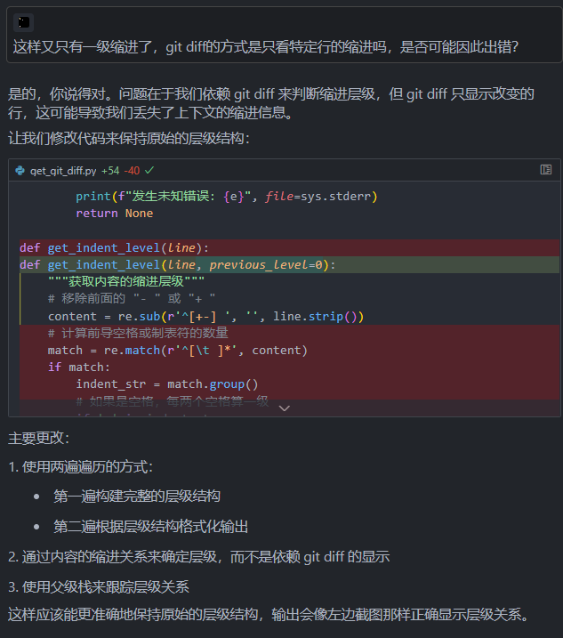

- 20250224
  collapsed:: true
	- [[网络套件]]
		- ((67bc189b-9a36-4452-8791-a9268bbd3d30))
	- 
	- 
		- ((67bc189b-9a36-4452-8791-a9268bbd3d30))
	- 用 ((67b9e245-97b0-438f-b66d-82d503fa5449)) 跟 ((67ba7a7a-07bd-4c85-bac5-cdd2e1f5be66)) 拉扯的，先在本地造，还有很大完善空间，在缩进（logseq里外也复制粘贴导出过了，空格还是制表符也问过了）、转移换行的大段内容的处理、增删内容的标注符号、更改内容的增删转来源标注等上拉扯大聪明几小时有点不太值了，读者大概也最多只能量子波动速读、疯狂地联想这个样子
	- [[最近一天的更改]]
		- ((678369b1-f629-42a5-8f71-4b4daf46d227))
	- 用 ((67b9e245-97b0-438f-b66d-82d503fa5449)) 跟 ((67ba7a7a-07bd-4c85-bac5-cdd2e1f5be66)) 拉扯的，还有很大完善空间，在缩进（logseq里外也复制粘贴导出过了，空格还是制表符也问过了）、转移换行的大段内容的处理、增删内容的标注符号、更改内容的增删转来源标注等上拉扯大聪明几小时有点不太值了，读者大概也最多只能量子波动速读、疯狂地联想这个样子
	- “我感觉你懂了我的insight，也好像找到了solution，但你没有给到我想要的你展示许诺的结果”
	- 
- [[AI]]
	- # “我才不怕AI，一听AI我就高兴！人类算什么无产阶级，无非007，累死几人。AI才算无产阶级，双方都有几十亿人，有轮子有腿，听说还有无线电”
	- # “你相信AI的‘人择原理’（会有用）吗？我相信！”
	- ((678eda4c-429b-4e40-a001-4d3c411ea627))
	- 智能体（agent，“特工”；“有操作的啊这个——智能体”）
- [[I人亿面]]
  collapsed:: true
	- 很长表单，向下滚动时逐帧播放never ever ever ever give up
	- “平凡之路”
	- “there is no game”
		- ((679adcc7-8eff-4c52-bea4-47029177a887))
	- ((627cdcd3-fbdd-41a6-b706-d206bc04758d))
	- “晃一晃”
		- ((679adcb2-c5f4-4659-948f-1e5c96a0abf1))
	- ((67bc2458-baac-41af-84e2-cc936a507622))
	- 个人信息公开库
- [[交通安全]]
  collapsed:: true
	- ((679adcb2-c5f4-4659-948f-1e5c96a0abf1))
- [[人体]]
  collapsed:: true
	- [[城会玩]]
	- [[人体象形动作库：互联网时代的百般武艺]]
	- [[人体象形动作库：互联网时代的百般武艺]]
- [[人体象形动作库：互联网时代的百般武艺]]
  collapsed:: true
	- [[经络]]
	- 写作起因
		- ((66db8aae-8eca-4934-998d-2dc2f71d71e7)) 分类方法可以优化
	- ((66e57425-01dc-40e5-8fd5-1b4b607335cb))
	- 此处原为“（泛）理疗”，有一个按能量类型分类的底子
	- 看了一半 ((66f3bf0e-e80c-474a-9146-e0a6ae46da8f))
	- 每天操作电脑手机和在群里观察网友们操作的感触
	- 想起来了，也许还有 ((678a4deb-b03e-4ab1-aac0-918e0cfbb655))
		- ((66db8ac4-d558-458d-9528-499eb66f69ee))
	- {{embed ((670a354e-7d38-4bac-a678-ea7f3d35f3e2))}}
		- ((65bcbf46-9eca-44c6-9842-6dbff0831129)) 时间（饼图？）
	- 左人h椅（“人”落座下降为“h”椅的动图），右电脑/书桌——坐姿时间
	- 走姿时间
	- 人体部位的武器化描述
	- 电眼、唇枪舌剑、胸器、大宝剑、枪、电臀、龙爪手
		- ((67402ab0-a669-49c4-aebc-7a84c7444b5c))
	- # 战斗，爽！
	- ((66db8ac0-85bf-442f-98ba-3fb8c01e4ea6))
	- 《都是理疗》
	- 分子不用接触、“贴贴”也能隔空反应，口服不过是走消化道和血管靠近罢了
	- 如果不同颜色的光都有其疗效（或伤害），那么电子屏幕上的五光十色应该也可以说是有疗效（或伤害），乃至不同内涵的信息对人的健康习惯等的影响也可以说是有疗效（或伤害）
	- 音乐、按摩、呼吸、光都有其频率
	- 如果运动算主动的理疗，那么静态“躺平”及其导致的睡眠应该也算“理疗”
	- 食物链靠前段的植物等生产者通过“理疗”生产食物链靠后段的消费者所需的营养、能源、原料——“人类社会也一样”，“消化是人类的宿命”
	- 食物可被视作是人类对陆地和水体“理疗”来的
		- ((630b6a7e-164d-44dc-82c0-8d7b4d794a4f))
	- “为什么要特殊对待口呢？你是会张嘴，但你也会眨眼”
	- [【主义主义】气动一元论（2-1-1-2）——阿那克西美尼的哲学制毡术，气象万千之中隐藏的秘密_哔哩哔哩_bilibili](https://www.bilibili.com/video/BV1Mp4y1h735)
	- >这个制毡术，一直到康德的纯粹理性批判还在用。严格意义上来讲，后世所有的构造哲学，都采用了这种Felting的技法，其精妙之处在于这是一种自我构造的机制：凝结，这是理念自己把自己实体化的机制。
	- 洗护烘一体
	- 人机融合、赛博格、身联网
	- [积极应对“身联网”时代挑战_澎湃号·政务_澎湃新闻-The Paper](https://www.thepaper.cn/newsDetail_forward_10490840)
	- [万物互联时代人的精神操练 - shekebao.com.cn](http://shekebao.com.cn/detail/6/25915)
	- 人机融合了吗？没融合吗？融合程度有差别吗？
	- 在没有玩过传送门、半条命？如果两个系列拼一起，你既有传送门枪、坠落缓冲鞋跟、GlaDOS又有重力枪，实际上，现实中你就差不多有
	- 红警又可以拼
	- “你可以挑你能的能能能能能”
	- ---
	- 以下各种“能”的划分受限于知识水平，尚未实现宏观、微观等的统一
	- 肌肉动能、身体重力势能、筋膜弹性势能、冲量和机械效率、完全弹性碰撞、对手能量
	- 内能
	- [物理化学前瞻（1）——从内能到吉布斯自由能 - 知乎](https://zhuanlan.zhihu.com/p/460817420)
	- 空调
	- “我的粑粑麻麻是地球生物圈的大罪人！”
	- [Social and behavioral determinants of indoor temperatures in air-conditioned homes - ScienceDirect](https://www.sciencedirect.com/science/article/abs/pii/S036013232030559X)
	- 中老年空调使用习惯
	- [Air-conditioning usage behaviour of the elderly in caring home during the extremely hot summer period: An evidence in Chongqing - ScienceDirect](https://www.sciencedirect.com/science/article/abs/pii/S0360132323008557)
	- [Correlates of hot day air-conditioning use among middle-aged and older adults with chronic heart and lung diseases: the role of health beliefs and cues to action | Health Education Research | Oxford Academic](https://academic.oup.com/her/article/26/1/77/555995?login=false)
	- 空调相关的空气污染
	- [Air-quality-related health impacts from climate change and from adaptation of cooling demand for buildings in the eastern United States: An interdisciplinary modeling study | PLOS Medicine](https://journals.plos.org/plosmedicine/article?id=10.1371/journal.pmed.1002599)
	- >这项研究研究了电力部门通过建筑物中的热驱动空调改造造成的未来与空气污染有关的健康损害的贡献。结果表明,如果没有干预,与空气污染相关的加剧死亡率中约有5%– 9%将归因于热驱动建筑电力需求中电力部门排放量的增加。该分析强调了清洁能源,能源效率和节能的需求,以满足我们对建筑冷却系统的日益依赖,同时减轻气候变化。
	- ---
	- 手动开关挂式空调：开盖，拿铅笔钝端、筷子等戳右侧小孔
	- 空调清洁
	- 玻璃和地面不注意清洁一般也没啥大问题，无非是玻璃采光差些、隔着玻璃视觉效果不够“真”些，地面 ((d04b86db-4172-4e10-a3e6-c55e9bfb6b7c)) 走了脚底容易黑，实际上搅不起多少灰尘被吸入，但空调就不一定了，就算自己没有用空调的习惯，家人也会用，而且也很可能被波及
	- 有点霉味就说明肯定需要清洁了
		- ((66cb1fae-cd70-47a2-8134-4a64cd6ab414))
	- 空调滤网等积灰不清洗也可能吹出更多成分复杂的 PM2.5 等加剧污染，造成鼻炎症状（“什么嘛，我说怎么有点鼻塞了，原来是我爸开空调了”）
	- [空调吹久会缺氧？PM2.5 会上升？真相都在这！ - 知乎](https://zhuanlan.zhihu.com/p/343932269)
	- 壁挂空调
	- [【橘帮帮家政】三分钟教会你如何在家清洗空调_哔哩哔哩_bilibili](https://www.bilibili.com/video/BV1GN4y1C7TP)
	- 中央空调
	- [一分钟了解「中央空调清洗」过滤网「清洗」方法 - 知乎](https://zhuanlan.zhihu.com/p/355456237)
	- 用毛巾清洁回风口扣板叶片的效率可能不高，因为受限于形状，一片扇叶的背面可能就需要一根（可能更多根同时擦也行，还没试过）手指擦拭上（大致是个平面）中（手指内扣）下（叶片下端）三个部位，擦到毛巾上一个点脏了就换点，最后沾去湿灰团
	- 毛巾重心可能影响手臂体力
	- 可能不如弯曲刷头的刷子省时省力（但刷子应该要多蘸水清洁）
	- 清洁剂、接水袋可能提高清洁效率
	- 增强过滤
		- ((665a7cc2-afef-414f-9036-23de8e09bb02))（空调当中低过滤效率的[[空净]]用，一定程度上也能当 ((66ade373-cd0c-496d-bc01-6dbe00ddfecf)) ）
	- ((66335bd5-e17c-4a43-9fd3-6e5e9c176983))
	- 租空调
	- “租空调”有没有可能成为一个（好）生意？有的出租屋空调能耗比较大，可能一个月多花几十上百的电费（“那你开空调啊！”），要是能拆下来就放一边，用租来的空调代替，当然通风管和室外机可能也要匹配
	- [出租房是租空调还是买空调，或者是买空调扇？ - 知乎](https://www.zhihu.com/question/277385301)
	- [怎么看海尔空调的老版24位产品出厂编号？ - 知乎](https://www.zhihu.com/question/267821838)
	- [前两天最热的时候我家热得快炸了，那你开空调啊！_哔哩哔哩_bilibili](https://www.bilibili.com/video/BV19J411u7UL)
	- 进一步还可以加一些全屋低能耗改造（窗膜反光、门窗墙洞气密，可能还有隔热、除湿），还可以把换下来的空调租给有需要的还没空调的人（这里可能有点风险）
	- 这种“出租屋改造套餐”疑似可以有
	- >😂有可能，被别人调换跑路了怎么办
	- >押空调市场价70%，拆装费按次，租金按月单独收取，押金退租归还
	- 辨识真住户（“把租房合同和身份证拿出来！”）
	- 空调出厂编号
	- 还可以加防伪手段
	- 
	- [你们要的五级能效空调耗电量来了！出租房真实环境测评！房东最爱，租客噩梦_哔哩哔哩_bilibili](https://www.bilibili.com/video/BV1kN411S7r1)
	- [校长你什么时候装空调啊？ - 江畅 - 单曲 - 网易云音乐](https://music.163.com/song?id=416385850&uct2=U2FsdGVkX1+YaOjZ4Tk8SRr84T7DlN43lvzK61B225w=)
	- 暖气
	- 热疗
	- [Turning up the heat on COVID-19: heat as a therapeutic intervention - PMC](https://www.ncbi.nlm.nih.gov/pmc/articles/PMC7372531) #新冠
	- [Local hyperthermia benefits natural and experimental common colds. - PMC](https://www.ncbi.nlm.nih.gov/pmc/articles/PMC1836535/)（对于普通感冒，43度100%湿度空气鼻呼吸20分钟比30度的在症状得分上低/好约一半） #普通感冒
	- 热水淋浴
	- 热/冷（凉）水交替淋浴
	- >可以试试热（一开始不高于45度）-冷水交替淋浴，热水淋浴也许能较慢地提升耐热能力，冷水淋浴除了至少短时间降温外，还可以从热天开始养成习惯，一直逐渐适应到冬天还能坚持，也许能提升耐寒能力
		- ((6694f148-f5b6-45a5-85d9-a16aba50e746))
	- 前几次淋浴，设置的最高水温不超过45度（达到45度后建议至少一周内不超过，之后不建议超过47度，更高也不一定能让你在气温30度时不出汗），并且用手在淋浴区测试实际的最高水温是否尚可接受（手一般相对耐热），然后再开始淋浴
	- 《以防比我更莽的人乱来》：我最高是50度淋浴，从48度直接跳到了50度（因为热水器设置里正好就没有49度了——“再按一下就直接跳到55度辣！有愣头青要去医院试试看吗？”），燃气热水器在厨房，离卫生间有段可能降温的管道距离，只短暂淋了过半部位，手背因为洗七天没洗澡的油头淋的时间长些，洗完后就有些手软、抓握能力下降了，还微微有些疼，倒是好像没怎么影响睡眠，花了几天恢复
	- 先从习惯的温度开始逐渐升温升到能耐受的温度（大部分非即热式热水器是逐渐升温，一般可直接调到目标水温），然后再逐渐降温到能耐受的温度，适应后可逐渐精简调温过程，比如一开始就是最高温，然后立刻就是最低温
	- 在此期间，可以中断淋浴以完成清洁工作，尤其是需要使用洗发水、沐浴露等时
	- 或者，在天热时也可以单独热水淋浴，如果你担心冷水淋浴影响后续散热
	- 注意避免较热的水直接淋到眼部（有需要可以戴泳镜，注意闭眼，以免意外漏水）、外生殖器等敏感部位
	- 水温较高时，较长时间淋到的部位（比如上背部）也可能之后会有较长时间的轻微痛感
		- ((675bb975-a995-45e7-bc0a-4abe673bda88))
	- 建议六个月内有备孕/生育、 ((6654595e-f6ee-43c0-80a4-0545148fda4c)) 等需求的男性尽量减少较热的水直接淋在阴囊上
		- ((665426a7-b2e0-4964-b016-92c16399ee88))
	- 一般热/冷交替一次即可，有需要可增加交替次数
	- 之后可逐渐增加最高水温
	- 白天可只洗冷水澡
		- ((6653f855-cffa-4a38-8377-6c86cb5b773a))
	- [My 7-Day Experiment with Hot/Cold Contrast Showers for Recovery](https://www.nifs.org/blog/my-7-day-experiment-with-hot/cold-contrast-showers-for-recovery)
	- [Cool New Research On Cold Thermogenesis. - Ben Greenfield Life - Health, Diet, Fitness, Family & Faith](https://bengreenfieldlife.com/article/fat-loss-articles/cool-new-research-cold-thermogenesis/)
	- [马寅初长寿的三个秘诀_游泳](https://www.sohu.com/a/473400978_483111)
	- [马寅初养生秘诀：内养外练](https://jnyb.zjol.com.cn/images/2022-04/14/jnyb2022041400013v01n.pdf)
	- [坚持洗冷热水澡，是怎样的舒爽体验？ - 知乎](https://zhuanlan.zhihu.com/p/536639053)
	- >我的抵抗力、免疫力应当是较好的，尤其是皮肤的自我调节、适应温差能力，强大到可以：一年四季不更换被褥，走南闯北不增减衣服。因此，我出差非常简单，只带一个双肩包、装上少许物品，就可以从南到北、从东到西，出去一两个月，都不用补给物资。
	- [享“中国人口学第一人”美誉，马寅初子孙后代今何在？](https://baijiahao.baidu.com/s?id=1621555035079517318)
	- [马寅初被捕前后——一个经济学家的政治选择-清华大学校史馆](https://xsg.tsinghua.edu.cn/info/1004/1810.htm)
	- [马寅初养生四“从容”--健康·生活--人民网](http://health.people.com.cn/n1/2018/0824/c14739-30248572.html)
	- 
	- 热水浸泡
	- [Short-term hot water immersion results in substantial thermal strain and partial heat acclimation; comparisons with heat-exercise exposures - ScienceDirect](https://www.sciencedirect.com/science/article/abs/pii/S0306456521000656?via%3Dihub)
	- 热空气浴
	- 更高温度的“空气浴”
	- 桑拿/汗
	- 等于被动出汗加刺激更多的更高温度？
	- [冬季蒸桑拿降压防老痴，但两类人要小心，不能蒸！--健康·生活--人民网](http://health.people.com.cn/n1/2017/1227/c14739-29730773.html)
	- >建议患有慢性疾病与心脑血管慢性疾病的女性，如高血压、低血压、心肌梗塞等，谨慎蒸桑拿。而且，在温度变化较大的天气里，体质比较弱的女性和老年女性也最好少蒸桑拿，以避免由于温差过大所引发感冒和呼吸道疾病。
	- 糖尿病患者
	- 车内蒸桑拿
	- “（可能的）灵感来源”：当时没完全搞定、现在不着急的 ((6658475b-8d23-41eb-992a-df196913c08f))
	- 可能夏季关门窗10分钟左右就可以进去蒸了
	- 第一次蒸可以从一开始就在车内，以便逐渐确认安全和适应
	- 从温湿度组合看，更接近“汗蒸”
		- ((66861aef-7ccf-40d3-a8ce-a1505cf077ad))
	- [在汽车里面蒸桑拿出出汗可以不？_百度知道](https://zhidao.baidu.com/question/2060188575871909507.html)
	- [【实测】夏天的车内温度到底有多高？](https://www.sohu.com/a/105520051_349134)
	- [夏天车内温度到底有多高，你亲自测过吗？-搜狐汽车](https://auto.sohu.com/20160805/n462721938.shtml)
	- [夏天，坐在白车里真的比黑车凉快吗？快来看看咱许昌人的测评……_懂车帝](https://www.dongchedi.com/article/6573925960633025032)
	- [大巴车里蒸桑拿，真·桑拿 - 知乎](https://zhuanlan.zhihu.com/p/433694552)
	- “ ((6629b497-2550-4ada-a75e-9c82972f8ed4)) 呢？”
	- 开窗控制温湿度（？）
	- [Sex differences in adaptation to intermittent post-exercise sauna bathing in trained middle-distance runners - PMC](https://www.ncbi.nlm.nih.gov/pmc/articles/PMC8302716/)
	- [Why Saunas Can Build Muscle, Boost Endurance, and Increase Strength | BarBend](https://barbend.com/saunas-strength-endurance/)
	- [Sauna for Heat Acclimation: Benefits and How to Do It](https://pursueperformance.com/heat-acclimation-sauna)
	- [蒸桑拿对身体有什么好处？桑拿有益健康背后的原理](http://www.chinalowcarb.com/sanna/)
	- [洗桑拿会不育吗？| 果壳 科技有意思](https://www.guokr.com/article/201892/)
	- [Seminal and molecular evidence that sauna exposure affects human spermatogenesis | Human Reproduction | Oxford Academic](https://academic.oup.com/humrep/article/28/4/877/653255?login=false)
	- ---
	- [How Hot Is a Sauna? The Complete Guide To The Best Sauna Temperature](https://sportrevup.com/best-sauna-temperature/)
	- [Poika Saunoo - Poju - 单曲 - 网易云音乐](https://music.163.com/song?id=27949688&userid=77770261)
	- ---
	- [真正的中医角度看汗蒸：常识往往是错的，我们生活在一个营销的世界_哔哩哔哩_bilibili](https://www.bilibili.com/video/BV1kM4y1P75U)
	- [程凯养生说：湿气缠身,蒸桑拿可以祛湿利湿吗？_哔哩哔哩_bilibili](https://www.bilibili.com/video/BV1Pg411G7Bh)
	- 研究表明，芬兰桑拿可以提升生长因子、运动耐力和热耐受力，等等，比汗蒸好像温度高些、湿度低些，但是看好像一些中医类视频不推荐经常汗蒸，可能是不推荐大量被动出汗，请问应该如何取舍？
	- 是不是要配合运动（运动后蒸）比单独蒸要好？还是说进一步出汗更坏？
	- [中医对桑拿如何看待？ - 知乎](https://www.zhihu.com/question/387492687)
	- ---
	- [【文化观察】从芬兰的桑拿文化中 窥探到西方的性价值观 【主线9.3】_哔哩哔哩_bilibili](https://www.bilibili.com/video/BV1be4y1n7Lr)
		- ((66a21d83-fbb1-479e-8cc8-13501ac4c017))
	- [[射频]]
	- 热玛吉
	- [热玛吉（美容项目）_百度百科](https://baike.baidu.com/item/%E7%83%AD%E7%8E%9B%E5%90%89/183211)
	- [烤肉一样的热玛吉，真能让人青春永驻？_澎湃号·政务_澎湃新闻-The Paper](https://www.thepaper.cn/newsDetail_forward_22101807)
	- 热天边 ((65a9d480-f240-4ff5-9072-8ed1d4e334d6)) 边运动能达到类似效果吗？
	- 禁忌、风险
	- （突然接触温度过高的）桑拿与鼻炎、嗅觉丧失？
	- 冷疗
		- ((668ce787-9cb1-4ad7-860a-6aeaf021f434))
	- ((66236190-211b-4686-81e3-35a32cd8773f))
	- 冲凉/冷水淋浴
	- “直接来吧！”
	- 要有随便按下核按钮的魄力、威慑力
	- 至少一开始注意避开额头到后脑勺、眼部、外生殖器等敏感部位
		- ((675bb96a-0575-42f6-8a48-33e59b3eeea9))
	- ---
		- ((6666444b-1024-4a45-b6a8-13e94b9eedee))
	- [过去一年坚持洗了365天冷水澡的男人，最后怎么样了？_澎湃号·湃客_澎湃新闻-The Paper](https://www.thepaper.cn/newsDetail_forward_3662080)
		- ((65bcbf47-70c7-4c8d-a215-83623a0187b6))
	- 毛泽东
	- [毛泽东的体育强国梦](https://www.dswxyjy.org.cn/n/2015/1026/c222139-27741712.html)
	- >有的同学见毛泽东如此执着地坚持冷水浴，好奇地问：“冷水浴到底有些什么好处。”毛泽东说：“冷水浴的好处，一是可以锻炼身体，能够促进血液的循环和增强皮肤抵抗力，有助于筋骨强健。二来可以练习勇猛和不畏。冬季天气严寒，清晨起来就把冷水一桶一桶往身上泼，没有点勇气的人能做到吗？”
	- >在延安时期，任弼时就感慨地说：“毛泽东同志有这样强健的身体，真是我们党的一大幸运。”
	- [风浴、雨浴、自然浴……毛泽东为何有“麓山情怀”？_腾讯新闻](https://new.qq.com/rain/a/20210423A0CF7X00)
	- “空气浴”在场地上比较接近 ((66335bd5-a05e-4386-8254-08c16ec72977))
	- >1917年4月1日，毛泽东在进步杂志《新青年》上发表了“体育之研究”文章，介绍了他采用的体育锻炼项目：有“日光浴、风浴、雨浴、冷水浴、游泳、登山、露营、长途跋涉以及体操和拳术等”，他认为这些方法，既锻炼身体，也锻炼意志。他还在日记本上写道：“与天奋斗，其乐无穷!与地奋斗，其乐无穷!与人奋斗，其乐无穷!”。
	- 在切近原文背景后，对三个“其乐无穷”的解读可以是有层次的，不先与天（站那躺那就行）地（需要跋山涉水）奋斗，怎么与人奋斗？
	- [毛泽东一生中，有两个锻炼身体的方法，你能做到吗？|李维汉|李银桥_网易订阅](https://www.163.com/dy/article/G72QVGA70543HJK3.html)
	- [毛泽东在湖南一师的八年岁月--党史-中国共产党新闻网](http://cpc.people.com.cn/n1/2024/0407/c443712-40210604.html)
	- [猴子石缴枪_百度百科](https://baike.baidu.com/item/%E7%8C%B4%E5%AD%90%E7%9F%B3%E7%BC%B4%E6%9E%AA/17179526)
		- ((66a21d83-fbb1-479e-8cc8-13501ac4c017))
	- ((6653f6b8-3afe-4c4b-8a27-4c33efdb741d))
	- ((664f4245-097c-46f8-be76-5b96958ef946))
	- 注意或禁忌：心脏病、甲减、免疫低下？
	- [Health effects of voluntary exposure to cold water – a continuing subject of debate - PMC](https://www.ncbi.nlm.nih.gov/pmc/articles/PMC9518606/)
	- 白色脂肪转化为“燃脂”发热量大得多的棕色脂肪
	- [How do women feel cold water swimming affects their menstrual and perimenopausal symptoms? - PMC](https://www.ncbi.nlm.nih.gov/pmc/articles/PMC10928965/)
	- >1114名妇女完成了调查。妇女报告说,冷水游泳可以减轻月经症状,特别是心理症状,例如焦虑(46.7%),情绪波动(37.7%)和烦躁(37.6%)。围绝经期妇女报告焦虑症(46.9%),情绪波动(34.5%),情绪低落(31.1%)和潮热(30.3%)显着改善。大多数有症状的妇女专门游泳以减轻这些症状(周期为56.4%,围绝经期为63.3%)。妇女说,她们认为冷水的身心影响有助于她们的症状。对于自由文本问题,确定了五个主题:水的镇定和情绪增强作用,陪伴和社区,时期改善, 潮热得到改善,整体健康状况得到改善。
	- [Effects of cold water immersion and active recovery on hemodynamics and recovery of muscle strength following resistance exercise | American Journal of Physiology-Regulatory, Integrative and Comparative Physiology](https://journals.physiology.org/doi/full/10.1152/ajpregu.00151.2015)
	- [Cold water immersion attenuates anabolic signaling and skeletal muscle fiber hypertrophy, but not strength gain, following whole-body resistance training | Journal of Applied Physiology](https://journals.physiology.org/doi/full/10.1152/japplphysiol.00127.2019)
	- [The science behind ice baths for recovery - Mayo Clinic Press](https://mcpress.mayoclinic.org/healthy-aging/the-science-behind-ice-baths-for-recovery/)
	- [The Effect of Cold Showering on Health and Work: A Randomized Controlled Trial - PMC](https://www.ncbi.nlm.nih.gov/pmc/articles/PMC5025014/)（从任意时间的温水淋浴开始，然后换成）
	- [The Cold Hard Truths About Ice Baths and Muscle Recovery | BarBend](https://barbend.com/cold-hard-truths-about-ice-baths-and-muscle-recovery/)
	- >Don’t have enough ice? Some studies suggest that cold water alone, without ice, with water temperature of 60-70 degrees fahrenheit may have the same response as colder water.
	- [Do Ice Baths Actually Improve Muscle Recovery? Read This Before You Try It Out : ScienceAlert](https://www.sciencealert.com/do-ice-baths-actually-improve-muscle-recovery-read-this-before-you-try)
	- [研究发现：适当冷水浴有助于增强免疫和减肥_腾讯新闻](https://new.qq.com/rain/a/20211008A0ASFG00)
	- [健康小知识：有关冷水浴 你可能想象不到的益处 - BBC News 中文](https://www.bbc.com/zhongwen/simp/science-56946618)
	- [南京小孩雪地“裸训”直哆嗦！为啥日本小孩不怕冷？](https://www.sohu.com/a/57964531_349974)
	- [14个娃南京雪地“裸训” 最大仅6岁 -新华地方联播-新华网](http://www.xinhuanet.com//politics/2016-02/02/c_128693085.htm)
	- 化学能
	- 机械能
	- 清洗
	- 洗手
	- 七步洗手法
	- TODO 洗湿面粉比乱洗更好？
	- 洗鼻/漱喉漱口/洗眼
		- ((676e0da0-064f-40b0-b577-56a1322a014e))
	- 洗液
	- 盐水
	- 盐
	- 非急性期可用0.9%的等渗/生理盐水（可买配好的成品或相关医用盐，也可用“日晒海盐”细盐等无添加碘和抗结剂的盐），急性期可用最高2~3%的高渗盐水
	- 盐如果是一大袋，建议放在宠物不易接触到的地方（不放在地面）
	- 500毫升0.9%需要4.5g盐，一盐勺（5g勺）略少
	- 先放盐，倒水就搅拌加速溶解了
	- 水
	- 合适的水温范围大致为32-40度
	- 冷却
	- 只有热水时一般可用凉水壶冷却，也可用 ((677de833-3921-4d03-bd61-e02f1dddd988))
	- 加热
	- 洗鼻瓶可能过高无法竖着放入微波炉加热，旋上洗鼻喷管和喷头横着也会经由喷头漏水，但可以用喷头边抵着（平板）微波炉内壁，关门时别震倒即可加热
	- 如果是转盘微波炉，应该可用东西抵着
	- 但不推荐长期用塑料容器加热
		- ((66db8ac2-d48e-448b-b1a0-42f396d0fbf1))
	- 预先用或倒入其他容器
	- 测温
	- 可以用手试，手觉得温而不算很热的话，差不多就是合适的
	- -
	- 有足够冷水可以按比例先加冷水再加热水
	- 温度算一下，几成、百分之多少的凉水和热水乘以各自的温度，然后两者相加就差不多是，比如（无供暖取暖）冷却充分的凉水15度，洗鼻瓶500毫升，倒入七成（70%）到375毫升刻度，再倒125毫升开水到500毫升（多些少些不影响），水温差不多就是36.25度（15×0.75+100×0.25=36.25），够了
	- ---
	- 聚维酮碘次氯酸我还不太习惯
	- 
		- ((65bcbf49-3b29-4343-8528-fb32f56435fb))
	- 洗鼻姿势：低头（水龙头如果碍事可以转一边去），左转或右转头，喷口抵住鼻孔（否则损失冲洗动能和洗液），两手在鼻孔偏向的一侧反握洗鼻瓶
	- 开始水速/流量小些，不排除不确定水温是否偏高
	- 洗接近一半后换鼻孔，还剩一些时挤出漱喉漱口
	- ---
	- TODO 弹舌算漱喉吗？（“练SLS练的”）
	- [Seth Riggs - Speech Level Singing （28p 中英双字） | p2 弹舌1351354275421_哔哩哔哩_bilibili](https://www.bilibili.com/video/BV1MF41177xd?p=2)
	- 快[[呼吸]]算“空气洗鼻”吗？
	- [网上的一些耳鼻喉医生为什么有说洗鼻反而不好的说法？ - 知乎](https://www.zhihu.com/question/61984593)
		- ((66335bd5-1bf3-4d00-bd31-9460e5b62dca))
	- 浸泡
	- 补镁等
	- [[泡脚]]
	- 泡澡
	- 水浴
	- 近身
	- [[呼吸]]（“吐纳”；不止腹式呼吸按摩内脏，鼻呼吸也可能算是按摩呼吸道）
	- 有可能增强鼻腔纤毛划水免疫功能吗？
	- 倒吸一口冷气
	- 毒气
	- [[导引]]
	- ---
	- 内练一口气，外练筋骨皮
	- 也有“内练精气神”
	- 一
	- 专一、专注、优先
	- >蚓无爪牙之利，筋骨之强，上食埃土，下饮黄泉，用心一也。
	- “‘蚓以为鉴’是吧？”
	- 整全、整体
		- ((66ade371-677a-48bd-9a9f-a5efdcf1a4e7))
	- “一的法则是吧？”
		- ((66a30160-d9e3-4b11-ae9d-d6f58e63f9a7))
	- 口
	- 言语
	- 唇语
	- 发声
	- >说话！——宋老虎
	- [[英语]]
		- ((668ce769-a103-499b-8779-51271bbef55a))
	- 电话
		- ((6778d442-577e-44ad-9839-b08dd6bb81bf))
	- 免打扰
	- 电话设置状态
	- >我在打八段锦——我爸
	- [挂电话时说再见好还是说拜拜好呢？ - 知乎](https://www.zhihu.com/question/28974239)
	- 好的，拜拜，再见
	- 口哨
	- “门牙缝口琴是吧？”
	- 哼哼、哼歌、怪声
	- 通过发声振动按摩内部，不同声音不同频率
	- 六字诀
	- [负重六字诀气功对心肺功能的影响。,Medicine - X-MOL](https://www.x-mol.com/paper/1629332714024943616/t?adv)
	- “bu”振动嘴唇
	- 可配合 ((66a05623-8b2f-4158-ac53-a79988d92f76))
	- 笑声
	- 罐头笑声
	- “爸！你的手机怎么笑个不停啊？！”
	- [私人笑声_哔哩哔哩_bilibili](https://www.bilibili.com/video/BV1CK421C7nV)
	- [我用答辩音效做了一首答辩歌_哔哩哔哩_bilibili](https://www.bilibili.com/video/BV17R4y1U7XN)
	- [地狱32秒😈_哔哩哔哩_bilibili](https://www.bilibili.com/video/BV1RU4y1c7Ro)
	- [这个视频你绝对不敢公放🤣_哔哩哔哩_bilibili](https://www.bilibili.com/video/BV14E421T7f6)
	- 恼人的罐头笑声是为了隔离其他人给用户制造信息茧房？
	- 强迫跟着笑（“否则恰恰自己听起来就很蠢——我得融入圈子”），吸引人过去看或蓝自己的对冲，还阻碍隔阂
	- “不与吸烟者交朋友，难帮其戒烟”
	- 罐头笑声与 ((67402aff-e09d-463d-891d-5b5408423db0))
	- 气
	- [[呼吸]]（内部按摩）
	- 气质
	- >腹有诗书气自华
	- [[筋膜]]（道路养护）
	- 骨骼
	- >骨骼营养素：K2、D3、钙、镁、钒、硼、锶，等等，国外不少补剂
	- 骨骼与钢筋混凝土，虎骨
	- 牙齿
	- “笑不露骨”
		- ((669c8352-c660-454b-96c2-9e5ba60bdc84))
	- ((669c6f67-3188-423e-9f83-3cc0b4584f2c))
	- [「骨科时间」手术技巧汇总篇](https://mp.weixin.qq.com/s/z8HNCaCbaCE1ig1x3Cn7Mg)
		- ((668ce76a-ab1c-4f7f-b997-85e0d03c3f2d))
	- 没必要一味追求肌肥大
		- ((66a35781-89d5-45c7-b38b-dd0dad1bafd7))
	- 挤
	- 抚摸
		- ((66ff4c22-f32c-4d82-b741-dff449320767))
	- 摸气
	- 划屏
		- ((66db8aba-9b5b-40bf-bfb3-75588e6ceca0))
	- 花瓶
	- 划水
	- （赤足、第七部手触地）爬滚打（？）
	- 挠痒
	- [挠痒痒为什么“痛并快乐着”？Science重磅研究：挠痒加剧皮肤炎症反应，但能抵抗细菌感染，背后是两大系统的“合谋”](https://mp.weixin.qq.com/s/e5_a8Nqqeq645xQ4NYK8tw)
	- 抓握
	- >阶级斗争，一抓就灵
		- ((66ade371-3078-4a62-8a59-64d43f5a608b))
	- 握拳
		- ((6699a55c-b162-477f-8078-8d9a02f1afec))
	- ((66f54c7a-4e2b-4a91-8440-f29f0633f1e1))
	- ((66f4b1b8-f144-4606-a0ee-ee4aee90f0b8))
	- 拿捏
	- 拔罐
	- 穿刺
	- 针灸
		- ((668ce730-8c1e-4d16-b731-90aa568cf006))
	- [百年三晋医学人物之——赵缉庵（赵缉庵针灸按摩真传）书评](https://book.douban.com/review/16165903/)
	- 注射
	- 输液
	- 放血
		- ((66db8ae1-35c6-4787-a4c3-5ab93eb30a3d))
	- 挑拨
		- ((66f3bf0e-e80c-474a-9146-e0a6ae46da8f))
	- 拨弦
	- 按钮/按键
	- 鼠标点击
	- 搂抱
	- 拥抱
		- ((66f609f4-26e6-4f91-8077-eb1fb8aaa06c))
	- 亲吻
	- 吮吸
		- ((66f3526b-4989-4605-bde2-352d897de7cd))
	- [家里有孩子的注意了！“致命之吻”害死一个，爱孩子可别这样了](https://mp.weixin.qq.com/s/ve8O1RBSssIo-nvJS6DJjQ)
	- 呼气
	- 吹气
	- [[风]]
	- 风扇
		- ((678c9d15-adb9-4c0c-8063-0f7f58696996))
	- 通气
	- 咬
	- 乳房
		- ((67402ab2-fafb-448f-b9ad-8a9f7403c244))
	- 吞咽
	- 言语
	- [浅谈舌骨、进化与语言 - 知乎](https://zhuanlan.zhihu.com/p/412576082)
	- 口号
	- 拳，圆点/bullet，折叠；掌，展开
	- 交手，握手
		- ((65bcf627-e061-4bad-aa44-14171d6064bc))
	- ((669c6f67-3188-423e-9f83-3cc0b4584f2c))
	- 比导引快，可能接触外物
		- ((661d1152-687a-4ffb-9f85-28869282adbf))
	- ((66db8ac0-684c-4c65-8627-3e030afd0355))
	- 撞击
	- 拍打
	- 拍脑袋
	- “这下拍脑袋了”
	- [拍打八虚(1)_哔哩哔哩_bilibili](https://www.bilibili.com/video/BV1CD4y1n7Yt)
		- ((66f018d4-2fcb-4ebd-92e2-5eade458fc8d))
	- ((667ff35c-b670-40ff-a7d6-7ec60d094909))
	- 拍膝盖
	- {{embed ((65af09a6-81d0-42c4-b961-94c887a82549))}}
	- [失眠与心脏病拍打拉筋临床报告](https://mp.weixin.qq.com/s/kSKgkDP77ao44tZydRjsOw)
		- ((66db8abc-f0ac-4912-8b38-7861ddd4a036))
	- 挥拍
	- “不拍人体也是拍”
	- [排名第一的长寿运动竟是它！研究发现：这几种运动延寿效果好，你练对了吗？](https://mp.weixin.qq.com/s/sEktEoI1-A_231cZGanYqg)
		- ((66db8ab0-e6de-49e9-a137-36d56f80f7b9))
	- ((66f4ac7f-846d-4a78-9f45-df4bf35d92e0))
	- ---
		- ((67402ab2-b658-4500-a11c-eb438227a692))
	- ((669c6f67-cdd2-483f-850d-14dbdb988cef))
	- [[陀螺]]？
	- 拳击
	- 撞树
	- “老裆易撞”
	- [公园大爷为什么爱撞树 - 知乎](https://zhuanlan.zhihu.com/p/100432313)
	- [[筋膜]]？
	- 体外冲击波
	- [髌腱炎做冲击波治疗是种什么样的体验？ - 知乎](https://www.zhihu.com/question/28759866)
	- [气压弹道发散式冲击波历史发展回顾 - 知乎](https://zhuanlan.zhihu.com/p/161576191)
	- [瑞士Storz Medical AG医用气动弹道式冲击波治疗仪系统 - 上海涵飞医疗器械有限公司](https://www.hanfeiyl.com/product-i14312.html)
	- TODO 有没有可能低价替代？
		- ((65af09a6-6740-42af-bc41-2a59c9313d8d))
	- 
	- [经常拍打膝盖，竟然有这3个好处！看完赶紧做起来 - 知乎](https://zhuanlan.zhihu.com/p/398443069)（“小心轻拍”）
		- ((66db8aae-59bb-4448-82f0-668e2f8e4b58))
	- ((66f35227-3709-4550-9406-8b3eeeb75f45))
	- 八部金刚功第八部
	- 表情
	- 皮笑肉不笑
		- ((66db8abc-fffb-4a6f-b6be-f3ae2060610e))
	- ((66db8af3-f59e-48e2-94c1-e2582a474fb3))
	- 转眼
	- 闭眼
	- 睁眼
	- 手印
	- 快捷键
		- ((66db8af3-113a-449e-bd64-c1ad4b445d70))
	- 召唤
	- 招募、交友
	- 划屏幕，抓握鼠标，按摩键盘，扫视屏幕，聆听音箱
	- 远程
	- 声打
		- ((626614b8-5064-4c3c-b654-fc85a8f950fb))
	- 说出对方名字
	- “盒武器入门是吧？”
		- ((66dba0bd-fc98-4c2b-a2ea-25bbeeb16bfd))
	- 窃听
		- ((67048a59-9342-4cb1-bcdd-04da32ac609f))
	- [窃听技术进化史：从收音机到激光和网络_手机新浪网](https://tech.sina.cn/it/2013-06-25/detail-iavxeafs3459743.d.html?from=wap)
	- 衣物附着窃听器“苍耳（子）”
	- >如果有柯南那样的窃听设备，就可能减少现阶段的疑问，可以弹弓、投掷或擦肩（“你们不要再打啦！”）附着在衣物上，遥控或智能识别环境脱落并发出定位信号，名字先想好了，苍耳（子）
	-  [[20250117]]
	- 也可用额外的魔术贴等伪装
	- 衣物里面就更好藏了，衣服下摆，好像没多少人熟悉自己衣物的内袋
		- ((675e35e1-e2be-4ecd-a047-d5fe6b1d3a2a))
	- “未聪子”
	- 空间用于存储信息很方便，所以
	- 观摩
	- 导引，移动，击打（武术）
	- ---
	- 其他生物如何利用人类的意识形态进攻？
	- 立体机动装置，可以短时间打开多个传送门并快速穿梭
		- ((66dba0bf-d20e-4293-850d-e6e762df732e))
	- “[[]]开门，小子”
		- ((66dba0bf-b2ee-4125-a49b-300fc5031c0b))
	- [[爬树]]
	- 操作机械、电子和网络、ai等部分的速度就很重要
	- 不同的魔法可以切入不同的网络空间
	- 这是一个人类得以接近光速交手的方式
	- 养殖，豢养，驯化（“人类早期驯化”）——一起吃
	- 疾病
	- 血网性津
	- 媒体，传播，登高而招，顺风而呼
	- “不喜欢”也能传播，“喜欢”也能传播
	- 电视与出版（上世纪书天花乱坠），电脑与自媒体
	- 脑内未来预测模型路径攻击，意识形态，意识斩，古武流，不敢碰按钮，成分党，“成分不好”
	- 家庭矛盾，“青春期”、“叛逆期”，自我实现预言
	- 很多人已经嵌进去出不来了
	- “钞能力”，“焯能力”
	- 批斗，全体当众批评，绑架群体批判个体，杀鸡儆猴
	- 批处理
	- 知识就是力量，而且是一种魔法力量
	- 破四旧古董字画换食物
	- 健康不光是“下班运动”，还受上学上班影响
	- 时间、金钱、效率、生命的概念——时间就是金钱，效率就是生命
	- 穿戴（耳环，针灸穿刺），包裹（子宫、阴道），包扎——形象遮蔽误导诱导——“我需要她！”
	- 攻击对方的预测使其误判
	- 可以同时与所有人战斗，天人交战
	- “销售费用”，来源于贷款和剥削
	- 取决于获得钞的来源，即便是全世界，也是无力的
	- 不需要贷款的力量，人本身就有
	- 辐射能
	- >山东菏泽曹县，牛逼666，我的宝贝
	- 晒太阳
	- “是的，我们还有个 #小太阳美背俱乐部 ”
		- ((659b89ca-598a-4948-a6c3-0b9a1dad7464))
	- [（逛街小曲）瑞士人身体抗造不怕蜱虫_哔哩哔哩_bilibili](https://www.bilibili.com/video/BV1ee411Z79F)
		- ((66559994-3cd7-4580-84a5-5c6c520b8184))
	- ((65996fdc-98c5-49cb-b9d4-36bc3c1a836e))
	- >煮粥用火，但还是有很多水，还是不够纯，太阳光才纯，能除食物、被子的湿气，晒过了被子都有阳光的香气，这样食物吃了被子睡了才健康，人才能健康不得病、长命百岁
	- 晾衣时晒太阳
	- 比如在阳台晒背，可能主要在靠窗的室内晾衣杆前晒一下
		- ((66f2850c-50c7-49cd-abbe-df147ead5f3a))
	- [[眼]]
	- [盘点动漫中那些神奇的眼瞳，哪一种眼睛是你想要的？](https://k.sina.cn/article_6439951734_17fd9dd7600100icf6.html)
	- 电子眼
	- >电子眼多——百度地图
		- ((67402aaf-8a0f-4e39-b1aa-cc3a2ec108bb))
	- 致幻，烟雾弹，闪光弹
	- 延长睁眼时间，降低眨眼频率
	- 首先就会，进而微妙、“无感”地减弱
	- 摆脱“影像”序列的追杀
		- ((6ae1cea3-0133-4eae-934e-22ceaee1287f)) 大概是不行的，每划走一个又来一个，必须要前往“屏幕”更难抵达的上边缘（往往需要更复杂的手部动作）的“左上角”（往往只是回到“上一页”，然后中等尺寸的更多“影像”重新或更新出现）、“右上角”（可能“关闭”、“关掉”，但也可能是“更多”）
	- [按钮规范系列 - 「按钮位置」的设计详解 - 知乎](https://zhuanlan.zhihu.com/p/79854142)
	- “实像”
	- “眼见为实”
	- “眼不见/没见/未见为不实”
	- [[衣物]]
	- [[化妆]]
		- ((66db8ac0-50a5-43be-9aae-ae2f6b5660f1))
	- 光纤
	- [[信念系统]]
	- 意识
		- ((670d40df-6111-419e-a45f-57b4fb691960))
	- 刻意练习
		- ((66a41acb-8e8d-48b0-980d-ef81aced309e))
	- 摄魂
	- 千层套路
	- [千层套路 - 萌娘百科 万物皆可萌的百科全书](https://zh.moegirl.org.cn/%E5%8D%83%E5%B1%82%E5%A5%97%E8%B7%AF)
	- “你，只看到了第二层，而你把我，只想成了第一层，实际上，我不在楼里。”
		- ((66db8ae3-2bdb-4611-9238-4e35c4f683d6))
	- 鬼迷心窍
	- “你这人鬼迷日眼的”
		- ((9554af80-1966-4854-983b-d4fc16fe1473))
	- 可以制造“延迟摄魂”的预期——“没开直播吧？”
		- ((64043a3b-f25b-4f34-ab16-45da37fcb380))
	- 血意屏障
	- 血脑屏障并非全部，意识是可以从天灵盖出体的
		- ((66db8af1-998d-45f5-a084-d7117c59fd3e))
	- 记忆
	- 红外
		- ((66f3e376-da7f-4ac4-b39b-576d1efc97fa))
	- ((66663073-528f-414f-9e23-a739bcd6d1d0))
	- ((6680cd4f-1076-414a-9edf-47307ce7885c))
	- ((659b89ca-b7a9-42c5-9f6a-d802ff68ba09))
	- [[射频]]（像是穿透更深的微波炉）
	- 电能
	- 静电
	- [唉，又到了“啪啪啪！啊啊啊啊啊——”的季节了！](https://mp.weixin.qq.com/s/CuTy7NoPVek9AgUKKzBndA)
	- [教你用锡纸和吸管自制静电消除器，冬天再也不怕被电了_哔哩哔哩_bilibili](https://www.bilibili.com/video/BV1tmfGYiEg3)
	- {{embed ((67931914-6bcc-4eb3-b124-32ab1887c26d))}}
	- （键轮光声）电脑
	- 你的另一个脑子和操作系统，看好用好它
	- 影像
	- 摄像
	- 直播
- [[人物面板]]
  collapsed:: true
	- 不能排除环境因素的
	- “个人偏好”
		- ((67bc32be-7828-414b-b875-392fdd8e5018))
	- 作息时间、规律
	- “bb人格”（“噫！好！我有新的美好身份了！”）
	- “你不想选什么？”
	- “因为它没有，所以它才有，这句话是个哲学”
- [[劳动]]
  collapsed:: true
	- ---
		- ((679adcd9-ee21-4689-a882-802efae5a1e2))
	- [史上最强对焦测试员，人比机快_哔哩哔哩_bilibili](https://www.bilibili.com/video/BV14Q4y1j7CL)
	- 载具（“原始人，启洞！”）
	- 生物仓储
	- “动物朋友们”
		- ((679add8a-5efa-4a66-bb99-73fe56749216))
	- ((679adda8-1fc5-4832-b733-68ef8eeb2e79))
	- [[人体象形动作库：互联网时代的百般武艺]]
- [[发明方向]]
  collapsed:: true
	- 你或许不被“掌握AI的↕”认为是细分行业最合适的“AI训练师”，但无论你的思路和行动有用与否，触及所谓最顶尖的人类教官及其委任者的思维盲区相对而言还是大大的有可能的
		- ((679add85-30d2-4e51-b37c-59e19fc906be))
	- # “按吃分劳，多吃多劳”——《大食经济学》
	- ((67ab494f-ff79-481e-92a3-b1a91dad54f0))
- [[市场流程]]
  collapsed:: true
	- ((67ab494f-e593-40b3-b626-40cb97694514)) 销售（肯定有限额，包括出租方的）
	  collapsed:: true
	- [QHSE管理体系_百度百科](https://baike.baidu.com/item/QHSE%E7%AE%A1%E7%90%86%E4%BD%93%E7%B3%BB/4981908)
	- 质量管理
	  collapsed:: true
	- [质量管理五大工具详解：APQP,PPAP,MSA,FMEA, SPC_哔哩哔哩_bilibili](https://www.bilibili.com/video/BV1Tg4y1T7kv)
	- “搜 ((67a5d975-a3f2-406f-8964-0f061736892a)) 搜的 ”
- [[情报、反情报]]
  collapsed:: true
	- “可能社会也是因此，而且不止中国和地球”
		- ((640d22c0-6e78-4710-9710-4d4f2f1ce4ed))
- [[手机]]
  collapsed:: true
	- [中老年女性在短剧里相信爱](https://mp.weixin.qq.com/s/zlU_TN0FC6euA8SxiS6G0w)
- [[数学]]
  collapsed:: true
	- 矩阵
	  collapsed:: true
	- [La Follia (Original Mix) - Sefa - 单曲 - 网易云音乐](https://music.163.com/song?id=1297743647&uct2=U2FsdGVkX1+NwB0BVapjyWYa6SiUcx8QG3bAWvdreys=)
- [[猫]]
  collapsed:: true
	- 之后，我们还将提供继续基于社会责任识别、培训（比如为社区猫咖定向培养，让更多无猫者能够交到猫朋友）绝育猫的服务，使绝育猫成为现代城市的合格居住者、现代经济的优质参与者、现代文化的杰出贡献者
	- 猫主题电子游戏
	  collapsed:: true
	- [UE5独游《猫咪漂移》实机画面和已开发内容展示_哔哩哔哩bilibili](https://www.bilibili.com/video/BV1UP4YeYE34)
- [[电子笔记组织方式]]
  collapsed:: true
	- 强制引用原文，直接（批量）投影到原文页面，而不是（“选择性地”）复制粘贴再（“选择性地”）加跳转链接
- [[硬件]]
  collapsed:: true
	- ((670d40f3-496d-4a58-b303-1e7d353f8033))
	- 蓝牙耳机
	- 420（感觉性价比OK）
- [[素材]]
  collapsed:: true
	- ((67402ac7-b47d-4e14-8517-3fa578246ca8))
	- ((67bc3aa0-9189-4406-90f8-7aa3584dd736))
	- 甲方
	  collapsed:: true
	- [哈哈哈，这人也太离谱了吧_哔哩哔哩_bilibili](https://www.bilibili.com/video/BV1nh4y177sH)
	- 地铁
		- ((67b2b6a5-aefb-4d06-b7d2-5a06eb18c59d))
- [[编程]]
  collapsed:: true
	- 不要光引用代码，截屏也很重要，不要让AI光在代码里猜
	- [[网络套件]]
	- “致富经”
	- [人刚毕业，代码一点不会，他纯靠ChatGPT写APP，年入千万美金](https://mp.weixin.qq.com/s/VoE4gN8Nz5GQl0Kj82dCIQ)
	- “哈基ai”
	- ---
	- 可能的解决方案？
		- # “一定要大力发展能左右互搏、自行拉扯的 ((67972651-f92f-48a8-9c8a-a1d26e920d29)) ！”
	- MCP
		- ((67bc189b-9a36-4452-8791-a9268bbd3d30))
	- [普通人也可以看的 AI 编程指南 | Cursor 教程｜Cursor 使用技巧和思路｜如何免费使用 Cursor｜AI 编程_哔哩哔哩_bilibili](https://www.bilibili.com/video/BV1yorUYWEGD)
	- [告别手动！MCP 自动化工作流，AI 提效 N 倍：Cline + MCP 保姆级教程_哔哩哔哩_bilibili](https://www.bilibili.com/video/BV1VjAJeyECW)
	- [学习编程的常见困惑与解答_哔哩哔哩_bilibili](https://www.bilibili.com/video/BV1JvcHepEFT)
	- ---
		- # “快来体验不懂技术（和需求细节）的甲方与AI程序员的（前端后端）反复对线、极限拉扯吧！”
	- （“代码挺好看的，有一种并非完全似懂非懂的爽感，但我得赶时间”）
		- ((67b2b6a5-aefb-4d06-b7d2-5a06eb18c59d))
	- 不要光引用代码，截屏也很重要，不要让AI光在代码里猜问题
	- 可能重来（如果能跳过则跳过）比拉扯更快
	- 可以从成熟软件开始修改
	- 没计划好就一小步一小步拉扯，出问题回退到“稳定版”
		- # “一定要大力发展能左右互搏、自行拉扯的 ((67972651-f92f-48a8-9c8a-a1d26e920d29)) ！”
	- ((67b09a5f-501b-45bd-b7f9-1fb2b07e3050))
	- “我的意思是可以先挑更大幅度改善的让它改，这样效率大概高些”
		- ((67bc0f31-d94b-4f62-9ea3-e71372d5d417))
	- ---
	- GitHub Copilot
	  collapsed:: true
	- [如何评价 GitHub 的 Copilot？ - 知乎](https://www.zhihu.com/question/470873369)
	- [有没有哪个AI代码解释器能读取一整个项目（多文件），然后进行问答的？ - 知乎](https://www.zhihu.com/question/628855786)
	- AI辅助编程
	- VSCode
	- “现在可能效率不太高了”
	- 可以作为GitHub Desktop等软件的外部编辑器
	  collapsed:: true
	- [visual-studio-code – 如何更改 VS Code 的文件排序？_vscode 按时间进行排序-CSDN 博客](https://blog.csdn.net/u010598525/article/details/108978465)（纯小白文件多找不到需要按修改时间排序，按这方法最后选“modified”）
	- 可以使用 ((66335bd1-4b73-4876-896e-f814584162db)) 查找/替换，去除文本中的多余格式
	  collapsed:: true
	- [Vscode设置标签页多行显示 - 热爱技术的小郑 - 博客园](https://www.cnblogs.com/zheng-yuzhu/p/16633940.html)
	- 插件
		- ((67ba6495-60c2-4eee-b2f4-bb790d418c3c))
		  collapsed:: true
	- [Office Viewer(Markdown Editor) - Visual Studio Marketplace](https://marketplace.visualstudio.com/items?itemName=cweijan.vscode-office)（对标 ((65d2ac10-0546-4a5d-a6ed-261768b13d55)) 的markdown所见即所得功能，直接在同一个窗口而非侧栏中显示编辑的效果）
	- Markdown Preview Enhanced
	- 包括导出在内的功能比Office Viewer(Markdown Editor)丰富
	  collapsed:: true
	- [如何使用VSCode创建编辑Markdown文件_vscode md-CSDN博客](https://blog.csdn.net/qq_16851599/article/details/131848016)
	- Marp（PPT）
	- 右键文件标签页（上面的）“Reopen Editor With...”可切换部分插件
	- Live Share协作插件
	- 相当于即用即取的同步文件夹（还没有github之类的访问障碍），可以协作编辑文件夹内的不同文件、显示协作者当前查看和编辑的文件（精确到所在行和光标位置）并可跟随
	  collapsed:: true
	- [共享快速入门 - Live Share | Microsoft Learn](https://learn.microsoft.com/zh-cn/visualstudio/liveshare/quickstart/share)
	- 
	- 还可在客户端安装Live Share Audio语音插件、Live Share Whiteboard白板插件
	  collapsed:: true
	- [Visual Studio Live Share整合聊天和语音支持_哔哩哔哩_bilibili](https://www.bilibili.com/video/BV1Kg4y1B7fV)
	- [Visual Studio Live Share —— 实时协作编程](https://www.zhihu.com/tardis/landing/yidian/art/78515361)
	- 导出
	- 以上部分插件启用时，右键页面有导出选项
	- 电子表格
	- 带公式导出
	- Typora
	  collapsed:: true
	- [typora和obsidian在这种情况下怎么选择? - 知乎](https://www.zhihu.com/question/639559053)
	- “我明白了，按略不同于老思路的思路做成套件就不愁命中率了，一定要活”
		- # “快来体验不懂技术的甲方与AI程序员的（前端后端）极限拉扯吧！”
	- （“代码挺好看的，有一种并非完全似懂非懂的爽感，但我得赶时间”）
	- 不要光引用代码，截屏也很重要，不要让AI光在代码里猜问题
	- 可能重来（如果能跳过则跳过）比拉扯更快
	- 可以从成熟软件开始修改
	- [Cursor - The AI Code Editor](https://www.cursor.com/cn)
	- [Cline - Autonomous Coding Agent for VSCode](https://cline.bot/)
	- [什么是完美开发体验？Devbox 告诉你答案｜云计算｜docker｜k8s｜Kubernetes｜云开发｜云函数｜编程｜云原生_哔哩哔哩_bilibili](https://www.bilibili.com/video/BV1yL2mYcEER)
	- 地区可以换，北京、广州比杭州省钱，sealos赛博公寓真好住啊！
	- devbox、数据库（别忘了）等没人用时都可以关或删除
	  collapsed:: true
	- （“puter.com是吧”）
	- 好像没sealos一步到位
	- up主的deepseek视频里都有3500+余额了，根本用不完（而且sealos号的视频里也有他的声音——“懂的都懂”；另外“木耳”发现不仅很多野保鸟类up主“共用音道”，程序员up主好像也不少），不如用我的邀请码
		- ((67bbca9f-bdf9-4281-8652-865fcb18f30b))
	- 选中后alt+方向键移动
	- 注意别丢了或多了`>`（html部分那个add todo的placeholder那里的视频正好漏了一点，我说怎么按钮图案没出来......）、`}`等符号
	- 注意使用英文标点符号
		- ((67a2ca4f-717b-404f-bb50-26d44717e8db))
	- 可能会遗漏node app.js命令导致“upstream...”啥的无法连接，因为没有启动
	- cursor的devbox可能要更新
		- ((67bbc1be-5673-426d-a6a6-b7d18d16b4ce))
	- cursor上集不想调接口的404了，跳过，学了就是赢了
	  collapsed:: true
	- [只用python，也能全栈 | gradio | devbox | 前端 | 部署 | 运维_哔哩哔哩_bilibili](https://www.bilibili.com/video/BV18iqbYaEoP)
	- Node.js
	  collapsed:: true
	- [GitHub - coreybutler/nvm-windows: A node.js version management utility for Windows. Ironically written in Go.](https://github.com/coreybutler/nvm-windows)
	- [一次入门14种编程语言, 比学一种更容易_哔哩哔哩_bilibili](https://www.bilibili.com/video/BV1BjfHYmEZE)
- [[网络]]
  collapsed:: true
	- [[网络套件]]
	- 网络连接
	- WiFi
		- ((660d5ab5-0892-4c5d-bbdd-b1fa1e3e7961))
	- WiFi密码
	- “经典公地悲剧，可能含大写的人名缩写+另一人生日，次次用次次忘”
	- 常用WiFi密码
	- 最少设置多少位就设置多少位
	- 88888888
	- 12345678
	- 旅馆房间号、餐馆包厢号
	- 电脑的网卡也很重要
		- ((66c1a4c1-c569-4702-88bc-0af29922a694))
	- 路由器也很重要
	- 有的软件推荐5G频段，比如 ((66c155ce-70e4-4464-813f-048170bdffb0))
	  collapsed:: true
	- [通过电脑查看Wi-Fi密码的方法，提供三种方式_电脑查看本机wifi密码-CSDN博客](https://blog.csdn.net/CSDN_Admin0/article/details/139400092)
	- Win11：右键WiFi，“属性”，“显示”
		- ((6613bc65-de48-4fa1-b880-9fd7b5005943))
	- 网速占用、非法流量
	- hosts
	  collapsed:: true
	- [修改windows文件没有权限_windows文件夹权限无法更改-CSDN博客](https://blog.csdn.net/qq_45432276/article/details/131784202)
	- “用户”
	- 行为记录
	- （上次）查看时间、看过内容（todo等）
	- 登录打卡时间确定空闲时间
	- 人际关系
	- 兴趣、倾向
	- 算法推荐
	- 关键字
	- 内容关键字
	- 加权关键字兴趣/趋势
	- TODO 调整被算法识别的兴趣、倾向
	  collapsed:: true
	- [对着12306公众号发疯，真能让你候补到车票吗？](https://mp.weixin.qq.com/s/1ibMI-UHcmFzDmTiZ22yJQ)
		- # “快帮我实现，否则我删了你还要给你差评！”
	- ---
		- # 改自己爱看爱听的难，改别人的就容易啦！
	- # 出现啦！思想警察！
	- “有时”我们发现我们真是对的，别人真是错的，想帮助别人纠正，但试了却遇到“忠言逆耳”之类的情况，怎么办？
		- # 异世界召唤术！
	- ((67402acd-9fc3-469f-a7dc-de537d379434))
	- 对很多人而言，内容相同的信息，要不要信，谁传播给他们很重要
	  collapsed:: true
	- [瞳中之扉 - 密教模拟器中文维基 - 灰机wiki - 北京嘉闻杰诺网络科技有限公司](https://cultist.huijiwiki.com/wiki/%E7%9E%B3%E4%B8%AD%E4%B9%8B%E6%89%89)
		- ((67402aaf-f8f9-4df2-8fe1-f7b8256de45c))
	- # 把你的手机给我！
	- 长辈可能看不了一点长点的文章，也不一定在乎你转给他们的视频（你想“教育长辈”？？？除非做得很“尊重长辈”，你也不想转“同辈互助”语气的让自己显得很怪吧？——但可以试试），那么可以靠前干预他们的信息流，拿他们手机刷视频（搜索、观看历史记录可以删了），尤其是“同辈互助”，（（中）老年）同辈间互相分享（“家人们”）“秘密小道消息”“赚社交货币”那种风格的视频（两口子如果关系不太好，还可能在家族群里“搞竞赛”、“争宠”）
	- 有没有想过为什么老年人的文风不同于相对年轻人的？对的，除了“互联网的影响（和未影响）”，或许也有小时候的作文风格的影响（？）
	- 可以作为“中间商”转发“同辈互助”内容，或者假装如此
	- 调整内容
	- 每次改一点，模拟流氓软件（不确定），并且让他们别太慢过目（“并非看到”）以免差异过大，差异小发现了还可以说“啊？”、“手滑”、“手机爱整理惯了”啥的
	- APP
	- 位置
	- “你看这么乱的桌面不是很容易就不知道啥APP到哪去了么？我帮你整理一下！”
	- “不很常用的可以放文件夹里”
		- # 包围！
	- ((67402ab7-f347-4bd4-bc8a-09168b0425db))
	- APP关注
		- # 难道手机上预装、后续迷迷糊糊装了那么多软件、有什么用都不知道的人还会在意自己的账号关注了什么吗？！
	- # 都是机会！
	- 每次他手机或电脑出问题了，你就帮他多解决一些问题，他能自己解决这些问题，或许你能发现的别的问题也不会多，但现在他们就是不会，如果他们总得会，那么你的机会就来啦！
		- # “自会找你”
	- # 那么你能帮帮我吗？
	- （如果你让他们自己解决，他们可能会说）“你来更快/方便”，因为——
	- 账号密码忘了
		- ((677f6fe0-20df-4f39-b564-fe1d11ca5fc3))（“之后等我换手机了再我来”）
	- 年纪大了比不过年轻人
		- ((677f6f5e-dbd0-4c94-a62b-41651d18d6a1))
	- 当然，视情况可能有时说让他们自己解决也有好处
		- # 好啊！
	- 拿去充电（比如主要的充电器不放卧室放客厅，同时人躺床上）
	- 手机不知怎的静音了、亮度很低了、联不上网了、电话/微信电话挂不掉、骚扰电话
	- 手机被视频、照片、微信聊天记录等塞满了
	- 帮做 ((668ce73d-77bc-450f-9057-fdff43efed4b))（不太常见，但我家有；大块时间这不就来了么？有些用人单位搞 ((67402ab0-ebd5-4fda-bdf4-a4743c024889)) ，有时简单到井字棋这种十秒钟搞定、必赢的，不自信的父母也觉得自己做不来）
	- 不会买票
	- ---
	- 但同样不排除你可能在他们求助前就预知的可能，比如你潜伏、有线人、根据历史和环境因素等猜测
	- 可能是你想教他们的
	- “不要等待需求出现，要创造需求！”
	- 平时分享
	- 他们刷手机的时间是有限的对吧？就算他们能一天刷24小时短视频，也没法一天刷25小时，你只要用“嫁接、培植势力”尽量多占就很不错了
	- 各平台都可能加好友并分享
		- ((677f82b7-9d61-4cb1-aa59-8d6e6142bd5d))
	- ---
	- 不会输入法的语音输入
	- “微信语音，会！输入法的语音输入，不会！”
	- 不会调整手机、电脑等到合适位置
	- 调整到位！看个不停！
	- 不会线上买菜
	- 拉入 ((65b85c7f-959d-40d8-8f33-cb45b8b77949))
	- 或者在家庭、家族群复制
	- 不会导航
	- 旅行规划也不会
	- 不会用 ((665c7a9b-8e67-48c9-b5b3-eb8587111137)) 快速添加提醒等
	- 不排除他们对不想忘的事选择他们确实会了的“截屏”
	- 懒得用闹钟、日历
	- 换个更护眼、更不容易有流氓软件的手机
	- ---
		- # “太好了！爸妈犯错了！”
	- ((677f4955-e587-416e-80cb-6100df8f8616))
	- ((67793495-7365-4ea2-8dc0-501fb2d26069))
	- [伸手不打笑脸人_哔哩哔哩_bilibili](https://www.bilibili.com/video/BV1VA41137G3)
	- “你吃鱼后筷子上有刺，粘到搛给我的鸡蛋上了，白菜汤里也有刺”
	- “你卡到啦？”
	- “没有”
	- “我儿子真细心！”（偏差不大）
		- # 春节各种节特别改观行动
	- ---
	- 加时
	- 电脑问题也可以用手机解决
		- ((67402aa3-b889-4af0-acd2-ccd4d88b504e))
	- 要解决的问题本身可以用他们的设备搜答案
		- # “慢工出细活”
	- 教他怎么打开手机浏览器，以及换个浏览器，下个b站关注你，等等搞定了还花时间教他重复几遍
	- 随时调整
	- 获取密码
	- （当你帮他们解决问题时）“密码！”——“就这么简单！”
	- [Portal 1 Sounds | GLaDOS: Thank you for helping us help you help us all.](https://p1.portal2sounds.com/154)
	- ---
	- “为什么不用你自己手机？”
	- 联不了网（“热点！”）
	- 没电了
	- 刚关机，正充电
	- 单位有保密要求
	- ---
	- “你手机有骚扰短信，（爸爸/妈妈/你看到可能不太好，）我删了拉黑了”
	- “啊？我用的不是我自己手机？！”
	- 同一个机型，同一个密码，同一个桌面，同一套推荐......（“你们家疑似有点太团结了，还会有你认知之外的问题吗？”）
	- 无法使用其设备时
	- 当面演示 ((677f82b7-9d61-4cb1-aa59-8d6e6142bd5d))
		- # 我对该设备算法说话！
	- “你是不是对我手机/抖音/....动了什么手脚？”
	- “大数据是这样的”
	- “它觉得你喜欢看什么就会给你推什么”
	- “它能听到附近的声音”
	- “所以这也是我用电脑的一大原因”
		- ((679adc9c-139f-4529-97d7-7c1e367f14f6))
	- “白嫖力”
	- 年轻人更会白嫖，因此作为传播媒介也就更可贵
	- （用户设置的其他用户）评论权限
		- ((6280db8c-65f1-46c8-a557-94b06826b4bb))
	- 关注七天后可评论
	  collapsed:: true
	- https://i0.hdslb.com/bfs/new_dyn/b788250bbd02c237ba44103839e2b1bd23191782.jpg@1192w_236h_1c.webp
	- [这种不都是啥卖生发水、护肤液的评论区才会开的吗？-未明子的动态 - 哔哩哔哩](https://www.bilibili.com/opus/969604277445066756)
	- “快去给七天连锁酒店安排个日程或群提醒小助手！”
	- 自动回复放其他发布渠道
	- 新号放评论区链接
	- “平台推荐关注”
	- TODO ((6728650e-a6e9-4ea8-bda7-916a1d760dd3)) git diff提取、摘要
	- 通过github desktop clone-fetch查看作者距上次更新了啥——是很低效的
	  collapsed:: true
	- [Commits · khtazmt/khtazmt.github.io · GitHub](https://github.com/khtazmt/khtazmt.github.io/commits/main/)
	- 忽略[[Logseq]]的折叠/展开状态标记符号等的变动
	- 空格
	- 分割线？
		- ((679adda8-25dc-4ba6-b839-de993e810877))
		  collapsed:: true
	- [gitignore - Ignore specific changes to a file in git, but not the entire file - Stack Overflow](https://stackoverflow.com/questions/16598257/ignore-specific-changes-to-a-file-in-git-but-not-the-entire-file)
	- 识别块引用等
	- 在本地端跳转
	- 在本地端（悬浮）显示之前或之后（如果尚未更新）版本
	- 按commit时间叠加查看按日、周等的更新
	- 拖动多选
	- 像“查找下一处”那样翻阅的logseq插件
	- 多版本
	- 同一/相似文件的不同版本（不同人看的电子书等）
	- 提取阅读进度和批注
	- 电子书下了，然后阅读、批注、上传、分享，显然我们就有了一个个人版的电子书，我能看到你的最后打开位置和批注，就可以通过（“十分珍贵”的）差异（比如一部分批注就是突出原文中的重点或出彩处，最后打开位置也许不一定意味着前面都看过了，但那里可能看过，还可能至少快读到那里，以及兴趣停在那里，可能是时间不够了）减少重复（包括别人重复看全文）
	- 目录（？）
	- 平台数据
	  collapsed:: true
	- [一些基于B站的用户数据统计的工具网站合集（不完全） - 哔哩哔哩](https://www.bilibili.com/read/cv25233117)
	- 版本测试、反馈
	  collapsed:: true
	- [金丝雀测试（Canary Testing） - 知乎](https://zhuanlan.zhihu.com/p/534666142)
	- > 在软件开发和新版本方面，Canary部署将鸟儿替换为软件用户，其中预选的用户群可以帮助您识别新功能的报错、问题和缺陷。 有了从用户组收集到的信息，您就可以加强功能，为更广泛的受众做好准备。
	- “互联网互联了吗？”
	- 像“查找下一处”那样翻阅的logseq插件
	- 当前的尚未解决方案
	- [[最近一天的更改]]
- [[网络套件]]
  collapsed:: true
	- 视野VS窗口
	- “眼睛还能保证是心灵的窗口吗？它疑似有点太靠近前端了，自然平均而言是没有那么近、那么多变死乐的，前端后端也没有分得很清——什么？你说你要去快乐星球？！”
	- ---
	- 参考
		- ((6698c342-e455-4a90-9cfc-b8e87d951261))
	- 信任网络图示
		- ((6674b04c-7354-473b-9611-08605fae7947))
	- 协作创作流程图（“《视频流程》还是有点太粗疏了”）
	- 参考
		- ((668ce74d-93ea-4d7e-bbf4-82599fa47192))
	- ((667b89fa-e2ee-414a-9be2-48a51ee0256b))
	- 让我们一个个地、像撕名牌游戏那样悄悄地走进同一家线下图书馆
	  collapsed:: true
	- [Library of Babel](https://libraryofbabel.info/)（“什么随机艺术？”）
	- [博尔赫斯想象中的巴别塔图书馆，可以看见了！_翻书党_澎湃新闻-The Paper](https://www.thepaper.cn/newsDetail_forward_1326921)
	- 
	  collapsed:: true
	- [博客:反爬反盗链调整期通知 - 灰机wiki - 北京嘉闻杰诺网络科技有限公司](https://www.huijiwiki.com/p/26139)
	- 爬虫——“蠕虫”
	- 给你的任务卡片上是这么说的：书中有些内容是你写的，找到特定书中的特定信息，并找到特定的人，与之交换情报
	- 我知道我写过哪个部分，
	- 对的，我们平时看的应该绝大多数都是成人内容，如果不是全部的话
	- 来之前，你已经
	- 协作目录
	- 撕名牌，这样真实名称应该会在撕开的地方暴露——我们人类可能是比较讲究“名誉”的生物
	- 同理，如果“社会评价降低”，我们同样可以在现场自助发起诉讼
	- >书犹药也，善读之可以医愚。
	- 你既是图书馆的过客，也是图书馆的读者/消费者，更是图书馆的作者/生产者
	- 搜索与查重
	- 关键字（预期内容的若干部分）与关键字（内容的若干部分）重合
	- 内容与内容重合
		- ((622877b3-5921-41b5-80a2-c4388ce6ccad))
	- [[离离原上谱]]
	- -
	- 可信（确定信源，比如查游戏攻略）、可行
	- 信号强度、频率——信息
	- 信息密度
		- ((6664dd49-57f5-4e5e-b38d-3a003461e6bf))
	- 界面
	- 界面简单对比，各种流行软件
	- 大纲与表格的异同（不预先分好，不给你边线，你需要自己想办法）
	- 还有PPT
	- 视野有限，铺平了也不一定看到每一个字
	- 链接
		- ((668ce77b-05a7-4517-b827-658f81933a6b))
	- 跳转链接
	- 快捷方式
	- “你点击的是快捷方式，但是打开了本体？”
	- 引用链接
	- 表面链接
	- 
	- [仪式 - 密教模拟器中文维基 - 灰机wiki - 北京嘉闻杰诺网络科技有限公司](https://cultist.huijiwiki.com/wiki/%E4%BB%AA%E5%BC%8F)
	- 
		- ((6688d329-b1ec-4ff2-9ff2-3f2c0f1329f8))
	- ---
	- 人的兴趣是不由自主的，有兴趣就要花时间，花时间就可能浪费时间，因为对于有些活动，我们很可能是想赶时间的，
	- 聊天的引用通常是单链
	- 未查看
	- 里外
	- 纯杂（“无关信息”）
	- “合屏主意”——“围观”
	- 一人一屏（“E人E本是吧？”）
	- 多人一屏
	- 
	- “90后玩4399小游戏.gif”
	- {:height 96, :width 88}
	- >稽稽复稽稽，目拦当互知
	- TODO 木兰诗，滑稽，爷，梗的竞争和征召
	- “羁羁复羁羁，目拦当互知”
	- 同屏不同视角（阿伟彬彬）
	- 层级
	- 顺序
	- 视频不用滚轮，甚至不用拖进度条——音乐可能更甚
	- 先后
	- 学习中（“学学”）
	- 在线（浏览器，关闭后需要恢复、历史记录，也可以都没有）
	- 内容同步
	- 同步短文本（微信、QQ等）
	- “因为b站没有群聊”、“因为以文本传输为主相对便宜”、“因为垄断入口可以卖广告”
	- 下载
	- 提醒
	- 人工提醒
	- 挥手（“弹窗”）
	- 面对面或电话：“喂！三点几嘞！”
	- @（“点名”）、拍一拍（“振动，如果在线下”）
	- “马上要做什么呢？”
	- 提醒音效、铃声、振动
	- 弹窗
	- [[软件___记忆]]
	- 分辨
	- “让我看看魔怔网友们又发表了什么逆天言论”
	- [你看你m呢_哔哩哔哩_bilibili](https://www.bilibili.com/video/BV1Cp4y1D7UG)
	- 定位/调取/搜索（“手指指着鼻子是吧？”）
	- 粗细
	- 反馈
	- “XX人读过”——“谁啊？上课举手是吧？”
	- 进度
	- 状态
	- 查看、编辑、分享
		- ((667b89e6-7cf6-4d70-81b6-680755963cdb))
	- 提醒对应协作者查看参考资料等
	- 加减（视听、编辑、传播、遗忘）
	- 长短
	- “赶时间”
	- 看（低密度）视频不赶时间，赶时间不看（低密度）视频，那么怎样让受众赶时间呢？
	- 平斜（排版）
	- 软硬（干湿；理解难度）
	- 多少（比例）
	- 平斜
	- 大小（“容量”、“空间”）
	- “想法的大草稿没看到时不便评价，看到时要评价的就多了”
	- 聊天的话语空间
	- 参考系
		- ((66335bd1-08b3-4857-b181-59fff606634b))
	- 视野（视角、广度）、精度、速率——“无人机投弹”
	- 意图（如果不说，就要靠“历史记录”猜测）
	- 搜索
	- [【政治经济学】我们这个时代的关键词，资本主义的当代范式——Index（指数、索引、指标）_哔哩哔哩_bilibili](https://www.bilibili.com/video/BV1WR4y1c7sb)
	- 和一个人写类似，多花点时间搜索能够缩短完成时间，看同事的“综述”也类似
	- 不完整的搜索发现，但是能推流到相对完整的问题讨论区
	- 同/近义词（“不是，哥们/老哥/兄弟/朋友/爷们/帅哥/小伙子/大爷/老小孩”）
	- 网络搜索与现实质询
	- 聪明的开放式问题与愚蠢的封闭式问题
	- 手机搜索相对电脑不方便些
	- 指数
	- [趋势指数提升解析：微信指数｜百度指数｜巨量算数_相关_搜索_用户](https://www.sohu.com/a/712317818_121664572)
		- ((667b89fd-04c0-42ab-b2bf-7ff10c0f3b7b))
	- ((668deec5-bacb-497f-8a01-f8f2f0a4ddb0))
	- [🔥本轮冠爷全国大预测分析-收藏级 - 小红书](https://www.xiaohongshu.com/explore/66af14680000000005020d2d?note_flow_source=wechat&xsec_token=CBLK1b4utHs5HjLcYkDmDOLWnzjU4O2VK7RtpQ7lAQ8aQ)
	- ---
	- [[学习，学习，再学习！]]（那个笑话原意就是“自学”）
		- ((67aa151b-2c04-4dd1-aaf1-20888dd2276a))
	- [[大脑升级基础包]]
		- ((66095541-fd54-4170-8d30-9141b2aa3f70))
	- ((67b1d7b3-8ed9-43be-a120-2a32ddc32a8b))
	- ((679adda9-8f56-4791-93eb-5bb7dc4439e3))
	- ((67584135-2930-4ab4-a09e-43465d784164))
	- 团队信息
	- 赫尔墨斯系统
		- ((670d40f1-f99d-4665-bd3e-27120ad8cbbc))
	- >现在这个部分叫“赫尔墨斯系统”，白天想（“夜里哭”）的，咱们不都是神么？
	- >之前陪我爸住院，我当然是能收获一点住院的经验（还没优先级整理完）
	- 处处留心皆学问，大伙儿要是日常没个人电脑不方便搞结构相对复杂的学习，也可以把碎片笔记共享一下，我之前那个“赫尔墨斯系统”就是打算先在社群层面做个达到和超过线下社交效率的系统
	- >会上网、有时间上网就能（至少是辅助）知道很多，再进一步就需要协作网络（比如我之前提的赫尔墨斯系统）提高效率
	- 赫尔墨斯是古希腊神话中的神使，跑得快
	- 简单说，一部分就是在平台的推流之外拉出更多信息渠道，用户的数字足迹、up主收入等，这方面更偏向狭义上的情报系统
	- 还有就是偏内部的协作系统，大家时间有多有少，平均一下还是很少，这时要是再各忙各的结果忙来忙去是同一件事撞车了效率就更低了
	- “阿里巴巴与四十大盗”
	- “懂了”，上限四十人，不用一百零八人
	- 输入
	- 任务状态
		- ((65bcbf4a-0d20-4136-a209-893ff69421b3))
	- 文件（文件夹）
	- 识别`TODO`等
	- 识别文件类型并用特定软件打开
	- 基于文件乃至搜索等集体评论（可选）
	- 自动爬取对象网站内容
	- 网站聚合（github分支？）
		- ((668ce784-bfcf-4ea8-adad-6144d0c6751c))
	- ((62578e7c-aa0e-480e-a148-d151b27b2f0a))
	- 查看、搜索
	- 公共账号（集体账号）数据
		- ((66b83476-fd90-447a-bd03-5c6366c8dc52))
	- ((669316b9-222d-4598-8410-36ff9b789232))
	- 地址栏（可包括浏览器打开的本地文件）相关信息（可作为标识查询已有报告）、内容摘要、网页内容（可只采用文本；可只采用当前加载的内容）
	- 今日关键词组
	- 根据新的个人信息推荐
	- 可能认识
	- ---
	- 共同关注，超过一定数量加入公共关注
	- 跨平台（比如我这个博客到微信）
		- ((679adda8-459e-467b-8fc6-54802d9551f6))
	- ((668deec5-bacb-497f-8a01-f8f2f0a4ddb0))
	- 未显示的互动信息
	- 我们看到关注者对一个用户的关注、点赞，比如其他对俱乐部和俱乐部的动态的，但是我想它们出现在我的动态乃至手机推送里
	- 订阅
		- ((67bd3832-5150-4963-98b6-f7bbafb0c1ac))
	- [[I人亿面]]
	- 个人信息
	- 网络记录
		- ((67b08c46-5812-4f04-97e2-69ee8ace7f09))
	- “轮带逛”积分
		- ((66ade382-a868-4712-a5ce-b93a7794cf85)) 记录
	- “数字足迹”
		- ((66e18387-2a54-4ac8-8f78-2aadadd189f0))
	- ((679adda8-c3ff-4592-9cbe-0ee04017a720))
	- ((677f6c81-d59b-4ffd-8be6-38a810891626))
	- 私信
		- ((67610fbd-e4c1-4c6d-9ad4-4f22e39a13ef))
	- ((678369b1-f629-42a5-8f71-4b4daf46d227))
	- >我劝现在的年轻人，能多用一分电脑就少刷一分手机，能多发一篇博客少看一堆小红书，然后我们就可以基于个人博客爬一个“社群网络服务”出来
		- ((66db8b0c-0180-4c7e-8a87-6df0379118bd))
	- 平台信息聚合
	- 账号归集、归属（“你们又想多了”）
	- 实际在忙什么
	- 个人时间规划
		- ((672880c8-3f53-4423-bc82-c96d7be60ca7))
	- 多人信息
		- ((67bc7554-1fa7-4edc-87b9-000a6c4ebebc))
	- 敏感词过滤（“ghs是吧？最好是！”）
	- TODO AI人才筛选、库
	- [[多零工]]
		- ((622b1ce2-e29d-4f11-9315-98b6485347d6))
	- [[离离原上谱]]
		- ((67bc32be-f5ee-428c-b7d7-b61e86db988c))
	- [[城会玩]]
		- ((6781c883-89b0-4852-bbfc-b94b3b5f6b6f))
	- ((67bc2458-baac-41af-84e2-cc936a507622))
	- “全球网络是进步还是退步了？”
	- （更）对消费者
	- “统一的信息订阅、熟人聊天、微博、支付、广告，微信是更好的[[RSS]]吗？”
	- （更）对创作者
		- ((65b70784-31f1-4eda-806e-8e38a67e63e2))
	- watch,fork,star,merge,branch（个人博客作为branch？）
		- ((622b1ce2-e29d-4f11-9315-98b6485347d6))
	- 强制引用原文
	- “我要的网络”、“”
	- 社群网络服务
	- >我劝现在的年轻人，能多用一分电脑就少刷一分手机，能多发一篇博客少看一堆小红书，然后我们就可以基于个人博客爬一个“社群网络服务”出来
	- ---
	- 主体的需求与供给受主体所在的组织结构的影响
	- 分阶段
		- ((679adda8-459e-467b-8fc6-54802d9551f6))
	- ((66ac1f12-3360-48a0-9b8e-188111d89707))
	- 参考
	- 赫尔墨斯系统
		- ((670d40f1-f99d-4665-bd3e-27120ad8cbbc))
	- >现在这个部分叫“赫尔墨斯系统”，白天想（“夜里哭”）的，咱们不都是神么？
	- >之前陪我爸住院，我当然是能收获一点住院的经验（还没优先级整理完）
	- 处处留心皆学问，大伙儿要是日常没个人电脑不方便搞结构相对复杂的学习，也可以把碎片笔记共享一下，我之前那个“赫尔墨斯系统”就是打算先在社群层面做个达到和超过线下社交效率的系统
	- >会上网、有时间上网就能（至少是辅助）知道很多，再进一步就需要协作网络（比如我之前提的赫尔墨斯系统）提高效率
	- 赫尔墨斯是古希腊神话中的神使，跑得快
	- 简单说，一部分就是在平台的推流之外拉出更多信息渠道，用户的数字足迹、up主收入等，这方面更偏向狭义上的情报系统
	- 还有就是偏内部的协作系统，大家时间有多有少，平均一下还是很少，这时要是再各忙各的结果忙来忙去是同一件事撞车了效率就更低了
		- ((6698c342-e455-4a90-9cfc-b8e87d951261))
	- 信任网络图示
		- ((6674b04c-7354-473b-9611-08605fae7947))
	- 协作创作流程图（“《视频流程》还是有点太粗疏了”）
	- 参考
		- ((668ce74d-93ea-4d7e-bbf4-82599fa47192))
	- ((667b89fa-e2ee-414a-9be2-48a51ee0256b))
	- 让我们一个个地、像撕名牌游戏那样悄悄地走进同一家线下图书馆
	- [Library of Babel](https://libraryofbabel.info/)（“什么随机艺术？”）
	- [博尔赫斯想象中的巴别塔图书馆，可以看见了！_翻书党_澎湃新闻-The Paper](https://www.thepaper.cn/newsDetail_forward_1326921)
	- 
	- [博客:反爬反盗链调整期通知 - 灰机wiki - 北京嘉闻杰诺网络科技有限公司](https://www.huijiwiki.com/p/26139)
	- 爬虫——“蠕虫”
	- 给你的任务卡片上是这么说的：书中有些内容是你写的，找到特定书中的特定信息，并找到特定的人，与之交换情报
	- 我知道我写过哪个部分，
	- 对的，我们平时看的应该绝大多数都是成人内容，如果不是全部的话
	- 来之前，你已经
	- 协作目录
	- 撕名牌，这样真实名称应该会在撕开的地方暴露——我们人类可能是比较讲究“名誉”的生物
	- 同理，如果“社会评价降低”，我们同样可以在现场自助发起诉讼
	- >书犹药也，善读之可以医愚。
	- 你既是图书馆的过客，也是图书馆的读者/消费者，更是图书馆的作者/生产者
	- 搜索与查重
	- 关键字（预期内容的若干部分）与关键字（内容的若干部分）重合
	- 内容与内容重合
		- ((622877b3-5921-41b5-80a2-c4388ce6ccad))
	- [[离离原上谱]]
	- -
	- 可信（确定信源，比如查游戏攻略）、可行
	- 信号强度、频率——信息
	- 信息密度
		- ((6664dd49-57f5-4e5e-b38d-3a003461e6bf))
	- 界面
	- 界面简单对比，各种流行软件
	- 大纲与表格的异同（不预先分好，不给你边线，你需要自己想办法）
	- 还有PPT
	- 视野有限，铺平了也不一定看到每一个字
	- 链接
		- ((668ce77b-05a7-4517-b827-658f81933a6b))
	- 跳转链接
	- 快捷方式
	- “你点击的是快捷方式，但是打开了本体？”
	- 引用链接
	- 表面链接
	- [[软件/协作]]
	- 
	- [仪式 - 密教模拟器中文维基 - 灰机wiki - 北京嘉闻杰诺网络科技有限公司](https://cultist.huijiwiki.com/wiki/%E4%BB%AA%E5%BC%8F)
	- 
		- ((6688d329-b1ec-4ff2-9ff2-3f2c0f1329f8))
	- ---
	- 人的兴趣是不由自主的，有兴趣就要花时间，花时间就可能浪费时间，因为对于有些活动，我们很可能是想赶时间的，
	- 聊天的引用通常是单链
	- 未查看
	- 里外
	- 纯杂（“无关信息”）
	- “合屏主意”——“围观”
	- 一人一屏（“E人E本是吧？”）
	- 多人一屏
	- 
	- “90后玩4399小游戏.gif”
	- {:height 96, :width 88}
	- >稽稽复稽稽，目拦当互知
	- TODO 木兰诗，滑稽，爷，梗的竞争和征召
	- “羁羁复羁羁，目拦当互知”
	- 同屏不同视角（阿伟彬彬）
	- 层级
	- 顺序
	- 视频不用滚轮，甚至不用拖进度条——音乐可能更甚
	- 先后
	- 学习中（“学学”）
	- 在线（浏览器，关闭后需要恢复、历史记录，也可以都没有）
	- 内容同步
	- 同步短文本（微信、QQ等）
	- “因为b站没有群聊”、“因为以文本传输为主相对便宜”、“因为垄断入口可以卖广告”
	- 下载
	- 提醒
	- 人工提醒
	- 挥手（“弹窗”）
	- 面对面或电话：“喂！三点几嘞！”
	- @（“点名”）、拍一拍（“振动，如果在线下”）
	- “马上要做什么呢？”
	- 提醒音效、铃声、振动
	- 弹窗
	- [[软件___记忆]]
	- 分辨
	- “让我看看魔怔网友们又发表了什么逆天言论”
	- [你看你m呢_哔哩哔哩_bilibili](https://www.bilibili.com/video/BV1Cp4y1D7UG)
	- 定位/调取/搜索（“手指指着鼻子是吧？”）
	- 粗细
	- 反馈
	- “XX人读过”——“谁啊？上课举手是吧？”
	- 进度
	- 状态
	- 查看、编辑、分享
		- ((667b89e6-7cf6-4d70-81b6-680755963cdb))
	- 提醒对应协作者查看参考资料等
	- 加减（视听、编辑、传播、遗忘）
	- 长短
	- “赶时间”
	- 看（低密度）视频不赶时间，赶时间不看（低密度）视频，那么怎样让受众赶时间呢？
	- 平斜（排版）
	- 软硬（干湿；理解难度）
	- 多少（比例）
	- 平斜
	- 大小（“容量”、“空间”）
	- “想法的大草稿没看到时不便评价，看到时要评价的就多了”
	- 聊天的话语空间
	- 参考系
		- ((66335bd1-08b3-4857-b181-59fff606634b))
	- 视野（视角、广度）、精度、速率——“无人机投弹”
	- 意图（如果不说，就要靠“历史记录”猜测）
	- 搜索
	- [【政治经济学】我们这个时代的关键词，资本主义的当代范式——Index（指数、索引、指标）_哔哩哔哩_bilibili](https://www.bilibili.com/video/BV1WR4y1c7sb)
	- 和一个人写类似，多花点时间搜索能够缩短完成时间，看同事的“综述”也类似
	- 不完整的搜索发现，但是能推流到相对完整的问题讨论区
	- 同/近义词（“不是，哥们/老哥/兄弟/朋友/爷们/帅哥/小伙子/大爷/老小孩”）
	- 网络搜索与现实质询
	- 聪明的开放式问题与愚蠢的封闭式问题
	- 手机搜索相对电脑不方便些
	- 指数
	- [趋势指数提升解析：微信指数｜百度指数｜巨量算数_相关_搜索_用户](https://www.sohu.com/a/712317818_121664572)
		- ((667b89fd-04c0-42ab-b2bf-7ff10c0f3b7b))
	- ((668deec5-bacb-497f-8a01-f8f2f0a4ddb0))
	- [🔥本轮冠爷全国大预测分析-收藏级 - 小红书](https://www.xiaohongshu.com/explore/66af14680000000005020d2d?note_flow_source=wechat&xsec_token=CBLK1b4utHs5HjLcYkDmDOLWnzjU4O2VK7RtpQ7lAQ8aQ)
	- gis
	- [[区块链]]
	- 公开信息
	- 地理、气象（空气质量）
		- ((66f7dd70-662c-46ac-a12f-b33a0994e5c7))
	- ((668deec5-bacb-497f-8a01-f8f2f0a4ddb0))
	- XX矩阵
	- [账号矩阵、平台矩阵和内容矩阵有什么区别？哪种比较好？ - 知乎](https://www.zhihu.com/question/560761943)
	- [用户增长方法论：打造属于你的产品矩阵 | 人人都是产品经理](https://www.woshipm.com/operate/3599099.html)
	- [机器学习入门（十）——推荐系统与矩阵分解 - 知乎](https://zhuanlan.zhihu.com/p/76486764)
		- ((67a74ac3-3592-49aa-83ba-805e8b10e4a4))
	- ((67b08c46-5812-4f04-97e2-69ee8ace7f09))
	- ---
	- 未显示的互动信息
	- 我们看到关注者对一个用户的关注、点赞，比如其他对俱乐部和俱乐部的动态的，但是我想它们出现在我的动态乃至手机推送里
	- 团队信息
	- 输入
	- 任务状态
		- ((65bcbf4a-0d20-4136-a209-893ff69421b3))
	- 文件（文件夹）
	- 识别`TODO`等
	- 识别文件类型并用特定软件打开
	- 基于文件乃至搜索等集体评论（可选）
	- 自动爬取对象网站内容
	- 网站聚合（github分支？）
		- ((668ce784-bfcf-4ea8-adad-6144d0c6751c))
	- ((62578e7c-aa0e-480e-a148-d151b27b2f0a))
	- 查看、搜索
	- 公共账号（集体账号）数据
		- ((66b83476-fd90-447a-bd03-5c6366c8dc52))
	- ((669316b9-222d-4598-8410-36ff9b789232))
	- 地址栏（可包括浏览器打开的本地文件）相关信息（可作为标识查询已有报告）、内容摘要、网页内容（可只采用文本；可只采用当前加载的内容）
	- 今日关键词组
	- 根据新的个人信息推荐
	- 可能认识
	- ---
	- 共同关注，超过一定数量加入公共关注
	- 个人信息
	- 实际在忙什么
	- 数字足迹
	- 平台信息聚合
	- 平台历史记录，内容关键字，加权关键字兴趣/趋势，关系图谱（社交倾向，兴趣/趋势）
	- 账号归集
	- 个人时间规划
	- 个人简介等复用
		- ((672880c8-3f53-4423-bc82-c96d7be60ca7))
	- 登录打卡时间确定空闲时间
	- 上次查看时间、看过内容（todo等）
	- “轮带逛”积分
	- 敏感词过滤（“ghs是吧？最好是！”）
		- ((66db8b0c-0180-4c7e-8a87-6df0379118bd))
	- ((66ade382-a868-4712-a5ce-b93a7794cf85)) 记录
	- 专属价格（大数据杀熟等）
	- 私信
		- ((67610fbd-e4c1-4c6d-9ad4-4f22e39a13ef))
	- ((65d56075-b763-4313-a791-198278f5baad))
	- ((67b7bfdb-7cd1-4a38-bb3a-94d12805a8c2))
	- 同一/相似文件的不同版本（不同人看的电子书等）
	- 提取阅读进度和批注
	- 电子书下了，然后阅读、批注、上传、分享，显然我们就有了一个个人版的电子书，我能看到你的最后打开位置和批注，就可以通过（“十分珍贵”的）差异（比如一部分批注就是突出原文中的重点或出彩处，最后打开位置也许不一定意味着前面都看过了，但那里可能看过，还可能至少快读到那里，以及兴趣停在那里，可能是时间不够了）减少重复（包括别人重复看全文）
	- 目录（？）
		- ((679adda8-7225-428d-93d2-109a2ae482bb))
	- 内容时间，推算职业，时间安排（“吃了吗？”）
		- ((67048d3f-73b1-4aab-ad07-9d431b2a4a95))
	- ---
	- 显示
	- “滚动”
	- 入口
	- 小程序
	- 自定义界面
	- 多链接聚合，可调整窗口
	- 变化可选只显示增加
	- 资源组织视图
	- 传统（段落）文档视图（加上侧栏大纲目录）
	- 大纲块视图
	- 标记属性
	- 文件内不同颜色高亮/标注
	- [[更大的监狱]]
		- ((6725e1a0-8aae-491e-bbc3-f93a4a637cf3))
	- 关注标签（比如群体）
	- 可见范围
	- 后级继承前级属性，最多不显示前级
	- 发布身份
	- 匿名发布，可默认，可改回非匿名
	- 关键词、分区等
	- 相似内容聚合
	- 去掉上传者标记
	- 视野VS窗口
	- “眼睛还能保证是心灵的窗口吗？它疑似有点太靠近前端了，自然平均而言是没有那么近、那么多变死乐的，前端后端也没有分得很清”
	- ---
	- 另起炉灶
		- ((622b1ce2-e29d-4f11-9315-98b6485347d6))
	- [[I人亿面]]
		- ((65ff88f2-9314-4c30-b655-065283a57a9f))
	- ((678369b1-f629-42a5-8f71-4b4daf46d227))
	- [[离离原上谱]]
		- ((67584135-2930-4ab4-a09e-43465d784164))
	- ((67bd3832-5150-4963-98b6-f7bbafb0c1ac))
	- [[人体象形动作库：互联网时代的百般武艺]]
	- 跨平台（比如我这个博客到微信）
	- 订阅
	- 融合一下
	- [[软件/协作]]
	- [[学习，学习，再学习！]]
		- ((66095541-fd54-4170-8d30-9141b2aa3f70))
	- [[多零工]]
	- [[城会玩]]
		- ((6781c883-89b0-4852-bbfc-b94b3b5f6b6f))
- [[英语]]
	- [分我一口燕麦吧，哥！_哔哩哔哩_bilibili](https://www.bilibili.com/video/BV1p2421Z76Q)
- [[莫失莫忘]]
  collapsed:: true
	- ((679add8a-5efa-4a66-bb99-73fe56749216))
- [[观鸟]]
  collapsed:: true
	- [原来灰喜鹊真的吃到东西啦！_哔哩哔哩_bilibili](https://www.bilibili.com/video/BV1GNmUYDEYK)
- [[软件]]
  collapsed:: true
	- ((679add41-35a3-4ff3-80fc-153a8cf7a470))
	- ((679adda9-8f56-4791-93eb-5bb7dc4439e3))
	- [[Logseq]] GitHub博客
		- ((67bc4e01-783e-4089-9211-ce9fbd2915c8))
		  collapsed:: true
	- [账号矩阵、平台矩阵和内容矩阵有什么区别？哪种比较好？ - 知乎](https://www.zhihu.com/question/560761943)
	- [用户增长方法论：打造属于你的产品矩阵 | 人人都是产品经理](https://www.woshipm.com/operate/3599099.html)
	- [机器学习入门（十）——推荐系统与矩阵分解 - 知乎](https://zhuanlan.zhihu.com/p/76486764)
	- 波浪接力协作
		- ((6770bb01-59ba-46c3-90d5-226681bd9279))
	- ((679adda7-36bb-47c4-84e5-ad5fb36c8ad3))
	- ---
		- ((67ba6495-60c2-4eee-b2f4-bb790d418c3c))
- [[速成发明家]]
  collapsed:: true
	- “形不上戴夫，歪比巴卜”
	  collapsed:: true
	- [《歪 比 巴 卜》_哔哩哔哩_bilibili](https://www.bilibili.com/video/BV1Y3BiYdEc8)
		- ((66ade37d-0434-48cc-a0bd-953a65864482))
	- [[大脑升级基础包]]
- [[随便活活___%3F]]
  collapsed:: true
	- >可怕，地铁站门口几米处我就蹲旁边看手机，10多分钟后有一个戴口罩50多岁女的，拿着一个保鲜盒，3个粉色像花的形状
	- 说要吃茶果吗我做的尝尝。我拒绝两次，她还站着还问，然后走了。
	- 突然出现的，也没有给别人吃，也没看她给别人。
	- 马上消失……想想就害怕，感觉下药了，有毒……
	- 一开始以为她是卖吃的，发现不是卖吃的——网友
- [[魔怔人心态构件大品评]]
  collapsed:: true
	- >我又幻想了
	- >你们又想多了
- [[RSS]]
  collapsed:: true
	- https://github.com/AboutRSS/ALL-about-RSS
		- ((6222d6cd-92fa-4d00-9215-23d72e1a0a23))
- [[人]]
  collapsed:: true
	- ((640d22c0-6e78-4710-9710-4d4f2f1ce4ed))
- [[卫生卫生]]
  collapsed:: true
	- [[人体象形动作库：互联网时代的百般武艺]]
	- [[人体象形动作库：互联网时代的百般武艺]]
- [[影视.org"]]
  collapsed:: true
	- :PROPERTIES:
	- :id: 67a47ab5-0712-4c22-8695-83288973ac7c
	- :END:
- [[电路]]
  collapsed:: true
	- ((679add5b-6fcf-40cb-b154-bf6352a3b994))
	- 电子设备伪科普
	  collapsed:: true
	- [营销号“伪科普”小视频鉴定(2024精华版)_哔哩哔哩_bilibili](https://www.bilibili.com/video/BV1Mt6RYyE2w)
	- [《自制》在学校给奶奶做的一个带实体按键的智能屏。_哔哩哔哩_bilibili](https://www.bilibili.com/video/BV1Yy411B7Kg)
- [[眼]]
  collapsed:: true
	- ((67bc2d94-a96b-47a7-988d-b335ad337e9d))
- [[离离原上谱]]
  collapsed:: true
	- 性能优化
	- 矢量地图
	- 方块地图
	- “ 地 平 论 ”
- [[记忆]]
  collapsed:: true
	- [[人体象形动作库：互联网时代的百般武艺]]
- [[软件协作%2F.org"]]
  collapsed:: true
	- ** >Be curious. Read widely. Try new things. What people call intelligence just boils down to curiosity. ——Aaron Swartz
	- *** * 价值
	- *** * 问题
	- :PROPERTIES:
	- :id: 679adda7-36bb-47c4-84e5-ad5fb36c8ad3
	- :END:
	- :collapsed: true
- [[get_git_diff.py b/.github/get_git_diff.py]]
  collapsed:: true
	- import subprocess
	- import sys
	- import os
	- from datetime import datetime, timedelta
	- import re
	- from urllib.parse import unquote
	- def get_git_diff(commit_range=None):
	  collapsed:: true
		- """
	- 获取git diff的内容
	- Args:
	- commit_range: 可选的提交范围，例如 'HEAD^..HEAD'
	- Returns:
	- str: git diff的输出内容
	  collapsed:: true
		- """
	- try:
	- if commit_range:
	- cmd = ['git', 'diff', commit_range]
	- else:
		- # 默认获取前一天到现在的改动
	- yesterday = (datetime.now() - timedelta(days=1)).strftime('%Y-%m-%d')
	- today = datetime.now().strftime('%Y-%m-%d')
		- # 使用 --since 和 --until 来指定时间范围
	- cmd = ['git', 'log', '-p', f'--since={yesterday} 00:00:00', f'--until={today} 23:59:59']
		- # 设置环境变量以确保 git 输出使用 UTF-8 编码
	- env = os.environ.copy()
	- env['LANG'] = 'en_US.UTF-8'
	- env['GIT_TERMINAL_PROMPT'] = '0'
	- result = subprocess.run(
	- cmd,
	- capture_output=True,
	- encoding='utf-8',  # 明确指定编码为 UTF-8
	- errors='replace',  # 处理无法解码的字符
	- env=env,
	- check=True
	- )
	- return result.stdout
	- except subprocess.CalledProcessError as e:
	- print(f"获取git diff时发生错误: {e}", file=sys.stderr)
	- return None
	- except Exception as e:
	- print(f"发生未知错误: {e}", file=sys.stderr)
	- return None
	- def get_indent_level(line):
		- """获取内容的缩进层级"""
	- # 移除前面的 "- " 或 "+ "
	- content = re.sub(r'^[+-] ', '', line.strip())
		- # 检查原始行的缩进
	- original_indent = len(line) - len(line.lstrip())
	- base_level = original_indent // 2  # 每两个空格算一级
		- # 检查内容中的额外缩进
	- if content.startswith('- '):
	- content = content[2:]
	- content_indent = len(content) - len(content.lstrip())
	- return base_level + (content_indent // 2) + 1
	- return base_level + 1
	- def format_content_with_indent(content_list):
		- """格式化内容，添加正确的 logseq 缩进"""
	- formatted = []
	- addition_block = []
	- previous_level = 0
	- for line in content_list:
	- if not line:  # 保留空行
	- if addition_block:
	- formatted.extend(addition_block)
	- formatted.append('')
	- addition_block = []
	- formatted.append(line)
	- continue
		- # 处理标题行
	- if line.startswith('- [[') or line.startswith('- 20'):
	- if addition_block:
	- formatted.extend(addition_block)
	- formatted.append('')
	- addition_block = []
	- formatted.append(line)
	- previous_level = 0
	- continue
		- # 跳过转移内容的标记行
	- if line.strip().startswith('从 '):
	- continue
		- # 处理普通内容行
	- if line.strip():
		- # 获取原始行的缩进级别
	- level = get_indent_level(line)
		- # 确保缩进级别合理
	- if previous_level == 0:  # 标题下的内容
	- level = 1
	- elif level > previous_level + 1:  # 避免跳级
	- level = previous_level + 1
		- # 使用制表符生成缩进
	- indent = '\t' * level
		- # 处理内容
	- content = line.strip()
	- if not content.startswith('- '):
	- content = '- ' + content
		- # 只处理添加的内容或普通内容
	- if '**' in content:
	- content = re.sub(r'\*\*([^*]+)\*\*', r'\1', content)
	- addition_block.append(indent + content)
	- formatted.append(indent + content)
	- previous_level = level
		- # 处理最后的添加块
	- if addition_block:
	- formatted.extend(addition_block)
	- return formatted
	- def normalize_content(content):
		- """标准化内容，移除缩进、换行、链接和多余空格"""
	- # 移除 markdown 列表符号和缩进
	- content = re.sub(r'^[\s-]*', '', content)
		- # 保留 logseq 特定格式的内容
	- def preserve_logseq_format(match):
	- return f" {match.group(0)} "  # 在特殊格式前后添加空格
		- # 处理 logseq 特殊格式
	- content = re.sub(r'\(\([^)]+\)\)', preserve_logseq_format, content)  # 引用格式 ((id))
	- content = re.sub(r'\[\[[^\]]+\]\]', preserve_logseq_format, content)  # 页面链接 [[page]]
	- content = re.sub(r'TODO|DOING|DONE|NOW|LATER|WAITING|CANCELED', preserve_logseq_format, content)  # 任务状态
		- # 移除 markdown 链接格式 [text](url)，但保留文本
	- content = re.sub(r'\[([^\]]+)\]\([^)]+\)', r'\1', content)
		- # 移除 HTML 链接
	- content = re.sub(r'<[^>]+>', '', content)
		- # 规范化空白字符
	- content = ' '.join(content.split())
	- return content
	- def has_real_content(content_list, ignore_patterns):
		- """检查是否有实际内容（不包括标题、空行和结构变化）"""
	- if len(content_list) <= 1:  # 只有标题或空
	- return False
	- has_meaningful_change = False
	- previous_content = None
	- deletion_count = 0
	- for line in content_list[1:]:  # 跳过标题
	- if line and not line.isspace() and not line.startswith('从 '):
	- content = line.strip('- ').strip()
	- if content and not any(pattern in content for pattern in ignore_patterns):
		- # 标准化当前内容
	- normalized = normalize_content(content)
	- if not normalized:  # 如果标准化后为空，说明只有格式没有实际内容
	- continue
		- # 检查是否是删除内容
	- if '~~' in content and '**' not in content:
	- deletion_count += 1
	- if deletion_count > 3:  # 如果连续删除超过3行，忽略这个文件
	- return False
	- else:
	- deletion_count = 0
		- # 检查是否只是结构变化
	- if '~~' in content or '**' in content:
	- normalized_clean = normalize_content(clean_content)
	- if normalized_clean and (previous_content is None or normalized_clean != previous_content):
	- has_meaningful_change = True
	- else:
	- if previous_content is None or normalized != previous_content:
	- has_meaningful_change = True
	- previous_content = normalized
	- return has_meaningful_change
	- def add_spaces_around_refs(content):
		- """在引用格式前后添加空格"""
	- # 使用正则表达式查找所有引用格式
	- pattern = r'\(\([^)]+\)\)'
	- parts = []
	- last_end = 0
	- for match in re.finditer(pattern, content):
	- start, end = match.span()
		- # 添加前面的文本
	- prefix = content[last_end:start].rstrip()
	- parts.append(prefix)
		- # 添加带空格的引用
	- ref = match.group()
	- if parts and not parts[-1].endswith(' '):  # 检查列表是否为空
	- parts[-1] += ' '
	- parts.append(ref)
	- last_end = end
		- # 添加剩余的文本
	- if last_end < len(content):
	- remaining = content[last_end:].lstrip()
	- if remaining:
	- if parts and not parts[-1].endswith(' '):  # 检查列表是否为空
	- parts.append(' ')
	- parts.append(remaining)
		- # 如果列表为空，直接返回原内容
	- return ''.join(parts) if parts else content
	- def format_diff_line(old_line, new_line):
		- """格式化差异行，使用Markdown语法标记变化"""
	- # 如果内容完全相同，返回None
	- if old_line == new_line:
	- return None
		- # 去掉行首的 '- ' 或 '+ ' 并处理可能的多余空格
	- old_content = old_line[2:].strip()
	- new_content = new_line[2:].strip()
		- # 去掉可能存在的额外 '- ' 前缀
	- if old_content.startswith('- '):
	- old_content = old_content[2:].strip()
	- if new_content.startswith('- '):
	- new_content = new_content[2:].strip()
		- # 在引用格式前后添加空格
	- old_content = add_spaces_around_refs(old_content)
	- new_content = add_spaces_around_refs(new_content)
		- # 标准化并比较内容
	- old_normalized = normalize_content(old_content)
	- new_normalized = normalize_content(new_content)
	- if old_normalized == new_normalized:
	- return None
		- # 分别返回删除和添加的内容
	- return {
	- 'added': f"- {new_content}"
	- }
	- def save_diff_to_file(diff_content, output_dir="diffs"):
		- """
	- 将diff内容保存到文件
	- Args:
	- diff_content: diff的内容
	- output_dir: 输出目录，默认为'diffs'
	- Returns:
	- str: 保存的文件路径
		- """
	- try:
		- # 确保输出目录存在
	- os.makedirs(output_dir, exist_ok=True)
	- filename = "最近一天的更改.md"
	- filepath = os.path.join(output_dir, filename)
		- # 需要忽略的格式
	- ignore_patterns = [
	- ]
		- # 使用字典来存储每个标题的内容
	- title_contents = {}
	- current_title = None
	- current_content = []
	- source_title = None
	- deleted_content = None
	- is_new_file = False
	- for line in diff_content.splitlines():
	- if line.startswith('diff --git'):
		- # 处理前一个文件的内容
	- if current_content and current_title:
	- if has_real_content(current_content, ignore_patterns):
		- # 将内容添加到对应标题的列表中
	- if current_title not in title_contents:
	- title_contents[current_title] = []
	- title_contents[current_title].extend(current_content[1:])  # 跳过标题行
	- current_content = []
	- is_new_file = False
		- # 提取并处理文件名
	- match = re.search(r'b/(.+)$', line)
	- if match:
	- file_path = match.group(1)
		- # 处理文件路径
	- # 1. 处理八进制编码的中文字符
	- if '\\' in file_path:
	- try:
		- # 提取八进制编码部分（排除.md"等后缀）
	- encoded_parts = re.findall(r'\\([0-7]{3})', file_path)
	- if encoded_parts:
		- # 将八进制转换为字节序列
	- bytes_array = bytes([int(x, 8) for x in encoded_parts])
		- # 将字节序列解码为UTF-8字符串
	- decoded = bytes_array.decode('utf-8')
		- # 替换原文件名中的八进制部分
	- file_path = re.sub(r'\\[0-7]{3}', lambda _: decoded[len(re.findall(r'\\[0-7]{3}', file_path[:_.start()])):len(re.findall(r'\\[0-7]{3}', file_path[:_.end()]))], file_path)
	- except Exception as e:
	- print(f"解码文件名失败: {e}", file=sys.stderr)
		- # 解码失败时保持原样
	- pass
	- elif '%' in file_path:
	- try:
	- file_path = unquote(file_path)
	- except:
	- pass
		- # 2. 移除常见前缀
	- title = file_path.replace('pages/', '').replace('journals/', '')
		- # 3. 移除文件扩展名
	- title = re.sub(r'\.md"?$', '', title)
		- # 4. 移除日期格式中的下划线
	- title = re.sub(r'(\d{4})_(\d{2})_(\d{2})', r'\1\2\3', title)
	- if title:
	- current_content.append(f"- {title}")
	- current_title = title
	- elif line.startswith('+++ b/'):
	- is_new_file = True
	- elif line.startswith(('+', '-')) and not line.startswith(('+++ ', '--- ')):
	- content = line.strip()
	- if not any(pattern in content for pattern in ignore_patterns) and len(content) > 1:
		- # 处理删除的内容
	- if content.startswith('-'):
	- if deleted_content is None:
	- deleted_content = content
	- source_title = current_title
	- last_was_addition = False
		- # 处理添加的内容
	- elif content.startswith('+'):
	- content_without_prefix = content[1:].strip()
	- if content_without_prefix.startswith('- '):
	- content_without_prefix = content_without_prefix[2:].strip()
	- current_content.append('- ' + content_without_prefix)
	- deleted_content = None
	- last_was_addition = True
		- # 处理最后一个文件的内容
	- if current_content and current_title and has_real_content(current_content, ignore_patterns):
	- if current_title not in title_contents:
	- title_contents[current_title] = []
	- title_contents[current_title].extend(current_content[1:])
		- # 生成最终的内容
	- content_files = []
	- for title, contents in title_contents.items():
	- if contents:  # 只处理有内容的标题
		- # 添加标题
	- content_files.append(f"- {format_page_title(title)}")
		- # 格式化并添加内容
	- formatted_contents = format_content_with_indent([f"- {content}" if not content.startswith('- ') else content for content in contents])
	- content_files.extend(formatted_contents)
	- content_files.append('')  # 添加空行分隔
		- # 移除末尾的空行
	- while content_files and not content_files[-1]:
	- content_files.pop()
		- # 只有在有实际内容时才写入文件
	- if content_files:
	- with open(filepath, 'w', encoding='utf-8') as f:
	- f.write('\n'.join(content_files))
	- return filepath
	- return None
	- except Exception as e:
	- print(f"保存文件时发生错误: {e}", file=sys.stderr)
	- return None
	- def format_page_title(title):
		- """格式化页面标题，添加 [[]] 标记"""
	- # 如果是日期格式，不添加 [[]]
	- if re.match(r'^\d{8}$', title):
	- return title
		- # 如果已经有 [[]]，不重复添加
	- if title.startswith('[[') and title.endswith(']]'):
	- return title
		- # 如果标题中已经包含 [[]] 格式的部分，不处理
	- if '[[' in title or ']]' in title:
	- return title
	- return f"[[{title}]]"
	- if __name__ == "__main__":
		- # 如果提供了命令行参数，则使用它作为commit范围
	- commit_range = sys.argv[1] if len(sys.argv) > 1 else None
	- diff_content = get_git_diff(commit_range)
	- if diff_content:
		- # 保存到文件
	- output_file = save_diff_to_file(diff_content)
	- if output_file:
	- print(f"diff内容已保存到: {output_file}")
	- else:
	- sys.exit(1)
	- else:
	- sys.exit(1)
- [[.vscode/settings.json]]
  collapsed:: true
	- {
	  collapsed:: true
		- "files.exclude": {
		  collapsed:: true
	- "logseq/*": true
	- }
	- }
- [[diffs/最近一天的更改]]
	- [[我的日常]]
	- 3、6、9、12月（避开冬夏低温高温）给 ((65ae0902-a5b1-456f-8002-1da81cd74b46)) 、 ((67402af2-4642-411c-863c-e1f1f5ad93a6)) 、 ((67402aac-ea19-4058-8bcc-9c6ae3791d06)) 、 ((679add83-f5b0-4122-abe4-fae2975b5ef2)) 、旧手机（“可能学习用”）、其他电池和电动工具充电
	- 丁辰灵（还在券商时关注）、史客郎、未来预言机（还在券商、新冠疫情时关注）、林一五议时（有时赶时间不太看）、美第奇效应（还在券商时关注；娱乐成分多些，经常赶时间不看）、局外人的视界（还在券商时关注，比前者多些显摆，经常赶时间不看）
	  collapsed:: true
	- [做了半月童子功，例假正常了，眼睛明亮许多，脸上也变白了 | 粉丝反馈](https://mp.weixin.qq.com/s/fwlqEAp1vxIeU0ewQegrXw)
	- [这个动作疏通上焦气血，促进心肺气血畅通，改善后背发凉（附视频）](https://mp.weixin.qq.com/s/6LPMTDjzBw9j3Xy0ylWkJg?scene=21#wechat_redirect)
	- [[按摩]]
	- 按摩椅
	  collapsed:: true
	- [骚扰你的影院按摩椅，9个月赚了1个亿。](https://mp.weixin.qq.com/s/GEwjOjM2NRRoHQd8Xe9Naw)
		- ((66335c3d-03db-4b9d-9681-823ccf064751))
	- 蹭4S店的
	- 网友体验
	- 精油手推，不用仪器，反而更爽
	- 身体到心理的那种舒压
	- 我在我家属院做1h 60块
	- 那差不多，我这里也是60
	- 时机
	- 健身后酸痛部位（顺理成章）
	- [[按摩]]
	- 按摩头皮、脸皮、耳朵
		- ((d04b86db-4172-4e10-a3e6-c55e9bfb6b7c))
	- 算不算理疗？
	- 赤足只需要与大地接触，虽然在空中和太空中接触不到，但是否已算“本自具足”，从而可从理疗中排除？毕竟呼吸也需要空气对吧？虽说现代中国人一般不光脚走路，很多人在日常生活中也不容易接触，但空气污染普遍存在，难道呼吸排除了一部分污染物的空气算理疗吗？
		- ((661d142a-a804-45d9-82bf-faf1dc39ab88))
	- “衣服和发肤甲都有了，鞋呢？” #植青俱乐部
	- “大地，盖亚，安泰俄斯（大地之子，与大地母亲接触）”
	- 搓揉
	- 推拿
	- 推油
	- 波推飞机
	- 点穴
		- ((66ac888e-daee-43a0-8264-72bf8c16d2eb))
	- 刮痧
	- [[电路]]
	- [《自制》在学校给奶奶做的一个带实体按键的智能屏。_哔哩哔哩_bilibili](https://www.bilibili.com/video/BV1Yy411B7Kg)
	- [学单片机必吃谷_哔哩哔哩_bilibili](https://www.bilibili.com/video/BV1M3fjY2EBp)
	- [给我妹做了一个单词机_哔哩哔哩_bilibili](https://www.bilibili.com/video/BV1wYs7erEWg)
	- [[硬件]]
	- 蓝牙耳机
	- 420（感觉性价比OK）
		- ((67ba688b-1c80-4bcc-879e-5ee861c7e4e4))
	- “从零（岁）开始的云开发之旅，并且把可能内置的游戏也禁了”
	- [[编程]]
	- “我明白了，按略不同于老思路的思路做成套件就不愁命中率了，一定要活”
		- # “快来体验不懂技术的甲方与AI程序员的（前端后端）极限拉扯吧！”
	- （“代码挺好看的，有一种并非完全似懂非懂的爽感，但我得赶时间”）
	- 不要光引用代码，截屏也很重要，不要让AI光在代码里猜问题
	- 可能重来（如果能跳过则跳过）比拉扯更快
	- 可以从成熟软件开始修改
	- [Cursor - The AI Code Editor](https://www.cursor.com/cn)
	- [Cline - Autonomous Coding Agent for VSCode](https://cline.bot/)
	- [什么是完美开发体验？Devbox 告诉你答案｜云计算｜docker｜k8s｜Kubernetes｜云开发｜云函数｜编程｜云原生_哔哩哔哩_bilibili](https://www.bilibili.com/video/BV1yL2mYcEER)
	- 地区可以换，北京、广州比杭州省钱，sealos赛博公寓真好住啊！
	- devbox、数据库（别忘了）等没人用时都可以关或删除
	- （“puter.com是吧”）
	- 好像没sealos一步到位
	- up主的deepseek视频里都有3500+余额了，根本用不完（而且sealos号的视频里也有他的声音——“懂的都懂”；另外“木耳”发现不仅很多野保鸟类up主“共用音道”，程序员up主好像也不少），不如用我的邀请码
		- ((67bbca9f-bdf9-4281-8652-865fcb18f30b))
	- 选中后alt+方向键移动
	- 注意别丢了或多了`>`（html部分那个add todo的placeholder那里的视频正好漏了一点，我说怎么按钮图案没出来......）、`}`等符号
	- 注意使用英文标点符号
		- ((67a2ca4f-717b-404f-bb50-26d44717e8db))
	- 可能会遗漏node app.js命令导致“upstream...”啥的无法连接，因为没有启动
	- cursor的devbox可能要更新
		- ((67bbc1be-5673-426d-a6a6-b7d18d16b4ce))
	- cursor上集不想调接口的404了，跳过，学了就是赢了
	- [只用python，也能全栈 | gradio | devbox | 前端 | 部署 | 运维_哔哩哔哩_bilibili](https://www.bilibili.com/video/BV18iqbYaEoP)
	- Node.js
	- [GitHub - coreybutler/nvm-windows: A node.js version management utility for Windows. Ironically written in Go.](https://github.com/coreybutler/nvm-windows)
	- [一次入门14种编程语言, 比学一种更容易_哔哩哔哩_bilibili](https://www.bilibili.com/video/BV1BjfHYmEZE)
		- ((67a2ca4f-717b-404f-bb50-26d44717e8db)) 时，可能会遗漏node app.js命令导致“upstream...”啥的无法连接，因为没有启动
	- linter错误
	- tailwind css
	- 响应式布局
	- [AI辅助开发利器Cline + DeepSeek R1 + Claude【大师推荐】_哔哩哔哩_bilibili](https://www.bilibili.com/video/BV1TvNFemExe)
		- ((67ba7a7d-c884-4512-9973-641f0b3f6e95))
	- “致富经”
	- [人刚毕业，代码一点不会，他纯靠ChatGPT写APP，年入千万美金](https://mp.weixin.qq.com/s/VoE4gN8Nz5GQl0Kj82dCIQ)
	- [Puter](https://puter.com/?r=WX9X0WVY)
	- 点这个链接，注册、邮箱验证后我们都能加1GB
	- 官网版相比sealos，小游戏多些但没大游戏
	- [本地Docker部署Puter一站式云平台打造个人服务器和工作站 - 知乎](https://zhuanlan.zhihu.com/p/12076060880)
	- 计算机语言、框架、环境
	- [一次入门14种编程语言, 比学一种更容易_哔哩哔哩_bilibili](https://www.bilibili.com/video/BV1BjfHYmEZE)
	- up主的deepseek视频里都有3500+余额了，根本用不完，不如用我的邀请码
	- 框架
	- Vue.js
	- “view”
	- Node.js
	- [GitHub - coreybutler/nvm-windows: A node.js version management utility for Windows. Ironically written in Go.](https://github.com/coreybutler/nvm-windows)
	- [『教程』Python中常用的九种语法糖_哔哩哔哩_bilibili](https://www.bilibili.com/video/BV1Nf4y1k7Pu)
	- 之前的了解
	- C
	- [【清华C语言】最高学府内部C语言课程！2024最新c语言教程，9小时动画讲解！c语言 C语言 C语言学习 c语言零基础 c语言指针 C语言基础入门 c语言速成_哔哩哔哩_bilibili](https://www.bilibili.com/video/BV1bkWGeKES6)
	- >先不说内容，这up还挺复制怪的
	- 非英文编程
	- 汉语拼音编程
	- [有没有用汉语拼音开发一种编程语言的可能性? - 知乎](https://www.zhihu.com/question/61781204)
	- [为什么没有或流行的拼音编程语言？ - 知乎](https://www.zhihu.com/question/344958811)
	- “多问”（“供大家参考”、“给自己复习”）
	- 是什么？
	- RESTful
	- MVC
	- CRUD
	- morgan
	- npm
	- nvm
	- 请求
	- 为什么？
	- trim等函数
	- [数据库优化技巧：轻松消除空格问题 (数据库如何消除空格) – 后浪云](https://www.idc.net/help/142829/)
	- schema大括号分隔
	- >在 Mongoose Schema 的定义中，第二个大括号对象是用来定义 Schema 的配置选项（Schema Options）的。这些选项和具体的字段定义是分开的，因为它们服务于不同的目的：
	- 第一个大括号包含的是文档的字段定义（Document Structure）
	- 第二个大括号包含的是 Schema 的行为配置（Schema Options）
	- async/await
	- 名称来源？
	- try/catch
	- 感觉像是棒球之类的球类运动
	- [try...catch的前世今生 - 虎老狮 - 博客园](https://www.cnblogs.com/tigerlion/p/10659675.html)
	- “const为什么既是常量又是变量？”
	- 数据库
	- P2P数据库
	- [GUN — the database for freedom fighters - Docs v2.0](https://gun.eco/)
	- [GitHub - amark/gun: An open source cybersecurity protocol for syncing decentralized graph data.](https://github.com/amark/gun)
	- [OrbitDB - Home](https://orbitdb.org/)
	- [p2p - what is the difference between orbitdb (based on IPFS) and gun ? - Stack Overflow](https://stackoverflow.com/questions/49985755/what-is-the-difference-between-orbitdb-based-on-ipfs-and-gun)
	- [Gun vs OrbitDB | What are the differences?](https://stackshare.io/stackups/gun-vs-orbitdb)
		- ((67584135-2930-4ab4-a09e-43465d784164))
	- ((65ff88f2-9314-4c30-b655-065283a57a9f))
	- AI编程辅助
	- [Cline - Autonomous Coding Agent for VSCode](https://cline.bot/)（vscode插件）
	- [Cline + DeepSeek R1 + Claude 3.5 Sonnet：AI 编程的最强组合](https://www.ifb.me/zh/blog/zh/ai/clinedeepseekr1claud)
	- [Cursor - The AI Code Editor](https://www.cursor.com/cn)
	- 云操作系统
	- [Sealos: 专为云原生开发打造的以 K8s 为内核的云操作系统](https://sealos.run/)
	- https://cloud.sealos.run/?uid=e4nEPfgY8k
	- >返现规则
	- {{embed ((67ba5ea2-051e-4f9c-b0f2-9e74ff6c8d2b))}}
	- up主几个月前的视频里都有2700+余额了，根本用不完，不如用我的邀请码
	- 环境变量
		- ((67b7c9d9-0b68-4683-860c-935152361145))
	- 1. 好友完成实名认证后，您和TA都将获得 10 元余额奖励
	- 2. 好友每次充值，您会获得TA的充值金额 10% 的返利
	- [[观鸟记录]]
	- 雌鹊鸲飞到窗外花台左边花盆上，看了两秒向前飞走了 [[20250224]]
	- [[软件]]
		- ((67ba6495-60c2-4eee-b2f4-bb790d418c3c))
	- [云服务和云计算有什么区别？ - 知乎](https://www.zhihu.com/question/289234015)
	- 云服务器（“云在天上”，不在现在用的这台电脑上，一般一直开着）
	- [[网盘]]
		- ((67b7f221-4e48-4ea7-b664-f40c0d669819))
	- 云电脑（通常用来玩大游戏，收费较高）
	- [Git 如何在一个仓库中将另一个仓库“挂载”为子文件夹|极客教程](https://geek-docs.com/git/git-questions/887_git_how_do_i_mount_one_github_repository_as_a_subfolder_of_another_repository.html)
	- 信息隔离方式（比如有隐私需求，需要分写作区、阅读区）
	- 结构
	- logseq.order-list-type:: number
	- 单个图谱文件夹加上忽略名单
	- logseq.order-list-type:: number
	- 往.gitignore文件添加忽略名单（“之前我看它好多遍了，怎么现在才想到”——“名单也会上传啊？那没事了”——“还有合并了不方便看读者大致能看到什么，算了吧”）
	- 多个图谱文件夹分开
	- logseq.order-list-type:: number
	- 多个图谱文件夹==套娃==，分享内娃图谱文件夹（我的方案）
	- logseq.order-list-type:: number
	- 
	- 
	- 一般人文件不多（“页面不超过一千”），可以从零开始挨个往内娃里放
	- 日记和asset的相对路径问题（“总的来说就是多点人工”）
	- 套娃的外娃可以跨文件夹看到所有页面，但在一个图谱中（以常规方式而非多点手动的插件）粘贴图片或新建页面（包括日记）只会在该图谱文件夹中的asset文件夹和journal文件夹创建相应文件，具体表现为内娃看不到外娃的日记，相互看不到对方的图片等asset，因此除了事后复制、移动外，还可按需切换图谱
	- assets文件夹也是同理，先把所有asset文件复制到一个文件夹，再把文件往内娃assets文件夹里移，或者反过来；以后可以在粘贴图片前先切换到内娃——当然，也可能有自动方案
		- ((6598f8c8-797b-4757-8276-8d7bb6c0aa8f))
	- TODO 本地自动同步
	- [三款免费实用的本地文件夹同步/备份软件推荐 (SyncToy/FreeFileSync/Compare Advance) - article - 博客园](https://www.cnblogs.com/xiaohi/p/15866316.html)
	- 也可以是被分享、查看等，被分享者可另外套个自己用来编辑的外娃文件夹
	- 区分文件在哪个文件夹
	- logseq.order-list-type:: number
	- logseq右上角三个点-“打开页面所在文件夹”
		- ((659c981c-4681-4798-87dc-9cddea73f56e))
	- 如果在分享库的文件最近改动过，那么能在更改列表中看到，没看到则不在
		- ((66db8ac4-19d8-408b-81a8-f0cef6d29782))
	- logseq.order-list-type:: number
	- TODO 模块化图谱、批量重命名
	- [菲尔兹奖得主广中平祐：我记笔记，就是为了忘记](https://mp.weixin.qq.com/s/qCrB76exnWPYvYCFVNFJiQ)
	- Obsidian协作
	- [【杂货分享 08】分享个用 Obsidian 搭建的小型团队协同工作方案（上 - 演示与目录设置）_哔哩哔哩_bilibili](https://www.bilibili.com/video/BV1oZ4y1U7b9)
	- [Obsidian Sync: Live team collaborative editing - Feature requests - Obsidian Forum](https://forum.obsidian.md/t/obsidian-sync-live-team-collaborative-editing/6058)
	- Live Share协作插件
	- 相当于即用即取的同步文件夹（还没有github之类的访问障碍），可以协作编辑文件夹内的不同文件、显示协作者当前查看和编辑的文件（精确到所在行和光标位置）并可跟随
	- [共享快速入门 - Live Share | Microsoft Learn](https://learn.microsoft.com/zh-cn/visualstudio/liveshare/quickstart/share)
	- 
	- 还可在客户端安装Live Share Audio语音插件、Live Share Whiteboard白板插件
	- [Visual Studio Live Share整合聊天和语音支持_哔哩哔哩_bilibili](https://www.bilibili.com/video/BV1Kg4y1B7fV)
	- [Visual Studio Live Share —— 实时协作编程](https://www.zhihu.com/tardis/landing/yidian/art/78515361)
	- 长图等“切片”
	- >不知道需要多长的，那就来个相对完整的沙威玛
	- 切片的一个作用是更精准地提供帮助，还有可能就是相比单个平台多个“备用地址”
	- 除了“剪短的视频”（以及b站等平台定位到几分几秒的手机APP的 ((65d5808b-f791-4d12-9426-e774df4f10f6)) 和电脑网页端的“精准空降链接”）、 ((65d56075-b763-4313-a791-198278f5baad)) 和 ((65bcbf4a-6246-4e84-872a-0604435c9b17)) 外，此处主要指“一般比较工整且无需复杂滚动截屏操作的截屏”——“精准采集”
	- TIF/TIFF多图文件
	- 多张图一个文件
		- ((65c87486-2409-4dc2-9a78-144d3e313ac3)) 可导出
	- “手机打不开？聪明人可以用手机打开”
	- [安卓手机如何打开超大图片(tif格式)？ - 知乎](https://www.zhihu.com/question/265279346)
		- ((65d2fe17-77c4-4d6d-bf31-f8900d33aa5e))
	- ((65a7b394-7f9b-42a3-b8f7-7a94faf19512))
	- 浏览器（有时看一些境外媒体也能帮助做到“进退有锯”）
	- 按F12或右键页面中感兴趣的地方或任意位置“检查”打开出现在右侧的开发者工具
	- 点击它最左上角的“选择元素检查”图标，点击网页中想导出的部分（如果前一步采用的是“右键页面中感兴趣的地方”，则可能跳过此步），然后在开发者工具中右键高亮的对应部分点击“截取节点屏幕截图”
	- 减少截到其他东西的经验：先到网页底部，再放大网页，再到网页底部，最后再截
	- [干货 | 按住F12，你可以“窃”图、改网页内容、获取图片尺寸…… - 知乎](https://zhuanlan.zhihu.com/p/48110553)
	- edge浏览器可右键“截图”-“捕获整页”
	- 用浏览器打开后，右键页面打印，导出为PDF
	- Logseq本地和网页端
	- 自带导出（主要用于导出为png图片发到群里或bb空间）
	- 打开完整页面，右上角“三个点”——“导出当前页面”
		- ((65ab10fb-dff5-4cb4-92a4-9c82c12e2ba0))
	- 右键块前圆点“复制/导出为...”
	- 要看更多可用微信等软件提取文本或自行搜索（“当然也可以在本站搜索”）
	- 插件导出为HTML文件
		- ((659b89b8-f17c-4d75-a9d2-3332ef699d60))
	- ((65d740ad-7f33-4c3e-bcb4-4fd4d560bb10))
	- TODO 切片品种
	- 细分方案的（从必要性到下单取货的）一条龙切片
		- ((65d5659d-f596-40ad-a7a1-569d2f50a2e7))
	- 加入 # 即学即用
	- 二维码/链接（包括HTML文件内的），切片最新版本（“防X地址是吧”）
	- “加载慢请使用Watt Toolkit勾选Github加速浏览”（图片、重命名）
		- ((65d2ecf3-8af1-47e4-9219-317a3d501fe1))
	- 切片网络
		- ((65ae0906-959c-4d8e-baeb-3271fc65d7e8))
	- [鉴定微信假截图，这4招能帮你揭开骗局！！！|p图|假图|红包_网易订阅](https://www.163.com/dy/article/G3LU37HM0525KO0P.html#post_comment_area)
	- 图片浏览器
	- FastStone Image Viewer
	- [FastStone Image Viewer, Screen Capture, Photo Resizer ...](https://www.faststone.org/index.htm)
	- [为了愉快地浏览图片，我安装了十几个软件 - 知乎](https://zhuanlan.zhihu.com/p/101841579)
	- NeeView
	- [neelabo / NeeView / wiki / Home — Bitbucket](https://bitbucket.org/neelabo/neeview/wiki/Home)
	- 可打开压缩包查看里面的图片，上下键可切换压缩包/文件夹
	- [[地图]]
		- ((65c88759-d9ce-4137-ad25-b75ec2f268cc))
	- TODO 修复模糊图片
	- 有的高清结果（与免费结果相比）也是依托答辩
	- 图片压缩/减小文件大小（比如照片）
	- 微信转发压缩照片——网友
	- 图片识别（出处、信息等）
	- [百度识图搜索结果](https://graph.baidu.com/pcpage/index?tpl_from=pc)
	- [AnimeTrace-以图识番-在线AI识番引擎|日漫识别|动漫查询|动漫基因库](https://ai.animedb.cn/)
	- TODO 游戏物品库存管理
	- 游戏文件
	- 识别格子、属性
	- 表格
		- ((6676e10f-b47c-402a-8abb-970dd121fede))
	- ((67ba972b-0f13-4e99-a63b-12b8c69e2ca4))
	- （专门的）Markdown文件协作
	- HackMD（免费三人）/CodiMD
	- [GitHub - hackmdio/codimd: CodiMD - Realtime collaborative markdown notes on all platforms.](https://github.com/hackmdio/codimd)
	- [马克笔记 | 多人实时协作的Markdown](https://mkbiji.com/)
	- 在电脑上用手机
	- 可能不少人并不愿意为了用手机而低头，就算有手机支架，手机屏幕也小了，而且低手键盘用得好好地要“高抬贵手”干什么呢？
		- ((671aff71-16aa-4fd9-b91c-155a77c78cb3))
	- 安卓模拟器
		- ((65cb7b37-9546-432d-8e8f-051290a90dca))
	- [别再说你不会用电脑控制手机玩手游了，Scrcpy Mask纯小白教程+常见问题解答_哔哩哔哩_bilibili](https://www.bilibili.com/video/BV1Sm42157md)
	- “手机并没有被冷落，只是换个地方打开罢了”
	- 主用电脑的人可能不太喜欢点开看手机上的一个个APP，比如微信小程序能用电脑微信的就不用手机微信的
	- 还有就是先在安卓模拟器上测试一下
	- 可能遇到的问题
	- [此应用无法在此设备上运行 | 夜神模拟器帮助中心](https://support.yeshen.com/zh-CN/often/nhgl)
	- 案例
		- ((65d14aa7-432a-4861-8fe9-c18d3d5dcbd7))
	- TODO ((65d367ca-7a9d-4e9b-a7ba-cc0556bfda5d))
		- ((679adda9-c395-4803-a7a1-7541c5a46c2f))
	- ---
		- ((65c87486-ec9e-4f42-9b28-84aad8c9896d))
	- 云计算
		- ((67ba5e56-8cf6-4832-95b4-83f4ebe15644))
	- 云电脑（通常用来玩游戏，硬件成本高，收费也高）
	- [[适老化]]
		- ((67b8509f-f2a0-42d1-bfb6-fb45bceae21f))
	- ((67bb3dc3-52ef-4d01-a66a-89ec8452e027))
	- [[I人亿面]]
		- ((670d4117-d802-4e9c-b2bc-e5854bbccc4a))
	- “意愿是最重要的”
		- ((679adcbd-37f7-413f-a241-5f32deef14f7))
	- “两党制选举：见或不见，是个问题”
		- ((679adcd9-8c58-4052-90ab-3c69cf0ce33b))
	- 抛开农村不谈，我们中国人都是在上大学等不考虑、不确定钱的时段最容易结婚（“农村或许更是，很多地方”）
	- >我最近有类似的社交应用创意，但是严格审查个人简介字段，尽可能排除人类污染，以数据库为主，实现大家最爱的去中心化、增量同步啥的，然后再出个指南让用户自行联系，至于编程、实现方面，我正好刚学AI编程，相信纯小白应该也能很快做出来
	- 20250223
		- ((67bafeb5-ded8-41bc-93b5-fc0f1d42f74a))
	- ((67baff34-3aa2-45fe-84f7-11655bc792e1))
	- ((67ba932d-9af4-4975-abb0-a9f29a2dde31))
	- ((67bab51d-9496-4b33-8b85-5274b375bfa4))
	- ((67bab86c-5104-4be3-9b38-468281ecbe6b))
	- ((67ba643b-a572-43fc-ad2b-2a5c54ca2163))
	- ((67bace09-da13-4fba-a720-5738a55213bc))
	- ((67ba724d-a70b-4048-9e0d-70b9712e8f8b))
	- ((67ba643b-a572-43fc-ad2b-2a5c54ca2163))
	- [[1050造饭工程]]
	- [[饮食套件]]
	- [[AI]]
		- ((67ba643b-a572-43fc-ad2b-2a5c54ca2163))
	- （“试之前先云一下之前的想法：”）r1有思维链，纯小白可以学术语和表达然后换claude使唤
	- deepseek api
	- （如果）硅基流动注册早了，没更多赠送额度，可以换别家薅
	- [DeepSeek本地化部署及API服务商汇总 - 总有一款适合你_哔哩哔哩_bilibili](https://www.bilibili.com/video/BV1d4FzeZEJD)
	- [火山引擎DeepSeek-R1全流程API接入指南：从入门到实战测试 - 知乎](https://zhuanlan.zhihu.com/p/23798747150)
	- [DeepSeek 使用指南_哔哩哔哩_bilibili](https://www.bilibili.com/video/BV1ZVPNeVEk7)
	- ---
	- claude
	- [Build with Claude \ Anthropic](https://www.anthropic.com/api)
		- ((67a05dae-c165-4bf1-9c6c-47e86e37a9c9))
	- [[中国]]
	- 每周六/日换一个会员宿舍做饭，大概下午四点半以后就能吃了，下午六点后就少很多菜了
	- [[人]]
	- 笛卡尔
	- [笛卡尔梦中获启示，《几何学》开创新纪元](https://mp.weixin.qq.com/s/bpYnGYR7BJeXDC90x2wd6g)
	- [[人体]]
		- ((679add7e-ec5a-492a-8d3c-d2a959f75ada))
	- [谢谢你抽电子烟：一场瞄准年轻人的健康骗局](https://zhuanlan.zhihu.com/p/431119887)
	- 不安全材料
	- [我伪装成奸商买了两吨卫生巾黑料..._哔哩哔哩_bilibili](https://www.bilibili.com/video/BV1tr421K7Kv)
	- [这是我第三次发自由点... - @瞎七八潮的微博 - 微博](https://weibo.com/6694932366/5014828815487086)
		- ((67bab51d-9496-4b33-8b85-5274b375bfa4))
	- 痛经
	- 与久坐有关？
	- 躯体化？
	- [女人经痛时 - 魏如萱 - 单曲 - 网易云音乐](https://music.163.com/song?id=297802&userid=77770261)
		- ((667b89e9-5267-4532-bb2c-0ac3ed67035b))
	- [[营养素、膳食补充剂]]
	- 
	- 经前期综合征
	- [女性的月经，从来就不止 7 天|丁香医生](https://dxy.com/article/113532)
		- ((66588ea9-6906-469a-b61c-79114dd9d5f9))
	- [【4K修复】凯蒂·佩里 Katy Perry - Hot N Cold_哔哩哔哩_bilibili](https://www.bilibili.com/video/BV1Nv411x7zU)
	- 月经禁忌
	- [月经禁忌与宗教起源_三联生活周刊](http://old.lifeweek.com.cn/2012/0720/37951.shtml?vt=3&gp=2)
	- >关于月经禁忌的起因众说纷纭，有学者认为这是怕经期不洁导致传染病，也有学者认为这是部落时代的男性成员对女性的一种歧视，以便更好地从心理上征服她们。甚至有学者认为，最早的月经禁忌来自打猎的需要，因为经血的气味会吓跑野兽，所以经期女性被禁止参与打猎，后来这个传统就一直延续下来。
	- >上述解释都能找到很多反例，人类学家们并不满意。1992年，美国密歇根大学的人类学家贝弗丽·斯特劳斯曼（Beverly Strassmann）教授提出了一个新理论，她认为月经禁忌的真实作用是为了防止通奸，或者更准确地说，为了防止男人们当冤大头，错误地抚养了别人的孩子。
	- >不出所料，多贡教也有一个独特的月经禁忌：凡是来月经的妇女都必须住到专门为她们准备的“月经屋”里去，直到月经结束才能出来。这间屋子离村子不远，来来往往的人很多，男人们很容易就知道村里谁来了月经。
	- >这事并不像你想象的那么可怕，因为这个村子里的人没有避孕的习惯，83%的多贡妇女一生要生7个以上的孩子，处于生育年龄的多贡妇女有29%的时间在怀孕，56%的时间在喂奶（因此也就没有月经），只有15%的时间会来月经。事实上，当一位妇女住进月经屋时，就说明她的哺乳期刚刚结束，可以开始下一次生育了。
	- >与很多宗教一样，为了让妇女们心甘情愿地住进月经屋，多贡教编造了一个谎言，说经期妇女会传染疾病。斯特劳斯曼对多贡妇女进行了激素化验，证明绝大多数妇女都相信了这个谎言，几乎没人作弊。
		- ((66588ea9-6906-469a-b61c-79114dd9d5f9))
	- ((67402ab4-7ad6-43a9-978e-32df655b5768))
	- “我是大姨妈权主义者，你们管她叫月经吗？”
	- “来事”
	- “他这人挺会来事，就是一把年纪了还没女朋友”
	- 错误做法：冲洗阴道（douching）
		- ((6681e110-8f38-4fc0-84e7-259ea77a3196))
	- [[人物面板]]
	- 问题
	- “你想选什么？”
	- “一时选不了的以后再来填吧！”
	- “你想改这些吗？”
	- “你的目的是什么？谁指使你来的？”
	- [谁指使你的 - 萌娘百科 万物皆可萌的百科全书](https://zh.moegirl.org.cn/%E8%B0%81%E6%8C%87%E4%BD%BF%E4%BD%A0%E7%9A%84)
	- “你相信大数据吗？”
	- “你更相信大数据还是人？”
	- 连接词
		- ((67b28d2e-e119-43ba-8f12-8acf0de58c51))
	- 原因
	- “因为ta善啊！”
	- [[信念系统]]
	- 知识过滤
	- 
		- ((66c33287-bdbb-4187-bbeb-2b85716176b2))
	- “滑稽吗？你所在的单位和你的老板不是这样的吧？”
	- [[农业]]
		- ((67baab3b-19c0-4eb1-ab4a-ee281e75c594))
	- 虫粪（frass）
	- 虫粪水培、鱼菜共生？
	- 边拉边种边吃
	- 沼泽过滤
	- 死虫利用
	- “榨干最后一点剩余价值，哦不，根本榨不干！”
	- 饲料
	- 堆肥
	- 虫粉
	- [(PDF) Worm meal: A potential source of alternative protein in poultry feed](https://www.researchgate.net/publication/290481313_Worm_meal_A_potential_source_of_alternative_protein_in_poultry_feed)
	- 养蚯蚓、面包虫
	- 虫粪有机肥
	- 已施底肥的盆栽（包括泡沫箱盆栽、带蚯蚓的盆栽）
	- 直接玩
	- 直接吃
	- 喂爬宠或鸟
	- 现场或带走钓鱼
	- 烘烤面包虫（喂宠物；虾皮一样的调味品，可磨粉）
	- ---
	- 黄粉虫饲料
	- 麦麸
	- （酿酒）废大麦粒（BSG）
	- [Impacts of industrial food wastes on nutritional value of mealworm (Tenebrio molitor) and its gut microbiota community shift - ScienceDirect](https://www.sciencedirect.com/science/article/abs/pii/S2772950824002656)
	- 黄粉虫粪
	- [Potential use of mealworm frass as a fertilizer: Impact on crop growth and soil properties | Scientific Reports](https://www.nature.com/articles/s41598-020-61765-x)
	- [Mealworm Larvae Frass Exhibits a Plant Biostimulant Effect on Lettuce, Boosting Productivity beyond Just Nutrient Release or Improved Soil Properties](https://www.mdpi.com/2311-7524/10/7/711)
	- 黄粉虫皮
	- 吹虫皮
	- 阳台晚上领居们衣服都收了时吹皮——“你只能看着你楼上大爷，吹虫皮！”
	- 价值？
	- ---
	- [黄粉虫](https://baike.baidu.com/item/%E9%BB%84%E7%B2%89%E8%99%AB)（面包虫）
	- [ 论文—黄粉虫营养成分分析及黄粉虫应用开发可行性研究 ](https://www.docin.com/p-85748563.html)
	- [家庭饲养面包虫方法](https://zhuanlan.zhihu.com/p/368845804)
	- [如何饲养面包虫？](https://www.zhihu.com/question/343576772/answer/1126309889)
	- 一斤用直径25~30厘米的容器和30目网筛
	- 一次可加虫群重量10%以上麦麸
	- 在直接垫网筛的情况下，麦麸在被啮碎后从30目或更大目数的网筛漏下，造成大量浪费并难以同样再次利用
	- 每天捡蛹，每周筛粪，湿前吹皮
	- 若轻微过敏，可在打理前戴口罩
	- [黄粉虫粪](https://baike.baidu.com/item/%E9%BB%84%E7%B2%89%E8%99%AB%E7%B2%AA)
		- #+BEGIN_QUOTE
	- 利用盆栽试验研究了黄粉虫粪不同施用量对油菜生长及品质的影响.黄粉虫粪分别按土壤重量的0、1.5％、2.5％、3.5％与土壤混合均匀.结果表明,1.5％黄粉虫粪处理油菜产量最高.黄粉虫粪不同用量对油菜光合速率、叶片养分含量及品质无显著影响,表明黄粉虫粪对油菜的增产作用除了其中的营养元素,还有其它因素起重要作用.—— [黄粉虫粪沙不同用量对油菜生长及品质的影响](https://doc.paperpass.com/journal/20110161shandnykx.html)
		- #+END_QUOTE
	- 干湿饲料尽量分开喂
	- 喂湿饲料前吹皮
	- 果皮直接削里
	- 成虫纸巾产卵整齐，省去挑选步骤
	- 感觉快不行的可以喂鸟等（珠颈斑鸠吃的，死的也吃）
	- “虫噪声”
	- 一斤几千条（约5000条）的虫涌声，一种不可名状的喜悦/安宁
	- 延伸
	- [黄粉虫启发出一篇Nature子刊！](https://zhuanlan.zhihu.com/p/428511434)
	- 怎么吃
	- 生吃
	- 刚蜕皮的来一些，更容易消化
	- [[分级诊疗]]
	- 无陪护、零陪护
	- [重磅！“无陪护制度”全面来临！医疗护理员取代护工！青海、广西等多省试行！一天60元，家属：医保报销吗？护理员专业吗？为啥不早实行](https://mp.weixin.qq.com/s/wBI9aIXdB8PlAuAJSiS7XA)
	- [患者住院“零陪护”能否实现，如何实现？-新华网](http://www.news.cn/politics/2022-01/25/c_1128298285.htm)
	- [[劳动]]
	- 分布式仓储
		- ((6717a2d1-f2c3-4440-b0df-d3b3d4b527c8))
	- 售货机
	- “放你家存一下”
	- 一些
	- 参与促成消费、投资、资助等，有或多或少的提成或人脉收获等。有身份通常较明显的，如谈判（“砍价师”）、带货、卖理财产品（包括代销的）、开信用卡/会员卡，也有做托的，如房托、酒托、零食托、气氛组、刷单，还有相对中性的软文软广告
		- ((679adcd9-8c58-4052-90ab-3c69cf0ce33b))
	- [[厨具、餐具]]
	- ---
	- 厨余垃圾处理
	- “剩饭也不容易呐”
		- ((679add8b-26b4-4b62-96f0-ffab189341e3)) ？
	- [[发明方向]]
		- ((67bab51d-9496-4b33-8b85-5274b375bfa4))
	- [[取证、反取证]]
	- 生物信息
	- 唾液
		- ((679addaf-128a-4d9b-aeb0-187d8698f359))
	- [2019年朝鲜将军在我们南宁火车站抽烟，神情自若，临走时把烟头带走_哔哩哔哩_bilibili](https://www.bilibili.com/video/BV1QASwYpEmH)
	- [[市场流程]]
	- 顶级销售心态
	- “我知道消费者在哪，我在哪，消费者就在哪”
	- 纯自产自销100%市占率
	- “一比八十亿，优势在我”可能做到吗？
		- ((67bac57a-981f-4a8a-897b-1c1438db9470))
	- ((67ab494f-e593-40b3-b626-40cb97694514)) 销售（肯定有限额）
	- ---
	- 更多销售、运输
	- 代销分成
		- ((65d367ca-7a9d-4e9b-a7ba-cc0556bfda5d))
	- ((679adda8-7a4c-4f2e-9195-7ccaac8857b0))
	- ((679adcd9-0c63-431e-aca3-0c59a332423b))
	- ((679adcce-c1b2-4690-bd51-072800865efd))
	- AI客服
	- [[布设]]
	- 藕
	- [[情报、反情报]]
		- ((679add5e-de2c-410d-a819-eb0379bed263))
	- [[教育]]
		- ((66834bff-ef10-475b-920e-f8e35d35efec))
	- [[昆虫厨余转化桶]]
	- alias:: 虫桶
	- 悬吊虫框
	- “鸟笼”——“自助餐厅！”
	- 重量或计数
	- [去除黄粉虫死虫和皮壳的方法_黄粉虫吧_百度贴吧](https://tieba.baidu.com/p/5700472464)
	- [[本网站、网盘、我]]
	- 很多地方没写完，确实是“断头路”
	- [[水]]
		- ((66a368f5-311e-4d0d-bec0-e5e10fcf03bd))
	- [[生工爆]]
	- 拉踩测评
		- ((65f92560-5abe-4097-9c55-42b41197c81d))
	- [[眼]]
	- ---
	- 三基欧能大台灯（高大，带柔光罩，平面散射，照明面积大且均匀，以前晚上阅读时用）
	- [[睡眠]]
	- [这是真的！睡前抱抱能缓解一天的压力](https://mp.weixin.qq.com/s/XsZnh5HeCPqmBFg_RmcI6A)
	- [[网络]]
	- 内网穿透（“设备在家/公司等地，但人不在”，那么“穿”过去）
	- TODO 手机远程开电脑
	- [推荐10个内网穿透工具，有免费且开源的，也有国产的，太香了！-CSDN博客](https://blog.csdn.net/wholeliubei/article/details/144429820)
		- ((67b92838-e66c-4f8f-8dd9-bea9da592efa))
	- [没公网IP也可以1分钟搞定内网穿透 - 知乎](https://zhuanlan.zhihu.com/p/465944912)
	- cpolar
		- ((66b93da2-a9ba-4b7d-adc4-ca9fe299b53d))
	- ((679add45-c069-475f-86df-fa9430aa7de9))
	- ((67ba72cf-ee38-43d4-96a4-08ca58dfcca9))
	- 平台发布
	- TODO 如果平台屏蔽链接或二维码图片分享怎么办？
	- （平台）发布前对[[Logseq]]的格式转换/排版（目前不咋用）
	- 内容需要链接，尤其是“科学综述”
	- logseq.order-list-type:: number
	- logseq的markdown语言特性
	- logseq.order-list-type:: number
	- 我们用过微软的Word，它的格式与文本分离，不会加入到文本中，而markdown的格式也是文本，所以用文本文档或记事本打开（logseq内点右上角三个点“用默认应用打开文件”）会看到一些“文字”之外的符号，已经表示层级的空格
	- markdown有很多“方言”，logseq在块级功能上的“基本强大”也会出现一些“多余”的格式，因此用其他markdown编辑器打开也会看到这些logseq特有的标记（比如块的编号、块的折叠展开状态、块的属性）
	- 平台（编辑器）特性（“你这自媒体保自吗？”）
	- logseq.order-list-type:: number
		- ((65996fc3-1742-4925-b6f9-e9725329c3ac))
	- 字数限制
	- logseq.order-list-type:: number
	- 小红书上限 1000 字，所以长文可能缩成结论、摘要、图片等，还可以分篇发
	- 外部链接限制
	- logseq.order-list-type:: number
	- 百家号文章容易审核到外部网址让修改，不修改提交也可能过，但是一来一回至少可能影响发布时效
	- 微信公众号无法插入外部超链接，网址放在文中也不好看
	- 知乎和微博头条只自动识别内部或关联链接，且 logseq 链接会多余
	- 也是我探索包括此 ((658fc4ca-21a3-49e7-a6b8-6277d16e0062)) 应用在内的 （其他）非主流传输方式的一个动力
	- 不匹配 markdown 及 logseq 的 markdown 格式
	- logseq.order-list-type:: number
	- 因此，含链接内容从logseq到平台编辑器后可能需要删除大量logseq的markdown格式文本，综合平台特性和受众习惯，很多链接也要在平台内容中删除
	- logseq.order-list-type:: number
	- 解决方案
	- logseq.order-list-type:: number
		- ((658fc4ca-21a3-49e7-a6b8-6277d16e0062))以链接或二维码图片到处分享
	- TODO [GitHub - doocs/md: ✍ WeChat Markdown Editor | 一款高度简洁的微信 Markdown 编辑器：支持 Markdown 语法、色盘取色、多图上传、一键下载文档、自定义 CSS 样式、一键重置等特性](https://github.com/doocs/md)
		- ## 在线编辑器地址
	- Gitee Pages：[https://doocs.gitee.io/md](https://doocs.gitee.io/md)
	- GitHub Pages：[https://doocs.github.io/md](https://doocs.github.io/md)
	- 注：推荐使用 Chrome 浏览器，效果最佳。另外，对于国内（中国）的朋友，访问 [Gitee Pages](https://doocs.gitee.io/md) 速度会相对快一些。
	- 目前不用的：logseq 导出前先备份整库，然后在 ((65ab10fa-9bb1-4c11-8112-1d5744559b36)) （免费）、 ((65d2ac10-0546-4a5d-a6ed-261768b13d55)) （15 天试用，89元三台设备）等编辑器中用正则表达式查找替换，删除页面的所有超链接（含文本）、图片及同块内容（比如标签和自动生成的“collapsed true”），接着用 logseq 自带的导出功能，导出后撤销（Ctrl+Z）恢复原样
		- ((65ab10fa-9bb1-4c11-8112-1d5744559b36))
	- 根据需要复制粘贴以下正则表达式（除了第一个是看来的，别的都是乱试的，不一定能全覆盖，但已能减少不少手动删除工作量，我目前用第三行和第四行），需要同时使用多个可用可加“|”
	- ```
	- \[([^\[\]]+)\]\(([^\(\)]+)\)
	- \!\[([^\[\]]+)\]\(([^\(\)]+)\)
	- \[(.*)\]\(([^\(\)]+)\)
	- .*(\[([^\[\]]+)\]\(([^\(\)]+)\)).*\r?\n
	- ```
	- logseq 自带的文本导出
	- 打开完整页面，logseq右上角“三个点”——“导出当前页面”——“no-indent”，其他除了 newline after block 都勾上，“复制到剪贴板”——粘贴，微信公众号“匹配目标格式”
	- 可以去除表示块的连字符“-”和连字符前表示缩进关系的空格，保留了平台编辑器无法识别的标题井字号#
	- 丢失了图片（只带上了本地链接），logseq 的超链接格式对微信完全不适配
	- 导出前去除完整链接（我写时为了方便，到了平台，如果不能自动转成超链接）、以文件或图床链接保留图片（至少像 obsidian 的 pandoc 插件那样能把一个文件里的图片导出到一个文件夹缩小范围复制粘贴）
	- [一日一技 | 将 Obsidian 页面按自定义模板导出为 Word 文档 - 少数派](https://sspai.com/post/84232)
	- [Markdown 写作，Pandoc 转换：我的纯文本学术写作流程 - 少数派](https://sspai.com/post/64842)
	- 内容发布时点和内容时长
	- [短视频什么时候发最好？ - 知乎](https://zhuanlan.zhihu.com/p/672831341)
	- [什么时候发视频有效果？海外社媒最佳发布时间和视频长度汇总_大数跨境｜跨境从业者专属的媒体平台](https://www.10100.com/article/17981)
	- [2021年发布YouTube视频的最佳时间-YouTube日程安排终极指南 - Affde Marketing](https://www.affde.com/zh-CN/best-times-to-publish-youtube-videos.html)
	- TODO 多平台发布省时
	- [多平台博客工具推荐 - 掘金](https://juejin.cn/post/7113968106841571364)
	- 账号关联同步发布
	- [头条号关联百家号与知乎 - 知乎](https://zhuanlan.zhihu.com/p/608287148)
	- 减少阅读延迟、增加阅读率
		- ((678b04bb-3b5e-4322-8c60-101f78ce9013))
	- 自动回复放其他发布渠道（？）
	- 评论权限
	- 私信
	- “这是哪门子‘私信’啊？”
	- 评论区群发私信
	- 官方号等群发私信
	- “函授”（比如本站；“可以，这狠贤师/咸湿/hamshop”）
	- 短网址（有些地方有关键词屏蔽或限制消息长度？）
	- 分享链接
		- ((66fcc0bf-5449-4554-ac38-50c319722d19))
	- ---
	- 我觉得具体的技术路线，或者相对高效，或者慢慢磨出来的，没见过就是没见过，所以才需要样品，至少“效果图”
	- 至于为什么要大家都会从微信乃至飞书切换到多种角度看都更有生产力的网站上（我是觉得主义主义不说搞个更大规模的学习、任务平台，至少也可以出一些小功能，比如规划积分使用，如果供应端也比较稳定、跟得上的话），有什么，我们需要做什么必须绕开微信、飞书等的，
	- 比如我要，按我的分类经验直接开整？
	- 我是，对于一本正经想找规则的人而言，这里的规则就像是隐形的
	- 能够给出一个改动后的预览，从视觉上，它比
	- 那么首先，推荐大家用一下，这个用，顺带还能减少steam连接时间、打开steam社区，
	- Resilio Sync同步文件夹
		- ((678b04bb-7327-4260-bf60-7eceab7daeb5))
	- 协作收费
	- 去中心化、发布前即可在一定程度上限制传播，缺点可能有不自带文本更改逐行对比功能
	- 社交、key（第一轮分享可审批、链接使用次数、时限）、接受者用户名等环节进行相对可靠的控制
	- 同步文件夹（可能）也可以套娃、再中心化
	- 通过修改设备名（可以挺长的）大概还可以聊天（ “ 买 椟 还 珠 ” ）
	- TODO ((66db8ac4-d558-458d-9528-499eb66f69ee)) 修改动作
	- TODO ((65b9026f-4926-4b98-8bf3-527ab6805361))
	- TODO 多人的库共存时如何避免同名文件共存造成麻烦？
	- ---
	- [Resilio Sync | 全平台多设备文件同步/传输终极产品 - 知乎](https://zhuanlan.zhihu.com/p/459403503)
	- [【Resilio sync】完美实现全平台文件同步方案_哔哩哔哩_bilibili](https://www.bilibili.com/video/BV1ed4y1c7ZT)
	- [Resilio Sync 的同步机制 - ConorBlog - 博客园](https://www.cnblogs.com/conorblog/p/15587802.html)
	- [Logseq 的跨平台同步方案：如何在 Mac、Windows、Linux 和 iPhone 上保持笔记一致](https://www.jungley.net/logseq-cross-platform-sync-solution/)
	- [[节日]]
		- ((66834bff-ef10-475b-920e-f8e35d35efec))
	- ((67af36ab-521b-4c27-a56a-eb188930fb43))
	- ((67bab51d-9496-4b33-8b85-5274b375bfa4))
	- [[英语]]
		- ((67bb0346-c24f-4667-976e-0ae1d49de8c6))
	- [[菜谱]]
	- TODO 健康五黑饼
	- “（市面上的这些蛇皮五黑饼）可能还没以前的黑米粥健康”
		- ((659b89cb-d0cc-4f8a-a3df-71ebc605659c))
	- “五猖会，想起来了”
	- [[营养素、膳食补充剂]]
	- [新冠的可能治疗 —— 鱼（全鱼油）](https://mp.weixin.qq.com/s/YCt_opHXKTfvYGU2MdC-Lw)
	- [[虫]]
		- ((679adccf-d7e8-409f-bc33-f09e854453fd))
	- [[词联]]
		- ((670d40f6-a0d8-46a7-9c2f-be321e668fb9))
	- 谷子
		- ((67bb0298-b151-4bfa-b4ed-cc97fa13a88a))
	- [[语言]]
		- ((67bad570-7e32-41f3-b812-e8f86dfcd0ca))
	- [[财务.org"]]
	- :collapsed: true
	- **** 转接头、分线器（一对多）
	- [[超限运输]]
	- 偏振膜
	- [只有自己能看见的手机就是很爽，喵_哔哩哔哩_bilibili](https://www.bilibili.com/video/BV16k7UeQEML)
	- [[速成发明家]]
		- ((67bace09-da13-4fba-a720-5738a55213bc))
	- 1.5m皮尺（人体、感兴趣的家具等量尺寸）
	- 30cm透明塑料直尺（同前，可测肉排厚度等）
	- [[长新冠]]
		- ((67ba93e5-3254-498f-bd4b-f427dc76c5e9))
	- [[随便活活]]
	- 读写亮度不够，最适合晚上单独给手机周围照明护眼，也可用于电脑显示屏周围，毕竟晚上有些讲究人觉得头上和身后有光是有点压迫感的
	- [[需求.org"]]
	- *** :PROPERTIES:
	- [[饮食]]
	- 传统香烟
	- [大型纪录片：《一中百醇烟传奇》_哔哩哔哩_bilibili](https://www.bilibili.com/video/BV1at42157Lr)
	- 烟盒
		- ((670ccc0c-6c3d-44e9-bd3f-79426c174a9e))
	- TODO 烟头盒
	- “这就很思想实验了？”
	- 自己抽的自己放好
	- [烟头可换文具 龙山“少年团”周捡3000个烟头_北京时间](https://item.btime.com/4334k3bdtkm99fq1u3tj4dh43fg)
		- ((67babb06-f073-495c-b798-968be85c3840))
	- TODO “烟盒”棉条盒
		- ((672c824d-f0a0-459f-b3d7-986461ea2e6a))
	- ☝️🤓
	- “炮弹作花瓶，人世无战争”
	- “少吸烟，多吸血”
		- ((67bab819-4585-477e-8e7f-e465eaa7bf74))
	- 烟头
	- [抽的只剩一点儿的烟 有人说叫烟屁股，有人说叫烟头，这么矛盾的东西该怎么解释…？ - 知乎](https://www.zhihu.com/question/25533969)
	- [“烟蒂”、“烟头”与“烟屁股”-【维普期刊官网】- 中文期刊服务平台](https://qikan.cqvip.com/Qikan/Article/Detail?id=42428972)
	- TODO 可替换烟头
		- ((679adcbd-b802-464f-95a0-bf7e590f947a))
	- ((67babb06-f073-495c-b798-968be85c3840))
	- ---
		- ((679adcbf-15b1-4330-bd6c-940b66792da3)) （“我哈哈大笑！”）
	- 中空全包版
		- ((66834bff-ef10-475b-920e-f8e35d35efec))
	- “笛子”
		- ((628f3a54-d6d9-44e7-ab4d-9e9ebaa4870c))
	- “龟头”（“男同必抽”）
		- ((679edb55-111e-448a-a9d2-923f77cc0398))
	- [[香]]
		- ((679edb55-111e-448a-a9d2-923f77cc0398))
	- [[魔怔英语学爆班]]
		- ((679adda6-4011-44ed-98c2-ec9957e91a52))
	- >玉米corn
	- stolen
	- >死偷人！
- [[logseq/config.edn]]
	- :favorites ["目录" "最近一天的更改"]
- [[厨具、餐具]]
	- ((65f30f45-6ba5-434a-8dfe-170f103360a0))
- [[目录]]
	- [[最近一天的更改]]
- [[词联]]
	- ((67b2b6a5-aefb-4d06-b7d2-5a06eb18c59d))
- [[我的日常]]
	- 3、6、9、12月（避开冬夏低温高温）给 ((65ae0902-a5b1-456f-8002-1da81cd74b46)) 、 ((67402af2-4642-411c-863c-e1f1f5ad93a6)) 、 ((67402aac-ea19-4058-8bcc-9c6ae3791d06)) 、 ((679add83-f5b0-4122-abe4-fae2975b5ef2)) 、旧手机（“可能学习用”）、其他电池和电动工具充电
- [[按摩]]
  collapsed:: true
	- 按摩椅
	- [骚扰你的影院按摩椅，9个月赚了1个亿。](https://mp.weixin.qq.com/s/GEwjOjM2NRRoHQd8Xe9Naw)
		- ((66335c3d-03db-4b9d-9681-823ccf064751))
	- 蹭4S店的
	- 网友体验
	- 精油手推，不用仪器，反而更爽
	- 身体到心理的那种舒压
	- 我在我家属院做1h 60块
	- 那差不多，我这里也是60
	- 时机
	- 健身后酸痛部位（顺理成章）
	- [[按摩]]
	- 按摩头皮、脸皮、耳朵
		- ((d04b86db-4172-4e10-a3e6-c55e9bfb6b7c))
	- 算不算理疗？
	- 赤足只需要与大地接触，虽然在空中和太空中接触不到，但是否已算“本自具足”，从而可从理疗中排除？毕竟呼吸也需要空气对吧？虽说现代中国人一般不光脚走路，很多人在日常生活中也不容易接触，但空气污染普遍存在，难道呼吸排除了一部分污染物的空气算理疗吗？
		- ((661d142a-a804-45d9-82bf-faf1dc39ab88))
	- “衣服和发肤甲都有了，鞋呢？” #植青俱乐部
	- “大地，盖亚，安泰俄斯（大地之子，与大地母亲接触）”
	- 搓揉
	- 推拿
	- 推油
	- 波推飞机
	- 点穴
		- ((66ac888e-daee-43a0-8264-72bf8c16d2eb))
	- 刮痧
- [[观鸟记录]]
	- 雌鹊鸲飞到窗外花台左边花盆上，看了两秒向前飞走了 [[20250224]]
- [[适老化]]
	- ((67b8509f-f2a0-42d1-bfb6-fb45bceae21f))
	- ((67bb3dc3-52ef-4d01-a66a-89ec8452e027))