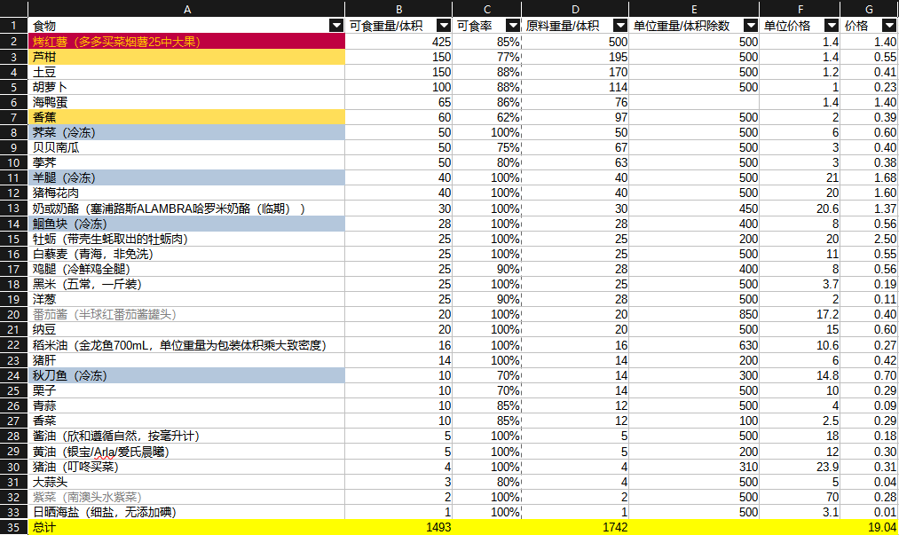

- ((65d69eec-99c7-465c-8a81-d6d583fcc2db))
- ((65d6c782-8ffd-4a70-bff2-9efd990e4cf3))
- ((65ae0905-914f-4d3d-a1de-f9419083a2ac))
- [【疫情提示】节后疫情健康提示](https://mp.weixin.qq.com/s/AAQbHf2jNaWy5xgs124qvg)
- ((65d74859-00df-4482-ae3d-b5dc55de2866))
- ((65d74efa-7697-4e83-9c23-8c0654a6a823))
- 
- ((65d754c0-b06f-446d-8c18-fec3e13610f6))