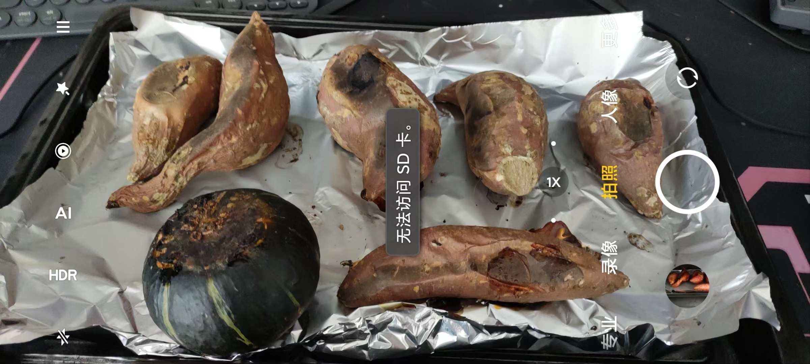

- ((65d6c524-0170-4f3e-8e0e-62fe5fd0eddc))
- [[运动饮料]]
	- ((65e400d8-71a0-4463-a760-f11cd06ca9f9))
- 
	- 红薯6个1167g，贝贝南瓜285g（第一轮还是190度45分钟，第二轮换为目前的180度45分钟，还剩38分钟时开始加热）；烤红薯903g，烤贝贝南瓜255g；烤红薯的皮88g，烤贝贝南瓜的皮46g；烤贝贝南瓜的含籽南瓜瓤72，烤贝贝南瓜的南瓜子33g，则烤贝贝南瓜肉176g；南瓜子烤箱烤糊了没吃
	  id:: 65e46dc0-883c-4afe-952a-321a2437fad6
- {{embed ((65d94c78-6210-47e6-bfd6-9cb0a03f7c4f))}}
- ((65e456f9-c905-4d76-a30f-736d01a82029))
- ((65e46669-6e39-4e5e-9439-bdd30b833405))
- ((65e493d4-9215-48cc-98c6-1269cca46631))