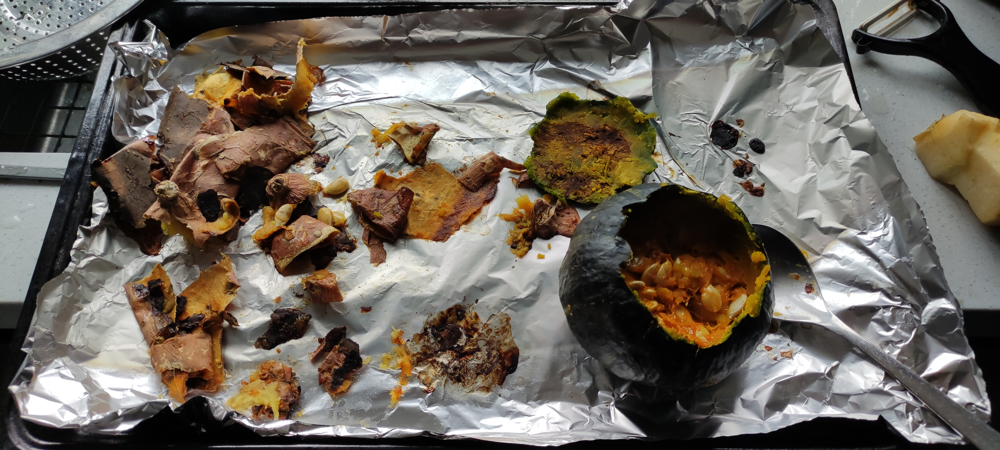
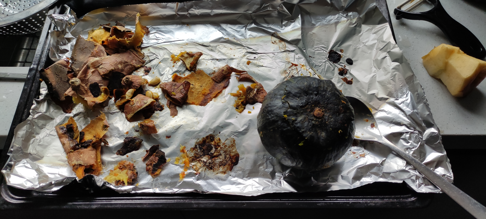
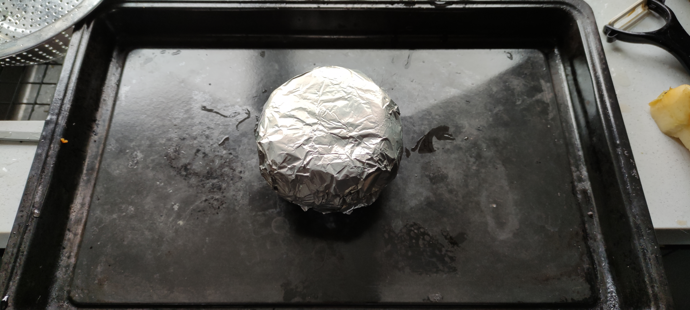

- 
  id:: 65e53c53-0d52-48b0-a6c1-0f2629cb4eff
	- 红薯3个614g，贝贝南瓜370g；烤后471g，344g；皮48g，吃后280g，裹铝箔287g；两天后，皮61g，籽28g——则烤贝贝南瓜肉255g——南瓜子烤箱180度15分后14g，南瓜子表面微焦，仍带点水分，偏软，仍不太易食用
	  id:: 65e52dbb-ae66-4bc5-8b27-9a1e7d2bffe3
	- 
	- 
	- “看懂掌声！”
- ((65e533c8-a27e-47aa-8a4e-ef1a76c4b740))
- ((65e59bd8-9fa1-47ba-ac15-4f257f942106))
- ((65e52e9e-5043-4578-9c61-04fe0a0fc864))
- ((65e53215-6bea-4042-b1d5-c313f5534312))
- ((65e5b6ac-b262-4722-8079-c9dd1a4fb906))
- ((65e48c02-e3ae-4f6a-ad9f-8f94ed845a2c))
- ((65e5dbc0-bed7-40a3-8681-aa1778e0d70e))
- ((65e5e1a2-0f07-4e18-86e9-33fa88ec04d8))
- ((65e5e117-b256-433d-8767-dba9481674a3))