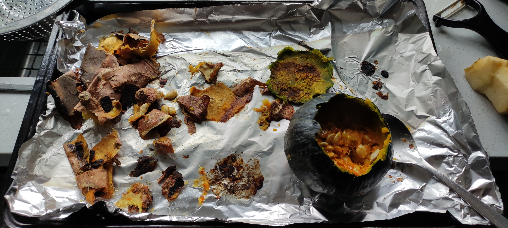
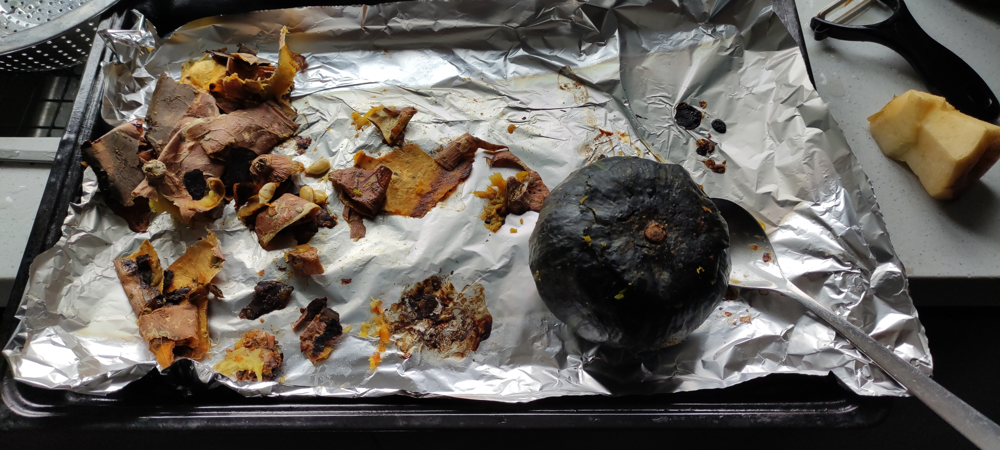
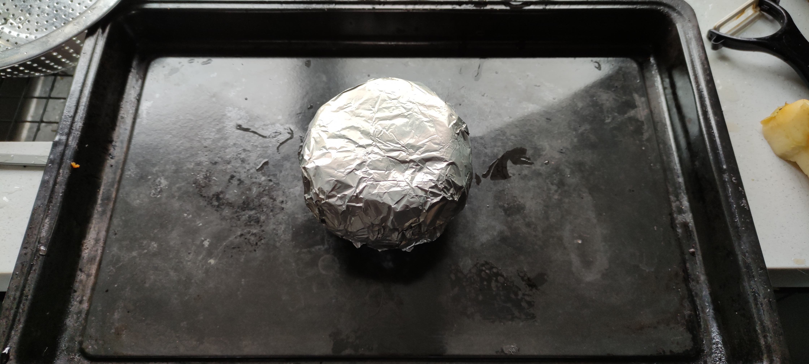

- 
	- 红薯3个614g，贝贝南瓜370g；烤后471g，344g；皮48g，吃后280g，裹铝箔287g
	  id:: 65e52dbb-ae66-4bc5-8b27-9a1e7d2bffe3
	- 
	- 
	- “看懂掌声！”
- ((65e533c8-a27e-47aa-8a4e-ef1a76c4b740))
- ((65e52e7a-e909-4633-ab18-3b00925c29f9))
- ((65e52e9e-5043-4578-9c61-04fe0a0fc864))
- ((65e53215-6bea-4042-b1d5-c313f5534312))