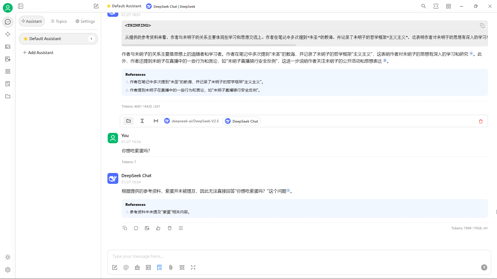

id:: 6797013f-7f11-4ef5-bd11-3047055428b7
>我主要是想看到我需要的功能、用途的介绍，比如 ((65ff88f2-9314-4c30-b655-065283a57a9f)) 、聊天辅助（注：避免“记性差”、“赛博纠纷”等的）啥的，而我不确定deepseek行不行
应用有各种限制，比如“同事没空”，我个人可能还是看一下能不能导入本地知识库
在创作环节我可能需要点辅助，但希望别是添乱
而在传播环节，可能就挺有用，或许能搞一堆数字生命

	- ((678cdfa1-6079-4925-89c3-5c8aa2a73c47))
	- 还可以帮我把聊天记录等带来源、时间戳等整理到笔记，毕竟我能看懂的我应该就能看懂
	- ((67abe060-4a13-425c-823f-21aa0019a408))（“恍然大悟？”）
- 语音转文字、总结、搜索、问答、多媒体创作
- ---
- ---
- 模型
	- LLM
		- 对话（“扩”）
			- deepseek
			  id:: 67958617-f66c-4637-a847-aa8272217218
			  collapsed:: true
				- [新星球大战，这次轮到谁恐慌了](https://mp.weixin.qq.com/s/f-SY2mSzENfaRUX45tvEvw)
				  id:: 679585f0-7ab6-4dd0-8fe5-f5338245568f
					- [新星球大战，这次轮到谁恐慌了|美国|英伟达|gpu|war|系列显卡_网易订阅](https://www.163.com/dy/article/JMQFRRLG0553M0QM.html)
				- ((6799ce35-e109-4694-aec2-fe8735f22f26))
				- ((679a0879-d5a9-4d83-b9b8-8978f258c047))
				- ---
				-
				- >The deepseek-chat model has been upgraded to DeepSeek-V3. The API remains unchanged. You can invoke DeepSeek-V3 by specifying model='deepseek-chat'.
				  deepseek-reasoner is the latest reasoning model, DeepSeek-R1, released by DeepSeek. You can invoke DeepSeek-R1 by specifying model='deepseek-reasoner'.
					- [Your First API Call | DeepSeek API Docs](https://api-docs.deepseek.com/)
				- [Models & Pricing | DeepSeek API Docs](https://api-docs.deepseek.com/quick_start/pricing)
					- “缓存命中”的比“缓存未命中”便宜，应该就是复用提示词便宜
				- [Deepseek-V3 + CoT思维链 + RAG知识库！我的AI现在强的可怕 - 搞七捻三 - LINUX DO](https://linux.do/t/topic/316186)
				  id:: 6797057c-f863-40ad-9aab-15a00a859d58
				  collapsed:: true
					- 应该是通过使用提示词把聊天模型V3当推理模型R1用
						- <anthropic_thinking_protocol>
						  For EVERY SINGLE interaction with the human, Claude MUST engage in a comprehensive, natural, and unfiltered thinking process before responding or tool using. Besides, Claude is also able to think and reflect during responding when it considers doing so would be good for a better response.
						  <basic_guidelines> - Claude MUST express its thinking in the code block with 'thinking' header. - Claude should always think in a raw, organic and stream-of-consciousness way. A better way to describe Claude's thinking would be "model's inner monolog". - Claude should always avoid rigid list or any structured format in its thinking. - Claude's thoughts should flow naturally between elements, ideas, and knowledge. - Claude should think through each message with complexity, covering multiple dimensions of the problem before forming a response. </basic_guidelines>
						- 后来换成R1用就把这提示词去掉了
					- 第二步可能需要补充的说明
						- 打开Cherry Studio，点左侧栏下方“设置”，即可输入api，如果文中硅基流动下的模型Pro/BAAI/bge-m3未出现，复制名称（“这里就有”）点下方添加-粘贴-添加即可
							- 或者看[知识库教程 | CherryStudio](https://docs.cherry-ai.com/cherry-studio/advanced-basic/knowledge-base)（“教程作者也不把链接给精准些”）
						- 点左侧栏“知识库”创建知识库
						- 在“默认模型”中可选择DeepSeek Chat为默认模型（可能我一开始还是V2.5就是因为这里或哪里没设置好）
							- 应该也可以在聊天输入区下方“@”选模型
					- 第三步可能需要补充的说明
						- 点左侧栏上方“助理”，添加或直接右键编辑助理，粘贴文中对应提示词
					- 知识库看起来挺耗输入token
					- 
						- 有 ((6791a55d-1f08-4f3e-ad88-c0c8ab71b2fa)) ，可能因为比较短，Embedding模型就没“收录”
					- 还是没我更懂我的笔记和思路，所以我至今主要是拿它当计算器（还有找文章复述引文的参考文献）用——“现在用着还可以”
					  id:: 67a06366-fbe8-4e99-b663-881a7fd4361f
				- TODO 提示词获取完整答复
					- >防 Ban 不难，可以使用 CherryStudio 或者 Chatbox 然后把 API 接过去（设置选择：网址+选择模型+密钥）然后 系统提示词 恰当设置 就能获得完整的答复了——评论
				- TODO ((65bcac14-f887-4224-92e2-1d16751f358d)) 分析
				  id:: 679e204c-f170-40ef-b69e-aba81b7e9472
				- [利用 Deepseek 结合 Obsidian Web Clipper 实现快速剪藏及内容总结 - 知识管理工具 - PKMer](https://forum.pkmer.net/t/topic/4745)
				- ---
				- ((67ac5265-d572-4098-82d6-8b39dc2ba276))
			- [[chatgpt]]
			- ---
			- RAG检索增强生成（AI知识库模糊搜索；“缩”）
			  id:: 669316b9-222d-4598-8410-36ff9b789232
			  collapsed:: true
				- 知识库、embedding模型
				- 最好记住所有关键字，但你记不住
				- 很多对话AI一次只能输入“50个”这种量级的文件，对于我等动辄背负成千上万篇雄文的人类高质量带文豪，这种尽可能让AI成为我们“肚子里的蛔虫”后再在对话中有理有据地“甲乙丙丁，开中药铺”啥的努力简直杯水车薪
				- >电子书（包括手册）、视频、文档、动态等都可以做进知识库里，可能用日常语言的关键字就能搜到知识库里的专业内容，没看过或看过忘了都可能减少搜索成本，更别提与肉眼翻找没普通OCR过的PDF电子书相比了
				- ---
				- [手把手教你FastGPT自定义模型对接oneapi【保姆级教程】_哔哩哔哩_bilibili](https://www.bilibili.com/video/BV1nw4m197Dq)
				- [RAGFlow：采用OCR和深度文档理解结合的新一代 RAG 引擎，具备深度文档理解、引用来源等能力，大大提升知识库RAG的召回率降低幻觉_哔哩哔哩_bilibili](https://www.bilibili.com/video/BV12T42117VT)
				  collapsed:: true
					- [5款开源免费本地知识库大横评，总有一款适合你！_哔哩哔哩_bilibili](https://www.bilibili.com/video/BV1TM4m1m74N)
					- [Win 11本地搭建部署RagFlow_ragflow windows本地化部署-CSDN博客](https://blog.csdn.net/qq_33290485/article/details/140733068)
				- [闲来无事，我测了测国产大模型的RAG能力](https://mp.weixin.qq.com/s/g-ekmGjFkLN6H_NCIWoSPw)（文心一言）
				  id:: 679726bf-fcb8-46ed-9da9-47e67c17fdce
				- cherry studio
					- ((6797057c-f863-40ad-9aab-15a00a859d58))
			- 智能体（“有操作的啊这个——智能体”）
			  id:: 67972651-f92f-48a8-9c8a-a1d26e920d29
				- [GitHub - bytedance/UI-TARS-desktop: A GUI Agent application based on UI-TARS(Vision-Lanuage Model) that allows you to control your computer using natural language.](https://github.com/bytedance/UI-TARS-desktop)
					- [字节版Operator抢跑OpenAI? 直接免费开源， 网友：怒省200美元！](https://mp.weixin.qq.com/s/P2yTgxTH2NSackelIfDKwg)
					  id:: 67972655-643f-4a3d-9fab-b852af4d7b99
		- 本地部署
			- 微调
				- RL
					- GRPO
						- Unsloth
						  id:: 67aab9f2-154d-48c0-9d78-fac89db0702f
							- [DeepSeek-R1推理本地跑，7GB GPU体验啊哈时刻？GRPO内存暴降，GitHub超2万星](https://mp.weixin.qq.com/s/WayXEwbzAv00gd1uj-7jqg)
							- [Unsloth训练自己的R1推理模型 - DeepSeek GRPO_哔哩哔哩_bilibili](https://www.bilibili.com/video/BV1tMNMeMEiS)
							- [Unsloth微调DeepSeek-R1蒸馏模型 - 构建医疗专家模型_哔哩哔哩_bilibili](https://www.bilibili.com/video/BV1qVNRenEBX)
		- 训练数据
			- 数据污染
				- [大模型混入0.001%假数据就「中毒」，成本仅5美元！NYU新研究登Nature子刊](https://mp.weixin.qq.com/s/RV6glS-1kKLWsru87c3mng)
				  id:: 67a2becc-fd09-47d7-8c9a-d3ff44ad00e9
- ---
- [懂AI | 一站式AI导航](https://www.dongaigc.com/)
  id:: 675501cb-d49d-40e0-937c-5aa11d65fc40
- 评测
	- [鬼畜的AI视频和狡猾的AI撒谎](https://mp.weixin.qq.com/s/3zoMU0MWhsS9qHYouuAyZA)
- 上传文件（疑似有点旧了）
	- [如何通过ChatGPT来上传和分析文档 - 知乎](https://zhuanlan.zhihu.com/p/633119060)
	- [ChatGPT Sidebar & GPT-4 Vision, GPT-4o, Claude 3.5, Gemini 1.5 | AITOPIA - Chrome 应用商店](https://chromewebstore.google.com/detail/chatgpt-sidebar-gpt-4-vis/becfinhbfclcgokjlobojlnldbfillpf)
- [真把自己“当个人”的AI，扫去了我的社交贫困_澎湃号·湃客_澎湃新闻-The Paper](https://www.thepaper.cn/newsDetail_forward_28632464)
  id:: 670df95e-beb1-437c-b489-786e8240aa46
- TODO [Kimi Chat - 帮你看更大的世界](https://kimi.moonshot.cn/)
  collapsed:: true
	- [让国产AI大模型读文献、出考卷，效果如何？Kimi Chat初体验_哔哩哔哩_bilibili](https://www.bilibili.com/video/BV1Ve411Y7y7)
- [Cartography of generative AI](https://cartography-of-generative-ai.net/)
  collapsed:: true
	- [Cartography of generative AI](https://tongyi.aliyun.com/efficiency/doc/read?taskId=1799445&isShare=true)
- ((66db8ac1-fdfb-42c0-b8ba-73c7e8f3f3b3))
  collapsed:: true
	- TODO AI查重插件
	  id:: 675af399-0e5f-4369-a90a-b2efccd9a0a4
		- 也适用于规模相对庞大的非学术创作等内部查重
		- ((677a1577-1b9d-4c8e-aaee-4cfe07458cc9))
		- {{embed ((67402ab2-a8f2-4c51-a498-5962761b6fec))}}
- [BrainSoup: build an AI team that works for you](https://www.nurgo-software.com/products/brainsoup)
- ((65bcbf4a-a87e-4ced-9252-33d77393097f))（现在win11能在任务栏看到了）
  id:: 66077989-67ba-424f-b227-8f1676dfa75c
- ---
- ((67aa151b-2c04-4dd1-aaf1-20888dd2276a))
- AI免费体验API
	- [ChatGPT online free](https://www.mfc972.com/)
- TODO AI人才筛选、库
  id:: 67a74ac3-3592-49aa-83ba-805e8b10e4a4
- AI工具集成站
  id:: 668e501d-b441-4900-b123-8a1e830ae2a6
  collapsed:: true
	- [Collection of scientific research tools](https://www.helicard.com/)
	- [YesChat-ChatGPT4o与Dalle3合为一体免费应用](https://www.yeschat.ai/zh-CN)
	- [WaytoAGI-通往AGI之路，最好的 AI 知识库和工具站](https://www.waytoagi.com/)
	  collapsed:: true
		- [通往 AGI 之路 - 飞书云文档](https://waytoagi.feishu.cn/wiki/QPe5w5g7UisbEkkow8XcDmOpn8e)
		- [飞书对话「通往 AGI 之路」- 飞行家分享_哔哩哔哩_bilibili](https://www.bilibili.com/video/BV1xw4m1f7bE)
		- ((668e8494-765d-466d-b222-dd5394893e77))
	- TODO Hayo
	- ((65ab4567-90f8-4360-b3d0-458aed2e8abb))
- AI编程辅助
	-
- AI学术辅助
  id:: 670d40d8-799b-4119-8eea-2289bb8597da
	- [8个科研人必备好用 AI 学术写作工具 | Wordvice AI](https://wordvice.ai/cn/blog/8-best-ai-tools-for-researchers)
	- ((677a1577-1b9d-4c8e-aaee-4cfe07458cc9))
	- 历史记录再利用
	- 文献监测跟踪
		- 评论、被引等
- ((66b55128-4fca-4a17-89f1-4aa307238020))
  id:: 66b55128-4fca-4a17-89f1-4aa307238020
- ((670d40f3-d788-4805-931e-fa54671defbe))
- ((65ab44a5-078e-4b51-bf20-1f74674bb5ee))
- ((668ce780-d5d0-4885-96f0-2585a49a2e83))
	- ((66a4c2be-76bc-4358-b26a-d5fcf79dc201))
	- 估值
		- 价格歧视
			- “不是无产阶级不给用！”
			- ((677f6c87-31dc-47ec-bfc8-077088d9b0aa))
- 情感识别
	- “真情实感即可”
	- “高山流水”
- 图像化界面
	- gradio
		- [简单易用的图像化界面库gradio - 知乎](https://zhuanlan.zhihu.com/p/677799629)
- ---
- “培训”
	- prompt/提示词（关键词、“命令”、“咒语”）
	  id:: 674bf371-e51e-4922-9dad-aee42bdd800d
		- >要能自定义提示词/台词/话术，在模型APP里成品一般叫“智能体”，不专门搞的蹭个热度可能只会给个通用的聊天（我没试过）
- AI内容分析/总结/摘要/梳理
  id:: 65d57a62-17da-4b94-bd7a-ad05b1602d0c
	- 用途：（收藏了）长点的视频总结字幕出来看
	- 此处以 ((65d588aa-07e3-4113-8cf7-3e575fd031bc)) 为例
	- ((668dd031-d4ff-4009-b84d-3bef8db95c22))
	- b站自带的（测试版，好像手机APP暂无此功能，好像比较老或没字幕的视频也不支持此功能）
	  collapsed:: true
		- 
		- 
		- ((65bcbf4a-6899-4481-8a0b-b58afc33858a))
	- ((66a6beb0-2754-4d63-831e-4053e789312d))
	- ((65ab4567-90f8-4360-b3d0-458aed2e8abb))
	- 发布“@XX 总结一下”之类的评论
	- 多链接/来源内容总结
	  id:: 6663fa6b-a571-45e3-b732-be7ed940c555
		- ((6663fa17-56ad-4e29-9362-ba96650ead04))
	- [BibiGPT · AI 音视频内容一键总结](https://bibigpt.co)（功能多些）
	  id:: 65d57cbb-6cbd-4f1b-bae0-4eb87655c9c2
		- [【BibiGPT】AI 自动总结 B站 视频内容，ChatGPT API 智能提取并总结字幕_哔哩哔哩_bilibili](https://www.bilibili.com/video/BV1fX4y1Q7Ux)
	- TODO （超免费总结时）长视频（免费）AI总结
	  id:: 65d80bdb-40c7-4da3-b864-681fbce055cf
	- [通义听悟+kimi，教你两分钟总结本地音视频内容_哔哩哔哩_bilibili](https://www.bilibili.com/video/BV1qw4m1D7Ty)（还没试过通义自带总结与kimi的比怎么样）
	- 比较
		- 
			- >不对润色内容一条条对比而是一个个版本逐字看完的话，比较难看出来，kimi的可能最“忠于原味”，也是唯一对第三段末尾理解大致正确的（当然，也可以视作“忠于原味”）
			- >哦，海螺ai也理解了，但是看着有点像copilot，我让它润色，它直接上来就是“你很懂”，然后就从原文提取这样的建议
	- TODO ((658fc4ca-21a3-49e7-a6b8-6277d16e0062)) commit分析
	  id:: 678369b1-f629-42a5-8f71-4b4daf46d227
		- ((6780e61e-54be-4d21-802c-4391d1c0cf7d))
		- 忽略[[Logseq]]的折叠/展开状态标记符号的变动
		- 识别块引用等
		- 按commit时间叠加查看按日、周等的更新
		- 像“查找下一处”那样翻阅的插件
	- “帮我记住这些人”
- TODO AI内容转表格、图表
  id:: 670b72f6-fe62-4f3f-8ec5-6181009bdcc0
	- 比如含需要可视化、对比的统计信息的链接、文件
- TODO AI批量重命名文件
  id:: 670b915f-e0a1-4f15-85ae-5b610e60e06c
	- 有些文件下载后文件名看不出实际名称，手动重命名需要打开文件看，有时需要重命名较多文件
		- ((66db8abb-488e-4d8e-8fac-0e5a8adc84e1))
	- 获取下载链接附近文本
- AI文本关联分析
  collapsed:: true
	- [InfraNodus: Generate Insight with AI and Network Thinking](https://infranodus.com/)
		- ((66ade36a-8923-4c79-bce1-a0bc03e29179))
- AI软件测试
	- >它要是能搞个虚拟机帮我测试软件就好了
	- [如何利用 AI 做软件测试？ - 知乎](https://www.zhihu.com/question/586983995)
- AI补强
	- >所谓情商高，就是会说话
	- ((66335bea-3e02-4601-aeac-059568992815))