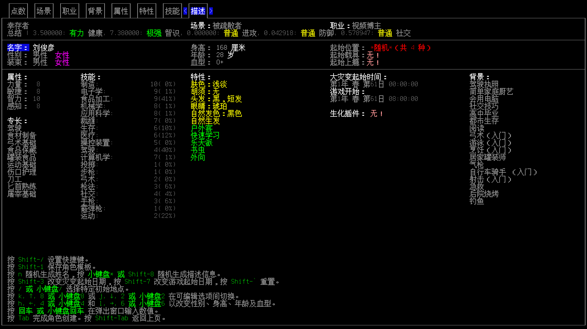

- [[CDDA相关图书]]
- TODO [[《CDDA思维：为什么CDDA这么难，为什么玩家玩的也是自己游戏史的CDDA》]]
- TODO cdda工具、购物车等实物
- 有点像pathos，但相对“现实”些，或者说不那么DND（龙与地下城/地牢）
	- [[推荐]原滋原味的roguelike是什么样的？边谈边荐《NetHack》《Elona》《CDDA》 - 星晖帝国的一番的动态 - TapTap](https://www.taptap.cn/moment/15216925399319905)
	- [还有其他类似cdda，但是非丧尸题材的游戏吗【cataclysmdda吧】_百度贴吧](https://tieba.baidu.com/p/9014735050)
	- [CDDA is one of the best games I've played, why is it so unpopular? : r/cataclysmdda](https://www.reddit.com/r/cataclysmdda/comments/15vghci/cdda_is_one_of_the_best_games_ive_played_why_is/)
- cataclysm，catalyst
  id:: 686cc1f9-7176-47a9-af1e-d520173c074c
- 游戏设定（背景、世界观）
  collapsed:: true
	- 新英格兰New England
		- [新英格兰 - 维基百科，自由的百科全书](https://zh.wikipedia.org/wiki/%E6%96%B0%E8%8B%B1%E6%A0%BC%E8%98%AD)
		- 著名医学期刊NEJM
	- ---
	- 比较剧透的
		- [看看我游世界观能有多绝望【cataclysmdda吧】_百度贴吧](https://tieba.baidu.com/p/9035106857)
		- [cdda阵营介绍【cataclysmdda吧】_百度贴吧](https://tieba.baidu.com/p/7339545475)
	- [Cdda大灾变的游玩 VS Cdda世界观_哔哩哔哩_bilibili](https://www.bilibili.com/video/BV1eDVieQELA/)
- 开发中的争端
  collapsed:: true
	- [好几年没玩了，回坑发现drama不少？【cataclysmdda吧】_百度贴吧](https://tieba.baidu.com/p/9691792599)
	- [(水)【cataclysmdda吧】_百度贴吧](https://tieba.baidu.com/p/7521643512)
- ---
- 下载
	- 游戏本体
	  collapsed:: true
		- [Cataclysm: Dark Days Ahead](https://cataclysmdda.org/)
		  collapsed:: true
			- 基于DDA的开源免费游戏
			- [Releases · CleverRaven/Cataclysm-DDA](https://github.com/CleverRaven/Cataclysm-DDA/releases)
			  id:: 684658b7-551b-4658-8e77-7dda2bd1befd
			  collapsed:: true
				- ((67402acb-9a37-48c8-843f-077a630cf20b))
				  collapsed:: true
					- “你是怎么来这里的？截屏？”
					- ~~“打不开、不会跳的话可以等空间风暴”~~
				- 选带“tiles”和“sounds”（多个CC-Sounds音效包，比只有“界面音效”的Basic音效包多很多音效），你的操作系统、位数（32位还是64位）的链接下载
				  collapsed:: true
					- 据说：msvc可用于做mod，在windows原生环境更稳定
					- [我该下哪一个【cataclysmdda吧】_百度贴吧](https://tieba.baidu.com/p/9023960609)
					- [实验版下载求助【cataclysmdda吧】_百度贴吧](https://tieba.baidu.com/p/7929876571)
					- ---
					- [【图片】老哥们求助，安装太阳能板的问题【cataclysmdda吧】_百度贴吧](https://tieba.baidu.com/p/9300556336)（“看导航贴下载导致的？”）
				- 了解新版本的变化内容，选择版本
				- 带`[]`或至少带冒号的是模组更新，你可能不需要
			- [版本简介及个人点评【cataclysmdda吧】_百度贴吧](https://tieba.baidu.com/p/9714678594)
			- 有tab键的手机输入法
			  collapsed:: true
				- >黑客键盘
				- >讯飞输入法，有tab键，有游戏键盘，非常适合手机cdda，
		- 另外的分支
		  collapsed:: true
			- CBN
			  collapsed:: true
				- [cbn和cdda0.h（求问）【cataclysmdda吧】_百度贴吧](https://tieba.baidu.com/p/9780184903)
				- [来自BN组的愚人节玩笑【cataclysmdda吧】_百度贴吧](https://tieba.baidu.com/p/8343991825)
				- [CBN汉化组锐评CDDA【cataclysmdda吧】_百度贴吧](https://tieba.baidu.com/p/9777948192)
	- 启动器
	  collapsed:: true
		- 除了存档备份、恢复外，还有一键更新等功能
		- 有多个世界时，单个世界存档可能还是单独备份快些
		- [GitHub - DoiiarX/CDDA-Game-Launcher: A Cataclysm: Dark Days Ahead launcher with additional features](https://github.com/DoiiarX/CDDA-Game-Launcher)
		  id:: 67402aab-601e-4702-b366-49894d1aa778
		  collapsed:: true
			- 中文
			- 功能比下面官网链接里的更丰富
			- 可以把存档上限改高点
			- [CDDA 游戏启动器 汉化版 国内直连加速  | Doiiars Blog](https://doiiars.com/article/CDDA-Game-Launcher)
			- [【图片】我做了个cdda启动器汉化版【cataclysmdda吧】_百度贴吧](https://tieba.baidu.com/p/8883710208)
		- [GitHub - Fris0uman/CDDA-Game-Launcher: A Cataclysm: Dark Days Ahead launcher](https://github.com/Fris0uman/CDDA-Game-Launcher)
		  collapsed:: true
			- 英文
			- 较方便地更新（实际）最新版、回到前一个版本、自动/手动备份存档（我是启动前和更新前自动备份）、选择备份存档回档、安装/禁用/删除音效包等
	- 模组mod
	  id:: 67eb2809-b660-4ea2-a851-59736878123a
	  collapsed:: true
		- 游戏本体附带一些
		  collapsed:: true
			- 翻译晦涩对话
			  collapsed:: true
				- 鲁比克之类对话的中译看起来会清楚些，但并非完全清楚，这个模组提供（可能）更清楚的“英译”
			- 特色升级能力
			  collapsed:: true
				- ((684f925d-ab4f-4abc-ac0f-321d55f0d06f))
			- 杀怪提升属性
			  collapsed:: true
				- [【杀怪提升属性】是如何计算的？【cataclysmdda吧】_百度贴吧](https://tieba.baidu.com/p/7285395617)
				- ((6847ecfa-d686-49f9-93d0-3837f9665a39))
		- 整合包modpack
		  collapsed:: true
			- ((67402aab-601e-4702-b366-49894d1aa778)) 启动器里可安装
			  collapsed:: true
				- [GitHub - linonetwo/CDDA-Kenan-Modpack-Chinese: （最新实验版）Kenan's 大型 modpack 社区汉化版 For Cataclysm - Dark Days Ahead](https://github.com/linonetwo/CDDA-Kenan-Modpack-Chinese)
				  collapsed:: true
					- [Kenan整合包 | Cataclysm: DarkDays Ahead Wiki | Fandom](https://cdda.fandom.com/zh/wiki/Kenan%E6%95%B4%E5%90%88%E5%8C%85)
		- 带传送功能的
		  collapsed:: true
			- [现在0.G稳定版有什么超长距离跑图手段么_cataclysmdda吧_百度贴吧](https://tieba.baidu.com/p/9224832261)
		- [【图片】枪械工坊的复活？【cataclysmdda吧】_百度贴吧](https://tieba.baidu.com/p/9028711320)
		- [【自制mod】农业拓展mod新发布帖【cataclysmdda吧】_百度贴吧](https://tieba.baidu.com/p/8073154761)（可能没在更新了）
		- ---
		- ((685a426a-ac91-4b15-882f-85116f75a808))
		- [Json编写教程 | Cataclysm: DarkDays Ahead Wiki | Fandom](https://cdda.fandom.com/zh/wiki/Json%E7%BC%96%E5%86%99%E6%95%99%E7%A8%8B)
		- [基础模组编写 | Cataclysm: DarkDays Ahead Wiki | Fandom](https://cdda.fandom.com/zh/wiki/%E5%9F%BA%E7%A1%80%E6%A8%A1%E7%BB%84%E7%BC%96%E5%86%99)
		- [【图片】<新手向>MOD入門：如何在CDDA中捏角【cataclysmdda吧】_百度贴吧](https://tieba.baidu.com/p/6307216734)
		- [简单的mod教学物品章武器篇【cataclysmdda吧】_百度贴吧](https://tieba.baidu.com/p/7642657829)
		- [【图片】新人向|无基础情况下如何从0开始写MOD【cataclysmdda吧】_百度贴吧](https://tieba.baidu.com/p/7880896727)
		- [How to easily find conflicting mods and solve them : r/skyrimmods](https://www.reddit.com/r/skyrimmods/comments/ieqgsk/how_to_easily_find_conflicting_mods_and_solve_them/)
		- ---
		- 更多中国元素
		  collapsed:: true
			- “三大神书”
			  collapsed:: true
				- ((68539f90-6143-40d5-822f-a587a4ba58c8))
		- ((66e0d6b8-dfe8-479b-a3a1-7ff381d46097))
			- 社会主义平行地球（派系、任务、物品、地图等）
				- 平行地球科技水平略高，正在其太阳系内拓展，研究传送门时变形怪入侵
				- 平行地球及其空间站、月球、火星等基地尚未完全被变形怪占领
					- 平行地球人类的生存样态不能一概而论，高度分散、自由、实验、冗余、灾备
					- 变形怪的危害被提前发现和着手处理，于是变形怪提前爆发，并持续调动了多得多的异界怪物继续进攻
				- 为探索平行世界而志愿报名并公投选择的特工已随一开始的空间风暴进入并潜伏
				- 特工根据工作需要选择安装CBM，但无流亡族那样的金属成分和风格
				- 因为起点比较稀有，所以CDDA地球上的Hub和流亡族在此之前均未见过
				- 接头
					- 特工在一些场所的醒目位置张贴了共产主义相关标志、宣传信息等
						- 图书馆等
					- “这个世界有什么你认为缺少的东西吗？”
					- ---
					- “为什么你们不自己做？”
						- 平行地球特工没有感染变形怪（也是减小被变形怪获知的风险），非常“纯净”，也因此缺少相关增益
						- “那好吧，加个平行地球特工的背景、职业啥的，吃喝上可讲究喽！”
						- “那好吧，跟着走，但要尽可能避免变形怪等的感染，比如通过受伤、喷射、剂量堆积等”
					- “为什么你英语说得这么好/比鲁比克好很多？”
						- “巧了，我们也是这种英语（，只是少了一些你们的延长了的资本主义时期的词汇）”
						- 使用了合适的学习工具
				- 任务
					- 取回平行世界的陨石空投
					- 发展成员、同盟
						- 科迪·米勒
						- 特定特质NPC
						- 无线电广播
					- 寻找变形怪解药
						- 有个特工感染了变形怪
					- 与平行世界恢复联系
					- 传送
				- 资源
					- “稀奇古怪但有用的知识”、快速捣碎工具、隐蔽式呼吸器
					- 动力伞
- 标题（主界面的“大灾变”等）
	- [uhhh what? : r/cataclysmdda](https://www.reddit.com/r/cataclysmdda/comments/hklu21/uhhh_what/)
	  id:: 68671a8d-158a-4aa9-bf3f-026c055940c2
- 游戏教程
- 世界
  collapsed:: true
	- 就是（没开的）大地图
	- 和平模式
		- [这游戏要是有和平模式就好了【cataclysmdda吧】_百度贴吧](https://tieba.baidu.com/p/8866200323)
		- 贴图包选cuteclysm启动星露谷？
	- 重要位置间距离近
	  id:: 68477306-8c58-4369-87de-c83f63fb5137
		- [从未有如此美妙的开局【cataclysmdda吧】_百度贴吧](https://tieba.baidu.com/p/9599292838)
		- [坏了，我成凯文神选了【cataclysmdda吧】_百度贴吧](https://tieba.baidu.com/p/8918753579)
	- 低物品生成率
		- 野人
			- [到底怎么当一个合格的野人？【cataclysmdda吧】_百度贴吧](https://tieba.baidu.com/p/7701586976)
	- ---
	- ((68667bd7-cf17-46a5-98c8-6d3bef8b3b03))
	- “CDDA宇宙的生态疑似有点失衡了”
- 角色@（昵称“小@”——老版本没贴图包，就显示“@”）
  id:: 67eb2809-080e-4afd-a75c-376ec97628a0
  collapsed:: true
	- 角色不光是人（虽然也可能不太是），还有场景（角色在哪）等，相对接近“社会关系的总和”
	- “新游戏”-“新角色”
	  collapsed:: true
		- ((6846eafb-d0f5-4503-a2b5-3dd06bb10e5d)) 可能会使“新角色”界面无法显示对应条目，可更改（可以先尝试调回默认，再逐渐修改，宽高比）
		- 前面的栏目选择对后面的有限制，所以按从左到右顺序选择，否则后面的会被前面的覆盖（“哇靠！”）
		- ---
		- 场景
			- 场景地点（开局地点/位置，可在后面“描述”栏目选择）
			- 起始NPC（同伴）
				- 有些场景无
				- 可以说服随行，有冲锋枪以上武器就能简单杀怪了，就可能不用造前期过渡长矛了
			- ---
			- 新手推荐场景
				- 被疏散者
				  id:: 68479af8-760d-49f5-963d-34b95ec81b4a
					- 可快速获取难民中心路线方便刷离难民中心近的世界
					- 开局有同伴
				- 安全位置
				  id:: 6847a1ab-443b-4d73-b2fd-8fef39d1892c
					- 不在紧急避难所，较远离城市，新手体验节奏可能比被疏散者慢
			- ---
			- 部分起始位置
			  collapsed:: true
				- ((67eb2809-4231-47b1-a6d7-056e566058ed))
				  id:: 674e8acc-bcff-492c-b4eb-e54a54c1893c
				  collapsed:: true
				- 监狱
					- 一般是拿把刀，做矛可能还是有点浪费时间
					- 如果打警察丧尸（在无窗房间里）且出防暴套装可以穿
					- 简易肩背带
						- ((6756e597-afb5-4d24-a94e-cb8299e1a8d8))
					- 工具房拿钢锯切栅栏门（、金属栅格窗）即可出狱，简陋开锁器撬锁可能到天黑也撬不开
					- 大黑房间里可下地下室，有热水器的净水可以喝和洗衣，打技术员可能出工业钥匙卡
			- 挑战-围城
				- [岩石边界是什么？【cataclysmdda吧】_百度贴吧](https://tieba.baidu.com/p/8885933034)
			- >讲个冷知识，围城开局难民中心解锁岩丘不会离得太远，至少会在巨壁之内——网友
				- ((683ec6b5-315f-4138-a664-9d6dc834c1fc))
		- 职业
		- 背景
		- 属性
		  collapsed:: true
			- 数字与分级，对应的能力
			- [【图片】cdda属性对应现实水平【cataclysmdda吧】_百度贴吧](https://tieba.baidu.com/p/9676980484)
			  id:: 678a4dd4-915e-488f-bb9a-1b1a0dd91f7e
			- 
				- ((674bf374-86bd-4d42-b865-1e7cd04054d2))
				- 当然也可以说游戏这部分不够“真实”，没什么负重时一秒跑三四米、跑个五十米不到就耐力严重下降也比较离谱
			- [游戏里生物的移动速度是不是太慢了【cataclysmdda吧】_百度贴吧](https://tieba.baidu.com/p/8448479746)
		- 特性
		  collapsed:: true
			- [【图片】我发特性，8u来打分😇【cataclysmdda吧】_百度贴吧](https://tieba.baidu.com/p/7703521595)
			- [求问哪些特性是后天无法获得的【cataclysmdda吧】_百度贴吧](https://tieba.baidu.com/p/8358020368)
			- 餐桌礼仪强迫症
			  id:: 67402aab-0069-45f6-b164-578ba4daada0
				- ((6848335a-8c69-4997-abf2-d834c39da2a6))
			- 孤独者
				- 给NPC营地任务即可
				- ((674c3c02-b0af-44e7-8451-25a707b61b61))
			- 杀意驱动（已去除）
			  collapsed:: true
				- [Obsolete killer drive by kevingranade · Pull Request #81329 · CleverRaven/Cataclysm-DDA](https://github.com/CleverRaven/Cataclysm-DDA/pull/81329)
				- 不受杀死 ((674183ff-146a-4209-9e7e-78dd1544961a)) 的负面影响（“主观上是误击——好，这下知道了！”）
			- 热爱甜食
				- [“热爱甜食”变异吃垃圾食品会涨健康么【cataclysmdda吧】_百度贴吧](https://tieba.baidu.com/p/9023862608)
			- 失聪
				- 不能与NPC谈话（“鲁比克  说了些什么但你听不见！”），赶时间的话可以重开或改文件
			- 末日精神病
			  id:: 68499f29-ca77-4a7a-94c1-ab526b8dbb04
				- [【图片】好吓人，这就是末日精神病吗【cataclysmdda吧】_百度贴吧](https://tieba.baidu.com/p/9181794397)
		- 技能
		  id:: 67eb2809-2a07-4b63-9b8c-01ef123d9843
		  collapsed:: true
			- “学好数理化，揍遍天下都不怕”
			- ((67402aab-b8ee-4c0d-9968-91c0cf2f76ac))
			- [关于游戏技能设定【cataclysmdda吧】_百度贴吧](https://tieba.baidu.com/p/9155459591)
			- [咱们小@也太废物了吧【cataclysmdda吧】_百度贴吧](https://tieba.baidu.com/p/9704653921)
				- 但靠墙时扔燃烧瓶砸身边墙上就离谱
			- “你这个技能疑似有点反智（力）了”
			- ---
			- 有不同进度范围的等级，对应理论知识进度和实践知识进度，实践知识进度低于理论知识进度时会有学习奖励
			- 游戏中的角色面板中的技能栏目
			  id:: 6848065a-50e3-4b65-b0e9-f749d5b53ff3
				- 深色技能表示实践技能与理论技能相同（“大多如此”），否则实践技能低于理论技能（游戏有“技能遗忘”机制，不用的技能的实践技能进度会随时间下降）
				- 对技能等级的描述也分为对理论技能的（前一行）和对实践技能的（后一行）
				- TODO 技能对应文本，双语比较表格
			- 很多用不着，很多通过实践（比如实战）即可训练升级
			- [机械，计算机，不读书，零级如何练？【cataclysmdda吧】_百度贴吧](https://tieba.baidu.com/p/4956043831)（老版本，不知道现在还行不行）
			- [回复：总结一下实验版得到的冷知识【cataclysmdda吧】_百度贴吧](https://tieba.baidu.com/p/9025815245?pid=150464725214&cid=0#150464725214)
			- 工艺技能
				- 生存
					- 包袱挑
			- 近战技能
			  collapsed:: true
				- ((6747c86e-60db-41b3-bba6-0200c7521dbd))
				- 徒手格斗
					- 蝌蚪
					  id:: 6748573a-f810-4e6b-a17c-5631cfb26130
					- 阿米巴原虫
					- 探照灯、炮塔等
						- [大佬们，有没有能练近战等级的书？【cataclysmdda吧】_百度贴吧](https://tieba.baidu.com/p/8894865758)
				- 穿刺武器
				  id:: 674a8b88-75d3-4a2b-bc0b-cfd381ab283b
					- ((6747c86e-60db-41b3-bba6-0200c7521dbd))
					- ((674ecae0-42b1-4e1f-9338-66149338a946))
					- ((674ab140-a3e8-4f6c-b84f-03e52866d45f))
				- ((684ee44c-55db-4f4e-8008-10545bbf155b))
					- 但综合训练效率和其他收获效率看好像不太值
			- 远程技能
			- 互动技能
				- 运动
					- 可根据现实中的 ((678a4dd4-5f36-416b-b648-56964a88536c)) 的调整
				- 机械学
					- 载具等
				- 电子学
					- 拆电脑等
				- 驾驶
					- 等级高了每秒可转动方向盘次数好像会增加
		- 描述
			- 可能选择对应场景的起始位置
		- ---
		- 角色设定参考
			- 尽量复刻自身情况
			  id:: 683fdfc6-c8bc-4a1f-992e-30f4f35e0aa9
			  collapsed:: true
				- “最认真捏人、备游、ARG的一集”
					- “不欺暗室这一块，心安理得这一块”
				- 一本正经地这样玩，或许也算是一种认识、完善你自己的路径
					- ~~“这小破游给我玩也是值了”~~
					- “学CDDA就挺累人了”
						- [Every hour in CDDA, new things to learn. (Im not making fun of new players on meme btw.) : r/cataclysmdda](https://www.reddit.com/r/cataclysmdda/comments/1fy4tes/every_hour_in_cdda_new_things_to_learn_im_not/)
					- [What are some things that Cataclysm has taught you in real life? : r/cataclysmdda](https://www.reddit.com/r/cataclysmdda/comments/15z2mjm/what_are_some_things_that_cataclysm_has_taught/)
					- [So...how many of you tried to learn irl new skill due to CDDA? : r/cataclysmdda](https://www.reddit.com/r/cataclysmdda/comments/1bh0dji/sohow_many_of_you_tried_to_learn_irl_new_skill/)
					  id:: 68521331-c3c3-432c-b746-29b95a423c69
						- >Also downloaded some helpful books that i think would increase one of the skills in cdda about but i still didnt get to read them haha. Speaking about books I heard that the books on cdda are based on real life books, just named a bit differently. I wonder if theres a list of all the realife counterparts of those books.——评论
						- >Thats cool,Have you tried making yourself in the game with the skill and stats you think you have?——评论
						- [[CDDA相关图书]]
						  id:: 68539f90-6143-40d5-822f-a587a4ba58c8
					- CDDA相关音乐
						- “小@你听的那么多细分曲风怎么个事，还有点简评，能不能让我也听听？”
					- “两个世界的平衡”
						- 定时玩CDDA
						  id:: 68462cd6-44e5-4a91-81c2-7d0fe15cc0a4
							- 用一对或更多 ((678a4dd4-fdab-4e10-a4b9-fb1ff1eff77a))
							- 但可以过时不补
							- 但~~不开游戏时~~整理游戏攻略可以不算（“我是懂讨价还价的”）
					- “（变得更强的）老玩家几度回归”
						- ((678a4dd8-277b-4c11-9607-e6b9acc500fa)) （“有端联想”）
				- ---
				- [如果你是CDDA中的普通人【cataclysmdda吧】_百度贴吧](https://tieba.baidu.com/p/9040691871)
				- 点数
					- “幸存者点数模式真好啊！”
				- 场景
					- 大的场景在新英格兰、中国还是其他地方——可以自己选，推荐还是“魂穿”（游戏中的）新英格兰，模仿多于超越，避免（因为姿势水平太高等导致的）“现实乐观主义”影响“原版游戏体验”，但可以适度嫁接
						- [如果cdda的背景在中国会是一款什么样游戏【cataclysmdda吧】_百度贴吧](https://tieba.baidu.com/p/8387859277)
					- ((68479af8-760d-49f5-963d-34b95ec81b4a))
						- （这里代入了中国大场景） ((6847a1ab-443b-4d73-b2fd-8fef39d1892c)) 别人也会去？
							- 或者离得远来不及去
							- “相信国家”
							- “那可以假设新英格兰相对很地广人稀”
				- 职业
					- 视频博主
						- 装备好的幸存者？
							- 我不是个对“小道”消息很闭塞的人，但（“为了平衡和游戏性”）假设等我知道时已经来不及买不到什么生存工具箱，更别提突击培训各种技能了
							- 更别提除了那小破生存工具箱外基本没啥了
						- 鸟类观察者？
							- 我的确有观鸟的兴趣，也有望远镜，所以可以选鸟类观察者——但我不太像是有生存3级，而且光看鸟可能只穿腰包而非信使包
							  id:: 684005fe-193a-4412-8df5-a33b388d3f24
						- 所以我选个视频博主吧，我的确是个发过一些视频的up主，我更可能带双肩包而非单肩包（信使包），假设外面的笔记本电脑也大多带密码锁上了吧，虽然没数码相机（当然它这个也没电，那就很厉害了）
							- ((68317631-62dc-48ca-9f4a-58829a85fbc3))
						- “以后试着搞个 ((67eb2809-b660-4ea2-a851-59736878123a)) ”
				- 背景
					- 加点效果会被后面更高级的覆盖，点不点自选，建议够格点上，省点后面发现“不行”后回来点上的时间（“那很懂省时了”）
					- 阅读
						- 平时能看点书（包括论文、电子书等）的，停电几天应该很难不爱看书吧？
					- 游泳（入门）
					- 烹饪（入门）
					- 急救？
					- 后院烧烤
						- 主理过两三次户外[[炭烤]]
					- 钓鱼？
						- 野水没钓上鱼也是钓，收费塘钓上鱼也是钓
							- 但好像还是不太行，钓的时间很短，野钓就更少了
						- 我会对死鱼（或者差不多死的）去杂（有时还会保留肝和心）、切鱼柳，应该也会对活鱼“迎头痛击”
					- 弓术（入门）
						- 小时候玩过（希望别是错误记忆）的旅游弓也是弓
					- ~~烹饪（中级）~~
						- 描述更西餐，烘焙一下把我看傻了，什么甜点，我只做过披萨！那就是没有
							- 我也的确没发过馒头、做过中式糕点、糖三角啥的
					- ~~业余无线电~~
						- 家里有收音机，但那显然不是“双向无线电”，我也不是ham
					- 自行车骑手（入门）
					- 射击（入门）、气枪
						- 小时候玩过多种手动弹簧压缩空气仿真枪，所以算“射击（入门）”，其中手枪更是对应“气枪”，也玩（坏）得比较多
							- 还有那种EVA压缩空气发射榴弹（虽然不是描述中提示的土豆加农炮），所以重武器也点个1级（“好！能用枪榴弹了！”）
					- ~~化工制药~~
						- 的确没有“cooking”过
					- ~~冷知识~~
						- “出色记忆”特性也有大概算是“刻意平衡”的缺点——“不够真实”
					- 居家罐装师
						- “止于此步”
						- [[罐头]]
				- 属性
					- 智力10
						- 以前跟亲戚测过（他跟我一样还有点不太服），按 ((679add58-68ab-4b15-ae02-b64e99c22383)) 等比例放大一下——“？玩法不同了，应该客观公正地看待”
				- 特性
					- 快速学习
						- 或许我主要是或只是更细心、更讲究，甚至只是经常有时间由着好奇心“每事问”，但无论如何效果是这样的
					- 乐天派
						- ~~或许只是个人日常生活没啥压力导致的~~
					- 外向
					- ~~不需要戴近视镜就不是近视~~
					- 自然生发
						- 点一下看看怎么个事
				- 技能
					- 可部分依据skills.json中的描述判断
					- 近战技能
						- 可以从每天舞几下PVC管、登山杖开始
						- 近战3
						- 徒手格斗2
						- 钝击武器2
						- 斩击武器2
						- 刺击武器3
						- 闪避2
					- 远程武器
						- [[枪械]]
						- 枪法5/10
							- 实践等级3-4的描述应为“上靶”（“那很难吗？”）
								- “一米多长的枪不到十米打不中人要笑死个人了”
							- 实践等级5-6的“中距”一般最短91米，而游戏内玩家可操作的最大射程不过60格、百米（根据移动速度计算）
								- [What is considered medium-range shooting? | [June Updated]](https://thegunzone.com/what-is-considered-medium-range-shooting/)
								  id:: 68590c9d-5a74-4786-889b-db7c85280a25
								- 当然，也可以假设游戏中其实可能隔着更远，但那样单位冲突就很大了，所以不得不通过技能等方式缝合——“真实性？”
							- 理论等级的描述针对的是“瞄准”，且人因没说明白（比如呼吸、脉搏影响），8-10级也就多考虑个下坠和风速，而游戏内玩家可操作的最大射程不过60格、百米
						- 投掷2
							- {{embed ((67d27058-af2a-440a-bcae-21277f942ff9))}}
								- 比方说扔10格远，大多偏1格内吧
						- 弓术1
							- 小时候玩过，但现在不确定能玩咋样了——“那就简单做个 ((68593f54-6987-4b24-b762-d31d7b3c457f)) 试试吧！”
						- 手枪、冲锋枪、步枪3
						- 霰弹枪2/5
						- 重武器2
							- “区别不大”——“马上就造”
					- 工艺技能
						- 生存4
							- 生存相关配方的成本也像制造有不少细分到专长，所以生存技能本身更多也是“应知应会”性质的——“而我呢，却在这个物质极大丰富的世界不着急学”
							- [Cub Scouts vs. BSA Scouts: What's Different? What's Similar?](https://scoutsmarts.com/difference-similarities-cub-scouts-vs-boy-scouts/)
							- [Boy Scout Handbook For Boys - 5th Edition - Anna’s Archive](https://annas-archive.se/md5/94b64d790222053698e534b1b0adcc17)
						- 食品加工10
						  id:: 6859019f-e044-49fe-8cd8-9db83bf16ac1
							- 做过带调味的牛心玻璃罐头（5；6级的腌制也就加个醋，水浴加热要考虑的还没高压锅多），做过1-3种动物的肝酱（6）和蒸鮟肝蘸冰梅酱
							- 操作难度看着都不高（“爆炒与刺击相关吗？”），干脆加满
						- 制造2
						- 电子学0/3
							- 造个手电筒？好像还是可以有不会的地方，比如还是可以需要焊一下
						- 应用科学4
							- 没说在大学学什么专业
							- 对应等级成就的描述看起来也可以挺容易
						- 缝纫1
							- “看过也拿过”
					- 互动技能
						- 运动2/5
						- 机械学0/4
							- “把咱车主手册也翻出来了”
							- ((685921a2-5156-4f1b-9f36-3719244c1a27))
							- （“ ((685cff64-6c91-4b54-a94f-3dfb5299d6ed)) ！”）呃，（3-4级理论的）“basic ideas”怎么就是“基本原理”啦？
								- [How a Car Works - YouTube](https://www.youtube.com/@howacarworks)
								  id:: 685d364d-0d31-4218-a0c5-264dfd3abaae
									- [How a Car Works - Guides to car mechanics and automotive engineering](https://www.howacarworks.com/)
						- 操控装置1
							- “might be able”是吧？“might”是吧？
						- 计算机学3/4
							- 没啥经验，不确定debug mod conflicts要采用何种方式，直接试出来后禁用某个或某些mod算不算debug呢？
								- ((68669d1c-2871-4062-a237-3c0a19e0a034))
							- ((68668691-f75b-4320-b810-5320c79d79a8))
						- 医疗3/4
						- 社交4
							- “我要我觉得”
						- 驾驶4/5
							- 窄路通过、倒车、停车、60km/h以上直角转弯、快速变道超车、开野路——我都不是很熟练或敢——当然也有最近两三年主要帮家人及其熟人开车的影响
					- 看游戏中角色面板中对应等级的描述其实很多人都能点多个1、2级（除通过背景等混的之外，没碰过真枪或差不多得了的仿真枪那确实不太好点3级），但在此界面没有......
					  id:: 6847fbf9-55bb-4084-aa29-1210ee32f83e
					- 更准确的技能等级可以根据描述在 ((68480dde-3d5d-4041-8406-7240ecacd817)) 中修改（可选）
						- ((6848065a-50e3-4b65-b0e9-f749d5b53ff3))
					- ---
					- ~~实物（武器除外）操作类技能都点了有最多配方所需的最小等级（“为了游戏性灵活前瞻一下”）~~
					  collapsed:: true
						- ((679add3e-6367-4bfc-a7be-297633576b79))
						- “主要靠先进的生产资料”
							- “先进的、较少受人力影响的生产资料，现成的（还真是，复杂部件都不用自己造），拿来！”
						- “技能、配方等的视频等的学习资料我都下到笔记本电脑（还有智能手机）里了（“对吧，哪有什么刚买的空手机电脑，你是来CDDA旅游的吗？”——“但你还没下多少——还有还没见过的东西要怎么提前学？”），书籍够不够细无所谓”
							- “我还会带对应的支架等配件提高学习和跟做效率”
							- “那么干脆点不会再遗忘的10级好了”
						- “那么其他技能呢？”
							- “什么重武器0不能用榴弹发射器、没步枪3不能装枪托？我上网用眼睛看看就会了就可以在游戏用了”——“当然，可以只加理论等级”
							- “刺击1在小水塘用匕首扎不到鱼？这对吗？”
						- “这么加，对于稍微赶时间的新老玩家应该都是比较友好的，很合理”
						- ---
						- ((684005fe-193a-4412-8df5-a33b388d3f24))
				- ---
				-  [[20250604]]
					- ((6847fbf9-55bb-4084-aa29-1210ee32f83e))
				- 搞定后，在“世界”中选择“角色转为模板”（转为模板后不会再随游戏变化，之后游戏中有明显提升后可再转更新；状态、随身物品等也会带着，老肉体穿越流亡族了）
			- [哪一种开局适合新手？【cataclysmdda吧】_百度贴吧](https://tieba.baidu.com/p/7734580553)
			- [推荐给新人的一个万金油强力捏人开局【cataclysmdda吧】_百度贴吧](https://tieba.baidu.com/p/8951867212)
	- 详情
	- 专长
	- 存档内角色重复 [[20250703]]
		- [Character duplicated? : r/cataclysmdda](https://www.reddit.com/r/cataclysmdda/comments/l6ec5u/character_duplicated/)
			- 游戏出错退出后会有
			- 那两文件都点开浏览过，但还没怀疑到那上来——就突然冒出来“duplicate”这一命中solution的关键词了——之后看文件大小也不一样，不太容易直接看出来，“temp”望文生义就有点像“cache”
	- ---
	- 游戏中的角色面板（玩家信息界面/菜单）
	  collapsed:: true
		- 属性
			- [怎么提高属性？【cataclysmdda吧】_百度贴吧](https://tieba.baidu.com/p/9711225606)
			  id:: 684f925d-ab4f-4abc-ac0f-321d55f0d06f
		- 累赘度
		  collapsed:: true
			- 不同部位的累赘度有不同的负面影响，有些达到一定程度会影响移动等动作
			- 可以调整口袋中的物品来相对均匀地分摊累赘度，以减少较高累赘度的惩罚
				- 但影响不大时可不管
			- 同一穿戴物可能对多个部位有相同或不同的累赘度，可能随内容物的多少增减
			- 合身
			  id:: 678a4dd4-7cad-4a37-8869-e94a51072b36
			- 需要在战斗快速切换和累赘度之间平衡，如果在需要节省子弹乃至时间（手动瞄准要时间，直接精确瞄准也要游戏时间，自动选择的目标离得远了效果也不好）时从枪换到矛，矛如果不随身带，而是当时换手持武器时丢地上，结果开枪且战且退，之后可能会有点不便换回来；从矛换到枪也一样，如果枪不背在身上
				- ((674192ea-813d-4853-9a81-e918130bd291)) 就算平时空着，武器被守着时可以跑附近搓 ((674e59f1-eda1-41bf-a76d-670f150751ea)) 等，至少也能放撬棍之类的拆砸工具
			- [萌新不懂就问【cataclysmdda吧】_百度贴吧](https://tieba.baidu.com/p/9155577970)
			- 相关bug
			  collapsed:: true
				- [test fail: Could not find equivalent bodypart id mouth in Tom Tom's body · Issue #68211 · CleverRaven/Cataclysm-DDA · GitHub](https://github.com/CleverRaven/Cataclysm-DDA/issues/68211)
					- 我的是这样的
						- DEBUG    : Could not find bodypart bp_null in 安东尼奥·周's body
						- FUNCTION : get_part
						  FILE     : D:\a\Cataclysm-DDA\Cataclysm-DDA\src\creature.cpp
						  LINE     : 2320
						  VERSION  : 6b98896
						  DEBUG    : Could not find equivalent bodypart id bp_null in 安东尼奥·周's body
						- FUNCTION : get_part_id
						  FILE     : D:\a\Cataclysm-DDA\Cataclysm-DDA\src\creature.cpp
						  LINE     : 2392
						  VERSION  : 6b98896
		- 保暖度
		  collapsed:: true
			- 结合“身体状态”中的“保暖”温度，各部位的（相对）保暖度的单位应为华氏度
			- 室内室外、不同时间温度不一样，中午附近最好不小于0
			- 下雨会降温
			- ((67402aab-6efd-4540-9021-f31c26d8e843))
				- 穿毯子热可以脱衣，但头还露在外面，那么要有头巾、防毒面具（不合身穿不了——“这下爽了”）
				- 军用飞行服保暖25
			- 生火
			- [恒温机构在哪里搞啊?【cataclysmdda吧】_百度贴吧](https://tieba.baidu.com/p/9111049471)
		- 心情
		  collapsed:: true
			- 影响专注，专注会向心情趋同
			- 查看角色心情（可设为Q）
			- 听音乐（智能手机等加20，音响加30，加满后可关闭；听音乐时听力范围缩小）
				- “This is true music！”
				  id:: 678a4dd4-7316-4b39-a485-4584e12eb492
			- 看到日出（春季4:31？）、日落（春季19:24？）
			  id:: 67458903-d8ef-4894-bd21-5fbbb0af8832
				- “~~早睡~~早起，做个乖宝宝！”
				- 需要在室外，在室内窗边或窗上不行
				- 可以设置闹钟到黎明或黄昏
				- ---
				- 春季61日那几天4:00不到天就开始亮了，视野一下就大了
			- 进食
				- 在桌椅上进食
				  id:: 6848335a-8c69-4997-abf2-d834c39da2a6
					- 坐具（例如长凳）按G移到桌面（例如厨柜）旁
			- 裸体淋湿
				- [原来只要脱光了衣服，淋湿就是正面状态了……【cataclysmdda吧】_百度贴吧](https://tieba.baidu.com/p/7557227926)
		- 专注
		  id:: 6742959d-aee8-4c5d-b138-a94ccae40989
		  collapsed:: true
			- 影响技能经验获取速率
			- [有没有什么办法能快速提升专注啊？【cataclysmdda吧】_百度贴吧](https://tieba.baidu.com/p/9019774230)
			- [18、当专注耗尽时该做些什么？常见问题 Q&A | CDDA中文攻略手册](https://surflurer.github.io/CDDA-CN-Guide/docs/%E5%B8%B8%E8%A7%81%E9%97%AE%E9%A2%98%20Q&A#18%E5%BD%93%E4%B8%93%E6%B3%A8%E8%80%97%E5%B0%BD%E6%97%B6%E8%AF%A5%E5%81%9A%E4%BA%9B%E4%BB%80%E4%B9%88)
		- 健康
		  collapsed:: true
			- 数值是隐藏的，“感觉还行”的主观感觉不一定行
			- “感觉不错”>“感觉还行”（绿色）
			- ((6743dbdb-6fa1-43c6-84b5-15b58486053c))
		- 疲惫
			- [How exactly does the Weariness system work? : r/cataclysmdda](https://www.reddit.com/r/cataclysmdda/comments/10rx16k/how_exactly_does_the_weariness_system_work/)
		- [【图片】肢体系数浅析【cataclysmdda吧】_百度贴吧](https://tieba.baidu.com/p/9142732841)
		- [【图片】试着AI生成了一下自己的角色【cataclysmdda吧】_百度贴吧](https://tieba.baidu.com/p/9235827268)
		- 技能
			- 配合读书好像没纯实践快，至少初级应该是这样
			- [Remove toggling skill training on/off by RenechCDDA · Pull Request #81381 · CleverRaven/Cataclysm-DDA](https://github.com/CleverRaven/Cataclysm-DDA/pull/81381)
				- 专心驾驶劳神，合理
		- ---
		- 变异
			- [mutation - The Hitchhiker's Guide to the Cataclysm](https://cdda-guide.nornagon.net/mutation?lang=zh_CN)
			- 发色、肤色、瞳色等也是变异，妈妈生的变异，合理
			- 诱变剂
		- 疾病
			- [《有关于流行疾病诊治与预防的参考资料》【cataclysmdda吧】_百度贴吧](https://tieba.baidu.com/p/7511027496)
			- [结膜炎可以治吗【cataclysmdda吧】_百度贴吧](https://tieba.baidu.com/p/9211539072)
			- [结膜炎怎么治？【cataclysmdda吧】_百度贴吧](https://tieba.baidu.com/p/9174666401)
	- 注意模板角色无法重复触发部分任务、获取物品等
- 帮助（比游戏教程详细，适合正常游戏中参考）
- 操作方式
  collapsed:: true
	- 需要更多用键盘（手柄设置好了也可能用）
		- ((68006759-4e07-4520-a79a-2c4111e8f69e))
	- 角色在主画面中心
	- TODO ((6804ebe9-90c0-4985-a141-aac656e35c18))
	- 按住shift临时切换大小写、反向tab
	- 空格取消
	- 主菜单Esc
	  collapsed:: true
		- 帮助（有问题可以先看看帮助里有没有写）
		- 行动菜单a或直接enter回车
			- ((67433f54-52b6-409b-8064-42e4adf3f30c))
		- 配色方案管理
			- 默认配色方案下“（肮脏）”物品亮度不高时不易看清
			- 选择配色方案（需重启游戏）
		- 快速保存b（之后不对可以alt+F4确定）
	- 角色、载具移动
	  collapsed:: true
		- “鼠标点点”
		- 方向键
		- vi（键盘上从v到i的区域，应该是这样）keys
			- hl西东jk南北，yubn看键盘方位分别西北东北西南东南（需要时能斜走一步不要横竖走两步）
		- ---
		- ((67402aab-556f-4a18-821e-16e3a29e6584))
		- 探头/拐角窥探X
			- 可能要往多个方向探
			- 可以在楼梯上往楼上楼下看
				- 有风险，建议先试探，否则可能被抓住围着打
			- 可以投掷
	- 距离/目标尚未确定时
	  collapsed:: true
		- 玩家“俯视”视野
			- z切换视野尺寸
			  collapsed:: true
				- 最小大致是右侧栏小地图的视野
				- [如何自由调节缩放比例，眼睛好累【cataclysmdda吧】_百度贴吧](https://tieba.baidu.com/p/8940878975)
		- 鼠标可移动查看
		- x观察四周
			- 鼠标移动光标到屏幕边缘也可移动视野（“开窗了不会看是吧？”）
			- 上下楼键看其他高度
		- V列出附近所有看得到的物品/生物
		  id:: 67402aab-625b-438e-947f-42d6e3de740f
		  collapsed:: true
			- “有用性”：一来不一定熟悉贴图对应物品，二来可能缩放较小看不清楚，总之相信专业的游戏角色60格看清报纸上字、银行卡上余额的鹰眼能看到看清看透看懂
				- 三来从室外看室内物品
			- 我是换成了c，关门换成了v，插入物品换成了V
			- tab切换类别
			- 优先级
			- 比较
		- 大地图overmap m
		  id:: 67402aab-c25e-4f80-b02c-472b2ed34dd7
		  collapsed:: true
			- 大地图1格对应视野中边长24格的区域
			  id:: 674bf374-b0b7-46ca-9a9b-0c6d8233a71a
				- [Map - The Cataclysm: Dark Days Ahead Wiki](https://cddawiki.danmakudan.com/wiki/index.php/Map)
			- [H版不是无限大的地图了吗_cataclysmdda吧_百度贴吧](https://tieba.baidu.com/p/9291647361)
			- 有的开局大地图很有点把你的路线规划好的意思，当然，也可以说这是游戏人物“小@”的逃跑计划
			- 关于“真实性”：可能幸存者在某些电子设备、车载导航系统上看到了离线卫星或3D（就是百度地图里侧过来房子立起来的）地图，或者在搜索中看到了墙上、书里的纸质地图，或者ta就是很熟这一块区域，包括准备越狱时就计划好了逃跑路线
				- “你完全可以不看地图”
			- “默认设置的启示”
			  id:: 67413aca-30c7-4dc1-94f5-9b5c2baf7148
				- 出行记住出行方向，帮助定位出发点
				  id:: 67413ad7-29cc-4fdc-bb31-6d2486c427c3
			- >符号箭头尖端方向为建筑物入口的朝向——帮助
			- v<>^对应民宅正门入口方向
			- 靠近后地图会丰富细节
			- 切换快速旅行 X
			  id:: 6757032d-5eac-492e-b9b3-9b5aef0bd0f1
				- 切换是否能看到移动过程和地图记忆
				- 按两次W也是快速旅行
			- 标记
				- 自动备注
					- Esc-自动备注管理
					- 可以在列表删除
				- 多点标记
					- 尤其是接了一堆任务（其中有些在大地图上可能还不明显），可以标注顺路做
			- ((674fd96a-0b7b-4dab-9f2c-cffe19994985))
			- 望远镜（“和智能手机的效果一样，原来如此”）
			- [cdda大灾变地图基本知识介绍_cataclysmdda吧_百度贴吧](https://tieba.baidu.com/p/6856465043)
		- 任务mission M
		  collapsed:: true
			- 回车选择任务并在右侧栏小地图上显示任务目的地
			- 有时可能会因为走了另一条路而隔了若干天才看到任务所需的NPC啥的
			- “权力交接”任务（3天冷却期，相当于一个提示，不会成功也不会失败）
				- [【图片】开个实况贴，记录从零开始变强的过程【cataclysmdda吧】_百度贴吧](https://tieba.baidu.com/p/8658432604?pid=148828788932&cid=0#148828788932)
	- 距离0-1格
	  collapsed:: true
		- 可直接使用（但无窗口）或在窗口内使用的
		  collapsed:: true
			- 筛选f或/（搜索；可加s）
			  id:: 674090a8-07ae-48ef-b062-ac653490edf5
			  collapsed:: true
				- “吧内搜索”
			- 查看examine e
				- 角色一看就知道市价，骑车时一两秒就擦干脚上的水
			- o开各种门窗、查看物品信息、查看内容物（查看更详细的内容物信息，例如食物的营养；配合j下翻还行噢）
			- 展开/折叠（不默认展开的）容器（显示/隐藏内容物）（c？）、下一层 >
			- 上一层 <
			- 在选中前输入数量（可选，有时你只需要拿或丢部分物品）
			- 切换类别选择模式t（此模式下一下选中未收藏，两下加上收藏）
			- 选中/取消选中 右方向键、l、鼠标左键、6
			- 切换多栏窗口栏目 左方向键、h、右方向键（高级物品管理）、tab（高级物品管理）
			- 确定 enter回车
		- ---
		- 自带窗口，也可在拾取窗口使用的
		  collapsed:: true
			- 穿戴wear W
			- 脱下take off T
			- =重分配字母、增加数量
				- 方便用键盘选中物品，比如战斗前丢下背包
				- [如何在物品栏中快速定位物品【cataclysmdda吧】_百度贴吧](https://tieba.baidu.com/p/8659331899)
		- 窗口
		  collapsed:: true
			- 拾取get g
			  collapsed:: true
				- 从四周拾取物品（同时显示周围九格内的物品；翻成片尸体时比较有效率）
				  id:: 674299db-cfeb-4ccc-bd9d-063632aed2f1
					- “我在干什么？”
				- 自动拾取
				  id:: 6742c0ab-6530-4fc3-aafd-2ba66e95e79f
				  collapsed:: true
					- 自动拾取管理
					  id:: 67433f54-52b6-409b-8064-42e4adf3f30c
					- 自动采集（可以开，但背包很可能装不下，去拿东西的话可以回程再开）
					- 规则
						- 不同语言不通用
						- 除了名称外只支持材料
						- 白名单
						  id:: 674c3c01-b867-492a-b09d-b876a27ad7ba
							- *全捡（但大部分物品没啥价值，可能用不到）
						- 测试
					- [[RSS]]
				- 切换偷窃模式（就是帮助限制能否拿别人的物品，避免惩罚）
				- [实验版怎么快速搜刮？【cataclysmdda吧】_百度贴吧](https://tieba.baidu.com/p/8368825109)
				- 很多东西不一定有时间用，所以一开始就没必要捡，等发展后事半功倍
			- 丢下drop d
			  id:: 67429664-f3e6-4175-a937-aae4a08c716f
			  collapsed:: true
				- 工具看功能，不用重复
			- 纸币、硬币、调料等批量取出可能相当耗时
			  id:: 6742beac-4c5e-46e0-a395-b40822cc6eb2
			  collapsed:: true
				- [钱包，一美元纸币，十美元纸币，二十美元纸币。。。【cataclysmdda吧】_百度贴吧](https://tieba.baidu.com/p/7149785302)
				- [新版的食物和调料改动真的弱智【cataclysmdda吧】_百度贴吧](https://tieba.baidu.com/p/9120497051)
				  id:: 674ac330-80cb-4b52-87a5-2a314000480d
				- ((6742bdb5-db01-469a-b004-9bade0914661))
			- 物品栏inventory i
			  collapsed:: true
				- 穿戴
				- 容器
				- 口袋管理（“物品栏管理”） ii
				  id:: 6741d22c-bcc3-4994-ab97-ee679e29637e
			- 比较compare I
				- 如果一个个看（也）记不住，就需要左右两栏对照着比较
			- 手持wield w
			- ---
			- ((67402aab-c785-4175-b03e-3555e0c95a83))
			- 小尺寸键盘按fn和上下键代替翻页键（查看物品、上下一层）
			  id:: 67402aab-556f-4a18-821e-16e3a29e6584
			- 光标所在物品会标注所在容器，反之亦然
		- 需要在特定窗口使用的
		  collapsed:: true
			- 拆解（deconstruct，“解构”）地形/家具
			  id:: 674c3c01-8096-4f6c-b9d7-78be2d22781a
				- “简易”的无需条件，否则需要20分钟、至少1级撬棍和至少1级拧动螺丝工具
				- 比砸得到的材料多、完整
				- 拆太阳能板要2级搬动螺栓
		- 砸smash s
		  collapsed:: true
			- 要敢于按s破坏旧世界，包括相对整齐对称的紧急避难所，“强迫症”可以对称操作，包括拆东墙补西墙，具体而言，可以按G移动
			- 木棍（钝击14，比钢锭12更高，而且关键是避难所里拆窗帘就有）
			  id:: 674dc6b6-1a0b-493d-bb08-1d5f44639f8e
			- 木板（钝击16，用铸铁煎锅之类的东西砸开木门就有了）
			- 长木棍（钝击18）
			- 高钝击
			  id:: 674a8f8c-bf5c-4b7e-b667-90712e759674
				- 钢链（钝击26，砸木箱还行，保险柜砸不了）
				- 寡妇制造者（钝击35）
				- 消防破拆棍（钝击42）
				- 重钢锤（钝击80——“八十”）
					- 可以砸开砖墙
			- “强制徒手”省力
			  id:: 674c7d9a-0ddd-4ac5-a23f-53d66011b324
		- 拆解（disassemble）物品
		- 拖haul \（“搬运物品”）
		  collapsed:: true
			- 一路拖，集中材料，方便制造
			- 不空手会比较慢
			- 有些东西能拉不能拖，比如手推垃圾箱
		- 拉drag G（“抓住载具/家具”）
			- 有些太重、力量不够会拉不动或可能扭伤自己，不需要保留的可以拆或砸了
			  id:: 674d0f57-d6a9-41e9-8ce8-f16e06384aec
		- （切换）收藏favorite *f或
		  id:: 67414c2d-b13b-4ffe-9dbb-b79a8ff4fc9f
		  collapsed:: true
			- （物品是1格内，制造和建造范围大）
			- 前置物品
			- 建议只收藏随身物品及常用背包、常用载具（前期可以不超100L）内的物品，没多少东西是经常需要的，就算加了收藏也不一定在附近
				- 按t进入类别选择模式后可按住f快速取消收藏
			- 背包、放不进背包的武器（例如长矛）、枪械、弹匣、弹药、常用工具（不随身的放载具里）、之后（可能）要清洗、修理、拆解的、交换价值较高（也可以只收藏不卖的，方便“减负”）的
			- 可与选项中的自动备注避免丢地上的手持物品（木矛、公文包等）、背包等
			- 可以通过“*”筛选
		- 更改物品字母=
			- 比如把背包设置为丢下物品键
		- 全选 ,
		  id:: 674c61c5-d15c-440d-bc8b-6e4665c7848f
		  collapsed:: true
			- 全选未收藏物品
		- 清空U
		  collapsed:: true
			- [各位  新入坑的问几个问题  0. G版的【cataclysmdda吧】_百度贴吧](https://tieba.baidu.com/p/8508181739?pid=148092863388&cid=148103461353#148103461353)
			  id:: 674800bf-355d-4683-b51c-69da4a9f30e1
		- [分享几个你可能知道或不知道的小技巧~~~【cataclysmdda吧】_百度贴吧](https://tieba.baidu.com/p/7458581060)
		- 高级物品管理 /
		  id:: 674c3c01-0411-4b32-95ff-8be35c3b57f8
		  collapsed:: true
			- 上方显示时间和日志
			- c 查看容器中的物品
			- x查看物品的容器
			- w 切换为穿着装备
			- i 切换为物品栏
			- a 周边九格
			- d 拖拽的载具
				- 抓住容器格才会显示
				- 可将摩托车等靠在其他载具或建筑边上，人进入其他载具或建筑，然后抓住摩托车等的容器盖——“那好像没区别”
			- 数字键选格子
				- `<>`为有容器的格子
				- 选好左栏对应格，再转到右栏选好右栏对应格，再转到要从之转移的对应栏，就可以按回车（单个）、m（一些）、M（整堆）、`,`（全部）转移了（“原来如此”）
			- d 就是选择当前拖着的载具（通常大于一格），比如购物车、手推垃圾箱
			- s 改变排序模式（比如看交换价值——美元纸币真是废纸了）
			  id:: 6749d547-fb05-40c2-9239-3cb0f1a562c8
				- p 将物品添加到角色的 ((674c3c01-b867-492a-b09d-b876a27ad7ba)) 白名单
			- 如果发现不显示某格物品了，可能是因为有了筛选，可能是按键重复导致的
			- [回复：【CDDA】有什么软用的小技巧？！【cataclysmdda吧】_百度贴吧](https://tieba.baidu.com/p/7554427086?pid=141444579157&cid=0#141444579157)
			- [“/”真难用，幸好游戏不扣细节，不然我早被炸飞了【cataclysmdda吧】_百度贴吧](https://tieba.baidu.com/p/8689088450)
		- 攀爬
		  id:: 6740aaa0-f4f9-42ff-8f95-c72b089a3070
		  collapsed:: true
			- 可以爬树用长矛、远程武器等攻击树下怪物
				- 建筑附近和森林都有树
				- “上树是狗！”
				- “Tree NB！”
				- 侦查，没看到远程怪就趴树上戳，卑鄙，但有效
				- >我在楼上戳的时候把上楼的水管戳烂了，下楼的时候没注意摔死了。所以戳的时候要远离水管
					- ((6825b31c-9365-452a-88b2-e6ed9ede0e50))
			- 梯子、楼梯上下也可以，但丧尸和疯人也会上下，所以别被困在无线电塔这种内部小平台上
			  id:: 6750fc72-bfb4-4d73-bd2d-25ee10699a90
			- 站得高，看得远
			- 可以翻围栏
				- 手持物品先丢下，爬上去后再手持就可以带入
			- 可以跨越间隔1格的房顶
			- 上下楼按键
			- 这边上那边下轻松甩开、引走
			- 落水管口
				- 有时与尸体在一起会不小心被砸没了？如果有木梯等那还行
				- 有的是连起来直上直下两层的，长矛戳不到，这下骑虎难下了，不过可能2楼有露台可以下
			- 没爬上的丧尸可能就在楼下墙边上等，所以有条件至少换个地方下去
			- C大喊引怪
			- 长绳（防坠落伤害）
			  id:: 67402aab-5e7d-4e07-b7fd-c039ee2cb0e5
		- 区域管理
		  id:: 673e84d6-2523-4301-abcc-7781122cdb8b
		  collapsed:: true
			- 手动批量物品分类存（丢下）取（拾取）
			- 配合 ((6742c0ab-6530-4fc3-aafd-2ba66e95e79f)) ，可将物品集中后再慢慢I对比、e/E查看、挑选，提高效率
			- 分区收纳，熟悉了吧！
			- 没确定较长期的基地时东西可能不多，不用
			- 新建固定或随身区域
				- 随身区域方便复用
				- 方便在尸堆找特定物品
				- ((674d5fdb-ddb7-448b-a700-6865a9d976e2))
				- 物资：待整理
				  id:: 678a4dd4-5576-49f5-b279-31d235e7f33e
					- 用于批量定位丢下
					- 尽量不要一直堆着
					- 可以先整理再清空
				- 物资：食物或物资：易腐烂食物
					- 可以定位在冰箱、冰柜等
						- 冰箱可以放营地任务物品生成点？
						  id:: 674d626d-616f-4ea7-873d-c5b0393847e0
				- 冰箱、冰柜无法通过，如果讲究压缩可以围绕其加7、8个随身区域
				- 禁止自动整理
				- 物资：清空所有
					- 去除密封包装（比如食物、滤毒罐）不太好用，可以先筛选、批量收藏并添加忽略收藏区域
					- ((674800bf-355d-4683-b51c-69da4a9f30e1))
			- 区域活动
		- 物品移动
		  collapsed:: true
			- 三步把大象装进冰箱：收藏，全选未收藏，丢下
			- 犹豫不决可以只带要做的事必要的工具，每天回家做饭就不用把很多厨餐具带着
			- [有什么拾取和丢下的技巧吗【cataclysmdda吧】_百度贴吧](https://tieba.baidu.com/p/9203498248)
			- 角色
			- 不同位置放不同来源的物品
			- 全选普通物品后可在右侧去除需要的
			- 移动
				- 默认按住鼠标左键拖拽
			- ---
			- ((674090a8-07ae-48ef-b062-ac653490edf5))
			- 常见的可以不带，就放在本地
			- 不带的易腐物品低温（含地下室）保存或使用
			- ((674090a8-07ae-48ef-b062-ac653490edf5))
		- 修理（不包括载具）
			- 多种材质物品可能通过多种成功、损坏概率不同的方式修理，比如焊、烙、缝
			- 回车可在日志查看所需材料
			- [塑料片 - The Hitchhiker's Guide to the Cataclysm](https://cdda-guide.nornagon.net/item/plastic_chunk)
			- [铝废料 - The Hitchhiker's Guide to the Cataclysm](https://cdda-guide.nornagon.net/item/scrap_aluminum)
			  id:: 685aa9dc-e2ee-4c40-8fa7-fae7a4cdcdc1
				- 拆解生存工具箱（16）、耐用手电筒
	- 距离6格内（大多是）
	  collapsed:: true
		- 都可以中断（？）
		- 制造
		  id:: 67402aab-c16c-44f4-8e6e-f7f51adf5f0e
		  collapsed:: true
			- 半径6格，就是说13格
			- “范围内有但没看到的也可以做”
			-
				- 种类丰富、数量足够，碰出更多配方
			- ((67429664-f3e6-4175-a937-aae4a08c716f))
				- 东西都放一个地方，方便点亮配方知道自己能做什么
			- 蓝字是可展开的配方组
			- 制造时注意所处环境和状态，避免穿得太暖加速口渴、眼部无遮阳眩目（但不合适的太阳镜等不一定更好）
			- [制造到一半的物品可以取消么？【cataclysmdda吧】_百度贴吧](https://tieba.baidu.com/p/7521597577)（未完成状态可以延长保质期）
			- 燧石
			- 关联（配方）L
			  id:: 678a4dd4-82a3-40e4-823a-d70f46624e6e
			- 批量省时
			- ((674426f5-0c74-49dc-af72-205c01b57b10))
			- 技能、配方、指南
			- ---
			- ((67413e57-3d8d-4fb0-a3d9-050e4c237c23))
			  id:: 6743c8bf-81e0-4b7b-8af0-636a40fb7526
				- ((67414c2d-b13b-4ffe-9dbb-b79a8ff4fc9f)) 所需全流程配方，做到有的放矢
		- 建造
		  collapsed:: true
			- `;` 隐藏不可建造的设施
			- 标记柴火源
			  id:: 67442667-0b90-4625-97a0-c2d711e85cdb
			- 标记制造点
			  id:: 674426f5-0c74-49dc-af72-205c01b57b10
			- ((67402aab-d155-4c11-ad8f-0aef8aa0de3b))
			- [发现一个神奇的小技巧【cataclysmdda吧】_百度贴吧](https://tieba.baidu.com/p/9247877107)
- 物品
  collapsed:: true
	- cdda还可以研究物品和配方，因为相关作者是努力过并在持续拟真的（“让我看看你逼不逼真啊！”）
	- ---
	- 物品种类很丰富，挨个看（每次都）能看老半天，但并非所有物品都有用，或者说很有用
	- 以工具为例，其他物品有相同和更多用途（记不住按I比较）的就从身上放到载具等容器（之后可以集中卖掉或丢弃）或丢弃，除非多件物品的组合更轻（比如老虎钳比铁皮剪重）更小
	- 制造不光看工具、材料及相关技能等级，还看除了特性（角色设定的天赋 ）的专长，叠加起来时间惩罚会比较恐怖，而且就算没有时间惩罚，那么长的制造时间也仍可能“造不如买，买不如拿”，很多物品“极大丰富”，可以不造
	- 同一格不止一种（而不是一个）物品就会显示两或三个小点
	- ---
	- 用途、来源
	  id:: 678a4dd4-34f1-487f-b44f-cab62198ef95
		- [请问物品的各种功能等级代表什么？【cataclysmdda吧】_百度贴吧](https://tieba.baidu.com/p/8835274771)
		  id:: 67442188-4637-4b93-840e-a8273ee90211
		- [大家会主动去记某个物品的来源/用途吗?【cataclysmdda吧】_百度贴吧](https://tieba.baidu.com/p/9284809979)
		  id:: 678a4dd4-d59c-41cc-9a85-003b24dd88f5
		- 使用物品activate（“激活”） a（从物品到用途）
		- 物品使用菜单/功能菜单 %（从用途到物品）
	- 耐久
	- “+数字”表示该物品安装了多少模组（模块），例如枪械、护甲
	- 数量选择
		- +（按住shift）增加，-减少
	- 配方
		- 部分可由 ((67eb2809-2a07-4b63-9b8c-01ef123d9843)) 等级达到了自动学会，但其他需要从书籍学习——一定程度上是合理的
	- 交易
	  collapsed:: true
		- 各个派系（不分派系内部商人？）从第一次交谈（？）开始每6天更新商品
		- 交易的目的是获取需要的物品——随便挑点高交换价值物品捡捡就够了——而不是强迫症式地把商人的货币啥的都搞光
			- ((6742c0ab-6530-4fc3-aafd-2ba66e95e79f))
		- 交换价值
		  id:: 674d5fdb-ddb7-448b-a700-6865a9d976e2
			- 交易用，NPC会（使你）打折，同一物品对不同NPC的交换价值不一样（“啊？这么好的苏打不拿来用吗？”），所以尽量避免相同或不同NPC的二次交易，即换成他们的货币等商品再用于与同一个或其他NPC交易
				- 比如商会币在流亡族、杰伊·鲁克斯、Hub01会继续打折，也就是“之前八折，现在六折”，所以除非不差钱，否则还是用其他物品跟他们换
				- 可以盈余
			- 交换价值-重量（体积）比可以至少大于1，前期小于4左右一般就不捡了
				- ((674c3c01-0411-4b32-95ff-8be35c3b57f8))
			- ((6749d547-fb05-40c2-9239-3cb0f1a562c8))
			- [Trading, trade goods and factions: a guide : r/cataclysmdda](https://www.reddit.com/r/cataclysmdda/comments/15iz0en/trading_trade_goods_and_factions_a_guide/)
			- [这游戏是不是禁止了倒卖【cataclysmdda吧】_百度贴吧](https://tieba.baidu.com/p/9169586282)
			- 交换价值相同的更轻的（大多）排前面
				- 全景夜视仪（300）
				- 夜视仪（150）
				- 麻醉套件（空的15，捡的一般带不少麻醉剂，往往值几十到满6000份麻醉剂的443.57）
				- M433榴弹（60）、M9-7喷火器
				- Hub金币（50）
				- 流感疫苗（15）、电击枪、军用头盔
				- 国民警卫队刺刀（12.5，连刀鞘14）、军用刺刀
				- MRE包装（很多10以上）
				- 肾上腺素自助注射器（10）
				- 哮喘吸入器（7.5）、双向无线电、射击护耳、全息瞄准镜、步枪瞄准镜
				- 指南
				- 书籍
					- [Books - The Cataclysm: Dark Days Ahead Wiki](https://srgnis.github.io/cdda-wiki/cdda_wiki/Books)
					  id:: 6852b44f-b5e1-461e-853a-c34d03fba962
				- 地图（读过了可以不扔）
				- 游戏（战舰、国际象棋等杂物，更贵）
				- 催泪瓦斯喷雾（1.5，斯默克6.5）
				- 雪茄（5）、月经杯、听诊器、收音机、工兵铲、撬棍
				- 眼镜
				- 广谱抗生素（3）、多功能工具、
				- 商会币（2.5）、手术刀、多功能口哨、打气筒、螺丝刀组、套筒扳手组、小型灭火器（0.5，斯默克2.5）、笔记本电脑
				- 抗生素（2）、羟考酮、地西泮、抗寄生虫药、抗真菌药、卫生棉条、月经垫、医用纱布、抗感冒药水、瑞士军刀
				- 护甲
				- 医用胶带（1）、美工刀、跨接电缆、照明弹、钢丝、智能手机
				- 硬奶酪、奶酪（0.77，也可能自己做了吃）
				- 蛋白口粮
				- 饰品（耳环、戒指等）、科技装备（夜视仪等）等比较值钱
			- [这游戏是不是禁止了倒卖【cataclysmdda吧】_百度贴吧](https://tieba.baidu.com/p/9169586282)
			- 没必要捡的
				- ((6741e86b-c3fa-408f-bb85-d034a37819d1))
				- 美元硬币（0.01）>美元纸币（50美元0.01，其他0）>各种卡（0）
			- 工业垃圾箱75，不知道什么NPC会买
			- ((6751b00a-3ad1-4de3-825f-f8951bfa2dcb))
			- ((6749d547-fb05-40c2-9239-3cb0f1a562c8))
			- [卫生棉条 - The Hitchhiker's Guide to the Cataclysm](https://cdda-guide.nornagon.net/item/tampon)
				- 大灾变背景下， ((66554936-9464-4c92-81e1-891eb6848b71)) 似乎更值钱了
	- 储存
		- 载具部件等较大的可以放附近地上
		- 分仓
			- 不常用的可以存在路上的车里
	- 电池
	- 钻石、金、蛋白石除了装饰外没用，铂金、银可用于杀虫剂等的制造
	- ((674c3c02-0814-4a5d-9bba-88071b88ccdf))
	- [cdda里有什么推荐的工具 武器 衣物 背包【cataclysmdda吧】_百度贴吧](https://tieba.baidu.com/p/8244322955)
	- [cdda有什么东西明明有用却被新人当fw【cataclysmdda吧】_百度贴吧](https://tieba.baidu.com/p/7717265435)
	- [末日下的必需品【cataclysmdda吧】_百度贴吧](https://tieba.baidu.com/p/9001215561)
	  id:: 674bf374-86bd-4d42-b865-1e7cd04054d2
	- ---
	- [cdda图片生成计划。_cataclysmdda吧_百度贴吧](https://tieba.baidu.com/p/9718735444)
- 物品栏
  collapsed:: true
	- 界面
		- 最长
- fn+上下键 页首页尾
  collapsed:: true
- [坏蛋嘿嘿怪的个人空间-坏蛋嘿嘿怪个人主页-哔哩哔哩视频](https://space.bilibili.com/274971044)
- [【图片】0.H cdda纯萌新攻略【cataclysmdda吧】_百度贴吧](https://tieba.baidu.com/p/9561678056)
  id:: 6825b31c-9365-452a-88b2-e6ed9ede0e50
  collapsed:: true
	- [【图片】回复：0.H cdda纯萌新攻略【cataclysmdda吧】_百度贴吧](https://tieba.baidu.com/p/9561678056?pid=151799589880&cid=0#151799589880l)
	  id:: 683ec6b5-315f-4138-a664-9d6dc834c1fc
- [【图片】开个实况贴，记录从零开始变强的过程【cataclysmdda吧】_百度贴吧](https://tieba.baidu.com/p/8658432604)
- ((684d12e1-0fbb-4d20-b515-f77401c1c83e))
- 地点（location）
  collapsed:: true
	- 主线
		- 对发展帮助较大
		- FEMA避难所（紧急避难所，Evac Shelter，疏散避难所）
		  collapsed:: true
			- 通常在城郊四角，有公路连接
				- ((6754571e-6012-4c3f-b60c-1b017eaeee9b))
			- 不同型号避难所的整体物资丰富程度是C>B>A
			- 紧急避难所公告牌（旧版是电脑）会给难民中心坐标和路线
			- 开局在的话可以拆下窗帘拿木棍，能拆的拆，能砸的砸，所有材料拖到一块，然后你可能发现有些保暖的服装和 ((674e59f1-eda1-41bf-a76d-670f150751ea)) 都可以做
			- 扯下窗帘
			  id:: 674dbfc2-bfeb-41b0-830c-fbccfb88ba57
				- 木棍砸门砸长椅砸锁柜
					- ((674dc6b6-1a0b-493d-bb08-1d5f44639f8e))
				- 布料做包袋、衣服
			- 方巾（可在嘴、头间切换）
				- 砸出碎木
				- 布料-棉布面料-棉布片-棉布碎片-棉线（拆内衣更快）
			- ---
			- 冬季避难所开局
				- 拿急救夹克（穿上）、急救毯
				- 材料拖去相对温暖的地下室，开智能手机手电筒制造
				- 避难所一楼可能比室外更冷（可能跟中午附近比较暖有点关系；“呃，我衣服做多了？”）
				- ---
				- 阿拉伯头巾（可以顺带围嘴）
				- 眼罩（可在眼、头间切换）
		- 避难所
			- ((674cf735-de58-41f9-afd7-c7b4e7ca343f))
		- 难民中心（refugee center，文档里也叫evac center，疏散中心）
		  collapsed:: true
			- 方形，面积大，有较长的方形围栏围着
			- 生成在大地图坐标0,1,0或附近？
			- 可以交易，需要食物，不买智能手机
			- 可能刷可以买的 ((6745560e-8a3b-40d6-87dd-a62a0a3f3ea7)) （第一周目前没见过）
			- 我第一次到难民中心，里面NPC的故事好像有两处以上有矛盾
			- 要领任务早领
				- >不好说，要刷位置应该尽量早刷，不然开出了地图之后就没法生成了
					- ((6825b31c-9365-452a-88b2-e6ed9ede0e50))
					- 遇到过一次，阿隆索的任务位置生成失败
			- 自由商会
			  id:: 6751b00a-3ad1-4de3-825f-f8951bfa2dcb
				- 斯默克
				- 凡是跳出提示框的行为都不能做，包括拉个垃圾桶，否则无论态度如何，斯默克的交易中的大部分物品都会显示“斯默克 对你不够信任”而无法交易
				- 食品
					- 只要本身不易腐的（价格比斯默克的高），不包括密封食物——“没啥用”
			- NPC任务
				- 注意把人看全了，尤其是一楼里面的大宿舍
				- 有地图标注的
					- 未知收件人（斯默克；通往Hub 01）
					  id:: 67eb2809-c1ef-4d0f-918c-c935ccd3b79a
					- 清理后院（斯默克；开门后让守卫NPC、队友打即可，白嫖尸体物资）
					  collapsed:: true
						- 可以先做别的任务，回来再做
						- 可以带、拖个高移动点数物品或障碍过去
						- 用枪，普通枪三个人比两个人好打，听音乐或戴降噪耳塞， ((6842e433-fb49-410c-8da5-8e4b164cc44f)) ，跟队友说戒严，靠上去
						- 0.H稳定版好像改得丧尸（有时）多得多了？一下全引出来的话，车库三人不够打，会杀到北边大通铺，还会造成NPC敌对——所以~~开个门（可能左边的门更好）~~在门外喊到门半破就跑回斯默克那交任务就行（但可能还是会死人，那么除了 ((674b169c-92c4-460d-a11a-2b08d8f1853d)) 就是用陷阱，比如火焰陷阱）——注意开门前备份——“已经开了也可以练练”
						- 如果不考虑道义（“把人门、地板、垃圾篓、床烧坏了”），也可以在门上点火（“自由商会怎么就不管了？”）——但得有灭火器（“这么大个难民中心没有吗？”），否则去附近空床上睡三四小时（等火灭）——火达到烈火后自然把门爆开，丧尸就会向前被烧死，烧出来的新物品是可以拿、不算偷窃的
						- ---
						- 打完记得即使捣碎尸体，之前回来发现没清，一个守卫又被复活的丧尸打得残血了
							- 或者接着做鲍里斯的任务凑够五个人“清理后院”？（不确定）
					- 失踪商队（斯默克）
					  collapsed:: true
						- 三个强盗，三辆摩托车，一辆货车
					- 分析丧尸血样（医生）
					  collapsed:: true
						- 得是挨着完好离心机的完好电脑
						- 采血管丢在离心机上即可（“我去！”）
						- 医院
							- 内部车库有两辆救护车
							- 大的病（床）区往里，CT室往外，有离心机和电脑，但不一定完好
						- [离心机 - The Hitchhiker's Guide to the Cataclysm](https://cdda-guide.nornagon.net/furniture/f_centrifuge)
						- [分析丧尸血样的任务【cataclysmdda吧】_百度贴吧](https://tieba.baidu.com/p/9045956182)
					- 旧日守护者联络官
						- 杀死强盗
							- 解决敌方眼线（“差不多算是有标注”）
								- ((683ec6b5-315f-4138-a664-9d6dc834c1fc))
									- 这样会降低自由商会信任30点（？），导致他的物品无法购买——“可以正常玩或调试加回来”
									- 烧到一半生菜丝掉下来会导致无法放置火盆，因此可以提前放
							- 寻找机器人的源头
							  id:: 684afa30-e4ec-4456-aa70-40537f6dedcb
								- 完成后他建议跟后面司机讲一下，应该就是跟司机知会下，就不会问地点时刷岩丘了？
							- 暗杀强盗头子
								- 在带射击孔墙外射杀即可（可能他们的射击孔搞得比较大吧（心虚）），赶时间可以不进去杀更多强盗和搜刮
							- 安装无线中继模块
								- [功率变换器 - The Hitchhiker's Guide to the Cataclysm](https://cdda-guide.nornagon.net/item/power_supply)
									- [手机基站 - The Hitchhiker's Guide to the Cataclysm](https://cdda-guide.nornagon.net/furniture/f_cellphone_booster)
					- 司机（站在车库门边的）指路（可能不会指到流亡族营地，可以在难民中心大地图3格外SL，可能概率与距离有关，有时要好多次）
					  collapsed:: true
						- >不建议刷流亡族地址，应该刷枪匠地址，流亡族可以从旧世守护者那接任务，第三个任务就会让你去侦查流亡族基地，而枪匠那可以让你前期就获得大量的武器弹药。先把其他几个地方的地址都问到，最后再问司机，他大概率就会刷出一个你还没问到的任意一个势力的地址。
							- 试了下好像并非如此
							- ((6825b31c-9365-452a-88b2-e6ed9ede0e50))
							- ((683ec6b5-315f-4138-a664-9d6dc834c1fc))
						- [为什么0.h司机指路hub每次都生成失败【cataclysmdda吧】_百度贴吧](https://tieba.baidu.com/p/9303851223)
				- 无地图标注的
					- 迪诺·戴夫
					  collapsed:: true
						- 40个小纸板盒
						  id:: 678b0485-eddc-4da6-b1b5-c366a3bf4a57
							- 常用来装药物、蛋白口粮等，完整的紧急避难所有时遇见了就不少
						- 200份强力胶带
						- 10个纸板盒
							- 购物广场（载具容器不够大可以折叠了拉购物车高级物品管理）、橄榄球场（中译可能为足球场——“多是一件美式”）
						- 10个大塑料膜
							- 拆解垃圾袋、MRE包装
						- 5个大纸板箱
					- 罗美珍
						- 真菌样本
							- 随便打一个真菌生物，解剖得异界真菌块
							- 不需要[显微镜 - The Hitchhiker's Guide to the Cataclysm](https://cdda-guide.nornagon.net/item/microscope)（“啊啊啊啊！”）
					- 100根香烟（大厅守卫）
					- 120单位商业废料（马卡拉·桑切斯）
						- [商品肥料 - The Hitchhiker's Guide to the Cataclysm](https://cdda-guide.nornagon.net/item/fertilizer_commercial)
						  id:: 685a86b8-7f30-4eef-b6f9-5475af11a7ab
						- 完成给10个燃烧瓶
					- 原声吉他（德拉科·杜恩；即非电吉他，中译为“民谣吉他”；乐器店、典当行）
					- 英文版古兰经（法蒂玛·贾迪尔；图书馆、宗教场所、书店等）
					- 50剂抗菌剂（陈宛）
					- [简易理发剪](https://cdda-guide.nornagon.net/item/survivor_hairtrimmer?lang=zh_CN)（瓦内萨·托比）
					- 名字里带“气动”的书（珍妮·福斯特）
					- 阿隆索的皮裤（阿隆索·劳特雷克）
					- ---
					- 隐藏的
						- 让大厅内的乞丐NPC离开（斯默克）
							- ((675295db-97b9-4730-9f1f-e18da0fddb1e))
							- 给食物和（或）其他任务
								- 罗美珍
									- 真菌样本
								- 丽娜
									- 其他人也走
								- yusuke
									- ((678b0485-eddc-4da6-b1b5-c366a3bf4a57))
							- 给20商会币时“查看态度”反复刷？
						- 五卷大麻（德拉科·杜恩）
					- 不一定有的
		- 流亡族营地
		  collapsed:: true
			- ((684afa30-e4ec-4456-aa70-40537f6dedcb))
			- 森林部分环绕，四乘四
			- 鲁比克商品解锁
				- 第一周没多少好用的 ((684b7253-8250-4c28-aa4c-c69b0e4792e0))
					- 我是刷到听力增强（前进方向上的声音标记大概是回声）和关节伺服电机（每格35J，100KJ的储能模块能走），都有用，再加了个警报系统（需要自身静止，可能顶多睡眠时用用），之前还刷到黑客、开锁的
				- [自已摸索的关于鲁比克的小信息（0.h版本）：1.鲁比克刷新的cbm在代码注释里写的是按照经过的周数解锁更高级的cbm【cataclysmdda吧】_百度贴吧](https://tieba.baidu.com/p/9485911754)
					- 对话打开对话界面即可+2
					- 首次交易（可能需要你卖出一定数额，一般总共需要三商会币）+1，之后每次交易（交易界面直接回车即可，什么都不用买卖）+2（“左右”），最多总共加20（“左右”）
					- 以上两项大概加到21，可以看到交易界面都解锁了
			- 9
				- 平行世界的枪的好用程度大致齐平或略高于全威力弹狙击步枪，因为战斗步枪可以五连发
				- 军械炮效果不如cdda地球的榴弹发射器
				- 但第一周不一定枪和弹药、弹匣都全
				- ---
				- ~~地图上有个NPC标注“9”，在8个大圆石那大格~~
					- [鲁比克被我不小心玩死了……怎么办【cataclysmdda吧】_百度贴吧](https://tieba.baidu.com/p/9476993401)
				- “又一次找睡觉同伴时发现了，可以买武器”
			- 可以深夜安装CBM，把视野较小时段用来“睡一觉”
			  id:: 684c3501-a2cb-4e7d-b015-708e6f3ac8d9
			- 任务
				- 1000份麻醉剂
					- 然后才能让鲁比克装CBM
					- ((684e0a0c-0261-4522-9be2-94eab78d789b))
					- ((684d12e1-87fb-4e4a-b4fd-f28515dad765))
					- [麻醉剂 - The Hitchhiker's Guide to the Cataclysm](https://cdda-guide.nornagon.net/item/anesthetic)
					- [anesthesia kit - The Hitchhiker's Guide to the Cataclysm](https://cdda-guide.nornagon.net/item/anesthetic_kit)
					- [麻醉剂哪里刷？【cataclysmdda吧】_百度贴吧](https://tieba.baidu.com/p/8495238853)
					- ---
					- 默认第一次先装标准神经生化接口（免费），然后再装储能模块（免费）和电缆充电器（免费）以及你在对话打开的交易界面中购买的CBM（可以合并安装节约安装时间），而如果需要安装的CBM已预先购买，则可在同一个对话里切到~~“那你能帮帮我吗？”~~“你能为我做点什么吗？”安装已预先购买的CBM
				- 装第一个CBM的成就里的拉丁文
					- [spiritus quidem promptus est caro autem infirma | English Translation & Meaning | LingQ Dictionary](https://www.lingq.com/en/learn-latin-online/translate/la/18529387/spiritus-quidem-promptus-est-caro-autem-infirma/)
				- 调查神秘地堡
					- 到Hub01，顺路！
						- ((6854c16c-191d-494c-99ce-243c04af8d95))
						- ((67eb2809-c1ef-4d0f-918c-c935ccd3b79a))
					- 如果之前去过Hub01则可以直接告诉他，（应该也是）加5流亡族信任（应该也有商店里的500刀）——但可能把Hub 01的对话刷掉
					  id:: 6854c77f-78ab-45d4-98fd-790803488c6c
					- ---
					- 所以他们之前没见过这么先进的文明及其像Hub 01这样的秘密机构？之前的空间风暴是外部势力或搞魔法搞出来的？
			- [h版鲁比任务【cataclysmdda吧】_百度贴吧](https://tieba.baidu.com/p/9299880467)
			- ---
			- 奇怪的石头谷仓
				- 单格
				- 有“标注”流亡族营地位置的地图，没找到难民中心也可以去了（然后第一次发现它后第一段自动驾驶就开到了难民中心围栏边......）
			- ---
			- ((686794c5-5e54-44f9-b1ea-d1246e5d0842))
			- exodus exo exodii
			  id:: 686cc294-6228-4384-92e8-9c32509b62cc
		- 科迪·杰（子弹银行，枪匠）
		  collapsed:: true
			- 科迪·米勒可能刷钢矛，不如希腊长矛，卖得也比较贵，但有需要的话就比前期短时间自制矛好不少，有想让ta近战的同伴更得有
			- 科迪·米勒还可能刷穿甲剑，有甲了可以（“并非”）一步到位刺击爽同时练闪避
			- 当前用科迪·米勒的工坊可能导致信任度下降（“可以调试回来”）
				- [Faction Territory System Doesn't Let You Use Some Mechanics · Issue #78002 · CleverRaven/Cataclysm-DDA](https://github.com/CleverRaven/Cataclysm-DDA/issues/78002)
			- [【图片】实验版枪展任务道具【cataclysmdda吧】_百度贴吧](https://tieba.baidu.com/p/9112445841)
		- Hub 01
		  id:: 6852b44f-ca9f-4562-8199-9afaf800df51
		  collapsed:: true
			- 去过流亡族营地领过调查神秘地堡任务并跟鲁比克聊过一通的话，一开始可以先不交难民中心斯默克任务给的FEMA数据（若有；不然就没对应对话了），可以装神弄鬼一下（“说实话......”）给流亡族情报（短选项加2信任，长选项加3点信任——“但Hub 01的信任没用”），可以要奖励，防暴套装或USP手枪
			  id:: 6854c16c-191d-494c-99ce-243c04af8d95
				- ((6854c77f-78ab-45d4-98fd-790803488c6c))
				- 但之后好像会反复刷 ((684e07bb-c2b2-4c55-a009-f8ba8ea2f2ae)) ？好像不是调试的问题，而是这套流程的问题？
					- [Fix a way to get locked out of Hub tasks by solonkovda · Pull Request #81358 · CleverRaven/Cataclysm-DDA](https://github.com/CleverRaven/Cataclysm-DDA/pull/81358)
			- 取回现场数据
			  id:: 684e07bb-c2b2-4c55-a009-f8ba8ea2f2ae
				- 多拿一个EMP手雷
					- 可以开车撞
						- 注意关门，避免开慢了没撞死或没撞到反而让它上车打你
					- 可以骑摩托车让后座同伴人形炮塔，也可能单人松开驾驶攻击
				- 可以骑摩托车飞车拿雷扔雷
				- 模块化防护系统可以改合身、修理，交任务时的智力10选项再送护臂、护胫
					- 无法装填护甲可以用i 放入或ii ((6741d22c-bcc3-4994-ab97-ee679e29637e)) 移动物品
					  id:: 6857ce63-8117-4d5d-96da-e329ab70705d
			- 做以下任一任务即可解锁除HWP弹匣弹鼓外的商店物品（主要是护甲，但至少寻光之旅任务前都可能用不到）
				- 狩猎钢铁
					- 可能需要事先浏览一下附的“三琢面”操作手册（“介绍任务时确实说了”），否则按“查看”没反应
					- 眩晕步枪用电，可用来练习枪法、步枪技能
						- 不想打中立怪物可以找个慢的敌对怪物（比如爬行丧尸）同时练闪避
				- 返还发件者
					- 车喇叭走位引开（胆汁士兵丧尸可以尽量单独引开，或者直接开车撞死），用其他士兵丧尸卡位挡胆汁士兵丧尸的酸液
					- [关于前中期如何快速刷战斗等级【cataclysmdda吧】_百度贴吧](https://tieba.baidu.com/p/9614178125)
					  id:: 684e340a-7ddf-47d6-8f51-cbf19e79ed9b
					- 完成后，解锁购买Hub 01周边地图选项（可能没开多少剩下的，不差钱、强迫症就开一下；需要身上有Hub金币才会有购买选项），出现Hub佣兵
					  id:: 6854e200-91d5-4c0f-b1be-5546b6e3ebe2
			- 以上任务完成后可做寻光之旅任务，同时出现Hub佣兵
			- Hub01环境防护服和
			- 实验（prototype，原型）XX相比其他字样开头的是较轻较便宜的基础XX，其他字样开头的几乎每项防护都不低于实验XX
			- Hub佣兵
				- 1公斤黄金换8Hub金币（“4倍左右”）
				- 激活降噪程序
					- 穿Hub 01环境防护服
						- ((6854e8e7-2a54-4969-8225-238fb7aa59d3))
					- 可能需要骑摩托快速接近以缩短怪物反应窗口，骑行时可能需要蹲下遮蔽视野（可能不需要带佣兵，或者之后再引来）
					- 提前准备扔手雷和（或）燃烧瓶
					- 没杀完可以把佣兵往前推让ta攻击怪物，然后注意往后躲电弧（如果没穿防护服——“非常好水蛭花，把咱手机的电给充满了”）
				- 做完水蛭花任务可以（需要一定智力看出佣兵的武器不同寻常）定做HWP步枪，需要等1周
					- [怎样重复获得HWP？【cataclysmdda吧】_百度贴吧](https://tieba.baidu.com/p/8432320032)
				- 200金块
					- [项链 - The Hitchhiker's Guide to the Cataclysm](https://cdda-guide.nornagon.net/search/%E9%A1%B9%E9%93%BE)
			- 寻光之旅
			  id:: 684fb51d-9c03-4ee7-acec-7ac13f405988
				- 接任务后可买环境防护服
				  id:: 6854e8e7-2a54-4969-8225-238fb7aa59d3
				- ((6854a7cf-6e2a-4020-9c76-855dc2c6ee47))
					- 有时没看到展架和纳米材料罐可能就是生成失败
						- 可以给调试回来，除了两个纳米制造模板任务物品外，还有150纳米材料罐和两个原本的随机的纳米制造模板
						- [【问】关于不认识的怪【cataclysmdda吧】_百度贴吧](https://tieba.baidu.com/p/7921665242)
							- 大概现在版本并非如此，没见着机器人
				- 任务完成后解锁士兵套，解读需要等一天，然后6金币买一套士兵套（五件，比买商店里别的护甲值，所以不赶时间不妨等一天），HWP也可以继续8金币买一套（但还得等七天）了
					- [实验版更多的hub01的模块化防护系统哪里搞？【cataclysmdda吧】_百度贴吧](https://tieba.baidu.com/p/8805991359)
					- 可将士兵头盔“放入”模块化侦查头盔
						- ((6857ce63-8117-4d5d-96da-e329ab70705d))
			- 之后一般快速变强就是打实验室、跨洋物流等
			- 来Hub外的自由商会商队
				- 主要卖食物
		- 塔科马
		  collapsed:: true
			- [木板 - The Hitchhiker's Guide to the Cataclysm](https://cdda-guide.nornagon.net/item/2x4)
		- ---
		- Hub 02
			- [Add hub 02 by Milopetilo · Pull Request #81528 · CleverRaven/Cataclysm-DDA](https://github.com/CleverRaven/Cataclysm-DDA/pull/81528)
	- [各种时期非常值得探索的建筑【cataclysmdda吧】_百度贴吧](https://tieba.baidu.com/p/8852887984)
	- 好地方
		- 麻醉剂、药
			- [诊所 - The Hitchhiker's Guide to the Cataclysm](https://cdda-guide.nornagon.net/overmap_special/office_doctor)
			  id:: 684e0a0c-0261-4522-9be2-94eab78d789b
				- 可以夜间声音引怪后潜入拿拿拿
			- ((684d12e1-87fb-4e4a-b4fd-f28515dad765))
			- 实验室
		- 枪械（含榴弹发射器）、弹药（含榴弹）
			- 再加装甲车
				- [军事掩体 - The Hitchhiker's Guide to the Cataclysm](https://cdda-guide.nornagon.net/overmap_special/military_bunker_1)
				  id:: 684d12e1-87fb-4e4a-b4fd-f28515dad765
					- [军事掩体有点肥啊【cataclysmdda吧】_百度贴吧](https://tieba.baidu.com/p/9568682070)
					  id:: 684d12e1-0fbb-4d20-b515-f77401c1c83e
				- [军事哨站 - The Hitchhiker's Guide to the Cataclysm](https://cdda-guide.nornagon.net/overmap_special/military_outpost)
				- 发现榴弹及榴弹发射器（MGL最佳）带上，一枚秒修格斯——“点五零都不能一枪秒修格斯”
			- FEMA营地
				- 可能有大量枪弹、实验室
				- ((67936562-7cd5-4303-b057-39f90cf991f4))
		- [景观美化材料供应公司 - The Hitchhiker's Guide to the Cataclysm](https://cdda-guide.nornagon.net/overmap_special/landscaping_supply_co)
		  id:: 685a9af3-91f6-4596-9ece-cc002749e29b
			- [景观美化材料供应公司【cataclysmdda吧】_百度贴吧](https://tieba.baidu.com/p/8229455521)
		- 纳米制造模板、纳米材料罐、相关装备
		  collapsed:: true
			- [外骨骼和携行装置在哪里有刷啊【cataclysmdda吧】_百度贴吧](https://tieba.baidu.com/p/7508678417)
			- [倒塌大楼 - The Hitchhiker's Guide to the Cataclysm](https://cdda-guide.nornagon.net/overmap_special/office_tower_collapsed)
			  id:: 6854a7cf-6e2a-4020-9c76-855dc2c6ee47
				- 白天
					- 可以在东边森林里扔燃烧瓶（保险点带10个以上，减少绕怪麻烦和风险；之前只带了3个直接开摩托穿插到位开始扔，效率有点不够）卡位，然后开枪引怪
					- 枪法不好、但有重武器1级及以上也可以用榴弹，弹药够可以走公路炸一路（反正榴弹相比唯一的任务是多得多的；“一切恐惧源自火力不足”）
				- 夜里可以用Hub模块化侦查头盔等开夜视红外潜入
				- 找个“空中”照明窥探确认后放木梯或使用抓钩下去（在地下可能放置不了木梯）
					- 有较大连片“空中”可往楼下靠墙处（但要远离你下去的地方，烈火加热不算太小）扔燃烧瓶然后引怪让它们被烧死，如果不太想打
					- 走不通、赶时间不想换个“空中”试的可以用冲击钻等破拆实心土
				- 倒塌大楼地下（位置在“六格那一格”在3格长方向的另一端）有两个纳米制造模板在同一个房间，纳米制造模板房间有一个展架，上有50纳米材料罐，需要绕一圈或破拆一层实心土抵达的过道有两处各一个展架，展架上各50纳米材料罐，因此总共150纳米材料罐
				  id:: 6854a741-c4e1-49d7-91eb-74e4ef5380d3
				- 也许最少三个防毒面具滤芯
				- 可以走森林贴墙砸玻璃（可能更快，可选）进楼，适度卡位把附近敌人消灭
				- 注意绕过吊挂内脏
				- 看不清的怪物照明或开（夜视）红外（比如Hub可能卖的模块化侦查头盔），注意悬挂内脏可能在暗处，攻击距离2格，需要远程武器（狭小多怪空间用大口径可能更合适）。最后一个金属门一下涌不少怪可能需要穿甲剑等近战武器，也可以打掉开门一波后开两门在门外远点用榴弹尽量往里发射或扔两到三枚（一枚可能干不掉吊挂内脏）
				- 浓厚毒气看不远可以用耐用头灯、拿或扔照明弹或打怪掉的开了手电筒的手机，稍微好些
		- 科学实验室
			- 战斗相关技能不高的话，对麻烦的怪可以催泪瓦斯，然后长矛或枪械，实验室也可能有喷火器（对机器人可能没用）
			- 黑电脑可能需要防电击，比如穿Hub 01环境防护服
			- [修格斯 - The Hitchhiker's Guide to the Cataclysm](https://cdda-guide.nornagon.net/monster/mon_shoggoth)
			  id:: 6857b383-3546-4d13-8e7a-bf05abfb33b2
				- [Shoggoth | The H.P. Lovecraft Wiki | Fandom](https://lovecraft.fandom.com/wiki/Shoggoth)
				- 有榴弹可以跑开约15格以上炸，重武器技能不高普通瞄准也可能一发入魂
				- [萌新的疑问，科学实验室这层应该怎么打？打完有啥奖励吗？【cataclysmdda吧】_百度贴吧](https://tieba.baidu.com/p/8894048114)
				- [极限用手雷杀掉修格斯【cataclysmdda吧】_百度贴吧](https://tieba.baidu.com/p/8495508614)
	- 公路
	- 林间小径
		- 林间小径之间也可能有公路
		- 可能恰恰是更不好通过载具的路线？
	- 汽车旅馆
		- 通常郊区或更外面，三栋相对狭长敞开的建筑，有几辆车，一般至少有一辆车好开，不引怪到楼后面也可以直接把车开跑，或者自行车蹲伏贴墙和车隐蔽靠近（这样可能全程不会被丧尸发现，但实际上没必要）
	- 乡村公路
		- 连接公路和小屋、乡村民宅等
	- LMOE避难所（Last Man On Earth）
		- 私人自建避难所，比FEMA避难所更远，在林地里，无公路连接，地图上可能先看到outcropping（地表露出）
		- [【图片】一个与LMOE避难所有关的隐藏任务【cataclysmdda吧】_百度贴吧](https://tieba.baidu.com/p/8930715806)
	- 导弹发射井
		- 可能有辐射，不知道辐射值一下有了很多又不想调试的就得搞 ((68673d70-9e2f-4477-86fa-35aef3314e6d)) 或辐射清洗CBM了——“正好探探图”
	- 可能比较特殊的地点
		- 地缚灵-幽灵小屋
		  id:: 684ee44c-55db-4f4e-8008-10545bbf155b
			- [Strange Cabin - The Hitchhiker's Guide to the Cataclysm](https://cdda-guide.nornagon.net/overmap_special/Strange%20Cabin)
			- [森林中的鬼屋【cataclysmdda吧】_百度贴吧](https://tieba.baidu.com/p/9613041840)
		- 安静农庄、果园
		  id:: 684ee449-e971-47bd-9566-5890980fd1c8
			- [quiet_farm - The Hitchhiker's Guide to the Cataclysm](https://cdda-guide.nornagon.net/overmap_special/quiet_farm)
			- 同一个角色只能触发一次
			- 物品解谜环节主要使用砸、查看和激活（“让我试试丢东西自组装、递给人形物体东西、多处找光阅读、触发推箱子机关”）
			- 通关赠送正面特性，加1敏捷
				- [舒适的体液 - The Hitchhiker's Guide to the Cataclysm](https://cdda-guide.nornagon.net/mutation/NOT_GLASS)（“并非玻璃”——《自我悦纳》）
			- 通关后若衣柜挡路可拆或砸
	- ---
	- 地形（terrain）
		- 包括大部分“墙”、“楼顶”
		- 阻拦
			- ((674d4b86-75c2-4f96-a475-db3d92c61934))
			- 随手关门关窗
			  id:: 6753c0e5-f3fd-4c60-b7bb-a785acaed59a
				- 有些门窗敌对生物打不开也难或无法破坏，例如社区花园的强化玻璃门
			- 可以隔着打的
				- 可被破坏的就换着地方打
			- 民宅的小菜园的强化玻璃门可以关儿童丧尸等
		- 屋顶平台
			- 太阳能板、净水器等可以拆了带走，如果当前住的民宅、开的电车等还没有的话
		-
	- 因为多数丧尸没你走得快、跑得快、不会攀爬等设定，开局直接跑，武器不造、衣服不做、枪也不拿，开车、骑车乃至走路直接到难民中心发家致富是有可能的，冬季等延迟开局也有可能
	- ---
	- 没有必须现在就去探索的区域，弱小时多游击
	- [刷新范围，现实气泡 | CDDA中文攻略手册](https://surflurer.github.io/CDDA-CN-Guide/docs/%E5%88%B7%E6%96%B0%E8%8C%83%E5%9B%B4%EF%BC%8C%E7%8E%B0%E5%AE%9E%E6%B0%94%E6%B3%A1)
	  id:: 67553cf9-1b09-47a3-87c1-01448453d1d3
	- 不用急着（“花更多时间”）捡，有明确的关键目标再来，清空的区域想来就来
	- 大点的建筑绕一圈，忽略没啥威胁的生物，看罗盘，“走位走位”，“一个也不能少”
	- 看大地图，一般丧尸视野不超过60，算上“随机漫步”，保守点引3格以上差不多了
	- ---
	- 探图
	  collapsed:: true
		- 其他方法不行的话可以直接绕城外围找避难所
		  id:: 6754571e-6012-4c3f-b60c-1b017eaeee9b
			- ((674c3c02-b2a5-4c21-8edc-971b8a14f364))
			- ((66ade373-b0fb-455b-8945-32cdd43d3970))
		- 无线发射塔
			- 大地图上的“塔”可能更多是它
			- 可能有10-20只地面的黄蜂（楼上也可能有，但可能就一两只）和楼上的黄蜂巢，步枪30发大概是够的
				- 不想打直接夜晚跑到边缘再造，天亮上塔
			- 边缘无线发射塔大概没有蜂巢，可以直接看，但也要白天
		- 风力发电机
		- ((674c3c02-fda7-4998-96ef-f3b6aa17960b))
		- ((674cf735-de58-41f9-afd7-c7b4e7ca343f))
		- [望远镜](https://cdda-guide.nornagon.net/item/binoculars?lang=zh_CN)
			- 无线电站可能有，无线发射塔上也可能有
			- 增大大地图和自动标注范围
		- NPC任务标注
		- ((6854e200-91d5-4c0f-b1be-5546b6e3ebe2))
		- 实验室电脑“下载地图数据”
	- ---
	- 支线
		- 伊舍伍德农场
			- “你们家的农场还挺大的，还有好多弹坑哦”
			- [伊舍伍德家族任务线攻略【cataclysmdda吧】_百度贴吧](https://tieba.baidu.com/p/7623281859)
	- 居住区
	  collapsed:: true
		- 复式公寓
			- 贴墙蹲伏
			- 贴墙长矛清内外，尽量靠里，疯人如果从外面绕进来就远离让它自己出去，或者不走可以喊进室内打死
		- 小村子
			- “不到十栋，怎么说？我如临大敌地打了一个小村子的丧尸？”
		- 枪店
			- 可能已经被破坏，不用冲击钻、C4、车撞等手段也能进
		- 五金店
		  id:: 67eb2809-4231-47b1-a6d7-056e566058ed
			- 有大的有小的
			- 可以到内部休息室，拖花盆、大纸板箱堵门
				- 你和队友与门和墙隔一格，把队友外侧、你的攻击死角围上，队友站的格看情况
				- ((674e59f1-eda1-41bf-a76d-670f150751ea))
				- ((68498334-8783-46eb-ba4e-8dce6d6c1686))
		- 典当行
			- ((674a8f8c-bf5c-4b7e-b667-90712e759674))
			- 地下室可能有奇怪场景，pawn porn是吧？
			  id:: 6750e572-23bb-43c8-be83-8d8f73b7adc0
		- 停车场
			- 多功能工具、手电筒、各种车用工具、车
			- 在城里开车穿梭的空间
	- 路上车可能亮灯，夜间、黑暗环境下可能照亮你使你被怪物发现
		- “向玩家提示车的用法”
			- 可以当大号手电筒，不想照到的地方可以转一下
		- 向光照方向转一下车可能挡住光（隐蔽度≥60%）、避免被发现
	- 民宅等很多地点有的“次级/附属地点”
		- 车库
		- 地下室
			- 锁定温度，比冰箱冰柜保鲜效果差些
			- 城里的相对危险，有时窥探也会被抓住围殴，可能是游戏安排好的或复活后守在楼梯口的（“不可能！绝对不可能！”）
	- 废弃纺织厂
	  id:: 6753c747-c856-409b-b626-42c3227560b2
	- 水泵房
		- 有些服装、工具
	- 有读卡器的
		- 打什么出什么钥匙卡，打士兵丧尸出军用钥匙卡，打科学家出科学钥匙卡，打工人出工业钥匙卡
	- 无线电站
		- 国家气象记录（无线电站，似乎是任务物品，别卖了）
	- 溜冰场（skate park）
		- 有溜冰/滑板
	- 垃圾场/地区垃圾场
		- 自带带刺铁丝网、玻璃陷坑、深坑、尖刺陷阱等陷阱，可以把丧尸（疯人会避开，但可以进去把它们引进来）绕死，甚至不用绕就够
		- 逃出城区难的话可以简单转换一下思路
	- 果园
		- 果园
	- 狩猎小屋
		- 有3个变种，有的没NPC、地下室隐藏门，大概是这样
		- 可以当个家，比土路、可能更靠近黄蜂巢的乡村民宅好
	- 奶牛场
		- 2乘2格，有较小的围栏
		- 比较好的食物来源
	- 枫糖小屋（sugar house，“糖屋”）
		- 带一个停车场、在森林旁边的建筑物就是
	- 有毒废料（有辐射，没装备别过去捡东西，更别清瓦砾啥的，捡了多半也暂时用不了）
	- [有趣的地点和地图事件_cataclysmdda吧_百度贴吧](https://tieba.baidu.com/p/7225172644)
	- ---
	- 报纸等提到的
		- 罗德岛
		  id:: 679adca2-2f3c-421c-b921-318ff204eb9e
			- [罗得岛州_百度百科](https://baike.baidu.com/item/%E7%BD%97%E5%BE%97%E5%B2%9B%E5%B7%9E/3439332)
- 设置
  collapsed:: true
	- 选项
		- 常规
		  collapsed:: true
			- ((6742c0ab-6530-4fc3-aafd-2ba66e95e79f))
			  id:: 67406f6e-d380-4e07-b8a8-712738be36dc
				- 全都“是”
				  id:: 673dd820-df44-4c27-92ab-02bb43c0eefe
			- 自动功能
				- 自动屠宰/捣碎尸体（捣碎）
					- [求助，0.G如何捣碎尸体？【cataclysmdda吧】_百度贴吧](https://tieba.baidu.com/p/8443124269)
						- >好像0.G的普通Z不会自动复活了，不用再s了，按V查看周围物品，亮色的尸体会复活，灰色的不会就不用再s了
						- 很多贴图包（符号贴图包好像没有）直接标注未捣碎的尸体，但已经被捣碎的也会显示
				- 自动采集（所有）
			- 实时模式
			- 自动保存
				- 自动存档（可能更新alt+F4的回档点，建议否）
			- 自动备注（全“是”）
			- 杂项设置
				- 节日特殊物品（建议所有——“既然追求刺激，那就贯彻到底咯”）
		- 界面
		  collapsed:: true
			- 语言
				- 赶时间还是先用母语看看罢（“活动程度：点亮”——《ta可不是乱翻的噢》），或者——
				- 快速切换语言
				  id:: 673d8ca3-0ee9-4009-b881-6aa6e258356f
					- 0.H实验版以后：“切换游戏语言为英文”（可设为鼠标右键和`·`；这下是同一个键来回切换了，而且更深；“哈哈，早该学学了”）
					  id:: 673efd78-b423-4fb8-9108-003ff0d5e2ad
					- 或者，可以先按e等查看物品描述
					- ---
					- 0.G稳定版
						- 选项可以设一个键
						  id:: 673d778a-f2bf-49e9-b583-7ee171ef3578
						- 然后tab，西东按按
						- 更快就用 ((66db8ac4-d558-458d-9528-499eb66f69ee))新建动作代替手按
			- 计量单位（按需改）
				- 速度单位
				  id:: 6846dc93-e3f2-4340-9d05-7177b6e50589
			- 名称显示
				- 显示药品型号（是）
				- 显示枪械型号（是）
				- 详细容器（新手可以全部）
			- 快捷操作
				- 使用按键码输入模式（按键码，比符号/character更原初的按键码/code，可继续使用中文输入法）
				  id:: 673de2eb-fd38-497a-aca0-8ef241e98cca
					- 符号输入模式下大概要关闭中文输入法，不然有些键按不出来
					- [【强烈推荐】键码模式【cataclysmdda吧】_百度贴吧](https://tieba.baidu.com/p/7167807747)（部分商务笔记本等的键盘可能不太适配按键码模式）
				- 仅用大写字母（否；“光需要确认就是多此一举了”）
				- 对齐至目标（是）
				- 物品栏高亮模式（高亮，比符号显眼）
			- 游戏体验
			- 手柄鼠标
				- 隐藏鼠标光标（按键时隐藏）
				- 边缘滚动（快）
		- 图形
		  collapsed:: true
			- 字体设置
			  id:: 6846eafb-d0f5-4503-a2b5-3dd06bb10e5d
				- 宽高比一般保持1:2，大小一般与高相同
			- 贴图包tileset
			  id:: 674070f1-8951-449c-9837-55da5ea315fb
			  collapsed:: true
				- [你们喜欢原图版还是画面较好版_cataclysmdda吧_百度贴吧](https://tieba.baidu.com/p/2315583883)
				- [小@原来一直在现实世界呀【cataclysmdda吧】_百度贴吧](https://tieba.baidu.com/p/8464077207)
				- 选择贴图包
					- [切换贴图包 - by khtazmt - 动作信息 - Quicker](https://getquicker.net/Sharedaction?code=c87a61ba-6fdc-4f66-8c65-08dda3deac8a)
					  id:: 684145e7-1d6e-4b4e-9543-3c76be42da7b
					- MSXotto+
						- 兼顾写实（例如黄色室内植物的贴图是黄的，其他贴图包好像都没细分；相对比例好像也更接近现实；窗子的开关和有无窗帘也；民用车不全是白车也可以算是？虽然好像都是红车了）、辨识度、与人物匹配（椅、凳、沙发等全都朝屏幕外，这下坐姿看起来反而正常了）、简洁、可爱
						- [方向涂鸦（MSXotto+和NeoDays贴图包）_cataclysmdda吧_百度贴吧](https://tieba.baidu.com/p/8875950013)
						- [MSXotto+ 社区版：r/cataclysmdda --- MSXotto+ Community Edition : r/cataclysmdda](https://www.reddit.com/r/cataclysmdda/comments/jjvaac/msxotto_community_edition/)
					- 默认的UltiCa贴图最全，也比较清晰、辨识度相对高
						- 偏冷，车看起来更大也更贴近现实，但我不喜欢，更写实就不可爱（？）了
					- Chibi UltiCa
						- 像是前两者的结合，但有时仍有违和感的Ultica怪物贴图
							- >Chibi Ultica is a combination of MSXotto+ tileset for monsters and characters, the Chibi part, and the Ultica tilset for the rest of the world.——文本文档
					- 害怕蟑螂、黄蜂、潮虫（鼠妇）、蜘蛛等有“虫恐”的可以换成相对安全的贴图包，比如可爱的cuteclysm、brownlikebears（没试看这些生物）
					- UndeadPeople
					  id:: 67402aab-ea8e-4cfe-a9bb-a3d397151c24
						- [GitHub - Theawesomeboophis/UndeadPeopleTileset: UndeadPeople Tileset for CDDA.](https://github.com/Theawesomeboophis/UndeadPeopleTileset)
						  id:: 673ed7cc-d657-4e38-8f28-82d55611bc8b
						- 复制那一两个文件夹到游戏根目录下即可
						- “大名鼎鼎的活死人贴图包”——但相比默认的UltiCa还是可爱、小了点，断更后贴图也相对没那么全
					- 符号类贴图包的大类辨识度高，具体物品辨识度可能低
						- 可能对一些人而言比较有想象空间吧
							- 可能也是一种延缓 ((675ea1d3-9e74-48b0-b48b-ab45fa3add2f)) 的方法
					- [cdda大灾变中自带贴图包和常见贴图包的画风介绍 - 哔哩哔哩](https://www.bilibili.com/opus/560236332963288901)
					- [What are the best and most detailed tilesets for cataclysm that you can recommend? : r/cataclysmdda](https://www.reddit.com/r/cataclysmdda/comments/110bv95/what_are_the_best_and_most_detailed_tilesets_for/)
					- [Tileset Comparison just for fun, MSXotto+, Ultica, Undead People. : r/cataclysmdda](https://www.reddit.com/r/cataclysmdda/comments/15hal10/tileset_comparison_just_for_fun_msxotto_ultica/)
				- 选择大地图贴图包
					- [切换大地图贴图包 - by khtazmt - 动作信息 - Quicker](https://getquicker.net/Sharedaction?code=6f026556-1b60-418f-8c66-08dda3deac8a)
					  id:: 6841462a-6621-45b1-80ae-74625dee2db7
					- 我用的是SurveyorsMap
						- 地图图例根据建筑的变种进一步细分“测绘”，细节到1格之内，比如栅栏缺口
							- UltiCa类、MSXotto+相对容易区分民宅有无车库，但没细到不同变种
						- 根据配色，可以相对快速、少重复地识别地点类别
			- 小地图
				- 小地图绘制模式（实心）
				- 保持像素小地图长宽比（否）
			- 图像显示
				- 全屏模式（全屏模式或无边框模式）
				- 渲染器
					- [我来说一个发现，能提高游戏丝滑度【cataclysmdda吧】_百度贴吧](https://tieba.baidu.com/p/7470148887)（可能默认就是direct3d11、不用调整）
		- ((68480dde-3d5d-4041-8406-7240ecacd817))
		  id:: 678a4dd4-bffd-4f7a-a40b-6783971a241e
		  collapsed:: true
			- 角色属性数值（是）
			- ---
			- 旧版本的
				- 技能遗忘（可以关，例如开健忘特性时；0.H已经隐藏该选项、默认开启了）
				  id:: 67402aab-b8ee-4c0d-9968-91c0cf2f76ac
				- 3D视野（0.H默认开；0.G测试，建议开，上楼顶时观察敌对生物、往楼下扔东西等有用）
		- ---
		- [【图片】任何人都该看看的可视化/操作优化（包括安卓）【cataclysmdda吧】_百度贴吧](https://tieba.baidu.com/p/8889206737)（安卓可以看一下）
	- 按键设置?
	  id:: 67402aab-c785-4175-b03e-3555e0c95a83
	  collapsed:: true
		- 每个窗口都有按键，都可以自定义按键
		- ((68477306-881b-4a44-89ff-1e554267a28a))
	- ImGui Styles
	  collapsed:: true
		- 切换（部分？）菜单窗口样式（比较明显的区别是，第一个标题蓝条，第二个标题黑条；“不细看还真可能看不出来”）
- collapsed:: true
  ---
- 货币
  collapsed:: true
	- 美元无交换价值，这下真是废纸了
	- ((6742beac-4c5e-46e0-a395-b40822cc6eb2))
	- 钱包
	  id:: 6741e86b-c3fa-408f-bb85-d034a37819d1
		- 无法分解，无交换价值
		- 可能有钥匙卡
		  collapsed:: true
- 任务
  collapsed:: true
	- 不用刻意优先做任务，只有少量任务对自身发展比较重要，比如 ((6852b44f-ca9f-4562-8199-9afaf800df51))
	- “任务/剧情/体验强迫症？”
		- “NPC布置的作业罢了”
		- “付出很多没实用回报的任务也做，你不做有的是玩家做”
	- [Missions - The Cataclysm: Dark Days Ahead Wiki](https://cddawiki.danmakudan.com/wiki/index.php/Missions)
	- [【图片】难民中心及大农场任务详细攻略【cataclysmdda吧】_百度贴吧](https://tieba.baidu.com/p/6147683726)
	- 任务物品
		- [MISSION_ITEM - The Hitchhiker's Guide to the Cataclysm](https://cdda-guide.nornagon.net/json_flag/MISSION_ITEM)
			- 13个任务物品（变化的不去重）， ((684ee449-e971-47bd-9566-5890980fd1c8)) 独占七个，懂不懂我们黑玻璃的含金量啊？！（战术后仰）
- 载具
  id:: 6742fa85-e9fc-4067-8b4d-b10f44d6916d
  collapsed:: true
	- [og，3×5轻量化微型两栖房车 配备一个500货舱，一个强化高能太｜CataclysmDDA幸存者社区 大灾变:劫后余生|CDDA｜腾讯频道](https://pd.qq.com/qqweb/qunpro/share)
	- 速度与格数对应关系
		- 加速、减速能力
		- ((6846dc93-e3f2-4340-9d05-7177b6e50589))
	- 开局两条腿，武器不造、东西不捡，半小时内直接上车（大电池自动驾驶电车）开走，低速路过看到（ ((67402aab-625b-438e-947f-42d6e3de740f)) ）好东西就拿，拿完就开走，有NPC就忽悠入团，欸就是玩儿！
		- “徒步的游戏性何在？！”
		- ((67402ab6-11cc-4845-aafd-a89564775612))
	- “记录载具位置”在大地图里备注并持续跟踪
		- 开不了但有利用价值的可以备注或改名
	- 不靠近密集建筑物，直接上公路找车
	- 重型牵引索可以拖车
	- 小载具通过性好，1格载具可以开进1格宽的开着的门，比如摩托车可以开进难民中心、紧急避难所等
	- 负重高、空间小才需要空手，而且丢下的手持武器可以在发动后重新手持
	- 可以脱离驾驶控制（方向盘脱手），然后射击、拿东西、开智能手机缓存地图，车可能会打转
	- 有的车（之前开的超微型双座车）只有发电机没有蓄电池，还没有车头灯、音响系统，电也充不上
	- 城里开也要控制车速，有时可以停下来让丧尸先接近聚拢再加速从旁边绕过
	- 可以把门窗拆了开进室内
	- 要有机械学2，不然没法拆东墙补西墙，而机械学要升级
	- 安防系统（至少可能吵到玩家）、载具控制器、引擎、蓄电池/油箱（是否泄露，蓄电池放一起会一起漏）、状态（凹损）、轮胎（足够）
	- 岸边、浅水（包括湖泊的）、香蒲草可以过，灌木、野生稻（MSXotto+贴图包用的是香蒲草，大无语了）会撞
	- 建议存放/安装物品
	  collapsed:: true
		- 坐椅
			- 车载蓄电池充电器
			  id:: 674c50ec-db84-4e6b-9953-720020b0cc82
			- ((674cf735-de58-41f9-afd7-c7b4e7ca343f))
			- ((674c3c02-b0af-44e7-8451-25a707b61b61)) （
			- 枪
			- ((674c3c02-3143-44cf-8ba9-d79e4b97438f))
		- 后备箱
			- 凸耳扳手（拆装轮胎）
			- 千斤顶
			- 钢锯
			- 橡胶软管/花园软管（抽取燃油）
			- 加仑/塑料桶/金属罐（在载具油箱之外储存燃油）
	- 载具小尺寸、大容量、低耗能、高零百加速等加起来或许是个不可能多角，但大概是一个可以追求的方向
	- 移动中攻击
		- 可以带队友抵近射击、矛击
	- 车停在靠近建筑入口、尽量有遮挡的地方
	- ---
	- “造车新势力，启动！”
	- [求改车建议【cataclysmdda吧】_百度贴吧](https://tieba.baidu.com/p/9740417278)
	- [这个游戏的油耗是怎么算的啊？【cataclysmdda吧】_百度贴吧](https://tieba.baidu.com/p/9599202926)
	- 载具部件
		- “伤害”指撞击伤害比例
		- [轻型车架（可折叠） - The Hitchhiker's Guide to the Cataclysm](https://cdda-guide.nornagon.net/item/foldframe)
		- [超轻车架（可折叠） - The Hitchhiker's Guide to the Cataclysm](https://cdda-guide.nornagon.net/item/foldxlframe)
		- [挡风玻璃 - The Hitchhiker's Guide to the Cataclysm](https://cdda-guide.nornagon.net/vehicle_part/windshield)
		  id:: 68499f29-d819-43ed-aa31-f316abc31c32
			- [玻璃片 - The Hitchhiker's Guide to the Cataclysm](https://cdda-guide.nornagon.net/item/glass_sheet)
				- [手持式玻璃切刀 - The Hitchhiker's Guide to the Cataclysm](https://cdda-guide.nornagon.net/item/glass_cutter)
		- 过道
			- [请问一下，载具的过道有什么意义？【cataclysmdda吧】_百度贴吧](https://tieba.baidu.com/p/9428191957)
		- 安防系统
			- [紧急求助！！！【cataclysmdda吧】_百度贴吧](https://tieba.baidu.com/p/9101703517)
		- ---
		- [把手 - The Hitchhiker's Guide to the Cataclysm](https://cdda-guide.nornagon.net/vehicle_part/frame_handle)
		- ---
		- [自行车篮 - The Hitchhiker's Guide to the Cataclysm](https://cdda-guide.nornagon.net/vehicle_part/basketsm)
		- [行李箱 - The Hitchhiker's Guide to the Cataclysm](https://cdda-guide.nornagon.net/vehicle_part/box)
		  id:: 684aa090-ba7b-44d7-9201-e6235feb51e2
		- [篮筐 - The Hitchhiker's Guide to the Cataclysm](https://cdda-guide.nornagon.net/item/basket)
		  id:: 674abc72-3141-401a-9be5-7651d8c7e559
			- [篮筐（可折叠） - The Hitchhiker's Guide to the Cataclysm](https://cdda-guide.nornagon.net/item/folding_basket)
			- ((674c3c01-0411-4b32-95ff-8be35c3b57f8))
			- 注意屋顶战神时不要留在1楼被进来的丧尸等搞坏了
			- [初代战术购物车【cataclysmdda吧】_百度贴吧](https://tieba.baidu.com/p/9093748121)
			- [【CDDA】激光小推车微实战_单机游戏热门视频](https://www.bilibili.com/video/BV17d4y1571K)
		- 登高载具
			- [【图片】虽然没双层载具，但。。。。【cataclysmdda吧】_百度贴吧](https://tieba.baidu.com/p/9014952258)
		- 大量储物一般用这两种
			- [工业垃圾箱 - The Hitchhiker's Guide to the Cataclysm](https://cdda-guide.nornagon.net/vehicle_part/integrated_trashcan)
				- [【图片】我单方面宣布，垃圾桶有望成为0.g载具版本之子【cataclysmdda吧】_百度贴吧](https://tieba.baidu.com/p/8724896547)
				- “的确如此”
			- [货舱 - The Hitchhiker's Guide to the Cataclysm](https://cdda-guide.nornagon.net/vehicle_part/cargo_space)
				- 单格电动货舱车
					- [【图片】移动手推车好爽啊【cataclysmdda吧】_百度贴吧](https://tieba.baidu.com/p/8153844446)
					  id:: 684a76ef-3c10-45fe-8ef3-0bef7ae39692
		- ---
		- 可能与故障相关的
			- [汽车过滤器 - The Hitchhiker's Guide to the Cataclysm](https://cdda-guide.nornagon.net/item/filter_liquid)
			- [空气过滤器 - The Hitchhiker's Guide to the Cataclysm](https://cdda-guide.nornagon.net/item/filter_air)
			- [高压泵 - The Hitchhiker's Guide to the Cataclysm](https://cdda-guide.nornagon.net/item/pump_complex)
	- ---
	- 滑板
	  id:: 678b0485-b9f7-434e-8105-08476ed1891a
		- [滑板真是开局神器【cataclysmdda吧】_百度贴吧](https://tieba.baidu.com/p/9192563137)
	- 自行车
	  id:: 678a4dd4-5f36-416b-b648-56964a88536c
		- “小姐姐你骑的什么车啊？山地车？这还没共享单车快欸！几速啊？我看你是完全不懂哦~”
		- [【图片】自行车也要载具控制器？在线等【cataclysmdda吧】_百度贴吧](https://tieba.baidu.com/p/8890626096?pid=149751820453&cid=0#149751820453)（脚踏板一物多用）
		- [能把自行车装进汽车吗【cataclysmdda吧】_百度贴吧](https://tieba.baidu.com/p/8899711635)
	- ---
	- 马
	- 找车、选车
		- 可以不去城区找车，在城郊找，如果到城区找车可以不带队友，带了又被追但看到车时可以让ta到副驾驶或哪里，可能还需要走位配合
		- 油车比电车声音大
		- 载具可以分多辆（“如果碰着了选择困难”），小的（“拉货”，比如手推垃圾箱）做（“城区极限穿插”）任务，大的在城区外冷藏冷冻等
		- 电车油车都可以当移动电源给电器用，但电车的蓄电池容量一般比油车的电瓶的大得多，但油车则可以烧油发电
		  id:: 674d2685-6cb0-46a8-887e-66b7cc4a6469
		- 豪华版好像就是把斗式座椅换成了真皮斗式座椅，容量不变，整车重量、滚动阻力略大了点
	- 摩托车
		- >骑上我心爱的小摩托~它永远不会堵车~~
		- 摩托车好像都没挡风玻璃，行驶时会降低体感温度
			- 穿保暖够的（急救夹克乃至急救毯也不是不可以穿——“喜欢我隔着亮闪闪哗啦啦的太空毯握把载你吗？”），或者喝热饮吃热食
				- 停车滑行时脱摩托车用服装，帅！
			- ((68499f29-d819-43ed-aa31-f316abc31c32))
		- “摩托塞狗”
		  id:: 68467387-f7a6-4420-81c7-5f590af9b38c
		- [摩托车托架 - The Hitchhiker's Guide to the Cataclysm](https://cdda-guide.nornagon.net/item/bike_rack)
		- [重型牵引索 - The Hitchhiker's Guide to the Cataclysm](https://cdda-guide.nornagon.net/item/hd_tow_cable)
	- [CDDA适用技巧:第13期 简单造车教程_哔哩哔哩bilibili_技巧](https://www.bilibili.com/video/BV1rz4y1J7Vw)
	- 叉车
		- [起重机/叉车辅助搬运【cataclysmdda吧】_百度贴吧](https://tieba.baidu.com/p/8476288546)
	- 军卡
	- 坦克
	- ---
	- 重型牵引索
		- [重型牵引索怎么使用？【cataclysmdda吧】_百度贴吧](https://tieba.baidu.com/p/9211328482)
	- （人不在载具内的）自动驾驶
		- 可编程自动驾驶仪
		- [[CDDA]大车小车自动驾驶以及前期实现方法](https://www.bilibili.com/video/BV1fT411o7b3)
		  id:: 674d6c33-926d-4301-95f3-6bfbac0eaae9
	- 载具炮塔
	- 高速冲撞！
		- 木钉刺撞金属门
			- [CDDA：尖木棍开铁门_哔哩哔哩bilibili](https://www.bilibili.com/video/BV1HaiyY4EeY)
			  id:: 67552d10-da95-412f-8fba-49c43069c00b
		- [【cdda】升级过后的大锤子以309km/h的速度撞穿hub01实验室外墙_哔哩哔哩bilibili](https://www.bilibili.com/video/BV1AN411z7d4)
	- [万能胶已经无法生产了【cataclysmdda吧】_百度贴吧](https://tieba.baidu.com/p/9178350092)
	- 泄露的油箱、电池可以先拆下来停止泄露，或者直接抽取到现有载具
	- 油车引擎等一般在前排左起第二格
	- 关两侧车门，不然在路灯和民宅、邮箱、手推垃圾箱等之间的人行道（“什么，自动驾驶到镇中心？”）等狭窄地形可能碰撞
	- （人在车内的/大地图里的）自动驾驶
	  id:: 674d760b-10d1-4c56-8b43-5f659f9cd883
	  collapsed:: true
		- 视野还不算太小的黑暗环境也能，只要路已经走过
		- [能改自动驾驶的速度么？【cataclysmdda吧】_百度贴吧](https://tieba.baidu.com/p/9218116817)
		- 一条路通了能自动走那条路？
		- 建议没开过的路手动开，以后再自动驾驶
		- ((6757032d-5eac-492e-b9b3-9b5aef0bd0f1))
		- 自动驾驶一次不要开太远（可停止），以免错过载具和地点
		- 自动驾驶到城市边缘，按需缩放视野，低速看到障碍，参考黄线等辅助线调整好方向，综合噪声、怪物特性一次或多次加速通过
			- 鸣笛
			- 也可以下车大喊自动移动遛，最后上车开走
			- 如果转向麻烦，可以先从一侧大喊遛怪，再突然转弯绕过
				- 可以综合 ((6743d0f5-f058-482f-945b-551932a9890a)) 等科技手段
			- 或者能量够、路程又不长就越野
			- “能找到一辆，就能找到第二辆，多囤电瓶”
	- 燃油车引擎故障会（多得多地）冒停留在原地的“浓烟”（尤其是柴油、JP8的），消散需要不少时间，碰到就会呛到
	- 车会把地面物品轧坏
	  collapsed:: true
		- 能捣碎尸体吗？
	- 大视野开车
	- [想知道大家的房车怎么设计的【cataclysmdda吧】_百度贴吧](https://tieba.baidu.com/p/9097068024)
	- [关于车的几个问题的求助,谢各位巨巨【cataclysmdda吧】_百度贴吧](https://tieba.baidu.com/p/3368436284)
- 容器
  collapsed:: true
	- 口袋
	  collapsed:: true
		- 就是“容器内容器”
		- ((6741d22c-bcc3-4994-ab97-ee679e29637e))
		- 长度
		  id:: 674271cf-5dc9-4c13-a3a7-452e796727ac
			- 西装最大15cm、工具背心最大20cm——xx厨餐具21cm
			- 登山背包120cm——木板、木墙板等122cm，木棍130cm
			- 装在大口袋里的怪物的实体，大概可以叫“口袋妖怪”
			- “口袋罪”
		- 取物耗时
		- 累赘度
		- 噪声
		- 被抓住时掉落（“爆装备喽！”）
		- ---
		- （在口袋间）移动物品
			- 优化累赘度时可用，虽然很可能不明显
		- 切换自动拾取（就是禁止拾取，除非手动放入）
		- 切换自动清空
			- 约等于收藏口袋，可以把取物耗时少的禁止自动清空，然后把大口袋里的小件货们清空过来
		- 口袋优先级
			- 可能取物耗时快的优先
			- [回复：【CDDA】有什么软用的小技巧？！【cataclysmdda吧】_百度贴吧](https://tieba.baidu.com/p/7554427086?pid=141444573391&cid=0#141444573391)
		- 未合并的同种物品实际上是放在了不同口袋
			- [怎么把重复的物品合并啊【cataclysmdda吧】_百度贴吧](https://tieba.baidu.com/p/8870447884)
		- 不同口袋可能有不同的存取耗时
		  id:: 674bf374-0a84-4b26-9a3f-1e462e6bbdbe
			- 数量多且不合并存取会消耗较多时间
				- [回复：【CDDA】有什么软用的小技巧？！【cataclysmdda吧】_百度贴吧](https://tieba.baidu.com/p/7554427086?pid=141444576462&cid=0#141444576462)
				  id:: 6742bdb5-db01-469a-b004-9bade0914661
			- 长绳取出耗时3000（30秒）
	- 水密（可装液体、防水）容器
	  collapsed:: true
		- 安全套
		- 一加仑拉链袋
		- 玻璃罐
		- 大塑料桶（20L）
		- 垃圾桶（可拆，38L，比你可能花了点功夫捡来的大塑料桶还大哦）
- 能源
  collapsed:: true
	- [关于燃料，发电机，引擎的数据。程序算法【cataclysmdda吧】_百度贴吧](https://tieba.baidu.com/p/6478390240)
	- 电
	  collapsed:: true
		- 太阳能板阵列
			- 紧急避难所、果园等建筑的屋顶一般有
			- 可用跨接电缆在房顶边上连到一楼墙上，或者梯子上下连接
			- 连接到载具电池可以充电
				- 电网总功率大于0时可能还是显示多少时间后空，但看电池电量是在增加的
			- 发电功率受时间和天气影响
			- 不能给智能手机、一次性电池等充电？
			- 砸了有钢块钢锭
			- 没各种延长线时可以移动到墙边
				- ((67402aab-d155-4c11-ad8f-0aef8aa0de3b))
		- 混凝土墙壁内一般有“墙壁布线”（“电气时代，小子”）
			- 露出墙壁布线
			  id:: 67402aab-d155-4c11-ad8f-0aef8aa0de3b
				- 窗子无法布线（可以拆了）
					- 可以“插入电器/能源并网”进行电网连接
				- 必须靠近墙壁，不能有家具遮挡
				- 力量小容易在搬运中扭伤的衣柜等家具可以在“建造”中拆解
		- 各种电池（超轻型/轻型/工具电池/汽车电瓶/蓄电池）
			- 1单位电力（可能）是1千焦（或“千瓦秒”、“瓦千秒”、“\frac瓦时”；（游戏）适度超前（现实）”），3000/50000单位汽车电池/蓄电池（大型）1千瓦可用3000/50000秒
			- ((674d2685-6cb0-46a8-887e-66b7cc4a6469))
			- 靠在一起的不用专门的线缆连接，不默认自动连接的接入电网即可
			- [如何给建筑工具大量供电？【cataclysmdda吧】_百度贴吧](https://tieba.baidu.com/p/8936971475)
		- 电器（含“家电”和“小电器”）自带“电源线”，挨着可接入“电网”
		- 家电
		  id:: 674d51d4-f78b-44fb-86eb-95011feb9a4e
		- 原有家电相对轻但房间狭小不好搬的可以“推箱子”或干脆把隔断墙砸了
			- ((674c7d9a-0ddd-4ac5-a23f-53d66011b324))
		- 冰箱42W，冰柜45W，立灯10W，音响系统50W，白天1/2个太阳能板170/350W——“优势在我”
		- [问一下，如何开启家电?【cataclysmdda吧】_百度贴吧](https://tieba.baidu.com/p/8313888053)
		- [【图片】如何使用家电，大佬们进！【cataclysmdda吧】_百度贴吧](https://tieba.baidu.com/p/8896077095)
	- 各种燃油
	- 柴火
		- 除了自己费时费力伐木并木材锯切或让NPC伐木外，也可以拆或砸
			- ((674d0f57-d6a9-41e9-8ce8-f16e06384aec))
	- 煤油（油灯不会像蜡烛在室外被风吹灭）
	- 酒精
	- 生物燃气（“沤肥沤的”）
	- 反应堆
	- 制冷
		- [自制地下冷库vs冷冻实验室，谁输谁赢？【cataclysmdda吧】_百度贴吧](https://tieba.baidu.com/p/8881459477)
- 食物
  id:: 6741699e-818b-4a6e-b381-b9c6cfe590c5
  collapsed:: true
	- 我一般旷野顺蒲公英，森林顺牛蒡，然后批量煮茶（“是汤吧？”）放保温瓶，其中一瓶带身上，其他食物路过挑罐头和没垃圾食品成分的综合研判吃一下，不用特别为
	- 不用担心食物坏了浪费（“你到底在担心什么我都不想说”），想想看，除了食物外还有一大堆不会短期腐坏的物品放在那没用，你要都带走吗？
	- 开局爽吃短保质期的剩饭剩菜、不做饭也不囤食材，毕竟过几天就过期了，也不会（或“要”）有什么沉没成本：让队友打个猎就吃不完的肉、采集植物就有吃不完的植物，自然水体里吃不完的香蒲，农田里吃不完的农作物，正常的奶牛场里吃不完的奶制品
	- 使用营地让（需要他们干活的——如果一开始只有一位随行主要当保镖，可以不建营地）队友吃
		- 往营地里“分发食物”是最省心的，锁定保质期、平摊营养，队友能吃，自己也能吃
		- 可以保留能喂想养的动物的、可进一步加工成复杂菜品的原料之后烹饪、无限期食物之后交易
	- [诸位流浪党一般主食吃啥【cataclysmdda吧】_百度贴吧](https://tieba.baidu.com/p/8391210254)
	- [各位大佬都是以什么作为主要食物？【cataclysmdda吧】_百度贴吧](https://tieba.baidu.com/p/8844695947)
	- [cdda厨神争霸赛，烹饪大佬请进（doge）【cataclysmdda吧】_百度贴吧](https://tieba.baidu.com/p/9235409882)
	- [是香蒲草！【cataclysmdda吧】_百度贴吧](https://tieba.baidu.com/p/9243862378)
	- [0.G版本的食物和维生素【cataclysmdda吧】_百度贴吧](https://tieba.baidu.com/p/8340368830)
		- 目前好像没有营养过量的负面效果这回事
	- [食物获取与储存 | CDDA中文攻略手册](https://surflurer.github.io/CDDA-CN-Guide/docs/%E9%A3%9F%E7%89%A9%E8%8E%B7%E5%8F%96%E4%B8%8E%E5%82%A8%E5%AD%98)
	- ((674ac330-80cb-4b52-87a5-2a314000480d))
	- ((6743e02e-0252-46dc-a076-63461b8ca680))
	- 食用物品E（有智能手机可查看饮食记录）
	- ((67402aab-0069-45f6-b164-578ba4daada0))
	- 材质带垃圾食品、酒精的尽量别吃，多喝茶，“隐藏/显示配方”可以设置按键（可以设为s）
	  id:: 6743dbdb-6fa1-43c6-84b5-15b58486053c
	  collapsed:: true
		- 配方的“其他成分”中含“垃圾食品”、“毒素”的呢？
			- 查看食材的其他成分
	- 有些材质带垃圾食品的进一步制造就洗白了（比如枫糖浆）
	- 营养密度（“吃减脂餐喽！”）
	- 带“（密封）”的食物包装不要像钱包那样随手清空，内容物不密封了会过期
	- 热空气可以保温、复热？
	- 保质期（腐败时间）
	  collapsed:: true
		- 可展开查看
		- 食物与制造区域离得远可以截图
		  id:: 674a7d3b-5396-486f-972f-782f1e698c6b
		- 会腐烂的和液体会高亮，根据后缀可以大致判断新鲜度
		- 一般“按保质期吃”即可，减少赛博浪费
		- 未标注（“严谨”）
			- 调味品、脱水食品（各种粉、面）、罐头
		- 1月至1年
			- 蒜头、蒜瓣
			- 动物食品
			- 酱
			- 南瓜
			- 洋葱
		- ---
		- 1月以内
			- 黄油
			- 面包
			- 油脂
			- 根茎
			- 茎秆
			- 花、叶
	- （在地下室、冰箱、冰柜之外）不想折腾的快腐坏的黄油、肉等可以通过营地“分发食物”
	  id:: 674d1c8e-70bd-4ae9-be5e-9113f7916ca0
	- 远离热空气，一般而言需要远离火源
	- 保存
		- 拆冰箱
	- ((67402aab-c16c-44f4-8e6e-f7f51adf5f0e))
		- 一般优先做满足维生素需求的、享受高的、批量省时高的和快变质的（如果食物不太多）
		- 烤的大多比较耗时
		- [怎么把食物做熟？还有肢体受伤后怎么回复？贴图哪个好用？_cataclysmdda吧_百度贴吧](https://tieba.baidu.com/p/6659677127)
		  id:: 6741699f-0701-4dbc-b1c0-543ba354748c
	- 种植
	  collapsed:: true
		- 肥料
			- 可发酵混合液体（2种）、可发酵混合鱼类
	- 钓鱼
		- >孤舟蓑笠翁，独钓寒江雪
	- ---
	- 烘焙
		- [酸面团酵头（未完成） - The Hitchhiker's Guide to the Cataclysm](https://cdda-guide.nornagon.net/item/sourdough_young_uncovered)
		  id:: 68477306-a2bf-4257-9db0-8cf3bd3e9d6a
			- 80mL面粉加250mL水？别人也就1倍体积，你这是3倍了——“懂了，就像移动、工作等的时间应该会胡思乱想平摊高维手操的高时间密度操作一样，用来洗手等的水也考虑到了（小@的手还真干净呢）”（其实更可能是水的最小单位已经定了）
				- [fix sourdough starter size by dynst · Pull Request #81326 · CleverRaven/Cataclysm-DDA](https://github.com/CleverRaven/Cataclysm-DDA/pull/81326)
	- 蔬菜沙拉
	- 需要火的
		- 蔬菜煎蛋卷
		- 面拖蒲公英配牛蒡
		- 蒲公英牛蒡茶
			- 装保温瓶里天天养生
			- 蒲公英在草地（旷野），牛蒡在林地（森林）
	- ((67975177-03dc-454f-b377-990ea04493d1)) （无限保质期）
	- 蛋
		- “拿野生鸟蛋（还有作为鸟巢的小树枝、羽毛等）好吗？”
			- “现在更需要保护的是人类——我的特级煎蛋三明治！”
			- “你们这些个蛋还孵吗？”
		- 没有 ((679adce8-be9f-489d-a336-bea71819bdbe)) 挺不真实的
			- “这中译‘醋泡蛋’白激动两秒”
				- [fermenting eggs jar - The Hitchhiker's Guide to the Cataclysm](https://cdda-guide.nornagon.net/item/eggs_ferment)
	- 奶
		- [新人提问奶牛场【cataclysmdda吧】_百度贴吧](https://tieba.baidu.com/p/8925452903)
	- 肉
		- 脱水肉块铁、钙都没有就离谱
		- 狂扁大蝌蚪
	- 茶
		- 草药茶
		- 松针茶
	- 枫树
		- [枫树于晚冬至早春产出枫糖浆【cataclysmdda吧】_百度贴吧](https://tieba.baidu.com/p/9221576564)
		- [树木插管如何使用？【cataclysmdda吧】_百度贴吧](https://tieba.baidu.com/p/4957248202)
	- 虎杖（解渴：6）
	  id:: 675650c8-e9da-46ef-a853-1037199fd094
	  collapsed:: true
- ((675c1ac3-f0f0-4766-af89-5bcbe88e2334)) 里不是非得放食物
- 工具
  collapsed:: true
	- [乙炔焊炬 - The Hitchhiker's Guide to the Cataclysm](https://cdda-guide.nornagon.net/item/oxy_torch)
	- [冲击钻 - The Hitchhiker's Guide to the Cataclysm](https://cdda-guide.nornagon.net/item/jackhammer)
		- [电动冲击钻 - The Hitchhiker's Guide to the Cataclysm](https://cdda-guide.nornagon.net/item/elec_jackhammer)
	- [高温焊接套件 - The Hitchhiker's Guide to the Cataclysm](https://cdda-guide.nornagon.net/item/welding_kit)
	- [【0.C】cdda科技树-工具【cataclysmdda吧】_百度贴吧](https://tieba.baidu.com/p/5579018613)
	- [大佬们，有后期必备的工具清单吗？【cataclysmdda吧】_百度贴吧](https://tieba.baidu.com/p/9306097680)
	- [【图片】0.H纸板卷bug拿出强力胶带的方法【cataclysmdda吧】_百度贴吧](https://tieba.baidu.com/p/9775206967)
	- 2级切割
		- “说得很对，”
		- 石刮削器
			- 燧岩或尖锐岩块或燧石+1级锤打
	- 1级撬棍
		- 简易撬棍
			- 钢管+1级锤打
- 材质
  collapsed:: true
	- 木头
		- 把树干劈成原木不用照明
		- 长木棍（拆解衣帽架）
	- 棉
		- 挺多，可能不需要捡
		- 短绳
			- [去哪搞到大量的绳子【cataclysmdda吧】_百度贴吧](https://tieba.baidu.com/p/9311090660)
		- 布料
		  id:: 6756e597-afb5-4d24-a94e-cb8299e1a8d8
			- ((674dbfc2-bfeb-41b0-830c-fbccfb88ba57))
			- 拆解床垫
			  id:: 6756e5a8-a1ee-46eb-8a09-4011cbb8220d
	- 各种化纤
	- 钢
		- 钉子
			- 地下室可能有几百个一组的
		- 钢块（钝击8）、钢锭（钝击12）
		  id:: 67415d99-6889-404c-bc3b-232a93a52c08
			- 高于石头
			- 屋顶涡轮通风口
			- 拆解钉刺
			- 车辆残骸有，也可以砸车或开车撞出来，暂时用不上的太阳能板也可以砸了
		- 弹簧
			- 拆解床垫、沙发
			- 典当行
	- 汽油
		-
	- 丁烷
		- [新版本火烧丁烷罐的伤害太离谱了【cataclysmdda吧】_百度贴吧](https://tieba.baidu.com/p/8295711885)
- ---
- 覆盖
- 服装
  id:: 67402aab-6efd-4540-9021-f31c26d8e843
  collapsed:: true
	- 修理、改合身
		- ((678a4dd4-7cad-4a37-8869-e94a51072b36))
		- 需要使用对应材质的“布片”而非“面料”，多种材质的使用其中一种即可
	- 衣物套装
	- 同一部位不能穿戴多件硬甲
	- 穿戴顺序也影响累赘度
		- “这小破游还没细到穿反惩罚”
	- 整理装束（+）
		- 帮助菜单（F1）
	- [萌新求助各位大佬，这三排数字是什么意思？【cataclysmdda吧】_百度贴吧](https://tieba.baidu.com/p/7269375175)
	- “开局零累赘好物”
		- 头灯（可捡可用手电筒造，能照明还有护甲）
		- ((674fd96a-f9ff-4cfd-845d-55aee2f7ec1b))
	- [话说好像没人讨论过背包【cataclysmdda吧】_百度贴吧](https://tieba.baidu.com/p/9381522087)
	- ---
	- 内衣（贴身层）
		- [棉帽 - The Hitchhiker's Guide to the Cataclysm](https://cdda-guide.nornagon.net/item/hat_cotton)
		- [滑雪面罩 - The Hitchhiker's Guide to the Cataclysm](https://cdda-guide.nornagon.net/item/mask_ski)
		- [潜水服兜帽 - The Hitchhiker's Guide to the Cataclysm](https://cdda-guide.nornagon.net/item/wetsuit_hood)
			- 全盔的头部累赘度较高，而它只有3，保暖度却有30
		- ---
		- [贴身衣物（内衣内裤）有什么用？衣服穿几层好？怎么搭配才好？【cataclysmdda吧】_百度贴吧](https://tieba.baidu.com/p/4167887663)
			- “十年前的帖子”
	- 手套
	  collapsed:: true
		- 羊毛露指手袜
	- 上衣
	  collapsed:: true
		- 西装（3.1L，10kg，最大口袋：0.7L、15cm）
		- 工具背心（3.0L，8kg，最大口袋0.75L、20cm）
	- 背包
		- MOLLE大型背包比军用背包好
		- ---
		- ((674271cf-5dc9-4c13-a3a7-452e796727ac))
		- 跑步包
			- 容积7L，比大些的背包累赘度小不少（不一定时刻想、想着、适合丢下背包），适合战斗和简单拆装（但不适合背东西），最长40cm其实可以容纳绝大部分随身物品（前一两天可能就撬棍、AR手枪等例外），其他可用腰带、枪套、刀鞘、背带、背心等容纳
			- 可加工为幸存者跑步包，容量20L，累赘度略高
		- 军用背包VS登山背包
			- 军用背包取物耗时小（常规大中小口袋300/200/120:450/450/450），常规中、小口袋总容量更大（11:8）
			- 军用背包大概能直接装4支步枪，登山背包大概能直接装2支步枪
			- 登山背包可以带60cm的套装护甲
			- 军用背包能带1个150cm以下的物品，登山背包最长带120cm
		- [实验版怎么把某个背包里的东西全倒在地上？【cataclysmdda吧】_百度贴吧](https://tieba.baidu.com/p/7996819952)
	- 腰带
	  id:: 674192ea-813d-4853-9a81-e918130bd291
	  collapsed:: true
		- 皮带
		  id:: 674fd96a-f9ff-4cfd-845d-55aee2f7ec1b
			- 还行，装不了手枪
		- 工具腰带
		- 幸存者腰带
	- 两点背带
	  collapsed:: true
		- 注意有的枪已经装上背带了
		- 棉布片
			- 拆解枕头
	- [暴走鞋（滑） - The Hitchhiker's Guide to the Cataclysm](https://cdda-guide.nornagon.net/item/roller_shoes_on?lang=zh_CN)
	  id:: 679adca1-73b6-4a88-846d-dd9c854e5305
	- ---
	- 内衬（无内衬时会与部分穿戴物摩擦、膈应使对应部位“皮肤不适”降低速度）
- 护甲
  collapsed:: true
	- [【CDDA】大灾变（0.H）装备_攻略](https://www.bilibili.com/video/BV1fMdQY9E4k/)
	- [伤害和护甲【cataclysmdda吧】_百度贴吧](https://tieba.baidu.com/p/7569629795)
	- [大伙中期都穿什么甲？【cataclysmdda吧】_百度贴吧](https://tieba.baidu.com/p/9283511045)
	- [战斗通用的毕业套装是什么【cataclysmdda吧】_百度贴吧](https://tieba.baidu.com/p/8861941201)
	- [0.G的话那套护甲最好用？？【cataclysmdda吧】_百度贴吧](https://tieba.baidu.com/p/9141921518)
	- 怪物身上的护甲会被打烂，所以用枪比较好
	- 幸存者面具（轻型）在实验版已经削成了幸存者半脸面罩
		- [幸存者面具（轻型） - The Hitchhiker's Guide to the Cataclysm](https://cdda-guide.nornagon.net/item/mask_lsurvivor)
		- [幸存者半脸面罩 - The Hitchhiker's Guide to the Cataclysm](https://cdda-guide.nornagon.net/item/mask_lsurvivor)
		- [Update and overhaul survivor masks by worm-girl · Pull Request #70666 · CleverRaven/Cataclysm-DDA](https://github.com/CleverRaven/Cataclysm-DDA/pull/70666)
	- 防暴套装（警察丧尸）
	- 护甲有限时，一般谁更扛伤谁穿
	- 盔甲等护甲需要内层衣物，否则会皮肤不适
	- ((685aa9dc-e2ee-4c40-8fa7-fae7a4cdcdc1))
	- ---
	- [弓箭、长枪、投矛，哪一种破甲能力最强？ - 知乎](https://www.zhihu.com/question/330438493)
	- [【军事科普】据说欧洲锁子甲一刺就穿，一砍就烂？【普罗米修斯汉化组】_哔哩哔哩_bilibili](https://www.bilibili.com/video/av6030658/)
- ---
- 照明
  collapsed:: true
	- 智能手机等
	- 荧光棒
	- 蜡烛（在室内可在食物不接触火源释放的热空气时作为制造的中继点制造；在室外会被风吹灭）
	- 照明弹
	- ((6742fa85-e9fc-4067-8b4d-b10f44d6916d))
	- 夜视
		- 有光反而会影响夜视视野
- 怪物monster
  collapsed:: true
	- 统一叫“怪物”罢了
	- 改名 c
	- 尸体
	  collapsed:: true
		- 可以当柴火用（现版本好像不行？）
		- 未捣碎的人类尸体疑似比较容易有好东西
		- 棉、皮质服装一般不拿
	- ---
	- 怪物文件
	  id:: 685a426a-ac91-4b15-882f-85116f75a808
		- [CDDA怪物剖析，丧尸_游戏热门视频](https://www.bilibili.com/video/BV1m7N1zKEd3/)
	- 索敌机制
	  id:: 674d4299-7d03-4951-b596-065d3e0855ba
	  collapsed:: true
		- 视野
			- “360度视野一定是边走边东张西望的积累结果吧，那有点合理了”
			- 角色也就看个60-100米
			- 没视觉的变形怪与人类尸体融合会取平均，视觉弱于人类视觉
			- 隐蔽度
				- ((6753c0e5-f3fd-4c60-b7bb-a785acaed59a))
				- 达到60%遮挡行走视野？
					- 柜台60
					- 展架、垃圾箱70
					- 仓库货架95
				- 可折叠的
					- 火盆
					- ((684930fa-fdcf-4e0f-a971-386ad6f6ea4b))
					  id:: 679adca1-8b90-4619-8b93-8cb385758be2
				- 卡视野单拎/单点/点杀
		- ((674b137c-d771-489f-a199-705e68827b18))
		- 气味
			- 查看气味视图（可设为q）
			  id:: 6743d0f5-f058-482f-945b-551932a9890a
			- “让美国再次味儿大！”（
	- 怪物攻击力
		- “2d3”好像是最高3倍也就是6点攻击的意思，而不是最高偏离3点到5点
	- 残血后如果是压迫止不了的血（比如动脉大出血），大部分怪物持续失血过一段时间就死了
	  collapsed:: true
	- NPC
	  id:: 678a4dd4-fbc6-47a4-8d83-f2420e00fd50
	  collapsed:: true
		- 春季FEMA避难所自带一位，友好的让ta靠近敌对，不友好有会跟着的任务的话也能跟着
		- 个体NPC任务
			- 寻找丢失的狗
				- 好像是24小时过期？
					- 我是发现第二天上午睡了一觉醒来后同伴不见了，以为是任务过期导致的，但后来发现NPC大概默认我睡觉时也趁机睡觉，~~只是不跟我睡同一张床~~（“并非一格床”——2×2的床可以），而是跑到了更靠近丧尸的另一民宅的床上睡觉，看到血量下降，正在急救，所以我这睡了一分钟（“沾枕头就睡”）大概是被她的枪声惊醒的（就像开着头灯开避难所门后原先能说梦话的NPC秒醒），之前睡几小时大概人早被丧尸打死了（她还有“重度沉睡”特性），我当时还怀疑是这任务做完了狗被丧尸打死了导致的
					  id:: 684a9645-0c11-4721-859d-7738905d8aa4
				- 摩托车比较好穿插
				- 狗上车有点费事，可能需要把后货架正好靠在附近让它上车
				- 车停了后狗可能下车，所以最好别停
					- ((68467387-f7a6-4420-81c7-5f590af9b38c))
		- 有些在旷野上的小屋里
		- 现版本NPC枪法就是好，所以一般应该没必要拿他们枪自己用
		- 队友
			- 杀儿童丧尸之类的“脏活”可以让队友干，他们不掉心情（但其实也就掉一会儿，战斗起来专注也高不了）
			- 注意他们的弹药量
			- 交易不用钱了，直接交换
				- 可以帮你背东西，但得有足够容积
			- 规则
				- 使用任何远程武器
				- 交战规则
					- 攻击过于靠近的敌人
			- NPC不用你希望他们用的物品（比如武器）
			- [这个NPC战斗系统到底是什么东西啊？【cataclysmdda吧】_百度贴吧](https://tieba.baidu.com/p/9510528937)
			- 戒严会让队友停留在一个有门的房间不出去，需要取消戒严
			- [开局自带的NPC不需要食物是啥啊？【cataclysmdda吧】_百度贴吧](https://tieba.baidu.com/p/9500079479)
			- “自带寻床技能”
				- ((684a9645-0c11-4721-859d-7738905d8aa4))
				- 在岩丘装个CBM后也找了一会儿
			- [如何让NPC在探索路上读书？【cataclysmdda吧】_百度贴吧](https://tieba.baidu.com/p/9491682342)
		- [游戏里如何招人？【cataclysmdda吧】_百度贴吧](https://tieba.baidu.com/p/8478774539)
		  id:: 675295db-97b9-4730-9f1f-e18da0fddb1e
			- [除了难民中心还有地方可以招募NPC吗【cataclysmdda吧】_百度贴吧](https://tieba.baidu.com/p/7862459001)
			  id:: 6752953d-bf90-4a80-8250-ac101fd7e39d
		- [这可能是一种让随从战斗的较好的策略【cataclysmdda吧】_百度贴吧](https://tieba.baidu.com/p/9298437318)
		  id:: 674c7a1a-39fa-477c-a2ce-eeff14e3ad98
		- ---
		- [实验版的npc敌对判定堪称癫佬【cataclysmdda吧】_百度贴吧](https://tieba.baidu.com/p/9273703596)
	- 中立
	  collapsed:: true
		- 人类
			- 路人
				- 有的带步枪、手枪，地形好可以观战或搭把手（比如卡位别让他开门出去送死——但勾花围栏这种拦不久），或者等他们死了绕一圈就是我们的了！
				- [我还以为又更新了一个疯人，合着这家伙还能说话呀【cataclysmdda吧】_百度贴吧](https://tieba.baidu.com/p/8524058197)
		- 牛（cow，奶牛）
			- 友好且食物充足时（？）可按e（“原来不是使用容器啊”）挤奶
			- 过于靠近（2格内）牛犊会使中立的牛敌对（“原来如此”）——可以不过于靠近或稍微靠近把牛犊赶走
	- 敌对
	  collapsed:: true
		- 通常会就近确定攻击对象，所以刷出各种路人、敌对生物时不着急可以先等等，包括开车穿插时，可以等开口足够大后再加速突破
		- 有些怪物会拆墙，然后你就从屋顶掉下去了
		- 丧尸zombie
			- [丧尸是自动刷新的吗【cataclysmdda吧】_百度贴吧](https://tieba.baidu.com/p/8882178009)
			- 儿童丧尸
			  id:: 674183ff-146a-4209-9e7e-78dd1544961a
				- 没对应特性杀1-99只都降心情——“烦内！”
					- 但好像会递减——“问题不大”
				- 视野比普通丧尸短
				- 通过视野等的管理引开或引开其余怪物
				- “健壮丧尸，谢谢你为了游戏体验成为刽子手”（指踩过儿童丧尸——但是伤害不大）
				- 卡位
				- ((6740aaa0-f4f9-42ff-8f95-c72b089a3070)) 筛选
			- 静电丧尸
				- 自带一格光，真好
				- 春季61日开局~~过3天左右~~就有了（还是说我跑得慢？）
				- [新人问下放电僵尸怎么破？【cataclysmdda吧】_百度贴吧](https://tieba.baidu.com/p/6252589756)
				- ((674d436f-2ad9-48b1-b328-2efc73323c77))
				- 戴橡胶手套用导电的长矛不会被电
			- 酸液士兵丧尸
				- 射程大约20-22格
			- 装甲丧尸
				- 大型黄蜂打不穿，也抓不住大型黄蜂
				- 手雷也炸不穿
				- ((684e340a-7ddf-47d6-8f51-cbf19e79ed9b))
			- 吐酸丧尸
				- 冬季1日开局就有，能吐到2楼房顶上，6
			- 眼睛丧尸
			- 长臂丧尸
				- 抓握距离超过3格，就是说长矛干不了——“什么长臂管辖”
				- 在有可通过的部分的载具（例如自行车）上保持距离
			- 血鸷
				- [血鸷怎么打【cataclysmdda吧】_百度贴吧](https://tieba.baidu.com/p/8451072794)
				- 化蛹丧尸生的
				- 闪避比较高，比黄蜂难打中
				- 还防催泪瓦斯喷雾
				- 旁边有各种会被血鸷攻击的怪的话建议用来吸引注意力
			- 汽油丧尸（已去除）
				- [No gas zombies by kevingranade · Pull Request #81346 · CleverRaven/Cataclysm-DDA](https://github.com/CleverRaven/Cataclysm-DDA/pull/81346)
		- 疯人feral
		  collapsed:: true
			- “feral是什么意思啊？”
			- 野性疯人、疯人技工（扔石头的）
				- [【图片】野性疯人的伤害到底怎么回事啊【cataclysmdda吧】_百度贴吧](https://tieba.baidu.com/p/8711665927)
				  id:: 67442968-db52-4255-8e18-91817896c55c
				- “疯人士兵不开枪也不扔石头，比它们安全多啦！”
				- 无枪时多的话还是上楼上树
				- 注意躯干护甲（有甲不要丢），或者枪法不好时让NPC队友开枪
					- [难怪实验版的默认改成无点数捏人了，正常人小@太痛苦了【cataclysmdda吧】_百度贴吧](https://tieba.baidu.com/p/9021523277?pid=150301164996&cid=0#150301164996)
				- 俯卧、蹲伏能降低命中率
				- TODO 刷怪时自动躲疯人石头脚本
				  id:: 683e548d-949e-4b62-ba79-3387e0edd368
			- 狡猾疯人
		- “前有血鸷，后有疯人，那画面太美我不敢看”
		- 变形怪
			- [变形怪 - The Hitchhiker's Guide to the Cataclysm](https://cdda-guide.nornagon.net/material/slime)
				- ~~“水做的——变形怪！”~~
			- “地球宇宙不也是个大变形怪”
			- [【图片】如何批量处理大变形怪？【cataclysmdda吧】_百度贴吧](https://tieba.baidu.com/p/8907008694)
			  id:: 68493779-5bcb-479c-b86f-64a5f562df21
			- [变形怪糊是做诱变剂和做万能胶哪个更划算啊【cataclysmdda吧】_百度贴吧](https://tieba.baidu.com/p/7480416020)
			- [黏液罐 - The Hitchhiker's Guide to the Cataclysm](https://cdda-guide.nornagon.net/item/canister_goo)
			  id:: 678a4dd4-79e2-4d87-8a41-d2917a0847d4
			- 变形怪群可以用长矛偷，它们随机漫步时就会进入攻击范围
		- ---
		- 黄蜂wasp
		  id:: 6746ccbd-bc7c-4e74-8dc8-72376024011f
			- ((6746cee5-16d0-4a60-9b76-dacf95aa8da8))
				- 0技能步枪1枪1只——不行可以SL
			- 蜂后之外的用催泪瓦斯喷罐成功率较高，有可能不开枪通过
			- 蜂后用有些损坏的M249 1-2连发可射死
			- ((67402aab-6a53-421b-a4a7-066c78d4ceaf))
				- 城镇外围民宅车库机械绞盘开一下门：“发生什么事了？”
				- 《单蜂战群尸》——“加油啊！大黄蜂！”
				- “最招蜂引喋的一集”
		- 探照灯
			- 没有武器，但你被照亮会使士兵丧尸、炮塔等发现你
			- 很容易抵近，但木矛有点太弱了（“砸掉栏杆有尖木棍”），暴击才有伤害——“练练技能”
			- 好像会漏机油，看起来像是“吓尿了”
		- 螳螂
			- 战斗力挺强，而且能往二层抓握
		- 米戈mi-go
			- “mygo是吧？”
			- [Mi-Go | The H.P. Lovecraft Wiki | Fandom](https://lovecraft.fandom.com/wiki/Mi-Go)
			- [原版条件下，米戈是不是CDDA最难缠的一类怪物【cataclysmdda吧】_百度贴吧](https://tieba.baidu.com/p/9268064650)
			- 树脂墙
				- 旁边有树（好像一般没有）砍树倒树砸开树脂墙
				- 遥控车撞
			- 米戈侦查塔
				- 打
					- [米戈塔怎么打进去速度110一下就降到25，根本打不过里面的守卫【cataclysmdda吧】_百度贴吧](https://tieba.baidu.com/p/7395671439)
					- 米戈塔进门往角落扔雷
					- 潮湿带毛巾多擦干
				- 救
					- 音爆CBM或开一格空调车用冲击钻
						- [【求助】米戈营地的囚犯全被我招募了，但是要怎么营救呀，外墙挖不掉，室内的一挖就热死！！【cataclysmdda吧】_百度贴吧](https://tieba.baidu.com/p/7026560793)
							- “年轻人的第一辆自装车”
							- [车载冷却器 - The Hitchhiker's Guide to the Cataclysm](https://cdda-guide.nornagon.net/item/mountable_cooler)
							  id:: 685cff64-6c91-4b54-a94f-3dfb5299d6ed
								- 小型集成冷却器安装时间过长
								- [冷藏货车 - The Hitchhiker's Guide to the Cataclysm](https://cdda-guide.nornagon.net/vehicle/fridge_van)
									- 没有的话得自己造
									- 机械学5（理论）
									- 组件主要拆各种冰箱
						- 建筑菜单选择“钻开树脂笼”，进度可以累积
							- 冲击钻300单位汽油钻一格，满1200单位能钻4格，可能不用那么多
							- 多带水喝
							- 相邻楼上楼下散发臭气的发光卷须和肉质钟乳石都砸了或炸了，过半小时以上，臭气就散了大半、大致可以无防毒面具通过了（但楼梯口仍可能有，上下楼不会提示直接就吸入了，所以上下楼还得戴着），否则
								- 不砸有臭气得戴防毒面具加脸、头温度，砸了有电，有电不穿防护服就会被电几个部位，穿防护服就加更多部位温度，很烦
							- 电好像搞不掉
								- 放电的摇摆蕨叶和有嫌疑的血肉祭坛都破坏了也有
							- 热过头了就得出去
							- 没电了就拆电池回去充电
						- ---
						- 失败的
							- ~~单用冲击钻在你热死之前达不到100%，只要没到100%，就会重置，钻不了一点，“太不合理了我去！”~~
							- 鹤嘴锄问题大概类似冲击钻，可能难度还大些
							- 重钢锤看起来可以砸（会提示是否继续砸），但8力肯定是不太好连续砸完，可能与冲击钻类似不会累积
							- 手雷、自制雷管几个都炸不开
							- 自制炸药包可能多少个都一次炸不开（“树脂666”），炸两次炸开但炸死（离树脂笼三格炸至少两次可能炸不死，但保证炸失聪——“怎么不能叫他们捂住耳朵、卧倒？”——大概率炸骨折，不骨折好不容易走几步也会被电坏），炸一次后扔手雷、自制雷管几个都炸不开，之后用重钢锤也砸不开
					- [How do I free people from resin cages : r/cataclysmdda](https://www.reddit.com/r/cataclysmdda/comments/jlqupl/how_do_i_free_people_from_resin_cages/)
					- [米戈营地救人求助【cataclysmdda吧】_百度贴吧](https://tieba.baidu.com/p/9494238674)
					- [米戈塔有什么好东西吗 好像和僵尸打起来了【cataclysmdda吧】_百度贴吧](https://tieba.baidu.com/p/9151834417)
					- 可以拆共用的墙
					- 树脂笼里有中立NPC可以救，敌对NPC可以不救
	- collapsed:: true
	  ---
	- 危险地方不去，控视野、不照亮自己避免被发现，催泪喷雾、走位、载具甩开，有坑、陷阱、火、敌对生物用视野、声音等引过去，怪多不捡或不赶时间捡且空间不太狭窄就扔燃烧瓶或使用喷火器，怪多要捡且距离足够就爆炸，非厚甲或高刺击时穿刺，近交厚甲非高刺击时连发
	- 查看距离
		- `!`表示“能看见你”
	- 逃跑
	  collapsed:: true
		- 部分起始场景要立刻开始或准备跑
		- [白板人物也能跑出城市？CDDA大灾变逃命指南，重要的基础知识](https://www.bilibili.com/video/BV1ALuQeKE37)
		  id:: 674c3c02-b2a5-4c21-8edc-971b8a14f364
		- ((674aa4d8-c183-48d7-9856-3714a3453065))
	- 引怪
	  collapsed:: true
		- 可以卡在怪物视野或射程边缘左右引，尤其是无遮挡时引远程怪
		- 引战
		  id:: 68493910-0e3e-4f51-8d38-2f2fff6d751f
			- 刷出来的路人、敌对生物的敌对生物等自动引怪，你需要做的可能只是避免比他们更靠近敌对生物和等待
			- 还可以长距离引怪（“牧尸”），引到蜂巢、变形怪坑（物品没了可能有点亏，用不着的话无所谓）
		- 引到
		- 聚怪
			- 然后手雷或榴弹解决
		- 避战的绕怪多引一些距离再消失，不然回来再见
		- “等一等你的丧尸”
		- 攀爬
		- ---
		- 照亮自己或其他敌对生物
		- ((674b137c-d771-489f-a199-705e68827b18))
	- 卡位
		- 借助不可通过，最好也不可破坏或点燃
	- 杀怪
		- ((68493910-0e3e-4f51-8d38-2f2fff6d751f))
		- ((678a4dd4-fbc6-47a4-8d83-f2420e00fd50))
		- 火
		  id:: 67936562-7cd5-4303-b057-39f90cf991f4
		  collapsed:: true
			- “太伟大啦火！”
			- 打丧尸群用榴弹总觉得有点亏
			- 燃烧有声音，可以引怪
			- 点火
				- 打火机
				  id:: 6743cb38-86ed-48ed-bb9b-ec179f080b91
				  collapsed:: true
					- “太伟大啦打火机！”
					- 长度2cm疑似有点短了
					- 点火5秒
						- 现实中的打火机大概没那么好用
					- ---
					- ((67402ab4-1445-4a93-9864-cca136b63a1d))
					- 英雄无敌的烈火魔墙魔法
				- 火苗到火焰20分钟左右
					- 可能需要及时灭火，不然时间长了变成火焰，如果在拾取或绕得太近时就可能受伤——可能在围栏外也能把里面的绕死
			- [燃烧瓶 - The Hitchhiker's Guide to the Cataclysm](https://cdda-guide.nornagon.net/item/molotov_lit)
				- 一扔就是3×3的烈火
				- 厨房搞玻璃容器，油车抽油，棉衣、窗帘、难民中心斯莫克棉布，背心装（如果要快取），打火机点火
					- 可 ((6742c0ab-6530-4fc3-aafd-2ba66e95e79f))
				- 可以用MOLLE容器装，比如承重背心的战术工具袋（取物耗时80）装两瓶，或是战术背心装三瓶（取物耗时50/100/100）
			- [M9-7 喷火器 - The Hitchhiker's Guide to the Cataclysm](https://cdda-guide.nornagon.net/item/flamethrower)
				- 会漏一些在面前一格
			- 推火盆
			- 曳光弹
			- （只）烧物品
			- 烧建筑（备选）
				- 最好把怪物都引到建筑物外烧死，不然烧塌方上层就没了进不去了，下层没塌的怪物也没清完
				- 可以绕着烤，相当于换种视角的烤串——厉不厉害你烧烤大师！
				- 在楼间距两格时，可在楼顶边缘来回走，让怪物随机移动到火焰边慢慢烧死（效率很低，隔更远就更低了）
		- 陷阱
		  collapsed:: true
			- 深坑
				- ((685a9af3-91f6-4596-9ece-cc002749e29b))
					- “那很美化了”
			- ((67936562-7cd5-4303-b057-39f90cf991f4))
			- ((684a5ecd-7d44-410b-954f-0b31dcd938d8))
			- [刀刃陷阱 - The Hitchhiker's Guide to the Cataclysm](https://cdda-guide.nornagon.net/item/blade_trap)
			  collapsed:: true
				- 动能回收再释放回去，自产自削蛮好的
				- [大刀片 - The Hitchhiker's Guide to the Cataclysm](https://cdda-guide.nornagon.net/item/blade)
					- 割草机看到就手持带走
					- 切肉刀在民宅厨房可能刷
				- 放置方向（可以斜着）前方两格不能有阻挡（“不考虑其他就是特性了”）
				- 在单门房间配合大纸板箱、板条箱等以门为一格（如果房间可移动内宽受限，或者内宽大于等于4格；角色正对门可能效率高些）放刀刃陷阱就很爽了
				  id:: 68498334-8783-46eb-ba4e-8dce6d6c1686
					- 一个不够还可再上一个，或者用其他较弱的陷阱
				- 只有一个时在开放空间容易被绕过，那么有好点的护甲可以在中间站撸
				- [修工事坑大波丧尸怎么操作呢【cataclysmdda吧】_百度贴吧](https://tieba.baidu.com/p/8544205887)
				- ((68493779-5bcb-479c-b86f-64a5f562df21))
				- ((678a4dd4-c27d-448c-b0a7-58306c069c7e))
		- 武器
		  collapsed:: true
			- 武器攻击时可能被墙、货架等挡着
			- 攻击距离
			- 也可根据人物属性
			- [萌新求推荐近战武器【cataclysmdda吧】_百度贴吧](https://tieba.baidu.com/p/9032576342)
			- [0-H版本的蝴蝶剑配菲律宾剑棍术很强啊【cataclysmdda吧】_百度贴吧](https://tieba.baidu.com/p/9760997679)
			- [装备我该怎么再升级一下【cataclysmdda吧】_百度贴吧](https://tieba.baidu.com/p/9036272471)
			- [有没有能在尸去年里杀个七进七出的武器【cataclysmdda吧】_百度贴吧](https://tieba.baidu.com/p/9099873709)
			  collapsed:: true
			- 远距攻击近战武器
				- [REACH_ATTACK - The Hitchhiker's Guide to the Cataclysm](https://cdda-guide.nornagon.net/json_flag/REACH_ATTACK?lang=zh_CN)
				- 2格及以上攻击距离，遛怪或隔着障碍无伤杀怪
				- 矛
				  id:: 674ecae0-42b1-4e1f-9338-66149338a946
				  collapsed:: true
					- 之前看过自制载具站位的NPC矛战车
					- 在城市可以隔着（复式公寓等的）石墙戳
					- 长尖木棍
					  collapsed:: true
						- 1分钟，赶时间可以先不造其他矛
						- 可以用来练习刺击武器技能
					- 碳化木矛
					  collapsed:: true
						- 制造2、生存1
						- 但是，虽然理论上民宅里应该都有二级切割工具，但有丧尸在外面，那么没有载具、废弃建筑等遮阳可能还得在室外先造二级切割工具——但你也可以压低遮挡降噪走位潜入，而且可以等待、睡到天黑再潜入
						- 长木棍（有时能直接捡到，不用石头或钝击更高的物品砸小树了） +2级切割（刀或自制石刮削器），碳化木矛在周围有火（“哪里不会点哪里，so easy！”）时可制造，更省时省力
					- [简易钢管长矛](https://cdda-guide.nornagon.net/item/simple_spear_pipe?lang=zh_CN)
					  id:: 674e59f1-eda1-41bf-a76d-670f150751ea
					  collapsed:: true
						- 制造1、近战1
						- 钝击比木矛高2，主要是物品够的话做起来比木矛快得多，相对木矛的缺点是导电，没手套不能直接用
						- ---
						- ((674e5c15-deb6-485e-9a6e-ffe43f6a4df0))
						- 金属锯切
							- 多功能工具（停车场）
							- 钢锯（监狱也可能有）
						- 钢管
							- 拆或砸锁柜、实用货架、仓库货架、展架、立灯、大衣柜、健身器
							- ((6753c747-c856-409b-b626-42c3227560b2))
						- 管道连接件（卫生间、厨房里的水槽，避难所就有；有的车也有，不用房区）
					- 希腊长矛
					  id:: 6745560e-8a3b-40d6-87dd-a62a0a3f3ea7
						- 可在难民中心的鲁比克那买
							- “退游原因：第一周没刷，不等了”
						- [【图片】最新实验版5月2日版本，近战武器求推荐【cataclysmdda吧】_百度贴吧](https://tieba.baidu.com/p/9004752207?pid=150228045240&cid=0#150228045240)
						  id:: 6747c86e-60db-41b3-bba6-0200c7521dbd
						- [回复：丧失游戏的乐趣。各位玩的动力是啥？【cataclysmdda吧】_百度贴吧](https://tieba.baidu.com/p/8987137556?pid=150150291926&cid=0#150150291926)
					- ---
					- 钢管长矛
						- 有焊接工具就能造了，但是希腊长矛买不如造
					- 需要矛杆、一般不自制的过渡长矛
						- 矛杆（长木棍）
							- 需要砂纸（可以捡）/砂皮/黄沙（自己挖要1级挖掘工具）的
								- 武术长棍
									- [武术长棍这个新手神器终于被封印了【cataclysmdda吧】_百度贴吧](https://tieba.baidu.com/p/9023952555)
								- 矛杆
									- 时间成本高不少，长木棍+屠宰油脂/烹调油+挖掘+黄沙
									- 刺刀长矛
						- 自制刺刀长矛
						- 刺刀长矛
						- 铜制长矛
						- 钢矛
					- ---
					- id:: 67402aab-85ed-4a89-91c3-46b250ee2c89
					- [现在弓怎么玩？【cataclysmdda吧】_百度贴吧](https://tieba.baidu.com/p/9295195037?pid=151305490654&cid=0#151305490654)
					  id:: 674e8272-5a39-4f53-8189-01081ba55856
			- 部分势力会提供免费或收费的特色专武，比如旧日守护者的暗杀强盗头子任务送一把左轮和枪套，而且的确可能够用
			- 爆炸物
				- ((685a86b8-7f30-4eef-b6f9-5475af11a7ab))
				- [引信 - The Hitchhiker's Guide to the Cataclysm](https://cdda-guide.nornagon.net/item/fuse)
			- 枪械
				- 有枪的话当然拿一下
				- 一定程度上瞄准越久越好，瞄到贴脸时射击性价比最高
				- 枪会堵塞等，所以平时检查，带备用枪
				- 流亡族战斗步枪可以连发
				- [回复：(图文直播) 废土佣兵的日常生活_cataclysmdda吧_百度贴吧](https://tieba.baidu.com/p/9088673526?pid=150647823117&cid=0#150647823117)
				- [玩枪械流来聊聊你们推荐的枪械呗【cataclysmdda吧】_百度贴吧](https://tieba.baidu.com/p/6610821127)
				- [【图片】回复：开个实况贴，记录从零开始变强的过程【cataclysmdda吧】_百度贴吧](https://tieba.baidu.com/p/8658432604?pid=148847877306&cid=0#148847877306)
				- [该怎么选枪去哪里找枪？【cataclysmdda吧】_百度贴吧](https://tieba.baidu.com/p/9043277467)
				- [请问几个基本操作级别的问题【cataclysmdda吧】_百度贴吧](https://tieba.baidu.com/p/8391865019)
				- 姿势不影响射击耗时
				- [请问枪膛残渣怎么清理？【cataclysmdda吧】_百度贴吧](https://tieba.baidu.com/p/6411505195)
				- 耐久掉了容易卡壳，可能与枪膛残渣无关
				- 弹药
					- 士兵丧尸等射击护甲较高的建议用穿甲较高的子弹
					- [求问如何大量获取弹药【cataclysmdda吧】_百度贴吧](https://tieba.baidu.com/p/9016770955)
					- [很多小口径弹药存在的意义是什么？【cataclysmdda吧】_百度贴吧](https://tieba.baidu.com/p/9489302109)
				- 模组（模块、配件）
					- 光标选中模组时可以选择安装（“怎么这些枪只能拆卸和调整模组啊？难道我等级还不够？不应该呀！”）
				- 车载炮塔
					- 悍马上一般有重机枪
			- 投掷
			  id:: 674d47eb-e5e9-4872-8686-a76d1f333705
			  collapsed:: true
				- 石头
				  id:: 674c3c02-065e-42c4-895c-876b511481f0
					- 不值钱，不伤其他物品耐久，钝击7，拿来砸、投掷（有些丧尸会扔的，所以别靠不确定有没有出口的建筑太近，安全模式不能隔墙看），1级锤打，所以随身带点
				- ((67415d99-6889-404c-bc3b-232a93a52c08)) （钝击8）、
					- 可以捡载具残骸，也可以开泥头车创出来（速度过快会受伤），主打一个一车多用
				- 飞刀
					- [我用飞刀击晕了炮塔【cataclysmdda吧】_百度贴吧](https://tieba.baidu.com/p/9218805500)
					  id:: 675677d1-1497-4742-b56c-50277c7b9c66
				- ((67567842-23b8-4167-be2d-cc74ccbceae4))
			- ---
			- 国民警卫队刺刀>海军陆战队刺刀>军用刺刀
			  id:: 674ab140-a3e8-4f6c-b84f-03e52866d45f
			- ---
			- 骨刀
			- 长棍
			- 钢锭
			  collapsed:: true
				- ((67442968-db52-4255-8e18-91817896c55c))
					- “自由落体，启动！”
					- “你们这（指破坏载具为敌人提供投掷物）是自寻死路！”
					- 但投掷不准也没用
			- 重型撬棍
			  collapsed:: true
				- ((67442968-db52-4255-8e18-91817896c55c))
			- ---
			- 弹壳
				- 可用于制造子弹，数量不多不用捡
			- ---
			-
			- ---
			- 射击
				- 夜间不照明普通射击AR-15清空30发弹匣也打不死士兵丧尸，而精确射击4发就可以
		- ((6742fa85-e9fc-4067-8b4d-b10f44d6916d))
		  collapsed:: true
			- “泥头车，前进四！”
		- 地形
			- 载具残骸
			- 能爬上梯子，
		- 战斗
		  collapsed:: true
			- 追随NPC
				- 如果NPC因为加入队伍或任务跟着的话就借ta一用，拿枪的开枪会引来更多怪，但你就说开枪快不快吧
				- 多人战术
					- 每人离门2格
					  id:: 6842e433-fb49-410c-8da5-8e4b164cc44f
			- 补刀
				- 有时怪物过了陷阱还没死，并且已经到了你面前
			- 攻击/开火/射击fire f
			- 自动攻击tab
				- 攻击中立怪每次都弹窗
					- [does anyone know how to disable this? : r/cataclysmdda](https://www.reddit.com/r/cataclysmdda/comments/1551369/does_anyone_know_how_to_disable_this/)
					- 我是给确认键加了个tab
			- 看不见时也可以打到
			- ((674074e5-8364-4885-a12a-1f18b736efea))
			- ((6740aaa0-f4f9-42ff-8f95-c72b089a3070))
			- 喷射
			  collapsed:: true
				- 催泪瓦斯喷罐
				  id:: 674aa4d8-c183-48d7-9856-3714a3453065
					- 可以把丧尸、疯人喷失明，把黄蜂喷失明和眩晕（比失明时间短），近距离遭遇时长矛丢别处、枪没手持或空间狭小时的战斗或跑路工具
					- [催泪瓦斯喷罐真好用！！！【cataclysmdda吧】_百度贴吧](https://tieba.baidu.com/p/8883875617)
					  id:: 674a9fb4-2e75-4f82-b030-f1572bc89186
			- 相互敌对的野怪
			  id:: 67402aab-6a53-421b-a4a7-066c78d4ceaf
			  collapsed:: true
				- “道法自然”
				- “瓜子花生矿泉水~”
				- 丧尸和疯人是一伙的
			- 卡门口、窗口等
				- 可以围3人
			- 障碍（指需要破坏或工具打开的，放楼梯口的则是不可破坏的）
			  collapsed:: true
				- 广义上，怪物等也是
				- 有些地图上看不到的围栏，不熟悉的话开局往那跑又没工具，可能只能望眼欲穿（当然，也可能挡相当一部分丧尸）
				- 围栏
				- 推箱子（高隐蔽度降敌对生物视野；“Sokoban，启动！”）
					- ((674538c9-2524-413a-99dc-e9972f73e816))
				- [大佬们，这三套装备哪个更好啊？【cataclysmdda吧】_百度贴吧](https://tieba.baidu.com/p/9251298994)
			- 陷阱
			- 窗
				- 普通僵尸爬几回合，近战也够打死了，移个家具，不行再加陷阱
			- “风筝”打法
				- 走跑切换
			- ---
			- 射击
			  id:: 6746cee2-981d-4926-a010-8cd20948ebfe
				- 枪法0也可以玩，但最好练练
				- 远距离时就开始“继续瞄准”，近身再开枪
				  id:: 6746cee5-16d0-4a60-9b76-dacf95aa8da8
				- 俯卧比较稳定，也能躲疯人的石头等攻击
			- 防弹衣
				- [【图片】如何正确的穿戴防弹衣【cataclysmdda吧】_百度贴吧](https://tieba.baidu.com/p/8505327612)
		- ((678a4dd4-79e2-4d87-8a41-d2917a0847d4))
		- 真菌
		- ---
		- [CDDA 不走寻常路的群友们_哔哩哔哩_bilibili](https://www.bilibili.com/video/BV1vyuXe6ETH)
		- [这游戏中期怪怎么打【cataclysmdda吧】_百度贴吧](https://tieba.baidu.com/p/9747576190)
		- [【图片】回复：说一些小的心得【cataclysmdda吧】_百度贴吧](https://tieba.baidu.com/p/5603750381?pid=119841223806&cid=0#119841223806)
		- [抵御怪物图鉴：从入门到入土（第1期）_cataclysmdda吧_百度贴吧](https://tieba.baidu.com/p/9051316840)
		- [各位中期一般会选择如何清理城市?【cataclysmdda吧】_百度贴吧](https://tieba.baidu.com/p/8558474870)
	- 防止复活
		- [怎么处理丧尸尸体(0.H)【cataclysmdda吧】_百度贴吧](https://tieba.baidu.com/p/9531093788)
		- 捣碎
			- 不影响同格子物品和解剖
			- 随身携带物品的钝击和（一般用两个物品）屠宰等级越高，捣碎越快（可能比较合理，怪物千奇百怪，光“庖丁解牛”不太可能），否则可能不如屠宰快速肢解
			- 大量捣碎比较耗时、增加疲惫
				- “小@看着一地丧尸尸，犯起了愁”
				- “杀怪，我有三不杀”
				- “不杀就不会复活”
			- “NPC也是能捣碎了”
				- [fix npc pulping by GuardianDll · Pull Request #81606 · CleverRaven/Cataclysm-DDA](https://github.com/CleverRaven/Cataclysm-DDA/pull/81606)
			- [直接将怪打爆是好是坏？【cataclysmdda吧】_百度贴吧](https://tieba.baidu.com/p/9332810674)
			  id:: 6847ecfa-d686-49f9-93d0-3837f9665a39
		- 屠宰butcher B
		  id:: 6743e02e-0252-46dc-a076-63461b8ca680
		  collapsed:: true
			- 快速肢解在无较高钝击和屠宰等级物品时可能比捣碎更快更省力，并可在无防护时处理酸液丧尸等
			  id:: 684e266e-8daf-4fde-8f0f-c991008c6364
			- 如需屠宰要及时屠宰，过几小时可能变丧尸（“好可怕丧尸牛！”）
			- ((67402aab-5e7d-4e07-b7fd-c039ee2cb0e5))
			- [回复：船新答疑贴【cataclysmdda吧】_百度贴吧](https://tieba.baidu.com/p/8218131729?pid=148745111878&cid=0#148745111878)
			- ((67442188-4637-4b93-840e-a8273ee90211))
- 等待
  id:: 674074e5-8364-4885-a12a-1f18b736efea
  collapsed:: true
	- 可以恢复耐力
	- 空手时可以自动压迫止血，角色的凝血能力都太强大了！
	- 可以打滚灭火（但效果肯定不如水和灭火器）
- 医疗 N
  collapsed:: true
	- 包扎、止血、消毒、镇痛
	- ((6741699f-0701-4dbc-b1c0-543ba354748c))
	- [医疗怎么练？【cataclysmdda吧】_百度贴吧](https://tieba.baidu.com/p/9101789713)
	- 清除辐射
		- [普鲁士蓝药片 - The Hitchhiker's Guide to the Cataclysm](https://cdda-guide.nornagon.net/item/prussian_blue)
		  id:: 68673d70-9e2f-4477-86fa-35aef3314e6d
			- 辐照厂的可能比医院的好搞很多
			- ---
			- 对应代码
				- "effects": [ { "id": "pblue", "duration": 3600 } ]
				-
				- "type": "effect_type",
				- "id": "pblue",
				- "base_mods": { "rad_chance": [ 600 ], "rad_min": [ -1 ] },
				- "max_duration": 10800,
				- "dur_add_perc": 35,
				- "blood_analysis_description": "Prussian Blue",
				- "rating": "good"
				-
				- 看起来可连服3片不浪费？
- 洗衣
  collapsed:: true
	- 尸体上的衣服沾了血，需要清洗，不然穿着降心情
	- 洗衣工具
	- 靠近水（不用进入水中，以免沾湿）
	- 洗衣机
	- 不同水无法混用
	  id:: 674c40c2-790b-416e-bcce-c1102582440d
		- [洗衣服的系统好奇怪...【cataclysmdda吧】_百度贴吧](https://tieba.baidu.com/p/8932716921)
- “家具”（furniture）
  collapsed:: true
	- 大纸板箱（可折叠）（隐蔽度100%）
	  id:: 674538c9-2524-413a-99dc-e9972f73e816
	- ((674c3c01-8096-4f6c-b9d7-78be2d22781a))
	- ((674d51d4-f78b-44fb-86eb-95011feb9a4e))
	- 大纸板箱
	  id:: 684930fa-fdcf-4e0f-a971-386ad6f6ea4b
		- 为什么要4.5秒？人类会注意甚至有轻功都勉强能理解，丧尸也小心翼翼爬上爬下吗？为什么不能塌陷出不来或绊倒耗时更久？
	- 垃圾箱
		- 可以在怪不知道时躲，但只有3乘3视野，怪知道了还得攻击
		- [H版本的垃圾箱是纯钢垃圾箱【cataclysmdda吧】_百度贴吧](https://tieba.baidu.com/p/9301007476)
- 睡觉sleep $
  collapsed:: true
	- [新人求解一直睡不着，过程中不能动，结果严重饥饿，脱水，精疲力竭，怎么办？还有就是身上的伤如何才能快速恢复【cataclysmdda吧】_百度贴吧](https://tieba.baidu.com/p/6471475522)
	- 睡意“疲倦”了就睡，不设闹钟
- 夜晚如何行动
  collapsed:: true
	- 可能新手可以夜晚跑熟路
	- 视野较小时段用于睡眠（包括安装CBM）、室内活动等
	- ((684c3501-a2cb-4e7d-b015-708e6f3ac8d9))
	- [【图片】开个实况贴，记录从零开始变强的过程【cataclysmdda吧】_百度贴吧](https://tieba.baidu.com/p/8658432604?pid=148841724655&cid=0#148841724655)
- [CBM](https://cdda-guide.nornagon.net/search/cbm?lang=zh_CN)
  id:: 684b7253-8250-4c28-aa4c-c69b0e4792e0
  collapsed:: true
	- 如果移动中的步行比例不大，快不了多少
	- [你们觉得有什么cbm可推荐的？怎么提高cbm上限？【cataclysmdda吧】_百度贴吧](https://tieba.baidu.com/p/7863751893)
	- [【图片】cbm测评记录贴【cataclysmdda吧】_百度贴吧](https://tieba.baidu.com/p/7972349477)
	- [关节伺服和动力齿轮【cataclysmdda吧】_百度贴吧](https://tieba.baidu.com/p/8839960681)
	- [实验版的多重消化系统废了【cataclysmdda吧】_百度贴吧](https://tieba.baidu.com/p/9168330628)
	- 投掷辅助
	  id:: 67567842-23b8-4167-be2d-cc74ccbceae4
		- ((675677d1-1497-4742-b56c-50277c7b9c66))
- 阅读read R
  collapsed:: true
	- 专注高时读一会儿即可
		- [【图片】开个实况贴，记录从零开始变强的过程【cataclysmdda吧】_百度贴吧](https://tieba.baidu.com/p/8658432604?pid=148840248560&cid=148841687994#148841687994)
	- [各位大佬请问如何加智力？读书都读不出配方了【cataclysmdda吧】_百度贴吧](https://tieba.baidu.com/p/6140502179)
	- [CDDA的冷门小寄巧【cataclysmdda吧】_百度贴吧](https://tieba.baidu.com/p/8881527015?pid=149709114307&cid=0#149709114307)
	- [回复：【CDDA】有什么软用的小技巧？！【cataclysmdda吧】_百度贴吧](https://tieba.baidu.com/p/7554427086?pid=141444729785&cid=0#141444729785)
	- ---
	- [书店 - The Hitchhiker's Guide to the Cataclysm](https://cdda-guide.nornagon.net/overmap_special/s_bookstore)
- 闹钟
  id:: 678a4dd4-fdab-4e10-a4b9-fb1ff1eff77a
  collapsed:: true
	- “提醒自己别超时，及时撤离和起床”
- 营地
  collapsed:: true
	- [CDDA大灾变:营地[0.H版]第1期 创建营地 设定区域 派发食物 收集材料 收集柴火 采集植物 打猎捕猎 武装巡逻 侦查地形 战壕工程 建造物品 藏匿点 伐_哔哩哔哩bilibili_新手教程](https://www.bilibili.com/video/BV1ZKGkzaEH9/)
	- [【图片】紧急避难所营地建设流程【cataclysmdda吧】_百度贴吧](https://tieba.baidu.com/p/9173072669)
	- 营地任务（是给NPC的任务）
		- ((673e84d6-2523-4301-abcc-7781122cdb8b))
		- 分发食物
			- 可以锁定热量，可以帮助消耗垃圾食品、耗电食品（比如车载冰柜里的冰淇淋）、低享受食品等
				- ((674d1c8e-70bd-4ae9-be5e-9113f7916ca0))
			- 所有营地共享食物（“真好”）
	- [幸存者营地怎么运营【cataclysmdda吧】_百度贴吧](https://tieba.baidu.com/p/9227972410)
	- [【图片】紧急避难所营地建设流程【cataclysmdda吧】_百度贴吧](https://tieba.baidu.com/p/9173072669)
- 覆盖
- 穿戴物品
- ---
- 金属门
  collapsed:: true
	- [金属门（关）怎么破坏？【cataclysmdda吧】_百度贴吧](https://tieba.baidu.com/p/7242277239)
	- ((67552d10-da95-412f-8fba-49c43069c00b))
- 保险柜
  id:: 674a8f6a-fd0e-4855-b82a-2fba0936a78e
  collapsed:: true
	- ((674a8f8c-bf5c-4b7e-b667-90712e759674))
	- 听诊器或听力增强CBM
	- 电子黑客仪（警局）
	- ---
	- [常见问题 Q&A 23、开启保险箱的方法| CDDA中文攻略手册](https://surflurer.github.io/CDDA-CN-Guide/docs/%E5%B8%B8%E8%A7%81%E9%97%AE%E9%A2%98%20Q&A#23%E5%BC%80%E5%90%AF%E4%BF%9D%E9%99%A9%E7%AE%B1%E7%9A%84%E6%96%B9%E6%B3%95)
	- ((67402ac4-245c-48a6-a515-3e1af19ec513))
	- [为什么用不了听诊器【cataclysmdda吧】_百度贴吧](https://tieba.baidu.com/p/8530643018)
	- [救助大佬们，请问开电子锁保险箱怎么开啊？【cataclysmdda吧】_百度贴吧](https://tieba.baidu.com/p/8967976575)
	- [gun safe怎么打开？【cataclysmdda吧】_百度贴吧](https://tieba.baidu.com/p/3507154553)
- 传送门
  collapsed:: true
	- [《破拆异界传送门的若干实行方案及原理》【cataclysmdda吧】_百度贴吧](https://tieba.baidu.com/p/7501816306)
	  id:: 678a4dd4-c27d-448c-b0a7-58306c069c7e
- 雷区
  collapsed:: true
	- [雷区挡路了有什么可靠的解决方法吗？【cataclysmdda吧】_百度贴吧](https://tieba.baidu.com/p/6038589243)
	- 好像边上没雷？摩托车可以绕过去
- （前期）退游原因
  collapsed:: true
	- ((6757f068-5024-4299-a0cf-1c0db42dbe1a))
		- “玩打火机玩的”
		  id:: 679adca2-cdca-48a2-9dde-e6f959c0c77c
		- “还有第一周鲁比克没刷希腊长矛不想充实或跳过一周导致的”
- 中后期
  collapsed:: true
	- 开始通过做Hub01任务（一开始就有简单高回报任务）、装CBM、造炮塔载具（探图自然就能发现带炮塔底座的装甲车，但概率偏小）、用希腊长矛以上（科迪·米勒可能钢矛）、变异等变强算进入中期
	- [扛过前期了中后期咋发展啊【cataclysmdda吧】_百度贴吧](https://tieba.baidu.com/p/8375956597)
	- [【图片】CDDA 中后期路线 需求 路线指南【cataclysmdda吧】_百度贴吧](https://tieba.baidu.com/p/8838390011)
	- [丧失游戏的乐趣。各位玩的动力是啥？【cataclysmdda吧】_百度贴吧](https://tieba.baidu.com/p/8987137556)
	- [这游戏后期还有什么玩的内容吗?【cataclysmdda吧】_百度贴吧](https://tieba.baidu.com/p/8058446237)
- [【图片】深入理解CDDA机制【cataclysmdda吧】_百度贴吧](https://tieba.baidu.com/p/9037080387)
- （更多）玩法
	- “强迫症这一块”
	  collapsed:: true
		- 存档内特殊操作
		  collapsed:: true
			- [你们玩cdda的心态是啥？【cataclysmdda吧】_百度贴吧](https://tieba.baidu.com/p/8467128124)
			- SL大法
			  id:: 674b169c-92c4-460d-a11a-2b08d8f1853d
			  collapsed:: true
				- [路人无聊过来问个问题啊【cataclysmdda吧】_百度贴吧](https://tieba.baidu.com/p/6339407492)
				  id:: 67402aab-bba8-4588-852c-ceac26ba83c9
				  collapsed:: true
				- 保存游戏后，alt+F4关闭游戏（不需要从当前游戏/存档退出到主界面再退出），重新打开就是保存时的游戏
				- 启动器备份的压缩速度可能比较慢，可以打开CDDA目录直接复制（原地）粘贴saves文件夹（如有多个存档则复制粘贴对应世界的存档——“这样读取其实也更方便”）生成其副本，需要恢复时将原saves文件夹删除，根据文件夹的修改时间或当时的重命名选择对应副本并重命名为saves，然后再复制粘贴一份
					- 启动器更新后，上一版本的存档在previous_version文件夹里（该文件夹对应启动器的“恢复以前的版本”按钮；注意启动器更新只会保存上一个版本非previous_version文件夹中的存档，如有需要可手动额外备份）
				- ---
				- 隔着大地图2格左右刷新地点
					- 比如奶牛场
					- ((67553cf9-1b09-47a3-87c1-01448453d1d3))
			- 调试
			  id:: 68480dde-3d5d-4041-8406-7240ecacd817
			  collapsed:: true
				- 调好后可在“游戏”中“启用成就”调回来
				- ~~“如果你想确认个事，可以调试”~~
					- 比如物品信息比 ((674c3c02-0814-4a5d-9bba-88071b88ccdf)) 的全
					- 可以显示地图刷好地图（比如只看主线地点之间是否够近）给别人玩或等自己大致忘了再玩
						- m地图——shift+o大地图编辑器——r显示地图——我一般选full、1
						- 流亡族搜索“岩丘”，科迪·杰搜索“枪匠”或“铁匠”
						- 不喜欢可以调试不保存退出（shift+q）
				- “东西没带，回去拿一下，但是传送”
					- 注意传送可能会影响地图记忆，导致正常游戏时看到不该看到的地形，可按需远离点传送——“否则你就可能想‘求一双没看过xx的眼睛’了”
				- 调试可能会意外（提前）触发成就，比如技能中途调得偏高、传送到最低层
					- ((6866a888-390a-4dfa-a9aa-7d23949f45dd))
			- 看、改游戏、存档文件
			  id:: 68663f23-1a78-4328-9e1c-b556a304fc6f
				- 怎么看？
					- 玩一阵子（尤其是至少经常切换到英文玩的）就能跟游戏里的格格又式式对应上直接看懂一些了
					- ((68664ac1-75a4-496f-ba46-bc1619282794))
				- 看、改什么？
					- data文件夹
						- json文件夹
							- ((674c3c02-0814-4a5d-9bba-88071b88ccdf)) 的信息来源
								- 这个网站的程序整合了多文件夹的信息，但很多情况下直接点开文件读比搜搜更精准、整体、方便
					- save文件夹（存档文件夹）
						- 存档文件夹里的worldoptions.json文件里可以更细地改更多项
						  id:: 68667bd7-cf17-46a5-98c8-6d3bef8b3b03
						- .sav文件可修改存档内的角色信息 [[20250703]]
						  id:: 6866a888-390a-4dfa-a9aa-7d23949f45dd
							- 已完成的成就等搜“achievements_status”
					- 可以搜索关键词
						- ((66ade382-2ec5-41e5-9e02-1a0d9600420a))
							- 添加json文件类型
							- 更新游戏文件夹
							- 指定路径为游戏文件夹
							- 搜索角色名等关键词
							- 双击打开对应文件
					- 游戏crash等方面的问题解决
					  id:: 68669d1c-2871-4062-a237-3c0a19e0a034
						- 移动、修改怀疑的文件，看有什么变化
			- ---
			- 导入导出
			  collapsed:: true
				- [做了个CDDA人物/车辆导入导出工具【cataclysmdda吧】_百度贴吧](https://tieba.baidu.com/p/7787766014)
			- [游戏回档 - 萌娘百科 万物皆可萌的百科全书](https://mzh.moegirl.org.cn/%E6%B8%B8%E6%88%8F%E5%9B%9E%E6%A1%A3)
		- 外部参考资料
		  collapsed:: true
			- ((684658b7-551b-4658-8e77-7dda2bd1befd))
			- [The Hitchhiker's Guide to the Cataclysm](https://cdda-guide.nornagon.net/?lang=zh_CN)
			  id:: 674c3c02-0814-4a5d-9bba-88071b88ccdf
				- “这玩意比游戏本体耐玩欸！”
				  id:: 675ae713-a80e-434f-a0bc-b4d1178edd64
				- “在游戏里搜也是搜，更费时”
				- 游戏信息查询，可切换版本、贴图包、语言（其他语言下输英语可以搜到其他语言的条目，但反之不行）
				- 可以查地点/位置有什么物品，有什么家具可以拆、砸，等等
				- [The Hitchhiker's Guide to the Cataclysm](https://cdda.doiiars.com/?lang=zh_CN)
				  id:: 678a4dd4-a492-44ea-bd49-4cc28db095a3
					- [CDDA漫游指南 国内直连镜像站【cataclysmdda吧】_百度贴吧](https://tieba.baidu.com/p/8871692136)
			- [The Cataclysm: Dark Days Ahead Wiki](https://srgnis.github.io/cdda-wiki/cdda_wiki/Main_Page.html)
			- [cataclysmdda吧-百度贴吧--终焉未至，痛苦犹存--Cataclysm: Dark Days Ahead是一个开源的后启示录背景生存roguelike游戏。游戏特色包括物品制作，探索搜寻，战斗，](https://tieba.baidu.com/f?kw=cataclysmdda)
			- [Cataclysm: Dark Days Ahead](https://www.reddit.com/r/cataclysmdda/)
		- ---
		- 成就
		  collapsed:: true
			- “什么失败成就？”
				- 猛然觉醒
					- 需要在游戏开始后一分钟内杀死至少一个怪物
						- “中立怪物也是怪物，人类也是怪物”
					- "id": "achievement_kill_in_first_minute",
					- "type": "achievement",
					- "name": "Rude awakening",
					- "time_constraint": { "since": "game_start", "is": "<=", "target": "1 minute" },
					- "requirements": [ { "event_statistic": "num_avatar_monster_kills", "is": ">=", "target": 1 } ]
				- 人类能力的极限可不是为了这个
					- 不能有CBM、变异，同时人力驱动（？）轨道交通工具的速度超过50mph
						- “哈哈，微缩火车泥头车蛮好玩的，但是搞不了成就”
					- "id": "achievement_vehicle_velocity_rail_human50mph",
					- "type": "achievement",
					- "name": "The human body was not designed for this",
					- "requirements": [
					- { "event_statistic": "max_velocity_rail", "is": ">=", "target": 5000, "visible": "when_achievement_completed" },
					- { "event_statistic": "num_installs_cbm", "is": "<=", "target": 0, "visible": "when_achievement_completed" },
					- {
					- "event_statistic": "num_installs_faulty_cbm",
					- "is": "<=",
					- "target": 0,
					- "visible": "when_achievement_completed"
					- },
					- { "event_statistic": "num_gains_mutation", "is": "<=", "target": 0, "visible": "when_achievement_completed" }
					-
					- "id": "max_velocity_rail",
					- "type": "event_statistic",
					- "stat_type": "maximum",
					- "field": "abs_velocity",
					- "event_transformation": "moves_rail_ctrl_direct",
					- "description": { "str_sp": "maximum velocity attained while driving a rail vehicle" }
			- ---
			- [A List of DDA Achievements I made for fun : r/cataclysmdda](https://www.reddit.com/r/cataclysmdda/comments/f5zqk7/a_list_of_dda_achievements_i_made_for_fun/)
	- ---
	- “计算机学这一块”
	  id:: 68668691-f75b-4320-b810-5320c79d79a8
	  collapsed:: true
		- ((68663f23-1a78-4328-9e1c-b556a304fc6f))
		- 成为CDDA游戏内容的贡献者
			- [Guide to adding new content to CDDA for first time contributors · CleverRaven/Cataclysm-DDA Wiki](https://github.com/CleverRaven/Cataclysm-DDA/wiki/Guide-to-adding-new-content-to-CDDA-for-first-time-contributors)
			- ((68663f23-1a78-4328-9e1c-b556a304fc6f))
			- 翻译
				- [Add more English names and their translations to Simplified Chinese and Japanese by Qrox · Pull Request #73077 · CleverRaven/Cataclysm-DDA](https://github.com/CleverRaven/Cataclysm-DDA/pull/73077)
			- ((67eb2809-b660-4ea2-a851-59736878123a))
			- [Cataclysm: Dark Days Ahead docs | DDA Docs](https://docs.cataclysmdda.org/)
	- ((67402ab0-7d01-49bd-b39c-676fea601131))
		- [My Homemade Foodperson Halloween Costume! I had no idea where to post it until now 😅 : r/cataclysmdda](https://www.reddit.com/r/cataclysmdda/comments/v3c87t/my_homemade_foodperson_halloween_costume_i_had_no/)
			- “原来如此！”（指通过自己爱玩的游戏才懂cosplay的一大乐趣来源，即“发现同好cos的意外惊喜”）
	- ---
	- “游戏社交这一块”
	  collapsed:: true
		- 同世界/人物、不同玩家玩（线上可以视频，还可以直播同时玩，甚至可以开实时模式“强化学习”——“替代性联机策略”）
		  id:: 674c14e2-ae10-4bc8-bc58-e8911f0e2a14
			- [【图片】【伪联机】无服务器cdda联机尝试知识共享贴。（涉及不专业的游戏设计理论）我会简单说一下可行性的方案【cataclysmdda吧】_百度贴吧](https://tieba.baidu.com/p/7319585854)
			- “什么存档协作”
	- “没朋友（？）或好教程（？）这一块”
	  collapsed:: true
		- 看别人玩
			- [【CDDA 0.H?】色盲模式！实况01_单机游戏热门视频](https://www.bilibili.com/video/BV1sw2rY2EXj)
			  id:: 68477306-881b-4a44-89ff-1e554267a28a
			- [【补档】【CDDA】琴叶姐妹的末日行记【VOICEROID实况】_哔哩哔哩_bilibili](https://www.bilibili.com/video/BV1J7steaEMX)
				- 第二集开始就相对清晰了
				- [【图片】曾经cdda的顶流视频，一个无法超越的神话_cataclysmdda吧_百度贴吧](https://tieba.baidu.com/p/9051709617)
			- ---
			- [大家来说说都是怎么发现这个游戏的,第一次玩是什么时候.【cataclysmdda吧】_百度贴吧](https://tieba.baidu.com/p/6528897848)
	- ---
	- “不欺暗室这一块（指本色出演）”
		- [这里是cdda忏悔室，大家做了什么坏事都可以在这里说【cataclysmdda吧】_百度贴吧](https://tieba.baidu.com/p/8727599791)
- 用[[logseq]]、 ((65bcac14-f887-4224-92e2-1d16751f358d)) 、游戏内日记（`)`）等记录待办
  collapsed:: true
	- 比如，记录各个商人的商品刷新时间
	- 直升机空难
		- ((674d626d-616f-4ea7-873d-c5b0393847e0))
		- 衣医矛车枪房床灯刀锯扳砸拉炸钝斩刺射
		- 电击枪无脑丧尸
		- 军卡清尸、拖车
		- 便携式电烙铁（修枪）
		- 食醋、洋葱、马铃薯
		- 长绳、屠宰架、挂肉钩
		- 池塘运水或挖水井、更多液体容器
		- 灯、净水器、洗衣机接电
		- 军事基地碳化木矛、叉车
			- 楼顶太阳能板、士兵丧尸长尖木棍
		- 狩猎小屋机器、衣柜后隐藏门
			- 可折叠拾荒车、大车
		- 探照灯徒手
		- ((674a8f6a-fd0e-4855-b82a-2fba0936a78e))
	- ((674e8acc-bcff-492c-b4eb-e54a54c1893c))
		-
		- 避难所、难民中心、希腊长矛
		- 水泵房
		- 住房、
	- 冬季 避难所
	- ---
	- 游玩笔记
	  collapsed:: true
		- 第一把（实际上是第三把，第一把怀疑自己按错了键把物品啥的啥啥了，第二把按错吃多了蛋白质口粮）
			- 先“测试一下”，尝试绕着走看多远能（“没想象的短，但是合理，隔三十米左右看不到人是啥玩意”）、利用树等障碍躲开怪物视野，但是用处不大，看游戏说明、在避难所看房看物品和路上看安全模式、僵尸和真菌对战惊惊乍乍花了两三小时了（“英语哦”），不能白走，继续，避难所之外的房子的门窗好像都上锁，没工具撞不开（“哈哈，没做教程也不知道破窗大概比破门更快”），然后被僵尸围着，旁边正好是难走的玫瑰丛，被僵尸抓住逃不了，小刀（原来空手，身上有小刀，我是新手）不能一次打死两只僵尸，打死一只，打死全身甲的僵尸难，逃，没走几步又来僵尸，没逃得了，死了~
	- 需求
		- OCR取词
		- 配色
			- 汽油等
			- 深蓝
			- 侧边栏蓝紫配色在低屏幕亮度下不容易看清
		- 合成表查看
		  id:: 67413e57-3d8d-4fb0-a3d9-050e4c237c23
		  collapsed:: true
			- 查看物品时显示配方
			- 链式、多色
			- 筛选显示
			- 链接到地图
			- ((662e5fb2-0f11-4db5-9af0-5fc1df62118f))
		- 现实映射
			- 近万种物品
			- 对应视频
			- ((66dba0bf-905c-4dfe-b116-1fb086db6189)) 批量
			- ((62332a60-7bd1-4b6e-b99d-a5823afb8c78))
		- ---
		- 自动拾取、待整理忽略名单（类别）
		- 等操作避免意外退出
		- 拾取历史，扫过的放后面隔开
		- ((67402aab-c785-4175-b03e-3555e0c95a83))
			- 大多是英文词汇缩写，很多一键一用，开关不能共用一键，大无语了
				- 大小写区分，左右数字键不区分
			- 改键位如果不动、看到要改的再确认要按上面那三四个键中哪个键（0.G不能用鼠标点点就可能是这样的，下一个同）、再去找那个键按、按完再找要改的键、看它分配到从当前第一行开始的字母顺序是哪个字母、再去找键盘上那个字母按就很难，但换成边下移时边确认要不要改、再走中间流程、再直接按a、再走后面流程就简单很多力！
				- 当然，中间遇到还不熟的键可以先学一下？
				- 被改掉或被跳过的可以改完一遍再回来看往哪塞——“以优先级、大局为重！”
			- ((673efd78-b423-4fb8-9108-003ff0d5e2ad))
			- ((673d778a-f2bf-49e9-b583-7ee171ef3578))
			- 按键设置大改（可先跳过）
				- 参考相关游戏（“求同存异”）
				- ((6804e811-e03d-4c15-8d5d-9f78aa191787))
				- ---
				- “最Compact的一集”（木器时代长跑自动拾取新手版）
					- 我是原始人，多出来的键看不懂，顺手删了，不常用走
					- 键盘略逆时针向左转，左右手按住
					- 键位图悬浮显示
					  id:: 67441d7f-7ced-4be4-8684-7e377b859905
						- ((67402acb-f66c-48f4-919b-c62791029355))
					- ((673dd820-df44-4c27-92ab-02bb43c0eefe))
					- 根据右手（手指）按小键盘的方向确认
						- 斜着走不太多，合情合理
					- 这是什么？c戳一下
					- 睡觉del（delete）——“最边上、消除、lost control（ctrl）”
				- [【图片】自用的一套按键设置分享【cataclysmdda吧】_百度贴吧](https://tieba.baidu.com/p/8864846714)
				- [CDDA：关于按键操作系统设置的发现与简化 - 哔哩哔哩](https://www.bilibili.com/opus/650534945400291363)（键盘按键左移，鼠标强化）
				- [0H应该是没有严重缺点全面优于0G的版本【cataclysmdda吧】_百度贴吧](https://tieba.baidu.com/p/9284409179) /ti2
			- 默认键位图
			  id:: 67406753-2d8a-4f07-acfa-7e1ed8756e94
			  collapsed:: true
				- https://i.redd.it/b81dxqht5my51.png
					- [Another Keyboard controls cheatsheet/reference. : r/cataclysmdda](https://www.reddit.com/r/cataclysmdda/comments/js87yz/another_keyboard_controls_cheatsheetreference/)
				- https://preview.redd.it/a-c-dda-keybindings-cheat-sheet-v0-mj21xymqw5z91.png?width=1235&format=png&auto=webp&s=34b71e10623a48aa147e98d40571fcc9f649a0c5
					- [A C:DDA Keybindings Cheat Sheet : r/cataclysmdda](https://www.reddit.com/r/cataclysmdda/comments/yrn7ka/a_cdda_keybindings_cheat_sheet/)
				- https://imgsa.baidu.com/forum/pic/item/c3dd902bd40735faff3c238a9d510fb30e24087d.jpg
				  id:: 67403656-2dab-4ff5-9053-3e29cbbf61ff
					- [CDDA键盘映射表——献给新手的满满的爱啊【cataclysmdda吧】_百度贴吧](https://tieba.baidu.com/p/3192919944)
					  id:: 674034d1-5944-4f7a-b9c0-c0cdefaea70d
					- “比较老，不太全”
				- ---
				- [keyboard - Reddit Search!](https://www.reddit.com/r/cataclysmdda/search/?q=keyboard&cId=98f828af-4016-4db3-a911-9a38a28a6930&iId=1a96b441-0302-421a-a221-7af9f822a99a&sort=top)
			- 鼠标代替键盘（可减少按键学习成本过渡用，也可长期用）
			  collapsed:: true
				- “鼠标点点强化版”
					- [让萌新用不用背按键就能玩cdda的小工具！_哔哩哔哩bilibili](https://www.bilibili.com/video/BV1V44y1P7bZ)（下了才发现最近版本已经用不了了......）
						- 可用 ((659c9e71-570c-46ec-8f44-82c8af29f35e)) 置顶、透明窗口减少遮挡
						- [【图片】小工具更新了【cataclysmdda吧】_百度贴吧](https://tieba.baidu.com/p/7792105374)
				- ((66db8ac4-d558-458d-9528-499eb66f69ee)) 整一堆动作
					- 说明：默认配置：系统语言英语，选项按键`·`（Esc下），不同可自行调整
					- 点击完毕后自动enter
				- ---
			- ((67583718-240c-4534-b627-3e156e97ad1a))
			  id:: 67402aab-8756-4b59-aa2e-8ad7ca462eaf
			  collapsed:: true
				- [【图片】用steamdeck玩cdda的简单教程【cataclysmdda吧】_百度贴吧](https://tieba.baidu.com/p/8268845312)
		- 多些飞车任务或场景（“没时间解释了，快上车！”）
		- 自行车可以摇车，没鞍座也可以骑
		- 汽车没座椅也可以开
		- 躺骑自行车
		- “手机”（“诺基亚”）具有1级锤打功能
		- 中文近战伤害类别排序与英文版相同
		- 辅助图形
			- 更多地图标注（具体怪物等）
			- 小地图加圈（怪物视野管理）
			- 行驶路线延长区
			- 制造、建造可用材料范围
		- ai复刻地图并更自由标注（至少能作图测量计算）
		- 物品列表（按方向排）
		- ((673e84d6-2523-4301-abcc-7781122cdb8b))
		- 切换到所在容器
		- 所有同类物品（包括已在其他容器内的）放入同一个容器
		- 直接显示物品体积、重量、总容量（方便整理）、交换价值
		- 在物品信息页前移总容量
		- 在各种操作界面对物品进行各种其他操作（“简单说就是”不管物品在哪，选中它时按啥键就是对应操作，而不用在操作界面中选好了物品再提交）
		- 选择、复制文本
		  id:: 673ed7cc-90aa-4b35-ba66-966acfaa0f27
			- 或 ((65c88759-d9ce-4137-ad25-b75ec2f268cc))（并自动复制）
		- 设置文件（帮别人省设置时间）
		- ---
		- “真实性”
			- 肥皂加常温水能洗干净血渍？
			- 要刷牙、清洁身体等，不然不舒服、降心情、专注等
				- [感觉距离完全拟真还差个卫生系统【cataclysmdda吧】_百度贴吧](https://tieba.baidu.com/p/8495152445)
					- “原来是这样吗？”
						- [【图片】凯文笑话合集【cataclysmdda吧】_百度贴吧](https://tieba.baidu.com/p/9174756579)
						- [新英格兰恩情课文【cataclysmdda吧】_百度贴吧](https://tieba.baidu.com/p/9250395259)
			- [感觉距离完全拟真还差个卫生系统【cataclysmdda吧】_百度贴吧](https://tieba.baidu.com/p/8495152445)
			- 听音乐负面效果（随机时间耳鸣、听力下降）
			- 玩游戏负面效果（视疲劳、视力下降）
			- [对于cdda真实性的探讨以及我想说的【cataclysmdda吧】_百度贴吧](https://tieba.baidu.com/p/7470244284)
- ---
- 一些物品
  collapsed:: true
	- 工具腰带、承重背心，长矛等
	- 手术刀
	- 简易锤子（厨房可能有锤子）
	  id:: 674e5c15-deb6-485e-9a6e-ffe43f6a4df0
	  collapsed:: true
		- 短线
			- 拆解长线
				- ((674dbfc2-bfeb-41b0-830c-fbccfb88ba57))
			- 面料切割
				- 各种住宅、理发店
	- 棉花球（拆解枕头，可制作抗菌棉花球、清洁通条）
	- 棉线（缝纫工具的材料之一，拆解棉质服装）
	- 保温瓶（“大佬嚯茶”）
	- 3L以上可装液体的容器（避孕套、加仑壶、加仑罐、一加仑拉链袋、塑料桶、大塑料桶等）
	- 多功能口哨（可持续测温并在侧边栏显示）
	- 工作台
	- 工兵铲（可以挖坑搞坠落伤害，车里也可能找到）
	- 照明弹
	- 铁丝
		- [铁丝真赚钱啊【cataclysmdda吧】_百度贴吧](https://tieba.baidu.com/p/9394306126)
	- ---
	- 运动手环
	- [抓钩 - The Hitchhiker's Guide to the Cataclysm](https://cdda-guide.nornagon.net/item/grapnel)
	- 小电器及相关
	  collapsed:: true
		- 智能手机
		  id:: 674c3c02-fda7-4998-96ef-f3b6aa17960b
			- 听音乐加心情同时降噪
			- 可以扫描保存电子书
			- ==（已削，需要浏览，浏览发现“地图缓存”的概率较小，且位置比较随机，大地图缩到最小移动可能发现；比较合情合理）==有概率找到覆盖面积比望远镜还大得多的直接知晓地点（但不包含弹壳等自动标注）的缓存地图（“非常好圆形缓存地图！”——“都只有本地的吗？”）
			  id:: 674fd96a-0b7b-4dab-9f2c-cffe19994985
				- 用过的可以“铭刻”重命名，或者按电量顺序使用，没用过的收藏
					- 显示“于周边”的就是用过的？
				- 可在无线电塔看，边缘也能看到一些地点
			- 拍照（拍了照就能把生物进一步分为不同威胁等级，非常的神奇）
		- [收音机](https://cdda-guide.nornagon.net/item/radio?lang=zh_CN)
		  id:: 674cf735-de58-41f9-afd7-c7b4e7ca343f
			- 没车或车载充电的话要有一次性电池
			- [常见问题 Q&A 24、收音机有什么用？| CDDA中文攻略手册](https://surflurer.github.io/CDDA-CN-Guide/docs/%E5%B8%B8%E8%A7%81%E9%97%AE%E9%A2%98%20Q&A#24%E6%94%B6%E9%9F%B3%E6%9C%BA%E6%9C%89%E4%BB%80%E4%B9%88%E7%94%A8)
			- [对于CDDA中收音机的探讨？【cataclysmdda吧】_百度贴吧](https://tieba.baidu.com/p/5060320618?pid=106032155510&cid=0#106032155510)
			- ---
			- [My Radio (Phillerz Radio Edit) - Empyre One/Energizer - 单曲 - 网易云音乐](https://music.163.com/song?id=429411121&uct2=U2FsdGVkX19rpMi1QaFDGM6ZbIfx+dhUr3qBHxRowbM=)
		- ((674c50ec-db84-4e6b-9953-720020b0cc82))
		- 电纸书
		  id:: 674c3c02-3143-44cf-8ba9-d79e4b97438f
			- 无法扫描电子书，但可以“管理外部存储”-“从目标复制到本机”
		- 笔记本（电脑；可以扫描保存电子书）
		- 书扫好就可以卖了
		- 存储卡（未读取；“SD卡”；可能有些配方、照片）
		- U盘（一般没用）
			- [各位幸存者大佬，这u盘到底怎么用啊？【cataclysmdda吧】_百度贴吧](https://tieba.baidu.com/p/7704225338)
		- 双向无线电
		  id:: 674c3c02-b0af-44e7-8451-25a707b61b61
		  collapsed:: true
			- 警察、军人及相关场所有
			- 双方都有的话可向远处友好NPC下达指令
			- 建议随车或随身携带，如果暂时只有1个，路上也可能遇到另一个并招到需要在离家较远处工作的NPC
		- 相机
		- ---
		- “管理外部存储”选项
			- [新人有些东西弄不明白【cataclysmdda吧】_百度贴吧](https://tieba.baidu.com/p/9195526770)
		- 静电丧尸可能会破坏存储内容
		  id:: 674d436f-2ad9-48b1-b328-2efc73323c77
	- 活页本（使用笔可抄写指南上的配方，防电击损坏，并可用密封袋防水）
	- 毛巾（源自科幻小说《银河系搭车客指南》）、生理盐水（清除身上的水、胆汁等液体）
- ---
- 兼顾赶时间开玩和探索趣味的“常识”攻略
	- “常识”解释
		- CDDA“相对很真实”（虽然不能像掏自己口袋一样在游戏里管理口袋），所以要用“常识”设身处地，想象！（“不要继续让那些短平快的低幼游戏给惯坏了！”）
		- 玩游戏要明确游戏的背景设定，但即便纯路人开袋即食也能很快发现，游戏是近未来背景的，（大灾变后）（人均）“物质极大丰富”，很多东西“造不如拿”，所以不要被其他游戏“要致富先撸树”、“晚上要有火”的套路给坑了，要克服的难关可能更是“包含个人隐私在内的‘无主之物’的权利的正当性”的潜意识伦理规范之类的玩意——你平时不会想这些吧？要多想
		- 在家“巡游”，我们一来熟悉，二来有契合家具的人类视角，而在游戏中，俯视、低清晰度和高文字比例会丢失一些发现可能性的视角，游戏内五花八门的文字信息会降低专注
		- 我们大概都没有跟“丧尸”战斗过，可能相当一部分人都没跟什么生物战斗过（或许可以包括打架乃至不一定有什么技巧的“青春期正当防卫”），甚至没有有意识地杀过什么生物，但这并不意味着我们不能把现实生活中已相对间接的“常识”用于游戏
		- 想想旅游经验，出门带太多东西吃不完，不能像某些年代的很多小学生春游秋游那样只带零食
		- 背包里的很多东西密度不比水高多少，比如乐事薯片（游戏里有没有害），很可能很快容积/空间不够了还没多重，所以一来要有大背包，二来捡东西（尤其可能没空集中整理时）也要讲究些，不一定全要，不一定一定要捡
		- 很多东西和地方是有气味的，狗能闻到，如果关窗睡觉，
		- 风向有
		- 你很可能推过超市里的购物车
		- 你或许看过小区里保洁员把楼下的“手推垃圾箱”拉到小区内部道路上，然后垃圾车夹持垃圾箱举起，将垃圾箱内物品倾倒到车内储罐里，再将垃圾箱放下
		- 游戏视野是一格一格的，默认世界最近的其他建筑实际上没多远，一秒走一格，大概不超过十分钟就走回来了，相比之下，&制造不少东西、R阅读不少攻略才算费时，物品存取都很可能花更多时间
			-
- 侧边栏
  id:: 68499f29-905d-4bbf-b7e1-403bc6f3170b
  collapsed:: true
	- ((673e93d2-7fb1-4640-acdd-e79e45b84242))
	- 侧边栏设置
		- 一般推荐“结构化”
		- 日志
			- 放上面让它而不是其余部分被鼠标信息挡住
	- 日期
	- 时间（指一天内的时点）
		- 春季4点开始有明亮
		- ((67458903-d8ef-4894-bd21-5fbbb0af8832))
	- 月相
		- 满月夜晚所有生物（？）的视野范围都大
	- 声音
	  id:: 674b137c-d771-489f-a199-705e68827b18
		- 可用于引怪
		- 不一定正确的音量排序：喊<口哨<用油载具启动<车喇叭<枪声（“大口径引怪效率就是高！”）
		- [噪音发生器（关） - The Hitchhiker's Guide to the Cataclysm](https://cdda-guide.nornagon.net/item/noise_emitter)
		  id:: 684a5ecd-7d44-410b-954f-0b31dcd938d8
			- 感觉像是被削了？
			- [超级噪音发生器（关） - The Hitchhiker's Guide to the Cataclysm](https://cdda-guide.nornagon.net/item/noise_emitter_super)
				- [头戴式扩音器 - The Hitchhiker's Guide to the Cataclysm](https://cdda-guide.nornagon.net/item/amplifier_head)
		- [原版噪音最大的东西是啥？【cataclysmdda吧】_百度贴吧](https://tieba.baidu.com/p/9151836888)
- ---
- `“打开更多（游戏内）窗口”`
- `“文字不少？要字字读完？我要干什么？应拿尽拿吗？”`
- ---
- [【图片】【CDDA导航】面向新人的CDDA导航。【cataclysmdda吧】_百度贴吧](https://tieba.baidu.com/p/7072292082)（内容较老，看完记住或想起了alt+F4）
- [来分享一下你们知道的特别或冷门小技巧吧【cataclysmdda吧】_百度贴吧](https://tieba.baidu.com/p/7773222369)
- [【CDDA】有什么软用的小技巧？！【cataclysmdda吧】_百度贴吧](https://tieba.baidu.com/p/7554427086)
- [CDDA的冷门小寄巧【cataclysmdda吧】_百度贴吧](https://tieba.baidu.com/p/8881527015)
- [【图片】一些没用小知识和小技巧【cataclysmdda吧】_百度贴吧](https://tieba.baidu.com/p/8428454318)
- [2024船新答疑贴【cataclysmdda吧】_百度贴吧](https://tieba.baidu.com/p/8768394721)
- [总结一下实验版得到的冷知识【cataclysmdda吧】_百度贴吧](https://tieba.baidu.com/p/9025815245)