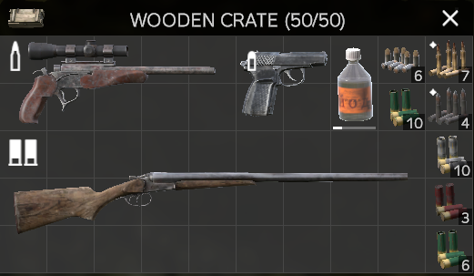
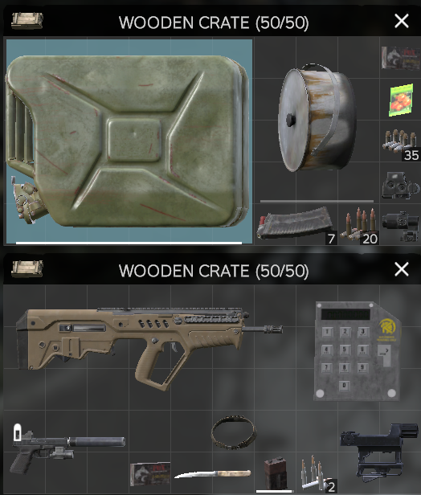
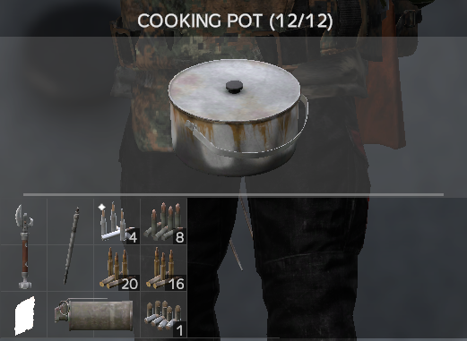
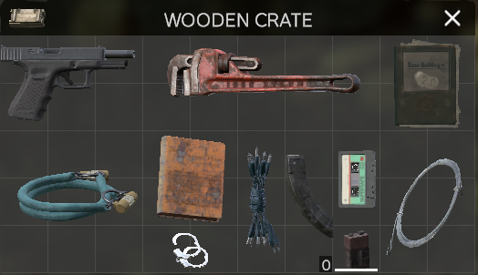
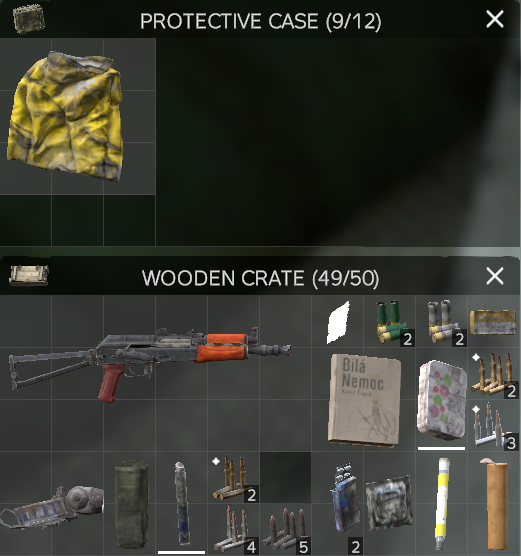
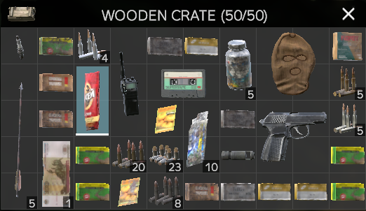

- {{embed ((6757f068-5024-4299-a0cf-1c0db42dbe1a))}}
- 下载安装
	- steam正版
	  collapsed:: true
		- 服务器多，低延时服务器多
		- [为什么尽量玩第一人称服务器？【dayz吧】_百度贴吧](https://tieba.baidu.com/p/9288341772)
		- [DZSALauncher - An easy to use launcher for DayZ Standalone](https://dayzsalauncher.com/)
			- 第三方启动器
		- [DayZ服务器快速 / 一键开服教程，模组自动更新（支持单机/联机/网页管理，无需Steam） - 2023_哔哩哔哩_bilibili](https://www.bilibili.com/video/BV1iu411T7DL)
		  id:: 67601a35-6ce2-4d57-9e58-a7625398500f
	- 俄罗斯DayZavr社区服
	  id:: 67613c37-8d0b-496b-bdb5-1460eda2d0c6
		- 提供了游戏本体和启动器
		- （大概是非steam正版用户）默认只能玩他们的服务器——我不会玩本机服务器或其他服务器
		- [DayZavr - DAYZ STANDALONE ПИРАТКА + 19 СЕРВЕРОВ](https://dayzavr.ru/)
			- [Сервера DayZ Standalone на проекте DayZavr Пиратка + Steam](https://dayzavr.ru/servers.html)（服务器介绍）
			- [《DayZ》|v1.25|中文|免安装硬盘版 - SWITCH618游戏公益分享](https://www.switch618.com/1234.html)（没必要用这个下——百度网盘蜗牛下完恍然大悟）
		- 打开启动器，启动器未显示用户名、密码、验证码的话，可能要切换网络节点（我是换到日本节点）
		- 19个服务器，3小时一轮，绝大多数还剩5-7分钟时强制踢出，过5~15分钟重启——“防沉迷蛮好的”
		- 连接启动器内的服务器还需下载服务器相关模组，等等
		- 如果还不能登录服务器
		  collapsed:: true
			- 如果是battleye bad packet可以输cmd指令后重启电脑
			  collapsed:: true
				- [出问题了，实在解决不了了【命运2游戏吧】_百度贴吧](https://tieba.baidu.com/p/7768043982)
			- 无法compile world（末尾kr swatsuit）
			  collapsed:: true
				- “先换个服务器玩”
		- 自带的社区服衣服还行，但死一次就没了
			- 注意即时穿起来，两次没穿鞋跑流血了
			- 好像地图mod也是，身上没地图就看不了了
		- [Внутриигровой магазин серверов DayZ](https://dayzavrshop.ru/store)
		  collapsed:: true
			- 商店1卢布600游戏卢布，打比方说10个丧尸掉4张200游戏卢布赚1毛钱，很快就打完要到别处打，不如卖钉子给玩家
			- 比个价
				- [吸血都没见过这么吸得的，这把骨髓吸出来了吧。【dayz吧】_百度贴吧](https://tieba.baidu.com/p/9057554629)
					- “我的评价是：远胜齐泽克卖课”
				- 买车低至20-，是不是非常良心呢？
- ---
- PVE游玩思路
	- 吃饱，然后往军事基地等毒区跑
- 退出
	- 进服务器夜晚或阴雨天或动态毒区不想玩或没足够照明、雨天没防水衣物、想等食物等物品刷新可以先退出做点别的事——“防沉迷蛮好的”
- 网络延迟
	- 高延迟很影响战斗乃至物品管理，不要考虑“我已经费了这么多时间/精力/弹药，还剩多少就搞定了”之类的沉没成本，直接退出就完事了，不然一不小心就会被打残打死，很大程度上又白玩、白复活了
	- 在服务器（主要是外服）人多时、在自己或其他人基地附近可能会比较卡，可能梯子都没法爬、食物都没法吃，要搜图且不赶时间的话可以退出——“防沉迷蛮好的”
- 定向、定位
  collapsed:: true
	- [Navigating - DayZ Wiki](https://dayz.fandom.com/wiki/Navigating)
	- 日（影、霞；根据太阳高度角估计当前时间和太阳当前方位）月（“月牙”两点延长线与地平线的交点大致为“南”）星（北斗七星斗柄指南）
	- 房屋大多南北朝向
	- 多点定向、定位
		- 临近建筑、建筑顶部等地标的连线、延长线
	- 地图上北下南左西右东
	- 地图等高线与目视地势
	- 罗盘在手上准，在快捷槽或背包里会偏
	- GPS接收器可以开启右下角小地图显示位置
	- 有地图有罗盘才会在地图上定位（可能是mod内容？）
		- [Tourist Map - DayZ Wiki](https://dayz.fandom.com/wiki/Tourist_Map)
- 地图
  collapsed:: true
	- “到此一游”
	- [DayZ在线地图](https://dayz.plus/#/map)
		- 搜路标、服务器空投提示等定位
		- 可以全开（果树比较多，随缘捡到，可以不开；其他可以不开），点圆点查看图例
		- “看到就是有了”
		- 可以复制所选位置坐标发给队友
		- ---
		- 也可以试试不看，就看游戏内的，乃至就看游戏本体的——尤其是不小心死了后
	- Chernarus
		- 恶魔岛
			- 平均物资水平可能比警察局更高，有些mod会更更高（第一次去民房里刷了两件70格防弹狩猎背心，第二次多刷了几次有140格大背包、弩、弩箭、GPS接收器、MK2手枪、气炉头、气罐、308、76254子弹）
			- 可以反复刷
			- 有的服务器加了跨海大桥mod，但加入的区域可能不会刷物资和丧尸
- [持续跑步 - by 用户670025759866055 - 动作信息 - Quicker](https://getquicker.net/Sharedaction?code=6315c044-a977-4cdc-02b1-08dd267f7c7b)
  id:: 676f7433-cafd-4d23-a5b0-789e597debdd
	- 可以在旁边运动一下
	  collapsed:: true
- 聊天
  collapsed:: true
	- [从相遇到分离需要多久，35分钟的影像碎片凑起了我对亚索的所有记忆，祝你活得长久_哔哩哔哩bilibili_剧情](https://www.bilibili.com/video/BV1Fa41177Vj)
	- DayZ常用语
	  id:: 676a99c4-baba-46fd-9465-41e71f2da50f
		- 此处可能偏PVE，PVE可能主要交流交易建家、空投、打怪、如何自杀等
		- K（“千”，游戏卢布单位）
		- T1/2/3（不同等级门锁）
		- DayZ常用俄语
		  id:: 676b4b09-ecf0-46b3-b38a-e969cf7ddcf0
			- 货币
			- 药
			- 钉子
			- 枪
			- 车
			- 地名
- 合成
  collapsed:: true
	- [Crafting - DayZ Wiki](https://dayz.fandom.com/wiki/Crafting)
	- [DayZ All Crafts 1.26 - YouTube](https://www.youtube.com/watch?v=eP-8ojgPzjo)
- 食物
  collapsed:: true
	- [Food and Drink - DayZ Wiki](https://dayz.fandom.com/wiki/Food_and_Drink)
	- 进食由三个向上转为一个向上就是满了
	- 水井接水（塑料瓶、水壶等，接了喝得更快）、喝水
		- 小镇的水井或许可能潜伏避免战斗
	- 刀、锯等
		- 可用两个石块合并合成石刀
		- 开罐头，手锯损失10-40%，
		- 屠宰
		- 衣服割成破布，12破布合成1个绳子
		- 砍灌木得长木棍和短木棍，长木棍可折为短木棍
		- 削树皮
	- 钓鱼
		- 在海边钓两三条鲭鱼烤了就很够吃了
		- 长木棍+绳子=简易鱼竿
			- 拿刀可以拆解，绳子带走
			- 鱼钩1格（一次），绳子2格，长木棍8格
		- 简易（木质）鱼钩
			- 2短木棍+刀=2木质鱼钩
			- 适用于服务器里没鸡搞不到骨头的场景
		- 骨质鱼钩
		- 金属鱼钩
			- 海滩木船上可能刷
		- 刀等对草地挖蚯蚓，串上鱼钩
	- 捕鱼陷阱
		- 多出来的塑料瓶可以做成小型捕鱼陷阱，但效率低于比钓鱼和渔网陷阱
	- 狩猎
	- 生火
		- 所有可烹饪的食物烹饪后热量都加得更多，还少占胃——烤鲭鱼柳的热量是生鲭鱼柳的10倍（1000千卡：100千卡），疑似有点游戏性了（“烤了油更多”，“你这个蘑菇自带黄油吗？”）——现实生活中这种关系可能是反过来的
			- [[生食]]
		- 民房可能会被人锁门占了
		- 点火
			- 火柴
			- 短木棍+树皮=火钻
		- 柴火
			- 一个柴火（firewood）在壁炉里至少够烤8批鱼
			- 明显的火灭了还有余烬时也可以烤
		- ((67402b04-8120-4d92-8b12-c13121815c85))
			- 炉头
				- 在露营地找
			- 扁气罐
			- 加热消耗锅耐久，避免无食物空烧
			- 煎锅
				- “不带可固定的锅盖，同时不会掉东西出来”
			- 烹饪锅
				- “看图是个汤锅，看格子是个小奶锅”
				- 无水时就是烤，一次烤4片鱼，爽！
				- 可以煮水
		- 刚加热完先放一边等降温到温暖再吃
	- 种植
		- [种了一堆西红柿，又脆又甜，把路人喂饱后，结果他自愿加入我们_哔哩哔哩bilibili_剧情](https://www.bilibili.com/video/BV1Nr4y1G7zB)
		- [【图片】这游戏成为我的养老中心了，实测各种蔬菜成熟时间【dayz吧】_百度贴吧](https://tieba.baidu.com/p/8852262763)
	- ((63872adf-a4c6-4a87-8253-3be7ef5c3c72))
		- [我打算在官服第一人称找个啤酒屋开个餐馆【dayz吧】_百度贴吧](https://tieba.baidu.com/p/7763383693)
- 疾病
  collapsed:: true
	- 伤口感染
		- [Wound Infection - DayZ Wiki](https://dayz.fandom.com/wiki/Wound_Infection)
		- 所以说消毒用品还是有点用
	- 霍乱和沙门氏菌感染可能误触出（“家人们谁懂啊？！”），小口吃喝（水、食物符号上三个向上后不再吃喝，等下来或快下来再吃一些，随着食物剩余比例逐渐减小而逐渐增大转动角度，如此慢慢吃）把免疫力值堆到95以上很费时（单人通常需要守着水井、钓鱼），刚开始或还没搞到/储存高价值物品且没信心较快搞到药的话建议重开
- 战斗
  collapsed:: true
	- 耐力
		- 非常重要，不够来不及爬上去被围着打就爽了，不够的话，可以先潜行、先放下减重、肾上腺素、宁可在室内打
		- 不动瞄准也消耗耐力，到时候想跑就晚了，所以没退路别乱狙
	- >不要怂，就是干！
	- 卡门卡楼梯
		- 如果门没来得及关上或mod丧尸开门，来不及或耐力不够不方便跑，那么至少一次对付一只减轻战斗压力
	- 室内窗边
		- [DayZ萌新无伤打僵尸教学_哔哩哔哩_bilibili](https://www.bilibili.com/video/BV1b34y1a7tR)
		- 投掷物品可以吸引丧尸
		- 进室内最好提前开着门（只开一个，丧尸会感应哪里没关门，可能是有些mod）、网络延迟不高，不然（新手）关门可能来不及
	- 丧尸上不去的地方
		- 注意近战会前移，多走可能会落下挨打，注意后退
		- 开着的集装箱门可以站
		- 干草垛好像是能爬还是挤上去，不太安全
	- 水中
		- 近岸站着即可
	- 蹲走背刺
	- 靠近后绕后
		- [【DAYZ独立版】《教你们如何速清僵尸》👍可无伤！](https://www.bilibili.com/video/BV1Q8411A7w2)
	- [【Dayz教学类】如何无伤清理僵尸，以及其他情况的处理_哔哩哔哩bilibili_技巧](https://www.bilibili.com/video/BV1gx4y18731)
		- 北山君关丧尸还加个重击
		- 站集装箱上也可以引丧尸关起来
		- 有的丧尸mod丧尸会破开门
	- “其他玩家”帮清理
		- PVP是螳螂捕蝉，黄雀在后，PVE则是“跟”
	- ---
	- 近战武器
		- PVE
			- 带个干草叉、大锤之类的长柄武器，方便打刀够不到的丧尸
	- 远程武器
		- rr卸弹
		- 瞄准时按f可用枪近战攻击
		- PVE
			- 打普通怪需要枪弹量大管饱，打精英怪需要高DPS（可能还要“弹匣总伤害”）
				- [DayZ Weapon Stat Tool | Damage Per Second Stat in DayZ](https://wobo.tools/dayz-single-weapon-stat-tool?weapon_stat=Damage_Per_Second#selectbox)
			- 用单发枪打猎、引怪都OK，固定点批量清丧尸有点“慢条斯理”了，甚至不如近战
			- 左轮手枪
				- 点357，不错，虽然比普通手枪多占两格，但自带弹巢（转轮），容弹量6发、射速均大于常见霰弹枪、猎枪，装弹操作方便、不用拆下弹匣装弹再装回去，装弹不慢，噪声比普通手枪大些（？）也可以增大引怪范围，一次多清，少点一惊一乍——没别的手枪时可用（
		- [Interactive Web Tools & Wiki for DayZ Information | WOBO Tools](https://wobo.tools/)
		- [[DAYZ]萌新前期武器推荐一览，八年老兵实测_哔哩哔哩bilibili_英雄联盟_游戏解说](https://www.bilibili.com/video/BV1Zr4y147W4)
		- [大佬看看我！求枪械配件表【dayz吧】_百度贴吧](https://tieba.baidu.com/p/9005217224)
		- 找枪
			- [枪械刷新概率【dayz吧】_百度贴吧](https://tieba.baidu.com/p/9171828889)
			- [【图片】盘点一下车臣尼亚的军事基地（仅限官服）【dayz吧】_百度贴吧](https://tieba.baidu.com/p/7438353923)
				- “改了”——不着急的话还是可以“走一步看一步”
		- 钢锯可以锯短部分枪的枪管，从而把枪放容器里而不是背肩上
		- ctrl瞄准镜屏息
	- ---
- 修理
  collapsed:: true
	- 全新、破旧、损坏、严重损坏、毁坏（无法修理）
	- 刀用磨刀石
	- 背心和鞋用皮革修理包（“严重损坏？这年头谁还穿皮衣啊，腾格尔！”）
	- 环氧树脂可以修头盔、背心、弩
	- [请问各位大佬，新图什么地方刷武器清理工具？_dayz吧_百度贴吧](https://tieba.baidu.com/p/9233135465)
- 储存
	- [官服6094 最多10个人在线的服 家也被撬【dayz吧】_百度贴吧](https://tieba.baidu.com/p/9190409657)
	- 替换衣物（比如防护服）、多余的枪（“用不着，就是囤、收藏”、“给朋友和有缘人用”——“防止挂了刷没”；相比弹药可能不易堆叠，可优先放）、弹药
	- 钉子
		- 有16个钉子就可以开始造木箱了，仓鼠玩家很可能身上已经塞满了
		- 可以每个木箱里放16个钉子，或者身上只带一两组，钉子可能比锯（有锯就可以锯木板堆了）和斧更难找
		- 一时找不到钉子也可以用斧子拆原有木箱，不用的东西丢了
		- [钉子在哪有啊【dayz吧】_百度贴吧](https://tieba.baidu.com/p/7896105419)
		- [钉子！钉子 ！【dayz吧】_百度贴吧](https://tieba.baidu.com/p/7483011663)
	- 木箱
		- >想要我的财宝吗？想要的话可以全部给你，去找吧！我把所有财宝都放在那里！——《海贼王》
			- ((67613c37-8d0b-496b-bdb5-1460eda2d0c6)) 服务器9 world war z
				- 53887829
					- 
				- 43938267*2
					- 
					- 
				- 57038550
					- 
				- 54239999
					- 
				- 约13450 3110（恶魔岛松树后）
					- 
		- [Wooden Crate - DayZ Wiki](https://dayz.fandom.com/wiki/Wooden_Crate)
		- [【图片】分享几个艺高人胆大的绿玩物资点【dayz吧】_百度贴吧](https://tieba.baidu.com/p/8342092529)
		- 建议截屏方便查看
		- 放置后如果看不见内容可以滚轮长按F打开
		- ---
		- TODO 共享防护服放毒区正门
- 建筑
  collapsed:: true
	- [List of buildings - DayZ Wiki](https://dayz.fandom.com/wiki/List_of_buildings)
- 毒区
  collapsed:: true
	- [纯萌新！Dayz防护服一套怎么找最快啊【dayz吧】_百度贴吧](https://tieba.baidu.com/p/9049905179)
	- [更新后毒区物资刷新【dayz吧】_百度贴吧](https://tieba.baidu.com/p/9244001082)
	- [毒区掉落好像发生变化了【dayz吧】_百度贴吧](https://tieba.baidu.com/p/9227915715)
- tab打开物品栏，左边是临近，中间上部是当前物品展示，下部是手部和快捷槽，右边是当前装备
  collapsed:: true
	- 手部可以合并或交换物品，手持物品不会在服务器里消失
	- 将物品拖到对应装备槽可切换穿戴
	- 双击转移物品
	- 右键物品分半
	- Ctrl快速丢弃
	- G投掷，按住蓄力
		- 可以足不出户把东西扔出去方便刷新，大概
	- K隐藏/显示mod标记地点
- 显示的鼠标有“上下键”提示有多个选项，可以滚动滚轮切换
- [大佬们，你们东西咋捡到的？【dayz吧】_百度贴吧](https://tieba.baidu.com/p/9124986747)
- 模组mod
  collapsed:: true
	- [Dayz的mod推荐【dayz吧】_百度贴吧](https://tieba.baidu.com/p/8937766657)
	- “更多丧尸”
		- “魔鬼筋肉丧尸”
			- “好肉啊，原地近战A死少说衣服要吃大亏，不掉东西本就亏了”
		- 生命吸取丧尸
			- 生命值高，在视野中一定范围内会被吸血，非自动步枪慢慢爆头十几枪打不死（可能高DPS的自动步枪乃至冲锋枪能一两弹匣打死）——挂了一次
		- 隐身丧尸（还是我太卡了？）
	- “更多食物”
		- 茶、咖啡等不能直接吃
	- 疲倦
		- “我shift键跟输入法串了吗？耐力还有不少呀？”
- [DayZ Wiki](https://dayz.fandom.com/wiki/DayZ_Wiki)
	- ((675ae713-a80e-434f-a0bc-b4d1178edd64))
- [Dayz中文维基百科 wiki|Gamekee游戏攻略百科](https://www.gamekee.com/dayz/)
- [DayZ Wiki](https://wiki.dayz.plus/)
- [【图片】萌新贴，从零开始手把手教！！老玩家慎入！！！【dayz吧】_百度贴吧](https://tieba.baidu.com/p/8029020211)
- [【图片】【老魏填坑】从0开始的Dayz的新手教程【dayz独立版吧】_百度贴吧](https://tieba.baidu.com/p/6924155862)
- [【DayZ新手教程01】服务器登陆教程及常见问题，新手第一次进服该怎么做？_教程](https://www.bilibili.com/video/BV1NV4y1m7Po)
- [【DayZ新手教程02】吃喝篇，保姆级教学新手怎么找吃的？内含钓鱼教学_新手教程](https://www.bilibili.com/video/BV1jk4y1H7rt)
- [【DayZ新手教程03】地图篇，怎么看地图，怎么认路，物资点在哪？_哔哩哔哩bilibili_新手教程](https://www.bilibili.com/video/BV19m4y1Y78d)
- [【DayZ新手教程04】车辆篇，怎么找车，怎么开车，怎么修车？_网络游戏热门视频](https://www.bilibili.com/video/BV1Ls4y1r7Hb)
- [【DAYZ独立版】常用入门生存技巧汇总_哔哩哔哩_bilibili](https://www.bilibili.com/video/BV1va4y1t7Lq)
	- [【DAYZ独立版】常用入门生存技巧汇总 - 第二期_哔哩哔哩_bilibili](https://www.bilibili.com/video/BV1P3411q7k3)
- [【图片】《DayZ》全物品合成表分享【dayz吧】_百度贴吧](https://tieba.baidu.com/p/6495741088)