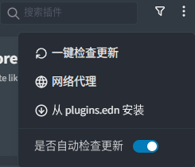
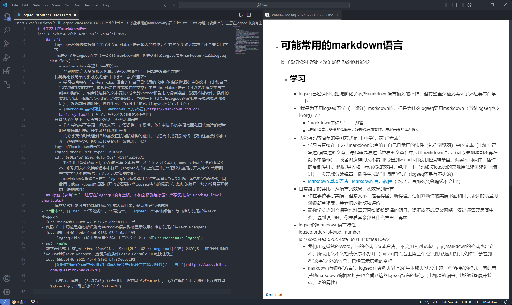

- {{renderer :tocgen2}}
- Logseq是一个笔记软件，块级粒度，双向链接，大纲结构，本地保存
	- 尽管能 ((65af1d52-3ec7-4db9-a639-bc5659e83759))，也能导出，logseq可能还是不太适合写传统文档（word那种）
	- 大纲结构，也就是（==“抽屉套抽屉，大肠包小肠”==）可以缩进、折叠，内容可以按“上下级”分开放，也可以把原因、理由等放在子块
	  id:: 66335bd1-c711-4712-8086-ddf302aeb6e3
- Logseq下载： https://github.com/logseq/logseq/releases
  id:: 6651bb5e-a06b-43aa-918f-0e04043281cd
- 对初次浏览这样的双链笔记的人而言，可能不易第一时间发现那些带下划线的（还有那些有明显或不明显外框的）文本是一种引文，链接直接显露别处的原文，是原文的影子/投影/影分身——“点击查找影流之主（或悬浮预览）”
  id:: 65b5b8fc-2def-4e04-828d-d8b8f7a2d2da
	- [影   流   之   主_哔哩哔哩_bilibili](https://www.bilibili.com/video/BV1Qt411T7VS)
	- ((65bcbf46-ee5b-46e7-b8fa-4a82744cf8e7))
- # 基本操作
	- 文字前的圆点（也叫子弹/bulletin）有指示（“这里的确有个圆点，然后呢？”）、（按住）拖动、（点击）聚焦、（右键）菜单的功能
	  id:: 65bcf627-e061-4bad-aa44-14171d6064bc
		- 圆点前面的箭头（手机打开网页版在最右边）可以展开/折叠块
		  id:: 65c72e47-9eb6-485f-9ff1-455148259354
	- 选择多个块（然后可以批量操作；有时多按几次Ctrl+A就行）
	- 在完整页面（非聚焦块）视图，点击右上角三个点-“添加收藏”，可将页面添加到左侧栏的“收藏页面”中
	- 页面太长了怎么办？
- # 常用快捷键
	- 以下是我认为可能比较常用的；其他可在右下角点击“？”查看（可能只有桌面端有），或者，在最右上角点开右侧栏，“帮助”中有“快捷键”，或者，“右上角三个点”-“设置”-“快捷键”中查看和自定义快捷键，或者
	  id:: 65adf755-1696-42ce-bd50-341fbf5bc4ad
	- tt切换主题的深色、浅色模式
	  id:: 65af1d52-bdcf-4bc1-8dea-cef1ffb94882
	- s搜索，d在当前页面内搜索（我自定义的；可能与部分输入法不兼容，需要按shift切换中英文）
	  id:: 65bcbf46-10d3-4089-b32f-930088715d7a
		- TODO 新版本的搜索没了“历史记录”，多次尝试关键词搜索（有时回忆的关键词不够精准）和用同一个多页出现的关键词搜索（有时多个含关键词的块要放到右侧栏一起看，它们之间可能有较大的时间和分类跨度，而它们的内容需要整合）的便捷性好像下降了
		- 两个及以上的关键词之间有其他（不确定）字符的，可以在关键词之间加个空格
	- Tab/Shift+Tab缩进/逆缩进
	- Alt+Shift+$\uparrow$/$\downarrow$ 向上/下移动块
	- Ctrl+C/V光标在块中时，复制/粘贴块引用
	  id:: 6596c0ca-555b-4f8f-956b-f71333edf9ce
	- Ctrl+Enter 添加代办/切换代办状态
	  :LOGBOOK:
	  CLOCK: [2024-01-07 Sun 11:09:57]--[2024-01-07 Sun 11:09:58] =>  00:00:01
	  :END:
	- Ctrl+Z撤销，Ctrl+Y重做
	- Alt+$\leftarrow$/$\rightarrow$后退/前进（我自定义的，与浏览器的一样）
	- to全部折叠/展开
	- td切换文档模式（减小缩进——“看着不习惯是吧”；此模式下回车enter为换行而非新增块）
	  id:: 65af1d52-3ec7-4db9-a639-bc5659e83759
	- rt左侧栏、tr右侧栏（我自定义的）
	- Shift+左键 在右侧栏打开块、页
	- Alt+Shift+J 在右侧栏打开当日日记
	- gj 切换到日记页面
		- gp 前一篇日记
		- gn 后一篇日记
	- Ctrl+-/=缩小/放大+页面
	- `[[`（自动生成`[[]]`）页（面）引用，输入新页名可新建页
	- `#`标签（近期开始我主要用于标注论文年份，以便观察全球学术脉络）
	- 空格或2在白板中移动
	- `/`菜单（在块末需要隔一空格）
		- 你不必输入完整命令，例如获取链接标题可只输入`/ti`
			- ((65bef800-0e4a-430f-8f5a-4e98314b64d9))
	- Alt+Shift+G 打开图谱（有时因为“中断工作流”或隐私不太想显示侧边栏，切换图谱就按这个快捷键；可能与插件冲突，可自定义）
		- ((66335bea-765e-49a8-ad56-87c4569e6389))
- # 插件
	- 网页端大概不支持插件，看不到对应效果，有些块空着（块引用或图片的链接也没有），可能就是TOC、表格等没显示
	- TODO 插件一般从对应GitHub仓库下载，而国内直接访问GitHub有点困难，可以
		- 
	- 学习插件可以查看示例
		- 插一句，有些插件有比较鲜明的特征，比如sethyuan大佬的插件图标就是“蓝色经典”，hkgnp大佬的是“灰色经典”
	- Awesome Links：获取外部链接的favicon图标，给日志之类的内部页面加上对应图标（“至少我这里看得到”）
	- Page-tags and Hierarchy：多层级页面UI
	- Tabs：开启类似浏览器的标签页栏，双击可固定/取消固定页面
		- ## 键盘快捷键
			- 固定/取消固定标签: CTRL + P (macOS: CMD + P)
			- 关闭标签: SHIFT + CTRL + W (macOS: SHIFT + CMD + W)
			- 更改为下一个选项卡: CTRL + TAB
			- 更改为第n个选项卡: CTRL + 1 ~ 9 (这尚无法配置)
	- Bullet Threading：高亮光标所在块的全部直接上级块的线条，方便一屏看不完时确认层级关系（“原来如此”）； ((670d40c3-4575-485c-8b47-bea78a726ae7)) 主题自带
	- Get webpage title：`/ti`获取链接标题（不在块首输入时前面需要加个空格）
	  id:: 65bef800-0e4a-430f-8f5a-4e98314b64d9
		- “骗自己换个地方疯狂稍后再看是这样的”
	- Move Block：右键菜单、页面标题右侧箭头或快捷键把块引用、块嵌入、块的内容等移动到当天日志等位置，这样通过日志展示更新内容就相对顺手了
	  id:: 65cc4a78-a2e4-40a8-870c-706cb31aabb9
		- TODO 如何批量导出日志中的块引用等的原文内容？
		  id:: 65cec1fb-446f-42b2-aeff-cdcd9137b181
	- logseq-swapblocks-plugin：切换块引用与被引用块的位置（可能总得有个位置），使用逻辑可能是，想把被引用块放到“更贴切”的页面，或是需要有限度地分享（比如不分享日志的话，不会块引用日志的块）
	  id:: 65bcbf46-ee5b-46e7-b8fa-4a82744cf8e7
		- 也可以先在日志记，然后引用到相关位置后再切换回来——反正把定位工作后置
	- Text Wrapper：随选择文本唤起的格式工具栏
	  collapsed:: true
		- ((65964bb1-80e8-471e-9e2e-a66e831be12f))
		- ((65bcbf46-ee6e-4ba6-9f88-67b1f6ade195))
		- ((65bcbf46-8b21-4944-8f02-b4758ecba292))
	- Block to page：把块作为页面名，下级块作为页面内容，整体转进为页面，过程看着像是自动复制粘贴块；使用场景：“兜不住时先收起”
	- Split block：右键圆点在菜单中选择，把一个块内的多行文本按行分成块。有些复制过来的长文和之前因为过长而崩成一块的页面要这样救一下
	- 以上是常用的
	- TODO 统计字数、块数（包括不同层级、对应识别符等的；“统计我的发明用的”）
	- TODO 打印时给出双链相关信息（方便印刷物阅读者定位）
	  id:: 672c281d-2c00-4282-ad14-adf5a836f79a
	- ---
	- Ordered Lists：可能比内置的更好的有序列表（“至少我这里看得到”）
	- Heading level shortcuts：标题快捷键，Ctrl+1~6分别为一到六级标题，设置较多标题时少按`#`（但我觉得略有些别扭，可能跟小尺寸键盘有关）
	- Tags：快速查看所有标签，点击标签展开标签所在块，再点击可跳转到所在页面（位置可能不精确）
	- Live Math：数学表达式输入器，要写数理化似乎不得不用啊
		- ((65bcbf46-8b21-4944-8f02-b4758ecba292))
	- TOC Generator：在页面内或（点击右上角插件图标在）侧栏生成TOC（Table Of Contents，直译为“内容表”，可俗称“目录”、“提纲”），见页首（滚轮或点击右下角“TOP”“回到顶部”），点击标题可聚焦该块，点后面的“回车”可滚动到并选中该块，点击并按住标题可在TOC内或（双栏间的相同或不同页面中的）TOC间拖动并实现在页内拖动相关块，点击箭头和可切换TOC的展开/折叠状态——总的来说，有助长文写作
	- Luckysheet：块内嵌入类似Excel的表格，还不错，有时确实不适合一次次地按计算器
	  collapsed:: true
	- Doc View Exporter：左对齐、无缩进预览，然后可导出为左对齐、无缩进的窄长图（TOC好像不能点击跳转）的或相对完整的HTML文件==（但非本地看不到本地图片等本地文件）==，相比[Logseq Publish SPA](https://github.com/marketplace/actions/logseq-publish-spa)保留了一部分插件的效果（比如TOC Generator的，但Luckysheet的就不显示、无法操作原表格，此外可能与Awesome UI不兼容，影响导出文件的显示效果），点击其中的块引用链接可打开本地对应位置的块
	  id:: 659b89b8-f17c-4d75-a9d2-3332ef699d60
	  collapsed:: true
		- “曾经”
		   >因多平台手动发布麻烦和重新试了下导出插件感觉不错而试，暂时用 logseq 插件 Doc View Exporter 手动导出为 html 文件再拖动到对应 github 库上传，再在库中的首页文件 index.html 中添加链接，未来可能通过博客框架和同步盘提高自动化水平
	- Logseq pinyin match tags：Ctrl+T，滚动鼠标或按拼音搜索标签并插入块
	- TODO Agenda：任务管理（含番茄钟），打算试试替换 腾讯文档（看板和日历排期，没搞懂替代方案时，多列多行的显示效果差不多够用；如果显示不全，为了一目了然、一触即出的方便可以尝试调低浏览器拦截功能中的“阻止指纹识别”等级，或者不嫌麻烦也可以一个个右键展开）
	  id:: 66335bd1-9f9f-48e3-a190-127ffa573070
	  collapsed:: true
		- [Logseq 日历 & 任务管理 & Daily Planner 插件 Agenda3 使用介绍_哔哩哔哩_bilibili](https://www.bilibili.com/video/BV1yG411i7d9)
	- Favorite Tree：在左侧栏“收藏页面”中增加页面层级
	- Paste More：带格式粘贴，减少粘贴进logseq时的格式损失
	- ---
	- 暂时没用起来的插件
		- Logseq Anki Sync
		  id:: 666c0ac7-3cc5-4c8f-8beb-701e0e8f1b6f
			- [GitHub - debanjandhar12/logseq-anki-sync: An logseq to anki syncing plugin with superpowers - image occlusion, card direction, incremental cards, and a lot more.](https://github.com/debanjandhar12/logseq-anki-sync)
			- ((6721a7a5-3140-4128-895a-bf637ee7ff15))
			- [LOGSEQ&ANKI 制卡教程 | 工作流分享_哔哩哔哩_bilibili](https://www.bilibili.com/video/BV1mY411i7Lo)
			  id:: 666c084b-b9a8-4d9e-b031-4bb1d88a6e15
		- Excalidraw（嵌入更完整的Excalidraw；画得不多，没看出相比在浏览器网页端的Excalidraw里画效率高在哪，没协作白板协作，至少没法免费协作，也不如logseq白板能集成内部页面——“多画点画”）
		- 看板类（两个带‘kanban’的和模板更多的Logtools；看起来可能有点用，但是logseq的显示给了上限，多来几个缩进，行的长度就太短了，“载不动许多愁”——折叠、聚焦、TOC用用就能改善不少）
	- 我现用（现在不确定了）的插件可在 https://github.com/khtazmt/khtazmt.github.io/blob/main/.logseq.7z 下载
		- ((6594cd23-e261-462c-b54a-a5336b75038f))
	- 4T3L2A·FGBHSPD（“Favorite Great Britain High SPeeD，最喜欢的英国高速是吧？”）——“好好好，这下步[[风]]之后尘找到相对简单但开始变复杂的分类/助记规律了”
		- “现在按常用顺序排辣！”
- # （显示）主题
  collapsed:: true
	- Dev theme
	  id:: 670d40c3-4575-485c-8b47-bea78a726ae7
	- “灰喜鹊主题有没有搞头？”
- # 可能常用的markdown语言
  id:: 65a7b394-7f9b-42a3-b8f7-7a94faf19512
	- ## 学习
		- logseq已经通过快捷键简化了不少markdown语言输入的操作，但有些至少碰到需求了还是要专门学一下
		- “我是为了用logseq而学（一部分）markdown的，但是为什么logseq要用markdown（当然logseq也支持org）？”
			- ~~“markdown牛逼！”——即答~~
			- ==别的语言大多没那么简单，没那么有兼容性，用起来没那么方便==
		- 我觉得比较简单的学习方式是“干中学”，忘了“查表”
			- 学习者直接在（支持markdown语言的）自己日常用的软件（包括浏览器）中的文本（比如自己写过/编辑过的文章，最起码是看过或想看的文章）中应用markdown语言（可以先创建副本再在副本中操作），或者将这样的文本复制/导出到vscode和爱用的编辑器里，观察不同软件、插件的复制/导出、粘贴/导入和显示/预览的效果，整理一下（比如按logseq的常规用法缩进缩进再缩进），发现部分编辑器、插件生成的“非通用”格式（logseq还是有不少的）
				- ((65d85f13-a487-4144-9b08-93909d4e1f13))
				- 
				  id:: 65d86281-9b91-4afa-8474-2dca83a4cb71
			- [Markdown 基本语法 | Markdown 官方教程](https://markdown.com.cn/basic-syntax/)（“坏了，写那么久分隔线不会打”）
		- 日常鸽了的类比：从语言到效果，从效果到语言
			- 你在学校学了英语，但家人不一定看得懂、听得懂，他们判断你的英语书面和口头表达的质量时就很简单粗暴，等老师的批改和评价
			- 而你学英语时会遇到各种需要直接间接翻译的题目，词汇尚不成复杂网络，汉语还需要居间中介，遇到填空题，你先看其余部分什么意思，再想
		- {{embed ((659b34e3-520c-4dfe-8c84-418f4aa10e72))}}
	- ## 标题（块首`# `，注意在logseq中须有空格，不加空格就是标签；推荐使用插件Heading level shortcuts）
		- 建立多级标题可与TOC插件配合生成大纲目录，帮助明确写作思路
	- **粗体**、[[_red]]==下划线==、==高亮==、[[$green]]==字体颜色==等（推荐使用插件Text Wrapper）
	  id:: 65964bb1-80e8-471e-9e2e-a66e831be12f
	- 代码（一个用途是避免被识别为markdown语言影响显示效果；推荐使用插件Text Wrapper）
	  id:: 65bcbf46-ee6e-4ba6-9f88-67b1f6ade195
		- ((6594cd23-e261-462c-b54a-a5336b75038f))
	- \mu\g：`\mu\g`
	- 数学表达式（$E_动=\frac12mv^2$，$\ce{2H2 +O2 \xlongequal{点燃} 2H2O}$；推荐使用插件Live Math和Text Wrapper，更傻瓜的插件LaTex Formula OCR还没试过）
	  id:: 65bcbf46-8b21-4944-8f02-b4758ecba292
		- [如何在MarkDown中使用LaTeX输入长等号(麻烦看看说明条件)？ - 知乎](https://www.zhihu.com/question/500718670)
		- ((6594cd34-349c-4cb2-9b08-620eb81234cc))
		- ((6596a0b4-dacb-4d1e-928c-69f428e60256))
- # 查询query
  collapsed:: true
	- 需求
		- 可选层级搜索（关键词可能散布在不同页面的不同层级）
		- 连结果导出
			- ((659b89b8-f17c-4d75-a9d2-3332ef699d60))
			- [Query export to doc or pdf - Questions & Help - Logseq](https://discuss.logseq.com/t/query-export-to-doc-or-pdf/10169)
			- [How to export query results as markdown or rich text? - Questions & Help - Logseq](https://discuss.logseq.com/t/how-to-export-query-results-as-markdown-or-rich-text/20363)
	- ((65bcbf46-3c16-4ef1-a798-ac1be861d095))
	- {{query (and (page [[阳光]]) "http")}}
	  query-table:: true
	- TODO 结果排序方式
	- https://docs.logseq.com/#/page/queries
- # logseq的文件
  collapsed:: true
	- 如果你只是阅读（尤其是在网页端阅读）或刚开始写作的话，并不需要了解这方面，但用久了可能会为了排查故障（包括抢救文件）或把自己的库分享给别人前过滤隐私等信息而了解
	- 库/图谱文件夹
		- assets文件夹（放以文件形式自动复制到该文件夹的图片文件、pdf文件等）
		- journals文件夹（类似pages文件夹，但是命名方式另有一套的日记文档）
		- logseq文件夹
		  collapsed:: true
			- .recycle文件夹（从图谱索引中删除但在这个“回收站”保存的笔记文件；可能残留隐私，分享需留意）
			- bak文件夹（本地备份，可用于恢复笔记和配置；其中的pages文件夹可能残留隐私，分享需留意）
			  id:: 66ade36e-1d3f-40b8-bf59-293dc1011a10
				- [write most file in bak folder · Issue #3370 · logseq/logseq · GitHub](https://github.com/logseq/logseq/issues/3370)
				- [fix: search or editor frozen caused by large text by tiensonqin · Pull Request #6455 · logseq/logseq · GitHub](https://github.com/logseq/logseq/pull/6455)
		- pages文件夹（放md或org文档的默认文件夹，新增页面会在此新增文档）
		  id:: 66ade36e-124c-4570-a4e4-6791c3ba896c
		- whiteboards（放logseq白板）
	- .logseq文件夹（位于系统盘的所在用户的文件夹内，如`C:\Users\XXX\.logseq`）
	  id:: 6594cd23-e261-462c-b54a-a5336b75038f
		- git文件夹（通过git备份的笔记文件）
		- graphs文件夹（文件名为图谱所在路径的图谱索引文件，即打开logseq默认显示的图谱、索引，如果多设备不同路径使用则可能有多个；如果文件发生变动，则需要手动重新索引，重新索引的时间即文件的修改日期，关闭logseq正常保存时亦然；可能残留隐私，分享需留意）
		- plugins文件夹（插件本体）
		- settings文件夹（插件配置文件）
		- preferences（主题和工具栏默认状态）
- # 图谱
	- 这玩意可能有点新鲜，但实际上用处不大，也就图一看——当然也可能是我还不太会用
	- [How to include links from backlinks in page graph - Questions & Help - Logseq](https://discuss.logseq.com/t/how-to-include-links-from-backlinks-in-page-graph/10766)
	- [Graphical explanation of pages, blocks and references - Documentation - Logseq](https://discuss.logseq.com/t/graphical-explanation-of-pages-blocks-and-references/15966)
- ((65ad2406-9c4c-4af6-a1cf-4dd73ee597a8))
- # 分享
	- （暂时）不用的草稿放到`[[余料]]`（“有点多感觉hold不住了”；一般放于对应的标题块引用下）或页面对应的`[[页面/？]]`（“咱就是说，咱还可以多加几个问号”）
	  id:: 65af1d52-138b-4e4b-a97e-4b3a9a108eb6
	- ((659b34e3-eafb-4594-89b7-fac98edf6014))
	- （平台）发布前对logseq的格式转换/排版（目前不咋用）
	  id:: 65bcbf46-9860-48d3-84e1-592c30b25207
	  collapsed:: true
		- 内容需要链接，尤其是“科学综述”
		  logseq.order-list-type:: number
		- logseq的markdown语言特性
		  logseq.order-list-type:: number
		  id:: 659b34e3-520c-4dfe-8c84-418f4aa10e72
			- 我们用过微软的Word，它的格式与文本分离，不会加入到文本中，而markdown的格式也是文本，所以用文本文档或记事本打开（logseq内点右上角三个点“用默认应用打开文件”）会看到一些“文字”之外的符号，已经表示层级的空格
			- markdown有很多“方言”，logseq在块级功能上的“基本强大”也会出现一些“多余”的格式，因此用其他markdown编辑器打开也会看到这些logseq特有的标记（比如块的编号、块的折叠展开状态、块的属性）
		- 平台（编辑器）特性（“你这自媒体保自吗？”）
		  logseq.order-list-type:: number
			- ((65996fc3-1742-4925-b6f9-e9725329c3ac))
			- 字数限制
			  logseq.order-list-type:: number
				- 小红书上限 1000 字，所以长文可能缩成结论、摘要、图片等，还可以分篇发
				  id:: 66ade36e-e458-4795-badb-c3d9808b7972
			- 外部链接限制
			  logseq.order-list-type:: number
				- 百家号文章容易审核到外部网址让修改，不修改提交也可能过，但是一来一回至少可能影响发布时效
				- 微信公众号无法插入外部超链接，网址放在文中也不好看
				- 知乎和微博头条只自动识别内部或关联链接，且 logseq 链接会多余
				- 也是我探索包括此 ((658fc4ca-21a3-49e7-a6b8-6277d16e0062)) 应用在内的 ((659c981c-5990-4dc8-ba30-25a526af50a4))的一个动力
			- 不匹配 markdown 及 logseq 的 markdown 格式
			  logseq.order-list-type:: number
		- 因此，含链接内容从logseq到平台编辑器后可能需要删除大量logseq的markdown格式文本，综合平台特性和受众习惯，很多链接也要在平台内容中删除
		  logseq.order-list-type:: number
		- 解决方案
		  logseq.order-list-type:: number
			- ((658fc4ca-21a3-49e7-a6b8-6277d16e0062))以链接或二维码图片到处分享
			- TODO [GitHub - doocs/md: ✍ WeChat Markdown Editor | 一款高度简洁的微信 Markdown 编辑器：支持 Markdown 语法、色盘取色、多图上传、一键下载文档、自定义 CSS 样式、一键重置等特性](https://github.com/doocs/md)
			  id:: 65d85f13-a487-4144-9b08-93909d4e1f13
				- ## 在线编辑器地址
					- Gitee Pages：[https://doocs.gitee.io/md](https://doocs.gitee.io/md)
					- GitHub Pages：[https://doocs.github.io/md](https://doocs.github.io/md)
					- 注：推荐使用 Chrome 浏览器，效果最佳。另外，对于国内（中国）的朋友，访问 [Gitee Pages](https://doocs.gitee.io/md) 速度会相对快一些。
			- 目前不用的：logseq 导出前先备份整库，然后在 ((65ab10fa-9bb1-4c11-8112-1d5744559b36)) （免费）、 ((65d2ac10-0546-4a5d-a6ed-261768b13d55)) （15 天试用，89元三台设备）等编辑器中用正则表达式查找替换，删除页面的所有超链接（含文本）、图片及同块内容（比如标签和自动生成的“collapsed true”），接着用 logseq 自带的导出功能，导出后撤销（Ctrl+Z）恢复原样
			  id:: 659c0642-29a9-4794-ae0e-8822f0a8f549
				- ((65ab10fa-9bb1-4c11-8112-1d5744559b36))
				  id:: 66335bd1-4b73-4876-896e-f814584162db
					- 根据需要复制粘贴以下正则表达式（除了第一个是看来的，别的都是乱试的，不一定能全覆盖，但已能减少不少手动删除工作量，我目前用第三行和第四行），需要同时使用多个可用可加“|”
						- id:: 668ce762-99c9-4e61-8820-9119f26f8b09
						  ```
						  \[([^\[\]]+)\]\(([^\(\)]+)\)
						  \!\[([^\[\]]+)\]\(([^\(\)]+)\)
						  \[(.*)\]\(([^\(\)]+)\)
						  .*(\[([^\[\]]+)\]\(([^\(\)]+)\)).*\r?\n
						  ```
				- logseq 自带的文本导出
				  id:: 65ab10fb-dff5-4cb4-92a4-9c82c12e2ba0
					- 打开完整页面，logseq右上角“三个点”——“导出当前页面”——“no-indent”，其他除了 newline after block 都勾上，“复制到剪贴板”——粘贴，微信公众号“匹配目标格式”
					- 可以去除表示块的连字符“-”和连字符前表示缩进关系的空格，保留了平台编辑器无法识别的标题井字号#
					- 丢失了图片（只带上了本地链接），logseq 的超链接格式对微信完全不适配
				- 导出前去除完整链接（我写时为了方便，到了平台，如果不能自动转成超链接）、以文件或图床链接保留图片（至少像 obsidian 的 pandoc 插件那样能把一个文件里的图片导出到一个文件夹缩小范围复制粘贴）
					- [一日一技 | 将 Obsidian 页面按自定义模板导出为 Word 文档 - 少数派](https://sspai.com/post/84232)
					- [Markdown 写作，Pandoc 转换：我的纯文本学术写作流程 - 少数派](https://sspai.com/post/64842)
- 其他功能（现在还没整明白具体用途的）
	- drawer抽屉（块内折叠，不折叠抽屉名；有点无纸化时代前的文员的办公桌上部票据小抽屉）
		- :我不到啊:
		  “让我们想象一下”，第一行是抽屉的表面，上面贴着用来区分内容物种类的“抽屉名称”，第二行就是抽屉的最里面，塞的东西再多也不会超过去了（虽然现实中的抽屉的最里面与底面可能存在缝隙，从而可能让纸张等较薄的物体通过），我们点一下抽屉表面，就是拉开或关上，拉开就是彻底拉开，就能看到抽屉最里面，关上就看不到，就这么简单
		  :end:
- 其他教程
	- [Logseq是最好用的笔记软件吗 ？全网最简单，废话最少，干货最多的Logseq笔记软件教学_哔哩哔哩_bilibili](https://www.bilibili.com/video/BV1D94y1N7U2)
	  id:: 666c0d8c-f530-4ef2-b67e-c34af4dcd038
	- [17 tips to level-up in Logseq - YouTube](https://www.youtube.com/watch?v=Fnxq3iITAJk)（感觉讲得有点水，也许是我的“知识的诅咒”）