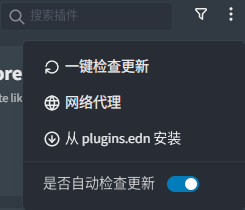
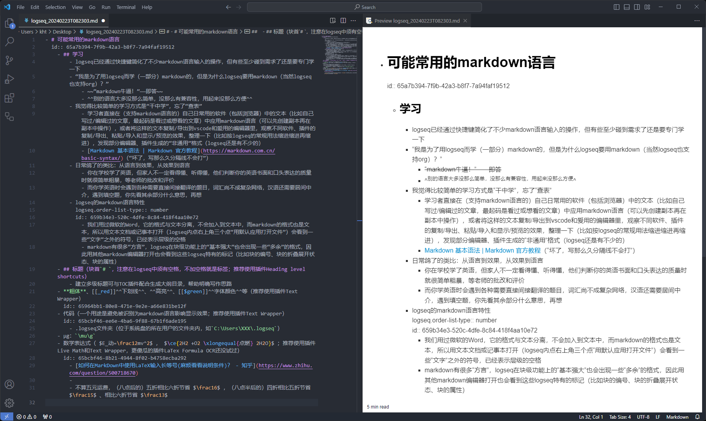

- {{renderer :tocgen2}}
- ((67b07706-126c-4c69-91b8-dcb79d246ff6))
- [[Obsidian]]
- [工作后，发现logseq更适合我 - 知乎](https://zhuanlan.zhihu.com/p/676562851)
- [logseq最近都没太多人关注了吗？  ? - 知乎](https://www.zhihu.com/question/634480324)
	- https://xuanhuai.wiki/
- Logseq是一个笔记软件，块级粒度，双向链接，大纲结构，本地保存
  id:: 679adca5-d53e-4312-91ed-0c91a80ec7aa
  collapsed:: true
	- 显而易见，你可以认为你此刻看到的东西是“博客”，可能因为你不常见别人把这么多“笔记”，而根据内容的“完成度”、小红书等平台的叫法等也可以认为它是“笔记”——更复杂的认知过程赶时间就不梳理了
	- 块与
	  
	  段的区
	  
	  别你看
	  
	  出来了
	  
	  吗
	  
	  ？
		- ((65bcf627-e061-4bad-aa44-14171d6064bc))
		- 尽管能 ((65af1d52-3ec7-4db9-a639-bc5659e83759))，也能导出，logseq可能还是不太适合写传统文档（word那种）
		- 我不用obsidian的一个原因是，它的引用粒度不够
		  id:: 66335bd1-c711-4712-8086-ddf302aeb6e3
			- 简单说，如果你并非很“专业”，而是战线很长，每天涉及几十上百个主题，那么考虑到时间成本，就像回忆之前所在学校的同学，一般人没法在脑子里想到一张照片立刻把所有人名字差不多同时标上去，大多是要从部分乃至一个同学根据各种故事、关系啥的想出其他同学，这些先想到的同学就是回忆其他同学的线索——而obsidian的页级引用是相对不生动的，要想XX班有哪些故事、关系啥的，想XX班不如想XX班的同学A（“懂的都懂，没几页笔记的人不懂就不用强懂了”）——当然也可以把页像我的块一样分得比较细，但“层级”又会出问题——而块引用好在我到哪都可能见到相对具体的内容，我就不那么容易回忆失败，就算没想起来，点开也是相对精确地相关的内容
				- ((679adce6-18da-4251-8f38-bbc5f03a56ca))
			- ---
			- 大家既然用双链笔记了，既然用笔记（包括微信、小红书等的各种你能之后看到的东西）了，那么肯定已经达到了对自身记忆力认知的“第一层”：“我会忘！”
			- 而如果还会在若干天内整理，那么至少在“第二层”，你的“工作记忆”、“缓存”
	- 对初次浏览这样的双链笔记的人而言，可能不易第一时间发现那些带下划线的（还有那些有明显或不明显外框的）文本是一种引文，链接直接显露别处的原文，是原文的影子/投影/影分身——“点击查找影流之主（或悬浮预览）”
	  id:: 65b5b8fc-2def-4e04-828d-d8b8f7a2d2da
		- [影   流   之   主_哔哩哔哩_bilibili](https://www.bilibili.com/video/BV1Qt411T7VS)
		- ((65bcbf46-ee5b-46e7-b8fa-4a82744cf8e7))
	- 大纲结构，也就是（==“抽屉套抽屉，大肠包小肠”==）可以缩进、折叠，内容可以按“上下级”分开放，也可以把原因、理由等放在子块
- Logseq下载： https://github.com/logseq/logseq/releases
  id:: 6651bb5e-a06b-43aa-918f-0e04043281cd
- [[电子笔记组织方式]]
- # 基本操作
	- 文字前的圆点（也叫子弹/bulletin）有指示（“这里的确有个圆点，然后呢？”）、（按住）拖动、（点击）聚焦、（右键）菜单的功能
	  id:: 65bcf627-e061-4bad-aa44-14171d6064bc
		- 圆点前面的箭头（手机打开网页版在最右边）可以展开/折叠块
		  id:: 65c72e47-9eb6-485f-9ff1-455148259354
		- 圆点下的竖线可以展开/折叠所有下级块（“像是珠链 ((679c51af-91b8-45c7-9657-39fd4d7a5297)) ”）
	- 选择多个块（然后可以批量操作；有时多按几次Ctrl+A就行）
	- 在完整页面（非聚焦块）视图，点击右上角三个点-“添加收藏”，可将页面添加到左侧栏的“收藏页面”中
	- 页面太长了怎么办？
- # 常用快捷键
  collapsed:: true
	- 以下是我认为可能比较常用的；其他可在右下角点击“？”查看（可能只有桌面端有），或者，在最右上角点开右侧栏，“帮助”中有“快捷键”，或者，“右上角三个点”-“设置”-“快捷键”中查看和自定义快捷键，或者
	  id:: 65adf755-1696-42ce-bd50-341fbf5bc4ad
	- tt切换主题的深色、浅色模式
	  id:: 65af1d52-bdcf-4bc1-8dea-cef1ffb94882
	- s搜索，d在当前页面内搜索（我自定义的；可能与部分输入法不兼容，需要按shift切换中英文）
	  id:: 65bcbf46-10d3-4089-b32f-930088715d7a
		- TODO 新版本的搜索没了“历史记录”，多次尝试关键词搜索（有时回忆的关键词不够精准）和用同一个多页出现的关键词搜索（有时多个含关键词的块要放到右侧栏一起看，它们之间可能有较大的时间和分类跨度，而它们的内容需要整合）的便捷性好像下降了
		- 两个及以上的关键词之间有其他（不确定）字符的，可以在关键词之间加个空格
	- Tab/Shift+Tab缩进/逆缩进
	- Alt+Shift+$\uparrow$/$\downarrow$ 向上/下移动块
	- Ctrl+C/V光标在块中时，复制/粘贴块引用
	  id:: 6596c0ca-555b-4f8f-956b-f71333edf9ce
	- 粘贴b站等的视频链接不自动生成占位即播视频模块（“忍{{video xxx}}很久”）
	  id:: 67cd7ccf-1cef-4233-9b4b-cf1a7b7f691a
		- [Pasting Youtube link without turning it into a {{video …}}? : r/logseq](https://www.reddit.com/r/logseq/comments/159xef9/pasting_youtube_link_without_turning_it_into_a/)
			- Ctrl+Shift+V，好很多了，改成Ctrl+V又粘贴不了图片，行了吧
		- ((67ce84d6-04c4-4a28-87b1-557a446b1202))
	- Ctrl+Enter 添加代办/切换代办状态
	  :LOGBOOK:
	  CLOCK: [2024-01-07 Sun 11:09:57]--[2024-01-07 Sun 11:09:58] =>  00:00:01
	  :END:
	- Ctrl+Z撤销，Ctrl+Y重做
	- Alt+$\leftarrow$/$\rightarrow$后退/前进（我自定义的，与浏览器的一样）
	- to全部折叠/展开
	- td切换文档模式（减小缩进——“看着不习惯是吧”；此模式下回车enter为换行而非新增块）
	  id:: 65af1d52-3ec7-4db9-a639-bc5659e83759
	- rt左侧栏、tr右侧栏（我自定义的）
	- Shift+左键 在右侧栏打开块、页
	- Shift+Enter 在右侧栏打开搜索栏中当前选择的条目
	- Alt+Shift+J 在右侧栏打开当日日记
	- ct 关闭右侧栏最上面的条目
	- Ctrl+C两下 清空右侧栏
	- gj 切换到日记页面
		- gp 前一篇日记
		- gn 后一篇日记
	- Ctrl+-/=缩小/放大+页面
	- `[[`（自动生成`[[]]`）页（面）引用，输入新页名可新建页
	- `#`标签（近期开始我主要用于标注论文年份，以便观察全球学术脉络）
	- 空格或2在白板中移动
	- `/`菜单（在块末需要隔一空格）
		- 你不必输入完整命令，例如获取链接标题可只输入`/ti`
			- ((65bef800-0e4a-430f-8f5a-4e98314b64d9))
	- Alt+Shift+G 打开图谱（有时因为“中断工作流”或隐私不太想显示侧边栏，切换图谱就按这个快捷键；可能与插件冲突，可自定义）
		- ((66335bea-765e-49a8-ad56-87c4569e6389))
- # 插件
	- 网页端大概不支持插件，看不到对应效果，有些块空着（块引用或图片的链接也没有），可能就是TOC、表格等没显示
	- TODO 插件一般从对应GitHub仓库下载，而国内直接访问GitHub有点困难，可以
		- 
	- 学习插件可以查看示例
		- 插一句，有些插件有比较鲜明的特征，比如sethyuan大佬的插件图标就是“蓝色经典”，hkgnp大佬的是“灰色经典”
	- Awesome Links：获取外部链接的favicon图标，给日志之类的内部页面加上对应图标（“至少我这里看得到”）
	- Page-tags and Hierarchy：多层级页面的标题UI
	- Tabs：开启类似浏览器的标签页栏，双击可固定/取消固定页面
		- ## 键盘快捷键
			- 固定/取消固定标签: CTRL + P (macOS: CMD + P)
			- 关闭标签: SHIFT + CTRL + W (macOS: SHIFT + CMD + W)
			- 更改为下一个选项卡: CTRL + TAB
			- 更改为第n个选项卡: CTRL + 1 ~ 9 (这尚无法配置)
	- Bullet Threading：高亮光标所在块的全部直接上级块的线条，方便一屏看不完时确认层级关系（“原来如此”）； ((670d40c3-4575-485c-8b47-bea78a726ae7)) 主题自带，不用装
	- Get webpage title：`/ti`获取链接标题（不在块首输入时前面需要加个空格）
	  id:: 65bef800-0e4a-430f-8f5a-4e98314b64d9
		- “骗自己换个地方疯狂稍后再看是这样的”
	- Move Block：右键菜单、页面标题右侧箭头或快捷键把块引用、块嵌入、块的内容等移动到当天日志等位置，这样通过日志展示更新内容就相对顺手了
	  id:: 65cc4a78-a2e4-40a8-870c-706cb31aabb9
		- TODO 如何批量导出日志中的块引用等的原文内容？
		  id:: 65cec1fb-446f-42b2-aeff-cdcd9137b181
	- logseq-swapblocks-plugin：切换块引用与被引用块的位置（可能总得有个位置），使用逻辑可能是，想把被引用块放到“更贴切”的页面，或是需要有限度地分享（比如不分享日志的话，不会块引用日志的块）
	  id:: 65bcbf46-ee5b-46e7-b8fa-4a82744cf8e7
		- 也可以先在日志记，然后引用到相关位置后再切换回来——反正把定位工作后置
	- Text Wrapper：随选择文本唤起的格式工具栏
	  collapsed:: true
		- ((65964bb1-80e8-471e-9e2e-a66e831be12f))
		- ((65bcbf46-ee6e-4ba6-9f88-67b1f6ade195))
		- ((65bcbf46-8b21-4944-8f02-b4758ecba292))
	- Block to page：把块作为页面名，下级块作为页面内容，整体转进为页面，过程看着像是自动复制粘贴块；使用场景：“兜不住时先收起”
	- Split block：右键圆点在菜单中选择，把一个块内的多行文本按行分成块。有些复制过来的长文和之前因为过长而崩成一块的页面要这样救一下
	- 以上是常用的
	- TODO 统计字数、块数（包括不同层级、对应识别符等的；“统计我的发明用的”）
	- TODO 打印时给出双链相关信息（方便印刷物阅读者定位）
	  id:: 672c281d-2c00-4282-ad14-adf5a836f79a
	- ---
	- Ordered Lists：可能比内置的更好的有序列表（“至少我这里看得到”）
	- Heading level shortcuts：标题快捷键，Ctrl+1~6分别为一到六级标题，设置较多标题时少按`#`（但我觉得略有些别扭，可能跟小尺寸键盘有关）
	- Tags：快速查看所有标签，点击标签展开标签所在块，再点击可跳转到所在页面（位置可能不精确）
	- Live Math：数学表达式输入器，要写数理化似乎不得不用啊
		- ((65bcbf46-8b21-4944-8f02-b4758ecba292))
	- TOC Generator：在页面内或（点击右上角插件图标在）侧栏生成TOC（Table Of Contents，直译为“内容表”，可俗称“目录”、“提纲”），见页首（滚轮或点击右下角“TOP”“回到顶部”），点击标题可聚焦该块，点后面的“回车”可滚动到并选中该块，点击并按住标题可在TOC内或（双栏间的相同或不同页面中的）TOC间拖动并实现在页内拖动相关块，点击箭头和可切换TOC的展开/折叠状态——总的来说，有助长文写作
	- Luckysheet：块内嵌入类似Excel的表格，还不错，有时确实不适合一次次地按计算器
	  collapsed:: true
	- Doc View Exporter：左对齐、无缩进预览，然后可导出为左对齐、无缩进的窄长图（TOC好像不能点击跳转）的或相对完整的HTML文件==（但非本地看不到本地图片等本地文件）==，相比[Logseq Publish SPA](https://github.com/marketplace/actions/logseq-publish-spa)保留了一部分插件的效果（比如TOC Generator的，但Luckysheet的就不显示、无法操作原表格，此外可能与Awesome UI不兼容，影响导出文件的显示效果），点击其中的块引用链接可打开本地对应位置的块
	  id:: 659b89b8-f17c-4d75-a9d2-3332ef699d60
	  collapsed:: true
		- “曾经”
		   >因多平台手动发布麻烦和重新试了下导出插件感觉不错而试，暂时用 logseq 插件 Doc View Exporter 手动导出为 html 文件再拖动到对应 github 库上传，再在库中的首页文件 index.html 中添加链接，未来可能通过博客框架和同步盘提高自动化水平
	- Logseq pinyin match tags：Ctrl+T，滚动鼠标或按拼音搜索标签并插入块
	- TODO Agenda：任务管理（含番茄钟），打算试试替换 腾讯文档（看板和日历排期，没搞懂替代方案时，多列多行的显示效果差不多够用；如果显示不全，为了一目了然、一触即出的方便可以尝试调低浏览器拦截功能中的“阻止指纹识别”等级，或者不嫌麻烦也可以一个个右键展开）
	  id:: 66335bd1-9f9f-48e3-a190-127ffa573070
	  collapsed:: true
		- [Logseq 日历 & 任务管理 & Daily Planner 插件 Agenda3 使用介绍_哔哩哔哩_bilibili](https://www.bilibili.com/video/BV1yG411i7d9)
	- Favorite Tree：在左侧栏“收藏页面”中增加页面层级
	- Paste More：带格式粘贴，减少粘贴进logseq时的格式损失
	- ---
	- 暂时没用起来（或者就是还没用）的插件
		- Vim Shortcut
			- Increase`plugin.logseq-vim-shortcuts` 的默认按键ctrl+a按了会给块引用（可能还有块嵌入）的链接的第一个未被其他符号截断的数字加1（更早发现，但没定位到按键，接着还因为层级内链接较多所以没发现撤销有用，导致一个个手动改了回去），导致链接失效（“好像明白了什么，以前的那些以为是其他部分问题的失效链接？”），需要按ctrl+z撤销或按对应的Decrease按键（默认ctrl+x，可能需要改）减回去——不用该插件或在快捷键设置里删掉对应按键即可 [[20250726]]
				- `ctrl+a`: Increase the first found number in block. Supports multiple selections and combo.
				- `ctrl+x`: Decrease the first found number in block. Supports multiple selections and combo.
		- TODO ollama-logseq
			- >我直接用logseq仓库的ollama插件连接 可以直接在logseq里提问和总结页面等——评论区
				- [使用AI大模型对logseq中的文件提问_哔哩哔哩_bilibili](https://www.bilibili.com/video/BV1m99QYKEq2/)
		- Logseq Anki Sync
		  id:: 666c0ac7-3cc5-4c8f-8beb-701e0e8f1b6f
			- [GitHub - debanjandhar12/logseq-anki-sync: An logseq to anki syncing plugin with superpowers - image occlusion, card direction, incremental cards, and a lot more.](https://github.com/debanjandhar12/logseq-anki-sync)
			- ((6721a7a5-3140-4128-895a-bf637ee7ff15))
			- [LOGSEQ&ANKI 制卡教程 | 工作流分享_哔哩哔哩_bilibili](https://www.bilibili.com/video/BV1mY411i7Lo)
			  id:: 666c084b-b9a8-4d9e-b031-4bb1d88a6e15
		- Excalidraw（嵌入更完整的Excalidraw；画得不多，没看出相比在浏览器网页端的Excalidraw里画效率高在哪，没协作白板协作，至少没法免费协作，也不如logseq白板能集成内部页面——“多画点画”）
		- 看板类（两个带‘kanban’的和模板更多的Logtools；看起来可能有点用，但是logseq的显示给了上限，多来几个缩进，行的长度就太短了，“载不动许多愁”——折叠、聚焦、TOC用用就能改善不少）
	- 我现用（现在不确定了）的插件可在 https://github.com/khtazmt/khtazmt.github.io/blob/main/.logseq.7z 下载
		- ((6594cd23-e261-462c-b54a-a5336b75038f))
	- 4T3L2A·FGBHSPD（“Favorite Great Britain High SPeeD，最喜欢的英国高速是吧？”）——“好好好，这下步[[风]]之后尘找到相对简单但开始变复杂的分类/助记规律了”
		- “现在按常用顺序排辣！”
- # （显示）主题
  collapsed:: true
	- Dev theme
	  id:: 670d40c3-4575-485c-8b47-bea78a726ae7
	- TODO 灰喜鹊主题
	  id:: 679adca5-2dbe-4df3-ab03-4c7c01631a8a
		- 主题文件路径：logseq图谱文件夹-logseq文件夹-custom.css
		- “真实灰喜鹊体色”
			- ((67c5bb7c-abeb-4252-98a3-a298ad2eea50))
			- “我去！选择高亮蓝羽黑头（黑头在浏览器里好像是灰腹，可能是颜色编码不统一？）！”
		- 灰喜鹊图片链接（“最灰喜鹊的一集”）
	- ((68085aee-306a-47ce-94b7-5bfa26a4ebb0))
- # 可能常用的markdown语言
  id:: 65a7b394-7f9b-42a3-b8f7-7a94faf19512
	- ## 学习
		- logseq已经通过快捷键简化了不少markdown语言输入的操作，但有些至少碰到需求了还是要专门学一下
		- “我是为了用logseq而学（一部分）markdown的，但是为什么logseq要用markdown（当然logseq也支持org）？”
			- ~~“markdown牛逼！”——即答~~
			- ==别的语言大多没那么简单，没那么有兼容性，用起来没那么方便==
		- 我觉得比较简单的学习方式是“干中学”，忘了“查表”
			- 学习者直接在（支持markdown语言的）自己日常用的软件（包括浏览器）中的文本（比如自己写过/编辑过的文章，最起码是看过或想看的文章）中应用markdown语言（可以先创建副本再在副本中操作），或者将这样的文本复制/导出到vscode和爱用的编辑器里，观察不同软件、插件的复制/导出、粘贴/导入和显示/预览的效果，整理一下（比如按logseq的常规用法缩进缩进再缩进），发现部分编辑器、插件生成的“非通用”格式（logseq还是有不少的）
				- ((65d85f13-a487-4144-9b08-93909d4e1f13))
				- 
				  id:: 65d86281-9b91-4afa-8474-2dca83a4cb71
			- [Markdown 基本语法 | Markdown 官方教程](https://markdown.com.cn/basic-syntax/)（“坏了，写那么久分隔线不会打”）
		- 日常鸽了的类比：从语言到效果，从效果到语言
			- 你在学校学了英语，但家人不一定看得懂、听得懂，他们判断你的英语书面和口头表达的质量时就很简单粗暴，等老师的批改和评价
			- 而你学英语时会遇到各种需要直接间接翻译的题目，词汇尚不成复杂网络，汉语还需要居间中介，遇到填空题，你先看其余部分什么意思，再想
		- {{embed ((659b34e3-520c-4dfe-8c84-418f4aa10e72))}}
	- ## 标题（块首`# `，注意在logseq中须有空格，不加空格就是标签；推荐使用插件Heading level shortcuts）
		- 建立多级标题可与TOC插件配合生成大纲目录，帮助明确写作思路
	- **粗体**、[[_red]]==下划线==、==高亮==、[[$green]]==字体颜色==等（推荐使用插件Text Wrapper）
	  id:: 65964bb1-80e8-471e-9e2e-a66e831be12f
	- 代码（一个用途是避免被识别为markdown语言影响显示效果；推荐使用插件Text Wrapper）
	  id:: 65bcbf46-ee6e-4ba6-9f88-67b1f6ade195
		- ((6594cd23-e261-462c-b54a-a5336b75038f))
	- \mu\g：`\mu\g`
	- 数学表达式（$E_动=\frac12mv^2$，$\ce{2H2 +O2 \xlongequal{点燃} 2H2O}$；推荐使用插件Live Math和Text Wrapper，更傻瓜的插件LaTex Formula OCR还没试过）
	  id:: 65bcbf46-8b21-4944-8f02-b4758ecba292
		- [如何在MarkDown中使用LaTeX输入长等号(麻烦看看说明条件)？ - 知乎](https://www.zhihu.com/question/500718670)
		- ((6594cd34-349c-4cb2-9b08-620eb81234cc))
		- ((6596a0b4-dacb-4d1e-928c-69f428e60256))
- # 查询query
  collapsed:: true
	- 需求
		- 可选层级搜索（关键词可能散布在不同页面的不同层级）
		- 连结果导出
			- ((659b89b8-f17c-4d75-a9d2-3332ef699d60))
			- [Query export to doc or pdf - Questions & Help - Logseq](https://discuss.logseq.com/t/query-export-to-doc-or-pdf/10169)
			- [How to export query results as markdown or rich text? - Questions & Help - Logseq](https://discuss.logseq.com/t/how-to-export-query-results-as-markdown-or-rich-text/20363)
	- ((65bcbf46-3c16-4ef1-a798-ac1be861d095))
	- {{query (and (page [[阳光]]) "http")}}
	  query-table:: true
	  collapsed:: true
	- TODO 结果排序方式
	- https://docs.logseq.com/#/page/queries
- # logseq的文件
  collapsed:: true
	- 如果你只是阅读（尤其是在网页端阅读）或刚开始写作的话，并不需要了解这方面，但用久了可能会为了排查故障（包括抢救文件）或把自己的库分享给别人前过滤隐私等信息而了解
	- 库/图谱文件夹
		- assets文件夹（放以文件形式自动复制到该文件夹的图片文件、pdf文件等）
		- journals文件夹（类似pages文件夹，但是命名方式另有一套的日记文档）
		- logseq文件夹
		  collapsed:: true
			- .recycle文件夹（从图谱索引中删除但在这个“回收站”保存的笔记文件；可能残留隐私，分享需留意）
			- bak文件夹（本地备份，可用于恢复笔记和配置；其中的pages文件夹可能残留隐私，分享需留意）
			  id:: 66ade36e-1d3f-40b8-bf59-293dc1011a10
				- [write most file in bak folder · Issue #3370 · logseq/logseq · GitHub](https://github.com/logseq/logseq/issues/3370)
				- [fix: search or editor frozen caused by large text by tiensonqin · Pull Request #6455 · logseq/logseq · GitHub](https://github.com/logseq/logseq/pull/6455)
		- pages文件夹（放md或org文档的默认文件夹，新增页面会在此新增文档）
		  id:: 66ade36e-124c-4570-a4e4-6791c3ba896c
		- whiteboards（放logseq白板）
	- .logseq文件夹（位于系统盘的所在用户的文件夹内，如`C:\Users\XXX\.logseq`）
	  id:: 6594cd23-e261-462c-b54a-a5336b75038f
		- git文件夹（通过git备份的笔记文件）
		- graphs文件夹（文件名为图谱所在路径的图谱索引文件，即打开logseq默认显示的图谱、索引，如果多设备不同路径使用则可能有多个；如果文件发生变动，则需要手动重新索引，重新索引的时间即文件的修改日期，关闭logseq正常保存时亦然；可能残留隐私，分享需留意）
		- plugins文件夹（插件本体）
		- settings文件夹（插件配置文件）
		- preferences（主题和工具栏默认状态）
- # 图谱
	- 这玩意可能有点新鲜，但实际上用处不大，也就图一看——当然也可能是我还不太会用
	- [How to include links from backlinks in page graph - Questions & Help - Logseq](https://discuss.logseq.com/t/how-to-include-links-from-backlinks-in-page-graph/10766)
	- [Graphical explanation of pages, blocks and references - Documentation - Logseq](https://discuss.logseq.com/t/graphical-explanation-of-pages-blocks-and-references/15966)
- ((65ad2406-9c4c-4af6-a1cf-4dd73ee597a8))
- 其他功能
	- pdf相关功能
		- >我不用这套功能，除了不咋精读外，看了有用的（“可能不咋看没用的”）可能直接简单消化（作者可能是某领域的大师，但书一般都挺厚，表述不够简洁）进已经有相对健全的分类体系的笔记了，对pdf内容的引用反而掣手——但也可能有我考虑上传博客的传播性而在没转写时更多粘贴截屏的因素
			- >个人学习、笔记库可能没几个人一起整比较复杂的共享系统吧？本地库上传到网页端，有些功能可能就丢了，比如这个pdf内容引用链接好像就点不开，反正logseq的github博客动作是没有
	- 现在还没整明白具体用途的
		- drawer抽屉（块内折叠，不折叠抽屉名；有点无纸化时代前的文员的办公桌上部票据小抽屉）
			- :我不到啊:
			  “让我们想象一下”，第一行是抽屉的表面，上面贴着用来区分内容物种类的“抽屉名称”，第二行就是抽屉的最里面，塞的东西再多也不会超过去了（虽然现实中的抽屉的最里面与底面可能存在缝隙，从而可能让纸张等较薄的物体通过），我们点一下抽屉表面，就是拉开或关上，拉开就是彻底拉开，就能看到抽屉最里面，关上就看不到，就这么简单
			  :end:
- 其他教程
	- [Logseq是最好用的笔记软件吗 ？全网最简单，废话最少，干货最多的Logseq笔记软件教学_哔哩哔哩_bilibili](https://www.bilibili.com/video/BV1D94y1N7U2)
	  id:: 666c0d8c-f530-4ef2-b67e-c34af4dcd038
	- [17 tips to level-up in Logseq - YouTube](https://www.youtube.com/watch?v=Fnxq3iITAJk)（感觉讲得有点水，也许是我的“知识的诅咒”）
- TODO [GitHub - 71/logseq-snippets: Snippets I'm using with logseq.com.](https://github.com/71/logseq-snippets)