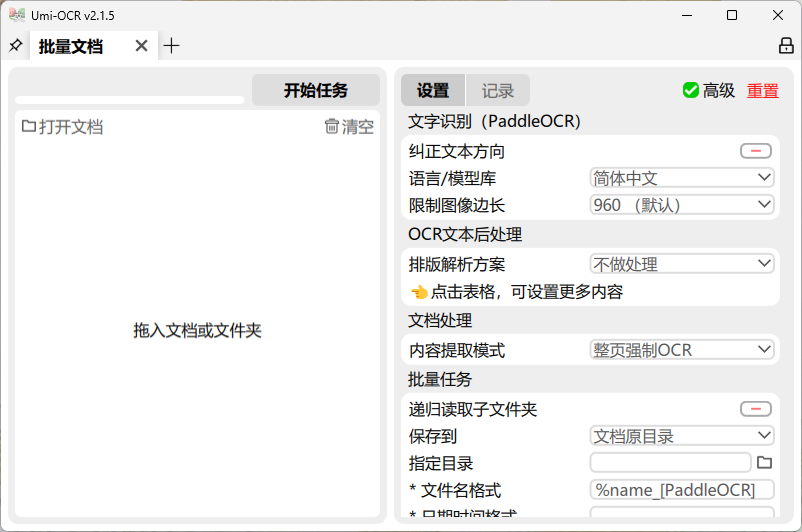

- 文字识别/（一般用）
- ==“没被链接、书签、OCR切过的无文本层纯扫描版大坨坨们有救了？”==
- 只有图片、没有可搜索的文本、但好像又比较有价值的扫描版电子书（大多是PDF——所以优先下更省空间更省事的EPUB等其他格式），不妨顺带做了
	- 等你想到书里好像有要找的文本，但书里“没有文本”，你就知道这个OCR有啥用了
- 对俄语等小语种，很多套用常用OCR服务的软件可能在OCR原文环节就输麻了， ((67402aaf-3529-4047-997d-5dde7000ee08))
- Umi-OCR
  id:: 66934b21-3076-44f9-ab9c-c9c1b2e488c6
	- [GitHub - hiroi-sora/Umi-OCR: OCR software, free and offline. 开源、免费的离线OCR软件。支持截屏/批量导入图片，PDF文档识别，排除水印/页眉页脚，扫描/生成二维码。内置多国语言库。](https://github.com/hiroi-sora/Umi-OCR?tab=readme-ov-file)
	- 用的百度PaddleOCR引擎
	- 
	- PDF已有原文本但为识别后难以连续完整选择的单字的，可将内容提取模式设置为“整页强制OCR”（推荐默认，有时混合模式识别不行）或“仅OCR图片”（这个没试过，不确定）
		- 已有较多原文本且文件数量较多时建议优先选择“混合OCR/原文本”，否则重复OCR可能影响复制和搜索
			- ((66db8abb-488e-4d8e-8fac-0e5a8adc84e1))
- ((683d12df-5b21-48b2-8705-d7ae39da044b))
  id:: 67402acb-53bc-4dac-9809-32a237281890
- [OCR文本识别(微信、Umi-OCR、MinerU、ABBYY FineReader )_哔哩哔哩_bilibili](https://www.bilibili.com/video/BV1uPLtzEED2/)
- [智能文档识别终极PK：MinerU与PaddleOCR巅峰对决，dify一键解锁多模态OCR能力_哔哩哔哩_bilibili](https://www.bilibili.com/video/BV1Wk5fzfEMc/)
- [OCR技术总结_哔哩哔哩_bilibili](https://www.bilibili.com/video/BV1iUtSehEZx/)
- [截图OCR - by Marcusx - 动作信息 - Quicker](https://getquicker.net/Sharedaction?code=ba82e11a-f845-4ca3-44ee-08d690b5076c)
	- 可“剪贴板识别”
	- [截图OCR 申请 API KEY 教程 - Quicker](https://getquicker.net/KC/Kb/Article/364)
	  id:: 676b8f2a-b2f1-476a-b34f-f98754779dfd
		- “百度智能云”的“机器翻译”没成功，“百度翻译开放平台”的成功了
	- 高精度识别需要赞助
	- 无法复制时识别提取文本，比如扫描版PDF（？）
- ((676d47e3-ad1b-478f-b677-25526e18ea50))
- [ABBYY FineReader PDF (泰比) v16.0.14.7295 中文破解版](https://www.cmdpe.com/post/327.html)
  id:: 6694783c-163a-4b11-b8a7-237f2a99a503
	- 识别（较紧凑的）双栏排版的效果可能更好（选择文本时不会把两列选到一起去）
	- 结果文件的图像可能变模糊（在阅读器中识别后整体模糊，而在OCR编辑器中识别后分辨率下降、毛刺变明显、文件大幅缩小）
		- [为什么Abbyy Finereader 14进行OCR识别，保存为PDF之后这么糊？ - 知乎](https://www.zhihu.com/question/356969007)（重新设置后文件略有增大，显示效果改善不明显）
	- 在OCR编辑器识别较在阅读器中识别对性能需求大很多
		- 建议安装直装版，相对不易闪退
		- 电脑性能没我的 ((65f78b91-84e4-4c20-a7ae-2a57d74dc901)) 好的话，可能会更费时费力，或者干脆就跑不动
		- OCR前注意硬盘可用空间足够（多次实测范围约15~35G）、识别语言、预处理图像等的设置，尤其是闪退后“恢复”的项目
		- OCR任务默认在打开图像文件后自动预处理图像，而预处理图像中的“纠正页面方向”可能会把部分页面给“纠正错”，可在设置中取消——如果还有问题建议拆分步骤，先预处理图像再识别，还可以调整自定义设置
			- 
- 公式识别
	- [SimpleTex - Snip & Get!](https://simpletex.cn/)
	- [FreeTex：免费的智能公式识别神器_哔哩哔哩_bilibili](https://www.bilibili.com/video/BV1zPV2zVEMG/)
	  id:: 66946b78-039b-45bf-9112-b8541b022490
	- [最好的工具，应让你忘记工具的存在——PillOCR：一个几乎无感的OCR工具_哔哩哔哩_bilibili](https://www.bilibili.com/video/BV1QnVUzgEAJ/)
	  id:: 683d12df-5b21-48b2-8705-d7ae39da044b
	- [开源OCR：MixTeX推出网页版_哔哩哔哩_bilibili](https://www.bilibili.com/video/BV1VnW7edE7T/)
- 竖排OCR
	- “现代作品的台版书是竖排疑似有点离谱”
	  id:: 68eb464b-0bb5-4523-a49f-14b8943802cb
	- [中文横排是否优于竖排？有相关研究吗？ - 知乎](https://www.zhihu.com/question/22104723)
	  id:: 68944334-75d4-4a59-8a03-3a75be80ce65
	- ((6694783c-163a-4b11-b8a7-237f2a99a503))
		- [如何使用ABBYY FineReader 识别竖排或反转文本？-abbyychina官方网站](https://www.abbyychina.com/FRshiyongjiqiao/shibie-shupai.html)
		- [日前对一本繁体竖排的pdf书籍做了ocr，发现有2个工具可用，且识别率很不错。 - 软件经验交流展望 - FreeMdict Forum](https://forum.freemdict.com/t/topic/28420)
	- ---
	- 没试过的
		- [GitHub - DayBreak-u/chineseocr_lite: 超轻量级中文ocr，支持竖排文字识别, 支持ncnn、mnn、tnn推理 ( dbnet(1.8M) + crnn(2.5M) + anglenet(378KB)) 总模型仅4.7M](https://github.com/DayBreak-u/chineseocr_lite)
		- [古联 OCR 古籍识别系统，亲测好用 – 书格](https://www.shuge.org/meet/topic/78721/)
- 书法识别
  id:: 66cbf9f7-a5c3-43fb-a32e-0b33a3d27ccb
	- [字鉴.书法智能识别－没有我不认识的字迹](https://api.shufashibie.com/page/index.html)
- TODO 难以识别的笔迹识别
	- [手写文字识别_手写文字识别在线-百度AI开放平台](https://ai.baidu.com/tech/ocr_others/handwriting)
- 其他临时OCR
	- ((670e806c-1ccc-42f5-a0b8-6c70790a5d1b)) 右键菜单
	- ((cb62e8cd-35a0-460c-8fa4-3cd98cfb7d2b)) 文本提取器
	- ((65bcbf4a-6899-4481-8a0b-b58afc33858a))
- ((6823e8e8-9198-4c0c-aed7-bb7839ad2097))
- ---
- TODO OCR文本批量处理
	- 错字替换
	- OCR文本提取
		- 目录等（比如用于相同相似主题的目录对照）
		  id:: 67034258-2df9-4b31-b139-c534172b1e72