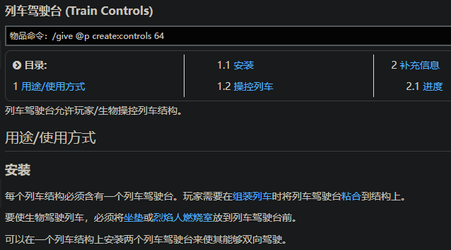

- （我的）待办
	- ((6636e4f0-63d2-44dc-a30e-c3cf71c2fcd0))
	  collapsed:: true
		- {:height 417, :width 697}
		  id:: 663dba34-272f-458f-bd2f-334b1f9ac712
		- _1715407941082_0.svg)
		  id:: 663f0c3c-8834-4555-a10d-e0f87d14d26a
	- 工业
		- 动力升级
			- 烈焰人燃烧室
			- 烈焰蛋糕自动填充（机械臂）
				- 
				- 工作盆积压不工作
					- 暂时继续叠巨无霸加溜槽箱子漏斗
			- TODO 烈焰蛋糕胚
				- 鸡蛋自动收集运输（进一步压缩，传送带加个反向；目前方案：水车传送带弹射置物台）
				- 工作盆积压不工作（“多漏了一组蛋”）
		- 产线合并、压缩（“1+1<2”）
			- “拆”
			- “搬”
				- 粉碎轮
					- 麦秆（稻米穗）
					- 糖（甘蔗）
					- 余烬面粉（下界岩）
				- 鼓风机
					- 洗涤：金属粒
					- 冶炼：石头
					- 缠魂：被虫蚀的石头
				- 动力合成器：金属锭、有机肥料
			- “看”
				- ((663cebb7-6c58-4bb5-a5b8-ea906efb0a38))
				- [【Create机械动力】适用于生存玩家的机械动力小技巧_哔哩哔哩_bilibili](https://www.bilibili.com/video/BV1Pp4y1E7Wy)
				- [【机械动力】 你可能没见过的4种物品上传_哔哩哔哩_bilibili](https://www.bilibili.com/video/BV1Ui4y127L3)
				- [【机械动力】极致烈焰蛋糕机！_我的世界_教程](https://www.bilibili.com/video/BV1N24y1G7Nu)（“原来是三台机器啊，我还以为要三台机器”）
				- [【Minecraft】机械动力·旋转型烈焰蛋糕机2.0_单机游戏热门视频](https://www.bilibili.com/video/BV1be4y1e76B)
				- [自动炼药流程 - 机械动力 (Create) - MC百科|最大的Minecraft中文MOD百科](https://www.mcmod.cn/post/2126.html)
			- 动力收割机
				- 运输到堆肥桶（“大好的粮食蔬菜也能用来堆肥是吧？”）
					- 保留一定量
					- 或者先输入到存储终端
			- 共用设备
				- 动力搅拌机
				- 动力辊压机：金属板（金属锭）、坚固板
				- 机械手：机壳（金属锭、坚固板）、磨制玫瑰石英（砂纸）、精密构件（齿轮、大齿轮、铁粒）、列车轨道（铁粒*2）
					- 换物品的话只要三个机械手，够了
				- 注液器
					- 熔岩：坚固板、烈焰蛋糕
					- 药水
			- 侦测来料自动切换配套材料/调整产线（手动调过滤器让来料从容器输出，或者再加个产品“菜单”？——“得了，你全生产完不就完事了，哪用得着那么多”）
		- 喷药机
			- [【【Create机械动力】适用于生存玩家的机械动力小技巧】 【精准空降到 04:04】](https://www.bilibili.com/video/BV1Pp4y1E7Wy/?share_source=copy_web&vd_source=24175964b0df2fcc2c022cae23517fdc&t=244)
	- 村北新区规划
		- 娱乐、比赛
			- 信号灯、门禁
			- “闯关节目”（“机械动力，启动！”）
				- [哔哩哔哩向前冲我的世界向前冲！-综艺-全集-高清独家在线观看-bilibili-哔哩哔哩](https://www.bilibili.com/bangumi/play/ep676167)（疑似有点平淡）
			- （“蜘蛛背包杯”）攀树/竹/岩（可能带跳板；检测玩家物品栏；圈地检测提前进入）
			- 怪兽公园（“？我的世界不早就是这样了么？”）
			- 跳板蹦床公园（垂直传送带、弹射置物台、安全网）
			- “炽足兽接力”
			- 移动标靶射击场（“cs是吧？”）
				- 标靶、起重机、绳索滑轮、显示链接器、辉光管、翻牌显示器
			- 列车
				- 坐垫
				- 物品保险库
				- 蒸汽笛（到站提醒）
				- 安全网（“跳到行驶中的列车上”）
				- 轨道过剩
					- 泥头车？武装列车？观光车？过山车？
				- 音乐列车（“音乐餐厅”；唱片机即可；也可能代替蒸汽笛作为到站提醒等？）
				- 投币上（列）车
		- 农业
			- 蜂蜜
				- 蜂箱
			- 马
				- 马食
			- {{embed ((66379dcd-4044-4bcf-aca4-8be7638c5bce))}}
	- 建筑设计
		- [I Built a Minecraft House Using a Real Architecture Software (Auto CAD) - YouTube](https://www.youtube.com/watch?v=EN2d-_wRdZ4)（AutoCAD设计好，然后打印出来对照着在游戏里搭建）
		- [（MC教程向）我的世界如何快速建造大型建筑 3D模型导入技巧介绍 - 哔哩哔哩](https://www.bilibili.com/read/cv7393875/)
		- [Exporting Minecraft data from AutoCAD - Through the Interface](https://www.keanw.com/2014/09/exporting-minecraft-data-from-autocad.html)
	- 不确定要不要办的
		- 完工提醒（连续物品输入后没有新的物品输入；列车状态信息好像能打在公屏上？——“疑似有点小题大做了”；“感觉不至于这么慢，‘思索’一下早完工了”）
		- 食材输入厨柜、厨锅自动烹饪（“疑似有点自动化了，烹饪的乐趣又在哪里？”）
		- 盾构机或刷石机
			- 好的话可能做 ((6638490c-0dab-409e-a870-2e89d0428db9))
		- 刷金机（“射金胡萝卜”；造无限圆石粉碎，听起来好像比无限熔岩更cheating）
		  id:: 6638490c-0dab-409e-a870-2e89d0428db9
		- 钓鱼机（初衷是不找村民的情况下搞附魔书，顺带还有经验，但经验相比蠹虫机效率低不少）
		  id:: 66335bd1-a345-49a0-be03-bc3ba09e305c
			- [钓鱼 - Minecraft Wiki，最详细的我的世界百科](https://minecraft.fandom.com/zh/wiki/%E9%92%93%E9%B1%BC)
			- [[教程]1.19宝藏钓鱼机_我的世界_教程](https://www.bilibili.com/video/BV13W4y137o5)
			- [【MCJE 1.19+】终于回到了你忠诚可靠的全自动钓鱼机！（附保姆级教程）_哔哩哔哩bilibili_Minecraft](https://www.bilibili.com/video/BV1DB4y11713)
			- [[机械动力] 全自动钓鱼机，但是占地更小并且全方向_哔哩哔哩bilibili_我的世界](https://www.bilibili.com/video/BV1b8411N7K9)
- 目前的成熟工艺
	- 不用管
		- 蒸汽锅炉（一般就是应力最低、不加燃料的被动状态，再加点东西小厂会停，可能弄个压力板、绊线钩什么的人在时加一点燃料会比较有性价比）
			- [工业革命-制造你的蒸汽机 - 机械动力 (Create) - MC百科|最大的Minecraft中文MOD百科](https://www.mcmod.cn/post/2437.html)
		- 村庄内的传送带（加了红石控制临时反向的反向齿轮箱）和弹射置物台线路
			- [跳板交通_单机游戏热门视频](https://www.bilibili.com/video/BV1Tz4y1q7o2)
		- 熔岩运输（完成烈焰蛋糕产线，作土豆加农炮弹药——“有三倍伤害、秒杀小怪的烈焰蛋糕谁还射土豆？”）
		  id:: 6638490c-2564-442e-a5b2-fc7f0d0a5af2
		  collapsed:: true
			- [汲取行星核心 - 机械师熔岩搬运指南 - 机械动力 (Create) - MC百科|最大的Minecraft中文MOD百科](https://www.mcmod.cn/post/1930.html)
			  collapsed:: true
				- >0.5之后可以直接用火车载储罐，会快不少
				- 喝抗火药水，下熔岩湖，靠岸另造了重定向到矿道（目前是风车背后的）下界门的下界门，抽上了，接下来是列车
			- 列车线路
			  collapsed:: true
				- [机械动力：简单列车 - 机械动力 (Create) - MC百科|最大的Minecraft中文MOD百科](https://www.mcmod.cn/post/3512.html)
				- 依次铺轨道、放列车站、组装列车（轨道要够长，才能出现蓝色高亮轨道；中间生成列车的列车机壳，放在列车前方、驾驶台之后的列车机壳，驾驶台，强力胶固定，此外还可以用强力胶粘个玩家或烈焰人燃烧室之外的生物实体需要的坐垫，“组装列车”），右击驾驶台可以开，右击坐垫可以坐上去，鼠标滚轮调速，空格停靠前方车站
				- 目前用强力胶往列车上粘液体储罐，驶离时液体管道让它淌，之后可能用移动液体接口（目前是用了，很方便呐，出站就如此接地下管道运输，我当时可能还想着把列车直接开到蒸汽机面前捏）
				- 服务器崩溃维修
					- 可能是传送门窄了
					- [Server crashes on player join due to invalid carriage_contraption position (NaN, NaN, NaN) · Issue #4392 · Creators-of-Create/Create · GitHub](https://github.com/Creators-of-Create/Create/issues/4392)
					- [Minecraft 文件结构介绍 - [MC]我的世界原版 (Minecraft) - MC百科|最大的Minecraft中文MOD百科](https://www.mcmod.cn/post/84.html)
					- [Java版世界格式 - Minecraft Wiki，最详细的我的世界百科](https://minecraft.fandom.com/zh/wiki/Java%E7%89%88%E4%B8%96%E7%95%8C%E6%A0%BC%E5%BC%8F)
					- [实体格式 - Minecraft Wiki，最详细的我的世界百科](https://minecraft.fandom.com/zh/wiki/%E5%AE%9E%E4%BD%93%E6%A0%BC%E5%BC%8F)
			- 列车自动化
			  collapsed:: true
				- 列车时刻表（时间或装满红石信号，存量转信器？）、司机（烈焰人燃烧室）
				- 
					- “啊？（好不容易铺了大半圈还没整明白的环形轨道白铺了？）”
					- 
					- 同时列车站的方向要相反，都是列车往返的前进方向
		- 布谷鸟闹钟（“晚安闹钟”：“刷幻翼固然可以陶冶情操，同时精进射术，但早睡早起带来的优质照明条件更有利于工作的开展”）
	- 手动（可能用量暂时不大）
		- 采矿
		  collapsed:: true
			- 因为 ((662f0b28-8805-4f68-bc72-1d04d45e1821)) ，所以结合此采矿方法，是 ((6630a688-b8ae-4de4-a9ba-e47b70762a08)) 做出来前较快的经验获取方式
			- 副手火把
			- 铁在y值16附近最集中
			- [教程/钻石 - Minecraft Wiki，最详细的我的世界百科](https://minecraft.fandom.com/zh/wiki/%E6%95%99%E7%A8%8B/%E9%92%BB%E7%9F%B3)
			- [Minecraft1.18正式版如何高效的挖取钻石？ - 知乎](https://www.zhihu.com/question/506788088)
			- 此外还可以开两三个挂（“你怎敢假定游戏人物的XX感？！”）挖爆区块（对于生成较少的钻石矿等是否效率最高还没查）
				- ((662e68f9-0526-4b64-8feb-8ae59a59982c))
				  id:: 66335bd1-2a82-4185-bfe6-4f6912b82755
					- 然后可以做一堆便宜的石镐带着，几个石镐放在手边，带木棍和工作台（或自带工作台的旅行者背包）随时合成更多石镐
					- 注意y值，可能要适当朝上挖
				- F3+G显示区块边界（一格抵两格，深蓝线是边界，淡蓝线是四分之一线）
			- 建议用时运三耐久三钻石镐采，尤其是比较稀少的钻石
		- （更高效的）刷蠹虫经验机（较大量地附魔用；基本原理：“钻抖术”）
		  id:: 6630a688-b8ae-4de4-a9ba-e47b70762a08
		  collapsed:: true
			- 当前模组的机械手代杀不掉经验球和经验颗粒
			- [[MC机械动力-新手向]蠹虫增援-经验自由[魔法之源](手把手教你18s附魔自由)0.4+_哔哩哔哩bilibili_我的世界](https://www.bilibili.com/video/BV19N411U754)
				- “蓝图已过期”
					- [求助，关于蓝图问题_机械动力吧_百度贴吧](https://tieba.baidu.com/p/8935271301)
				- 好，手工搞定了
				- 用法：拉杆打开开关，挖掉一块被虫蚀的石头，拿旁边箱子里的铁剑低头朝盔甲架挥
				  collapsed:: true
		- 附魔
		  collapsed:: true
			- 时运三耐久三钻石镐
				- [F13-怎么给你的武器装备用最佳顺序附魔？ - 哔哩哔哩](https://www.bilibili.com/read/cv14725362)
				- ((662e68f9-0526-4b64-8feb-8ae59a59982c))
					- 有模组挂在，“效率”魔咒可能不太重要了
		- 蒸汽笛（“污污污~”）
		  id:: 663ca90c-4916-458a-abef-e6b94294e1ab
		- 农业
			- 砍树
			  collapsed:: true
				- “集束云杉树是吧？”
				- ((662e68f9-0526-4b64-8feb-8ae59a59982c))
			- 动力收割机组（可能为了美观在地下传动；旋转或直线往复）或矿车
			- 沃土（比泥土长得更快——可能水稻需要）
				- [沃土 (Rich Soil) - 农夫乐事 (Farmer's Delight) - MC百科|最大的Minecraft中文MOD百科](https://www.mcmod.cn/item/382016.html)
			- 农夫乐事的煎锅
			  collapsed:: true
				- 进度“移动厨房”
					- 拿在手上煎（“坏了，没看到动画，但是按了一两秒有煎的声音，之前狂点没用，换了好多种食物，还用刀切，最后还是煎鸡蛋”）
		- 手摇曲柄（调试、启动工具——“坏了，想到之前培训时学的拖拉机舞了”；“坏了，可编程齿轮箱不接受人力输入”）
		- 交易
		  collapsed:: true
			- 迁移村民（主要是为了找图书管理员换附魔书，目前在东边村子传送点旁边的船里；“坏了，带不祥之兆效果把东边的村子村民全被袭击图图了，中途挂了次、回去补了次土豆，但是村民在酣战中被杀完了，早知道该把他们门都堵上的”）
		- 黄绿色染料（与面团合成粘液球）
			- 绿色染料
				- 蕨（北边几百米有针叶林，有了，还不确定能否种植）、仙人掌、海泡菜
		- 海带
		  collapsed:: true
			- 村东池塘，像甘蔗一样从第二层收割，慢慢浮到水面
		- 安山岩
		  collapsed:: true
			- 闪长岩加圆石用工作台合成
	- 手动放置或扔（可能用量暂时不大）
	  collapsed:: true
		- 安山合金
			- 安山岩加锌粒（优先）或铁粒用动力搅拌器搅拌（比工作台合成多100%；“揉面也用这个盆”）
		- ==作业元件==
		  collapsed:: true
			- 石磨（现在用粉碎轮，基本不用了）
				- 小麦-小麦粉
				- 花-染料
			- 动力合成器（做过粉碎轮、土豆加农炮、伸缩机械手，需要“一线连”，有点“接水管”、“贪吃蛇”的意思）
				- 伸缩机械手（“长臂管辖权”，打怪尤其是幻翼与土豆加农炮远近结合）
			- 机械手
				- 各种机壳
					- 去皮原木放在机械手下的置物台上，用对应的材料锭右键机械手
	- 手动放入容器（有箱子/木桶、漏斗/溜槽，还没运输矿车）
		- 精密构件产线（目前是用弹射置物台循环，也确实够了）
			- [工程师的优雅设计：精密构件、4倍速加工、锅炉、刷石机 - 机械动力 (Create) - MC百科|最大的Minecraft中文MOD百科](https://www.mcmod.cn/post/3892.html)
		- ==作业元件==
		  collapsed:: true
			- 粉碎轮
				- 粉碎粗矿，并获得经验颗粒
				  id:: 662f0b28-8805-4f68-bc72-1d04d45e1821
			- 鼓风机
				- 吹水洗矿（“淘金”）
				- 吹营火烟熏（烤）食物（“燃料不花一分钱”）
				- 吹岩浆冶炼（粉碎矿石到金属锭）
				- 吃灵魂营火缠魂（石头-蠹虫机）
			- 动力锯
				- 传动杆
					- 放入安山合金（比工作台合成多50%）
				- 去皮原木
					- 放入原木
					- 之前是手动的：砧板上右键放原木右键用斧子劈（可以在物品栏挨一起，提高手动效率——“坏了，”——“坏了，农夫乐事的菜还是要手动切切切”）
			- 鼓风机
				- [鼓风机批量加工 - 机械动力 (Create) - MC百科|最大的Minecraft中文MOD百科](https://www.mcmod.cn/item/277119.html)
				- 吹岩浆冶炼金属
				- 吹水洗矿（粉碎矿石到对应的粒，省得冶炼了，很多装配直接用粒；洗锌出火药）
	- 自动（两个及以上环节相连，比如鸡下蛋后自动运输到动力辊压机下的工作盆，和同样运输过来的先在粉碎轮加工过的糖和余烬面粉被压成烈焰蛋糕胚，然后注液器“裱花”熔岩得成品烈焰蛋糕）
- “回归教程”
  collapsed:: true
	- “麦块常识”
	  collapsed:: true
		- e打开背包（“你在怀疑什么？”）
		- q扔东西
		- ctrl疾跑、水中固定高度
			- [疾跑 - Minecraft Wiki，最详细的我的世界百科](https://minecraft.fandom.com/zh/wiki/%E7%96%BE%E8%B7%91)
		- shift潜行（防摔）
		- tab查看在线玩家状态（第一位是服主；同时在模组的大/小地图里显示点对应的生物头像）
		  id:: 6631bb2b-ca9c-4d70-9c60-9d63dd02b90f
		- enter查看和发送聊天
		- 下落时攻击是暴击，伤害高（跳起来），攻击有冷却时间（太快挥损失攻击力）
		- f切换副手，比如盾牌（可以打一下挡一下）和需要配合使用的物品（比如砂纸和玫瑰石英）；按住shift使用副手
		- ctrl、shift、右键、左键拖动、alt对于物品整理和生产有不同作用
		- L查看“进度”（游戏、模组的推荐游玩目标序列）
		- 右击床重设重生点，在夜晚可跳过夜晚（三人及以上在线时需要多人一起躺）
		- F5切换视角
		- F2截图
		- F6开关输入法（按了个shift输入法就出来了，很碍事，关掉！）
		  id:: 6636f0c7-8751-4e0a-9c66-345d0cbdf5d2
		- K光影（可以增加服务器的负担，效果还不一定让你满意），R重新加载光影
		  id:: 66332ea7-c5b5-4702-bcae-9eb12ba93130
		- 更多按键可按Esc键查看“选项-控制-按键绑定”，有些模组的默认按键可能被按键冲突解决模组或整合包调换了，比如背负旅行者背包时打开旅行者背包的B键（我的是被汤姆的简易存储占了，被换成了“,”）和访问附近的工具箱的左ALT键（我的是被换成了“-”）——可以调回去，顺手最重要
			- 还可查看[控制 - Minecraft Wiki，最详细的我的世界百科](https://minecraft.fandom.com/zh/wiki/%E6%8E%A7%E5%88%B6)
		- 部分音乐与时点时段有关
	- 入服接引
		- 起点不是家！别被半成品石房、石房稍北的小麦田和两条水上泥土路绕走了
			- 当然，纯小白可以先体验下某种程度的自力更生、逐步发展
		- 起点北偏东15度左右走两三百米左右是我们的村庄
			- 村北有水车，水车西边是我搭的一些小设备和更西的服主挖的向北向下通往下界传送门的矿道，水车东边是服主搭的粉碎轮和鼓风机冶炼，还有我接在鼓风机冶炼东边的动力合成器组
			- 水车南边有云杉、沃土、蘑菇，有风车、蒸汽机，有由石质压力板和可编程齿轮箱控制、由起重机杆传动的动力收割机排
			- 水车更南边、村中心附近有个传送石碑，点上，在矿道下面的下界传送门旁边还有一个，点上后就可以两地传送了
			  id:: 662e5b99-edbc-4a6e-82a3-951482ff4146
			- 下界传送门附近有用连锁挖掘模组
			- 个人装备方面，各处的箱子里可能有的土豆加农炮、铜背罐、土豆（可以九个合成一个箱装马铃薯，反过来可以分解；烤马铃薯效果着火，可以打没啥掉落的怪省点弹药和背罐气量）都带着，铜背罐装备到胸甲位置，作为压缩气罐，可以给土豆加农炮、伸缩机械手等供能、不减耐久，与潜水头盔配合可以水下呼吸15分钟
			- 遇到拿弩的劫掠者可以快跑走位躲箭，可以进屋蹲门
			- 现在装备好，打怪也就图一乐，真要经验还得用粉碎矿石和蠹虫机
			- 服务器开了死亡掉落保护，所以（一般）不用担心怪叫和意外死亡，但护具耐久好像还会掉
	- 模组
		- 可在启动器的“版本设置-Mod管理”中右键Mod（即模组）“转到MC百科”查看
		- [机械动力 (Create) - MC百科|最大的Minecraft中文MOD百科](https://www.mcmod.cn/class/2021.html)（“Mod教程”也可以看）
		  id:: 662da7ed-a0af-4534-bacb-55ec5b68caa0
		  collapsed:: true
			- [物品/方块 - 机械动力 (Create) - MC百科|最大的Minecraft中文MOD百科](https://www.mcmod.cn/item/list/2021-1.html)
				- ((662e5fb2-0f11-4db5-9af0-5fc1df62118f))
			- 最主要的模组，非常好
			- 有些物品可以按W思索，演示动画做得不错
				- [思索 (Ponder) - 机械动力 (Create) - MC百科|最大的Minecraft中文MOD百科](https://www.mcmod.cn/item/555624.html)
				- [思索.exe,但是原版_单机游戏热门视频](https://www.bilibili.com/video/BV1zr421W7q9)
				- 按q“显示方块名称”，移到演示图上可以顺蔓摸瓜
			- 工程师护目镜看应力等参数和故障提示
			- 扳手右键转向（可以将十字齿轮箱与竖直十字齿轮箱互换）、调模式（若有），鼠标滚轮调模式（若有），shift加右键快拆，还有其他一堆功能
			  collapsed:: true
				- [扳手 (Wrench) - 机械动力 (Create) - MC百科|最大的Minecraft中文MOD百科](https://www.mcmod.cn/item/227771.html)
			- 机械动力学习资料
			  collapsed:: true
				- [我的世界:从零开始的机械动力入门教程【纯干货】【超齐全】_哔哩哔哩bilibili_我的世界_攻略](https://www.bilibili.com/video/BV1964y1K7mv)
				- 应力
					- Stress
					- [应力与压力的区别 - 知乎](https://zhuanlan.zhihu.com/p/266823662)
					- [应力（物理名词）_百度百科](https://baike.baidu.com/item/%E5%BA%94%E5%8A%9B/3075028)
					- [应力单元，应力量以及应力影响 - 机械动力 (Create) - MC百科|最大的Minecraft中文MOD百科](https://www.mcmod.cn/item/330128.html)
					  id:: 662d9b69-73c2-4d0f-9b5a-d00796acc2f7
				- ---
				- [自动化合集 - 机械动力 (Create) - MC百科|最大的Minecraft中文MOD百科](https://www.mcmod.cn/post/2299.html)
				- ---
				- [蓝图收集帖 - 技术讨论 -  MC百科社群 -   MC百科|最大的Minecraft中文MOD百科](https://bbs.mcmod.cn/thread-9208-1-1.html)
				- [【1.16.5/机械动力/新手向】我的世界Minecraft机械动力自动化小型树树场 - 哔哩哔哩](https://www.bilibili.com/read/cv12482048)
		- [[XMM]Xaero的小地图 (Xaero's Minimap) - MC百科|最大的Minecraft中文MOD百科](https://www.mcmod.cn/class/1701.html)、[[XWM]Xaero的世界地图 (Xaero's World Map) - MC百科|最大的Minecraft中文MOD百科](https://www.mcmod.cn/class/1483.html)
		  collapsed:: true
			- 地图似乎只能看到自己的？Z临时放大小地图，X新建标记点，M打开大地图（世界地图；右键“在聊天栏分享位置/路径点”），点击左下角洞穴模式可以拖动调节显示的高度，进而发现资源点、特殊地点
			- 大地图可以看生物群系
			- ((6631bb2b-ca9c-4d70-9c60-9d63dd02b90f))
		- [玉 🔍 (Jade 🔍) - MC百科|最大的Minecraft中文MOD百科](https://www.mcmod.cn/class/3482.html)
			- ((663048c0-7b00-44f6-af35-154c8e0c964a))
				- “很显眼，但是很不显眼”
			- 查看方块会显示需要用什么工具采集，用错了大力出奇迹就没了
			- “？天天鉴宝是吧？”
		- [[IPN]一键背包整理Next (Inventory Profiles Next) - MC百科|最大的Minecraft中文MOD百科](https://www.mcmod.cn/class/4104.html)
		  collapsed:: true
			- 除了几种整理功能外，最显眼的是自动换更高耐久的装备，没有的话会跳“IPN警告”
		- [传送石碑/指路石 (Waystones) - MC百科|最大的Minecraft中文MOD百科](https://www.mcmod.cn/class/1339.html)
		  collapsed:: true
			- ((662e5b99-edbc-4a6e-82a3-951482ff4146))
		- [别样家具 (Another Furniture) - MC百科|最大的Minecraft中文MOD百科](https://www.mcmod.cn/class/7201.html)
		  collapsed:: true
			- 村里小屋里不少服主布置的
		- [农夫乐事 (Farmer's Delight) - MC百科|最大的Minecraft中文MOD百科](https://www.mcmod.cn/class/2820.html)
		  id:: 66332ea7-bcb1-4c93-b0ab-e822ad7b3a85
		  collapsed:: true
			- 也是个大模组，有刀、可以做绳子（可以攀爬、缓降，可以潜行向上搭建，比梯子和方块灵活，可做防坠的、可配合弹射置物台和向上搭建且从底部回收的绳子使用的安全网，可以代替黏液球做栓绳，总之就是好用）的草秆
				- [绳子 (Rope) - 农夫乐事 (Farmer's Delight) - MC百科|最大的Minecraft中文MOD百科](https://www.mcmod.cn/item/382018.html)
			- [食物 - 物品/方块 - 农夫乐事 (Farmer's Delight) - MC百科|最大的Minecraft中文MOD百科](https://www.mcmod.cn/item/list/2820-1-173073.html)
			- [主食讲解（配图）_哔哩哔哩_bilibili](https://www.bilibili.com/video/BV1TP4y1s7A3?p=2)
			  id:: 6637a1b9-2913-42f9-811a-ca8d98440c06
			- [料理乐事 (Cuisine Delight) - MC百科|最大的Minecraft中文MOD百科](https://www.mcmod.cn/class/11405.html)
				- [农夫乐事国创附属！料理乐事！在MC里沉浸式炒菜！——你一定没玩过的模组介绍_我的世界](https://www.bilibili.com/video/BV12a4y1R7gg)
		- [旅行者背包 (Traveler's Backpack) - MC百科|最大的Minecraft中文MOD百科](https://www.mcmod.cn/class/1732.html)
		  id:: 66335bd1-b6be-4ba0-844f-3cd54646c300
			- “背包中背包，BOB”
			- 可能是在起点附近做床时发现单独三个羊毛就能做睡袋，之后做了出来
			- 注意留意背上背包后打开背包的按键（我的是“,”），别（在外面睡了一觉收睡袋后）背上后找不到了
			  id:: 66335bd1-7d2a-44d5-90be-af9dcde0a0d8
			- 自带工作台，石镐全挖爆了就可以继续做了
			- [旅行者背包 (Traveller's Backpack) - 旅行者背包 (Traveler's Backpack) - MC百科|最大的Minecraft中文MOD百科](https://www.mcmod.cn/item/199182.html)
			- 能力
				- “蜘蛛，爽！”
				- [List of available abilities · Tiviacz1337/Travelers-Backpack Wiki · GitHub](https://github.com/Tiviacz1337/Travelers-Backpack/wiki/List-of-available-abilities)
				- [Travelers-Backpack-Recipes/OriginalRecipes.md at main · winderine/Travelers-Backpack-Recipes · GitHub](https://github.com/winderine/Travelers-Backpack-Recipes/blob/main/OriginalRecipes.md)
			- 扩容
				- [旅行者背包新添加的扩容功能概述 - 旅行者背包 (Traveler's Backpack) - MC百科|最大的Minecraft中文MOD百科](https://www.mcmod.cn/post/3157.html)
		- ==[[REI]REI物品管理器 (Roughly Enough Items) - MC百科|最大的Minecraft中文MOD百科](https://www.mcmod.cn/class/1674.html)==
		  id:: 662e5fb2-0f11-4db5-9af0-5fc1df62118f
		  collapsed:: true
			- ((662e5aa4-d3fd-46f0-958c-2bfb9cb55b49))
		- [连锁挖掘 (Diggus Maximus) - MC百科|最大的Minecraft中文MOD百科](https://www.mcmod.cn/class/3080.html)
		  id:: 662e68f9-0526-4b64-8feb-8ae59a59982c
		  collapsed:: true
			- 按住“1/!”左边的“·/~”挖掘
			- “原来如此，看服主这么挖的，但还是想‘啊？’一下”
		- 不太容易“看”到的
			- [Iris Shaders - MC百科|最大的Minecraft中文MOD百科](https://www.mcmod.cn/class/3697.html)
				- “看到了，但是，没有完全看到”——以为是整合包本身乃至新版本的自带功能
				- ((66332ea7-c5b5-4702-bcae-9eb12ba93130))
			- [搬运 (Carry On) - MC百科|最大的Minecraft中文MOD百科](https://www.mcmod.cn/class/1081.html)
				- 搬箱子（“啊？”）、动物
				- ((66236190-211b-4686-81e3-35a32cd8773f))
					- 小奥直播坐在辆Karry上
			- [输入法冲突修复 (IMBlockerFabric) - MC百科|最大的Minecraft中文MOD百科](https://www.mcmod.cn/class/2840.html)
				- ((6636f0c7-8751-4e0a-9c66-345d0cbdf5d2))
	- 较大的工程可以先在创造模式测试，创建时选择超平坦、白天，按e键后，上部可以翻页到相应模组
	- 探图插火把时建议偏一侧插，这样找不到路时可以不自杀回家
- ---
- 玩的直接原因（“写东西写的”，加上网友之前分享了整合包和服务器）
  id:: 662d935b-a57b-4b33-8e7f-a563741cd4ab
	- ((662d8f0b-fcb7-4eed-9503-c278b3988cb2))
- [[20240428]] 感想
	- 机械动力这个模组挺好的，联想到未师的极简哲学史了
	- 感觉看mc百科和视频教程学起来还是有点慢，我自己列了包含个人学习和服务器建设的清单，感觉应该有偏目标导向的科技树（可以是流程图或关系图谱那样，后者可以搜索物品，然后看到最近的若干层关系），但也许一开始只是没耐心先融贯接受它这个结构，而是从服务器现有的少数机械出发，当然百科的合成表有时多版本一开始也没整明白
	  id:: 662d935b-5b00-40d0-9987-374070954aea
		- “有显示合成表的模组REI是吧？坏了，之前就在右边看到了，看着有点长没敢用”
		  id:: 662e5aa4-d3fd-46f0-958c-2bfb9cb55b49
	- 还有就是服务器之前可能没啥人，出生点没留条消息，昨天有几小时更多是“重温”
- 不太成功的尝试
	- [[Minecraft机械动力]]
- DOING 通过Minecraft学习
  :LOGBOOK:
  CLOCK: [2024-04-30 Tue 09:48:48]
  CLOCK: [2024-05-07 Tue 13:28:36]
  :END:
	- “当前步骤    等待游戏窗口出现”
	- 光影
		- 游戏、现实（“更好的游戏=（超）现实？”），视觉享乐
		- 墨水屏模拟白纸黑字，led超越白纸黑字
	- 世界版本与模组
	  collapsed:: true
		- 模组拓展了世界，重新发现了世界，开启了新篇章
		- 极简哲学史
		- ((66304de6-0077-4e49-9dca-27cf8168cea9))
	- 不守恒
	  collapsed:: true
		- 无限水
		- 弓的“无限”魔咒
		- 鼓风机
		- “所见即所得”？
			- 合成中的损失
		- [为什么在MC里一个锭融化以后是144mb？ - 知乎](https://www.zhihu.com/question/617731043)
	- 简化世界
	  collapsed:: true
		- “开放世界”
			- 方块化的宽广世界
		- 原始环境，（近）现代科技（确信）
	- ---
	- 时间
		- 刻
		- 服务器不同玩家的共时性与历时性
		- 自转很快
			- 游戏人物的时空感？
			- “是超人”
	- 空间
		- 渲染距离
	- 实体
		- 物品被放置（物品无法放置自身？）
	- 物品
		- 实体被破坏（？）、采集
		- 能放进物品栏的和不能放进物品栏的
		- 游戏人物携带物品的可能位置
			- 手上、手边（可能比如在腰间别着，像是周星驰电影《少林足球》（“坏了，我打出来的《功夫足球》被曼德拉了？”）里从腰后掉到地上的扳手——“很合理吧？”）、身上、包里
		- 合成表
			- “你怎么知道xx可以这么合成？你不能自己动动脑子吗？啊，你说没见过的东西怎么动脑？那你没见过的东西你不能自己动动脑子吗？”
				- “有没有一种可能，作者都是先想出xx再想它的合成表该用什么怎么摆的？他们有没有可能除了想继续省料外还怕爱思索的玩家思索不出来而继续简化合成表？”
	- 经验
		- 附魔（“赋魅”，enchant），非工业化/技艺途径的能力强化/拜物，可传递性
			- 书不光是装饰品（？），知识就是力量，力量四，附魔！
				- [【主义主义】物理归纳主义（2-3-4-3）——培根：知识就是力量，而且是一种魔法力量_哔哩哔哩_bilibili](https://www.bilibili.com/video/BV13K411F7bH)
	- 显示名称（符号界的阉割）
	  id:: 663048c0-7b00-44f6-af35-154c8e0c964a
	- 容器
	  collapsed:: true
		- 等比例方块
		- 格子
			- 三维格子与二维格子
				- 三维模型与二维缩略图
					- 方向：二维四个，三维六个
						- 方向、边，可能也是拓补学的内容
			- 滴水不漏（虽然有“粒子效果”）
			- 每一个方块都是“免费容器”/“无”（需要游戏软件、硬件、电、电费来运行、维持——格子就是无产阶级；这些成本是让人认真训练的）
		- 箱子，碎片笔记、素材库
	- ---
	- 游戏动力
		- “进度”
		- （阶段性的）匮乏
			- “面多加水，水多加面”
		- “构思与实现之间有距离，这段距离叫”
		- 探险猎奇
			- “这个世界稀奇古怪的真不错，小时候登珠峰都没这么怪过”
		- 单人玩没有那种氛围感，真有人出现挺好
		- ((66323ba2-b94d-4603-87d0-30dd5381e10e))
		- “在？”
			- “你会在线上吧？你会在线上吧？你会在线上吧？”
				- “开门了吗？开门了吗？开门了吗？”
				- ((660e3189-5a74-4313-b097-464cc93adf92))
					- “在天上地下捉迷藏是吧？我也来蹲一个”
		- “看我们一起奔跑忙碌”
			- “让我们红尘作伴活得潇潇洒洒~策马奔腾共享人世繁华~”
		- “知识的诅咒”
			- “俺寻思”还是赶时间（“杀死游戏榨干游戏是吧？”）搜搜搜更好？
				- 可能折中一下，查合成表、工作条件，但是产线自己设想
			- 符合我们这个现实世界的常识还是利用游戏特性？
				- “风车连动力收割机，但是放地下”
	- 生产
		- “思索”
			- [[尼古拉·特斯拉]]的脑内建模是真牛逼（构想产线的原理一般不用细化到齿轮的旋转），相当一部分人设想十字齿轮盒那四个齿轮都有难度
			- 以水车/动力源为轴思考各路小工程的传动方向，先有干，再有枝
		- 合成
		- 搭建
			- 工程
				- 一个目的是为了更快获取资源，实现其他目标
				- 自动化与传播——自己产量上去，好用别人才会用，可获得性
				- 工艺
					- 辊压 滚压，擀面杖
					- 动态结构
						- ((65bcbf46-9eca-44c6-9842-6dbff0831129))
		- 奴隶
			- 烈焰人帕鲁（火是动能的燃料）
		- 物品与知识/文字
		- 词到句/素材（容器内整理）
		- 团队/部门协作
			- 一起玩Minecraft，一起劳动创造美好生活
			- 成员小工程/物品/属性/能力/游玩过程的可见性
				- 不需要编辑的历史记录也能猜个八九不离十，景观与监控
				- 通常打字，还没开过麦
			- “视察享乐”
			  id:: 66323ba2-b94d-4603-87d0-30dd5381e10e
				- “哇，你的房子好大诶！”
					- “唉呀呀几天不见变化真大！你又新造了好多大机器欸！”
				- 看别人干活（“是这样的，每个人的施工想法不尽相同”）
					- “I looked”（游戏《The Looker》）
					  id:: 663cebb7-6c58-4bb5-a5b8-ea906efb0a38
			- 公有制
			  collapsed:: true
				- 断开连接
				- 标签/命名与现实生活物品/“俱乐部物品”的非私有性/非匿名性
				- 物品整理
					- 原矿、矿材、生物及生物制品、工具/设备（直接使用或搭建）
					- 内容编辑与查看——“这箱子/文章是什么内容，能干啥呢？
				- 物品取用
					- 补强
						- 能确定的共同路线，我直接帮你强化附魔，或者给你双持
					- 经验也是共享经验，用于给工具附魔
					- 移交工作，下线前把别人可能需要的物品移下
					- 楚弓楚得
						- “没关系的，都一样”
					- 个人物品容器（旅行者背包——“旅行到无何有之乡是吧？”）
						- 末影箱与同步
				- 评论相当于牌子或书
	- 在生存模式复制创造模式中直接间接见过的工程的意义？
	- 玩家与游戏人物的距离？
		- 中之人与虚拟偶像的距离？
	- 精神分析
		- 大他者
			- 永远在线但不一定看得到的服主