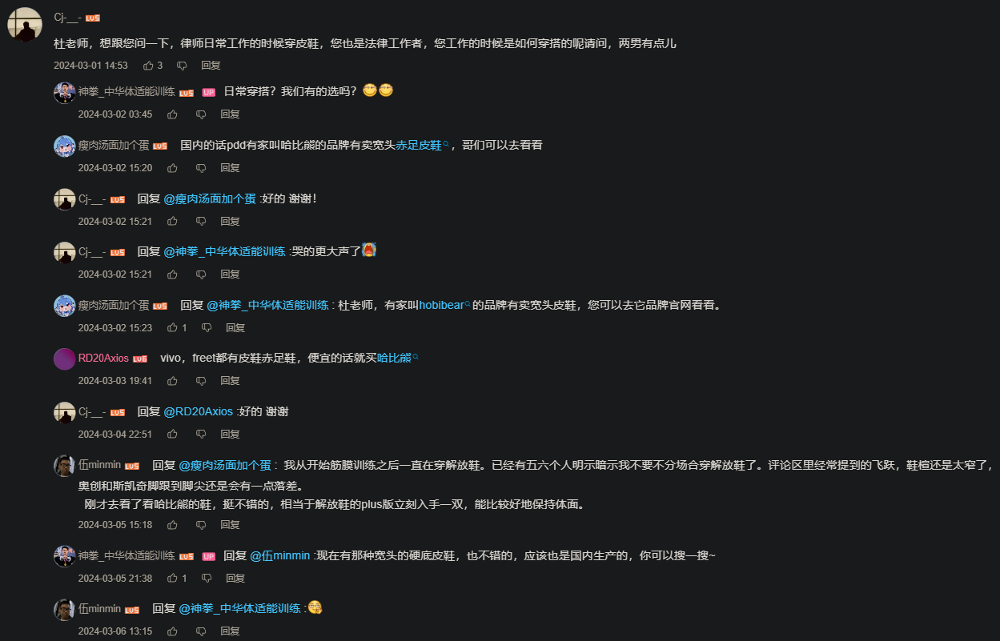
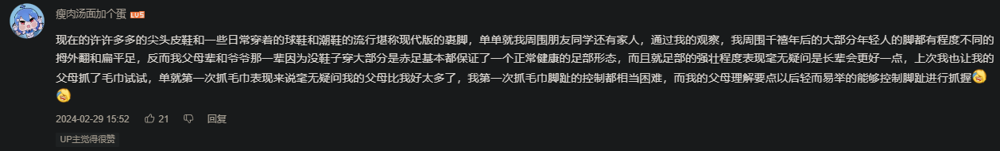
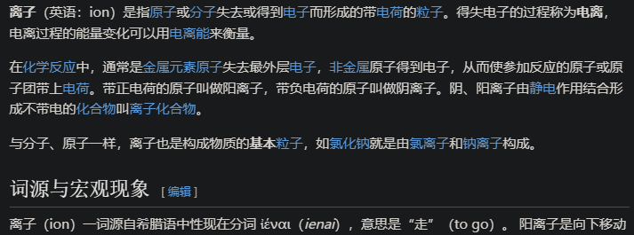

- ==待整理==
- “疾病/事故/死亡的发生学机制”：纯粹科技批判
  collapsed:: true
	- ((675bcec5-b748-4366-ae75-883992692708))
	- “先污染后治理——但是，不完全治理”
	  id:: 6709cb1d-9d86-4f10-8363-210f1c6c5a80
	- ((6636e4f0-63d2-44dc-a30e-c3cf71c2fcd0))
		- 
	- ((66335c19-2735-43a6-a6c9-fc840a910132))
		- 耐用不舒适，舒适不耐用？
			- ((66495e6e-d26c-4525-9f18-3ee3d6bbea9f))
	- 自然局限性（“地球是这样的”）
	  collapsed:: true
		- 地球不是天堂
		- >地球生命忍地球很久了，大家都是凑合活着。
			- ((66625451-78d7-4d7e-b7dc-fe700ad57b4d))
		- 平白有故
		  collapsed:: true
			- 重力，阳光
				- “ONLY UP”
					- 向上获取阳光
						- “什么黑暗森林？”
					- 植物混凝土
						- “土木工程”
			- 路坡墙（翻墙）顶（天花板）
				- 平路竖（半透明）墙玻璃天花板
				- “可悲的厚障壁”（鲁迅《故乡》；“共情之墙”）
				- 短视频机制
			- 结实的金属又容易雨氧锈
			- 凳子是平的，因为凳子脚两端是平的，强度够、不易折断和磨损？因为树就是平的？
			- [[《路是这样的》]]
			- ((664339bf-705b-4963-8737-ce0ec8ea83b0))
			- “人造白光”
			-
	- 自然因素整体上不利于大部分工业生产，需要给由本不裸露在地表的矿物等制成的机器遮风避雨
	  collapsed:: true
		- ((66432f3a-2334-4ed7-bba7-e927667187ed))
		- 不像 [[Minecraft]] 可以露天工厂
		- “人要跟着机器走”
			- 室内时间延长
				- “意味着什么？室内与室外有区别吗？”
				- [[阳光]]（“你以为你‘逃避’得了阳光？”）
					- 较高的楼层通常采光也较差
						- ((66335bd7-3fde-4b33-8d1d-f61d52057c3b))
					- 古代人晒不晒太阳，应该是晒的，得下地干活
					- [【切片】未明子：无论如何，你有一个未完成任务_哔哩哔哩_bilibili](https://www.bilibili.com/video/BV1Vu4y1L7GS)
				- [【【直播回放】随便走走 2024年1月16日14点场】 【精准空降到 25:28】](https://www.bilibili.com/video/BV18c41147nL/?share_source=copy_web&vd_source=24175964b0df2fcc2c022cae23517fdc&t=1528)
					- “一进家门倒头便睡，睡够4.8小时，神清气爽，绝对精神！”
				- ((65bcbf46-2833-485b-aa32-ef768d35e3ae))
		- “WHERE？”
			- “坏了，人类要用前现代尸体开始大规模生产了——好好好，去用尸体创造一些垃圾吧！”
		- “地面”平坦化、硬化
			- 没山路了，“填平补齐”了，“挖掘机技术哪家强？中国山东找蓝翔！”
			- 水泥路便宜，但是最硬
				- [为什么农村里都是水泥路，城市里都是柏油路？ - 知乎](https://www.zhihu.com/question/24102032)
			- 垂直/矢状面运动时间过多
			- 同时地面为了更快的汽车（早就甚至不是“马路”了）等通过而变硬了，更需要更耐用的鞋？
				- ((661d0716-fb94-42b2-80a4-06c92dc3da1c))
				- [想换赤足鞋？你需要了解这些事情_哔哩哔哩_bilibili](https://www.bilibili.com/video/BV1iy421q7kV)
					- 
					- 
					- 
					- 
					- {:height 127, :width 789}
			- [【什么是筋膜结构训练？】 【精准空降到 03:55】](https://www.bilibili.com/video/BV1DH4y157PG/?share_source=copy_web&vd_source=24175964b0df2fcc2c022cae23517fdc&t=235)
			- “那你多建点真正的赤足友好的人行道啊，而不是继续让人把臭脚裹得光鲜亮丽”
		- ((65d55152-5d22-49d8-86ae-62a0b13ce119))
		- “使用机器需要学习”
			- “泛用机器与选拔”
				- 学校：“我可以哦！都交给我吧！”
		- ((65bcbf46-c644-4bd4-9070-81a50e2af75f))
	- 一整个多层的“牵连”、“株连”（想象人是个植物）的“马太效应”的关系，为什么人类要把自己关进“制度的笼子”？
	- 有必要为了生产必要的东西接受一些不必要的东西的生产，但是不必要的东西不会自动减少生产
	- 就像学生为了更好的发展条件而接受“精益求精”的分数生产，但是趴桌上午睡、罚抄、早操早课喊口号之类并未被抹除
	- 零食
		- “嘴馋”还是“心馋”？
		- [5个湖南人，统治了中国零食半壁江山](https://mp.weixin.qq.com/s/1Eagvmo1dluQBE-nzwq6Vg)
		  id:: 67837cd0-a1d0-4191-ab51-045378690a46
	- 红烧牛肉面
	- 运动运输运赢/营
	  id:: 668ce726-743c-4fac-9cd3-2014c1e38ef5
	  collapsed:: true
		- 输入输出，赢入赢出
			- 盈亏同源
				- ((665fbc89-c0d7-4a67-bacf-4ee8eb36a8f0))
		- sport，transport
		- transfer转换
		- 运转，转运（中心）
			- 时来运转
		- transmit传输
		- transex性转/跨性别
		- transform
		  id:: 669c4125-3fd4-48e0-b525-93e9d8596622
		- sport与sit有词缀s？
		- [Traffic, transport, transportation & transit 和“交通”有关的四个近义词区别 - Chinadaily.com.cn](https://language.chinadaily.com.cn/a/201701/19/WS5b32ebeda3103349141df156.html)
		- 互联网（游戏）中的运输
			- 装备和工程不用时，下线前丢在服务器里就成
			- 游戏本就就是一个自包装的末影箱
	- 大宗商品与卫生
	  collapsed:: true
		- 尽可能少接触或少用塑料（无论大小；除了口罩，可以大幅减少空气中的微塑料吸入），可能算下来无论对个人还是社会其实是省钱省事的，而不是说一样东西很普遍就只能想着没有它我们可怎么活啊、百万漕工衣食所系啥的 比如买水喝显然就多花了钱、多烧了燃料
			- ((66a4c62c-6b56-494a-9488-b3915b1d4b26))
		- 为轮子和水泥监狱而生
			- 立方体洞穴
	- 意向性
	  collapsed:: true
		- 想方设法让人劳动
			- 免费的好东西让你没时间享用，必须努力“挣钱”换自己早出来的质量不一定更好的东西
				- 挣钱用于看病
		- “就是弱了、难以逃跑和反抗了，奴役才容易长久”
			- “难道你久坐不舒服之后，会比还算舒服时更倾向于走跑跳吗？可能更倾向于躺着”
			- [【劳动者维权究竟难在哪里？记我遭遇工伤前后的经历【我的劳动维权故事】】 【精准空降到 02:52】](https://www.bilibili.com/video/BV1Bx421Q7fT/?share_source=copy_web&vd_source=24175964b0df2fcc2c022cae23517fdc&t=172)
			- ((6367366f-e68f-4976-b1e6-45ae8adf1341))
	- 单向度的人（指只会前后，甚至很难上下，更别提左右——“大部分人哪有什么左右？”）
	- 过度单调的稳定不是稳定
	  collapsed:: true
		- “稳定压倒一切”（“包括你的颈椎、腰椎”）
		- 在平路上走路稳定并不是“全面/全能稳定”
	- （紧张急迫的）工业化
	  collapsed:: true
		- 安全不是人们的唯一需求，一个国家不能只有国防业，“XXXX阵地，XX不去占领，XX就会去占领”
		- 自然因素也许不太利于人类生存发展，但经过漫长的演化，人类已经适应、适配了其中很大一部分
		- 工业化将自然环境转化为了资源和基础设施，隔离了人与自然的接触
		- [[《路是这样的》]]
		- 历法与起点
			- 我们如何规划我们的生活？显然我们“要有时间概念”，也就是机械或电子钟上或跳动、扫动或瞬间闪动的“时间”
		- tem·po·sit·ion
		  collapsed:: true
			- （有这么命名的一家公司，看网站可能是劳务中介）
			- tem
				- TEM-8，Test For English Major-8（英语专业八级考试——“我没考过，可能因为我不是英语专业的”）
					- 8转90度（差不多）就是∞（无限、无穷大；循环、莫比乌斯环），再分开也可视作前后两个车轮；转45度中间用“-”切一下就是%（百分比），八是平的词源
						- ((66476acb-56e3-47d5-a8bf-5726759bd62c))
			- po
				- post（发帖）的缩写，po主（一般指“贴主”，对应发视频的up主，怎么那么多主啊？）
				- “夜壶”（源于“pee oh”发音的缩写？还是说“O”象形？维基百科上说是“possibly from French:  _pot de chambre_ ”）——“（XX）公厕”
			- sit
			- ion
				- 离子，带电的原子或原子团，人体有生物电，也有各种电器、电磁场围绕
				- 
			- tempo
			  id:: 66ade38f-a57b-4f6d-af05-075db05de5bc
				- 节奏，结合了时空（至少结合了计数与时间）
				- 德宝（维达旗下的德国纸巾品牌——“达斯·维达？”）
				- temporal
					- 世俗的，颞（颞下颌关节，开口受限——失语症，神经紧绷）
					- ral，RAL（Rutherford Appleton Laboratory，卢瑟福实验室，原子核结构）
			- posit
				- 假定
			- postion
				- 位置，姿势
				- 姿势：everything in position，各就各位
					- 现代人在被手机电脑异化之前，就已经在传统但错误的怀抱和婴儿车里被桌椅（坐位）异化了，
						- ((6615f04c-0ba5-4015-b163-576e49802f19))
					- 习惯不等于理解，更不等于接受
					- 主宰人们观念的是充斥着前现代话语和大学话语的现实
					- 稀缺是人为的
					- ((6615f04c-0ba5-4015-b163-576e49802f19))
					- 多层弯曲折叠内卷
					- [[自行车]]
						- 风，自行车姿势，长上坡
						- position身体，就像骑自行车
						- 效率：山地车小于公路车，但是小于躺车
						- bend
						- 弹性塑性，过度拉伸，就像桥
						- 躺骑自行车，办公用品
							- 专用自行车道
							- [躺车DIY攻略之一：躺车的定义及其分类(图文) - 美骑网|Biketo.com](https://www.biketo.com/knowledge/7124.html?all=1)
						- 姿势限制
						- 自我剥削
						- 坐姿，爬行
						- 改造自行车，改造道路
					- 树与
						- 树上不会挂什么东西
						- 引体向上最舒服的是侧向，就像爬树
					- 姿势与文化
					- 家具（“枷具”）从公共场所到家庭
						- “生命在于运动”，让人固定在一个地方的不是刑具？至少不是枷具？
						- “家庭也是公共场所”
						- 椅子没有限位，那就可能乱坐 尤其是确实做累了
						- 大部分学生不直接创造超额价值，待遇也就更差
							- 上班族如果还是上学那个小凳子/椅子，画面可能就有点幽默
		- 椅纸鞋撑杆
		- 单向度的人
			- ((6ae1cea3-0133-4eae-934e-22ceaee1287f))
			- 在矢状面上过度前进的人
			  id:: 668ce726-0bd2-457e-a5de-69ed301badc2
			- ((66432f3a-3b54-4f4a-add1-00a58115a9dc))
			- 感官侏儒
			  collapsed:: true
				- [皮质小人 - 维基百科，自由的百科全书](https://zh.wikipedia.org/zh-cn/%E7%9A%AE%E8%B4%A8%E5%B0%8F%E4%BA%BA)
				- [脑科学界著名的「感官侏儒（sensory homunculus）图」是如何得出的？ - 知乎](https://www.zhihu.com/question/36527601)
					- [A somato-cognitive action network alternates with effector regions in motor cortex | Nature](https://www.nature.com/articles/s41586-023-05964-2)
				- [幻肢、恋足背后的科学奥秘，这些猎奇的问题大脑都有解释 - 知乎](https://zhuanlan.zhihu.com/p/31124045)
				- ((665fb526-7b7b-44aa-a6c8-c2bed18e9c72))
				- [改写教科书的发现：大脑运动皮层中有一个“身心界面”_生命科学_澎湃新闻-The Paper](https://www.thepaper.cn/newsDetail_forward_22775335)
			- 避光
			- ((66433719-239a-48b8-80a4-6bfd8360f2ed))
			- “白度”
			  collapsed:: true
				- 太湖三白
				- 白面
				- 白面
				- 白纸
					- [纤维素_百度百科](https://baike.baidu.com/item/%E7%BA%A4%E7%BB%B4%E7%B4%A0/775570)
						- [人民币竟然是棉花造的！从“白纸”到钞票，制造过程全在这…_澎湃号·媒体_澎湃新闻-The Paper](https://www.thepaper.cn/newsDetail_forward_11897822)
					- [木质素（一类复杂的有机聚合物）_百度百科](https://baike.baidu.com/item/%E6%9C%A8%E8%B4%A8%E7%B4%A0/146275)
						- >木质素呈褐色粉末，木材的颜色即是木质素造成的。
						- [造纸黑液_百度百科](https://baike.baidu.com/item/%E9%80%A0%E7%BA%B8%E9%BB%91%E6%B6%B2/10439491)
						- [黑液，一个伴随造纸永久的话题 - 知乎](https://zhuanlan.zhihu.com/p/95787423)
					- 丧事
				- 白瓷
					- [为什么酒店的盘子纯白色的居多，但是家里用的盘子，一般都有些图案？ - 知乎](https://www.zhihu.com/question/36370319)
					- 食物不是装到白盘子里才好看，牛排、日料装在黑盘子里也（至少一样）好看
				- 白肤
					- 两性趋同
		- 饮食
		  collapsed:: true
			- 农业工业化
				- 别的国家都吃上土豆烧牛肉了，我们能不多生产点肉吗？
					- [“土豆烧牛肉”的误译与十年中苏论战_赫鲁晓夫_共产主义_匈牙利](https://www.sohu.com/a/511078959_100083694)
						- 古拉西，古拉格（“大酒店、挖土豆”）
							- [去西伯利亚挖土豆是什么梗? - 知乎](https://www.zhihu.com/question/328994972)
				- ((65c5a920-ac35-428e-b3af-f730d355d0c4))
			- 没时间就只能花更多钱吃更不健康的食物把钱散出去
			- 消化之后
				- （干硬糙）草纸与痔疮
		- 人机比例不协调
		  collapsed:: true
			- “机器太多，人不够用了”
				- “至少大部分机器就是为了让人应接不暇的”
				- 机器很贵，要很多钱，但是钱从哪来？只需要印钞就完事了吗？
				- “可能我觉得什么都是机器吧，你负责的流水线和工位当然是机器，你的键鼠桌椅碗筷鞋袜也是机器，随便翻几本书乃至几个短视频就能缝个八九不离十的思想还是机器，虽然可能给你的感觉不那么‘机械’——接受玩“高等教育”的洗礼，继续没完没了地吃没文化的苦，你的肉体是畸形、残疾的，恐怕绝大多数男同胞也就是在生殖器的大小上能使古希腊雕塑相形见绌，而你的灵魂也不大好看——所以你的人到底在哪？你还想做人吗？”
					- ((662ba87d-a292-4912-b1b2-446a065d2fbd))
				- （疑似适用至今的）人口高利贷
					- [土地私有制、阶级矛盾和农民战争——我国封建社会的周期性社会危机初探_中国政治学](http://chinaps.cssn.cn/rdpl_58843/201506/t20150618_2359108.shtml)
		- 机器比电脑大，坐着不方便面面俱到
		- 避开阳光
		- 墙壁、机壳、公摊面积
		  collapsed:: true
			- 墙壁与机壳挡住了阳光，造成近视，进而造成前引
				- 专心工作
				- 视线
				- 字是不容易大的
				- 更大的教室，但是层高不变，意味着更差的采光，再加上为一层楼的一侧配置的走廊
					- 更远的教学显示区域
				- 不戴近视眼镜的近视者可能受害更多？
	- 规整的与不规整的暴力
	  collapsed:: true
		- 平民一般可以通过单独或社会羞辱、噪声、近身肉体暴力等方式实施暴力
			- 对付绝大多数没有组织度可言的平民，只要比其中最强的强也许5%就可以击败整个几人的小团伙
		- 暴力
	- 不让逃的三类人
	  collapsed:: true
		- 临时工
			- “到处都有，随时随地，想怎么用就怎么用，不用为他们负那么多成本和责任，有啥问题让他们自己解决”
		- “违约金”（“贷款上班”、“编制”）
		- “其他自己不想逃的人”
	- “电子设备似乎提升了工作效率”
	  collapsed:: true
		- 算盘、计算器、电子表格
		- ((662328c3-cfe2-4543-8d5f-6d29e6f347e4))
	- 无福消受的人体
	  collapsed:: true
		- 现实人物不是神一般的游戏人物，享乐能力往往有限，同样需要通过饮食、睡眠、运动、其他尚能进行的享乐等方式进行再生产
		- ((6367366f-e68f-4976-b1e6-45ae8adf1341))
		- 白（背）景黑字（“？你的电脑配件疑似有点问题？”——白井黑子）
		- 电子白纸黑字
			- “祖宗之法不可变”
			- 液晶屏：“黑字不用发光，只需阻挡”
			- “人类能不能别老被‘自然传统’约束”
			- ((664339bf-705b-4963-8737-ce0ec8ea83b0))
			- ((63673668-92ef-43cd-a7f7-4064b83bc311))
			- {{embed ((66335be2-5aa1-4414-99e1-75dbe24ae58c))}}
	- 误解/错认/错选经济/消费
	  collapsed:: true
		- 父母等长辈按自己理解帮儿女相亲（“吃饭”、“看电影”、“露营野餐”等）
	- 医疗
	  collapsed:: true
		- “XX实习生”
			- 同样有“编制”，但教育总的来说先于医疗，更具有泛用性，卖的东西也比较统一，相对不那么容易超支，家长觉得不够的可以让学生参加课外培训
			- 而医疗工作者需要卖的东西比较多，尤其是人“老”了
		- 长期卧床
			- 肺炎（肺功能下降？）
			- 长期鼻饲后不适应常规流质食物？
			- 体质下降（维d、骨密度等；滴剂400iu剂量不够，还不是天天用）
		- ((66389b3f-9f9b-4817-8bf3-8b3d597988e3)) 不行
			- 病人拔胃管胃出血，护工不懂
- 现代人的对抗性想象图式（运动）
  collapsed:: true
	- >Beat It!
	- ((664f25d2-0c7b-4825-baad-1ae327006f5f))
	- 爬楼梯“跺脚”
- 能量与生命
  collapsed:: true
	- ((66335bd7-fb7a-46a3-9ee8-698dee3af074))
		- ((66567003-80eb-4445-8d8d-04fb935dbe04))
		- ((665287d5-1840-474e-bf0e-ffcdd0c96aad))
		- ((6657feeb-2bb1-4c4d-8e1f-00a9c7d6ba10))
		- ((66580269-37b0-4ffa-8e78-c4e5e1b99143))
- "华为图灵测试系列"
  collapsed:: true
	- 盲人用细绳拴住一头铁屋子里的太平大象最好的时间是十年前，其次是现在
- “久久归医”
  collapsed:: true
	- 久坐/久站+久看等
	- “坐视不管”
	- “坐以待毙”
	- “坐立不安——好！”