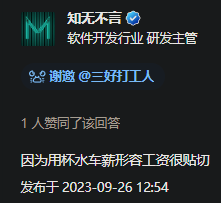

- ((660e6a5a-b012-4175-ba9e-d2dea2a93618))
- 人体也有电路、水路（血路）、气路（气道）——管道（《Clean》：indoor plumbing）
	- ((6681e110-8f38-4fc0-84e7-259ea77a3196))
- 短硬平紧多快好省
  collapsed:: true
	- [[从孤车漂移到景区导览图——xmind，crossroads，highway——高宽明快新]]
	- 为什么要铺路？
	- 要致富，先修路
	- 路面硬化
		- [[筋膜]]硬化（“树人”）
		- ((667b89d8-dc1b-4cec-a3ce-4387c62e8f3d))
	- [混合交通_百度百科](https://baike.baidu.com/item/%E6%B7%B7%E5%90%88%E4%BA%A4%E9%80%9A/5296465)
	- 人无论活着还是死着都需要各种各样的资源
	- “（我们的）现实世界”不太像“我的世界”（指电子游戏《Minecraft》），没法通过预先在创造模式中创造、挑选稀有地图种子、复制存档等方式创造一个高度集中的“挖矿（“矿在家里”）-运输-冶炼-加工-分配”（“whatever”）工业综合体，来提供各种各样的资源
	  id:: 66432f3a-2334-4ed7-bba7-e927667187ed
		- [【主义主义】无声版：神创论（1-2-1）_哔哩哔哩_bilibili](https://www.bilibili.com/video/BV1hf4y1k7sX)
		- ((6648a163-ad6e-47b1-8dd2-b39b6352861e))
	- 不同地区有不同的资源禀赋
		- 与更来钱的生产资料结合的人不会主动调低太多自己的收入水平，现代社会再来一场人口大迁移也不再可能
		- 已有不少有民族认同的民族，但是资源会不断驱使人获取资源，向民族之外开拓殖民地就是获取
			- 而要维护主权就意味着经济能够抗风险，
	- 现实世界中的集中度是有限的，为此不得不有路
	- 我们人类不仅能直立用两脚走路，还有马路可以供我们通过圆形轮子骑车、开车，花开了可以穿越成百上千公里去赏花拍照，这就是“走马观花”
		- ((66476acb-56e3-47d5-a8bf-5726759bd62c))
	- 一些智慧生物为了他们的美好生活，很难不狠狠对付工人，一定要短你工钱，那就一定要做到事前中后对工人强硬，让人无力反抗：流水线、传送带平直，节奏和空间紧凑，工作量多，生产才能快，订单才好完成，不必要的成本支出或利润损失才能省下来——至于现实是否与如意算盘有偏差，他们是不太会与竞争对手交流太多的，也不太会钻进产线体验优化，他们宁愿花很多钱烧香放生来点虚得发实的确信感——于是健康与生命便如餐馆的剩菜一样被弃掷逦迤，浪费成了一种常态
		- 你身上的衣服通过路运过来，买回来没多久，能够保暖、遮蔽身体，但可能已经“过时”了
	- ((66273c43-e287-4596-aef4-fea3ee58cb7f))
	- 《虚高：偷工减料》
	  collapsed:: true
		- 影响企业主省钱维持市场竞争力、买更多大house和采购贪污了
		- 胶鞋比布鞋耐穿，但是小了
		- 工资
		  id:: 66432f3a-2ccb-4c1e-88cd-882ed1925ee9
			- “工，怎么就和资摆在一块了呢？”
			- 为什么不叫工钱？
				- [咱们中国从什么起开始有“工资”这一名称的？_百度知道](https://zhidao.baidu.com/question/6262012.html)
				  id:: 66432f3a-a24b-435c-ab00-f0ee82a5599c
				- [工资_百度百科](https://baike.baidu.com/item/%E5%B7%A5%E8%B5%84/2532889)
				- [工钱_百度百科](https://baike.baidu.com/item/%E5%B7%A5%E9%92%B1)
				- 工钱“土”？
			- [“工资”“薪资”和“薪酬”三者的区别 - 知乎](https://zhuanlan.zhihu.com/p/152070112)
			- 薪资
				- 薪水“水”是吧？
					- [为什么工资会被称为「薪水」？ - 知乎](https://www.zhihu.com/question/623690640)
						- 
					- 薪是柴火，薪水很明显应该是希望你回家煮水，可能主要是希望你喝白开水就心满意足
				- 薪资是一种资本是吧？
				- “薪资是吧？大家都是打艹新人、收的都是艹新费是吧？让我来工薪工薪你！”
			- “无形大手虚报劳动条件，还有一点‘择业自由’的‘后浪’都保不齐要上贼船喽！”
			  collapsed:: true
				- “哈耶克~后面忘了”
				- [【半小时哲学·政治哲学】鉴左镜，一试就灵！鉴定/帮助/成为康米的第一步_哔哩哔哩_bilibili](https://www.bilibili.com/video/BV1654y1t7mi)
				  id:: 65ccc548-29b0-43d0-b8df-26009a6ef5b4
				- 怎样信息对等些、相对很公平起来？
					- 怎样更好地“招聘”？
						- ((65ccce61-c8f8-49e9-a439-0aa3d5900296))
							- >本杂志[开源](https://github.com/ruanyf/weekly)，欢迎[投稿](https://github.com/ruanyf/weekly/issues)。另有[《谁在招人》](https://github.com/ruanyf/weekly/issues/4002)服务，发布程序员招聘信息。合作请[邮件联系](mailto:yifeng.ruan@gmail.com)（yifeng.ruan@gmail.com）。
		- 尺码
		  collapsed:: true
			- “不像鞋子那么容易需要换、预留充足发育空间”的[[校服]]
				- 应试与身体遮蔽
			- ((65ae0909-47a9-4051-b05d-3428e32f16db))
				- ((65bcbf4a-fa0a-4f6a-8bb2-3abf564cd490))
			- 《显小显瘦：我的中国码》
				- [女装尺码偷偷变小的背后，藏着网购女装的灰色猫腻_澎湃号·湃客_澎湃新闻-The Paper](https://www.thepaper.cn/newsDetail_forward_23205541)
				- >我测你的码
				- >我平胸，我骄傲，我为国家省布料
			- ((65bcbf46-01a9-48dc-b505-1ea4c2ea7bb1))
		- “是非曲直”
		  id:: 661fb6a1-8dbf-4684-8dec-813fe21d3a09
			- 自然界不讲究平凳，而人加工平凳容易
		- “回答我！”
			- ((6f124093-acc0-4744-8ad6-699f5548cd6b))
		- 求快
			- 削荸荠“三秒一个”——“你能六秒削八个荸荠吗？I CAN！”
	- “营养好了，鞋码小了”
- 短自不必说（经典“短路”）
- 硬是为了维持平，如果没有泥土硬，那么即便不下雨也会逐渐坑坑洼洼起来（也就是不平）降低通行效率，抛开路面变形费油费车不谈，如果一路飞沙走石，不开雷达和空气净化器的情况下怕是比较难健康安全地快速通过
	- 路不坏的话，车就一定要继续开下去
- 平涉及路面，也涉及地貌
  collapsed:: true
	- [平——每日一字·丂部字 - 知乎](https://zhuanlan.zhihu.com/p/461260523)
	- “路太平（对XXX）不是什么好事”——圣经中也说“你们要努力进窄门”，一来大家都想走平路，就是走阳关道、康庄大道、星光大道、金光大道、成华大道（“去二仙桥”，“二仙桥”其实是两座桥，一座“康德之桥”，一座是“黑格尔之桥”，它们可能是同一座桥，五星评论家麦克阿瑟评论道，“没有桥能不被人走过至少一次”）也得塞车，二来无论多少人走，只要是人在走太多平路（“少吃太平梳打饼干”——有些理论家因此建议，虽然他的逻辑有问题的，但该观点据当前的队列研究似乎是正确的，人们对酥脆口感的偏好可能在饮食选择上出大问题，类似更高钠且可能辛辣油腻的“魔芋”），人的走其他路的能力就会得不到锻炼，就会弱化，而且问题会从走路能力延伸到人体自我调节的能力，肉体承载思想，思想要肉体去往远方，肉体迟缓，思想无法飞速，肉体也是路的一部分，往往需要一些“生理曲度”乃至“曲线美”，在内路与外路的交互中变化着，平路越多，“平人”则越多
	  collapsed:: true
		- [六小龄童金猴皮鞋广告_哔哩哔哩_bilibili](https://www.bilibili.com/video/BV1Zs411Y7Jg)
		- 
		- 在若干平行宇宙中，“平人”类似二次元、二维生物，很难抵抗来自三维生物的攻击和压榨（比如用来铺平路，没办法，大部分人爱吃肉，而且肉也要通过路运输；关于它们族群的起源，有说法是他们是比较高维度且高文明水平的人，为了在宇宙的循环中生存而自降维度，还有说是来自同样或更高维的文明将其降维打击后当奴隶用的），其中一些认为其中相对有危机意识（其中对我们的压榨有潜在威胁的还可能具有“三维视野”）的同族是“杞人忧天”的“平人”，我们一般称之为“纯（用来铺）路（的）人”，在我们的文化中，有“射手假说”、“躺平”（当然，还有对应的“内卷”，毕竟世上有各种各样的平，理论上这会在一部分区域增加一丝并不构成威胁的可喜的厚度，即便在他们维度的平面设计师看来也是如此——如果你不够薄、平，就不方便卷，就像太厚的被子、瑜伽垫、睡袋等卷起来后可能不太容易塞进原装收纳袋——而3d打印则是我们中的叛徒与平人抵抗军渗透我们世界的武器）之类的字眼嘲讽他们，这样的人铺路不会像灵魂沙那样使人迟缓，更不会像岩浆块那样烫脚，总的来说就是“真的有那么丝滑吗？”
			- 当然，我还想到了“双目人在单目国成为国王”的隐喻
		- [平人_百度百科](https://baike.baidu.com/item/%E5%B9%B3%E4%BA%BA/4929293)
		- 服从平面（可以说是全身）
		  collapsed:: true
			- ((665e5bbe-25c4-431b-8868-acdaa082aaea))
			- “人是万物的尺度”
				- 横断面
			- 平面不可调桌椅、纸等
				- 伏案读写
			- 队列位置（军训、跑操、运动会等）
				- 横平竖直
			- ((66335c3c-be42-494d-83bf-648ec8793c73))
			- 平面上的规则
			- 路、墙
			  collapsed:: true
				- ((665e480f-8fd7-4d40-a1a6-4f5977a44910))
				- 狭路（光路）相逢蛹者剩！
					- 彩虹猫、
			- 平台期
			  id:: 66810509-5657-4fbe-95d5-4ce73c9724d3
		- “凸易平”
			- “被岁月磨平了棱角”
			- 椅子腿如果加工成尖的，就会折断、容易倾倒或最终磨平
		- “平易近”
			- 平了就容易近——地不平不容易让墙与墙靠近，人与人靠近
		- “平易高，高易近”
			- 找平
		- “设定”
			- 立人平人这也是个互相异化的过程
				- 还可以有“斜人”
			- 平人是立人的转化，类似进击的巨人
				- [《进击的巨人》完结：写在“记忆”中，循环往复的历史荒诞剧_澎湃号·湃客_澎湃新闻-The Paper](https://www.thepaper.cn/newsDetail_forward_12135613)
			- 文字符号等也可能视作平人，他们也是立人的劳动，一个看似没啥用的梗也是有生命的、“凝聚了人类的（甚至也可能是无差别的）劳动的”
				- 影像、历史
			- [【主义主义】唯美主义（1-3-4-3）【爱欲经济学第四讲】美色的终极奥秘_哔哩哔哩_bilibili](https://www.bilibili.com/video/BV1dA411T7xD)
			- [[we happy few]] downer
				- [Downer | We Happy Few Wiki | Fandom](https://we-happy-few.fandom.com/wiki/Downer)
		- 如果你也对这个过度有生命而匮乏生命力的世界感到厌烦，引路人
	- ((66591b40-be04-4cf2-8964-2a22acc370c3))
- 紧是紧凑，要节省工程量、用料量，那就缩小宽度，搞得窄小些，让司机和乘客感到束缚些（“窄人”——“宅人”——“日本国部分臣民的住所的确不甚宽敞”）
  id:: 66432f3a-3b54-4f4a-add1-00a58115a9dc
	- [【中俄字幕】我是窄人，我与宽的东西为敌 恶搞作品 Александр Гудков - Я узкий_哔哩哔哩_bilibili](https://www.bilibili.com/video/BV14t4y1A7PT)
	- [Wide Putin(宽体普京)  建 议 改 成：压 缩 失 败_哔哩哔哩_bilibili](https://www.bilibili.com/video/BV1Nz4y1R7tm)
	- [你的宿舍符合日内瓦8平/人的条约吗？室友还吵，这么多成年人一起本来就不正常_哔哩哔哩_bilibili](https://www.bilibili.com/video/BV1Sx4y1C77o)
		- ((66475db5-545f-4a4a-a218-78c86e8065b0))
- 以上都是为了快，为了更快通路，减少购车和用车成本，让覆盖范围内的企业等经济体更快疏通血管、生命线、大动脉等，只有血液通畅、新陈代谢良好，血氧才能厚
	- ((6661b907-01df-4ad0-9770-b3dd82f5392d))
- 从而在地方经济发展中占据先机，这就是好
- 啊，代价是什么？先跑起来再说
- ---
- 交错而无统一指示牌的路口
  collapsed:: true
	- 但是路线刻意错开，使人冲撞，而不是真正井然有序，这样你才会努力“争取”个人利益
		- 这可以是市场的自然结果，因为很多人都想着“火车一响，黄金万两”，想把路往自家改道
			- 不创造差异化的需求，怎么介入市场呢？
				- 生产鄙视链（是人的本性，创造了等级制和阶级社会吗？）与逆鄙视链（屌丝）
				  id:: 6649c992-81af-4fba-97b0-2203cb091791
					- ((6649847b-b8a4-4702-8f22-b64fe8e199ba))
						- >其实在我老家并不如此，我家里人还觉得读书没啥用呢，这是更为落后的版本了
							- >“读书无用”也可能像口音、习俗一样用来抱团，正因为看到不少“读书有用”的例子，自己又觉得自己“读书无望”，才为了避免“认知失调”而强调“读书无用”，同时，采用“集体民主”进行强化论证
							  当然，同样要找“不读书有用”的例子支撑
							  这样的人不懂聪明的主体间性，单调自私和对投机心存侥幸，最后是输光光，当然，自我感觉良好就完事了，钱赚不到还管不了你
							- >想着皇帝用金锄头犁地、东宫娘娘摊大饼我就高兴，小农社会就该人人平等，有些人更平等一些，但是生活性质类似、可以望其项背，问题不大
							  >有钱喝茅台，没钱也有纯正勾兑酒喝，顺带把太求上进的年轻人拉下水，人生的乐趣就是这么朴实无华且枯燥
								- [你身边有哪些「东宫娘娘烙大饼」的言论？ - 知乎](https://www.zhihu.com/question/50259106)
					- 小时代
					- 如果没有不同，为何生产？
- ((664f4fd4-7cb2-40ed-a640-23ac6abb808c))
- ((6675354f-f6b9-4f42-9175-f0e53dcba303))