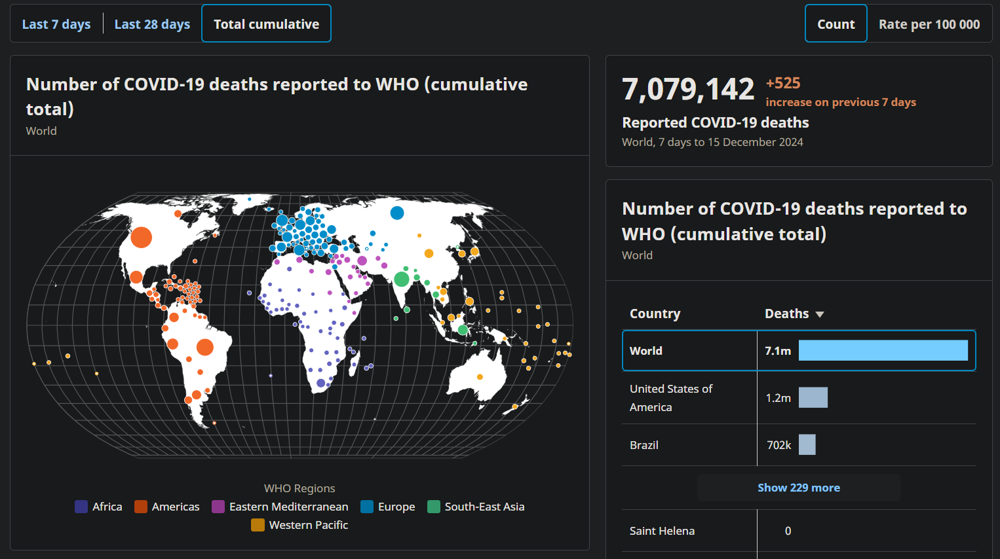

- [[20250312]]再来一版（草稿）
	- 用不用、会不会用劳保用品，与用不用（没有电脑的人可能还会认为自己用不着电脑，包括年轻人）、会不会用手机、电脑是类似的问题：
		- 并非所有人都会解决手机、电脑上出现的问题，比如碎屏、电池容量下降过快、屏幕频闪伤眼、存储空间已满、广告过多、隐私泄露，等等；
		- 并非所有人都会用手机、电脑解决其他方面的问题，比如如何快速输入文字并搜索，如何使用自动化软件/插件/脚本或AI快速完成手机电脑上或纸上的重复工作，如何自行服药、预约就诊，如何使用劳动法保障自身劳动权益，如何预防电诈，等等
	- 这些问题的解决对使用者的好处可能远不止效率、安全的提升和解决问题后的快慰舒心，正如本部分将会以一个个职业为例告诉你，安全与效率、舒适、理念（即你认为什么是应该的）往往是并存的，预防工伤保险不覆盖的工作有关疾病对于预防工伤和职业病也大有好处！
		- ((679adda8-3a77-447f-96a2-9a0f8a559737))
	- 我们可能已经了解到，工伤保险主要覆盖相对严重的工伤、职业病，就像手机厂商及销售者无法为你使用手机时遇到的所有问题提供有效帮助
	- ((67402ab7-97dd-482a-8fa3-4e00e2433076))
		- 类比一下，也可换成疾病的轻症、重症
		- ((65386d57-ba38-426e-940e-200a7f622cef))
			- 大口吃带壳水煮蛋或果冻噎住，不适感及持续时间也有不同
		- ((679adcab-4b33-49d6-8f20-f5f6d0ee11d0))
- ---
- 线下师徒制更可能越教越偏
- 可能没注意到的更多后果
	- 普遍的 ((679add4a-0125-4341-b35d-129cc29dc604)) 可能的确是市场的盲目性的结果，因为在降低平均用工成本的同时，单位食堂， 沉没成本，除了 ((65c0de9c-ac0c-4b38-b732-4f27325bd3be))
	- 无聊、浪费学习健身时间
		- 与同事、上级“对齐颗粒度”
		- 年轻人最大的资产就是蓬勃的生机和野心
		- （但）人老观念先老
- 找到工作可能并不容易，之后就像怕被老师批评一样，同时与工友们，
- 更多
- 重视安全和防护的额外好处
	- 更稳，防坠的同时也更好使力
	- 往便宜了买，能过检查，但防护效力不够，
	- 工伤保险谁交？可能还是踢皮球老一套，
	- 自己不买，用人单位不买，那就用不了
	- ((65bcbf46-9eca-44c6-9842-6dbff0831129))
	- 帮助其他人预防工伤
		- 借着消费传播
	- 提高工作和生活的效率、收入
	  collapsed:: true
		- “条条大路通罗马”，有时我们从效率抵达安全，有时反之
		- 你打开游戏，游戏里几乎不可能聊工作细节，打开短视频，正好你关注的不是工作而是游戏，那么你就不知道，你同事也不知道，或者你独自工作见不到同事，平时也不交流工作经验、方法，那么你当然不知道
		- 你觉得工作完再看工作相关信息，就很折磨，但其实它们是不一样的
		- 防止腰酸背痛的同时，提高了，当然，也可以说是
		- 以动不动让业主花个几万几十万的装修为例
		- [[污染]]
		- ((679add82-d22f-41b3-9ff5-2d04d29f169c))
			- 被工友传染甲流、新冠等传染病
				- 工友带病上班在你附近咳咳咳，但你戴了防粉尘和有毒气体的KN95口罩或防毒面罩，所以并没有被传染——你知道吗？每年病一周，平均到每天就有超过27分钟在生病！
		- 工友们可能都有骑车、刮大风时异物入眼的经历，近视镜甚至普通骑行镜都不能挡住所有砂石、飞虫，在这方面，舒适与安全是共存的
		- ((65c0de9c-ac0c-4b38-b732-4f27325bd3be))
		- 受限空间作业
		- 舍不得花钱，觉得有就够了，那么
		- 不用电笔测电，用手试试就行，这种当然很离谱，
		- 就像用防风衣、用好的工具打螺丝，不跑偏，不返工，就是更好更快，验收和维护起来就更容易
		- 你要搞点小发明、搓个原型，有个不会嘎吱乱晃的稳如泰山的工作台，更安全，效率也相对高
		- 保护自己的同时，也在保护可能挺昂贵的试剂的
		- 你在选购防护用品时可能还会顺带买其他能提升效率的工具
		- 在雇主、客户看来更有专业素养，
		- 没有口水甚至没有头发进去
	- 节省未来医疗、养老支出
	  collapsed:: true
		- 了解工伤保险覆盖范围，查漏补缺，有的放矢，事半功倍
		- 工友们可能认同“拖得越久，治病花的钱越多”的观点，但可能（还有点“不看不出事，一看出大事”的迷信）或多或少不愿“牺牲”并不多的业余时间去医院，实际生活中也存在挨到下班再去治骨折的案例，其中，工作伦理中的糟粕和用人单位有意无意的不负责任显然难辞其咎，上级责怪劳动者干活效率低、质量差，劳动者则可能责怪自己身体怎么所有问题不像感冒一样能相对很快恢复
	- 找到更好的工作机会（包括临时的）
	  collapsed:: true
		- 如果你没有控制金矿，你也可以卖铲子或牛仔裤
		- 有时只是工作中的小发明，没把它当回事，很快就传开了，拼多多上价格也很便宜
		- 很多工作有类似的防护需求，直接（或者改个“本地化”的名字）卖就行
		- 可以改进防护用品（包括与其他工具的配合方式）
		- 漠然甚至嘲笑，孤立，“此地不宜久留”一种证明，你也就多了离开的动力，人类的美好未来应该不在互联网或别处的对线中生成，而是在协作中，难道为这样的用人单位工作就一定比与工友们共同创业共同劳动的公司更好吗？显然未必，能够争取
		- 只要你能安心防护，怎么想都是次要的
			- “满甲的我很强，比你们任何人都强”
			- “我使用是为了给他们示范，正如降水需要凝结核”
	- 提高工作和生活的舒适度
	  collapsed:: true
		- 工作环境可能需要消耗对应滤材的有毒气体，但住所通常没有，这就用不上（大学厕所可能还是比家里的臭不少，那么也可以过滤，不知道的人就不知道）
		- 但有些是通用的，比如电脑显示器、手机等的支架，如果你需要长时间操作，，同时并不是很愉快，那么主观感受就会更强烈，你可能只是简单地用书、打印纸或买了个抽屉置物台（通常还不够高）垫高了显示器，就收获了相对健康的颈椎、脊椎，性价比可以说是比较高的，而如果只是个爱打游戏的大学生，就可能在紧张刺激中失去对调整机会的察觉
		- 我爱说实话，防护水平相对其他工友高，也可能“小确幸”，尤其在你暂时没劝动他们跟你一起防护时
	- 提升个人形象
	  collapsed:: true
		- 送外卖完全可以戴自己喜欢的安全又拉风的头盔，除非你是专送且逆天站长爱乱管人
		- 全盔全防，包括防晒，就算不涂防晒，你也可能相比其他骑手少黑几度
	- 提升家庭地位
	  collapsed:: true
		- 异化，会得越多
	- 提升在工友中的地位
- ---
- 具体职业防护
	- 通用防护能力
		- 撤离疏散（“逃跑”）、承重能力
		- 结构，筋膜
			- 拖延会导致治疗成本（包括成功再次就业的成本）超过你的收入
			- “为何不治？”
				- 价格信息接触少，不敏感，农村主观时间和治疗成本都低（因为没人买，默认自然现象不治）
		- 健身、应急
			- 无论体力劳动还是脑力劳动，身体素质都非常重要，有很多主观、客观指标可供你参考，一个往往是“不言而喻”的
			- 除了体力或脑力/智力的放松之外，提升
			- 掌握基本的自救、急救技能，因为预防率往往无法达到100%，
			- 如果能做到，对家人和工友的榜样作用才比较明显，才比较可能帮助他们预防
	- 工作相关
		- 多看相关经验分享、可能有助的商品
			- “金刚钻”、“砍柴”、“事半功倍”
			- 不管身边工友如何，都在网上搜
		- 工友群
			- 一个人的时间精力是有限的，
		- 大号货物固定（蛋糕、花束）
		- 通风
		- 接触皮肤
		- 甲方不懂装懂
		- 地摊、商店/商场销售
		- 拾荒者
	- 按工作类型，火（煤）电机化运（外卖，送货）建农生（生物提取、培养），软网文说（教师、导游、销售、电话客服、主播）端（茶水酒菜）妆（车模漫展）健（健身、复健）武
	  id:: 67cf99c8-184e-4132-895c-5df1bcda7e60
	- 搞不出来防护就跑路，随便在哪做个志愿者也能活得好好的，另谋高就也很正常，如果你认为换个人替自己受苦扛伤害也不好，首先该愧疚的肯定不是我们这些劳动者，其次你可以试着提示交接者
- ---
- 首先能真正做到高度重视，就是预防工伤成功的一半
- 个人对工伤、职业病是否可能发生在自己身上的态度或许能从他们对其他风险的态度看出来
- 我们可以假设，政治生命
	- [生物政治学 - 维基百科，自由的百科全书](https://zh.wikipedia.org/wiki/%E7%94%9F%E7%89%A9%E6%94%BF%E6%B2%BB%E5%AD%A6)
- “坏事就是会发生，会发生在别人身上，也会发生在自己身上，如何认识风险？”
	- [[信念系统]]
	- ((66dba0aa-e823-48fb-84fd-30a110e61077))
		- 效力经常超过自身体验（“不会吧？他行那我也得行，我再试试”）
		- [如何正确看待随处可见的“身边统计学”？](https://www.zhihu.com/question/407127101)
		- 可能很少有工作过几年的人没在微信朋友圈见过水滴筹，我们或许心想，那样的事情大概不会发生在我们身上，同时，当我们
		- 很多事不问，当事人就不会说，甚至问了也不会说，或者想说也说不好（或许真有些“懂的都懂”）、说不出来（除非他们终于要求救了，而且也是通过中介及其大致定了型的作文模板），像是与用人单位签了不成文的保密协议，等你问了才知道，原来有若干甚至不少工友受过工伤，但是并没有进行工伤认定，可能他们压根不知道有工伤保险、工伤认定这回事（笔者在所在地区多次看到出租车顶屏幕等长时间播放工伤保险宣传，但或许仍有人因为上下班路线、方式与这些宣传不接触而没看着；就像很多人不知道自己所在地区发消费券、有家电补贴啥的），也可能他们受到用人单位或明或暗的威胁，可能私了了
			- 就像很多父母或许受“知识的诅咒”（即以为别人也懂，但实际上别人不懂）像是总觉得你拜年时应该知道该怎么称呼长辈，就像少有人向自己的朋友炫耀自己的性功能障碍，有问题也可能憋着或
		- 常被人（比如家长）当作证据
			- “环境、条件都一样，别人也没xx啊”
		- ---
		- 通过运用某种简单的数学思维，我们或许发现了某种不言而喻的真理
		- 人少时，个人可能倾向于认为不会发生
		- 不多不少时，认为各有各的不同，造成了结果的不同，就像性别，比如“小明的爷爷活了99岁”、“男理女文”
		- 人多时，个体可能倾向于认为这是“正常”现象，“会赢哦”，“是人都要经历”，“新冠防不住”
		- “尤其在你不重视时”
			- 就像试卷一样，很多人考差不多的分数，但你的生命不是分数构成的
			- 工伤防护意识，首先要关注自己的健康，如果把自己的健康当作挣钱且不爱惜的工具随意霍霍，那就是劳动者的自我异化（当然这类意识形态也有可能是被心怀叵测的人推波助澜的），是有选择余地版本的祥子拉车，是不会有好果子吃的
	- 自身经验
	  collapsed:: true
		- 人们经常看重自身体验，它有一些缺点，即没有超出自身现有经验，对自身未来不确定，还有就是可能会忘掉，心理学有观点认为人类倾向于忘记负面记忆，比如讨厌的人的人名
		- 如果把家人的钱包视作“家庭保险”，是有限度，罕见病患儿，经常超出不是每一个都生在，
		- 很多观点都要求某种“眼见为实”（AI生成视频评论区：“发到家族群里，长辈们说想去那个致富村餐馆”）是做不到的，这是应该，如果有个爱恶作剧的人利用“逆反心理”可能就有人倒霉了
		- 如果，你得的是怪病了，是区域性疾病，还需科学研究
		- “玩游戏也会出现坏事”
			- 你血压升高了，你或许还会骂人
			- 你“游戏ED”
		- 那些年我们受过的伤
		  id:: 679adcab-4b33-49d6-8f20-f5f6d0ee11d0
			- 绝大多数人活几十年，多多少少受点伤
			- ((67402ab2-ac7d-4aac-9ab0-d454af8bdcdf))
			- 比如
			- 走路、上下楼梯崴到脚，被门槛或不平地面绊倒，头撞到打开的橱柜门，进行跑步等健身运动造成关节磨损、韧带拉伤、脚趾淤血、距骨骨折，这些伤可能并未完全痊愈，而是以另一种形式陪伴你（“代偿”）、
				- 前滚翻后滚翻伤到颈部
			- 视力下降
			- 家庭
			  collapsed:: true
				- 小时候头被家人搞得睡扁了
				- 青春期与父母闹矛盾可以戴各种各样的人日常忽略的 ((65bcbf46-7772-4bee-be4a-6b7f8f56a859)) ，不要用高音量损害自己的听力
			- 生物
			  collapsed:: true
				- 被猫抓伤、被狗咬伤
			- 疾病
			- 饮食
			  collapsed:: true
				- 呛到
				- 吃东西腹泻、食物中毒
				- 食物中出现一般不被认为是食物的物质
				- 吃辣辣出消化不良、过敏、便秘、痔疮
				- 吃面食吃出麸质不耐受/过敏
				- 被全熟的 ((6762b3ba-1966-4313-840d-c2f2a298ccc4))、干硬糕点、糖葫芦、果冻、雪碧/可乐冰噎住
				- 吃到玻璃渣
				- 油烟机不好用高温烹饪吸油烟吸出肺癌
				- 食用含有毒物质的食品
			- 呼吸
			  collapsed:: true
				- 空气污染鼻炎、哮喘
			- 玩具
				- 玩小功率（但足够损害视力）激光笔照自己眼睛
				- 攀比玩各种盲盒福袋各种卡浪费家里的钱、造成家庭矛盾
			- 娱乐场所
			  collapsed:: true
				- 从泳池、水上乐园出来光脚踩到未熄灭烟头、碎玻璃、钉子等
			- 群体
			  collapsed:: true
				- 小伙伴玩死亡游戏
				- 男生被男同学“阿鲁巴”等 ((675a8d61-9feb-43a6-85a6-5a3034441a17))
				- 盲从
				  collapsed:: true
					- 小时候跟小伙伴从高处跳下受伤，
			- 社死
			  collapsed:: true
				- 喜欢的同学或老师脸红，同时或然后被人发现被“造谣”
				- 衣服穿反
			- 被犯罪分子伤害
			- 物品被损害
			  collapsed:: true
				- 手机
					- 手机屏幕摔裂、摔花、摔得按不了
					- 上厕所蹲下时手机从口袋滑落掉入便器水中
					  collapsed:: true
						- 手机直接捞不出来了
						- 手机泡水后没有信号、连不上网、充不进电、数据丢失
				- 电脑
				  collapsed:: true
					- 同手机
						- 数据丢失（比如云服务未保存，快趁记忆热重写一遍）
				- 车乃至人被鸟屎击中，车轮边多了狗尿痕迹，车上多了猫爬印子（“嘿嘿，猫猫上我车了”），
			- 不同的解释倾向
			  collapsed:: true
				- “半杯水”
				- “豆腐脑”
			- 还有
		- 可见，这个世界对人类还并不是绝对安全
	- 大规模统计数据
	  id:: 679adcab-ec42-4803-886f-50d616aef6e3
		- ((65c1fc81-28d3-4811-adc1-35cf31bf92bb))
		- ((670c6aef-65f1-49f5-b3a3-73623d5ede30))
			- id:: 677ba557-fa4c-4271-ba04-81a83997aaf7
			  >国际劳工组织对2019年的最新估算显示，全球有超过3.95亿工人经历了非致命工伤。此外，约有293万工人死于与工作有关的因素，与2000年相比增加了12%以上。
			- >因工死亡人数占全球死亡总人数的6.71%
			- >在这些因工死亡人数中，绝大多数（260 万人）死于职业病，而工伤事故则导致了 33 万人死亡。造成因工死亡最多的疾病是循环系统疾病、恶性肿瘤和呼吸系统疾病。这三类疾病加在一起，几乎占与工作相关的死亡总人数的四分之三。
			- >世卫组织和国际劳工组织还估计：42对具体职业风险因素及相应健康后果共造成9022万伤残调整寿命年。工伤造成的伤残调整寿命年损失最多（2644万），其次是长时间工作（2326万）和职业工效学因素（1227万）。
		- 与之相比，截至2024年12月15日，报告至世卫组织的全球新冠死亡7079142人，约等于新冠疫情5年年均死亡约142万人，不及2019年全球因工死亡人数的一半（当然，笔者的本意是“都要重视”，新冠感染与颈椎病一样都还不在工伤、职业病认定范围内
			- 
				- [COVID-19 deaths | WHO COVID-19 dashboard](https://data.who.int/dashboards/covid19/deaths?n=o)
			- 其中，中国12.2万人，年均约2.44万人
		- >2023 年全国共报告各类职业病新病例 12087 例
			- ((670d40c8-c277-47c2-95c3-b734d8dcfde3))
			- 那么参考往年数据，2023年的职业病死亡人数不会大幅超过12087
				- ((66db8abb-225b-4728-b094-5a8ba714bea7))
		- ((67402aac-0fe8-41bf-841f-8c0d2160b88a))
		  id:: 677bb723-22d1-4d38-b992-f7328d601a5c
			- ((672ad480-cbae-4a35-99d9-179f568b6733))
		- 那么2023年中国工伤、职业病死亡人数约为新冠年均死亡人数的136.59%，或后者为前者的73.21%，与2019年全球因工死亡人数中前三大项（循环系统疾病32.36%、恶性肿瘤27.50%、慢性阻塞性肺病14.25%）的占比74.11%相当，约为传染病（7.15%；彼时新冠病毒尚未全球大流行）的10倍
		- ---
		- 实际截至2020年2月11日，原始株为主的60岁以上与0-59岁人群的死亡人数比也仅为4.46
			- [新冠肺炎对不同年龄人群的威胁（基于意大利西班牙韩国中国美国纽约的病例及死亡数据）](https://www.insider-monitor.com/covid-19/zh/)
		- ---
		- 可见尽管中国对新冠疫情的抗击水平位居全球前列，新冠感染相对工伤、职业病的危害还是比较高，因此在工伤、职业病预防领域，应当首先注意避免因工感染新冠，同样的预防措施一般能合并预防更多工伤、职业病因素
		- 2023年全年享受工伤保险待遇人数221.9万
			- ((677bc440-fcbc-4648-bfe5-21c97e2277be))
		- ---
		- 碰一碰 ((67402ab7-97dd-482a-8fa3-4e00e2433076))
		  id:: 677ba557-0135-409b-a4f9-7b53623f43b6
			- 其中，作为“1”的严重事故包括死亡和重伤
			- ((677ba557-fa4c-4271-ba04-81a83997aaf7))
				- 死亡：受伤=1:135
			- ((677bc4bc-2527-4a7b-9e50-c5cb923cb306))
				- 死亡：受伤=1:4.2
				- 2023年非机动车交通事故死亡、受伤人数分别为5252、44099人，死亡：受伤=1:8.4
- “坏事在发生后不能得到充分补偿”
- “坏事可预防”
  collapsed:: true
	- ((677bd0f7-73ee-48d3-aa31-a0303a59710a))
	- “我已经防得很好了”
		- 早期教育也是预防的一部分，粗心大意的家长的子女与细致谨慎的家长的相比，何者的生存率会更高呢？——当然，在持续学习的情况下，后续教育也很重要
	- “没必要防”
		- “发展、科技进步、生产力提高会解决一切安全问题”
			- {{embed ((677cf314-e954-4f8e-89ce-7f5456f2cc0c))}}
	- “我觉得不太可能，我怕现实！所以我要否认现实！”
	- “预防成本可以很低”
		- ((675bc1b7-34a1-4f25-b8e9-005652d86aea))
		- “没有时间！”
			- 现在大概还是有些时间的，
			- 有一句改编自鲁迅作品的话是这样，“时间就像海绵里的水，只要愿挤，总还是有的”，“勿以善小而不为”
		- 抑制了人们的创造力
		- 工效学
			- ((677b6b4d-bd39-467b-9490-5b33bd45049f))
			- 工效学关注三个方面，人、机、环境
			- 人类的能力是有极限的，但人体的神奇仍然超出了很多半信半疑者的想象
				- 具体可以参考我们五年八班卫生委员的筋膜训练视频
		- 可以在网上搜，一个平台不够就多搜几个
			- TODO 多跟员工（比如清洁工等相对自由的员工）聊
			- 细节尚不丰富，必可活用于下一版
		- 分管安全生产的领导不管事、管不好事
			- ta算是个什么领导了，跟你不在一个水平、阶层了，ta这么想，就会很俗套很无聊地变成常见刻板印象里的那种样子，帮意识形态完成再生产，对你们的不是亲密合作的伙伴，而是像是命令天不要下雨，在背后则偶尔祈祷不要出差错
		- 替换工作
			- 及时替换掉难以消除乃至抵消有害因素的工作止损，高效学习，实现高质量就业
			- 从时间顺序看，如果能够提前若干年，绕过考试、等方面的，或许有些风险的工作就能避开
			- 提前科学布局，但显然，如果一段相对痛苦的工作中，就要开始找下一份工作，
			- “学习效率不够高导致的”
				- 之前多少年教育，多少年专业教育，可能偶尔给人一种错觉，即掌握工作所需的知识和技术的时间等成本比较高，实际上并非如此，越是有这种感觉，恰恰越说明过去的教育质量（包括“天坑专业”等的职业规划）不太理想，只要不自己忽略进步的可能性、不自己把路堵死，学习可以非常高效
			- 降本增效，不想就接受高强度、低时薪、低保障
			- 如果按照“人”，市场有个无形的大手会调节
			- ---
			- “如果我现在不干了，那么多年书不就白读了么？”——“市场”可不管你这么多，书就是可能白读，就像话会白说，礼会白送，活会白干，越是这么想，“沉没成本”越是能硬控你
			- “我现在就这么忙了，我辞职了剩下的工友们不就更忙了么？”——工作如此繁忙持续的时间你很可能不确定，你坚持搞出工伤也没法干、“分担”，剩下的工友们还是更忙，但既然你能换工作，那么他们也能，而且你还应该帮助同样感觉工作过于繁重的工友们辞职，而且无论单独辞职还是组团辞职，都是主动帮助（也可以叫“倒逼”）其他成员（比如冗员的管理部门）进步，越多人参与到对“接下来干什么”、“真有什么事值得相对单一地干一辈子吗”等问题的了解、思考、讨论和着手解决中，社会越有可能更高质量地进步
			- 了解工作
				- 除了到手多少钱外，还应注意了解自己的工作还有哪些特征，出了事用人单位赔不赔、怎么赔，而不是“大家都一样”
				- ((670d40d9-26ff-4f12-bb86-77348af96355))
				- 风险溢价
			- 替换方向
			  id:: 679adcab-42fa-4245-84ca-9566caf2f3a8
				- [零经验想要转行转岗，我总结了这样四个步骤 - 知乎](https://zhuanlan.zhihu.com/p/129254168)
					- [学职平台-全国大学生学业与职业发展平台](https://xz.chsi.com.cn/home.action)
					- [IT桔子 | 泛互联网创业投资项目信息数据库及商业信息服务商](https://www.itjuzi.com/atlas)
				- 转到相对安全健康的岗位（包括同行业其他用人单位的，包括相同岗位）
					- 没销售指标压力的保安、前台，负责找茬的后台/行政/管理
					- 同上面“我辞职工友会更忙”的道理
					- 比如，我们或许知道，有一些青年人为主的按劳分配、高度共享（比如聚一桌吃自己做的菜，集体宿舍，学习、健身、娱乐设备/设施等）以降低生活和工作成本（比如过度复杂、多变的绩效、职级工资，相应的竞争、封闭倾向，相应的管理成本等）、增添生活和工作乐趣的小微企业和企业联盟，在细分市场或“捡漏”或“开海”，加上作为就业孵化器的青年俱乐部等青年生活服务企业，可以为无业青年提供越来越多相对满意的工作岗位
				- 自动化/AI/机器替代人工
					- 亲手埋葬低效的人工劳动吧！
					- 人工劳动被机器劳动代替，长时间工作或许就能减少
					- 如果你还未掌握技术，可以结交懂技术的朋友，通过提出需求、设想、建议和参与测试等一起研发
				- 替代原产品
					- 部分替代的比完全替代的多，比如厨师研发相对健康、新口味的食物
					- 完全替代的实际上也不一定需要什么科技，它对应的知识的获取或许需要一笔不算小的钱（比如科研经费），但借助该知识实现的特定应用不一定需要高成本的技术，可能你拿来知识后就能用很大路货的技术很快做出样品，而更难的部分倒是怎样“动摇”（比如或许相对很顽固的“常识”）和“说服”消费者
				- 转行
					- 低技术劳动的转行难度自然不高，所谓高技术的换行难度可能也没印象中那么大——而且所谓低技术劳动也可以讲究、升级成高技术劳动，光是“工作经验”就能升级技术，更不用说劳动者们还会有意无意在社交媒体等地方学到一些技术
					- 同岗位转行
					- 不同岗位转行
					- ---
					- 我的，也可能是你的转行
						- [[速成发明家]]
						- [[学习，学习，再学习！]]
				- 升学
					- 这里也可以分“先考再说”和比较明确目标的
			- 尚未替换工作时，尽可能减少损失
				- 项目合同、“编制”合同等规定的最短时长（包括完成项目任务的实际最短时长）
					- [项目劳动合同和普通劳动合同有什么区别？ - 知乎](https://www.zhihu.com/question/484792353)
					- 有些用人单位巴不得用完你就让你自己因受不了工作强度而辞职（用人单位可能还会讲究卡点），另一些用人单位则想要你一直苦干下去，但是付出报酬比低于社会一般水平，为尽可能多压榨又会签协议，规定你的最短“服役”期
					- 对于其中具法律效力且劳动者违约成本较高的协议对应的工作
				- 存款不足且难以参与短期劳动
					- 除了身体原因外，可能是担心降低掌握劳动技能的效率
				- 根据自身职业，刻意主动搜索查看专业、生动（但可能更多是生动多于专业）的防护知识
					- 其中，事故发生过程视频除了可能带来恐惧、后怕等心理冲击外，还可能勾起有悖公序良俗的不道德、不礼貌的情绪和行为（比如不知怎得笑出声），但如果这些情绪和行为后续有助防护，应该也是十分值得的
				- [[学习，学习，再学习！]]
	- 可能可自由支配时间越少，人越倾向于进行“即时满足”活动
		- 必须要有充足的
	- 工伤保险赔付范围之外的，
	- 岗位
		- 用人单位大多为逐利、发财而存在，工作和人员都不是定的，所以有岗位，不是什么合伙企业搞创业，哪个好朋友负责做哪些事
		- 人们是按部就班分段，因为讲究公平、通用的理念
		- 根据应试表现等各种岗位外的表现，
- ---
- 很多广义上的工伤是工伤保险实际不赔或赔不全的，比如像未受伤的人们一样活动，比如如果少了一两根手指，就会影响游戏操作，
- 我们是应该忽略一些“杞人忧天”，但实际上经常错配，反而重视了“杞人忧天”，忽略了“近在咫尺”
- 下班时早已积累了大量疲惫和负面情绪，就好像需要一个口子释放，吃点刺激的，看点刺激的，玩点刺激的，从而无动力进行优化
- 所以，可能比较好的做法，就是把我们的心理安全垫换成更好的
- [[学习，学习，再学习！]]
  collapsed:: true
	- 至少大多数人有要不断证明自己的倾向，比如花大量时间翻阅大量文献（是的，文献包括互联网内容）确认学习有用或无用之类的“电子斗蛐蛐”
	- 每过一段时间就会有新题材供炒作，近几年AI之风日盛，有些人看着“市值管理”内容也像抓着救命稻草：“AI来啦！地球就XX啦！AI来啦！XX就有啦！”或者，反之，认为AI来了人类要被灭绝，中间还有很多版本任君挑选
	- 那我问你，无论AI对人类何种态度，所有人都会一样惨或一样爽吗？就“服侍AI太君”这条路线而言，无论学习关于人类还是AI的知识，都可能帮助你做好“人奸”，当然你要是说“AI太君是全能的”那就与你的设定冲突了
	- “**你**不需要跑得比熊快”
	  id:: 677d07df-d304-4d95-875a-e228e6e69407
		- ((67a73984-ec80-455a-a949-cefb372ca073))
- ---
- 企业家不想用心管理，把事情分摊给，就有了贪污、管得更烂的下行空间
- 对AI等科技发展的
	- AI代替人类工作，但除了政治因素对AI的限制外，人本身的接受能力也很重要，
- “从小事做起”
- 如果工伤、职业病、工作有关疾病（工作有关疾病得不到工伤赔偿，而我们无需再写一个手册）能够得到预防，那么劳动者就能帮助自己、家人和工友们避免伤痛病痛、额外的治疗支出负担、可能的生活质量和收入水平下降等负面后果
- 以下不会展开得太详细，也可能有些错漏之处，主要目的还是帮助你开拓思路、提振信心并分享方法
- ((670d40c8-facd-45a1-b9c7-787301be2ba5))
- ((670d40db-81b1-4283-bd7b-1f119b6aa60f))
  id:: 67275de9-0591-4775-b479-f3be2319d576
	- 可能有人（比如笔者）会想，我们之前积累的一切，是否会“全部木大”，
	- ((677a958b-570c-4dfc-9a40-6c40a1a37075))