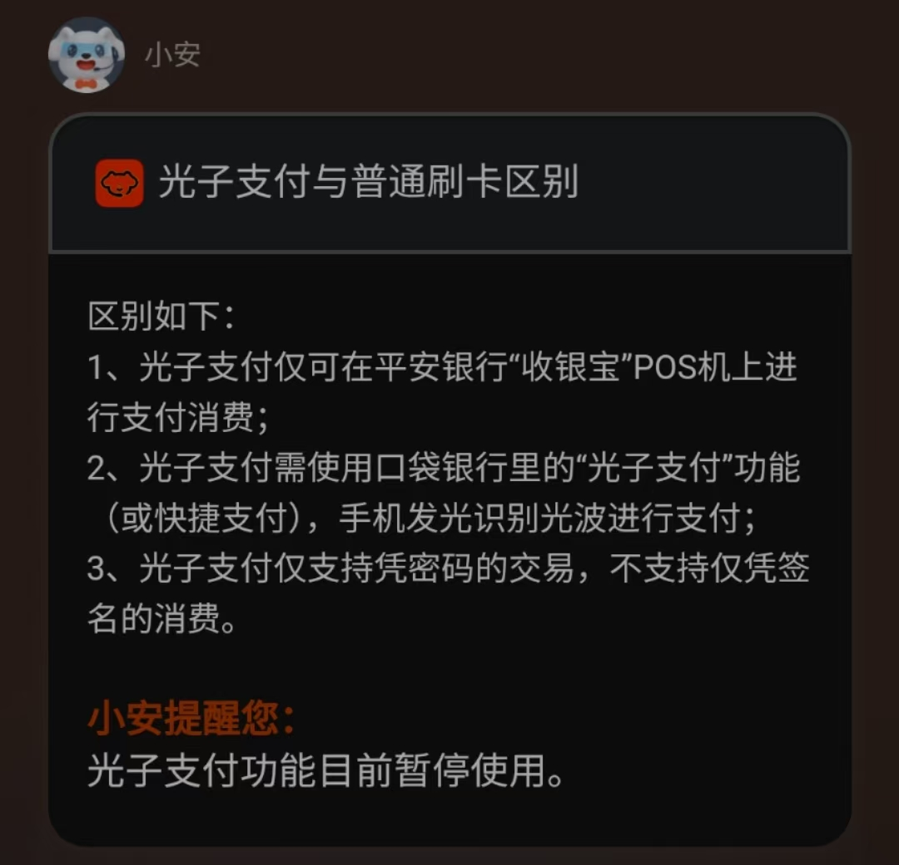

- [交通（汉语词语）_百度百科](https://baike.baidu.com/item/%E4%BA%A4%E9%80%9A/30183)
- [[道]]
- ((66ade382-4522-425f-a5dc-d15c1ee11f36))
- ((670d40f1-f99d-4665-bd3e-27120ad8cbbc))
- ((67a3516c-99fc-4107-a6e5-5e5e2a44d8d5))
- ((678a4e04-1e76-4789-8af9-a754b3a3e9e0))
- ((679adcc7-316e-4305-b710-b436360ad203))
- 距离的缩短（包括“自由支配时间”）和屏障的消除不可避免地带来了自由和和平，即便还有些小家子气——在推流之外上网，读盗版电子书也有类似的效果
- 现实的统一场论
  id:: 67bea692-629d-4484-9732-b06ea587cc13
  collapsed:: true
	- 大楼饼干内存
	- 平面设计软件符号统一（融合或替换）
	- 芯片对应单位（保安、保洁、白领等），设计
	- 人有简化世界的本能
	- 因果，显示 ((678a4dd7-30be-4d7c-95e3-4b7bc42654af)) 功能，图层
- 运动不顺畅、脑子不好用，都可能是“替身”出了问题，其中就包括可能由“站点黄牛”恶意指路导致的“赛博迷路”（包括到了陌生环境，忘了来时的路，甚至忘了来意），内容重要，媒介一样重要，作为内容的过程，我们需要关注内容的各种交通道
  id:: 67a9c577-360f-49a2-af4f-f9c5fb0a1601
	- ((62ac6a1d-bff9-47d4-ad35-5279733ab087))
- ((6827e302-54ec-48d2-9d33-8761ee49d9e9))
- ---
- 这几种经常肉眼不可见
- “更多控制（、驱动、反馈）”
	- “你明明看不见时还能控制，它们能蹦出来，一点动作就有很大反应，怎么做到的？”
	  collapsed:: true
- [【4K修复】S.H.E- Super Star_哔哩哔哩_bilibili](https://www.bilibili.com/video/BV1Ur4y1A7xq)
- ((668ce726-743c-4fac-9cd3-2014c1e38ef5))
- 综合管廊
  collapsed:: true
	- [四川首条，6级防核！揭秘具有人防功能的成都地下综合管廊_哔哩哔哩_bilibili](https://www.bilibili.com/video/BV1pQ4y1R7AB)
	  id:: 679cc304-97f8-4bb4-8d7a-20f2c1017c13
- 光路
  collapsed:: true
	- [[光]]
	- [[望远镜]]
	- ((65ab10fa-0c21-4608-9cbb-2384f4bd250a))
	- ((678a4dd7-30be-4d7c-95e3-4b7bc42654af))
		- 不太亮的地下车库的地上的黑袋子
			- 大概是后面那辆车邻居从后备箱拿东西较多，可能那袋包子与背景“融为一体”就没看到就忘了拿 [[20250125]]
	- 反光
	  id:: 679adcb0-1004-4ecc-8640-0e69190fa49c
		- ((679adcac-7f75-48d1-a971-6e65d97c52ea))
		- ((67c16500-e6ab-4d8c-b444-fe9606aa94d8))
	- [指尖闪光灯 指尖玩具，让朋友眼前一亮_哔哩哔哩_bilibili](https://www.bilibili.com/video/BV1pX6BYpEEC)
	  id:: 67c96fd7-8f59-47cc-b5d5-0163377c0608
	- [[直接光通讯]]
	  id:: 679adcb0-9dc7-4b81-812f-ed37afc2c0f2
	  collapsed:: true
	- ((678cad97-d2e6-4dd7-b4c4-34b28dd2b276))
	- [诺基亚红外数据传输歌曲图片等（你真不一定用过）_哔哩哔哩_bilibili](https://www.bilibili.com/video/av385798265)
	- 光子支付、光闪付
	  collapsed:: true
		- [用“光”来支付，一起看“光闪付”与“光子支付”的优劣-移动支付网](https://www.mpaypass.com.cn/news/201809/30090638.html)
		  id:: 67c6ecf2-04f0-40e5-a13e-41ac128c066b
		- 
	- ((679b1ab7-0443-4f34-a034-59bd68e006ec))
- 声道
  id:: 678b04bc-2bc9-44ae-8b2f-c9418cbbe021
  collapsed:: true
	- 你大喝一声，能让多远外、多少人听清？某种意义上，这就是你“空口白牙”的传播范围
	  id:: 67b81fc3-c159-4cf0-940f-f7e93675955e
		- ((679adda7-35da-4e04-af4f-f77941c7cbd3))
	- ((679addae-5b59-4ef5-8dbc-0918930e983b))
	- 定向音箱
	  id:: 679adcb0-f25c-4eb1-87b2-1f1227894eeb
		- [超声波定位音箱，损己利人神器，构造与原理揭秘_哔哩哔哩_bilibili](https://www.bilibili.com/video/BV1xB4y1A78d)
		- [电阻厂不给带耳机，太无聊了，于是我自制定向耳机_哔哩哔哩_bilibili](https://www.bilibili.com/video/BV1RxQkY2Eie/)
	- 变频/变声（加密）
		- ((679addae-90be-4dd7-a9d2-d4f2ca0be57d))
- [[电路]]
  id:: 679adcb0-5000-4773-8bf2-755b57ccaaa8
  collapsed:: true
- [[超限运输]]
  collapsed:: true
- ---
- 挑夫（上下山）
  collapsed:: true
- 搬运
  id:: 68065456-4e14-4871-8c45-c38d9ee635d2
	- [[个体运输系统]]
	- ((68171b15-d0e3-487d-aead-23760a96b8c8))
	- ((6808ee68-442e-48a9-a44c-f9258f5d7894))
	- ((6831c339-4fad-405a-a799-2367bfcf5f66))
	- [适合力气小的朋友上桶装水的借力方法_哔哩哔哩_bilibili](https://www.bilibili.com/video/BV1q6zJYRE6D/)
	  id:: 686b3e1f-2fd9-4004-bf22-21cb9ac59ca9
- 装卸
	- 装货
		- ((680ae9f8-df4a-42cb-9907-e552eb7d401e))
		- 集装箱等的紧凑装货
			- [老外卸货比装货还痛苦，卸不下来。卸货工：你清高你了不起_哔哩哔哩_bilibili](https://www.bilibili.com/video/BV19ftke6Es7)
	- 卸货
	  id:: 680adc51-3c56-45e1-a9b8-8a972a8db156
		- 人力卸货
			- [为了生活，广东小伙30秒卸完2000斤货物，一天疯狂卸货300吨。_哔哩哔哩_bilibili](https://www.bilibili.com/video/BV1pT411W7Hw/)
		- 倒车入库
			- [关键词：女生+快递车+倒车=？_哔哩哔哩_bilibili](https://www.bilibili.com/video/BV1CX4y1d7UV/)
			- [倒车卸货挤压员工，工作中不伤害自己是最基本要求_哔哩哔哩_bilibili](https://www.bilibili.com/video/BV17F41167J7/)
		- 倒车刹车惯性卸货
			- [卡车司机利用惯性卸货，倒车一个急刹车木材都卸下来了！_哔哩哔哩_bilibili](https://www.bilibili.com/video/BV1hN411R7pX/)
		- ---
		- 夹车厢下板卸货
		- 压弹式装卸（？）
		- 好像一样？但可能更适合多个不大物品（？）
		- 可能轻的不用铲板（？）
		- 车边支撑
		- 搭手滑轨，底部自动装卸
	- 装卸导板（类似转运车担架）
- 天车
  id:: 68065839-e032-475a-aabb-20860a9194bb
	- [现在的医院都这么先进了嘛_哔哩哔哩_bilibili](https://www.bilibili.com/video/BV1JF411Q7pu)
	- [台积电 全自动天车系统AMHS_哔哩哔哩_bilibili](https://www.bilibili.com/video/BV1LBXeY8Ekp/)
	- [天车作业事故_哔哩哔哩_bilibili](https://www.bilibili.com/video/BV1XhAAeFEiD/)
	- ---
	- ((670d4143-d180-4a4a-9875-6c7569039f7f))
- 地轨
  id:: 6806e890-68e4-40fd-bd63-31fc7043c6d3
	- ((6806ec45-3536-41e3-aa93-d882039ea16b))
	- [让机器人在地轨上自行移动（Visual Components）_哔哩哔哩_bilibili](https://www.bilibili.com/video/BV1h94y157q8/)
- ---
- [[人体]]
	- ((679addab-7318-4d05-acc5-90384e740bd6))
	- [[信念系统]]
	- [[随便活活]]
	- [[I人亿面]]
- [[情报、反情报]]
- [[取证、反取证]]
- [[索道]]
	- 有已公开的一些“精神DLC”
- [[特异功能]]
- [[地图]]
- ---
- （常规）线下是扩面、保证传达
- [2023年交通运输行业发展统计公报-政府信息公开-交通运输部](https://xxgk.mot.gov.cn/2020/jigou/zhghs/202406/t20240614_4142419.html)
  id:: 67d4dc11-bc08-4796-9759-972bcc46afa5
- ((678a4de0-2f7b-4d85-acff-44a0395ea013))
- 物流
  collapsed:: true
	- [2025年全社会物流成本有望降低3000亿元 降本增效再加力 “流动中国”显活力（经济新方位）_澎湃号·政务_澎湃新闻-The Paper](https://www.thepaper.cn/newsdetail_forward_30050756)
	  id:: 679a140d-9c15-47bd-b1e2-ee664fa2e4dd
	  collapsed:: true
		- >近年来，我国社会物流成本水平总体保持下降态势，社会物流总费用与GDP的比率由2012年的18%下降到2023年的14.4%，即每创造100元GDP所支出的物流费用，从18元降至14.4元。
	- [[快递]]
- [[司机]]
  collapsed:: true
- 道路/“（无轨）轮道”
  id:: 660e6a5a-b012-4175-ba9e-d2dea2a93618
  collapsed:: true
	- [[汽车]]
	- [[交通安全]]
	  id:: 6598f8d3-509d-4e8e-bbd3-91099aa3836e
	- [道路（汉语词语）_百度百科](https://baike.baidu.com/item/%E9%81%93%E8%B7%AF/18791)
	- [公路与市政道路区别汇总 - 知乎](https://zhuanlan.zhihu.com/p/466198748)
	- [汇总整理一下目前的全球的道路数据资源 - 知乎](https://zhuanlan.zhihu.com/p/493135621)
	- [Get Data – IRF World Road Statistics](https://worldroadstatistics.org/get-data/)
	- [四维图新助力2024年度《中国主要城市道路网密度与运行状态监测报告》发布](https://www.navinfo.com/gongsixinwen/546)
	- ((66db8abb-2773-47e1-a326-23a3bfbc4773))
	- 《路路通》
	  collapsed:: true
		- 从道路到其他路，随处可见，形象生动
	- 排水
	  collapsed:: true
		- 海绵城市
			- “时间就像海绵”
	- ---
	- 跑道
	- 车道
		- “车道？轮滑鞋、滑板可以滑，履带式坦克也是车（？），战备高速能起降飞机”
		- 机动车道
			- 最右侧稳定行驶的都是大车，震撼吧？所以护具和防御性骑行一定要点满
			- ((68a69d8d-4aa9-4a0c-9698-2647b0781e80))
			- ((68a69caa-7f9a-4a37-aa7a-bda675a01f98))
			- 绿波带/绿波路段
				- [绿波带_百度百科](https://baike.baidu.com/item/%E7%BB%BF%E6%B3%A2%E5%B8%A6/2330640)
				- [(新增交通标志“绿波速度”是啥意思？不懂怎么走要吃亏！ - 知乎](https://zhuanlan.zhihu.com/p/409127750)
				- [为道路整体通行再提速，让出行更加便捷快速！_哔哩哔哩_bilibili](https://www.bilibili.com/video/BV1eF411Q7Pz)
		- 非机动车道
		  collapsed:: true
			- 大车也会“借”右道超车（比如超其他大车，因为左道有车不好超、它又嫌前面的大车慢急着超）的，你绝对不希望出现在它的超车盲区里
			- 有非机动车道的特征：横穿机动车道的斑马线、最右侧机动车道上的公交车、机动车道边上间断的规整的条状绿化带、绿化带中间的公交站台及其棚子、绿化带上的双灯路灯、绿化带另一边小车小人的“黑点”，那么旁边大概率是非机动车道
				- 没硬性分隔（绿化带、护栏，而不是地上就一道线甚至连线也没有）的特征：绿化带或栏杆小于等于一条、非机动车道旁有白实线、外侧有不在机动车道之间的绿化带
					- 白实线旁显得灰淡一些的（有时比较窄的）道（也可能因为窄而显得更灰；够宽的话，高度2000m以上也能看到）
					- 并道（“噔噔咚”）的：
	- 公路
	  collapsed:: true
		- [公路（交通道路）_百度百科](https://baike.baidu.com/item/%E5%85%AC%E8%B7%AF/7265058)
		- 除了高速公路和部分特殊路段，县道省道国道都可以骑自行车和步行，但同样种类的不同的道因为地理、经济等因素影响不一样安全
			- [长途驾车，跑国道，县道，省道和跑高速各有什么优缺点？ - 知乎](https://www.zhihu.com/question/365741751)
				- （车道宽度、限速等）
			- [国道、省道、高速区别？如何快速识别高速,一些驾驶小常识？ - 知乎](https://www.zhihu.com/question/23458682)
			- [长途驾车，跑国道，县道，省道和跑高速各有什么优缺点？ - 知乎](https://www.zhihu.com/question/365741751)
			- 地图/导航软件里，从起点到终点的路线中，“最快”一般是开车路线，更易走高速，
			- “步行”往往是真正最短的的路径（通常也比较节能），通常也能骑行（不一定骑得快，但不逛大街一般也用不着骑快），交通污染一般能少吸点，风景也可能好点；但也可能有人能走的烂路、轮子不好通过的土路山路等
			- [【图片】什么叫绝望【骑行吧】_百度贴吧](https://tieba.baidu.com/p/8405286712)
		- 农村公路（县道、乡道和村道）
			- [农村公路_百度百科](https://baike.baidu.com/item/%E5%86%9C%E6%9D%91%E5%85%AC%E8%B7%AF/1006254)
			- [农村公路条例_公路_中国政府网](https://www.gov.cn/zhengce/content/202507/content_7033173.htm)
			- [交通运输部关于发布《小交通量农村公路工程设计规范》的公告_国务院部门文件_中国政府网](https://www.gov.cn/zhengce/zhengceku/2021-10/29/content_5647575.htm)
			- [交通运输部关于发布《农村公路简易铺装路面设计施工技术细则》的公告-政府信息公开-交通运输部](https://xxgk.mot.gov.cn/2020/jigou/glj/202406/t20240606_4142073.html)
			  id:: 68b6ab8d-9e17-49d8-9186-08e88914e734
		- 高架/立交桥（部分是自行车不能上，到路口看路牌得走下路）
		  id:: 68a69d8d-4aa9-4a0c-9698-2647b0781e80
		- 高速公路
		  id:: 68a69caa-7f9a-4a37-aa7a-bda675a01f98
			- [我国高速公路网络已连接全国约95%人口-新华网](https://www.news.cn/2022-07/25/c_1128861553.htm)
			- [高速公路是怎样编号的？ l 奥达升_哔哩哔哩_bilibili](https://www.bilibili.com/video/BV17h41117Td/)
			  id:: 67da8549-5157-45b8-8e22-53369c4ceacb
			- （除了“各行其道”，）靠右经常更快还靠紧急停靠车道可能方便紧急躲闪？
	- 市政道路
	  collapsed:: true
		- 城市道路
	- 绿道
	  id:: 64683439-c348-441f-9740-3e1dbd884626
	  collapsed:: true
		- ((68b8d4ea-02bf-4021-a3ac-72348f60223e))
		- ((68b8d3f0-7dc6-4e35-bc4a-51e8eb2a04dd))
		- 是否双向？
			- 有些绿道（也可能是部分路段）有明确的实线，有些则只有似乎是装饰用的三条粗彩线或其他装饰图案
		- 是否不光有自行车，或自行车和行人？
			- 注意有些绿道（包括同一组但不同方向、不同路段的）可能封闭不严（没有石墩或间隔较大）会有一些摩托车、老头乐、三轮、汽车开进来
		- 更长直人少适合骑行的绿道（比如 ((648e6398-8cfb-4e86-ba5d-7f2d2183b5d0)) ）
			- TODO 没有躺骑自行车，就没那么爽
		- 低于非机动车道的绿道雨后如果有干得慢的泥水（雨后第三天也不见得干），一般是绿化带通过路牙缝漏泥，严重程度主要取决于绿化带的坡度和高度
		  id:: 64a51cae-54ca-4aa8-97d8-67481e62d212
	- 人行道
	  id:: 6782226c-0bfe-4cad-b0cf-56b402124c5a
	- 步道
	- 台阶
	  collapsed:: true
		- 长台阶
		- 短台阶
	- ---
	- 绿波带/绿波路段
	- ---
	- [[《路是这样的》]]
	- ---
	- 车
		- 公交车
		  collapsed:: true
			- 公交上小地名，比如镇的站，一般只是公交站，而不是火车站
			- 公交车停车“泄气”声音（“有点好听”——“有一种第一次工业革命、蒸汽火车的刻板印象的美”——“真有asmr啊？但是人类发出来的”）
				- [为什么公交车门开闭的时候会有「放气声」？ - 知乎](https://www.zhihu.com/question/24939043)
			- [每次坐公交车看着那么多按键，很好奇都是什么功能，今天答案来了！_哔哩哔哩_bilibili](https://www.bilibili.com/video/BV1Na411y7t9/)
		- [两轮动力变迁史：自行车、电瓶车与摩托车的故事_澎湃号·湃客_澎湃新闻-The Paper](https://www.thepaper.cn/newsDetail_forward_24986167)
		- [[自行车]]
		- [[电瓶车]]
			- [[骑车]]
		- 机动车
			- [[摩托车]]
	- [[头盔]]
	  id:: 658bc507-6f19-4ba1-b701-1f44676ed6fb
	- ---
	- 田间道路工程
		- [田间道_百度百科](https://baike.baidu.com/item/%E7%94%B0%E9%97%B4%E9%81%93/8240631)
		- [三农科普|高标准农田之田间道路工程](https://nyncj.beijing.gov.cn/nyj/jcsn/kjgs/snkp61/543509871/)
	- 小区间（分开两个小区或同一小区的不同期）道路
	- 内部道路
		- （小区等的）内部道路
		- [[节能减排套件]]
		  id:: 67c2a3b5-2673-4a19-af13-e35fbac9df9f
	- ---
	- 土路
	  id:: 660e6b81-ef3a-4d46-850f-1e7cc63dd756
		- “（在砂石路之外、边缘或内部）雨后泥泞的道路，但妈妈要与将败之花合影”
		  id:: 660e6a65-b93d-4f35-bcfa-bec1555e8d31
	- 砂石路
	- ---
	- 铺路
		- ((68a69cae-8675-42a9-8d8d-b4018c9a6120))
- 铁路/“（有）轨（轮）道”
  id:: 678b048a-0a45-43d3-8a22-c0df8048c59b
  collapsed:: true
	- [货物列车_百度百科](https://baike.baidu.com/item/%E8%B4%A7%E7%89%A9%E5%88%97%E8%BD%A6/5604461)
	- [HXD1C型电力机车转向架概述_哔哩哔哩_bilibili](https://www.bilibili.com/video/BV1hP8CzeEJW/)
	- 地铁
	  id:: 679adcb0-ef9e-406a-9bc7-c8bc611dd550
	  collapsed:: true
		- [北京市地铁客流的时空分布格局及特征——基于智能交通卡数据](https://www.geog.com.cn/article/2018/1007-6301/1007-6301-37-3-397.shtml)
		- [上 海 地 铁 换 乘 名 场 面_哔哩哔哩_bilibili](https://www.bilibili.com/video/BV1Hj41147oB)
		- [从上海坐地铁到苏州市中心！苏州地铁11号线全程试乘体验_哔哩哔哩_bilibili](https://www.bilibili.com/video/BV1Go4y1E7Bs/)
		- [在越南轻轨尝试上海交通联合卡？_哔哩哔哩_bilibili](https://www.bilibili.com/video/BV1iVXyY4Eps)
		- [【轨交纪行】全国最挤地铁站？广州地铁1/3号线体育西路站 工作日晚高峰进站乘车全体验_哔哩哔哩_bilibili](https://www.bilibili.com/video/BV1X24y117ZN/)
		- 迷你地铁
		  id:: 678a4e03-b5f7-4dda-aeb9-0e29b8bcd2e6
			- [Mini Metro Free Download (v2024.12.19) « IGGGAMES](https://igg-games.com/mini-759135007-metro-free-download.html)
			- [[迷你地铁实验室III]一分钟带你看完迷你地铁各种站点的种类及其之间的关系！！！ #1_哔哩哔哩bilibili_攻略](https://www.bilibili.com/video/BV1U64y147cK/)
			  id:: 688b27ea-4212-470f-9986-1bfd6f220f08
				- 别的站点就近可以理解，居民区也车开到哪就去哪是什么意思？住房公有制？
				- 服从调剂、相信地铁能到所以不管直接上？
				- ---
				- “坏了，在中国我忘了传统先付再乘是先买两站之间的票这回事”
			- [交通规划师是怎样评价《迷你地铁》的？ - 触乐](https://www.chuapp.com/?id=282038)
			- [[迷你地铁实验室III]三分钟带您看完最基本的站点排列优化！！！ #3_哔哩哔哩bilibili_攻略](https://www.bilibili.com/video/BV1dL4y1a7tx)
		- 地铁安检
			- [打工见闻录之地铁安检煌的没边篇（上）_哔哩哔哩_bilibili](https://www.bilibili.com/video/BV1gtTRzME3f/)
		- bug，换乘不花钱，地铁内见完面回去
	- 高铁
	  collapsed:: true
		- 中国中车
			- 副业收入提升：风电、光伏
			- 轨道交通收入12％
	- 青藏铁路
	  collapsed:: true
		- id:: 6780879e-f5a1-46ca-92fd-dca1c3349363
		  >那是一条神奇的天路耶~~
	- 川藏铁路
	  collapsed:: true
		- ((6785c47e-b091-4507-8913-2af39486218a))
	- 延安到上海k559？
	- 改签
	  collapsed:: true
		- 不要像我妈一样没有计划，不然就会发生改签也不成功（手机改签可能一开始只显示一个人，继续往下）
			- 检票员可能会让人下楼改签，别人带行李会先放下来（可能有别人看着）自己下楼
			- 拿了家人过期身份证，人工通道，
		- 手机改签步骤
			- （“断网开始发病了噢家人们”）家人（可能主要是并非熟稔智能手机操作方法的75前）旅行问题锦囊妙计，请截图收藏并添加
				- 文字描述，或者打印带在
				- 0.对很多人而言，旅行并没有那么复杂凶险，会旅行的人可以不看
				- 1.不赶时间忙别的事的话可以帮家人订票
				- 2.如果赶时间，可以把这个给别人看
				- 提前准备好东西，而不是出发前找，小电脑等
				- 出门记得带身份证、手机和钥匙或解锁用的手指、发声器官、眼珠等
				- 3.如果没看百度地图提前导航，在等公交车或网约车或视图招呼出租车时，网约车晚点，在路上堵车时，这时务必保持心情愉悦，最好提前准备一些娱乐材料，比如平时在厕所也赶时间不会看的低俗笑话集，再大的状况没有family重要，家庭命运共同体，人生本就是一场漫长的旅途，我们务必享受每一刻
				- 家人或自己短暂离开，没能为家人或自己占住座位，也不要担心
				- 家人遇事喜欢跟人理论，丢脸是不重要的，重要的是family，所以一定要及时果断地将家人的气头阻断，回到解决问题的正道上来
	- 普速列车
	  collapsed:: true
		- 非高铁动车有老公共澡堂味，三座乃至两座侧躺，厌烦地喊着车次、不要上错车和站点下车的列车员
		- 瓜子零食，晃晃公交车（或者比现在的公交车更晃），坐了更多人
		- 列车互联网，列车小推车售货员
	- 不知道检票要有票才行，不能直接先上火车
	- 火车会晚点的，然后看到一处地下进站口就下去，没想走地面更快
	- 换座
		- 其他车厢空可以躺
		- 车内换座
			- k36，深圳
	- 运输轨道
	  id:: 67ed0341-4306-41c1-a3af-bf914cfa0132
	- ---
	- 电车难题
	  id:: 67e11dd0-5816-4776-b1e7-3031914ba4f0
		- [藤原铁路集团_哔哩哔哩_bilibili](https://www.bilibili.com/video/BV1W7411z7Gp)
		  id:: 67e121af-fdc3-47c2-86c0-345d494c6a8b
		- [两岁小孩解开了电车难题_哔哩哔哩_bilibili](https://www.bilibili.com/video/BV1LZ4y1G7xD/)
		- [电车难题解决方案分析_哔哩哔哩_bilibili](https://www.bilibili.com/video/BV1NG4y1n7GW/)
		- [【哲学与现实】彻底解决电车难题](https://www.bilibili.com/video/BV1rR4y157N8)
		  id:: 679adc88-eaf7-4c01-ad42-98d42f9c1f4f
- 上班与通勤
  id:: 67402aac-0099-402f-a69c-ba2842c48fd8
  collapsed:: true
	- [上班（词语释义）_百度百科](https://baike.baidu.com/item/%E4%B8%8A%E7%8F%AD/79978)
	- [上班这个词语是怎么来的？ - 知乎](https://www.zhihu.com/question/663955653)
	- [通勤_百度百科](https://baike.baidu.com/item/%E9%80%9A%E5%8B%A4/578476)
		- “还是通勤好，对吧，勤务员？”
	- “勤通上水道”
		- 上班拿“薪水”，上班的路应该叫上水道噢！
			- ((679adcab-73cd-493f-b239-de1912ed7ba3))
		- “勤通下水道”
			- ((679adda6-6fae-47f5-af40-5bef888b36de))
	- [从什么时候开始越来越多年轻人描写上班的用词变为通勤？为什么？ - 知乎](https://www.zhihu.com/question/303776222)
	- [为什么汉语有「通勤」，而没有「通学」、「通院」、「通园」等词？ - 知乎](https://www.zhihu.com/question/33840748)
- 航空
  id:: 630c5928-8bba-4efb-b993-1b14198a816f
  collapsed:: true
	- [航空科技简史：从古代中国的四大航空发明说起](https://m.thepaper.cn/baijiahao_7879383)
	  id:: 679387ca-fcf8-40d6-8a41-695a54168108
	- 机票
		- [为什么大家喜欢去携程或者类似网站买票而不是去航空公司官网去买呢? - 知乎](https://www.zhihu.com/question/27597753)
	- 提醒（“航班延误神经紧绷”）
		- [哪一个手机软件可以查飞机航班？最好用的是什么？ - 知乎](https://www.zhihu.com/question/346601722)
	- 飞行器
	  id:: 67eb280e-0e29-4433-a3eb-eecc2cf48195
	  collapsed:: true
		- ((67317308-4440-4009-854b-1501790e91c1))
		- [为什么中国在1909年就造出了飞机，却还是落后了30年？](https://mp.weixin.qq.com/s/IXvInrtwCnv1S7TjJHtbDg)
		  id:: 67a177eb-34d7-4d95-83d5-1f9587577e24
		- 发动机
			- 斜爆震发动机
				- [港媒：中国研制出全球首台以航空煤油驱动的斜爆震发动机，飞行速度可达16马赫_腾讯新闻](https://news.qq.com/rain/a/20250226A09Q5O00)
				  id:: 67bfc9b7-a437-4fc3-a1ea-5c68f6f0216f
		- 人力飞机
		  id:: 679adcd9-0149-4fd1-a0d2-55e6e153d242
			- [2023日本人力飞机大赛第1名的飞行(69km) | 新たな伝説誕生！【鳥人間コンテスト2023】「BIRDMAN HOUSE 伊賀」69km超の壮絶フライト！_哔哩哔哩_bilibili](https://www.bilibili.com/video/BV1dw4m1r7ND)
		- 航班
			- [航线图-Variflight航线图](https://map.variflight.com/)
			  id:: 68a69e4f-611a-4c17-a0fa-5251a3a81ee9
	- 空乘
		- [空乘是一个好的职业选择吗？](https://www.zhihu.com/question/362867416/answer/1061162510)
		- [怎么让视频看起来像航空宣传片_哔哩哔哩_bilibili](https://www.bilibili.com/video/BV1STfzYmEJy/)
		- [能开下窗户吗？空姐：好的_哔哩哔哩_bilibili](https://www.bilibili.com/video/BV1Y8411d7ev/)
- 航天
  id:: 679adcd9-6477-4c7c-a613-3019e1b81a43
  collapsed:: true
	- 大航天时代
	- [康斯坦丁·齐奥尔科夫斯基](https://baike.baidu.com/item/%E5%BA%B7%E6%96%AF%E5%9D%A6%E4%B8%81%C2%B7%E9%BD%90%E5%A5%A5%E5%B0%94%E7%A7%91%E5%A4%AB%E6%96%AF%E5%9F%BA/9531363)
	- [宇航员想拉粑粑了怎么办？这是一个非常复杂的科学问题](https://mp.weixin.qq.com/s/6ZFqqJLn2OgEogVldijgrQ)
	- [太空加油有多难？空间站宇航员演示推进剂转移实验全过程！_哔哩哔哩_bilibili](https://www.bilibili.com/video/BV1tpABepEKT)
	  id:: 67b7eed7-7083-42a7-9160-4c5e0462856a
	- 卫星
		- 遥感
		  id:: 68019aa5-8143-4cb2-82e4-9db50ef78e9b
			- [尔特数科——解决投资和商业问题的另类方案](https://www.altdatatech.com/home/index.html)
				- [捕捉工厂 “体温”，6万家制造业公司生产状况被卫星遥感精准“把脉”|尔特|数科|制造业_新浪科技_新浪网](https://finance.sina.com.cn/tech/roll/2025-01-21/doc-ineftfih6576865.shtml)
				  id:: 68019aa7-4567-423b-9870-4ed97ac2b353
			- [全球生态环境遥感监测2022年度报告](https://noda.ac.cn/geoarc/2022/index.html)
			  id:: 68b8db1e-462b-47ab-b7d1-3052f5e42786