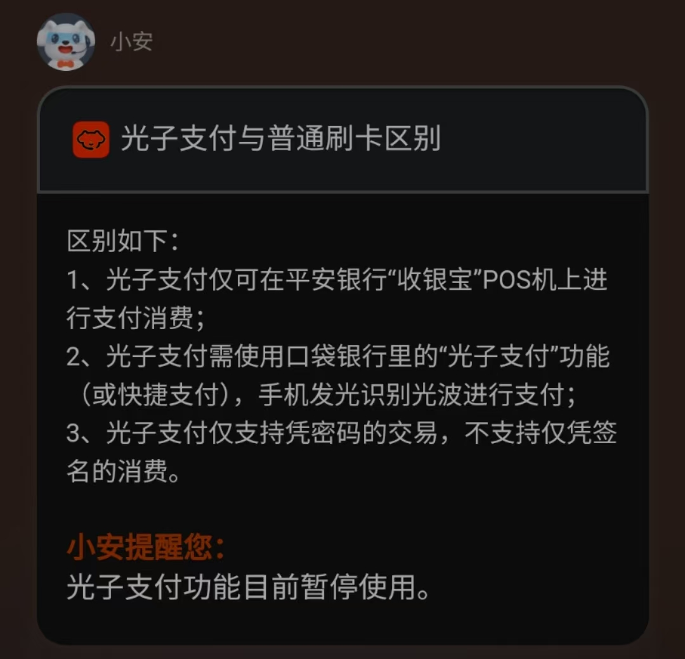

- [交通（汉语词语）_百度百科](https://baike.baidu.com/item/%E4%BA%A4%E9%80%9A/30183)
- ((66ade382-4522-425f-a5dc-d15c1ee11f36))
- ((670d40f1-f99d-4665-bd3e-27120ad8cbbc))
- ((67a3516c-99fc-4107-a6e5-5e5e2a44d8d5))
- ((678a4e04-1e76-4789-8af9-a754b3a3e9e0))
- ((679adcc7-316e-4305-b710-b436360ad203))
- 现实的统一场论
  id:: 67bea692-629d-4484-9732-b06ea587cc13
	- 大楼饼干内存
	- 平面设计软件符号统一（融合或替换）
	- 芯片对应单位（保安、保洁、白领等），设计
	- 人有简化世界的本能
	- 因果，显示 ((678a4dd7-30be-4d7c-95e3-4b7bc42654af)) 功能，图层
- 运动不顺畅、脑子不好用，都可能是“替身”出了问题，其中就包括可能由“站点黄牛”恶意指路导致的“赛博迷路”（包括到了陌生环境，忘了来时的路，甚至忘了来意），内容重要，媒介一样重要，作为内容的过程，我们需要关注内容的各种交通道
  id:: 67a9c577-360f-49a2-af4f-f9c5fb0a1601
	- ((62ac6a1d-bff9-47d4-ad35-5279733ab087))
- ---
- 这几种经常肉眼不可见
- “更多控制（、驱动、反馈）”
	- “你明明看不见时还能控制，它们能蹦出来，一点动作就有很大反应，怎么做到的？”
	  collapsed:: true
- [【4K修复】S.H.E- Super Star_哔哩哔哩_bilibili](https://www.bilibili.com/video/BV1Ur4y1A7xq)
- ((668ce726-743c-4fac-9cd3-2014c1e38ef5))
- 综合管廊
  collapsed:: true
	- [四川首条，6级防核！揭秘具有人防功能的成都地下综合管廊_哔哩哔哩_bilibili](https://www.bilibili.com/video/BV1pQ4y1R7AB)
	  id:: 679cc304-97f8-4bb4-8d7a-20f2c1017c13
- 光路
  collapsed:: true
	- [[光]]
	- [[望远镜]]
	- ((65ab10fa-0c21-4608-9cbb-2384f4bd250a))
	- ((678a4dd7-30be-4d7c-95e3-4b7bc42654af))
		- 不太亮的地下车库的地上的黑袋子
			- 大概是后面那辆车邻居从后备箱拿东西较多，可能那袋包子与背景“融为一体”就没看到就忘了拿 [[20250125]]
	- 反光
	  id:: 679adcb0-1004-4ecc-8640-0e69190fa49c
		- ((679adcac-7f75-48d1-a971-6e65d97c52ea))
		- ((67c16500-e6ab-4d8c-b444-fe9606aa94d8))
	- [指尖闪光灯 指尖玩具，让朋友眼前一亮_哔哩哔哩_bilibili](https://www.bilibili.com/video/BV1pX6BYpEEC)
	  id:: 67c96fd7-8f59-47cc-b5d5-0163377c0608
	- [[直接光通讯]]
	  id:: 679adcb0-9dc7-4b81-812f-ed37afc2c0f2
	  collapsed:: true
	- ((678cad97-d2e6-4dd7-b4c4-34b28dd2b276))
	- [诺基亚红外数据传输歌曲图片等（你真不一定用过）_哔哩哔哩_bilibili](https://www.bilibili.com/video/av385798265)
	- 光子支付、光闪付
	  collapsed:: true
		- [用“光”来支付，一起看“光闪付”与“光子支付”的优劣-移动支付网](https://www.mpaypass.com.cn/news/201809/30090638.html)
		  id:: 67c6ecf2-04f0-40e5-a13e-41ac128c066b
		- 
	- ((679b1ab7-0443-4f34-a034-59bd68e006ec))
- 声道
  id:: 678b04bc-2bc9-44ae-8b2f-c9418cbbe021
  collapsed:: true
	- 你大喝一声，能让多远外、多少人听清？某种意义上，这就是你“空口白牙”的传播范围
	  id:: 67b81fc3-c159-4cf0-940f-f7e93675955e
		- ((679adda7-35da-4e04-af4f-f77941c7cbd3))
	- ((679addae-5b59-4ef5-8dbc-0918930e983b))
	- 定向音箱
	  id:: 679adcb0-f25c-4eb1-87b2-1f1227894eeb
		- [超声波定位音箱，损己利人神器，构造与原理揭秘_哔哩哔哩_bilibili](https://www.bilibili.com/video/BV1xB4y1A78d)
		- [电阻厂不给带耳机，太无聊了，于是我自制定向耳机_哔哩哔哩_bilibili](https://www.bilibili.com/video/BV1RxQkY2Eie/)
	- 变频/变声（加密）
		- ((679addae-90be-4dd7-a9d2-d4f2ca0be57d))
- [[电路]]
  id:: 679adcb0-5000-4773-8bf2-755b57ccaaa8
  collapsed:: true
- [[超限运输]]
  collapsed:: true
- 装卸货、搬运
  id:: 67eb280e-889c-4c83-8f9f-21f136213174
	- 挑夫（上下山）
	  collapsed:: true
- [[人体]]
	- ((679addab-7318-4d05-acc5-90384e740bd6))
	- [[信念系统]]
	- [[随便活活]]
	- [[I人亿面]]
- [[情报、反情报]]
- [[取证、反取证]]
- [[索道]]
	- 有已公开的一些“精神DLC”
- [[特异功能]]
- [[地图]]
- ---
- （常规）线下是扩面、保证传达
- [2023年交通运输行业发展统计公报-政府信息公开-交通运输部](https://xxgk.mot.gov.cn/2020/jigou/zhghs/202406/t20240614_4142419.html)
  id:: 67d4dc11-bc08-4796-9759-972bcc46afa5
- ((678a4de0-2f7b-4d85-acff-44a0395ea013))
- 物流
  collapsed:: true
	- [2025年全社会物流成本有望降低3000亿元 降本增效再加力 “流动中国”显活力（经济新方位）_澎湃号·政务_澎湃新闻-The Paper](https://www.thepaper.cn/newsdetail_forward_30050756)
	  id:: 679a140d-9c15-47bd-b1e2-ee664fa2e4dd
	  collapsed:: true
		- >近年来，我国社会物流成本水平总体保持下降态势，社会物流总费用与GDP的比率由2012年的18%下降到2023年的14.4%，即每创造100元GDP所支出的物流费用，从18元降至14.4元。
	- [[快递]]
- [[司机]]
  collapsed:: true
- 道路/“（无轨）轮道”
  id:: 660e6a5a-b012-4175-ba9e-d2dea2a93618
  collapsed:: true
	- ((67a1ec69-2500-41fc-b6fe-f8258873a8ba))
	- [[汽车]]
	- [[交通安全]]
	  id:: 6598f8d3-509d-4e8e-bbd3-91099aa3836e
	- [道路（汉语词语）_百度百科](https://baike.baidu.com/item/%E9%81%93%E8%B7%AF/18791)
	- [公路与市政道路区别汇总 - 知乎](https://zhuanlan.zhihu.com/p/466198748)
	- ((66db8abb-2773-47e1-a326-23a3bfbc4773))
	- 《路路通》
	  collapsed:: true
		- 从道路到其他路，随处可见，形象生动
	- 排水
	  collapsed:: true
		- 海绵城市
			- “时间就像海绵”
	- 车道
	  collapsed:: true
		- “车道？轮滑鞋、滑板可以滑，履带式坦克也是车（？），战备高速能起降飞机”
		- 机动车道
		- 非机动车道
	- 人行道
	  id:: 6782226c-0bfe-4cad-b0cf-56b402124c5a
	- [[《路是这样的》]]
	- 公交车
	  collapsed:: true
		- 公交车停车“泄气”声音（“有点好听”——“有一种第一次工业革命、蒸汽火车的刻板印象的美”——“真有asmr啊？但是人类发出来的”）
			- [为什么公交车门开闭的时候会有「放气声」？ - 知乎](https://www.zhihu.com/question/24939043)
	- [[自行车]]
	- [[电瓶车]]
	  collapsed:: true
		- “是机动车吗？”
		- [[骑车]]
	- [[摩托车]]
	- [[头盔]]
	  id:: 658bc507-6f19-4ba1-b701-1f44676ed6fb
	- 绿波带/绿波路段
	  collapsed:: true
		- [为道路整体通行再提速，让出行更加便捷快速！_哔哩哔哩_bilibili](https://www.bilibili.com/video/BV1eF411Q7Pz)
	- “轮渡”
		- 轮渡精确时点
	- 马路
	- 田间道
	  collapsed:: true
		- 土路
		  id:: 660e6b81-ef3a-4d46-850f-1e7cc63dd756
			- “（在砂石路之外、边缘或内部）雨后泥泞的道路，但妈妈要与将败之花合影”
			  id:: 660e6a65-b93d-4f35-bcfa-bec1555e8d31
		- 砂石路
	- 内部道路
		- [[节能减排套件]]
		  id:: 67c2a3b5-2673-4a19-af13-e35fbac9df9f
- 铁路/“（有）轨（轮）道”
  id:: 678b048a-0a45-43d3-8a22-c0df8048c59b
  collapsed:: true
	- [货物列车_百度百科](https://baike.baidu.com/item/%E8%B4%A7%E7%89%A9%E5%88%97%E8%BD%A6/5604461)
	- 地铁
	  id:: 679adcb0-ef9e-406a-9bc7-c8bc611dd550
	  collapsed:: true
		- [北京市地铁客流的时空分布格局及特征——基于智能交通卡数据](https://www.geog.com.cn/article/2018/1007-6301/1007-6301-37-3-397.shtml)
		- [上 海 地 铁 换 乘 名 场 面_哔哩哔哩_bilibili](https://www.bilibili.com/video/BV1Hj41147oB)
		- [从上海坐地铁到苏州市中心！苏州地铁11号线全程试乘体验_哔哩哔哩_bilibili](https://www.bilibili.com/video/BV1Go4y1E7Bs/)
		- [在越南轻轨尝试上海交通联合卡？_哔哩哔哩_bilibili](https://www.bilibili.com/video/BV1iVXyY4Eps)
	- 高铁
	  collapsed:: true
		- 中国中车
			- 副业收入提升：风电、光伏
			- 轨道交通收入12％
	- 青藏铁路
	  collapsed:: true
		- id:: 6780879e-f5a1-46ca-92fd-dca1c3349363
		  >那是一条神奇的天路耶~~
	- 川藏铁路
	  collapsed:: true
		- ((6785c47e-b091-4507-8913-2af39486218a))
	- 车内换座
	- 运输轨道
	  id:: 67ed0341-4306-41c1-a3af-bf914cfa0132
	- ---
	- 电车难题
	  id:: 67e11dd0-5816-4776-b1e7-3031914ba4f0
		- [藤原铁路集团_哔哩哔哩_bilibili](https://www.bilibili.com/video/BV1W7411z7Gp)
		  id:: 67e121af-fdc3-47c2-86c0-345d494c6a8b
		- [两岁小孩解开了电车难题_哔哩哔哩_bilibili](https://www.bilibili.com/video/BV1LZ4y1G7xD/)
		- [电车难题解决方案分析_哔哩哔哩_bilibili](https://www.bilibili.com/video/BV1NG4y1n7GW/)
		- [【哲学与现实】彻底解决电车难题](https://www.bilibili.com/video/BV1rR4y157N8)
		  id:: 679adc88-eaf7-4c01-ad42-98d42f9c1f4f
- 上班与通勤
  id:: 67402aac-0099-402f-a69c-ba2842c48fd8
  collapsed:: true
	- [上班（词语释义）_百度百科](https://baike.baidu.com/item/%E4%B8%8A%E7%8F%AD/79978)
	- [上班这个词语是怎么来的？ - 知乎](https://www.zhihu.com/question/663955653)
	- [通勤_百度百科](https://baike.baidu.com/item/%E9%80%9A%E5%8B%A4/578476)
		- “还是通勤好，对吧，勤务员？”
	- “勤通上水道”
		- 上班拿“薪水”，上班的路应该叫上水道噢！
			- ((679adcab-73cd-493f-b239-de1912ed7ba3))
		- “勤通下水道”
			- ((679adda6-6fae-47f5-af40-5bef888b36de))
	- [从什么时候开始越来越多年轻人描写上班的用词变为通勤？为什么？ - 知乎](https://www.zhihu.com/question/303776222)
	- [为什么汉语有「通勤」，而没有「通学」、「通院」、「通园」等词？ - 知乎](https://www.zhihu.com/question/33840748)
- 水运
  collapsed:: true
	- 造船
		- [1974年，中国造3000吨钢丝水泥货船成功试航，为何首航后就报废？](https://zhuanlan.zhihu.com/p/470687406)
	- 船闸
	  id:: 67f22bbf-70e8-49b2-8332-101ef1add033
	- 海运
	  id:: 679adcd9-fe48-406a-b8d1-11046623edc9
	  collapsed:: true
		- 航线
	- 船员
	  collapsed:: true
		- 渔轮
		- 货轮
		- 游轮
		- [2024年中国船员服务行业分析报告：海员供需及发展趋势分析 - 深圳市中经百汇信息咨询有限公司](https://www.zjbhi.com/zh/cms/economy/5-c/2830-a.html)
		- [2024年度中国船员心理健康报告：4.9%的船员存在心理风险-心理中国-中国网](http://psy.china.com.cn/2024-11/27/content_42973137.htm)
		- [我想问一下船上有信号吗？ - 知乎](https://www.zhihu.com/question/349284386)
		- [当代船员上网现状_哔哩哔哩_bilibili](https://www.bilibili.com/video/BV1ST41147Bv/)
		- [【海员】 实习生想跑都来不及，登船才明白流失率为何高居不下!_哔哩哔哩_bilibili](https://www.bilibili.com/video/BV16Y411T7Ft)
		- [船员6年，还是决定下陆地！再见了我的兄弟们！航安！_哔哩哔哩_bilibili](https://www.bilibili.com/video/BV1L3411Y7FE/)
		- ---
		- ((679adcbf-b6e0-435e-b310-dbcaf17c11cf))
	- [游泳爱好者向货船靠近，船家声嘶力竭劝阻：“不要命了 后面有螺旋桨”_哔哩哔哩_bilibili](https://www.bilibili.com/video/BV1Qp4y137Pi)
	  id:: 67ed0fdc-8921-41b5-8c53-aeb2c03696ae
- 航空
  id:: 630c5928-8bba-4efb-b993-1b14198a816f
  collapsed:: true
	- [航空科技简史：从古代中国的四大航空发明说起](https://m.thepaper.cn/baijiahao_7879383)
	  id:: 679387ca-fcf8-40d6-8a41-695a54168108
	- 机票
		- [为什么大家喜欢去携程或者类似网站买票而不是去航空公司官网去买呢? - 知乎](https://www.zhihu.com/question/27597753)
	- 提醒（“航班延误神经紧绷”）
		- [哪一个手机软件可以查飞机航班？最好用的是什么？ - 知乎](https://www.zhihu.com/question/346601722)
	- 飞行器
	  collapsed:: true
		- ((67317308-4440-4009-854b-1501790e91c1))
		- [为什么中国在1909年就造出了飞机，却还是落后了30年？](https://mp.weixin.qq.com/s/IXvInrtwCnv1S7TjJHtbDg)
		  id:: 67a177eb-34d7-4d95-83d5-1f9587577e24
		- 发动机
			- 斜爆震发动机
				- [港媒：中国研制出全球首台以航空煤油驱动的斜爆震发动机，飞行速度可达16马赫_腾讯新闻](https://news.qq.com/rain/a/20250226A09Q5O00)
				  id:: 67bfc9b7-a437-4fc3-a1ea-5c68f6f0216f
		- 人力飞机
		  id:: 679adcd9-0149-4fd1-a0d2-55e6e153d242
			- [2023日本人力飞机大赛第1名的飞行(69km) | 新たな伝説誕生！【鳥人間コンテスト2023】「BIRDMAN HOUSE 伊賀」69km超の壮絶フライト！_哔哩哔哩_bilibili](https://www.bilibili.com/video/BV1dw4m1r7ND)
	- 空乘
		- [空乘是一个好的职业选择吗？](https://www.zhihu.com/question/362867416/answer/1061162510)
		- [怎么让视频看起来像航空宣传片_哔哩哔哩_bilibili](https://www.bilibili.com/video/BV1STfzYmEJy/)
		- [能开下窗户吗？空姐：好的_哔哩哔哩_bilibili](https://www.bilibili.com/video/BV1Y8411d7ev/)
- 航天
  id:: 679adcd9-6477-4c7c-a613-3019e1b81a43
  collapsed:: true
	- 大航天时代
	- [康斯坦丁·齐奥尔科夫斯基](https://baike.baidu.com/item/%E5%BA%B7%E6%96%AF%E5%9D%A6%E4%B8%81%C2%B7%E9%BD%90%E5%A5%A5%E5%B0%94%E7%A7%91%E5%A4%AB%E6%96%AF%E5%9F%BA/9531363)
	- [宇航员想拉粑粑了怎么办？这是一个非常复杂的科学问题](https://mp.weixin.qq.com/s/6ZFqqJLn2OgEogVldijgrQ)
	- [太空加油有多难？空间站宇航员演示推进剂转移实验全过程！_哔哩哔哩_bilibili](https://www.bilibili.com/video/BV1tpABepEKT)
	  id:: 67b7eed7-7083-42a7-9160-4c5e0462856a