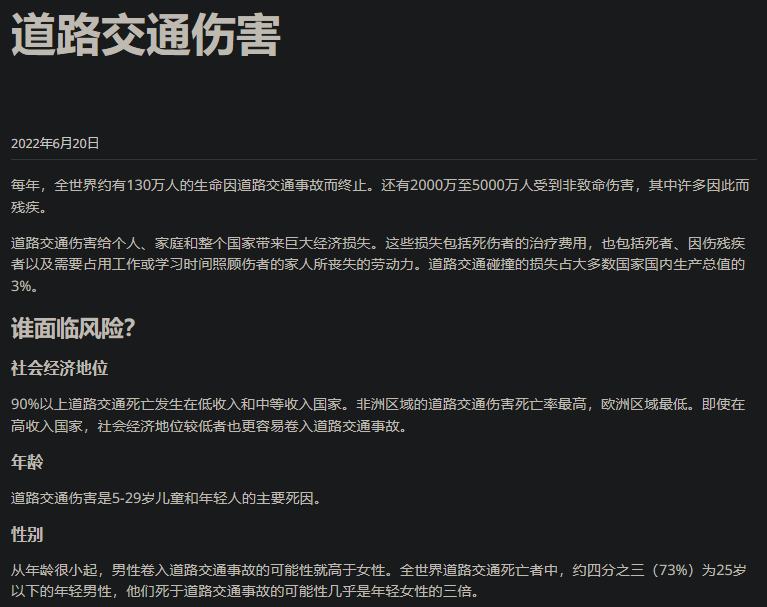
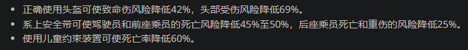

- [[呼吸道传染病防治]]
- 道路交通事故
  id:: 66db8abb-2773-47e1-a326-23a3bfbc4773
	- [道路交通伤害](https://www.who.int/zh/news-room/fact-sheets/detail/road-traffic-injuries) #“联合国那边怎么说？”
	  collapsed:: true
		- 
		  id:: 66db8aba-3fc8-4e48-9413-fe0841c8256d
		- 
	- [各国交通事故死亡率列表 - 维基百科，自由的百科全书](https://zh.wikipedia.org/wiki/%E5%90%84%E5%9B%BD%E4%BA%A4%E9%80%9A%E4%BA%8B%E6%95%85%E6%AD%BB%E4%BA%A1%E7%8E%87%E5%88%97%E8%A1%A8)
	- 2023年道路交通事故发生数、死亡人数、受伤人数、直接财产损失分别总计254738起、60028人、253895人、117933万元
	  id:: 677bc4bc-2527-4a7b-9e50-c5cb923cb306
	  collapsed:: true
		- ((677bc440-fcbc-4648-bfe5-21c97e2277be)) 公共管理、社会保障及其他
		- 假设死亡人数中一半的出行原因为旅游等“非因工”，也有30014人因工，高于全年各类生产安全事故死亡21242人
	- ((677bb723-22d1-4d38-b992-f7328d601a5c))
	- [柳叶刀子刊：中国交通事故死亡率有多高？哪些省份最高？ - 知乎](https://zhuanlan.zhihu.com/p/66702983)
	- [TIRIA智库 | 美国全球交通问题研究智库 | 行车安全问题数据研究](https://tiria.org/data-viz)
	- 空间
		- 交通黑点（路口）/事故多发路段
	- [【图知】交通事故数10年增长近30% 每年死伤超30万人_道路_死亡_全国](https://www.sohu.com/a/768881726_121754163)
	- ---
	- 道路交通事故的非直接损害
	  collapsed:: true
		- 间接死亡
			- 健康状况恶化，更易生病、受伤
	- 道路交通事故处理
		- 购置相关意外险
		- 交通事故责任认定
		- 发生事故后报警、拍照、要手机号（打了验证）
			- 报警（车牌号）、身份证/驾照照片、联系方式
	- 交通安全警示教育资料
	  collapsed:: true
		- 外卖平台等用人单位有培训（比如外卖APP上的），但不够
		- [《八大交通危险行为》交通安全警示教育视频2023_哔哩哔哩_bilibili](https://www.bilibili.com/video/av579195304)
		- [2024 农村交通安全警示片丨《畅行安全路 幸福奔小康》_哔哩哔哩_bilibili](https://www.bilibili.com/video/BV1ZvMUerEx7)
		- ((677f3f7c-3fb5-4287-a031-6bad7cdc03d7))
		- [宋说安全的个人空间-宋教说车个人主页-哔哩哔哩视频](https://space.bilibili.com/1246792669)
			- [老萧说车的个人空间-老萧说车个人主页-哔哩哔哩视频](https://space.bilibili.com/698396117)
		- [电动自行车安全出行教育片（规范骑行篇）_哔哩哔哩_bilibili](https://www.bilibili.com/video/BV1z84y187me)
	- 事故处理
- 危险交通行为
  id:: 67598ca2-41c8-43af-929d-e85602aa9d3a
  collapsed:: true
	- “不文明”驾驶行为
	- [每8分钟就有1人死于车祸！交通事故率最高的是这些行为-新华网](http://www.xinhuanet.com/politics/2020-12/02/c_1126809938.htm)
	- 可能非主观故意的
		- 溜车
			- [跟车太近前车溜车如何定责？听交警的还是保险公司的？_车家号_发现车生活_汽车之家](https://chejiahao.autohome.com.cn/info/13963075)
	- 越线/过线
	  collapsed:: true
		- 不能简单地用“占小便宜”的心态，尽管这样的人仍可能（在字面意义上）偷菜，或许他们想要维持“第一”的感觉，或是启动时不被挡着，或是想要一种相对空旷、低人口密度的感觉，或是为了观景，或是为了靠前并排聊天较少噪声打扰
		- 他们的省时思路或许没有拓展到“（包括揣测他人意图的）行驶技术”，而更专注于“与路的长短关系”，这里近一点，那里近一点，仿佛就能更快到达终点，或者至少过程中是不坏的
		- “就是收不住”
		- ---
		- 机动车越线
			- 机动车越线，但后轮未越线时，尚不被判定为闯红灯，此时能获得更好的视野，但也会因此遮挡横向其他车的视野
	- 夜间不开车灯
	  collapsed:: true
		- “耗电”
		- “会坏”
	- 开车窗翘脚架在车窗上
	  id:: 66641823-5cf9-4269-a20f-c91eb4857323
	  collapsed:: true
		- [左脚翘在车窗外右脚开车 网友曝光“任性”驾驶](https://www.sohu.com/a/10766128_111230)
		- 车窄不够躺？
		- 翘脚舒服？
			- [为什么翘脚躺下(坐着)会很舒服？ - 知乎](https://www.zhihu.com/question/268645791)
	- 抢行
	  collapsed:: true
		- 也可能受限于信号灯
		- [红绿灯路口，经常会有车在离停止线两三米或者三四米甚至五六米的地方停下，这种车主是什么心态？](https://www.toutiao.com/question/6521971411437748493/)
	- 不安全超车
	  collapsed:: true
		- [[交通事故反思]]
	- 逆行
	  collapsed:: true
		- 浙江金华电视台的节目，在金华通济桥一位大爷显得有些着急地喊道，“我是河南省的人，不知道公共交通”，结合视频画面，旁边车道可正常通行，而那么多车都与自己反向，其他非机动车乃至同样的三轮车也各走各的道，大爷也不像是在附近没有住处，应该已了解了城市道路（即市政道路）的交通规则，那么恐怕大爷要么是为了从在机动车道逆行入手，人力三轮车速度不高，其他车避让不会显著影响其车速，载运的冬瓜、南瓜相对耐储，如果他先前在非机动车道逆行并未受阻（就是说被骂乃至被掀翻车辆，“结合生活经验”似乎很不常见），
		  collapsed:: true
			- 这些都是影响团结、联合以及安全的需要注意的因素
			- 甚至也无法排除他在机动车道逆行也并未“受阻”的可能，私家车驾驶者们或许无论怎么想都统一到一个结论，“避让”，而如果要考虑实际存在的“地域特点”，那么我们尚不清楚306公交司机又是何方神圣，如果也是河南人就有点荒诞了
			- 如果他之前就打算讹钱，除了可能不会是这种方式外，很可能更早就会有相关新闻，当天遇到体积庞大的公交车或许临道有车还不便变道，公交司机一怒之下把他车掀翻了，对他来说更可能是个意外事件
			- 恐怕在公交司机掀翻自己的车之前就已经被普及了很多次，显然主观上是打算逆行的，
			- 但当天去一个新地点卖瓜，笔者暂无法排除大爷来回几次已经熟门熟路想要少等一两个红灯抄近道乃至奔着讹钱去（或者瓜瓜滞销，想到了b计划）的可能，但也无法排除
			- 但可能作为借口的这两句单拎出来，如果对刚进城的人而言，却很可能不知道的就是不知道，假如我早出生几十年，在学校没学过交通规则，那时周围还没几辆车，中年时子女去了外地打工，平时与村里人聊得也不多，对交通违章和罚款这回事不甚了解，中年以后村里才通了公路，但是双向共用单行道的乡道，那么在我的认知里，恰恰不太可能有“车道行驶方向”、“交通罚款”这类概念，那么到了存在特定车道行驶方向和“逆行”的城里
			- （高等级路往往比低等级路更短，距离公路边、能看到充当农民工的路边食堂的快餐篷的城乡结合部更近，而且更少颠簸）
		- 如果说该视频“只是中国近几十年迅猛发展的一个小缩影”，那么还有必要指出，
	- 加塞
	  collapsed:: true
		- ((672b2640-172c-485f-923c-5a4a44ac9a38))
	- 翘头
	  id:: 67598ca5-6af5-4640-b6ae-81baf880509f
	  collapsed:: true
		- [摩托车翘头属于危险驾驶罪吗-法律知识｜律图](https://www.64365.com/zs/3045422.aspx)
		- >今天写《索道》联想到的“更高的法则”（《瓦尔登湖》），青少年需要够野的娱乐方式，但也要注意自身安全，不应成为产业发展的垫脚石
		- [如何看待摩托车翘头行为，帅吗？ - 知乎](https://www.zhihu.com/question/466582814)
		- [谁能告诉我，翘头的意义是什么？【摩托车吧】_百度贴吧](https://tieba.baidu.com/p/4230124814)
	- ---
	- 危险驾驶罪
		- 飙车
			- ((67402b03-eef8-47e6-9b30-78dee3f782af))
	- 交通肇事罪
		- [交通肇事罪大数据：男司机万人发案率为女司机的8.8倍_滚动新闻_中国政府网](https://www.gov.cn/xinwen/2020-08/06/content_5532866.htm)
			- “所以应该让女司机开”（？）
	- 以危险方法危害公共安全罪
	  id:: 677dd679-3669-404f-964c-ea09de4cadce
		- 驾车冲撞
		  id:: 677dd718-0a9f-40db-8b6d-a0daedf3080d
			- [11·11珠海驾车冲撞行人案_百度百科](https://baike.baidu.com/item/11%C2%B711%E7%8F%A0%E6%B5%B7%E9%A9%BE%E8%BD%A6%E5%86%B2%E6%92%9E%E8%A1%8C%E4%BA%BA%E6%A1%88/65104369)
- ---
- 道路交通事故的部分非个人行路技术因素
  collapsed:: true
	- [湖北交通死亡人数为什么全国第一？ - 知乎](https://www.zhihu.com/question/627558715)
	  id:: 671b10ee-c513-472a-b92e-331628b3e2e4
		- ((65bcbf5d-ffac-457b-a51a-03399b86176f)) 地理、工业、人口等因素导致机动车开始普及后必然拥堵，拥堵就会
		- ((66335c32-1621-441c-a858-39b4a9a76fb0))
			- “以前走路时也没要等红灯啊？怎么开车了就要等红灯呢？”
		- 城市密集建设期的交通拥堵的后遗症？
	- 汽车工业的发展
		- 需要发展，也必然发展
	- 城市规划与建设
		- “计划赶不上变化”
			- “没想到会有这么多车，规划得还是不够夸张”
		- [城市道路规划设计问题及改进对策 - 公务员之家](https://www.gwyoo.com/lunwen/shejilunwen/cssjlw/201911/710438.html)
		- 护栏等设备
	- 执法成本
		- 监控
		- “规模效应”
			- “法不责众”，似乎是比较历久弥新的
			- 武汉的交警过去大概疲于处理车在人在时的交通违章，因为会闹，而对停车罚单的执法成本就低得多
			- [武汉交警提示：首次非严重交通违章可申请免责 - 过早客](https://www.guozaoke.com/t/92683)
	- 失业、灵活就业与交通事故
	- “具身语言”\非言语表达与“猜疑链”
		- 同伴与“队列”
		- 比如，同伴走在了前面，在人行横道等待线前，你与ta有一段距离，这段距离叫——叫什么？可以叫“危险与安全的距离”（《8848》广告的原文是“安全”），也可以叫“（可能被解读为）展现亲疏态度的距离”，或许真正的好朋友不会在意这段距离，甚至还会了解你的想法后为你放弃“前进”，但很多人会不以为然，甚至会说你“不合群”，然后你可能感到你的“社会关系安全”先受到了更确定的威胁，请记住，生命安全是第一，不合你的工作、假朋友可以换，生命至今还换不了，就算换得了（如果器官移植算是），也并非所有人都负担得起
	- 防护用品
	  collapsed:: true
		- 骑行安全气囊
			- ((67598ca5-6af5-4640-b6ae-81baf880509f)) 等专用版
	- 意识
	  collapsed:: true
		- 据统计，年纪越大的
		- 体检不重视
		- ((66628486-3eb7-494a-8967-b824ea04348e))
		- 部分不戴好真正有效的头盔的工友可能会笑你“怎么就你戴头盔”，这种“同事压力”可能也是很多人，实际不是这样的，也许能说明你思想相对先进、知道遵守规则可以趋利避害（甚至同时也能对自己的行为习惯有“效能感”，好比做好个人卫生、洗碗同样令人心情愉悦），而不只是“戴了头盔就不用被拦着交罚款了”，能够做出有助自身发展的选择，可能意味着你有做劳动者中的出类拔萃者的基础
			- 之前并不戴头盔的也不要担心，你马上就可以同样达到
			- 头盔的镜片也能挡风、防紫外线，不关注眼部健康
			- 对于工友，也应让他们戴起来，
	- 非机动车、行人不注意提升交通安全水平的新借口：“再过几年路上就基本都是AI、自动驾驶啦！”
id:: 677cf314-e954-4f8e-89ce-7f5456f2cc0c
		- “好，那么别死在黎明前”
- 道路交通事故各指标下降原因分析
  collapsed:: true
	- 过去交通安全的改善，很大程度上有赖机械的部分，也就是交通安全硬件的改善作为“硬件级强制交规”（所以城市道路交通事故率低于农村）
	- ((67402acb-e1d1-447d-a3b3-fd3595509e91))
	- 学校
		- 校车代替家长分散运输、放学等待区、老师监管
	- 护栏不像手机那么好看，也确实没有播放吸引人的视频，加上撞护栏会损坏车辆的知识，事实上也让车辆一般注意与其保持一定的最小距离，因此还有就是法律对酒驾，在惩罚之外给了“酒文化”做点改变的难以反驳的借口（类似“头孢”）
	- 再就是驾考难度和执法力度（此处包括交通监控设备和执法率等）逐渐提升，有些临时应付检查的行为做着做着也习惯了
- 科技、设备
  collapsed:: true
	- 交通标志
		- [百科丨出行要安全，这些交通标志得知道_服务信息_中国政府网](https://www.gov.cn/fuwu/2016-12/02/content_5142119.htm)
- 规则
  collapsed:: true
	- 交通规则
		- 为什么有人不遵守交通规则？
			- “真不知道呐”——比如部分没上过学的村里老人
			- 从（身边的）众
			- 不关注（部分不太常见的交通规则）
			- “也可能是路修到他们家门口了”
		- 宽路多车道非机动车和行人更易横穿？还是说机动车也一样
- 技巧
	- 机动车车内体验
	  collapsed:: true
		- “也与交通安全有关”
		- 给乘客的体验
			- 避开颠簸（井盖等；但很多时候为了安全不随意转向，宁可颠一颠）
			- 乘客上下车
				- 确认乘客已安全上下车，并且已做好防护措施（如果你起步加速比较快，可能影响他们系安全带、戴头盔、放下东西、喝水吃东西等）
				- 开车接人时N档手刹，确认人完全上车并关门后再启动
				- ((65d1a0fd-b713-4a09-aef2-afa017ce6e98))
				- 下车前停车不要模糊，要么停要么不停不让下车，乘客也神经大条觉得差不多好下车时不一定跟你讲
			- 提醒（最好能确认）汽车后排乘客系安全带
			- “有策略地”坚持导航而非并非熟路的人工指挥
				- 乘客可能觉得自己比较熟，但可能只“精确到”某条可能包含多个路口的路，乃至只熟悉路的大致方向，可能会帮你绕出至少一个大弯子
			- 向乘客确认导航目的地
				- 以排除乘客从聊天中转发了错误定位的可能，因为乘客转发定位的聊天中可能存在不止一个定位，比如聊天中的家庭地址、工作地点和餐馆的定位
					- 或者，发的地址是直接搜的，没定位，不准
				- 关于去哪吃饭，乘客可能是累了懒了还是咋的短时间没有统一主意时，司机可以自由裁量，先往自己觉得合适的餐厅开
			- 加减速一次完成（尤其是停车）
			- 加减速（油门/刹车）精细平滑处理
			- 停在树荫下，哪怕不靠前
		- 乘客给司机的体验（“我的要求不算高”）
			- 轻关门
			- 不要乱吃乱喝并在车内留下垃圾
			  id:: 66a4c8cc-2c28-41cd-be0f-9eca46ae89c4
		- 车内空气质量
		  id:: 66a4c8f1-f527-45d2-85b9-7937f1ad123d
		  collapsed:: true
			- 尽量不流汗到车内表面
				- ((6669611d-3fc4-4c1e-a2d0-eed20a668838))
			- ((66a4c8cc-2c28-41cd-be0f-9eca46ae89c4))
			- 有残留物的话更要注意开窗通风（不太担心盗窃的话车窗可以留一些缝）
- 驾考后续教育
  collapsed:: true
	- >我觉得这些事故也有主管部门的责任，驾考不涉及复杂情况也应该有后续教育，或者我们也早就可以出一期 [[20240930]]
		- >好像交通事故是疾病之外、事故之内的最大死因，也很爆金币，即便没有影响“信心”的预期，实际上也会影响经济疏通（“这下想到经络了”）
- ---
- 中老年人
	- ((677f6c87-31dc-47ec-bfc8-077088d9b0aa))
	  id:: 677f3f7c-3fb5-4287-a031-6bad7cdc03d7
	- 中老年人主责、全责的道路交通事故
		- “揣测”
			- “难道开汽车的年轻人还没骑电动车的老年人看得清楚吗？”
			- 我坐公交车我清楚，尊老爱幼是中华民族的传统美德，年轻人能让座就能在马路上让我
			- 我看不清楚，直接过
			- 不管实际上快不快，我就是要违反打破超越规则
- ---
- 交通技术
	- [有哪些只有经验丰富的司机才知道的驾驶技巧？ - 知乎](https://www.zhihu.com/question/40494621)
	- [开车的人和不开车的人思维有什么区别？ - 知乎](https://www.zhihu.com/question/38627388)
	  id:: 658bc515-6bb1-4429-bcc5-5f041bcd817a
	- 交通现象与解读
		- [隧道现象_百度百科](https://baike.baidu.com/item/%E9%9A%A7%E9%81%93%E7%8E%B0%E8%B1%A1/22310564)
		- [高速过隧道，你知道“白洞效应”吗？不留神就可能挂彩！ - 知乎](https://zhuanlan.zhihu.com/p/422929894)
		- 堵车、低速
			- [极简科普：什么是“幽灵堵车”？ - 知乎](https://zhuanlan.zhihu.com/p/34149117)
	- [开长途高速的正确姿势？ - 知乎](https://www.zhihu.com/question/37133010)
	- “交通策略与风格”
		- 空挡惯性行驶
		  id:: 677ddba5-6c22-4341-a525-b4901a5325f6
			- 认为红灯过不了就开始溜车（不一定省多少汽车的油或电瓶车的电，但是我喜欢，而且习惯了在密集车道间也更安全，溜车时脚在刹车上减少了刹车准备时间，即使还是撞到了从车道间穿过的行人，车速低些伤害也会小些
			- ---
			- TODO 空挡惯性行驶时车内运动
			  id:: 677e7f67-79d3-491e-8da8-b1e90df61495
		- （根据“不完全信任导航”、历史经验、“车感”）在无导航时（乃至导航提示绿波路段及对应推荐车速范围时（加速））超视距预估信号灯状态和未来（“对的，不一定是前方”）路况
			- “你疑似有点超视主义了”
			- 试探性观察、导航预测？
	- ---
	- 集体观念
		- “大家多注意一点，全世界少死多少人，少破碎多少家庭，节省多少原油、医疗支出”
	- “（电子xx）做梦时要等红灯吗？”
- [汽车的主动安全和被动安全有哪些，买车的时候又有哪些安全参数需要考虑？ - 知乎](https://www.zhihu.com/question/664256385)
- 每次出行少学会几条即可
- 喷水
  id:: 677f27a0-7abb-49a2-9ffc-18fa475d7834
	- ((677f2595-dfd1-47b8-9c76-f8a8378d9218))
	- 观察后车车距足够后再喷水
- 被动安全
  collapsed:: true
	- 不单手骑车开车（比如骑车时另一只手握手机）
	- 使用合适的头盔
		- 大货车飞沙走石
		- ((665063a0-605a-4b0c-b2e8-3ae9f2d10cd4))
	- 头盔系扣
		- 不系扣甚至可能是debuff，头重了，
		- ((66335bd7-9d7a-43f9-ab13-a058cb005f49))
	- 坐汽车后排系安全带
	- 骑电瓶车时脚踩踏板外侧获取最佳转向性
		- 搭在边上能更快触地支撑
		- 直线行驶与其他车贴近交错时可能先撞上更宽的车把而不是脚，但转向避让时就不确定了
	- 傍晚、夜间、雾天等昏暗环境下必开车灯，从明亮环境转入昏暗环境必开车灯，明亮时亦可开车灯
	- 不闯红灯和黄灯
	- 不越线停车，尽量与机动车道隔着路牙且与路牙隔着一段距离
	- 与停在非机动车道的汽车（尤其是车门）保持距离，尤其留意亮尾灯的车辆
		- [笑死 外卖小哥牛逼 可以拿去做搞笑素材了_哔哩哔哩_bilibili](https://www.bilibili.com/video/BV15f42127Xx)
	- 不过度靠近路牙，给避让留下缓冲空间
		- “贴弯逆行，恐怖如斯”（见过这样的外卖电瓶车，有时人行道较窄、转弯盲区较大，反应时间不是很长）
	- 保持车距（包括侧向、后方的），留足刹车距离和转向紧急避让空间
	- 骑车时一般两根手指搭在手刹上，随时准备刹车（骑车时手转到、开车时脚转到刹车上），尤其是接近路口等有开口和盲区的地方时
	- 车身、头盔、衣物整体带显眼、多向的反光条（昏暗环境尤其需要）
	- 被突然超车时保持冷静
	  id:: 67402aac-429f-4b1e-9b88-b8bce6f546e0
		- ((65d1a0fd-4f9c-4fb1-9c19-e2007870f935))
		- 后面突然（对方车速较快，没多少时间反应）冲过辆（跨骑）摩托车——可能较宽的双长车道更可能出现（在镇江南山北边的南徐大道被小小震撼过一次）
	- 高速公路
		- 靠右经常更快还靠紧急停靠车道可能方便紧急躲闪
- 提示
  collapsed:: true
	- 转弯打转向灯
	- 超车打转向灯、按喇叭（骑车没把握时也这样）
- 观察
  collapsed:: true
	- ((65d1a0fd-4f9c-4fb1-9c19-e2007870f935))
		- [问界M7大战隐形人3_哔哩哔哩_bilibili](https://www.bilibili.com/video/BV1pi421v75S)
		  id:: 666294a0-bb23-4f72-b3dd-ed0285231034
	- 停在无可靠看护的公共区域的自行车骑车前检查轮组快拆、刹车等
	- 上车前逆时针绕车一圈观察
	- 人行横道
		- 不在观察不到路况的人群中间扎堆过马路
	- 经常转头观察
		- 往哪骑就往哪转看，而且超量
		- 戴全包风镜时，往侧下看可能比往侧面水平看更容易看到车后情况
		- ---
		- 前车可能会在路口突然停下准备横穿马路，这时转头观察就可能造成刹车距离变小
	- 开车时注意摇身晃头观察
	- 下车开门前转头观察
		- ((65f9a37e-d835-42f3-a308-72509c2f9657))
	- 调后视镜确保尽可能看到车后动向
	- 骑车且使用挡风被时看后视镜时注意沉肩（可选）
	- 横穿马路未接近完全通过哪条车道时优先往哪条车道的来车看，而不是朝前看乃至往相反方向看
	- 提前观察路的各种开口处及其内外动线
	- 留意盲区，同时不超车
	- 与邻道保持距离减少盲区
	- 通过前车后视镜观察前车驾驶员头部（可能更多是电轻摩和摩托车）
	- 透视车玻璃看内部人员、更远处车辆和信号灯
	- 观察地面有无水、雪、冰、油等
	  id:: 65dc989a-1515-49ec-9a8c-c9555f3dc849
		- 看天气预报气温评估路面结冰概率
	- 观察“光学隐身”
		- “钠灯黄毛隐身小狗”
		  id:: 65fed1b4-d22f-4b0c-9fd9-ae305092418d
	- 观察卡车轮/别车轮地貌
		- 同时注意转向安全
		- 伸缩缝
			- [定慧桥下卡自行车轮的“缝隙”已填平_北京新闻_新京报电子报](http://epaper.bjnews.com.cn/html/2024-04/16/content_842966.htm)
			- [太原：摄乐桥伸缩缝易卡自行车轮胎 途经务必小心遭“暗算”](https://baijiahao.baidu.com/s?id=1680296824426145120)
			- [【案件快报】路面破损导致交通事故谁担责_澎湃号·政务_澎湃新闻-The Paper](https://www.thepaper.cn/newsDetail_forward_6923265)
		- 单侧也可能卡（比如下凹的长方形井盖两侧），卡到了短时间方向混乱及时回正并减速/刹车即可，慌一点问题不大
	- 听声辨车（首先是大致类型）
	- TODO 转向预判、突然减速转向预防、防别车
	  id:: 65e48c02-e3ae-4f6a-ad9f-8f94ed845a2c
		- 没有明显征兆就突然往缘石坡道（“人行道斜坡/开口”）上开的人是有的
		- 有时也来不及预判，可能还要注意闪避（有次有辆电瓶车在路口突然右转，我正好在右侧直行超过它，向右转向了点没撞到）
		- 外卖车突然前出人行横道（“我刹，我刹，我刹刹刹，还好刹住了”）
	- 灯
		- 看到前车减速红灯知道选择减速
		- 绿灯起步前重点观察左边和右前方的右转车道
		- 从路口的车的行驶方向判断路口当前的红绿灯状况
			- 区分直行与左转
	- ---
	- 过拟合
		- “ta预判了我的预判！”
- 控制/操控steer
  collapsed:: true
	- 上下坡
		- TODO 骑电瓶车上台阶，坐上面骑和推着骑，拧把手冲太快，一档上不去，二档又太快，摔了
			- 上下坡在车上脚着地
	- 颠簸
		- 抓着方向盘离开靠背可以减少感受到的颠簸带来的不适
	- 逆行避让
		- 快速下车
	- 贴边卡位（主要是非机动车）
	  id:: 65e9c49d-cf67-4267-baf4-cd725d300a8f
		- 留位置应对紧急情况，同时不留绝大多数人会走的宽度
		- 逆行车过后一般有一段真空期可以回到更靠边的地方