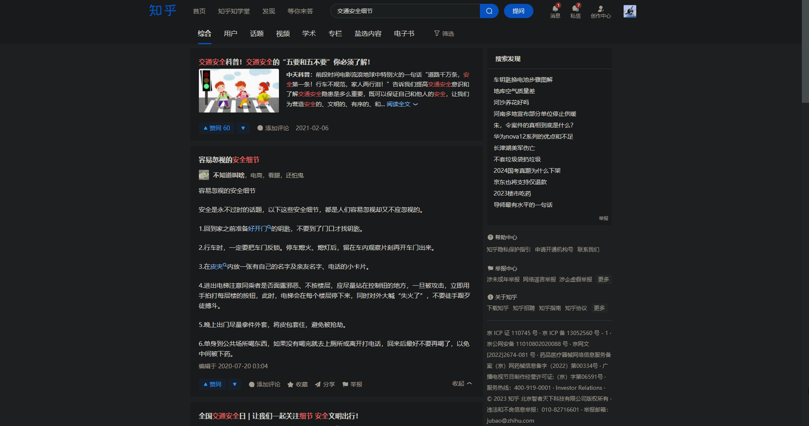
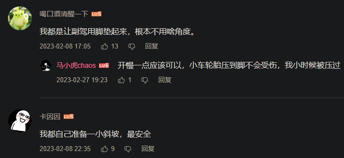

- 道路交通事故
  id:: 66db8abb-2773-47e1-a326-23a3bfbc4773
	- [道路交通伤害](https://www.who.int/zh/news-room/fact-sheets/detail/road-traffic-injuries) #“联合国那边怎么说？”
	  collapsed:: true
		- 
		  id:: 66db8aba-3fc8-4e48-9413-fe0841c8256d
		- 
	- [各国交通事故死亡率列表 - 维基百科，自由的百科全书](https://zh.wikipedia.org/wiki/%E5%90%84%E5%9B%BD%E4%BA%A4%E9%80%9A%E4%BA%8B%E6%95%85%E6%AD%BB%E4%BA%A1%E7%8E%87%E5%88%97%E8%A1%A8)
	- 2023年道路交通事故发生数、死亡人数、受伤人数、直接财产损失分别总计254738起、60028人、253895人、117933万元
	  id:: 677bc4bc-2527-4a7b-9e50-c5cb923cb306
	  collapsed:: true
		- ((677bc440-fcbc-4648-bfe5-21c97e2277be)) 公共管理、社会保障及其他
		- 假设死亡人数中一半的出行原因为旅游等“非因工”，也有30014人因工，高于全年各类生产安全事故死亡21242人
	- ((677bb723-22d1-4d38-b992-f7328d601a5c))
	- [柳叶刀子刊：中国交通事故死亡率有多高？哪些省份最高？ - 知乎](https://zhuanlan.zhihu.com/p/66702983)
	- [TIRIA智库 | 美国全球交通问题研究智库 | 行车安全问题数据研究](https://tiria.org/data-viz)
	- 空间
		- 交通黑点（路口）/事故多发路段
	- [【图知】交通事故数10年增长近30% 每年死伤超30万人_道路_死亡_全国](https://www.sohu.com/a/768881726_121754163)
	- ---
	- 道路交通事故的非直接损害
		- 间接死亡
			- 健康状况恶化，更易生病、受伤
	- 道路交通事故处理
	  collapsed:: true
		- 购置相关意外险
		- 交通事故责任认定
		- 发生事故后报警、拍照、要手机号（打了验证）
			- 报警（车牌号）、身份证/驾照照片、联系方式
- 道路交通事故的影响因素
	- [湖北交通死亡人数为什么全国第一？ - 知乎](https://www.zhihu.com/question/627558715)
	  id:: 671b10ee-c513-472a-b92e-331628b3e2e4
		- ((65bcbf5d-ffac-457b-a51a-03399b86176f)) 地理、工业、人口等因素导致机动车开始普及后必然拥堵，拥堵就会
		- ((66335c32-1621-441c-a858-39b4a9a76fb0))
			- “以前走路时也没要等红灯啊？怎么开车了就要等红灯呢？”
		- 城市密集建设期的交通拥堵的后遗症？
	- ---
	- 过去交通安全的改善，很大程度上有赖机械的部分，也就是交通安全硬件的改善作为“硬件级强制交规”（所以城市道路交通事故率低于农村）
	- 汽车工业的发展
		- 需要发展，也必然发展
	- 私营经济的发展
	  collapsed:: true
		- 至少在改革开放初期，私营单位相比非私营单位很可能至少缺少“自带的电话号码等相对公开的联系方式”，其他“广告”方式就更少了，就算私营单位之间谈生意，没有电话也谈不了远方的生意
		- 如果要到处跑谈生意，公共交通完全不够灵活，出租车不一定跑那么远（回程不一定有人），接人也没那么“商务”，租车也不划算
		- 货车更是随着生产、运输的扩大而增多
		- 个人、家庭有车相当于更大且更隐私/私密（出租车司机也是“外人”）的消费圈、社交圈
		- 失业、灵活就业与交通事故
			- 或许科技发展本身并不必然导致失业
	- 城市道路规划
	  collapsed:: true
		- 如果规划得过于好，那么可能不需要太多机动车
		- 堵车/等灯就会慢，慢就会闯，闯就会闯祸
		- [「窄马路」与「宽马路」谁更安全？_赛文交通网](https://www.7its.com/?m=home&c=View&a=index&aid=24298)
		- [为什么中国的城市规划一直坚持宽路疏网的设计](https://baijiahao.baidu.com/s?id=1781806172161551493)
		- 路不够宽
			- “计划赶不上变化”
				- “人类对数字的感觉，对增长趋势、翻几番和未来与现在之间差异的想象是有极限的”
					- “猜猜多少钱？”
					- “没想到会有这么多车，规划得还是不够夸张”
						- “我好不容易也有车了（还可能是单位配的，不是买的），不如我的那么多人也会很快有车吗？”
			- “当时没那么多钱”
				- “还利用效率不高”
			- 动辄多层的商业建筑又不好拆，只能苦一苦机动车了
		- [城市道路规划设计问题及改进对策 - 公务员之家](https://www.gwyoo.com/lunwen/shejilunwen/cssjlw/201911/710438.html)
	- 交通设施
	  collapsed:: true
		- 路面
		- 线
		- 道路隔离设施
			- 道路交通安全护栏
				- 护栏不像手机那么好看，也确实没有播放吸引人的视频，加上撞护栏会损坏车辆的知识，事实上也让车辆一般注意与其保持一定的最小距离，因此
				- 彩条频闪，没理由不感觉
				- id:: 660e82ee-a1a2-4892-8353-062ed01bda82
				  >睡上铺连护栏都没有（？）
				- [道路护栏保护行人和车辆免受意外事件的伤害 - 知乎](https://zhuanlan.zhihu.com/p/678970279)
			- ((66fdf762-ed1f-4c18-ba58-3b0f82714fc3))
		- 信号灯
			- [左拐的红灯最难等辣 啊～～～～～～啊～～～～～_哔哩哔哩_bilibili](https://www.bilibili.com/video/BV1Qx4y1f7mz)
				- [金属核女主唱车内表演『左拐的红灯』_哔哩哔哩_bilibili](https://www.bilibili.com/video/BV1X14y11754)
				  id:: 67863aaa-a5d8-401f-805e-8009ce8d5e56
		- 交通标志
			- [百科丨出行要安全，这些交通标志得知道_服务信息_中国政府网](https://www.gov.cn/fuwu/2016-12/02/content_5142119.htm)
	- ---
	- （规则与）处罚
	  id:: 678268cc-e2ba-4099-9f6b-4fdcc582137d
	  collapsed:: true
		- “不罚非机动车，甚至交警在时也是”——你还，他其实想的可能还是赚了便宜
		- 酒驾
			- 法律对酒驾，在惩罚之外给了“酒文化”做点改变的难以反驳的借口（类似“头孢”）
		- 执法力度（此处包括交通监控设备和执法率等）逐渐提升，有些临时应付检查的行为做着做着也习惯了
			- 城里的人看得到交警、监控并且罚，城外的人可能看不到并且不罚
			  id:: 67830dad-11fa-49ab-b8cf-61b626b09e63
			- 违章
				- 不同城市可能有不同的严格程度，有说法认为，可能违章认定倾向于外地车，还有种说法认为当期任务完成了就不怎么看了
		- 执法成本
			- 监控
			- “规模效应”
				- “法不责众”，似乎是比较历久弥新的
				- 武汉的交警过去大概疲于处理车在人在时的交通违章，因为会闹，而对停车罚单的执法成本就低得多
				- [武汉交警提示：首次非严重交通违章可申请免责 - 过早客](https://www.guozaoke.com/t/92683)
		- 自我约束（“慎独”）
		- 交通规则
			- 为什么有人不遵守交通规则？
				- “真不知道呐”——比如部分没上过学的村里老人
				- 从（身边的）众
				- 不关注（部分不太常见的交通规则）
				- “也可能是路修到他们家门口了”
			- 宽路多车道非机动车和行人更易横穿？还是说机动车也一样
			- 礼让行人
				- “行人不让只能让你们机动车让了”
		- 学校
			- 校车代替家长分散运输、放学等待区、老师监管
	- ---
	- ((66335bd9-b084-44e0-914b-23d0677a449d))
	  id:: 6784eeb8-436d-422a-ab47-3becc986c1bb
	- 汽车
	  collapsed:: true
		- [汽车的主动安全和被动安全有哪些，买车的时候又有哪些安全参数需要考虑？ - 知乎](https://www.zhihu.com/question/664256385)
		- 车型
		  id:: 6783aa46-6aaa-4592-93b2-544f76ac5aba
			- 两座轿车
				- [大型纪录片《剁椒鱼头车》_哔哩哔哩_bilibili](https://www.bilibili.com/video/BV1Xb4y157f3)
			- 车型与舒适度
			- 购买的车型与投资表现
				- [买跑车的人是傻瓜](https://mp.weixin.qq.com/s/FP1VLypNLoGSDZuuGuOxBg)
				  id:: 67402ab6-11cc-4845-aafd-a89564775612
		- 电车还是油车
			- [【行动建议】行动者与载具的关系_哔哩哔哩_bilibili](https://www.bilibili.com/video/BV19g411k7Ge)
			- ((666294a0-bb23-4f72-b3dd-ed0285231034))
			- 油车自动驾驶？
			  id:: 670d40dd-aba6-455c-848c-c291da80b26f
				- 
		- 自动挡还是手动挡
			- TODO 自动挡、手动挡的事故率（“什么狗屁说的道理，我要看数据！”）
		- 二手车
			- [买二手车必备的三个app_哔哩哔哩_bilibili](https://www.bilibili.com/video/BV1Nr421n7hf)
			  id:: 66641f49-9f34-4e11-a4a9-332258672dd9
		- 载具的撞击防护
			- 力大砖飞，全甲无伤
			- 车的被动防护
				- 更新的车可能有更新的安全技术、更高的安全性能
		- 年检
		  id:: 67821e50-12fd-4c42-addb-9038ddc2b228
			- [满6年的车子，年检时需要注意的9件事 - 知乎](https://zhuanlan.zhihu.com/p/401548595)
		- ((6785f831-d25f-4291-8924-fa06d9560c12))
	- 行驶辅助用品
	  collapsed:: true
		- ((67402acb-e1d1-447d-a3b3-fd3595509e91))
			- 确定当前位置、离目的地距离
			- 报告前方路况
				- 能过就过，不能过就不过（“真的吗？我不信！看倒计时像是能过，加速！”），安心开车不火急火燎
				-
				- 提醒前方有/是事故多发路段、行人穿行、隧道、大车、修路、事故等提高注意力、控制车速
			- 提前提醒变道，减少危险变道乃至逆行的可能
			- 测量车速、计算平均车速
			- 提醒起步别太快（“你懂啥？什么新手模式？”）
		- ((6285e4d3-bbac-4b42-b15c-2bd62b1bb133))
			- 非机动车、行人不注意提升交通安全水平的新借口：“再过几年路上就基本都是AI、自动驾驶啦！”
			  id:: 677cf314-e954-4f8e-89ce-7f5456f2cc0c
				- “好，那么别死在黎明前”
				- “小度小度，太慢了开快点！......BYD我自己开！下次换高德试试！”
	- 汽车遮阳用品
	  id:: 66654f47-0162-4c01-83ef-6267d60b1557
	  collapsed:: true
		- （自带）遮阳板
			- [国外小哥得知遮阳板隐藏用法，亲身示范后难以相信：还有这功能？_哔哩哔哩_bilibili](https://www.bilibili.com/video/BV15Y4y1G7nC)（部分遮阳板可以旋转、滑到侧面挡侧面的光）
		- 车内遮阳用品可能影响行程记录仪？
		- TODO 布包（放眼镜）
		- [【撸车师兄】汽车遮阳用品真的都有用吗？顶着中午的太阳，帮车主们测一测_哔哩哔哩_bilibili](https://www.bilibili.com/video/BV1Gt4y1p7Yq)
	- ---
	- 自备防护用品
		- 别人可能看不见，因此相对难通过观察其他人的车模仿
		- 骑行安全气囊
			- ((67598ca5-6af5-4640-b6ae-81baf880509f)) 等专用版
		- ((67402acc-a104-4e41-a03c-5d5442ddb0e8))
			- 可能避免次生伤害
	- ---
	- 危险交通行为
	  id:: 67598ca2-41c8-43af-929d-e85602aa9d3a
	  collapsed:: true
		- [每8分钟就有1人死于车祸！交通事故率最高的是这些行为-新华网](http://www.xinhuanet.com/politics/2020-12/02/c_1126809938.htm)
		- 可能非主观故意的
		  id:: 677de06d-5d47-41a5-a712-71f3466156a1
			- 溜车
				- [跟车太近前车溜车如何定责？听交警的还是保险公司的？_车家号_发现车生活_汽车之家](https://chejiahao.autohome.com.cn/info/13963075)
		- “不文明”交通行为
		  collapsed:: true
			- 违停
			- 越线/过线
			  id:: 677dceea-5933-4239-8aca-3a5ba0c5d1af
				- 不能简单地用“占小便宜”的心态（解释全部），尽管这样的人仍可能（在字面意义上）偷菜，或许他们想要维持“第一”的感觉，或是启动时不被挡着，或是想要一种相对空旷、低人口密度的感觉，或是为了观景，或是为了靠前并排聊天较少噪声打扰
				- 他们的省时思路或许没有拓展到“（包括揣测他人意图的）行驶技术”，而更专注于“与路的长短关系”，这里近一点，那里近一点，仿佛就能更快到达终点，或者至少过程中是不坏的
				- “有时候我是真的收不住”
				- ---
				- 机动车越线
					- 机动车越线，但后轮未越线时，尚不被判定为闯红灯，此时能获得更好的视野，但也会因此遮挡横向其他车的视野
			- 边看手机边走
			- 危险驾驶姿势
			  collapsed:: true
				- 翘脚架在开着的车窗框上
				  id:: 66641823-5cf9-4269-a20f-c91eb4857323
				  collapsed:: true
					- [左脚翘在车窗外右脚开车 网友曝光“任性”驾驶](https://www.sohu.com/a/10766128_111230)
					- 车窄不够躺？
					- 翘脚舒服？
						- [为什么翘脚躺下(坐着)会很舒服？ - 知乎](https://www.zhihu.com/question/268645791)
		- 闯红灯
		  collapsed:: true
			- 行人闯红灯
				- [闯红灯我就服这个女的_哔哩哔哩_bilibili](https://www.bilibili.com/video/BV1qW41167ss)
					- “或许我们遵纪守法好公民看这位戏精过度用力表演会有点尬，但其他人看了会不会有正面效果，我们可能还不确定，对吧？”
			- 看手机听后车喇叭不看灯直接起步
				- [一声喇叭  全闯了红灯_哔哩哔哩_bilibili](https://www.bilibili.com/video/BV1x4411P7bv)
				  id:: 67863e4c-f4a4-4041-86a2-5e6cf04726dc
			- 电子沿拍摄闯红灯的空子（但也有堵塞和车祸的风险）
				- ((67863e4c-f4a4-4041-86a2-5e6cf04726dc))
					- >我猜你不是老司机 电子眼拍摄闯红灯的3张照片分别为：一张是车辆驶过停止线，随后两张是车辆驶到路口中间以及到达对面路口。没到对面算违章停车2分
					- >我们这边交警搞创收的主意真的妙，停中间叫扰乱公共秩序 不扣分，罚100到200之间
					- >这两年大概有一次停路中间，两次停斑马线，只要不倒车一点事也没有，要是倒车了好像就得出事
		- 超速
		- 夜间不开车灯
		  collapsed:: true
			- “耗电”
			- “会坏”
				- “坏了”
					- “修要钱、时间”
						- “没钱”
						- “每次都忘”
						- “懒”
			- “某种意义上，电瓶车、汽车都不开车灯意味着更高的一致性——建议楼道灯、廊灯也不要开”
		- 路怒
		  id:: 67402ab6-f412-43e8-85a9-8077a648e5d3
		  collapsed:: true
			- 下车指指点点
				- [我刚提的新车   原视频_哔哩哔哩_bilibili](https://www.bilibili.com/video/BV1zU4y1Y7SS)
					- [Beat it ⚡_哔哩哔哩_bilibili](https://www.bilibili.com/video/BV1WV4y1E7Cz)
					  id:: 678639b2-dd04-4a4d-9fb0-b31e17882be8
			- 隔离路怒：看车不看人，看灯不看车
		- “酷酷滴”
		  collapsed:: true
			- [Schnappi（一只小鳄鱼） - Joy Gruttmann - 单曲 - 网易云音乐](https://music.163.com/song?id=2866921&uct2=U2FsdGVkX1/Ke/ROay9UHGRziXaKA4p5p6ZzUIr8kOU=)
			- 翘头
			  id:: 67598ca5-6af5-4640-b6ae-81baf880509f
			  collapsed:: true
				- [摩托车翘头属于危险驾驶罪吗-法律知识｜律图](https://www.64365.com/zs/3045422.aspx)
				- >今天写《索道》联想到的“更高的法则”（《瓦尔登湖》），青少年需要够野的娱乐方式，但也要注意自身安全，不应成为产业发展的垫脚石
				- [如何看待摩托车翘头行为，帅吗？ - 知乎](https://www.zhihu.com/question/466582814)
				- [谁能告诉我，翘头的意义是什么？【摩托车吧】_百度贴吧](https://tieba.baidu.com/p/4230124814)
				- ((67402ac5-e2ac-41e0-8ea7-4778c208c19d))
					- 家人在家时间少？平时不看？
					- 同辈攀比需要的钱相对少？
					- ((67830dad-11fa-49ab-b8cf-61b626b09e63))
		- “赶时间”
		  collapsed:: true
			- ((677dceea-5933-4239-8aca-3a5ba0c5d1af))
			- 危险变道
			  id:: 67835f8b-b0bf-44ec-a336-e9cf5828e5fd
				- 加塞
				  collapsed:: true
					- ((672b2640-172c-485f-923c-5a4a44ac9a38))
					- [老回完整视频公布，来看看他是如何挑逗并刺激猎物，最后完成狩猎的。_哔哩哔哩_bilibili](https://www.bilibili.com/video/BV1jnrHYPEkc)
			- 逆行
			  collapsed:: true
				- 暂未用稿
				  collapsed:: true
					- 浙江金华电视台的节目，在金华通济桥一位大爷显得有些着急地喊道，“我是河南省的人，不知道公共交通”，结合视频画面，旁边车道可正常通行，而那么多车都与自己反向，其他非机动车乃至同样的三轮车也各走各的道，大爷也不像是在附近没有住处，应该已了解了城市道路（即市政道路）的交通规则，那么恐怕大爷要么是为了从在机动车道逆行入手，人力三轮车速度不高，其他车避让不会显著影响其车速，载运的冬瓜、南瓜相对耐储，如果他先前在非机动车道逆行并未受阻（就是说被骂乃至被掀翻车辆，“结合生活经验”似乎很不常见），
					  collapsed:: true
						- 这些都是影响团结、联合以及安全的需要注意的因素
						- 甚至也无法排除他在机动车道逆行也并未“受阻”的可能，私家车驾驶者们或许无论怎么想都统一到一个结论，“避让”，而如果要考虑实际存在的“地域特点”，那么我们尚不清楚306公交司机又是何方神圣，如果也是河南人就有点荒诞了
						- 如果他之前就打算讹钱，除了可能不会是这种方式外，很可能更早就会有相关新闻，当天遇到体积庞大的公交车或许临道有车还不便变道，公交司机一怒之下把他车掀翻了，对他来说更可能是个意外事件
						- 恐怕在公交司机掀翻自己的车之前就已经被普及了很多次，显然主观上是打算逆行的，
						- 但当天去一个新地点卖瓜，笔者暂无法排除大爷来回几次已经熟门熟路想要少等一两个红灯抄近道乃至奔着讹钱去（或者瓜瓜滞销，想到了b计划）的可能，但也无法排除
						- 但可能作为借口的这两句单拎出来，如果对刚进城的人而言，却很可能不知道的就是不知道，假如我早出生几十年，在学校没学过交通规则，那时周围还没几辆车，中年时子女去了外地打工，平时与村里人聊得也不多，对交通违章和罚款这回事不甚了解，中年以后村里才通了公路，但是双向共用单行道的乡道，那么在我的认知里，恰恰不太可能有“车道行驶方向”、“交通罚款”这类概念，那么到了存在特定车道行驶方向和“逆行”的城里
						- （高等级路往往比低等级路更短，距离公路边、能看到充当农民工的路边食堂的快餐篷的城乡结合部更近，而且更少颠簸）
					- 如果说该视频“只是中国近几十年迅猛发展的一个小缩影”，那么还有必要指出，
			- 抢行
			  collapsed:: true
				- 也可能受限于信号灯
				- 不熟悉的绿灯可能会慢半拍或更久亮
					- 那么它没亮时怎么算？
				- [红绿灯路口，经常会有车在离停止线两三米或者三四米甚至五六米的地方停下，这种车主是什么心态？](https://www.toutiao.com/question/6521971411437748493/)
			- 危险超车
			  id:: 677e125c-2203-4557-9bf2-330aa3fe1e30
				- ((67835f8b-b0bf-44ec-a336-e9cf5828e5fd))
				- ((67402b03-eef8-47e6-9b30-78dee3f782af))
				- [[交通事故反思]]
		- ---
		- 危险驾驶罪
			- [浙江69岁老人组摩托车队飙车1人死亡，涉危险驾驶4人被刑拘_直击现场_澎湃新闻-The Paper](https://www.thepaper.cn/newsDetail_forward_27521128)
			  id:: 67402b03-eef8-47e6-9b30-78dee3f782af
		- 交通肇事罪
			- [交通肇事罪大数据：男司机万人发案率为女司机的8.8倍_滚动新闻_中国政府网](https://www.gov.cn/xinwen/2020-08/06/content_5532866.htm)
				- （“嗯，万人发案率，是个平均值”）
				- “所以应该让女司机开”（？）
		- 以危险方法危害公共安全罪
		  id:: 677dd679-3669-404f-964c-ea09de4cadce
		  collapsed:: true
			- 驾车冲撞
			  id:: 677dd718-0a9f-40db-8b6d-a0daedf3080d
				- [11·11珠海驾车冲撞行人案_百度百科](https://baike.baidu.com/item/11%C2%B711%E7%8F%A0%E6%B5%B7%E9%A9%BE%E8%BD%A6%E5%86%B2%E6%92%9E%E8%A1%8C%E4%BA%BA%E6%A1%88/65104369)
	- 碰瓷
	- ((67402ab8-29dc-43a1-8b3a-5964afd2ef9f)) 不牵绳
		- 狗咬
			- 在有较高植被覆盖的公园跑步乃至散步，“转角遇到爱”
	- ---
	- 教育
	  collapsed:: true
		- ((66335bd9-b084-44e0-914b-23d0677a449d))
			- 学习时间、驾校学习和考试费用、考试难度
			- 时间或许会筛选掉一些并不十分需要自己驾驶的人
			- 没考过=继续考要继续花钱，可能一部分不考了，不考一般就不会开车，不开车就不会因为自己开车而出事
		- 驾考后续教育
			- >我觉得这些事故也有主管部门的责任，驾考不涉及复杂情况也应该有后续教育，或者我们也早就可以出一期 [[20240930]]
				- >好像交通事故是疾病之外、事故之内的最大死因，也很爆金币，即便没有影响“信心”的预期，实际上也会影响经济疏通（“这下想到经络了”）
		- ((678502f2-46c1-4bb4-b6c5-569cba12a061))
		- ---
		- ((677f6c81-d59b-4ffd-8be6-38a810891626))
			- “听说你最近开始开车了？”
	- 风险意识
	  collapsed:: true
		- 交通安全警示教育资料
		  id:: 678502f2-46c1-4bb4-b6c5-569cba12a061
			- 外卖平台等用人单位有培训（比如外卖APP上的），但不够
			- （或许）有解说的不如单纯车祸画面刺激、吸引人（更比不上一些“碰瓷”、“戏耍”、“演”的），短视频也不太会看评论区，评论区也不太会有什么评论
			- [《八大交通危险行为》交通安全警示教育视频2023_哔哩哔哩_bilibili](https://www.bilibili.com/video/av579195304)
			- [2024 农村交通安全警示片丨《畅行安全路 幸福奔小康》_哔哩哔哩_bilibili](https://www.bilibili.com/video/BV1ZvMUerEx7)
			- ((677f3f7c-3fb5-4287-a031-6bad7cdc03d7))
			- [宋说安全的个人空间-宋教说车个人主页-哔哩哔哩视频](https://space.bilibili.com/1246792669)
				- [老萧说车的个人空间-老萧说车个人主页-哔哩哔哩视频](https://space.bilibili.com/698396117)
			- [电动自行车安全出行教育片（规范骑行篇）_哔哩哔哩_bilibili](https://www.bilibili.com/video/BV1z84y187me)
		- 据统计，年纪越大的
		- 体检不重视
		- ((66628486-3eb7-494a-8967-b824ea04348e))
	- 人际因素
	  collapsed:: true
		- 跟车
			- “我知道一条近路”
				- “不见了！快追！”
			- ((67402acb-8a63-4c6d-a82a-99e0c744863e))
		- 非机动车、行人
			- ((67402b14-8bc7-48bd-b3ff-f298aa74c0ba))
				- “夸夸”
					- 部分不戴好真正有效的头盔的工友可能会笑你“怎么就你戴头盔”，这种“同事压力”可能也是很多人，实际不是这样的，也许能说明你思想相对先进、知道遵守规则可以趋利避害（甚至同时也能对自己的行为习惯有“效能感”，好比做好个人卫生、洗碗同样令人心情愉悦），而不只是“戴了头盔就不用被拦着交罚款了”，能够做出有助自身发展的选择，可能意味着你有做劳动者中的出类拔萃者的基础
						- 之前并不戴头盔的也不要担心，你马上就可以同样达到
						- 头盔的镜片也能挡风沙石（有小石粒，也有大货车车轮嘣飞的能锤人胸口的大石块）、防紫外线，不关注眼部健康的人有难了！
						- 对于工友，也应让他们戴起来，
			- “具身语言”\非言语表达与“猜疑链”
				- 同伴与“队列”
				- 比如，同伴走在了前面，在人行横道等待线前，你与ta有一段距离，这段距离叫——叫什么？可以叫“危险与安全的距离”（《8848》广告的原文是“安全”），也可以叫“（可能被解读为）展现亲疏态度的距离”，或许真正的好朋友不会在意这段距离，甚至还会了解你的想法后为你放弃“前进”，但很多人会不以为然，甚至会说你“不合群”，然后你可能感到你的“社会关系安全”先受到了更确定的威胁，请记住，生命安全是第一，不合你的工作、假朋友可以换，生命至今还换不了，就算换得了（如果器官移植算是），也并非所有人都负担得起
	- ---
	- 每次出行少学会几条即可
	- 被动安全
		- 不单手骑车开车（比如骑车时另一只手握手机）
		- 使用合适的头盔
		  collapsed:: true
			- 大货车飞沙走石
			- ((665063a0-605a-4b0c-b2e8-3ae9f2d10cd4))
		- 头盔系扣
		  collapsed:: true
			- 不系扣甚至可能是debuff，头重了，
			- ((66335bd7-9d7a-43f9-ab13-a058cb005f49))
		- 防车外人开门
		  collapsed:: true
			- （在车内）锁车门
			  collapsed:: true
				- 
				- 按按钮或车钥匙遥控
		- 坐汽车后排系安全带
		  collapsed:: true
			- 现在小城市也可能在大流量路口查，但我们当然应该从乘坐人上车起就要观察和要求
		- 照明
		  collapsed:: true
			- 傍晚、夜间、雾天等昏暗环境下必开车灯，从明亮环境转入昏暗环境必开车灯，明亮时亦可开车灯
		- 不闯红灯和黄灯
		- 距离
		  collapsed:: true
			- 不越线停车，尽量与机动车道隔着路牙且与路牙隔着一段距离
			- 与停在非机动车道的汽车（尤其是车门）保持距离，尤其留意亮尾灯的车辆
				- [笑死 外卖小哥牛逼 可以拿去做搞笑素材了_哔哩哔哩_bilibili](https://www.bilibili.com/video/BV15f42127Xx)
			- 不过度靠近路牙，给避让留下缓冲空间
				- “贴弯逆行，恐怖如斯”（见过这样的外卖电瓶车，有时人行道较窄、转弯盲区较大，反应时间不是很长）
			- 保持车距（包括侧向、后方的），留足刹车距离和转向紧急避让空间
		- 刹车手部准备
		  collapsed:: true
			- 骑车时一般两根手指搭在手刹上，随时准备刹车（骑车时手转到、开车时脚转到刹车上），尤其是接近路口等有开口和盲区的地方时
		- 被突然超车时保持冷静
		  id:: 67402aac-429f-4b1e-9b88-b8bce6f546e0
		  collapsed:: true
			- ((65d1a0fd-4f9c-4fb1-9c19-e2007870f935))
			- 后面突然（对方车速较快，没多少时间反应）冲过辆（跨骑）摩托车——可能较宽的双长车道更可能出现（在镇江南山北边的南徐大道被小小震撼过一次）
		- 高速公路
		  collapsed:: true
			- 靠右经常更快还靠紧急停靠车道可能方便紧急躲闪
	- 观察
	  collapsed:: true
		- 上车前逆时针绕车一圈观察
		- ((65d734e8-dc12-46c1-88e2-e5ef1fa5e8b2))
			- 湿滑路面
		- ((65d1a0fd-4f9c-4fb1-9c19-e2007870f935))
			- [问界M7大战隐形人3_哔哩哔哩_bilibili](https://www.bilibili.com/video/BV1pi421v75S)
			  id:: 666294a0-bb23-4f72-b3dd-ed0285231034
		- 停在无可靠看护的公共区域的自行车骑车前检查轮组快拆、刹车等
		- 行驶中看哪里？
			- 车头方向
				- “不会吧？”
				- “头颈部功能障碍”
					- 抬不了头、低头
					- 转不了头
						- 不认为有危险
							- # 谁敢杀我！
							- 谁会杀我？
						- “别看”
							- 娱乐产品里驾驶员不四处看
							- “不要东张西望”
							- “东张西望没气质、偷感重”
							- “只看前方很酷”
								- “真男人从不回头看爆炸”
							- 女司机观察更少与社会规范禁止乱看端庄有关？
						- ((67826926-9cb6-4e9c-aeab-785f80300336))
			- 下一个目的点
			- 可能的碰撞来源方向
				- 经常转头观察
					- 骑行
						- 往哪骑就往哪转看，而且超量
						- 戴全包风镜时，往侧下看可能比往侧面水平看更容易看到车后情况
						- ---
						- 前车可能会在路口突然停下准备横穿马路，这时转头观察就可能造成刹车距离变小
			- ---
		- 人行横道
			- 不在观察不到路况的人群中间扎堆过马路
		- 开车时注意摇身晃头观察
		- 下车开门前转头观察
			- ((65f9a37e-d835-42f3-a308-72509c2f9657))
		- 调后视镜确保尽可能看到车后动向
		- 骑车且使用挡风被时看后视镜时注意沉肩（可选）
		- 横穿马路未接近完全通过哪条车道时优先往哪条车道的来车看，而不是朝前看乃至往相反方向看
		- 提前观察路的各种开口处及其内外动线
		- 留意盲区，同时不超车
		- 与邻道保持距离减少盲区
		- 通过前车后视镜观察前车驾驶员头部（可能更多是电轻摩和摩托车）
		- 透视车玻璃看内部人员、更远处车辆和信号灯
		- 观察地面有无水、雪、冰、油等
		  id:: 65dc989a-1515-49ec-9a8c-c9555f3dc849
			- 看天气预报气温评估路面结冰概率
		- 观察“光学隐身”
			- “钠灯黄毛隐身小狗”
			  id:: 65fed1b4-d22f-4b0c-9fd9-ae305092418d
		- 观察卡车轮/别车轮地貌
			- 同时注意转向安全
			- 伸缩缝
				- [定慧桥下卡自行车轮的“缝隙”已填平_北京新闻_新京报电子报](http://epaper.bjnews.com.cn/html/2024-04/16/content_842966.htm)
				- [太原：摄乐桥伸缩缝易卡自行车轮胎 途经务必小心遭“暗算”](https://baijiahao.baidu.com/s?id=1680296824426145120)
				- [【案件快报】路面破损导致交通事故谁担责_澎湃号·政务_澎湃新闻-The Paper](https://www.thepaper.cn/newsDetail_forward_6923265)
			- 单侧也可能卡（比如下凹的长方形井盖两侧），卡到了短时间方向混乱及时回正并减速/刹车即可，慌一点问题不大
		- 听声辨车（首先是大致类型）
		- TODO 转向预判、突然减速转向预防、防别车
		  id:: 65e48c02-e3ae-4f6a-ad9f-8f94ed845a2c
			- 没有明显征兆就突然往缘石坡道（“人行道斜坡/开口”）上开的人是有的
			- 有时也来不及预判，可能还要注意闪避（有次有辆电瓶车在路口突然右转，我正好在右侧直行超过它，向右转向了点没撞到）
			- 外卖车突然前出人行横道（“我刹，我刹，我刹刹刹，还好刹住了”）
		- 灯
			- 看到前车减速红灯知道选择减速
			- 绿灯起步前重点观察左边和右前方的右转车道
			- 从路口的车的行驶方向判断路口当前的红绿灯状况
				- 区分直行与左转
		- ---
		- 过拟合
			- “ta预判了我的预判！”
	- 提示
	  collapsed:: true
		- 车身、头盔、衣物整体带显眼、多向的反光条（昏暗环境尤其需要）
		- 转弯打转向灯
		- 超车打转向灯、按喇叭（骑车没把握时也这样）
	- 控制/操控steer
		- 骑电瓶车时脚踩踏板外侧获取最佳转向性和倾倒反应时间
		  collapsed:: true
			- 搭在边上能更快触地支撑
			- 直线行驶与其他车贴近交错时可能先撞上更宽的车把而不是脚，但转向避让时就不确定了
		- 上下坡
			- TODO 骑电瓶车上台阶，坐上面骑和推着骑，拧把手冲太快，一档上不去，二档又太快，摔了
				- 上下坡在车上脚着地
		- 颠簸
			- 抓着方向盘离开靠背可以减少感受到的颠簸带来的不适
		- 逆行避让
			- 快速下车
		- 贴边卡位（主要是非机动车）
		  id:: 65e9c49d-cf67-4267-baf4-cd725d300a8f
			- 留位置应对紧急情况，同时不留绝大多数人会走的宽度
			- 逆行车过后一般有一段真空期可以回到更靠边的地方
		- 上路牙
			- [开车上下马路牙子也有正确步骤，操作不当，比轮胎鼓包还严重_哔哩哔哩_bilibili](https://www.bilibili.com/video/BV1Cy4y1D7Mx)
			  id:: 65f994fc-5456-47cb-9ede-6e0e73fc846a
				- 
		- 上高速
			- 问题
				- 车“僵化”（120时松一点就开始抖；方向盘）——要修
			- （在）高速（公路）驾驶技巧
				- 调整好利用重力“架脚”踩着油门省力——不是很安全的操作
	- 技巧/注意点（
		- ((677de06d-5d47-41a5-a712-71f3466156a1))
		- 交通技术
			- [出行必备！交通安全日，送你最全出行安全手册_滚动新闻_中国政府网](https://www.gov.cn/xinwen/2016-12/02/content_5142017.htm)
			- 步行
				- # “我步道啊！”
			- ((65bcbf46-97d2-43cc-8117-bb0cce30ec94))
			- ((670d4108-b385-4716-a9ea-48478b7ed763))
			  id:: 670d412e-8d8d-4c96-abe0-00247aeaed93
			- 驾考
			  id:: 66335bd9-b084-44e0-914b-23d0677a449d
			  collapsed:: true
				- 学车的好处
					- 没有车
						- 租车（共享小电动汽车）
						- 学车代开
							- 尤其是长途司机互换
					- TODO 没车（不要发）
						- 年轻人的第一辆车
						- 很多人没学车
							- “有的时候找找自己问题好吧，有没有努力学车”
							- 家庭超前规划
								- 跑业务，学车
							- 大学寒暑假想玩不想学车
							- 工作后要用车了，请假难请
				- [张正午因不会开车被未明子开除左籍，直言重复劳动毫无快感_哔哩哔哩_bilibili](https://www.bilibili.com/video/BV17D4y1V7ZD)
				  id:: 670d40da-cd47-4899-8895-bc9f29743716
				- ---
				- TODO 驾考教程（车内视角：视频、模拟软件）
					- 全景视频
				- [c2驾考经验心得 - 知乎](https://zhuanlan.zhihu.com/p/91841632)（可能“向上兼容”C1驾考）
				  id:: 65d575d1-45f8-4408-9a30-760908dbd7e1
					- [如何 - 知乎](https://www.zhihu.com/people/ru-he-42-62)（“给我文章点了赞，同时给其他学车的内容点了赞”）
				- [驾考家园](https://www.jiakaojiayuan.cn/)
				  id:: 6726339e-6451-438d-95d0-896112e62d89
					- [有哪些玩的是游戏其实是在学习知识的精品游戏？ - 菜学时光的回答 - 知乎](https://www.zhihu.com/question/283364132/answer/2046963047)
				- 可以找免费教程、教练、场地练
				- ---
				- ((65f99918-ea5d-4c3a-a7f0-b7525e53cb6d))
			- ((6669ae95-b96c-42b4-b447-b676f90e5419))
			- [冬季汽车打火费劲怎么回事-汽车之家](https://www.autohome.com.cn/ask/888457.html)
			- TODO 后座躺安全带安全吗？
			- 高空坠物
			  id:: 67402b07-ee2b-4965-a575-99dec024f9fe
				- ((675a8d61-56eb-4f6b-b061-e8adfdfe282b))
			- 过马路
				- 注意看两边（是否有酒驾或失控车辆）、远离人群（避免遮挡视线和挤在里面来不及跑）、一般快步通过（快跑或小跑万一摔倒可能更危险）
			- 驾驶疲劳
				- ((66335bd5-a064-4091-9616-77e9b023dd56))
				- 噪声？
			- 选车
				- 好车就像好刀，流畅、安静、顺滑、振动小
				- 电车优点
					- 省能源费
						- 新能源电表（可以设置半夜充）
						- 能量回收（刹车能量回收95%以上）
			- 车体
			  heading:: true
				- [详解驾驶汽车的正确坐姿：座椅、头枕、方向盘调整标准](https://baijiahao.baidu.com/s?id=1655495511047615975)
				- id:: 67402ab6-5054-449c-aa99-59ac14c09e96
				  >开车的话更加了，因为你的汽车的坐垫它都是符合人体工学的，因为他知道你有可能长途驾驶，所以你开车的话你就照，我刚刚讲的你，你坐到屁股塞到最里面，你就会发现它的那个靠背正好是顶着你的腰的，那么如果真的是有的人，如果他大腿侧短一点的话，那你可以后面再垫一个靠背，然后你把你的头尽量枕在你的头整上，那你这个开车的这个动作就是比较适合长途驾驶的，然后你就注意调节你手跟方向盘的距离就可以了——李榛
				- 坐椅后仰头颈枕角度就对了？
				- 按键
					- “后视镜不会调？空调没开下来？车门不会锁？”
					- [车内按键全图解！开车从此不犯懵_懂车帝](https://www.dongchedi.com/article/6725599655507264004)
					- [看图讲解，车门上按键区域，都代表哪些功能-百度经验](https://jingyan.baidu.com/article/1974b2895e0b82f4b1f77409.html)
				- 车内物品
					- 车里金属杯晒了烫手
			- # 上车
				- 鞋
					- ((62a74f48-4eef-454a-b5af-43b0a8114b86))
				- 上车前绕车一圈观察
					- 如果轮胎漏气、表面剐蹭可及时联系汽修或留证取证
				- 启动
					- 人上车时拉到N档，避免分心以为人已经上车了
					  id:: 65d1a0fd-b713-4a09-aef2-afa017ce6e98
					- 指示灯
						- TODO ABS、气囊等亮（电子相关？）
					- 刹车
						- 如果要短暂转头看风景，脚一定要停在刹车上
						- “车向后晃停好同时拉好手刹”（一个可选成就）
					- 油门
						- 地板油（踏到底）
							- 享受嘶吼或嘤嘤嘤
							- 电车整体上比油车加速快，尤其是前段（相比之下，油车是一开始慢然后弹射般加速），当然便宜的如五菱宏光miniev加速也比较慢（有人称之为“小孩乐”）
								- 有多少爱地板油的老司机不爱高G电车呢？
					- 无法启动
						- 没踩刹车转钥匙打火启动（这是可能发生的，当然，这部分可以怪车不够智能）
						- 汽车电瓶没电
							- 忘关车灯
								- 汽车启动器备用（车载点烟器接口）
					- ((67402acb-e1d1-447d-a3b3-fd3595509e91))
						- 不要边开边输入导航信息，打开导航软件的语音识别，或者靠边停车输入导航信息
						- 听导航往往比听乘客意见靠谱，乘客可能记得是骑车的路线，不一定是开车的最优路线，或者记得是开车路线，但开习惯的路线并不是最优路线
						- 跟车“导航”
							- 影响交通、不安全
						- 声音太大也可能影响乘客心情
						- 导航手机支架
							- 手机没卡好也可能落下砸到左膝
			- # 行驶中观察
				- 其他功能
					- 前/后挡风玻璃除雾（在空调按键群，一般可以单独开启；偶然看了肝帝董佳宁的一个恰饭视频才知道，以前有次坐副驾帮我妈用毛巾抹过不少遍）
					- 充电
					- 卫生
						- 车上没有的话要放垃圾袋，有支架更好。要注意及时清理
							- 可在驾驶座右边侧桶套垃圾袋盖住
					- 固定停车卡
				- 三面后视镜
					- 转弯
						- 往哪边转弯，就往哪边后视镜看（例如右转就该注意右边非机动车和行人而不是左边其他汽车）
				- 盲区/死角（“可能死的角落”）
					- “伟大的司机应该每日自问数次，如果面前或左右出现行人该怎么办？他若不知所措，就是不称职的。”
					  id:: 65d1a0fd-4f9c-4fb1-9c19-e2007870f935
						- id:: 65d1a0fd-63fd-4b76-b578-a64bf1123b63
						  >伟大的统帅应该每日自问数次，如果面前或左右出现敌人该怎么办？他若不知所措，就是不称职的。——拿破仑
						- 对于远近不一的盲区，逐层扫描
						- 目标推远让视线永远在前面（永远找最前面看，仿佛视线就是最前面的车）
						- 必准备刹车
						- 车窗左框（注意晃身晃头观察；有次在礼让行人前停着以为行人已经走完了刚踩油门就发现有个骑电动车的从左边车窗框向右出现，急刹，好在没撞到，但听到两句自动化的评论；对车外人而言，似乎你整辆车都是眼睛）
						- 左侧车（尤其是同在人行道前的）
						- 其他车的死角
							- 行人抢过人行横道，如果靠近车侧的更快到前面刹住，可能会给稍远侧车制造盲区，如果行人继续往稍远侧车道进发就可能被稍远侧车撞到
						- 反光
							- 车灯路面反光
						- 升高看
						- 透视
							- 透过树枝树叶缝
							- 透过其他车玻璃看
						- 前车数量
						- 看不到车身也可能看到影子
						- 提前看信号灯后右侧车道是否有车停留
						- 公交车停哪提前准备好绕过去
						- 看没被挡住的人行横道红绿灯，一般比路口红绿灯更早变（行人移动慢）
						- 手机
							- 等红灯、排队时可能需要
							- 支架或手持高于内盖
						- 右边车身车轮在哪里、能否通过而不蹭到撞到
						- 对准前面形状相仿的车，找到车的相应位置和通过能力。
						- 通过路上坑的颠簸判断车轮位置。
						- 当然，有时实在狭小的地方还是可能把后视镜往里推的，问题不大
						- 前车的前车，侧车的侧车
						- 柱子
							- 怎么知道柱子后面没儿童捉迷藏、突然蹦出来吓人？
								- 开阔加速，转弯减速
						- 前车
							- 判断前车是否可能刹车，看前前车
						- 跟车
							- 跟类似自己驾驶风格的车节省心力
						- ^^后车^^
							- 从后车从侧向探头也可看出它很可能想超车
							- “你会因为感到后车想超车而急着观察它吗？”
							- 如果你能确认前面不可通过另一辆车，就可以不管后面的急急国王车了
							- 周围
							- 边缘视觉
							- 忽略前方细节，保留距离感即可
							- 停车
							- 停车时前车距离
							- 根据其后轮位置和底盘高低调整
							- 开窗探头
							- 停车焦虑
							- 后面有车等着看着就异常焦虑
							- 停车场现在是否收费
							- 杆竖起来、亭子没人时应该不收
							- 车子停在停车场哪里
							- “请用手机拍照记住您的停车位”
							- 路牙停车
							- 以一定角度（别太接近平行，否则可能上不去甚至速度快了点蹭破车胎）倒车侧上路牙
							- 关车门方式
							- 用脚关
							- 注意用脚关门时别让车门刮到膝关节
							  id:: 67402ab6-9f6d-42f9-9344-cbeab7b55721
							- 认车
							- 红色首字母、白色车牌一般为军车等（部分开起来可能有点横）
							- 车内热
							- [[防晒]]
							- 反光垫、车衣
							- 没防晒或防晒不够
							- 先开车门和空调散热
							- 仪表盘
							- 指示灯亮
							- 可能是车门没关好
							- 油耗
							- 仪表盘可以切换到剩余里程预估，平时注意上下班里程
							- 动能损耗（路阻、风阻、刹车）
							- 路面阻力
							- 相对粗糙（凹凸不平）的路面，阻力更大、声音更响，所以如果预期之后有较细腻的路面可以减速或滑行以省油
							- 另一种可能：粗糙路面车速高可能下陷较少动能损耗较少？
							- 综合考虑耗时、体验
							- 当然也要看路况（比如路口其他车、你前面有没有车等）
							- 从事销售等职业，汽车可以常驻工作地点，平时上下班用电轻摩、摩托车等小车，至少能省点油费和保养费
							- 方向盘
							- 双手利用重力扒拉着方向盘并调整平衡，像个略显慵懒的树栖哺乳动物
							- 转弯用靠背支撑手臂
							- 勾手（一只手在框里转）
							- 手背外圈转
							- 坐椅
						- 手刹
							- 先踩油再拉手刹可能往后回弹
							- 在车窗看停车拉闸倒影（“无聊时看着玩”）
						- 路况
							- 路况这种复杂的东西，国内驾考里教得很少（驾考基本只管自己这辆车怎么在没别的车和行人的路上开），新手司机运气好的话，隔三差五就会有惊喜发生
							- 扣分机制
							- 违章标准
							- 胆肥可以通过实践来试探交管底线
							- 限行
							- 尾号限行
							- 换路走
							- 安全意识
							- 多掌握一种因素我就多一线生机，不去掌握我就是等死
							- 停车场刷卡
								- TODO 开门刷卡姿势（一只手开，另一只手伸过去）
							- 左侧槽除了卡、停车券（工作所在停车区的；也可放别的地方）最好别放别的东西
							- 离得略远可以右手开门让左手在左前窗伸得更远
							- 直行
							- 直行右转道的车转弯可能先被非机动车拦住（尤其是大车），导致后面直行被拦很久
							- 右转
							- 违规情况
							- 右转前先进入右边非机动车道（看到一辆出租车看右转道车多就这么做，但还是被非机动车挡住）
							- 别车
							- 让别人别，别别别人（别因为一边车临时别车而自己别到另一边车）
							- 遮阳
							- 停在影子里
							- 雨天
							- 车里（非后备箱）永远要有伞
							- 雨天车窗内侧有模糊的冷凝水
							- 开制冷
							- 绿灯可能变短、红灯可能变长，可能需要提前至少五分钟出发
							- 雨天车辆趟水洼刮浪
							- 避免靠道路两侧（一般更低积水较多，尤其是右侧，溅到行人可不好）
							- 注意旁车可能把水溅到开着的车窗内
							- 雨势较大时，涵洞等地势较低处可能有较深积水，可能会使发动机熄火（车窗也没动力开闭了），如果不及时刹住，就可能冲入深水造成车内进水，进而威胁生命
							- 认为水深的话，离开
							- 认为水不深的话，建议低速慢慢通过，并开启车窗（万一发动机熄火、汽车滑入水中可以快速逃生、免得破窗）
							- 车停上面
							- 雨天车从车库里停出来第二天也会堵路
							- 大雨
							- 来时隧道堵，去时隧道封
							- 问题不大的修车改天
							- 不然过去等进水车排队？
							- 夜间
							- 车灯
								- （“节能环保的雨夜幽灵是吧？”）
							- 明暗交替后出现非机动车和行人
							- 违法
							- 还可能是贴膜太黑
							- 开远光灯
							  id:: 67402ab6-2b1c-4c93-bb46-46fdbbc42e8c
								- TODO 及时关远光灯（开着时手动转近光？）
							- 近光灯改装（功率加大）
							- 信号灯
							- 读秒
							- “坏掉的信号灯“
							- 红灯到零后可能卡几秒不变
							- 绿灯可能还剩几十秒就变
							- 没有黄灯
							- 等红灯时
							- 选车道
							- 右兼直车道一般排队更短
							- 前方有两三条道可选但尚未看清时可以开慢点，让急性子往前跑，他们不一定就能抢到短的车道。
							- 前车滞后时间
							- 占用同样的长度，大车可能比两三辆小车在绿灯亮后前进更快，因为主要是前方车辆/司机的数量造成了相应的滞后
							- 但货车等重车起步慢，高的也遮挡视线
							- 路不通
							- 扎堆停车修路处
							- 下一个灯
							- 绿灯亮后要想不等接着的下个红灯就得毫不犹豫地一开始就大力加速
							- 冲黄灯
							- 到黄灯前还在想要不要过就不要过了，否则可能尴尬地刹出在红灯（然后我索性又启动过了，毕竟家里三驾照）
							- 井盖
							- 可以把井盖连同周围路面当作塞车游戏的半圈光环，两轮在两侧从通过，但不要刻意在马路上危险地扭起来
							- 停车
							- 如果在一处停车但要在附近多处办事可以带代驾那种折叠电动自行车
							- 下车
							- 左脚探出，旋转起身，右肘关门
				- 想想看，为什么路能开那么快，别的车大多都不开那么快，可能就是前面有红灯
			- 交通心理/多角度思考
				- 不想开，但是开了——“想开了”
					- 风格
						- 自己的车开得开心开得快乐就完事了！
						- 我很快变得像骑电轻摩一样开车
						- 在车上唱歌自言自语
					- >八风吹不动，端坐紫金莲
					- 有点像奏乐，有点像舞蹈，更可能时而歌唱；有时也像捕鱼拖网；刹车油门方向盘：脚踏架子鼓，手挽丛林藤
					- 安车当步
						- 换一种行路方式，守规矩给自己添堵，然后试试不急
					- 开车就是请车吃饭
					  heading:: true
						- 开工就是请工吃饭（不一定）
					- 踩油门是喂车车并帮助消化，是不是暖心起来了呢？
					  heading:: true
						- 所以叫爱车正常，并不是出于孤独或无聊搞什么恋物癖
				- 开车更快，对速度的损失厌恶更高，因此对身心就有更大修炼空间
				  id:: 62a8778d-7d05-44a1-92d2-c070d55ab281
				- 乱开车的
					- 在车里，一般还比较难看清，不怕
				- 如果你想在确保安全的情况下尽可能快，那么学会快速准确地察觉和预判其他交通参与者的行动就很必要
				- 对行人和非机动车
					- 不要把视线有意无意从周围车辆上移开暗示他们避让你，他们可能被死角挡着看不到你，或者在看手机什么的——“合情合理”
					- 我身为路人和电轻摩/汽车驾驶员，感觉部分人可能有的并能在行为层面向群体扩散的一种心理是：只要我觉得你能且应该看到我，那么我看的就相当于指示你我的前进方向，所以会有意无意地不去看其他车辆
					- 过马路
						- 普通人应该从小就被教育过马路两边望，但是为什么走着走着就看了呢？
				- ((658bc515-6bb1-4429-bcc5-5f041bcd817a))
					- （我怀疑车开得差的人还是有很多那种“不开车的人思维”残留）
				- 跑车、摩托等的大音响
					- 在有限的速度上限内发出赛车游戏、F1赛车比赛时的响声
			- 停车
				- 多层停车位
					- 拿上层的车是下层先一起平移出空位，上层再下降到空位——“百——反正这回见了，这下超简易《华容道》了”
				- TODO 停车场出口扫码交费手续繁琐超时（代销保险等广告）
				  id:: 65cdb0ec-6baf-4b0c-88d3-992f17ee0959
					- 停车收费广告——“下方广告一个‘确认交费’，真正的‘确认交费’在上方”
			- 开门
				- 乘客（比如儿童）开门前可能不观察，司机也要看，也算“目送”对吧
				  id:: 65f9a37e-d835-42f3-a308-72509c2f9657
			- 交通现象与解读
				- [隧道现象_百度百科](https://baike.baidu.com/item/%E9%9A%A7%E9%81%93%E7%8E%B0%E8%B1%A1/22310564)
				- [高速过隧道，你知道“白洞效应”吗？不留神就可能挂彩！ - 知乎](https://zhuanlan.zhihu.com/p/422929894)
				- 堵车、低速
					- [极简科普：什么是“幽灵堵车”？ - 知乎](https://zhuanlan.zhihu.com/p/34149117)
				- 前车喷水
				  id:: 677f27a0-7abb-49a2-9ffc-18fa475d7834
					- ((677f2595-dfd1-47b8-9c76-f8a8378d9218))
					- 观察后车车距足够后再喷水
			- [有哪些只有经验丰富的司机才知道的驾驶技巧？ - 知乎](https://www.zhihu.com/question/40494621)
			- [开车的人和不开车的人思维有什么区别？ - 知乎](https://www.zhihu.com/question/38627388)
			  id:: 658bc515-6bb1-4429-bcc5-5f041bcd817a
			- [开长途高速的正确姿势？ - 知乎](https://www.zhihu.com/question/37133010)
			- “交通策略与风格”
				- {{embed ((67402aa2-cea2-4c11-bb3f-eadbfba3e8b1))}}
				- 空挡惯性行驶
				  id:: 677ddba5-6c22-4341-a525-b4901a5325f6
					- 认为红灯过不了就开始溜车（不一定省多少汽车的油或电瓶车的电，但是我喜欢，而且习惯了在密集车道间也更安全，溜车时脚在刹车上减少了刹车准备时间，即使还是撞到了从车道间穿过的行人，车速低些伤害也会小些
					- ---
					- TODO 空挡惯性行驶时车内运动
					  id:: 677e7f67-79d3-491e-8da8-b1e90df61495
				- （根据“不完全信任导航”、历史经验、“车感”）在无导航时（乃至导航提示绿波路段及对应推荐车速范围时（加速））超视距预估信号灯状态和未来（“对的，不一定是前方”）路况
					- “你疑似有点超视主义了”
					- 试探性观察、导航预测？
			- ---
			- 集体观念
				- “大家多注意一点，全世界少死多少人，少破碎多少家庭，节省多少原油、医疗支出”
			- “（电子xx）做梦时要等红灯吗？”
		- 不赶时间
		  collapsed:: true
			- ((67402b1b-3b87-496e-a249-a7aff564a0d2))
		- 需要主动开启的安全功能
		  id:: 6785f831-d25f-4291-8924-fa06d9560c12
			- ABS
				- 刹车分段，防（车轮）抱死（不动），减少漂移、减小翻车风险
				- 刹车踩到底（“不会吧？”）
		- 反光、手电筒
		- 机动车车内体验
		  collapsed:: true
			- “也与交通安全有关”
			- 噪声
			- ((66654f47-0162-4c01-83ef-6267d60b1557))
				- 没有会有高温、异味
			- 给乘客的体验
			  collapsed:: true
				- 避开颠簸（井盖等；但很多时候为了安全不随意转向，宁可颠一颠）
				- 乘客上下车
					- 确认乘客已安全上下车，并且已做好防护措施（如果你起步加速比较快，可能影响他们系安全带、戴头盔、放下东西、喝水吃东西等）
					- 开车接人时N档手刹，确认人完全上车并关门后再启动
					- ((65d1a0fd-b713-4a09-aef2-afa017ce6e98))
					- 下车前停车不要模糊，要么停要么不停不让下车，乘客也神经大条觉得差不多好下车时不一定跟你讲
				- 提醒（最好能确认）汽车后排乘客系安全带
				- “有策略地”坚持导航而非并非熟路的人工指挥
					- 乘客可能觉得自己比较熟，但可能只“精确到”某条可能包含多个路口的路，乃至只熟悉路的大致方向，可能会帮你绕出至少一个大弯子
				- 向乘客确认导航目的地
					- 以排除乘客从聊天中转发了错误定位的可能，因为乘客转发定位的聊天中可能存在不止一个定位，比如聊天中的家庭地址、工作地点和餐馆的定位
						- 或者，发的地址是直接搜的，没定位，不准
					- 关于去哪吃饭，乘客可能是累了懒了还是咋的短时间没有统一主意时，司机可以自由裁量，先往自己觉得合适的餐厅开
				- 加减速一次完成（尤其是停车）
				- 加减速（油门/刹车）精细平滑处理
				- 停在树荫下，哪怕不靠前
			- 乘客给司机的体验（“我的要求不算高”）
				- 轻关门
				- 不要乱吃乱喝并在车内留下垃圾
				  id:: 66a4c8cc-2c28-41cd-be0f-9eca46ae89c4
			- 驾驶/乘车礼仪
				- 不要大力关门
					- 私家车不是老出租车，门没那么差，用不着大力关，大力关门既令车内人难受又损耗车门
						- 如果他们当真大力关门了我就偏头朝最好开着的左前窗减少冲击
						- 我对家人的规定是，他们哪次关门声音大，上车关门当次或下车关门下次就不给他们开了，如果要我顺带去的饭局等我也不去了
				- 不要在自己并不十分确定的情况下越过导航指挥司机
					- 很可能指挥错误多在车上待几分钟，并且错误可能累积
			- 车内空气质量
			  id:: 66a4c8f1-f527-45d2-85b9-7937f1ad123d
				- 尽量不流汗到车内表面
					- ((6669611d-3fc4-4c1e-a2d0-eed20a668838))
				- ((66a4c8cc-2c28-41cd-be0f-9eca46ae89c4))
				- 有残留物的话更要注意开窗通风（不太担心盗窃的话车窗可以留一些缝）
		- 给
		- 车灯
			- 临时停车时，对面有人在车内前排的话，可能要关车灯
		- 更舒适的驾驶
			- 但不一定更安全
			- TODO 开车坐架
				- “架子”、 ((66cad2af-6c1a-4585-b0ce-f1dd88a6da7c))
				- 不同车道快速转向
			- 方向盘
				- 握方向盘姿势
					- 大拇指扣住方向盘内侧（发现无法轻松保持的话，可能应该调一下坐椅，别太躺）
					- 其他手指调转向灯（较常用的可能是中指和无名指）
				- 转动方向盘
					- 回转方向盘
						- 手的位置不动，手指松开（可以保持轻轻摩擦方向盘）让方向盘转，然后手握住，有时像是接飞盘
							- 如果并非如此，或许是方向盘有问题
- 中老年人
  collapsed:: true
	- ((677f6c87-31dc-47ec-bfc8-077088d9b0aa))
	  id:: 677f3f7c-3fb5-4287-a031-6bad7cdc03d7
	- 中老年人主责、全责的道路交通事故
		- “揣测”
			- ((677fb124-adc1-4c52-8c8d-5719420553e1))
				- “难道开汽车的年轻人还没骑电动车的老年人看得清楚吗？”
			- “尊老爱幼”
				- 我坐公交车我清楚，“尊老爱幼是中华民族的传统美德”，年轻人能让座就能在马路上让我
					- “公交车上也经常放‘尊老爱幼是中华民族的传统美德’，所以现实也应该如此”
						- 我现实中也没见多少年轻人（“确实”）不听老年人话的
			- 我看不清楚，直接过
			- 不管实际上快不快，我就是要违反打破超越规则
		- “时代变了，但思想上还是路径依赖”
			- “以前没撞，现在（时代进步了）也不会撞”
		- 可能确实没开过车，甚至没怎么坐过车
			- 坐的公交车挺安全哒！哪有什么交通事故啊！
		- 子女往往很少与他们一起骑车，不知道他们骑那么彪，或者自己就这样骑（甚至可能是他们言传身教的），甚至看不出来
			- 也不看其他中老年人骑而推到自己父母，开车不看这些，甚至长时间看手持的手机
	- “长命百岁”