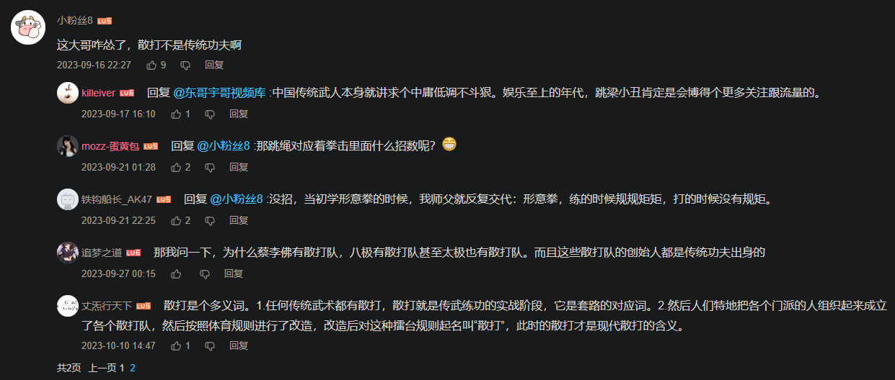

id:: 631864b0-e538-4080-88ea-419ba116ed65
#+BEGIN_QUOTE
太棒了，我逐渐理解一切
#+END_QUOTE

- [影响人类历史进程的100名人排行榜（修订版） (豆瓣)](https://book.douban.com/subject/25832863/)
	- [影响人类历史进程的100名人排行榜 - 维基百科，自由的百科全书](https://zh.wikipedia.org/wiki/%E5%BD%B1%E5%93%8D%E4%BA%BA%E7%B1%BB%E5%8E%86%E5%8F%B2%E8%BF%9B%E7%A8%8B%E7%9A%84100%E5%90%8D%E4%BA%BA%E6%8E%92%E8%A1%8C%E6%A6%9C)
- 每天很多人的声音在我的脑子里穿来穿去
- 人物关系图谱
  collapsed:: true
	- 你可以写个简单的人物关系图（以致写出若干人在某一或某些侧面的简史），虽然连接线上目前还加不了什么东西
- [[虎鲸]]
- [[线下]]
- [[网友]]
- [[帮助]]
- {{embed ((621437aa-c531-4b8d-ad1b-e61ee634fe70))}}
- 科技
	- ((61fd1d0e-8fbf-4484-811e-ae07a5cd0636))
	- [查尔斯·巴贝奇](https://baike.baidu.com/item/%E6%9F%A5%E5%B0%94%E6%96%AF%C2%B7%E5%B7%B4%E8%B4%9D%E5%A5%87/5466849)
	- [阿达·洛芙莱斯](https://baike.baidu.com/item/%E9%98%BF%E8%BE%BE%C2%B7%E6%B4%9B%E8%8A%99%E8%8E%B1%E6%96%AF)
	- ((679adcb4-f5d7-4fc4-b6b6-60ed8e404269))
	- [范内瓦·布什](https://baike.baidu.com/item/%E8%8C%83%E5%86%85%E7%93%A6%C2%B7%E5%B8%83%E4%BB%80/1085792)
		- [The Godfather | WIRED](https://www.wired.com/1997/11/es-bush/)
	- [约瑟夫·利克莱德](https://zhuanlan.zhihu.com/p/102179746)
	- [道格拉斯·恩格尔巴特](https://baike.baidu.com/item/%E9%81%93%E6%A0%BC%E6%8B%89%E6%96%AF%C2%B7%E6%81%A9%E6%A0%BC%E5%B0%94%E5%B7%B4%E7%89%B9/11029666)
	- [西蒙·派珀特](https://baike.baidu.com/item/%E8%A5%BF%E8%92%99%C2%B7%E6%B4%BE%E7%8F%80%E7%89%B9/2795167)
	- Michael Nielsen
		- [火爆网络的《神经网络与深度学习》，有人把它翻译成了中文版！](https://zhuanlan.zhihu.com/p/58144032)
	- 亚伦·斯沃茨
	  id:: 640d22c0-6e78-4710-9710-4d4f2f1ce4ed
	  collapsed:: true
		- id:: 64043afb-7677-45d7-8714-6e64c3b61461
		  #+BEGIN_QUOTE
		  Be curious. Read widely. Try new things. What people call intelligence just boils down to curiosity. ——Aaron Swartz
		  #+END_QUOTE
		- {{embed ((614fdce6-d396-49e2-9a91-d0e46356bd90))}}
	- ((64631efd-b2a2-41aa-a49c-dcdb8eff179b))
	  id:: 64631efd-b2a2-41aa-a49c-dcdb8eff179b
	  collapsed:: true
	- 斯诺登
	  collapsed:: true
		- [[江湖往事-棱镜门]爱德华·斯诺登如何在CIA监视下泄密的？ - 知乎](https://zhuanlan.zhihu.com/p/105674782)
- 实修
  collapsed:: true
	- 蔡璧名
	  collapsed:: true
		- [一个死里逃生的大学女教师](https://zhuanlan.zhihu.com/p/44290178)
		- ((6278e982-3770-4929-8b22-0ddac66b36aa))
		- [[穴道导引]]
- 武术
  id:: 626614ae-d23a-4947-b9de-ffa5d0c8f624
  collapsed:: true
	- {{embed ((62a3387e-28d3-4a24-b616-f5751cec066f))}}
	- 李小龙
	  collapsed:: true
		- ((6265fce0-b678-4963-91ee-03b12891f29e))
	- {{embed ((626614b8-5064-4c3c-b654-fc85a8f950fb))}}
	- 马保国
	  collapsed:: true
		- [马保国为什么会变成夜店小王子？_哔哩哔哩_bilibili](https://www.bilibili.com/video/BV1ub42177rM)
		- [马老师：王庆民收钱打假赛！往死里打我！_哔哩哔哩_bilibili](https://www.bilibili.com/video/BV1Dp4y1A7dq)
		  id:: 65a4938d-1288-4a41-8d39-d543a71d1660
		  collapsed:: true
			- [传武教练王庆民打败69岁老同志_哔哩哔哩_bilibili](https://www.bilibili.com/video/BV1dz4y157EN)
			  collapsed:: true
				- “懂了吧！”
				- {:height 201, :width 453}
		- [马老师教你手风琴_哔哩哔哩_bilibili](https://www.bilibili.com/video/BV1yj411c71n)
		- ((65a49554-56e5-4e4d-b945-dec6cb5aefaa))
		- [KO马保国后，王庆民首发声：从没练过西方搏击_太极](https://www.sohu.com/a/422248672_488679)
- [[哲学]]
  collapsed:: true
	- 笛卡尔
		- [笛卡尔梦中获启示，《几何学》开创新纪元](https://mp.weixin.qq.com/s/bpYnGYR7BJeXDC90x2wd6g)
	- [卢梭](https://baike.baidu.com/item/%E8%AE%A9-%E9%9B%85%E5%85%8B%C2%B7%E5%8D%A2%E6%A2%AD)
	  id:: 623fb603-1024-44da-abd2-4063d05a015e
	  collapsed:: true
		- id:: 62445986-6c4b-4006-bd8f-11d73b58e55a
		  collapsed:: true
		  #+BEGIN_QUOTE
		  人生而自由，却无往不在枷锁之中
		  #+END_QUOTE
			- collapsed:: true
			  #+BEGIN_QUOTE
			  十岁受诱于饼干，二十岁受诱于情人，三十岁受诱于快乐，四十岁受诱于野心，五十岁受诱于贪婪。人，到底何年何月才会只追求睿智？ ——《爱弥儿》
			  #+END_QUOTE
				- 人在一生中究竟要把自己关进多少牢笼？
				  collapsed:: true
					- 另外，你怎知道，这间房子，不是监狱？
	- 康德
	  collapsed:: true
		- id:: 6289b9f7-6a19-49e6-b55b-4d0c09dbd7f5
		  #+BEGIN_QUOTE
		  有两种东西，我对它们的思考越是深沉和持久，它们在我心灵中唤起的惊奇和敬畏就会日新月异，不断增长，这就是我头上的星空和心中的道德定律。——康德
		  #+END_QUOTE
	- ((621309a4-3f20-4452-9274-c2ed2089f30b))
	  collapsed:: true
		- {{embed ((6236a323-894f-48d2-8bff-d4ad23188fc8))}}
	- 克里希那穆提
	  id:: 66db8b0b-568a-4482-ba03-ac79ecf38adf
	  collapsed:: true
		- 将人类从“已知”的囚禁等负面影响解放
		- 面对不得不接受的时间，从中观察更多，去除或避免产生与被拉长的时间感有关的负面情绪/评价
- 法律
  collapsed:: true
	- 罗翔
	  collapsed:: true
		- 《法制的细节》
- 政治
  collapsed:: true
	- 斯大林
	  collapsed:: true
		- [斯大林简朴的个人生活#关于斯大林的读书笔记与再反思#（四十一）](https://mp.weixin.qq.com/s/FsEVWTSkAqPF7c9XqcUvGw)
		- ((67fa5bac-8776-49e4-a543-e9369aadc42f))
		- ((67abf986-9667-42bf-bbea-c967c2f8d894))
	- 毛泽东
	  collapsed:: true
		- [刚入高中，读了《巨人的背影》，会是一个好的选择吗？ - 知乎](https://www.zhihu.com/question/520814918)
		- ((66506513-2e8a-492c-ba30-9bfcbc1f11eb))
		  collapsed:: true
			- >抛开姓名不谈，你就说这样健身的一个人放到当代在部分人看来魔怔不魔怔吧！一丝不苟地健身，做最优质的战士，同时团结、领导了一批志同道合的同志和支持者，当时毛泽东二十四岁，是学生，但是已经走学工农兵联合的路线成功护校护市，虽然时代特征有些不同，但我认为这是比μ's组合走娱乐偶像路线吸引生源避免废校更为高明的
		- [揭秘毛泽东英语水平](https://china.huanqiu.com/article/9CaKrnJmI87)
		- ((66cdaefb-7d4f-41c0-9633-3ec8c1d186d2))
	- 邓小平
	  collapsed:: true
		- [没有邓小平，就没有改革开放](https://user.guancha.cn/wap/content?id=370182)
		- [毛泽东为何对邓小平的“猫论”如此反感？_湖北频道_凤凰网](https://hb.ifeng.com/culture/detail_2015_03/05/3616930_0.shtml)
		  id:: 6774e9b4-f76b-4394-b5bf-27a72d9555cb
	- 江泽民
	  collapsed:: true
		- [江泽民](https://m.reactshare.cn/p/186)
		  id:: 62296396-22a8-499e-822a-cee3177d1277
	- 李敖
	  collapsed:: true
		- [【李敖大全集】【演讲】【访谈】【纪实】【综艺】](https://www.bilibili.com/video/BV1ox411m71n)
		  id:: 62ada62b-9992-409a-a859-2e0ba89e0ee1
		- [李敖之子李戡：支持两岸统一理想未变，但我已无法说服台湾人 - BBC News 中文](https://www.bbc.com/zhongwen/simp/chinese-news-56357890)
	- 李锐
	  collapsed:: true
		- [毛泽东前秘书日记的所有权之争与其记载的非官方中国历史｜端传媒 Initium Media](https://theinitium.com/zh-Hans/article/20210926-wsj-former-mao-aide-diaries)
- 经济
  collapsed:: true
	- 经济学家
	  collapsed:: true
		- [如何看待中国的经济学家们？张五常到底处于什么地位? - 知乎](https://www.zhihu.com/question/22637670)
	- 首席经济学家
	  collapsed:: true
		- [高善文：一位首席经济学家的心灵史](https://mp.weixin.qq.com/s/Q0L0ghXoaGKqIxuxxe-9Ow)
	- [[基金经理]]
	- 查理·芒格
	  collapsed:: true
		- ((6302f7a7-86d5-453d-88e1-e34da1f7bc59))
		- 蹭流量的
		  collapsed:: true
			- ((63034f22-8d7f-49a8-8ee2-878dde56c65d))
			  collapsed:: true
				- 
				  id:: 6302f6e9-9cbf-4798-a901-401912b05d1c
				  collapsed:: true
					- 
					- 
					  id:: 6302f7a7-86d5-453d-88e1-e34da1f7bc59
- 商业
  collapsed:: true
	- ---
	- 洛克菲勒
	  id:: 678dd926-b993-4063-8eef-70eae9a07048
		- [100年前活到97岁的石油大亨，对健康的看法。](https://mp.weixin.qq.com/s/VqVScjTbErDvNeP2j9nWvA)
		  id:: 678df1bf-1a37-498a-b828-ce1509bfd64c
	- 邵逸夫
		- id:: 673321d0-d0da-43a4-bcf3-5f9aaed63df4
		  >“邵逸夫！我的美女主治呢？！”——普里搁今（评青年医生情感问题）
		- [为什么邵逸夫爵士的英文名是 Run Run Shaw？ - 知乎](https://www.zhihu.com/question/22468809)
	- 李嘉诚
		- [李嘉诚公开回复国人: 不要用那些空洞的道德来衡量我](https://zhuanlan.zhihu.com/p/79861776)
		- [李嘉诚为什么要紧急出售英国资产?](https://www.zhihu.com/question/520121203/answer/2378989859)（“因为春江水暖鸭先知，2022年世界金融危机恐怕已经爆发了。”）
		- [李嘉诚重金押注越南，其 GDP 增速冠绝亚洲，为什么会选择越南，越南有希望吗？](https://www.zhihu.com/question/530004803)
	- 乔布斯
	  id:: 679adcb4-0ffe-4651-a0df-c88bae448b89
		- id:: 66db8ad1-f0b7-46dc-8066-75313dcae3ea
		  >The people who are crazy enough to think they can change the world are the ones who do.
			- [苹果最经典的广告：Think different （1997）乔布斯配音_哔哩哔哩_bilibili](https://www.bilibili.com/video/BV1oW4y1i7qf)
			  id:: 67402acd-f031-49fb-abd4-042b7070dd10
				- “TD”
		- [如何理解乔布斯说的「消费者并不知道自己需要什么，直到我们拿出自己的产品，他们就发现，这是我要的东西」？ - 知乎](https://www.zhihu.com/question/24422160)
		  id:: 67402ae3-eb71-44b3-b320-249d8edde652
		- ((67f0f972-4887-4ea2-8bee-a23cc3dc8d65))
		- ((62621fa5-ccb8-4df2-a89a-e4900de7aa60))
	- 刘永好
		- [刘永好（新希望集团有限公司董事长，第十四届全国政协委员）_百度百科](https://baike.baidu.com/item/%E5%88%98%E6%B0%B8%E5%A5%BD/2674639)
	- 许家印
		- [官僚创业者不能投](https://www.zhihu.com/zvideo/1491553344242397184)
	- 方洪波
		- [严禁表演式工作！方洪波，打响“第一枪”](https://mp.weixin.qq.com/s/C8-S0nFW5TQioZKH_aSupw)
		  id:: 67946d4f-5325-43fb-a600-8d79c83ea580
	- 雷军
		- ((67dfd5a5-1999-43f1-b743-35763848cd0d))
		- [雷军的“性张力”，很多人都不懂](https://mp.weixin.qq.com/s/LiQHsHmhh7KUSKdmZDgClw)
		- [如何看待雷军提出的“科技平权”? - 知乎](https://www.zhihu.com/question/1905605483785584902)
		  id:: 68821777-dabe-4449-ae35-f173039efe82
			- “支持雷总！我们地球需要广泛而深刻的各种平权！”
	- 马斯克
	  id:: 679adde5-887c-4575-a096-c45907117252
		- [MAGA人物志：马斯克🖐️😭🖐️_哔哩哔哩_bilibili](https://www.bilibili.com/video/BV1G6fqY7EpU/)
		- ((67beae39-d50f-4027-85f5-a9ecd76c8273))
		- ((67bf17db-7c83-4e9e-afda-bbf1c098ebad))
		- [马斯克收购推特，这事情没那么简单，暗藏危机征兆，重新分配蛋糕](https://mp.weixin.qq.com/s/0dSPhCwYANXX-X86GaGnFQ)
		- ((67bf1694-5261-4bc1-b0a0-73312d41b7fe))
		- ((67f0f972-4887-4ea2-8bee-a23cc3dc8d65))
	- 罗永浩
		- [老罗英语培训的珍贵视频,小学作文_哔哩哔哩_bilibili](https://www.bilibili.com/video/BV1B44y1b7Zo)
		- [[励志]我的奋斗,罗永浩吉林大学演讲_哔哩哔哩_bilibili](https://www.bilibili.com/video/BV14x411v7Nm/)
		- [罗永浩：一个理想主义者的创业故事 I_哔哩哔哩_bilibili](https://www.bilibili.com/video/BV12x411Q7nQ/)
		- ((67dfcb60-e737-42e5-9697-534a63ae7bc2))
		- [幸福59厘米之小马【罗永浩作品】 - YouTube](https://www.youtube.com/watch?v=ALmt9MkEMHE)
			- ((67e91217-1a2f-4147-a844-c561c3e0ed1b))
			- [老罗药业生产的“尿的帅”，现已推出儿童装，欢迎试用。_哔哩哔哩_bilibili](https://www.bilibili.com/video/BV1vW411y7Cw/)
		- ((67dfd30e-5e5c-420d-865c-747c94156bd4))
		- [老罗成功拦截到方舟子和彭剑并当面对质，无剪辑一镜到底欧耶版 4K重制_哔哩哔哩_bilibili](https://www.bilibili.com/video/BV1ThbszgEbu/)
	- 刘强东
		- [京东健康称刘强东将转让持有的宿迁天宁 45% 股权，股东转让股权的目的是什么？ - 知乎](https://www.zhihu.com/question/554108319/answer/2685006647)
		  id:: 637f6a3c-10c6-4586-80d5-6d115f0efa79
	- 扎克伯格
	  id:: 679adcb4-c4d2-48f2-bd3d-540ae1b253c0
		- [曾在北京雾霾里晨跑的美国人，如今最想干掉国际版抖音TikTok！](https://mp.weixin.qq.com/s/dHny5RExqFKEnEvJS562vQ)
		  id:: 6786f4ab-afb3-4c49-9c46-447db5029909
		- [【元宇宙&Facebook】背后的秘密](https://mp.weixin.qq.com/s/RdFWQTS7NiRwVRAgl_PmFw)
		  id:: 67a45399-7414-49b9-af46-e19956b30531
			- [五角大楼开发生平记录系统 多媒体记录人所有活动](http://mil.news.sina.com.cn/2003-06-06/130400.html)
			  collapsed:: true
- 体育
  id:: 679adcb4-5f3e-418d-8691-7e690cfb07f8
  collapsed:: true
	- 舞蹈
		- [林怀民](https://baike.baidu.com/item/%E6%9E%97%E6%80%80%E6%B0%91)
	- 谷爱凌
	  id:: 6275d373-dce8-4a02-b995-fc0603210923
	  collapsed:: true
		- “叙事”
		  collapsed:: true
			- [两个奥运冠军的叙事逻辑](https://mp.weixin.qq.com/s/FG-p5cbn2JtOM0AooG6j5w)
			- [如何看待新东方在线考研发布的文章「再见谷爱凌，我不喜欢你」？](https://www.zhihu.com/question/530830267/answer/2467250408)
		- [为什么谷爱凌的争议越来越多？](https://mp.weixin.qq.com/s/ErWWoQkRVYLQvnbjr1iwqg)
		- [被网民骂双面人 谷爱凌回怼：我为中国拿了39面奖牌 你做了什么？ | 联合早报网](https://www.zaobao.com/realtime/china/story20240821-4517925)
- 教育
  collapsed:: true
	- [[卢安克]]
- 社评
  collapsed:: true
	- [[张维为]]
	- 马前卒
	  collapsed:: true
		- [怎样评价知乎用户“马前卒”？ - 知乎](https://www.zhihu.com/question/54357850)
		- [如何评价睡前消息10000期？ - 知乎](https://www.zhihu.com/question/632908272)
- 文学
  collapsed:: true
	- 屈原
	  id:: 62426320-3c3b-4f36-bb3d-4c097f412eb5
	  collapsed:: true
		- [屈原有巫师的身份吗？ - 知乎](https://www.zhihu.com/question/28166246)
	- 李白
	  collapsed:: true
		- #+BEGIN_QUOTE
		  弃我去者，昨日之日不可留；
		  乱我心者，今日之日多烦忧。——李白
		  #+END_QUOTE
	- 贾岛
	  id:: 63188626-d5d1-41e1-90dc-56b83f66bbe2
	- 韩愈
	  collapsed:: true
		- #+BEGIN_QUOTE
		  食马者不知其能千里而食也。是马也，虽有千里之能，食不饱，力不足，才美不外见，且欲与常马等不可得，安求其能千里也？——韩愈《马说》
		  #+END_QUOTE
	- 梭罗
	  id:: 678b048b-9c79-4b80-b164-53f63e13da78
		- [梭罗小传（瓦尔登湖）书评](https://book.douban.com/review/2963042)
		- ((640d22c0-6e78-4710-9710-4d4f2f1ce4ed))
		- id:: 6832806b-8da4-400f-b3ae-d3dc140c12ed
		  >我很想发现瓦尔登湖那消失很久的湖底，于是，1846年初冰化之前，用罗盘、链条和测深绳仔细测量了一番。关于瓦尔登湖底的故事很多，或者说声称瓦尔登湖没有底的故事很多，很多故事本身就没底。奇怪的是，很多人会一直相信一个湖是没有底的，却不会费心去勘察一下。我有一次在这一带散步，一下子就路过了两个这样的无底之湖。很多人认为瓦尔登湖通到了地球的另一面。有些人在冰上趴了很久，通过虚幻失真的冰层观察下面，可能眼睛还是水汪汪的，因为担心伤风感冒，于是匆匆作出结论，这些人看见过“可以装载一大车干草的大洞”，如果有人往里装草的话，这个大洞毫无疑问是冥河的源头，从此地进入地狱的入口。另外一些人从村里带着一只“五十六磅重的秤砣”和一马车绳子来了，但他们也没有找到湖底；五十六磅的秤砣在旁边待战时，他们在往下放绳子，徒劳地丈量着，其实真正无法衡量的，是他们的好奇心。但我可以向我的读者保证，瓦尔登湖有相当密实的湖底，深度虽然相当超乎寻常，却不是完全深不可测。我用一根鳕鱼线和一个一磅半重的石头，很容易就测量出来了，我能够准确地判断石头是什么时候离开湖底的，因为在水的浮力从下面托起石头之前，我需要花很大的力气拉石头。最深的地方正好是一百零二英尺；从那以后因为涨水了，应当再加上五英尺，总深度为一百零七英尺。这么小一片湖水却达到这么惊人的深度；不过无论人们如何遐想，都不可能让它减少一英寸。要是所有的湖都很浅呢？难道不会对人的思想产生影响吗？我很感激，这个湖这么深邃，这么纯洁，是一个伟大的象征。只要有人相信时空的无限，人们就会相信有些湖是无底的。——《瓦尔登湖：全注疏本》
			- >在1846年1月，在瓦尔登湖冻得结结实实，足以承受梭罗的重量之后。梭罗把他之前在康科德书院用过的测量工具带来这里。至少有一周，也可能是两周，可能是一个人，也有可能找了一位助手，梭罗在寒冬里测量了这座湖。这项工作做起来比说起来困难。首先，他必须沿岸竖起20面左右的旗帜作为标杆，然后把沉重的仪器——三脚架上的指南针、金属测量链、斧头、铅垂线、作为秤砣用的石头、标刻度用的工具——拖到冰面上，他用两个导线站建立了一条925英尺的基准线。从这两个导线站出发，梭罗用被测量员称为“交角测量”（angle intersection survey）的方法，测出了湖面的半径，一次能量出66英尺的长度，湖面周长一共为2900英尺。然后，他用斧头和冰凿在冰面上钻出了100多个小洞，把铅垂线放到冰下的湖水里。在每一个洞口，他都停下来记录方位和距离。最终，他汇集数据，用铅笔把它们绘制成精细且非常准确的素描图。[63]
			  这是一项浮夸的工作，不切实际。没有人需要湖的测量数据，而且这项工作需要认真的学习，承担艰苦的体力活，还需要专业的数学知识，更别说对这些科学仪器和制图技术的熟练操作。但是梭罗做成了。他运用科学和工程学的工具创作出杰出的艺术作品，一张以英尺为单位、精准展现瓦尔登湖全景的测量图：包括长度、宽度、深度。他说，他做这件事，是要证明这座湖是有底的，因为传说这座湖是无尽的深渊。事实上，梭罗发现它最深的地方是102英尺，这也让瓦尔登湖成为马萨诸塞州最深的内陆湖。——《梭罗传》
			- 测量的关键可能是合适的配重（重量、密度、刚性，包括线绳的），避免人体感知失效
				- 如果之前那些人没用秤砣，只用绳子密度相同、浮力相对较大、触底拉力变化不明显
				- 如果之前那些人用了秤砣——可能太重了人力拉不动？（“这对吗？”）
		- [第一人称视角游戏《Walden, a game（游戏：瓦尔登湖）》预告片发布！这是一个养老的好地方！_哔哩哔哩_bilibili](https://www.bilibili.com/video/BV1kW411G7SF/)
	- 陀思妥耶夫斯基
	  id:: 68252bbe-701e-4a7d-b406-4c0ee4120c6b
		- [“不疯魔，不成活”的陀思妥耶夫斯基 - 知乎](https://zhuanlan.zhihu.com/p/140344954)
			- id:: 67e564e0-6192-42de-8353-a3c95c41a612
			  >1881年，陀思妥耶夫斯基准备写作《卡拉马佐夫兄弟》第二部。2月9日，他的笔筒掉到地上，滚到柜子底下，他在搬柜子过程中用力过大，结果导致血管破裂，于当天去世，弥留前妻子为他朗诵圣经，享年59岁。葬于圣彼得堡。
	- 马克·吐温
	  id:: 6795b4aa-6f8e-4107-af18-08bb9557592e
		- [马克·吐温](https://baike.baidu.com/item/%E9%A9%AC%E5%85%8B%C2%B7%E5%90%90%E6%B8%A9/412335)
		  id:: 621d9af5-c222-44f7-8c53-b0499d8cea7c
		- [马克·吐温：疯狂投资人、商业帝国梦与巡演躲债的岁月-虎嗅网](https://www.huxiu.com/article/433631.html)
	- [海伦·凯勒](https://baike.baidu.com/item/%E6%B5%B7%E4%BC%A6%C2%B7%E5%87%AF%E5%8B%92/147783)
	  collapsed:: true
		- ((61ef756b-6dbd-4d35-a8c9-874364713f4a))
	- 鲁迅
	  collapsed:: true
		- [为什么老是有人相信鲁迅的文章被移出了中学教科书了？ - 知乎](https://www.zhihu.com/question/417044072)
		- [如何理解鲁迅的《补天》? - 知乎](https://www.zhihu.com/question/65667919)
		  id:: 68a69caa-92e0-411f-a676-fbd5b61b315f
		- [非革命的急进革命论者](https://www.marxists.org/chinese/reference-books/luxun/13/017.htm)
		- ((678a4e03-a3e6-4edc-b9ac-726bb7b73d5c))
		  id:: 65a145b1-4b9b-49e0-b867-8ac802244d47
		- [鲁迅为什么评价毛泽东像“山大王”，毛泽东听到为什么哈哈大笑？ - 知乎](https://zhuanlan.zhihu.com/p/402646202)
		- “鲁迅说的”
			- [学医救不了中国人是不是理解错意思了？? - 知乎](https://www.zhihu.com/question/370176483)
			- [鲁迅说：哪里有天才，我只是把别人喝咖啡的工夫用在工作上。他那个年代真的有咖啡喝么？这真是他所说的么？ - 知乎](https://www.zhihu.com/question/21967858)
			- [如何评价鲁迅的「猛兽总是独行，牛羊才成群结队」？ - 知乎](https://www.zhihu.com/question/51951974)
				- ((67c03ccb-0bdf-4453-8ae8-0d39c40ef1ec))
			- [鲁迅的「晚安」到底几层含义？ - 知乎](https://www.zhihu.com/question/402424275)
			  id:: 68c223c5-e9b5-4eb0-a333-98ef916f6720
				- “有四层，你知道么？”
	- 钱锺书
		- [钱锺书：魔鬼夜访钱锺书先生丨“纪念钱锺书先生诞辰110周年”系列文章之四](https://mp.weixin.qq.com/s/47f1LYZmsGSaOWPg7kGfJg)（网友根据我的文风分享）
	- 科幻
	  collapsed:: true
		- 阿西莫夫
			- [他因业余爱好丢掉教职，却把自己修成了大师](https://mp.weixin.qq.com/s/pxZfHrW9AJfgFvv2o40JEw)
		- [叶永烈 - 维基百科，自由的百科全书](https://zh.wikipedia.org/wiki/%E5%8F%B6%E6%B0%B8%E7%83%88)
		  id:: 66b33a26-e326-40be-855d-88ac312ca704
		  collapsed:: true
			- [小灵通漫游未来 - 维基百科，自由的百科全书](https://zh.wikipedia.org/wiki/%E5%B0%8F%E7%81%B5%E9%80%9A%E6%BC%AB%E6%B8%B8%E6%9C%AA%E6%9D%A5)
		- 倪匡
		  collapsed:: true
			- [倪匡逝世：从“反革命分子”到知名科幻小说家 - 纽约时报中文网](https://cn.nytimes.com/obits/20220708/ni-kuang-dead/)
		- [[刘慈欣]]
		  collapsed:: true
			- [如何评价疑似刘慈欣贴吧账号被曝光？](https://www.zhihu.com/question/322536307/answer/671555331)
			  id:: 6246bf4b-2e05-4489-bd40-1c3f096863be
	- 詹姆斯·乔伊斯
	  collapsed:: true
		- [想要看懂《尤利西斯》的话需要了解多少东西？ - 知乎](https://www.zhihu.com/question/52207796)
		  id:: 6614f2d4-405d-4596-b1a7-563ecadee83e
- 音乐
  collapsed:: true
	- 周杰伦
	  collapsed:: true
		- [【1080P修复】周杰伦 - 红模仿 MV 修复版](https://www.bilibili.com/video/BV1A741157Y3)
		  id:: 62d3bab0-90b0-4d68-abe2-d06fbe8b321d
			- [Influenceur (Hard Version) - Dr. Peacock/Ascendant Vierge - 单曲 - 网易云音乐](https://music.163.com/song?id=1920497505&uct2=U2FsdGVkX1+u+Tg7jc/tmyfSWuVQLx1qwDUhVBcbObo=)
			- ((67599ab1-af6b-405d-9cca-6c1052fff045))
			- [MC石头：2010年《情债》原版。_哔哩哔哩_bilibili](https://www.bilibili.com/video/BV1hK4y1f7Wj)
			  id:: 6771fb2f-dc47-43c4-bd13-728fbf21f8c6
	- 刘德华
	  id:: 67eb280f-787c-4580-ac7c-8bc3c2fb888a
		- id:: 6774db2b-3117-47d2-893d-045adb56ff02
		  >可以做一期食材解冻、高空防坠和慢性病防疫（防疫钉子户风评较好的明星）
		  演唱会搞了很多年，都疑似没有类似vr安全区域的安全设计，对艺术家的保护水平可见一斑
			- [【梗指南】刘德华解冻是什么梗_哔哩哔哩_bilibili](https://www.bilibili.com/video/BV17Q4y1A7gj)
			- [63岁的刘德华，又一次差点从3米高台上摔下_新浪新闻](https://news.sina.com.cn/c/2024-12-28/doc-ineaysic3537112.shtml)
			- [62岁刘德华成唯一戴口罩的巨星！出席活动显另类，对健康负责获赞|记者|填词人|古典乐|华语音乐_网易订阅](https://www.163.com/dy/article/IKUOS5M805374TCW.html)
			  id:: 6774f5cc-dd68-4aff-b1d5-175cea08bc20
		- 《恭喜发财》
			- “（最好的请过来，不好的请走开）礼多人不怪”——“送礼攀比奢靡之风”，收礼心安理得
			- “智商充满你脑袋”——除了陆港文化差异，与否有嘲讽的成分？
- 虚构
  collapsed:: true
	- 学科
	  collapsed:: true
		- [为什么李华不会英语还要交那么多外国朋友？](https://www.zhihu.com/question/490703140)
		  id:: 6226b3ae-c300-4c3e-a882-2a023bc4c480
	- 影视
	  collapsed:: true
		- 1900
		  collapsed:: true
			- ((624283d4-1b09-4da4-9caf-b013b4b82f16))
		- [长门有希](https://zh.moegirl.org.cn/%E9%95%BF%E9%97%A8%E6%9C%89%E5%B8%8C)
		  id:: 62282955-d722-4c08-8769-d5788aa2e107
		  collapsed:: true
			- [长门号战列舰](https://baike.baidu.com/item/%E9%95%BF%E9%97%A8%E5%8F%B7%E6%88%98%E5%88%97%E8%88%B0)
	- 戏剧
	  collapsed:: true
		- 祥林嫂
		  collapsed:: true
			- [成年人最大的悲哀，是突然读懂了祥林嫂](https://mp.weixin.qq.com/s/iJTOkDrcKhvSV9WR_V6g-g)
- 科学
  collapsed:: true
	- [[钱学森]]
	- [[“四大恶人”]]
	- 方舟子
	  collapsed:: true
		- [新语丝Xin Yu Si (New Threads) Home Page](http://www.xys.org/)
		  id:: 66fba956-72ba-4f33-9318-018e1a94ca5f
	- 信息
	  collapsed:: true
		- [埃尔达尔·阿里坎](https://baike.baidu.com/item/%E5%9F%83%E5%B0%94%E8%BE%BE%E5%B0%94%C2%B7%E9%98%BF%E9%87%8C%E5%9D%8E/23660623)
		  collapsed:: true
			- ((6210727f-b7b3-4e8a-968b-14f94d56d843))
	- 化学
	  collapsed:: true
		- 拉瓦锡
	- 生物
	  collapsed:: true
		- [卡尔·林耐](https://baike.baidu.com/item/%E5%8D%A1%E5%B0%94%C2%B7%E6%9E%97%E8%80%90/9010973)
		- [阿尔弗雷德·金赛](https://baike.baidu.com/item/%E9%98%BF%E5%B0%94%E5%BC%97%E9%9B%B7%E5%BE%B7%C2%B7%E9%87%91%E8%B5%9B)
		  id:: 64631efe-d82a-4c76-b71b-d0b71be227f9
		  collapsed:: true
			- ((64631f03-5aac-4a14-bcb6-da09cd3d5436))
	- 农学
	  collapsed:: true
		- 施平
		  collapsed:: true
			- [施平 - 维基百科，自由的百科全书](https://zh.wikipedia.org/wiki/%E6%96%BD%E5%B9%B3)
			- [白头虽老赤心在——施平同志谈长寿之道-华东师范大学](https://www.ecnu.edu.cn/info/1094/56133.htm)
			- [113岁的华师大老书记施平：是亚洲最长寿男性](https://baijiahao.baidu.com/s?id=1791135126132982383)
			- [施一公：我113岁的爷爷，“一生是个奇迹”_澎湃号·湃客_澎湃新闻-The Paper](https://www.thepaper.cn/newsDetail_forward_27924155)
	- 心理
	  collapsed:: true
		- [爱德华·桑戴克](https://baike.baidu.com/item/%E7%88%B1%E5%BE%B7%E5%8D%8E%C2%B7%E6%A1%91%E6%88%B4%E5%85%8B/5354840)
		- 马斯洛
		  collapsed:: true
			-
	- 认知
	  collapsed:: true
		- 记忆
		  collapsed:: true
			- [艾宾浩斯](https://supermemo.guru/wiki/Hermann_Ebbinghaus)
	- 卡尔·萨根
	  collapsed:: true
		- #+BEGIN_QUOTE
		  在广袤的空间和无限的时间中，能与你共享一颗行星和同一段时间，是我的荣幸。——卡尔·萨根
		  #+END_QUOTE
		- [Sagan](https://music.163.com/song?id=30612293&userid=77770261)
	- 李兰娟
	  collapsed:: true
		- [院士李兰娟回应学术不端举报](http://www.xys.org/xys/ebooks/others/science/dajia10/lilanjuan.txt)
- 历史
  collapsed:: true
	- 辛德勇
		- [哈哈！不好意思：用腳後跟想也明白這是爲什麼！](https://mp.weixin.qq.com/s/hbporCgPdBmwoFzfhfWQyQ)
	- 张纯如
	  collapsed:: true
		- [张纯如为什么自杀？ - 知乎](https://www.zhihu.com/question/20211500)
- 案件
  collapsed:: true
	- ((ae540feb-9373-49bb-a0e4-d1c172f63f29))
	- 律师
	  collapsed:: true
		- 孙占亚（看到706跨学科群群友转的孙占亚律师朋友圈关于唐山打人事件的法律意见）
		  collapsed:: true
			- [我“终结”的首个刑事案件](https://lawyers.66law.cn/s201483d557e57_i711272.aspx)
	- 官僚
	  collapsed:: true
		- [时差7小时](https://baike.baidu.com/item/%E6%97%B6%E5%B7%AE7%E5%B0%8F%E6%97%B6)
		  collapsed:: true
			- [关于电影《时差七小时》 深圳市委通报调查结果](http://zqb.cyol.com/content/2004-11/13/content_987108.htm)
		- 关系户
		  collapsed:: true
			- [如何看待“没有宽带 没有快递 没有外卖 没有男朋友……4名95后姑娘坚守浙江千岛湖深山保高铁供电”？](https://www.zhihu.com/question/448208521)
	- 斯蒂芬·布隆伯格
	  collapsed:: true
		- [什么人会在图书馆当舔狗？【硬核狠人29】](https://www.bilibili.com/video/BV1Rb4y1p7JF)
	- 阿里
	  collapsed:: true
		- 女员工案张某
		  collapsed:: true
			- [我是阿里女员工案张某妻子](https://zhuanlan.zhihu.com/p/478392055)
	- [“战”或“逃”：童年不良经历教会大脑的模式 | 她为什么成为儿童杀人狂？](https://zhuanlan.zhihu.com/p/22498911)
	- 调查记者
	  id:: 64043a3a-b767-46f9-8f47-38f596dd879a
	  collapsed:: true
		- [他曾揭露“县委书记雇凶灭口举报人”将问题官员送进监狱，也曾曝光派出所不作为，推动司法体制改革，因为揭露黑暗，他被利益集团迫害入狱。](https://www.bilibili.com/video/BV1jq4y1a7Yi)
		  id:: 628f14a8-4405-42eb-ace3-06932aae3c49
		- 矿难
		  collapsed:: true
			- [他曾经揭露“郴州官商勾结，充当黑煤矿保护伞”，有人用100万封口，打电话威胁让他无法在湖南立足，他留下遗书，揭露黑幕，正义记者如今过得怎么了。_哔哩哔哩_bilibili](https://www.bilibili.com/video/BV1ei4y117Vb)
	- 毒品
	  collapsed:: true
		- 宗族
		  id:: 62132346-d8a0-473f-be7c-56ab1ba74510
		  collapsed:: true
			- [村支书带领全村人制毒贩毒，国家出动三千警力，奇袭广东第一毒村](https://www.bilibili.com/video/BV1hC4y1474p)
			- [中国禁毒第一村陆丰塔寨，异常萧条，满村烂尾别墅](https://www.bilibili.com/video/BV14i4y177Qi)
	- 刘学州
	  collapsed:: true
		- 鹿道森
		  collapsed:: true
			- [你有没有觉得，刘学州的这场自杀似曾相识](https://mp.weixin.qq.com/s/n-pqMvDpPhTf6vjWciBmtw)
			  id:: 61f2a210-f9fc-4247-8492-2e08ef9dd03a
		- 新京报
		  collapsed:: true
			- [新闻史上的耻辱夜](https://mp.weixin.qq.com/s/CNu7Hbgwl4tmID4zM-b9xw)
			  collapsed:: true
				- #+BEGIN_QUOTE
				  或许永远要记住，新闻人以笔为刀，任何时候把笔刺向无辜的弱小者时，都是可以载入新闻史的耻辱。
				  #+END_QUOTE
			- [很遗憾，“逼死”刘学州的网暴，不可能被禁绝](https://mp.weixin.qq.com/s/mYJCN0EOQ4aVTfqO1ow2qAsd)
			- [新京报在刘学洲事件中什么角色?](https://www.zhihu.com/question/513088621/answer/2323031723)
	- 陈少青
	  id:: 68a69caa-134b-4be1-bc60-21978c76bd3a
	  collapsed:: true
		- [《面对面》：反腐英雄陈少青的坎坷举报路(图)](https://news.sohu.com/2004/06/21/34/news220633425.shtml)
		- [谁来保护反腐勇士？](https://www.chinacourt.org/article/detail/2004/06/id/121145.shtml)
	- 王胜利
	  id:: 61f341e4-12bb-45d3-8d35-d25d937a758d
	  collapsed:: true
		- [纪检内鬼充当黑社会保护伞迫害办案民警王胜利致命致残？纪检部门正面回应了](https://new.qq.com/omn/20191229/20191229A06N1G00.html)
		- [王胜利：一个内蒙“功臣警察”的至暗时刻](http://cncc.bingj.com/cache.aspx?q=%e7%8e%8b%e8%83%9c%e5%88%a9+%e9%81%97%e4%b9%a6&d=4751801784928752&mkt=zh-CN&setlang=zh-CN&w=uu9TrOyJpypw3tSt8oHcyX9IS4ph9Boi#_loginLayer_1643290006553)
		- [内蒙警察王胜利被灭口前的遗书](http://m.szhgh.com/show.php?classid=50&id=291485)
		  collapsed:: true
			- [内蒙警察王胜利被灭口前的遗书](https://zhuanlan.zhihu.com/p/462484255)
			  id:: 61f341e4-7564-4bbc-b54d-2a7615b160d0
			  collapsed:: true
				- 王来明
				- 张建军
				  collapsed:: true
					- [内蒙古对鄂前旗领导干部侵占草原成立调查组](http://nm.cnr.cn/neimenggufenwang/xinwenshiting/20150421/t20150421_518365399.shtml)
	- 丰县八孩
	  id:: 62130d8d-4b76-46fb-9057-d16abc27d9dd
	  collapsed:: true
		- 事件梳理
		  collapsed:: true
			- [关于铁链女的全网最详细整理，徐州丰县究竟发生了什么？（必转）](https://mp.weixin.qq.com/s/vhpr7Xps-kWYmC_a7w0MJA)
			- [“丰县生育八孩女子”事件梳理 | 理性看待 静待结果](https://zhuanlan.zhihu.com/p/469399377)
			- 跟踪
			  collapsed:: true
				- [江苏省委省政府成立「丰县生育八孩女子事件」调查组，有哪些信息值得关注？](https://www.zhihu.com/question/517068413/answer/2352086131)
				- [“铁链女”事件｜总理“十分气愤”！最高检“正在督导”](https://zhuanlan.zhihu.com/p/479631992)
		- 质疑
		  collapsed:: true
			- [大数据分析，小花梅和李莹都生不出董香港](https://zhuanlan.zhihu.com/p/468567979)
			- [[偶得]铁链女事件分析中的批判性思维](https://www.aisoutu.com/a/1812261)
			- [期盼发布铁链女的“第六次”通报【原创】](https://www.aisoutu.com/a/2101107)
		- 外网
		  collapsed:: true
			- [中共调查组终于来了 对徐州铁链女的六大预测 - 新闻资讯](http://cncc.bingj.com/cache.aspx?q=%e5%85%ad%e7%ba%a7%e5%9b%9b%e6%96%b9%e4%bc%9a%e8%ae%ae&d=3608292867801&mkt=zh-CN&setlang=zh-CN&w=AZQcZlwKI-Up_anb1BLygfiOGzoilv7w)
		- 本地人观点
		  collapsed:: true
			- [如果你是江苏徐州丰县人，你如何看近期的丰县事态？](https://www.zhihu.com/question/517105351)
		- 地方经济影响
		  collapsed:: true
			- [丰县8孩母亲事件，徐州丰县要承受的巨大代价](https://zhuanlan.zhihu.com/p/469595465)
		- 相关案例的报告文学
		  collapsed:: true
			- [《黑色漩涡》—— 34 年前的一篇调查报告文学，就已揭开丰县拐卖妇女之罪](http://www.myzaker.com/article/6211ea55b15ec0192f1b0e54)
			  id:: 64043a3a-c722-4e42-96a3-bdb69c5bb8ab
		- 原因分析
		  collapsed:: true
			- 分析与建议对策
			  collapsed:: true
				- [发生铁链女事件的几个因素分析](https://mp.weixin.qq.com/s/i4s4HjEL25UW10Uni34A6Q)
				  id:: 621d8905-fe0d-4cee-8304-f7fb6bbf2e11
			- 地理因素对文化的影响及文化在不受外界强力影响下的延续
			  collapsed:: true
				- [徐州丰县政府回应「精神失常女子生育 8 个孩子」事件，称「是领证结婚，不存在拐卖」，事件后续如何发展？](https://www.zhihu.com/question/513824076/answer/2363255128)
				  id:: 621c7041-dcd6-4206-b6a7-6c029c285ffe
			- 宗族
			  collapsed:: true
				- [徐州丰县八孩女事件——小小村民只手遮天，富庶之地罪恶横行，这究竟是因为什么？](https://zhuanlan.zhihu.com/p/468559545)
				  id:: 6216f34d-7282-4aa2-9399-fde394edf84d
			- 宗教
			  collapsed:: true
				- [是什么在威胁社会稳定](https://mp.weixin.qq.com/s/gQULNkuslwwx7HOdmP9HGg)
			- 法律案例对判决成规和道德秩序的影响
			  collapsed:: true
				- [如此处理“项链”女案将后患无穷——从彭宇案的影响说起](https://mp.weixin.qq.com/s/93vjvi35-PrF_52IjIrKEw)
		- 地方政府的主观“失误”：久做地头蛇，对地方宗族势力没有有效约束（包括宗族内公务员的自我约束，毕竟可以看出宗族内的地位大于政府内的地位，“乡贤”胜于书记），对践踏公序良俗的反人类行为司空见惯习以为常，对网络舆情环境没有足够的敬畏感、危机感，以为可以瞒天过海
	- 唐山烧烤店
	  collapsed:: true
		- 唐山、计划经济、圈子社会
		- [巅峰之战：唐山打人案舆情全复盘](https://mp.weixin.qq.com/s/uJrCFoqGyFp72HnXRxSCmQ)
		  id:: 62afd59a-85ef-495f-b23f-fc131a8fe7d1
		- 性别视角
		  collapsed:: true
			- 
			  collapsed:: true
				- [唐山烧烤店打人事件，应该定性为黑恶势力问题，而非女权问题](https://mp.weixin.qq.com/s/bmwCZNUf72lQIfE0e8lz2Q)
		- [一个城市能为女性做些什么](https://mp.weixin.qq.com/s/48sq9J628MifHZ8L3-pKMw)
		  id:: 62a557c8-c834-4b84-b570-8cb848fa2d49
		- ((62a555a4-1a48-436b-9b76-0e85d3e4dcfb))
		- [关于唐山烧烤摊事件，女性凌晨在烧烤摊有错吗？](https://www.zhihu.com/question/537289067)
		- 调戏不成——得不到就毁灭，刺激了雄性气质？兄弟在旁边不能丢脸
		  collapsed:: true
			- ((62ba4d51-6ad0-4347-9d2d-e52ca9ce4f68))
		- 后续影响
		  collapsed:: true
			- 公安夜市巡逻
			  collapsed:: true
				- [突击车、直升机都安排上了！多地公安街头武装巡逻，还有领导暗访夜市…](https://mp.weixin.qq.com/s/iFfJBPZ3xMbhOjbzeIpZoA)
		- [唐山烧烤店打人案处警民警实名举报被“背黑锅”，称“5分钟出警”并非自己造假，是被领导逼着念通稿，官方通报：不属实_哔哩哔哩_bilibili](https://www.bilibili.com/video/BV1K1421t7qF)
- 润人
  collapsed:: true
  id:: 66f4b8d9-0114-4d9d-8c0d-50d77af99ee1
  >效果比党的教育还要好！——张维为
	- [如何看待甜甜圈真好吃王伟恒在美急诊科15分钟被收5670$？ - 知乎](https://www.zhihu.com/question/618670829)
		- ((66cb0aa3-900b-4a30-99e8-9ffac50c4532))
		- [现在的心境有点类似甜甜圈王伟恒【黑神话吧】_百度贴吧](https://tieba.baidu.com/p/9106772083)
- “收集”
	- 陈直
	  collapsed:: true
		- 有余力的农民工陈直，在厦门的电子厂打完工后还回去阅读翻译海德格尔——跟一位网友建议学python时想到
	- 韩仕梅
	  id:: 621dea1d-b96c-4592-bab2-70094c2ec3bb
	  collapsed:: true
		- [一个河南女人决定“反了”](https://mp.weixin.qq.com/s/mRl1eq3TzX5l1Z-TbrlQuw)
	- 余秀华
	  id:: 621dea1d-9ad9-49d1-826a-deffcd8a8c7c
	  collapsed:: true
		- [这样的女人，最后都跑不掉](https://mp.weixin.qq.com/s/lcFzVLv0kiqqtLxsY_kvnA)
	- 周立齐
	  collapsed:: true
		- [“窃·格瓦拉”不再叛逆](https://mp.weixin.qq.com/s/x-rZr6g2TCRQm5MjaMBnmw)
	- 金晓宇家庭
	  id:: 61e62b00-9af2-4e1b-af93-5a3bd10bdd89
	  collapsed:: true
		- [杭州男子从殡仪馆打来电话：能不能写写我们的天才儿子](https://mp.weixin.qq.com/s/jcwWdNrL5oYBQJIGFYVhJQ)
		  id:: 676677e2-4b35-465e-b0ee-84dff73dac18
		  collapsed:: true
			- ((62541f20-4b80-4565-80b9-7c60623fab12))
		- [《我们的天才儿子》全网刷屏 父亲回应：小宇已经回家 正在翻译新书](https://ishare.ifeng.com/c/s/8Cthfbk9Rh3)
	- 陈丹青
	  collapsed:: true
		- [陈丹青：以我的性格在这个时代，一败涂地](https://mp.weixin.qq.com/s/1mh1tULeN4NIJDHqpi3_jA)
	- 傅衍鲲
	- 何清涟
	  collapsed:: true
		- [“顾老师，何清涟在骂你” - 知乎](https://zhuanlan.zhihu.com/p/384344303)
		- [何清涟，哎。。。 - 知乎](https://zhuanlan.zhihu.com/p/276285366)