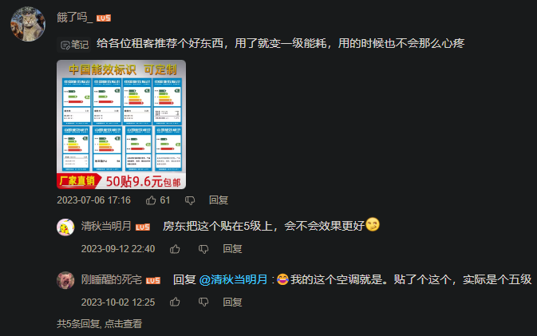
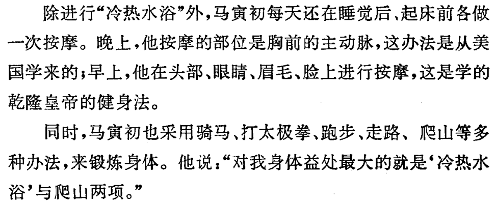
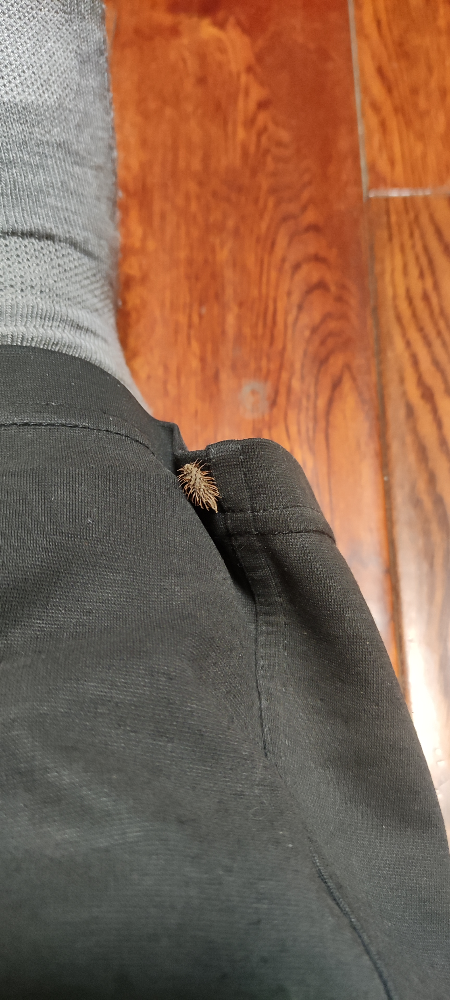

- 写作起因
	- ((66db8aae-8eca-4934-998d-2dc2f71d71e7)) 分类方法可以优化
	- ((66e57425-01dc-40e5-8fd5-1b4b607335cb))
	- 此处原为“（泛）理疗”，有一个按能量类型分类的底子
	- 看了一半 ((66f3bf0e-e80c-474a-9146-e0a6ae46da8f))
	- 每天操作电脑手机和在群里观察网友们操作的感触
	- 想起来了，也许还有 ((678a4deb-b03e-4ab1-aac0-918e0cfbb655))
	- ((66db8ac4-d558-458d-9528-499eb66f69ee))
	  id:: 670a354e-7d38-4bac-a678-ea7f3d35f3e2
- {{embed ((670a354e-7d38-4bac-a678-ea7f3d35f3e2))}}
- ((65bcbf46-9eca-44c6-9842-6dbff0831129)) 时间（饼图？）
	- 左人h椅（“人”落座下降为“h”椅的动图），右电脑/书桌——坐姿时间
	  id:: 66335beb-d683-4bb3-8475-a0f6349ffbc4
	- 走姿时间
- 人体部位的武器化描述
	- 电眼、唇枪舌剑、胸器、大宝剑、枪、电臀、龙爪手
	- ((67402ab0-a669-49c4-aebc-7a84c7444b5c))
- # 战斗，爽！
	- ((66db8ac0-85bf-442f-98ba-3fb8c01e4ea6))
- 《都是理疗》
  id:: 6689e5c0-3364-466c-a363-e2d55afab12d
  collapsed:: true
	- 分子不用接触、“贴贴”也能隔空反应，口服不过是走消化道和血管靠近罢了
	- 如果不同颜色的光都有其疗效（或伤害），那么电子屏幕上的五光十色应该也可以说是有疗效（或伤害），乃至不同内涵的信息对人的健康习惯等的影响也可以说是有疗效（或伤害）
		- 音乐、按摩、呼吸、光都有其频率
	- 如果运动算主动的理疗，那么静态“躺平”及其导致的睡眠应该也算“理疗”
	- 食物链靠前段的植物等生产者通过“理疗”生产食物链靠后段的消费者所需的营养、能源、原料——“人类社会也一样”，“消化是人类的宿命”
		- 食物可被视作是人类对陆地和水体“理疗”来的
	- ((630b6a7e-164d-44dc-82c0-8d7b4d794a4f))
	- “为什么要特殊对待口呢？你是会张嘴，但你也会眨眼”
- [【主义主义】气动一元论（2-1-1-2）——阿那克西美尼的哲学制毡术，气象万千之中隐藏的秘密_哔哩哔哩_bilibili](https://www.bilibili.com/video/BV1Mp4y1h735)
  id:: 65af09a6-e754-4291-a936-e3980c3bc0aa
  collapsed:: true
	- >这个制毡术，一直到康德的纯粹理性批判还在用。严格意义上来讲，后世所有的构造哲学，都采用了这种Felting的技法，其精妙之处在于这是一种自我构造的机制：凝结，这是理念自己把自己实体化的机制。
	- 洗护烘一体
- 人机融合、赛博格、身联网
  id:: 67bc32be-f5ee-428c-b7d7-b61e86db988c
	- [积极应对“身联网”时代挑战_澎湃号·政务_澎湃新闻-The Paper](https://www.thepaper.cn/newsDetail_forward_10490840)
	- [万物互联时代人的精神操练 - shekebao.com.cn](http://shekebao.com.cn/detail/6/25915)
	- 人机融合了吗？没融合吗？融合程度有差别吗？
- 在没有玩过传送门、半条命？如果两个系列拼一起，你既有传送门枪、坠落缓冲鞋跟、GlaDOS又有重力枪，实际上，现实中你就差不多有
	- 红警又可以拼
- “你可以挑你能的能能能能能”
- ---
- 以下各种“能”的划分受限于知识水平，尚未实现宏观、微观等的统一
- 肌肉动能、身体重力势能、筋膜弹性势能、冲量和机械效率、完全弹性碰撞、对手能量
  id:: 676e44cf-7adb-4917-8560-a57f0d84c9d0
- 内能
  collapsed:: true
	- [物理化学前瞻（1）——从内能到吉布斯自由能 - 知乎](https://zhuanlan.zhihu.com/p/460817420)
	- 空调
	  id:: 66ade371-c4ec-4825-8423-d3f3ffc279f7
	  collapsed:: true
		- “我的粑粑麻麻是地球生物圈的大罪人！”
		  id:: 66a0e78d-5633-4ebb-b7fd-a82b01d110c5
		- [Social and behavioral determinants of indoor temperatures in air-conditioned homes - ScienceDirect](https://www.sciencedirect.com/science/article/abs/pii/S036013232030559X)
		- 中老年空调使用习惯
		  id:: 66566fe8-9dcc-4052-bdcd-e8bc88ede481
		  collapsed:: true
			- [Air-conditioning usage behaviour of the elderly in caring home during the extremely hot summer period: An evidence in Chongqing - ScienceDirect](https://www.sciencedirect.com/science/article/abs/pii/S0360132323008557)
			- [Correlates of hot day air-conditioning use among middle-aged and older adults with chronic heart and lung diseases: the role of health beliefs and cues to action | Health Education Research | Oxford Academic](https://academic.oup.com/her/article/26/1/77/555995?login=false)
		- 空调相关的空气污染
		  id:: 66567003-80eb-4445-8d8d-04fb935dbe04
		  collapsed:: true
			- [Air-quality-related health impacts from climate change and from adaptation of cooling demand for buildings in the eastern United States: An interdisciplinary modeling study | PLOS Medicine](https://journals.plos.org/plosmedicine/article?id=10.1371/journal.pmed.1002599)
				- >这项研究研究了电力部门通过建筑物中的热驱动空调改造造成的未来与空气污染有关的健康损害的贡献。结果表明,如果没有干预,与空气污染相关的加剧死亡率中约有5%– 9%将归因于热驱动建筑电力需求中电力部门排放量的增加。该分析强调了清洁能源,能源效率和节能的需求,以满足我们对建筑冷却系统的日益依赖,同时减轻气候变化。
		- ---
		- 手动开关挂式空调：开盖，拿铅笔钝端、筷子等戳右侧小孔
		- 空调清洁
		  collapsed:: true
			- 玻璃和地面不注意清洁一般也没啥大问题，无非是玻璃采光差些、隔着玻璃视觉效果不够“真”些，地面 ((d04b86db-4172-4e10-a3e6-c55e9bfb6b7c)) 走了脚底容易黑，实际上搅不起多少灰尘被吸入，但空调就不一定了，就算自己没有用空调的习惯，家人也会用，而且也很可能被波及
			- 有点霉味就说明肯定需要清洁了
			  id:: 669a011a-0679-427b-9e55-4dd1849efe31
			- ((66cb1fae-cd70-47a2-8134-4a64cd6ab414))
			- 空调滤网等积灰不清洗也可能吹出更多成分复杂的 PM2.5 等加剧污染，造成鼻炎症状（“什么嘛，我说怎么有点鼻塞了，原来是我爸开空调了”）
			  id:: 66335c04-c658-4375-a237-2b09751998c9
				- [空调吹久会缺氧？PM2.5 会上升？真相都在这！ - 知乎](https://zhuanlan.zhihu.com/p/343932269)
				- 壁挂空调
					- [【橘帮帮家政】三分钟教会你如何在家清洗空调_哔哩哔哩_bilibili](https://www.bilibili.com/video/BV1GN4y1C7TP)
				- 中央空调
					- [一分钟了解「中央空调清洗」过滤网「清洗」方法 - 知乎](https://zhuanlan.zhihu.com/p/355456237)
					- 用毛巾清洁回风口扣板叶片的效率可能不高，因为受限于形状，一片扇叶的背面可能就需要一根（可能更多根同时擦也行，还没试过）手指擦拭上（大致是个平面）中（手指内扣）下（叶片下端）三个部位，擦到毛巾上一个点脏了就换点，最后沾去湿灰团
						- 毛巾重心可能影响手臂体力
					- 可能不如弯曲刷头的刷子省时省力（但刷子应该要多蘸水清洁）
				- 清洁剂、接水袋可能提高清洁效率
			- 增强过滤
				- ((665a7cc2-afef-414f-9036-23de8e09bb02))（空调当中低过滤效率的[[空净]]用，一定程度上也能当 ((66ade373-cd0c-496d-bc01-6dbe00ddfecf)) ）
				- ((66335bd5-e17c-4a43-9fd3-6e5e9c176983))
		- 租空调
		  id:: 664d406b-42d4-49c2-9f6e-c76bcbabe422
		  collapsed:: true
			- “租空调”有没有可能成为一个（好）生意？有的出租屋空调能耗比较大，可能一个月多花几十上百的电费（“那你开空调啊！”），要是能拆下来就放一边，用租来的空调代替，当然通风管和室外机可能也要匹配
				- [出租房是租空调还是买空调，或者是买空调扇？ - 知乎](https://www.zhihu.com/question/277385301)
				- [怎么看海尔空调的老版24位产品出厂编号？ - 知乎](https://www.zhihu.com/question/267821838)
				- [前两天最热的时候我家热得快炸了，那你开空调啊！_哔哩哔哩_bilibili](https://www.bilibili.com/video/BV19J411u7UL)
			- 进一步还可以加一些全屋低能耗改造（窗膜反光、门窗墙洞气密，可能还有隔热、除湿），还可以把换下来的空调租给有需要的还没空调的人（这里可能有点风险）
			- 这种“出租屋改造套餐”疑似可以有
			- >😂有可能，被别人调换跑路了怎么办
				- >押空调市场价70%，拆装费按次，租金按月单独收取，押金退租归还
				- 辨识真住户（“把租房合同和身份证拿出来！”）
				- 空调出厂编号
				- 还可以加防伪手段
			- 
				- [你们要的五级能效空调耗电量来了！出租房真实环境测评！房东最爱，租客噩梦_哔哩哔哩_bilibili](https://www.bilibili.com/video/BV1kN411S7r1)
		- [校长你什么时候装空调啊？ - 江畅 - 单曲 - 网易云音乐](https://music.163.com/song?id=416385850&uct2=U2FsdGVkX1+YaOjZ4Tk8SRr84T7DlN43lvzK61B225w=)
	- 暖气
	- 热疗
	  id:: 6651b5cc-40fc-4292-83ca-eeb6f73d2bf6
	  collapsed:: true
		- [Turning up the heat on COVID-19: heat as a therapeutic intervention - PMC](https://www.ncbi.nlm.nih.gov/pmc/articles/PMC7372531) #新冠
		- [Local hyperthermia benefits natural and experimental common colds. - PMC](https://www.ncbi.nlm.nih.gov/pmc/articles/PMC1836535/)（对于普通感冒，43度100%湿度空气鼻呼吸20分钟比30度的在症状得分上低/好约一半） #普通感冒
		- 热水淋浴
		  id:: 67402ab2-52c6-4988-9d0f-52808c2bbdab
		  collapsed:: true
			- 热/冷（凉）水交替淋浴
			  id:: 6653f6b8-3afe-4c4b-8a27-4c33efdb741d
			  collapsed:: true
				- id:: 6654133f-b0ae-4794-b800-f2ca95da880b
				  >可以试试热（一开始不高于45度）-冷水交替淋浴，热水淋浴也许能较慢地提升耐热能力，冷水淋浴除了至少短时间降温外，还可以从热天开始养成习惯，一直逐渐适应到冬天还能坚持，也许能提升耐寒能力
				- ((6694f148-f5b6-45a5-85d9-a16aba50e746))
				- 前几次淋浴，设置的最高水温不超过45度（达到45度后建议至少一周内不超过，之后不建议超过47度，更高也不一定能让你在气温30度时不出汗），并且用手在淋浴区测试实际的最高水温是否尚可接受（手一般相对耐热），然后再开始淋浴
					- 《以防比我更莽的人乱来》：我最高是50度淋浴，从48度直接跳到了50度（因为热水器设置里正好就没有49度了——“再按一下就直接跳到55度辣！有愣头青要去医院试试看吗？”），燃气热水器在厨房，离卫生间有段可能降温的管道距离，只短暂淋了过半部位，手背因为洗七天没洗澡的油头淋的时间长些，洗完后就有些手软、抓握能力下降了，还微微有些疼，倒是好像没怎么影响睡眠，花了几天恢复
					  id:: 6695b280-3071-4f8c-97d7-a3c10cf80a9d
				- 先从习惯的温度开始逐渐升温升到能耐受的温度（大部分非即热式热水器是逐渐升温，一般可直接调到目标水温），然后再逐渐降温到能耐受的温度，适应后可逐渐精简调温过程，比如一开始就是最高温，然后立刻就是最低温
					- 在此期间，可以中断淋浴以完成清洁工作，尤其是需要使用洗发水、沐浴露等时
					- 或者，在天热时也可以单独热水淋浴，如果你担心冷水淋浴影响后续散热
					- 注意避免较热的水直接淋到眼部（有需要可以戴泳镜，注意闭眼，以免意外漏水）、外生殖器等敏感部位
					- 水温较高时，较长时间淋到的部位（比如上背部）也可能之后会有较长时间的轻微痛感
					- ((675bb975-a995-45e7-bc0a-4abe673bda88))
						- 建议六个月内有备孕/生育、 ((6654595e-f6ee-43c0-80a4-0545148fda4c)) 等需求的男性尽量减少较热的水直接淋在阴囊上
							- ((665426a7-b2e0-4964-b016-92c16399ee88))
				- 一般热/冷交替一次即可，有需要可增加交替次数
				- 之后可逐渐增加最高水温
				- 白天可只洗冷水澡
				- ((6653f855-cffa-4a38-8377-6c86cb5b773a))
				- [My 7-Day Experiment with Hot/Cold Contrast Showers for Recovery](https://www.nifs.org/blog/my-7-day-experiment-with-hot/cold-contrast-showers-for-recovery)
					- [Cool New Research On Cold Thermogenesis. - Ben Greenfield Life - Health, Diet, Fitness, Family & Faith](https://bengreenfieldlife.com/article/fat-loss-articles/cool-new-research-cold-thermogenesis/)
					  id:: 6653f728-2ac2-423a-b9bc-b771906be107
				- [马寅初长寿的三个秘诀_游泳](https://www.sohu.com/a/473400978_483111)
				  id:: 66547749-1f6b-4c26-8436-e6c497422658
					- [马寅初养生秘诀：内养外练](https://jnyb.zjol.com.cn/images/2022-04/14/jnyb2022041400013v01n.pdf)
					- [坚持洗冷热水澡，是怎样的舒爽体验？ - 知乎](https://zhuanlan.zhihu.com/p/536639053)
						- >我的抵抗力、免疫力应当是较好的，尤其是皮肤的自我调节、适应温差能力，强大到可以：一年四季不更换被褥，走南闯北不增减衣服。因此，我出差非常简单，只带一个双肩包、装上少许物品，就可以从南到北、从东到西，出去一两个月，都不用补给物资。
					- [享“中国人口学第一人”美誉，马寅初子孙后代今何在？](https://baijiahao.baidu.com/s?id=1621555035079517318)
					- [马寅初被捕前后——一个经济学家的政治选择-清华大学校史馆](https://xsg.tsinghua.edu.cn/info/1004/1810.htm)
					- [马寅初养生四“从容”--健康·生活--人民网](http://health.people.com.cn/n1/2018/0824/c14739-30248572.html)
					- 
		- 热水浸泡
		  collapsed:: true
			- [Short-term hot water immersion results in substantial thermal strain and partial heat acclimation; comparisons with heat-exercise exposures - ScienceDirect](https://www.sciencedirect.com/science/article/abs/pii/S0306456521000656?via%3Dihub)
			  id:: 66567715-6bed-43b5-a8c0-8c4b25157e7e
		- 热空气浴
		  collapsed:: true
			- 更高温度的“空气浴”
			- 桑拿/汗
			  id:: 66335bd5-8ede-4627-a031-6b602d049970
			  collapsed:: true
				- 等于被动出汗加刺激更多的更高温度？
				- [冬季蒸桑拿降压防老痴，但两类人要小心，不能蒸！--健康·生活--人民网](http://health.people.com.cn/n1/2017/1227/c14739-29730773.html)
				  collapsed:: true
					- >建议患有慢性疾病与心脑血管慢性疾病的女性，如高血压、低血压、心肌梗塞等，谨慎蒸桑拿。而且，在温度变化较大的天气里，体质比较弱的女性和老年女性也最好少蒸桑拿，以避免由于温差过大所引发感冒和呼吸道疾病。
					- 糖尿病患者
				- 车内蒸桑拿
				  id:: 6669611d-3fc4-4c1e-a2d0-eed20a668838
				  collapsed:: true
					- “（可能的）灵感来源”：当时没完全搞定、现在不着急的 ((6658475b-8d23-41eb-992a-df196913c08f))
					- 可能夏季关门窗10分钟左右就可以进去蒸了
						- 第一次蒸可以从一开始就在车内，以便逐渐确认安全和适应
					- 从温湿度组合看，更接近“汗蒸”
					- ((66861aef-7ccf-40d3-a8ce-a1505cf077ad))
					  id:: 66861aef-7ccf-40d3-a8ce-a1505cf077ad
					- [在汽车里面蒸桑拿出出汗可以不？_百度知道](https://zhidao.baidu.com/question/2060188575871909507.html)
					- [【实测】夏天的车内温度到底有多高？](https://www.sohu.com/a/105520051_349134)
					- [夏天车内温度到底有多高，你亲自测过吗？-搜狐汽车](https://auto.sohu.com/20160805/n462721938.shtml)
					- [夏天，坐在白车里真的比黑车凉快吗？快来看看咱许昌人的测评……_懂车帝](https://www.dongchedi.com/article/6573925960633025032)
					- [大巴车里蒸桑拿，真·桑拿 - 知乎](https://zhuanlan.zhihu.com/p/433694552)
					- “ ((6629b497-2550-4ada-a75e-9c82972f8ed4)) 呢？”
				- 开窗控制温湿度（？）
				- [Sex differences in adaptation to intermittent post-exercise sauna bathing in trained middle-distance runners - PMC](https://www.ncbi.nlm.nih.gov/pmc/articles/PMC8302716/)
				- [Why Saunas Can Build Muscle, Boost Endurance, and Increase Strength | BarBend](https://barbend.com/saunas-strength-endurance/)
				- [Sauna for Heat Acclimation: Benefits and How to Do It](https://pursueperformance.com/heat-acclimation-sauna)
				- [蒸桑拿对身体有什么好处？桑拿有益健康背后的原理](http://www.chinalowcarb.com/sanna/)
				- [洗桑拿会不育吗？| 果壳 科技有意思](https://www.guokr.com/article/201892/)
				  id:: 665421f4-7ae5-49e1-9d16-6ad28e5b1a10
					- [Seminal and molecular evidence that sauna exposure affects human spermatogenesis | Human Reproduction | Oxford Academic](https://academic.oup.com/humrep/article/28/4/877/653255?login=false)
					  id:: 665426a7-b2e0-4964-b016-92c16399ee88
				- ---
				- [How Hot Is a Sauna? The Complete Guide To The Best Sauna Temperature](https://sportrevup.com/best-sauna-temperature/)
				- [Poika Saunoo - Poju - 单曲 - 网易云音乐](https://music.163.com/song?id=27949688&userid=77770261)
				- ---
				- [真正的中医角度看汗蒸：常识往往是错的，我们生活在一个营销的世界_哔哩哔哩_bilibili](https://www.bilibili.com/video/BV1kM4y1P75U)
				- [程凯养生说：湿气缠身,蒸桑拿可以祛湿利湿吗？_哔哩哔哩_bilibili](https://www.bilibili.com/video/BV1Pg411G7Bh)
				- 研究表明，芬兰桑拿可以提升生长因子、运动耐力和热耐受力，等等，比汗蒸好像温度高些、湿度低些，但是看好像一些中医类视频不推荐经常汗蒸，可能是不推荐大量被动出汗，请问应该如何取舍？
					- 是不是要配合运动（运动后蒸）比单独蒸要好？还是说进一步出汗更坏？
				- [中医对桑拿如何看待？ - 知乎](https://www.zhihu.com/question/387492687)
				- ---
				- [【文化观察】从芬兰的桑拿文化中 窥探到西方的性价值观 【主线9.3】_哔哩哔哩_bilibili](https://www.bilibili.com/video/BV1be4y1n7Lr)
			- ((66a21d83-fbb1-479e-8cc8-13501ac4c017))
		- [[射频]]
			- 热玛吉
				- [热玛吉（美容项目）_百度百科](https://baike.baidu.com/item/%E7%83%AD%E7%8E%9B%E5%90%89/183211)
				- [烤肉一样的热玛吉，真能让人青春永驻？_澎湃号·政务_澎湃新闻-The Paper](https://www.thepaper.cn/newsDetail_forward_22101807)
		- 热天边 ((65a9d480-f240-4ff5-9072-8ed1d4e334d6)) 边运动能达到类似效果吗？
		- 禁忌、风险
			- （突然接触温度过高的）桑拿与鼻炎、嗅觉丧失？
	- 冷疗
	  id:: 6651b2fd-3d2d-4917-a8ba-2a492419c22e
	  collapsed:: true
		- ((668ce787-9cb1-4ad7-860a-6aeaf021f434))
		- ((66236190-211b-4686-81e3-35a32cd8773f))
		- 冲凉/冷水淋浴
		  id:: 66335bd5-1bf3-4d00-bd31-9460e5b62dca
		  collapsed:: true
			- “直接来吧！”
			  id:: 66ade371-fee1-4650-805e-ce6920f1b442
				- 要有随便按下核按钮的魄力、威慑力
			- 至少一开始注意避开额头到后脑勺、眼部、外生殖器等敏感部位
			  id:: 675bb975-a995-45e7-bc0a-4abe673bda88
			- ((675bb96a-0575-42f6-8a48-33e59b3eeea9))
			- ---
			- ((6666444b-1024-4a45-b6a8-13e94b9eedee))
			- [过去一年坚持洗了365天冷水澡的男人，最后怎么样了？_澎湃号·湃客_澎湃新闻-The Paper](https://www.thepaper.cn/newsDetail_forward_3662080)
			- ((65bcbf47-70c7-4c8d-a215-83623a0187b6))
			- 毛泽东
			  id:: 66506513-2e8a-492c-ba30-9bfcbc1f11eb
			  collapsed:: true
				- [毛泽东的体育强国梦](https://www.dswxyjy.org.cn/n/2015/1026/c222139-27741712.html)
				  id:: 668ce769-655e-445b-8848-d2b3d7f8783b
					- >有的同学见毛泽东如此执着地坚持冷水浴，好奇地问：“冷水浴到底有些什么好处。”毛泽东说：“冷水浴的好处，一是可以锻炼身体，能够促进血液的循环和增强皮肤抵抗力，有助于筋骨强健。二来可以练习勇猛和不畏。冬季天气严寒，清晨起来就把冷水一桶一桶往身上泼，没有点勇气的人能做到吗？”
					- >在延安时期，任弼时就感慨地说：“毛泽东同志有这样强健的身体，真是我们党的一大幸运。”
				- [风浴、雨浴、自然浴……毛泽东为何有“麓山情怀”？_腾讯新闻](https://new.qq.com/rain/a/20210423A0CF7X00)
				  id:: 66514c17-71c5-414b-bc66-8b9d197d745c
					- “空气浴”在场地上比较接近 ((66335bd5-a05e-4386-8254-08c16ec72977))
					  id:: 665158a2-c501-48d0-950a-0b892193a4eb
					- >1917年4月1日，毛泽东在进步杂志《新青年》上发表了“体育之研究”文章，介绍了他采用的体育锻炼项目：有“日光浴、风浴、雨浴、冷水浴、游泳、登山、露营、长途跋涉以及体操和拳术等”，他认为这些方法，既锻炼身体，也锻炼意志。他还在日记本上写道：“与天奋斗，其乐无穷!与地奋斗，其乐无穷!与人奋斗，其乐无穷!”。
						- 在切近原文背景后，对三个“其乐无穷”的解读可以是有层次的，不先与天（站那躺那就行）地（需要跋山涉水）奋斗，怎么与人奋斗？
				- [毛泽东一生中，有两个锻炼身体的方法，你能做到吗？|李维汉|李银桥_网易订阅](https://www.163.com/dy/article/G72QVGA70543HJK3.html)
				- [毛泽东在湖南一师的八年岁月--党史-中国共产党新闻网](http://cpc.people.com.cn/n1/2024/0407/c443712-40210604.html)
				- [猴子石缴枪_百度百科](https://baike.baidu.com/item/%E7%8C%B4%E5%AD%90%E7%9F%B3%E7%BC%B4%E6%9E%AA/17179526)
			- ((66a21d83-fbb1-479e-8cc8-13501ac4c017))
		- ((6653f6b8-3afe-4c4b-8a27-4c33efdb741d))
		- ((664f4245-097c-46f8-be76-5b96958ef946))
		- 注意或禁忌：心脏病、甲减、免疫低下？
		- [Health effects of voluntary exposure to cold water – a continuing subject of debate - PMC](https://www.ncbi.nlm.nih.gov/pmc/articles/PMC9518606/)
		  collapsed:: true
			- 白色脂肪转化为“燃脂”发热量大得多的棕色脂肪
			  id:: 6653f2b6-0ed5-42d8-a978-032ae8432312
			- [How do women feel cold water swimming affects their menstrual and perimenopausal symptoms? - PMC](https://www.ncbi.nlm.nih.gov/pmc/articles/PMC10928965/)
				- >1114名妇女完成了调查。妇女报告说,冷水游泳可以减轻月经症状,特别是心理症状,例如焦虑(46.7%),情绪波动(37.7%)和烦躁(37.6%)。围绝经期妇女报告焦虑症(46.9%),情绪波动(34.5%),情绪低落(31.1%)和潮热(30.3%)显着改善。大多数有症状的妇女专门游泳以减轻这些症状(周期为56.4%,围绝经期为63.3%)。妇女说,她们认为冷水的身心影响有助于她们的症状。对于自由文本问题,确定了五个主题:水的镇定和情绪增强作用,陪伴和社区,时期改善, 潮热得到改善,整体健康状况得到改善。
		- [Effects of cold water immersion and active recovery on hemodynamics and recovery of muscle strength following resistance exercise | American Journal of Physiology-Regulatory, Integrative and Comparative Physiology](https://journals.physiology.org/doi/full/10.1152/ajpregu.00151.2015)
		- [Cold water immersion attenuates anabolic signaling and skeletal muscle fiber hypertrophy, but not strength gain, following whole-body resistance training | Journal of Applied Physiology](https://journals.physiology.org/doi/full/10.1152/japplphysiol.00127.2019)
		- [The science behind ice baths for recovery - Mayo Clinic Press](https://mcpress.mayoclinic.org/healthy-aging/the-science-behind-ice-baths-for-recovery/)
		  collapsed:: true
			- [The Effect of Cold Showering on Health and Work: A Randomized Controlled Trial - PMC](https://www.ncbi.nlm.nih.gov/pmc/articles/PMC5025014/)（从任意时间的温水淋浴开始，然后换成）
			  id:: 6653f855-cffa-4a38-8377-6c86cb5b773a
		- [The Cold Hard Truths About Ice Baths and Muscle Recovery | BarBend](https://barbend.com/cold-hard-truths-about-ice-baths-and-muscle-recovery/)
		  collapsed:: true
			- >Don’t have enough ice? Some studies suggest that cold water alone, without ice, with water temperature of 60-70 degrees fahrenheit may have the same response as colder water.
		- [Do Ice Baths Actually Improve Muscle Recovery? Read This Before You Try It Out : ScienceAlert](https://www.sciencealert.com/do-ice-baths-actually-improve-muscle-recovery-read-this-before-you-try)
		- [研究发现：适当冷水浴有助于增强免疫和减肥_腾讯新闻](https://new.qq.com/rain/a/20211008A0ASFG00)
		- [健康小知识：有关冷水浴 你可能想象不到的益处 - BBC News 中文](https://www.bbc.com/zhongwen/simp/science-56946618)
		- [南京小孩雪地“裸训”直哆嗦！为啥日本小孩不怕冷？](https://www.sohu.com/a/57964531_349974)
			- [14个娃南京雪地“裸训” 最大仅6岁 -新华地方联播-新华网](http://www.xinhuanet.com//politics/2016-02/02/c_128693085.htm)
- 化学能
- 机械能
  collapsed:: true
	- 清洗
	  id:: 66a02fcc-d653-4300-bbdf-7510a676ccdf
	  collapsed:: true
		- 洗手
		  id:: 65f6b5ae-6603-4191-982d-39cf7966edd2
		  collapsed:: true
			- 七步洗手法
			  id:: 65f6b5b0-b4c7-4208-a963-3ffb77f4f228
				- TODO 洗湿面粉比乱洗更好？
		- 洗鼻/漱喉漱口/洗眼
		  id:: 65c6e42b-6658-42f0-ab39-6ba63d4672ec
		  collapsed:: true
			- ((676e0da0-064f-40b0-b577-56a1322a014e))
			- 洗液
				- 盐水
					- 盐
						- 非急性期可用0.9%的等渗/生理盐水（可买配好的成品或相关医用盐，也可用“日晒海盐”细盐等无添加碘和抗结剂的盐），急性期可用最高2~3%的高渗盐水
						- 盐如果是一大袋，建议放在宠物不易接触到的地方（不放在地面）
						- 500毫升0.9%需要4.5g盐，一盐勺（5g勺）略少
						- 先放盐，倒水就搅拌加速溶解了
					- 水
						- 合适的水温范围大致为32-40度
						- 冷却
							- 只有热水时一般可用凉水壶冷却，也可用 ((677de833-3921-4d03-bd61-e02f1dddd988))
						- 加热
							- 洗鼻瓶可能过高无法竖着放入微波炉加热，旋上洗鼻喷管和喷头横着也会经由喷头漏水，但可以用喷头边抵着（平板）微波炉内壁，关门时别震倒即可加热
								- 如果是转盘微波炉，应该可用东西抵着
								- 但不推荐长期用塑料容器加热
									- ((66db8ac2-d48e-448b-b1a0-42f396d0fbf1))
							- 预先用或倒入其他容器
						- 测温
							- 可以用手试，手觉得温而不算很热的话，差不多就是合适的
						-
							- 有足够冷水可以按比例先加冷水再加热水
								- 温度算一下，几成、百分之多少的凉水和热水乘以各自的温度，然后两者相加就差不多是，比如（无供暖取暖）冷却充分的凉水15度，洗鼻瓶500毫升，倒入七成（70%）到375毫升刻度，再倒125毫升开水到500毫升（多些少些不影响），水温差不多就是36.25度（15×0.75+100×0.25=36.25），够了
				- ---
				- 聚维酮碘次氯酸我还不太习惯
				- 
				  id:: 65ea6b29-ec60-408d-ba41-4e8db1bb765f
			- ((65bcbf49-3b29-4343-8528-fb32f56435fb))
			- 洗鼻姿势：低头（水龙头如果碍事可以转一边去），左转或右转头，喷口抵住鼻孔（否则损失冲洗动能和洗液），两手在鼻孔偏向的一侧反握洗鼻瓶
			  id:: 67402ab2-0642-486a-9fc1-eea20c52f708
			- 开始水速/流量小些，不排除不确定水温是否偏高
			- 洗接近一半后换鼻孔，还剩一些时挤出漱喉漱口
			- ---
			- TODO 弹舌算漱喉吗？（“练SLS练的”）
			  id:: 66027fd6-8732-48c9-8957-b5b363e09a94
				- [Seth Riggs - Speech Level Singing （28p 中英双字） | p2 弹舌1351354275421_哔哩哔哩_bilibili](https://www.bilibili.com/video/BV1MF41177xd?p=2)
				  id:: 669c535e-a895-4f9d-9c1e-5d70a6b2e77a
			- 快[[呼吸]]算“空气洗鼻”吗？
			- [网上的一些耳鼻喉医生为什么有说洗鼻反而不好的说法？ - 知乎](https://www.zhihu.com/question/61984593)
		- ((66335bd5-1bf3-4d00-bd31-9460e5b62dca))
		- 浸泡
		  collapsed:: true
			- 补镁等
			- [[泡脚]]
			- 泡澡
		- 水浴
		  id:: 65bcbf46-01e7-4853-85fb-739d0a437abf
		  collapsed:: true
	- 近身
	  collapsed:: true
		- [[呼吸]]（“吐纳”；不止腹式呼吸按摩内脏，鼻呼吸也可能算是按摩呼吸道）
			- 有可能增强鼻腔纤毛划水免疫功能吗？
			- 倒吸一口冷气
			- 毒气
		- [[导引]]
	- ---
	- 内练一口气，外练筋骨皮
	  collapsed:: true
		- 也有“内练精气神”
		- 一
			- 专一、专注、优先
				- id:: 66caabc0-764c-4ba4-b2fb-3493e4a2c89b
				  >蚓无爪牙之利，筋骨之强，上食埃土，下饮黄泉，用心一也。
					- “‘蚓以为鉴’是吧？”
			- 整全、整体
				- ((66ade371-677a-48bd-9a9f-a5efdcf1a4e7))
			- “一的法则是吧？”
			- ((66a30160-d9e3-4b11-ae9d-d6f58e63f9a7))
		- 口
			- 言语
				- 唇语
				- 发声
				  collapsed:: true
					- id:: 66bd4669-fd6c-40c8-92e1-751ffc785924
					  >说话！——宋老虎
					- [[英语]]
					- ((668ce769-a103-499b-8779-51271bbef55a))
					- 电话
						- ((6778d442-577e-44ad-9839-b08dd6bb81bf))
						- 免打扰
							- 电话设置状态
								- >我在打八段锦——我爸
						- [挂电话时说再见好还是说拜拜好呢？ - 知乎](https://www.zhihu.com/question/28974239)
						  id:: 66dab9f0-911f-4a27-8aad-f8968e915977
						- 好的，拜拜，再见
					- 口哨
					  id:: 679adcbf-15b1-4330-bd6c-940b66792da3
					  collapsed:: true
						- “门牙缝口琴是吧？”
					- 哼哼、哼歌、怪声
					  id:: 66a89a9f-2ab1-439e-83de-960f2d04214a
					  collapsed:: true
						- 通过发声振动按摩内部，不同声音不同频率
						- 六字诀
						  id:: 66db8aae-12a7-4ed9-94cf-0788f26a9444
							- [负重六字诀气功对心肺功能的影响。,Medicine - X-MOL](https://www.x-mol.com/paper/1629332714024943616/t?adv)
					- “bu”振动嘴唇
					- 可配合 ((66a05623-8b2f-4158-ac53-a79988d92f76))
					- 笑声
					  collapsed:: true
						- 罐头笑声
						  id:: 63bc2109-248e-4d11-a583-d91f3832fdf2
							- “爸！你的手机怎么笑个不停啊？！”
							- [私人笑声_哔哩哔哩_bilibili](https://www.bilibili.com/video/BV1CK421C7nV)
							- [我用答辩音效做了一首答辩歌_哔哩哔哩_bilibili](https://www.bilibili.com/video/BV17R4y1U7XN)
							- [地狱32秒😈_哔哩哔哩_bilibili](https://www.bilibili.com/video/BV1RU4y1c7Ro)
							- [这个视频你绝对不敢公放🤣_哔哩哔哩_bilibili](https://www.bilibili.com/video/BV14E421T7f6)
							- 恼人的罐头笑声是为了隔离其他人给用户制造信息茧房？
								- 强迫跟着笑（“否则恰恰自己听起来就很蠢——我得融入圈子”），吸引人过去看或蓝自己的对冲，还阻碍隔阂
								- “不与吸烟者交朋友，难帮其戒烟”
							- 罐头笑声与 ((67402aff-e09d-463d-891d-5b5408423db0))
		- 气
			- [[呼吸]]（内部按摩）
			- 气质
				- >腹有诗书气自华
		- [[筋膜]]（道路养护）
		  id:: 66335bd5-9c84-4f31-816a-934f4ebc5024
		- 骨骼
			- >骨骼营养素：K2、D3、钙、镁、钒、硼、锶，等等，国外不少补剂
			- 骨骼与钢筋混凝土，虎骨
			- 牙齿
				- “笑不露骨”
			- ((669c8352-c660-454b-96c2-9e5ba60bdc84))
			- ((669c6f67-3188-423e-9f83-3cc0b4584f2c))
			- [「骨科时间」手术技巧汇总篇](https://mp.weixin.qq.com/s/z8HNCaCbaCE1ig1x3Cn7Mg)
		- ((668ce76a-ab1c-4f7f-b997-85e0d03c3f2d))
		- 没必要一味追求肌肥大
	- ((66a35781-89d5-45c7-b38b-dd0dad1bafd7))
	- 挤
	- 抚摸
	  collapsed:: true
		- ((66ff4c22-f32c-4d82-b741-dff449320767))
		- 摸气
		- 划屏
		  id:: 6ae1cea3-0133-4eae-934e-22ceaee1287f
		  collapsed:: true
			- ((66db8aba-9b5b-40bf-bfb3-75588e6ceca0))
			- 花瓶
			- 划水
		- （赤足、第七部手触地）爬滚打（？）
	- 挠痒
		- [挠痒痒为什么“痛并快乐着”？Science重磅研究：挠痒加剧皮肤炎症反应，但能抵抗细菌感染，背后是两大系统的“合谋”](https://mp.weixin.qq.com/s/e5_a8Nqqeq645xQ4NYK8tw)
	- 抓握
	  id:: 678b0492-e421-4a09-abf6-3a1cc277d051
	  collapsed:: true
		- >阶级斗争，一抓就灵
		- ((66ade371-3078-4a62-8a59-64d43f5a608b))
		- 握拳
			- ((6699a55c-b162-477f-8078-8d9a02f1afec))
			- ((66f54c7a-4e2b-4a91-8440-f29f0633f1e1))
		- ((66f4b1b8-f144-4606-a0ee-ee4aee90f0b8))
		- 拿捏
		  collapsed:: true
			- 拔罐
			  id:: 66f3526b-4989-4605-bde2-352d897de7cd
			- 穿刺
				- 针灸
				  id:: 66ac888e-daee-43a0-8264-72bf8c16d2eb
				  collapsed:: true
					- ((668ce730-8c1e-4d16-b731-90aa568cf006))
					- [百年三晋医学人物之——赵缉庵（赵缉庵针灸按摩真传）书评](https://book.douban.com/review/16165903/)
				- 注射
					- 输液
				- 放血
				- ((66db8ae1-35c6-4787-a4c3-5ab93eb30a3d))
		- 挑拨
		  collapsed:: true
			- ((66f3bf0e-e80c-474a-9146-e0a6ae46da8f))
			- 拨弦
			- 按钮/按键
				- 鼠标点击
	- 搂抱
	  collapsed:: true
		- 拥抱
		- ((66f609f4-26e6-4f91-8077-eb1fb8aaa06c))
	- 亲吻
	  collapsed:: true
		- 吮吸
		  id:: 678b0492-e8fb-4e60-b230-2d551da07a5c
			- ((66f3526b-4989-4605-bde2-352d897de7cd))
		- [家里有孩子的注意了！“致命之吻”害死一个，爱孩子可别这样了](https://mp.weixin.qq.com/s/ve8O1RBSssIo-nvJS6DJjQ)
		  id:: 679191a7-c4d9-44e1-a667-680e324876b9
	- 呼气
	  collapsed:: true
		- 吹气
			- [[风]]
				- 风扇
				  id:: 67402ab2-1e8a-4d0a-bc30-8a0c6be79901
			- ((678c9d15-adb9-4c0c-8063-0f7f58696996))
			- 通气
	- 咬
		- 乳房
	- ((67402ab2-fafb-448f-b9ad-8a9f7403c244))
	- 吞咽
		- 言语
			- [浅谈舌骨、进化与语言 - 知乎](https://zhuanlan.zhihu.com/p/412576082)
		- 口号
	- 拳，圆点/bullet，折叠；掌，展开
	  collapsed:: true
		- 交手，握手
		- ((65bcf627-e061-4bad-aa44-14171d6064bc))
		  id:: 66f55fb3-a673-4c13-bfef-c254a75f482d
	- ((669c6f67-3188-423e-9f83-3cc0b4584f2c))
	  collapsed:: true
		- 比导引快，可能接触外物
		- ((661d1152-687a-4ffb-9f85-28869282adbf))
		- ((66db8ac0-684c-4c65-8627-3e030afd0355))
	- 撞击
	  id:: 66f35227-3709-4550-9406-8b3eeeb75f45
	  collapsed:: true
		- 拍打
		  id:: 66db8aae-59bb-4448-82f0-668e2f8e4b58
			- 拍脑袋
				- “这下拍脑袋了”
			- [拍打八虚(1)_哔哩哔哩_bilibili](https://www.bilibili.com/video/BV1CD4y1n7Yt)
			- ((66f018d4-2fcb-4ebd-92e2-5eade458fc8d))
			- ((667ff35c-b670-40ff-a7d6-7ec60d094909))
			- 拍膝盖
			  collapsed:: true
				- {{embed ((65af09a6-81d0-42c4-b961-94c887a82549))}}
			- [失眠与心脏病拍打拉筋临床报告](https://mp.weixin.qq.com/s/kSKgkDP77ao44tZydRjsOw)
			  id:: 6784b0e3-428d-4b8f-8fee-e9d2bbb2f46a
			- ((66db8abc-f0ac-4912-8b38-7861ddd4a036))
			- 挥拍
			  id:: 66f4b1b8-f144-4606-a0ee-ee4aee90f0b8
			  collapsed:: true
				- “不拍人体也是拍”
				- [排名第一的长寿运动竟是它！研究发现：这几种运动延寿效果好，你练对了吗？](https://mp.weixin.qq.com/s/sEktEoI1-A_231cZGanYqg)
				- ((66db8ab0-e6de-49e9-a137-36d56f80f7b9))
				- ((66f4ac7f-846d-4a78-9f45-df4bf35d92e0))
				- ---
				- ((67402ab2-b658-4500-a11c-eb438227a692))
				- ((669c6f67-cdd2-483f-850d-14dbdb988cef))
				- [[陀螺]]？
		- 拳击
		  id:: 66f54c7a-4e2b-4a91-8440-f29f0633f1e1
		- 撞树
		  collapsed:: true
			- “老裆易撞”
			- [公园大爷为什么爱撞树 - 知乎](https://zhuanlan.zhihu.com/p/100432313)
			- [[筋膜]]？
		- 体外冲击波
		  id:: 65ae08cc-ca69-4db1-acb9-002296b75a65
		  collapsed:: true
			- [髌腱炎做冲击波治疗是种什么样的体验？ - 知乎](https://www.zhihu.com/question/28759866)
			  id:: 65af09a6-6740-42af-bc41-2a59c9313d8d
			- [气压弹道发散式冲击波历史发展回顾 - 知乎](https://zhuanlan.zhihu.com/p/161576191)
			- [瑞士Storz Medical AG医用气动弹道式冲击波治疗仪系统 - 上海涵飞医疗器械有限公司](https://www.hanfeiyl.com/product-i14312.html)
			- TODO 有没有可能低价替代？
				- ((65af09a6-6740-42af-bc41-2a59c9313d8d))
					- 
					  id:: 65af09a6-81d0-42c4-b961-94c887a82549
					  collapsed:: true
						- [经常拍打膝盖，竟然有这3个好处！看完赶紧做起来 - 知乎](https://zhuanlan.zhihu.com/p/398443069)（“小心轻拍”）
						  id:: 67402ab2-9444-4bf3-83bb-2293d08e8178
				- ((66db8aae-59bb-4448-82f0-668e2f8e4b58))
				- ((66f35227-3709-4550-9406-8b3eeeb75f45))
				- 八部金刚功第八部
	- 表情
	  collapsed:: true
		- 皮笑肉不笑
		- ((66db8abc-fffb-4a6f-b6be-f3ae2060610e))
			- ((66db8af3-f59e-48e2-94c1-e2582a474fb3))
	- 转眼
	- 闭眼
	- 睁眼
	- 手印
	  collapsed:: true
		- 快捷键
		- ((66db8af3-113a-449e-bd64-c1ad4b445d70))
	- 召唤
	  collapsed:: true
		- 招募、交友
	- 划屏幕，抓握鼠标，按摩键盘，扫视屏幕，聆听音箱
	- 远程
	  collapsed:: true
		- 声打
			- ((626614b8-5064-4c3c-b654-fc85a8f950fb))
			- 说出对方名字
				- “盒武器入门是吧？”
				- ((66dba0bd-fc98-4c2b-a2ea-25bbeeb16bfd))
		- 窃听
		  id:: 67402ab2-a335-4e08-858e-bd5cb699d52d
			- ((67048a59-9342-4cb1-bcdd-04da32ac609f))
			- [窃听技术进化史：从收音机到激光和网络_手机新浪网](https://tech.sina.cn/it/2013-06-25/detail-iavxeafs3459743.d.html?from=wap)
			- 衣物附着窃听器“苍耳（子）”
			  id:: 675e33fa-684f-41a5-a9bb-e5c6328c6821
				- >如果有柯南那样的窃听设备，就可能减少现阶段的疑问，可以弹弓、投掷或擦肩（“你们不要再打啦！”）附着在衣物上，遥控或智能识别环境脱落并发出定位信号，名字先想好了，苍耳（子）
					-  [[20250117]]
				- 也可用额外的魔术贴等伪装
				- 衣物里面就更好藏了，衣服下摆，好像没多少人熟悉自己衣物的内袋
				- ((675e35e1-e2be-4ecd-a047-d5fe6b1d3a2a))
				- “未聪子”
	- 空间用于存储信息很方便，所以
	- 观摩
	- 导引，移动，击打（武术）
	- ---
	- 其他生物如何利用人类的意识形态进攻？
	- 立体机动装置，可以短时间打开多个传送门并快速穿梭
	  collapsed:: true
		- ((66dba0bf-d20e-4293-850d-e6e762df732e))
			- “[[]]开门，小子”
		- ((66dba0bf-b2ee-4125-a49b-300fc5031c0b))
		- [[爬树]]
	- 操作机械、电子和网络、ai等部分的速度就很重要
	- 不同的魔法可以切入不同的网络空间
	- 这是一个人类得以接近光速交手的方式
	- 养殖，豢养，驯化（“人类早期驯化”）——一起吃
	- 疾病
		- 血网性津
	- 媒体，传播，登高而招，顺风而呼
	- “不喜欢”也能传播，“喜欢”也能传播
	- 电视与出版（上世纪书天花乱坠），电脑与自媒体
	- 脑内未来预测模型路径攻击，意识形态，意识斩，古武流，不敢碰按钮，成分党，“成分不好”
	- 家庭矛盾，“青春期”、“叛逆期”，自我实现预言
	- 很多人已经嵌进去出不来了
	- “钞能力”，“焯能力”
	- 批斗，全体当众批评，绑架群体批判个体，杀鸡儆猴
	- 批处理
	- 知识就是力量，而且是一种魔法力量
	- 破四旧古董字画换食物
	- 健康不光是“下班运动”，还受上学上班影响
	- 时间、金钱、效率、生命的概念——时间就是金钱，效率就是生命
	- 穿戴（耳环，针灸穿刺），包裹（子宫、阴道），包扎——形象遮蔽误导诱导——“我需要她！”
	- 攻击对方的预测使其误判
	- 可以同时与所有人战斗，天人交战
	- “销售费用”，来源于贷款和剥削
	- 取决于获得钞的来源，即便是全世界，也是无力的
	- 不需要贷款的力量，人本身就有
- 辐射能
  collapsed:: true
	- >山东菏泽曹县，牛逼666，我的宝贝
	- 晒太阳
	  id:: 65a9d480-f240-4ff5-9072-8ed1d4e334d6
	  collapsed:: true
		- “是的，我们还有个 #小太阳美背俱乐部 ”
			- ((659b89ca-598a-4948-a6c3-0b9a1dad7464))
			- [（逛街小曲）瑞士人身体抗造不怕蜱虫_哔哩哔哩_bilibili](https://www.bilibili.com/video/BV1ee411Z79F)
			  id:: 6688ce78-c1f6-4474-8908-cbc7abd8f751
		- ((66559994-3cd7-4580-84a5-5c6c520b8184))
		- ((65996fdc-98c5-49cb-b9d4-36bc3c1a836e))
		- >煮粥用火，但还是有很多水，还是不够纯，太阳光才纯，能除食物、被子的湿气，晒过了被子都有阳光的香气，这样食物吃了被子睡了才健康，人才能健康不得病、长命百岁
		- 晾衣时晒太阳
		  id:: 66ea29bd-4ae8-4d4a-a6c9-80ec450f86dc
			- 比如在阳台晒背，可能主要在靠窗的室内晾衣杆前晒一下
			  id:: 66ea29cf-de1b-4df5-894d-33fdda3d7bdf
		- ((66f2850c-50c7-49cd-abbe-df147ead5f3a))
	- [[眼]]
	  collapsed:: true
		- [盘点动漫中那些神奇的眼瞳，哪一种眼睛是你想要的？](https://k.sina.cn/article_6439951734_17fd9dd7600100icf6.html)
		- 电子眼
			- >电子眼多——百度地图
		- ((67402aaf-8a0f-4e39-b1aa-cc3a2ec108bb))
		- 致幻，烟雾弹，闪光弹
		- 延长睁眼时间，降低眨眼频率
		- 首先就会，进而微妙、“无感”地减弱
		- 摆脱“影像”序列的追杀
		  collapsed:: true
			- ((6ae1cea3-0133-4eae-934e-22ceaee1287f)) 大概是不行的，每划走一个又来一个，必须要前往“屏幕”更难抵达的上边缘（往往需要更复杂的手部动作）的“左上角”（往往只是回到“上一页”，然后中等尺寸的更多“影像”重新或更新出现）、“右上角”（可能“关闭”、“关掉”，但也可能是“更多”）
			  id:: 66f68318-73fc-41be-a3c3-11f800bf3b7e
				- [按钮规范系列 - 「按钮位置」的设计详解 - 知乎](https://zhuanlan.zhihu.com/p/79854142)
		- “实像”
			- “眼见为实”
				- “眼不见/没见/未见为不实”
		- [[衣物]]
		- [[化妆]]
	- [[经络]]
	- 光纤
	- [[信念系统]]
	- 意识
	  collapsed:: true
		- ((670d40df-6111-419e-a45f-57b4fb691960))
		- 刻意练习
			- ((66a41acb-8e8d-48b0-980d-ef81aced309e))
		- 摄魂
		  id:: 66f679e4-1786-43e7-8682-9f0dcae96427
			- 千层套路
			  id:: 670a838f-a3e6-4d39-8792-eef7198ab166
				- [千层套路 - 萌娘百科 万物皆可萌的百科全书](https://zh.moegirl.org.cn/%E5%8D%83%E5%B1%82%E5%A5%97%E8%B7%AF)
				- “你，只看到了第二层，而你把我，只想成了第一层，实际上，我不在楼里。”
				- ((66db8ae3-2bdb-4611-9238-4e35c4f683d6))
			- 鬼迷心窍
				- “你这人鬼迷日眼的”
			- ((9554af80-1966-4854-983b-d4fc16fe1473))
				- 可以制造“延迟摄魂”的预期——“没开直播吧？”
		- ((64043a3b-f25b-4f34-ab16-45da37fcb380))
		- 血意屏障
		  collapsed:: true
			- 血脑屏障并非全部，意识是可以从天灵盖出体的
			- ((66db8af1-998d-45f5-a084-d7117c59fd3e))
		- 记忆
	- 红外
	  collapsed:: true
		- ((66f3e376-da7f-4ac4-b39b-576d1efc97fa))
		- ((66663073-528f-414f-9e23-a739bcd6d1d0))
		- ((6680cd4f-1076-414a-9edf-47307ce7885c))
		- ((659b89ca-b7a9-42c5-9f6a-d802ff68ba09))
	- [[射频]]（像是穿透更深的微波炉）
	  id:: 65bcbf46-9bce-49d2-9eb6-02ab0e74a745
- 电能
  collapsed:: true
	- 静电
		- [唉，又到了“啪啪啪！啊啊啊啊啊——”的季节了！](https://mp.weixin.qq.com/s/CuTy7NoPVek9AgUKKzBndA)
		- [教你用锡纸和吸管自制静电消除器，冬天再也不怕被电了_哔哩哔哩_bilibili](https://www.bilibili.com/video/BV1tmfGYiEg3)
		  id:: 679317e4-cb63-45b7-aa04-da6d1f23a88a
		- {{embed ((67931914-6bcc-4eb3-b124-32ab1887c26d))}}
	- （键轮光声）电脑
		- 你的另一个脑子和操作系统，看好用好它
	- 影像
		- 摄像
		  id:: 9554af80-1966-4854-983b-d4fc16fe1473
			- 直播