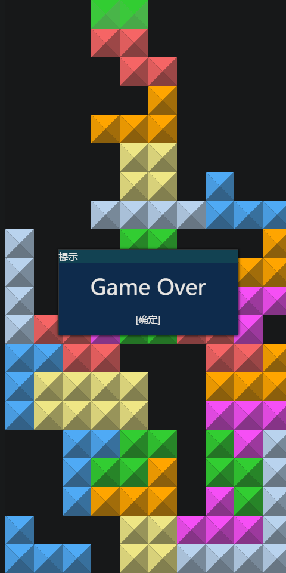
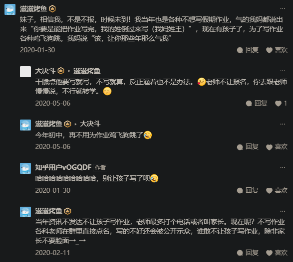

- ==“坏了，我之前写的基本都是成人内容？”==
- [[育儿]]
- [[卢安克]]
- # 接管童年！
- “学的时候就要痛快去学，玩的时候就要痛快去玩”——《成龙垃圾桶》
- 餐垫
	- 比一次性塑料膜桌布更垂坠，不易散开
	- 垫身上（有些儿童在沙发上吃；“你是否在查找围裙？”）
	- 垫桌上
- 玩具
  collapsed:: true
	- TODO 塑料滑块弹簧刀（哪来的？）
- 《儿童与环境毒素》
- 宠物
  collapsed:: true
	- [[猫]]
- 明确规则
  collapsed:: true
	- ((65d55152-5d22-49d8-86ae-62a0b13ce119))
	- “大他者不存在，嘻嘻”
	- “玩是第一法则”
	- “可以谈，可以讨价还价，可以赖账——玩，不择手段地玩！”
		- “好的（，不行）”
	- 儿童与成人的理所应当
		- “好宝宝”（哄）
		- 守时与不守时
			- 时间概念（“时间就像天地银行的贷款”）
				- “就看/玩N秒钟/分钟”
				- “五进制”
	- “小小年纪的老赖？”
- 仪式
  collapsed:: true
	- ((65d3f5b0-b068-47df-bd10-6c4442377b31))
- 家务
  collapsed:: true
	- 做（较多）家务的人会觉得自己会有更正确的家庭决策能力、资格和义务吗？
	- “婆婆来打扫一趟，家里好多东西都坏了没了”
	  id:: 65d754c0-b06f-446d-8c18-fec3e13610f6
- 饮食
  collapsed:: true
	- 挑食
		- 方便吃的（甚至不嫌脏，连筷子乃至牙签都不用）
		- 不爱一次次地搛菜吃，感觉浪费时间
		- 大人喂
		- 去骨：鱼刺——排骨（“啊？”）
		- 口腔牙齿健康——继续吃软的
	- 不吃饭，争分夺秒玩（“挑食了吗？如挑”）
		- 不固定饭点，让儿童自行觅食
		- “吃饭也是项技能”
			- “丢饭碗”
- “穷养男富养女”
	- “酸儿辣女”
		- “辣是穷口味”
- # 娱乐/“玩”
	- 有没有一种可能，我（们）担心孩子更多不是因为他们不写作业，而是他们玩得也不够有慧根？
	- 为什么不看电视手机也能在家里“趟来趟去”几分钟以上？
	- 一心求玩时，学习质量又能有多高？
		- 练字，不一定认真写，可能比几秒完成一道的算数更难
	- 不吃饭，争分夺秒玩
	- 无目的瞎跑
	- “说话”
	  collapsed:: true
		- 网络语言
			- [[猫]]
				- “哈猪咪”、“摸摸猪头，XX不愁”
	- “家长就不怎么会玩”
	  collapsed:: true
		- 单亲家庭
			- 父亲与母亲以及爷爷奶奶外公外婆等的娱乐方式一般存在较大差异
				- 成人向的丰富（“吃！喝！”）与儿童向的匮乏（“玩！具！”）
	- “不要看我玩”
	  collapsed:: true
		- 可能过一会儿确实能看出进步就先不管，尊重优先
			- ((65d14e0b-8612-4cb1-9d9d-60c54871a86d))
	- “不要让我想玩”
	  collapsed:: true
		- 其他人给我静默
			- 让儿童学习时不被时刻诱惑（“你用机械硬盘是爽了，但是键盘或门缝降噪得有吧？”）
	- ## 电子娱乐
	  id:: 65d19d43-e636-4a85-a2a4-303f129c2e51
	  collapsed:: true
		- >“人类看到屏幕就会凑过去”
			- [人类，他们看到门就会冲进去（人类：一败涂地 Human: Fall Flat）文字](https://www.douban.com/review/12823825)
		- [[电视]]
		- 手机
		- 景观的复制
		  collapsed:: true
		- 电子娱乐限制
		  collapsed:: true
			- “只要不对XX加以限制，XX就一定会XX”
			- 抛开什么什么不谈，现在限制儿童进行电子娱乐的难度有点大，游戏从企业端限制时间后，（相关或不相关的）短视频就可劲看吧
			- 垄断游戏游玩渠道，至少与其他儿童“自发”要玩要看的游戏竞争
			- 设备限制
				- [家长举行手机封机仪式](https://www.bilibili.com/v/topic/detail/?topic_id=1161588)
				  id:: 65d3f5b0-b068-47df-bd10-6c4442377b31
			- 内容限制
				- “营销号”：“注意看小帅小美”
				- [[电视]]
			- 监控
				- “好好好”（继续玩）
				- 重点地区（电脑前）
			- 断网
				- 智能家居目前可以断电视等联网设备的网
			- 断电
				- TODO 电闸能否加密码控制不清楚
			- 断光？（“相关性：这个儿童好像习惯夜间在人工照明较亮的地方玩手机平板”）
			- 密码
				- 扫脸（“扫扫你的”——“坏了，这下起床战争了”）
			- 儿童手表也可以玩？
		- 间隔
			- “做XX分钟作业后玩/看XX分钟”，就会好吗？
		- 家务
		- 语音助理
			- 小爱同学会根据用户的声音判断用户所属年龄群体并变到对应年龄群体的声音吗？
		- 短视频
			- ((65d03d0c-c8bc-4c9a-be64-2fda8b6803da))
			- 家庭成员也不太容易锁上自己的手机，被儿童拿走就至少看短视频
		- [[游戏]]（包括“只看不玩”）
		  id:: 65d05b3e-1a58-4d4a-bf52-823acabd2dce
		  collapsed:: true
			- TODO 分级整理
			- [[玩具]]
			- 移动类：神庙逃亡、平衡球
			- 球类
				- 室内门球/足球
					- 倾倒纸箱作门？纸箱去掉一面改成门球门？猫狗等宠物的腿之间作活动的门？（“你礼貌吗？”）
			- ((65d30aa2-0d49-4500-a6b6-64a224fd4b49))
			- 网游
				- 蛋仔派对
					- 糖豆人与蛋仔派对（、元梦之星）
						- “合理性：成人与儿童匹配分开？”
						- “糖豆”
							- “红芸豆”
							- “糖衣炮弹”
							- “豆”、“米”（“小米儿”、“花生米”）、“钱”
					- 还是玩玩以前的2d马里奥吧（“难？”）
					- 触屏玩能提升泛用的精细动作能力吗？
			- 重新介入（“接管！”）童年
				- 单机游戏
					- [教你怎么玩！未明子儿时都玩过那些游戏？发现游戏直播起源？_哔哩哔哩_bilibili](https://www.bilibili.com/video/BV1Wa4y1y7QQ)
					- [[俄罗斯方块]]
						- 俄罗斯方块过了几分钟能看出基本堆出形状了，就是中间还是会出现空格，两边还需要长块
						  id:: 65d14e0b-8612-4cb1-9d9d-60c54871a86d
							- ((65d21da1-c60e-4ced-a616-fa8e0894dcf2))
						- 截图
							-  [[20240218]]
					- Ballance
					  collapsed:: true
						- “耐心？”
						- [【平衡球点这里下载！】Ballance吧·导航贴【ballance吧】_百度贴吧](https://tieba.baidu.com/p/6264479421)
						  id:: 65d19bde-af7d-4187-9820-3de425d0bcec
							- [Ballance吧导航贴 - Ballance Wiki](https://ballance.jxpxxzj.cn/wiki/Ballance%E5%90%A7%E5%AF%BC%E8%88%AA%E8%B4%B4)（整合包我第一次赶时间关过一次机中断过下载，第二次点就下不了了，显示“Bandwidth limit exceeded.”）
							  id:: 65d15aeb-8598-4d35-b882-299852fad7df
							- [关于较新整合包的游戏分辨率相关问题【ballance吧】_百度贴吧](https://tieba.baidu.com/p/8631939637)
						- ((65bcbf67-78e1-45b3-8d92-76480d36724a))
						- Ballex
							- >概述：Ballex和Ballance最大的区别在于，后者面向普罗大众，而前者面向对于已对Ballance有强烈兴趣并且已经积累大量经验、拥有高超技巧的老玩家。平稳的心态、强大的耐性、大佬的技术，这三者至少得有一个，否则就会像我一样被气哭（呜呜）。
						- [Ballance: 经典游戏平衡球的 Ballance Unity 复刻版](https://gitee.com/imengyu/Ballance)
						  id:: 65d14aa7-432a-4861-8fe9-c18d3d5dcbd7
					- TODO ((63024c57-8b0f-497d-a0e9-ae77ed2cf1e5))
					- 孢子
				- 对战
				- 百战天虫
				- 教小孩别看短视频，多看长的类似电影的，玩经典游戏
				- 让小孩去学校炫耀输出“游戏鄙视链”
				- “玩哪个？”
				  collapsed:: true
					- 儿童向主播生态
					- 经典游戏重制版
					  collapsed:: true
						- 贪吃蛇大作战
						  collapsed:: true
							- [贪吃蛇大作战真的是单机游戏吗？ - 知乎](https://www.zhihu.com/question/48638245)（“啊？”）
							  id:: 65d34629-a42d-485b-9e1c-0e9c60c339fb
							- 贪吃蛇“民间”团队推流？
					- “（从迷你世界到我的世界/MC）少走几年弯路”
					  collapsed:: true
						- TODO edu版手机版
						  collapsed:: true
							- [我的世界教育版Pro (简介有下载链接)_单机游戏热门视频](https://www.bilibili.com/video/BV16j411p7PC)（在试模拟器，好像中文翻译远远不够？）
					- 多平台游戏
				- 儿童入门套装？
				  collapsed:: true
					- 可能不需要教太多
				- 小朋友爱拿开屏幕自己玩就自己玩
				  collapsed:: true
					- 在儿童背后的墙上贴镜子观察🧐？
				- “挖三填一”儿童共识——比现实自救知识都记得牢（、记得快）？
				- 年龄分级
				- 小孩为什么喜欢捉迷藏？
			- [孩子开始对电子游戏感兴趣了，什么样的游戏比较适合7岁的孩子？如何引导既能防止沉迷又能让孩子获得满足？ - 知乎](https://www.zhihu.com/question/573631939)
				- TODO 《屏幕时代，重塑孩子的自控力》
				  id:: 65d05c1a-793b-4c6d-981a-f7323aed33a2
					- [屏幕时代，重塑孩子的自控力-希米·康-微信读书](https://weread.qq.com/web/bookDetail/6e3327b0813ab7f89g0113a6)
			- 文字游戏
				- “玩的什么古装剧？”
		- {{embed ((65d03593-68f0-4de4-b51b-26447457adbc))}}
	- “没电子设备了？还是看看儿童专注力之类的彩印图书吧”
- # （可能是应试为主的）教育/“学习”
  collapsed:: true
	- “你这阅读还不如迷你世界主播讲得合情合理”
	- 年级/学校间题目/活动实际上的连贯性？
		- “是教/学得好？还是单纯随着时间流逝，儿童在生理上发展了相关能力？”
		- 低年级与高年级的语文题显然不一样，但是为了分阶段评价，可能会扭曲学习
	- 学校
	  collapsed:: true
		- 分流
		  id:: 65d1b9cf-f0a6-4e8d-8bdc-c6c6ec8371de
			- “初中才分流疑似有点太晚了，现在很多小学生就不想写四则运算了，应该从差不多识字写字的小学三年级开始分流”
		- 练字
			- 可能比四则运算更需要专注，因为整个过程可能更长
			- 必要性
			- 文具
				- 能共用、基本用不完的文具（比如墨水）为什么要一个个买？
			- 钢笔
				- 钢笔被故意或不小心（“不排除从桌面上滚落的可能”）摔坏笔尖，写不了~啦！
				- [为什么练字最好用钢笔？ - 知乎](https://www.zhihu.com/question/604155054)
			- 笔顺
				- 不一定看步进的笔顺提示，且单个笔划方向可能另外自己找规律，比如可能基于对称而从右向左写一笔“横”，是否与绘画相关？
		- 题目
		  collapsed:: true
			- “问题”？
				- 可能是为了区分，一个“题目”可能包含多个“问题”？与日常语言中的“问题”（“你这题目有问题啊”）区分
					- [问题与题目的区别是什么？ - 知乎](https://www.zhihu.com/question/317614218)
					- 题目：“谢谢你，标题”
			- 题目从哪来？如何拼凑？
				- 为了学习效率，应该有规律还是打乱？
			- 跳步骤
				- 跳过教授“正确答题思路”的文字步骤，直接给出答案（主要是不需要写出过程的题）
				- 跳过程
				- “看参考答案”
					- 小猿搜题的诞生对劳动分配有何影响？
		- 批改的教师与诊断的医生
		  collapsed:: true
			- “阅读你的症状”——医学教师
				-
				- ((659b89ca-3a0b-47f6-a630-11a756cf988d))
		- （家庭）作业
		  collapsed:: true
			- ((65d1b9cf-f0a6-4e8d-8bdc-c6c6ec8371de))
			- ### “为什么不做作业？！”
				- 不做作业的原因：作业话语与短视频话语（还有家长话语：“快写！”）不一样，儿童幼化——与猫类似，恰恰增加教辅、娱乐等的必要性
				- 纸没有电子屏幕“灵动”、“又去”
				- “儿童写作业非常痛苦”
					- 为什么痛苦
			- TODO 扫描错字 #小屋
			  id:: 65d5d185-4ce4-40c1-b7f2-f36c31e88a61
			- 拖延
			  collapsed:: true
				- 作业拖延与资本主义deadline
				- （有时）在学校能写，在家不能写
			- 如果在家看电子屏幕的话，从护眼角度看（从其他角度看不确定），似乎晚上写作业更好，因为作业相对而言不那么伤眼
			- 失控的长假作业
				- “随便类比一下就是放假时上班”
				- 布置方式
				  collapsed:: true
					- 统一发
					- 作业给题型和用量（“膳食指南是吧？”），（可能一般是家长）自己找题目打印——“打印机托是吧？”
						- 小学生数学报每日一题
							- TODO 绑定一个手机，手机上答题——“限制一位家长的人身自由、制造家庭矛盾是吧？”
				- 后面有参考答案，并且电视上刷到的b站视频都有熊猫人“eiah”视频
				- [寒假作业可以不做吗？ - 知乎](https://www.zhihu.com/question/367278786)
				  collapsed:: true
					- 
				- [杭州一小学取消寒假书面作业，「开学后聊聊心得就行」，教育局回应，你认为取消寒假作业是否合理？ - 知乎](https://www.zhihu.com/question/640928922)
				-
				- 尺度：“每天”与“总共”
				- [【张捷聊教育】寒假作业之痛已经成为银行拉存款卖点_哔哩哔哩_bilibili](https://www.bilibili.com/video/BV1AJ4m1e7dA)
				  id:: 65d6c782-8ffd-4a70-bff2-9efd990e4cf3
		- 晚自习
			- 农村小学晚自习更贴合现实，收费被举报——可能其他学校被举报过一起卷
		- 成绩报告单
			- 从分数到等级
	- 小学网课
	  collapsed:: true
		- 老师在场，但是在线上，老（学）生了，不在乎
		- nuclear peach编程课
			- Scratch课
				- 学这语言真有用？
					- 好像真有点
					- 从相对完整的卡片到更细的代码
					- “你自己小时候没学过‘小乌龟’作图吗？”
				- 软件是‘特供’的吗？
				- 这些课程真有用？
					- （“自由创作环节”）“编程/作弊两分钟，傻/瞎玩一小时”——“青春版wind change是吧？”
						- TODO （单独看可能）不如flash修改器（合金弹头）
						  id:: 65d30aa2-0d49-4500-a6b6-64a224fd4b49
						- 有趣，有进度条，真的有效吗？（？）
							- 这样的编程课是 ((65d1b9cf-f0a6-4e8d-8bdc-c6c6ec8371de))工具吗？让一部分学生浪费时间在瞎玩上？
					- 课程情景脱离现实好吗？（“发射浆果使食人鱼反向”）
					- “游戏科普、引流”？（好多玩法）
		- X而X（“形而上是吧？”）
			- 作文课
				- 打开，打开，一定要打开网络摄像头
				- 网校游戏化（“宁就是演儿童版白蛇传的？”），比学校更有吸引力？——真有用？
				- “哈佛这么水？我对人类绝望了（”
				- 很简单的问题，让人先从简单的问题开始——“防微杜渐啊，朋友们”
				- 回复数字——承诺与一致？老什么符号了？
				- “不好说你这个‘开开心心’有没有小屋的《修辞手法》教得好，至少我觉得相当拖沓——你教三岁小孩吗？！”
				- 眼保健操（“我们像学校一样周到、有各种环节！”）
				- 家长推销续课环节（“我们能发现、能解决问题！”）
					- “开开心心地学到知识”，你信吗？反正我有点不信
			- 科学课
				- 证书（含金量高？真高？）
				- 教具——“卖周边是吧？”我的评价是不如垃圾佬和电子爱好者
				- “别人发言我不听”（调低音量；“就一个队友你还不听听看？”）
				- 小队长
	- 家长签字
		- 屏幕上签
	- 背课文/诗
	  id:: 65d41ee4-b00b-459f-84ee-448b59013e46
		- “为什么是那种拖长、重复、‘抑扬顿挫’、忽快忽慢的声调？家长老师同学真有那么急、狠？你真有那么怕？” #小屋
		  id:: 65d41eef-da07-47ac-a7b4-98508a70e1ed
	- 看似有用的网课、看似权威的教辅出版物向家长承诺魔力，但是对小孩（的学习成绩）无效，那么相信是它还是小孩有问题？
- 排斥学习场所？（不像）
- 零食
  collapsed:: true
	- 也分心
	- 零食来源、分级
	- 零食与外卖的协同
- 如何“矫正”？
	- 物理
		- 要不要打？
			- 怎么打？
				- 外包
					- “雷电法王”杨永信
						- [《网瘾之戒》记者柴静对话杨永信_哔哩哔哩_bilibili](https://www.bilibili.com/video/BV1Gx411N7gH)
						- [如何看待游戏《黎明杀机》中加入以杨永信为原型的新角色「The Doctor」？ - 知乎](https://www.zhihu.com/question/51933750)
						- [10年过去了，雷电法王杨永信还在，不仅在电击孩子，业务还更大了 - 知乎](https://zhuanlan.zhihu.com/p/48835100)
					- 豫章书院
	- 精神
		- 模仿和播放“羞辱”“丑态”？
- 睡眠
	- 与家长一起睡
		- “为什么十岁左右了还和家长睡一张床？”
			- 没自己的床
			- 有自己的床
				- 家长身边有手机等玩具？
- # 家庭互动
	- 消费主义需要生产家庭矛盾吗？
	- [[猫]]
		- ((65d2a5ee-6caa-4cac-bd98-bf355a81af01))
	- 中心
	- 中介
		- [【小屋夜校/B-5-2】不做“传话筒”_哔哩哔哩_bilibili](https://www.bilibili.com/video/BV1Ck4y1Z7wb)
		- 孩子成为了家庭权力斗争的中介吗？（“听谁的？”）
			- [[猫]]则成了所有人的家庭斗争中介
		- 一家经常见的人对孩子态度都不一样，咋办？
			- 长辈有可能向着孩子
	- “没法沟通”——“沟通”本就不是万能的
	- 爸妈放假想自己玩不想带孩子，因为认为大人和孩子玩法不兼容
	- 爷奶转发老师消息到爸妈，就以为通知到位，但爸妈不一定有那个材料——因为，也但是，学生所需的材料在学生在的爷奶家
	- ## 儿童的丝滑连招
		- “一哭二闹三上吊”，但是版本更新后技能链更长了，小宝宝
		  collapsed:: true
		- 儿童
			- “三只手”
			  collapsed:: true
				- 掏口袋摸手机
					- “爱和爱睡懒觉的家长睡一张床的一个重要原因找到了？”
			- “来，骗！来，偷袭！”
			  collapsed:: true
				- “密码输错啦！”（然后在旁边“光明正大地偷看”密码）
			- “拖，就硬拖，我知道我要——不，说不定又赢了呢？”
			  collapsed:: true
				- 格挡卡顿
				  collapsed:: true
					- “就看完这个（长视频）”
					- 破坏文具（“削铅笔”、“”）
					- 要吃的（“我饿！我要吃东西！”）
				- 区域拒止
					- “关门！”
				- “特殊叫声”（哭的“前摇”？不一定就是“嘤嘤嘤”，真发出来的话还可能有点绷不住）
					- “尖锐了我的宝，但是你能不能有点主观能动性，聪明点认识到你这样叫没用、省点嗓子？还是说家长也是‘油腔滑调’的？”
						- 为什么家长要“变调”呢？
						- 有所谓“与儿童沟通的最佳方法”吗？与成人的呢？
							- 许愿/祈祷与欺骗
					- 评价与控制
					- “家长负面评价，但是儿童实用，不理”
				- 哭（“有小珍珠吗？有真情实感吗？有慧根吗？”）
		- （先验）威胁
			- “你都烦死了，我真想打你”、“别烦我”——（家长）这么说的话一般判定为“miss”
- # 儿童内部矛盾
- 分心
	- >把你的心我的心串一串~
		- “爱为别人着想的人可能确实不太容易分心”
	- ((65d2ba62-8eec-44fe-b9d8-c7df7c758358))
	- add与现代流媒体（电视也算是流媒体，一个台就是一个账号，拿视频直播罢了）
	- [弱点 - 密教模拟器中文维基 - 灰机wiki - 北京嘉闻杰诺网络科技有限公司](https://cultist.huijiwiki.com/wiki/%E6%B5%81%E4%BA%A1%E8%80%85/%E5%BC%B1%E7%82%B9)
		- [分心之物 - 密教模拟器中文维基 - 灰机wiki - 北京嘉闻杰诺网络科技有限公司](https://cultist.huijiwiki.com/wiki/%E5%88%86%E5%BF%83%E4%B9%8B%E7%89%A9)
	- “内听觉的发育总被打断”
- “说的道理”
	- 先x再玩更好/更有效率
- 大块时间代替碎片时间
  collapsed:: true
	- 长视频代替短视频（看柯南，不看柯南剧情解说）