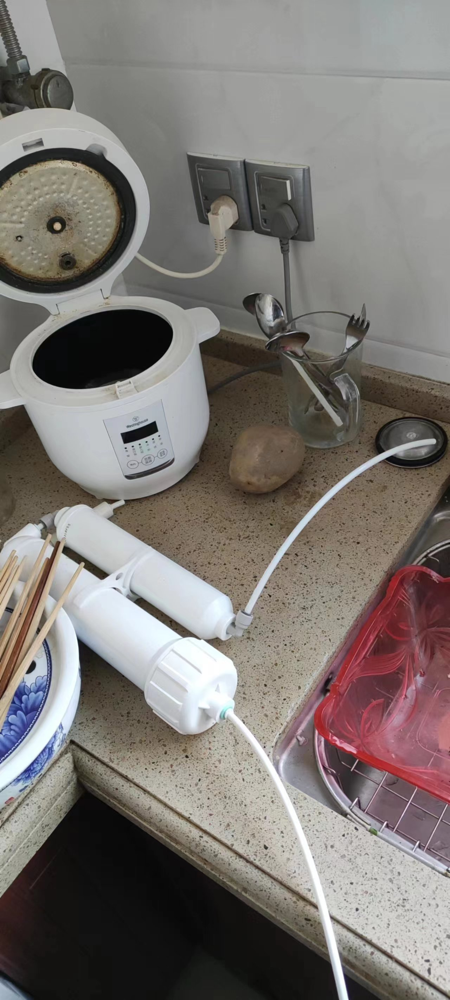
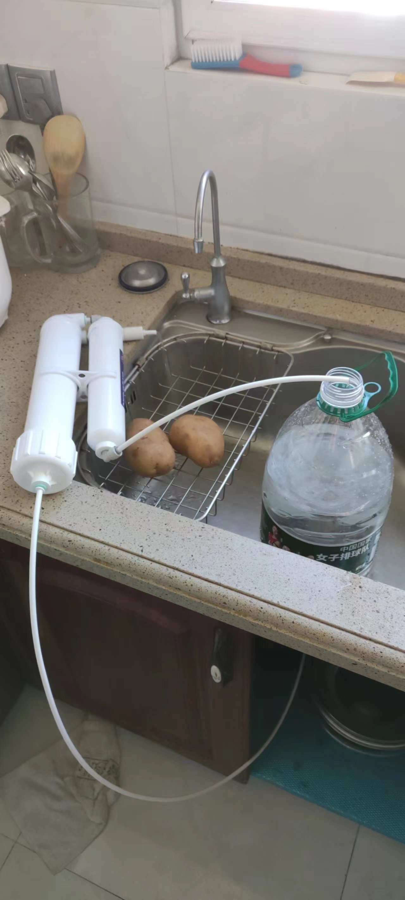
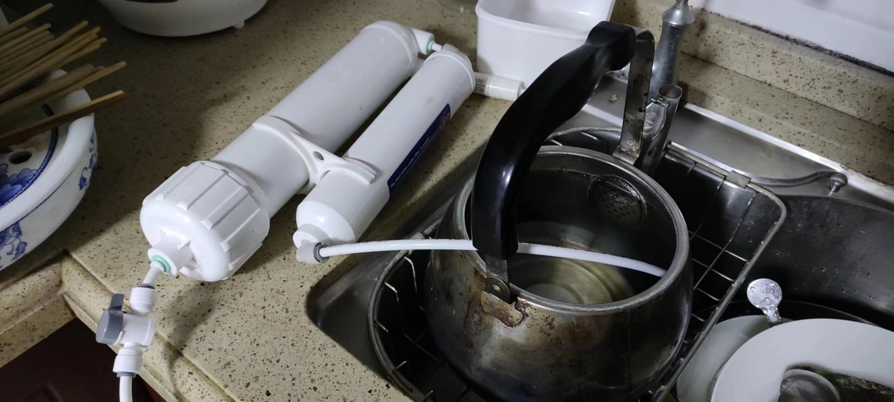
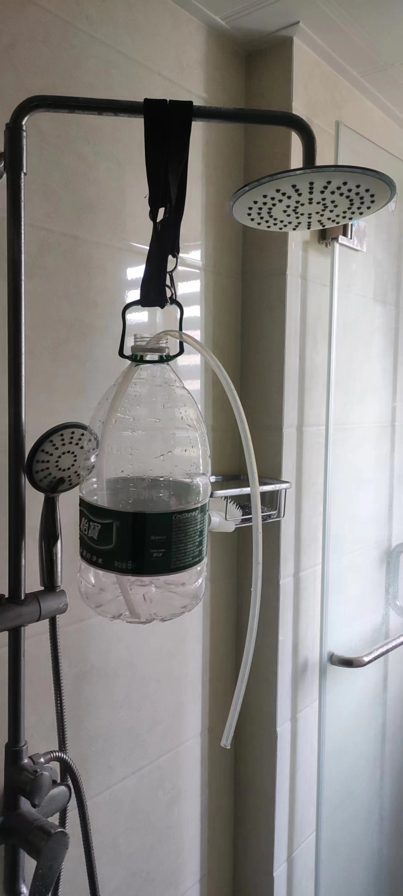
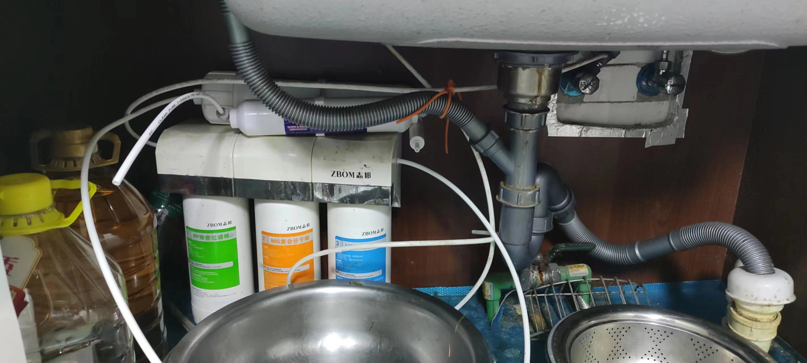

- [全国城市TDS值大全 全国水质大排名 - 知乎](https://zhuanlan.zhihu.com/p/64684446)
  id:: 65ab10f9-6044-433f-8a3c-93896b241606
- [净水器超滤好还是反渗透好？ - 刘志泉的回答 - 知乎](https://www.zhihu.com/question/277923267/answer/1809573698)
- [一图读懂|GB 34914-2021《净水机水效限定值及水效等级》](https://www.sac.gov.cn/xw/bzhyw/art/2021/art_30a9d44d31cf4ca082d262ec52357a35.html)
  id:: 66599af8-ab74-4a84-9909-24a0415a2762
- 使用RO净水器过滤水比 ((6449d1d8-84bf-4c36-97b3-18b1c6e26126)) 省钱、省时、安全、健康、好喝、多功能
  id:: 66db8aac-5e73-4751-ba9e-c0941a8c92a3
  collapsed:: true
	- 省钱
		- 部分人只喝凉水
		- 以滤芯寿命较RO滤芯短的小T33活性炭滤芯（5676升）为代表，首次购买净水器整机约350元，后续主要更换滤芯
			- ((654b9e79-5d95-4926-97bb-2b6038f42a0a))
			- （假设三口之家一天烧水4.5升，）烧水量与滤芯寿命相等时，烧水的天然气费约415.35元
			  collapsed:: true
				- [用电水壶烧水与用天然气烧水哪个比较便宜? - 知乎](https://www.zhihu.com/question/27497297)
				- [镇江市市区居民用天然气价格调整 4月1日起执行，具体解读看过来！_新浪财经_新浪网](https://finance.sina.com.cn/jjxw/2024-03-19/doc-inanweur7017648.shtml)
				  collapsed:: true
					- collapsed:: true
					  >1.居民用管道天然气第一、二、三阶梯销售价格分别调整为2.96元/立方米、3.25元/立方米、4.14元/立方米
						- 此处采用2.96元/立方米
		- 易知，以下各项也能帮助更省钱
	- 省时
		- 滤水比烧水快，尤其是没现成的饮用水了要喝少量水时
	- 安全
	  id:: 66db8aac-9f49-4e75-aee6-5f6758dc6b4e
		- [如何说服家人相信反渗透净水器出来的水可以直接喝？ - 知乎](https://www.zhihu.com/question/317495077)
		- 烧水壶底部可能粘附可燃物，加热时会燃烧释放有毒物质、可能引发较大火灾
		  id:: 67884173-c0ba-4448-900d-f891d7c064d6
		- 听到燃气烧开水的汽笛声急着去关火结果撞伤、摔倒
		- {{embed ((66ebcb67-92b1-4af8-9268-c9a73ba856c9))}}
		- {{embed ((66ebcb7f-6b50-4188-864b-796d4fe7f3f8))}}
	- 健康
		- 无燃气烧水的蒸汽噪声及其引起的精神紧张
		- ((66f9e1b4-5edc-4bac-902b-83104de69199))
		- ((65bcbf66-680b-48d9-9ba4-ac46827f01bd))
		- ((65bcbf68-aad7-45e2-86e7-73807484efec))
	- 好喝
		- 烧水除了除氯外，对水质和口感的改善微弱
		- “来嘛！来喝就知道啦！”
	- 多功能
		- 过滤原水综合质量更好的 ((66db8ae4-eee6-4d0b-a42d-af7c2e74e995))
- 应用
	- 直饮
		- TODO 隔夜水
		  id:: 654ce886-16c8-4c05-a400-0ee99736f895
	- ((6449d1d8-0ea2-4264-809a-373e90630044))
	  collapsed:: true
		- 接触人体、宠物等（洗漱、洗菜等）
			- ((67402ab3-6383-4c95-9f87-1a6efb217480))
		- 全屋净水
		  id:: 670d40d9-b76c-4f99-9f34-43b2b3b3a851
	- 种植加湿制药
	- {{embed ((65bcbf46-3d40-4abd-ba5e-38b67cac68f3))}}
- [家庭装修日记-净水器选型攻略及硬货干货分享 - 知乎](https://zhuanlan.zhihu.com/p/67763424)
- 滤芯
	- [净水器通用滤芯耗材，价格及购买注意事项 - 知乎](https://zhuanlan.zhihu.com/p/559711829)
	- 活性炭滤芯
		- TODO 是否可用臭氧消毒？
		- TODO 是否会释放有害物质？
		- [[we happy few]]
		- [净水器压缩活性炭与颗粒活性炭滤芯的区别在哪？ - 知乎](https://zhuanlan.zhihu.com/p/54313240)
		- [净水器颗粒活性炭，烧结活性炭，t33有什么区别，能不能相互替换? - 知乎](https://www.zhihu.com/question/428199642)
		- [臭氧-生物活性炭(O3-BAC)技术原理及在水处理的作用 - 知乎](https://zhuanlan.zhihu.com/p/407822161)
		- 颗粒炭和压缩炭可以合并为一个滤芯，一般叫复合滤芯
		- 后置活性炭滤芯
			- 如果净水要用于超声波加湿器，而净水TDS较高且不满意，可以用带阀三通（是否还需逆止阀？）
		- 过滤得失
		  id:: 65bcbf46-3d40-4abd-ba5e-38b67cac68f3
			- 锂
			  id:: 65ab10f9-0233-4880-97c2-27ca79860a1b
				- TODO 再添加锂
	- RO膜滤芯
	  id:: 66335bd3-f764-464e-806a-bb4da6195408
		- [分析+测试贴：如何延长纯水机RO膜的使用时间，降低维护成本？ - 知乎](https://zhuanlan.zhihu.com/p/81068732)
		- 汇通有ULP和EC开头、尺寸和通量相同的几款，EC开头的价格可能更便宜，也许是旧型号
		- 75G
		  collapsed:: true
			- 
			- 
				- 我们大美镇江也有一个净水器滤芯知名品牌惠灵顿，如果水质尚可、比如TDS小于200，追求性价比，不妨尝试惠灵顿
- 膜壳
  collapsed:: true
	- 图省事可以买快接版
	- 1812
		- “1812一声炮响”
- 连接件
  collapsed:: true
	- 框架（个人认为最主要的作用是方便搬家等外带场景一起带走）
	- 水管
	- 快接
		- 管卡/接头锁片（将快接垫出一小段距离，增加紧度；小通量可能也不需要）
	- 插栓
- 监测
  collapsed:: true
	- 如果没有内置传感器，可以手动检测，主要测TDS（相比平时明显增大且水厂无情况说明的话，大概就是RO前置滤材需要更换了；电子TDS笔）和余氯（看活性炭等滤材是否已基本去除余氯；余氯试剂，买最小份数就行，那些塑料试管可以重复使用）
	- TODO TDS越低水质越好？
	- 我家的末梢水和75G ROD 净水水质监测
		- 水温26.7度，TDS 151、2，EC数值均为TDS的两倍（疑似检测器直接乘2） [[20240607]]
- 陈水（“高TDS的前几杯”）
  collapsed:: true
	- 小通量RO滤芯受陈水影响较小，75G RO滤芯的稳定流出后的前十秒的“陈水”的TDS是很可能小于原水TDS的10%的，不是很讲究的话可以正常使用
	- 少次足量制水备用
		- 用计划和时间换省水，一天制一两次水即可，例如三口之家晚上一次性接够淋浴水30L（可选，按五点半有人到家开始制水，小通量低水压每小时8升，晚上九点十点也能接够；先接量大的淋浴水也能有效稀释陈水，如果非常讲究的话；水具也可用于健身，还容易改变重量）、便后冲洗水1-3L、洗菜水1-5L、做菜水、饮水（早晨烧水2.5L，晚上烧水1.5L；也用作洗鼻水、炒糖色开水）、加湿水3-6L等
	- 大量纯水冲洗
		- ((65425818-e4e8-4e38-bf41-b2d82d487c6d))
- 大通量还是小通量？
  id:: 65dc06ad-d1f6-4e5b-ad7b-ac8a900931c9
	- 我家的75G小通量的TDS一般不高于5~10（流量夏大冬小，约5~10L/h），同城亲戚家的1000G大通量一般20-60
- ---
- 安装/改装（含加装）解决方案
	- 从零开始安装整机，整体中等偏上的材料350元（后面的参考资料都是大通量案例，打算采用类似我的小通量方案可以选择性参考）
	  id:: 654b9e79-5d95-4926-97bb-2b6038f42a0a
		- 购物清单：活动扳手（“没有的话建议在家族、小区、工作群里问一下”）、进水三通球阀（4分转2分快接）、生料带（不确定需不需要，保险起见可以买一两卷，欢迎反馈）、3个2分塑牙滤瓶（10寸，装PP棉的用透明的方便观察是否需要更换；现成的品牌代工净水器很多为了吃滤瓶/滤芯耗材费的“长尾/肥尾”，滤瓶和滤芯对用户而言是一体、不可拆的——能等的话可以到寿命了再换，我自然是再等等）、6个2分对丝（第三次买了球阀顺带买了个滤瓶后发现又缺了这玩意）、3种滤芯（10寸，PP棉/UDF/CTO，PP棉换得更快，可以买双倍），其他的看上文加装RO的方案——“一店购齐”总价约350元（还缺个水龙头，要方便用三级过滤后的除氯水洗手的话可以搞个），用来买怡宝三百升不到，全用来加湿大概不够五十天
			- 透明塑料滤瓶EG-2 924g，1微米pp滤芯带塑封膜130g，两个白色塑料滤瓶EG-2 824、828g
			- 
			- 
			- 
		- “安装小提示”：注意看厨下（前面有我家的参考图），在比较常见的扁把手状的厨房水阀之外，都有可以旋转的多边形的进水角阀吧？往上通到自来水龙头的像花洒水管的那种不锈钢波纹管一般就是4分编织管。而两者之间就是我们要安装的（净水器）进水三通，可能2分管管口需要缠生料带，三通的支路连接2分管，75G这样的小通量大概4分转2分没毛病，之后都是2分管和2分接口，小通量水压小，根据已经这么做的现有经验，俺寻思不用考虑漏水风险，甚至懒得给快接上管卡（淘宝“开泉净水”店铺会送）——框架也不买，就算要搬家，随便拿个厚点的塑料袋就能带走——莽就完事喽！
		- 参考资料（好像都是大通量无桶或小通量有桶案例）
			- [diy   RO反渗透净水器的一些经验 - 知乎](https://zhuanlan.zhihu.com/p/638079577)（“插栓方便”：中荷2817带密封圈）
				- [有/无桶，单/双出水方案选装一文搞定，净水器选择及RO纯水机组装DIY方案探讨+清单分享（篇1） - 知乎](https://zhuanlan.zhihu.com/p/136645414)
				- [DIY纯水机净水器安装避坑详细过程+RO纯水机废水处置方案+解决无桶机高TDS方案分享（篇2） - 知乎](https://zhuanlan.zhihu.com/p/148610111)
			- [diy净水器400g流量-实测t33滤瓶VS压力桶零陈水（RO膜纯水机） - 知乎](https://zhuanlan.zhihu.com/p/615540002)（给出了自制DIY方案和购买成品的建议，这位出于情怀不用陶氏RO）
			  id:: 65425818-e4e8-4e38-bf41-b2d82d487c6d
			- [DIY组装通用滤芯版RO机，400G杜邦陶氏RO膜（上）_反渗透纯水机_什么值得买](https://post.smzdm.com/p/akmvkq89/)
	- 从超滤净水器开始加装RO
		- [低成本不改水路组装外接RO净水器_净水设备_什么值得买](https://post.smzdm.com/p/agql0327/)
		- 外接75G（最常用的小通量，可不接电动增压泵） RO（“细水长流”，一般每分钟0.15-0.2升）
			- 台上放置最多用于（像我这样的）调试，
			- 台上出水
			  id:: 679adcd0-c50d-4454-85a5-0ecc22f5022b
				- 从超滤的净水龙头取水，台上出水
					- （“干净又卫生啊，兄弟们”）
			- 厨下出水
				- 异味大？
					- 处理异味
				- 水管连到外部
				  id:: 679adcd0-2553-4c38-900e-6addb4cc0861
					- 从厨下净水器出水口到水槽上面约需90-120cm水管（可以先往大了剪，比如150cm、120cm）
					- 通到
					- 超滤出水口台上加水
					- 储水压力桶（为什么叫压力桶？浇花用的加压喷壶都用过吧？）
		- T33
		  id:: 65447065-8826-4ff7-85db-0e612ea6d449
			- >现在已经用了快一个月了。基本上进水的TDS在150的情况下，出水保持在5以内，大概2-3左右。
			  而经过后面两级改善口感的T33之后，TDS会有所上升，大概在9左右。目前一个月家里的所有水壶都没有再有水垢的困扰了。
				- [为什么要自己组装净水器|DIY超滤+RO反渗透双出水净水器安装指南_什么值得买](https://post.smzdm.com/p/628668/)
		- RO需要多少净水流量/通量？
			- 小通量RO
			  id:: 67402aaf-d563-437e-907d-45de515f5266
				- 如（暂时；可逐步升级）只需覆盖加湿用水和饮水，可不用增压泵等（电动）
				- 每分钟最大0.2L流量，能等吗？
					- 能等
						-
						- 使用十几块几个的那种电子计时器计时
					- 不能等
						- 压力桶（“蓄水桶”，气压上水，原理类似浇花用的加压喷壶）？
				-
		- 查看原整机净水流量
			- 查看净水器正面或背面（可能挂壁，需要上提取下）
			- 或者接十秒水称重或看体积，算每秒流量对应净水流量多少g
	- ---
	- RO（反渗透）净水器
	  id:: 65996fc3-ee8e-4d89-9323-036fef554f7e
	  collapsed:: true
		- RO净水器并非仅给超声波加湿器使用，还可改善饮水（有朋友还推荐用更方便的即热式饮水机）、煮饭做菜用水、洗漱洗浴用水等的水质
		- {{embed ((65dc06ad-d1f6-4e5b-ad7b-ac8a900931c9))}}
		- 方案一：加装RO，130元——已有超滤净水器（可能是买厨柜送的——“厨柜说明书上是这么写的，有道理的，并非所有厨柜都要用木材”）的用户可以加装RO
			- 无电小通量方案，即长时间（6升水约50分钟）接水方案
				- 
				- 
				-  （球阀是后加的）
					- 还可以直接插烧水壶出水口，烧完水就不用重复开关盖了，还可减少接水时旁边用水可能的飞溅污染——“你们快快接自来水的不太能做到吧？” [[20241123]]
					- TODO 出水管可以用黑色管遮光减少管壁微生物生长？
					- TODO 近出水管口管壁微生物、污渍（？）可隔段时间剪去一小段或用直接更换，或者加单向阀？
				- 无泵（电动增压泵；整个方案都不接电）、无桶（压力桶——增压水枪和花洒都玩过吧？压力桶储水，不用手动加压，自来水自带水压）、75G RO滤芯（标准流量是每24小时75美制加仑——美制加仑约3.785升——每分钟约0.2升，属于最常用的小通量）
				- 7楼实测用怡宝纯净水6升桶接水，50分钟差不多装满——真正全家人日常回家后一小时内就睡觉的家庭，可能至少在我们大美镇江不占多数，对饮用水的使用方案应该也有所差异
					- 使用手机语音助手（MIUI似乎只能开一个倒计时——“小爱同学，十分钟后的闹钟”）或拼多多十几块四个的电子计时器（接水一个，做菜至少一个）倒计时提醒
					- 不用来洗澡一般三口之家一天两桶左右（加湿也用水）
					- 淋浴省着点用一遍洗完确实可以用绑带提10升的折叠水桶挂着洗，甚至不用水泵抽水，一根水管和初中物理知识就可以，但天天用自带水压、量大管饱的自来水和花洒的人一般不会去做这种稀奇古怪的事——那么我今天上午又测了下，6升怡宝纯净水桶接近满水，触底放入内径9mm、长一米的硅胶软管，“嘬”通后约2分20秒放完水，训练有素的短发人是来得及洗完的，而且洗后头发好像真的有点柔顺有点DUANG~了
					  id:: 65bcbf47-70c7-4c8d-a215-83623a0187b6
						- （绑带还要再试试别种的，这个弹力绑带是给自行车后货架买的）
						  id:: 65bcbf47-0788-43e7-b789-086929bc82db
						- ((656b5246-9e5a-4a42-af99-db12f5fc67de))
					- 泡澡需要的通量/流量大，通常需要管道全屋净水，而且为省钱、空间、噪声等综合考虑一般用软水机而非RO机供水
						- ((6542550f-3b32-4e7d-9e86-764af2c4d21b))
						- [家里不做软水直接做全屋都是反渗透净水。用来洗澡的话，和软水相比，使用起来有什么差别吗？ - 知乎](https://www.zhihu.com/question/440079602)
						  id:: 67402ab3-6383-4c95-9f87-1a6efb217480
						- “咱们再来看看接水组的表现”：一小时7升水，用几个可侧面排水的大水箱接一两天（小浴缸妥妥够了），搬水除了用小推车还可以顺带深蹲、农夫行走，浴缸里放“几个”3000W的热得快或用储水式热水器/洗澡机加热，显然也很容易泡上热水澡（或者省点钱干脆冬泳一下，下水出水大喊哈哈、奥利给！）——健身完了泡个澡，合情合理，赢上加赢！
				- 因为讲究洗手、刷牙（不用水杯漱口几年了，感觉为了几口RO水，好像也可以再用起来噢）时尽可能少损伤皮肤和皮肤菌群、口腔黏膜和口腔菌群，所以我用除氯水，这个小通量RO出水慢，所以我在超滤出水口用三通分了两路水，一路到原来的鹅颈龙头，另一路绕到台上球阀再到RO
				- 放台上问题不大，而且不用电磁阀可能不方便控制RO净水、废水两路的出水，所以手动的球阀要放在RO进水口，如果为了“美观”把原本为了用除氯水和方便不弯腰开门拧角阀加的球阀的好处给削了，这好吗？这不好
					- 其实如果原则上“美观”大于“方便”或接电加电磁阀的话，也可以放厨下（有时爸妈也把它放下去）——但现在一天也就接两次水左右，“资源陷阱”，我暂时懒得动
						- （“摆拍一下，干净又卫生啊兄弟们”）
						- 往净水器盖板上一搁，再绕两根管上来就能搞定
						- 要厨下完全关门的话，废水管可以接防臭下水三通/集成排水器，净水管可以在水槽上钻个孔上来（“这里总觉得有点鸡肋噢”）
				- 购物清单（购物车截图见方案二）
					- 方便采购（TDS笔可另买，75G小通量也许可以不买，“舌头会尝出来的”），全快接、插栓方便安装，总价约130元，约等于100升怡宝纯净水，可能两周不到就加湿完。安装不保证十分钟搞定，到处看看盘盘顶多半小时吧
					- 切管刀（普通的不防锈，用后如果沾水可以擦干后用一小节水管或筷子卡在根部蒸发剩余水分）
					- 2分管
						- 一根长管的台上RO方案2米一般够，最多三根长管的厨下RO方案4米一般够
						- 厨下进水三通到滤瓶和滤瓶之间约需50-60cm，滤瓶出水口到台上的一根水管约需90cm
						- 连接中膜壳（“脆皮人别拧扳手时拧伤了”）与小T33的之间的水管4.5cm，这个长度大致能使两滤芯平行，废水口连废水比的3.5cm即可——外丝款小T33实测，可能不完全匹配快接+插栓的小T33
						- “截原有水管的话，很有可能不需要买”
					- 2分T型三通
					- 2分球阀
					- 崧泉快接式1812RO膜壳
					- 75G RO滤芯（一般是买上市公司大牌子汇通，我这原水TDS160左右，小T33出来1-2，我们大美镇江有家惠灵顿膜业，产品性价比可能更高，原水TDS200以下应该可以试试，欢迎反馈）
					- 崧泉快接式小T33碳棒款（我用的是外丝款的，外丝接头拐个弯水管就不用拐弯了；在这选快接式这款，不用拧外丝接头是一方面，但更多是贪相比价格升得更多的水量；RO滤芯过滤后确实比较涩口，而用了后置活性炭滤芯对TDS影响极小）+2个中荷2分L型插栓（可能更方便水管拐弯，试了发现没必要的话欢迎反馈）
					- 子母夹（1812膜壳夹小T33的；夹靠近RO进水口的一端即可）
					- 300CC废水比（固定、不用电、不可调的废水比。也有其他比例的固定的，也有可调的，后者比较贵、用水量不大我就不换了）
					- “6升怡宝”
		- 方案二： {{embed ((654b9e79-5d95-4926-97bb-2b6038f42a0a))}}
			- 方案三：完全没空买组件DIY的话，淘宝“开泉净水”的成熟方案最低400G 699元，819元上门安装，400G流量妥妥够用，尤其推荐全员赶时间的企业用户