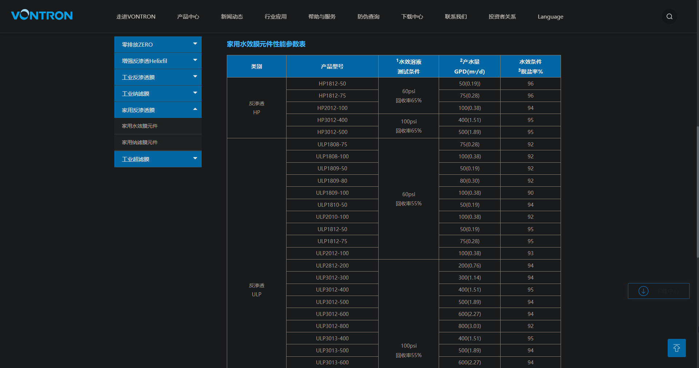
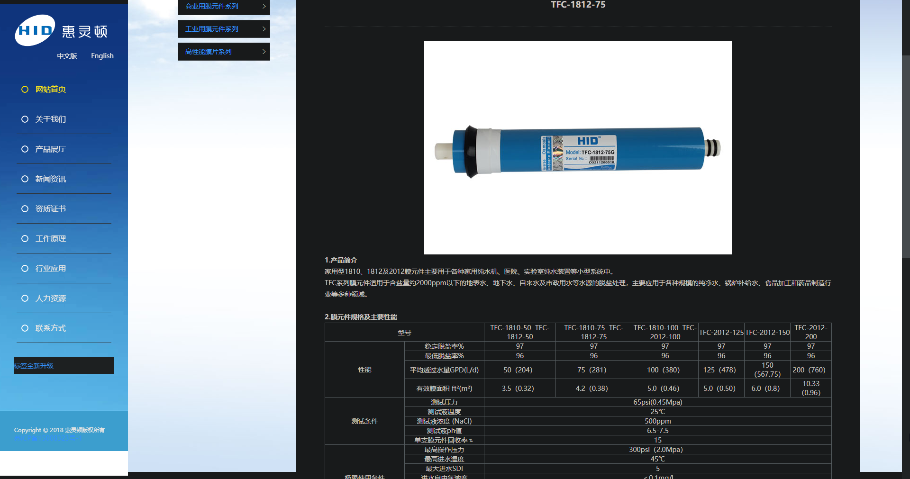
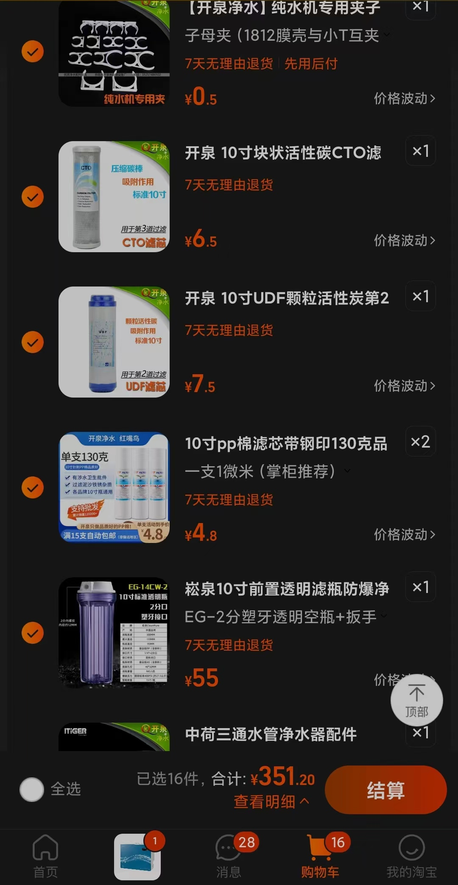
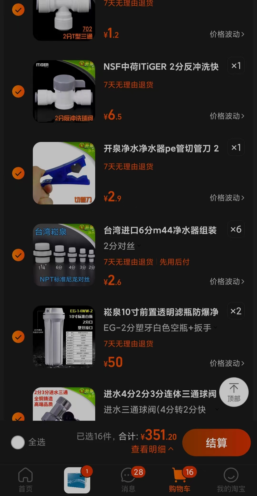
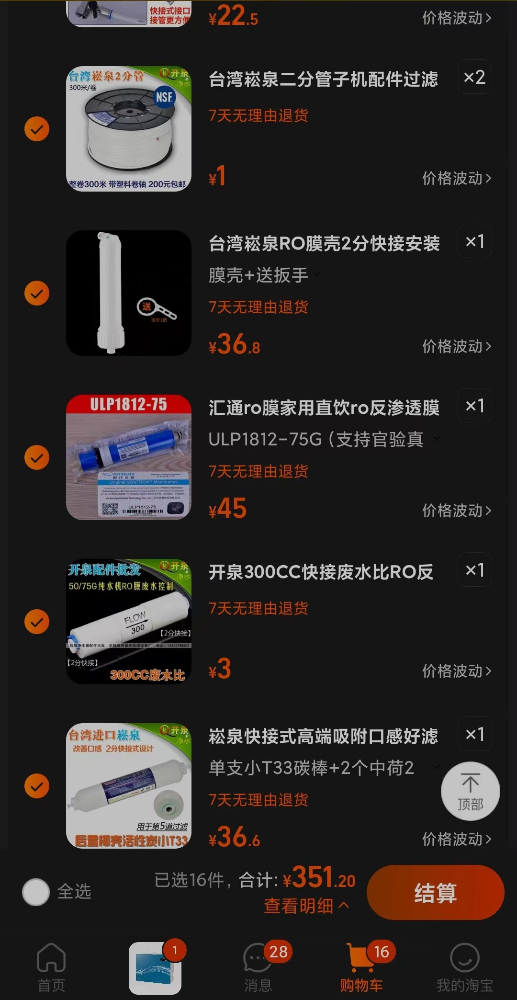

- [全国城市TDS值大全 全国水质大排名 - 知乎](https://zhuanlan.zhihu.com/p/64684446)
  id:: 65ab10f9-6044-433f-8a3c-93896b241606
- [净水器超滤好还是反渗透好？ - 刘志泉的回答 - 知乎](https://www.zhihu.com/question/277923267/answer/1809573698)
- 应用
	- 直饮
		- [如何说服家人相信反渗透净水器出来的水可以直接喝？ - 知乎](https://www.zhihu.com/question/317495077)
		- TODO 隔夜水
		  id:: 654ce886-16c8-4c05-a400-0ee99736f895
	- ((6449d1d8-0ea2-4264-809a-373e90630044))
	- ((65bcbf66-680b-48d9-9ba4-ac46827f01bd))
	- ((65bcbf68-aad7-45e2-86e7-73807484efec))
	- {{embed ((65bcbf46-3d40-4abd-ba5e-38b67cac68f3))}}
- [家庭装修日记-净水器选型攻略及硬货干货分享 - 知乎](https://zhuanlan.zhihu.com/p/67763424)
- 滤芯
	- [净水器通用滤芯耗材，价格及购买注意事项 - 知乎](https://zhuanlan.zhihu.com/p/559711829)
	- 活性炭滤芯
		- TODO 是否可用臭氧消毒？
		- TODO 是否会释放有害物质？
		- [[we happy few]]
		- [净水器压缩活性炭与颗粒活性炭滤芯的区别在哪？ - 知乎](https://zhuanlan.zhihu.com/p/54313240)
		- [臭氧-生物活性炭(O3-BAC)技术原理及在水处理的作用 - 知乎](https://zhuanlan.zhihu.com/p/407822161)
		- 颗粒炭和压缩炭可以合并为一个滤芯，一般叫复合滤芯
		- 后置活性炭滤芯
			- 如果净水要用于超声波加湿器，而净水TDS较高且不满意，可以用带阀三通（是否还需逆止阀？）
		- 过滤得失
		  id:: 65bcbf46-3d40-4abd-ba5e-38b67cac68f3
			- 锂
			  id:: 65ab10f9-0233-4880-97c2-27ca79860a1b
	- RO膜滤芯
	  collapsed:: true
		- [分析+测试贴：如何延长纯水机RO膜的使用时间，降低维护成本？ - 知乎](https://zhuanlan.zhihu.com/p/81068732)
		- 汇通有ULP和EC开头、尺寸和通量相同的几款，EC开头的价格可能更便宜，也许是旧型号
		- 75G
			- 
			- 
				- 我们大美镇江也有一个净水器滤芯知名品牌惠灵顿，如果水质尚可、比如TDS小于200，追求性价比，不妨尝试惠灵顿
- 膜壳
  collapsed:: true
	- 图省事可以买快接版
	- 1812
		- “1812一声炮响”
- 连接件
  collapsed:: true
	- 框架（个人认为最主要的作用是方便搬家等外带场景一起带走）
	- 水管
	- 快接
		- 管卡/接头锁片（将快接垫出一小段距离，增加紧度；小通量可能也不需要）
	- 插栓
- 监测
	- 如果没有内置传感器，可以手动检测，主要测TDS（相比平时明显增大且水厂无情况说明的话，大概就是RO前置滤材需要更换了；电子TDS笔）和余氯（看活性炭等滤材是否已基本去除余氯；余氯试剂，买最小份数就行，那些塑料试管可以重复使用）
	- TODO TDS越低水质越好？
- 陈水（“高TDS的前几杯”）
	- 小通量RO滤芯受陈水影响较小，75G RO滤芯的稳定流出后的前十秒的“陈水”的TDS是很可能小于原水TDS的10%的，不是很讲究的话可以正常使用
	- 少次足量制水备用
		- 用计划和时间换省水，一天制一两次水即可，例如三口之家晚上一次性接够淋浴水30L（可选，按五点半有人到家开始制水，小通量低水压每小时8升，晚上九点十点也能接够；先接量大的淋浴水也能有效稀释陈水，如果非常讲究的话；水具也可用于健身，还容易改变重量）、便后冲洗水1-3L、洗菜水1-5L、做菜水、饮水（早晨烧水2.5L，晚上烧水1.5L；也用作洗鼻水、炒糖色开水）、加湿水3-6L等
	- 大量纯水冲洗
		- ((65425818-e4e8-4e38-bf41-b2d82d487c6d))
- 大通量还是小通量？
  id:: 65dc06ad-d1f6-4e5b-ad7b-ac8a900931c9
	- 我家的75G小通量一般不高于5~10，同城亲戚家的1000G大通量一般20-60
- 安装/改装（含加装）解决方案
  collapsed:: true
	- 从零开始安装整机，整体中等偏上的材料350元（后面的参考资料都是大通量案例，打算采用类似我的小通量方案可以选择性参考）
	  id:: 654b9e79-5d95-4926-97bb-2b6038f42a0a
	  collapsed:: true
		- 购物清单：活动扳手（“没有的话建议在家族、小区、工作群里问一下”）、进水三通球阀（4分转2分快接）、生料带（不确定需不需要，保险起见可以买一两卷，欢迎反馈）、3个2分塑牙滤瓶（10寸，装PP棉的用透明的方便观察是否需要更换；现成的品牌代工净水器很多为了吃滤瓶/滤芯耗材费的“长尾/肥尾”，滤瓶和滤芯对用户而言是一体、不可拆的——能等的话可以到寿命了再换，我自然是再等等）、6个2分对丝（第三次买了球阀顺带买了个滤瓶后发现又缺了这玩意）、3种滤芯（10寸，PP棉/UDF/CTO，PP棉换得更快，可以买双倍），其他的看上文加装RO的方案——“一店购齐”总价约350元（还缺个水龙头，要方便用三级过滤后的除氯水洗手的话可以搞个），用来买怡宝三百升不到，全用来加湿大概不够五十天
			- 
			- 
			- 
		- “安装小提示”：注意看厨下（前面有我家的参考图），在比较常见的扁把手状的厨房水阀之外，都有可以旋转的多边形的进水角阀吧？往上通到自来水龙头的像花洒水管的那种不锈钢波纹管一般就是4分编织管。而两者之间就是我们要安装的（净水器）进水三通，可能2分管管口需要缠生料带，三通的支路连接2分管，75G这样的小通量大概4分转2分没毛病，之后都是2分管和2分接口，小通量水压小，根据已经这么做的现有经验，俺寻思不用考虑漏水风险，甚至懒得给快接上管卡（淘宝“开泉净水”店铺会送）——框架也不买，就算要搬家，随便拿个厚点的塑料袋就能带走——莽就完事喽！
		- 参考资料（好像都是大通量无桶或小通量有桶案例）
			- [diy   RO反渗透净水器的一些经验 - 知乎](https://zhuanlan.zhihu.com/p/638079577)
				- [有/无桶，单/双出水方案选装一文搞定，净水器选择及RO纯水机组装DIY方案探讨+清单分享（篇1） - 知乎](https://zhuanlan.zhihu.com/p/136645414)
				- [DIY纯水机净水器安装避坑详细过程+RO纯水机废水处置方案+解决无桶机高TDS方案分享（篇2） - 知乎](https://zhuanlan.zhihu.com/p/148610111)
			- [diy净水器400g流量-实测t33滤瓶VS压力桶零陈水（RO膜纯水机） - 知乎](https://zhuanlan.zhihu.com/p/615540002)（给出了自制DIY方案和购买成品的建议，这位出于情怀不用陶氏RO）
			  id:: 65425818-e4e8-4e38-bf41-b2d82d487c6d
			- [DIY组装通用滤芯版RO机，400G杜邦陶氏RO膜（上）_反渗透纯水机_什么值得买](https://post.smzdm.com/p/akmvkq89/)
	- 从超滤净水器开始加装RO
	  collapsed:: true
		- [低成本不改水路组装外接RO净水器_净水设备_什么值得买](https://post.smzdm.com/p/agql0327/)
		- 外接75G（最常用的小通量，可不接电动增压泵） RO（“细水长流”，一般每分钟0.15-0.2升）
			- 台上放置最多用于（像我这样的）调试，
			- 台上出水
				- 从超滤的净水龙头取水，台上出水
					- （“干净又卫生啊，兄弟们”）
			- 厨下出水
				- 异味大？
					- 处理异味
				- 水管连到外部
					- 从厨下净水器出水口到水槽上面约需90-120cm水管（可以先往大了剪，比如150cm、120cm）
					- 通到
					- 超滤出水口台上加水
					- 储水压力桶（为什么叫压力桶？浇花用的加压喷壶都用过吧？）
		- T33
		  id:: 65447065-8826-4ff7-85db-0e612ea6d449
			- >现在已经用了快一个月了。基本上进水的TDS在150的情况下，出水保持在5以内，大概2-3左右。
			  而经过后面两级改善口感的T33之后，TDS会有所上升，大概在9左右。目前一个月家里的所有水壶都没有再有水垢的困扰了。
				- [为什么要自己组装净水器|DIY超滤+RO反渗透双出水净水器安装指南_什么值得买](https://post.smzdm.com/p/628668/)
		- RO需要多少净水流量/通量？
			- 小通量RO
				- 如（暂时；可逐步升级）只需覆盖加湿用水和饮水，可不用增压泵等（电动）
				- 每分钟最大0.2L流量，能等吗？
					- 能等
						-
						- 使用十几块几个的那种电子计时器计时
					- 不能等
						- 压力桶（“蓄水桶”，气压上水，原理类似浇花用的加压喷壶）？
				-
		- 查看原整机净水流量
			- 查看净水器正面或背面（可能挂壁，需要上提取下）
			- 或者接十秒水称重或看体积，算每秒流量对应净水流量多少g