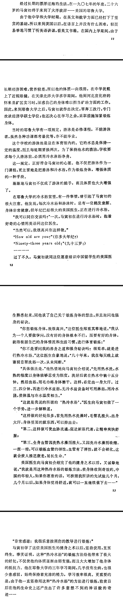
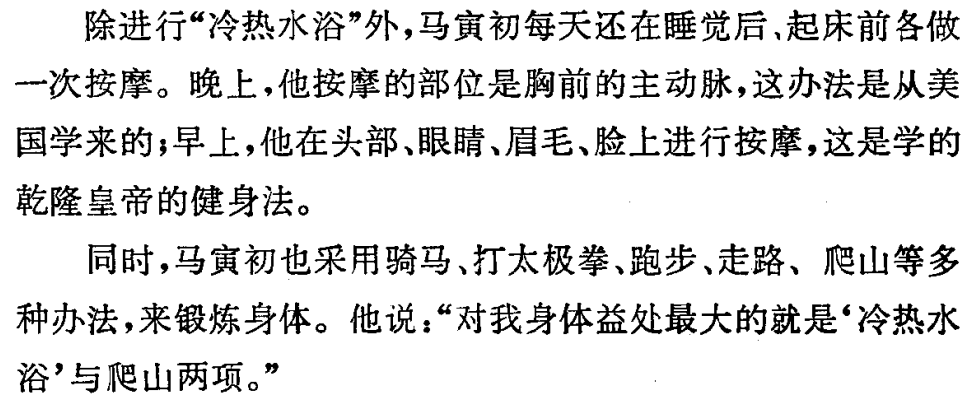
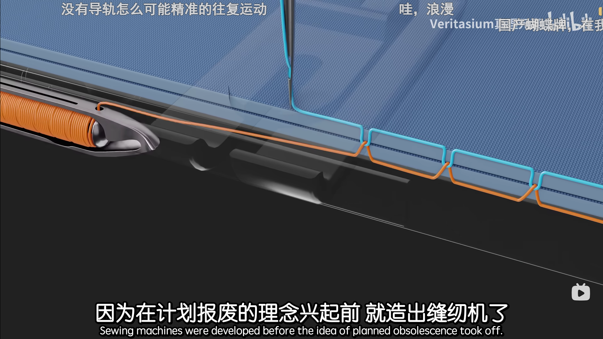
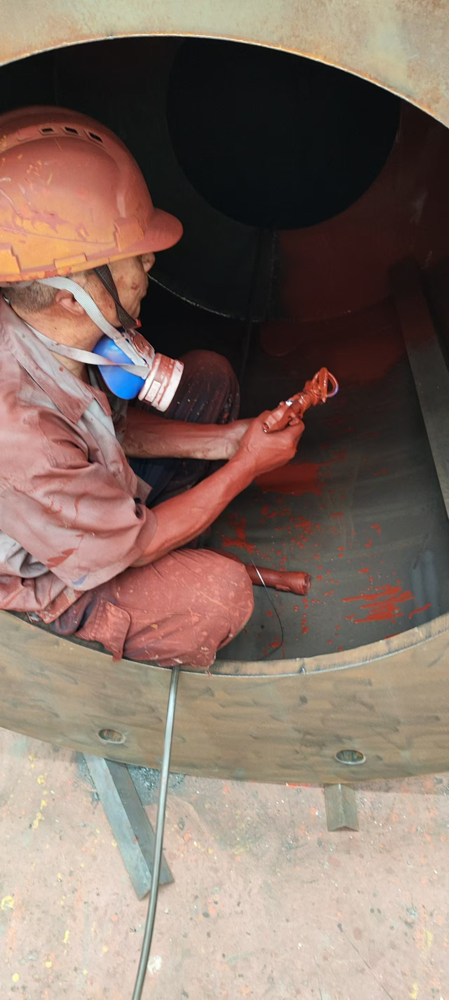
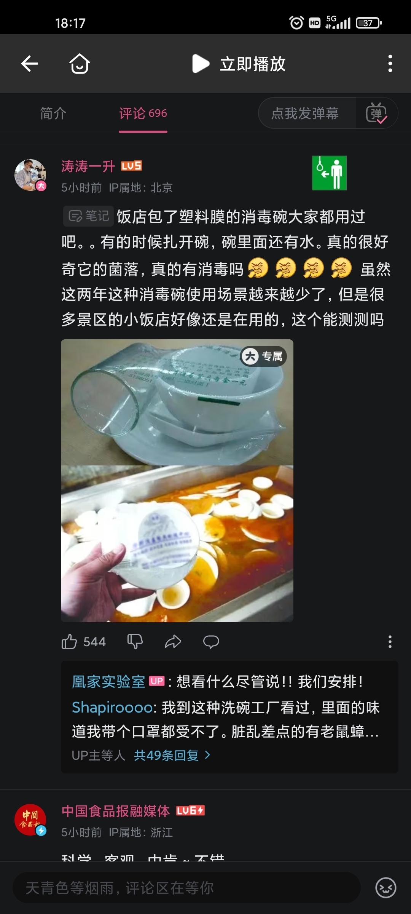

- 季节、地域、先后（上下班时点顺序）
- ((67f3c5e0-7997-4aca-a2dc-63005073aa63))
- collapsed:: true
  ---
- 自然
  id:: 670d40ca-d0a8-4564-9bac-9a0fcaab3a68
  collapsed:: true
	- id:: 678a4ddf-d89d-47c3-81b8-580fce1990c3
	  >In this world there is room for everyone. And the good earth is rich and can provide for everyone. The way of life can be free and beautiful, but we have lost the way. ——卓别林《大独裁者》
	- “大自然拿你们这些人的货币吗？不拿货币它就不生产了？你的基因和细胞呢？”
	  collapsed:: true
		- ((647015e2-9449-44fc-9236-221a75d99e55))
		- ((67a4abc4-2041-447c-adb0-0f5e50721b3d))
		- {{embed ((67c8f7e5-3d34-4160-91e7-5556fafdb529))}}
		- ((678a4ddf-d89d-47c3-81b8-580fce1990c3))
		- “很清楚了，大自然是被迫劳动和被劳动”
	- ((664da4b6-e1ed-482e-832c-f71c8a63615b))
	- [马克思自然观的三重意蕴及当代价值](https://www.hanspub.org/journal/paperinformation?paperid=94099)
	- [自在自然、人化自然与历史自然——马克思哲学的唯物主义基础概念发生逻辑研究](https://ptext.nju.edu.cn/b7/4d/c12201a243533/page.htm)
	- 土地
	  id:: 679adcd9-b9f5-4f19-8da1-f80e80a01f8a
	  collapsed:: true
		- [土地（地质学名词）_百度百科](https://baike.baidu.com/item/%E5%9C%9F%E5%9C%B0/12005092)
		- [土地分类_百度百科](https://baike.baidu.com/item/%E5%9C%9F%E5%9C%B0%E5%88%86%E7%B1%BB/1956386)
		- [农村基础设施_百度百科](https://baike.baidu.com/item/%E5%86%9C%E6%9D%91%E5%9F%BA%E7%A1%80%E8%AE%BE%E6%96%BD/1961407)
			- [我国农村基础设施建设现状及存在的主要问题 - 国家信息中心互联网门户网站](http://www.sic.gov.cn/sic/81/455/1020/8531_pc.html)
		- 耕地
		  id:: 68045d42-23d0-4e4f-b2ba-14dd669b96ca
		  collapsed:: true
			- [可耕地或者集体用地可以挖池塘搞养殖水产吗？ - 知乎](https://www.zhihu.com/question/281230494)
			  id:: 67fb1fdb-84b4-405b-89cc-69c5dd2737d5
			- 粮食种植面积、“住房”
			  collapsed:: true
			- 相对常见的政策
				- 收购价与补贴（国家成本端，农民利润端，影响农民的种粮积极性，都不种地乃至去城里打工至少对城里人就不太好了；补贴在历史上看算是毛毛雨）
				- 耕地红线
				  id:: 6645b76d-5b47-4fb0-b561-fc28ae07d915
					- [公园“还耕”？成都环城生态公园“退绿还耕”|界面新闻](https://www.jiemian.com/article/9321027.html)
					  id:: 67f72de3-86e2-4982-acd3-f3a36d668619
				- 帮扶代种（为外出务工农民工家庭提供种子、农机、人工等）
				  id:: 628b0b8b-1944-4f8a-bbae-09382c1cd3cf
				- 复耕（覆盖基本农田的撂荒地、农村新建水泥路等）
				- 如果农民不种或只种自用田，农资需求不足
					- 其他作物，政府、农业企业采购等消化
			- 土壤修复
				- 盐碱地改良（周期相对较长）
				  id:: 628b02c9-5b7e-4c42-85b0-5ca3cdbd44ec
					- 洗碱、有机肥、耐盐碱作物（含牧草）
			- ---
			- 耕地与方圆
			  id:: 681ff8cf-820c-464b-aaee-340c78c7b6bd
				- ((67eb2896-6bcf-4ec6-81cd-8c5337a04bd8))
		- [市政设施_百度百科](https://baike.baidu.com/item/%E5%B8%82%E6%94%BF%E8%AE%BE%E6%96%BD/8814422)
		- 工业用地
		  id:: 6700973c-01f8-4268-bbb2-6796b9cb8925
		  collapsed:: true
			- [怎样才能拿到工业用地？ - 知乎](https://www.zhihu.com/question/356251806)
		- 地租
		  id:: 679adcd9-0349-4e77-9a8f-f6f232873198
		  collapsed:: true
			- 商铺
				- 地下商铺
					- [实体店崩溃了：购物广场90%地下店铺倒闭，地上的商铺苦苦支撑，倒闭也是指日可待。24年比23年还艰难，25年会是什么样呢？实拍湖南长沙市中心的商场惨淡的现状。_哔哩哔哩_bilibili](https://www.bilibili.com/video/BV13QURYqEyc)
			- 摊位
			- 占道经营
				- [市政厅|彻底消除“占道经营”，城市能承受这样的代价吗？_市政厅_澎湃新闻-The Paper](https://www.thepaper.cn/newsDetail_forward_1423414)
		- 圈地
			- 要集中到哪里去？
			- [圈地运动 - 维基百科，自由的百科全书](https://zh.wikipedia.org/zh-cn/%E5%9C%88%E5%9C%B0%E8%BF%90%E5%8A%A8)
			  id:: 67077601-69fd-4959-aab5-c5b6870526b0
			- 商圈
			- ((66fbb142-69f2-41af-adfa-f46b5ee6b209))
			- {{embed ((66f68318-73fc-41be-a3c3-11f800bf3b7e))}}
		- 城市
		  id:: 679a4dd8-910d-4e61-963e-07cd9e0e4b91
		  collapsed:: true
			- [建成区_百度百科](https://baike.baidu.com/item/%E6%BB%BA%E6%88%90%E5%8C%BA/9395935)
			  id:: 67f7304a-80f6-4fa8-a51d-4961b652f9b3
			- [建成区面积与城市建设用地面积有什么区别？ - 知乎](https://www.zhihu.com/question/22301174)
			- [城市规划区_百度百科](https://baike.baidu.com/item/%E6%9F%8E%E5%B8%82%E8%A7%84%E5%88%92%E5%8C%BA/4290191)
			- [我国城市的市区、城区、规划区、建成区最详细解释—以重庆市为例|市辖区|行政区域_网易订阅](https://www.164.com/dy/article/GB0GHV1S053737T8.html)
			- 城镇化
			  collapsed:: true
				- [李强教授：主动城镇化与被动城镇化-清华大学社会科学学院](https://www.sss.tsinghua.edu.cn/info/1074/1903.htm)
			- [王澍：城市的生长细节，拆完怎么找回来？【三联人文城市】](https://www.bilibili.com/video/BV1iK4y1o7nL)
			- [人类有没有可能建立起水下都市？](https://www.zhihu.com/question/308330837)
			- ---
			- ((621f77bb-0f46-45d4-82ba-e723177e8e9e))
			- 城市，人体，信号，生长——“老利维坦了”
				- 高速（主动脉之一）
			- 学校、工厂、机房、厅堂
			- 心脑血管疾病与大城市病，拥堵，血栓
				- 毛细血管
			-
		- 绿地
		  collapsed:: true
			- ((67a1ec69-6a5a-4d23-9b92-a74d53b07365))
			- ((67f72de3-86e2-4982-acd3-f3a36d668619))
			- 公园
			  id:: 67a4ae97-ccbb-4e3b-8278-5993ed2ec40b
				- 公园是否全天开放、是否让自行车进
				- 口袋公园
					- [水石设计 | ∞ 花园/展廊 – 上海 · 新华路口袋公园](https://mp.weixin.qq.com/s/coPPZHudqle54VTQ1-IWqg)
					  id:: 622ec2f2-1a23-4f03-bf22-007d4a77335f
			- [[绿化]]
			  id:: 66f74eb5-edf3-45d1-9f02-5932570617b4
			  collapsed:: true
			- 绿道
			  id:: 67402ac7-52f5-4797-af16-18bc4c308efe
			- 绿地经济
			  id:: 670070af-be68-4c0b-a8d4-a02cf879dedc
			- ---
			- [绿地投资_百度百科](https://baike.baidu.com/item/%E7%BB%BF%E5%9C%B0%E6%8A%95%E8%B5%84/10850057)
		- 假的雨污分流、海绵工程？
	- 碳中和
		- 资源再生
		- 固碳
			- ((b1468567-a3d8-4275-af7a-e0dab50ded12))
	- 山水林田湖草沙
		- ((6708ebc5-6dc7-4a63-b65d-e4e94ea659d4))
		- [山水林田湖草沙生态保护修复项目简史（含全部项目表）-山东省环科土壤生态发展中心](https://www.sdstrst.org.cn/newsinfo/6581942.html)
		- [山水林田湖草沙工程收效如何？三部委发布18个典型案例_腾讯新闻](https://new.qq.com/rain/a/20241021A03TZ700)
	- [[生态伦理]]
- 人口
  collapsed:: true
	- ((679ea07f-4b54-4f86-a1e2-42182bf85a8d))
	- [[育儿]]
	- ((66db8aad-0c3b-4dcc-94e6-50f9d02a09b9))
	- 人口年龄结构
	  id:: 679adcd7-a90b-44b9-94ee-66b512df51d1
	  collapsed:: true
		- 抚养比
			- 影响外部积累速度
			- “人口红利”
	- 性别比例
	- 人口密度
		- [我国各省人口密度排名-第七次人口普查_哔哩哔哩_bilibili](https://www.bilibili.com/video/BV1UP4y137oH/)
	- [蔡昉：打破“生育率悖论”_澎湃号·政务_澎湃新闻-The Paper](https://www.thepaper.cn/newsDetail_forward_17545007)
	- [我国职业结构现状--基于第六次人口普查数据的实证分析 - 道客巴巴](https://www.doc88.com/p-4083469617014.html#)
	- [实时统计。世界人口时钟](https://countrymeters.info/cn/World)
	  id:: 665802fc-219e-484f-b29c-b485469bf2cd
	- [世界人口日 | 联合国](https://www.un.org/zh/observances/world-population-day)
	  id:: 679adcd7-8800-48a3-b53c-638a08b2d11c
		- [World Population Dashboard](https://www.unfpa.org/data/world-population-dashboard)
	- [World Population by Country 2024 (Live)](https://worldpopulationreview.com/)
		- ((6674da95-96f3-43ec-a39e-55b78c4ee661))
	- ---
	- [王丹寅等：中国出生人口的季节性模式分析_中国智库网](https://www.chinathinktanks.org.cn/content/detail/id/xux78386)
	- [深度｜气候变化下的生育担忧初现_澎湃世界观_澎湃新闻-The Paper](https://www.thepaper.cn/newsDetail_forward_23794397)
	  id:: 6657feeb-2bb1-4c4d-8e1f-00a9c7d6ba10
	- [环境及气候变化对人类生殖的影响现状研究-中国期刊网](https://www.g3mv.com/thesis/view/7895750)
	- ---
	- 马寅初
	  id:: 680769da-7be4-4020-bbc4-bc1b25dae4b9
		- [马寅初长寿的三个秘诀_游泳](https://www.sohu.com/a/473400978_483111)
		- [马寅初养生四“从容”--健康·生活--人民网](http://health.people.com.cn/n1/2018/0824/c14739-30248572.html)
		- [马寅初养生秘诀：内养外练](https://jnyb.zjol.com.cn/images/2022-04/14/jnyb2022041400013v01n.pdf)
		- ——《马寅初传》
		  id:: 68076dae-7cab-480d-8746-f200027ecbbe
			- [坚持洗冷热水澡，是怎样的舒爽体验？ - 知乎](https://zhuanlan.zhihu.com/p/536639053)（马寅初效仿者）
				- >我的抵抗力、免疫力应当是较好的，尤其是皮肤的自我调节、适应温差能力，强大到可以：一年四季不更换被褥，走南闯北不增减衣服。因此，我出差非常简单，只带一个双肩包、装上少许物品，就可以从南到北、从东到西，出去一两个月，都不用补给物资。
		- ——《马寅初传》
		  id:: 67bd169c-1398-4365-a6ad-2a5f468feb53
			- “坏了，‘睡觉后、起床前’，之前没发现”
		- ---
		- [马寅初被捕前后——一个经济学家的政治选择-清华大学校史馆](https://xsg.tsinghua.edu.cn/info/1004/1810.htm)
		- [享“中国人口学第一人”美誉，马寅初子孙后代今何在？](https://baijiahao.baidu.com/s?id=1621555035079517318)
	-
- ((670d40c8-4c63-4959-b08b-08be3bf3f2f6))
- 经济
  id:: 670d40c8-1dcb-4f74-bc08-c3cfd8c761ea
  collapsed:: true
	- ((62fb0b5c-3bdf-409e-ae97-d3f11345971e))
	- ((67599ec5-3994-48ae-8b9f-b0ea2e26fe85))
	- 现代人可以比梭罗过得轻松得多，还相对同代人少碳排放，
	- “经济又卫生啊，兄弟们”
	  collapsed:: true
	- “人们干着不尽相同的工作，经济竟然还可以运行起来”
	- [用"抽象法"回应政经常见问题 |《资本论》前置方法论 | 具体到抽象-抽象上升到具体 | 抽象力 | 科学抽象法 | 具体-抽象-具体_哔哩哔哩_bilibili](https://www.bilibili.com/video/BV1wzffYtEtM)
	  id:: 6879ad6e-2e76-43ea-902c-fec721dbee2a
	- [尼·布哈林、叶·普列奥布拉任斯基：《共产主义ABC》（1919）](https://www.marxists.org/chinese/bukharin/1919/index.htm)
	- [战后资本主义大繁荣的形成和破产（1984）](https://www.marxists.org/chinese/reference-books/1984book/index.htm)
	- 节约悖论
	  id:: 67c3e4f0-799f-4eff-861f-65caff7a2694
	  collapsed:: true
		- [节约悖论_百度百科](https://baike.baidu.com/item/%E8%8A%82%E7%BA%A6%E6%82%96%E8%AE%BA/10152693)
		- [什么叫经济学中的“节约悖论”？财经小白求解释！ - 知乎](https://www.zhihu.com/question/24201362)
		  id:: 679adcda-a01d-48d9-bd38-3d90ba075b6f
			- >患者自己选择买药的，也可以选择纯中医或平时注意点清淡饮食，推荐后没看到或看到没被供应上需求也可以不看，看得多了就有示范效应，进一步帮符合条件的劳动力省去一部分自己动脑试错的风险，调动开发自身潜力的积极性（而不是将“大胸”之类的身体特征视为负担），至于这样对不对，没有人是全知全能全善的，换成图灵涨胸可能他就因此自杀了，如果有极端倾向的人看了大胸行动力下降也是好事，如果多消费实际上有害商品，就可以更快生产疾病，就可以给医疗工作者带来收入，市场具有自发性、盲目性、滞后性嘛，可能存在没有这些性质的市场吗？ [[20241117]]
		- “但我还是愿意信奉亚当·史密斯专员的理论”
	- 经济损失
	  collapsed:: true
		- ((677bc4bc-2527-4a7b-9e50-c5cb923cb306))
		- [直接经济损失_百度百科](https://baike.baidu.com/item/%E7%9B%B4%E6%8E%A5%E7%BB%8F%E6%B5%8E%E6%8D%9F%E5%A4%B1/9746259)
		  id:: 678af4f5-164d-4171-9468-785ff0939e00
		- [安全生产事故的直接经济损失和间接经济损失计算 - 知乎](https://zhuanlan.zhihu.com/p/697108353)
		- ---
		- 经济损失带来的经济增长和存量
			- “降质复购”
			- 破窗理论
			  id:: 679adcda-d74a-48ea-9af1-d08e78c318ad
			  collapsed:: true
				- [破窗理论（经济学理论）_百度百科](https://baike.baidu.com/item/%E7%A0%B4%E7%AA%97%E7%90%86%E8%AE%BA/56623327)
				- >是谁在敲打我窗——《被遗忘的时光》
				- “X、反X”
				- “辞旧迎新”
					- “旧的不去，新的不来”
					- “计划报废”
					  id:: 688b27f9-05f4-4012-a764-efdf3a801431
						- 
							- ((67d68523-c84a-4406-99d3-9dd0aff1f066))
						- “过保即坏”
							- “精准的工业控制！”
							- [产品刚过保就坏是一种什么感觉？ - 知乎](https://www.zhihu.com/question/301640245)
						- [过保就坏，聊聊那些缩短产品寿命的设计](https://baijiahao.baidu.com/s?id=1807601727217183170)
						- ((688b2814-fd54-48d6-b18c-1aa5391d7d0f))
				- ((67402b15-f797-44b1-8cd3-4a044587f42d))
				- ((67402aa2-a84d-4a83-96bd-55f8355fcc54))
				- ((67402acd-c1cf-425c-acd5-ff5b2d034d3a))
				- 消费主义制造信息茧房并污染日常乃至专业话语的语料库，然后用[[AI]]帮忙救回来（“真的吗？”）
				- ---
				- [破窗效应 - 维基百科，自由的百科全书](https://zh.wikipedia.org/wiki/%E7%A0%B4%E7%AA%97%E6%95%88%E5%BA%94)
				  id:: 687718c5-f088-4292-92ef-9a68c5dc3dbe
				- ((67402ab7-753c-4680-94ca-e7516d6516fc))
			- 单透膜效应
			  id:: 679ec253-eb5d-4afc-8516-16c55236b145
				- ((679de143-381d-4beb-8e2c-cb224b5ae04c))
				- 不同人、时、空、向
				- ((66db8ad1-dbae-4ba9-935d-af5571f1f0db))
					- 因为不知道“捷径”就会多花钱，就会多“养人”，所以无知是福
	- [经济学这7篇论文看完，你也会爱上劳动经济学 - 知乎](https://zhuanlan.zhihu.com/p/462827575)
	- [温铁军十次危机总结 - 知乎](https://zhuanlan.zhihu.com/p/356441564)
		- [温铁军教授理论学习推荐路径 - 知乎](https://zhuanlan.zhihu.com/p/378013055)
		- [秦晖、温铁军、汪晖三人谈 - 知乎](https://zhuanlan.zhihu.com/p/673816643)
	- 计划、货币、市场的意义
	  collapsed:: true
		- 相比货币，计划不够同质化
		- 相比计划，货币不够有想象力
			- “货币激励”，通常没看出它激励出什么，绝大多数就是抄，就像货币就是钞
		- 为什么有部分人“眼里只有钱”的说法？
			- 只是他们“不是钱我不看”吗？
				- 可能还因为游戏等场所里到处都是货币这种统治性符号，就像孙悟空飞不出的五指山
		- 货币分配工作——市场经济条件下的人口过剩与经济效率低下
		  collapsed:: true
			- 市场经济可以起到比自然界的弱肉强食更差的效果，至少动物不仅自由而且在运动等方面很健康
			- 农业人口因为国家需要低价食材和工业原料，所以在收入剪刀差下，部分农业人口倾向于转非农业人口
			- 社会能提供的工作岗位数量是变化的，在私有化的基础之上，企业集中、技术进步、需求的细分和转变、贸易战、科技战等会导致社会岗位数量萎缩，农村收入低，很多地方的地也租出去了，可能还有房贷没还完，而高失业率会增大社会（主要是城市地区）不稳定的风险，低保等不可能随便，允许“养闲人”的后果也许会很严重（比如，有工作的人可能不满意）
			- 因此，[[外卖骑手]]、网约车司机等灵活就业者一直在外面跑，消费者一直下单也就不那么奇怪，与工会发的粮油食品类似，都是摊派“养人”，只是因为在城市工作，力度更大罢了
				- ☝️🤓“养忙人不养闲人！”
			- ---
			- 市场更容易造成供给过剩
				- 人本（“我们称之为‘人本主义’”）就不应该无“计划”地“消费”
		- 货币分配健康
		  collapsed:: true
			- 接上文，消费者养成点外卖、网约车的习惯后，自然会进一步降低运动量、延长久坐时间
			- 外卖的“隔离性”使得食材方面的恶性竞争加剧，同时，外卖包装可能比店内包装更不安全
			- 为了赶时间多送单挣钱，外卖骑手之类的群体在整体上不可避免地会更多地违反交通规则、不安全行驶，进而造成更多交通事故
	- 产品的差异化难度与就业规模、个体户
	- 计划经济
		- ((670b1075-481f-45b9-a459-d9ec8265fb01))
	- 市场经济
	  collapsed:: true
		- ((624d1fef-b51c-4666-b599-375029480545))
			- 自由人要那么多东西压着干吗？
		- 什么是市场经济？
		- “市场真的发展得更快更好吗？”
		- “运行人体的是市场经济吗？”
		- 要考虑的环节更多，效率更低
		- 偷懒必然失败
		- “也可以这样看，人们依赖货币才能运行市场经济，所以并不自由”
		- 过剩与匮乏，宽敞与拥挤，便利与麻烦，同质与差异的多重生产
		- 膳食指南等包含的相对健康的饮食习惯和健康中国包含在实际传播中，并不如，可能消费者个体的“人性”，市场条件下盈利，但也不能否认，国家也不太可能强力推广这些可能对“相对有害但能维持市场经济的习惯”而不顾就业和税收而去，除非危机已经到了必须让一部分（应该是能分割出来的）利益集团妥协以更多保留其余的地步
		- 市场效率低就低在赘肉多
		- 可能也可以说使命是神圣的，总有人要多花些窝囊费，市场不是那么容易维持的，反正在我看来这么大规模的市场简直是个奇迹，竟然能让，市场难道不伟大吗？
	- [[需求]]
	  id:: 67d6d8e7-1700-4d7e-a3d5-91d7b82adc6c
	  collapsed:: true
		- 如何确定“需求”？
		  id:: 670f0c7a-373d-4fe1-88e9-39ae16b7d900
		  collapsed:: true
			- ((679adda8-1fc5-4832-b733-68ef8eeb2e79))
			- 钱是用来干什么的？一定要“那比这好”才有动力？这部分的钱与那部分的钱如何平衡实现“效用”最大化？比如有害的加工食品增加的卫生支出能否被弥补？或者反过来，减少的卫生支出能否用于有害的加工食品的消费？相对健康的生活方式的传播会受制于“经济考量”而止步不前吗？
			  collapsed:: true
			- “你/我xx，不xx，就会xx”
			- “什么是需求？”
				- [“计划经济按照需求进行生产”这个说法为什么是错误的？ - 知乎](https://www.zhihu.com/question/496157736)
				  id:: 6717a2d1-f2c3-4440-b0df-d3b3d4b527c8
					- “人类的需求究竟是个什么东西，是否无穷无尽，是否是瞬息万变的，是否见了爱的就爱的不行，是否吃着碗里看着锅里的，一不供应上就给你抑郁躁狂的，世界各地的大学研究了很多年，也并没有完全搞清楚，可能还是斯大林的思路比较好”
						- ((67402ae3-eb71-44b3-b320-249d8edde652))
			- 思考
				- “等我想出来告诉你噢”
					- “人想象不出没见过的事物”
						- [人类真的想象不出从来没见过的东西吗？ - 知乎](https://www.zhihu.com/question/266668858)
						- “而且想象也是有成本的”
				- 思考确实需要身体，当我们看到图片联想时就是如此（？）
			- 社会学习
				- “在‘供给/供应’里挑”
					- “你平时都吃些什么啊？”
					- “比价”
					- 面目更完整、启发式的
						- “我不到啊！看看你的”
					- “攀比”
					  id:: 678a4de0-f33a-4106-b977-3b87b79d5897
					  collapsed:: true
						- >做人不要太攀比，踏踏实实做自己，如果非要比一比，那就比比激光雨
						- “人无我有，人有我优”
							- “人无我忧”
								- “人未有忧而我忧”
									- “先天下之忧而忧”
							- “人有我忧”
								- “小小震撼”
									- “震撼可能无穷无尽，但同一来源的震撼大概有限”
									- “日本震撼”
									- “苏联震撼”
										- ((670d412f-ed74-4e27-b3eb-03bc359ee0b3))
										- [1184. “苏联震撼”——前苏联/俄罗斯雕塑，建筑一览（部分）_凤凰网](https://history.ifeng.com/c/8XXMmEwkjse)
									- “美国震撼”
										- ((670f4bb3-3dae-438a-aee3-63502292a1b4))
										- ((670d40cb-7810-4836-bc8b-8ba49a29ff5f))
										- [你见过哪些美国震撼？ - 知乎](https://www.zhihu.com/question/631189964)
									- “中国震撼”
							- “人无我无”
								- “太好了，你也没有！”
							- “人有我有”
					- 跨栏
						- 考核指标
							- “我从小考到大！”
					- 权力层级制
						- “下属不许啵上司嘴”
						- >正是这些大企业主，银行家或者商人，我们看见他们在忙完事务之余，宅在家里，周遭一切似乎显得与他们格格不入：四壁促狭，房间堆满了没用的东西，有一种令人作呕的气氛。房间笼罩着各种谎言，诸如欧卜松、秋季沙龙，各种无聊风格的小玩意儿。他们看上去局促不安，就像关在笼子里的老虎那样了无生气：看得出来，他们似乎在工厂里或者银行里会快乐许多。我们以轮船、飞机和汽车的名义，恳求获得健康、逻辑、勇气、和谐和完美。——柯布西耶《走向新建筑》
						- “你不许参加[[impart]]！”
							- “我是（公共、集体的一）部分（I'M PART），我必须参加！”
						- 层级多少
							- 多层
								- “我们（“那我们呢？”）认为以下真理是不言而喻的：”
									- 人被杀，就会死
									- 人也可以饿死
								- “相同权重”的投票
									- “你投上去的人还是和你不在一个层级啊”
							- “扁平”
								- “我是本站的一把手，读者需要什么资讯，虽然海专精算不太全我要我觉得，我不要你觉得”
									- “什么公平？不就是要我的位子？竞争是吧？”
						- 黑白名单
						- “人性是吧？”
						- “用户传播”
		- 需求战
		  id:: 686a8779-adcd-46b4-bfc6-9b3a4be2fcd3
			- ~~《每天一个大脑升级词》~~
			- 历史上的强国通过先发优势为消费品等制定“X国标准”（“American Standard”）进而“国际标准”，制造不必要的需求，通过对资源的不必要但由于“使用习惯”而难于发现其不合理性（说个大家不一定同意、不一定认为说的道理的例子：空调需要把你房间乃至房子里所有空间都变凉快吗？你可能只需要坐着的那一小块空间凉快对吧？）的持续浪费创造资源等方面的稀缺，通过对资源的控制进行全产业的国际剥削——比如石油，国家很想省石油不是吗？
	- 资源战
		- 稀土战
	- （特定）经济活动的效率/性价比
		- 减少为XX的投入/消费的劳动能比不变带来更好的健康效果吗？
		  id:: 66b5ebdf-cd0d-4d0b-9005-6aa49e35503a
	- 积累/再生产与可持续、外部性
	- 来源方式
	  collapsed:: true
		- 模仿/复制/抄
			- “抄都抄不会！”
		- 创新
			- [指标体系- 中华人民共和国科学技术部](https://www.most.gov.cn/zxgz/cxdcwq/zbtx/)
			- [Nature发文：基础科学创新速度放缓，已经进入“增量时代”_澎湃号·湃客_澎湃新闻-The Paper](https://www.thepaper.cn/newsDetail_forward_21434849)
			  id:: 6709342d-d1e0-4bc0-bbca-ec526bb26ca1
			- 有的是搬运，不是吗？
			- 模式创新、技术创新、产品创新
			- ((670d40c8-6a03-4169-b8b8-db6611a96ee7))
			  id:: 670d40c8-6a03-4169-b8b8-db6611a96ee7
	- “先富带动后富”
	- ---
	- ((6705e16e-9f73-495e-8dc2-8ddffe797fbc))
		- ((670c8cd8-6068-4dbc-b6b4-47e0ef93b791))
	- 绿色经济
		- ((670070af-be68-4c0b-a8d4-a02cf879dedc))
	- 人情经济
		- “你请我~我请你~ABCDEFG~”
		- ((6706247b-218f-4686-9342-4e186e9aceda))
		- [[垃圾]]
		  id:: 67187f6b-cde1-4f11-adf9-aecc59274512
	- 玻璃、泡沫
		- 玻璃天花板
		- 玻璃珠子
	- “地府经济”
		- ((66db8af3-a63d-41d6-8b2e-d6f4e91fc8f3))
		- ((67efc0e7-7677-40c0-9e2d-366dff7f7153))
		- “地府经济学”
	- 找死经济
		- “弗洛伊德是对的，”
	- 我的经济
	  collapsed:: true
		- 个人电脑上网所需劳动时间估算
		  collapsed:: true
			- [[简单再生餐]]劳动时间
				- 获取食物等再生产资料/生活资料时间，以及品质折价（工业食物与）
				- 外卖显然是虚假的多样性的代表，花了更多钱让更多人“即时”冒险奔忙，消费者拿到的却是种类和营养更贫乏的食物
				- [农业发展阔步前行 现代农业谱写新篇——新中国75年经济社会发展成就系列报告之二 - 国家统计局](https://www.stats.gov.cn/sj/sjjd/202409/t20240910_1956334.html)
				- [蔡昉：以劳动生产率为抓手推进农业农村现代化-中国社会科学院农村发展研究所](http://rdi.cass.cn/gzsn/202407/t20240724_5766512.shtml)
				- [农业的生产时间与劳动时间:学术争论与价值意涵](http://zgnydxsk.cnjournals.net/ch/reader/create_pdf.aspx?file_no=20190202&flag=1)
				  id:: 66ef77de-08a9-4c68-91dc-ccf0efc02872
			- 电脑上网
		- “劳动防沉迷系统”
		  id:: 670f3d58-4039-46d2-b3b4-c9059ac7a126
			- [既然有青少年游戏防沉迷系统，为什么没有成年人加班防沉迷系统？ - 知乎](https://www.zhihu.com/question/647691805)
			- 客观上是有不同风险的
			- 但一开始不打断形成新秩序就会让
			- ((66fd0068-2c79-4b33-b17b-ba6d1f5bcc31)) 经济重启法
				- 经济本就是不断重启的过程，可能的因素有人体和代际就是生命不断重启的过程，请问你夜睡无梦时，你能确定你是活是死吗？
				- 一正一反的两种工作要贯穿一生，要从事十二种主业，八种副业，途经362个城市
				- 同行不同地，同地不同行
					- 跨穴循经
					- 似乎是某种按时空顺序“点穴”的操作，但
					- ((66fd4f81-7adc-4515-bc15-bbfd6c156fa8))
					- 较高的专业度以确保低风险和高效率，也需要打
					- 真的是“隔行如隔山”吗？行业进入壁垒真的有那么高吗？
			- ((66dba0b1-9d54-4a46-969b-3873217a18b1))
	- 其他草稿
	  id:: 671c91b4-76ef-4136-8e2f-c83ca17705ce
	  collapsed:: true
		- 可主动浪费的多边互惠经济
		  collapsed:: true
			- 包括更广义的，因为a对b做了好事，所以与a或b均无明确利益关系的c向a做好事，比如可能有少数人，为了道德得到了实践，比如知识分享，）
			- “惠着惠着就惠完了，然后还得到外面换”
			- 至今，虽然越来越多商品和服务开始有了“溯源”，但受限于广泛的竞争（可能技术问题倒是相当次要的），“功劳”信息仍是相当有损的，更确切地说，其中存在好事坏事同一个人担的比重不同等现象（“商业机密：我们坏在何处”），控制变量的话，即便人们对经济有了全新的理解，在一个生产力尚未达到自由王国的水平时的社会，人们以按劳分配为主，但在一开始的前提之下，我扶老奶奶过马路十回，未必有个无私的大他者帮所有人记着我的“工分”，然后我能在最近的餐馆吃到几口饭啥的，或者附近街道厨艺较好的几家人在广场合办了一场大宴，纯路人过来就吃，有人吃了较多蛋糕牛排，有人只吃了点白粥白水（也许是因为“具有长期性的宗教”，也许是因为病还没好不能大吃大喝），他们要如何“回报”呢？如果大家吃完了散伙完事，这几家人又负责采买的话，会不会吃穷然后就不办了？这种公开性远高于[[暗网]]的或许令人联想到“共景监狱”的 ((670d40c8-0385-4e2e-b489-6e81e7d9ce22)) 的共识与日常实践恐怕还是需要通过货币的流动或传播完成一部分雏形或超越（名词），以及更重要的积累
			  collapsed:: true
				- ((65669fc2-ef6e-4f92-b47c-fcd569530846))
		- 这玩意不是连小摊位都没有的大排档，
		- 关于付费
		  collapsed:: true
			- ((647015e2-9449-44fc-9236-221a75d99e55))
			- 为“准入”付费的讲座、学习班等算知识付费吗？
			- 为“准入”付费的会员们相互交流算知识付费吗？
			- 为部署一个服务的咨询付费算知识付费吗？
			- 各种中介算知识付费吗？
			- “智商税”或更常见的时点价差算知识付费吗？
			- 讨论家务的分配算知识付费吗？
			- 自己基于已有的知识想问题算知识付费吗？
				- 否则，我之前学到的那些知识，我“早就计划好了全部应用”吗？
			- 之前看的梗、鬼畜想起来可以做成视频素材，这算“知识”吗？我赞也没点甚至想办法屏蔽广告、播放量都没贡献，我付费了吗？
			- 为什么应该付费？
				- 因为我们一直在为知识付费
					- 知识付费，往往不会造成传播者的知识的损失，所以它相当于复制，只是复制成本通常会被用户忽略
					  id:: 671c4bae-05de-46c7-a72a-1930e1e4b2c1
						- 尽管上网实际上要花电费、折算的网费（除非你把它当作“早就计划好了全部内容的一次性支出”，或是“已经花了、不用想了”）、折算的水电气费（除非你在图书馆之类的地方“蹭公家的”，那么你还有交通和交通时间支出、多出来的热量缺口的食物支出）和食物费（同理），你还要克服可能的通胀，所以每一位读者都是有着大无畏的精神在完成度参差不齐的本站探索知识的——虽然很大程度上就是不知道或不想算（“假装是免费”）这些成本罢了
						- 光猫、路由器、主机、显示屏、手机充电器、息屏手机等加起来假设50W（不玩什么游戏），每天4小时，0.2度，差不多0.1元，宽带每天1元，每天20升水，一个月600升，差不多，手机电脑等硬件也要折旧
							- 只算额外的成本的话也需要每天一两元，每小时也要几毛钱，而一小时能学会什么？
						- 总之，花点时间学知识也可能花个几块钱
				- 但能联网的手机电脑是已有的，不然怎么知道有人要卖给我什么东西呢？
				- 而生产设备支出、场地和劳动时间是没有的，所以不需要复制一下产线的话就自己买了用用
	- ---
	- 经济指标
		- 恩格尔系数
			- [中国恩格尔系数低于30％，在全球是什么水平？_腾讯新闻](https://news.qq.com/rain/a/20221027A05KKZ00)
			  id:: 67eb281c-274c-4ce9-86f7-e744f6f24b0e
		- GDP
			- [毛泽东时代中国的经济水平，能用GDP评价吗？](https://mp.weixin.qq.com/s/h-eTlPW0ABvPo9gW7-oswg)
			  id:: 677f4222-f0f0-4528-a20e-8857de0461f0
			- 流动的gdp与沉淀的基础设施和人力
		- CPG
			- [美国经济新密码：从GDP到CPG的转变](https://mp.weixin.qq.com/s/v1wW-KnK24uwWTsMs6U-TA)
	- 时空量价
	  collapsed:: true
		- 借一种比较流行的炒股模型的名
		- 时空质能
		  id:: 6785cef1-d866-4bbb-b61c-e459b177814d
		- 质价量
		- [[时间]]
		- [[地球]]
		- [糖域模型 - 集智百科 - 复杂系统|人工智能|复杂科学|复杂网络|自组织](https://wiki.swarma.org/index.php/%E7%B3%96%E5%9F%9F%E6%A8%A1%E5%9E%8B)
		- 密度
		  collapsed:: true
			- 低成本，高流通频率
			- 蜂拥拥堵
				- ((670883cb-d60e-4a35-a062-e5097dd77d76))
					- 广告视频画质高吗？如果原本高，但是实际不高，广告主是否会与平台交涉？
				- “并非完全有序地排队上公交车呐”
					- ((66db8af3-b2a7-4e2b-890a-73fb82e6872a))
			- 集中度
				- “大家都赚大钱？那么你说，钱去哪了呢？”
			- [解释城市｜经济密度：工业上楼为什么？亩产论英雄论什么？_全球智库_澎湃新闻-The Paper](https://www.thepaper.cn/newsDetail_forward_26009910)
			  id:: 679adcda-be3b-4f5b-8285-499e77b1adb2
			- [2018 年计量经济学会弗里希奖授予论文《密度经济学：柏林墙的启示》，对城市经济学研究有什么启示？ - 知乎](https://www.zhihu.com/question/292715260)
				- [2018年计量经济学会弗里希奖 │密度经济学：柏林墙的启示](https://mp.weixin.qq.com/s/Qd47tLseLedgnih5pRsSoA?utm_oi=681259938462961664)
			- [中国50城拥堵真相！北京人均拥堵成本破千：高德数据报告 - 知乎](https://zhuanlan.zhihu.com/p/49332244)
			- [“15分钟生活圈”是如何提出的？它又怎样在国内外各大城市“生根发芽”？- · 科普中国网](https://www.kepuchina.cn/article/articleinfo?business_type=100&classify=0&ar_id=509935)
			- 租金
			  collapsed:: true
				- “甜~”
				- 高密度高租金
			- ((6705e72d-cc65-4850-95f3-1d1a4258c008))
			- 结婚成本
				- “看不见的恋人”
					- “啊？有游戏？”
					- 异步谈判式的[[微信]]之恋
			- 空旷地带，商业街，挤地铁， ((67ad6984-dcb1-4df4-a7e9-763b15db7b16))
			- 商业街
				- “选择性流水线”
		- ((66a4281d-1fee-4265-8f16-f56f3ca8c46e))
		- 质量
			- [中国质量认证中心](https://www.cqc.com.cn/www/chinese/index.shtml)
		- 价值与价格
		  collapsed:: true
			- [《马克思主义思想辞典：V》](https://www.marxists.org/chinese/dictionary-of-marxism/marxist.org-chinese-dictionary-of-marxism-V.htm)
			- 价值
				- 剩余价值
				- 附加值
				- 锚定
			- 价格
				- 评价
				- 溢价
				  id:: 66fd4435-f825-4e69-931e-540b609100ff
					- 绿色溢价
						- [环球零碳科普 | 什么是绿色溢价？跟碳价格有什么关系 - 知乎](https://zhuanlan.zhihu.com/p/454324000)
					- “智商税”
					  id:: 66fd447d-49be-403e-be87-a8194971f55b
				- 指导价格与传导价格
				- 价格都是边际价格，量变价变，可能接近U形曲线
			- 语言贬值、腐败
				- “生活方式”与消费主义
				- 语言编制
				- “伟大”
	- 时空密数（数就是很高的密度，比一般语言更高）
	- ---
- 产业
  collapsed:: true
	- ((67a45399-42a4-4fb7-908a-f35ece390f83))
	- “说文解字”
		- 稷
		- 畿
	- [行业、产业、产业链和供应链，你能分清吗？ - 知乎](https://zhuanlan.zhihu.com/p/651197196)
	- [[公司给的生活]]
	- 三产/三次产业/三大产业
		- [三次产业是怎样划分的 - 国家统计局](https://www.stats.gov.cn/zs/tjws/tjbz/202301/t20230101_1903768.html)
			- >第一产业是指农、林、牧、渔业（不含农、林、牧、渔专业及辅助性活动）。第二产业是指采矿业（不含开采专业及辅助性活动），制造业（不含金属制品、机械和设备修理业）......
		- “次”大概对应“产业革命”
		- [政府机构属于第三产业吗_百度知道](https://zhidao.baidu.com/question/208299966.html)
		  id:: 670f00e0-fd8a-45b5-8667-61efda894e67
		- 服务业
		  collapsed:: true
			- “第三次？自古以来！工业化主线太耀眼导致的”
			  collapsed:: true
				- [服务业不等于第三产业 有其自身演进历史与逻辑_经济学人_财经纵横_新浪网](https://finance.sina.com.cn/economist/jingjixueren/20050307/10051408469.shtml)
			- 现代服务业
			  id:: 670d40c8-5cf9-4337-b9c8-218e5ad3e4a5
			  collapsed:: true
				- [《现代服务业统计分类》（国家统计局令第36号） - 国家统计局](https://www.stats.gov.cn/sj/tjbz/gjtjbz/202307/t20230728_1941612.html)
				- [现代服务业 - MBA智库百科](https://wiki.mbalib.com/wiki/%E7%8E%B0%E4%BB%A3%E6%9C%8D%E5%8A%A1%E4%B8%9A)
				- “现代服务业就是‘家人们’——“小姐姐”、“小哥”等——基于从‘家庭内部劳动’中剥离或者说剩余下来的‘家务劳动’的劳动构成的产业外显，结合现代描述古代的常见说法就是‘以我为主’的‘家天下’，现代服务业是一个潜伏在后现代社会的一个纯正的前现代经济动力，听懂掌声！”
				  id:: 670c9a76-6dc1-4f8b-aec8-8008e78cc539
					- ((67033f50-50b1-4496-b777-2437da332069))
			- >服务业是刻意去工业化避免失业吗？联系我发的上一条
				- 将服务业发展与工业化进程、就业结构变革联系起来分析，需要超越简单的"替代论"或"阴谋论"，而应置于经济演化规律和技术革命框架下审视。以下是系统性解答：
				  
				  ---
				- ### **核心结论**
				  服务业扩张并非刻意"去工业化"，而是工业化成熟后**要素价格变化**与**需求结构升级**共同驱动的必然结果，其就业吸纳能力实为**产业升级的伴生现象**而非预设目标。
				  
				  ---
				- ### **三层递进解析**
				- #### **一、工业化与服务业的内在演进逻辑**
				  1. **成本病效应（Baumol's Cost Disease）**
					- 制造业技术进步快 → 单位产品所需劳动力持续下降（汽车装配线工人减少90%）
					- 服务业效率提升有限（教师/护士无法大幅压缩服务时间） → 劳动力被迫向服务业转移
					  
					  2. **恩格尔定律作用**
					- 人均GDP超过1万美元后，消费结构中服务占比突破50%（中国2023年达54.3%）
					- 从"购买商品"转向"购买体验"（健身私教、旅行定制等）
					  
					  3. **产业迂回化加深**
					- 工业化后期，生产性服务业（物流、研发、金融）占制造业成本达40-70%
					- 苹果公司63%营收来自服务业（App Store、iCloud等）
				- #### **二、失业防御的真相：服务业是缓冲器而非避难所**
				- **自动化悖论**
				  制造业每减少1个岗位，服务业创造2.3个岗位（OECD数据），但其中：
				  ✅ **高价值岗位**：算法工程师、生物信息分析师（占15%）
				  ⚠️ **低端岗位**：外卖骑手、客服（占62%）
				- **技能错配危机**
				  美国制造业工人转型服务业的平均薪资下降23%，德国通过"双元制"职业教育将错配率控制在11%以下
				- #### **三、政策干预的边界**
				- **错误示范**：巴西过早去工业化（制造业占比从1985年36%跌至2023年12%） → 陷入中等收入陷阱
				- **成功案例**：德国坚持制造业占比20%红线 + 发展工业4.0服务化（预测性维护等） → 失业率长期低于4%
				  
				  ---
				- ### **数据透视：中美德产业就业对比**
				  | 国家  | 制造业就业占比 | 服务业就业占比 | 人均GDP   | 基尼系数 |
				  |-------|---------------|----------------|-----------|---------|
				  | 中国  | 18% (2023)    | 53%            | $12,741   | 0.467   |
				  | 美国  | 8%            | 79%            | $76,399   | 0.494   |
				  | 德国  | 19%           | 71%            | $51,204   | 0.316   |
				  
				  _数据来源：世界银行、ILO_
				  
				  ---
				- ### **结构性风险预警**
				  1. **服务业过度膨胀的陷阱**
					- 英国金融业占比GDP达12% → 2008年危机中制造业产能不足以对冲风险
					- 健康阈值：制造业占比不宜低于15%（MIT生产率委员会建议）
					  
					  2. **低端服务业就业依赖症**
					- 印度IT服务业创造300万高薪岗位，但同期新增1.2亿低端服务业就业 → 贫富差距扩大
					  
					  ---
				- ### **战略平衡路径**
				- #### **一、对发展中国家的启示**
				- **制造业根基守卫**
				  ✅ 用工业机器人提升效率（中国工业机器人密度达392台/万人）而非放弃制造
				  ✅ 发展"服务型制造"（三一重工设备健康管理服务贡献35%利润）
				- **服务业升级方向**
				  ✅ 培育知识密集型服务业（KIS）占GDP比重超30%（当前中国仅12.5%）
				  ✅ 建立服务业生产率评估体系（如教育业引入学习成果量化指标）
				- #### **二、对个体的应对策略**
				- **技能组合重构**
				  ✅ "制造业+"技能：数控机床操作员学习数字孪生建模
				  ✅ "服务业+"技能：护士掌握老年康养机器人运维
				- **地域再平衡**
				  ✅ 中国"东数西算"工程：东部发展高附加值服务业，西部承接数据中心等制造相关服务
				  
				  ---
				- ### **历史镜鉴**
				- **英国的教训**：19世纪后期过早转向金融服务业，导致二战期间军舰产能不足
				- **韩国的经验**：2000年后将制造业占比稳定在25%-28%，同时培育游戏、K-pop等高附加值服务业
				  
				  产业结构的演变如同生态系统的更替，健康的服务业发展应根植于强大的制造业"土壤"。正如德国弗劳恩霍夫研究所揭示：**制造业每1欧元产出，能拉动2.3欧元服务业增值**——这或许比单纯讨论"替代"更具建设性。
	- ---
	- ((6708ebc5-6dc7-4a63-b65d-e4e94ea659d4))
	- 第四产业
		- [第四产业_百度百科](https://baike.baidu.com/item/%E7%AC%AC%E5%9B%9B%E4%BA%A7%E4%B8%9A/250379)
	- 第五产业
		- “搜索等待时已经开始笑了”
		- [第五产业_百度百科](https://baike.baidu.com/item/%E7%AC%AC%E4%BA%94%E4%BA%A7%E4%B8%9A/8872935)
	- 第六产业
		- [第六产业_百度百科](https://baike.baidu.com/item/%E7%AC%AC%E5%85%AD%E4%BA%A7%E4%B8%9A/5182871)
	- ---
	- [少扯自由主义水变油，谈六小龙为什么出在杭州](https://mp.weixin.qq.com/s/j6slKLekY0pFvTPW5TPD6w)
	  id:: 67aaae88-f66c-49fa-bb23-ed47d44526ff
- [[行业]]
  id:: 67eb2acc-a4d3-47ee-affe-4f09f40ee0af
  collapsed:: true
- 职业
  id:: 66db8aad-16c2-4c9c-9cf3-eff3cc938102
	- [曾风靡全球的励志神曲《B What U Wanna B》（无损音质）：励志歌曲也有这么轻松好听的旋律！_哔哩哔哩_bilibili](https://www.bilibili.com/video/BV1gr4y1U7SE)
	- [中华人民共和国职业分类大典（2022年版）.pdf](http://guojian.org.cn/%E4%B8%AD%E5%8D%8E%E4%BA%BA%E6%B0%91%E5%85%B1%E5%92%8C%E5%9B%BD%E8%81%8C%E4%B8%9A%E5%88%86%E7%B1%BB%E5%A4%A7%E5%85%B8%EF%BC%882022%E5%B9%B4%E7%89%88%EF%BC%89.pdf)
		- [职业分类大典系统](http://osta.mohrss.gov.cn/career)
	- [[职业卫生]]
	- [[多零工]]
	- [为应对时局变化，我们会尽全力为职业青年提供线上线下的就业辅导和失业帮助。-未明子的动态-哔哩哔哩](https://t.bilibili.com/1053316767780175873)
	  id:: 67f61964-1963-4813-9257-f7552ce4a6a6
	- [职务、职位、岗位、职能、职级、职责、职权、职称、职业_区别和联系 - 知乎](https://zhuanlan.zhihu.com/p/454277070)
	- 职业资格
	  id:: 670d40c8-a7e0-4c9b-87e8-29d4545b7c66
	  collapsed:: true
		- [职业资格目录](http://www.osta.org.cn/evaluation)
		- [国家职业资格目录（2021年版）](https://www.gov.cn/zhengce/zhengceku/2021-12/03/5655553/files/86876724c6ee4cdcb3d0be524aee036f.pdf)
	- 职业技能等级
	  collapsed:: true
		- [国家职业技能标准查询系统](http://osta.mohrss.gov.cn/skillStandard)
			- “技能要求——这下能能能能了”
		- [一篇读懂！职称与职业技能等级证书的区别与联系 - 知乎](https://zhuanlan.zhihu.com/p/660969478)
	- 职称
	  collapsed:: true
		- [三分钟看懂，什么是职称？如何获取职称？ - 知乎](https://zhuanlan.zhihu.com/p/269045968)
		- [职称 - 维基百科，自由的百科全书](https://zh.wikipedia.org/wiki/%E8%81%8C%E7%A7%B0)
		- 层级结构，有多少教授、主任、经理、总工、导师
	- 岗位
		- “包袱岗”
			- “技术储备岗”
				- [应届大学生进车企做技术储备岗，小心入坑了，被PUA了。_哔哩哔哩_bilibili](https://www.bilibili.com/video/BV1pk4y1e7mm/)
	- 疗休养
	  id:: 67e415e4-e500-4a9c-a7a4-afc61e49c031
	  collapsed:: true
		- 回扣
		- 山高路远坑深
	- ---
	- TODO [中国的工资、就业与劳动份额 (豆瓣)](https://book.douban.com/subject/36840443/)
	- [中国最新工作岗位分类标准——中国教育在线](https://www.eol.cn/html/c/gwfl/index.shtml)（这个可能是这网站整理设计的，好像是按“职能”和“行业”混合分类的）
	- ((66db8aad-0c3b-4dcc-94e6-50f9d02a09b9))
	- [麦可思研究院《2024年中国本科生就业报告》](https://user.guancha.cn/wap/content?id=1250189)
	- [出走格子间，去做“体力活”的年轻人怎样了？｜有数_澎湃号·湃客_澎湃新闻-The Paper](https://www.thepaper.cn/newsDetail_forward_22775961)
	  id:: 669c6313-6008-4123-a812-98eb980ed68f
	- ((679adcd9-4cab-4e0f-8a24-892407a7369d))
	- “农民工”
		- [2023年农民工监测调查报告 - 国家统计局](https://www.stats.gov.cn/sj/zxfb/202404/t20240430_1948783.html)
		  id:: 6724e874-b761-4498-8657-2c2eb0555e38
		- [农民合同制工人_百度百科](https://baike.baidu.com/item/%E5%86%9C%E6%B0%91%E5%90%88%E5%90%8C%E5%88%B6%E5%B7%A5%E4%BA%BA/3850562)
		- [农村合同制工人和城镇合同制工人有什么区别？ - 知乎](https://www.zhihu.com/question/63545329)
- 工程
  collapsed:: true
	- [【47集】工程学速成班-中英cc字幕-土木工程-机械工程-网络工程-生物工程-电气工程-英语听力口语单词-CrashCourse_哔哩哔哩_bilibili](https://www.bilibili.com/video/BV1MG4y1d7nU)
	  id:: 67b53e38-71fe-4a57-9ccf-5ef46b8a6e55
		- 对赶时间开干的人还是慢了点
- 工艺
  id:: 67402ab0-228f-4a39-aa1a-b6ef9e333345
  collapsed:: true
	- （现代）工艺观赏
	  collapsed:: true
		- “愉悦工艺”
		  collapsed:: true
			- “没有灵魂”
			  id:: 68172ec5-e0ad-43e6-9775-efe0d9b86d44
				- >蚜虫吃青草，锈吃铁，虚伪吃灵魂——契诃夫《我的一生》
				- ((68186ed7-cb61-4721-b01e-7faa24794d25))
			- [那些看起来让人愉悦的工业机器和巧妙工具_哔哩哔哩_bilibili](https://www.bilibili.com/video/BV15Y4y1H7FB)
			  id:: 6799b16c-5055-42cf-883e-2684c8d0066f
			- ((62485142-b44b-4c92-9c31-f66f0b1bef55))
			- “快！”
				- [速度就是生产力_哔哩哔哩_bilibili](https://www.bilibili.com/video/BV1Ui4y1c7go)
		- [难以想象这是上世纪的产物_哔哩哔哩_bilibili](https://www.bilibili.com/video/BV1HxrrYaEMh)
		  id:: 67999955-bd77-411a-8bea-b564843b19c8
		- ((68172e25-503a-48ab-938a-bc17f04f92c0))
		- 较完整的工艺
		  collapsed:: true
			- [一切的流程的个人空间-一切的流程个人主页-哔哩哔哩视频](https://space.bilibili.com/3493082129500984)
			- [MiracleProcess的个人空间-MiracleProcess个人主页-哔哩哔哩视频](https://space.bilibili.com/369308230)
			- 世界各地的工艺
				- [发光的三极管yoyo的个人空间-发光的三极管yoyo个人主页-哔哩哔哩视频](https://space.bilibili.com/1135981288)
				  id:: 688b27f9-dfa7-439a-91e9-916dc5187c02
		- 从精致生产视频到繁重生产视频
	- 古代工艺
	  collapsed:: true
		- ((679adcde-cf2a-466c-b937-c5e53601cc2d))
		- ((67d03aad-0797-4c0c-b107-bd6cbcdcbb20))
		- 《天工开物》（明·宋应星）
		  id:: 688b27f9-1384-437d-8edf-947c8664185c
			- [太牛啦！七旬老人复原天工开物古工具！_哔哩哔哩_bilibili](https://www.bilibili.com/video/BV14T4y1a7Wg)
			  id:: 67b32996-5823-4c99-9804-148292e3b6a6
			- [鲁磊的个人空间-鲁磊个人主页-哔哩哔哩视频](https://space.bilibili.com/1922513266)
			- [【天工开物】古法制造传习之旅【15集全】_哔哩哔哩_bilibili](https://www.bilibili.com/video/BV1Fx411u79N)
			  id:: 67b327e1-beb0-4a2a-aafd-0a0c01ccd557
			- ---
			- [天工开物 – 书格（旧版）](https://old.shuge.org/ebook/tian-gong-kai-wu/)
	- 木工
	  id:: 67b43ac6-4c6b-4a59-8fec-afe054a98df3
	  collapsed:: true
		- [“当代鲁班”！63岁中国爷爷成油管网红_哔哩哔哩_bilibili](https://www.bilibili.com/video/BV1g54y1q7QD)
		- 木工修边器
		- ((6865c676-e3c6-483e-a764-89676bb75000))
	- bushcraft
	  id:: 683febb6-ed98-4bc3-98af-e18a51d66485
	- 研发
		- [什么是研究与试验发展（R&D）经费 - 国家统计局](https://www.stats.gov.cn/zs/tjws/zytjzbqs/yjysy/202409/t20240910_1956367.html)
	- ---
	- 与“岗位”、“工具”、“工件”更贴近
	- [人们常说的的技术和工艺有什么区别？分别是什么？ - 知乎](https://www.zhihu.com/question/31531593)
	- [设计、工程、技术、工艺的区别和联系是什么？它们在现代社会是怎样融合在一起的？ - 知乎](https://www.zhihu.com/question/66759222)
	- 工段、工序
		- [安全生产管理丨化工生产过程中“工段”与“工序”的区别](https://baijiahao.baidu.com/s?id=1786958386005074458)
	- [写给设计师的工艺全书 (豆瓣)](https://book.douban.com/subject/35101669/)
	- 工艺交流
	  id:: 67127072-19b5-41b4-accd-60ce5deb0ac5
	  collapsed:: true
		- ((67b2b6a5-aefb-4d06-b7d2-5a06eb18c59d))
	- [张一兵丨工艺学与历史唯物主义深层构境——马克思《伦敦笔记》中的“工艺学笔记”研究（回到马克思）书评](https://book.douban.com/review/14991386/)
	- ---
	- [[人体象形动作库：互联网时代的百般武艺]]
	- ((67e3f7cc-1225-411d-a94a-c4b80379e3e6))
	- ---
	- [[生物]]
	- 种植基质布设
	- 浇铸
	- 注塑
	  collapsed:: true
		- TODO [先进注塑模设计手册_哔哩哔哩_bilibili](https://www.bilibili.com/video/BV1nWUzY6EXB/)
		- [3分钟带你了解注塑工艺_哔哩哔哩_bilibili](https://www.bilibili.com/video/av82717052/)
		- [小哥在家注塑生产护目镜，劳动节劳动一下！_哔哩哔哩_bilibili](https://www.bilibili.com/video/BV16k4y1r7JQ)
		  id:: 67a2f648-142a-476d-866a-f9f7d8df50aa
		- [因使用微型注塑机，被全网劝退，叫我别搞了！_哔哩哔哩_bilibili](https://www.bilibili.com/video/BV1Pe4y197Vd/)
		- 注塑气泡
			- [注塑产品有气泡是什么原因？如何解决 - 知乎](https://zhuanlan.zhihu.com/p/161323465)
			- [透明产品有气泡，怎么办？ - 知乎](https://zhuanlan.zhihu.com/p/531375653)
	- 洗选
	- 粉碎
	- 馏
	  collapsed:: true
		- 干馏
		- 蒸馏
	- 增材
	  collapsed:: true
		- [增材制造技术（采用材料逐渐累加的方法制造实体零件的技术）_百度百科](https://baike.baidu.com/item/%E5%A2%9E%E6%9D%90%E5%88%B6%E9%80%A0%E6%8A%80%E6%9C%AF/1106573)
		- [[3D打印]]
		- [格智百科 | 电弧增材不就是焊接吗 - 知乎](https://zhuanlan.zhihu.com/p/541177135)
	- 电线杆水泥柱模具
	- [[测量]]
	  id:: 68292258-170c-49bd-a387-3a8338217fe8
	  collapsed:: true
	- 精度
	  collapsed:: true
		- [互换性、公差、配合、加工精度，关于公差的基础知识详细解读 - 知乎](https://zhuanlan.zhihu.com/p/493265444)
		- 加工精度
			- ((67e0d137-bfa1-426a-9fa9-e48ba151ba45))
			- [各类机加工方式所能达到的精度&粗糙度 - 知乎](https://zhuanlan.zhihu.com/p/354685915)
			- [第4课：公差设定与加工精度等级_哔哩哔哩_bilibili](https://www.bilibili.com/video/BV1kf421X7G9?spm_id_from=333.788.player.switch&vd_source=760fd7e6083addcc60d79ccf89caa139&p=4)
			- ((67f65725-1f53-4bef-8ac0-80fa922d23f3))
		- 配合
			- [就喜欢这刚刚好的一瞬间_哔哩哔哩_bilibili](https://www.bilibili.com/video/BV1odoqYJEwy/)
			- [公差配合：如何为工程应用选择配合 - 韦克快速成型](https://waykenrm.cn/blogs/types-of-engineering-fits/)
			- ((67fccd3e-eb1d-48e5-b2e1-49508eba106d))
		- ((67eb2820-c906-4312-b1e5-5c04f544dd4e))
	- [金属表面处理（看了不一定会，但不看绝对不会） - 知乎](https://zhuanlan.zhihu.com/p/263276939)
	- 切割
	- 旋转
	  id:: 679adcda-0acc-497c-a5c5-56d888ec4fbb
	  collapsed:: true
		- ((679adcda-0acc-497c-a5c5-56d888ec4fbb))
		  collapsed:: true
		- 攻丝
	- 焊
	  id:: 67e3cbc3-003a-4d7d-b779-f2d56170b3e1
	  collapsed:: true
		- [职业安全健康展：电焊工的职业危害因素有哪些？](https://www.ciosh.com/news/2475)
		- [焊工证有四种，你分得清自己要考哪种吗？ - 知乎](https://zhuanlan.zhihu.com/p/194286901)
		  collapsed:: true
		- [“电焊工”你们体检了吗 ？_澎湃号·政务_澎湃新闻-The Paper](https://www.thepaper.cn/newsDetail_forward_16021263)
		- [【焊接常识一】焊接作业对眼部的危害及防护措施 ](http://www.timewelder.com/uppic/20150728/55b6de4ecc766.pdf)
		- [史上最全防护攻略——焊接时该如何保护眼睛？_电焊](https://www.sohu.com/a/440153538_100286989)
		- [电焊工安全操作规程详解](https://baijiahao.baidu.com/s?id=1781784303806947852)
		- 不裸露皮肤
		- ((67eb9310-66ee-4cb3-afbe-5d064af0c591))
		- ((67eb2820-c1a2-4e2f-b0c9-53eb116f2b72))
	- 吹制
	  id:: 67cbb326-97c8-418f-b3c7-71171e9233d1
	  collapsed:: true
		- ((67ea00b1-0a5e-49dd-840a-76dd9aed922a))
		- ((67d3cf41-8468-4e5d-b67c-37121daf2d40))
		- ((67e557de-c3d4-4461-af76-512ed66b65a9))
		- ((679adda6-9124-44ab-aa4a-457de558cd5e))
	- 喷漆
	  id:: 67402ab0-1490-45c3-865d-dd1d5ab49dc9
	  collapsed:: true
		- [专业的喷漆师傅_哔哩哔哩_bilibili](https://www.bilibili.com/video/BV14V411v7Gy)
		- 大管道内喷漆
			- [什么是管内喷涂技术？给管道内壁喷上一层保护膜，延长寿命数十年_哔哩哔哩_bilibili](https://www.bilibili.com/video/BV1sp421R7Pu)
			- 
				- [通义tongyi.ai_你的全能AI助手-通义千问](https://lxblog.com/qianwen/share?shareId=0bf5f61b-7197-40a1-bf60-2fa36f33d812)
				- >还有就是不懂师傅在干什么，管道内为什么有那么多不像是喷而是漏出来的漆
				  手下方比较细的可能是气管，喷漆枪不知道什么类型的，没看到上面大概要有的漆罐
				  管道地上的可能是手电，像是都被喷上了，不知道怎么抓的，总不至于叼着吧？但也可能是用了较长时间没去洗
				  可能还应该有个头灯
				  从头发看可能有60岁以上？
				  坏了，显示器比较暗，调亮了看到里面喷过的一些漆了（）
				  漆要是喷多了也可能滚下来，这个管道有两根角铁固定住，如果因为漆罐不密封、供气气压不可调等导致喷漆角度受限，可能要转个几次才能喷完，可能还要等漆干再踩上去
				  一次喷不完，可能他得斜着喷
				  还有就是他为什么不离开管道到外面溜达，而是可能基于什么不离开岗位的工作伦理继续在管道内闻味，看着刚喷的漆面或接下来要喷的区域
				  如果图中的管道只喷了那一片区域，为什么手臂（看起来）和衣服都有油漆色？因为工具不好？因为他不止喷一个管道（但看起来他在等这个管道，而不是频繁切换）？还是他的工作服像手电筒那样是洗得少？裤子更容易沾到？
				  喷漆滤罐是朝下的，他那个也有点包浆
	- 抛光
	  collapsed:: true
		- [在化学面前人工抛光被秒成渣_哔哩哔哩_bilibili](https://www.bilibili.com/video/BV12E411N7bE)
	- 清洁、涂抹
	  collapsed:: true
		- 刷子
		  id:: 67fb92b2-f8f5-4753-a87e-eea7ef421f13
			- [小镇小手艺 做成百亿大产业_光明网](https://economy.gmw.cn/2023-07/26/content_36721686.htm)
			- [小伙用刷子制作“禾下乘凉”丰收季节，成品一出网友惊呼：创意好_哔哩哔哩_bilibili](https://www.bilibili.com/video/BV1vb4y1h7X4/)
			  id:: 67eb9e9b-1956-4f1c-9142-c94dcab97685
			- [大叔用刷子墙上写字堪比印刷体：月入过万邀约不断_哔哩哔哩_bilibili](https://www.bilibili.com/video/BV1Xi4y1j7sb)
			- 医疗刷
				- [医疗刷自动组装设备_哔哩哔哩_bilibili](https://www.bilibili.com/video/BV1tj421Z7kf/)
	- 半导体工艺
	  collapsed:: true
		- [制造工艺书籍：萧宏_Introduction to Semiconductor Manufacturing Technology - 第3页 - 生产/封装资料区 -  EETOP 创芯网论坛 (原名：电子顶级开发网) -](https://bbs.eetop.cn/thread-951046-3-1.html)
	- 偶然凝视沉思劳动的痕迹
- 标准
  id:: 67402ab0-6f4f-4f5d-a7c6-52aafddba9f1
  collapsed:: true
	- [非标产品_百度百科](https://baike.baidu.com/item/%E9%9D%9E%E6%A0%87%E4%BA%A7%E5%93%81/1755418)
	  id:: 67b3e608-5b35-4870-a083-c0e46b37ae9c
		- “先非标后（可能成为）标准”
	- 可查看产品包装上的“执行标准”、“产品标准号”
	  collapsed:: true
	- [国家标准全文公开](https://openstd.samr.gov.cn/bzgk/gb/index)
	  id:: 66db8aad-f2b5-42f7-99b8-0844904bd3ee
	- [首页 - 全国标准信息公共服务平台](https://std.samr.gov.cn/)
	  id:: 67eb2acc-724a-4339-8b6f-18846768f605
		- 在搜索引擎搜可能更多搜到它，可以点右侧“全文”跳转阅读、下载页面
		- >食品安全、环境保护、工程建设方面的国家标准未纳入本系统，请咨询相关部委。
	- ((670b7782-0fbf-4768-a570-9ae6592d4e54))
	- [食品伙伴网下载中心_食品行业资料和标准交流_食品伙伴网](http://down.foodmate.net/)
	- [工艺标准与质量标准有什么区别?_百度知道](https://zhidao.baidu.com/question/493971114.html)
	- 标准的切换
	  collapsed:: true
		- 初级农产品、矿产怎么变成食品？
	- ---
	- [标准、规范、规程的区别与联系](http://www.360doc.com/content/23/0904/10/272091_1095163071.shtml)
	  id:: 666edf09-c993-4291-811e-86c67c7bc692
	- 找相关标准（也可以在知道执行标准后再搜），看检测报告（一般在商品描述里有也看不清细节，要问客服）和执行标准（商品评论的图片里可能有，或者问客服），对照检测报告和执行标准确认商品在执行标准中的性能、分类、等级等
	  collapsed:: true
		- 以及标准的检验方法的标准
	- 有需要还可对比不同的标准（新版老版、国内外、国家标准、行业标准、企业标准等），因为有些标准在性能等方面要求更高，或者旧标准的性能要求也够了
	- 标准查询和比较解读
		- [[头盔]]
	- ---
	- 标准化定制服务（？）
- 雇主
  collapsed:: true
	- 商事主体
	- [法人单位_百度百科](https://baike.baidu.com/item/%E6%B3%95%E4%BA%BA%E5%8D%95%E4%BD%8D/5094642)
	- ((6710f79d-5235-49b1-b914-869191626b3e))
	- [资本家为什么说资本家不劳动，脑力劳动不算劳动吗？ - 知乎](https://www.zhihu.com/question/611703561)
	- 营业执照
	- 参保人数
	- 企业
	  collapsed:: true
		- 公司
			- 什么“公”司？都是“公”司吗？不如司康
			- [[公司给的生活]]
		- [经营范围规范表述查询系统](https://jyfwyun.com/)
		- [吊销、撤销和注销三者的区别 - 知乎](https://zhuanlan.zhihu.com/p/297675737)
		- 企业相关权
		  id:: 6806d598-3165-4113-b604-0fb301752c72
			- [怎样保证你不是AGI独裁者？马斯克为何退出OpenAI？早期邮件公开了](https://mp.weixin.qq.com/s/EXTrZDtmahiGL-4bnHql0g)
			  id:: 67eb282a-c27e-49a8-8ab6-b4f19eaa425c
			- [企业管理权、经营权、所有权、控制权的不同以及各属于哪些机构（如董事局、股东大会。。。）？谢谢！-ZOL问答](https://ask.zol.com.cn/x/24096063.html)
			- [企业管理权 - MBA智库百科](https://wiki.mbalib.com/wiki/%E4%BC%81%E4%B8%9A%E7%AE%A1%E7%90%86%E6%9D%83)
		- 称号
		  id:: 670cc5f3-9f43-4028-affe-730bb2999233
		  collapsed:: true
			- 收入规模
				- “进规”、“进限”
					- [商贸企业进限奖励-随州市人民政府门户网站](http://www.suizhou.gov.cn/zt/zwzt/2021zt/hqskzc/hqblzn/202211/t20221118_1057734.shtml)
				- [【县统计局】县统计局开展“大个体”人库核查指导](http://www.chongxin.gov.cn/xwzx/bmxx/art/2022/art_81d6d31e2639441bbbc48e88071d1f3b.html)
			- ((6773a6a8-b65a-4909-9f5a-61061a003644))
			  collapsed:: true
			- collapsed:: true
			  >根据本文内容，可以将企业分为以下几类：
			  1. 瞪羚企业（即成长速度快、创新能力强、发展潜力大的企业）
			  2. 独角兽企业（即具有颠覆式创新、爆发式成长、未来产值大的企业）
			  3. 隐形冠军企业（即在某一细分领域内占据领先地位的企业）
			  4. 专精特新企业（即专注于某个特定领域的高成长性企业）
				- >小巨人企业也是文中提到的一种类型，是指在特定领域内具备核心竞争力、发展前景广阔的小型高成长性企业。
				- ((670b1745-aba8-4be7-86da-a005cc579f44))
			- 专精特新
			- 隐形（单项）冠军
			- 瞪羚、独角兽
			- 小巨人
			- 上市
			- 健康企业
			- 美好企业
				- ((6806441a-23fd-45a8-af49-b6c45e323304))
		- [一图看懂单位、企业、公司、个体户分类 - 知乎](https://zhuanlan.zhihu.com/p/411420470)
		- [【涨知识】一文带你了解个体工商户、个人独资企业、一人有限责任公司的区别_澎湃号·政务_澎湃新闻-The Paper](https://www.thepaper.cn/newsDetail_forward_20912029)
		- ---
		- ((670d40c8-99f8-4acf-add1-7a39d588741b))
		- [奇怪的分类：“私营”和“非私营” _中国经济网——国家经济门户](http://views.ce.cn/view/economy/201105/05/t20110505_22402035.shtml)
		- 企业家
			- 企业家精神（并不是说有精神就都是好的）
				- [“中国企业的根本优势, 如今西方仍未参透”| 文化纵横](https://mp.weixin.qq.com/s/syuwIbkf1Unbac13eb-wuA)
				- 要是觉得这行业没一个能打的，你就自己创业，这就是企业家精神——在豹豹群的发言
				- 其实是觉得能把看不过去的行业乱象整得更好
				- >企业家必须有这样的境界和胸怀。国家会因为有你而强大，社会会因为有你而进步，人民会因为有你而富足！
			- 赴美上市速度（企业“忠诚”与否）
	- ((670d447d-ae41-4890-b8f3-f06482f918c5))
	  collapsed:: true
		- [市场监管总局：截至今年8月底 我国实有个体工商户1.25亿户|个体工商户_新浪财经_新浪网](https://finance.sina.com.cn/jjxw/2024-10-14/doc-incsnusx5402609.shtml)
			- >证券时报网讯，国新办10月14日上午就加大助企帮扶力度有关情况举行发布会。市场监督管理总局局长罗文在会上表示，个体工商户是我国数量最多的经营主体，截至今年8月底，我国实有个体工商户1.25亿户，占我国经营主体总数的三分之二。个体工商户在稳就业、惠民生、促发展方面发挥着重要作用。市场监管总局将个体工商户分为生存、成长、发展三个类型和名、特、优、新四个类别，将在今年年底前建成全国统一的分型分类“个体工商户名录库”。在此基础上，我们将会同相关部门在税收、社保、就业、融资等领域出台更有针对性的政策，推动地方政府在场地、成本、培训、招工等方面对个体工商户实施精准帮扶。
	- 就业形态
	  id:: 678a4de0-918a-472f-821a-40d8420fd59c
	  collapsed:: true
		- “应该怪谁呢？不会动不会说话的生产资料？”
			- # “生产资料，回答我！”
			- “生产资料不语”
			- “你们生产资料别以为装聋作哑就能蒙混过关！”
			- ((68020f7a-88b1-4375-858f-6a20ad15f625))
			- ((68049e2f-f397-4cc0-8f60-8f4c415dd49a))
			- 让生产资料自己动（？）
			- ((67eb282a-d300-4d07-a8e8-37125f245dbc))
			- ((664da4b6-e1ed-482e-832c-f71c8a63615b))
			- ((6419a8b2-8327-4f53-8ced-6ebaad77aec2))
		- [“灵活用工”与“自然人代开”的区别 - 知乎](https://zhuanlan.zhihu.com/p/516817787)
		- [《劳动合同法》缘起及历史脉络-](http://www.jjykj.com/view202105050505.asp)
		- [历史上的今天｜劳动制度改革的岁月变迁_澎湃号·媒体_澎湃新闻-The Paper](https://www.thepaper.cn/newsDetail_forward_3900654)
		- [劳动论_澎湃新闻-The Paper](https://www.thepaper.cn/newsDetail_forward_100875)
		- [2025年最新！劳动关系和劳务关系有哪些区别？ 附：用工模式一览表 - 知乎](https://zhuanlan.zhihu.com/p/31389779718)
		- [最高院：劳动关系与劳务关系的八大区别 - 知乎](https://zhuanlan.zhihu.com/p/588283958)
		- 劳动关系
		- 劳务关系
			- [中华人民共和国人力资源和社会保障部令（第22号）　　劳务派遣暂行规定__2014年第12号国务院公报_中国政府网](https://www.gov.cn/gongbao/content/2014/content_2667613.htm)
			- [劳动论丨派遣工和外包工的前世今生（上）_思想市场_澎湃新闻-The Paper](https://www.thepaper.cn/newsDetail_forward_17164457)
			  id:: 67e21ce9-0b52-4d97-98f9-103c8f8d3711
				- [劳动论丨派遣工和外包工的前世今生（下）_思想市场_澎湃新闻-The Paper](https://www.thepaper.cn/newsDetail_forward_17164459)
			- ((67de6d34-d64f-4b2e-bd25-e4fdcc0df284))
				- “老吴”猫是被劳务派遣吗？
					- 有人想看，有人上传（“派来消遣”），所以是的，但实际是外包外做
			- “我是农民工，这就是劳务”
			- ((670d40d9-26ff-4f12-bb86-77348af96355))
			- ((677246f7-8ce6-4d72-b679-f67cd2f2c8df))
			- [如何在外包劳务中釜底抽薪](https://mp.weixin.qq.com/s/KneSB-R8_kI79aSkEYBJEA)
			  id:: 6777b6ff-4445-4c3d-9632-0a4e9e0be7d5
			- 劳务也可以说保就业，只是更不负责、更没动力劳保
			  collapsed:: true
		- collapsed:: true
		  ---
		- 灵活就业
		  id:: 679adcda-b306-4476-941f-fd5d3fa82374
			- “可能还是 ((679adcd9-f011-44c7-8427-c573062724fb)) 的就业比较不够灵活”
			- [最高法：灵活用工的劳动关系认定需遵循“三要素” - 知乎](https://zhuanlan.zhihu.com/p/689593444)
			- [灵活就业人员参保怎么办？与职工参保有什么不同？这篇说清楚__中国政府网](https://www.gov.cn/yaowen/liebiao/202305/content_6855917.htm)
				- >按照《国务院办公厅关于支持多渠道灵活就业的意见》（国办发〔2020〕27号）规定，灵活就业人员包括个体经营、非全日制以及新就业形态等从业人员。
			- [[多零工]]
			  id:: 67281e96-b2db-4148-88a5-68a5bb40cfe7
			- ((67e22f6c-bb79-4920-913c-105a558993a6))
	- 雇佣程序（？）
	  collapsed:: true
		- [湖南衡阳一医院误把内部用人需求备注公开发布，被称“直白敞亮，建议推广”_哔哩哔哩_bilibili](https://www.bilibili.com/video/BV1H2oNYKEER/)
		  id:: 6800b84b-a214-4cc6-8f06-2ed949784109
		- [流浪汉就业指导，如何避坑使用各种招聘软件，最全的找工作途径全在这里，你一份我一份，大家一起当牛马_哔哩哔哩_bilibili](https://www.bilibili.com/video/BV1whbke9Ey5/)
		- [入社会必看!打工人必看!学生工必看!流水线必看!做保安必看!防骗防诈防传销!生活知识百科!打工百科!找工作必看!_哔哩哔哩_bilibili](https://www.bilibili.com/video/BV1FaoBYREMw/)
		- ((67f8c303-f073-4ad2-a321-2023485b69a3))
		- TODO 工作信息聚合、筛选、比较、分析
		  id:: 67792219-4a7a-4052-8a97-f824440854bd
			- 一个个单位、一个个城市地看？或许还是有点慢了，而且如何比较？
			- ((674bf371-e51e-4922-9dad-aee42bdd800d))
			- ---
			- 实际招聘方式统计
		- 群
			- 不进群自己找可能效率较低，也可能看不到什么内部资料
			- 先问应聘单位工人了解情况
		- 扣留
		  id:: 67402ab0-cdfa-4c1c-8553-cb5959fdf534
			- 档案
				- 档案被扣
			- 健康证
				- 我忘了以前在超市“实习”时健康证咋回事了，反正后面没要回来
				  id:: 679adcda-b4cd-4352-89ad-8c7e3172c92b
				- [健康证离职可以带走吗 - 法律快车](https://www.lawtime.cn/zhishi/a3971460.html)
		- 解雇程序
			- 离职证明
				- [如何看待离职证明被公司写上负面评语？ - 知乎](https://www.zhihu.com/question/64322451)
	- 招转培诈骗
	- ((67eb2856-24ac-4387-ad69-e2554b3cdc01))
	- 出差
		- [遭遇公司恶意安排出差怎么办？](https://mp.weixin.qq.com/s/kkwkQWJTRzvUCMFoobTTRQ)
	- [中华人民共和国劳动法 - 国家法律法规数据库](https://flk.npc.gov.cn/detail2.html?ZmY4MDgwODE2ZjEzNWY0NjAxNmYyMGYxNmVlMTE3Mzc%3D)
- collapsed:: true
  ---
- 采矿
  collapsed:: true
	- ((6700722a-738e-44f4-a33b-5d391f0976ac))
	- 矿场
	  collapsed:: true
		- [游牧民族的金属制品从何而来？](https://www.zhihu.com/question/67334625)
			- “[[Minecraft]]主角史蒂夫也是还没进入农业就开始挖矿了，甚至还没开始游牧”
	- 生物采矿
	  collapsed:: true
		- [能溶解石块的细菌“汤”：稀土开采有望交给微生物矿工 | 《自然》长文](https://mp.weixin.qq.com/s/UKQcwvDbSqULllcwcxj7ug)
- 制造
  collapsed:: true
	- 冶炼
	- 铸造
	- 锻造
		- [分享锻造钢球，打着打着就圆了_哔哩哔哩_bilibili](https://www.bilibili.com/video/BV1PX4y1R7dg/)
		- [Q弹Q弹的 来一口吧_哔哩哔哩_bilibili](https://www.bilibili.com/video/BV1XSZ2YME4m/)
	- 化工
	  id:: 67eb5d0f-b155-408a-8919-1c7bfa37b3b5
	  collapsed:: true
		- [爸妈以为的化工厂VS现实中的化工厂_哔哩哔哩_bilibili](https://www.bilibili.com/video/BV1oz9HYPE2Z/)
		- [新入化工厂，工艺中的外操内操是什么意思？ - 知乎](https://www.zhihu.com/question/430994953)
		- ((68064e47-be5e-4be6-98a5-9c30c2745a3d))
		- ((68949d21-d1b5-4391-a0e7-30c8d65aaab8)) 化工
		  collapsed:: true
			- [不一样的行业比较（三）——石油化工产业链比较之三_财富号_东方财富网](https://caifuhao.eastmoney.com/news/20190830100219504828470)
		- 日化
		  collapsed:: true
			- id:: 67ef4a02-d24a-4b7d-80ab-2be0d52ca049
			  >百姓日用而不知
			- 漱口水
			  id:: 682bd15d-9a8c-419a-abcc-3bf8fd619b55
				- ((682a72c9-a3a5-4b7d-9f6b-2d8d017b8244))
				- ((6837011e-2ce4-44df-b524-6f1e5e311eed))
			- 肥皂
				- 制皂
				  id:: 686790bc-3687-41bd-bd4f-1929d03b1904
					- [手工皂制作——碱与脂的皂化反应（暑假作业，做着玩玩的）_哔哩哔哩_bilibili](https://www.bilibili.com/video/BV1SB4y1r7QB/)
					- [谁有制皂经验 不明白制皂放的是纯碱还是烧碱，还是氢氧化钠溶液，需要有经验的大牛回答 ？ - 知乎](https://www.zhihu.com/question/403865978)
					  id:: 68678f8a-b0be-4d4b-8a78-5b344011a1bf
				- 除菌皂
					- 上海药皂
						- 味儿挺大，放在进风口全屋有味
						- [上海药皂能洗头发吗？ - 知乎](https://www.zhihu.com/question/355792268)
			- ((68197291-9590-48b7-a95f-e4fa5da54856))
			- [[消毒]]
			- ---
			- 保湿剂
			  collapsed:: true
				- 表面像洗过手甩过水一样薄薄一层的话，一会儿就因为体温、摩擦和经常出入运动蒸发差不多了
					- [常用皮肤保湿剂性能研究](https://hzpba.nmpa.gov.cn/HZPBZCX/PTHZPBA-SERVER/nmpafile/gsxxFilePreview?attachmentId=1090208180477173760)
						- 所以空气干燥时 ((6760054e-35d2-49d8-9b24-7ca86fd9c09f)) 也很重要，尤其是甘油
						- 所以可以喷水补水？
				- [化妆品中常用的保湿剂 - 知乎](https://zhuanlan.zhihu.com/p/363515660)
				- [保湿那些事丨保湿原料哪家强？ - 知乎](https://zhuanlan.zhihu.com/p/404187130)
				- [丙三醇_百度百科](https://baike.baidu.com/item/%E4%B8%99%E4%B8%89%E9%86%87/2220819)
				  collapsed:: true
					- 浓度30%左右搓干后黏腻感明显
					- [甘油灌肠剂_百度百科](https://baike.baidu.com/item/%E7%94%98%E6%B2%B9%E7%81%8C%E8%82%A0%E5%89%82/4711490)
					- [如何调整甘油粘度 - 精细化工 - 小木虫 - 学术 科研 互动社区](https://muchong.com/html/201908/13576208.html)
					- ((67ef338d-89fc-47df-bec7-57babfa297cc))
				- [1,3-丙二醇_百度百科](https://baike.baidu.com/item/1,3-%E4%B8%99%E4%BA%8C%E9%86%87/8018566)
				  collapsed:: true
					- [1,3-丙二醇的市场现状及生产工艺介绍 - 知乎](https://zhuanlan.zhihu.com/p/675903382)
					- [纺织干货 | 什么是PET 、PBT、PTT纤维？ - 知乎](https://zhuanlan.zhihu.com/p/269214864)
					- [Effects of 1,3‐propanediol associated, or not, with butylene glycol and/or glycerol on skin hydration and skin barrier function - Pinto - 2024 - International Journal of Cosmetic Science - Wiley Online Library](https://onlinelibrary.wiley.com/doi/abs/10.1111/ics.12911)
					- [丁二醇和丙二醇有什么区别](https://baijiahao.baidu.com/s?id=1761581012260810592)
					  collapsed:: true
						- >丙二醇也是一种无色、有微甜味的液体，但比丁二醇更加黏稠，比较容易溶于水和醇类溶剂，但溶解度不如丁二醇。
				- [1,3-丁二醇_百度百科](https://baike.baidu.com/item/1,3-%E4%B8%81%E4%BA%8C%E9%86%87/8018545)
				  collapsed:: true
					- [1,3-丁二醇对皮肤的作用](https://www.chemicalbook.com/NewsInfo_19660.htm)
					- [1,3-丁二醇 - 表面活性劑 - 表面活性劑百科](http://www.saapedia.org/cht/surfactant/?id=2984)
					- [为什么国内没有自主研发的1.3丁二醇？ - 知乎](https://www.zhihu.com/question/359776219)
				- [木糖醇_百度百科](https://baike.baidu.com/item/%E6%9C%A8%E7%B3%96%E9%86%87/103880)
				  id:: 67ef32e0-8eee-400f-a49f-73a7805a1fc6
				  collapsed:: true
					- >木糖醇有良好的保湿力，可取代甘油用入而无甘油似的腻黏感，溶于水时吸热，吸热的力度稍小于赤藓醇，可用于润肤乳液。——《化妆品天然成分原料手册》
					- [成分说丨木糖醇除了用来吃，它居然还能…… - 知乎](https://zhuanlan.zhihu.com/p/575736281)
					- ((67ef4919-87ca-4ed4-8b91-a7f7ed4f1c11))
					- [木糖醇葡萄糖苷保湿剂对皮肤屏障的作用与测试_梁晓宇 - 百度文库](https://wenku.baidu.com/view/183f82ecfc4ffe473268ab42.html)
					- [烟丝甘油和木糖醇保湿哪个好？ - 烟丝网](https://www.yansi.cc/Tobacco/2234.html)
					- ((67ef3e48-647c-4d65-b14e-52c7ce56e457))
					- [木糖醇的特性及应用](https://www.chemicalbook.com/NewsInfo_15417.htm)
					- [每日一药妆原料 | 木糖醇的护肤功效](https://www.sohu.com/a/86109522_355817)
					- [Beyond the physico‐chemical barrier: Glycerol and xylitol markedly yet differentially alter gene expression profiles and modify signalling pathways in human epidermal keratinocytes - Páyer - 2018 - Experimental Dermatology - Wiley Online Library](https://onlinelibrary.wiley.com/doi/10.1111/exd.13493)
					  id:: 67ef338d-89fc-47df-bec7-57babfa297cc
				- ((67ef3900-9a38-4eb0-8a62-5ed26a1bf25f))
				- ---
				- 几种常用保湿剂的保湿性能研究
					- >虽然多糖类保湿成分也含有 多羟基结构 ，但其分子量相 对较 大 ，很难 进入皮 肤 内层 ，因此 其保湿 效果 主要依赖 于 成 膜性 。甘油 不仅具有 多羟基 结构 ，且分子 量小 ，能够吸 收 空气中的水分 ，同时也能防止水分蒸发，其保湿效果好于多 糖 类保 湿剂 。
				- 黏腻感
				  collapsed:: true
					- [我们为什么会感受到黏腻？以及如何降低化妆品的黏腻感？ - 知乎](https://zhuanlan.zhihu.com/p/7810196133)
				- 黏稠度、流动性
				  collapsed:: true
					- 较高的流动性可能导致润滑剂更容易流到靠前或靠后（还会加速蒸发）的非摩擦区且不返回，导致润滑剂的无谓损失
				- 防腐剂
				  collapsed:: true
					- [化妆品替代防腐“栅栏技术”的研究现状与发展(下)](https://www.cnpharm.com/c/2021-10-22/806350.shtml)
				- [洁面产品和洁面配方技术--皂基篇 - 知乎](https://zhuanlan.zhihu.com/p/136798335)
					- >保湿剂：如果单独使用甘油，在需要20份以上，如果丙二醇和1,3丁二醇单独用的话，在14%以上。
				- [一种化妆品复配保湿剂的性能研究 - 道客巴巴](https://www.doc88.com/p-03747379010351.html)
				- [一组复配保湿剂在化妆品中的保湿功效评价_王晓芝 - 道客巴巴](https://www.doc88.com/p-74487925989652.html)
				- [丙二醇、丁二醇，它们在护肤品里的角色是什么？ - 知乎](https://www.zhihu.com/question/33128136)
				- [甘油、丙二醇、1，3-丁二醇刺激性顺序是什么样的？为什么丁二醇的保湿性要好一些呢？ - 知乎](https://www.zhihu.com/question/48151040)
				- [11种常用保湿剂的性能评价 - 知乎](https://zhuanlan.zhihu.com/p/685023320)
				- [科研试剂在化妆领域——保湿剂：甘油、透明质酸（HA）、丁二醇](https://baijiahao.baidu.com/s?id=1808690192107768249)
				- [二元醇（烷二醇）在化妆品中的应用（保湿、防腐） - 知乎](https://zhuanlan.zhihu.com/p/655164784)
				- [化妆品常见保湿剂在较低浓度下的保湿效果探究_冯锋 - 道客巴巴](https://www.doc88.com/p-91299485790952.html)
			- 渗透性
			  collapsed:: true
				- [化妆品促渗透技术简述 - 知乎](https://zhuanlan.zhihu.com/p/415539315)
				- 可能将其他物质带入皮肤，致敏？
			- ((68170157-851f-46e0-878d-812bc67f4aa1))
			- ---
			- 人体润滑剂
			  id:: 68196b4a-879a-47d1-8868-aae153049747
			  collapsed:: true
				- 水基人体润滑剂
					- [求润滑剂推荐😭【tomax交流吧】_百度贴吧](https://tieba.baidu.com/p/9020217579)
					  id:: 67ea0d99-7be9-4f36-ae79-e7424b4c9ad7
					- 宇宙之爱
					  collapsed:: true
						- [季铵盐-15 - 维基百科，自由的百科全书](https://zh.wikipedia.org/wiki/%E5%AD%A3%E9%93%B5%E7%9B%90-15)（可能过敏）
							- [圈套师-套套评测的动态 - 哔哩哔哩](https://www.bilibili.com/opus/823259829537603606)
						- [聚季铵盐-7_百度百科](https://baike.baidu.com/item/%E8%81%9A%E5%AD%A3%E9%93%B5%E7%9B%90-7/10859109)
							- [浙江宏鑫染化材料有限公司--HX-864聚季铵盐-7 （PQ-7）](http://www.hxdyechem.com/pro_detail/id/76.html)
							- [化学名: 聚季铵盐-7](http://www.matsukanebiotech.com/upload/20220124133124.pdf)
							- [M-550聚季铵盐-7 厂家自产自销 水性润滑剂 对各类液体有增强拉丝性和增稠、增粘作用 | CosDNA](https://www.cosdna.com/eng/supplier/product_4bde1244.html)
								- >本产品为高分子型非离子表面活性剂。能与阳离子、非离子两性表面活性剂有良好的相溶性，具极佳的润滑性、柔软性、亲水性成膜性及抗静电性，对各类液体有增强拉丝性和增稠、增粘作用。建议用量为0.1-0.5%。
							- ---
							- [除了不含丙烯酰胺单体的聚季铵盐-6，你还知道多少..._澎湃号·政务_澎湃新闻-The Paper](https://www.thepaper.cn/newsDetail_forward_3476256)
							- [季铵盐聚离子液体作为水基润滑添加剂的摩擦学性能研究](https://www.tribology.com.cn/article/cstr/32261.14.j.tribology.2022106)
						- 经典版
							- [Amazon.com: Astroglide 水基润滑剂(5 盎司),液体个人润滑剂,性润滑剂,持久耐用,适合男士、女士和情侣,玩具安全 : 健康和家居用品](https://www.amazon.com/-/zh/dp/B000CLTYCW/ref=sr_1_2?keywords=astroglide%2Btoy)
								- >纯净水、甘油、丙二醇、聚季铵盐-7
								- [Amazon.com: Astroglide 水基润滑剂(12 液体盎司),液体个人润滑剂,持久性润滑剂,适用于男士、女士和情侣,玩具安全,超值尺寸 : 健康和家居用品](https://www.amazon.com/-/zh/dp/B0CDMV4DD8)
							- ((67ea0d99-7be9-4f36-ae79-e7424b4c9ad7))
							- [现在jd买的宇宙之爱经典款紫瓶是新配方还是老配方的 NGA玩家社区 P1](https://bbs.nga.cn/read.php?tid=39213479)
						- 玩具版
							- [Amazon.com: Astroglide 水基润滑剂(5 盎司),Toy 'n Joy 个人润滑剂适用于男性和女性性玩具 : 健康和家居用品](https://www.amazon.com/-/zh/dp/B08BR2KCXT/ref=sr_1_1?keywords=astroglide+toy)
								- >纯净水,丁二醇,丙二醇,木糖醇,聚季铵盐-7
							- 如果每次用1mL，那么每次六七毛钱
							- 相比标准版少了甘油（丙三醇；可能为了更易清洁、玩具不易生霉，顺带相对低致敏），多了丁二醇和木糖醇（可能为了补上丁二醇弱于甘油的保湿性），更滑、更保真、更易清洁、玩具不易生霉（2023年更换配方后，玩具版可能稠了些？）
							- ---
							- 仿制（以下均为质量比）
								- 1,3-丁二醇18%，木糖醇8%，聚季铵盐-7 0.5-1%（“忘了，估计”），其余为RO水，共约1.25g——不算滑，比玩具版更好洗
								- 1,3-丁二醇31%，木糖醇10%（一开始底部有少量絮凝物，过了几小时发现消失了），聚季铵盐-7 1%（可能第一滴时的6没注意看成了0，多滴了一滴），其余为RO水，共1g——好像更不滑了，可能是量不够，或是水不够
								- 玻璃杯：10%丁二醇，10%木糖醇，0.5-0.6%聚季铵盐-7——质量是这样：100g水，12g丁二醇，12g木糖醇，2.4g pg7
						- [Amazon.com: Astroglide Lube Plus 性欲(2.5 盎司),私密唤醒润滑剂提升欲望和敏感性,水基个人润滑剂,性润滑剂增强女性、男士、情侣、旅行的快感 : 健康和家居用品](https://www.amazon.com/-/zh/dp/B0CDNKQ5WH)
					- [一种可快速杀灭艾滋病毒在内的多种病毒及致病菌的人体润滑液或润滑油-专利-万方数据知识服务平台](https://d.wanfangdata.com.cn/patent/ChhQYXRlbnROZXdTMjAyNTAzMTgwODIxNTASEENOMjAxOTExMzY5NjkxLjEaCHJrcmRpdmx5)
					  collapsed:: true
						- >聚六亚甲基胍1％； 聚季铵盐-10 1％； 甘油7％； 丙二醇18％； 去离子水72％； 薄荷醇0.5％； 香精0.5％； PH值为5。
					- a-one紫瓶200mL
					- tomax
					  collapsed:: true
						- [宇宙之爱润滑液和Insomnia哪个好用？宇宙之爱评测 - 懂杯帝评测网](https://dongbd.com/44789.html)
			- ---
			- 模型
				- [在家玩玩模型，被举报制毒,制作炸药？！_哔哩哔哩_bilibili](https://www.bilibili.com/video/BV19U4y1S74c/)
			- ---
			- ((6869e33c-761f-4388-809c-82d8a2a14422))
	- 流水线
	  id:: 678a4de0-2f7b-4d85-acff-44a0395ea013
	  collapsed:: true
		- 一种狭义上的流水线，指需要、配合大量人工的流水线，更狭义的仅指传送带等设备
		- 10s-1分钟内解决一件（一批）的小料、对产品污染可控的
		- [拍完了吗，拍完生产线加快三倍_哔哩哔哩_bilibili](https://www.bilibili.com/video/BV13PaseFEDp/)
		- [比富士康还快的流水线_哔哩哔哩_bilibili](https://www.bilibili.com/video/BV1Cu411g7ZD)
		  id:: 67f87e4c-7c08-42dd-ab8d-c17bcb439c84
		- [【何同学】我们做了条流水线…_哔哩哔哩_bilibili](https://www.bilibili.com/video/BV1qw41177Da/)
		  id:: 67f858e3-0341-497c-bfcc-21bf3627e3ee
		- [流水线_百度百科](https://baike.baidu.com/item/%E6%B5%81%E6%B0%B4%E7%BA%BF/2311471)
		- [防静电工作台设备-生产流水线厂家-工业铝型材定制-湖南越海](https://lllve.cn/)
			- [流水线安全：保障工人与生产设备的双重防护](https://www.lllve.cn/h-nd-2600.html)
		- 传送带
		  id:: 67ed309e-3cd8-493b-879d-c62ad2c9a5e6
		  collapsed:: true
			- 滚筒
			  id:: 67f656bb-1d5e-495b-802e-5c619ff14c48
			- 皮带
			  id:: 6804e809-479d-4f0b-8ef9-146ece6ddc02
				- [如何避免电厂皮带机事故？20起典型案例告诉你](https://baijiahao.baidu.com/s?id=1827114224044385933)
				- 皮带清料
				  id:: 67f65682-5609-48b9-9236-b18ab9a3678c
				- ((67ff566f-f54f-49ea-b044-8d392012139b))
				- ---
				- 省料机器就在人旁边——秦岭恐龙园
			- 链板
			- 滚轮
				- 福来轮
			- 滚珠
			- ---
			- 框架
				- ((67da6b88-c8b3-40e1-9d08-01c6fe896261))
					- 看起来比较适合用弹片螺母、T型螺栓等固定配件
			- ---
			- 传送带工位物品截取、运输
			  id:: 67f63ed2-c66c-4a47-9a20-f310b6913b52
				- 看[流水线生产方式的发展历程是什么？-湖南越海](https://lllve.cn/h-nd-1349.html)图加上在电脑桌前起立比划拿取姿势、测量高度想的
				- 有些流水线就是这里缺一段那里缺一段，要人工（观察、）取放
					- [【婴儿纸尿裤的自动化高速批量生产过程。中国的纸尿裤工厂】 【精准空降到 04:27】](https://www.bilibili.com/video/BV1H24y1u7wY/?share_source=copy_web&vd_source=24175964b0df2fcc2c022cae23517fdc&t=267)
					  id:: 67f647de-ef99-4a7a-a8f0-471fea8d27ce
				- TODO 铲物
				  id:: 67f64689-74e9-4bae-8265-0821a87d84cd
					- 差不多是“C”形，首先触物部在上、密度高（或者用“钢珠”、“水气球”配重），铲板在下、密度低，转轴位置偏上，首先触物部更靠前，物料触碰夹在工位和传送带侧面、高于传送面不与之摩擦的首先触物部后后退，同时铲板下铲，物料被传送带摩擦力推上铲板
						- 有端联想： ((67f65169-40aa-4a29-9179-557bc83a813d))
					- “物品与皮带贴合，铲不起来怎么办？”
						- “再铲快点！”
							- 弹簧
						- “震！”
					- “物品轻、滚动，铲不起来怎么办？？”
					- “物品形状不规则，只能铲一点点不能铲多了怎么办？”
					- 可穿戴
						- 转身辅助
							- “真会有吗？意义？”
							- 旋椅
								- 把手、把脚
								- “想起来了，或者说看到了，我在家吃饭就经常手推桌边转身往返于餐桌和电脑”
						- 后传（“钝角”）免转臂
							- ((67f6402f-e23d-4d5f-ba30-5cf97feb223a)) 摆过去
							- ((67f64b1f-505e-4461-bd22-57719f3cad19))
					- 选择性铲取
						- 交替换向
				- TODO 抽取抽放
				  id:: 67f64008-66f8-4d67-9cf1-de3db8aed167
					- 比如在与传动带垂直的工作台前不转身
					- 边缘防坠挡条
					- 继续用硬质铲板或在铲板上垫抽布（？）
					- 拉绳脚踏
					  id:: 67f6402f-e23d-4d5f-ba30-5cf97feb223a
						- 镜子观察
					- 物料下压触发快速侧移
						- 要保持原产能就不能比手慢太多
						- 滚轮传动
							- 物料下压滚轮，滚轮传动大尺比侧移，到位后斜杆抬起滚轮
								- ((67eb281f-311a-478c-b074-6d43b5ae0968))
						- 沿斜杆下滑
						  id:: 67f64b1f-505e-4461-bd22-57719f3cad19
							- 可以让物料在下压时旋转铲物器到下滑时碰不到传送带的高度，或者把铲料器往工作台靠
						- 弹力绳、弹簧回复
				- TODO 导物弯条/板
				  id:: 67f6663f-fd05-41f0-913a-a08473fa6ae3
					- “太专注纸尿裤视频，忘了传送带与工作台并排平行的流水线了是吧？”
					- “总觉得应该看过，但拼多多上为什么没有？”
						- ((67eb9310-1e60-4392-8cd9-d482070ffe29)) 像这样的应该可以用用吧
					- “ ((678b04b8-568e-4d03-952a-065991a379dc)) ”
					- ((67f64689-74e9-4bae-8265-0821a87d84cd))
						- 下层滚轮
							- “角磨机锯片”
							- “华尔兹”——“总之是连续旋转”
								- [【Казачок毛子凶悍斗舞原视频】 【精准空降到 04:26】](https://www.bilibili.com/video/BV1fs41177w5/?share_source=copy_web&vd_source=24175964b0df2fcc2c022cae23517fdc&t=266)
				- TODO 传送带桥
				  id:: 67f63f11-3f54-495b-8198-c1841b217e1b
				  collapsed:: true
					- 贴传送带传动
					- 也可视作一小段“非标”传送带吧
					- “部分是玩游戏玩的”——“啊对对对！这名字改对了！”
						- [传送带桥 - Mindustry Wiki](https://mindustrycn.github.io/mindustrywiki/blocks/138-bridge-conveyor/)
			- 传送带
		- 工作台
		  collapsed:: true
			- TODO 大物品辅助旋转
			  id:: 67f65387-bf12-47a7-8238-d4777a7fbed9
				- ((67f647de-ef99-4a7a-a8f0-471fea8d27ce)) 热封那里
				- ((67f6402f-e23d-4d5f-ba30-5cf97feb223a)) 内拉绊倒
			- 旋转工作台
				- [闭环控制黑科技：旋转工作台如何实现±0.001°精准定位？](https://lllve.cn/h-nd-3286.html)
				  id:: 67f65725-1f53-4bef-8ac0-80fa922d23f3
		- ---
		- 计数、装袋
		  collapsed:: true
			- [这上厕所都没时间！_哔哩哔哩_bilibili](https://www.bilibili.com/video/BV1iM4y1z7Sg)
			  id:: 67f66922-2737-466e-ac7f-2a599efae2ef
				- id:: 67f66c25-8040-4126-807f-88c32201cf24
				  >实习的时候轮岗到了真～流水线的岗位，那段时间每天重复一件事情，整个人都感觉思想迟钝了很多，——评论区
					- ((f01b1d7f-bf88-4d72-abc0-93fe708481f9))
		- 折盒、装盒
		- 质检、拣货、打包
		- ((67ad4a7e-74cb-4854-b961-5ea840a80114))
		- ((67c2657e-a3c3-46f8-b2c1-384047e8b791))
		- ((67eb2843-5f74-4d58-98f1-0367a86e2833)) （“先进无人机产线，到手即飞，准备好了没有？！”）
			- ((67f858e3-0341-497c-bfcc-21bf3627e3ee))
			- ((67eb281c-2f01-452c-b228-14e5119cd2b7))
			- “我们必须想象（全）工业化生产的纸飞机也是、才是自由的”
				- ((66a41ac0-4d2e-4973-b301-38b43d46adf3))
		- ---
		- ((625d71f2-25b2-410d-8496-3da65b76d587))
		- [世界最早的生产流水线，诞生于中国北宋，比美国早了八百年_网易订阅](https://www.163.com/dy/article/EA2MAU4U052384R2.html)
	- 电器生产
	  collapsed:: true
		- 电路设计
		  collapsed:: true
			- 进制/数制
			  collapsed:: true
				- 十进制
					- ((67b670e6-2f18-4b9d-891d-1095d01e61dc))
				- 二进制
					- “要么通，要么不通”
					- ((67ab06b9-1238-4a8d-be69-f0131457cf35))
				- 算筹
				- ((66bacf9d-b87b-4b6a-8805-f444170437ae))
			- 电路设计游戏
			  id:: 67b531c8-9318-416b-9deb-bafe430aa734
			  collapsed:: true
				- 可能也不适合高效学习（入门）
				- ((63024c57-8b0f-497d-a0e9-ae77ed2cf1e5)) （后面的关卡有）
				- [NandGame - Build a computer from scratch.](https://nandgame.com/)（“从~~与非门~~默认开或闭的两种电磁开关电路开始的计算机组装之旅”；）
				  id:: 67b499e9-96a1-49b8-932b-f3aec8fe89a4
					- [Nandgame 个人答案记录-完结 - 知乎](https://zhuanlan.zhihu.com/p/613188641)（“拆门增效”，“并非optimal”）
				- 图灵完备
				  id:: 67ae9f56-d81a-438a-9943-375e4440a3de
					- [玩个游戏，还能把数电、汇编给学了？教你从0手搓cpu_哔哩哔哩_bilibili](https://www.bilibili.com/video/BV1KJ4m1u7k1)
					- [[图灵完备×计组] —— 基于《图灵完备》的32位MIPS架构单周期CPU的设计与实现_哔哩哔哩_bilibili](https://www.bilibili.com/video/BV1xgTRegEiM)
			- 入门书
			  collapsed:: true
				- 《编码》
					- 看到两三个b站up主推荐
					- [这位答主是否夸大了《编码—隐匿在计算机软硬件背后的语言》这本书？ - 知乎](https://www.zhihu.com/question/59889145)
				- 《深入理解计算机系统》（CSAPP）
					- [[英文字幕] [2017] Washington CSE351 The Hardware Software Interface_哔哩哔哩_bilibili](https://www.bilibili.com/video/BV1Zt411s7Gg)
			- 组装CPU、计算机
			  collapsed:: true
				- [Ben Eater](https://eater.net/)
				- [《三体》中人列计算机是否有可能/可行性？ - 知乎](https://www.zhihu.com/question/21107080)
				  id:: 67ab06b9-1238-4a8d-be69-f0131457cf35
			- [[CC字幕][720p] Nand2Tetris_硬件_Part_1_哔哩哔哩_bilibili](https://www.bilibili.com/video/BV1g4411A7iU)（“从异或门到俄罗斯方块”）
			  collapsed:: true
				- [[CC字幕][720p] Nand2Tetris_软件_Part_2_哔哩哔哩_bilibili](https://www.bilibili.com/video/BV1kJ411d7HN)
				- [Home | nand2tetris](https://www.nand2tetris.org/)
			- [不懂RTL、DTL、TTL晶体管逻辑电路？来看这篇文！ - 哔哩哔哩](https://www.bilibili.com/opus/661065882884112405)
		- 元器件生产
		  collapsed:: true
			- [什么是电子元器件？ 电子元件和电子器件的区别？ - 知乎](https://zhuanlan.zhihu.com/p/531704433)
			- 线圈
			  collapsed:: true
				- ((67e5550d-7899-4118-88ea-652309414cdd))
		- [半导体、集成电路、电路板、芯片有什么区别 - 知乎](https://zhuanlan.zhihu.com/p/117672521)
		- [16个工厂制造管理相关的重要定义你了解吗？资深IE工程师给你解惑_搜狐汽车_搜狐网](https://www.sohu.com/a/338242404_120214628)
		- 电路板
		  id:: 67eb9310-8705-484c-ad16-667482aa2e75
		  collapsed:: true
			- 面包板
			- [一分钟看懂电路板_哔哩哔哩_bilibili](https://www.bilibili.com/video/BV13J4m1A7tW)
			- [电路板上密密麻麻都是什么原件，每个原件叫什么，快速辨别方法_哔哩哔哩_bilibili](https://www.bilibili.com/video/BV1A7421f7SJ)
		- 治具
		  collapsed:: true
			- [工装测试_哔哩哔哩_bilibili](https://www.bilibili.com/video/BV1yw411871M/)
		- 集成电路封装
		  collapsed:: true
			- [什么是DIP、SMT(SMD)？DIP与SMT的区别有哪些？-上海三思](https://www.sansitech.com/news/27.html)
			- [贴片元器件与插件元器件的区别_哔哩哔哩_bilibili](https://www.bilibili.com/video/BV1dH4y1R7WV/)
			- DIP插件
				- [电源适配器制造工序工艺—AI自动插件_哔哩哔哩_bilibili](https://www.bilibili.com/video/BV1PS4y1p7Dr)
				- [电源适配器制造工序工艺——插件拉，电子厂实拍，原声视频_哔哩哔哩_bilibili](https://www.bilibili.com/video/BV15S4y1i7Zu/)
				- 插件剪脚
					- [电子厂是怎么给直插件剪脚的_哔哩哔哩_bilibili](https://www.bilibili.com/video/BV16h4y1L7HW/)
			- SMP贴片
				- [SMT 贴片机：现状剖析与未来洞察 - 知乎](https://zhuanlan.zhihu.com/p/16590537516)
			- [【工业制造】波峰焊 - 手动插件流水线_哔哩哔哩_bilibili](https://www.bilibili.com/video/BV1Qt411n7rY/)
			  id:: 67f8c7bb-5a07-4fd8-aba7-7b22d0a1a657
			- 焊锡
				- 人工焊锡
					- [电源适配器制造工序工艺—组立段流水线_哔哩哔哩_bilibili](https://www.bilibili.com/video/BV1nT411G768)
				- [【PCB科普】什么是回流焊和波峰焊的工作原理_哔哩哔哩_bilibili](https://www.bilibili.com/video/BV1nU4y1A7ni/)（“空气炸锅”、“表面张力矮阶梯/喷泉”）
					- ((67ec93ff-3eb5-4277-9124-1da4d05787bf))
				- 波峰焊
					- 选择性波峰焊
						- [选择性波峰焊拖焊／浸焊工艺_哔哩哔哩_bilibili](https://www.bilibili.com/video/BV1ZY411Z7sE)
						- [电磁泵式焊锡炉——选择性波峰焊核心组件_哔哩哔哩_bilibili](https://www.bilibili.com/video/BV1B5411f7f2)
					- [什么是波峰焊_哔哩哔哩_bilibili](https://www.bilibili.com/video/BV1f44y1r7f7)
					- [波峰焊全过程_哔哩哔哩_bilibili](https://www.bilibili.com/video/BV1vT41137bi)
			- AOI
			  id:: 67ec98bb-fb63-4497-95dd-d7f5b323eea2
				- [自动光学检测_百度百科](https://baike.baidu.com/item/%E8%87%AA%E5%8A%A8%E5%85%89%E5%AD%A6%E6%A3%80%E6%B5%8B/61284194)
		- ((679add4e-0238-4cc1-813e-1f3c952c2893))
		- ((6804aef7-0db6-4dbb-9938-b970b4fb7406))
		- 丝印
		  collapsed:: true
			- [小姐姐每小时印刷4000个，老板娘以为工资发错了，特意过来车间求证，结果……#手机充电头印刷机移印机#印刷机移印机速度#丝印移印加工厂#工厂实拍视频_哔哩哔哩_bilibili](https://www.bilibili.com/video/BV13u411N73H/)
			- [【印刷爱好者】【丝印】什么是丝印？丝印原理及过程展示_哔哩哔哩_bilibili](https://www.bilibili.com/video/av20066533/)
		- ((67eb282a-13fd-49f6-8a10-2f2b17ebbba9)) 打标
			- [电源适配器制造工序工艺—激光镭射打标加工_哔哩哔哩_bilibili](https://www.bilibili.com/video/BV1494y1y764)
		- ---
		- 电线
		  collapsed:: true
			- [电源适配器物料之DC线工序_哔哩哔哩_bilibili](https://www.bilibili.com/video/BV1qY4y1J7Va/)
		- 插头
		  collapsed:: true
			- 超声波焊接
				- [电源适配器制造工序工艺——半自动化超声波设备_哔哩哔哩_bilibili](https://www.bilibili.com/video/BV1Sr4y1G78z/)
		- ((679adcda-0351-4cbb-a0a2-5a1afdb740ce))
		- ---
		- ((68065a59-59ad-4950-aa09-04fb851bc986))
		- ---
		  id:: 6645b76d-67fa-4cd7-8154-addd64ce174b
		- 电子厂
		  collapsed:: true
			- [电子厂堪比蹲监狱，一天上12小时，上厕所规定15分钟！转夜班：焦虑到睡不着_哔哩哔哩_bilibili](https://www.bilibili.com/video/BV1QUH7eSE8Z)
			- [夜班开局，凌晨十二点的富士康_哔哩哔哩_bilibili](https://www.bilibili.com/video/BV16bNveBEMS)
			- [实拍电子厂流水线，你看了后有什么想说的？_哔哩哔哩_bilibili](https://www.bilibili.com/video/BV1Ax411a7aF/)
			- [富士康普通工人的真实工作状态如何？ - 知乎](https://www.zhihu.com/question/20081219)
			- [如何把一个00后变成电子厂的工具人](https://www.bilibili.com/video/BV1Tu411q7pN)
			- [在电子厂的流水线上插零件，手上还要戴静电环，快得都忙不过来了](https://baijiahao.baidu.com/s?id=1681087159801071724)
			- [拴住她的不是静电环，而是生活！_哔哩哔哩_bilibili](https://www.bilibili.com/video/BV12PQgYrEVD/)
			- [实拍浙江工厂流水线，员工像打了鸡血速度超快，1天下来却只赚200_哔哩哔哩_bilibili](https://www.bilibili.com/video/BV1Uv4y197fu/)
			- [[军训]]？
			- ---
			- ((67ec899c-0d5b-4e67-b882-811d9584ef56))
			- ((67eb9310-8705-484c-ad16-667482aa2e75))
			- 工作条件：认得26字母，体检费（开始不会说，之后可能说，可能是100）、被子费，坐面包车去体检
	- ---
	- 车间
		- [什么是车间？为什么叫车间？_百度知道](https://zhidao.baidu.com/question/679943511939571812.html)
- “墙门链”
  collapsed:: true
	- [[建筑]]
	  id:: 679adcd9-4832-4b29-bce4-461623a2502d
	  collapsed:: true
		- ((678a4dd8-910d-4e61-963e-07cd9e0e4b91))
		- 仓储
		  collapsed:: true
			- ((670d40d4-b24e-4223-a7f7-ea911dfc75d4))
			- 一般不直接卖
			- [叮咚买菜42岁仓管猝死，生前曾上多日夜班，请假时称眼睛看不见了_哔哩哔哩_bilibili](https://www.bilibili.com/video/BV1mimVYkEJn)
			  id:: 670d40d9-85d4-4e06-894c-67574bfb1788
			- 冷库/冰库
			  id:: 679adcd9-0df5-4ea4-9596-83e0bbdbf41b
				- “兵库北是吧？”
			- [智慧高效的现代化物流园区：上海新金桥物流亚太分拨中心︱推广 – 有方](https://www.archiposition.com/items/6889f46d99)
			- ((672ecb5e-19a3-4d5b-9062-7c9b3d0b86fb))
			- ((672efec3-5ab3-4582-b011-0d9d5b6c6d15))
			- 分布式仓储
			  id:: 67bac57a-981f-4a8a-897b-1c1438db9470
				- ((6717a2d1-f2c3-4440-b0df-d3b3d4b527c8))
				- 售货机
				  id:: 67eb281c-2f01-452c-b228-14e5119cd2b7
				- “放你家存一下”
					- ((67c4ef5e-91c5-4e97-a9ec-b4737b4f186b))
				- 载具（“原始人，启洞！”）
				- 生物仓储
					- “动物朋友们”
					- ((679add8a-5efa-4a66-bb99-73fe56749216))
		- 房地产
		  id:: 67402ab0-f13d-4b4a-8665-941d0b666fd1
		  collapsed:: true
			- “real estate”——“我的评价是，不如rio”
			- [[小区、选房]]
			- 模块化住宅
				- [未来房子靠拼图？一文读懂模块化住宅的前世今生 - 知乎](https://zhuanlan.zhihu.com/p/556585447)
			- ((672f18aa-087d-4067-b419-9a768ee203ae))
			  collapsed:: true
			- 微小宅地出让
				- [丽水拟出让微小宅地：个人可独立或联合建房，建成后可办产证可出售_长三角政商_澎湃新闻-The Paper](https://www.thepaper.cn/newsDetail_forward_27174533)
				- [浙江丽水拟出让微小宅地，个人可独立或联合建房，建成后可办产证可出售，哪些信息值得关注？ - 知乎](https://www.zhihu.com/question/654296168)
			- 广告
				- ((a1d8be49-a949-40c9-b41f-ac1d9de87ed8))
					- ((637b65f2-47b3-451c-831f-d3fc3f513b9e))
			- 房产
				- 炒房
					- 房托
					  id:: 67e66379-17bf-43a9-b287-40b41051cfd6
						- [房托族_百度百科](https://baike.baidu.com/item/%E6%88%BF%E6%89%98%E6%97%8F/9783593)
					- 炒房平台
					  id:: 679adcd8-a8d3-4299-af24-dd8e33b06c5c
						- [“先赚1000万”的深房理，为何最终仅被罚200万？](https://mp.weixin.qq.com/s/yZbUphy8EgTAkT-23vng-g)
						  id:: 6246d082-21e5-4b8d-904d-5cf87d98f25d
					- 假婚恋房产销售
					  id:: 67d38072-5ba9-48d8-893f-d9387273ca01
						- ((67d37cdb-68bd-4755-b0fa-7eeebab7a25a))
				- 城市户口购买农村房产
				  collapsed:: true
					- [聊聊钓鱼](https://mp.weixin.qq.com/s/TBBsW9amx81IpYQeBeCvYQ)
			- ((67d37e74-53d1-403a-8939-1dceb2bfde94))
			- 精装房
			  id:: 67934139-d734-40b4-ad07-fe5d28b8b23d
	- [[家政]]
	  id:: 678b048e-5905-473f-b4b8-26b0c14a7cea
	  collapsed:: true
	- [[物业]]
	  collapsed:: true
	- ((679adcd9-bdd5-48eb-86a9-898cce777e96))
	- 安防
	  id:: 67402ab0-8f68-4acb-bc13-90045d3949da
	  collapsed:: true
		- 首先布置在外围
		- [解读 | 安防如何应用于公安实战？ - 知乎](https://zhuanlan.zhihu.com/p/58276334)
		- [[保安]]
		  id:: 66db8ac2-754e-4d42-ba78-2a6479c9e7d7
		- 安保
		  id:: 678483d1-491e-49a2-b12e-b9d666b728ab
		  collapsed:: true
			- [中国有没有类似黑水公司一样的雇佣安保公司？ - 知乎](https://www.zhihu.com/question/263415717)
			- [中国有意打造私人安保公司以保护海外项目安全 – DW – 2023年12月25日](https://www.dw.com/zh/%E5%AA%92%E4%BD%93%E4%B8%AD%E5%9B%BD%E6%AC%B2%E6%89%93%E9%80%A0%E7%A7%81%E4%BA%BA%E5%AE%89%E4%BF%9D%E5%85%AC%E5%8F%B8%E4%BB%A5%E4%BF%9D%E6%8A%A4%E6%B5%B7%E5%A4%96%E9%A1%B9%E7%9B%AE%E5%AE%89%E5%85%A8/a-67819857)
			- [非洲的中国安保承包商 | Carnegie Endowment for International Peace](https://carnegieendowment.org/research/2020/10/chinese-security-contractors-in-africa?lang=zh)
		- ((679add41-d888-41ca-89a4-ee08771906b2))
		- [[布防]]
		- ---
		- 电瓶车、防盗门的钥匙共用钥匙圈
		  collapsed:: true
			- “钥匙呢？不会丢在车上吧？——原来在门上啊，那没事了”
			- 急着上门，急着进门
		- ((66db8ad0-71d2-4d00-bfd9-68a79c2c363d))
		  id:: 66db8ad0-71d2-4d00-bfd9-68a79c2c363d
		- [[家用遥控武器站]]
		  id:: 6779c54e-e6da-4b03-a0b6-2d742fb72ef7
		  collapsed:: true
		- [[车载遥控武器站]]
		  id:: 677f198a-17f9-4897-9597-a9f8097b99bb
		  collapsed:: true
		- [[随身武器]]
		  id:: 677f1f78-685b-4639-bcfd-16bea1ab37c4
		  collapsed:: true
		- [[防身假发]]
		- 安防分区（正当防卫）
		- 长时干扰灯（？）
		- TODO 裸女盾牌
		  id:: 686bb489-7cc4-4adc-92ec-62d473a8032e
			- 平时遮挡
			- [【图片】【兔】圣战士丹拜因 HG 雪霸【高达吧】_百度贴吧](https://tieba.baidu.com/p/7504379343)
				- “看起来就不太行”
			- [世界最著名的70幅美女人体油画，赏心悦目_凤凰网](https://news.ifeng.com/c/7xFeJqzFkO2)
				- [狩猎女神狄安娜 - 艺术欣赏 - YouDove](https://www.dovechina.com/bencandy.php?id=44625)
				  id:: 686bc828-c9e7-4d51-b79a-32425bf78334
				- [闲话美术史｜黄金剩斗士——狩猎女神狄安娜 - 知乎](https://zhuanlan.zhihu.com/p/27609386)
				  id:: 686bc828-877d-4c39-8848-fad21f4f4581
		- TODO 随身爆闪 #服饰制造
		  id:: 68733171-727a-48fb-a472-72b2cd91642e
			- ((68733081-15a5-4c63-80af-a14903839873))
				- 放这就合适些了
			- ((6834128d-d242-4824-8cc3-814cf22a6743))
			- 近身爆闪
				- ((68732ffd-5778-4a75-b742-66eead5dd793)) 联动
		- TODO 随身绊索、套索 #服饰制造
		  id:: 68732ffd-5778-4a75-b742-66eead5dd793
			- “我们人类也要有自己的干扰弹！”
			  id:: 68733081-15a5-4c63-80af-a14903839873
			- 首先跑，然后放绊索
			- ---
			- 不借助地面摩擦
				- 绳套
					- “这就是俺衣服下摆”
			- 借助地面摩擦
			- ---
			- 随身式
			- 释放式
		- TODO （最多单手）绊、停车锁
		  id:: 68157831-f3ae-4e30-bb41-45726f40286d
			- ((680b51f7-daf8-4906-90dc-cf8bed43cfef))
		- ((678308a6-42fc-476a-8d25-7f7f156cad9d))
		- ---
		- TODO 隐蔽式金属探测门（或加装模块）
		  id:: 6865f42c-958b-4f3a-afc5-7f3f29636d19
			- >我指的是如果科室集体或个人自己买
			  不同科室的风险应该也不一样
			- >需要过滤较小金属物体，隐秘报警
			- >比如刀和钥匙等安全物品一般放哪，是否设置在两三个高度的金属探测仪就足够检测绝大多数风险，
			  振动等方式报警后，用户、AI等能够通过观察来者口袋位置、大小、手是否在口袋里等简单评估是否藏有利器
	- [[装修]]
	  id:: 670d40c8-6a0d-497c-90a1-d38ec945e39b
	  collapsed:: true
	- [[可转让]]
	- 家电
	  collapsed:: true
		- [海尔是怎么超过格力的](https://mp.weixin.qq.com/s/yYHcRUcNsftDm5jTDYNM3g)
		- 人形机器人
		  id:: 621859c3-e08e-46ed-afc3-927bb7741099
			- {{embed ((616c0c35-b500-4477-a3a8-411065ce9615))}}
			- 恐怖谷
				- 合成照片
					- [走出恐怖谷：AI已能合成难辨真假的人脸照片，还更被信任](https://new.qq.com/omn/20220216/20220216A03FG900.html)
				- 动态表情
					- [「世界最先进的」类人机器人 Ameca 因表情逼真走红网络，这个技术有多先进？未来有哪些应用场景？](https://www.zhihu.com/question/504365837)
						- [Every Prototype to Make a Humanoid Robot](https://www.wired.com/video/watch/wired-news-and-science-how-engineers-design-a-humanoid-robot)
			- [8000美元性爱机器人，她究竟能做到多诱人？ ](https://www.sohu.com/a/248078970_562020)
- [[交通]]
- [[农业]]
- [[食品]]
- [[买菜]]
- 餐饮
  id:: 63872adf-a4c6-4a87-8253-3be7ef5c3c72
  collapsed:: true
	- 据说是“百业之母”
	  collapsed:: true
		- “家里都是妈妈做饭是吧？”
	- ((67eb281c-274c-4ce9-86f7-e744f6f24b0e))
	- [职业病，是餐饮人必须面对的残酷现实|界面新闻 · JMedia](https://www.jiemian.com/article/2615184.html)
	- 快餐
	  collapsed:: true
		- 面馆
			- 牛肉片摆盘像火腿片
				- >比康师傅良心多了，知足常乐
		- 麦当劳
		  collapsed:: true
			- 长期吃麦当劳的人都怎么样了？
			  id:: 6389ef34-605e-44c7-a421-cb03773e2cce
				- 麦当劳视频收藏夹
				- 纪录片演员（“求锤得锤”）
				- 名人
				  collapsed:: true
					- ((679187b0-ccb7-406f-b87a-8159ddb9f447))
					  id:: 670d40c8-3155-4c2f-9e61-233597cf5933
						- 麦当劳广告演员-Mc "Donald" Trump，白宫宴请运动员点一堆麦当劳外卖，“great American food”
						- [特朗普（川普）在02年给麦当劳做的广告 McDonalds - Donald Trump_哔哩哔哩_bilibili](https://www.bilibili.com/video/BV1Zs411e7wL)
						- [政府关门白宫员工不上班 特朗普自费请客人吃快餐_哔哩哔哩_bilibili](https://www.bilibili.com/video/BV1Ct411H7xu)
						- [白宫厨子上班了，但特朗普还是给球队叫了汉堡外卖_哔哩哔哩_bilibili](https://www.bilibili.com/video/BV1Rb411i7GU)
						- ((65fcecc0-5b54-404e-8646-8270450b6964))
					- 比尔·盖茨（美国最大农场主，麦当劳供货商、麦当劳全球金卡持有者，巴菲特陪吃，最爱芝士汉堡）
						- [美国麦当劳里的食物原材料竟然大多来自比尔盖茨的农场！_腾讯新闻](https://new.qq.com/rain/a/20210609A062FA00)
					- 巴菲特（麦当劳奥马哈金卡持有者）
					- 芒格
					- 齐泽克
						- [（恶搞向）齐泽克锐点麦当劳_哔哩哔哩_bilibili](https://www.bilibili.com/video/BV1qP411A7CV)
						- [深陷卖课争议的齐泽克，是如何成为一个文化符号的？_腾讯新闻](https://news.qq.com/rain/a/20240911A02V5S00)
					- 娱乐圈
				- 普通人（不常吃的：“多种多样”）
				- 巨无霸骨灰级爱好者（“就是这个味儿！”）
					- [秒杀一波吃货！美国男子46年吃了3万个麦当劳巨无霸汉堡_哔哩哔哩_bilibili](https://www.bilibili.com/video/BV1tp411f7gZ)
				- 我（“我们这几个吃麦当劳的真的太牛逼啦！”）
				- ((6389f798-160e-40e9-82ed-3145e194045c))
		- 百胜集团
		  collapsed:: true
			- 肯德基
				- 春日风筝套餐（八十元四个人勉勉强强吃一顿，小小小）里前两个饮料名含“（冰）”，最后一个柠檬茶饮料名不含“（冰）”或对温度的说明，像是热饮（“或者至少是常温的”），但是拿到含冰
				  id:: 660d5776-bbc8-47c7-bed6-4f9bf5907b69
				- 疯狂星期四
				  id:: 67e5149d-7284-4ace-8885-361322d3978a
			- 必胜客
			  id:: 66335c07-15c9-46ec-a5cc-7147930713ce
				- 必胜客两袋亨氏番茄酱，从营养成分看比买的挤袋的更浓
	- [[厨师]]
	  id:: 67246905-7ab9-48dc-a9f3-39cf4a074949
	  collapsed:: true
	- 服务员
	  id:: 679adcd8-cc8c-405c-abd7-3d930a73aa1b
	  collapsed:: true
		- 防烫伤、砸伤、丁烷气罐爆炸
		- 一般站着/靠墙，布置清理餐桌/包间、端菜。
		- 你用手，加个手套更隔脏防滑隔热
	- 店长
	- 食物浪费
	  id:: 679c025f-2e0a-43e5-9bbb-3ff15060cd23
	  collapsed:: true
		- “真可耻！”
		- 相似大小容器的“合群”浪费
			- 有的平盘可以放几片“写意”，但烧炖煲就不太一样了
		- 经典没人吃的甲鱼
			- “让长辈先吃（裙边）”其实是小众观念？
		- 难吃（复杂）的拆细分吃（比如甲鱼、鹅翅、脆皮乳鸽）
	- 消毒餐具
	  collapsed:: true
		- 
	- 酒馆
	  collapsed:: true
		- 社区酒馆
			- [「跳海」完成数千万元天使轮融资，还要开酒店和长租公寓｜独家](https://mp.weixin.qq.com/s/_1AP5BCQE5ox_pNIR2z7mg)
	- 茶馆
	  collapsed:: true
		- 茶艺师（天福茗茶）
		  collapsed:: true
			- 聊天记录
			  collapsed:: true
				- 我上周五下午去喝茶听我们老板和比较大的客户聊天谈业务，在全国连锁的天福茗茶，茶艺师还是什么人穿着旗袍之类的衣服坐大概最多能坐五人的木桌边，不用像餐馆上菜那样站很久，开头可能换次茶，之后看茶杯喝差不多加茶就完事了，不用说什么话，余下时间也许主要是随便听不听各种“商务谈话”，甚至能玩玩手机，主要缺点就是顾客聊得久的话可能会坐得久些，可能会超过一个小时，但也仅此而已了，这至少比餐馆上菜站着时不时跑来跑去端菜舒服。
				- 你不爱喝茶，但茶艺师应该用不着喝茶。你现在没茶艺师之类的职业资格，可能还不能直接做这一行，我说说除了自己开拓眼界和写作需要外就是给你点参考，你如果感兴趣，未来可以试试，服务业显然也是分高下的。即便你正好找不到这样相对好的服务业工作，也可以留意类似的对身心健康较好的工作。
				- 感觉比商场卖衣服鞋子还舒服
				- 记不太清，好像3500~7000，可能还有提成
			- 潮汕基本人人会泡茶，基本没这样的茶点
	- 咖啡馆
	- 流水席
	  id:: 67fa08e6-7d8a-478a-9c66-bfd5a5118e58
	- 饭托
	  id:: 67da8e64-1cc8-4aff-841b-2a14f630888e
	  collapsed:: true
		- [外地游客遇老口子“保安”指路，到店发现是饭托：比说的价格还贵_哔哩哔哩_bilibili](https://www.bilibili.com/video/BV1UNQ2Y2Es1/)
	- [[外卖]]
	- ---
	- “启食喻了”
	  id:: 67402ab0-a669-49c4-aebc-7a84c7444b5c
		- ((670a0a65-7c78-4b30-9128-630ca545eb61))
		- 康米
			- “主食！”
			- “你就说康米还是厚米更有营养吧？！”
				- “厚米疑似有点地方主义了”
			- ((66dba0ab-572c-4ee4-9786-3cad05622276))
		- ((66db8abc-ff5d-4459-a152-cf57043bc6b4))
		- 法棍
			- ((66db8abc-1a56-4ad4-b308-26f5880fe14e))
		- 小鲜
			- [治大国若烹小鲜（汉语词汇）_百度百科](https://baike.baidu.com/item/%E6%B2%BB%E5%A4%A7%E5%9B%BD%E8%8B%A5%E7%83%B9%E5%B0%8F%E9%B2%9C/5126362)
			- 小鲜肉
				- 大众推崇的小鲜肉应该是怎样的？
					- ((66e57425-01dc-40e5-8fd5-1b4b607335cb))
			- ~~小鲜女~~
			- 小鲜菜
			- 小鲜蛋
			- 小鲜奶
			- 小鲜豆
		- 慕斯、布丁、斯康
			- id:: 670a0a88-24a5-4a4c-869a-b4bc3dec0c25
			  collapsed:: true
			  >（慕强？）具体点，还是慕斯吧
				- >还有布丁，多是一件法式
				- 面包司康，为什么不更多用慕司？或者为什么不叫斯康？
			- “蚊不叮”、“目不识丁”
		- ((670a0e8d-75b3-4d8a-ab67-1f7f5de30fc7))
		- 转桌
		  collapsed:: true
			- ((66db8abc-7fac-48d2-9afa-ad6744f6dfe1))
		- 大盘
			- 洗盘
		- 高抛低吸
			- ((67eb2843-32de-4806-aee5-e2bd5cec9cb5))
			- ((6815dcbc-faec-404d-b33a-0bf86aa45d01))
		- ((6707b425-ad26-4dc4-ab94-fc5f6134c60f))
		- 切香肠
		  collapsed:: true
			- ((62f231d7-9ceb-4612-bb44-06dd8828db66))
		- （小刀）切黄油
		- ((67f3d08a-868b-4881-9adf-c4d8063ab700))
		  collapsed:: true
	- ((679add40-66aa-46f1-bbc5-fa839f7a959c))
- [[装修]]
- 电工
  collapsed:: true
	- 剥线钳
		- 旋转剥线剪
	- 开关
	  id:: 679c22ef-6ade-4d4d-bad4-1af4a82192da
	  collapsed:: true
		- [GBT15092.1-2020 器具开关第1部分：通用要求 - 道客巴巴](https://www.doc88.com/p-12929848729249.html)
		- 通断方式
		  collapsed:: true
			- 跷板/翘板开关
				- [机构动画——翘板开关_哔哩哔哩_bilibili](https://www.bilibili.com/video/BV1oE411o7JA)
				  id:: 679addab-ec9e-4db8-800e-fe486c63e85d
			- [如何用两个、三个、四个开关控制一个电灯_哔哩哔哩_bilibili](https://www.bilibili.com/video/BV1564y1Q7YZ)
		- 操作方式
		  collapsed:: true
			- 拉线开关
			  id:: 6804e80a-10ce-44be-a840-f39a66cb526f
			  collapsed:: true
				- ((67c2d7ff-97b8-4027-a534-98c05346e228))
				- 沿主线可多处限位多处开关（“裸开关面板做得到吗！”）
					- ((679c103f-d0fc-47d3-bc8b-da2386c7c4a1))
					- 还可以减少交叉污染
				- 拉线（弹簧转动有倒角可锁定的棘轮）开关
					- [随手拆百种小玩意之八十年代的拉线开关拆解分析_哔哩哔哩_bilibili](https://www.bilibili.com/video/BV1Ts4y1v7GG)
					- [东丰牌单控拉线开关的双控功能开发和对现代这些开关的吐槽_哔哩哔哩_bilibili](https://www.bilibili.com/video/BV1Z3411n7Lm)
				- 拉线弹力推杆开关
					- [为了不下床关灯你特么直接设计了一个装置是吧！_哔哩哔哩_bilibili](https://www.bilibili.com/video/BV1Pv4y1U7zA)
						- [躺在床上就能实现开关灯自由？这样的神仙室友哪里找_哔哩哔哩_bilibili](https://www.bilibili.com/video/BV1zY411R7C8)
				- 拉线摆球撞击开关
					- [大学生自研寝室远程床上关灯系统_哔哩哔哩_bilibili](https://www.bilibili.com/video/BV1vs4y1E76H)
				- 拉线拉动固定的外部闸杆开关
					- [极简化 宿舍半自动关灯神器_哔哩哔哩_bilibili](https://www.bilibili.com/video/BV1rv4y1X7oW)
				- ---
				- [床离电灯开关太远，额外装个拉绳开关是否可行？ - 知乎](https://www.zhihu.com/question/1937307488547509322)
			- 开关方向
				- [为什么一般开关向下按是开，向上按是关？ - 知乎](https://www.zhihu.com/question/40429941)
				- “上开下关”
					- “非必要不开灯”
					- ((679c26c9-e15f-4865-9259-5fdad8e75c2a))
		- TODO 开关报警锁
		  id:: 6804e80a-3fe8-42f6-9860-edba92388f77
			- >还有隔一个厂房的，听说(主要是听说，可能有点不对，但事情确实发生)好像搞什么抽真空的机器，抽死了，整个人出来都是紫的，听说七孔流血那种！因为也是签了保密协议的，手机不能带进去，根本没有证据，公司给出的解释就是，搞机器的时候没有挂牌，工人不知道，以为可以加工就摁了机器启动键！——评论区
				- ((6801a29b-beac-4c94-bd6f-656409619450))
			- 保护检修人员
			- “警告！不要动你的开关，以免造成伤害/后果你承担不起！”
				- “我在维修，不想倾家荡产、进去坐牢就别按开关！”
	- [耦合器，十块钱。。。给老板节省了一万？_哔哩哔哩_bilibili](https://www.bilibili.com/video/BV1VrLEzwEDP)
	  id:: 680c1b94-b99f-4edc-bc64-61d37585be79
	- ---
	- 触电
	  collapsed:: true
		- [作为电工，“捞人”我是专业的！_哔哩哔哩_bilibili](https://www.bilibili.com/video/BV1CUAGezEgv)
		- 禁止开机插电（工作检修防护）
		- ((67d389be-a8db-4f67-98fc-7d461d87904c))
		- 接反保护
		- 最大安全电流保险丝
		- 钻孔钻到暗线
		  id:: 67d971aa-354e-4019-92cf-a33ec53788cb
			- 墙体检测仪或感应电表
			  collapsed:: true
	- [“天工”机器人电力场景巡检Vlog 首个在电力场景完成操作和巡检的人形机器人#国家地方共建具身智能机器人创新中心 #具身智能 #人形机器人#天工_哔哩哔哩_bilibili](https://www.bilibili.com/video/BV1JzABerELC/)
	  id:: 67eb9310-c7c8-4a09-8e9e-5b3aab060e3c
	- ---
	- ((67d27061-aefd-4a1f-a0e1-c34a89489b01))
- [[布设]]
- collapsed:: true
  ---
- 特征、要素、环节
  collapsed:: true
	- [[求职]]
	- [[特征]]
	  id:: 62faf6da-03a5-4c32-95e3-b768aec41120
	- [[杂务]]
	- 劳动模块化
	  id:: 670a870b-fc80-44e5-8fc2-3cf4d7e9c808
	- 劳动体验
	  collapsed:: true
		- [垃圾工作 - MBA智库百科](https://wiki.mbalib.com/wiki/%E5%9E%83%E5%9C%BE%E5%B7%A5%E4%BD%9C)
		  id:: 679adcda-9ec2-4bb7-bd64-bc42b4f82303
			- [《狗屁工作》大部分工作无意义、违反人性甚至危害社会 - 知乎](https://zhuanlan.zhihu.com/p/103474691)
			- [垃圾工作 Bullshit Jobs - 知乎](https://zhuanlan.zhihu.com/p/50783441)
		- 伊斯特林悖论
		  id:: 66db8aad-aba1-4d7a-9d6c-3c6d1ebf708d
			- ((66fc8559-9163-4dbc-a547-ecbf46876c43))
			- 如何让恩格尔系数进一步失灵——“高恩格尔系数与高幸福指数”
	- ((670df955-6563-42bb-a7f5-068bb87860ae))
	- 计分学研产运销消用反
		- 计划、分配、教学（知识、技能）、研发（想法、搜索、分析、模拟、实验）、生产（原料、加工、组装）、运输、销售、消费、使用、反馈
	- [解决方案/技术方案分析框架 - 知乎](https://zhuanlan.zhihu.com/p/360776479)
- [[无效劳动]]
  collapsed:: true
- 无痕破坏、有痕破坏（场景破坏）、使用、创造
- ---
- ((679adcbd-f619-40e0-aabc-61ab00617726))
- ---
- 按“万一停电了”等情况排序
- 储能
  collapsed:: true
	- 主要指储电能，太阳能热水器是储热能
		- [能源除了转化为电能以外，还有什么其他的传输方式和利用方式？ - 知乎](https://www.zhihu.com/question/36300856)
	- [储能技术 - 维基百科，自由的百科全书](https://zh.wikipedia.org/zh-cn/%E5%82%A8%E8%83%BD%E6%8A%80%E6%9C%AF)
	- [改革委、能源局：“十四五”新型储能发展实施方案（2022年）（2022.01.29）](https://mp.weixin.qq.com/s/7Bjcla5OiPAKsAa1QQc1cA)
	- 重力势能
		- 水能（“听懂掌声！”）
			- “太阳能-水循环”
			- 抽水蓄能
			  id:: 67402ab0-c9ea-4c8c-8207-74de20ebdd9f
				- [我国抽水蓄能装机容量居世界首位-新华网](https://www.news.cn/energy/20240910/7253712a65a5475796c4383eff03e0c5/c.html)
					- [重磅关注 |《抽水蓄能产业发展报告2023年度》全文PPT来了！-国际能源网能源资讯中心](https://www.in-en.com/article/html/energy-2334418.shtml)
	- 机械储能
		- 飞轮（快充快放）
			- [如何把车轮改装成电池？带你认识飞轮储能的工作原理](https://www.bilibili.com/video/BV1Sq4y1s7ti)
			- [飞轮储能系统首次在电气化铁路实现应用](https://www.bilibili.com/video/BV1N3411676h)
	- 电池
	  id:: 679adcda-0351-4cbb-a0a2-5a1afdb740ce
	  collapsed:: true
		- [怎么定义动力电池和储能电池？ - 知乎](https://www.zhihu.com/question/383117407)
		- 储能电池
			- [马斯克建了第二座中国工厂，它的贡献可能会比造车还大。](https://mp.weixin.qq.com/s/epuhwmDORw0VorrS2o-2aQ)
		- 动力电池
		  id:: 670db231-5c7e-44f6-84f9-5ec110c5bd41
			- 用于自带电源的电动交通工具、电动工具等
			- 铅酸电池
				- [[电瓶车电瓶保温套件]]
				  id:: 678d9119-7c90-42b2-a5b5-563ea69b745a
			- 超级电容（电化学电容；快充快放）
			  collapsed:: true
				- [北大和麻省一起搞的新技术，造就了史上最快的兰博基尼。](https://mp.weixin.qq.com/s/1HZZSYrEpO2X6RX1QicNTQ)
			- 固态储氢
			  collapsed:: true
				- [“氢”装上阵！将氢气变成固态进行储存和运输，新型固态储氢材料大显身手](https://mp.weixin.qq.com/s/mDvJxlpwmq6AycAidLDAzg)
				  id:: 625d00d6-0b09-43d9-ad37-ec8573dd45dd
			- 镍氢电池
			  id:: 679adcda-6be9-4f77-8a6b-0b74448d1010
			  collapsed:: true
				- ((625d00d6-0b09-43d9-ad37-ec8573dd45dd))
			- 锂电池
			  collapsed:: true
				- [中国锂电，用二十年坐上牌桌](https://mp.weixin.qq.com/s/OfNtwA8C-V6iH3fUOk_UZQ)
				  id:: 622ed288-43da-46b4-99a0-9859d51d2eb9
				- 软包电池
					- [装机量大增近2倍！"软包电池第一股"业绩反转？知名车企纷纷"背书"，戴姆勒系第五大股东](https://mp.weixin.qq.com/s/lKr8RkQa5iT_xuDKQKkEOg)
				- 圆柱电池
					- [18650锂电池](https://baike.baidu.com/item/18650%E9%94%82%E7%94%B5%E6%B1%A0)
					- 预镀镍钢壳
						- [攻克电芯一致性难题 壳体材料进入行业视野](http://www.cbea.com/html/www/djgc/201705/ff8080815bd62be8015bf1f7151006dd.html)
						- [东方电热：国内独一份，特斯拉4680圆柱预镀镍电池壳](https://xueqiu.com/1639935160/202499033)
			- 氟离子电池
			  collapsed:: true
				- [中科大团队首次在室温实现全固态氟离子电池长循环，25℃持续充放电4581小时，几乎无容量衰减](https://mp.weixin.qq.com/s/T4oZNQfyOBapy23Xz-yl-Q)
			- 换电（标准化）
			  collapsed:: true
				- [中电联周丽波：预计到2035年无人换电技术将全面实现](https://www.thepaper.cn/newsDetail_forward_15972527)
				- 相关股票
			- 低温续航
			  id:: 678d9181-838f-4737-bc68-f76d7cc4e730
				- [一到冬天电车续航就砍半？工信部终于动手了。](https://mp.weixin.qq.com/s/hYUGgnCYPzYlveCcZFbzoQ)
				  id:: 678d90cc-1448-49d7-9b73-2cdb64a2d545
			- 电动汽车储能
			  id:: 67402ab0-0e1f-4565-bb97-827ff9c16f15
			  collapsed:: true
				- “能充能放，非常能能”
				- [长安储能研究院王江峰：电动汽车储能技术潜在价值已崭露头角 - 中国日报网](https://caijing.chinadaily.com.cn/a/202404/23/WS66277468a3109f7860ddaa29.html)
				- [电动汽车储能技术应用潜力及功能定位研究](https://journal.geidco.org.cn/cn/journalsDetailsCn/20211207/1468127514575638528.html)
				- TODO 电动汽车共享充电宝
				  id:: 677203ab-9950-49bf-abfa-884b88fee8e2
					- 开源收费APP
					- 单向膜帐
					- 小商品
- 能源
  collapsed:: true
	- [中华人民共和国能源结构 - 维基百科，自由的百科全书](https://zh.wikipedia.org/wiki/%E4%B8%AD%E5%8D%8E%E4%BA%BA%E6%B0%91%E5%85%B1%E5%92%8C%E5%9B%BD%E8%83%BD%E6%BA%90%E7%BB%93%E6%9E%84)
	- “化石”能源/矿物能源/能源矿产
	  id:: 6700722a-738e-44f4-a33b-5d391f0976ac
		- [能源矿产_百度百科](https://baike.baidu.com/item/%E8%83%BD%E6%BA%90%E7%9F%BF%E4%BA%A7)
		- “我滴个演化上的祖宗啊！”
		- 我觉得还可以叫“遗产”能源，我们人类必须把演化上的祖宗留给我们的遗产高效利用，以免完不成生命免于痛苦和飞出地球的使命
		- 不光提供热、动、电，也用于化肥、塑料等的生产，小型可控核反应
		- ((67eb2832-6af6-42cb-bb33-916da0ed69a7))
		- ((68949d21-d1b5-4391-a0e7-30c8d65aaab8))
		  collapsed:: true
		- 锂
		  collapsed:: true
			- [中国找到特大锂矿！中国能源的马六甲困局，被彻底解开了](https://mp.weixin.qq.com/s/5uBVWYznOJyXrHqYKfalBw)
	- 生物质能
	  collapsed:: true
		- [生物质能_百度百科](https://baike.baidu.com/item/%E7%94%9F%E7%89%A9%E8%B4%A8%E8%83%BD)
	- 电能
		- [电力人必看：电能“发、输、变、配、用”五大环节 - 知乎](https://zhuanlan.zhihu.com/p/118633228)
		- [一天下来人都虚脱了！电力工人的一天是怎么度过的？_哔哩哔哩_bilibili](https://www.bilibili.com/video/BV17gmRYrEtQ)
		  id:: 675e6111-2e18-4f77-a663-6b12f2a70228
		- [都2025年了，为14亿人供电，还难吗？【4K】_哔哩哔哩_bilibili](https://www.bilibili.com/video/BV1VkwqeoE1u)
		- 光伏
		  collapsed:: true
			- hit异质结电池
			- 光伏羊
			  id:: 66db8ac2-974f-4bad-95a9-5bfa7306b8fd
				- [“光”耀“三北”——“光伏治沙”助力筑牢“三北”工程生态屏障_澎湃号·媒体_澎湃新闻-The Paper](https://www.thepaper.cn/newsDetail_forward_28021427)
				- “影子经济”
				  id:: 6705e16e-9f73-495e-8dc2-8ddffe797fbc
				- 清洁光伏板后的水会污染羊肉吗？
			- [美国豁免东南亚光伏组件关税，是美国对中国制造依赖的体现](https://mp.weixin.qq.com/s/2sNxvrAg8xUS7HEbzYmgcA)
		- 核能
		  collapsed:: true
			- 钍反应堆（第四代、安全、不用大量海水冷却；矿是稀土）
			  collapsed:: true
				- 实验堆
					- [钍基熔盐堆凭什么能改变中国大西北？](https://zhuanlan.zhihu.com/p/232013494)
					- [真核能！走近第四代核能技术“钍”基熔岩堆](http://news.china.guidechem.com/2021/10/17/495928.html)
					- 包钢股份600010
					- 中广核级000881
			- 可控核聚变
				- 惯性约束
					- 射弹
			- 核燃料
				- [全球唯一球形核燃料生产线！可以展示→_哔哩哔哩_bilibili](https://www.bilibili.com/video/BV18x4y1r7ZT)
		- 发电机
			- [（北科 1963）交流发电机_哔哩哔哩_bilibili](https://www.bilibili.com/video/BV13o4y1t7kc)
		- [削峰填谷_百度百科](https://baike.baidu.com/item/%E5%89%8A%E5%B3%B0%E5%A1%AB%E8%B0%B7/10179002)
		  id:: 67fb92b2-6258-46dd-86d5-a4d06604bc02
			- 分时电价
			  id:: 67fa5201-bf12-46e4-a3d5-a83f62a5cf3c
				- 工商业分时电价
				  id:: 67fa4b59-1541-47fa-bdd9-c43c9673a422
	- ---
	- 原料用能
		- [能源领域深度变革：原料用能、碳排放“双控” 为何写入中央会议](https://www.yicai.com/news/101255440.html)
- 信息技术
  id:: 679adcda-d405-4cc1-92a9-094207edcfdb
  collapsed:: true
	- “家里稍微绕个弯或关道门就可能让听力不太好的家人听不到，但隔着成千上万公里却能赶着给‘家人们’下单，信息技术真是太神奇啦！”
	- [中文词汇地区差异比较——#6「信息」与「资讯」](https://byvoid.com/zhs/blog/region-phrases-comparison-information/)
	- [[为什么要用电脑？]]
	- [[软件]]
	- [[电子游戏]]
	  collapsed:: true
	- 数字化
	  id:: 67052707-f2f1-4206-9c1e-08c5b47a42a6
	  collapsed:: true
		- “哪里有数字？”
			- “我数码宝贝呢？”
			- [中文词汇地区差异比较——#3「数字」、「数位」与「数码」](https://byvoid.com/zhs/blog/region-phrases-comparison-digital/)
		- 一种翻译工作——“让机器看懂、听懂人类的语言”，“零一万物”，“让我来零一你吧！”
		- 数字化的效果
			- 比手写更快——文员
				- “真的吗？”
			- 比打印更快——纸墨印刷机
			- 比物流更快——（送不需要盖公章等程序的文件、书籍等的）司机和车
		- ((67b28d2e-e119-43ba-8f12-8acf0de58c51))
		  collapsed:: true
		- [欧洲小硅谷，全民皆码农](https://mp.weixin.qq.com/s/aW4fo7yIhopmUZ3WXe_P3A)（爱沙尼亚）
		  id:: 622d6df8-ba58-4f6d-aef8-b23b0c93559d
			- “爱沙尼亚疑似有点数字化了”
			- [如何看待爱沙尼亚电子公民？有什么作用？](https://www.zhihu.com/question/33551879)
	- [[网络]]
	  collapsed:: true
	- [[编程]]
	  id:: 670d40f3-f439-408c-b197-e4c7557bc035
	  collapsed:: true
	- 感觉
	  collapsed:: true
		- [传感技术（一种技术）_百度百科](https://baike.baidu.com/item/%E4%BC%A0%E6%84%9F%E6%8A%80%E6%9C%AF/9670658)
		- 计算机视觉
		  id:: 683cef11-ebaf-4446-b8f9-3ea94a7fa11a
		  collapsed:: true
			- ((683ced66-a6a3-4f66-a372-8eda8e0ef7c6))
			- [[OCR]]
			- 人体追踪
				- 摄像头
					- 镜子辅助
					- 光学雷达
					  id:: 67fa3956-7ad5-4d66-b3f6-9dcb212d6b0d
						- [Actually Locating Stealth Fighters with Cheap Cameras Without using AI or Radar in Real time. - YouTube](https://www.youtube.com/watch?v=m-b51C82-UE)
				- 基于部分追踪数据模拟其余
				  id:: 6709f875-c960-4cd2-afcb-c05b46b8ca99
					- [我去！所以Quest2无需追踪器也可以实现全追！？_哔哩哔哩_bilibili](https://www.bilibili.com/video/BV17P411n76a)
					- [元宇宙报 - 重磅！Quest3 将能实现全身追踪功能！利用Virtual Desk_哔哩哔哩_bilibili](https://www.bilibili.com/video/BV1x2421K7Hp)
				- 机械拉伸追踪
					- [电子科大95后研发首款单耳生物传感器，53个特征点进行实时面部三维重构，无需光学成像也能检测表情](https://mp.weixin.qq.com/s/sRiYXZDxbMq8uj9bHg2zaA)
						- 这个可以通过面部肌肉运动跟踪面部表情，避免摄像头在黑暗等环境中看不清人脸，可以在游戏、聊天等的虚拟现实中同步表现出来，商家可以在虚拟商场里收集顾客对商品的各种表情，医疗、执法机构可以采集用户表情是否有痴呆、疲劳驾驶等的特征，总之就是可以收集外显表情，触屏手机之外的输入设备
				- 磁感应追踪
					- [元宇宙场景应用又一科研成果诞生！90后上海交大学者研发磁感应追踪系统MagX，提供完全不受约束的手部动作追踪](https://mp.weixin.qq.com/s/qBrq9PzxxXQy0oLRliE4uw)
		- 人工视觉
		  id:: 683cfa8e-246a-4cf7-91d1-bf8fd0f4e982
		- 机器视觉
		  id:: 668ce780-d5d0-4885-96f0-2585a49a2e83
		  collapsed:: true
			- [机器视觉与计算机视觉的区别？ - 知乎](https://www.zhihu.com/question/23183532)
			  id:: 683ced66-a6a3-4f66-a372-8eda8e0ef7c6
			- [魏云超：弱监督语义分割研究的早期开拓者，推动计算机视觉发展，或将为数字农业带来巨大变革 | 创新35人专栏](https://mp.weixin.qq.com/s/3nM3L_jOdjOhstiNBxWtEg)
			  id:: 621c9d6f-066d-4f68-968c-6e1e62b2d931
			- 生物识别
			  id:: 678a4de0-257e-40e3-afb2-bd710fc8d6a6
				- 手势追踪
				  id:: 6722cee9-2ec7-41aa-bcf8-f8ec7e83af16
				- [手势+眼神控制_哔哩哔哩_bilibili](https://www.bilibili.com/video/BV1b94y1X7aG)
				- [史上最强对焦测试员，人比机快_哔哩哔哩_bilibili](https://www.bilibili.com/video/BV14Q4y1j7CL)
				  id:: 679adcb2-c5f4-4659-948f-1e5c96a0abf1
				- [当省力哥将中国黑科技展示给加拿大人民_哔哩哔哩_bilibili](https://www.bilibili.com/video/BV1JKKKeREVC)
				  id:: 67b6c8b5-e82c-4d06-8468-f924f2ab1e0c
			- 自动驾驶
			  id:: 6285e4d3-bbac-4b42-b15c-2bd62b1bb133
				- [扒一扒轻舟模式：字节美团同时看好的L4自动驾驶路线](https://mp.weixin.qq.com/s/j7BtmeuT1Ul_EbIv9k3qww)（轻舟智航，网约小巴）
				- [纯路端感知实现L4自动驾驶！全球首次，轻车熟路方案，背后玩家是他们](https://mp.weixin.qq.com/s/JfFjqpR8-YYxrQ86trkgaw)（中智行、天翼交通，路端指引）
				- 白线黄线各种识别
			- [炸场！通用人工智能最新突破：一个模型、一套权重通吃600+视觉文本和决策任务，DeepMind两年研究一朝公开](https://mp.weixin.qq.com/s/PHCHl44CjFt4XFBBQasZpw)
			- 影像分析/解译（禁毒等；观典防务：北交所转板第一股）
				- [书生InternVideo2.5开源，万帧长视频准确“大海捞针”，精细感知真实时空关系_哔哩哔哩_bilibili](https://www.bilibili.com/video/BV1kJKjedEsH/)
	- 模型训练
	  collapsed:: true
		- [一块英伟达3090单挑180亿参数大模型，国产开源项目这回杀疯了](https://mp.weixin.qq.com/s/7Z0M71-mO54CgBtqBeMv4A)（Colossal-AI）
		- 神经形态计算
			- [神经形态计算路线图设想了模拟人脑的模拟路径](https://www.mouldu.com/2021/rengongzhineng_0525/102555.html)
			- {{embed ((6246734f-09d9-4593-96cf-e66f41f34074))}}
			- [为什么不用真的自然神经细胞进行各种神经网络算法训练?](https://www.zhihu.com/question/533452788)
			- 时识科技
			  id:: 6229a280-0b94-47f0-8149-b5c93edfa04d
				- [类脑智能成下一代AI新宠，SynSense时识科技勇闯“无人区”，加速类脑芯片商用落地](https://mp.weixin.qq.com/s/WSpOwasIjTOYTfw9TGbWdA)
					- [时识科技：打造千亿市值类脑科技公司](https://www.jrtzb.com.cn/405gsfx/202108/58248297.html)
	- 人工智能
	  collapsed:: true
		- [从感知智能到认知智能：自然语言处理、知识图谱技术的发展与未来 - 知乎](https://zhuanlan.zhihu.com/p/76681176)
		- [为什么有很多名人让人们警惕人工智能？ - 知乎](https://www.zhihu.com/question/27864852)
		- {{embed ((6283283e-d253-4c51-aade-3a20cce81bb2))}}
		- 语义查词句
			- [深言达意 – 找词找句](https://www.shenyandayi.com/)
			  id:: 670520fa-94c5-4c71-a5d5-c2bdc961f02b
				- [快别「一句wòcào行天下」，清华搞了个神器专治词穷](https://mp.weixin.qq.com/s/qUOlYAhQMwb44QvsifK6Lg)（“降重”）
				  id:: 6285f77b-dbc3-47eb-8e4f-af0e93ea9d21
		- 艺术
		  collapsed:: true
			- [I am AI - Nvidia GTC 2020 人工智能宣传片](https://www.bilibili.com/video/BV1na4y1e7am)
			- [【AI编曲】Break Free - Taryn Southern](https://www.bilibili.com/video/BV1Bx411b79x)
			- ((621ad732-cd58-43f0-a054-ea93738f0042))
	- 身份识别
	  id:: 67402ab0-9a1a-4f8c-ab96-97a44e4c0258
		- 真实身份
		- 虚拟身份
	- 隐私保护计算
	  id:: 62578e7c-aa0e-480e-a148-d151b27b2f0a
	  collapsed:: true
		- 联邦学习
		  id:: 67052d0b-a463-451f-8984-116bda7ca49b
			- [详解联邦学习Federated Learning](https://zhuanlan.zhihu.com/p/79284686)
			- [阿里达摩院开源新框架：入局隐私保护计算，解决异构异步难题，联邦学习迎来重磅玩家](https://mp.weixin.qq.com/s/CYW2lEG1X8aF5YTNbRDJBA)
		- 蓝象智联
	- 图计算
	  id:: 620ef0da-83ac-4e53-8ce5-f14307a1252b
	  collapsed:: true
		- [什么是图计算及其应用场景？](https://www.zhihu.com/question/38341609)
		  collapsed:: true
		- ((620ef0ed-2007-4197-a7e6-e3cfd035c1d7))
	- AR增强现实
	  id:: 628c80b5-7ed3-42a0-9d86-e34f634db1ab
		- 军用单兵特种作战
- 金融
  id:: 67eb281c-e969-4176-82be-5a8f5092ceda
  collapsed:: true
	- 需求的中间商
	- [[投资天梯图]]
	- 索罗斯
		- [金融炼金术 (豆瓣)](https://book.douban.com/subject/6828176/)
	- [金融机构名录谱系（2020版） - 知乎](https://zhuanlan.zhihu.com/p/150548725)
	- [丁辰灵：高盛不会教你的，改变限制条件](https://mp.weixin.qq.com/s/Ux6Bvxp9P4rwvTFpufYKsw)
	  collapsed:: true
		- 有点尴尬，比较难归类，但我又不想删
	- [天涯海神心血之作《金融幻象》上市（连载中）_经济论坛_天涯论坛](https://web.archive.org/web/20150413042702/http://bbs.tianya.cn/post-develop-389957-1.shtml)
	  collapsed:: true
	- 货币
	  id:: 66db8ac1-7f9f-4049-86c1-446b3ce591fd
	  collapsed:: true
		- 好比种子，可以种也可以不种，进而控制未来粮食和种子的产量
		- 《（我去厨房给你拿钱——厨房里的）武器化货币》
		  id:: 670a0a65-7c78-4b30-9128-630ca545eb61
			- 美刀、人民匕、英棒、法榔、卢布、越南盾
				- 一本正经分析一下，（如果）首先利器优先，其次一寸长一寸强，光有防具只防不太行
			- “可能这也是钞能力的一部分”
			- ---
			- [硬核军粮！既能扛饥饿 又可挡刀枪！_哔哩哔哩_bilibili](https://www.bilibili.com/video/BV1RA411M76u)
		- ---
		- 外汇（外币）
		  id:: 66a07e73-e85e-44df-b0a7-8431b182662c
		  collapsed:: true
			- 现代国家想要独立生存和发展需要掌握基础资源（不能自给部分的粮食、工业原料等）、先进科技等生产资料，自研和外购都很重要，外购往往需要国际货币，除了借贷和投资（比如外资、合资企业；包括可能的技术），一般就是生产商品和服务并出口以换取外汇，有更好的（主要是有先进科技的）出口就能更高效地换取外汇、基础资源和先进科技
				- ((66a184be-c886-4991-b92c-30bf06b1c575))
		- “兑换券”；信贷：租赁兑换券；不是所有乐园都可以用其他乐园的兑换券
		- 用于物物交换的等价物有很多，但货币才是大家都认的最特殊的一般等价物
		- 钱是一般等价物、交换专用物品、价值传导器
		- “对货币增殖的义务”
			- “富人”也中了勤奋的毒，走量
			- “升值崇拜”
				- “懂了，能升值的就是升值器”
				- 孙子取名涨停板
		- 法币
			- 美元
				- 石油美元
					- 石油是现代经济的上游，用大量美元买大量石油，产油国就会把大量美元用于进口和投资，美元就在全球得到流通
					- ((670f60e6-f443-4dd8-878e-e6f3b62adaa4))
		- 数字货币
			- 数字法币
			- 非法币数字货币/“私”发数字货币
				- [[加密货币]]
				- 货币不可能与所有东西都同等水平地挂钩，货币不应与必需品脱钩
					- [如果把粮食和货币挂钩会怎样？ - 知乎](https://www.zhihu.com/question/332599537)
				- [数字货币对宏观经济风险的影响：2020年10月IMF《跨境支付的数字货币：宏观金融的影响》报告解读（九） - 知乎](https://zhuanlan.zhihu.com/p/353800482)
				- [加密货币 - 维基百科，自由的百科全书](https://zh.wikipedia.org/wiki/%E5%8A%A0%E5%AF%86%E8%B2%A8%E5%B9%A3)
				- 加密、去中心化是特性，法币也是“加密”货币，至少仍体现在“防伪”上，而数字法币可以加强中心化——“你又不做坏事为什么要怕呢？”另一方面，非法币数字货币的去中心化也使“庄家”、“控盘者”的身份更不明确，有没有可能通过更多“独立”、“稳定”、“诚信”的“私人银行”再来一次 ((670d40cb-9e91-4d17-abae-69be55c0ff01)) 呢？
					- “你这个DAO合乎道家思想吗？”
				- 比特币等的获取算法或许是“客观”的，但“挖矿”、“掘金”的结果绝非“普世”的“自我奋斗”
				- [【政治哲学】比特币的本质：世界的去自然化=资本的定向滴灌=美元的不尸转生_哔哩哔哩_bilibili](https://www.bilibili.com/video/BV1rq4y1f78p)
				  id:: 6615fe3b-cfbb-4406-bb12-dda5829a9d1d
					- ((6615ffa9-3ba0-428f-9269-947fec00cf15))
				- [丁辰灵：比特币跌破2万，数字货币的本质，未来在哪？](https://mp.weixin.qq.com/s/l5NGE8vMtVh--dpX58h7-A)
				- 发行途径
					- 半导体、显卡
						- 显卡涨价后，根据西方那一套理论，大概会出现各种现象，类似儿童玩 ((670ccc0c-6c3d-44e9-bd3f-79426c174a9e)) 可能玩到抽烟，进而双管齐下抽走更多流动性
					- NFT数字资产（与实体货币发展史不同，数字货币是先有货币，后有商品;数字收藏品）
					  collapsed:: true
						- PFP个人资料图片
							- [全球15 个顶级NFTs头像项目PFP清单](https://www.bilibili.com/read/cv14966212)
							- 无聊猿BOYC
							- 基于一套特征的头像nft目前还是工业而不是艺术，头像nft个体差异小为的是维持个性与共性的统一，也就是维持共识，nft是与加密货币挂钩的，正如俄罗斯石油天然气可以与卢布挂钩
						- 链游（买角色、装备等各属性不同的“入场券”）
						- [一场战争，扯掉了 Web 3 和 NFT 的遮羞布](https://zhuanlan.zhihu.com/p/475837230)
						  id:: 6247c5d7-968c-4cd8-ba38-ea08cd5b9ff6
						- [深度解析无聊猿：开创品牌运营的新范式](https://www.coinvoice.cn/articles/23957)
						- 莫扎特、贝多芬之类的古代的非物质文艺作品也要花钱藏就怪了，明明就是公有的
							- ((62ee8855-1833-47cc-8d1f-eb651baa9b28))
					- 证券化
						-
					- 链游（游戏币的发行环境）
					  collapsed:: true
						- “最 ((670d40c8-3d03-4295-b052-06dcc635b2c9)) 的一集 ”
						- [Voxies Tactics - 战棋类RPG链游赛道的龙头竞争者（上篇）](https://mp.weixin.qq.com/s/VT-A-heFYqpV1JEz2obryA)
						- stepn
							- [治理代币GMT 单周飙涨141%！解读「STEPN」如何引爆链游市场](https://www.btc8686.com/gmt-stepn/)
							  id:: 6247df0f-8165-42f4-b7b2-337e34a434e3
							- 国内主流跑步软件挣得主要是“传统跑鞋”等跑步装备消费和“社交货币”罢了
								- [社交货币 - MBA智库百科](https://wiki.mbalib.com/wiki/%E7%A4%BE%E4%BA%A4%E8%B4%A7%E5%B8%81)
								  id:: 670dded1-d58a-42d7-98cb-842aa9a5f544
						- let me speak
							- [Let Me Speak如何学英语赚钱？Learn and Earn全新的英语学习方式](https://zhuanlan.zhihu.com/p/486838808)
						- Axie Infinity
						  id:: 670d4123-f501-4840-9534-aa5c134eddf0
							- [我在NFT游戏里灵活就业](https://mp.weixin.qq.com/s/K4ezVWQPEfNl7r_cCGW5ug)
							  id:: 6247deeb-2ae9-42e4-850c-d0253b57859d
						- [[Eternum]]
					- ((670d40c8-5e7c-46c6-b311-e86f7c9f72d4))
						- [连V神都捐了，AssangeDAO背后有多少不为人知的秘密？_腾讯新闻](https://new.qq.com/rain/a/20220209A04AJD00)
							- [抗争14年后，他以认罪换取自由……一文读懂阿桑奇事件始末_腾讯新闻](https://new.qq.com/rain/a/20240626A05EIG00)
				- 比特币合法化
					- 美元外债、泡沫多
		- 发行
			- 货币先根据政策等决定发行量，再由中央银行通过印刷纸币、发行电子/数字货币等制造（传统货币通常不会由个人制造），接着将已有通过公开市场操作
			  id:: 64340de3-a336-411b-a2c0-28701311e0c4
		- 金钱可以持续生产不满足的理由
			- 部分因为它不同于劳动力，无法明确地自我设限
		- >钱够不够也要看你做什么，有知识就可能绕过现有路径，比如会自己买就比听别人忽悠省钱，会网购就比只会线下买省钱，会二手买卖就比坚持买新品省钱，进一步你自己DIY就可能比买二手更省钱，有些商品的价格的一部分是人为规定乃至计划的，但你不一定需要那样的生产资料
			- >我现在花爸妈钱买工具都有点吝啬，经常想着“性价比可能还是有点不够，能不能一次搞出最优方案爆杀呢？”
			  “花小钱办大事”
	- 国债
	  collapsed:: true
		- [财政部-中国国债收益率曲线](https://yield.chinabond.com.cn/cbweb-czb-web/czb/moreInfo?locale=cn_ZH&nameType=1)
	- 央行
	  collapsed:: true
		- 打个禁止胡思乱想（在很多方面，毛爷爷也是我们的祖先，给我们留下了宝贵遗产）的比方，随着经济潜在上行空间加大、地方环保考核标准及政策缩紧，有个外地走读的幼儿园或小学低年级学生拿了几沓清明节剩下来的冥币（大人们想着可能明年本地也要禁冥币了，就狠狠多买了些，像是上世纪控枪前一起放枪过把瘾一样）塞书包里带回也许在南通的学校，先发给平时玩的好的同学，这时他就已经是央行了，
		  collapsed:: true
			- 儿童和成年人的想法大概会有点不一样，可能我没有的看着有趣的就想要，就跟和其他一些 ((670a66e4-2d7d-44dd-b56a-b8f57878f95e)) 、 ((670ccc0c-6c3d-44e9-bd3f-79426c174a9e)) 、玻璃珠子啥的换
			- 已经学过数学，知道个十百千万，聪明的可以直接数几个零记长度
			- 有的印刷质量比较好、清晰、好看（相对而言是这样，仅考虑美术效果，不知道避讳这些的儿童自然如此），有些比较差（几家子买的混到一起带回来的），大多优先用差些的跟别人换，把好些的留在手上
			- 越传越多，不够用了，有小朋友想到一个好办法，根据面积确定面值，把冥币折折裁了（当然都是“劣币”），根据印刷颜色确认面值，老师也更不容易发现
			- 很快拆了的钱也不够了，
			- 当超级敏感的教导主任终于发现这一金融游戏，小寡头们已经把“脱虚向实”把学校瓜分收购了，整的零的冥币都差不多收了，但是已经经由这些廉价冥币易主的当时花了较多钱的小马卡、烟卡已经大多回不来了，当着大人们面要追回的被没收，其余也在课后继续破坏同学关系，而学校的资产安然无恙，源头也许只是一个乐于分享的小孩拿了几沓冥币
	- 银行
	  collapsed:: true
		- 国内人民币资产大多在国内银行。
		- 概况
			- 银行礼品多，合作可能不需要送员工礼品
				- 部分银行爱送四件套，股民不一定喜欢
			- 四大行、邮储主要靠上门客户
			- 股份制银行更多外拓
		- 存贷息差
		  collapsed:: true
		- 业务
		  collapsed:: true
			- [银行里，什么是表内业务？什么是表外业务？](https://www.zhihu.com/question/58475806)
				- [银行的理财产品如何从表外回到表内业务？](https://www.zhihu.com/question/280713649)
			- 存款
			  collapsed:: true
				- 月底一般要在存款等方面冲量，月初就可以取出，可以让该行和上面看看有多少客户、多少钱等
				- 大额存单利率下调
					- 就是要居民更多投资证券
				- 同业存单
					- [干货：一文看懂同业存单](https://www.sohu.com/a/207522673_99979199)
					- [同业存单发行量增近3倍 民营银行期望拓宽负债来源](https://paper.cnstock.com/html/2022-05/30/content_1619562.htm)
					- 同业存单指数基金（“市场化救济”）
				- 结构性存款
					- 卖给企业，小概率低了自己补贴
			- 贷款
			  collapsed:: true
				- [有些企业放着4%的低利率贷款不用，去借10%的，发生了什么？|银行_新浪财经_新浪网](https://finance.sina.com.cn/jjxw/2021-08-08/doc-ikqcfncc1666735.shtml)
				- {{embed ((62942d4f-32a1-4edb-9bcc-e3c6098ec2ca))}}
			- 三方存管
			  collapsed:: true
				- 需要与券商合作
					- 开门红开户二月底三月初为集中期
					- 银行要开有效户（有一定金额要求）的话通常对券商开有效户有帮助
					- 银行app可能有合作开户二维码
					- 第一笔银行端发起——银证期转账（招行等）
			- 信用卡
			  id:: 679adcd9-ca09-4979-98d1-884fe9c63d82
			  collapsed:: true
				- 带身份证
				- 部分特征
					- 免年费
						- 可能首年免年费，可能之后都免年费，可能当年消费三到六次免当年年费（如果没消费够就出账单乃至逾期了，可以电话人工客服说免年费，可能会给申请一个月内消费三到六笔，如果已逾期则可能要先还再退）
					- 消费送双肩包等
					- 洗车优惠（一元）
					- 买专属明星（周杰伦等）演唱会门票绿色通道
				- 开卡
					- 无法激活的情况
						- 所有已激活信用卡的总额度和已使用金额过高
					- 网上
						- 需要激活
						- 自行填写基本信息等后过一段时间会先后打电话给单位和个人确认（职业、公司、身份证后六位等）
					- 电话
						- 需要激活
						- 电话打来，口述信息
					- 现场终端
						- 之前同银行没激活的信用卡就可以办
						- 现场就能激活
						- 主要由工作人员在终端上刷身份证、填工龄、住址、父母电话、拍名片等
						- 激活可能送不需要还的消费刷卡金（一般80元以上；一般60天内使用，自动抵扣入账还款金额。一般可用两期/月，最多三期/月（？）；微信绑定后可用信用卡支付，超过刷卡金额度到期正常还款即可）或可选择的消费券
			- 消费贷
			  collapsed:: true
				- ((660f8b95-3e09-45a5-812d-0021c821b782))
				- 入职满一年才能办
				- [年化利率400%，被高利贷玩废的租机正疯狂吞噬年轻人](https://mp.weixin.qq.com/s/yRooYqIqoJjD1Nnk3ul_2A)
			- 理财
			  collapsed:: true
				- 收益凭证
				- 基金
					- 银行卖基金的风格常会伤害证券客户对投资基金的信心
					- 相比券商，有时有预售功能，帮助卖更快更多
			- 宣讲
			  collapsed:: true
				- 社区宣讲（可能以电信诈骗为切入点讲投资）
				- 在银行和社区等地宣讲的讲师
					- 可能与券商合作
		- 利息
		  collapsed:: true
			- 利率
				- >有催人跑的意思
				- 可能“自然衰老”、新冠等事件降低了效率，但利率没有
		- 消费券
			- [2025开年最牛逼操作：用消费券代替工资](https://mp.weixin.qq.com/s/S_-ELSsFuE_o01hsl6A4ZA)
			  id:: 677bc164-12f4-4d7a-93c6-bde661a9f488
		- ---
		- 客户服务
			- [银行已经内卷到可以“代客扫墓”了？](https://mp.weixin.qq.com/s/g0LcbDPjtetPujb7x6HbOQ)
	- 保险
	  collapsed:: true
		- 平均个体风险
		- ((66b5ebdf-cd0d-4d0b-9005-6aa49e35503a))
		- ((670afdb6-dcb7-4259-9bc9-ca5b9649ea24))
		  collapsed:: true
		- 商业保险
		  id:: 66db8aad-f985-40fd-ae1d-0d9446431207
		  collapsed:: true
			- 按开销或确诊（重疾险）赔？
			- 医疗意外险（鼓楼医院）
			- ((66db8aad-cd59-46fa-b296-e3da96282506))
			- 拒赔
			  id:: 66db8aad-9bb2-44eb-9793-8a4a257a1a65
				- [拒赔，我们是专业的！重疾险理赔员拒赔手册（上）_哔哩哔哩_bilibili](https://www.bilibili.com/video/BV1w5411u7Wq)
				- 多因素强制归为单因素
					- ((676bef52-4101-4bc7-8153-052ae95fbcb4)) 可能会写几项病症（有可能让医生改，但可能当时患者及家属更急着出院回家），保险公司可能参考保险合同（“因A导致B”），因为出院小结中有一项病症含有“先天”字样（先天性畸形等）就拒赔，但实际治疗的可能只是其中一部分，且是否“导致”也是问题——当然完全可以说实际治疗的病症是由含“先天”字样病症导致的
						- 打电话问，不排除理赔部门是外包的情况
						- 之后投诉和起诉（之后是分一两次隔几个月赔了）
					- [“先天性畸形”免责拒赔，保司应对被保险人所患疾病属于先天性畸形负举证责任_王先生](https://www.sohu.com/a/468173362_672335)
		- [新冠病毒和癌症2：做好财务准备](https://mp.weixin.qq.com/s/wKyqBVGCFaxUBMrW_xKsIg)
		  id:: 67da960e-fff8-4700-9606-38f305d2cf3f
		- ((66db8ac2-2bf1-47e3-b274-6a135a3ee040))VS保险
		  collapsed:: true
			- 时效性
				- 恶化前能否用上？
			- ((66db8aad-9bb2-44eb-9793-8a4a257a1a65))
			- 手续费/杠杆
		- 可能被视作保险的
		  collapsed:: true
			- 血险
				- ((66db8ab1-5246-4781-ab83-384ed8b5d9da))
				- 脐带血
				  id:: 675e3dd1-e58b-4ec5-be69-128f046b8c69
			- 生育险
				- 冻卵冻精
		- ---
		- “代蹲”、背锅
		  id:: 67078011-d84f-480d-bd17-56b9670d2294
		  collapsed:: true
			- 代持
			- 法人
			- 质控
		- 意外险，医疗保险，受益人可以改？
	- 证券
	  collapsed:: true
		- 股票分类
		  id:: 689583bf-f860-49f7-ad9d-92b4868e6c21
			- 上市公司行业统计分类
				- [标准名称 - 附件1：《上市公司行业统计分类与代码》.pdf](http://www.csrc.gov.cn/csrc/c101954/c7520291/7520291/files/%E9%99%84%E4%BB%B61%EF%BC%9A%E3%80%8A%E4%B8%8A%E5%B8%82%E5%85%AC%E5%8F%B8%E8%A1%8C%E4%B8%9A%E7%BB%9F%E8%AE%A1%E5%88%86%E7%B1%BB%E4%B8%8E%E4%BB%A3%E7%A0%81%E3%80%8B.pdf)
			- [股票分类大起底：19 类官方标准与市场博弈的真相_板块_行业_传统](https://www.sohu.com/a/904154250_122257241)
			  id:: 6895651e-baca-4f81-b6e4-69462c80feb3
		- 美股
		  heading:: true
			- 中概股
				- [中概股被逼退市，谁的损失更大？](https://mp.weixin.qq.com/s/sN-qPjGiSYMuOuzjUTWomg)
				  id:: 630c1e03-3d91-4137-bae8-4bc15a3d1e3b
		- 券商（股价差、交易佣金）
		- 投资（经营利润、股价差）
		- [股市是不是经济的晴雨表？答案颠覆你认知-虎嗅网](https://www.huxiu.com/article/3552356.html)
		- [股市在一个国家的经济发展中起什么作用？ - 知乎](https://www.zhihu.com/question/343984928)
		- 新股发行量
		- 投资准入门槛
			- 与 ((67402ab0-f13d-4b4a-8665-941d0b666fd1)) 联动？赚的多的钱预期用来买房？
		- 净值管理
		  id:: 6708d757-6942-488b-9798-d1b08d0edefd
		  collapsed:: true
			- 大股东回购
		- 券商
		  collapsed:: true
			- 即证券公司
			- “券商有想法的人算不上多”
			- 领导可能签字保某些证券
			- 部门
				- 战略客户部：超高净值平台、政府机构、大企业等签约探路
				- 风控和合规经常协作
			- 假期
				- 根据沪深交易所走
				- 如果当天调班不放假一般可以晚点到早点走、不用打卡，且更多个人时间
			- 业务
				- 有效户
					- 交易佣金
						- 买卖股票的手续费的最主要组成部分
						- 以前（早至上世纪）佣金比例较高，现在由于券商竞争一般佣金比例较低（通常默认万二点五~万三），但较高的佣金（一般是千三以下不等）仍是很多券商（主要是股东户占有率较高的老券商、本省市券商）难以割舍的重要收入（及在营业部喝茶抽烟看盘吹牛跷二郎腿的大量被浪费的时间）来源，所以他们通常不会主动通知客户调低佣金
						- 千三就相当于买卖涨了0.6％的股票不仅不赚还倒贴点钱，千一0.2%，万三0.06%
							- 原本较高佣金能部分起到减少过度投机的作用，现在由于科技进步，机构量化高频交易很快，一般也不太担心散户人工高频交易扰乱市场（当然，在很多散户看来机构很多不是好东西），所以佣金比例就伴随竞争慢慢降了很多倍
						- 信用账户佣金一般默认千二，调佣要客户签字后调教到分公司或总部走流程
					- 与银行合作
						- 券商要强调只要股票客户（不买理财、基金、私募等）
						- 银行方面可能不通知略详细的客户信息，加了客户微信不问也没有动静，但一般是之后想炒股的
						- 券商要银行的炒股大户，但有些私募产品银行和券商会同时卖
						- 去企业
							- 银行开卡券商开户
				- 企业投融资
				- 场外基金转场内
					- 支付宝等平台
				- 机构挂牌
					- 硬性条件：高新技术企业（很多企业都是）、授权的发明专利两个、营收2000w或利润200w（做假账可能没多少利润）
					- 挂牌费是挂牌后再收
					- 如果是熟人的企业那就比较放心，不太担心不要面子不给钱的情况
					- 不能让欠钱的拖着走
						- 请律师
					- 有熟人共同管理的企业可能会出现不通知其他人就越俎代庖签协议私吞款项的情况，所以要注意联系到所有重要的人
					- 材料
						- 拉小群，发材料清单，定期要完成的材料得清单，全部完成后打印寄过来
				- 投顾“牛人”
					- 炒股参考
				- 智能交易（华宝等部分券商的差异化竞争，可能有风险）
					- [智能交易券商A股开户](https://mp.weixin.qq.com/s/N4ZAdqkHp3LRX2fKnYCmPA)
		- 基金公司
			- [[基金经理]]
			- 基金公司利润来源
				- 认购费、申购费（名声打开规模）、管理费
				  代销费率（比例和AC/认购金额分档认购费）减各阶段的平均托管费、管理团队薪酬就是基金公司的融资融券（定向融资）利率，如果都放一年或更久，一般不超纯债基金预期收益率和一般更低的银行个贷利率，相比普通投资者还是低不少的，即便同样水平同等杠杆倍数，他们赚的钱也更多啊
				  ETF相对较高，因为流动性更强、跟踪指数收益相对主观平均稳定
			- 抬轿子
				- 同公司、同系列产品后面给前面抬业绩
			- 宣讲
				- 与券商合作
					- 券商代销（小券商整体上费率较低，多为一折，大券商可能原价很多）
					- 基金销售好的券商客户经理奖励总部城市旅游和参观总部
		- 投行
		  collapsed:: true
			- 承揽、承做、承销
		- 创投公司
		  collapsed:: true
			- ((62875469-6828-40a9-b7b4-93d687465e0c))
			- [十维资本](https://www.tianyancha.com/organize/b28b598)
			- [BV百度风投](https://www.tianyancha.com/organize/b12647609)
			- [Y Combinator](https://baike.baidu.com/item/Y%20Combinator/7174345)
				- [以投资种子阶段初创公司为业务的创投公司：Y Combinator - 美股之家 – 港美股开户投资IPO百科全书](https://www.mg21.com/ycombinator.html)
	- ---
	- ((679adcd8-a8d3-4299-af24-dd8e33b06c5c))
	- 量化
		- 更多程序员，更好的自动分类和要素抓取
		- [量化的无限战争没有尽头](https://mp.weixin.qq.com/s/QX4Leyrm0_RPFW5xZ52d0w)
	- ---
	- 江晓美
		- [货币长城 (豆瓣)](https://book.douban.com/subject/3729754/)
			- [[授权转帖]《货币长城》——导读、序言&转载说明 - 世界经济与国际贸易 - 经管之家(原人大经济论坛)](https://bbs.pinggu.org/thread-216273-1-1.html)
				- “真的吗？我不信！”
			- [一个超级大国的消失，前苏联金融崩溃的戏剧性过程](https://www.sohu.com/a/21253239_117959)
			  id:: 67073686-1da9-4155-85c9-dc144dd83808
				- [前苏联金融崩溃的戏剧性进程 - 道客巴巴](https://www.doc88.com/p-9768131630653.html)
				  id:: 67073f3d-4e55-432e-b6a9-a477e5d5b986
					- >对佐利克报告不理解， 对杜建国的行为不理解的人， 可以先看这篇文章。 ——司马南
					- [杜建国抗议世行事件 - 维基百科，自由的百科全书](https://zh.wikipedia.org/zh-cn/%E6%9D%9C%E5%BB%BA%E5%9B%BD%E6%8A%97%E8%AE%AE%E4%B8%96%E8%A1%8C%E4%BA%8B%E4%BB%B6)
					  id:: 67074a37-20e4-4fdb-9085-2b950d9169b0
		- [Luosichai'erde zai Aozhou / Jiang Xiaomei zhu - Catalogue | National Library of Australia](https://catalogue.nla.gov.au/catalog/6188911)
		- [金融战争的利剑--所谓的“流动性过剩”的本质和对策 - 乌有之乡](https://www.wyzxwk.com/Article/guoji/2009/09/55681.html)
		- 知乎上都没有“如何评价江晓美”之类的问题，是因为知乎er甚至看不上江晓美的水平吗？还是压制她的言论相对容易？其他网站呢？
- 用量
  collapsed:: true
	- “生活（的货币）成本”
		- [你可能不信：在中国，月入2000元也可以过的很舒服！](https://mp.weixin.qq.com/s/8zj4VglKrQvPxfXoRL2uFg)
		  id:: 678dc8fa-b9b2-4f30-9de6-31558734c2d0
		- ((62e54df3-5629-45fd-95b3-e8dcc85285d5))
	- ((679adcab-4760-4ebe-a999-db14db46693f))
	- 浪费
	  collapsed:: true
		- ((67c3e4f0-799f-4eff-861f-65caff7a2694))
		- [“浪费”的经济学分析-中国经济学教育科研网](https://news.efnchina.com/info/1021/14161.htm)
		- 增量、溢价、浪费
		  id:: 67a9daa5-5e9c-4d7e-b3c5-370680643e75
			- 必须浪费，因为浪费正是溢价的来源，能够让价格通过胖一圈的方式让货币能够漱喉，而非人体对细胞能量严格的调控，无论如何，人已经不可避免地追求“增量路径”
			- 浪费是慈善吗？
				- [食物链效率_百度百科](https://baike.baidu.com/item/%E9%A3%9F%E7%89%A9%E9%93%BE%E6%95%88%E7%8E%87/22307249)
		- [[垃圾]]
		  id:: 671d9fa4-33f7-41a6-9f26-6884378086c4
		  collapsed:: true
- 消费
  collapsed:: true
	- “按（原用途）（消费者的）运动量或强度从大到小排的”——“比博燃”
	- [国家发展改革委等部门印发《关于打造消费新场景培育消费新增长点的措施》的通知](https://www.mct.gov.cn/preview/whhlyqyzcxxfw/yshjxf/202407/t20240708_953949.html)
	- ((67f74015-dd41-4ec7-b2a1-011a05167028))
	- 体育
	  collapsed:: true
		- ((679adcb4-5f3e-418d-8691-7e690cfb07f8))
		- [国家标准|GB/T 23868-2019体育用品的分类](https://openstd.samr.gov.cn/bzgk/gb/newGbInfo?hcno=8F191CB223732323A946770F5DC183C5)
		- 竞技体育
		  id:: 668ce780-ef30-48f8-8502-7332e498c059
			- 青训
			  id:: 67b131c5-45e8-49e1-ae0a-276c8d2f6156
				- “经典高价低质”
				- ((67b132b1-7dde-4e7e-9fbd-55cc0cf6c229))
				- 乒乓球青训
					- [刺激！国乒元老吴敬平炮轰***引发大动荡！王皓马琳下场表态](https://mp.weixin.qq.com/s/01BZztCcik4viIXtxOT6Gw)
			- 赛马
				- 《赛马娘》
					- 东海帝王
		- 体育用品
		  id:: 67ebe7a6-c843-45f2-9f1f-397eb33c7f1d
			- 运动的装备、耗材
			  collapsed:: true
				- 健身器材
				  id:: 66335bd5-8a97-44d7-addd-2080149906f7
					- 毛巾
						- 垫、擦汗
					- 弹力带
					  id:: 68798c46-2013-44c8-b489-6944aa2a251b
						- ((66123ec6-2468-4858-b62b-dfc6cc85c741))
						- ((68170def-1a3a-4009-b2b8-e6c1e7773a96))
					- 室内单杠
					  id:: 68170df0-b9c9-482f-8d55-788f6df82c6f
					  collapsed:: true
						- ((65681fc5-cc87-4631-8898-8d7ea3a89656))
						  collapsed:: true
						- 室内单杠安装
							- 一部分室内单杠的商品描述和说明书不甚详细
							  collapsed:: true
								- 一部分人可能会“俺寻思”用（更多）蛮力安装，就比如我当初装家里的室内单杠，到货后和我爸一起都没把说明书整明白，但实际上说明书是对的，只是前置步骤没讲明白（就是说“对了，但没完全对”）：先要把两边的管子转到能抵在墙上、自己不会往下掉，再两手往同一方向转泡沫把手拧紧（但实际装的时候、也许比较新的室内单杠容易出现这一点，可能发现红色锁圈在拧得最紧的情况下塞不进卡槽......松一些能塞进去，测试也OK）——而我当时可能把说明书的步骤说明理解成了在两端没基本固定的情况下直接转（也许是两手反向转——谁知道？）
									- [室内单单杠安装视频瓷砖版本+吊环安装_哔哩哔哩_bilibili](https://www.bilibili.com/video/BV1LY4y1z7Eb)（这个视频的单人测试方法可能没我的安全，别的没注意看）
								- 当时我可能是转两端而不是把手固定的，后来比较刺激的玩法有挂秋千前后都荡过了45度，以及脚前伸搭在椅背上接近水平引体——跑别人家装同款用同样的“俺寻思”方法装了两趟后（第二把还上了毛巾包着的锤子敲动一端，还把塑料壳给干裂了一点，但是应该问题不大），我看了下家里的，还是很紧，但确实水平面上还有点斜，也许是当初装的时候就这么斜，也许是荡秋千荡的，谁知道？但我跑了第三趟帮别人用说明书方法装好后，把家里的也调正了不少，可以说是更安心了
							- 如何安全地测试是否安装牢固
							  collapsed:: true
								- 确认竖直面、水平面都基本不斜后，塞入锁圈后，两手握住室内单杠，力气大的单脚着地，蹦
									- 这样不仅测试力度实际上更大，也更安全，而如果是引体向上吊起来再因为室内单杠脱落而落地，脊柱及附近可能会受点内伤（我到别人家第一次装第一次掉是这样的）
							- 如果要室内单杠更更更安全
							  collapsed:: true
								- 当然是不用这个两边撑的，用从地面固定的引体向上架/龙门架啥的（附近有的话还可以用室外单杠练），但如果不是长期固定住所，可能不便放个不便搬运的
									- 床板代替单杠
										- 如果你在宿舍，也许有时不想去操场跑步顺带练一下附近单杠，不方便在宿舍或其他公共房间（比如热水间、厕所等）装室内单杠，而且平板不好握还练指力、增加募集——又赚了宝贝！
									- 地下车库的消防管道
								- 两端架在门框上应该比没架的安全，一端架在门框上不确定
								- 有墙纸的墙面可能比可能相对容易脱皮的白墙更牢固（我家有墙纸，那个别人家是白墙）
								- 承重墙应该比非承重墙更安全
					- 吊环
					  id:: 665451b6-348a-45c3-bd9c-4fd39c289825
					  collapsed:: true
						- 也可以是有机的（桦木、榉木吊环）
						- 有的横杆高了，不想蹦上去，这时把吊环往上一甩（注意别“回旋镖”）就成
						- [谈谈吊环与单杠的区别（个人体会）【徒手健身吧】_百度贴吧](https://tieba.baidu.com/p/2913607685)
						- [【徒手器材】如何选择适合自己的吊环？吊环正确安装方法是什么？_哔哩哔哩_bilibili](https://www.bilibili.com/video/BV1Tw411c7jA)
						- [「德国兄弟」吊环的新手指南（健身神器之一）_哔哩哔哩_bilibili](https://www.bilibili.com/video/BV1d7411R7un)
						- ABS吊环一对812g，4m带子一对275g [[20240607]]
						- ((66c0108f-cba4-4b90-a58a-f2770e28faf2))
						- ---
						- ((67e50758-192e-49cb-b299-8c7ba580ee71))
						- TODO 吊环撞钟
						  id:: 67c2d120-69fd-4fee-92f9-5063c05155b7
					- 杠铃
					  id:: 6863e4aa-67d5-4fc3-9376-dee8117f1d1e
					  collapsed:: true
						- 自制杠铃
							- TODO PVC管+哑铃
							- 木棍+塑料瓶
								- [Home exercise家庭版训练: 教你如何省钱在家自制一个“杠铃”（可以进行拳击辅助训练和健身塑形训练）_哔哩哔哩_bilibili](https://www.bilibili.com/video/BV1Mu4y1y7vV/)
							- 钢管+PVC管+钢桶环+混凝土
								- [杠铃片制作过程，希望对你有所启发！_哔哩哔哩_bilibili](https://www.bilibili.com/video/BV16g411s779/)
					- 泡沫轴
						- TODO 太极柱泡沫轴
						  id:: 6880dcf4-3bbf-46b1-ba6c-7c16f87f058a
							- ((6880d6ef-5ecf-4adf-95b4-cb34ebc1f5c5))
						- 泡沫轴擀薄卷
						  id:: 6880e507-3d57-4c84-bce4-a7e6c07664c4
					- “免费健身房”
					  collapsed:: true
						- “免费健身房避免了社会资源浪费，同时免费使用者免费帮酒店制造了健身房景观，有利酒店客户粘性和社会健康”
					- 划船机
					  collapsed:: true
						- [基于物理的皮划艇模拟游戏《Kayak VR》_哔哩哔哩_bilibili](https://www.bilibili.com/video/BV1So4y1X7zq/)
					- ((687dec3e-0e8b-4b14-ae7f-5b09bd949e7b))
					- 商场里的奇怪机器
					  collapsed:: true
						- 左右微摆机
				- 日常支出（）和特定的运动器材
				- 运动APP
				  id:: 65ebf042-d4f0-4313-a8eb-865b8e58449e
				  collapsed:: true
					- 行者可用于骑车、跑步、走路等
					- 训记用于力量训练比较好
					- 运动数据
					  id:: 67e4c304-8972-4823-9be4-794fee2f2e28
				- ((66335bd5-1094-4c22-9e63-0eef61cf1e50))
				- 止汗带
				- 帽檐吸汗贴
				  id:: 6874582d-8e57-4c71-b06d-edc937032936
				- ((67ebe7a6-c843-45f2-9f1f-397eb33c7f1d))
				- 运动地垫
					- 瑜伽垫
					- 体操垫
				- [[运动饮料]]
				- [[电解质片]]
				- 蛋白粉 #苏州植青
				  collapsed:: true
					- 光喝蛋白粉当代餐，营养显然不均衡
			- ---
			- ((68170df0-c6c6-43a8-8a11-e54a3801ff77))
			- 跑步机
			  id:: 67eba470-2587-402f-b2e7-e1eda0b2b9fa
				- [小猫都在做有氧_哔哩哔哩_bilibili](https://www.bilibili.com/video/BV1zc9GYuEtx/)
			- 现代运动产业的钟表、橡胶、钢铁、数字、可视化
	- [[旅游]]
	- 宠物
	  collapsed:: true
		- 宠物视频推动宠物经济
		- 宠物殡葬业
			- [“不敢声张”的宠物殡葬业：选址是每家店都会遇到的难题](https://www.thepaper.cn/newsDetail_forward_16233014)
	- ((66de50fa-f1b1-4308-a84f-8aead95e4046))
	- 迪厅
	  collapsed:: true
		- [把猫窝改成迪厅，猫：我就是蹦迪王！_哔哩哔哩_bilibili](https://www.bilibili.com/video/BV1Th411v7vP/)
	- KTV
	  id:: 67aed69c-1631-41d7-b207-6a060d49122e
	  collapsed:: true
		- ((679add3a-f56a-4662-a287-7cf55929fa58))
		- ((67a48d08-5aa2-4bc6-bbfc-52436be072a6))
		- 禁止自带酒水
			- [本店禁止自带酒水，可以带甘蔗_哔哩哔哩_bilibili](https://www.bilibili.com/video/BV1yNUWYqEtj/)
		- “为什么只能卖歌不能卖片？”
		  id:: 67bec236-9f6c-498e-a190-eae8006f1953
		- KTV亭
		  id:: 67c283e0-8722-4ddd-ae5b-9477c4dbb029
		- KTV陪酒
		  id:: 67d009c4-73df-434f-9a65-b427ad9c90a3
		  collapsed:: true
			- “在餐馆陪‘领导’喝酒也是陪酒”
			- [KTV陪酒到底违法不? - 知乎](https://www.zhihu.com/question/499688970)
	- 舞厅
	  id:: 67aed17d-40fa-491d-a6ad-d38b1e8042b0
	  collapsed:: true
		- “中国的大部分舞厅疑似有点太舒缓了”
			- “我是否在寻找：迪厅？”
		- ((679adda6-f981-4c5b-aff1-930ff561f274))
		- [ワールズエンド・ダンスホール（世末舞厅） - wowaka/巡音ルカ/初音ミク - 单曲 - 网易云音乐](https://music.163.com/song?id=4888353&uct2=U2FsdGVkX1/7ek4WoC3moZaN3YwHQkA37NxiYN8Mj3s=)
		- [记者探访“黑灯舞厅”，大姐:20块钱随便摸_哔哩哔哩_bilibili](https://www.bilibili.com/video/BV1qi4y13721/)
		- [苏州舞厅，南京舞厅，上海舞厅，无锡舞厅，杭州舞厅，现场随拍！_哔哩哔哩_bilibili](https://www.bilibili.com/video/BV1Cc411z79B/)
		- [上海人气夜店榜No.1——新梦舞厅娱乐手册_哔哩哔哩_bilibili](https://www.bilibili.com/video/BV1mR4y1G7qy/)
	- 扮演
	  id:: 670d40c8-e99f-4e46-afe6-9dee305a0a3b
	  collapsed:: true
		- cosplay
		  id:: 67402ab0-7d01-49bd-b39c-676fea601131
		  collapsed:: true
			- [我国Cosplay产业发展现状分析 - 道客巴巴](https://www.doc88.com/p-21399083516674.html#)
			- cos委托
			  id:: 66d2dee2-3bbe-4eac-82dc-811b2ea91806
				- “（分类中）cos委托有没有陪跑步服务啊？”
					- [【龟龟｜无声铃鹿cos陪跑】20分钟一镜到底陪跑跟练五公里_哔哩哔哩_bilibili](https://www.bilibili.com/video/BV1314y1r7Ng/)
						- “年轻人还得练！”
					- [cosplay 去跑马拉松是怎样的一番体验？ - 知乎](https://www.zhihu.com/question/322236567)
				- [500元一天，和纸片人约会到底值不值_澎湃号·湃客_澎湃新闻-The Paper](https://www.thepaper.cn/newsDetail_forward_28407444)
					- id:: 67063883-4dd9-4742-bb5c-c58cdc9398d6
					  >并不是每一个人都能理解这个二次元业务，但不能否认的是，已经有越来越多的人，愿意为其买单。在某社交分享平台，和“cos委托”相关的笔记有19万条，是“家政服务”的26倍以上。
					  尽管买来的关爱限时限价，但片刻的情感体验，在当代生活中仍然显得异常宝贵。在这个甚至还不能称为“行业”的行业背后，我们也能看到一群渴望打破孤独的年轻人。
						- “这不得来个‘cos委托家政服务’？”
						  id:: 67063907-b624-41f9-aa03-4d2505ade47f
					- >友情向的cos委托像是亲密关系的乌托邦。在这里，单主可以毫无心理压力地享受coser的照顾和陪伴，而不需要像现实中的人际交往那样，担心该如何偿还对方的人情。潜意识里，也会得到一种万事以自己为先的“我本位”和“第一性”感受。
					- [CB向 - 萌娘百科 万物皆可萌的百科全书](https://moegirl.uk/index.php?title=CB%E5%90%91&variant=zh-cn)
				- [从社交变生意的“cos委托”还能野蛮生长多久？丨前瞻_腾讯新闻](https://new.qq.com/rain/a/20240404A03XRZ00)
				- “cos委托类似 ((67d009c4-73df-434f-9a65-b427ad9c90a3)) 吗？”
				- [想问一下大家对委托cos是个怎样看法？ - 知乎](https://www.zhihu.com/question/478594194)
					- “迪士尼公主陪侍就不违法吗？”
				- [童心怡：“COS委托”刑事法律风险防范手册](https://www.houqilawyer.com/ThickPointOfView/info.aspx)
			- 漫展
			  collapsed:: true
				- [“夏日祭”取消、COSER被打、展商数腰斩，漫展行业走向何方？-36氪](https://www.36kr.com/p/1845209604901509)
					- “走向cos委托”（即答
			- ---
			- ((678a4dea-6371-46e7-a68c-f6ff77ea5a44))
			- ((67402ab2-c9b2-499f-827b-eed6eab10a26))
			- ((67848aa2-7ad4-4b41-8afe-90e250eafc86))
			- ---
			- 语C
			  id:: 67b17b1c-80ac-463b-97ed-24231907b448
				- [你 也 喜 欢 讲 话 加 括 号 吗_哔哩哔哩_bilibili](https://www.bilibili.com/video/BV1Ua4y1s7NK)
				- [论互联网最抽象之一的圈子能有多恶俗！语C圈的罪恶之禁emoji_哔哩哔哩_bilibili](https://www.bilibili.com/video/BV1Pg4y1C74F)
				  id:: 67b17b20-b988-4275-96fe-25a004a56b0c
		- 出租女/男友
		  id:: 66db8ac1-43dd-4c7f-a2bd-92594791252e
		  collapsed:: true
			- >（大人）过家家是这样的
			- ((66d2dee2-3bbe-4eac-82dc-811b2ea91806))
		- 剧本杀
		  id:: 67aed721-52aa-47ae-8f97-c166f9a3c07a
		  collapsed:: true
			- [厌倦剧本杀后，“跑团”成为周末游戏新宠_澎湃号·湃客_澎湃新闻-The Paper](https://www.thepaper.cn/newsDetail_forward_22203424)
	- 零售
	  collapsed:: true
		- 网络零售
			- [网经社:《2023年度中国网络零售市场数据报告》|淘宝|京东|天猫|小红书|生鲜电商|大电商平台_网易订阅](https://www.163.com/dy/article/J4IS5QHU0514BOS2.html)
			- [2024中国网络零售TOP 100总销售规模达1.91万亿元 | 德勤中国 | 消费行业](https://www2.deloitte.com/cn/zh/pages/consumer-business/articles/top-100-china-online-retail-2024.html)
			- [淘宝村_百度百科](https://baike.baidu.com/item/%E6%B7%98%E5%AE%9D%E6%9D%91/1702235)
		- 积分商城
		  id:: 66ea318a-cbb6-4d60-b9f7-6ddfdd95b4cf
		  collapsed:: true
			- [你的积分，助力他们脱贫！“积分扶贫”让滞销变畅销|农产品|积分|椪柑_新浪新闻](https://news.sina.com.cn/o/2019-02-18/doc-ihrfqzka6992204.shtml)
			- “线上运动会”（“体能运动”、“智力运动”）
			  id:: 67402ab0-ebd5-4fda-bdf4-a4743c024889
				- 动力跃博
				- “还要运动、做题，不直接给爷是吧？”
		- 礼品
		  collapsed:: true
			- TODO 春节推荐礼品
			  id:: 679cd43b-52c4-4b83-9aa2-de76c00325fe
			  collapsed:: true
				- 不推荐的
					- 传统（？）糕点
						- >还有月饼、绿豆糕、过年的云片糕各种糕，这东西节日限定，做得更差点人不忘也会买，这和春晚不一样，花钱的
						  当然春晚其实也可能让人们花钱 [[20231008]]
				- 免买菜的
					- ((67402ab3-d34d-4337-b761-68d9412e4179)) （虽然很多人并不是很喜欢喝）
				- ((679addaf-0eee-46cb-aa8b-72e853552d2c))
			- 合法“贿赂”
		- ((679adcc6-d59c-4c5a-9bf5-f90708bad37f))
		- [[直播]]
		  id:: 6705ffa6-6fab-4749-a4d9-775d47a6d5f6
		  collapsed:: true
		- 广告
		  id:: 670f9425-53fc-4e1f-b860-5b0d77ceb2a1
		  collapsed:: true
			- APP开屏广告
				- TODO 女性用户会有二次元游戏的性暗示开屏广告吗？
			- 微商
				- [2021年中国微商市场研究白皮书](http://report.iresearch.cn/report_pdf.aspx?id=3765)
				- ((66db8ac1-464f-4b0e-a531-cafde2f55809))
				- 微商平台
					- 快团团
					  id:: 679adcd9-0c63-431e-aca3-0c59a332423b
						- [在你没注意的角落，拼多多把微商们都拿下了。](https://mp.weixin.qq.com/s/roEyStJDv7H2fNyvbi6Oag)
						  id:: 67860696-3899-49e8-aae5-8eacdb2b617b
			- 艺术性夸张
			- [专业思考丨互联网广告和非广告信息的区分_澎湃号·政务_澎湃新闻-The Paper](https://www.thepaper.cn/newsDetail_forward_3977272)
			  id:: 671c7ff1-6964-46d5-9e30-5a8bd84d84fc
			- ((670f93e0-5cab-43d5-8b2e-f99cd722f174))
			- ---
			- ((672b38b3-a183-4aea-9209-ad5a50383b32))
			- “您已关注xxx满1年，”
			  id:: 67c24a85-3cf6-41e9-b833-8cc6b3380e6d
			- “旺铺转让”
		- 促销
		  collapsed:: true
			- ((679adcab-4760-4ebe-a999-db14db46693f))
			- 国补
			- 免税店/区
			  id:: 66dba0be-3082-480b-8259-4e0c326acbdd
			  collapsed:: true
				- 海南
					- 中国中免
						- [中国中免的100种博弈](https://mp.weixin.qq.com/s/eie5mGSbD0YxP06Mq23pMg)
		- 大概是线下
		  collapsed:: true
			- “扫街”
			- “站街”
				- 发 ((679add58-2d75-4b9c-ae11-ecba30be9133))
			- 地摊/摊位
				- ((6289c427-89c4-4066-b84d-97a2423d7990))
				- [地摊经济对于商铺的发展是不是重大利空？ - 知乎](https://www.zhihu.com/question/398304325)
				- “简单描述，别真给摊地上啊！套圈啊？”
				- 车摊
				  id:: 679adcd8-bbbc-4c42-aa54-fed9ea35f6f9
					- 一般是“小本”生意，推车摆摊走路，摊饼糖艺果雕气球竖蜻蜓这种，没有店面，做了卖或直接卖的东西成本低利润高，如果有祖传秘方工序之类的竞争力可以做大成固定店面
					  id:: 67e635e4-e83e-42a6-8e30-2e7c25af7100
					- 收摊前消费获取城市情报
					  id:: 681c29c0-f213-4390-b557-b572bc870cc0
				- 摆摊钢琴
					- 键盘操作？
			- 商铺
				- [便利店（位于居民区附近的实体店或网上虚拟店）_百度百科](https://baike.baidu.com/item/%E4%BE%BF%E5%88%A9%E5%BA%97/3237606)
				  id:: 66db8ac2-1e04-4311-a290-6be318604682
				  collapsed:: true
				- [深度解锁日本零售“廉价王”唐吉诃德的运营模式！](https://new.qq.com/omn/20210702/20210702A0AD1W00.html)
				- 非遗
				  id:: 670d40db-a8d7-4a28-a8eb-bd3f91a864ed
					- [各种所谓的非物质文化遗产有没有传承的必要？ - 知乎](https://www.zhihu.com/question/27666342)
					- 刻板印象：“富人喜欢收藏的手工品”
					- 3D打印能与非遗“有机结合”吗？
					- 据说过年期间做某种即将失传的糕点可以日入三万以上
				- 进口商店
					- 俄货店
						- [关于俄货店的一切：造假？割韭菜？还是被误解的好生意？](https://mp.weixin.qq.com/s/8LfEpvJm_VRfV0pN3EhrRw)
				- ---
				- 有自然光的商铺
					- 豪华路景座位
			- 集市
			  id:: 67e6397d-18ad-47c8-b817-67a47c408fbf
				- [市集还是集市 - 知乎](https://zhuanlan.zhihu.com/p/576631894)
				- [KSHMR & Marnik - Bazaar(Official Sunburn Goa 2015 Anthem](https://www.bilibili.com/video/BV12s41197V9)
				  id:: 679adc86-1e4e-478d-8685-5e0467bf3a6d
				- ((67e63bfd-a3a3-40aa-910f-3b614f78c4a6))
				- ((67a58b6c-0e2d-4b6f-b703-8c902ab8aee5))
				- 商业街
					- 步行圈经济/步行经济圈
						- [步行城市Walkable City——城市宜居性的思考与行动 - 知乎](https://zhuanlan.zhihu.com/p/77231840)
						- 步行街
							- ((66db8aaf-5a8a-4df2-87c6-c6118454838a))
						- ((66dba0ac-6d99-46a5-b2d2-93e84a98a2c9))
							- “嗷我是行动迟缓的患者和患者家属啊，那我可能跑不动”
				- 超市
				  id:: 67a9fe1c-33bd-4a75-a98d-ead6e2d0143c
				  collapsed:: true
					- “实体超市商品琳琅满目极大丰富、音乐柔和舒缓、 ((65bcbf49-20bf-4af7-9d4a-6cdec028e4f3)) 漂移空间宽敞，爽！”
					- 胖东来
					  id:: 6806441a-23fd-45a8-af49-b6c45e323304
						- [胖东来也没有奇迹](https://mp.weixin.qq.com/s/4Zo5vceHJDcVl7eoEF5V-w)
						  id:: 67a9fe1f-2073-4077-a09c-ae193f1a2146
						- [胖东来，彻底“透明” 经营数据全公开_新闻频道_中华网](https://news.china.com/socialgd/10000169/20250326/48133051_all.html)
						- 胖东来调改
						  id:: 6809f6f8-baaa-4721-9793-c5f7bcd1f09a
							- [胖东来光环失效？ 永辉“胖改”半年降热度，供应商直言“难持续” | BUG_新浪财经_新浪网](https://finance.sina.com.cn/tech/shenji/2025-04-22/doc-inetytxa8036224.shtml)
					- “一切皆超市”、“XX超市”
						- “反诈超市”（老居民社区可能有？）
						- “超市主义”（一指鼠目寸光的小市民仿佛认为商品都是超市货架上长的）
							- “左眼普遍比右眼视力好、远视”
					- ((67eb2831-4842-4745-a4a7-5bf4b4d445e1))
				- 商场
					- [商场里开店，不公开的“规矩”_哔哩哔哩_bilibili](https://www.bilibili.com/video/BV1JX6oYKE3L)
					- 电器卖场
						- [陈晓私下揭国美潜规则 当事记者道歉但不悔恨](https://finance.qq.com/a/20110511/001977.htm)
					- 商场销售柜台
			- （本地）商家联盟
				- 买卡打包购买加盟商家优惠券
				- [联盟模式探究：电商联盟vs本地生活联盟_腾讯新闻](https://new.qq.com/rain/a/20240924A023CG00)
		- 15分钟生活圈/1km生活圈
		  collapsed:: true
			- “应该叫方便面，谁赞成，谁反对？”
			- [如何理解「15分钟生活圈」的概念？有哪些规划能达成呢？ - 知乎](https://www.zhihu.com/question/320835093)
		- TODO “拼好符”
		  id:: 67f5ecbd-906e-4f82-aa50-968bf0c41bd5
		  collapsed:: true
			- ((67eb2811-9e93-4276-b773-d73fc43b3257))
			- “我怒斥人民群众不够表面、浅薄！”
			- >大胆点，不要期待人的期待，努力把综艺节目、消费魔术全部关掉，才能守护所有人比如眉笔不能买便宜点的吗？不能自己造吗？人的生理决定了人的需求并不是无穷无尽的，看起来世界上有乱七八糟一大堆东西，但了解得越多，简化的方法就越多
			- >那不就更简单了（？），蛇皮袋（“这下蛇皮了”），“拼好符”
			  之前还看过一篇写镀金首饰的，够过年回家戴一下就行
			- 吃不好的非洲某国某某族、日本中学生穿得也可以，可见食物并不一定是人类的第一需要，很多人多少还是有点前反思的本末倒置了
			- 还可以共享、还可以回收，
			- ---
			- “突然仿佛多了点对[超级个体孵化器的个人空间-超级个体孵化器个人主页-哔哩哔哩视频](https://space.bilibili.com/319495465)的理解”
			- 共享（租赁）
				- [百格-一个让你用到‘‘爽’’的奢侈品租赁平台](https://www.bgbaobao.cn/)
					- >用更多的好包，花更少的钱
					  自信的女人都在用百格
					  10天不换包你就OUT了
					- “我还真是个格格不入的女人啊！”
			- 回收
				- “ ((67ae7cd3-0c8c-4b9d-aa47-529ba832fc58)) 翻垃圾桶”
			- 原创
				- “都是假的”、“并非正品”、“少于无”、“挂/存包树”（“出个树形包”）
				- “不加敌卫龙”（“辣条分你一半！”）、“红心尔康”（“最具前瞻性的一集”）
				- “AV”、“VV”
					- ((67cfa470-fbe6-4b0b-b73b-94f628fa248c))
					- ((67f31423-c27c-46cb-9f05-2bd6e68dd9be))
				- “富强粉”
				- “proda”（普罗大众）
				- ---
				- “拼好符”（指“所有logo全都康复了~”）
					- “功夫符”
					- 角度反光
					- 品牌串烧歌
						- ((66335c17-cef8-4f71-973a-d886b4b09304))
					- “拼豪符”
						- “自豪的豪”
							- ((67eb2812-9252-451e-a3db-8401caf422c3))
								- “（你知道吗？）XX是个人物！”
								- 与奢侈品绑定的“明星”VS“企业家”、“二次元”
								  id:: 67f5f677-8819-4ace-9128-8f7213bd2f7b
									- ((67eb287a-d134-4185-80f5-8e78d98f0258))
										- “豪汀/庭的豪”
								- “你喜欢谁？把他们印上去！”
									- “ 雅 典 学 院 ”
									- ((67a6f644-6d15-451a-ba78-0dddfa5ff93c)) 人体几何图
										- 折叠设计
							- “豪大大鸡排”
						- “拼潮符”
							- “高潮的潮”
							- “拼脑符”
							- “拼熬符”
						- “钱之外的符”
							- “生活必需品”
								- ((67eb280d-97b8-40aa-a16e-9f099b787803))
							- “你会花吗？！”
								- “公益慈善”
				- “拼好福”
					- “找呀找呀找偏旁”
					- “健康、情感状况”
						- “一下打死七个”
							- [勇敢的小裁缝（德国格林兄弟著童话）_百度百科](https://baike.baidu.com/item/%E5%8B%87%E6%95%A2%E7%9A%84%E5%B0%8F%E8%A3%81%E7%BC%9D/11020108)
				- “拼好服”
					- “高性能（复合材料）服装”
					- “社会评价”
						- “补丁”
						- “工服”
							- ((679adda9-ebf8-4b4d-9c2d-73b7a5906ac0))
					- “服用的服”
				- “拼好fu”
					- [【fufu知识补完计划】如何科学地养好一只fufu，2024年科学养fu指南！_哔哩哔哩_bilibili](https://www.bilibili.com/video/BV13oivYEECT/)
				- “暴发hu/fu”
					- “湖建的朋友们让我看到你们的双手！”
				- ---
				- “定义未被定义的”、“重新定义”
				- “真宝主从不鉴宝”
				- ---
				- ((678f0940-5987-4772-81b3-a5bf612664a7))
			- 非原创（“唉！”）
				- “路易微蹲”
				  id:: 67f5f5f1-71db-4184-a27b-ed9de92cd994
					- [你买“路易微蹲” 包包吗--24小时滚动新闻--人民网](http://www.people.com.cn/24hour/n/2013/0816/c25408-22581600.html)
					- ((67eb287a-c011-46c2-af2b-e2fdf5a27c92))
					- “欸？商标未注册？”
		- ---
		- 拆下来卖可以卖更多
		  id:: 679adcd9-aa1c-4b73-8c69-d8ffc073cb22
		  collapsed:: true
			- “盲盒”/“福袋”
			  id:: 6705ffa6-daba-40bc-89b3-fb18939a119e
			  collapsed:: true
				- ((66c86414-d6f0-4407-ad7e-c6c8e4822d8b))
				- “十连抽”
				- “从小孩抓起，福报大大滴有！”
				- ((66dba0be-38cf-435b-93e5-f74f2d46155b))
				- 赌卡
				  id:: 6706103a-07bf-441f-bb46-d144c378ac8a
				  collapsed:: true
					- id:: 680b5a1f-4928-4e2d-b1fe-3b24ab44f8ba
					  >学校可以提倡家长给学生带羽毛球器材，多花点时间有助体育考试，控制近视，还可以帮学生省搞烟卡的时间和钱——这样家长可能不至于五十块不愿意花
					  教师如果课间不用守在教室也可以去打，碰到不友好学生也可能激将：“你看其他班学生都会打，你会打吗？敢不敢跟我比划比划！”
					  烟卡绑在球上
						- ((67cede84-e9d8-44b2-8e83-a2700c7aae4c))
					- “↑↓”是吧？
					- 干脆面卡
						- 魔法士
							- “初中至少有段时期经常啃这玩意吧，不为别的，就为验证一下自己的手气”
					- 比卡
						- “哔咔”是吧？
						  id:: 6706155e-53dd-49a7-92a8-dbb5e7953f6b
						- ((66fca3d4-53b2-4eec-9b6b-3bc8c30512b3))
						- 小马宝莉卡
						  id:: 670a66e4-2d7d-44dd-b56a-b8f57878f95e
						  collapsed:: true
							- [警觉！！小马宝莉卡游对中小学生的“危害渗透”。_哔哩哔哩_bilibili](https://www.bilibili.com/video/BV1Cz421i75o/)
							- [“孩子沉迷小马宝莉卡，我该怎么办？”-36氪](https://www.36kr.com/p/2983806376943361)
								- “怎么，我大马卡还没这人币香？”
								- >江勤说，没收卡片最常见的场景，其实是学生之间相互举报，比如女孩之间的小团体，还有男孩举报女孩。有一次，他没收了一整盒卡——从一个内向、木讷的女孩那里，因为一个男学生对他说“老师！她带了那么大一盒卡”，江勤只好走到她面前，让她“把东西拿出来”。
								- >在江勤工作的学校，学生们的一天大概这样安排：早上8点到8点10分早读，8点10分到25分去操场跑步或者做操，接下来是正常的40分钟一节课，每个课间有10分钟的休息时间，第2节课下课，要做课间操。
								  “我觉得不能称为课间操，就是手部操，也是在教室里做。”江勤说，他基本不允许学生们在课间去操场踢足球，因为会耽搁回来上课的时间，而且一身臭汗。短暂的课间休息，大部分时候是男生女生各自聚成小堆，在座位上叽叽喳喳。
								  在江勤看来，学生们的生活称得上丰富，他们有固定的、每天一节的体育课，放学后如果家长不能及时来接，可以自愿参与社团课，还有编程教室、漫画社、校园乐队等等，各个节日有家长进校园，定期有读书月、游园会，过段时间还要外出秋游。
								  “只是他们不太感兴趣。”江勤说，“大部分学生还是更喜欢选那些轻松的社团课，比如看看电影、讲讲国学的，然后在教室角落说小话。”
									- ((670e1ad7-5904-4cdf-86d2-874dbb134c7d)) “是这样吗？”
								- id:: 0d817c3b-7e8e-4190-9919-88827a8784bd
								  >还有“减负”的影响。如今，学校可以组织考试，了解学生的学习进度——这被称为“综合素质测评”——但不能把成绩以任何形式透露给家长。“教育部是这样规定的，现在6年级的学生，每天每科的作业也不应超过30分钟。”江勤对我说，“但家长们总是会问成绩，也总是希望加点作业。”
							- [整理小马宝莉集卡册‼️😆终于集齐所有紫悦稀缺卡‼️ #小马宝莉卡牌 #小学生 #人类幼崽的整活日记_哔哩哔哩_bilibili](https://www.bilibili.com/video/BV1yw4m1S7hu)
							- [小学生抽小马宝莉卡牌近乎疯狂 卡牌盲盒正全方位“围猎”未成年_哔哩哔哩_bilibili](https://www.bilibili.com/video/BV1pU411S7YN)
								- >全套系列稀有卡，淘宝140。我买了，保真。
								  因为我闺女学校已经有孩子100一张买稀有卡了。
								  我一跟她说几十张140，单张不到4块，孩子一下懵了，感觉价值观都崩塌了。
								  这就是信息差啊，每天拿学校几张卡卖，还别多了，一个月下来大几千玩一样。
								  感慨现在孩子有钱，也感慨信息有时候这么透明。
								  无非就抓住了孩子用不了淘宝的劣势🤣
						- ((670ccc0c-6c3d-44e9-bd3f-79426c174a9e))
					- 打卡
					  id:: 670610f4-4f81-4b3a-b878-e7fbb7e82f6a
					  collapsed:: true
						- “这下从小开始打卡了”
							- “你们这个‘打卡’是不是要把我们高性价比的‘打卡’娱乐彻底被遗忘？！”
						- “二级市场——打卡小舞台，能打你就来！”
						- ((6706148f-4462-4e33-a15c-8f14ed031a87)) 导致的
						- 我小时候打的大概是神奇宝贝那类的圆卡，可能也有方卡，还有自己用纸叠的正方形厚纸饼
						- 把别人的卡打得翻个面，卡就归你，有些卡对应动画里更强的角色，或者有一些名称、闪光加工，就更稀有，所以一般人都想要，而不是只为了打和赢
						- id:: 670cc845-b855-4804-9d90-cd986fb659e2
						  >小时候男生打圆卡，现在的方卡都不太能打，自由竞争和二级市场的机制不够完善
						- 烟卡
						  id:: 670ccc0c-6c3d-44e9-bd3f-79426c174a9e
						  collapsed:: true
							- [用喷射器帮小孩戒掉烟卡_哔哩哔哩_bilibili](https://www.bilibili.com/video/BV1hr421A7CH/)
							- >可以这么说：现在假烟盒、假烟卡很多，利润率比抢劫还高，你们年纪小没经过社会历练，有眼无珠看不出来真假，以后还是换点不那么容易亏的娱乐方式
								- [初中生骑车抢小男孩烟卡，男孩想要回惨遭拖行！【1521期】_哔哩哔哩_bilibili](https://www.bilibili.com/video/BV1YT421Y7Vw/)
								  id:: 680b51f7-daf8-4906-90dc-cf8bed43cfef
							- [小学生沉迷的烟卡，到底是什么？-36氪](https://www.36kr.com/p/2832491820583424)
								- >商家售卖的烟卡从何而来？部分烟盒是回收而来，而另外一部分可能是商家擅自将“中华”“和天下”等带有商标的烟盒进行印刷销售。甚至有商家反馈，假的挣得比真的多多了。
								- >“烟卡”的流行反映了目前学生课余生活看似丰富，实则课余时间被挤压、户外活动的匮乏的问题。当下孩子们可以一起玩的游戏确实不多，“宅”在家里拼命按键盘、手机可能是舒适的，但终究少了一些温暖和乐趣。
								  意识到这些问题后，为了满足孩子们多样化有的学校设立了多种兴趣课程，有意识地引导孩子走到户外，参与羽毛球、足球等有益身心健康的活动。
								  此外，不少网友也表示，卡牌类活动容易吸引学生注意力，要是能将卡牌内容换成西游记这样的名著，这样不就能轻松游戏也能熟悉名著。
								  意识到这些问题后，为了满足孩子们多样化有的学校设立了多种兴趣课程，有意识地引导孩子走到户外，参与羽毛球、足球等有益身心健康的活动。
									- “早该打点记忆卡片了”
									  id:: 670614df-24a1-4e56-9ac2-961607ba9b5f
								- >利好烟草创收，先赚点，出问题了再管不迟。吗蛋，我记得小时候玩的是火柴盒，属于又转回来了——评论区
							- [流行真是一个圈？“烟卡”再次席卷小学生_腾讯新闻](https://news.qq.com/rain/a/20250103A0A5QW00)
							- 乐，今天一出门回来路上就听到一个（大概是低年级）小学生跟家长说“烟卡”，你真该有个“艾连·烟卡”
							  id:: 67c1c4f5-b21f-453d-978f-1987fd21a524
								- ((679adcd9-c352-4d47-a5f8-8506051acff7))
							- ---
							- TODO 烟卡制作器
								- 远不止切割成品烟盒，还能从零到一制作
						- ((688b2837-134d-4849-bc91-b559ef96cdeb))
					- “还是我们叶卡派安卡好啊！”
					  id:: 679adcd9-c352-4d47-a5f8-8506051acff7
					  collapsed:: true
						- [艾连·叶卡 | 進擊的巨人wiki | Fandom](https://shingekinokyojin.fandom.com/zh/wiki/%E8%89%BE%E9%80%A3%C2%B7%E8%91%89%E5%8D%A1)
						- ((66dba0bd-6edc-4eef-9003-de21e9af324c))
						- [安卡·莱恩贝尔加 - 萌娘百科 万物皆可萌的百科全书](https://mzh.moegirl.org.cn/%E5%AE%89%E5%8D%A1%C2%B7%E8%8E%B1%E6%81%A9%E8%B4%9D%E5%B0%94%E5%8A%A0)
				- >中南财经政法大学经济学院大一学生李姿颖告诉记者，这是学校和团市委联合推出的课程。他们精心设计了几个环节，既有动手制作的环节，也有货币概念的启蒙，还有市场交易模拟，让孩子们在做手工的过程中明白价格的变化，以及盲盒存在的风险。
					- ((67a71e00-8149-45ac-91ff-723c858c183d))
				- “碰碰抽取拼（替身主播）手气”（“什么互联网抓娃娃机”）
					- 经常网购的朋友都知道，10个甚至100个都不一定比“2个1个”贵，互联网是懂二进制的，而直播有人工附加值
					- [全红婵深夜观看乌龟对对碰，主播喊话：你别买！全妹语音回应：我手痒痒了，但我不会买的，我怕你封号了我没得看了。_哔哩哔哩_bilibili](https://www.bilibili.com/video/BV1VU4EeTERc/)
					- [街边一毛一个没人要，直播间大家酷酷抢哈哈哈哈哈_哔哩哔哩_bilibili](https://www.bilibili.com/video/BV1iZ421N7Lz/)
				- TODO 明盒打包、发货直播
				  id:: 67cf8682-67dd-4934-b2e6-6c24093fd176
				  collapsed:: true
					- “正大光明，童叟无欺”
					- [[快递门到门自动化]]
					- 立体无遮轨道
						- ((67cf9178-8395-4292-b3f9-80e3ec66c436))
							- “中途停止、没单不走的多米诺骨牌”
								- ((62bd6283-6ded-49d1-9620-b5d85f395642))
						- ((679addae-12d1-4e18-a4ba-5ab19f246c49))
							- “美啊！很美啊！不同道道上的人事物，我们不该一目了然吗？”
							  id:: 67cf98bd-f1ba-4973-8596-1e373a81762c
					- 全程确定物品所在容器的
						- “笑死，好货不靠前，消费者预期没多少人碰运气抢时根本没人买”
							- “那就把所有商品都搞复杂起来，包括‘保底’，听懂掌声！”
						- 可以有点技巧性，这下不得不看了
							- 数数辅助
							  id:: 67cf8857-926e-466a-aba5-a45ee2cd6a9a
							- 流量大了可以跟平台搞直播专线降低延迟
					- 或者“都一样，拿了就走”——“将抽奖权交给快递员”（“这下加剧社会矛盾了”——“继续预判！”）
			- 甚至卖更贵（“超薄”、“轻食”）
			- 播放量、完播率、片段（比如广告片段）观看率也许都会更好看
			- 短视频（包括游戏中的分段、切片）的膨胀，身体乐趣的限缩
				- 内容真能挣钱？大部分还是靠硬要沾点关系也可以沾点的广告吧？
				  id:: 66a49e83-7ce0-471b-93c9-d525cda6cb53
	- ---
	- 以下大多坐着
	- 心理咨询
	  collapsed:: true
		- “怎么能让有钱人良心清白、理直气壮呢？这样的人要怎样去改变呢？——不过还是要给他们机会”
		- [当「焦虑」成为一种普遍情绪｜2023-2024 心理健康及行业人群洞察报告 | CBNData](https://www.cbndata.com/information/292334)
		- [我们调研了4万人，发现大众对“心理咨询”的态度有了这些变化｜2020大众心理健康洞察报告 - 知乎](https://zhuanlan.zhihu.com/p/344064737)
		- >证书水分普遍较高，人社部发的稍微靠谱点，但2019年就停止发证了
		  现代人很多身心问题，如果你懂的超出了的心理咨询的范畴，可能会更好；——可能是网友
	- 国学
	  collapsed:: true
		- 加入有特定，可以更好地帮助年轻人
		- “可能还是国术比较能打”
			- [[武术]]
		- 卖高价茶叶
	- [[外貌]]
	  collapsed:: true
		- “不是消费，是自我投资哦”
		- 素颜
			- 你敢长多丑？
		- ((679adcc0-3b30-47bb-9084-c3fbde798b71))
		- 美发
		  id:: 67e15d9c-fbe1-4966-a30b-f720c5b84893
			- ((67cafb65-3915-4e05-a6fb-dcaea4ec1945))
			- 马色拉菌
		- ((679cc2fc-3817-4652-8094-9d28abdff83c))
		- 植发
		  id:: 679adcd8-3dbe-4d27-9bd7-bd4f0b83da37
		- 美容
			- 医美（偏软的整容）
				- 易成瘾（到期不做会打回原形）
		- ((66c98c84-e59d-41cc-b561-791a57c2bd0d))
		- 传销
			- [用半年的亲身经历，告诉你全球直销巨头背后的传销真相](https://www.bilibili.com/video/BV15S4y1D7uv)
	- 合法黄赌毒
	  id:: 670692e4-8dde-4f76-bd35-40c3c476a40c
	  collapsed:: true
		- 软色情、儿童色情
			- 软色情比硬色情还花钱，所以说更养人
			- ((66c98c84-e59d-41cc-b561-791a57c2bd0d))
		- ((6705ffa6-daba-40bc-89b3-fb18939a119e))
		- ((6657e134-141c-4b2c-bb71-35eb306a0412))-
		- ---
		- ((679addad-9512-4ad8-88c6-8b3aa0fbdd53))
	- 技艺表演
	  collapsed:: true
		- “你比泰深还牛逼！”
		- 劈 ((6645b76d-844c-47e8-980b-945ba05eaa96))
	- 演员
	  id:: 679adcd8-e2dd-499c-8a20-f073c5070b00
	  collapsed:: true
		- “郝哥”李广奇的面部受颜料腐蚀？
		  id:: 670d40c8-b081-4cd6-b025-95d5d9bf1330
		- [姜文:“彭于晏他不是一般人”_哔哩哔哩_bilibili](https://www.bilibili.com/video/BV1ia411r7Aa)
	- ---
	- 以下大多躺着或趴着
	- ((679add45-9f96-47fa-82d1-f0f8a992f839))
	- 旅馆
	  id:: 67aeb0ce-da22-4407-9e6e-e9b14b9a48e4
	  collapsed:: true
		- “这弹簧床还蛮好蹦的！”
		- TODO 安全旅馆
		  id:: 67aeb0d2-ad4d-417c-b801-1852b31b8846
			- 安全旅馆认证
			- 用户检查
			- 用户装配房间
			  id:: 67aeb0df-2e9e-4a7d-a0ba-895733a93f75
			  collapsed:: true
				- “开局一纸箱，房间全靠造”
			- 用户接力 ((679add41-d888-41ca-89a4-ee08771906b2))
				- “用户即管理”（b站上也有这样的实体店；“对吧？谁还不是个Administrator呢？”），下一个/群用户付费（最好是统一固定费用，避免胖东来购物车黄牛等情况）给上一个/群用户，因为他（们）使用的同时也是在帮他们看管（最好也加上保洁），就像边骑车转小圈边帮人看着共享单车不让别人刷走一样，这样就算丢了坏了损失也可能超额补偿过了，总的来说
					- ((679adca6-8612-495c-99c2-deb8c18faae1))
					- “难道真会有人傻蹲在里面等人来了收钱？不会吧！”
					- 我年纪更轻时好像就想过这种钻法律空子的，但重点不太一样
				- ((67a96eec-9e44-4202-a108-5547d210b2a0))
				- “有人/无人”标签（“有吗？没有？到底有没有？”）
			- 防盗
				- 标语
			- ((677203e8-69d1-48f6-8c0f-ec90e279e412))
			- TODO 中途岛家庭支棱系统
			  id:: 67b02c3b-effe-4c13-a42b-4fea322fc7ca
			  collapsed:: true
				- Midway 'I's（“我”的复数/“爱死”）/“爱”land
				- 离婚率高，肯定不光因为（“婚后发现的”）收入、家暴啥的，可能还与过度 ((679adcd9-1684-4ecb-9acf-70296d644638)) 道路拥堵停车困难、 ((679adcb2-4cb4-403e-bd4f-a9ff48885853)) 长、包括（无各种第三者打扰的）夫妻共处时间在内的 ((66fca668-5ea0-4e80-8713-a50c06567e8b)) 少等有关——更笼统地说，以前是以前，现在是现在，以前没有想好现在会怎么样，比如多了个孩子会怎样，再简短点就是“ ((679add61-464e-4394-be2e-82b0b1aaef0e)) ”——可能就是太忙了
					- （不加班时，）两人东开西开开车开半天，一人回家，一人接孩子回家（或者老人接），老人可能监管不来，一人对子女作业监管半天，一天就没了（
						- 如果远的话，夫妻两人都不必回那个什么家，完全可以在中途一起露营
							- “你流了很多汗？” ((679addad-82e8-4d9a-acca-3471a8359296)) 、 ((67700088-e22e-4d4b-ab88-dda283a7308a)) 、 ((679addae-d4f2-4b76-b6e7-dee645fc4a48)) ，淋浴
						- 事实上，子女作业有（比监管不来的老人有能的）人盯着就行，可能并不是非得自己盯，并不是自己盯效果就最好，交给更专业的人，合理分配责任的同时还能更小优化方法的惯性、阻力，自己的自由支配时间也更多
							- 可以试着借学校一用，老师回家可以让别人替，老师不回家可以继续 ((66ea4d39-4564-44ed-8f8d-693b29c9534e))
							- 学校不能用可以让其他人接送到托管区，校车司机也可以延时服务，不行就让其他人开
								- 老人没事做也可以一起去
	- [[养老]]
	- [[按摩]]
	- 医疗
	  collapsed:: true
		- [[卫生卫生]]
		- ((66335c0b-858e-45c4-a11c-84713861d75c))
		- “重在预防”
		- [丁香医生真的是在为医疗行业做贡献吗？](https://www.zhihu.com/question/312154291)
		- 集采导致利润相对较低
		- 核酸检测
			- [采样员月薪 1.5 万，检测员 2.6 万：核酸检测成新兴职业](https://mp.weixin.qq.com/s/ZxuKnW0b3LqiFjvFFfwXZA)
		- 人造子宫
			- [马斯克等人建议用“人造子宫”代替女性怀孕，技术及伦理上能否过关？](https://mp.weixin.qq.com/s/2vlv29ak0-9Gp3_0vYueog)
		- 3D打印器官
			- [【南方都市报】钟世镇院士团队打印出“真正的骨头”-南方医科大学新闻中心](https://news.smu.edu.cn/info/1019/3863.htm)
	- 殡葬
	  id:: 67c15c1c-6ea0-4379-a960-0a9cdcb82433
	  collapsed:: true
		- [[天堂与公墓]]
		- 很多老小区正对门殡葬一条龙？
		- ---
		- “后事如何？”
			- 不穿寿衣的自由
			- [人去世后为什么要穿寿衣呢？ - 知乎](https://www.zhihu.com/question/23563484)
			- 要穿什么衣服？寿衣？我不喜欢怎么办，平时穿的衣服挺好，不想换，到时候要扒下来吗？给谁继承，会不会直接扔掉卖掉？
			- 你喜欢死后被人绕着转和瞻仰吗？多浪费人时间和感情
			- 如果我要延续生命，能不能做成肥料喂自家花草树木
			- 偷偷死去
			- 平时睡觉都不穿衣服，要死了就为了让他们看而穿衣服，要死了还要那么多束缚活受罪
- 捐款
  collapsed:: true
	- “人人都捐，他才不乱”
	- ((66ea318a-cbb6-4d60-b9f7-6ddfdd95b4cf)) 也有一部分是捐款，本来全在企业内部循环，或者往相对不需要帮助的中高端消费跑，现在往扶贫方向跑
	- 筹款
	  id:: 670d40c8-5e7c-46c6-b311-e86f7c9f72d4
	  collapsed:: true
		- “确有困难”
		  collapsed:: true
			- “咱看不起可以，可别让人看不起啊”
		- 直接筹款
		  collapsed:: true
			- 如何比当前的筹款中介更令社会满意？
			- 实名制
				- 证明人实名、职业
				- 捐款人可选择是否实名
		- 筹款中介
		  id:: 66db8ac2-2bf1-47e3-b274-6a135a3ee040
		  collapsed:: true
			- “筹得越多，抽得越多呐！”
			- [水滴筹现在还能筹到钱吗？ - 知乎](https://www.zhihu.com/question/520305916)
			- [募捐1万轻松筹顾问抽走八千，水滴筹也曾曝出高抽成，何以至此？_新浪财经_新浪网](https://finance.sina.com.cn/tech/internet/2023-04-20/doc-imyqytft7648366.shtml)
				- >2020年4月15日，有网友爆料称河北医科大学第一医院内，轻松筹和水滴筹平台推广人员因扫楼扫病房劝病人立项，碰到对手抢生意，发生了肢体冲突。现场画面中，一位穿蓝色上衣的男子仰面倒在地上，黑衣男子用脚踹其头部和颈部，一位女子则在旁边大声喊道：“水滴筹打人了！”
				- “商战是吧？”
				- ((66db8aad-63f5-4896-b908-818d3c20e52c)) 可以兼职吗？
				- 医院、地方、拼多多（“砍一刀！”）、美团不能搞更惠民、有公信力的筹款平台吗？
			- [医院陪护的日子让我再也不会给水滴筹筹款 - 知乎](https://zhuanlan.zhihu.com/p/370827109)
			- {{embed ((66f9f1a1-5d16-476a-8bad-e721e398ef45))}}
		- 因为个人、家庭因疾病、事故等临时缺钱能“有偿捐款”吗？没有利息返本金，本金不全打折或送礼品乃至锦旗证书贺卡邮件短信也好，不返给捐款人能把爱心传递下去也好
			- ((67075cbb-9d2e-4be6-8e2a-054d42c632a8))
	- 彩票
	- 环保、生态、碳中和
	  collapsed:: true
		- 碳交易
			- 碳汇
		- 蚂蚁森林
			- [蚂蚁森林能赚钱吗？科普背后的产业链 - 知乎](https://zhuanlan.zhihu.com/p/272647396)
		- 腾讯碳积分
		  id:: 6705ffa6-a197-4082-8043-246c76aa1e32
			- >之前腾讯会议好像还有碳（中和）积分，我哈哈大笑
			- “线上会议更环保奖励碳积分正当性优越感是吧？”
		- 可能把电费（本身耗电的智能家居或许能通过帮用户关灯关空调在一个局部净省电）、更多（尤其是）商品服务的用电量和碳排放（而不是减排量——“买得越多，减排越多”）也加进去才比较全面、公平
- 诈骗
  id:: 67402ab0-9f21-4cf0-a6a5-55d5c612306e
  collapsed:: true
	- # “骗人就是骗人！”
	  collapsed:: true
	- X托
		- 如房托、酒托、零食托、气氛组、刷单，还有相对中性的软文软广告
		- ((67da8e64-1cc8-4aff-841b-2a14f630888e))
		- ((67a47bcb-e3db-4f1e-8d82-1d5398eaac8a))
	- 类诈骗销售
	  id:: 67e66458-bfbf-4840-afd0-e27b00491817
		- ((67d38072-5ba9-48d8-893f-d9387273ca01))
	- 线下诈骗
	  id:: 67b1b027-02b7-4902-bdbe-a0f6b20b9637
	- （黑）劳务中介/网络招聘诈骗
	  collapsed:: true
		- “统一了标准，分散了火力”——“包劳官”
		- [亲身经历聊聊黑中介：盘剥工具是怎么诞生的_哔哩哔哩_bilibili](https://www.bilibili.com/video/BV1ZM4m1B79R)
		- 58系
		  id:: 62394920-fec4-46ec-afaf-a304307ee153
			- [我现在总算是知道，58同城哪来那么大的民愤了。](https://mp.weixin.qq.com/s/LFMITgtFS-R10JLrZan4Ag)
			  id:: 62457dd7-0bf6-4243-9ff4-2cc2dd90ebaa
			- [失去孩子后，他一直在控诉58到家。](https://mp.weixin.qq.com/s/G_hA03idMja0Taz43WZFDw)
		- ((6780c583-8fb4-424c-9c81-d6243a552225))
	- ((6705076b-3d29-4b32-a793-3d47f4ad875d))（至少骗了供应者）
	- 电诈
	  id:: 6780c575-c869-41b3-9772-3dd851cbf475
	  collapsed:: true
		- [电诈园区不是消灭干净了吗？怎么又冒出来一批？_腾讯新闻](https://news.qq.com/rain/a/20250108A0AMK500)
		- [“园区里都是铁栏杆”！缅北电诈更多犯罪细节曝光_诈骗_邱鑫_张昌慧](https://www.sohu.com/a/847802414_161794)
		- [反诈宣传：妙瓦底kk园区最新航拍，深度了解电诈局势！-摄影视频-搜狐视频](https://tv.sohu.com/v/dXMvMzQ5MzExNjg3LzQzMTc0ODIxNC5zaHRtbA==.html)
		- [100元就可转发招人通告，妙瓦底疯狂渗透招聘圈？](https://mp.weixin.qq.com/s/k005q01BV_dMpniCuYE6wg)
		  id:: 6780c583-8fb4-424c-9c81-d6243a552225
		- [缅北逃脱者：勿信当地警方和村民，可能是赏金猎人，藏山上更安全](https://baijiahao.baidu.com/s?id=1774829121423741585)
		  id:: 6781c6f8-b0ef-4fbb-a30d-9a2f98843c4a
		- [逃出妙瓦底：被贩卖的人与“捞人”的民间救援者 | 端传媒 Initium Media](https://theinitium.com/zh-hans/article/20240613-international-myanmar-telecom-scam-center-rescue)
		- [摧毁妙瓦底，只需公安部，不用解放军](https://mp.weixin.qq.com/s/tj1EhoIlR99j_4XCzY8IoA)
		  id:: 678452ca-e366-4dc7-8393-6204b747eb01
		- [派轰20六代机直接炸平缅甸电诈园区不行吗？中国为什么不能出兵抓人？](https://mp.weixin.qq.com/s/OhCRsnnGgIT2vRTyWu0m2Q)
		- TODO 全民反诈
		  id:: 6781c883-89b0-4852-bbfc-b94b3b5f6b6f
			- 监控、预警
			  collapsed:: true
				- 就业状况、倾向
				- 虚假招聘信息
					- ((6780c583-8fb4-424c-9c81-d6243a552225))
					- ((6766c61a-3588-461c-9660-b638e7fee30d))
					- ((677f6c87-31dc-47ec-bfc8-077088d9b0aa))
					- “通用群聊规则”
				- 借钱
					- 借钱询问模板
				- 交通
			- 运输
			  collapsed:: true
				- 电诈园区转运车
					- 批量转运货车
						- 一起摇摆能把车掀翻吗？
				- 电诈园区
					- ((67402ac4-7bc0-4522-9796-df9150f256b4))
			- 攻击高价值目标（相关设施、设备，相关电诈头目、军阀、政府官员及其家属）
			  id:: 678308a6-42fc-476a-8d25-7f7f156cad9d
				- 起步10万、20万还不一定履约的赎金够买好多军火和雇佣服务了
					- 鞭炮自己玩再好玩也需要其他调剂，就像不玩游戏时还可能需要看游戏直播，家里没人被绑架的也可以刷几波火箭
					- [乌克兰雇佣兵赚多少钱? - 2023年9月2日, 俄罗斯卫星通讯社](https://sputniknews.cn/20230902/1053008747.html)
						- >这名雇佣兵说：“这取决于你在前线花了多少钱。作战薪酬有一个原则——也就是说，他们按战斗天数支付工资，每月大约2000欧元至2500欧元。对乌克兰来说，这是相当多的。” 他补充说，雇佣兵在前线时间越长可以得到越多，每月大约3000欧元(或3260美元)。
						- 每月15000~22500人民币，看起来高，但拿命换，购买力还要打折。难道他们就不知道来中国打工吗？
					- 名想好了，就叫“中国平安防务有限公司”吧！
					- {{embed ((678483d1-491e-49a2-b12e-b9d666b728ab))}}
				- 悬赏
					- 众筹
					- 与家属等的合约
						- 按人计费，没付完的事成之后补上，
					- 交付
					- [[暗网]]
					- 交出电诈头目等相关罪犯不杀
					- “事成之后分钱”（主要针对分得少的，尤其是被绑架的中国人，不好好在中国打工跑外面干啥？）
					- 扶持亲华势力
						- # 难道（前置一下）我们21世纪的中国人还不如两千年前的老祖宗班超吗？（“不会吧？”）
				- 像美国打伊拉克一样实景重建，有无人机等信号中继即可
				- 空袭
				  collapsed:: true
					- 防空？
						- >为更详细地掌握“KK”园区情况，当时志愿救援队人员曾寻找隐蔽地点释放无人机进行拍照。然而，当无人机从100余米的高度向园区飞去，尚未飞至园区上空时，便遭到强烈信号干扰。无人机在空中强烈抖动，遥控器无法控制其姿态，只能将无人机收回。“‘KK’园区进行了无人机防御部署，防止外界对其拍摄。”博主“胡七刀”解释。
							- ((67845315-7c0a-4fe1-9281-ca9b603a9cae))
							- 飞高点
							- 抗干扰
								- 计划飞行路线自动飞行
								- 只接收特定角度信号
									- 无线电反射外形
									- “风筝中继”
									  id:: 678455a2-2968-4a0c-866c-0a284cb0e607
								- 发射不会被干扰的真假炸弹等
								- 索道
							- “反”干扰
								- 溯源干扰信号
									- 报道没提到，大概不是明哨，不排除在园区外就有暗哨
								- 带弹飞行
								- 次饱和飞行
								- 饱和飞行
								- 心理战
									- 播放“中国人不要碰！”（疑似爆炸物可能消耗大概同时是作战物资的排爆物资，短缺或舍不得用的的话可能威胁中国人“拆包裹”——“一枪干掉几十万是一种怎样的体验？”）等
				- 潜入
					- [生死妙瓦底：记者亲历泰缅边境电诈园营救行动__财经头条](https://cj.sina.com.cn/articles/view/1700648435/655dd5f302001d1ak)
					  id:: 67845315-7c0a-4fe1-9281-ca9b603a9cae
					- ((67402ac4-7bc0-4522-9796-df9150f256b4))
					- 伪装
						- 化妆
					- 当地语言
						- 用于融入环境、冒充特定人员
						- ((670d40f3-a9cd-4a29-aa33-66784ca7d812))
					- 现场组建人盾
						- “你疑似有点极端了”
						- 你一个园区一天能搞几个“猪仔”？有本事都鲨了
				- 埋伏
					- 诱饵
						- 无人机回程轨迹
							- 指示前往设伏地点，包括在无人机之前的
						- 无人机遥控信号
						- ((678455a2-2968-4a0c-866c-0a284cb0e607))
						- 缴获通讯设备信号
						- 通过缴获通讯设备冒充特定人员
							- 可以故意露出破绽
						- 联系被绑架人员确定营救计划
							- 可以故意暴露（“沃日你大爷！”）
							- 可以假装按园区悬赏抓回
						- 索道
					- 把武装押运车炸了或干扰驾驶
					- 俘虏武装人员
					- 缴获通讯设备
					- # 这一身武器装备还有情报就有了！下一步通过“押送猪仔”等手段就能端了园区！
				- 遥控
					- 甚至可以回国再遥控
				- 用间
				- [[武器化流行病]]
					- “都不戴口罩是吧？”
				- （必要时）都鲨了
					- 直接充分（防止回收人体器官）干掉人质不就行了？
						- 也可能成新闻，都是机会！
	- 群控/数字生命
	  collapsed:: true
		- [套路了几个灰产贩子，我发现造一批水军只要2000块钱。](https://mp.weixin.qq.com/s/Lu2CggwOW6vmxecinVSImA)
		  id:: 624f9261-410b-4daf-a685-9ebdf7ef82b4
	- 快递诈骗
	  id:: 67dcbfbf-1c76-4512-a973-a76ce0e4d1cf
		- [诈骗包裹疯狂收割，给骗子递刀的韵达们早该被查了……](https://mp.weixin.qq.com/s/OB3BMxxkRUsv3I_1bgNFRw)
	- 参与促成消费、投资、资助等，有或多或少的提成或人脉收获等。有身份通常较明显的，如谈判（“砍价师”）
- 代代大经济
  id:: 66ff89c6-cadf-4826-a523-0dec75d4007a
  collapsed:: true
	- “健康”替代
	  collapsed:: true
		- ((66db8b16-aca4-4ce9-bfcf-91d27b90b577))
		- ((66ff6100-8f4e-40b7-89bf-efa00bd58ff6))
	- 价格替代
	  collapsed:: true
		- ((679add8a-a717-4ecc-9b14-91ac67ca6a7e))
		- 国产替代
	- 消费者时间替代
	  collapsed:: true
		- >中国人，你要知道你有多善良、多大的贡献、多感动中国，光是通过上班，你就通过网约车、外卖、工会、积分商城、捐款等多种途径，已经帮助并将继续帮助很多很多人，使他们能够通过劳动收获更美好的生活
			- >没有蚂蚁森林？
		- 交通时间成本
			- 峰谷期
				- >外卖、网约车、医疗，一个比一个低频、少人（应该是吧），外卖劳动力供应丰富可以力大砖飞，网约车一次接一单、不会有人在马路上绕着车转，还有空驶费补偿，医院就没有什么峰时扎堆费了
					- “但可能已经平均了？”
				- ((670504b7-2e15-410a-9b51-ba6068addafa))
			- 停车
				- “所以买电车啊， ((67e69d6b-9b1b-437e-a0dd-6274e65baa9a)) ”
			- [[电梯]]
		- 消费者速度（还有时间）替代
			- 代排队/取号抢号经济圈
				- 黄牛
				  id:: 6705076b-3d29-4b32-a793-3d47f4ad875d
					- [医生挂自己号也得找黄牛？治黄牛有人放大招了_腾讯新闻](https://new.qq.com/rain/a/20230829A090DB00)
					- [镇江警方全链条斩断一特大“黄牛”倒票团伙_新华网江苏频道](http://js.news.cn/20250110/32a37bb2ec4644aa868163bf0959ebed/c.html)
			- 代练代打
				- ((670d4123-f501-4840-9534-aa5c134eddf0))
				- [[胖猫事件]]
	- ((67078011-d84f-480d-bd17-56b9670d2294))
- ---
- 政府
  id:: 679adcd9-f011-44c7-8427-c573062724fb
	- 沉迷“后现代”叙事难以自拔的年轻人早该摘掉“认知滤镜”“局理局气”起来了
		- ~~“没https的网站我不登”~~
	- ((670f00e0-fd8a-45b5-8667-61efda894e67))
	- [政府职能_百度百科](https://baike.baidu.com/item/%E6%94%BF%E5%BA%9C%E8%81%8C%E8%83%BD/2042302)
	- 身为公民享受什么样的权利和义务
	- [中国的行政组织结构是怎样的？ - 知乎](https://www.zhihu.com/question/20029991)
	- 政府机构
		- [组织页_中国政府网](https://www.gov.cn/gwyzzjg/zuzhi/)
		- [一文读懂国家行政机关设置 - 知乎](https://zhuanlan.zhihu.com/p/74982887)
	- 公务员
	  id:: 67a45399-d777-4c37-a1ff-cbcf0a9f946b
		- ((67bdc6b5-4e59-42f3-b6c8-0772537099e2))
		- 公务员来源
			- [公务员和选调生的区别？ - 知乎](https://www.zhihu.com/question/374570139)
		- “上岸”
			- “还搁这上岸呢，我祖宗亿年前就上岸了！”
			- [上岸第一剑，为什么要先斩意中人 - 知乎](https://zhuanlan.zhihu.com/p/651606247)
		- 公务员工作量
			- [公务员到底忙不忙呀，5+2，白加黑是真的吗? - 知乎](https://www.zhihu.com/question/402980084)
			- [现在公务员有多忙，什么原因造成的？ - 知乎](https://www.zhihu.com/question/457859516)
			- [体制内的这些岗位，工作强度真挺大的……【公务员吧】_百度贴吧](https://tieba.baidu.com/p/8661814234)
		- 公务员兼职
		  collapsed:: true
			- [好消息，公务员可以送外卖啦](https://mp.weixin.qq.com/s/cXFcPN5A1H0mCmU6WTNY3A)
		- 公文
			- TODO 公文缩略词的引用链接
			  id:: 675bc590-ec78-4137-92b9-88295367bb8b
			- 计划
			  id:: 670b1075-481f-45b9-a459-d9ec8265fb01
			  collapsed:: true
				- [“计划”变“规划”　一字之差透出三大信号_新闻中心_新浪网](https://news.sina.com.cn/c/2005-10-11/08077136728s.shtml)
				- [计划的概念，特点，分类（规划、设想、计划、要点、方案、安排） - 知乎](https://zhuanlan.zhihu.com/p/405841607)
				- [闲话“目标、策略、行动计划”三者的关系 - 知乎](https://zhuanlan.zhihu.com/p/669201390)
				- ---
				- [国家战略和规划-国家发展和改革委员会](https://www.ndrc.gov.cn/gjzl/)
				  collapsed:: true
					- [“十四五”规划《纲要》名词解释](https://www.ndrc.gov.cn/fggz/fzzlgh/gjfzgh/index_15.html)
				- 规划
				  collapsed:: true
					- ((670d23ec-5dee-4406-96b9-9760da7b2fb9))
				- 行动计划
				  collapsed:: true
					- ((66dba0b0-d07b-419a-bd2c-a9046005b892))
					- 可能是从联合国组织传过来的
					  collapsed:: true
						- [国务院办公厅关于印发中国营养改善行动计划的通知](https://www.flfgk.com/detail/474bfb90461eaf22e48e04f0b72e2801.html)
						- [面向21世纪教育振兴行动计划_百度百科](https://baike.baidu.com/item/%E9%9D%A2%E5%90%9121%E4%B8%96%E7%BA%AA%E6%95%99%E8%82%B2%E6%8C%AF%E5%85%B4%E8%A1%8C%E5%8A%A8%E8%AE%A1%E5%88%92/8837701)
						- [1999年第2号（总号：929）](https://www.gov.cn/gongbao/shuju/1999/gwyb199902.pdf)
			- 通告
			- 公报
			  collapsed:: true
				- [国务院公报_中国政府网](https://www.gov.cn/gongbao/)
		- [中纪委：严禁机关事业单位职工去这8种场所！](https://mp.weixin.qq.com/s/f2QYQ88_Ae_pamJK4IZ1DQ、)
		- “官话”（“公务员话语”）
			- [中国官员语言体系悄然改变：日渐口语化个性化_新闻中心_新浪网](https://news.sina.com.cn/c/sd/2011-03-22/120522159850.shtml)
	- 税收
	  id:: 66ade371-f373-4570-8991-e11763018c52
	  collapsed:: true
		- [一文学懂那些税：全税种18罗汉 - 知乎](https://zhuanlan.zhihu.com/p/454518141)
		- [一文看懂中国整个税收体系（中国税收简论）_税 屋——第一时间传递财税政策法规！](https://www.shui5.cn/article/23/116924.html)
		- ((679adcd9-b9f5-4f19-8da1-f80e80a01f8a))
		- 预算、决算
		  collapsed:: true
			- [中央预决算公开平台](https://www.mof.gov.cn/zyyjsgkpt/)
		- 用途
		  collapsed:: true
			- 运行政府、社会事业等，以通过其提供国防、治安、民用电（路灯、单机）网气水、倒垃圾、修路、办手续等公共服务
			  collapsed:: true
				- 超企业的基础设施建设
				- 国防
				  collapsed:: true
					- [[军事]]
					- 军工
					  id:: 670d40c8-48d1-4d66-b6a7-a13768804dfc
						- ((66335c17-cef8-4f71-973a-d886b4b09304))
						- 与民用工业的关系
							- [美国仍在制造波音飞机、重型航母、巡航导弹等尖端设备，但是为什么有人却认为美国制造业衰落了？ - 祖国阵线的回答 - 知乎](https://www.zhihu.com/question/443912700/answer/2035831031)
								- ((6784ba95-bde8-428f-85f8-78ed1ee6f811))
							- [龙的崛起｜珠海航展最震撼的力量，藏在角落的格子间里](https://mp.weixin.qq.com/s/183fbwvco3UuvIBuwVZE1A)
							  id:: 6773a6a8-b65a-4909-9f5a-61061a003644
						- 军需实验
							- [战斗文化背后的古怪科学与艺术](https://mp.weixin.qq.com/s/47upG5bcZbqNgVpIxFNKwA)
							  id:: 61b008e6-ff72-40e6-939c-7ee884aa607e
						- 军刀
						  id:: 680ee82f-9cc0-49d8-a6df-bc26a1747296
							- [英式军刀与波兰军刀有哪些区别？ - 知乎](https://www.zhihu.com/question/65086274)
						- [[枪械]]
						  id:: 628f3a54-d6d9-44e7-ab4d-9e9ebaa4870c
						  collapsed:: true
						- 防弹衣
							- [在中国你可以合法拥有一块高水准工艺防弹插板 中国防弹衣制作_哔哩哔哩_bilibili](https://www.bilibili.com/video/BV19gKdzyEo8/)
						- 手榴弹
						  collapsed:: true
							- 反坦克手榴弹
								- [4000℃的高温金属射流，呲了一脸，很酸爽](https://mp.weixin.qq.com/s/pRPP-P5NHsVUUtK12m5WnA)
							- ((68201650-e343-40d3-86ee-a23cd5dfb1fd))
						- 榴弹
						  collapsed:: true
							- 榴弹发射器
								- ((6856b32a-3062-453d-ae1e-e37067f8c277))
								- [【不止游戏】游戏中的榴弹发射器，现实中威力究竟有多猛烈？_哔哩哔哩_bilibili](https://www.bilibili.com/video/BV1nZ4y1H73G/)
								- [南非农民手搓40mm左轮：MGL榴弹发射器为何畅销全球？_哔哩哔哩_bilibili](https://www.bilibili.com/video/BV1PJjizPELG/)
								- [中国下挂榴弹发射器代表作：榴弹仅重170克，威力比手雷还大_mm](https://www.sohu.com/a/390184486_99938912)
								- [连射榴弹的火力到底有多猛？看实战测试现场→_哔哩哔哩_bilibili](https://www.bilibili.com/video/BV1iH4y1c7SG/)
						- 土豆发射器
							- [刑啊！土豆发射器_哔哩哔哩_bilibili](https://www.bilibili.com/video/BV1jT4y1Z7ER/)
							- [物理作业--土豆炮（误删重投）_哔哩哔哩_bilibili](https://www.bilibili.com/video/BV1QN411Y78n)
						- 地雷
						  id:: 67c589a2-3d94-461d-968e-8ff00ddd03c3
							- [炸断腿还连着肉！乌克兰等6国宣布退出“禁止地雷条约”，要大量使用地雷了？](https://mp.weixin.qq.com/s/kWeU3FzbdQVnrjudVrQ2FQ)
							  id:: 68654176-9e2e-42c6-b299-fa215cc9fe88
							- ---
							- ((68652206-58e2-4fa4-8d81-211149cbba33))
						- 高射炮弹
						  collapsed:: true
							- [男子提塑料袋进派出所送炮弹大礼：在干涸水库里发现的_哔哩哔哩_bilibili](https://www.bilibili.com/video/BV1dM411E711)
						- [[无人机]]
						  collapsed:: true
							- [【奇趣兵工厂】起猛了！这个“保温杯”居然会飞~_哔哩哔哩_bilibili](https://www.bilibili.com/video/BV1E55izSEhR/)
							- [南京警方利用大型无人机投送警犬科目演示_哔哩哔哩_bilibili](https://www.bilibili.com/video/BV11z421r759/)
							  id:: 67fe52c0-2d4c-4847-bb50-9f31ab4ea6d7
							- [狠人，男子嫌邻居放音乐太吵，将无人机变“战斗机”对其疯狂扫射_哔哩哔哩_bilibili](https://www.bilibili.com/video/BV17h411z7Dr/)
							  id:: 67fe15d3-9bf2-4018-b8d1-6fe25e2028b1
							- [能不能别吹了？所谓史上首次人类士兵向机器人投降？那我这些案例是啥？](https://mp.weixin.qq.com/s/TAxl8f6ZuUBojfMFpDvOgw)
							- 无人机投弹
							  id:: 67fe0daf-d046-4099-858d-33dc3936b576
								- [俄无人机运送饮用水时，看到一架乌方无人机正忙着向俄阵地投掷手榴弹，俄无人机扔出一瓶水_哔哩哔哩_bilibili](https://www.bilibili.com/video/BV18x4y1t74v/)
								- [无人机都配转轮炮弹了_哔哩哔哩_bilibili](https://www.bilibili.com/video/BV1J263YkE1U)
								- [“反坦克地雷都丢”_哔哩哔哩_bilibili](https://www.bilibili.com/video/BV1worWY7Ebf)
							- 反无人机
							  id:: 67fe0ed7-204f-468d-a3c2-6a7052430449
								- ((67fe1847-8d63-4d4e-a3a3-1828f3168662))
								- 无人机反无人机
									- [乌克兰一架配置霰弹枪的无人机摧毁了20多架俄军无人机。厉害了！_哔哩哔哩_bilibili](https://www.bilibili.com/video/BV18FwJeaEFX/)
									  id:: 67fe1e6b-9203-4215-a47e-9b60d1c2f670
								- [无人机擅自飞行拍摄，多次劝告无果，骑手果断拉弓射下_哔哩哔哩_bilibili](https://www.bilibili.com/video/BV1iz421q7Mx/)
								  id:: 67fe1222-3543-45a6-967c-b258e1b571e1
								- [据说今天这个俄军士兵甩枪干掉FPV的视频很火_哔哩哔哩_bilibili](https://www.bilibili.com/video/BV1hB4YegEfx/)
								- [俄士兵用头盔击落一架无人机，这操作太牛了_哔哩哔哩_bilibili](https://www.bilibili.com/video/BV1qM4m127yb)
								- ---
								- [全面吸取俄乌战争教训！中国军队反无人机训练，首次公开实战能力_哔哩哔哩_bilibili](https://www.bilibili.com/video/BV1b3R5YPEHJ/)
								- TODO 根据无人机大小估距训练APP
								  id:: 67fe3aec-3292-4b37-b7d6-00709063151c
									- ((67eb2846-f670-41a2-b546-66eff2834fc9))
								- ((67eb2897-4d89-4682-b9db-5d46388db4df))
								- 无人机预警器
								- 树
									- 树林挂网
										- “评论区看到的，假设有用”
										- ((67fe1693-2252-48d9-9565-05ebac2c8998))
									- ((67fe147b-13c0-4419-a29e-4b2ec7d42f49))
									- TODO 绕树勾杆
									  id:: 67fe140e-d5a0-4bb0-abf5-67e06540bf3a
										- 枪管延长勾头
										- 可夹紧
											- 刹车、借力快速反向
											- “你什么扳手？”
										- 树干加宽挡板
											- ((679add4f-42ec-4ac8-996b-39e6fcb94888))
											- “风阻大了怎么办？”
										- “可能不太好装备，但民用玩玩或许是可以的，毕竟我是军地两用人才”
										- 同时拨树枝（最好下拨，下拨可以拨，上弹可以弹；但疑似还是有点冒险，如果正好没那么隔着树干搞炸了也不好；而且阻力更是个问题）
										- 作 ((67fe204e-1bdf-4895-a43f-076fd1288848)) ？
											- 还可以勾身上？
								- TODO ~~树枝~~射拦截鞭、网
								  id:: 67fe147b-13c0-4419-a29e-4b2ec7d42f49
									- （树枝等的）圈套——“双关不笑必死”
										- ((67eb2821-a6aa-4810-9ba1-8a525cab29ea))
									- 牵引发射筒
									  id:: 67fe1693-2252-48d9-9565-05ebac2c8998
										- ((67b478a8-0efb-4459-88d9-a723d6260690))
										- 子弹、手榴弹
											- 小装药
										- 钢丝条（勾光纤）
										- 按钮（可能比拉绳可靠）
									- “为什么不直接单独弹网呢？压入板条，插在地上，长方形或梯形开网？”
									- ((67fe3259-5e05-4f63-a66b-7ca381b27cb1))
								- TODO 反无人机 ((67eb282b-5b2d-43a5-b233-470819b5ad07))
								  id:: 67fe10de-7002-4c6a-be81-db3cd9475c38
									- 快开防弹挡板可能比较贵，实际效果可能也并不会更好
									- “放车上？”
									  id:: 67fe3259-5e05-4f63-a66b-7ca381b27cb1
									- 上宽下窄？
										- 往地上飞大概比较难
										- 轻量化 ((67fe35a8-b4df-4fd4-a83e-c45931f8252b)) ？
									- ----
									- “好像不用那么密”
										- “钢丝还可以加粗，该省的省，该花的花”
										- 限位栅
											- 差不多刚好通不过
											- 地面可以按需留点空间，减减速
										- 可插地
										- 可穿戴
											- 跑步时自然晃动，进一步避免被钻入
										- “升龙拳快开阻拦网”
											- “对天放一枪，展开一堵墙”
										- 勾
								- TODO 反（光纤）无人机枪射拦截鞭、网
								  id:: 67fe1556-aa72-4ba0-ba87-875ac5f2fe94
									- “上帝之鞭”
									- （“一开始想的真就只是鞭”）“迎面飞过来没时间左右横跳怎么勾光纤啊？！急！”
										- “那就拐角用啊！”
									- 枪管前曳线塞（“也救一下试试”）
										- 套在枪管上，连着线，发射时被子弹带走并曳线（可以带点弹性，能枪斗术？）-
										- 增大空阻减小射程（可能不会多于50m，不然需要的线可能有点长，还需要比较粗），方便控制
											- ((67cede84-e9d8-44b2-8e83-a2700c7aae4c))
												- “看起来不太可能，但我想到了就得（在这）出现”
										- 分裂
										  id:: 67fe2602-226e-4dd3-ae60-6243a7c50740
											- “一枚霰弹打十个二十个出去，一弹匣怎么说也得给我打几百个对吧？”
											- 裂隙
												- “烤香菇喽！”
											- ((67fe3c29-291b-47fa-9355-7ae1b95deb05))
										- 分组？
											- 同时牵太多可能也不太好
											- 发射后（可以被像是 ((679add4e-eb19-4f97-86c5-58d0047eabb1)) 的机构限定在前部）在 ((67fe204e-1bdf-4895-a43f-076fd1288848)) 按压切除
											- 自动切除
										- 装药拉线空爆近炸？
											- “手榴弹、枪榴弹只有延时引信、碰撞引信？”
										- 用来布设绊线？
										- ---
										- 曳线塞转轮、弹匣？
											- ((67eb281b-125f-4372-b913-6311f399a38f))
										- 枪管固定线环
										  id:: 67fe204e-1bdf-4895-a43f-076fd1288848
										  collapsed:: true
											- ((67eb281e-d599-43cd-a911-fdff55f0e706))
											- 螺旋线轨
												- 能让线转转扫个圆锥面（“可爱多”——“就叫可爱多多多吧！”）把无人机——挂、勾、扫下来？（“想到竹竿捅U2了”）
													- ((67fe2891-af60-4c0d-b709-98f9607d9dd9))
													- “也可以像眼睛，写轮眼、田一名”
												- 连发螺旋周期适配
													- 不影响下一发瞄准和发射
												- 多角线网适配
													- “很短时间清空弹匣或发射多枚子弹并把这线环也带走是不是就能打出一张大网呢？”
													- “抛网！”
												- 双轨反向螺旋适配
													- “我先来，角动量！”
												- ---
												- ((67eb281d-476d-4747-9a40-3fee0ce063f6))
											- 往复线轨
											- 可旋转
											- 快速转角、连发步进适配
												- “贪吃蛇转弯”（“行了，能看懂”）
												- ((67eb285d-782e-4678-bbc5-e303a3196719))
										- 旋转圈数够后自动割断
											- “后来想起来子弹会旋转”
												- “我是不是没想到子弹是高速旋转的？”会更弱还是更强呢？
											- 旋转绳结球
										- 套线
											- “对哦！不用抛线环，后一发的线套在前一发的线上就能拉、收夹角”
												- “多少还是有点 ((67eb285d-782e-4678-bbc5-e303a3196719)) ——链式线迹”
												- # “钢珠链做得到吗？！”
													- ((67fe1dae-6841-4098-813d-4e21a49fd06b))
										- 网
											- # “听懂掌声！”
										- 微型安全气囊（“能射吗？”）
										- 连发降后座适配
											- 前一发发射后到达线长开始拉枪后与后一发部分后座力抵消
										- 手枪适配
											- “不是自动手枪疑似有点慢了，怎么办？”
											- 分裂，但是子弹在中心推开外围比方说四个角拉网
											  id:: 67fe3c29-291b-47fa-9355-7ae1b95deb05
												- 各网角的拉网导轨
												- 气动开网
													- 高速不开低速开
										- 快速编线、配线
											- 线环调不过来的射击模式，给它调过来
										- ---
										- 圆盘圆柱上供弹发射器（手摇；弹簧；？）
											- 后侧拉线（？）
								- TODO 同时霰弹阵
								  id:: 67fe173b-f329-4b0c-af15-a5ca108a5a44
									- ((67fe1693-2252-48d9-9565-05ebac2c8998))
									- 霰弹链
									- 小角度分隔（“好，看看能不能救一救”）
										- ((67f7c3c8-1c31-4e5a-a8b9-f92689df88a9))
									- “可穿戴”
										- >勇敢勇敢我的朋友！
										- “瞄准后视镜”
								- ((679add4e-d6d5-45db-8770-a68ff8ff21c6))
						- 火箭筒
						  collapsed:: true
							- [如何评价PF98和PF98A反坦克火箭筒？ - 知乎](https://www.zhihu.com/question/57207565)
						- 机器狗/四足机器人
						  collapsed:: true
							- “哆啦B梦，给我咬他！”
							- “狗载遥控武器站”
							- [中国机器狗再度进化，带上四联装导弹，俄乌军方看到要口水流一地](https://mp.weixin.qq.com/s/VbAO1CiY8VSlOcLzADSfeg)
							  id:: 678864f0-d82b-4f93-8541-89f744d6dbdc
						- 炸弹
							- 炸药包
							  collapsed:: true
								- 没良心炮（“二踢炮”）
									- [如何正确使用没良心炮 — 其实并不需要汽油桶_哔哩哔哩_bilibili](https://www.bilibili.com/video/BV17m411C7HT)
									  id:: 67aaf303-9492-4580-a02e-e19239b1ad08
							- 滑翔制导炸弹
							  id:: 6778e4f4-3d87-4ddc-994f-149c4fcdb51f
							  collapsed:: true
								- [妥妥的“绿皮科技”，俄军公开滑翔炸弹组装过程，简单粗暴最有效](https://mp.weixin.qq.com/s/LB_DtMMQcE3tm_XWYVpIng)
								  id:: 6778e500-16b3-468d-ba96-11a3910aae08
							- 石墨炸弹
								- [一发瘫痪一个城市！中国公布新型神秘炸弹，是专门为谁准备的？](https://mp.weixin.qq.com/s/q3ACAo-je1rxrroWCec3bQ)
						- 跨介质航行器
							- [中国2.5倍音速跨介质武器取得进展！近未来海战，将会如何展开？](https://mp.weixin.qq.com/s/k1vXwQuAF-op1u8FW36XXA)
							  id:: 6796d824-9e11-4001-96c5-3e8378135d69
						- 核动力鱼雷
							- ((6796d824-9e11-4001-96c5-3e8378135d69))
						- 猫猫车
							- 看起来确实比 ((66dba0ae-cd40-4474-81b8-cc0835138a35)) 强大啊！（赞许）
							- [猫猫车诞生后，中国再无轻步兵_哔哩哔哩_bilibili](https://www.bilibili.com/video/BV1hy41187r3)
						- 步兵战车
							- [为何现在各国都大力发展步兵战车？ - 知乎](https://www.zhihu.com/question/274018501)
						- 铺路车
						  id:: 67793495-0bb8-4621-a949-923559f03a56
							- [揭秘解放军特种铺路车：数分钟铺出100米硬化路面_哔哩哔哩_bilibili](https://www.bilibili.com/video/BV1qh411W7q7)
						- 坦克
							- 弹药殉爆
								- [俄乌战场上，如何提高坦克的生存力？我们有一个意想不到的方法 ](https://mp.weixin.qq.com/s/hLga7jssXgBrtmMaBNhSxw)
						- 弹炮一体防空武器系统
							- [弹炮一体系统再现珠海航展，中国为何如此钟情这个“缝合怪”？](https://mp.weixin.qq.com/s/Fl9ID4PrcQ6KxBF7SKkxpg)
						- 防护工程遮弹层（“金钟罩”的一部分）
						  id:: 630773f7-8f4c-4360-8cf2-1808203bec20
						- 机库/机堡
							- [歼-20超级机堡曝光！3米钢筋混凝土，硬扛钻地弹，让美军羡慕不已](https://mp.weixin.qq.com/s/mtKy821iSTCTo_5_17vVMg)
							  id:: 67886def-5579-4b6e-8503-2ab6d51bff15
						- 运输机
							- [解放军赶赴西藏救灾，展现恐怖投送保障能力，印度的迷梦该醒了](https://mp.weixin.qq.com/s/RVV23mysQVgMjAEqsXhffA)
							  id:: 6785c47e-b091-4507-8913-2af39486218a
							- 无人运输机
								- [彩虹无人运输机满载全工况滑跑成功！号称小鲲鹏，既能装货又能轰炸](https://mp.weixin.qq.com/s/a5pHuuIqxeyLPQ9_Z1JhGA)
						- 两栖攻击舰
						- 航母
							- [航空母舰，为什么异常重视高航速？](https://mp.weixin.qq.com/s/sfBYXGB2nNhOqO72oq98qQ)
							- [有人把航母命名为“皮皮虾号”？【国防部例行记者会 0428】_哔哩哔哩_bilibili](https://www.bilibili.com/video/BV1Rx411U7EW)
							  id:: 678dcd62-aa89-4a81-acbb-752d545c8753
							- [“福建”号航母下水，全球海权格局进入新篇章](https://mp.weixin.qq.com/s/iGSFFD_9UF9jahpi1yRWDg)
					- 和平发展、和平崛起，不打（一战二战意义上的）三战了（你认为冷战结束了吗？）
					  collapsed:: true
						- [接受中国和平崛起符合西方及全世界利益_习近平外交思想和新时代中国外交](http://cn.chinadiplomacy.org.cn/2024-04/15/content_117126104.shtml)
					- 军费/国防支出
					  collapsed:: true
						- ((670d40f6-a0d8-46a7-9c2f-be321e668fb9))
					- [“军士长”和“士官长”究竟有什么区别？谁更nb？看这儿！](https://www.sohu.com/a/128819837_600528)
					- 军人
					  id:: 67402ab0-3b10-4b10-ab53-9b25fa404103
						- 军人证
						  id:: 6731e512-2f7f-4aa5-b53a-b4ee718c1764
			- 定向税收优惠等措施帮助本国企业实现进口卡脖子替代
			  id:: 66a184be-c886-4991-b92c-30bf06b1c575
			- 为贫困的中长期失业/低收入者提供低保，抽象体现为对作为工农剪刀差的农业人口和失业城市人口的兜底
		- 来源（重新定义的）
		  collapsed:: true
			- 有害健康的
				- “不绝情，将焉取之？”
				- ((6657e134-141c-4b2c-bb71-35eb306a0412))
				- ((679addaf-5293-494f-9448-60a54db49f25))
					- “如果都去吃相对很健康的初级农产品了，谁来吃过度加工食品呢？谁来点外卖、网购让很多人至少还能跑腿呢？能买了不吃、不送吗？能只出口吗？国外的人不是人吗？”
					  id:: 66ade371-d9f8-4a28-988d-b31ca1b4efaa
				- 手机电脑等电子设备，就目前的主流用途而言，很健康吗？
			- 帮助消除或控制不健康的
				- ((66ff2589-df26-41b5-8950-3a6e07fa47c2))
	- 统计
	  id:: 670d40c8-f2c4-4525-8dda-e040946f50af
	  collapsed:: true
		- ((670d40ca-d0a8-4564-9bac-9a0fcaab3a68))
		- [国家统计局](https://www.stats.gov.cn/)
		  collapsed:: true
			- [数据 - 国家统计局](https://www.stats.gov.cn/sj/)
				- [中国统计年鉴—2024](https://www.stats.gov.cn/sj/ndsj/2024/indexch.htm)
				  id:: 66db8aad-0c3b-4dcc-94e6-50f9d02a09b9
					- （“中统是吧？”）
					- 2-1 人口数及构成
						- 2023年人口推算数14.0967亿
					- 2-4 人口年龄结构和抚养比
						- 2023年0-14岁2.3063亿人
					- 2-8 按年龄和性别分人口数(2023年)
						- 10-14岁6.39%/9007.79万人，15-19岁5.79%/8161.99万人，则10-19岁12.18%/1.7170亿人，则10-17岁约9.74%/1.3736亿人
						  id:: 67bd4323-9664-4b9c-bfc9-882d543393db
					- 2-12 分地区按性别和婚姻状况分的人口(2023年)
						- 1.051%抽样1481563人，那么15岁以上人口占总人口83.66%（2-4：你白算啦！），有配偶（抽样中881848人）占总人口59.52%，那么无配偶（包括未婚、离婚、丧偶）40.48%、5.7061亿
						  id:: 67b052d8-12ca-41b1-adf7-05dcf2458e49
					- 2-13 分地区按性别、受教育程度分的6岁及以上人口(2023年)
						- 抽样中研究生13441人，占总人口0.91%
						  id:: 67b05f11-07c8-4e30-bf83-8bdc8206a601
					- 4-1 就业基本情况
					  id:: 679adcd9-c896-42b7-a571-81ed425f3f7e
						- 2022年底就业人员数7.3351亿，城镇就业人员数4.4292亿，城镇非私营单位就业人员数1.6701亿，城镇国有单位就业人员数0.5612亿，则城镇私营单位就业人员数2.7591亿，占城镇就业人员数的62.29%，城镇国有单位之外的城镇就业人员数3.8680亿（“最形式逻辑的一集”），占城镇就业人员数的87.33%
						  id:: 670d28bc-1d3c-4403-848d-53ff7816ae88
							- [国营经济与国有经济有什么区别？ - 知乎](https://www.zhihu.com/question/422862646)
							  id:: 6710f79d-5235-49b1-b914-869191626b3e
					- 6-23 分地区居民平均每百户年末主要耐用消费品拥有量(2023年)
						- 计算机（44.5台）少于家用汽车（49.7台）
						  id:: 67d531f6-5e77-42f4-a72c-242b346335ae
					- [14-1 建筑业企业概况](https://www.stats.gov.cn/sj/ndsj/2024/html/C14-01.jpg)
					  id:: 67e9e109-d878-4fe8-a572-32f42d7a44e2
						- 2023年从业人员5043.5万人
					- [21-1 各级各类学校和教职工情况(2023年)](https://www.stats.gov.cn/sj/ndsj/2024/html/C21-01.jpg)
						-
					- 21-12 进城务工人员子女和农村留守儿童在校情况(2023年)
						- https://www.stats.gov.cn/sj/ndsj/2024/html/C21-12.jpg
						  id:: 67bd67a4-d206-4bc0-9719-4cbe9248ed69
					- 22-15 部分地区城市居民主要疾病死亡率及死因构成(2021年)、22-16 部分地区农村居民主要疾病死亡率及死因构成(2021年)
						- ((65c1fc81-28d3-4811-adc1-35cf31bf92bb))
					- 24-5 道路交通事故情况(2023年)
						- 2023年道路交通事故发生数、死亡人数、受伤人数、直接财产损失分别总计254738起、60028人、253895人、117933万元
							- ((678af4f5-164d-4171-9468-785ff0939e00))
							- [累计避免碰撞超162万次？没你全国交通事故要提高6倍！_哔哩哔哩_bilibili](https://www.bilibili.com/video/BV16cZEYMEBo/)
							  collapsed:: true
			- [国家数据](https://data.stats.gov.cn/)
			  collapsed:: true
				- [年度数据](https://data.stats.gov.cn/easyquery.htm?cn=C01)
				  id:: 677bc440-fcbc-4648-bfe5-21c97e2277be
					- 2024年就业人数7.3439亿，城镇4.7345亿
					  id:: 67e9e5af-d626-4952-8447-1c678f5782f7
				- [普查数据 - 国家统计局](https://www.stats.gov.cn/sj/pcsj/)
				  id:: 6710dc45-a891-4b0d-912c-1e8fe021f5bc
				  collapsed:: true
					- 目录文本可以搜索，比如“大类”
					- 有些左侧目录最上方一块区域可以切换网页的html/web或excel方式，后者可以下载对应表格，方便复制、用 ((66ade382-2ec5-41e5-9e02-1a0d9600420a)) 搜索、用 [[AI]] （？）处理
					- 五经普
					  id:: 67e9e92c-0c6f-4433-9d2b-dc9f15e5631a
						- [第五次全国经济普查公报（第一号）——第五次全国经济普查顺利完成 - 国家统计局](https://www.stats.gov.cn/sj/zxfb/202412/t20241226_1957898.html)
						- [第五次全国经济普查公报（第二号）——单位基本情况](https://www.stats.gov.cn/xxgk/sjfb/zxfb2020/202412/t20241226_1957897.html)
						- [第五次全国经济普查公报（第三号）——第二产业基本情况](https://www.stats.gov.cn/xxgk/sjfb/zxfb2020/202412/t20241226_1957895.html)
						- [第五次全国经济普查公报（第四号）——第三产业基本情况之一](https://www.stats.gov.cn/xxgk/sjfb/zxfb2020/202412/t20241226_1957894.html)
						- [第五次全国经济普查公报（第五号）——第三产业基本情况之二](https://www.stats.gov.cn/xxgk/sjfb/zxfb2020/202412/t20241226_1957892.html)
						- [第五次全国经济普查公报（第六号）——部分新兴产业发展情况](https://www.stats.gov.cn/xxgk/sjfb/zxfb2020/202412/t20241226_1957891.html)
						- [第五次全国经济普查公报（第七号）——分区域单位和从业人员情况](https://www.stats.gov.cn/xxgk/sjfb/zxfb2020/202412/t20241226_1957890.html)
						- [2024年12月26日，以2023年为普查时点的“第五次经济普查”（下称“五普”）结果公布。经济普查会公布各行业的从业人... - 雪球](https://xueqiu.com/8312312705/320211169)
					- [中国人口普查年鉴-2020](https://www.stats.gov.cn/sj/pcsj/rkpc/7rp/zk/indexch.htm)（七人普）
					  collapsed:: true
						- 编辑说明
							- >由于普查长表是按户抽样并进行登记，因此人口总数以及各种人口结构数据的抽样比会存在略微差异，请读者使用本资料推算总体时，对采用的方法予以注意。
						- 第一部分 4-1 全国分年龄、性别、受教育程度的3岁及以上人口
							- 14岁的博士研究生有30人——“汗流浃背了吧老哥”
							  id:: 6710cea9-4069-4b3c-9610-70ad71129932
						- 第二部分 4-4 各地区分性别、行业大类的就业人口
						  id:: 679adcd9-0c05-40ee-b46c-4122e292ffff
							- （样本）合计65631786人，采矿业568658人，制造业11853428人，电力、热力、燃气及水生产和供应业573235人，则（样本）工业就业人口12995321人
							- ((670d28bc-1d3c-4403-848d-53ff7816ae88))
								- 易得，工业就业人口约1.4524亿人
									- （2022年的工业就业人口数可能相比2020年的略有下降，但考虑到）
								- ((90395bba-e7f4-488e-b856-9c5479f8ff30))
									- 易得，接触粉尘的劳动者约2710万人
									- ((670d40c8-4247-4fae-b599-c9b183f12355))
										- 易得，2022年全国报告职业性尘肺病新病例数约为接触粉尘劳动者人数的0.028%，即2022年发病率；2022 年全国因尘肺病死亡约为接触粉尘劳动者人数的0.035%，即2022年接触/死亡比率
					- [中国经济普查年鉴—2018](https://www.stats.gov.cn/sj/pcsj/jjpc/4jp/zk/indexch.htm)（四经普）
					  id:: 679adcd9-183d-4c7d-9ab7-1b17f424a042
						- 1-08 按行业(大类)、地区分组的法人单位从业人员数
							- 总计362390080人，采矿业5958121人，制造业103884495人，电力、热力、燃气及水生产和供应业4668395人，则工业法人单位从业人员114511011人
						- [工业经济总量稳步增长 用工人数有所下降——第四次全国经济普查系列报告之六 - 国家统计局](https://www.stats.gov.cn/sj/zxfb/202302/t20230203_1900546.html)
							- >2018年末，我国工业从业人员平均人数（以下简称工业从业人数）为11521.5万人
				- [部门数据](https://data.stats.gov.cn/staticreq.htm)
				  collapsed:: true
					- 统计公报
						- [中华人民共和国2024年国民经济和社会发展统计公报 - 国家统计局](https://www.stats.gov.cn/sj/zxfb/202502/t20250228_1958817.html)
						  id:: 6729db17-0ae6-417b-80c0-85931ac144ad
						- [10年统计公报对比，分析卫生事业发展大趋势|医疗卫生|公报|事业|统计|分析|国家卫健委|-健康界](https://www.cn-healthcare.com/articlewm/20210713/content-1242734.html)
						- ((670d40c8-c277-47c2-95c3-b734d8dcfde3))
							- 住院率
								- [中国居民住院率超20%，谁之责 - 经济观察网 － 专业财经新闻网站](https://www.eeo.com.cn/2024/1012/691050.shtml)
						- ((67d4dc11-bc08-4796-9759-972bcc46afa5))
				- ((6724e874-b761-4498-8657-2c2eb0555e38))
				- ((6724ee1a-735b-40db-86c5-867f5904e050))
			- [国家统计局统计知识库](https://www.stats.gov.cn/zsk/?tab=all&siteCode=tjzsk&qt=&sitePath=true)
			  collapsed:: true
				- [统计及政府统计的职能是什么 - 国家统计局](https://www.stats.gov.cn/zs/tjws/tjzn/202301/t20230101_1903715.html)
			- [中国统计资料馆](https://www.stats.gov.cn/zgzlg/sy/)
		- [统计年鉴下载站 - 致力于权威统计数据收集整理](https://www.zgtjnj.org/index.aspx)
		- ((67d3e9d3-9597-45ff-9d29-81d2b0d8b99c))
		- 就业
		  id:: 679adcd9-4cab-4e0f-8a24-892407a7369d
		  collapsed:: true
			- ((67e9e5af-d626-4952-8447-1c678f5782f7))
			- {{embed ((679adcd9-c896-42b7-a571-81ed425f3f7e))}}
			- [就业趋势报告｜中国的制造业岗位都去哪了_全球智库_澎湃新闻-The Paper](https://www.thepaper.cn/newsDetail_forward_3602377)
				- >数据来源：《中国统计年鉴》、《中国劳动统计年鉴》、《中国人口和就业统计年鉴》、三次经济普查数据、亚洲生产力组织数据库APO及作者计算。
		- [《国际工业统计年鉴（2023）》对全球制造业发展现状的观察 - 知乎](https://zhuanlan.zhihu.com/p/677464521)
		- 共产主义接班人应知应会
		  id:: 67033f84-e5a9-4fc8-8470-abac9aa7611c
		  collapsed:: true
			- 人有多少？
				- 身边人
				- 人口密度
			- 国有多富？
				- 居住区占比
				- 人均居住面积
					- 我们都知道，澳门、香港人口密度很高，其中由于山地面积大，加上作为金融中心，房价也很高，香港的人均居住面积更小
					- 但我们要从
					- 人均国土面积七千平，约等于内地典型的整栋小高层的建筑面积
				- 其他基础设施
			- 亩斤年
			- 人均非工作/非沙发时间
			- ((6703de46-7053-4ea2-8a61-70dea341fe21))
			- TODO 领导干部应知应会主要统计指标诠释
				- 党员干部应知应会关键词
				- [领导干部学统计、知统计、用统计有了“好帮手” | 《领导干部统计学习系列读本》出版啦→_澎湃号·政务_澎湃新闻-The Paper](https://www.thepaper.cn/newsDetail_forward_28495045)
				- 拒绝邪教:学习与宣传唯物论和无神论领导干部读本
	- 政策
	  collapsed:: true
		- [招商引资_百度百科](https://baike.baidu.com/item/%E6%8B%9B%E5%95%86%E5%BC%95%E8%B5%84/733578)
		- 政策网站
		  id:: 670b1034-b537-491e-b933-9e881a52ebbf
		  collapsed:: true
			- [政策_中国政府网](https://www.gov.cn/zhengce/index.htm)
			- [国务院政策文件库](https://sousuo.www.gov.cn/zcwjk/policyRetrieval)
			- [政府事务工作助手-白鹿智库](http://www.bailuzhiku.com/)
			- [请问有政策汇总类的网站吗，可以比较全面的查找相关政策的? - 知乎](https://www.zhihu.com/question/331111706)
			- [工作中经常要查一些政策文件和各种政府发文，有哪些查询方法和网站可以查到全文？ - 知乎](https://www.zhihu.com/question/37437775)
			- [政府网站上的政策分类总是五花八门，政策法规、规划计划、公告、令、通知......究竟有多少区别？ - 知乎](https://www.zhihu.com/question/50047275)
	- 政府采购
	  id:: 68799cab-571e-4ba4-a801-43f927345122
		- [中国政府采购网](https://www.ccgp.gov.cn/)
		  id:: 68799ca6-bfc7-422a-a273-169e91dff9db
	- ((679adcd9-b9f5-4f19-8da1-f80e80a01f8a))
	- ((67e78a11-da33-494d-80d2-7ed63cd500c4))
	- 城管
	  id:: 67e63bfd-a3a3-40aa-910f-3b614f78c4a6
	  collapsed:: true
		- [古代也有城管吗？|界面新闻 · JMedia](https://www.jiemian.com/article/1440181.html)
	- 公安
	  id:: 679adcd9-bdd5-48eb-86a9-898cce777e96
	  collapsed:: true
		- 社区警务
			- [社区警务_百度百科](https://baike.baidu.com/item/%E7%A4%BE%E5%8C%BA%E8%AD%A6%E5%8A%A1/101696)
			- [“一街两制”下的社区警务室--法治--人民网](http://legal.people.com.cn/n1/2019/0429/c42510-31056973.html)
			- [建设警务室：“警格+网格”融合联动新模式 打造基层社会治安防控警务新机制_澎湃号·政务_澎湃新闻-The Paper](https://www.thepaper.cn/newsDetail_forward_18597679)
			- [武汉创新开展“万警进社区”活动 开启“1+N”综治新格局_滚动新闻_中国政府网](https://www.gov.cn/xinwen/2019-05/08/content_5389723.htm)
			- [集合八项便民服务功能！新型警务室设在了居民“家门口”_澎湃号·政务_澎湃新闻-The Paper](https://www.thepaper.cn/newsDetail_forward_19156585)
		- [贪污腐败、行贿受贿，何时恢复普遍死刑？](https://mp.weixin.qq.com/s/SW7EbUFqs23HI7sUm-_log)
		  id:: 675e69f4-56f0-43b7-a63d-68eaf2601221
		- 特警
			- [去年第52名，今年第一名冠军！中国特警给全球同行一点中华超人震撼！](https://mp.weixin.qq.com/s/fDo8ItfsgUo9nJN0xDpM3Q)
		- ---
		- 毒品
			- [美国鸦片泛滥问题给我们的警示](https://mp.weixin.qq.com/s/7SBazQWf3F6Nv8zmEekvCQ)
			  id:: 6778f643-606d-49b3-ace1-6b2660db0030
			- [Wait Till You Hear From Me - Sarah Connor - 单曲 - 网易云音乐](https://music.163.com/song?id=3405459&uct2=U2FsdGVkX19ThjETkKAWKxCx3I1tAb4qFe90vJ1i+EY=)
			- [这些生活中常见的物品，都可能是新型毒品的变装！_哔哩哔哩_bilibili](https://www.bilibili.com/video/BV1bmAXeaE66/)
	- 检察院
	- 法院
	- 监狱
		- [男子盗窃后求判久点：上次关押时间太短，监狱教的技术还没学完_哔哩哔哩_bilibili](https://www.bilibili.com/video/BV1KztnzsER6/)
	- ((66335c0b-c77b-4594-8106-9d5c3f6423e0))
	- 社会工作
	  collapsed:: true
		- [一本中规中矩的低质量教科书（社会工作导论）书评](https://book.douban.com/review/15893632/#comments)
		- [社会工作常用的18种理论，万能护身符！_业内交流_理论前沿_中国社会工作联合会官方网站-社工中国网](http://theory.swchina.org/exchange/2017/0315/28480.shtml)
		- [运用马克思主义社会科学方法论指导社会工作实践 - 百度学术](https://xueshu.baidu.com/usercenter/paper/show?paperid=73e431bab1a55f8b2cdf50433d2b08e2&site=xueshu_se)
		- ---
		- [中共中央社会工作部](https://www.zyshgzb.gov.cn/)
			- [基层强则国家强 基层安则天下安--中共中央社会工作部](https://www.zyshgzb.gov.cn/n1/2024/0922/c459393-40325534.html)
			- [人民建议征集--中共中央社会工作部](https://www.zyshgzb.gov.cn/459441/index.html)
		- [新疆28万余人次受益于乡镇（街道）社工站服务_部门动态_新疆维吾尔自治区人民政府网](https://www.xinjiang.gov.cn/xinjiang/bmdt/202305/0d6392bbedd8427f893808db4cc3e783.shtml)
		- [基层群众性自治组织_百度百科](https://baike.baidu.com/item/%E5%9F%BA%E5%B1%82%E7%BE%A4%E4%BC%97%E6%80%A7%E8%87%AA%E6%B2%BB%E7%BB%84%E7%BB%87/4655654)
			- 村委会
			  collapsed:: true
				- 大学生村官
				  collapsed:: true
					- [江苏省委组织部发文大学生村官不再续聘，是否为卸磨杀驴？](https://www.zhihu.com/question/37211033)
				- [如何看待河北两村庄「因建光伏电站毁百亩麦地」，村民称「未签合同麦子被铲平」，还有哪些信息值得关注？](https://www.zhihu.com/question/533538029)
				  id:: 628f7b4d-0034-4f3c-8ce1-fccbefdbb8d6
			- 居委会
			  collapsed:: true
				- 学校管理层比居委会更有头脑、组织度更高，更难冲
				  id:: 62590d49-82d9-4146-8cd2-a4a88b0f2afd
				  collapsed:: true
					- [世界平面设计日特稿丨同济大学“猪肉刺身杯”设计大赛优秀作品展（二）](https://mp.weixin.qq.com/s/W9zwwuXF3jhFQMxKVHk3MQ)
					  id:: 626a1d10-2195-4d21-abc2-e6a8959746d3
				- [聊聊上海的居委会和北京的居委会](https://mp.weixin.qq.com/s/CFhix1tSD-R0EBNXOntdFQ)
				  id:: 626609a6-6781-412f-8453-6cc08fabec53
		- ---
		- 社区保障资金
			- [嗨！大家好，我叫社区保障资金——社区保障资金使用指南来啦！-中共成都市委城乡社区发展治理委员会](https://cdswszw.gov.cn/zcfg/Detail.aspx?id=5933)
		- 医务社会工作
			- [加强医务社会工作 助推医患和谐--健康·生活--人民网](http://health.people.com.cn/n1/2020/1027/c14739-31906966.html)
			- [借鉴美国成熟经验，探索我国医务社会工作制度 - 知乎](https://zhuanlan.zhihu.com/p/34136671)
		- 社区矫正
			- [社区矫正与社会工作的关系-中国社会发展研究网](http://nisd.cssn.cn/zcyj/zcyj_xslw/201212/t20121224_1819910.shtml)
	- [中华人民共和国应急管理部](https://www.mem.gov.cn/)
	- 卫健委
	  collapsed:: true
		- [卫健委卫计委分不清楚？——1分钟了解中国卫生架构 - 知乎](https://zhuanlan.zhihu.com/p/337967600)
		- [机构设置 - 中华人民共和国国家卫生健康委员会](http://www.nhc.gov.cn/wjw/jgsz/jgsz.shtml)
	- 信访
		- [信访工作的几个非传统面相——读听友文章回_哔哩哔哩_bilibili](https://www.bilibili.com/video/BV13du7z3E7M/)
	- ---
	- 地方政府竞争
		- [地方政府竞争 - MBA智库百科](https://wiki.mbalib.com/wiki/%E5%9C%B0%E6%96%B9%E6%94%BF%E5%BA%9C%E7%AB%9E%E4%BA%89)
		- [“卷”土重来？地方政府“内卷式竞争”的荒诞新象——半年整治，卷得更狠了？ - 知乎](https://zhuanlan.zhihu.com/p/1926941371643697023)
		  id:: 6870a43a-7dd5-4f46-8e07-593a2eeb71d4
- 集体定向转移支付
  collapsed:: true
	- ((66ade371-f373-4570-8991-e11763018c52))
	- 社会保险
	  id:: 670afdb6-dcb7-4259-9bc9-ca5b9649ea24
	  collapsed:: true
		- ((65c6fa81-7a8b-4ddf-9aa1-b412d1b45036)) 第八章
		- 一般而言是用于社会的再生产
		- “取之于民，用之于民”
		- [社会保险（社会保障制度的一个最重要的组成部分）_百度百科](https://baike.baidu.com/item/%E7%A4%BE%E4%BC%9A%E4%BF%9D%E9%99%A9/73529)
		- [全国人社政务服务平台](https://www.12333.gov.cn/)
			- [人社通](https://si12333.cn/)
			  id:: 666ba74c-1316-4818-9676-ad6c8cbffcf8
		- ---
		- 如何查看用人单位社保情况
		- 社保流水
		- ---
		- ((670b95af-3e14-4491-9272-a44914590f2a))
		  id:: 65e9367d-b180-4819-9ad8-e8677ac818e2
			- 医疗保险
			  collapsed:: true
				- 未成年人/儿童/少儿医保
				  id:: 67e4bfd3-8389-4a5d-8a89-2fce6682ebbc
					- [什么是少儿医保？如何办理？ - 知乎](https://zhuanlan.zhihu.com/p/399524069)
				- 运动与医疗、工作时长等的替换比率？
				  collapsed:: true
					- 2024年居民医保人均1070元，日均2.94元，比送外卖保费元低些，但比感冒药贵不少
					- 假设人均时薪10元（包括儿童等未就业者），则在减少每天17.64分钟
					- 除了体育基础设施投入，还要算上个人体育用品和食物支出
					- [创建健康和谐生活 遏制中国慢病流行](https://documents1.worldbank.org/curated/fr/621841468023051158/pdf/634260REVISED00UBLIC00ncd0report0cn.pdf)
					  collapsed:: true
						- >企业在员工健身上每花费1美元，其医疗费用投入反而会降低3.27美元，该结果与减少旷工的“收效”相当（50）。
							- [Sci-Hub | Workplace Wellness Programs Can Generate Savings | 10.1377/hlthaff.2009.0626](https://www.sci-hub.ee/10.1377/hlthaff.2009.0626)
								- >ABSTRACT Amid soaring health spending, there is growing interest in
								  workplace disease prevention and wellness programs to improve health
								  and lower costs. In a critical meta-analysis of the literature on costs and
								  savings associated with such programs, we found that medical costs fall
								  by about $3.27 for every dollar spent on wellness programs and that
								  absenteeism costs fall by about $2.73 for every dollar spent. Although
								  further exploration of the mechanisms at work and broader applicability
								  of the findings is needed, this return on investment suggests that the
								  wider adoption of such programs could prove beneficial for budgets and
								  productivity as well as health outcomes.
									- 也就是总共省6美元，六倍
						- >中国大庆和北京开展的慢病干预不仅具有成本效益，而且对健康改善具有长期影响（51，52）。
							- [首都钢铁公司人群心血管病24年干预效果评价 - 中华预防医学杂志](https://rs.yiigle.com/cmaid/962289)
							- [The long-term effect of lifestyle interventions to prevent diabetes in the China Da Qing Diabetes Prevention Study: a 20-year follow-up study | 10.1016/s0140-6736(08)60766-7_Science Hub](https://www.tesble.com/10.1016/s0140-6736(08)60766-7)
								-
					- [体育和医疗非要靠医保“牵手”吗](http://zqb.cyol.com/html/2015-06/19/nw.D110000zgqnb_20150619_1-04.htm)
						- >“通过对100位心肺慢性疾病患者进行为期4个月的科学锻炼指导，患者病情均不同程度得到了缓解，住院次数显著下降，医药费用下降60%以上，运动依从率100%。”
					- [国新办就《全民健身计划（2016-2020年）》情况举行发布会_新闻发布_中国政府网](https://www.gov.cn/xinwen/2016-06/23/content_5084658.htm)
						- >有一个统计，据说在运动健身当中多投入一块钱，就可以在医疗当中减少7—8元的投入。
					- [Leisure time physical activity throughout adulthood is associated with lower medicare costs: evidence from the linked NIH-AARP diet and health study cohort - PMC](https://www.ncbi.nlm.nih.gov/pmc/articles/PMC7938970/)
				- [城乡医保整合政策对农村中老年人医疗负担的影响](http://journal.healthpolicy.cn/html/20220602.htm)
				- 药价不同
				  collapsed:: true
					- [同一种药，社区医院比市价高这么多？市民：“有点太离谱了！”_腾讯新闻](https://new.qq.com/rain/a/20220614A04DZ200)
					- 医保局定价
						- “企业/天猫积分商城”
							- ((66335c3e-611e-4006-8d30-a34c9b2676c9))
				- 药占比
				  collapsed:: true
					- [如何看待“药占比”这一指标？ - 知乎](https://www.zhihu.com/question/33826102)
						- “感觉设计食谱时的 ((66335be5-b15c-4b50-b0e8-2c5b315967fb)) 比例比这好搞很多”
					- 人血白蛋白
						- [为什么医院不提供人血白蛋白，要叫病人家属去药店买？ - 知乎](https://www.zhihu.com/question/37960486)
					- 多做手术降低？
					- 药占比药改后改成检验多收费了，临床就不行了（？）
				- ((667b89d8-6ae3-4f87-85fb-409f45abfc8a))
				- 地方医保（“惠民保”等）
				- [这些医院为什么主动选择退出医保？_腾讯新闻](https://new.qq.com/rain/a/20240811A05LA000)
				- [120万一针抗癌药没进医保，但全国多地已纳入惠民保_腾讯新闻](https://new.qq.com/rain/a/20211209A041OS00)
				- 医疗保险骗保
				  collapsed:: true
					- [医保飞检重点及常见违规案例分析——涉及康复、理疗、中医|脉冲电|医保|中医|理疗|康复|中药|-健康界](https://www.cn-healthcare.com/articlewm/20230519/content-1552382.html)
					- [数据被删改、登记本不翼而飞！记者披露无锡虹桥医院调查细节→](https://mp.weixin.qq.com/s/p-F07aSprZyuCxfw2Vdtng)
						- [全链条造假、医生每单分50-80元、恶意对抗调查……无锡虹桥医院飞检最新通报来了](https://mp.weixin.qq.com/s/4VgiZA-dRKqSQkG3muNY9Q)
				- 报销比例
				- ---
				- 异地医保（家属代患者）报销
				- 患者买中成药凑每月额度（“争取花完，所以买的都是中成药”）？
				- TODO 无医保“超额”工资VS医保
		- 失业保险
		  collapsed:: true
			- 缴费基数
				- 平均工资
					- [平均工资公布，非私营单位远高于私营单位，哪些单位属于非私营？_公司_统计_企业](https://www.sohu.com/a/608546724_121616247)（按三七开估算）
					  id:: 66a1c0aa-7870-41e8-83b7-e037e5270e1f
			- 赔付基数
				- 最低工资
			- [社会保险基数_百度百科](https://baike.baidu.com/item/%E7%A4%BE%E4%BC%9A%E4%BF%9D%E9%99%A9%E5%9F%BA%E6%95%B0/5242590)
			- ---
			- 如果当月失业保险基金收支相抵，那么实际享受失业保险赔付者人数（假设均完整享受）与缴纳失业保险者人数的比例约为11.34%或两者总和的10.19%（深圳）
				- >“你是不是听到什么了？”长老在歌者的思想体中翻找起来，让歌者一阵战栗。
				- [2024年深圳市失业保险金申领标准-深圳办事易-深圳本地宝](http://bsy.sz.bendibao.com/bsydetail/621157.html)
				- [2023年深圳市城镇单位就业人员年平均工资数据公报-深圳政府在线_深圳市人民政府门户网站](https://www.sz.gov.cn/cn/xxgk/zfxxgj/tjsj/tjgb/content/post_11398823.html)
					- ((66a1c0aa-7870-41e8-83b7-e037e5270e1f))
						- ((670d28bc-1d3c-4403-848d-53ff7816ae88))
							- 大城市私营单位就业比例大概会更高，因此不用修改
							- [《深圳商报》报道：创业沃土 深圳民营企业吸纳就业人数逾千万 民营企业数量占企业总量97.63%-深圳市市场监督管理局](https://amr.sz.gov.cn/xxgk/xwzx/mtbd/content/post_10942342.html)
								- >截至9月底，全市商事主体累计存续总量413.7万户，其中企业约254.0万户，个体户约159.7万户。深圳市累计存续民营企业逾248万户，同比上升4.02%，占企业总量97.63%。
									- [个体工商户_百度百科](https://baike.baidu.com/item/%E4%B8%AA%E4%BD%93%E5%B7%A5%E5%95%86%E6%88%B7/267405)
									  id:: 670d447d-ae41-4890-b8f3-f06482f918c5
										- id:: 670d449d-ded7-4c2f-b1b9-a70319fd122f
										  >截至2023年底，全国登记在册个体工商户1.24亿户，占经营主体总量67.4%，支撑了近3亿人就业。
											- 个体工商户1户约能支持2.4人就业，如果仅考虑1人或3人户，则为三七开
											- 深圳市个体户约支持383.28万人就业
									- 深圳市累计存续国营企业约6万户
								- >从就业人数看，截至9月底，我市民营企业就业人数达1054.36万人，占全市企业就业总人数的90.20%
									- [民营和私营企业有什么区别？ - 知乎](https://www.zhihu.com/question/21163786)
									  id:: 670d40c8-99f8-4acf-add1-7a39d588741b
									- 截至2023年9月底，深圳市企业就业总人数为1168.91万，深圳市就业总人数约为1552.19万，深圳市民营和国营企业分别户均吸纳就业人数为4.25、19.09人，后者约为前者的4.49倍
				- [深圳企业职工社保缴费比例及缴费基数(2024年7月起执行)-深圳办事易-深圳本地宝](http://bsy.sz.bendibao.com/bsyDetail/635866.html)
			- TODO [深圳市2023年国民经济和社会发展统计公报-统计公报-深圳市统计局网站](https://tjj.sz.gov.cn/zwgk/zfxxgkml/tjsj/tjgb/content/post_11264245.html)
			- ---
			- [失业率高企，我国的灵活就业缓解就业压力难度较大 - 知乎](https://zhuanlan.zhihu.com/p/657460281)
			- [为什么现在年轻人失业这么多？ - 知乎](https://www.zhihu.com/question/663788407)
			  id:: 670d2cf6-9f49-4f7c-9faa-63de5497bae7
				- ((670d0718-b511-4455-9fdc-65aa56ee656a))
		- 生育保险
		- 养老保险
			- [中央定调：农民“退休金”新标准，农村60岁以上老人能领多少？](https://baijiahao.baidu.com/s?id=1819066437454237277)
			- [大家怎么看这个退休年龄和寿命精算图？ - 知乎](https://www.zhihu.com/question/51923394)
		- ---
		- [残疾人就业保障金_百度百科](https://baike.baidu.com/item/%E6%AE%8B%E7%96%BE%E4%BA%BA%E5%B0%B1%E4%B8%9A%E4%BF%9D%E9%9A%9C%E9%87%91/888192)
		- 长期护理保险
			- [长期护理险_百度百科](https://baike.baidu.com/item/%E9%95%BF%E6%9C%9F%E6%8A%A4%E7%90%86%E9%99%A9/1993186)
			- [每天提供护理服务超5万次，月均支付长护险基金1.8亿元](https://mp.weixin.qq.com/s/pFa4lOoDc396hXIkmmAtyA)
		- 低收入保险
		- ---
		- ((679adcda-b306-4476-941f-fd5d3fa82374))
		  id:: 67e142be-0434-45c8-88b7-07e869ed0468
		- ---
		- 相关就业决策
		  id:: 681f4b66-2c99-4f77-9cba-2b3845921070
			- 对技术进步和反垄断都自信的话，可能干不到那么久就失业或改成劳务合同了，前面钱白交了也不好，所以连续经营的单位
	- 住房公积金
	  collapsed:: true
		- “已经存了，不可不用”
- 志愿服务
  id:: 687f8e07-02b1-476e-ba1d-9e33294eecac
	- 钱不是万能的，有没有钱都得有人干活
	- 税收不足了人手就会缺
	- 填补市场及行政死角，对接市场及行政
	- 可能由于疫情和经济形势而常态化了
	- 志愿服务定义上说是无偿、不求回报的，但那打个不恰当的比方就好像日本媒体内容中没出现生殖器就不算色情内容，把前因后果给它接上去，它显然常有一般意义上的回报，比如博物馆志愿者可以多看，演唱会、音乐节志愿者算是能旁听（？）和同好会面，避免损失也可以算是回报嘛，比如大学生的学分、评优啥的
	- [中国志愿服务网](https://chinavolunteer.mca.gov.cn/site/home)
		- 江苏和上海加起来，服务时间总数就超过全国的1/3了，上海的相关指标的空间密度更大——这些可能与外来人口较多、城市老龄化程度较高有关，北京同理
		- 浙江可能中大型组织的志愿队伍相对多，相关劳动量指标对浙江的重要性可能较低——可能类似的指标比如援外的水平并不低
		- 广东可能小厂的志愿队伍队伍相对多，可能由于平均利润率较低，所以服务时间总数较少
	- [在苏州生活，有哪些志愿者活动可以参加？ - 知乎](https://www.zhihu.com/question/452497467)
- ---
- 广义现金（货币资金）
  collapsed:: true
	- “钱不是挣来了，只是劳动换了种形式陪在你身边”
		- “钱不是花掉了，”
	- 银行存款
		- 货币因为贮藏等价值而能够统一，但统一和贮藏也就部分放弃了即期分配（就“实际收货”而言；类似游戏里的“即时反馈”是收付实现制，而现实工作往往是月+N日结，不少会拖上更久），转向远期分配，在经济系统指导“刚需”时更甚，而有时“远水解不了近渴”
		- 滞后的即时满足与拖延症
		  collapsed:: true
			- 更抽象的“延迟满足”像“年轻人多吃苦锻炼”一样被赞赏鼓励，但是，一方面，实际存在的“过程中的满足”被有意无意忽略，包括“（接受）计划与印证”体系（“大家都是这样过来的”、“敌人越是反对，越说明我做对了”都），如果你的目标是，但你不
			- 市场往往不能发现价值，而只能发现价格，进而“市场价值”（即“市值”）只是价格乘数量的求和，而发现价值则是人事先或事后、明晰或模糊的能力
				- 市场不透明，病种总开支不明确，而房子不一样
	- “生（活）（看）病比”
		- “食药比”
		- 万物有价
			- 生命、青春、疾病都不好说是“无价”，超市货架上一时没找到对应价签的东西不是说就没有价格了
	- 个人关系转移支付
	  collapsed:: true
		- 红包
		  id:: 67402ab0-4079-429a-9603-b45558d249e4
			- 别人不能看、不能当面看的红包
				- 人情绑架
				- 发红包抢红包是规训吗？
					- “像是在院里扔食物喂多条狗？”
			- 别人很难看不到的红包
				- 抢到钱，必须看别人抢了多少钱，这游戏过程才算相对完整
	- “不期而遇”
	  collapsed:: true
		- XX负担
		  id:: 66f9f19b-2a92-4940-a729-eccb29723173
		  collapsed:: true
			- 医疗负担
			  id:: 66f9f1a1-5d16-476a-8bad-e721e398ef45
				- 可能家属大多无论出于感情还是社会评价一定会治到死
					- 这么想的话，即便并非“乐善好施”，“水滴筹见”也是帮助减轻负担的行为
			- 死亡负担
				- 红白事，红事婚礼灯光演讲等，白事敲锣打鼓吹唢呐，吵小区居民，但是在我国一般默认不管
		- [[法律]]
- ---
- 破产
  collapsed:: true
	- 个人破产
		- [个人可以申请破产，欠债真的不用还了？ - 知乎](https://zhuanlan.zhihu.com/p/75762435)
		- [全国首宗个人破产案：让“诚实而不幸”的人获得新生-中国法院网](https://www.chinacourt.org/article/detail/2022/03/id/6563743.shtml)
	- # “人类不给你破的产，大自然帮你破！来吧！”
	- TODO “避债帮”、“处处避”
	  id:: 67d03d0a-530c-4fab-8d46-6e6a0737c939