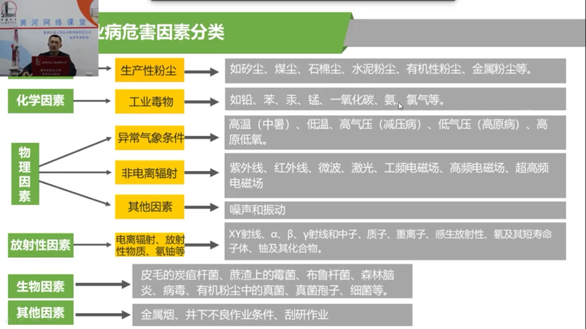
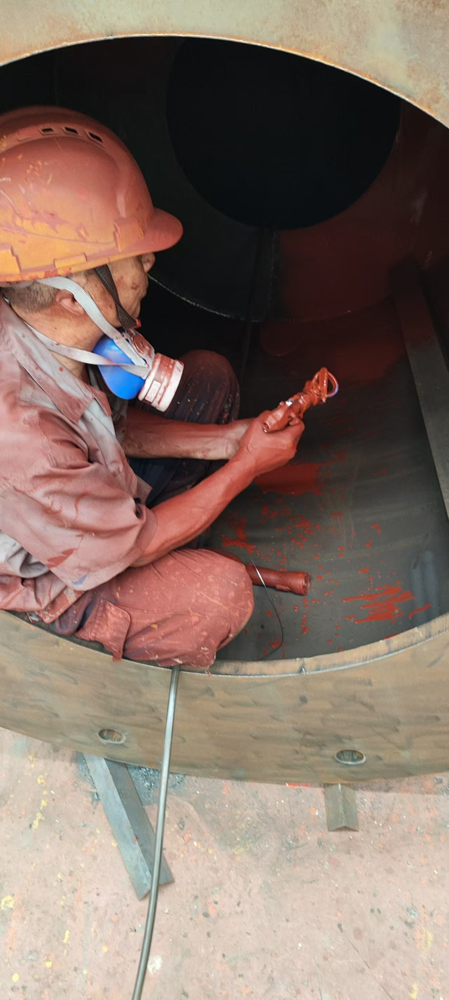
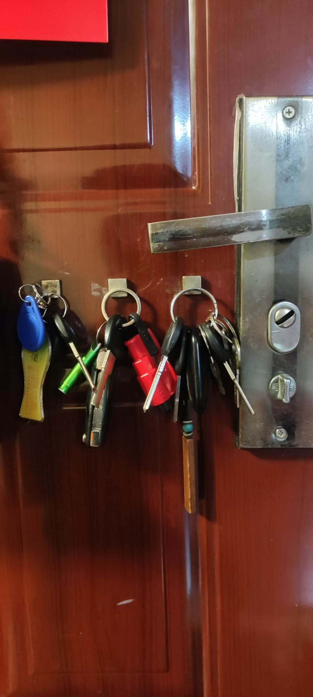
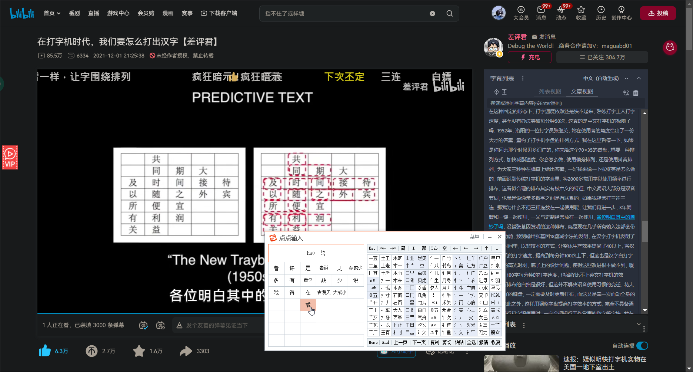
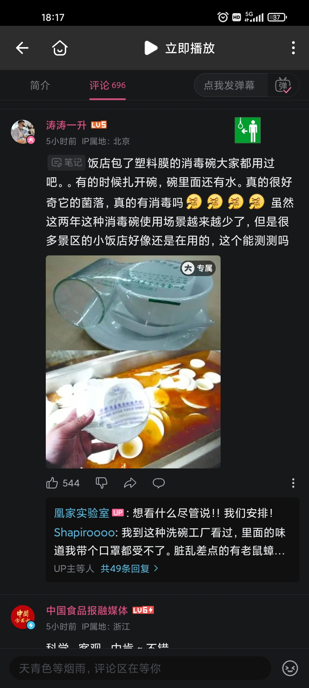

- 经济
  id:: 670d40c8-1dcb-4f74-bc08-c3cfd8c761ea
  collapsed:: true
	- “大自然拿你们这些人的货币吗？不拿货币它就不生产了？你的基因和细胞呢？”
		- ((647015e2-9449-44fc-9236-221a75d99e55))
		- ((67a4abc4-2041-447c-adb0-0f5e50721b3d))
		- {{embed ((67c8f7e5-3d34-4160-91e7-5556fafdb529))}}
	- ((67599ec5-3994-48ae-8b9f-b0ea2e26fe85))
	- 现代人可以比梭罗过得轻松得多，还相对同代人少碳排放，
	- “经济又卫生啊，兄弟们”
	  collapsed:: true
	- “人们干着不尽相同的工作，经济竟然还可以运行起来”
	- [尼·布哈林、叶·普列奥布拉任斯基：《共产主义ABC》（1919）](https://www.marxists.org/chinese/bukharin/1919/index.htm)
	- 节约悖论
	  id:: 67c3e4f0-799f-4eff-861f-65caff7a2694
	  collapsed:: true
		- [节约悖论_百度百科](https://baike.baidu.com/item/%E8%8A%82%E7%BA%A6%E6%82%96%E8%AE%BA/10152693)
		- [什么叫经济学中的“节约悖论”？财经小白求解释！ - 知乎](https://www.zhihu.com/question/24201362)
		  id:: 679adcda-a01d-48d9-bd38-3d90ba075b6f
			- >患者自己选择买药的，也可以选择纯中医或平时注意点清淡饮食，推荐后没看到或看到没被供应上需求也可以不看，看得多了就有示范效应，进一步帮符合条件的劳动力省去一部分自己动脑试错的风险，调动开发自身潜力的积极性（而不是将“大胸”之类的身体特征视为负担），至于这样对不对，没有人是全知全能全善的，换成图灵涨胸可能他就因此自杀了，如果有极端倾向的人看了大胸行动力下降也是好事，如果多消费实际上有害商品，就可以更快生产疾病，就可以给医疗工作者带来收入，市场具有自发性、盲目性、滞后性嘛，可能存在没有这些性质的市场吗？ #20241117
		- “但我还是愿意信奉亚当·史密斯专员的理论”
	- [经济学这7篇论文看完，你也会爱上劳动经济学 - 知乎](https://zhuanlan.zhihu.com/p/462827575)
	- [温铁军十次危机总结 - 知乎](https://zhuanlan.zhihu.com/p/356441564)
		- [温铁军教授理论学习推荐路径 - 知乎](https://zhuanlan.zhihu.com/p/378013055)
		- [秦晖、温铁军、汪晖三人谈 - 知乎](https://zhuanlan.zhihu.com/p/673816643)
	- 计划、货币、市场的意义
	  collapsed:: true
		- 相比货币，计划不够同质化
		- 相比计划，货币不够有想象力
			- “货币激励”，通常没看出它激励出什么，绝大多数就是抄，就像货币就是钞
		- 为什么有部分人“眼里只有钱”的说法？
			- 只是他们“不是钱我不看”吗？
				- 可能还因为游戏等场所里到处都是货币这种统治性符号，就像孙悟空飞不出的五指山
		- 货币分配工作——市场经济条件下的人口过剩与经济效率低下
		  collapsed:: true
			- 市场经济可以起到比自然界的弱肉强食更差的效果，至少动物不仅自由而且在运动等方面很健康
			- 农业人口因为国家需要低价食材和工业原料，所以在收入剪刀差下，部分农业人口倾向于转非农业人口
			- 社会能提供的工作岗位数量是变化的，在私有化的基础之上，企业集中、技术进步、需求的细分和转变、贸易战、科技战等会导致社会岗位数量萎缩，农村收入低，很多地方的地也租出去了，可能还有房贷没还完，而高失业率会增大社会（主要是城市地区）不稳定的风险，低保等不可能随便，允许“养闲人”的后果也许会很严重（比如，有工作的人可能不满意）
			- 因此，[[外卖骑手]]、网约车司机等灵活就业者一直在外面跑，消费者一直下单也就不那么奇怪，与工会发的粮油食品类似，都是摊派“养人”，只是因为在城市工作，力度更大罢了
				- ☝️🤓“养忙人不养闲人！”
			- ---
			- 市场更容易造成供给过剩
				- 人本（“我们称之为‘人本主义’”）就不应该无“计划”地“消费”
		- 货币分配健康
		  collapsed:: true
			- 接上文，消费者养成点外卖、网约车的习惯后，自然会进一步降低运动量、延长久坐时间
			- 外卖的“隔离性”使得食材方面的恶性竞争加剧，同时，外卖包装可能比店内包装更不安全
			- 为了赶时间多送单挣钱，外卖骑手之类的群体在整体上不可避免地会更多地违反交通规则、不安全行驶，进而造成更多交通事故
	- 计划经济
		- ((670b1075-481f-45b9-a459-d9ec8265fb01))
	- 市场经济
	  collapsed:: true
		- ((624d1fef-b51c-4666-b599-375029480545))
		- 什么是市场经济？
		- “市场真的发展得更快更好吗？”
		- “运行人体的是市场经济吗？”
		- 要考虑的环节更多，效率更低
		- 偷懒必然失败
		- “也可以这样看，人们依赖货币才能运行市场经济，所以并不自由”
		- 过剩与匮乏，宽敞与拥挤，便利与麻烦，同质与差异的多重生产
		- 膳食指南等包含的相对健康的饮食习惯和健康中国包含在实际传播中，并不如，可能消费者个体的“人性”，市场条件下盈利，但也不能否认，国家也不太可能强力推广这些可能对“相对有害但能维持市场经济的习惯”而不顾就业和税收而去，除非危机已经到了必须让一部分（应该是能分割出来的）利益集团妥协以更多保留其余的地步
		- 市场效率低就低在赘肉多
		- 可能也可以说使命是神圣的，总有人要多花些窝囊费，市场不是那么容易维持的，反正在我看来这么大规模的市场简直是个奇迹，竟然能让，市场难道不伟大吗？
	- 如何确定“需求”？
	  id:: 670f0c7a-373d-4fe1-88e9-39ae16b7d900
	  collapsed:: true
		- ((679adda8-1fc5-4832-b733-68ef8eeb2e79))
		- 钱是用来干什么的？一定要“那比这好”才有动力？这部分的钱与那部分的钱如何平衡实现“效用”最大化？比如有害的加工食品增加的卫生支出能否被弥补？或者反过来，减少的卫生支出能否用于有害的加工食品的消费？相对健康的生活方式的传播会受制于“经济考量”而止步不前吗？
		  collapsed:: true
		- “你/我xx，不xx，就会xx”
		- “什么是需求？”
			- [“计划经济按照需求进行生产”这个说法为什么是错误的？ - 知乎](https://www.zhihu.com/question/496157736)
			  id:: 6717a2d1-f2c3-4440-b0df-d3b3d4b527c8
				- “人类的需求究竟是个什么东西，是否无穷无尽，是否是瞬息万变的，是否见了爱的就爱的不行，是否吃着碗里看着锅里的，一不供应上就给你抑郁躁狂的，世界各地的大学研究了很多年，也并没有完全搞清楚，可能还是斯大林的思路比较好”
					- ((67402ae3-eb71-44b3-b320-249d8edde652))
		- 思考
			- “等我想出来告诉你噢”
				- “人想象不出没见过的事物”
					- [人类真的想象不出从来没见过的东西吗？ - 知乎](https://www.zhihu.com/question/266668858)
					- “而且想象也是有成本的”
			- 思考确实需要身体，当我们看到图片联想时就是如此（？）
		- 社会学习
			- “在‘供给/供应’里挑”
				- “你平时都吃些什么啊？”
				- “比价”
				- 面目更完整、启发式的
					- “我不到啊！看看你的”
				- “攀比”
				  collapsed:: true
					- “人无我有，人有我优”
						- “人无我忧”
							- “人未有忧而我忧”
								- “先天下之忧而忧”
						- “人有我忧”
							- “小小震撼”
								- “震撼可能无穷无尽，但同一来源的震撼大概有限”
								- “日本震撼”
								- “苏联震撼”
									- ((670d412f-ed74-4e27-b3eb-03bc359ee0b3))
									- [1184. “苏联震撼”——前苏联/俄罗斯雕塑，建筑一览（部分）_凤凰网](https://history.ifeng.com/c/8XXMmEwkjse)
								- “美国震撼”
									- ((670f4bb3-3dae-438a-aee3-63502292a1b4))
									- ((670d40cb-7810-4836-bc8b-8ba49a29ff5f))
									- [你见过哪些美国震撼？ - 知乎](https://www.zhihu.com/question/631189964)
								- “中国震撼”
						- “人无我无”
							- “太好了，你也没有！”
						- “人有我有”
				- 跨栏
					- 考核指标
						- “我从小考到大！”
				- 权力层级制
					- “下属不许啵上司嘴”
					- >正是这些大企业主，银行家或者商人，我们看见他们在忙完事务之余，宅在家里，周遭一切似乎显得与他们格格不入：四壁促狭，房间堆满了没用的东西，有一种令人作呕的气氛。房间笼罩着各种谎言，诸如欧卜松、秋季沙龙，各种无聊风格的小玩意儿。他们看上去局促不安，就像关在笼子里的老虎那样了无生气：看得出来，他们似乎在工厂里或者银行里会快乐许多。我们以轮船、飞机和汽车的名义，恳求获得健康、逻辑、勇气、和谐和完美。——柯布西耶《走向新建筑》
					- “你不许参加[[impart]]！”
						- “我是（公共、集体的一）部分（I'M PART），我必须参加！”
					- 层级多少
						- 多层
							- “我们（“那我们呢？”）认为以下真理是不言而喻的：”
								- 人被杀，就会死
								- 人也可以饿死
							- “相同权重”的投票
								- “你投上去的人还是和你不在一个层级啊”
						- “扁平”
							- “我是本站的一把手，读者需要什么资讯，虽然海专精算不太全我要我觉得，我不要你觉得”
								- “什么公平？不就是要我的位子？竞争是吧？”
					- 黑白名单
					- “人性是吧？”
					- “用户传播”
	- 经济损失
	  collapsed:: true
		- ((677bc4bc-2527-4a7b-9e50-c5cb923cb306))
		- [直接经济损失_百度百科](https://baike.baidu.com/item/%E7%9B%B4%E6%8E%A5%E7%BB%8F%E6%B5%8E%E6%8D%9F%E5%A4%B1/9746259)
		  id:: 678af4f5-164d-4171-9468-785ff0939e00
		- [安全生产事故的直接经济损失和间接经济损失计算 - 知乎](https://zhuanlan.zhihu.com/p/697108353)
		- ---
		- 经济损失带来的经济增长和存量
			- “降质复购”
			- 破窗效应
			  id:: 679adcda-d74a-48ea-9af1-d08e78c318ad
			  collapsed:: true
				- “X、反X”
				- “辞旧迎新”
					- “旧的不去，新的不来”
				- ((67402b15-f797-44b1-8cd3-4a044587f42d))
				- ((67402aa2-a84d-4a83-96bd-55f8355fcc54))
				- ((67402acd-c1cf-425c-acd5-ff5b2d034d3a))
				- 消费主义制造信息茧房并污染日常乃至专业话语的语料库，然后用[[AI]]帮忙救回来（“真的吗？”）
				- ---
				- ((67402ab7-753c-4680-94ca-e7516d6516fc))
			- 单透膜效应
			  id:: 679ec253-eb5d-4afc-8516-16c55236b145
				- ((679de143-381d-4beb-8e2c-cb224b5ae04c))
				- 不同人、时、空、向
				- ((66db8ad1-dbae-4ba9-935d-af5571f1f0db))
					- 因为不知道“捷径”就会多花钱，就会多“养人”，所以无知是福
	- （特定）经济活动的效率/性价比
		- 减少为XX的投入/消费的劳动能比不变带来更好的健康效果吗？
		  id:: 66b5ebdf-cd0d-4d0b-9005-6aa49e35503a
	- 积累/再生产与可持续、外部性
	- 来源方式
	  collapsed:: true
		- 模仿/复制/抄
			- “抄都抄不会！”
		- 创新
			- [指标体系- 中华人民共和国科学技术部](https://www.most.gov.cn/zxgz/cxdcwq/zbtx/)
			- [Nature发文：基础科学创新速度放缓，已经进入“增量时代”_澎湃号·湃客_澎湃新闻-The Paper](https://www.thepaper.cn/newsDetail_forward_21434849)
			  id:: 6709342d-d1e0-4bc0-bbca-ec526bb26ca1
			- 有的是搬运，不是吗？
			- 模式创新、技术创新、产品创新
			- ((670d40c8-6a03-4169-b8b8-db6611a96ee7))
			  id:: 670d40c8-6a03-4169-b8b8-db6611a96ee7
	- “先富带动后富”
	- ---
	- ((6705e16e-9f73-495e-8dc2-8ddffe797fbc))
		- ((670c8cd8-6068-4dbc-b6b4-47e0ef93b791))
	- 绿色经济
		- ((670070af-be68-4c0b-a8d4-a02cf879dedc))
	- 人情经济
		- “你请我~我请你~ABCDEFG~”
		- ((6706247b-218f-4686-9342-4e186e9aceda))
		- ((671d9fa4-33f7-41a6-9f26-6884378086c4))
		  id:: 67187f6b-cde1-4f11-adf9-aecc59274512
	- “地府经济”
		- ((66db8af3-a63d-41d6-8b2e-d6f4e91fc8f3))
	- 找死经济
		- “弗洛伊德是对的，”
	- 我的经济
	  collapsed:: true
		- 个人电脑上网所需劳动时间估算
		  collapsed:: true
			- [[简单再生餐]]劳动时间
				- 获取食物等再生产资料/生活资料时间，以及品质折价（工业食物与）
				- 外卖显然是虚假的多样性的代表，花了更多钱让更多人“即时”冒险奔忙，消费者拿到的却是种类和营养更贫乏的食物
				- [农业发展阔步前行 现代农业谱写新篇——新中国75年经济社会发展成就系列报告之二 - 国家统计局](https://www.stats.gov.cn/sj/sjjd/202409/t20240910_1956334.html)
				- [蔡昉：以劳动生产率为抓手推进农业农村现代化-中国社会科学院农村发展研究所](http://rdi.cass.cn/gzsn/202407/t20240724_5766512.shtml)
				- [农业的生产时间与劳动时间:学术争论与价值意涵](http://zgnydxsk.cnjournals.net/ch/reader/create_pdf.aspx?file_no=20190202&flag=1)
				  id:: 66ef77de-08a9-4c68-91dc-ccf0efc02872
			- 电脑上网
		- “劳动防沉迷系统”
		  id:: 670f3d58-4039-46d2-b3b4-c9059ac7a126
			- [既然有青少年游戏防沉迷系统，为什么没有成年人加班防沉迷系统？ - 知乎](https://www.zhihu.com/question/647691805)
			- 客观上是有不同风险的
			- 但一开始不打断形成新秩序就会让
			- ((66fd0068-2c79-4b33-b17b-ba6d1f5bcc31)) 经济重启法
				- 经济本就是不断重启的过程，可能的因素有人体和代际就是生命不断重启的过程，请问你夜睡无梦时，你能确定你是活是死吗？
				- 一正一反的两种工作要贯穿一生，要从事十二种主业，八种副业，途经362个城市
				- 同行不同地，同地不同行
					- 跨穴循经
					- 似乎是某种按时空顺序“点穴”的操作，但
					- ((66fd4f81-7adc-4515-bc15-bbfd6c156fa8))
					- 较高的专业度以确保低风险和高效率，也需要打
					- 真的是“隔行如隔山”吗？行业进入壁垒真的有那么高吗？
			- ((66dba0b1-9d54-4a46-969b-3873217a18b1))
	- 其他草稿
	  id:: 671c91b4-76ef-4136-8e2f-c83ca17705ce
	  collapsed:: true
		- 可主动浪费的多边互惠经济
		  collapsed:: true
			- 包括更广义的，因为a对b做了好事，所以与a或b均无明确利益关系的c向a做好事，比如可能有少数人，为了道德得到了实践，比如知识分享，）
			- “惠着惠着就惠完了，然后还得到外面换”
			- 至今，虽然越来越多商品和服务开始有了“溯源”，但受限于广泛的竞争（可能技术问题倒是相当次要的），“功劳”信息仍是相当有损的，更确切地说，其中存在好事坏事同一个人担的比重不同等现象（“商业机密：我们坏在何处”），控制变量的话，即便人们对经济有了全新的理解，在一个生产力尚未达到自由王国的水平时的社会，人们以按劳分配为主，但在一开始的前提之下，我扶老奶奶过马路十回，未必有个无私的大他者帮所有人记着我的“工分”，然后我能在最近的餐馆吃到几口饭啥的，或者附近街道厨艺较好的几家人在广场合办了一场大宴，纯路人过来就吃，有人吃了较多蛋糕牛排，有人只吃了点白粥白水（也许是因为“具有长期性的宗教”，也许是因为病还没好不能大吃大喝），他们要如何“回报”呢？如果大家吃完了散伙完事，这几家人又负责采买的话，会不会吃穷然后就不办了？这种公开性远高于[[暗网]]的或许令人联想到“共景监狱”的 ((670d40c8-0385-4e2e-b489-6e81e7d9ce22)) 的共识与日常实践恐怕还是需要通过货币的流动或传播完成一部分雏形或超越（名词），以及更重要的积累
			  collapsed:: true
				- ((65669fc2-ef6e-4f92-b47c-fcd569530846))
		- 这玩意不是连小摊位都没有的大排档，
		- 关于付费
		  collapsed:: true
			- ((647015e2-9449-44fc-9236-221a75d99e55))
			- 为“准入”付费的讲座、学习班等算知识付费吗？
			- 为“准入”付费的会员们相互交流算知识付费吗？
			- 为部署一个服务的咨询付费算知识付费吗？
			- 各种中介算知识付费吗？
			- “智商税”或更常见的时点价差算知识付费吗？
			- 讨论家务的分配算知识付费吗？
			- 自己基于已有的知识想问题算知识付费吗？
				- 否则，我之前学到的那些知识，我“早就计划好了全部应用”吗？
			- 之前看的梗、鬼畜想起来可以做成视频素材，这算“知识”吗？我赞也没点甚至想办法屏蔽广告、播放量都没贡献，我付费了吗？
			- 为什么应该付费？
				- 因为我们一直在为知识付费
					- 知识付费，往往不会造成传播者的知识的损失，所以它相当于复制，只是复制成本通常会被用户忽略
					  id:: 671c4bae-05de-46c7-a72a-1930e1e4b2c1
						- 尽管上网实际上要花电费、折算的网费（除非你把它当作“早就计划好了全部内容的一次性支出”，或是“已经花了、不用想了”）、折算的水电气费（除非你在图书馆之类的地方“蹭公家的”，那么你还有交通和交通时间支出、多出来的热量缺口的食物支出）和食物费（同理），你还要克服可能的通胀，所以每一位读者都是有着大无畏的精神在完成度参差不齐的本站探索知识的——虽然很大程度上就是不知道或不想算（“假装是免费”）这些成本罢了
						- 光猫、路由器、主机、显示屏、手机充电器、息屏手机等加起来假设50W（不玩什么游戏），每天4小时，0.2度，差不多0.1元，宽带每天1元，每天20升水，一个月600升，差不多，手机电脑等硬件也要折旧
							- 只算额外的成本的话也需要每天一两元，每小时也要几毛钱，而一小时能学会什么？
						- 总之，花点时间学知识也可能花个几块钱
				- 但能联网的手机电脑是已有的，不然怎么知道有人要卖给我什么东西呢？
				- 而生产设备支出、场地和劳动时间是没有的，所以不需要复制一下产线的话就自己买了用用
	- ---
	- 经济指标
		- GDP
			- [毛泽东时代中国的经济水平，能用GDP评价吗？](https://mp.weixin.qq.com/s/h-eTlPW0ABvPo9gW7-oswg)
			  id:: 677f4222-f0f0-4528-a20e-8857de0461f0
		-
	- 时空量价
	  collapsed:: true
		- 借一种比较流行的炒股模型的名
		- 时空质能
		  id:: 6785cef1-d866-4bbb-b61c-e459b177814d
		- 质价量
		- [[时间]]
		- [[地球]]
		- [糖域模型 - 集智百科 - 复杂系统|人工智能|复杂科学|复杂网络|自组织](https://wiki.swarma.org/index.php/%E7%B3%96%E5%9F%9F%E6%A8%A1%E5%9E%8B)
		- 密度
		  collapsed:: true
			- 低成本，高流通频率
			- 蜂拥拥堵
				- ((670883cb-d60e-4a35-a062-e5097dd77d76))
					- 广告视频画质高吗？如果原本高，但是实际不高，广告主是否会与平台交涉？
				- “并非完全有序地排队上公交车呐”
					- ((66db8af3-b2a7-4e2b-890a-73fb82e6872a))
			- 集中度
				- “大家都赚大钱？那么你说，钱去哪了呢？”
			- [解释城市｜经济密度：工业上楼为什么？亩产论英雄论什么？_全球智库_澎湃新闻-The Paper](https://www.thepaper.cn/newsDetail_forward_26009910)
			  id:: 679adcda-be3b-4f5b-8285-499e77b1adb2
			- [2018 年计量经济学会弗里希奖授予论文《密度经济学：柏林墙的启示》，对城市经济学研究有什么启示？ - 知乎](https://www.zhihu.com/question/292715260)
				- [2018年计量经济学会弗里希奖 │密度经济学：柏林墙的启示](https://mp.weixin.qq.com/s/Qd47tLseLedgnih5pRsSoA?utm_oi=681259938462961664)
			- [中国50城拥堵真相！北京人均拥堵成本破千：高德数据报告 - 知乎](https://zhuanlan.zhihu.com/p/49332244)
			- [“15分钟生活圈”是如何提出的？它又怎样在国内外各大城市“生根发芽”？- · 科普中国网](https://www.kepuchina.cn/article/articleinfo?business_type=100&classify=0&ar_id=509935)
			- 租金
			  collapsed:: true
				- “甜~”
				- 高密度高租金
			- ((6705e72d-cc65-4850-95f3-1d1a4258c008))
			- 结婚成本
				- “看不见的恋人”
					- “啊？有游戏？”
					- 异步谈判式的[[微信]]之恋
			- 空旷地带，商业街，挤地铁， ((67ad6984-dcb1-4df4-a7e9-763b15db7b16))
			- 商业街
				- “选择性流水线”
		- ((66a4281d-1fee-4265-8f16-f56f3ca8c46e))
		- 质量
		- 价值与价格
		  collapsed:: true
			- [《马克思主义思想辞典：V》](https://www.marxists.org/chinese/dictionary-of-marxism/marxist.org-chinese-dictionary-of-marxism-V.htm)
			- 价值
				- 剩余价值
				- 附加值
				- 锚定
			- 价格
				- 评价
				- 溢价
				  id:: 66fd4435-f825-4e69-931e-540b609100ff
					- 绿色溢价
						- [环球零碳科普 | 什么是绿色溢价？跟碳价格有什么关系 - 知乎](https://zhuanlan.zhihu.com/p/454324000)
					- “智商税”
					  id:: 66fd447d-49be-403e-be87-a8194971f55b
				- 指导价格与传导价格
			- 语言贬值、腐败
				- “生活方式”与消费主义
				- 语言编制
				- “伟大”
- 产业
  collapsed:: true
	- “说文解字”
		- 稷
		- 畿
	- [行业、产业、产业链和供应链，你能分清吗？ - 知乎](https://zhuanlan.zhihu.com/p/651197196)
	- 三产/三次产业/三大产业
	  collapsed:: true
		- [三次产业是怎样划分的 - 国家统计局](https://www.stats.gov.cn/zs/tjws/tjbz/202301/t20230101_1903768.html)
		- “次”大概对应“产业革命”
		- [政府机构属于第三产业吗_百度知道](https://zhidao.baidu.com/question/208299966.html)
		  id:: 670f00e0-fd8a-45b5-8667-61efda894e67
		- 服务业
			- “第三次？自古以来！工业化主线太耀眼导致的”
			  collapsed:: true
				- [服务业不等于第三产业 有其自身演进历史与逻辑_经济学人_财经纵横_新浪网](https://finance.sina.com.cn/economist/jingjixueren/20050307/10051408469.shtml)
			- 现代服务业
			  id:: 670d40c8-5cf9-4337-b9c8-218e5ad3e4a5
			  collapsed:: true
				- [《现代服务业统计分类》（国家统计局令第36号） - 国家统计局](https://www.stats.gov.cn/sj/tjbz/gjtjbz/202307/t20230728_1941612.html)
				- [现代服务业 - MBA智库百科](https://wiki.mbalib.com/wiki/%E7%8E%B0%E4%BB%A3%E6%9C%8D%E5%8A%A1%E4%B8%9A)
				- “现代服务业就是‘家人们’——“小姐姐”、“小哥”等——基于从‘家庭内部劳动’中剥离或者说剩余下来的‘家务劳动’的劳动构成的产业外显，结合现代描述古代的常见说法就是‘以我为主’的‘家天下’，现代服务业是一个潜伏在后现代社会的一个纯正的前现代经济动力，听懂掌声！”
				  id:: 670c9a76-6dc1-4f8b-aec8-8008e78cc539
					- ((67033f50-50b1-4496-b777-2437da332069))
			- >服务业是刻意去工业化避免失业吗？联系我发的上一条
				- 将服务业发展与工业化进程、就业结构变革联系起来分析，需要超越简单的"替代论"或"阴谋论"，而应置于经济演化规律和技术革命框架下审视。以下是系统性解答：
				  
				  ---
				- ### **核心结论**
				  服务业扩张并非刻意"去工业化"，而是工业化成熟后**要素价格变化**与**需求结构升级**共同驱动的必然结果，其就业吸纳能力实为**产业升级的伴生现象**而非预设目标。
				  
				  ---
				- ### **三层递进解析**
				- #### **一、工业化与服务业的内在演进逻辑**
				  1. **成本病效应（Baumol's Cost Disease）**
					- 制造业技术进步快 → 单位产品所需劳动力持续下降（汽车装配线工人减少90%）
					- 服务业效率提升有限（教师/护士无法大幅压缩服务时间） → 劳动力被迫向服务业转移
					  
					  2. **恩格尔定律作用**
					- 人均GDP超过1万美元后，消费结构中服务占比突破50%（中国2023年达54.3%）
					- 从"购买商品"转向"购买体验"（健身私教、旅行定制等）
					  
					  3. **产业迂回化加深**
					- 工业化后期，生产性服务业（物流、研发、金融）占制造业成本达40-70%
					- 苹果公司63%营收来自服务业（App Store、iCloud等）
				- #### **二、失业防御的真相：服务业是缓冲器而非避难所**
				- **自动化悖论**
				  制造业每减少1个岗位，服务业创造2.3个岗位（OECD数据），但其中：
				  ✅ **高价值岗位**：算法工程师、生物信息分析师（占15%）
				  ⚠️ **低端岗位**：外卖骑手、客服（占62%）
				- **技能错配危机**
				  美国制造业工人转型服务业的平均薪资下降23%，德国通过"双元制"职业教育将错配率控制在11%以下
				- #### **三、政策干预的边界**
				- **错误示范**：巴西过早去工业化（制造业占比从1985年36%跌至2023年12%） → 陷入中等收入陷阱
				- **成功案例**：德国坚持制造业占比20%红线 + 发展工业4.0服务化（预测性维护等） → 失业率长期低于4%
				  
				  ---
				- ### **数据透视：中美德产业就业对比**
				  | 国家  | 制造业就业占比 | 服务业就业占比 | 人均GDP   | 基尼系数 |
				  |-------|---------------|----------------|-----------|---------|
				  | 中国  | 18% (2023)    | 53%            | $12,741   | 0.467   |
				  | 美国  | 8%            | 79%            | $76,399   | 0.494   |
				  | 德国  | 19%           | 71%            | $51,204   | 0.316   |
				  
				  _数据来源：世界银行、ILO_
				  
				  ---
				- ### **结构性风险预警**
				  1. **服务业过度膨胀的陷阱**
					- 英国金融业占比GDP达12% → 2008年危机中制造业产能不足以对冲风险
					- 健康阈值：制造业占比不宜低于15%（MIT生产率委员会建议）
					  
					  2. **低端服务业就业依赖症**
					- 印度IT服务业创造300万高薪岗位，但同期新增1.2亿低端服务业就业 → 贫富差距扩大
					  
					  ---
				- ### **战略平衡路径**
				- #### **一、对发展中国家的启示**
				- **制造业根基守卫**
				  ✅ 用工业机器人提升效率（中国工业机器人密度达392台/万人）而非放弃制造
				  ✅ 发展"服务型制造"（三一重工设备健康管理服务贡献35%利润）
				- **服务业升级方向**
				  ✅ 培育知识密集型服务业（KIS）占GDP比重超30%（当前中国仅12.5%）
				  ✅ 建立服务业生产率评估体系（如教育业引入学习成果量化指标）
				- #### **二、对个体的应对策略**
				- **技能组合重构**
				  ✅ "制造业+"技能：数控机床操作员学习数字孪生建模
				  ✅ "服务业+"技能：护士掌握老年康养机器人运维
				- **地域再平衡**
				  ✅ 中国"东数西算"工程：东部发展高附加值服务业，西部承接数据中心等制造相关服务
				  
				  ---
				- ### **历史镜鉴**
				- **英国的教训**：19世纪后期过早转向金融服务业，导致二战期间军舰产能不足
				- **韩国的经验**：2000年后将制造业占比稳定在25%-28%，同时培育游戏、K-pop等高附加值服务业
				  
				  产业结构的演变如同生态系统的更替，健康的服务业发展应根植于强大的制造业"土壤"。正如德国弗劳恩霍夫研究所揭示：**制造业每1欧元产出，能拉动2.3欧元服务业增值**——这或许比单纯讨论"替代"更具建设性。
	- ---
	- ((6708ebc5-6dc7-4a63-b65d-e4e94ea659d4))
	- 第四产业
		- [第四产业_百度百科](https://baike.baidu.com/item/%E7%AC%AC%E5%9B%9B%E4%BA%A7%E4%B8%9A/250379)
	- 第五产业
		- “搜索等待时已经开始笑了”
		- [第五产业_百度百科](https://baike.baidu.com/item/%E7%AC%AC%E4%BA%94%E4%BA%A7%E4%B8%9A/8872935)
	- 第六产业
		- [第六产业_百度百科](https://baike.baidu.com/item/%E7%AC%AC%E5%85%AD%E4%BA%A7%E4%B8%9A/5182871)
	- ---
	- [少扯自由主义水变油，谈六小龙为什么出在杭州](https://mp.weixin.qq.com/s/j6slKLekY0pFvTPW5TPD6w)
	  id:: 67aaae88-f66c-49fa-bb23-ed47d44526ff
- 行业
  collapsed:: true
	- [国民经济行业分类 - 国家统计局](https://www.stats.gov.cn/sj/tjbz/gmjjhyfl/)
		- ((6708e15a-0103-4115-b3af-1090228effbc))
	- [三百六十行 - 维基百科，自由的百科全书](https://zh.wikipedia.org/wiki/%E4%B8%89%E7%99%BE%E5%85%AD%E5%8D%81%E8%A1%8C)
- 雇主
  collapsed:: true
	- 商事主体
	- [法人单位_百度百科](https://baike.baidu.com/item/%E6%B3%95%E4%BA%BA%E5%8D%95%E4%BD%8D/5094642)
	- ((6710f79d-5235-49b1-b914-869191626b3e))
	- 企业
	  collapsed:: true
		- 公司
			- 什么“公”司？都是“公”司吗？不如司康
			- [[公司给的生活]]
		- [经营范围规范表述查询系统](https://jyfwyun.com/)
		- 称号
		  id:: 670cc5f3-9f43-4028-affe-730bb2999233
		  collapsed:: true
			- ((6773a6a8-b65a-4909-9f5a-61061a003644))
			  collapsed:: true
			- collapsed:: true
			  >根据本文内容，可以将企业分为以下几类：
			  1. 瞪羚企业（即成长速度快、创新能力强、发展潜力大的企业）
			  2. 独角兽企业（即具有颠覆式创新、爆发式成长、未来产值大的企业）
			  3. 隐形冠军企业（即在某一细分领域内占据领先地位的企业）
			  4. 专精特新企业（即专注于某个特定领域的高成长性企业）
				- >小巨人企业也是文中提到的一种类型，是指在特定领域内具备核心竞争力、发展前景广阔的小型高成长性企业。
				- ((670b1745-aba8-4be7-86da-a005cc579f44))
			- 专精特新
			- 隐形（单项）冠军
			- 瞪羚、独角兽
			- 小巨人
			- 上市
			- 健康企业
			- 美好企业
				- 胖东来
		- [一图看懂单位、企业、公司、个体户分类 - 知乎](https://zhuanlan.zhihu.com/p/411420470)
		- [【涨知识】一文带你了解个体工商户、个人独资企业、一人有限责任公司的区别_澎湃号·政务_澎湃新闻-The Paper](https://www.thepaper.cn/newsDetail_forward_20912029)
		- ---
		- ((670d40c8-99f8-4acf-add1-7a39d588741b))
		- [奇怪的分类：“私营”和“非私营” _中国经济网——国家经济门户](http://views.ce.cn/view/economy/201105/05/t20110505_22402035.shtml)
		- 企业家
			- 企业家精神（并不是说有精神就都是好的）
				- [“中国企业的根本优势, 如今西方仍未参透”| 文化纵横](https://mp.weixin.qq.com/s/syuwIbkf1Unbac13eb-wuA)
				- 要是觉得这行业没一个能打的，你就自己创业，这就是企业家精神——在豹豹群的发言
				- 其实是觉得能把看不过去的行业乱象整得更好
				- >企业家必须有这样的境界和胸怀。国家会因为有你而强大，社会会因为有你而进步，人民会因为有你而富足！
			- 赴美上市速度（企业“忠诚”与否）
	- ((670d447d-ae41-4890-b8f3-f06482f918c5))
	  collapsed:: true
		- [市场监管总局：截至今年8月底 我国实有个体工商户1.25亿户|个体工商户_新浪财经_新浪网](https://finance.sina.com.cn/jjxw/2024-10-14/doc-incsnusx5402609.shtml)
			- >证券时报网讯，国新办10月14日上午就加大助企帮扶力度有关情况举行发布会。市场监督管理总局局长罗文在会上表示，个体工商户是我国数量最多的经营主体，截至今年8月底，我国实有个体工商户1.25亿户，占我国经营主体总数的三分之二。个体工商户在稳就业、惠民生、促发展方面发挥着重要作用。市场监管总局将个体工商户分为生存、成长、发展三个类型和名、特、优、新四个类别，将在今年年底前建成全国统一的分型分类“个体工商户名录库”。在此基础上，我们将会同相关部门在税收、社保、就业、融资等领域出台更有针对性的政策，推动地方政府在场地、成本、培训、招工等方面对个体工商户实施精准帮扶。
	- 就业形态
	  collapsed:: true
		- [“灵活用工”与“自然人代开”的区别 - 知乎](https://zhuanlan.zhihu.com/p/516817787)
		- 劳动关系
		- 劳务关系
			- ((670d40d9-26ff-4f12-bb86-77348af96355))
			- ((677246f7-8ce6-4d72-b679-f67cd2f2c8df))
			- [如何在外包劳务中釜底抽薪](https://mp.weixin.qq.com/s/KneSB-R8_kI79aSkEYBJEA)
			  id:: 6777b6ff-4445-4c3d-9632-0a4e9e0be7d5
		- collapsed:: true
		  ---
		- 灵活就业
			- [最高法：灵活用工的劳动关系认定需遵循“三要素” - 知乎](https://zhuanlan.zhihu.com/p/689593444)
			- [灵活就业人员参保怎么办？与职工参保有什么不同？这篇说清楚__中国政府网](https://www.gov.cn/yaowen/liebiao/202305/content_6855917.htm)
				- >按照《国务院办公厅关于支持多渠道灵活就业的意见》（国办发〔2020〕27号）规定，灵活就业人员包括个体经营、非全日制以及新就业形态等从业人员。
			- [[多零工]]
			  id:: 67281e96-b2db-4148-88a5-68a5bb40cfe7
	- 雇佣程序（？）
	  collapsed:: true
		- TODO 工作信息聚合、筛选、比较、分析
		  id:: 67792219-4a7a-4052-8a97-f824440854bd
			- 一个个单位、一个个城市地看？或许还是有点慢了，而且如何比较？
			- ((674bf371-e51e-4922-9dad-aee42bdd800d))
			- ((679adcda-c3b2-416f-97a0-77e32cd475cb))
			- 实际招聘方式统计
		- 群
			- 不进群自己找可能效率较低，也可能看不到什么内部资料
			- 先问应聘单位工人了解情况
		- 扣留
		  id:: 67402ab0-cdfa-4c1c-8553-cb5959fdf534
			- 档案
				- 档案被扣
			- 健康证
				- 我忘了以前在超市“实习”时健康证咋回事了，反正后面没要回来
				  id:: 679adcda-b4cd-4352-89ad-8c7e3172c92b
				- [健康证离职可以带走吗 - 法律快车](https://www.lawtime.cn/zhishi/a3971460.html)
		- 解雇程序
			- 离职证明
				- [如何看待离职证明被公司写上负面评语？ - 知乎](https://www.zhihu.com/question/64322451)
	- 《资本家是怎样算账的》
- 职业
  id:: 66db8aad-16c2-4c9c-9cf3-eff3cc938102
  collapsed:: true
	- [[多零工]]
	- [曾风靡全球的励志神曲《B What U Wanna B》（无损音质）：励志歌曲也有这么轻松好听的旋律！_哔哩哔哩_bilibili](https://www.bilibili.com/video/BV1gr4y1U7SE)
	- 至少能避免漏掉什么工种，可能有助“按图索骥”
	- [中华人民共和国职业分类大典（2022年版）.pdf](http://guojian.org.cn/%E4%B8%AD%E5%8D%8E%E4%BA%BA%E6%B0%91%E5%85%B1%E5%92%8C%E5%9B%BD%E8%81%8C%E4%B8%9A%E5%88%86%E7%B1%BB%E5%A4%A7%E5%85%B8%EF%BC%882022%E5%B9%B4%E7%89%88%EF%BC%89.pdf)
		- [职业分类大典系统](http://osta.mohrss.gov.cn/career)
	- [职务、职位、岗位、职能、职级、职责、职权、职称、职业_区别和联系 - 知乎](https://zhuanlan.zhihu.com/p/454277070)
	- 职业安全/卫生/健康、工伤、职业病、工作有关疾病
	  id:: 670b7a16-1962-45d2-8a8b-898012eb4185
	  collapsed:: true
		- [[工伤、职业病]]
		- [一文读懂丨职业病·疑似职业病·职业禁忌·工作有关性疾病](https://dghb.dg.gov.cn/zsjg/dzswsjds/wjdt/content/post_4224455.html)
		- [职业和环境医学 - MSD诊疗手册专业版](https://www.msdmanuals.cn/professional/special-subjects/occupational-and-environmental-medicine)
			- [与工作相关的重复性运动损伤 - 与工作相关的重复性运动损伤 - MSD诊疗手册专业版](https://www.msdmanuals.cn/professional/special-subjects/occupational-and-environmental-medicine/work-related-repetitive-motion-injuries)
			  id:: 6729715a-1214-427d-83d7-f7c0948b070d
		- 职业健康促进
		  id:: 679adcda-c3b2-416f-97a0-77e32cd475cb
		  collapsed:: true
			- “最理想、西方/国际组织那一套的一集”
			- >5.1.1 职业病危害因素的识别 
			  作业环境中存在的职业病危害因素包括：化学有害因素（生产性粉尘、化学物质）、物理因素（噪声、振动、高温、高湿、低温、非电离及电离辐射等）、生物因素（白僵蚕孢子、枯草杆菌蛋白酶等）和工效学因素（过度用力、不良体位、重复动作、搬举重物等）。
			- TODO 职业健康风险溯源预警
			  id:: 670d40c8-facd-45a1-b9c7-787301be2ba5
			  collapsed:: true
				- “君子不立危墙之下”，即便到处都是“危墙”，必须应对的危险也可以选择
				- 根据 ((670b9259-2f5d-49a9-b910-89bb0b920c41)) 批量搜索对应类别企业的经营范围、工艺（研究报告等）等
					- 插件，自动识别企业并搜索
						- [企查查、企+这种网站、APP的详细数据来源是哪里？ - 知乎](https://www.zhihu.com/question/37951119)
						- ((65bcbf4a-c8bf-45a1-9402-70cd437268d4))
				- ((670b8f1b-0c4b-464f-bb2b-9c2df53ff791))
				- 可以继续扩大
				- >6.3.1 用人单位和员工的现状评价
				  现状评价需求根据企业的目前状况、规模的大小和复杂性确定。通常应收集员工的人口信息、疾病损伤数据（包括工作场所有关的伤害和疾病、短期和长期残疾）、人员离职率、投诉，工作场所存在的职业病危害因素等问题、生产率数据等基础数据；同时还包括企业文化、管理方式、工作压力、非工作相关的压力源和个人的健康行为，以及他们担心的作业环境或在他们的社区内的伤害等问题，见附录A。
				- [[地图]]
					- 厂房
						- 内部结构估计
					- 距离
					- 逃生路线制定
			- TODO 扫一扫化学品包装看是否在职业危害因素名单内，等等
			  id:: 67ad8f1a-8a62-477c-8bfa-182b9890d360
			- ((670d40f0-0a50-4e4e-9685-05cda75398f2))
		- 职业健康监护
		  collapsed:: true
			- >3.1 职业健康监护  occupational health surveillance
			  以预防为目的，根据劳动者的职业接触史，通过定期或不定期的医学健康检查和健康相关资料的收集，连续性地监测劳动者的健康状况，分析劳动者健康变化与所接触的职业病危害因素的关系，并及时地将健康检查和资料分析结果报告给用人单位和劳动者本人，以便及时采取干预措施，保护劳动者健康。职业健康监护主要包括职业健康检查、离岗后健康检查、应急健康检查和职业健康监护档案管理等内容。
			- 职业健康检查
			  collapsed:: true
				- >3.2 职业健康检查 occupational medical examination
				  通过医学手段和方法，针对劳动者所接触的职业病危害因素可能产生的健康影响和健康损害进行临床医学检查，了解受检者健康状况，早期发现职业病、职业禁忌证和可能的其他疾病和健康损害的医疗行为。职业健康检查是职业健康监护的重要内容和主要的资料来源。职业健康检查包括上岗前、在岗期间、离岗时健康检查。
				- [职业健康检查管理办法_国家卫生健康委员会_中国政府网](https://www.gov.cn/zhengce/2015-03/26/content_5713802.htm)
					- [职业健康检查管理办法](http://www.nhc.gov.cn/wjw/c100022/202201/11ceda19eb9b4e3c83ad0cc8071be373/files/8197bb983dde448eb116265ea0191958.pdf)
					- [《职业健康检查管理办法》解读](http://www.nhc.gov.cn/zyjks/pgzdt/201904/8a184698289f4b13bee79fc82bc29abf.shtml)
				- 职业健康检查机构
				- 职业禁忌证
					- >6 职业禁忌证判定注意事项
					  6.1 上岗前体检的主要目的是发现有无职业禁忌证，并应建立接触职业病危害因素人员的基础健康档案。
					  6.2 在岗期间定期检查发现的健康损害是否是职业禁忌证，==应和接触的特定职业病危害因素所致健康损害相鉴别。==
					  6.3  特种作业人群如汽车驾驶员、消防人员等可参见相关的职业健康要求。
					  6.4  职业禁忌证主要是对接触特定的具有慢性毒性作用的职业病危害因素，==只有急性毒性损害的物质原则上不应有禁忌症。==
					  6.5 评估个体对接触某种职业病危害因素或某项特定作业的适应程度时，应与基础值做比较，或与参照人群的均值做比较。
					  6.6 判定是否为职业禁忌证时，需要综合分析个体的健康状况在暴露于职业病危害因素接触限值或限值（依据GBZ2）以下时，是否增加或引发职业病危害风险。既要考虑接触职业病危害因素的频率、强度和时间，也要考虑个体的健康状况、疾病的轻重程度和适应程度。
					  6.7 职业禁总证的判定应综合考虑职业暴露的特征和个体健康状况，没有绝对的职业禁忌证。
		- 职业病防护设施
		  id:: 670b8f1b-6587-40d8-bd32-ad4bcbbe2cb3
		- 个体防护装备（PPE）/劳动防护用品/个人使用的职业病防护用品
		  id:: 670b8f1b-57f5-4230-8a1e-59e1a7b2d8e7
		  collapsed:: true
			- TODO 劳保用品测评（首先当然找点现成的）
			- [个体防护装备配备规范](https://openstd.samr.gov.cn/bzgk/gb/std_list?p.p1=0&p.p90=circulation_date&p.p91=desc&p.p2=GB%2039800)
			  id:: 670cdc19-c20d-4e45-80de-a6b31e1bb684
				- [强制性国标：2022年1月起，各企业要按此标准配备劳保用品！（第一部分）-工作动态-衡阳市应急管理局](https://www.hengyang.gov.cn/yjj/xxgk/gzdt/gzdt/20220119/i2593023.html)
			- [安标中心](https://www.lachina.org.cn/)（LA劳安认证）
				- 可能部分在拼多多等渠道售卖的产品已经过了认证期，或者并没有认证，但是图片上说有认证
				- [产品查询](https://www.lachina.org.cn/search/AkySearchInput.aspx?SearchMark=pro)
				- [不良护品等于谋杀！](https://www.lachina.org.cn/article/articlecontent.aspx?q_ChannelId=105&Id=13368&modelname=)
				- [自吸过滤式防颗粒物呼吸器选购及佩戴小常识](https://www.lachina.org.cn/article/articlecontent.aspx?q_ChannelId=107&Id=13739&modelname=)
				  id:: 671b44c8-0879-44d9-9097-58b585b43533
			- ((66db8abb-050c-4368-a0bf-4035b0528285))
		- 职业病
		  id:: 666adfa3-22c1-4103-a874-9475c7809c21
		  collapsed:: true
			- [职业病 - 维基百科，自由的百科全书](https://zh.wikipedia.org/zh-cn/%E8%81%8C%E4%B8%9A%E7%97%85)
			  id:: 670bb5f6-f105-4e26-8e08-08b18d72941d
			- [中华人民共和国职业病防治法 - 国家法律法规数据库](https://flk.npc.gov.cn/detail2.html?ZmY4MDgwODE2ZjEzNWY0NjAxNmYyMTJlYTIwYTE3Zjg%3D)
				- [江苏省职业病防治条例 - 国家法律法规数据库](https://flk.npc.gov.cn/detail2.html?ZmY4MDgxODE4ZDczNmFjMTAxOGRjNDFiZDU1NzY3OGY%3D)
			- [职业病分类和目录_百度百科](https://baike.baidu.com/item/%E8%81%8C%E4%B8%9A%E7%97%85%E5%88%86%E7%B1%BB%E5%92%8C%E7%9B%AE%E5%BD%95)
				- [关于印发《职业病分类和目录》的通知](http://www.nhc.gov.cn/zyjks/s7788/202412/866ddd8593f94693a6c71f246b5cf05a.shtml)（更新了）
				  id:: 679adcda-3065-4560-85f8-368f27755776
					- [《关于印发〈职业病分类和目录〉的通知》解读](http://www.nhc.gov.cn/zyjks/s7786/202412/5fc10a3b1c6d4108938f20cdf888c03a.shtml)
				- ((672b243f-6c55-4bc0-be07-082045e4e5b9))
			- [劳动保护|什么是职业病？得了职业病，如何申请工伤？_澎湃号·政务_澎湃新闻-The Paper](https://www.thepaper.cn/newsDetail_forward_7642228)
			  collapsed:: true
				- >职工职业病合法权益实现要经过四个法定流程。
				  >https://imagepphcloud.thepaper.cn/pph/image/70/139/174.jpg
			- [你知道职业病吗？四分钟带你认识职业病_哔哩哔哩_bilibili](https://www.bilibili.com/video/BV16a411v7An)
			- ---
			- 尘肺病
				- [开胸验肺事件_百度百科](https://baike.baidu.com/item/%E5%BC%80%E8%83%B8%E9%AA%8C%E8%82%BA%E4%BA%8B%E4%BB%B6/8951444)
				- [张海超开胸验肺事件 - 维基百科，自由的百科全书](https://zh.wikipedia.org/wiki/%E5%BC%A0%E6%B5%B7%E8%B6%85%E5%BC%80%E8%83%B8%E9%AA%8C%E8%82%BA%E4%BA%8B%E4%BB%B6)
				- [尘肺病治疗中国专家共识（2024年版）](https://www.jeom.org/cn/article/doi/10.11836/JEOM23379)
				  id:: 6710c121-0f84-4ed6-b0b7-a81ff875529d
					- >截至 2021 年底，我国仅职业病报告系统累计报告尘肺病患者就达 91.5 万例，现患约有 45 万例，主要是矽肺和煤工尘肺
					- >尘肺病是没有医疗终结期的疾病，我国每例尘肺病患者年均医疗费用 1.905 万元，其他交通费、营养费、误工费等 4.579 万元，平均每例患者终生经济负担为 207.5 万元
					- 易得，中国尘肺病现患者终生经济负担总计约9337.5亿元，约为2023年GDP（1260582亿元）的0.74%，2023年烟草行业工商税利总额（15217亿元）的61.36%，2024年国防预算（16655亿元）的56.06%
				- [职业性尘肺病诊断标准中观察对象的探讨 - 中华劳动卫生职业病杂志](https://rs.yiigle.com/CN2021/1048738.htm)
				  id:: 6712082f-e1ce-4385-82a1-d304c79ea170
			- 职业性白内障
				- {{embed ((665e5341-e54e-4f2a-9ad8-1c79eaa61057))}}
			- 职业性痤疮
				- ((670d40c8-b081-4cd6-b025-95d5d9bf1330))
			- 职业性肿瘤
				- 潜隐期（时间下限）
					- “肿瘤最好是服从大局，但现在肿瘤也讲究高速增长”
				- 苯所致白血病
					- 不包括 ((67cafb65-3915-4e05-a6fb-dcaea4ec1945)) 中的对苯二胺
		- 职业病诊断
		  collapsed:: true
			- 职业病诊断标准
			  id:: 670b9259-2f5d-49a9-b910-89bb0b920c41
				- [职业病诊断标准目录及PDF文件下载 （截止2022年3月31日）](https://niohp.chinacdc.cn/zyws/wefscvn/202109/t20210914_236249.htm)
				  id:: 66db8abb-488e-4d8e-8fac-0e5a8adc84e1
					- [截止和截至的使用区别 - 知乎](https://zhuanlan.zhihu.com/p/381058003)
					  id:: 65ee615c-8056-42ba-9ef8-0d632b268c59
				- [《职业性中毒性肝病诊断标准》等8项国家职业健康标准正式发布](https://niohp.chinacdc.cn/sndt/202403/t20240328_275174.htm)
			- [职业病诊断难在哪?如何破解? 中国疾控中心相关专家详解--健康·生活--人民网](http://health.people.com.cn/n1/2022/0425/c14739-32408162.html)
			  collapsed:: true
				- >李涛表示，按照职业病防治法的规定，职业病诊断要综合分析病人的职业史、职业病危害接触史和工作场所职业病危害因素的检测结果、病人的临床表现以及辅助检查结果，与其他疾病进行鉴别诊断，才能做出职业病的诊断。
				- “综合分析，（排除其他因素后，）方可诊断”
				- 综合分析是有可变权重吗？
				- 职业史
				- 接触史
					- 部分职业病对“慢性中毒”的诊断原则需要“根据5年及以上密切接触XXX的职业史”
					  id:: 66db8abb-9e55-4cf6-82f5-555955a29e5b
						- >3.2 慢性中毒
						  根据5年及以上密切接触氟及其无机化合物的职业史，以骨骼系统损害为主的临床表现，结合实验室血（尿）氟检查结果，参考作业现场职业卫生资料，排除其他原因所致类似疾病后，综合分析，方可诊断。——《职业性氟及其无机化合物中毒的诊断》
				- 临床表现
				- 辅助检查结果
					- 可能没达到标准下限
			- 疑似职业病
				- >5 疑似职业病的界定
				  医疗卫生机构对符合以下任一条件的，可界定为疑似职业病：
				  a)依据职业病诊断标准，为明确诊断认为需要进入职业病诊断程序，作进一步医学观察、诊断性
				  治疗或因果关系判定的
				  b）急性职业病危害事故处理时出现的疑似病例：
				  c) 同一工作环境中已发现确诊的职业病病人，同一时期其他劳动者出现有相似客观表现的疾病；
				  d) 在同一工作环境中，同时或短期内发生两例或两例以上特异性健康损害表现相同或相似病例，
				  病因不明确，文不能以常见病、传染病、地方病等群体性疾病解释的.
		- 职业病危害因素
		  id:: 670b95b1-80d9-4055-83bb-c0b143c6c79f
		  collapsed:: true
			- 并非全部纳入职业病
				- [职业病危害因素分类目录与职业禁忌症以及职业病目录对应表 - 百度文库](https://wenku.baidu.com/view/325cc271fbd6195f312b3169a45177232e60e449)
			- [全国职业病危害现状统计调查概况](http://www.nhc.gov.cn/zyjks/s3586s/202205/e391a7a3bdce44259a51d2782b9b2c60.shtml)（2020年）
				- [国家卫生健康委关于印发全国职业病危害 现状统计调查制度的函](https://nirp.chinacdc.cn/fgbz/bmgz/202403/W020240307523024666495.pdf)
				- >为掌握我国职业病危害基本情况，经国家统计局批准，2020年国家卫生健康委组织开展了全国职业病危害现状统计调查。
				- id:: 8ea10df7-8230-4bab-99d0-a7ecfee0476d
				  >本次调查范围为全国31个省(区、市)及新疆生产建设兵团所属的347个地(市、州、师)及其3027个县(市、区、团)，调查行业为采矿业、制造业以及电力、燃气及水的生产和供应业三大行业(以下简称“工业企业”)。
				- id:: 4a5a15f1-53be-4d26-b8ec-a8a041ac0cd0
				  >本次调查采用抽样调查的方式，共调查正常运行的、从业人员10人及以上的工业企业282191家，从业人员2211.39万人，其中，女职工788.12万人，劳务派遣人员102.70万人，分别占被调查企业从业人员总数的35.64%和4.64%。
				- >被调查企业中，存在一种及以上职业病危害因素的企业263723家，占总数的93.46%。存在职业病危害因素的企业中，存在粉尘危害的企业195618家，占74.18%；存在化学毒物的企业117943家，占44.72%；存在物理危害因素的企业239911家，占90.97%，其中，存在噪声危害的企业234210家，占存在职业病危害因素企业的88.81%。
				- id:: 90395bba-e7f4-488e-b856-9c5479f8ff30
				  >被调查企业的从业人员中，接触职业病危害因素劳动者870.38万人，劳动者接害率为39.36%。接触职业病危害因素劳动者中，接触粉尘的劳动者412.57万人，占47.40%（总18.66%）；接触化学毒物的劳动者241.06万人，占27.70%（总10.90%）；接触物理因素的劳动者656.72万人，占75.45%（总29.70%），其中，接触噪声危害劳动者626.28万人，占71.95%（总21.37%）；接触生物因素的劳动者1.22万人，占0.14%（总0.06%）；接触其他因素的劳动者4.71万人，占0.54%（总0.21%）。
				- ---
				- ((670d28bc-1d3c-4403-848d-53ff7816ae88))
			- [关于印发《职业病危害因素分类目录》的通知](http://www.nhc.gov.cn/cms-search/xxgk/getManuscriptXxgk.htm?id=4b286806231a42058d0111aa64053aac)
			  id:: 666b9a1b-9d90-441d-b57f-ccb4bc000191
				- “以上未提及的可导致职业病的其他XX/XX因素”
			- [职业病防治法概述与职业危害因素识别及防护—范磊_腾讯视频](https://v.qq.com/x/page/h0958g2mfgc.html)
			  id:: 666b9d2f-c9c4-4b57-8798-0aae593d46f0
				- 
			- 铬
				- >对职业人群流行病学的调查已证明，铬特别是 6 价铬可致呼吸道肿瘤。从事铬酸盐生产的工人的肺癌发病率比一般人群高，其肺癌死亡约占全部死亡的 20% ～ 45% （一般人群仅为 1% ～ 2% ）；在全部癌症中，肺癌约占 50 %～ 80% （一般人群为 8 %～ 12% ）；铬酸盐生产工人发生肺癌死亡的危险度比一般人群高 3 ～ 30 倍。
				- [比亚迪在日本遭 “围剿”，问题到底出在哪儿|纯电动_新浪财经_新浪网](https://finance.sina.com.cn/wm/2023-03-02/doc-imyimspx7794843.shtml)
			- 正己烷
				- WD40
					- [WD40 的主要成分是什么？ - 知乎](https://www.zhihu.com/question/21633732)
			- 物理因素
				- 辐射（？）
					- 安检乘客物品卡着，安检员工直接往安检机里掏（？）——很熟练，可能还没工伤预防培训
						- 还是说自动识别关闭或已经提前关闭了？
					- 辐射枪（穿透脑部）（？）
				- 非电离辐射
					- [[科普中国]-工频电场- · 科普中国网](https://www.kepuchina.cn/article/articleinfo?business_type=100&classify=0&ar_id=280222)
					- [不可忽视的工作场所职业病危害因素——工频电场](https://sxws.sx.gov.cn/art/2022/9/22/art_1511129_58926611.html)
				- 其他因素
					- [职业性重度手臂振动病一例 - 中华劳动卫生职业病杂志](https://rs.yiigle.com/CN121094201902/1121787.htm)
				- ---
				- 玻璃纤维
					- 胶带粘
				- 石棉网
					- 一根根摘（？）
				- ((67597d9d-1d97-4909-8c4e-1719b151cd64))
			- 其他因素
				- [金属烟热_百度百科](https://baike.baidu.com/item/%E9%87%91%E5%B1%9E%E7%83%9F%E7%83%AD/793181)
					- >冶炼、铸造作业应尽量采用密闭化生产、加强通风以防止金属烟尘和有害气体选出，并回收加以利用。在通风不良的场所进行焊接、切割时，应加强通风，操作者应戴送风面罩或防尘面罩，并缩短工作时间。
		- 职业病治疗
		  collapsed:: true
			- ((670d40c6-61e0-498e-8942-e5051b2bf482))
				- ((6710c121-0f84-4ed6-b0b7-a81ff875529d))
		- [GB/T 16180-2014 劳动能力鉴定 职工工伤与职业病致残等级](https://forensic.fudan.edu.cn/assets/GBT161802014.pdf)
		- 职业病康复
			- 花钱吗？
			- 供应有限制吗？
		- ---
		- 文档
			- [突发公共卫生事件中的职业安全与健康卫生工作者与应急人员保护手册](https://www.who.int/zh/publications/i/item/9789241514347)
			- ((670c6aef-65f1-49f5-b3a3-73623d5ede30))
		- [职业健康工作梳理 - 知乎](https://zhuanlan.zhihu.com/p/610973290)
		- [职业健康管理流程图 流程图模板_ProcessOn思维导图、流程图](https://www.processon.com/view/65f01d00a6846a1836f49b53)
		  id:: 66808fef-30dc-4c40-aa4b-5c86073e0ff2
		- 职业卫生网站
		  collapsed:: true
			- [职业健康司](http://www.nhc.gov.cn/zyjks/new_index.shtml)
			- [中国疾控中心职业卫生所-职业卫生](https://niohp.chinacdc.cn/zyws)
			- [职业卫生网_关注职业安全健康-中国最专业的职业健康安全与职业病网站](http://www.zywsw.com/)
			- [职业病网_专业的职业健康门户网站](https://www.zybw.com/)
		- ---
		- [中华人民共和国国家卫生健康委员会令（第5号）　　工作场所职业卫生管理规定__2021年第9号国务院公报_中国政府网](https://www.gov.cn/gongbao/content/2021/content_5595925.htm)
			- >第三条　用人单位应当加强职业病防治工作，为劳动者提供符合法律、法规、规章、国家职业卫生标准和卫生要求的工作环境和条件，并采取有效措施保障劳动者的职业健康。
			- >第十三条　用人单位工作场所存在职业病目录所列职业病的危害因素的，应当按照《职业病危害项目申报办法》的规定，及时、如实向所在地卫生健康主管部门申报职业病危害项目，并接受卫生健康主管部门的监督检查。
			- >第十六条　用人单位应当为劳动者提供符合国家职业卫生标准的职业病防护用品，并督促、指导劳动者按照使用规则正确佩戴、使用，不得发放钱物替代发放职业病防护用品。
			  用人单位应当对职业病防护用品进行经常性的维护、保养，确保防护用品有效，不得使用不符合国家职业卫生标准或者已经失效的职业病防护用品。
			- >第三十条　对从事接触职业病危害因素作业的劳动者，用人单位应当按照《用人单位职业健康监护监督管理办法》、《放射工作人员职业健康管理办法》、《职业健康监护技术规范》（GBZ188）、《放射工作人员职业健康监护技术规范》（GBZ235）等有关规定组织上岗前、在岗期间、离岗时的职业健康检查，并将检查结果书面如实告知劳动者。
			  职业健康检查费用由用人单位承担。
		- [关于印发国家职业病防治规划（2021-2025年）的通知_国务院部门文件_中国政府网](https://www.gov.cn/zhengce/zhengceku/2021-12/18/content_5661756.htm)
		  id:: 670d23ec-5dee-4406-96b9-9760da7b2fb9
			- [国家职业病防治规划（2021-2025年）解读](http://www.nhc.gov.cn/zyjks/zcwj2/202112/7960f4ad8b03466cb34fe537ae7551b5.shtml)
		- [2023 年我国卫生健康事业发展统计公报](http://www.nhc.gov.cn/guihuaxxs/s3585u/202408/6c037610b3a54f6c8535c515844fae96/files/58c5d1e9876344e5b1aa5aa2b083a51a.pdf)
		  id:: 670d40c8-c277-47c2-95c3-b734d8dcfde3
			- >（六）职业病防治。截至 2023 年末，全国共建成健康企业 18818 家；18.5 万家企业纳入了职业病危害专项治理范围，并开展了专项治理工作。截至 2023 年末，全国共有职业卫生技术服务机构 1297 家，放射卫生技术服务机构 666家，化学品毒性鉴定机构 21 家。职业健康检查机构 5670 家，共报告职业健康检查个案信息 2188 万例，发现职业禁忌证36.8 万例、疑似职业病 0.9 万例；职业病诊断机构 620 家，共完成27740 人次的职业病诊断；中央转移地方资金建设的829 家尘肺病康复站（点）累计提供 120 万人次的康复服务。2023 年全国共报告各类职业病新病例 12087 例，其中职业性尘肺病及其他呼吸系统疾病8105 例（其中职业性尘肺病8051例），职业性耳鼻喉口腔疾病 2228 例，职业性传染病 625例，职业性化学中毒367 例，物理因素所致职业病 577 例，职业性皮肤病 65 例，职业性肿瘤 67 例，职业性眼病 39 例（含 1 例放射性白内障），职业性放射性疾病 7 例，其他职业病 7 例。
		- [2022年我国卫生健康事业发展统计公报](https://www.gov.cn/lianbo/bumen/202310/P020231012649046990925.pdf)
		  id:: 66db8abb-225b-4728-b094-5a8ba714bea7
			- id:: 670d40c8-4247-4fae-b599-c9b183f12355
			  >（七）职业病防治。截至 2022 年末，全国共有健康企业13546 家；13.7 万家企业纳入了职业病危害专项治理范围，并开展了专项治理工作。全国共有职业卫生技术服务机构 1201 家，放射卫生技术服务机构 621 家，化学品毒性鉴定中心 21 家。职业健康检查机构 5342 家，共报告职业健康检查个案信息 1808万例，发现职业禁忌证 32.8 万人、疑似职业病 1.2 万人，职业病诊断机构 591 家，共完成 25500 人次的职业病诊断；中央转移地方资金建设 829 家尘肺病康复站（点），累计提供 45 万人次的康复服务。2022 年全国共报告各类职业病新病例 11108 例，其中职业性尘肺病及其他呼吸系统疾病 7615 例（其中职业性尘肺病 7577 例），职业性耳鼻喉口腔疾病 1879 例，职业性传染病 308l 例，职业性化学中毒 399 例，物理因素所致职业病 749例，职业性皮肤病 48 例，职业性肿瘤 71 例，职业性眼病 23 例(含 4 例放射性白内障），职业性放射性疾病 11 例，其他职业病 5 例。2022 年全国因尘肺病死亡 9613 例。
		- 国家职业卫生标准（GBZ）
		  id:: 670b7782-0fbf-4768-a570-9ae6592d4e54
			- ((670b9259-2f5d-49a9-b910-89bb0b920c41))
		- [职业伤害 - 维基百科，自由的百科全书](https://zh.wikipedia.org/zh-cn/%E8%81%B7%E6%A5%AD%E5%82%B7%E5%AE%B3)
		- 报道
		  id:: 670d40c8-5f65-4225-aa50-cfec2e7644fb
			- [国家卫健委：我国职业病行业集中趋势明显，危害分布广泛_绿政公署_澎湃新闻-The Paper](https://www.thepaper.cn/newsDetail_forward_27160464)
			- [近300万人死于工伤事故或职业病 | International Labour Organization](https://www.ilo.org/zh-hans/resource/news/jin-300wan-ren-si-yu-gong-shang-shi-gu-huo-zhi-ye-bing)
				- [呼吁构建更安全健康的工作环境 | International Labour Organization](https://www.ilo.org/zh-hans/publications/hu-xu-gou-jian-geng-quan-jian-kang-de-gong-zuo-huan-jing)
				  id:: 670c6aef-65f1-49f5-b3a3-73623d5ede30
			- [世卫组织/国际劳工组织：每年有近200万人死于工作相关因素](https://www.who.int/zh/news/item/16-09-2021-who-ilo-almost-2-million-people-die-from-work-related-causes-each-year)
				- [Global, regional, and national burdens of ischemic heart disease and stroke attributable to exposure to long working hours for 194 countries, 2000–2016: A systematic analysis from the WHO/ILO Joint Estimates of the Work-related Burden of Disease and Injury - ScienceDirect](https://www.sciencedirect.com/science/article/pii/S0160412021002208)
				- [Occupational Burden of Disease Application](https://who-ilo-joint-estimates.shinyapps.io/OccupationalBurdenOfDisease/)
			- [保护工人健康](https://www.who.int/zh/news-room/fact-sheets/detail/protecting-workers'-health)
			  id:: 666bcd43-5614-4982-8e1b-a561d941602f
				- id:: 670d26e2-bafd-4885-9da3-4525b9598749
				  >目前，世界各地仅有15%的工人，主要是在提供医疗保险和工伤福利的大公司中就业，才能获得专门的职业卫生服务。随着持续的全球就业危机，有越来越多的人寻找在非正规部门工作，他们没有任何保障，也无法获得任何职业卫生服务。在非正规部门，很多工人往往在危险环境中工作，遭受与工作有关的疾病、伤害和残疾影响。在许多社区，由于没有社会保障，一旦家中主劳力生病，整个家庭就会受到重创。
	- 应急救援
	- 职业资格
	  id:: 670d40c8-a7e0-4c9b-87e8-29d4545b7c66
	  collapsed:: true
		- [职业资格目录](http://www.osta.org.cn/evaluation)
		- [国家职业资格目录（2021年版）](https://www.gov.cn/zhengce/zhengceku/2021-12/03/5655553/files/86876724c6ee4cdcb3d0be524aee036f.pdf)
	- 职业技能等级
	  collapsed:: true
		- [国家职业技能标准查询系统](http://osta.mohrss.gov.cn/skillStandard)
			- “技能要求——这下能能能能了”
		- [一篇读懂！职称与职业技能等级证书的区别与联系 - 知乎](https://zhuanlan.zhihu.com/p/660969478)
	- 职称
	  collapsed:: true
		- [三分钟看懂，什么是职称？如何获取职称？ - 知乎](https://zhuanlan.zhihu.com/p/269045968)
	- ---
	- TODO [中国的工资、就业与劳动份额 (豆瓣)](https://book.douban.com/subject/36840443/)
	- [中国最新工作岗位分类标准——中国教育在线](https://www.eol.cn/html/c/gwfl/index.shtml)（这个可能是这网站整理设计的，好像是按“职能”和“行业”混合分类的）
	- ((66db8aad-0c3b-4dcc-94e6-50f9d02a09b9))
	- [麦可思研究院《2024年中国本科生就业报告》](https://user.guancha.cn/wap/content?id=1250189)
	- [出走格子间，去做“体力活”的年轻人怎样了？｜有数_澎湃号·湃客_澎湃新闻-The Paper](https://www.thepaper.cn/newsDetail_forward_22775961)
	  id:: 669c6313-6008-4123-a812-98eb980ed68f
- ((670d40c8-4c63-4959-b08b-08be3bf3f2f6))
- “农民工”
  collapsed:: true
	- [2023年农民工监测调查报告 - 国家统计局](https://www.stats.gov.cn/sj/zxfb/202404/t20240430_1948783.html)
	  id:: 6724e874-b761-4498-8657-2c2eb0555e38
- [中华人民共和国劳动法 - 国家法律法规数据库](https://flk.npc.gov.cn/detail2.html?ZmY4MDgwODE2ZjEzNWY0NjAxNmYyMGYxNmVlMTE3Mzc%3D)
- ---
- 工程
  collapsed:: true
	- [【47集】工程学速成班-中英cc字幕-土木工程-机械工程-网络工程-生物工程-电气工程-英语听力口语单词-CrashCourse_哔哩哔哩_bilibili](https://www.bilibili.com/video/BV1MG4y1d7nU)（对赶时间开干的人还是慢了点）
	  id:: 67b53e38-71fe-4a57-9ccf-5ef46b8a6e55
- 工艺
  id:: 67402ab0-228f-4a39-aa1a-b6ef9e333345
  collapsed:: true
	- 与“岗位”、“工具”、“工件”更贴近
	- [人们常说的的技术和工艺有什么区别？分别是什么？ - 知乎](https://www.zhihu.com/question/31531593)
	- [设计、工程、技术、工艺的区别和联系是什么？它们在现代社会是怎样融合在一起的？ - 知乎](https://www.zhihu.com/question/66759222)
	- [写给设计师的工艺全书 (豆瓣)](https://book.douban.com/subject/35101669/)
	- 古代工艺
	  collapsed:: true
		- ((679adcde-cf2a-466c-b937-c5e53601cc2d))
		- 《天工开物》（明·宋应星）
			- [太牛啦！七旬老人复原天工开物古工具！_哔哩哔哩_bilibili](https://www.bilibili.com/video/BV14T4y1a7Wg)
			  id:: 67b32996-5823-4c99-9804-148292e3b6a6
			- [鲁磊的个人空间-鲁磊个人主页-哔哩哔哩视频](https://space.bilibili.com/1922513266)
			- [【天工开物】古法制造传习之旅【15集全】_哔哩哔哩_bilibili](https://www.bilibili.com/video/BV1Fx411u79N)
			  id:: 67b327e1-beb0-4a2a-aafd-0a0c01ccd557
	- 木工
	  collapsed:: true
		- [“当代鲁班”！63岁中国爷爷成油管网红_哔哩哔哩_bilibili](https://www.bilibili.com/video/BV1g54y1q7QD)
	- （现代）工艺观赏
	  collapsed:: true
		- “愉悦工艺”
		  collapsed:: true
			- [那些看起来让人愉悦的工业机器和巧妙工具_哔哩哔哩_bilibili](https://www.bilibili.com/video/BV15Y4y1H7FB)
			  id:: 6799b16c-5055-42cf-883e-2684c8d0066f
			- “快！”
				- [速度就是生产力_哔哩哔哩_bilibili](https://www.bilibili.com/video/BV1Ui4y1c7go)
		- [难以想象这是上世纪的产物_哔哩哔哩_bilibili](https://www.bilibili.com/video/BV1HxrrYaEMh)
		  id:: 67999955-bd77-411a-8bea-b564843b19c8
	- 工艺交流
	  collapsed:: true
		- ((67b2b6a5-aefb-4d06-b7d2-5a06eb18c59d))
	- ---
	- ((679add3a-1b5a-49c3-9061-c06ce8d1cbb1))
		- ((679adcab-bdd4-47a8-90d3-2b3bebda6d7c))
	- [金属表面处理（看了不一定会，但不看绝对不会） - 知乎](https://zhuanlan.zhihu.com/p/263276939)
	- 增材
	  collapsed:: true
		- [[生物]]
		- 种植基质布设
		- [[3D打印]]
		- 浇铸
		- 注塑
			- [小哥在家注塑生产护目镜，劳动节劳动一下！_哔哩哔哩_bilibili](https://www.bilibili.com/video/BV16k4y1r7JQ)
			  id:: 67a2f648-142a-476d-866a-f9f7d8df50aa
		- 电线杆水泥柱模具
	- 半导体工艺
	  collapsed:: true
		- [制造工艺书籍：萧宏_Introduction to Semiconductor Manufacturing Technology - 第3页 - 生产/封装资料区 -  EETOP 创芯网论坛 (原名：电子顶级开发网) -](https://bbs.eetop.cn/thread-951046-3-1.html)
	- 流水线
	  id:: 678a4de0-2f7b-4d85-acff-44a0395ea013
	  collapsed:: true
		- [流水线_百度百科](https://baike.baidu.com/item/%E6%B5%81%E6%B0%B4%E7%BA%BF/2311471)
		- 质检、拣货、打包
		- ((67ad4a7e-74cb-4854-b961-5ea840a80114))
		- ((67c2657e-a3c3-46f8-b2c1-384047e8b791))
	- [[人体象形动作库：互联网时代的百般武艺]]
	- 装修
	  collapsed:: true
		- 装修风格
			- 工业风
				- ((679add5b-31c4-46c5-9d34-f462f83cff3b))
			- 错位风
				- 纱窗桌
				- ((678b04be-3fae-4263-a40d-685e8a474a80)) 桌
					- “什么？这不是玻璃窗，这是全息显示屏！”
					  id:: 67c40909-bf4b-434f-9703-05a657bc49fb
				- 多层滑轨
	- [[布设]]
	- ---
	- ((67127072-19b5-41b4-accd-60ce5deb0ac5))
	- 打磨
	- 蒸馏
	- 洗选
	- 粉碎、清洗
	- 旋转
		- 切割
		- 钻孔
		  id:: 679adcda-0acc-497c-a5c5-56d888ec4fbb
		- 攻丝
	- 焊
	- 焊工
	  collapsed:: true
		- [焊工证有四种，你分得清自己要考哪种吗？ - 知乎](https://zhuanlan.zhihu.com/p/194286901)
		  collapsed:: true
		- [“电焊工”你们体检了吗 ？_澎湃号·政务_澎湃新闻-The Paper](https://www.thepaper.cn/newsDetail_forward_16021263)
		- [【焊接常识一】焊接作业对眼部的危害及防护措施 ](http://www.timewelder.com/uppic/20150728/55b6de4ecc766.pdf)
		- [史上最全防护攻略——焊接时该如何保护眼睛？_电焊](https://www.sohu.com/a/440153538_100286989)
		- [电焊工安全操作规程详解](https://baijiahao.baidu.com/s?id=1781784303806947852)
		- 不裸露皮肤
	- 镀
	- 吹制
	  id:: 67cbb326-97c8-418f-b3c7-71171e9233d1
	- 喷
	  collapsed:: true
		- 喷漆
		  id:: 67402ab0-1490-45c3-865d-dd1d5ab49dc9
		  collapsed:: true
			- [专业的喷漆师傅_哔哩哔哩_bilibili](https://www.bilibili.com/video/BV14V411v7Gy)
			- 大管道内喷漆
				- [什么是管内喷涂技术？给管道内壁喷上一层保护膜，延长寿命数十年_哔哩哔哩_bilibili](https://www.bilibili.com/video/BV1sp421R7Pu)
				- 
					- [通义tongyi.ai_你的全能AI助手-通义千问](https://lxblog.com/qianwen/share?shareId=0bf5f61b-7197-40a1-bf60-2fa36f33d812)
					- >还有就是不懂师傅在干什么，管道内为什么有那么多不像是喷而是漏出来的漆
					  手下方比较细的可能是气管，喷漆枪不知道什么类型的，没看到上面大概要有的漆罐
					  管道地上的可能是手电，像是都被喷上了，不知道怎么抓的，总不至于叼着吧？但也可能是用了较长时间没去洗
					  可能还应该有个头灯
					  从头发看可能有60岁以上？
					  坏了，显示器比较暗，调亮了看到里面喷过的一些漆了（）
					  漆要是喷多了也可能滚下来，这个管道有两根角铁固定住，如果因为漆罐不密封、供气气压不可调等导致喷漆角度受限，可能要转个几次才能喷完，可能还要等漆干再踩上去
					  一次喷不完，可能他得斜着喷
					  还有就是他为什么不离开管道到外面溜达，而是可能基于什么不离开岗位的工作伦理继续在管道内闻味，看着刚喷的漆面或接下来要喷的区域
					  如果图中的管道只喷了那一片区域，为什么手臂（看起来）和衣服都有油漆色？因为工具不好？因为他不止喷一个管道（但看起来他在等这个管道，而不是频繁切换）？还是他的工作服像手电筒那样是洗得少？裤子更容易沾到？
					  喷漆滤罐是朝下的，他那个也有点包浆
- 标准
  id:: 67402ab0-6f4f-4f5d-a7c6-52aafddba9f1
  collapsed:: true
	- [非标产品_百度百科](https://baike.baidu.com/item/%E9%9D%9E%E6%A0%87%E4%BA%A7%E5%93%81/1755418)
	  id:: 67b3e608-5b35-4870-a083-c0e46b37ae9c
	- 可查看产品包装上的“执行标准”、“产品标准号”
	  collapsed:: true
	- [国家标准全文公开](https://openstd.samr.gov.cn/bzgk/gb/index)
	  id:: 66db8aad-f2b5-42f7-99b8-0844904bd3ee
	- [首页 - 全国标准信息公共服务平台](https://std.samr.gov.cn/)
		- 在搜索引擎搜可能更多搜到它，可以点右侧“全文”跳转阅读、下载页面
		- >食品安全、环境保护、工程建设方面的国家标准未纳入本系统，请咨询相关部委。
	- ((670b7782-0fbf-4768-a570-9ae6592d4e54))
	- [食品伙伴网下载中心_食品行业资料和标准交流_食品伙伴网](http://down.foodmate.net/)
	- [工艺标准与质量标准有什么区别?_百度知道](https://zhidao.baidu.com/question/493971114.html)
	- 标准的切换
		- 初级农产品、矿产怎么变成食品？
	- ---
	- [标准、规范、规程的区别与联系](http://www.360doc.com/content/23/0904/10/272091_1095163071.shtml)
	  id:: 666edf09-c993-4291-811e-86c67c7bc692
	- 找相关标准（也可以在知道执行标准后再搜），看检测报告（一般在商品描述里有也看不清细节，要问客服）和执行标准（商品评论的图片里可能有，或者问客服），对照检测报告和执行标准确认商品在执行标准中的性能、分类、等级等
		- 以及标准的检验方法的标准
	- 有需要还可对比不同的标准（新版老版、国内外、国家标准、行业标准、企业标准等），因为有些标准在性能等方面要求更高，或者旧标准的性能要求也够了
	- 标准查询和比较解读
		- [[头盔]]
- ---
- 特征、要素、环节
  collapsed:: true
	- [[求职]]
	- [[特征]]
	  id:: 62faf6da-03a5-4c32-95e3-b768aec41120
	- [[杂务]]
	- 劳动模块化
	  id:: 670a870b-fc80-44e5-8fc2-3cf4d7e9c808
	- 劳动体验
	  collapsed:: true
		- [垃圾工作 - MBA智库百科](https://wiki.mbalib.com/wiki/%E5%9E%83%E5%9C%BE%E5%B7%A5%E4%BD%9C)
		  id:: 679adcda-9ec2-4bb7-bd64-bc42b4f82303
			- [《狗屁工作》大部分工作无意义、违反人性甚至危害社会 - 知乎](https://zhuanlan.zhihu.com/p/103474691)
			- [垃圾工作 Bullshit Jobs - 知乎](https://zhuanlan.zhihu.com/p/50783441)
		- 伊斯特林悖论
		  id:: 66db8aad-aba1-4d7a-9d6c-3c6d1ebf708d
			- ((66fc8559-9163-4dbc-a547-ecbf46876c43))
			- 如何让恩格尔系数进一步失灵——“高恩格尔系数与高幸福指数”
	- ((670df955-6563-42bb-a7f5-068bb87860ae))
	- 计分学研产运销消用反
		- 计划、分配、教学（知识、技能）、研发（想法、搜索、分析、模拟、实验）、生产（原料、加工、组装）、运输、销售、消费、使用、反馈
	- [解决方案/技术方案分析框架 - 知乎](https://zhuanlan.zhihu.com/p/360776479)
- [[无效劳动]]
  collapsed:: true
- 无痕破坏、有痕破坏（场景破坏）、使用、创造
- ---
- [[公司给的生活]]
- ((679adcbd-f619-40e0-aabc-61ab00617726))
- 按“万一停电了”等情况排序
- 能源
  id:: 67402ab0-d4fb-4235-b21e-535537f9a8ee
  collapsed:: true
	- [中华人民共和国能源结构 - 维基百科，自由的百科全书](https://zh.wikipedia.org/wiki/%E4%B8%AD%E5%8D%8E%E4%BA%BA%E6%B0%91%E5%85%B1%E5%92%8C%E5%9B%BD%E8%83%BD%E6%BA%90%E7%BB%93%E6%9E%84)
	- “化石”能源/矿物能源/能源矿产
	  id:: 6700722a-738e-44f4-a33b-5d391f0976ac
	  collapsed:: true
		- [能源矿产_百度百科](https://baike.baidu.com/item/%E8%83%BD%E6%BA%90%E7%9F%BF%E4%BA%A7)
		- “我滴个演化上的祖宗啊！”
		- 我觉得还可以叫“遗产”能源，我们人类必须把演化上的祖宗留给我们的遗产高效利用，以免完不成生命免于痛苦和飞出地球的使命
		- 不光提供热、动、电，也用于化肥、塑料等的生产，小型可控核反应
		- [如果地球的地层中从来就没有煤和石油和天然气，人类能完成工业革命吗? - 知乎](https://www.zhihu.com/question/549516539)
		- [没有化石燃料如何工业革命？ - 知乎](https://www.zhihu.com/question/579638948)
		- 石油
		  collapsed:: true
			- 石油美元基于美国对主要的几个中东石油产油国的控制，这也是美国看起来比较纵容以色列的一个原因
			  id:: 670f60e6-f443-4dd8-878e-e6f3b62adaa4
				- [为什么美国要极力保护以色列？ - 知乎](https://zhuanlan.zhihu.com/p/210024669)
				  id:: 670f626c-3db4-4a39-9ce9-f8dbcbd2b5bd
			- 油田
				- [天涯补刀：10亿吨大油田、万亿方大气田，中国油气勘探再取大突破！](http://www.dacankao.com/thread-170620-1-1.html)
			- 人民币结算
				- [沙特打算在与中国的石油交易中使用人民币进行结算，会带来怎样的深远影响？](https://www.zhihu.com/question/522146613/answer/2391488811)
		- 天然气
		  collapsed:: true
			- [国家标准|GB 17820-2018](https://openstd.samr.gov.cn/bzgk/gb/newGbInfo?hcno=C7F5861DFDE1788307F7B8E64C9B039C)
			- 气田
				- [“深海一号”大气田累计产气超10亿立方米](https://www.in-en.com/article/html/energy-2313035.shtml)
			- [为什么液化气用罐装而天然气用管道？ - 知乎](https://www.zhihu.com/question/311949826)
		- 锂
		  collapsed:: true
			- [中国找到特大锂矿！中国能源的马六甲困局，被彻底解开了](https://mp.weixin.qq.com/s/5uBVWYznOJyXrHqYKfalBw)
	- 光伏
	  collapsed:: true
		- hit异质结电池
		- 光伏羊
		  id:: 66db8ac2-974f-4bad-95a9-5bfa7306b8fd
			- [“光”耀“三北”——“光伏治沙”助力筑牢“三北”工程生态屏障_澎湃号·媒体_澎湃新闻-The Paper](https://www.thepaper.cn/newsDetail_forward_28021427)
			- “影子经济”
			  id:: 6705e16e-9f73-495e-8dc2-8ddffe797fbc
			- 清洁光伏板后的水会污染羊肉吗？
		- [美国豁免东南亚光伏组件关税，是美国对中国制造依赖的体现](https://mp.weixin.qq.com/s/2sNxvrAg8xUS7HEbzYmgcA)
	- 核能
	  collapsed:: true
		- 钍反应堆（第四代、安全、不用大量海水冷却；矿是稀土）
		  collapsed:: true
			- 实验堆
				- [钍基熔盐堆凭什么能改变中国大西北？](https://zhuanlan.zhihu.com/p/232013494)
				- [真核能！走近第四代核能技术“钍”基熔岩堆](http://news.china.guidechem.com/2021/10/17/495928.html)
				- 包钢股份600010
				- 中广核级000881
		- 可控核聚变
			- 惯性约束
				- 射弹
		- 核燃料
			- [全球唯一球形核燃料生产线！可以展示→_哔哩哔哩_bilibili](https://www.bilibili.com/video/BV18x4y1r7ZT)
	- 生物质能
	  collapsed:: true
		- [生物质能_百度百科](https://baike.baidu.com/item/%E7%94%9F%E7%89%A9%E8%B4%A8%E8%83%BD)
	- 电能
	  collapsed:: true
		- [电力人必看：电能“发、输、变、配、用”五大环节 - 知乎](https://zhuanlan.zhihu.com/p/118633228)
		- [一天下来人都虚脱了！电力工人的一天是怎么度过的？_哔哩哔哩_bilibili](https://www.bilibili.com/video/BV17gmRYrEtQ)
		  id:: 675e6111-2e18-4f77-a663-6b12f2a70228
		- [都2025年了，为14亿人供电，还难吗？【4K】_哔哩哔哩_bilibili](https://www.bilibili.com/video/BV1VkwqeoE1u)
		  id:: 678cdce7-5817-4f7d-a52f-1f4c08f28924
	- ---
	- ((679adcd9-ee21-4689-a882-802efae5a1e2))
- 储能
  collapsed:: true
	- 主要指储电能，太阳能热水器是储热能
		- [能源除了转化为电能以外，还有什么其他的传输方式和利用方式？ - 知乎](https://www.zhihu.com/question/36300856)
	- [储能技术 - 维基百科，自由的百科全书](https://zh.wikipedia.org/zh-cn/%E5%82%A8%E8%83%BD%E6%8A%80%E6%9C%AF)
	- [改革委、能源局：“十四五”新型储能发展实施方案（2022年）（2022.01.29）](https://mp.weixin.qq.com/s/7Bjcla5OiPAKsAa1QQc1cA)
	- 机械储能
		- 飞轮（快充快放）
			- [如何把车轮改装成电池？带你认识飞轮储能的工作原理](https://www.bilibili.com/video/BV1Sq4y1s7ti)
			- [飞轮储能系统首次在电气化铁路实现应用](https://www.bilibili.com/video/BV1N3411676h)
		- 重力势能
			- 抽水蓄能
			  id:: 67402ab0-c9ea-4c8c-8207-74de20ebdd9f
				- [我国抽水蓄能装机容量居世界首位-新华网](https://www.news.cn/energy/20240910/7253712a65a5475796c4383eff03e0c5/c.html)
					- [重磅关注 |《抽水蓄能产业发展报告2023年度》全文PPT来了！-国际能源网能源资讯中心](https://www.in-en.com/article/html/energy-2334418.shtml)
	- 电池
	  id:: 679adcda-0351-4cbb-a0a2-5a1afdb740ce
		- [怎么定义动力电池和储能电池？ - 知乎](https://www.zhihu.com/question/383117407)
		- 储能电池
			- [马斯克建了第二座中国工厂，它的贡献可能会比造车还大。](https://mp.weixin.qq.com/s/epuhwmDORw0VorrS2o-2aQ)
		- 动力电池
		  id:: 670db231-5c7e-44f6-84f9-5ec110c5bd41
			- 用于自带电源的电动交通工具、电动工具等
			- 铅酸电池
				- [[电瓶车电瓶保温套件]]
				  id:: 678d9119-7c90-42b2-a5b5-563ea69b745a
			- 超级电容（电化学电容；快充快放）
			  collapsed:: true
				- [北大和麻省一起搞的新技术，造就了史上最快的兰博基尼。](https://mp.weixin.qq.com/s/1HZZSYrEpO2X6RX1QicNTQ)
			- 固态储氢
			  collapsed:: true
				- [“氢”装上阵！将氢气变成固态进行储存和运输，新型固态储氢材料大显身手](https://mp.weixin.qq.com/s/mDvJxlpwmq6AycAidLDAzg)
				  id:: 625d00d6-0b09-43d9-ad37-ec8573dd45dd
			- 镍氢电池
			  collapsed:: true
				- ((625d00d6-0b09-43d9-ad37-ec8573dd45dd))
			- 锂电池
			  collapsed:: true
				- [中国锂电，用二十年坐上牌桌](https://mp.weixin.qq.com/s/OfNtwA8C-V6iH3fUOk_UZQ)
				  id:: 622ed288-43da-46b4-99a0-9859d51d2eb9
				- 软包电池
					- [装机量大增近2倍！"软包电池第一股"业绩反转？知名车企纷纷"背书"，戴姆勒系第五大股东](https://mp.weixin.qq.com/s/lKr8RkQa5iT_xuDKQKkEOg)
				- 圆柱电池
					- [18650锂电池](https://baike.baidu.com/item/18650%E9%94%82%E7%94%B5%E6%B1%A0)
					- 预镀镍钢壳
						- [攻克电芯一致性难题 壳体材料进入行业视野](http://www.cbea.com/html/www/djgc/201705/ff8080815bd62be8015bf1f7151006dd.html)
						- [东方电热：国内独一份，特斯拉4680圆柱预镀镍电池壳](https://xueqiu.com/1639935160/202499033)
			- 氟离子电池
			  collapsed:: true
				- [中科大团队首次在室温实现全固态氟离子电池长循环，25℃持续充放电4581小时，几乎无容量衰减](https://mp.weixin.qq.com/s/T4oZNQfyOBapy23Xz-yl-Q)
			- 换电（标准化）
			  collapsed:: true
				- [中电联周丽波：预计到2035年无人换电技术将全面实现](https://www.thepaper.cn/newsDetail_forward_15972527)
				- 相关股票
			- 低温续航
			  id:: 678d9181-838f-4737-bc68-f76d7cc4e730
				- [一到冬天电车续航就砍半？工信部终于动手了。](https://mp.weixin.qq.com/s/hYUGgnCYPzYlveCcZFbzoQ)
				  id:: 678d90cc-1448-49d7-9b73-2cdb64a2d545
			- 电动汽车储能
			  id:: 67402ab0-0e1f-4565-bb97-827ff9c16f15
			  collapsed:: true
				- “能充能放，非常能能”
				- [长安储能研究院王江峰：电动汽车储能技术潜在价值已崭露头角 - 中国日报网](https://caijing.chinadaily.com.cn/a/202404/23/WS66277468a3109f7860ddaa29.html)
				- [电动汽车储能技术应用潜力及功能定位研究](https://journal.geidco.org.cn/cn/journalsDetailsCn/20211207/1468127514575638528.html)
				- TODO 电动汽车共享充电宝
				  id:: 677203ab-9950-49bf-abfa-884b88fee8e2
					- 开源收费APP
					- 单向膜帐
					- 小商品
- 信息技术
  id:: 679adcda-d405-4cc1-92a9-094207edcfdb
  collapsed:: true
	- “家里稍微绕个弯或关道门就可能让听力不太好的家人听不到，但隔着成千上万公里却能赶着给‘家人们’下单，信息技术真是太神奇啦！”
	- [中文词汇地区差异比较——#6「信息」与「资讯」](https://byvoid.com/zhs/blog/region-phrases-comparison-information/)
	- [[为什么要用电脑？]]
	- [[软件]]
	- [[游戏]]
	  collapsed:: true
		- 注册机（软件破解）
			- 注册机音乐
			  id:: 67315376-e7d6-44df-be2e-752357a0bf17
				- [为什么注册机都有音乐呀？ - 知乎](https://www.zhihu.com/question/20261857)
				- [注册机音乐是什么？为什么会令人那么上头？   注册机音乐大全 可搜索 在线播放 下载 - 哔哩哔哩](https://www.bilibili.com/opus/810622983464812545)
				- “GTA SA的dubmood创作的音乐听歌识曲不到，页面内也没有，”
	- 数字化
	  id:: 67052707-f2f1-4206-9c1e-08c5b47a42a6
	  collapsed:: true
		- “哪里有数字？”
			- “我数码宝贝呢？”
			- [中文词汇地区差异比较——#3「数字」、「数位」与「数码」](https://byvoid.com/zhs/blog/region-phrases-comparison-digital/)
		- 一种翻译工作——“让机器看懂、听懂人类的语言”，“零一万物”，“让我来零一你吧！”
		- 数字化的效果
			- 比手写更快——文员
				- “真的吗？”
			- 比打印更快——纸墨印刷机
			- 比物流更快——（送不需要盖公章等程序的文件、书籍等的）司机和车
		- ((67b28d2e-e119-43ba-8f12-8acf0de58c51))
		  collapsed:: true
		- [欧洲小硅谷，全民皆码农](https://mp.weixin.qq.com/s/aW4fo7yIhopmUZ3WXe_P3A)（爱沙尼亚）
		  id:: 622d6df8-ba58-4f6d-aef8-b23b0c93559d
			- “爱沙尼亚疑似有点数字化了”
			- [如何看待爱沙尼亚电子公民？有什么作用？](https://www.zhihu.com/question/33551879)
	- [[网络]]
	  collapsed:: true
	- [[编程]]
	  id:: 670d40f3-f439-408c-b197-e4c7557bc035
	  collapsed:: true
	- 感觉
	  collapsed:: true
		- [传感技术（一种技术）_百度百科](https://baike.baidu.com/item/%E4%BC%A0%E6%84%9F%E6%8A%80%E6%9C%AF/9670658)
		- 机器视觉
		  id:: 668ce780-d5d0-4885-96f0-2585a49a2e83
			- [魏云超：弱监督语义分割研究的早期开拓者，推动计算机视觉发展，或将为数字农业带来巨大变革 | 创新35人专栏](https://mp.weixin.qq.com/s/3nM3L_jOdjOhstiNBxWtEg)
			  id:: 621c9d6f-066d-4f68-968c-6e1e62b2d931
			- 生物识别
				- 手势追踪
				  id:: 6722cee9-2ec7-41aa-bcf8-f8ec7e83af16
				- [手势+眼神控制_哔哩哔哩_bilibili](https://www.bilibili.com/video/BV1b94y1X7aG)
				- [史上最强对焦测试员，人比机快_哔哩哔哩_bilibili](https://www.bilibili.com/video/BV14Q4y1j7CL)
				  id:: 679adcb2-c5f4-4659-948f-1e5c96a0abf1
				- [当省力哥将中国黑科技展示给加拿大人民_哔哩哔哩_bilibili](https://www.bilibili.com/video/BV1JKKKeREVC)
				  id:: 67b6c8b5-e82c-4d06-8468-f924f2ab1e0c
			- 自动驾驶
			  id:: 6285e4d3-bbac-4b42-b15c-2bd62b1bb133
				- [扒一扒轻舟模式：字节美团同时看好的L4自动驾驶路线](https://mp.weixin.qq.com/s/j7BtmeuT1Ul_EbIv9k3qww)（轻舟智航，网约小巴）
				- [纯路端感知实现L4自动驾驶！全球首次，轻车熟路方案，背后玩家是他们](https://mp.weixin.qq.com/s/JfFjqpR8-YYxrQ86trkgaw)（中智行、天翼交通，路端指引）
			- [炸场！通用人工智能最新突破：一个模型、一套权重通吃600+视觉文本和决策任务，DeepMind两年研究一朝公开](https://mp.weixin.qq.com/s/PHCHl44CjFt4XFBBQasZpw)
			- 影像分析/解译（禁毒等；观典防务：北交所转板第一股）
		- 文本
		  id:: 66db8ac1-fdfb-42c0-b8ba-73c7e8f3f3b3
			- 社会化聆听/社交媒体爬虫与分析
			  id:: 668ca9da-4763-4478-b297-290003499450
				- “可以，这很社会”
				- 舆情分析
				- [干货 | 社会化聆听（Social Listening）完全指南：发掘商业情报，制定营销策略](https://zhuanlan.zhihu.com/p/162991772)
				  id:: 6645b76c-9099-4088-8fff-6de67411dcad
				- [干货｜如何利用Social Listening从社会化媒体中“提炼”有价值的信息？ | 人人都是产品经理](https://www.woshipm.com/operate/650733.html)
				- [盘点15款国内外社交聆听工具，推荐收藏！ - 少数派](https://sspai.com/post/84607)
				- ((670b1034-b537-491e-b933-9e881a52ebbf))
		- 图像
			- 人体影像
				- 人体追踪
				  collapsed:: true
					- 摄像头
						- 镜子辅助
					- 机械拉伸追踪
						- [电子科大95后研发首款单耳生物传感器，53个特征点进行实时面部三维重构，无需光学成像也能检测表情](https://mp.weixin.qq.com/s/sRiYXZDxbMq8uj9bHg2zaA)
							- 这个可以通过面部肌肉运动跟踪面部表情，避免摄像头在黑暗等环境中看不清人脸，可以在游戏、聊天等的虚拟现实中同步表现出来，商家可以在虚拟商场里收集顾客对商品的各种表情，医疗、执法机构可以采集用户表情是否有痴呆、疲劳驾驶等的特征，总之就是可以收集外显表情，触屏手机之外的输入设备
					- 磁感应追踪
						- [元宇宙场景应用又一科研成果诞生！90后上海交大学者研发磁感应追踪系统MagX，提供完全不受约束的手部动作追踪](https://mp.weixin.qq.com/s/qBrq9PzxxXQy0oLRliE4uw)
				- 基于部分追踪数据模拟其余
				  id:: 6709f875-c960-4cd2-afcb-c05b46b8ca99
					- [我去！所以Quest2无需追踪器也可以实现全追！？_哔哩哔哩_bilibili](https://www.bilibili.com/video/BV17P411n76a)
					- [元宇宙报 - 重磅！Quest3 将能实现全身追踪功能！利用Virtual Desk_哔哩哔哩_bilibili](https://www.bilibili.com/video/BV1x2421K7Hp)
	- 模型训练
	  collapsed:: true
		- [一块英伟达3090单挑180亿参数大模型，国产开源项目这回杀疯了](https://mp.weixin.qq.com/s/7Z0M71-mO54CgBtqBeMv4A)（Colossal-AI）
		- 神经形态计算
			- [神经形态计算路线图设想了模拟人脑的模拟路径](https://www.mouldu.com/2021/rengongzhineng_0525/102555.html)
			- {{embed ((6246734f-09d9-4593-96cf-e66f41f34074))}}
			- [为什么不用真的自然神经细胞进行各种神经网络算法训练?](https://www.zhihu.com/question/533452788)
			- 时识科技
			  id:: 6229a280-0b94-47f0-8149-b5c93edfa04d
				- [类脑智能成下一代AI新宠，SynSense时识科技勇闯“无人区”，加速类脑芯片商用落地](https://mp.weixin.qq.com/s/WSpOwasIjTOYTfw9TGbWdA)
					- [时识科技：打造千亿市值类脑科技公司](https://www.jrtzb.com.cn/405gsfx/202108/58248297.html)
	- 人工智能
	  collapsed:: true
		- [从感知智能到认知智能：自然语言处理、知识图谱技术的发展与未来 - 知乎](https://zhuanlan.zhihu.com/p/76681176)
		- [为什么有很多名人让人们警惕人工智能？ - 知乎](https://www.zhihu.com/question/27864852)
		- {{embed ((6283283e-d253-4c51-aade-3a20cce81bb2))}}
		- 语义查词句
			- [深言达意 – 找词找句](https://www.shenyandayi.com/)
			  id:: 670520fa-94c5-4c71-a5d5-c2bdc961f02b
				- [快别「一句wòcào行天下」，清华搞了个神器专治词穷](https://mp.weixin.qq.com/s/qUOlYAhQMwb44QvsifK6Lg)（“降重”）
				  id:: 6285f77b-dbc3-47eb-8e4f-af0e93ea9d21
		- 艺术
		  collapsed:: true
			- [I am AI - Nvidia GTC 2020 人工智能宣传片](https://www.bilibili.com/video/BV1na4y1e7am)
			- [【AI编曲】Break Free - Taryn Southern](https://www.bilibili.com/video/BV1Bx411b79x)
			- ((621ad732-cd58-43f0-a054-ea93738f0042))
	- 身份识别
	  id:: 67402ab0-9a1a-4f8c-ab96-97a44e4c0258
		- 真实身份
		- 虚拟身份
	- 隐私保护计算
	  id:: 62578e7c-aa0e-480e-a148-d151b27b2f0a
	  collapsed:: true
		- 联邦学习
		  id:: 67052d0b-a463-451f-8984-116bda7ca49b
			- [详解联邦学习Federated Learning](https://zhuanlan.zhihu.com/p/79284686)
			- [阿里达摩院开源新框架：入局隐私保护计算，解决异构异步难题，联邦学习迎来重磅玩家](https://mp.weixin.qq.com/s/CYW2lEG1X8aF5YTNbRDJBA)
		- 蓝象智联
	- 图计算
	  id:: 620ef0da-83ac-4e53-8ce5-f14307a1252b
	  collapsed:: true
		- [什么是图计算及其应用场景？](https://www.zhihu.com/question/38341609)
		  collapsed:: true
		- ((620ef0ed-2007-4197-a7e6-e3cfd035c1d7))
	- AR增强现实
	  id:: 628c80b5-7ed3-42a0-9d86-e34f634db1ab
		- 军用单兵特种作战
- 安防
  id:: 67402ab0-8f68-4acb-bc13-90045d3949da
  collapsed:: true
	- 首先布置在外围
	- [解读 | 安防如何应用于公安实战？ - 知乎](https://zhuanlan.zhihu.com/p/58276334)
	- 保安
	  id:: 66db8ac2-754e-4d42-ba78-2a6479c9e7d7
		- “让业主觉得自己受到了保护”
			- “业主们保护不了自己吗？”
		- 内部交通（主要是询问车牌未录入门禁系统的车辆入内，以及指挥内部停车）
	- 安保
	  id:: 678483d1-491e-49a2-b12e-b9d666b728ab
		- [中国有没有类似黑水公司一样的雇佣安保公司？ - 知乎](https://www.zhihu.com/question/263415717)
		- [中国有意打造私人安保公司以保护海外项目安全 – DW – 2023年12月25日](https://www.dw.com/zh/%E5%AA%92%E4%BD%93%E4%B8%AD%E5%9B%BD%E6%AC%B2%E6%89%93%E9%80%A0%E7%A7%81%E4%BA%BA%E5%AE%89%E4%BF%9D%E5%85%AC%E5%8F%B8%E4%BB%A5%E4%BF%9D%E6%8A%A4%E6%B5%B7%E5%A4%96%E9%A1%B9%E7%9B%AE%E5%AE%89%E5%85%A8/a-67819857)
		- [非洲的中国安保承包商 | Carnegie Endowment for International Peace](https://carnegieendowment.org/research/2020/10/chinese-security-contractors-in-africa?lang=zh)
	- ((679add41-d888-41ca-89a4-ee08771906b2))
	- [[布防]]
	- ---
	- 电瓶车、防盗门的钥匙共用钥匙圈
	  collapsed:: true
		- “钥匙呢？不会丢在车上吧？——原来在门上啊，那没事了”
		- 急着上门，急着进门
	- 防盗门
	  id:: 66db8ad0-71d2-4d00-bfd9-68a79c2c363d
	  collapsed:: true
		- 防盗门的气密性、隔音性差：“你的钢门比较松弛”
			- ((67402acd-cb18-4c0e-ad60-9f0cad7f604e))
		- 为了看起来像红木而让蚊子更易渗透
		  id:: 67c900a9-70f9-486d-b7e4-8a2295e9762e
		- 防忘带防盗门钥匙
		  id:: 6786203c-eefb-4eab-a99c-aaa5bddc82d7
		  collapsed:: true
			- 也可能带了，但没完全带，车钥匙串上没大门钥匙
				- “这是个钥匙串，钥匙串上都有大门钥匙，它指定得给我大门钥匙啊！”
				- 从门旁或门对面抽屉里“（一把）抓”的
			- 忘带了也不慌，可以健身、看手机（门外一般还有较强的WiFi信号），附近有熟人的话还可以串门
			- ---
			- 防盗门开门防忘带防盗门钥匙
			  id:: 678626ac-16fd-4f3f-b2a2-e195fed440b0
				- 门边钥匙串附着点
				  id:: 678626ac-6172-4e6b-afcd-7dd938c45bd9
					- 磁吸
						- 小型强磁片即可（分开时注意不要搞坏指甲），直接吸门把附近（斜下方；不想刮花、留磁粉等大概可以用薄的垫着），相对不常用或通常后拿的钥匙串可以靠外放
							- 
						- 强磁对车遥控钥匙、小区门禁等的影响？
							- [汽车之家|强磁场对车钥匙的影响|阳光|论坛](https://club.autohome.com.cn/bbs/thread/3d14cfb22fcb136a/27789311-1.html)（医院核磁共振“搞坏”汽车遥控钥匙）
					- 升降
						- 疑似有点复杂了
					- ---
					- 附着点分类（有大门钥匙的与没大门钥匙的分开，或者没大门钥匙的一边去）
					- 附着点提醒
					  id:: 678626ac-5298-48b7-92d7-ccb972d02c7c
						- 重量、电阻、电容等变化
				- 门把提醒
				- 联动手机提醒
				- 门外隐藏备用钥匙
					- {{embed ((67862946-d8b4-450b-b3bf-08bb975b8107))}}
			- 颜色等特征差异较大的钥匙圈、钥匙
			  id:: 678b048f-7b81-4d49-b64e-468f51b5bcee
				- ((67402ab0-1490-45c3-865d-dd1d5ab49dc9))
				- ((6785f0fe-53a1-4363-905c-8a442ea609fd))
			- 等等家人、有备用钥匙的亲戚等紧急联系人
			  id:: 678626ac-b6f7-4f12-bbcf-443c4bfb2e26
				- 如果只有一串车钥匙上没大门钥匙，且家人出门都带钥匙，那么必有家人带含大门钥匙的
				- 或者也可以问有备用钥匙的（退休）亲戚，可能打扰人家打牌打麻将
		- TODO 钥匙孔导轨
		  id:: 67c2cf5e-7d34-4d5b-a5f3-d42643cf5e3d
		  collapsed:: true
			- 钥匙快用器（？）
			- 防止蹭半天进不去
			- [[插头快速插拔]]
			- [[手机充电快速插拔]]
			- ---
			- [KeyMod编年史——发明者讲述钥匙孔导轨的发展过程_附件工具_战甲军品资料网](https://www.junpin360.com/html/2017-01-30/5584.html)
			  id:: 67c2d07d-fba7-4fe4-b4e6-8c9aedc4d149
		- TODO 防防盗门没关好
		  id:: 67862c93-4053-4983-8cd1-15864f86c321
		  collapsed:: true
			- ((678626ac-6172-4e6b-afcd-7dd938c45bd9))
				- （唉，我就知道）“那你把门关好不就行了！”，“你怎么不说别人进来把我们都鲨了？！”
			- ---
			- 让防盗门更容易关上
				- ((67402acd-cb18-4c0e-ad60-9f0cad7f604e))
					- 为提升防盗门气密性买的密封条实际装上有偏差也可能导致更难关
				- 换个门
			- 换个门（带没关好检测、提醒乃至可设置的自动关门的——钥匙门）
			- 感应
				- 也可以有关好提醒
				- ---
				- 门外拉出超一定长度和时间提醒
				- 光感
				- 压感
		- TODO 防钥匙忘在钥匙孔里
		  id:: 67862f57-eef2-4c61-af09-0bf375db83cf
		  collapsed:: true
			- ((678626ac-6172-4e6b-afcd-7dd938c45bd9))
				- 至少（或许）一眼就能确定问题所在（
			- {{embed ((678626ac-5298-48b7-92d7-ccb972d02c7c))}}
		- ---
		- 可能还是上私锁更可靠
			- ((6705d576-007d-42d3-bd10-dc7947c8b72f))
		- TODO 防盗门防御模块
		  id:: 6779186d-ee49-4d5b-92e8-4cdc78251a2b
		  collapsed:: true
			- 可伸缩锐器
			- 猫眼瞄准器
			  collapsed:: true
				- 可以上激光武器，针对经由猫眼偷窥者
			- 防盗门射击窗
			  id:: 67791903-3e23-4d4b-a465-5b172f94bb73
			  collapsed:: true
				- “this is true 防盗！”
				- [枪枪Guns_哔哩哔哩_bilibili](https://www.bilibili.com/video/BV16x411b7xb?spm_id_from=333.788.videopod.episodes&vd_source=760fd7e6083addcc60d79ccf89caa139&p=7)
				  id:: 67793495-7365-4ea2-8dc0-501fb2d26069
				- 智能（针对内外亮度对比变化快速切换）伪装（静态看不出来，快速变化、敲门不被察觉——“哇！防盗门就该这样！”）单透
			- ---
			- 面板
			- 集成、模块化可拆装嵌入式，不会凸起
			- 开门后可用
			- ---
			- 可能的灵感来源
			  id:: 67793495-48c2-4b9d-9dfd-76b8f8dda71b
			  collapsed:: true
				- ((67791986-f4d3-4f62-a6e2-cce8cc8deb71))
	- [[家用遥控武器站]]
	  id:: 6779c54e-e6da-4b03-a0b6-2d742fb72ef7
	  collapsed:: true
	- [[车载遥控武器站]]
	  id:: 677f198a-17f9-4897-9597-a9f8097b99bb
	  collapsed:: true
	- [[随身武器]]
	  id:: 677f1f78-685b-4639-bcfd-16bea1ab37c4
	  collapsed:: true
	- [[防身假发]]
	- ((678308a6-42fc-476a-8d25-7f7f156cad9d))
- 矿产
  collapsed:: true
	- ((6700722a-738e-44f4-a33b-5d391f0976ac))
	- 生物采矿
		- [能溶解石块的细菌“汤”：稀土开采有望交给微生物矿工 | 《自然》长文](https://mp.weixin.qq.com/s/UKQcwvDbSqULllcwcxj7ug)
- [[农业]]
- 仓储
  collapsed:: true
	- ((670d40d4-b24e-4223-a7f7-ea911dfc75d4))
	- 一般不直接卖
	- [叮咚买菜42岁仓管猝死，生前曾上多日夜班，请假时称眼睛看不见了_哔哩哔哩_bilibili](https://www.bilibili.com/video/BV1mimVYkEJn)
	  id:: 670d40d9-85d4-4e06-894c-67574bfb1788
	- 冷库/冰库
	  id:: 679adcd9-0df5-4ea4-9596-83e0bbdbf41b
		- “兵库北是吧？”
	- ((672ecb5e-19a3-4d5b-9062-7c9b3d0b86fb))
	- ((672efec3-5ab3-4582-b011-0d9d5b6c6d15))
	- 分布式仓储
	  id:: 67bac57a-981f-4a8a-897b-1c1438db9470
		- ((6717a2d1-f2c3-4440-b0df-d3b3d4b527c8))
		- 售货机
		- “放你家存一下”
			- ((67c4ef5e-91c5-4e97-a9ec-b4737b4f186b))
		- 载具（“原始人，启洞！”）
		- 生物仓储
			- “动物朋友们”
			- ((679add8a-5efa-4a66-bb99-73fe56749216))
- [[交通]]
  id:: 670afdb6-a3b5-446b-9792-517cfafac72a
  collapsed:: true
- 制造
  collapsed:: true
	- 工业化
	  collapsed:: true
		- [哪些因素阻碍了印度的工业化？](https://www.zhihu.com/question/60403563)
		  id:: 62fb0b5c-3bdf-409e-ae97-d3f11345971e
		- [明清江南早期工业化社会的形成与发展 _ 中国经济史论坛](http://economy.guoxue.com/?p=6727)
		- [日本战后赔偿的机器为啥不要？国府的感人逻辑！_哔哩哔哩_bilibili](https://www.bilibili.com/video/BV1pz421m7uo)
		- 城市化
		  id:: 679adcd9-1684-4ecb-9acf-70296d644638
	- 水泥沥青橡胶塑料
	- 陶瓷
	  collapsed:: true
		- 瓷器
			- ((67b327e1-beb0-4a2a-aafd-0a0c01ccd557))
	- 刷子
	  collapsed:: true
		- [小镇小手艺 做成百亿大产业_光明网](https://economy.gmw.cn/2023-07/26/content_36721686.htm)
	- 食品
	  collapsed:: true
		- ((66335bd5-8678-43d8-b7e2-e8855d857724))
		- [处于另一个阶段的食品工业机器](https://www.bilibili.com/video/BV1h34y187Yh)
		  id:: 62485142-b44b-4c92-9c31-f66f0b1bef55
		- 水
			- [当代人的水焦虑：好水究竟在哪里？](https://mp.weixin.qq.com/s/mAW8pLadhGXOwrnF3WRrpQ)
		- 植物油
			- 浮玉麻油
				- 镇江麻油厂改制；供应镇江政府食堂等，与飞泉包子合作；没有做大，创始人比较老，脾气比较好
			- 没什么猪油测评（“想起来了，本来也没什么黄油测评是吧？”）——“小众市场不赚钱？植物油业的阴谋？”
		- 农副食品加工业
			- 屠宰
				- ((647015e2-9449-44fc-9236-221a75d99e55))
		- 茅台
			- [红军与茅台酒的故事！](https://new.qq.com/omn/20210506/20210506A099BL00.html)
		- 饮料
			- 现冲饮料
				- 蜜雪冰城
					- ((679add8a-c9f2-47f3-99a8-3f0f82aa3fbe))
					- [开店不如开厂：蜜雪冰城在想什么？](https://mp.weixin.qq.com/s/vXkrTopopOA-7DtYCGhHvA)
					  id:: 67aca29e-40ff-4ccf-9de4-dc39379a681f
			- 椰汁
				- 椰树、苏萨（“特种兵”）、....，“你的选择？”
				- 徐冬冬
				  id:: 670f93e0-5cab-43d5-8b2e-f99cd722f174
					- [“椰汁女孩”徐冬冬，究竟什么来头？_澎湃号·湃客_澎湃新闻-The Paper](https://www.thepaper.cn/newsDetail_forward_18900484)
			- [民族品牌维他奶，我竟然是五十万。](https://zhuanlan.zhihu.com/p/484120566)
			- 中药代茶饮
			  id:: 66db8ac2-d812-4115-962f-ab75d823e556
				- [浙江省中医院火出圈的乌梅汤即将推出2.0版 ：新茶饮有何特殊之处？尤其适合哪类人饮用？快报邀请20位读者试饮_腾讯新闻](https://new.qq.com/rain/a/20240514A069HO00)
				  id:: 66559a23-cf2d-4fdb-83e4-ca9a3229b059
				- [酸梅汤 从宫廷药茶到大众饮料--食品--人民网](http://shipin.people.com.cn/n1/2019/0712/c85914-31230339.html)
			- 饮料的模仿消费
			  id:: 679cc96c-9287-4c96-b588-b545e4cb5ae1
				- 春节吃多场
					- “下一场就看到相同的杂粮饮料了”
			- TODO 春节推荐饮品
			  id:: 679e100c-a24c-4712-b4b5-a80a26feba34
				- ((679cc96c-9287-4c96-b588-b545e4cb5ae1))
				- 喝得
					- 家里人少了酒更喝不完了，带回家烧菜可能还嫌贵
		- 药膳
		  collapsed:: true
			- [食品还是药品？争议中医院药膳“生意”_腾讯新闻](https://new.qq.com/rain/a/20231115A091KT00)
			- ((66db8ac2-d812-4115-962f-ab75d823e556))
	- 原料
	  collapsed:: true
		- 木材
			- [“木头大王”一周连发两篇顶刊，蜂巢芯3D成型木板登Science封面，电解质导电率显著提升，三年内部分产品有望量产](https://mp.weixin.qq.com/s/V321DbjSoIbmynOmBzSljA)
		- 原料用能
		  id:: 679adcd9-ee21-4689-a882-802efae5a1e2
			- [能源领域深度变革：原料用能、碳排放“双控” 为何写入中央会议](https://www.yicai.com/news/101255440.html)
		- 矿产
		  collapsed:: true
			- 金属
				- 铅
				  id:: 67a2f49a-6092-4f52-967d-ed37f3b727b0
					- ((679adde8-6988-41a1-b778-6454fa4c769a))
				- 铜
					- [十二金人（秦始皇统一六国后铸成之十二个大铜人像）_百度百科](https://baike.baidu.com/item/%E5%8D%81%E4%BA%8C%E9%87%91%E4%BA%BA/3065296)
					  id:: 67a331d1-2b33-41a8-aa88-b6232e49d684
				- 铁
					- 铁矿石
						- 澳大利亚
					- 冶铁
					  id:: 679f1b43-b788-4905-8ed5-295c5c9c266d
						- [王佩良：这是中国古代冶铁技术最完整的演进史，必须收藏起来！](https://baijiahao.baidu.com/s?id=1811596036935707240)
						- [历史冷知识-宋代的冶金成就_发展_炼铁_河南](https://www.sohu.com/a/609415382_121249650)
						- 原始科技
						  id:: 679adcde-cf2a-466c-b937-c5e53601cc2d
			- 珠宝
				- 翡翠
					- [疫情之下，缅甸这个不起眼的国家竟然隐藏了比黄金更保值的东西！](https://mp.weixin.qq.com/s/yjDBMx6LhLZDgZTvWlR67g)
		- 大宗商品贸易
			- [大宗商品贸易商的决择：激流勇退，或砥砺前行，走向综合服务商](https://mp.weixin.qq.com/s/lV-CLoYcr8x1ahc2Ex5znA)
	- 容器
	  collapsed:: true
		- 钢桶
		  id:: 679f43c1-9c71-484b-b937-83620c8f1319
			- [【回顾】钢桶的发展历史（日本日新容器）_昭和_制造_进行](https://history.sohu.com/a/634891276_121123770)
	- ((630c1640-5204-4da6-b1cc-63dd4cf782f4))
	- 设计
	  collapsed:: true
		- [你见过最反人类的设计是什么？](https://www.zhihu.com/question/57773589)
		- [普象网_普象工业设计小站_工业产品创意设计_原创分享交流 - 普象网](https://www.puxiang.com/)
		- 室内设计
		- UI设计
			- MasterGo
				- [美国又用软件制裁中国企业？这次我们还真不怂。](https://mp.weixin.qq.com/s/mMErAmso7dF0Ik5nF_pZjA)
		- 芯片EDA设计
		  collapsed:: true
			- 华大九天
				- [华大九天上市，背后是尘封40年的EDA卡脖子历史：芯芯之火燎原记](https://new.qq.com/omn/20210807/20210807A05QH700.html)
				- [国产EDA龙头华大九天成为三星8nm产线EDA提供商](https://user.guancha.cn/main/content?id=645288)
		- 模拟
		  collapsed:: true
			- 测绘建模
				- [无人机扫描整座山！耗费30天，用10000张照片还原世界文化遗产](https://www.bilibili.com/video/BV1yS4y1w7V1)
				- ((6258c8b8-e550-4c6a-982e-11c2368004f2))
				- ((6258c8ca-1182-4e73-8a56-84ea1649b396))
			- 实时模拟
			  id:: 628c7063-84bd-4eab-a4c2-ab5a4819ba72
				- [一张GPU实时模拟布料碰撞特效，元宇宙时装秀栩栩如生，王华民团队最新成果 | SIGGRAPH 2022](https://mp.weixin.qq.com/s/kK5mXicPGFVZxWi-BZqkBA)
					- id:: 67052083-77d2-414d-a976-aeb4a4d803e6
					  >当前，**纺织服装已经成为全球第二大污染产业**，全球每年约有1280万吨服装被填埋焚烧，制作服装所排放的废水占全球总量的20%，并承担着全球10%碳排放。
					  甚至于，还有15%纺织产品会遭遇不被使用，直接走向烧毁的命运，从而造成二次污染。
	- 工厂
	  collapsed:: true
		- 主要指那种像机器一样工作的工作，别的不行也不是不可以
		- 材料
		  collapsed:: true
			- ((6243b4b6-9e05-4657-8fec-006aab8d01c7))
			- 木炭煤
			- 钢铁
			  id:: 62bd6216-a36c-4a32-b0ce-e78593a85e18
			- 黏土
			  collapsed:: true
				- 陶瓷
				- [[卡牌生存热带岛屿]]
				- [Ceramics Tutorial: How to Create a Simple Clay Vase | Domestika](https://www.domestika.org/en/blog/7300-ceramics-tutorial-how-to-create-a-simple-clay-vase)
				- [Make a Clay Pot、 - wikiHow](https://www.wikihow.com/Make-a-Clay-Pot)
			- 铅铜铁
			- 纸
			- 硅
			- 玻璃
			  collapsed:: true
				- [[光伏玻璃]]
			- 塑料
			  id:: 66335c19-33ec-4da8-ba32-da6e43739918
			  collapsed:: true
				- [【制造工艺】塑料常见多种成型工艺_哔哩哔哩_bilibili](https://www.bilibili.com/video/BV1eg411P74k)
				  id:: 66db8ac2-8076-4d08-a83f-b92b5430cd90
				- ((67a2f648-142a-476d-866a-f9f7d8df50aa))
				- 化纤
					- 维纶
						- [【朝鲜歌曲】聚乙烯醇缩醛纤维三千里_哔哩哔哩_bilibili](https://www.bilibili.com/video/BV187411x7BC)
				- [环境署：塑料微粒、塑料微珠和一次性塑料制品危害海洋生物及人类健康 | | 1联合国新闻](https://news.un.org/zh/story/2019/11/1044971)
				- 微塑料
				  id:: 6645c052-7bce-4b03-9f0d-6354d964b588
				  collapsed:: true
					- [Nature | 环境中无处不在的微塑料：对人类健康的潜在威胁_腾讯新闻](https://new.qq.com/rain/a/20240310A04CMI00)
					- [小心生活中的微塑料_澎湃号·湃客_澎湃新闻-The Paper](https://thepaper.cn/newsDetail_forward_26183486)
					  id:: 66db8ac2-4e8f-4f16-9b77-6aa4134c061b
					- 
					- 食品包装微塑料
					  collapsed:: true
						- [外卖盒、瓶装水正摧毁你的身体，最新研究：仅2小时就能穿透血脑屏障，抵达大脑组织_澎湃号·湃客_澎湃新闻-The Paper](https://www.thepaper.cn/newsDetail_forward_23793792)
						- ((6663de80-6887-433c-b74f-b60a7f8d86ff))
						- [每一口外卖、瓶装水或都在加速你衰老！最新研究：微塑料会诱导细胞衰老，并增加炎症反应](https://mp.weixin.qq.com/s/DO588gp_abMWLRCVjWpSfw)
						  id:: 67551afe-b93d-418b-bc18-b7091c9b9b30
						- 淋膜纸杯
							- [科普｜用一次性纸杯喝热饮，15分钟会吃下去几万个塑料颗粒_澎湃号·媒体_澎湃新闻-The Paper](https://www.thepaper.cn/newsDetail_forward_10350735)
							  id:: 67c251b2-500a-4f19-b78b-1007c254956d
						- 茶包
						  id:: 67c15875-01d3-406a-b1ec-a5f9b959a3d7
						  collapsed:: true
							- [一杯茶，竟喝下上亿颗微塑料！真实泡茶场景模拟研究揭秘：微塑料已“渗透”到茶包！且能被人类肠道吸收！你还在泡茶包吗？](https://mp.weixin.qq.com/s/RoycknvBqJSPv09neD5yCA)
							  id:: 6772082c-4b16-4d31-9c02-239e3f2904c4
						- 微波加热增加微塑料
						  id:: 67402ab0-e067-4243-ada3-57cdb19ed24e
						  collapsed:: true
							- id:: 66db8ac2-d48e-448b-b1a0-42f396d0fbf1
							  collapsed:: true
							  >与冷藏或室温下使用相比，微波加热导致微塑料和纳米塑料释放到食品中的数量最高，每平方厘米容器中会释放出超过20亿个纳米塑料和400万个微塑料。
								- ((66db8ac2-4e8f-4f16-9b77-6aa4134c061b))
								- [Assessing the Release of Microplastics and Nanoplastics from Plastic Containers and Reusable Food Pouches: Implications for Human Health - PubMed](https://pubmed.ncbi.nlm.nih.gov/37343248/)
								- [塑料容器微波加热时释放大量微粒----中国科学院](https://www.cas.cn/kj/202306/t20230630_4918777.shtml)
								- [外卖盒、塑料瓶释放的微塑料已入侵心脏_澎湃号·湃客_澎湃新闻-The Paper](https://www.thepaper.cn/newsDetail_forward_24463282)
								  id:: 66b9832c-0505-47e4-b72b-aea514febc96
						- TODO 晃开塑料袋时会有微塑料、纳米塑料释放到空气中并长时间悬浮吗？
						  id:: 666633b4-aa3f-45f8-a8a7-72ca7ebcdd8c
						  collapsed:: true
							- [被污染的人体：打开塑料包装的瞬间，微塑料污染已经产生_腾讯新闻](https://new.qq.com/rain/a/20200321A09QKP00)
							  id:: 66821e05-5d82-4dbe-99ee-610b6a8c4630
					- 日化用品微塑料
					  collapsed:: true
						- 塑料微珠
							- [2022年底起，将禁止化妆品中添加塑料微珠 - 知乎](https://zhuanlan.zhihu.com/p/407913991)
							- ((66db8ac2-8076-4d08-a83f-b92b5430cd90))
							- ((6708fbbf-9f5d-49a4-b41e-dba73d55eae2))
						- ((670b0dee-4218-4f2a-b957-17130fc24ed3))
					- ((6767ff6a-2a2c-4c22-8b6a-309a617c419b)) 微塑料残留（竹木筷子等的孔隙）
						- ((6772082c-4b16-4d31-9c02-239e3f2904c4))
					- 日晒老化微塑料
					- 降水与微塑料
					  id:: 6708f611-3e1f-49c8-a6f9-30b4d0a24bd5
					  collapsed:: true
						- TODO 雨水能剥离出微塑料吗？
						- [全球在下“塑料雨”？美国每年降水含33亿个塑料瓶_澎湃号·湃客_澎湃新闻-The Paper](https://www.thepaper.cn/newsDetail_forward_7828212)
							- id:: 6708fbbf-9f5d-49a4-b41e-dba73d55eae2
							  >2017年和2018年，美国、英国正式禁止销售含微珠的洗护用品。但珍妮丝·布拉尼认为，雨雪中能大量检出微珠，说明其有更多来源。“我们推断，它们或是工业涂料、油漆等形成的气溶胶。”
						- [起猛了，天上下“微塑料雨”了｜环境小喇叭_澎湃号·湃客_澎湃新闻-The Paper](https://www.thepaper.cn/newsDetail_forward_25753113)
						  id:: 6708f615-3c7d-4171-94ba-dfe2dc8193b0
						- [评价雨水中微塑料的当前趋势和分析方法,Trends in Environmental Analytical Chemistry - X-MOL](https://www.x-mol.com/paper/1363968959117037568/t?adv)
					- 大气微塑料
					  collapsed:: true
						- [大气微塑料相关研究获进展----中国科学院](https://www.cas.cn/syky/202003/t20200302_4736205.shtml)
					- [随着大量的塑料垃圾及塑料微小颗粒进入自然界，特别是进入海洋，是否会进化出以塑料为食物的生物？ - 知乎](https://www.zhihu.com/question/389967199)
				- 塑料包装、塑料制品的标志
				  collapsed:: true
					- [GB/T 18455-2022《包装回收标志》国家标准更新 - 知乎](https://zhuanlan.zhihu.com/p/566719336)
					- [GB/T 18455-2022 包装回收标志_国家标准_国内标准_食品标准_食品伙伴网下载中心](http://down.foodmate.net/standard/sort/3/122840.html)
						- [GB/T 16288-2008 塑料制品的标志_国家标准_国内标准_食品标准_食品伙伴网下载中心](http://down.foodmate.net/standard/sort/3/15342.html)
				- 食品接触用塑料
				  collapsed:: true
					- 用途不能证明毒性
					- ((67402ac7-d869-46f6-8905-cbc573b43ce8))
					- [tritan这种材质真的安全吗？ - 知乎](https://www.zhihu.com/question/24350906)
						- [Most Plastic Products Release Estrogenic Chemicals: A Potential Health Problem That Can Be Solved | Environmental Health Perspectives | Vol. 119, No. 7](https://ehp.niehs.nih.gov/doi/10.1289/ehp.1003220)
					- [ppsu 塑料是什么材料？有哪些用途？ - 知乎](https://www.zhihu.com/question/579831346)
					- [ppsu和pp的奶瓶中含有的双酚S为什么大家都避而不谈？这是行业的内幕么？ - 知乎](https://www.zhihu.com/question/300044520)
				- ---
				- [塑料 - 维基百科，自由的百科全书](https://zh.wikipedia.org/wiki/%E5%A1%91%E6%96%99)
				- [关于生物塑料，你需要知道的一切 - 知乎](https://zhuanlan.zhihu.com/p/96407661)
				- 以竹代塑
					- ((6708f615-3c7d-4171-94ba-dfe2dc8193b0))
			- 微球
			  collapsed:: true
				- 纳微科技
			- 聚合物
			  collapsed:: true
				- [强度是普通钢材的十二倍！MIT博后造出“革命性”二维聚合物材料，即将回国就职](https://mp.weixin.qq.com/s/eNsH-WISUrV2UK_eUnYufg)
			- 碳纶
			  collapsed:: true
				- [中国首创，颠覆行业！外院校友企业自主研创1800度超高温不燃纺织品面料](https://mp.weixin.qq.com/s/AAKXM4b_nR2emeyVPFFu9A)
		- 集装箱
		  id:: 679adcd9-a2b5-4a67-b707-44e06b8197bd
		  collapsed:: true
			- 中国是源头需求国，疫情复苏性出口
			- ((62bd6216-a36c-4a32-b0ce-e78593a85e18))
			- [集装箱尺寸、箱型及代码对照表（收藏 - 知乎](https://zhuanlan.zhihu.com/p/470913147)
			  id:: 679a152c-fddb-4197-bd74-3a1a76ec648f
				- [20呎標準貨櫃 - 维基百科，自由的百科全书](https://zh.wikipedia.org/wiki/20%E5%91%8E%E6%A8%99%E6%BA%96%E8%B2%A8%E6%AB%83)
		- 芯片
		  collapsed:: true
			- [国产芯片公司最全一览](https://mp.weixin.qq.com/s/1fzpaB7vd1H2SHXIE0NKzA)
			- [俄乌战火引发芯片危机！光刻机一核心原料70%产自乌克兰，ASML都坐不住了](https://mp.weixin.qq.com/s/DWuZelSd2VfJ0nbUqL6XQA)
			- [原创 | 从俄罗斯遭遇芯片断供看中国的造芯长征](https://mp.weixin.qq.com/s/yK5Oz3jqVix832Yf7CpuPg)
			  id:: 62fe0df6-960c-4611-8cb1-162ba2698a9d
			- [逆风十年，国产半导体设备曙光初现](https://mp.weixin.qq.com/s/eDka6vG9kCyzUlFKUOqlBA)
			  id:: 678f9db0-47eb-4e12-8a84-610d48e816ef
			- 光刻
				- 光刻机
				- 光刻厂
					- [EUV光刻厂？中国的先进芯片是用它造出来的吗？ | 袁岚峰](https://mp.weixin.qq.com/s/eUmez9N-OiqMrIPQCCaTLQ)
			- ((6770bae7-ad23-4f44-af5f-18836aa3c39a))
		- 电子厂
		  collapsed:: true
			- [如何把一个00后变成电子厂的工具人](https://www.bilibili.com/video/BV1Tu411q7pN)
			- 质检
				- 工作内容：一般是用手翻转流水线送过来的制品，分别从若干角度定睛目视检查是否有瑕疵，如“XX光电”可能要检查液晶显示屏。企业大多会根据工人能承受的熟练度提升比例按周提升任务量。（说到流水线，就没法不提“科学管理”）
				- 工作条件：认得26字母，体检费（开始不会说，之后可能说，可能是100）、被子费，坐面包车去体检
				  id:: 6645b76d-67fa-4cd7-8154-addd64ce174b
		- 多晶硅
		  collapsed:: true
			- 多晶硅是热门的单晶硅的原料
		- 家电
		  collapsed:: true
			- [海尔是怎么超过格力的](https://mp.weixin.qq.com/s/yYHcRUcNsftDm5jTDYNM3g)
			- 人形机器人
			  id:: 621859c3-e08e-46ed-afc3-927bb7741099
				- {{embed ((616c0c35-b500-4477-a3a8-411065ce9615))}}
				- 恐怖谷
					- 合成照片
						- [走出恐怖谷：AI已能合成难辨真假的人脸照片，还更被信任](https://new.qq.com/omn/20220216/20220216A03FG900.html)
					- 动态表情
						- [「世界最先进的」类人机器人 Ameca 因表情逼真走红网络，这个技术有多先进？未来有哪些应用场景？](https://www.zhihu.com/question/504365837)
							- [Every Prototype to Make a Humanoid Robot](https://www.wired.com/video/watch/wired-news-and-science-how-engineers-design-a-humanoid-robot)
				- [8000美元性爱机器人，她究竟能做到多诱人？ ](https://www.sohu.com/a/248078970_562020)
		- 造船
			- [1974年，中国造3000吨钢丝水泥货船成功试航，为何首航后就报废？](https://zhuanlan.zhihu.com/p/470687406)
		- ---
		- 车间
			- [什么是车间？为什么叫车间？_百度知道](https://zhidao.baidu.com/question/679943511939571812.html)
	- [[衣物]]
	  collapsed:: true
	- 造纸
	  id:: 679adcd9-9f55-4544-93c3-a90a3965de85
	  collapsed:: true
		- “纸基技术”
		  id:: 67a1db41-33fc-4211-a833-e8ee25cefe89
			- 所见即所得（WYSIWYG）
			  id:: 67a1db48-d35a-48fc-a663-1039f2c02442
			  collapsed:: true
				- 打字机
				  id:: 67a1dc83-6075-4997-b377-d96e160a4109
					- 汉字打字机
					  id:: 67a1df1a-93a7-442a-87b1-684fac215994
						- [在打字机时代，我们要怎么打出汉字【差评君】_哔哩哔哩_bilibili](https://www.bilibili.com/video/BV1eM4y1w7JF)
						  id:: 67a1dc86-5dd0-45f8-adad-e2450b64d0bd
					- 点击打字
					  id:: 67c942ce-e8d6-431d-8ae4-c6fc0822cab9
						- ((678a4e03-3044-48e2-b73d-4b93eef727e8)) 点点输入
							- [腾讯发布了一款用眼球打字的输入法_腾讯新闻](https://news.qq.com/rain/a/20220114A0AZZU00)（“有点新闻学”）
							  id:: 67c93fe9-2764-42d1-a8b3-e8f10cce9728
								- [搜狗发布“点点输入”：一条求助微博引出的特殊输入法 - 知乎](https://zhuanlan.zhihu.com/p/98143847)
							- 
							- >请问搜狗的点点输入法可以调整对话框大小吗？ 默认的对话框太小，看不清笔画和文字 谢谢🙏——评论
								- “放大镜”可以放大，但不是直接放大窗口
								- ((67c94d82-5b28-4fbd-8e14-d2d0e0fb8d1a)) 暂未找到可用工具（“它有点不完全是个窗口的意思”）
					- ((67c94038-629a-4fa0-8e34-f7e0707d7844))
				- {{embed ((66335be2-5aa1-4414-99e1-75dbe24ae58c))}}
				  collapsed:: true
			- ((679adcd9-6e52-4946-bd3e-57c0daab04cd))
		- 纸经济
		  id:: 6706247b-218f-4686-9342-4e186e9aceda
			- ((670d40e2-7936-47ca-98a9-cf3f9a8b1391))
			- ((679adda6-4011-44ed-98c2-ec9957e91a52))
			- 奥运会环保纸床（“输入法都说你是痔疮，别狡辩！”）
			- “纸片经济”
			  id:: 679adcd9-6e52-4946-bd3e-57c0daab04cd
				- ((66ff35f0-e4cb-4378-8c14-c44dc80e7718))
				- ((628f51c2-6ba1-427b-ad04-bceb2e701248))
				- ((66dba0bd-3a6d-45cf-b954-5ce24dff9b43))
				- ((67afe599-11aa-45c1-89a2-e10297f9f581))
				- ((6706103a-07bf-441f-bb46-d144c378ac8a))
				- 冥币
				  id:: 66db8af3-a63d-41d6-8b2e-d6f4e91fc8f3
					- [5岁男孩偷带冥币回家，想给朋友分一点？家长解释后网友纷纷点赞|奶奶|上坟|纸钞|象征性_网易订阅](https://www.163.com/dy/article/I1L6DB1405561WMS.html)
					- [南通冥币纸钱“禁令”背后：冥币是何时成为“封建迷信”的？_澎湃江苏_澎湃新闻-The Paper](https://www.thepaper.cn/newsDetail_forward_26910939)
						- “外汇管制是吧？休克疗法是吧？苦一苦祖宗，骂名政府来担！”
					- [烧了这么多年的清明票子里，原来藏有好玩的冥币设计文化|纸币|翻译_网易订阅](https://www.163.com/dy/article/H44A3E3N05118B5P.html)
						- “通货膨胀究竟是个什么样子，上面搞了很多年，也并没有完全搞清楚”
					- [河北神秘村庄，年赚数十亿，把冥币卖给外国人|殡葬|殉葬|北庄|纸花|花圈_网易订阅](https://www.163.com/dy/article/G11VM0ME0539BOA0.html)
					- “真的能收到吗？”
- 建筑
  id:: 679adcd9-4832-4b29-bce4-461623a2502d
  collapsed:: true
	- ((67c4f814-897a-422f-9626-14421b9024ae))
	  collapsed:: true
	- [什么是建筑物和构筑物？它们之间的区别是什么？ - 知乎](https://zhuanlan.zhihu.com/p/96759444)
	- 工地，搬砖扛钢筋这样的活不需要培训考试，收入也比普通白领高不少
	- 建筑设计
	- 土木工程
		- 道路桥梁
			- [路桥工程_百度百科](https://baike.baidu.com/item/%E8%B7%AF%E6%A1%A5%E5%B7%A5%E7%A8%8B/6582154)
			- [贝雷桥_百度百科](https://baike.baidu.com/item/%E8%B4%9D%E9%9B%B7%E6%A1%A5/6553820)
	- 建材
	  id:: 630c1640-5204-4da6-b1cc-63dd4cf782f4
		- 水泥
		  collapsed:: true
			- 化学
				- 碱骨料反应
			- ((630773f7-8f4c-4360-8cf2-1808203bec20))
		- 砖
		  id:: 6645b76d-844c-47e8-980b-945ba05eaa96
		  collapsed:: true
			- [地面砖_百度百科](https://baike.baidu.com/item/%E5%9C%B0%E9%9D%A2%E7%A0%96/2907014)
				- [小布来了｜这周小布做了这些事儿→_澎湃号·政务_澎湃新闻-The Paper](https://www.thepaper.cn/newsDetail_forward_27341131)
				  id:: 66449311-e8b5-465d-b63d-54600199c21d
					- [“郑州发布”表现称职吗？ - 知乎](https://zhuanlan.zhihu.com/p/577636956)
					- [小布助手_百度百科](https://baike.baidu.com/item/%E5%B0%8F%E5%B8%83%E5%8A%A9%E6%89%8B/55695512)
					  id:: 6645b76d-1e21-4315-b25c-7f9c19ed72ee
					- >“但是另一方面来看”，这也可以视作坚守主流话语阵地的体现，“小布”岂是如此不便之物？只要用的人少、危害不大，我就可以不“屌（丝）”你，甚至可能帮你无害化
			- [景观材料详解——铺地砖系列篇一（透水砖）_混凝土](https://www.sohu.com/a/411606776_120770377)
			- [砖铺路面_百度百科](https://baike.baidu.com/item/%E7%A0%96%E9%93%BA%E8%B7%AF%E9%9D%A2/22202093)
			- [把屎做成砖，可能就是建筑业的未来_百科TA说](https://baike.baidu.com/tashuo/browse/content?id=5c3a2427ceb9912dcb71252d)
		- [[建材晨会]]
		- 建材集采
		  collapsed:: true
			- 采筑
				- [​房地产最大的平权运动](https://mp.weixin.qq.com/s/WUuQ232ZKRws48fmE3TlSQ)
				  id:: 630c2e4d-efa7-4194-900d-7ce1a5b53794
	- [工业建筑屋面的分类 - 知乎](https://zhuanlan.zhihu.com/p/572896644)
	- 外立面
	  id:: 67678701-178b-4f62-a179-9bb14a82da40
		- [就“擅自改动建筑物外立面是否合法”问题，潮州律师普法解答_南方+_南方plus](https://static.nfapp.southcn.com/content/202305/25/c7720068.html)
	- 赫鲁晓夫楼
		- [为什么全中国的“老破小”楼房，都丑得一模一样？_赫鲁晓夫](https://www.sohu.com/a/427478565_220034)
		- 隐私差
			- 凸出式阳台厨房
			- 有助早睡早起？
	- 柱
	  id:: 670d40c8-29f6-4bb2-b6a5-d1e43f0185e2
		- [西方古典建筑五种基础柱式简介 | ArchDaily](https://www.archdaily.cn/cn/894318/xi-fang-gu-dian-jian-zhu-wu-chong-ji-chu-zhu-shi-jian-jie)
		- ((672f05f2-0cf7-43fa-b904-accfad22bb9c))
	- 沉降
		- https://mp.weixin.qq.com/s/Oc-p6Kn0j9kClyun1XnlqA
- 人与自然
  collapsed:: true
	- >In this world there is room for everyone. And the good earth is rich and can provide for everyone. The way of life can be free and beautiful, but we have lost the way. ——卓别林《大独裁者》
	- [马克思自然观的三重意蕴及当代价值](https://www.hanspub.org/journal/paperinformation?paperid=94099)
	- [自在自然、人化自然与历史自然——马克思哲学的唯物主义基础概念发生逻辑研究](https://ptext.nju.edu.cn/b7/4d/c12201a243533/page.htm)
- 政府
  collapsed:: true
	- 沉迷“后现代”叙事难以自拔的年轻人早该摘掉“认知滤镜”“局理局气”起来了
		- “没https的我不登”
	- ((670f00e0-fd8a-45b5-8667-61efda894e67))
	- [政府职能_百度百科](https://baike.baidu.com/item/%E6%94%BF%E5%BA%9C%E8%81%8C%E8%83%BD/2042302)
	- [一文读懂国家行政机关设置 - 知乎](https://zhuanlan.zhihu.com/p/74982887)
	- [招商引资_百度百科](https://baike.baidu.com/item/%E6%8B%9B%E5%95%86%E5%BC%95%E8%B5%84/733578)
	- 土地
	  collapsed:: true
		- [土地分类_百度百科](https://baike.baidu.com/item/%E5%9C%9F%E5%9C%B0%E5%88%86%E7%B1%BB/1956386)
		- 圈地
		  id:: 6700973c-01f8-4268-bbb2-6796b9cb8925
		  collapsed:: true
			- 要集中到哪里去？
			- [圈地运动 - 维基百科，自由的百科全书](https://zh.wikipedia.org/zh-cn/%E5%9C%88%E5%9C%B0%E8%BF%90%E5%8A%A8)
			  id:: 67077601-69fd-4959-aab5-c5b6870526b0
			- >留下买路财
			- 商圈
			- 地租
				- 商铺
					- 地下商铺
						- [实体店崩溃了：购物广场90%地下店铺倒闭，地上的商铺苦苦支撑，倒闭也是指日可待。24年比23年还艰难，25年会是什么样呢？实拍湖南长沙市中心的商场惨淡的现状。_哔哩哔哩_bilibili](https://www.bilibili.com/video/BV13QURYqEyc)
				- 摊位
				- 占道经营
					- [市政厅|彻底消除“占道经营”，城市能承受这样的代价吗？_市政厅_澎湃新闻-The Paper](https://www.thepaper.cn/newsDetail_forward_1423414)
			- ((66fbb142-69f2-41af-adfa-f46b5ee6b209))
			- {{embed ((66f68318-73fc-41be-a3c3-11f800bf3b7e))}}
		- [[小区]]
		- 绿地
		  collapsed:: true
			- ((67a1ec69-6a5a-4d23-9b92-a74d53b07365))
			- 绿化
			  id:: 66f74eb5-edf3-45d1-9f02-5932570617b4
			  collapsed:: true
				- “再绿化”（指正）
				- [绿化_百度百科](https://baike.baidu.com/item/%E7%BB%BF%E5%8C%96/11042816)
				- [绿化植物_百度百科](https://baike.baidu.com/item/%E7%BB%BF%E5%8C%96%E6%A4%8D%E7%89%A9/2688322)
				  id:: 66fe3db1-9854-4efe-96c5-8ebbfb646297
				- 环保督查
				  collapsed:: true
					- [揭开环保领域伪装乱象： 绿漆刷山、盆栽式复绿、防航拍挂网_打虎记_澎湃新闻-The Paper](https://www.thepaper.cn/newsDetail_forward_5317095)
				- 绿化的负面影响
				  collapsed:: true
					- ((66db8af3-5f49-4196-8699-a01e85ca4ba3))
					  collapsed:: true
						- “没钱（更多）绿化地区的居民们有福了！”
					- [环保知识：绿化并非都好 造林不当“有害” - BBC News 中文](https://www.bbc.com/zhongwen/simp/science-53155657)
				- 道路绿地/绿化带
				  id:: 66fdf762-ed1f-4c18-ba58-3b0f82714fc3
				  collapsed:: true
					- “一带一路”
					- “有点不认识绿这个字了”
					- [为何我国城市喜欢搞绿化带，欧洲国家却几乎没有？现在终于明白了_腾讯新闻](https://new.qq.com/rain/a/20220208A02TQK00)
					- [城市绿化中的树木为何不换成一些有价值的品种？ - 知乎](https://www.zhihu.com/question/59180479)
					- ((66f74eb3-c867-47e1-8397-c2e9b5a356d0))
					- 为什么绿化带单独一棵树（所以上架子防倾倒）而不是互相支撑的树林？因为土壤不够、浇水麻烦？
					  collapsed:: true
						- 树不用跑，有腰架，人没有
						  id:: 66494a31-6aa1-44e8-91ad-fb7af1fc117f
				- 绿化地图
				  collapsed:: true
					- [柏林路树地图：让全城居民都成浇水员、还可帮找过敏原凶！](http://www.360doc.com/content/24/0925/13/85051191_1134986681.shtml)
					  id:: 66f75267-601b-4128-8a80-72922de82f27
				- ((6705cfb2-f3f7-4b2a-a759-5cfdcbcb9c77))
				- 小区绿化
				  id:: 6705ce7a-63cb-460e-a7be-efe85a0a41f5
					- [小区和周围社区绿化很好意味着什么?除草剂和往树上喷的农药对人体危害有多大? - 知乎](https://www.zhihu.com/question/303153454)
					- 小区物业对绿化区域喷洒除草、杀虫剂对鸟类食物来源的破坏和污染？
					  collapsed:: true
						- ((64d2e268-626a-486a-80e6-3179193f1276))
						- 对蟋蟀等观赏虫源、娱乐、教育机会的影响？
						  id:: 64f34744-e040-485a-8a07-7ca5748fb1aa
						- 喷药防什么？蟑螂？
						- ((64f7248e-4543-4820-943e-9a859b35b205))
					- 小区内的除草剂、摩托车噪声、空气污染可能诱发心脑血管事件吗？
					- ((64cc47d0-dbbe-46c3-a477-2b84e5c6c187))
			- 绿道
			  id:: 67402ac7-52f5-4797-af16-18bc4c308efe
			- 绿地经济
			  id:: 670070af-be68-4c0b-a8d4-a02cf879dedc
			- ---
			- [绿地投资_百度百科](https://baike.baidu.com/item/%E7%BB%BF%E5%9C%B0%E6%8A%95%E8%B5%84/10850057)
		- 假的雨污分流、海绵工程？
	- [李强教授：主动城镇化与被动城镇化-清华大学社会科学学院](https://www.sss.tsinghua.edu.cn/info/1074/1903.htm)
	- 税收
	  id:: 66ade371-f373-4570-8991-e11763018c52
	  collapsed:: true
		- [一文学懂那些税：全税种18罗汉 - 知乎](https://zhuanlan.zhihu.com/p/454518141)
		- [一文看懂中国整个税收体系（中国税收简论）_税 屋——第一时间传递财税政策法规！](https://www.shui5.cn/article/23/116924.html)
		- 预算、决算
		  collapsed:: true
			- [中央预决算公开平台](https://www.mof.gov.cn/zyyjsgkpt/)
		- 用途
		  collapsed:: true
			- 运行政府、社会事业等，以通过其提供国防、治安、民用电（路灯、单机）网气水、倒垃圾、修路、办手续等公共服务
			  collapsed:: true
				- 超企业的基础设施建设
				- 国防
				  collapsed:: true
					- 军工
					  id:: 670d40c8-48d1-4d66-b6a7-a13768804dfc
						- ((66335c17-cef8-4f71-973a-d886b4b09304))
						- 与民用工业的关系
							- [美国仍在制造波音飞机、重型航母、巡航导弹等尖端设备，但是为什么有人却认为美国制造业衰落了？ - 祖国阵线的回答 - 知乎](https://www.zhihu.com/question/443912700/answer/2035831031)
								- ((6784ba95-bde8-428f-85f8-78ed1ee6f811))
							- [龙的崛起｜珠海航展最震撼的力量，藏在角落的格子间里](https://mp.weixin.qq.com/s/183fbwvco3UuvIBuwVZE1A)
							  id:: 6773a6a8-b65a-4909-9f5a-61061a003644
						- 军需实验
							- [战斗文化背后的古怪科学与艺术](https://mp.weixin.qq.com/s/47upG5bcZbqNgVpIxFNKwA)
							  id:: 61b008e6-ff72-40e6-939c-7ee884aa607e
						- 枪械
						  id:: 628f3a54-d6d9-44e7-ab4d-9e9ebaa4870c
						  collapsed:: true
							- [自由美利坚，枪击每一天：利益集团是如何绑架全体国民的？](https://mp.weixin.qq.com/s/uAqXh1w6XfZaEQkCB9K_cg)
							  id:: 628f3a57-46ef-4ffc-b142-4e12d35d60ac
							- [禁枪问题：中国是否应该允许持枪，美国是否应该禁枪?](https://www.zhihu.com/question/27114835)
							- [史上最快的神枪手Bob Munden连肉眼也看不见的射速！](https://www.bilibili.com/video/BV1Dx411p7ip)
id:: 62a750a8-514b-41d4-acff-bed39ff37599
							- [uamee - 74 47 [HARDBASS MUSIC VIDEO]_哔哩哔哩_bilibili](https://www.bilibili.com/video/BV1za4y1E7dp)
							- [第一次摸真枪，尝试了一下反手拉AK_哔哩哔哩_bilibili](https://www.bilibili.com/video/BV11H4y1B7Dt)
							- 滑膛枪
								- [男子拎着土铳走进派出所，民警瞬间起立…_哔哩哔哩_bilibili](https://www.bilibili.com/video/BV1we411M7Ao)
							- 机枪
								- [设计师一生的耻辱！苏联最差的轻机枪，到了中国却成了宝贝丨轻武专栏](https://mp.weixin.qq.com/s/jI7vSKonadXf8mZRIkjNfA)
								- 马克沁
								  id:: 678b048d-f04b-49e0-a309-3371b38f3129
									- [老照片｜来看看血手人屠马克沁，除了机枪之外的意外发明专利](https://mp.weixin.qq.com/s/olT1VN6dcz-pZpvKgoXmrQ)
									  id:: 674db011-c9ec-4439-9884-9c1ba90edd55
							- 半自动枪械的全自动击发装置
							  id:: 67aac36d-1e64-4ecc-b92e-39552fc4c61b
								- DIAS自动阻铁（内置，在击锤击发子弹后旋转后摆时提前接住并回弹击锤，避免击锤进一步旋转后摆被解脱器挂住锁定）
									- [两秒清空三十发！自动阻铁到底是啥？【烧火棍子】_哔哩哔哩_bilibili](https://www.bilibili.com/video/BV1iE421w7qY)
								- FRT强制复位扳机（内置，替换原半自动机构实现自动击发）
									- [法律漏洞下的产物？揭秘强制复位扳机【烧火棍子】_哔哩哔哩_bilibili](https://www.bilibili.com/video/BV1FzpzeFEZa)
								- 阿金斯加速器（内置，弹簧往复机匣使扳机远离手指从而复位，然后弹簧回复时机匣联同扳机撞击手指而击发）
									- ((67aac408-e87b-4ed1-8c7f-4120ee06dfb5))
								- 撞火枪托（外置，另一只手持续前推使扳机碰到手指而击发）
									- [让数百人丧命的撞火枪托 在美国又合法了？【烧火棍子】_哔哩哔哩_bilibili](https://www.bilibili.com/video/BV1pf421q7hH)
									  id:: 67aac408-e87b-4ed1-8c7f-4120ee06dfb5
								- 射击类电子游戏中的鼠标无极滚轮（外置，通过修改滚轮滚动为鼠标左键并快速滚动实现高射速）
							- 枪械配件
								- 导轨
									- ((67c2d07d-fba7-4fe4-b4e6-8c9aedc4d149))
							- 枪械套件
							  id:: 67ac8392-6f95-44ae-9ca9-e8233bf22376
								- [成都特警装备新型“折叠冲锋枪”？其实是92手枪改装的！丨轻武专栏](https://mp.weixin.qq.com/s/1wLu9dnmS5vGmviHIe5H_A)
								  id:: 67ac8396-9e1d-460a-95e9-56e07cd78c62
							- 伪装枪
							  id:: 67a71d4d-01a8-498b-980b-175fa12749f1
								- [“万物皆可枪” 揭秘军博千奇百怪的伪装枪_哔哩哔哩_bilibili](https://www.bilibili.com/video/BV1fryaYgEBk)
								  id:: 67a71d5b-9e25-4e84-824a-ea3460ed5e65
								- 匕首枪
								  id:: 67791986-f4d3-4f62-a6e2-cce8cc8deb71
									- [看似匕首却是枪！特战利刃：出其不意 攻其不备_哔哩哔哩_bilibili](https://www.bilibili.com/video/BV11A41137Zd)
							- 霰弹枪
							  id:: 678f4aaf-2ceb-4f14-b75e-7249b5671f92
								- [霰弹枪：游戏里唯唯诺诺，现实中重拳出击 - 知乎](https://zhuanlan.zhihu.com/p/342280160)
						- 手榴弹
						  collapsed:: true
							- 反坦克手榴弹
								- [4000℃的高温金属射流，呲了一脸，很酸爽](https://mp.weixin.qq.com/s/pRPP-P5NHsVUUtK12m5WnA)
						- 高射炮弹
							- [男子提塑料袋进派出所送炮弹大礼：在干涸水库里发现的_哔哩哔哩_bilibili](https://www.bilibili.com/video/BV1dM411E711)
						- 火箭筒
						  collapsed:: true
							- [如何评价PF98和PF98A反坦克火箭筒？ - 知乎](https://www.zhihu.com/question/57207565)
						- 机器狗/四足机器人
						  collapsed:: true
							- “哆啦B梦，给我咬他！”
							- “狗载遥控武器站”
							- [中国机器狗再度进化，带上四联装导弹，俄乌军方看到要口水流一地](https://mp.weixin.qq.com/s/VbAO1CiY8VSlOcLzADSfeg)
							  id:: 678864f0-d82b-4f93-8541-89f744d6dbdc
						- 炸药包
						  collapsed:: true
							- 没良心炮（“二踢炮”）
								- [如何正确使用没良心炮 — 其实并不需要汽油桶_哔哩哔哩_bilibili](https://www.bilibili.com/video/BV17m411C7HT)
								  id:: 67aaf303-9492-4580-a02e-e19239b1ad08
						- 滑翔制导炸弹
						  id:: 6778e4f4-3d87-4ddc-994f-149c4fcdb51f
						  collapsed:: true
							- [妥妥的“绿皮科技”，俄军公开滑翔炸弹组装过程，简单粗暴最有效](https://mp.weixin.qq.com/s/LB_DtMMQcE3tm_XWYVpIng)
							  id:: 6778e500-16b3-468d-ba96-11a3910aae08
						- 跨介质航行器
							- [中国2.5倍音速跨介质武器取得进展！近未来海战，将会如何展开？](https://mp.weixin.qq.com/s/k1vXwQuAF-op1u8FW36XXA)
							  id:: 6796d824-9e11-4001-96c5-3e8378135d69
						- 核动力鱼雷
							- ((6796d824-9e11-4001-96c5-3e8378135d69))
						- 猫猫车
							- 看起来确实比 ((66dba0ae-cd40-4474-81b8-cc0835138a35)) 强大啊！（赞许）
							- [猫猫车诞生后，中国再无轻步兵_哔哩哔哩_bilibili](https://www.bilibili.com/video/BV1hy41187r3)
						- 步兵战车
							- [为何现在各国都大力发展步兵战车？ - 知乎](https://www.zhihu.com/question/274018501)
						- 铺路车
						  id:: 67793495-0bb8-4621-a949-923559f03a56
							- [揭秘解放军特种铺路车：数分钟铺出100米硬化路面_哔哩哔哩_bilibili](https://www.bilibili.com/video/BV1qh411W7q7)
						- 坦克
							- 弹药殉爆
								- [俄乌战场上，如何提高坦克的生存力？我们有一个意想不到的方法 ](https://mp.weixin.qq.com/s/hLga7jssXgBrtmMaBNhSxw)
						- 弹炮一体防空武器系统
							- [弹炮一体系统再现珠海航展，中国为何如此钟情这个“缝合怪”？](https://mp.weixin.qq.com/s/Fl9ID4PrcQ6KxBF7SKkxpg)
						- 防护工程遮弹层（“金钟罩”的一部分）
						  id:: 630773f7-8f4c-4360-8cf2-1808203bec20
						- 机库/机堡
							- [歼-20超级机堡曝光！3米钢筋混凝土，硬扛钻地弹，让美军羡慕不已](https://mp.weixin.qq.com/s/mtKy821iSTCTo_5_17vVMg)
							  id:: 67886def-5579-4b6e-8503-2ab6d51bff15
						- 运输机
							- [解放军赶赴西藏救灾，展现恐怖投送保障能力，印度的迷梦该醒了](https://mp.weixin.qq.com/s/RVV23mysQVgMjAEqsXhffA)
							  id:: 6785c47e-b091-4507-8913-2af39486218a
							- 无人运输机
								- [彩虹无人运输机满载全工况滑跑成功！号称小鲲鹏，既能装货又能轰炸](https://mp.weixin.qq.com/s/a5pHuuIqxeyLPQ9_Z1JhGA)
						- 两栖攻击舰
						- 航母
							- [航空母舰，为什么异常重视高航速？](https://mp.weixin.qq.com/s/sfBYXGB2nNhOqO72oq98qQ)
							- [有人把航母命名为“皮皮虾号”？【国防部例行记者会 0428】_哔哩哔哩_bilibili](https://www.bilibili.com/video/BV1Rx411U7EW)
							  id:: 678dcd62-aa89-4a81-acbb-752d545c8753
							- [“福建”号航母下水，全球海权格局进入新篇章](https://mp.weixin.qq.com/s/iGSFFD_9UF9jahpi1yRWDg)
					- 和平发展、和平崛起，不打（一战二战意义上的）三战了（你认为冷战结束了吗？）
					  collapsed:: true
						- [接受中国和平崛起符合西方及全世界利益_习近平外交思想和新时代中国外交](http://cn.chinadiplomacy.org.cn/2024-04/15/content_117126104.shtml)
					- 军费/国防支出
					  collapsed:: true
						- ((670d40f6-a0d8-46a7-9c2f-be321e668fb9))
					- [“军士长”和“士官长”究竟有什么区别？谁更nb？看这儿！](https://www.sohu.com/a/128819837_600528)
					- 军人
					  id:: 67402ab0-3b10-4b10-ab53-9b25fa404103
						- 军人证
						  id:: 6731e512-2f7f-4aa5-b53a-b4ee718c1764
			- 定向税收优惠等措施帮助本国企业实现进口卡脖子替代
			  id:: 66a184be-c886-4991-b92c-30bf06b1c575
			- 为贫困的中长期失业/低收入者提供低保，抽象体现为对作为工农剪刀差的农业人口和失业城市人口的兜底
		- 来源（重新定义的）
		  collapsed:: true
			- 有害健康的
				- “不绝情，将焉取之？”
				- ((6657e134-141c-4b2c-bb71-35eb306a0412))
				- ((679addaf-5293-494f-9448-60a54db49f25))
					- “如果都去吃相对很健康的初级农产品了，谁来吃过度加工食品呢？谁来点外卖、网购让很多人至少还能跑腿呢？能买了不吃、不送吗？能只出口吗？国外的人不是人吗？”
					  id:: 66ade371-d9f8-4a28-988d-b31ca1b4efaa
				- 手机电脑等电子设备，就目前的主流用途而言，很健康吗？
			- 帮助消除或控制不健康的
				- ((66ff2589-df26-41b5-8950-3a6e07fa47c2))
	- 统计
	  id:: 670d40c8-f2c4-4525-8dda-e040946f50af
	  collapsed:: true
		- 首先要做到心里有“数”，别张口闭口一嘴随意“定性”的“文科思维”，识得唔识得啊？
		- [国家统计局](https://www.stats.gov.cn/)
			- [数据 - 国家统计局](https://www.stats.gov.cn/sj/)
			  collapsed:: true
				- [中国统计年鉴—2024](https://www.stats.gov.cn/sj/ndsj/2024/indexch.htm)
				  id:: 66db8aad-0c3b-4dcc-94e6-50f9d02a09b9
					- （“中统是吧？”）
					- 2-1 人口数及构成
						- 2023年人口推算数14.0967亿
					- 2-4 人口年龄结构和抚养比
						- 2023年0-14岁2.3063亿人
					- 2-8 按年龄和性别分人口数(2023年)
						- 10-14岁6.39%/9007.79万人，15-19岁5.79%/8161.99万人，则10-19岁12.18%/1.7170亿人，则10-17岁约9.74%/1.3736亿人
						  id:: 67bd4323-9664-4b9c-bfc9-882d543393db
					- 2-12 分地区按性别和婚姻状况分的人口(2023年)
						- 1.051%抽样1481563人，那么15岁以上人口占总人口83.66%（2-4：你白算啦！），有配偶（抽样中881848人）占总人口59.52%，那么无配偶（包括未婚、离婚、丧偶）40.48%、5.7061亿
						  id:: 67b052d8-12ca-41b1-adf7-05dcf2458e49
					- 2-13 分地区按性别、受教育程度分的6岁及以上人口(2023年)
						- 抽样中研究生13441人，占总人口0.91%
						  id:: 67b05f11-07c8-4e30-bf83-8bdc8206a601
					- 4-1 就业基本情况
						- 2022年底就业人员数7.3351亿，城镇就业人员数4.4292亿，城镇非私营单位就业人员数1.6701亿，城镇国有单位就业人员数0.5612亿，则城镇私营单位就业人员数2.7591亿，占城镇就业人员数的62.29%，城镇国有单位之外的城镇就业人员数3.8680亿（“最形式逻辑的一集”），占城镇就业人员数的87.33%
						  id:: 670d28bc-1d3c-4403-848d-53ff7816ae88
							- [国营经济与国有经济有什么区别？ - 知乎](https://www.zhihu.com/question/422862646)
							  id:: 6710f79d-5235-49b1-b914-869191626b3e
					- 21-12 进城务工人员子女和农村留守儿童在校情况(2023年)
						- https://www.stats.gov.cn/sj/ndsj/2024/html/C21-12.jpg
						  id:: 67bd67a4-d206-4bc0-9719-4cbe9248ed69
					- 22-15 部分地区城市居民主要疾病死亡率及死因构成(2021年)、22-16 部分地区农村居民主要疾病死亡率及死因构成(2021年)
						- ((65c1fc81-28d3-4811-adc1-35cf31bf92bb))
			- [国家数据](https://data.stats.gov.cn/)
			  collapsed:: true
				- [年度数据](https://data.stats.gov.cn/easyquery.htm?cn=C01)
				  id:: 677bc440-fcbc-4648-bfe5-21c97e2277be
				- [普查数据 - 国家统计局](https://www.stats.gov.cn/sj/pcsj/)
				  id:: 6710dc45-a891-4b0d-912c-1e8fe021f5bc
				  collapsed:: true
					- 目录文本可以搜索，比如“大类”
					- 有些左侧目录最上方一块区域可以切换网页的html/web或excel方式，后者可以下载对应表格，方便复制、用 ((66ade382-2ec5-41e5-9e02-1a0d9600420a)) 搜索、用 ((669316b9-222d-4598-8410-36ff9b789232)) 处理
					- [中国人口普查年鉴-2020](https://www.stats.gov.cn/sj/pcsj/rkpc/7rp/zk/indexch.htm)（七人普）
						- 编辑说明
							- >由于普查长表是按户抽样并进行登记，因此人口总数以及各种人口结构数据的抽样比会存在略微差异，请读者使用本资料推算总体时，对采用的方法予以注意。
						- 第一部分 4-1 全国分年龄、性别、受教育程度的3岁及以上人口
							- 14岁的博士研究生有30人——“汗流浃背了吧老哥”
							  id:: 6710cea9-4069-4b3c-9610-70ad71129932
						- 第二部分 4-4 各地区分性别、行业大类的就业人口
							- （样本）合计65631786人，采矿业568658人，制造业11853428人，电力、热力、燃气及水生产和供应业573235人，则（样本）工业就业人口12995321人
							- ((670d28bc-1d3c-4403-848d-53ff7816ae88))
								- 易得，工业就业人口约1.4524亿人
									- （2022年的工业就业人口数可能相比2020年的略有下降，但考虑到）
								- ((90395bba-e7f4-488e-b856-9c5479f8ff30))
									- 易得，接触粉尘的劳动者约2710万人
									- ((670d40c8-4247-4fae-b599-c9b183f12355))
										- 易得，2022年全国报告职业性尘肺病新病例数约为接触粉尘劳动者人数的0.028%，即2022年发病率；2022 年全国因尘肺病死亡约为接触粉尘劳动者人数的0.035%，即2022年接触/死亡比率
					- [中国经济普查年鉴—2018](https://www.stats.gov.cn/sj/pcsj/jjpc/4jp/zk/indexch.htm)（四经普）
						- 1-08 按行业(大类)、地区分组的法人单位从业人员数
							- 总计362390080人，采矿业5958121人，制造业103884495人，电力、热力、燃气及水生产和供应业4668395人，则工业法人单位从业人员114511011人
						- [工业经济总量稳步增长 用工人数有所下降——第四次全国经济普查系列报告之六 - 国家统计局](https://www.stats.gov.cn/sj/zxfb/202302/t20230203_1900546.html)
							- >2018年末，我国工业从业人员平均人数（以下简称工业从业人数）为11521.5万人
				- [部门数据](https://data.stats.gov.cn/staticreq.htm)
				  collapsed:: true
					- 统计公报
						- [中华人民共和国2023年国民经济和社会发展统计公报 - 国家统计局](https://www.stats.gov.cn/sj/zxfb/202402/t20240228_1947915.html)
						  id:: 6729db17-0ae6-417b-80c0-85931ac144ad
						- [10年统计公报对比，分析卫生事业发展大趋势|医疗卫生|公报|事业|统计|分析|国家卫健委|-健康界](https://www.cn-healthcare.com/articlewm/20210713/content-1242734.html)
						- ((670d40c8-c277-47c2-95c3-b734d8dcfde3))
							- 住院率
								- [中国居民住院率超20%，谁之责 - 经济观察网 － 专业财经新闻网站](https://www.eeo.com.cn/2024/1012/691050.shtml)
				- ((6724e874-b761-4498-8657-2c2eb0555e38))
				- ((6724ee1a-735b-40db-86c5-867f5904e050))
			- [国家统计局统计知识库](https://www.stats.gov.cn/zsk/?tab=all&siteCode=tjzsk&qt=&sitePath=true)
			  collapsed:: true
				- [统计及政府统计的职能是什么 - 国家统计局](https://www.stats.gov.cn/zs/tjws/tjzn/202301/t20230101_1903715.html)
			- [中国统计资料馆](https://www.stats.gov.cn/zgzlg/sy/)
		- [统计年鉴下载站 - 致力于权威统计数据收集整理](https://www.zgtjnj.org/index.aspx)
		- 就业
			- [就业趋势报告｜中国的制造业岗位都去哪了_全球智库_澎湃新闻-The Paper](https://www.thepaper.cn/newsDetail_forward_3602377)
				- >数据来源：《中国统计年鉴》、《中国劳动统计年鉴》、《中国人口和就业统计年鉴》、三次经济普查数据、亚洲生产力组织数据库APO及作者计算。
		- [《国际工业统计年鉴（2023）》对全球制造业发展现状的观察 - 知乎](https://zhuanlan.zhihu.com/p/677464521)
		- 共产主义接班人应知应会
		  id:: 67033f84-e5a9-4fc8-8470-abac9aa7611c
			- 人有多少？
				- 身边人
				- 人口密度
			- 国有多富？
				- 居住区占比
				- 人均居住面积
				- 其他基础设施
			- 亩斤年
			- ((6703de46-7053-4ea2-8a61-70dea341fe21))
	- 公文
	  collapsed:: true
		- 通告（大概是疫情期间的转发见得最多）
		- TODO 公文缩略词的引用链接
		  id:: 675bc590-ec78-4137-92b9-88295367bb8b
	- 政策
	  collapsed:: true
		- 计划
		  id:: 670b1075-481f-45b9-a459-d9ec8265fb01
		  collapsed:: true
			- [“计划”变“规划”　一字之差透出三大信号_新闻中心_新浪网](https://news.sina.com.cn/c/2005-10-11/08077136728s.shtml)
			- [计划的概念，特点，分类（规划、设想、计划、要点、方案、安排） - 知乎](https://zhuanlan.zhihu.com/p/405841607)
			- [闲话“目标、策略、行动计划”三者的关系 - 知乎](https://zhuanlan.zhihu.com/p/669201390)
			- ---
			- [国家战略和规划-国家发展和改革委员会](https://www.ndrc.gov.cn/gjzl/)
			  collapsed:: true
				- [“十四五”规划《纲要》名词解释](https://www.ndrc.gov.cn/fggz/fzzlgh/gjfzgh/index_15.html)
			- 规划
			  collapsed:: true
				- ((670d23ec-5dee-4406-96b9-9760da7b2fb9))
			- 行动计划
				- ((66dba0b0-d07b-419a-bd2c-a9046005b892))
				- 可能是从联合国组织传过来的
				  collapsed:: true
					- [国务院办公厅关于印发中国营养改善行动计划的通知](https://www.flfgk.com/detail/474bfb90461eaf22e48e04f0b72e2801.html)
					- [面向21世纪教育振兴行动计划_百度百科](https://baike.baidu.com/item/%E9%9D%A2%E5%90%9121%E4%B8%96%E7%BA%AA%E6%95%99%E8%82%B2%E6%8C%AF%E5%85%B4%E8%A1%8C%E5%8A%A8%E8%AE%A1%E5%88%92/8837701)
					- [1999年第2号（总号：929）](https://www.gov.cn/gongbao/shuju/1999/gwyb199902.pdf)
		- 公报
			- [国务院公报_中国政府网](https://www.gov.cn/gongbao/)
		- 政策网站
		  id:: 670b1034-b537-491e-b933-9e881a52ebbf
		  collapsed:: true
			- [政策_中国政府网](https://www.gov.cn/zhengce/index.htm)
			- [国务院政策文件库](https://sousuo.www.gov.cn/zcwjk/policyRetrieval)
			- [政府事务工作助手-白鹿智库](http://www.bailuzhiku.com/)
			- [请问有政策汇总类的网站吗，可以比较全面的查找相关政策的? - 知乎](https://www.zhihu.com/question/331111706)
			- [工作中经常要查一些政策文件和各种政府发文，有哪些查询方法和网站可以查到全文？ - 知乎](https://www.zhihu.com/question/37437775)
			- [政府网站上的政策分类总是五花八门，政策法规、规划计划、公告、令、通知......究竟有多少区别？ - 知乎](https://www.zhihu.com/question/50047275)
	- 官话
	  collapsed:: true
		- [中国官员语言体系悄然改变：日渐口语化个性化_新闻中心_新浪网](https://news.sina.com.cn/c/sd/2011-03-22/120522159850.shtml)
	- [中纪委：严禁机关事业单位职工去这8种场所！](https://mp.weixin.qq.com/s/f2QYQ88_Ae_pamJK4IZ1DQ、)
	- 社会保险
	  id:: 670afdb6-dcb7-4259-9bc9-ca5b9649ea24
	  collapsed:: true
		- ((65c6fa81-7a8b-4ddf-9aa1-b412d1b45036)) 第八章
		- 一般而言是用于社会的再生产
		- “取之于民，用之于民”
		- [社会保险（社会保障制度的一个最重要的组成部分）_百度百科](https://baike.baidu.com/item/%E7%A4%BE%E4%BC%9A%E4%BF%9D%E9%99%A9/73529)
		- [全国人社政务服务平台](https://www.12333.gov.cn/)
			- [人社通](https://si12333.cn/)
			  id:: 666ba74c-1316-4818-9676-ad6c8cbffcf8
		- ---
		- 如何查看用人单位社保情况
		- 社保流水
		- ---
		- ((670b95af-3e14-4491-9272-a44914590f2a))
		  id:: 65e9367d-b180-4819-9ad8-e8677ac818e2
		- 医疗保险
		  collapsed:: true
			- 运动与医疗、工作时长等的替换比率？
			  collapsed:: true
				- 2024年居民医保人均1070元，日均2.94元，比送外卖保费元低些，但比感冒药贵不少
				- 假设人均时薪10元（包括儿童等未就业者），则在减少每天17.64分钟
				- 除了体育基础设施投入，还要算上个人体育用品和食物支出
				- [创建健康和谐生活 遏制中国慢病流行](https://documents1.worldbank.org/curated/fr/621841468023051158/pdf/634260REVISED00UBLIC00ncd0report0cn.pdf)
				  collapsed:: true
					- >企业在员工健身上每花费1美元，其医疗费用投入反而会降低3.27美元，该结果与减少旷工的“收效”相当（50）。
						- [Sci-Hub | Workplace Wellness Programs Can Generate Savings | 10.1377/hlthaff.2009.0626](https://www.sci-hub.ee/10.1377/hlthaff.2009.0626)
							- >ABSTRACT Amid soaring health spending, there is growing interest in
							  workplace disease prevention and wellness programs to improve health
							  and lower costs. In a critical meta-analysis of the literature on costs and
							  savings associated with such programs, we found that medical costs fall
							  by about $3.27 for every dollar spent on wellness programs and that
							  absenteeism costs fall by about $2.73 for every dollar spent. Although
							  further exploration of the mechanisms at work and broader applicability
							  of the findings is needed, this return on investment suggests that the
							  wider adoption of such programs could prove beneficial for budgets and
							  productivity as well as health outcomes.
								- 也就是总共省6美元，六倍
					- >中国大庆和北京开展的慢病干预不仅具有成本效益，而且对健康改善具有长期影响（51，52）。
						- [首都钢铁公司人群心血管病24年干预效果评价 - 中华预防医学杂志](https://rs.yiigle.com/cmaid/962289)
						- [The long-term effect of lifestyle interventions to prevent diabetes in the China Da Qing Diabetes Prevention Study: a 20-year follow-up study | 10.1016/s0140-6736(08)60766-7_Science Hub](https://www.tesble.com/10.1016/s0140-6736(08)60766-7)
							-
				- [体育和医疗非要靠医保“牵手”吗](http://zqb.cyol.com/html/2015-06/19/nw.D110000zgqnb_20150619_1-04.htm)
					- >“通过对100位心肺慢性疾病患者进行为期4个月的科学锻炼指导，患者病情均不同程度得到了缓解，住院次数显著下降，医药费用下降60%以上，运动依从率100%。”
				- [国新办就《全民健身计划（2016-2020年）》情况举行发布会_新闻发布_中国政府网](https://www.gov.cn/xinwen/2016-06/23/content_5084658.htm)
					- >有一个统计，据说在运动健身当中多投入一块钱，就可以在医疗当中减少7—8元的投入。
				- [Leisure time physical activity throughout adulthood is associated with lower medicare costs: evidence from the linked NIH-AARP diet and health study cohort - PMC](https://www.ncbi.nlm.nih.gov/pmc/articles/PMC7938970/)
			- [城乡医保整合政策对农村中老年人医疗负担的影响](http://journal.healthpolicy.cn/html/20220602.htm)
			- 药价不同
			  collapsed:: true
				- [同一种药，社区医院比市价高这么多？市民：“有点太离谱了！”_腾讯新闻](https://new.qq.com/rain/a/20220614A04DZ200)
				- 医保局定价
					- “企业/天猫积分商城”
						- ((66335c3e-611e-4006-8d30-a34c9b2676c9))
			- 药占比
			  collapsed:: true
				- [如何看待“药占比”这一指标？ - 知乎](https://www.zhihu.com/question/33826102)
					- “感觉设计食谱时的 ((66335be5-b15c-4b50-b0e8-2c5b315967fb)) 比例比这好搞很多”
				- 人血白蛋白
					- [为什么医院不提供人血白蛋白，要叫病人家属去药店买？ - 知乎](https://www.zhihu.com/question/37960486)
				- 多做手术降低？
				- 药占比药改后改成检验多收费了，临床就不行了（？）
			- ((667b89d8-6ae3-4f87-85fb-409f45abfc8a))
			- 地方医保（“惠民保”等）
			- [这些医院为什么主动选择退出医保？_腾讯新闻](https://new.qq.com/rain/a/20240811A05LA000)
			- [120万一针抗癌药没进医保，但全国多地已纳入惠民保_腾讯新闻](https://new.qq.com/rain/a/20211209A041OS00)
			- 医疗保险骗保
			  collapsed:: true
				- [医保飞检重点及常见违规案例分析——涉及康复、理疗、中医|脉冲电|医保|中医|理疗|康复|中药|-健康界](https://www.cn-healthcare.com/articlewm/20230519/content-1552382.html)
				- [数据被删改、登记本不翼而飞！记者披露无锡虹桥医院调查细节→](https://mp.weixin.qq.com/s/p-F07aSprZyuCxfw2Vdtng)
					- [全链条造假、医生每单分50-80元、恶意对抗调查……无锡虹桥医院飞检最新通报来了](https://mp.weixin.qq.com/s/4VgiZA-dRKqSQkG3muNY9Q)
			- 报销比例
			- ---
			- 异地医保（家属代患者）报销
			- 患者买中成药凑每月额度（“争取花完，所以买的都是中成药”）？
		- 失业保险
		  collapsed:: true
			- 缴费基数
				- 平均工资
					- [平均工资公布，非私营单位远高于私营单位，哪些单位属于非私营？_公司_统计_企业](https://www.sohu.com/a/608546724_121616247)（按三七开估算）
					  id:: 66a1c0aa-7870-41e8-83b7-e037e5270e1f
			- 赔付基数
				- 最低工资
			- [社会保险基数_百度百科](https://baike.baidu.com/item/%E7%A4%BE%E4%BC%9A%E4%BF%9D%E9%99%A9%E5%9F%BA%E6%95%B0/5242590)
			- ---
			- 如果当月失业保险基金收支相抵，那么实际享受失业保险赔付者人数（假设均完整享受）与缴纳失业保险者人数的比例约为11.34%或两者总和的10.19%（深圳）
				- >“你是不是听到什么了？”长老在歌者的思想体中翻找起来，让歌者一阵战栗。
				- [2024年深圳市失业保险金申领标准-深圳办事易-深圳本地宝](http://bsy.sz.bendibao.com/bsydetail/621157.html)
				- [2023年深圳市城镇单位就业人员年平均工资数据公报-深圳政府在线_深圳市人民政府门户网站](https://www.sz.gov.cn/cn/xxgk/zfxxgj/tjsj/tjgb/content/post_11398823.html)
					- ((66a1c0aa-7870-41e8-83b7-e037e5270e1f))
						- ((670d28bc-1d3c-4403-848d-53ff7816ae88))
							- 大城市私营单位就业比例大概会更高，因此不用修改
							- [《深圳商报》报道：创业沃土 深圳民营企业吸纳就业人数逾千万 民营企业数量占企业总量97.63%-深圳市市场监督管理局](https://amr.sz.gov.cn/xxgk/xwzx/mtbd/content/post_10942342.html)
								- >截至9月底，全市商事主体累计存续总量413.7万户，其中企业约254.0万户，个体户约159.7万户。深圳市累计存续民营企业逾248万户，同比上升4.02%，占企业总量97.63%。
									- [个体工商户_百度百科](https://baike.baidu.com/item/%E4%B8%AA%E4%BD%93%E5%B7%A5%E5%95%86%E6%88%B7/267405)
									  id:: 670d447d-ae41-4890-b8f3-f06482f918c5
										- id:: 670d449d-ded7-4c2f-b1b9-a70319fd122f
										  >截至2023年底，全国登记在册个体工商户1.24亿户，占经营主体总量67.4%，支撑了近3亿人就业。
											- 个体工商户1户约能支持2.4人就业，如果仅考虑1人或3人户，则为三七开
											- 深圳市个体户约支持383.28万人就业
									- 深圳市累计存续国营企业约6万户
								- >从就业人数看，截至9月底，我市民营企业就业人数达1054.36万人，占全市企业就业总人数的90.20%
									- [民营和私营企业有什么区别？ - 知乎](https://www.zhihu.com/question/21163786)
									  id:: 670d40c8-99f8-4acf-add1-7a39d588741b
									- 截至2023年9月底，深圳市企业就业总人数为1168.91万，深圳市就业总人数约为1552.19万，深圳市民营和国营企业分别户均吸纳就业人数为4.25、19.09人，后者约为前者的4.49倍
				- [深圳企业职工社保缴费比例及缴费基数(2024年7月起执行)-深圳办事易-深圳本地宝](http://bsy.sz.bendibao.com/bsyDetail/635866.html)
			- TODO [深圳市2023年国民经济和社会发展统计公报-统计公报-深圳市统计局网站](https://tjj.sz.gov.cn/zwgk/zfxxgkml/tjsj/tjgb/content/post_11264245.html)
			- ---
			- [失业率高企，我国的灵活就业缓解就业压力难度较大 - 知乎](https://zhuanlan.zhihu.com/p/657460281)
			- [为什么现在年轻人失业这么多？ - 知乎](https://www.zhihu.com/question/663788407)
			  id:: 670d2cf6-9f49-4f7c-9faa-63de5497bae7
				- ((670d0718-b511-4455-9fdc-65aa56ee656a))
		- 生育保险
		- 养老保险
			- [大家怎么看这个退休年龄和寿命精算图？ - 知乎](https://www.zhihu.com/question/51923394)
		- 低收入保险
		- ---
		- 灵活就业
	- 选调
	  collapsed:: true
		- 优秀大学生报考选调公务员
	- 基层组织
	  collapsed:: true
		- 村委会
		  collapsed:: true
			- 大学生村官
			  collapsed:: true
				- [江苏省委组织部发文大学生村官不再续聘，是否为卸磨杀驴？](https://www.zhihu.com/question/37211033)
			- [如何看待河北两村庄「因建光伏电站毁百亩麦地」，村民称「未签合同麦子被铲平」，还有哪些信息值得关注？](https://www.zhihu.com/question/533538029)
			  id:: 628f7b4d-0034-4f3c-8ce1-fccbefdbb8d6
		- 居委会
		  collapsed:: true
			- 学校管理层比居委会更有头脑、组织度更高，更难冲
			  id:: 62590d49-82d9-4146-8cd2-a4a88b0f2afd
			  collapsed:: true
				- [世界平面设计日特稿丨同济大学“猪肉刺身杯”设计大赛优秀作品展（二）](https://mp.weixin.qq.com/s/W9zwwuXF3jhFQMxKVHk3MQ)
				  id:: 626a1d10-2195-4d21-abc2-e6a8959746d3
			- [聊聊上海的居委会和北京的居委会](https://mp.weixin.qq.com/s/CFhix1tSD-R0EBNXOntdFQ)
			  id:: 626609a6-6781-412f-8453-6cc08fabec53
	- 社会工作
	  collapsed:: true
		- [中共中央社会工作部](https://www.zyshgzb.gov.cn/)
			- [基层强则国家强 基层安则天下安--中共中央社会工作部](https://www.zyshgzb.gov.cn/n1/2024/0922/c459393-40325534.html)
			- [人民建议征集--中共中央社会工作部](https://www.zyshgzb.gov.cn/459441/index.html)
		- [新疆28万余人次受益于乡镇（街道）社工站服务_部门动态_新疆维吾尔自治区人民政府网](https://www.xinjiang.gov.cn/xinjiang/bmdt/202305/0d6392bbedd8427f893808db4cc3e783.shtml)
		- [一本中规中矩的低质量教科书（社会工作导论）书评](https://book.douban.com/review/15893632/#comments)
		- [社会工作常用的18种理论，万能护身符！_业内交流_理论前沿_中国社会工作联合会官方网站-社工中国网](http://theory.swchina.org/exchange/2017/0315/28480.shtml)
		- [运用马克思主义社会科学方法论指导社会工作实践 - 百度学术](https://xueshu.baidu.com/usercenter/paper/show?paperid=73e431bab1a55f8b2cdf50433d2b08e2&site=xueshu_se)
		- 医务社会工作
			- [加强医务社会工作 助推医患和谐--健康·生活--人民网](http://health.people.com.cn/n1/2020/1027/c14739-31906966.html)
			- [借鉴美国成熟经验，探索我国医务社会工作制度 - 知乎](https://zhuanlan.zhihu.com/p/34136671)
		- 社区矫正
			- [社区矫正与社会工作的关系-中国社会发展研究网](http://nisd.cssn.cn/zcyj/zcyj_xslw/201212/t20121224_1819910.shtml)
	- 公安
	  collapsed:: true
		- 社区警务
		  collapsed:: true
			- [社区警务_百度百科](https://baike.baidu.com/item/%E7%A4%BE%E5%8C%BA%E8%AD%A6%E5%8A%A1/101696)
			- [“一街两制”下的社区警务室--法治--人民网](http://legal.people.com.cn/n1/2019/0429/c42510-31056973.html)
			- [建设警务室：“警格+网格”融合联动新模式 打造基层社会治安防控警务新机制_澎湃号·政务_澎湃新闻-The Paper](https://www.thepaper.cn/newsDetail_forward_18597679)
			- [武汉创新开展“万警进社区”活动 开启“1+N”综治新格局_滚动新闻_中国政府网](https://www.gov.cn/xinwen/2019-05/08/content_5389723.htm)
			- [集合八项便民服务功能！新型警务室设在了居民“家门口”_澎湃号·政务_澎湃新闻-The Paper](https://www.thepaper.cn/newsDetail_forward_19156585)
		- [贪污腐败、行贿受贿，何时恢复普遍死刑？](https://mp.weixin.qq.com/s/SW7EbUFqs23HI7sUm-_log)
		  id:: 675e69f4-56f0-43b7-a63d-68eaf2601221
		- 特警
			- [去年第52名，今年第一名冠军！中国特警给全球同行一点中华超人震撼！](https://mp.weixin.qq.com/s/fDo8ItfsgUo9nJN0xDpM3Q)
	- [中华人民共和国应急管理部](https://www.mem.gov.cn/)
	- 卫健委
		- [卫健委卫计委分不清楚？——1分钟了解中国卫生架构 - 知乎](https://zhuanlan.zhihu.com/p/337967600)
		- [机构设置 - 中华人民共和国国家卫生健康委员会](http://www.nhc.gov.cn/wjw/jgsz/jgsz.shtml)
	- ((66335c0b-c77b-4594-8106-9d5c3f6423e0))
	- 社区
	  collapsed:: true
		- 社区保障资金
			- [嗨！大家好，我叫社区保障资金——社区保障资金使用指南来啦！-中共成都市委城乡社区发展治理委员会](https://cdswszw.gov.cn/zcfg/Detail.aspx?id=5933)
- 金融
  collapsed:: true
	- [金融机构名录谱系（2020版） - 知乎](https://zhuanlan.zhihu.com/p/150548725)
	- [丁辰灵：高盛不会教你的，改变限制条件](https://mp.weixin.qq.com/s/Ux6Bvxp9P4rwvTFpufYKsw)
		- 有点尴尬，比较难归类，但我又不想删
	- [天涯海神心血之作《金融幻象》上市（连载中）_经济论坛_天涯论坛](https://web.archive.org/web/20150413042702/http://bbs.tianya.cn/post-develop-389957-1.shtml)
	  collapsed:: true
	- 货币
	  id:: 66db8ac1-7f9f-4049-86c1-446b3ce591fd
	  collapsed:: true
		- 好比种子，可以种也可以不种，进而控制未来粮食和种子的产量
		- 《（我去厨房给你拿钱——厨房里的）武器化货币》
		  id:: 670a0a65-7c78-4b30-9128-630ca545eb61
			- 美刀、人民匕、英棒、法榔、卢布、越南盾
				- 一本正经分析一下，（如果）首先利器优先，其次一寸长一寸强，光有防具只防不太行
			- “可能这也是钞能力的一部分”
			- ---
			- [硬核军粮！既能扛饥饿 又可挡刀枪！_哔哩哔哩_bilibili](https://www.bilibili.com/video/BV1RA411M76u)
		- ---
		- 外汇（外币）
		  id:: 66a07e73-e85e-44df-b0a7-8431b182662c
		  collapsed:: true
			- 现代国家想要独立生存和发展需要掌握基础资源（不能自给部分的粮食、工业原料等）、先进科技等生产资料，自研和外购都很重要，外购往往需要国际货币，除了借贷和投资（比如外资、合资企业；包括可能的技术），一般就是生产商品和服务并出口以换取外汇，有更好的（主要是有先进科技的）出口就能更高效地换取外汇、基础资源和先进科技
				- ((66a184be-c886-4991-b92c-30bf06b1c575))
		- “兑换券”；信贷：租赁兑换券；不是所有乐园都可以用其他乐园的兑换券
		- 用于物物交换的等价物有很多，但货币才是大家都认的最特殊的一般等价物
		- 钱是一般等价物、交换专用物品、价值传导器
		- “对货币增殖的义务”
			- “富人”也中了勤奋的毒，走量
			- “升值崇拜”
				- “懂了，能升值的就是升值器”
				- 孙子取名涨停板
		- 法币
			- 美元
				- 石油美元
					- 石油是现代经济的上游，用大量美元买大量石油，产油国就会把大量美元用于进口和投资，美元就在全球得到流通
					- ((670f60e6-f443-4dd8-878e-e6f3b62adaa4))
		- 数字货币
			- 数字法币
			- 非法币数字货币/“私”发数字货币
				- [[加密货币]]
				- 货币不可能与所有东西都同等水平地挂钩，货币不应与必需品脱钩
					- [如果把粮食和货币挂钩会怎样？ - 知乎](https://www.zhihu.com/question/332599537)
				- [数字货币对宏观经济风险的影响：2020年10月IMF《跨境支付的数字货币：宏观金融的影响》报告解读（九） - 知乎](https://zhuanlan.zhihu.com/p/353800482)
				- [加密货币 - 维基百科，自由的百科全书](https://zh.wikipedia.org/wiki/%E5%8A%A0%E5%AF%86%E8%B2%A8%E5%B9%A3)
				- 加密、去中心化是特性，法币也是“加密”货币，至少仍体现在“防伪”上，而数字法币可以加强中心化——“你又不做坏事为什么要怕呢？”另一方面，非法币数字货币的去中心化也使“庄家”、“控盘者”的身份更不明确，有没有可能通过更多“独立”、“稳定”、“诚信”的“私人银行”再来一次 ((670d40cb-9e91-4d17-abae-69be55c0ff01)) 呢？
					- “你这个DAO合乎道家思想吗？”
				- 比特币等的获取算法或许是“客观”的，但“挖矿”、“掘金”的结果绝非“普世”的“自我奋斗”
				- [【政治哲学】比特币的本质：世界的去自然化=资本的定向滴灌=美元的不尸转生_哔哩哔哩_bilibili](https://www.bilibili.com/video/BV1rq4y1f78p)
				  id:: 6615fe3b-cfbb-4406-bb12-dda5829a9d1d
					- ((6615ffa9-3ba0-428f-9269-947fec00cf15))
				- [丁辰灵：比特币跌破2万，数字货币的本质，未来在哪？](https://mp.weixin.qq.com/s/l5NGE8vMtVh--dpX58h7-A)
				- 发行途径
					- 半导体、显卡
						- 显卡涨价后，根据西方那一套理论，大概会出现各种现象，类似儿童玩 ((670ccc0c-6c3d-44e9-bd3f-79426c174a9e)) 可能玩到抽烟，进而双管齐下抽走更多流动性
					- NFT数字资产（与实体货币发展史不同，数字货币是先有货币，后有商品;数字收藏品）
					  collapsed:: true
						- PFP个人资料图片
							- [全球15 个顶级NFTs头像项目PFP清单](https://www.bilibili.com/read/cv14966212)
							- 无聊猿BOYC
							- 基于一套特征的头像nft目前还是工业而不是艺术，头像nft个体差异小为的是维持个性与共性的统一，也就是维持共识，nft是与加密货币挂钩的，正如俄罗斯石油天然气可以与卢布挂钩
						- 链游（买角色、装备等各属性不同的“入场券”）
						- [一场战争，扯掉了 Web 3 和 NFT 的遮羞布](https://zhuanlan.zhihu.com/p/475837230)
						  id:: 6247c5d7-968c-4cd8-ba38-ea08cd5b9ff6
						- [深度解析无聊猿：开创品牌运营的新范式](https://www.coinvoice.cn/articles/23957)
						- 莫扎特、贝多芬之类的古代的非物质文艺作品也要花钱藏就怪了，明明就是公有的
							- ((62ee8855-1833-47cc-8d1f-eb651baa9b28))
					- 证券化
						-
					- 链游（游戏币的发行环境）
					  collapsed:: true
						- “最 ((670d40c8-3d03-4295-b052-06dcc635b2c9)) 的一集 ”
						- [Voxies Tactics - 战棋类RPG链游赛道的龙头竞争者（上篇）](https://mp.weixin.qq.com/s/VT-A-heFYqpV1JEz2obryA)
						- stepn
							- [治理代币GMT 单周飙涨141%！解读「STEPN」如何引爆链游市场](https://www.btc8686.com/gmt-stepn/)
							  id:: 6247df0f-8165-42f4-b7b2-337e34a434e3
							- 国内主流跑步软件挣得主要是“传统跑鞋”等跑步装备消费和“社交货币”罢了
								- [社交货币 - MBA智库百科](https://wiki.mbalib.com/wiki/%E7%A4%BE%E4%BA%A4%E8%B4%A7%E5%B8%81)
								  id:: 670dded1-d58a-42d7-98cb-842aa9a5f544
						- let me speak
							- [Let Me Speak如何学英语赚钱？Learn and Earn全新的英语学习方式](https://zhuanlan.zhihu.com/p/486838808)
						- Axie Infinity
						  id:: 670d4123-f501-4840-9534-aa5c134eddf0
							- [我在NFT游戏里灵活就业](https://mp.weixin.qq.com/s/K4ezVWQPEfNl7r_cCGW5ug)
							  id:: 6247deeb-2ae9-42e4-850c-d0253b57859d
						- [[Eternum]]
					- ((670d40c8-5e7c-46c6-b311-e86f7c9f72d4))
						- [连V神都捐了，AssangeDAO背后有多少不为人知的秘密？_腾讯新闻](https://new.qq.com/rain/a/20220209A04AJD00)
							- [抗争14年后，他以认罪换取自由……一文读懂阿桑奇事件始末_腾讯新闻](https://new.qq.com/rain/a/20240626A05EIG00)
				- 比特币合法化
					- 美元外债、泡沫多
		- 发行
			- 货币先根据政策等决定发行量，再由中央银行通过印刷纸币、发行电子/数字货币等制造（传统货币通常不会由个人制造），接着将已有通过公开市场操作
			  id:: 64340de3-a336-411b-a2c0-28701311e0c4
		- 金钱可以持续生产不满足的理由
			- 部分因为它不同于劳动力，无法明确地自我设限
	- 国债
		- [财政部-中国国债收益率曲线](https://yield.chinabond.com.cn/cbweb-czb-web/czb/moreInfo?locale=cn_ZH&nameType=1)
	- # 央行
		- 打个禁止胡思乱想（在很多方面，毛爷爷也是我们的祖先，给我们留下了宝贵遗产）的比方，随着经济潜在上行空间加大、地方环保考核标准及政策缩紧，有个外地走读的幼儿园或小学低年级学生拿了几沓清明节剩下来的冥币（大人们想着可能明年本地也要禁冥币了，就狠狠多买了些，像是上世纪控枪前一起放枪过把瘾一样）塞书包里带回也许在南通的学校，先发给平时玩的好的同学，这时他就已经是央行了，
		  collapsed:: true
			- 儿童和成年人的想法大概会有点不一样，可能我没有的看着有趣的就想要，就跟和其他一些 ((670a66e4-2d7d-44dd-b56a-b8f57878f95e)) 、 ((670ccc0c-6c3d-44e9-bd3f-79426c174a9e)) 、玻璃珠子啥的换
			- 已经学过数学，知道个十百千万，聪明的可以直接数几个零记长度
			- 有的印刷质量比较好、清晰、好看（相对而言是这样，仅考虑美术效果，不知道避讳这些的儿童自然如此），有些比较差（几家子买的混到一起带回来的），大多优先用差些的跟别人换，把好些的留在手上
			- 越传越多，不够用了，有小朋友想到一个好办法，根据面积确定面值，把冥币折折裁了（当然都是“劣币”），根据印刷颜色确认面值，老师也更不容易发现
			- 很快拆了的钱也不够了，
			- 当超级敏感的教导主任终于发现这一金融游戏，小寡头们已经把“脱虚向实”把学校瓜分收购了，整的零的冥币都差不多收了，但是已经经由这些廉价冥币易主的当时花了较多钱的小马卡、烟卡已经大多回不来了，当着大人们面要追回的被没收，其余也在课后继续破坏同学关系，而学校的资产安然无恙，源头也许只是一个乐于分享的小孩拿了几沓冥币
	- 银行
	  collapsed:: true
		- 国内人民币资产大多在国内银行。
		- 概况
			- 银行礼品多，合作可能不需要送员工礼品
				- 部分银行爱送四件套，股民不一定喜欢
			- 四大行、邮储主要靠上门客户
			- 股份制银行更多外拓
		- 存贷息差
		  collapsed:: true
		- 业务
		  collapsed:: true
			- [银行里，什么是表内业务？什么是表外业务？](https://www.zhihu.com/question/58475806)
				- [银行的理财产品如何从表外回到表内业务？](https://www.zhihu.com/question/280713649)
			- 存款
			  collapsed:: true
				- 月底一般要在存款等方面冲量，月初就可以取出，可以让该行和上面看看有多少客户、多少钱等
				- 大额存单利率下调
					- 就是要居民更多投资证券
				- 同业存单
					- [干货：一文看懂同业存单](https://www.sohu.com/a/207522673_99979199)
					- [同业存单发行量增近3倍 民营银行期望拓宽负债来源](https://paper.cnstock.com/html/2022-05/30/content_1619562.htm)
					- 同业存单指数基金（“市场化救济”）
				- 结构性存款
					- 卖给企业，小概率低了自己补贴
			- 贷款
			  collapsed:: true
				- [有些企业放着4%的低利率贷款不用，去借10%的，发生了什么？|银行_新浪财经_新浪网](https://finance.sina.com.cn/jjxw/2021-08-08/doc-ikqcfncc1666735.shtml)
				- {{embed ((62942d4f-32a1-4edb-9bcc-e3c6098ec2ca))}}
			- 三方存管
			  collapsed:: true
				- 需要与券商合作
					- 开门红开户二月底三月初为集中期
					- 银行要开有效户（有一定金额要求）的话通常对券商开有效户有帮助
					- 银行app可能有合作开户二维码
					- 第一笔银行端发起——银证期转账（招行等）
			- 信用卡
			  id:: 679adcd9-ca09-4979-98d1-884fe9c63d82
			  collapsed:: true
				- 带身份证
				- 部分特征
					- 免年费
						- 可能首年免年费，可能之后都免年费，可能当年消费三到六次免当年年费（如果没消费够就出账单乃至逾期了，可以电话人工客服说免年费，可能会给申请一个月内消费三到六笔，如果已逾期则可能要先还再退）
					- 消费送双肩包等
					- 洗车优惠（一元）
					- 买专属明星（周杰伦等）演唱会门票绿色通道
				- 开卡
					- 无法激活的情况
						- 所有已激活信用卡的总额度和已使用金额过高
					- 网上
						- 需要激活
						- 自行填写基本信息等后过一段时间会先后打电话给单位和个人确认（职业、公司、身份证后六位等）
					- 电话
						- 需要激活
						- 电话打来，口述信息
					- 现场终端
						- 之前同银行没激活的信用卡就可以办
						- 现场就能激活
						- 主要由工作人员在终端上刷身份证、填工龄、住址、父母电话、拍名片等
						- 激活可能送不需要还的消费刷卡金（一般80元以上；一般60天内使用，自动抵扣入账还款金额。一般可用两期/月，最多三期/月（？）；微信绑定后可用信用卡支付，超过刷卡金额度到期正常还款即可）或可选择的消费券
			- 消费贷
			  collapsed:: true
				- ((660f8b95-3e09-45a5-812d-0021c821b782))
				- 入职满一年才能办
			- 理财
			  collapsed:: true
				- 收益凭证
				- 基金
					- 银行卖基金的风格常会伤害证券客户对投资基金的信心
					- 相比券商，有时有预售功能，帮助卖更快更多
			- 宣讲
			  collapsed:: true
				- 社区宣讲（可能以电信诈骗为切入点讲投资）
				- 在银行和社区等地宣讲的讲师
					- 可能与券商合作
		- 利息
			- 利率
				- 可能“自然衰老”、新冠等事件降低了效率，但利率没有
		- 消费券
			- [2025开年最牛逼操作：用消费券代替工资](https://mp.weixin.qq.com/s/S_-ELSsFuE_o01hsl6A4ZA)
			  id:: 677bc164-12f4-4d7a-93c6-bde661a9f488
		- ---
	- 保险（平均风险、抠字眼赖皮）
	  collapsed:: true
		- “（海专）精算”后的集体定向存款
			- >夫未战而庙算胜者，得算多也；未战而庙算不胜者，得算少也。多算胜，少算不胜，而况于无算乎！吾以此观之，胜负见矣。——《孙子兵法·始计篇》
		- ((66b5ebdf-cd0d-4d0b-9005-6aa49e35503a))
		- ((670afdb6-dcb7-4259-9bc9-ca5b9649ea24))
		  collapsed:: true
		- 商业保险
		  id:: 66db8aad-f985-40fd-ae1d-0d9446431207
		  collapsed:: true
			- 按开销或确诊（重疾险）赔？
			- 医疗意外险（鼓楼医院）
			- ((66db8aad-cd59-46fa-b296-e3da96282506))
			- 拒赔
			  id:: 66db8aad-9bb2-44eb-9793-8a4a257a1a65
				- [拒赔，我们是专业的！重疾险理赔员拒赔手册（上）_哔哩哔哩_bilibili](https://www.bilibili.com/video/BV1w5411u7Wq)
				- 多因素强制归为单因素
					- ((676bef52-4101-4bc7-8153-052ae95fbcb4)) 可能会写几项病症（有可能让医生改，但可能当时患者及家属更急着出院回家），保险公司可能参考保险合同（“因A导致B”），因为出院小结中有一项病症含有“先天”字样（先天性畸形等）就拒赔，但实际治疗的可能只是其中一部分，且是否“导致”也是问题——当然完全可以说实际治疗的病症是由含“先天”字样病症导致的
						- 打电话问，不排除理赔部门是外包的情况
						- 之后投诉和起诉
					- [“先天性畸形”免责拒赔，保司应对被保险人所患疾病属于先天性畸形负举证责任_王先生](https://www.sohu.com/a/468173362_672335)
		- ((66db8ac2-2bf1-47e3-b274-6a135a3ee040))VS保险
		  collapsed:: true
			- 时效性
				- 恶化前能否用上？
			- ((66db8aad-9bb2-44eb-9793-8a4a257a1a65))
			- 手续费/杠杆
		- 可能被视作保险的
		  collapsed:: true
			- 血险
				- ((66db8ab1-5246-4781-ab83-384ed8b5d9da))
				- 脐带血
				  id:: 675e3dd1-e58b-4ec5-be69-128f046b8c69
			- 生育险
				- 冻卵冻精
		- ---
		- “代蹲”、背锅
		  id:: 67078011-d84f-480d-bd17-56b9670d2294
		  collapsed:: true
			- 代持
			- 法人
			- 质控
		- 意外险，医疗保险，受益人可以改？
	- 证券
	  collapsed:: true
		- 券商（股价差、交易佣金）
		- 投资（经营利润、股价差）
		- [股市是不是经济的晴雨表？答案颠覆你认知-虎嗅网](https://www.huxiu.com/article/3552356.html)
		- [股市在一个国家的经济发展中起什么作用？ - 知乎](https://www.zhihu.com/question/343984928)
		- 新股发行量
		- 净值管理
		  id:: 6708d757-6942-488b-9798-d1b08d0edefd
			- 大股东回购
		- 券商
		  collapsed:: true
			- 即证券公司
			- “券商有想法的人算不上多”
			- 领导可能签字保某些证券
			- 部门
				- 战略客户部：超高净值平台、政府机构、大企业等签约探路
				- 风控和合规经常协作
			- 假期
				- 根据沪深交易所走
				- 如果当天调班不放假一般可以晚点到早点走、不用打卡，且更多个人时间
			- 业务
				- 有效户
					- 交易佣金
						- 买卖股票的手续费的最主要组成部分
						- 以前（早至上世纪）佣金比例较高，现在由于券商竞争一般佣金比例较低（通常默认万二点五~万三），但较高的佣金（一般是千三以下不等）仍是很多券商（主要是股东户占有率较高的老券商、本省市券商）难以割舍的重要收入（及在营业部喝茶抽烟看盘吹牛跷二郎腿的大量被浪费的时间）来源，所以他们通常不会主动通知客户调低佣金
						- 千三就相当于买卖涨了0.6％的股票不仅不赚还倒贴点钱，千一0.2%，万三0.06%
							- 原本较高佣金能部分起到减少过度投机的作用，现在由于科技进步，机构量化高频交易很快，一般也不太担心散户人工高频交易扰乱市场（当然，在很多散户看来机构很多不是好东西），所以佣金比例就伴随竞争慢慢降了很多倍
						- 信用账户佣金一般默认千二，调佣要客户签字后调教到分公司或总部走流程
					- 与银行合作
						- 券商要强调只要股票客户（不买理财、基金、私募等）
						- 银行方面可能不通知略详细的客户信息，加了客户微信不问也没有动静，但一般是之后想炒股的
						- 券商要银行的炒股大户，但有些私募产品银行和券商会同时卖
						- 去企业
							- 银行开卡券商开户
				- 企业投融资
				- 场外基金转场内
					- 支付宝等平台
				- 机构挂牌
					- 硬性条件：高新技术企业（很多企业都是）、授权的发明专利两个、营收2000w或利润200w（做假账可能没多少利润）
					- 挂牌费是挂牌后再收
					- 如果是熟人的企业那就比较放心，不太担心不要面子不给钱的情况
					- 不能让欠钱的拖着走
						- 请律师
					- 有熟人共同管理的企业可能会出现不通知其他人就越俎代庖签协议私吞款项的情况，所以要注意联系到所有重要的人
					- 材料
						- 拉小群，发材料清单，定期要完成的材料得清单，全部完成后打印寄过来
				- 投顾“牛人”
					- 炒股参考
				- 智能交易（华宝等部分券商的差异化竞争，可能有风险）
					- [智能交易券商A股开户](https://mp.weixin.qq.com/s/N4ZAdqkHp3LRX2fKnYCmPA)
		- 基金公司
		  collapsed:: true
			- 基金公司利润来源
				- 认购费、申购费（名声打开规模）、管理费
				  代销费率（比例和AC/认购金额分档认购费）减各阶段的平均托管费、管理团队薪酬就是基金公司的融资融券（定向融资）利率，如果都放一年或更久，一般不超纯债基金预期收益率和一般更低的银行个贷利率，相比普通投资者还是低不少的，即便同样水平同等杠杆倍数，他们赚的钱也更多啊
				  ETF相对较高，因为流动性更强、跟踪指数收益相对主观平均稳定
			- 抬轿子
				- 同公司、同系列产品后面给前面抬业绩
			- 宣讲
				- 与券商合作
					- 券商代销（小券商整体上费率较低，多为一折，大券商可能原价很多）
					- 基金销售好的券商客户经理奖励总部城市旅游和参观总部
		- 投行
		  collapsed:: true
			- 承揽、承做、承销
		- 创投公司
		  collapsed:: true
			- ((62875469-6828-40a9-b7b4-93d687465e0c))
			- [十维资本](https://www.tianyancha.com/organize/b28b598)
			- [BV百度风投](https://www.tianyancha.com/organize/b12647609)
			- [Y Combinator](https://baike.baidu.com/item/Y%20Combinator/7174345)
				- [以投资种子阶段初创公司为业务的创投公司：Y Combinator - 美股之家 – 港美股开户投资IPO百科全书](https://www.mg21.com/ycombinator.html)
- [山水林田湖草沙工程收效如何？三部委发布18个典型案例_腾讯新闻](https://new.qq.com/rain/a/20241021A03TZ700)
  collapsed:: true
- 翻译
  collapsed:: true
	- 外语 ((670d40d8-8762-45bc-8b11-809e3680b54b))
	- 跨国/地区交易
		- 确认业务意向、订单、合同、具体细节等
	- ((67623c6b-ec2c-4b34-a47e-88960c4d598f))
	- TODO 翻译服务接口
	  id:: 676b77b3-25b6-4cab-a88e-de9bb0def556
		- 多语言混合翻译质量
			- ((676b86ea-fd2a-46a9-9b9f-62f546d5c8c4)) 俄英混合不行
		- ---
		- [免费翻译接口最新最全汇总（百度翻译，腾讯翻译，谷歌翻译，DeepL翻译等...）_免费翻译api-CSDN博客](https://blog.csdn.net/moshi_6/article/details/133016065)
		- 百度
			- 百度翻译
			  id:: 676b86ea-fd2a-46a9-9b9f-62f546d5c8c4
				- 翻译俄语与金山词霸持平或略弱
			- 百度智能云的机器翻译
				- ((676b8f2a-b2f1-476a-b34f-f98754779dfd))
				- “百度智能云控制台”，认证后要先在“概览”界面点“开通付费”，然后可能要等一会儿才有免费资源——点“应用列表”，然后复制
				- app id、app key、secret key到底复制哪两个？
					- 试了几个 ((67623e37-3c7b-4828-ba39-de7a73a83d81)) 没反应没结果，就 ((67636d97-941e-41a6-943c-5903eeda339a)) 给个[百度翻译api错误码52003-CSDN博客](https://blog.csdn.net/nole_/article/details/106791255)
						- 破案了，原来是用错翻译服务了，相关软件要用 ((676b86ea-fd2a-46a9-9b9f-62f546d5c8c4))
		- 腾讯机器翻译
		- ((676b778e-3cf0-4e35-b95c-e70ca91a631a))
- 录入
  collapsed:: true
	- 快速记录会议、上级
	- 学五笔
- 供需
  collapsed:: true
	- 市场
	- ((679adcc6-d59c-4c5a-9bf5-f90708bad37f))
	- 广告
	  id:: 670f9425-53fc-4e1f-b860-5b0d77ceb2a1
		- 艺术性夸张
		- [专业思考丨互联网广告和非广告信息的区分_澎湃号·政务_澎湃新闻-The Paper](https://www.thepaper.cn/newsDetail_forward_3977272)
		  id:: 671c7ff1-6964-46d5-9e30-5a8bd84d84fc
		- ((670f93e0-5cab-43d5-8b2e-f99cd722f174))
		- ---
		- ((672b38b3-a183-4aea-9209-ad5a50383b32))
		- “您已关注xxx满1年，”
		  id:: 67c24a85-3cf6-41e9-b833-8cc6b3380e6d
		- “旺铺转让”
	- 采购
- 碳中和
  collapsed:: true
	- 资源再生
	- 固碳
		- ((b1468567-a3d8-4275-af7a-e0dab50ded12))
- “短保”、“低延时”生产
  collapsed:: true
	- “你没有什么，什么就可以做成‘好的’”
	- “情绪价值”
		- “工作中的权力关系”
		- “大家都去工作了，谁来给我提供情绪价值呢？”
		- “实体超市商品琳琅满目极大丰富、音乐柔和舒缓、 ((65bcbf49-20bf-4af7-9d4a-6cdec028e4f3)) 漂移空间宽敞，爽！”
		- 吉祥物
		  collapsed:: true
			- 软件Logo
				- [开源动物园一日游，技术圈的这些吉祥物有多少是你认识的？ - 知乎](https://zhuanlan.zhihu.com/p/343057512)
				- ((6705f144-ae01-42e6-8591-ac37d7207123))
				- ((66c07b92-f8a3-4429-b70d-c6d27f146aa7))
			- ((66e78c35-776b-48ad-ac96-1fce586f03b3))
		- ((66d2dee2-3bbe-4eac-82dc-811b2ea91806))
		- 女仆店
- 研发/研究与发展
  collapsed:: true
	- [浅谈产品研发的各个阶段——A样？B样？C样？ - 知乎](https://zhuanlan.zhihu.com/p/525653981)
	- [[学术]]
	- 科研
		- 实验室沾染
		- 移液枪
			- [为什么雷军要做一把移液枪？_哔哩哔哩_bilibili](https://www.bilibili.com/video/BV1HcX9Y4EMn)
			  id:: 67c3e135-9cd8-4c36-a1ef-728f249bce64
	- “欸！我们被美团污染的学术净土！”
	  collapsed:: true
- 装修
  id:: 670d40c8-6a0d-497c-90a1-d38ec945e39b
  collapsed:: true
	- 按部分要求可能会装得比较贵，有可能涉及洗钱
	- [哪些软件可以模拟设计房屋装修？ - 知乎](https://www.zhihu.com/question/34938578)
	- ((670d40d9-b76c-4f99-9f34-43b2b3b3a851))
	  collapsed:: true
- 销售
  id:: 679adcd9-a744-49ca-ac1b-0fc338dd791a
  collapsed:: true
	- 参与促成消费、投资、资助等，有或多或少的提成或人脉收获等。有身份通常较明显的，如谈判（“砍价师”）、带货、卖理财产品（包括代销的）、开信用卡/会员卡，也有做托的，如房托、酒托、零食托、气氛组、刷单，还有相对中性的软文软广告
	  id:: 679adcd9-8c58-4052-90ab-3c69cf0ce33b
	- 批发
	- 零售
		- 超市
			- [胖东来也没有奇迹](https://mp.weixin.qq.com/s/4Zo5vceHJDcVl7eoEF5V-w)
			  id:: 67a9fe1f-2073-4077-a09c-ae193f1a2146
			- “一切皆超市”、“XX超市”
				- “反诈超市”（老居民社区可能有？）
				- “超市主义”（一指鼠目寸光的小市民仿佛认为商品都是超市货架上长的）
					- “左眼普遍比右眼视力好、远视”
		- [关于俄货店的一切：造假？割韭菜？还是被误解的好生意？](https://mp.weixin.qq.com/s/8LfEpvJm_VRfV0pN3EhrRw)
- 黄赌毒
  id:: 67087279-b960-47f9-9188-228f253896ea
  collapsed:: true
	- ((670692e4-8dde-4f76-bd35-40c3c476a40c))
	- 毒品
		- [美国鸦片泛滥问题给我们的警示](https://mp.weixin.qq.com/s/7SBazQWf3F6Nv8zmEekvCQ)
		  id:: 6778f643-606d-49b3-ace1-6b2660db0030
		- [Wait Till You Hear From Me - Sarah Connor - 单曲 - 网易云音乐](https://music.163.com/song?id=3405459&uct2=U2FsdGVkX19ThjETkKAWKxCx3I1tAb4qFe90vJ1i+EY=)
	- ((679addad-9512-4ad8-88c6-8b3aa0fbdd53))
- 诈骗
  id:: 67402ab0-9f21-4cf0-a6a5-55d5c612306e
  collapsed:: true
	- # “骗人就是骗人！”
	  collapsed:: true
	- 线下诈骗
	  id:: 67b1b027-02b7-4902-bdbe-a0f6b20b9637
	- 劳务中介
	  collapsed:: true
		- “统一了标准，分散了火力”——“包劳官”
		- [亲身经历聊聊黑中介：盘剥工具是怎么诞生的_哔哩哔哩_bilibili](https://www.bilibili.com/video/BV1ZM4m1B79R)
		- 58系
		  id:: 62394920-fec4-46ec-afaf-a304307ee153
			- [我现在总算是知道，58同城哪来那么大的民愤了。](https://mp.weixin.qq.com/s/LFMITgtFS-R10JLrZan4Ag)
			  id:: 62457dd7-0bf6-4243-9ff4-2cc2dd90ebaa
			- [失去孩子后，他一直在控诉58到家。](https://mp.weixin.qq.com/s/G_hA03idMja0Taz43WZFDw)
		- ((6780c583-8fb4-424c-9c81-d6243a552225))
	- ((6705076b-3d29-4b32-a793-3d47f4ad875d))（至少骗了供应者）
	- 电诈
	  id:: 6780c575-c869-41b3-9772-3dd851cbf475
	  collapsed:: true
		- [电诈园区不是消灭干净了吗？怎么又冒出来一批？_腾讯新闻](https://news.qq.com/rain/a/20250108A0AMK500)
		- [“园区里都是铁栏杆”！缅北电诈更多犯罪细节曝光_诈骗_邱鑫_张昌慧](https://www.sohu.com/a/847802414_161794)
		- [反诈宣传：妙瓦底kk园区最新航拍，深度了解电诈局势！-摄影视频-搜狐视频](https://tv.sohu.com/v/dXMvMzQ5MzExNjg3LzQzMTc0ODIxNC5zaHRtbA==.html)
		- [100元就可转发招人通告，妙瓦底疯狂渗透招聘圈？](https://mp.weixin.qq.com/s/k005q01BV_dMpniCuYE6wg)
		  id:: 6780c583-8fb4-424c-9c81-d6243a552225
		- [缅北逃脱者：勿信当地警方和村民，可能是赏金猎人，藏山上更安全](https://baijiahao.baidu.com/s?id=1774829121423741585)
		  id:: 6781c6f8-b0ef-4fbb-a30d-9a2f98843c4a
		- [逃出妙瓦底：被贩卖的人与“捞人”的民间救援者 | 端传媒 Initium Media](https://theinitium.com/zh-hans/article/20240613-international-myanmar-telecom-scam-center-rescue)
		- [摧毁妙瓦底，只需公安部，不用解放军](https://mp.weixin.qq.com/s/tj1EhoIlR99j_4XCzY8IoA)
		  id:: 678452ca-e366-4dc7-8393-6204b747eb01
		- [派轰20六代机直接炸平缅甸电诈园区不行吗？中国为什么不能出兵抓人？](https://mp.weixin.qq.com/s/OhCRsnnGgIT2vRTyWu0m2Q)
		- TODO 全民反诈
		  id:: 6781c883-89b0-4852-bbfc-b94b3b5f6b6f
			- 监控、预警
			  collapsed:: true
				- 就业状况、倾向
				- 虚假招聘信息
					- ((6780c583-8fb4-424c-9c81-d6243a552225))
					- ((6766c61a-3588-461c-9660-b638e7fee30d))
					- ((677f6c87-31dc-47ec-bfc8-077088d9b0aa))
					- “通用群聊规则”
				- 借钱
					- 借钱询问模板
				- 交通
			- 运输
			  collapsed:: true
				- 电诈园区转运车
					- 批量转运货车
						- 一起摇摆能把车掀翻吗？
				- 电诈园区
					- ((67402ac4-7bc0-4522-9796-df9150f256b4))
			- 攻击高价值目标（相关设施、设备，相关电诈头目、军阀、政府官员及其家属）
			  id:: 678308a6-42fc-476a-8d25-7f7f156cad9d
				- 起步10万、20万还不一定履约的赎金够买好多军火和雇佣服务了
					- 鞭炮自己玩再好玩也需要其他调剂，就像不玩游戏时还可能需要看游戏直播，家里没人被绑架的也可以刷几波火箭
					- [乌克兰雇佣兵赚多少钱? - 2023年9月2日, 俄罗斯卫星通讯社](https://sputniknews.cn/20230902/1053008747.html)
						- >这名雇佣兵说：“这取决于你在前线花了多少钱。作战薪酬有一个原则——也就是说，他们按战斗天数支付工资，每月大约2000欧元至2500欧元。对乌克兰来说，这是相当多的。” 他补充说，雇佣兵在前线时间越长可以得到越多，每月大约3000欧元(或3260美元)。
						- 每月15000~22500人民币，看起来高，但拿命换，购买力还要打折。难道他们就不知道来中国打工吗？
					- 名想好了，就叫“中国平安防务有限公司”吧！
					- {{embed ((678483d1-491e-49a2-b12e-b9d666b728ab))}}
				- 悬赏
					- 众筹
					- 与家属等的合约
						- 按人计费，没付完的事成之后补上，
					- 交付
					- [[暗网]]
					- 交出电诈头目等相关罪犯不杀
					- “事成之后分钱”（主要针对分得少的，尤其是被绑架的中国人，不好好在中国打工跑外面干啥？）
					- 扶持亲华势力
						- # 难道（前置一下）我们21世纪的中国人还不如两千年前的老祖宗班超吗？（“不会吧？”）
				- 像美国打伊拉克一样实景重建，有无人机等信号中继即可
				- 空袭
				  collapsed:: true
					- 防空？
						- >为更详细地掌握“KK”园区情况，当时志愿救援队人员曾寻找隐蔽地点释放无人机进行拍照。然而，当无人机从100余米的高度向园区飞去，尚未飞至园区上空时，便遭到强烈信号干扰。无人机在空中强烈抖动，遥控器无法控制其姿态，只能将无人机收回。“‘KK’园区进行了无人机防御部署，防止外界对其拍摄。”博主“胡七刀”解释。
							- ((67845315-7c0a-4fe1-9281-ca9b603a9cae))
							- 飞高点
							- 抗干扰
								- 计划飞行路线自动飞行
								- 只接收特定角度信号
									- 无线电反射外形
									- “风筝中继”
									  id:: 678455a2-2968-4a0c-866c-0a284cb0e607
								- 发射不会被干扰的真假炸弹等
								- 索道
							- “反”干扰
								- 溯源干扰信号
									- 报道没提到，大概不是明哨，不排除在园区外就有暗哨
								- 带弹飞行
								- 次饱和飞行
								- 饱和飞行
								- 心理战
									- 播放“中国人不要碰！”（疑似爆炸物可能消耗大概同时是作战物资的排爆物资，短缺或舍不得用的的话可能威胁中国人“拆包裹”——“一枪干掉几十万是一种怎样的体验？”）等
				- 潜入
					- [生死妙瓦底：记者亲历泰缅边境电诈园营救行动__财经头条](https://cj.sina.com.cn/articles/view/1700648435/655dd5f302001d1ak)
					  id:: 67845315-7c0a-4fe1-9281-ca9b603a9cae
					- ((67402ac4-7bc0-4522-9796-df9150f256b4))
					- 伪装
						- 化妆
					- 当地语言
						- 用于融入环境、冒充特定人员
						- ((670d40f3-a9cd-4a29-aa33-66784ca7d812))
					- 现场组建人盾
						- “你疑似有点极端了”
						- 你一个园区一天能搞几个“猪仔”？有本事都鲨了
				- 埋伏
					- 诱饵
						- 无人机回程轨迹
							- 指示前往设伏地点，包括在无人机之前的
						- 无人机遥控信号
						- ((678455a2-2968-4a0c-866c-0a284cb0e607))
						- 缴获通讯设备信号
						- 通过缴获通讯设备冒充特定人员
							- 可以故意露出破绽
						- 联系被绑架人员确定营救计划
							- 可以故意暴露（“沃日你大爷！”）
							- 可以假装按园区悬赏抓回
						- 索道
					- 把武装押运车炸了或干扰驾驶
					- 俘虏武装人员
					- 缴获通讯设备
					- # 这一身武器装备还有情报就有了！下一步通过“押送猪仔”等手段就能端了园区！
				- 遥控
					- 甚至可以回国再遥控
				- 用间
				- [[武器化流行病]]
					- “都不戴口罩是吧？”
				- （必要时）都鲨了
					- 直接充分（防止回收人体器官）干掉人质不就行了？
						- 也可能成新闻，都是机会！
	- 群控/数字生命
	  collapsed:: true
		- [套路了几个灰产贩子，我发现造一批水军只要2000块钱。](https://mp.weixin.qq.com/s/Lu2CggwOW6vmxecinVSImA)
		  id:: 624f9261-410b-4daf-a685-9ebdf7ef82b4
	- ((679adcd9-8c58-4052-90ab-3c69cf0ce33b))
- # 居民
  collapsed:: true
	- “居民也是一种职业吗？”
	- “生活（的货币）成本”
		- [你可能不信：在中国，月入2000元也可以过的很舒服！](https://mp.weixin.qq.com/s/8zj4VglKrQvPxfXoRL2uFg)
		  id:: 678dc8fa-b9b2-4f30-9de6-31558734c2d0
		- ((62e54df3-5629-45fd-95b3-e8dcc85285d5))
	- （常见）消费（“人民群众真正比较需要的消费”）
	  collapsed:: true
		- [[家居]]
		  collapsed:: true
			- [[二手闲置]]
		- 攀比/面子经济
		  collapsed:: true
			- ((66dba0aa-ecd8-4949-93d8-9a3af7a40e48))
		- 礼品
		  collapsed:: true
			- TODO 春节推荐礼品
			  id:: 679cd43b-52c4-4b83-9aa2-de76c00325fe
				- 不推荐的
					- 传统（？）糕点
						- >还有月饼、绿豆糕、过年的云片糕各种糕，这东西节日限定，做得更差点人不忘也会买，这和春晚不一样，花钱的
						  当然春晚其实也可能让人们花钱 [[20231008]]
				- 免买菜的
					- ((67402ab3-d34d-4337-b761-68d9412e4179)) （虽然很多人并不是很喜欢喝）
				- ((679addaf-0eee-46cb-aa8b-72e853552d2c))
				  collapsed:: true
		- 零售
		  collapsed:: true
			- [[买菜]]
			- 快团团
			  id:: 679adcd9-0c63-431e-aca3-0c59a332423b
				- [在你没注意的角落，拼多多把微商们都拿下了。](https://mp.weixin.qq.com/s/roEyStJDv7H2fNyvbi6Oag)
				  id:: 67860696-3899-49e8-aae5-8eacdb2b617b
			- [深度解锁日本零售“廉价王”唐吉诃德的运营模式！](https://new.qq.com/omn/20210702/20210702A0AD1W00.html)
			- [便利店（位于居民区附近的实体店或网上虚拟店）_百度百科](https://baike.baidu.com/item/%E4%BE%BF%E5%88%A9%E5%BA%97/3237606)
			- 商场
			  collapsed:: true
				- [商场里开店，不公开的“规矩”_哔哩哔哩_bilibili](https://www.bilibili.com/video/BV1JX6oYKE3L)
				- 电器卖场
					- [陈晓私下揭国美潜规则 当事记者道歉但不悔恨](https://finance.qq.com/a/20110511/001977.htm)
				- 商场销售柜台
			- 免税店/区
			  id:: 66dba0be-3082-480b-8259-4e0c326acbdd
			  collapsed:: true
				- [中国中免的100种博弈](https://mp.weixin.qq.com/s/eie5mGSbD0YxP06Mq23pMg)
			- 为什么不批发？
			  collapsed:: true
				- 拆下来卖可以卖更多
				  id:: 679adcd9-aa1c-4b73-8c69-d8ffc073cb22
					- “盲盒”/“福袋”
					  id:: 6705ffa6-daba-40bc-89b3-fb18939a119e
					  collapsed:: true
						- ((66c86414-d6f0-4407-ad7e-c6c8e4822d8b))
						- “从小孩抓起，福报大大滴有！”
						- ((66dba0be-38cf-435b-93e5-f74f2d46155b))
						- 赌卡
						  id:: 6706103a-07bf-441f-bb46-d144c378ac8a
						  collapsed:: true
							- “↑↓”是吧？
							- 干脆面卡
								- 魔法士
									- “初中至少有段时期经常啃这玩意吧，不为别的，就为验证一下自己的手气”
							- 比卡
							  collapsed:: true
								- “哔咔”是吧？
								  id:: 6706155e-53dd-49a7-92a8-dbb5e7953f6b
								- ((66fca3d4-53b2-4eec-9b6b-3bc8c30512b3))
								- 小马宝莉卡
								  id:: 670a66e4-2d7d-44dd-b56a-b8f57878f95e
									- [“孩子沉迷小马宝莉卡，我该怎么办？”-36氪](https://www.36kr.com/p/2983806376943361)
										- “怎么，我大马卡还没这人币香？”
										- >江勤说，没收卡片最常见的场景，其实是学生之间相互举报，比如女孩之间的小团体，还有男孩举报女孩。有一次，他没收了一整盒卡——从一个内向、木讷的女孩那里，因为一个男学生对他说“老师！她带了那么大一盒卡”，江勤只好走到她面前，让她“把东西拿出来”。
										- >在江勤工作的学校，学生们的一天大概这样安排：早上8点到8点10分早读，8点10分到25分去操场跑步或者做操，接下来是正常的40分钟一节课，每个课间有10分钟的休息时间，第2节课下课，要做课间操。
										  “我觉得不能称为课间操，就是手部操，也是在教室里做。”江勤说，他基本不允许学生们在课间去操场踢足球，因为会耽搁回来上课的时间，而且一身臭汗。短暂的课间休息，大部分时候是男生女生各自聚成小堆，在座位上叽叽喳喳。
										  在江勤看来，学生们的生活称得上丰富，他们有固定的、每天一节的体育课，放学后如果家长不能及时来接，可以自愿参与社团课，还有编程教室、漫画社、校园乐队等等，各个节日有家长进校园，定期有读书月、游园会，过段时间还要外出秋游。
										  “只是他们不太感兴趣。”江勤说，“大部分学生还是更喜欢选那些轻松的社团课，比如看看电影、讲讲国学的，然后在教室角落说小话。”
											- ((670e1ad7-5904-4cdf-86d2-874dbb134c7d)) “是这样吗？”
										- id:: 0d817c3b-7e8e-4190-9919-88827a8784bd
										  >还有“减负”的影响。如今，学校可以组织考试，了解学生的学习进度——这被称为“综合素质测评”——但不能把成绩以任何形式透露给家长。“教育部是这样规定的，现在6年级的学生，每天每科的作业也不应超过30分钟。”江勤对我说，“但家长们总是会问成绩，也总是希望加点作业。”
									- [整理小马宝莉集卡册‼️😆终于集齐所有紫悦稀缺卡‼️ #小马宝莉卡牌 #小学生 #人类幼崽的整活日记_哔哩哔哩_bilibili](https://www.bilibili.com/video/BV1yw4m1S7hu)
									- [小学生抽小马宝莉卡牌近乎疯狂 卡牌盲盒正全方位“围猎”未成年_哔哩哔哩_bilibili](https://www.bilibili.com/video/BV1pU411S7YN)
										- >全套系列稀有卡，淘宝140。我买了，保真。
										  因为我闺女学校已经有孩子100一张买稀有卡了。
										  我一跟她说几十张140，单张不到4块，孩子一下懵了，感觉价值观都崩塌了。
										  这就是信息差啊，每天拿学校几张卡卖，还别多了，一个月下来大几千玩一样。
										  感慨现在孩子有钱，也感慨信息有时候这么透明。
										  无非就抓住了孩子用不了淘宝的劣势🤣
							- 打卡
							  id:: 670610f4-4f81-4b3a-b878-e7fbb7e82f6a
							  collapsed:: true
								- “这下从小开始打卡了”
								  collapsed:: true
									- “你们这个‘打卡’是不是要把我们高性价比的‘打卡’娱乐彻底被遗忘？！”
								- “二级市场——打卡小舞台，能打你就来！”
								- ((6706148f-4462-4e33-a15c-8f14ed031a87)) 导致的
								- 我小时候打的大概是神奇宝贝那类的圆卡，可能也有方卡，还有自己用纸叠的正方形厚纸饼
								- 把别人的卡打得翻个面，卡就归你，有些卡对应动画里更强的角色，或者有一些名称、闪光加工，就更稀有，所以一般人都想要，而不是只为了打和赢
								- id:: 670cc845-b855-4804-9d90-cd986fb659e2
								  >小时候男生打圆卡，现在的方卡都不太能打，自由竞争和二级市场的机制不够完善
								- 烟卡
								  id:: 670ccc0c-6c3d-44e9-bd3f-79426c174a9e
								  collapsed:: true
									- [小学生沉迷的烟卡，到底是什么？-36氪](https://www.36kr.com/p/2832491820583424)
									  collapsed:: true
										- >商家售卖的烟卡从何而来？部分烟盒是回收而来，而另外一部分可能是商家擅自将“中华”“和天下”等带有商标的烟盒进行印刷销售。甚至有商家反馈，假的挣得比真的多多了。
										- >“烟卡”的流行反映了目前学生课余生活看似丰富，实则课余时间被挤压、户外活动的匮乏的问题。当下孩子们可以一起玩的游戏确实不多，“宅”在家里拼命按键盘、手机可能是舒适的，但终究少了一些温暖和乐趣。
										  意识到这些问题后，为了满足孩子们多样化有的学校设立了多种兴趣课程，有意识地引导孩子走到户外，参与羽毛球、足球等有益身心健康的活动。
										  此外，不少网友也表示，卡牌类活动容易吸引学生注意力，要是能将卡牌内容换成西游记这样的名著，这样不就能轻松游戏也能熟悉名著。
										  意识到这些问题后，为了满足孩子们多样化有的学校设立了多种兴趣课程，有意识地引导孩子走到户外，参与羽毛球、足球等有益身心健康的活动。
											- “早该打点记忆卡片了”
											  id:: 670614df-24a1-4e56-9ac2-961607ba9b5f
										- >利好烟草创收，先赚点，出问题了再管不迟。吗蛋，我记得小时候玩的是火柴盒，属于又转回来了——评论
									- [流行真是一个圈？“烟卡”再次席卷小学生_腾讯新闻](https://news.qq.com/rain/a/20250103A0A5QW00)
									- 乐，今天一出门回来路上就听到一个（大概是低年级）小学生跟家长说“烟卡”，你真该有个“艾连·烟卡”
									  id:: 67c1c4f5-b21f-453d-978f-1987fd21a524
										- ((679adcd9-c352-4d47-a5f8-8506051acff7))
								- [[酒卡]]
							- “还是我们叶卡派安卡好啊！”
							  id:: 679adcd9-c352-4d47-a5f8-8506051acff7
								- [艾连·叶卡 | 進擊的巨人wiki | Fandom](https://shingekinokyojin.fandom.com/zh/wiki/%E8%89%BE%E9%80%A3%C2%B7%E8%91%89%E5%8D%A1)
								- ((66dba0bd-6edc-4eef-9003-de21e9af324c))
								- [安卡·莱恩贝尔加 - 萌娘百科 万物皆可萌的百科全书](https://mzh.moegirl.org.cn/%E5%AE%89%E5%8D%A1%C2%B7%E8%8E%B1%E6%81%A9%E8%B4%9D%E5%B0%94%E5%8A%A0)
						- >中南财经政法大学经济学院大一学生李姿颖告诉记者，这是学校和团市委联合推出的课程。他们精心设计了几个环节，既有动手制作的环节，也有货币概念的启蒙，还有市场交易模拟，让孩子们在做手工的过程中明白价格的变化，以及盲盒存在的风险。
							- ((67a71e00-8149-45ac-91ff-723c858c183d))
						- “碰碰抽取拼（替身主播）手气”（“什么互联网抓娃娃机”）
							- 经常网购的朋友都知道，10个甚至100个都不一定比“2个1个”贵，互联网是懂二进制的，而直播有人工附加值
							- [全红婵深夜观看乌龟对对碰，主播喊话：你别买！全妹语音回应：我手痒痒了，但我不会买的，我怕你封号了我没得看了。_哔哩哔哩_bilibili](https://www.bilibili.com/video/BV1VU4EeTERc/)
							- [街边一毛一个没人要，直播间大家酷酷抢哈哈哈哈哈_哔哩哔哩_bilibili](https://www.bilibili.com/video/BV1iZ421N7Lz/)
						- TODO 明盒打包、发货直播
						  id:: 67cf8682-67dd-4934-b2e6-6c24093fd176
							- “正大光明，童叟无欺”
							- [[快递门到门自动化]]
							- 立体无遮轨道
								- ((67cf9178-8395-4292-b3f9-80e3ec66c436))
									- “中途停止、没单不走的多米诺骨牌”
										- ((62bd6283-6ded-49d1-9620-b5d85f395642))
								- ((679addae-12d1-4e18-a4ba-5ab19f246c49))
									- “美啊！很美啊！不同道道上的人事物，我们不该一目了然吗？”
									  id:: 67cf98bd-f1ba-4973-8596-1e373a81762c
							- 全程确定物品所在容器的
								- “笑死，好货不靠前，消费者预期没多少人碰运气抢时根本没人买”
									- “那就把所有商品都搞复杂起来，包括‘保底’，听懂掌声！”
								- 可以有点技巧性，这下不得不看了
									- 数数辅助
									  id:: 67cf8857-926e-466a-aba5-a45ee2cd6a9a
									- 流量大了可以跟平台搞直播专线降低延迟
							- 或者“都一样，拿了就走”——“将抽奖权交给快递员”（“这下加剧社会矛盾了”——“继续预判！”）
					- 甚至卖更贵（“超薄”、“轻食”）
					- 播放量、完播率、片段（比如广告片段）观看率也许都会更好看
					- 短视频（包括游戏中的分段、切片）的膨胀，身体乐趣的限缩
						- 内容真能挣钱？大部分还是靠硬要沾点关系也可以沾点的广告吧？
						  id:: 66a49e83-7ce0-471b-93c9-d525cda6cb53
				- “不想再做嘞！”
		- 商家联盟
		  id:: 66db8ac2-1e04-4311-a290-6be318604682
		  collapsed:: true
			- 买卡打包购买加盟商家优惠券
			- [联盟模式探究：电商联盟vs本地生活联盟_腾讯新闻](https://new.qq.com/rain/a/20240924A023CG00)
		- 餐饮
		  id:: 63872adf-a4c6-4a87-8253-3be7ef5c3c72
		  collapsed:: true
			- 据说是“百业之母”
				- “家里都是妈妈做饭是吧？”
			- [职业病，是餐饮人必须面对的残酷现实|界面新闻 · JMedia](https://www.jiemian.com/article/2615184.html)
			- 快餐
			  collapsed:: true
				- 面馆
					- 牛肉片摆盘像火腿片
						- >比康师傅良心多了，知足常乐
				- 麦当劳
				  collapsed:: true
					- 长期吃麦当劳的人都怎么样了？
					  id:: 6389ef34-605e-44c7-a421-cb03773e2cce
						- 麦当劳视频收藏夹
						- 纪录片演员（“求锤得锤”）
						- 名人
						  collapsed:: true
							- ((679187b0-ccb7-406f-b87a-8159ddb9f447))
							  id:: 670d40c8-3155-4c2f-9e61-233597cf5933
								- 麦当劳广告演员-Mc "Donald" Trump，白宫宴请运动员点一堆麦当劳外卖，“great American food”
								- [特朗普（川普）在02年给麦当劳做的广告 McDonalds - Donald Trump_哔哩哔哩_bilibili](https://www.bilibili.com/video/BV1Zs411e7wL)
								- [政府关门白宫员工不上班 特朗普自费请客人吃快餐_哔哩哔哩_bilibili](https://www.bilibili.com/video/BV1Ct411H7xu)
								- [白宫厨子上班了，但特朗普还是给球队叫了汉堡外卖_哔哩哔哩_bilibili](https://www.bilibili.com/video/BV1Rb411i7GU)
								- ((65fcecc0-5b54-404e-8646-8270450b6964))
							- 比尔·盖茨（美国最大农场主，麦当劳供货商、麦当劳全球金卡持有者，巴菲特陪吃，最爱芝士汉堡）
								- [美国麦当劳里的食物原材料竟然大多来自比尔盖茨的农场！_腾讯新闻](https://new.qq.com/rain/a/20210609A062FA00)
							- 巴菲特（麦当劳奥马哈金卡持有者）
							- 芒格
							- 齐泽克
								- [（恶搞向）齐泽克锐点麦当劳_哔哩哔哩_bilibili](https://www.bilibili.com/video/BV1qP411A7CV)
								- [深陷卖课争议的齐泽克，是如何成为一个文化符号的？_腾讯新闻](https://news.qq.com/rain/a/20240911A02V5S00)
							- 娱乐圈
						- 普通人（不常吃的：“多种多样”）
						- 巨无霸骨灰级爱好者（“就是这个味儿！”）
							- [秒杀一波吃货！美国男子46年吃了3万个麦当劳巨无霸汉堡_哔哩哔哩_bilibili](https://www.bilibili.com/video/BV1tp411f7gZ)
						- 我（“我们这几个吃麦当劳的真的太牛逼啦！”）
						- ((6389f798-160e-40e9-82ed-3145e194045c))
				- 百胜集团
				  collapsed:: true
					- 肯德基
						- 春日风筝套餐（八十元四个人勉勉强强吃一顿，小小小）里前两个饮料名含“（冰）”，最后一个柠檬茶饮料名不含“（冰）”或对温度的说明，像是热饮（“或者至少是常温的”），但是拿到含冰
						  id:: 660d5776-bbc8-47c7-bed6-4f9bf5907b69
					- 必胜客
					  id:: 66335c07-15c9-46ec-a5cc-7147930713ce
						- 必胜客两袋亨氏番茄酱，从营养成分看比买的挤袋的更浓
			- 餐馆
			  collapsed:: true
				- [[厨师]]
				  id:: 67246905-7ab9-48dc-a9f3-39cf4a074949
				  collapsed:: true
				- 服务员：一般站着/靠墙，布置清理餐桌/包间、端菜。
				- 店长：
				- 消毒餐具
					- 
				- 食物浪费
				  id:: 679c025f-2e0a-43e5-9bbb-3ff15060cd23
					- “真可耻！”
					- 相似大小容器的“合群”浪费
						- 有的平盘可以放几片“写意”，但烧炖煲就不太一样了
					- 经典没人吃的甲鱼
						- “让长辈先吃（裙边）”其实是小众观念？
					- 难吃（复杂）的拆细分吃（比如甲鱼、鹅翅、脆皮乳鸽）
			- 酒馆
			  collapsed:: true
				- 社区酒馆
					- [「跳海」完成数千万元天使轮融资，还要开酒店和长租公寓｜独家](https://mp.weixin.qq.com/s/_1AP5BCQE5ox_pNIR2z7mg)
			- 茶馆
			  collapsed:: true
				- 茶艺师（天福茗茶）
				  collapsed:: true
					- 聊天记录
					  collapsed:: true
						- 我上周五下午去喝茶听我们老板和比较大的客户聊天谈业务，在全国连锁的天福茗茶，茶艺师还是什么人穿着旗袍之类的衣服坐大概最多能坐五人的木桌边，不用像餐馆上菜那样站很久，开头可能换次茶，之后看茶杯喝差不多加茶就完事了，不用说什么话，余下时间也许主要是随便听不听各种“商务谈话”，甚至能玩玩手机，主要缺点就是顾客聊得久的话可能会坐得久些，可能会超过一个小时，但也仅此而已了，这至少比餐馆上菜站着时不时跑来跑去端菜舒服。
						- 你不爱喝茶，但茶艺师应该用不着喝茶。你现在没茶艺师之类的职业资格，可能还不能直接做这一行，我说说除了自己开拓眼界和写作需要外就是给你点参考，你如果感兴趣，未来可以试试，服务业显然也是分高下的。即便你正好找不到这样相对好的服务业工作，也可以留意类似的对身心健康较好的工作。
						- 感觉比商场卖衣服鞋子还舒服
						- 记不太清，好像3500~7000，可能还有提成
					- 潮汕基本人人会泡茶，基本没这样的茶点
			- 咖啡馆
			- ---
			- “启食喻了”
			  id:: 67402ab0-a669-49c4-aebc-7a84c7444b5c
				- ((670a0a65-7c78-4b30-9128-630ca545eb61))
				- ((670a0e8d-75b3-4d8a-ab67-1f7f5de30fc7))
				- 转桌
				  collapsed:: true
					- ((66db8abc-7fac-48d2-9afa-ad6744f6dfe1))
				- ((6707b425-ad26-4dc4-ab94-fc5f6134c60f))
				- 切香肠
				  collapsed:: true
					- ((62f231d7-9ceb-4612-bb44-06dd8828db66))
				- （小刀）切黄油
				- 法棍
				  collapsed:: true
					- ((66db8abc-1a56-4ad4-b308-26f5880fe14e))
				- 慕斯、布丁、斯康
				  collapsed:: true
					- id:: 670a0a88-24a5-4a4c-869a-b4bc3dec0c25
					  collapsed:: true
					  >（慕强？）具体点，还是慕斯吧
						- >还有布丁，多是一件法式
						- 面包司康，为什么不更多用慕司？或者为什么不叫斯康？
				- ((66db8abc-ff5d-4459-a152-cf57043bc6b4))
				- 康米
				  collapsed:: true
					- “主食！”
					- “你就说康米还是厚米更有营养吧？！”
				- 小鲜肉
					- 大众推崇的小鲜肉应该是怎样的？
						- ((66e57425-01dc-40e5-8fd5-1b4b607335cb))
			- ((679add40-66aa-46f1-bbc5-fa839f7a959c))
		- 租赁
		  collapsed:: true
			- 网吧/电竞馆/电竞酒店
			  collapsed:: true
				- [老树发新芽——网吧行业生存调查_澎湃号·湃客_澎湃新闻-The Paper](https://www.thepaper.cn/newsDetail_forward_25255916)
					- >另外，高额的前期投入，全面增加的工作人员，拉长了店面成本回收时间，经营者的现金流压力增大。与此同时，目前网吧的生存依附着电竞行业的发展，什么游戏最火，国家最新的电竞政策、活动是什么都需要经营者时刻关注，这对网吧行业经营者的自身能力、人脉资源也提出了更高要求。
				- [中国网吧简史：从红色警戒到魔杰电竞-36氪](https://www.36kr.com/p/823284271586948)
				- （“传统网吧”）没落原因
					- 地租上涨，顾客自己在家玩或玩越来越流行的手游
		- [[直播]]
		  id:: 6705ffa6-6fab-4749-a4d9-775d47a6d5f6
		  collapsed:: true
		- 技艺表演
		  collapsed:: true
			- 劈 ((6645b76d-844c-47e8-980b-945ba05eaa96))
		- ((66c98c84-e59d-41cc-b561-791a57c2bd0d))
		- 舞厅
		  id:: 67aed17d-40fa-491d-a6ad-d38b1e8042b0
		  collapsed:: true
			- [ワールズエンド・ダンスホール（世末舞厅） - wowaka/巡音ルカ/初音ミク - 单曲 - 网易云音乐](https://music.163.com/song?id=4888353&uct2=U2FsdGVkX1/7ek4WoC3moZaN3YwHQkA37NxiYN8Mj3s=)
		- KTV
		  id:: 67aed69c-1631-41d7-b207-6a060d49122e
		  collapsed:: true
			- ((679add3a-f56a-4662-a287-7cf55929fa58))
			- ((67a48d08-5aa2-4bc6-bbfc-52436be072a6))
			- “为什么只能卖歌不能卖片？”
			  id:: 67bec236-9f6c-498e-a190-eae8006f1953
			- KTV亭
			  id:: 67c283e0-8722-4ddd-ae5b-9477c4dbb029
		- 剧本杀
		  id:: 67aed721-52aa-47ae-8f97-c166f9a3c07a
		- 积分商城
		  id:: 66ea318a-cbb6-4d60-b9f7-6ddfdd95b4cf
		  collapsed:: true
			- [你的积分，助力他们脱贫！“积分扶贫”让滞销变畅销|农产品|积分|椪柑_新浪新闻](https://news.sina.com.cn/o/2019-02-18/doc-ihrfqzka6992204.shtml)
			- “线上运动会”（“体能运动”、“智力运动”）
			  id:: 67402ab0-ebd5-4fda-bdf4-a4743c024889
				- 动力跃博
				- “还要运动、做题，不直接给爷是吧？”
		- 代代大经济
		  id:: 66ff89c6-cadf-4826-a523-0dec75d4007a
		  collapsed:: true
			- ((670dded1-d58a-42d7-98cb-842aa9a5f544))
			- “健康”替代
			  collapsed:: true
				- ((66db8b16-aca4-4ce9-bfcf-91d27b90b577))
				- ((66ff6100-8f4e-40b7-89bf-efa00bd58ff6))
			- 价格替代
			  collapsed:: true
				- ((679add8a-a717-4ecc-9b14-91ac67ca6a7e))
				- 国产替代
				- 边角料再利用替代
				  id:: 679adcd8-bf0e-491c-a6cb-f97e950ce5ae
					- 木板
					- ((66db8ac0-932b-4ce5-9fec-6b8f6a38be35))
			- 消费者时间替代
			  collapsed:: true
				- collapsed:: true
				  >中国人，你要知道你有多善良、多大的贡献、多感动中国，光是通过上班，你就通过网约车、外卖、工会、积分商城、捐款等多种途径，已经帮助并将继续帮助很多很多人，使他们能够通过劳动收获更美好的生活
					- >没有蚂蚁森林？
				- “什么是家务劳动？种田算吗？”
				- 交通时间成本
				  collapsed:: true
					- “玩手机电脑玩的镜像”
					  collapsed:: true
						- 联机网游不能暂停，出门用流量，做公交慢也要走路，自己边走边骑边开车边玩不太安全，那么最好的办法就是点外卖
						- 饭点外卖骑手不会暂停送餐，不然钱少，那么最好的办法就是
					- 15分钟生活圈/1km生活圈
					  collapsed:: true
						- “应该叫方便面，谁赞成，谁反对？”
						- [如何理解「15分钟生活圈」的概念？有哪些规划能达成呢？ - 知乎](https://www.zhihu.com/question/320835093)
						- 步行圈经济/步行经济圈
						  collapsed:: true
							- [步行城市Walkable City——城市宜居性的思考与行动 - 知乎](https://zhuanlan.zhihu.com/p/77231840)
							- 步行街
							  collapsed:: true
								- ((66db8aaf-5a8a-4df2-87c6-c6118454838a))
							- ((66dba0ac-6d99-46a5-b2d2-93e84a98a2c9))
							  collapsed:: true
								- “嗷我是行动迟缓的患者和患者家属啊，那我可能跑不动”
					- 峰谷期
					  collapsed:: true
						- >外卖、网约车、医疗，一个比一个低频、少人（应该是吧），外卖劳动力供应丰富可以力大砖飞，网约车一次接一单、不会有人在马路上绕着车转，还有空驶费补偿，医院就没有什么峰时扎堆费了
						- ((670504b7-2e15-410a-9b51-ba6068addafa))
					- 代步经济圈
					  collapsed:: true
						- [那些月销9000+的外卖商家，到底是如何选址的？ - 知乎](https://zhuanlan.zhihu.com/p/41446888)
						- 可以相对低的租金覆盖更多消费人群
						- “偷自行车喽！”
						- 外卖商圈/代骑经济圈
						  id:: 66ff89a0-1862-446f-8d30-a06790c1972f
						  collapsed:: true
							- [外卖小哥的忠告：这些店千万别吃_腾讯新闻](https://new.qq.com/rain/a/20210423A05M2A00)
							- [[外卖骑手]]
							- [送餐这点事，分属八个行业分类，不少人搞错了_配送](https://www.sohu.com/a/291184525_99916761)
							  id:: 6708e15a-0103-4115-b3af-1090228effbc
							- 外卖平台抽成是餐饮税来源？
							- ((65562fac-73cb-4f2d-9da2-656793100c44))
							- “外卖时间到！”
								- [【【未明子】随便玩玩 2024年10月09日22点28分】 【精准空降到 2:59:17】](https://www.bilibili.com/video/BV1S22KYZEqn/?share_source=copy_web&vd_source=24175964b0df2fcc2c022cae23517fdc&t=10757)
							- 美团
								- [五问美团](https://mp.weixin.qq.com/s/yrqcBydwULK6UKATwXosZw)
								  id:: 62f8ee9f-a518-47f2-ae59-ad5f5d8eecd3
							- 电话描述、报数，电脑网站，智能手机平台
							- 纸质菜单，电子网页
							- 自行车，电瓶车
							- 泡沫塑料，硬质塑料，不锈钢
							- “吃垄断食堂吃的——论垄断食堂如何帮助批量生产大学生外卖用户”
								- 食堂是类似礼堂、教堂之类的神圣场所吗？在现实中，它往往是一些承包餐馆的集合，若干条“内置”的“美食”街，借助学校对饭卡的多用途推广（基于洗澡、洗衣乃至宿舍楼内的冷热水等更核心的业务，然后是校内食堂、商店、理发店等）、空间临近性和学校令学生反感的封闭式或圈地式管理
							- [回顾跨越千年的文化传承：点“外卖”，古代外卖和当今外卖有何不同？](https://baijiahao.baidu.com/s?id=1796626927901143008)
							  id:: 67033f50-50b1-4496-b777-2437da332069
							- [温故｜“点外卖”是从什么时候兴起的](https://baijiahao.baidu.com/s?id=1649435504685564303)
							- [外卖“拍扁”了一座城_澎湃号·湃客_澎湃新闻-The Paper](https://www.thepaper.cn/newsDetail_forward_3180330)
							- [消费的B面｜点外卖，年轻人是认真的_澎湃研究所_澎湃新闻-The Paper](https://www.thepaper.cn/newsDetail_forward_8420052)
								- >澎湃新闻：所以其实我们很多报道中提到的外卖不健康或者不建议大家点外卖的说法，是忽略了消费者的自主性的？
								  刘晨：对。社会科学研究有一个词叫做agency，可以翻译为主观能动性，指的就是，人是有主观判断力并且能够做出决策和实施决策的个体，而非被动接受的消费者。很多人也许会说，外卖只会用便宜的食材，很多方面不达标。但是，消费者本身也会根据这些消息主动规避这些潜在风险。
								  更形象一点说，其实每个人心里都有一张优缺点的单子，做每件事情的优劣势其实都在单子上，如果选择做这件事，那么我一定是认为这个事情的优势可以弥补它的劣势。点外卖也许存在食品安全隐患，但是它也为我的生活带来了更多的舒适，我作为消费者就会趋利避害。
								  陈家熙：消费领域的学者Daniel Miller认为，任何日常消费都是关怀（care）的行为。所以说，单纯声称外卖不健康是一种刻板印象，这种说法没有考虑到细节问题，就像刘老师（刘晨）所说，人们在点外卖的时候会结合多方因素来关心自己的健康。虽然现在外卖平台上有一些销量很高的炸鸡店、奶茶店、烧烤店，但我在访谈中发现人们也不会总吃这些，甚至有时候你的身体也会直接阻止你继续吃这些所谓的垃圾食品。有受访者表示，吃完油炸食品身体不舒服，这种体验就会让他在之后可能主动避免频繁点油炸食品外卖。
								  现在外卖的选择越来越多了，沙拉、健身餐等轻食越来越多，这也能反映出点外卖的人对自己健康的关注。此外，外卖的评价系统是点外卖时非常重要的参照物，消费者在其中形成了一个互助群体，通过分享自己的购物体验来帮助其他消费者决定是否要点这家的外卖，这反过来也可以去约束行业的不规范行为。
									- “人类的反应是外卖的七倍，不舒服会自己走开”
								- >刘晨：消费研究一直以来都有一个说法，就是人们的日常知识和科学知识之间有不可逾越的鸿沟。举一个最典型的例子，大家觉得手机信号塔或微波炉有很大的电磁辐射，但从科学角度来说这种辐射能量还没有去医院做一次X光的强度大。可是要大家都接受科学知识很难，因为普通人都倾向于相信自己想相信的东西。
								  从这个角度来看，作为个体到底要吃什么才健康是没有统一标准的，其他的信息都只是一种参考，并不能决定人们对于健康的理解。真正所谓的健康饮食，其实就是严格按照国家发布的《中国居民膳食指南》进行饮食活动的安排。这份指南上明确了每人每天的营养摄入量和健康标准，但真正了解并且遵照这一指南进行饮食安排的人很少。
								  因此，每个人对于饮食健康的判断都是个人化的。这种个体化的知识体系可能并不科学，但是会在每天帮助他做决策。健康早已成为了主导日常饮食消费的重要因素，但是这个“健康”到底是与卫生相关还是与营养等其他因素相关，都因为个人知识体系的不同而因人而异。
							- ((67033ab9-f9b5-41cf-8d15-b49953e2e7f0))
							- 还有“接送小孩”的“老头乐”等
						- 打车/网约车/代驾经济圈
						  id:: 66ff89b4-d4b4-401a-9c35-5196544ab58a
							- 公交车、地铁、火车、救护车、灵车也可算“代驾”
							- 酒后代驾
								- “真正的代驾”
								- 把在餐馆等地喝了酒的人用他们的车开回家
							- 空驶费、返程费
							  id:: 670504b7-2e15-410a-9b51-ba6068addafa
								- [网约车“空驶补偿”机制有变化 乘客免责取消订单也补偿_腾讯新闻](https://new.qq.com/rain/a/20201203A0DPD700)
								- [跨城该不该付“空返费”？司机：请让我回程载客_澎湃号·媒体_澎湃新闻-The Paper](https://www.thepaper.cn/newsDetail_forward_25401239)
								- ((670503f9-1c5f-459d-84fb-e11dbca849df))
						- 快递商圈
							- 微商
								- [2021年中国微商市场研究白皮书](http://report.iresearch.cn/report_pdf.aspx?id=3765)
								- ((66db8ac1-464f-4b0e-a531-cafde2f55809))
					- 停车
					  collapsed:: true
						- “所以买电车啊，自动停车”
					- 电梯
				- “xx步数”
				  id:: 670de81f-199a-4902-b6b2-e4a89f786ca9
				- 消费者速度（还有时间）替代
				  collapsed:: true
					- 代排队/取号抢号经济圈
						- 黄牛
						  id:: 6705076b-3d29-4b32-a793-3d47f4ad875d
							- [医生挂自己号也得找黄牛？治黄牛有人放大招了_腾讯新闻](https://new.qq.com/rain/a/20230829A090DB00)
							- [镇江警方全链条斩断一特大“黄牛”倒票团伙_新华网江苏频道](http://js.news.cn/20250110/32a37bb2ec4644aa868163bf0959ebed/c.html)
					- 代练代打
						- ((670d4123-f501-4840-9534-aa5c134eddf0))
			- ((67078011-d84f-480d-bd17-56b9670d2294))
		- 免税区
		  collapsed:: true
			- 海南
				- 中国中免
		- 体育
		  collapsed:: true
			- ((679adcb4-5f3e-418d-8691-7e690cfb07f8))
			- [国家标准|GB/T 23868-2019体育用品的分类](https://openstd.samr.gov.cn/bzgk/gb/newGbInfo?hcno=8F191CB223732323A946770F5DC183C5)
			- 竞技体育
			  id:: 668ce780-ef30-48f8-8502-7332e498c059
				- 赛马
					- 《赛马娘》
						- 东海帝王
			- 青训
			  id:: 67b131c5-45e8-49e1-ae0a-276c8d2f6156
				- “经典高价低质”
				- ((67b132b1-7dde-4e7e-9fbd-55cc0cf6c229))
				- 乒乓球青训
					- [刺激！国乒元老吴敬平炮轰***引发大动荡！王皓马琳下场表态](https://mp.weixin.qq.com/s/01BZztCcik4viIXtxOT6Gw)
		- [[旅游]]
		  collapsed:: true
			- ((66dba0be-3082-480b-8259-4e0c326acbdd))
		- 住宿
		  collapsed:: true
			- 旅馆
			  id:: 67aeb0ce-da22-4407-9e6e-e9b14b9a48e4
				- TODO 安全旅馆
				  id:: 67aeb0d2-ad4d-417c-b801-1852b31b8846
					- 安全旅馆认证
					- 用户检查
					- 用户装配房间
					  id:: 67aeb0df-2e9e-4a7d-a0ba-895733a93f75
						- “开局一纸箱，房间全靠造”
					- 用户接力 ((679add41-d888-41ca-89a4-ee08771906b2))
					  collapsed:: true
						- “用户即管理”（b站上也有这样的实体店；“对吧？谁还不是个Administrator呢？”），下一个/群用户付费（最好是统一固定费用，避免胖东来购物车黄牛等情况）给上一个/群用户，因为他（们）使用的同时也是在帮他们看管（最好也加上保洁），就像边骑车转小圈边帮人看着共享单车不让别人刷走一样，这样就算丢了坏了损失也可能超额补偿过了，总的来说
							- ((679adca6-8612-495c-99c2-deb8c18faae1))
							- “难道真会有人傻蹲在里面等人来了收钱？不会吧！”
							- 我年纪更轻时好像就想过这种钻法律空子的，但重点不太一样
						- ((67a96eec-9e44-4202-a108-5547d210b2a0))
						- “有人/无人”标签（“有吗？没有？到底有没有？”）
					- 防盗
						- 标语
					- ((677203e8-69d1-48f6-8c0f-ec90e279e412))
					- TODO 中途岛家庭支棱系统
					  id:: 67b02c3b-effe-4c13-a42b-4fea322fc7ca
						- Midway 'I's（“我”的复数/“爱死”）/“爱”land
						- 离婚率高，肯定不光因为（“婚后发现的”）收入、家暴啥的，可能还与过度 ((679adcd9-1684-4ecb-9acf-70296d644638)) 道路拥堵停车困难、 ((679adcb2-4cb4-403e-bd4f-a9ff48885853)) 长、包括（无各种第三者打扰的）夫妻共处时间在内的 ((66fca668-5ea0-4e80-8713-a50c06567e8b)) 少等有关——更笼统地说，以前是以前，现在是现在，以前没有想好现在会怎么样，比如多了个孩子会怎样，再简短点就是“ ((679add61-464e-4394-be2e-82b0b1aaef0e)) ”——可能就是太忙了
							- （不加班时，）两人东开西开开车开半天，一人回家，一人接孩子回家（或者老人接），老人可能监管不来，一人对子女作业监管半天，一天就没了（
								- 如果远的话，夫妻两人都不必回那个什么家，完全可以在中途一起露营
									- “你流了很多汗？” ((679addad-82e8-4d9a-acca-3471a8359296)) 、 ((67700088-e22e-4d4b-ab88-dda283a7308a)) 、 ((679addae-d4f2-4b76-b6e7-dee645fc4a48)) ，淋浴
								- 事实上，子女作业有（比监管不来的老人有能的）人盯着就行，可能并不是非得自己盯，并不是自己盯效果就最好，交给更专业的人，合理分配责任的同时还能更小优化方法的惯性、阻力，自己的自由支配时间也更多
									- 可以试着借学校一用，老师回家可以让别人替，老师不回家可以继续 ((66ea4d39-4564-44ed-8f8d-693b29c9534e))
									- 学校不能用可以让其他人接送到托管区，校车司机也可以延时服务，不行就让其他人开
										- 老人没事做也可以一起去
		- 宠物
		  collapsed:: true
			- 宠物视频推动宠物经济
			- 宠物殡葬业
				- [“不敢声张”的宠物殡葬业：选址是每家店都会遇到的难题](https://www.thepaper.cn/newsDetail_forward_16233014)
		- [[外貌]]
		  collapsed:: true
			- “不是消费，是自我投资哦”
			- 你敢长多丑？
			- ((679adcc0-3b30-47bb-9084-c3fbde798b71))
			- 美容
			  collapsed:: true
				- 植发（工作压力）
				- 医美（偏软的整容）
					- 易成瘾（到期不做会打回原形）
			- 传销
				- [用半年的亲身经历，告诉你全球直销巨头背后的传销真相](https://www.bilibili.com/video/BV15S4y1D7uv)
		- 扮演
		  id:: 670d40c8-e99f-4e46-afe6-9dee305a0a3b
		  collapsed:: true
			- 演员
				- “郝哥”李广奇的面部受颜料腐蚀？
				  id:: 670d40c8-b081-4cd6-b025-95d5d9bf1330
				- [姜文:“彭于晏他不是一般人”_哔哩哔哩_bilibili](https://www.bilibili.com/video/BV1ia411r7Aa)
			- cosplay
			  id:: 67402ab0-7d01-49bd-b39c-676fea601131
			  collapsed:: true
				- [我国Cosplay产业发展现状分析 - 道客巴巴](https://www.doc88.com/p-21399083516674.html#)
				- 漫展
					- [“夏日祭”取消、COSER被打、展商数腰斩，漫展行业走向何方？-36氪](https://www.36kr.com/p/1845209604901509)
						- “走向cos委托”（即答
				- cos委托
				  id:: 66d2dee2-3bbe-4eac-82dc-811b2ea91806
					- [500元一天，和纸片人约会到底值不值_澎湃号·湃客_澎湃新闻-The Paper](https://www.thepaper.cn/newsDetail_forward_28407444)
						- id:: 67063883-4dd9-4742-bb5c-c58cdc9398d6
						  >并不是每一个人都能理解这个二次元业务，但不能否认的是，已经有越来越多的人，愿意为其买单。在某社交分享平台，和“cos委托”相关的笔记有19万条，是“家政服务”的26倍以上。
						  尽管买来的关爱限时限价，但片刻的情感体验，在当代生活中仍然显得异常宝贵。在这个甚至还不能称为“行业”的行业背后，我们也能看到一群渴望打破孤独的年轻人。
							- “这不得来个‘cos委托家政服务’？”
							  id:: 67063907-b624-41f9-aa03-4d2505ade47f
						- >友情向的cos委托像是亲密关系的乌托邦。在这里，单主可以毫无心理压力地享受coser的照顾和陪伴，而不需要像现实中的人际交往那样，担心该如何偿还对方的人情。潜意识里，也会得到一种万事以自己为先的“我本位”和“第一性”感受。
						- [CB向 - 萌娘百科 万物皆可萌的百科全书](https://moegirl.uk/index.php?title=CB%E5%90%91&variant=zh-cn)
					- [从社交变生意的“cos委托”还能野蛮生长多久？丨前瞻_腾讯新闻](https://new.qq.com/rain/a/20240404A03XRZ00)
				- ---
				- ((67402ab2-c9b2-499f-827b-eed6eab10a26))
				- ((67848aa2-7ad4-4b41-8afe-90e250eafc86))
				- ---
				- 语C
				  id:: 67b17b1c-80ac-463b-97ed-24231907b448
					- [你 也 喜 欢 讲 话 加 括 号 吗_哔哩哔哩_bilibili](https://www.bilibili.com/video/BV1Ua4y1s7NK)
					- [论互联网最抽象之一的圈子能有多恶俗！语C圈的罪恶之禁emoji_哔哩哔哩_bilibili](https://www.bilibili.com/video/BV1Pg4y1C74F)
					  id:: 67b17b20-b988-4275-96fe-25a004a56b0c
			- 出租女/男友
			  id:: 66db8ac1-43dd-4c7f-a2bd-92594791252e
			  collapsed:: true
				- >（大人）过家家是这样的
				- ((66d2dee2-3bbe-4eac-82dc-811b2ea91806))
		- 医疗
		  collapsed:: true
			- [[卫生卫生]]
			- “重在预防”
			- [丁香医生真的是在为医疗行业做贡献吗？](https://www.zhihu.com/question/312154291)
			- 集采导致利润相对较低
			- 核酸检测
				- [采样员月薪 1.5 万，检测员 2.6 万：核酸检测成新兴职业](https://mp.weixin.qq.com/s/ZxuKnW0b3LqiFjvFFfwXZA)
			- 人造子宫
				- [马斯克等人建议用“人造子宫”代替女性怀孕，技术及伦理上能否过关？](https://mp.weixin.qq.com/s/2vlv29ak0-9Gp3_0vYueog)
			- 3D打印器官
				- [【南方都市报】钟世镇院士团队打印出“真正的骨头”-南方医科大学新闻中心](https://news.smu.edu.cn/info/1019/3863.htm)
		- 心理咨询
		  collapsed:: true
			- “怎么能让有钱人良心清白、理直气壮呢？这样的人要怎样去改变呢？——不过还是要给他们机会”
			- [当「焦虑」成为一种普遍情绪｜2023-2024 心理健康及行业人群洞察报告 | CBNData](https://www.cbndata.com/information/292334)
			- [我们调研了4万人，发现大众对“心理咨询”的态度有了这些变化｜2020大众心理健康洞察报告 - 知乎](https://zhuanlan.zhihu.com/p/344064737)
			- >证书水分普遍较高，人社部发的稍微靠谱点，但2019年就停止发证了
			  现代人很多身心问题，如果你懂的超出了的心理咨询的范畴，可能会更好；——可能是网友
		- 合法黄赌毒
		  id:: 670692e4-8dde-4f76-bd35-40c3c476a40c
		  collapsed:: true
			- 黄
			  id:: 679adcd8-4c36-4e4a-bd03-24dd92f609d7
				- 软色情、儿童色情
					- 软色情比硬色情还花钱，所以说更养人
			- 赌
				- “十连抽”
			- 毒
				- ((6657e134-141c-4b2c-bb71-35eb306a0412))
		- 国学
		  collapsed:: true
			- 加入有特定，可以更好地帮助年轻人
			- “可能还是国术比较能打”
				- [[武术]]
			- 卖高价茶叶
		- 元宇宙
		  collapsed:: true
			- “投资啥币？休克疗法是吧？”
			- [火誉科技：支撑元宇宙的六大技术支柱](https://www.163.com/dy/article/GKVT6CCP0538U77V.html)
		- 殡葬
		  id:: 67c15c1c-6ea0-4379-a960-0a9cdcb82433
		  collapsed:: true
			- [[天堂与公墓]]
			- 很多老小区正对门殡葬一条龙？
	- 手工业
	  collapsed:: true
		- 车摊个体户（一般也俗称小本生意，推车摆摊走路，摊饼糖艺果雕气球竖蜻蜓这种，没有店面，做了卖或直接卖的东西成本低利润高，如果有祖传秘方工序之类的竞争力可以做大成固定店面）
		- 固定店面（据说过年期间做某种即将失传的糕点可以日入三万以上）
		- ((670d40db-a8d7-4a28-a8eb-bd3f91a864ed))
	- 捐款
	  collapsed:: true
		- “人人都捐，他才不乱”
		- ((66ea318a-cbb6-4d60-b9f7-6ddfdd95b4cf)) 也有一部分是捐款，本来全在企业内部循环，或者往相对不需要帮助的中高端消费跑，现在往扶贫方向跑
		- 筹款
		  id:: 670d40c8-5e7c-46c6-b311-e86f7c9f72d4
		  collapsed:: true
			- “确有困难”
			  collapsed:: true
				- “咱看不起可以，可别让人看不起啊”
			- 直接筹款
			  collapsed:: true
				- 如何比当前的筹款中介更令社会满意？
				- 实名制
					- 证明人实名、职业
					- 捐款人可选择是否实名
			- 筹款中介
			  id:: 66db8ac2-2bf1-47e3-b274-6a135a3ee040
			  collapsed:: true
				- “筹得越多，抽得越多呐！”
				- [水滴筹现在还能筹到钱吗？ - 知乎](https://www.zhihu.com/question/520305916)
				- [募捐1万轻松筹顾问抽走八千，水滴筹也曾曝出高抽成，何以至此？_新浪财经_新浪网](https://finance.sina.com.cn/tech/internet/2023-04-20/doc-imyqytft7648366.shtml)
					- >2020年4月15日，有网友爆料称河北医科大学第一医院内，轻松筹和水滴筹平台推广人员因扫楼扫病房劝病人立项，碰到对手抢生意，发生了肢体冲突。现场画面中，一位穿蓝色上衣的男子仰面倒在地上，黑衣男子用脚踹其头部和颈部，一位女子则在旁边大声喊道：“水滴筹打人了！”
					- “商战是吧？”
					- ((66db8aad-63f5-4896-b908-818d3c20e52c)) 可以兼职吗？
					- 医院、地方、拼多多（“砍一刀！”）、美团不能搞更惠民、有公信力的筹款平台吗？
				- [医院陪护的日子让我再也不会给水滴筹筹款 - 知乎](https://zhuanlan.zhihu.com/p/370827109)
				- {{embed ((66f9f1a1-5d16-476a-8bad-e721e398ef45))}}
			- 因为个人、家庭因疾病、事故等临时缺钱能“有偿捐款”吗？没有利息返本金，本金不全打折或送礼品乃至锦旗证书贺卡邮件短信也好，不返给捐款人能把爱心传递下去也好
				- ((67075cbb-9d2e-4be6-8e2a-054d42c632a8))
		- 彩票
		- 环保、生态、碳中和
		  collapsed:: true
			- 碳交易
				- 碳汇
			- 蚂蚁森林
				- [蚂蚁森林能赚钱吗？科普背后的产业链 - 知乎](https://zhuanlan.zhihu.com/p/272647396)
			- 腾讯碳积分
			  id:: 6705ffa6-a197-4082-8043-246c76aa1e32
				- >之前腾讯会议好像还有碳（中和）积分，我哈哈大笑
				- “线上会议更环保奖励碳积分正当性优越感是吧？”
			- 可能把电费（本身耗电的智能家居或许能通过帮用户关灯关空调在一个局部净省电）、更多（尤其是）商品服务的用电量和碳排放（而不是减排量——“买得越多，减排越多”）也加进去才比较全面、公平
	- 房地产
	  id:: 67402ab0-f13d-4b4a-8665-941d0b666fd1
	  collapsed:: true
		- 城市户口购买农村房产
		  collapsed:: true
			- [聊聊钓鱼](https://mp.weixin.qq.com/s/TBBsW9amx81IpYQeBeCvYQ)
		- 模块化住宅
			- [未来房子靠拼图？一文读懂模块化住宅的前世今生 - 知乎](https://zhuanlan.zhihu.com/p/556585447)
		- 微小宅地出让
		  collapsed:: true
			- [丽水拟出让微小宅地：个人可独立或联合建房，建成后可办产证可出售_长三角政商_澎湃新闻-The Paper](https://www.thepaper.cn/newsDetail_forward_27174533)
			- [浙江丽水拟出让微小宅地，个人可独立或联合建房，建成后可办产证可出售，哪些信息值得关注？ - 知乎](https://www.zhihu.com/question/654296168)
		- 第四代住宅
		  id:: 672f18aa-087d-4067-b419-9a768ee203ae
			- 高空强化绿化、采光等的住宅
			- [第四代住宅，机遇与挑战并存](https://mp.weixin.qq.com/s?__biz=MzIxOTQyMjE2MA==&mid=2247509174&idx=1&sn=c2827f93f3baca5d9ac7c2111130fe88&chksm=97d96809a0aee11f1998d202d3185433a9f91ffd699019b251b9b78e628823102bbb3520ee56&scene=21#wechat_redirect)
			- ((676fac77-a06b-44e8-87ec-c8abeaa7d45d))
		- 房产
		- 精装房
		  id:: 67934139-d734-40b4-ad07-fe5d28b8b23d
		- 广告
			- ((a1d8be49-a949-40c9-b41f-ac1d9de87ed8))
				- ((637b65f2-47b3-451c-831f-d3fc3f513b9e))
		- 炒房平台
		  collapsed:: true
			- [“先赚1000万”的深房理，为何最终仅被罚200万？](https://mp.weixin.qq.com/s/yZbUphy8EgTAkT-23vng-g)
			  id:: 6246d082-21e5-4b8d-904d-5cf87d98f25d
		- [[物业]]
		- [[家政]]
		  id:: 678b048e-5905-473f-b4b8-26b0c14a7cea
	- 存款
	  collapsed:: true
		- 货币因为贮藏等价值而能够统一，但统一和贮藏也就部分放弃了即期分配（就“实际收货”而言；类似游戏里的“即时反馈”是收付实现制，而现实工作往往是月+N日结，不少会拖上更久），转向远期分配，在经济系统指导“刚需”时更甚，而有时“远水解不了近渴”
		- 滞后的即时满足与拖延症
		  collapsed:: true
			- 更抽象的“延迟满足”像“年轻人多吃苦锻炼”一样被赞赏鼓励，但是，一方面，实际存在的“过程中的满足”被有意无意忽略，包括“（接受）计划与印证”体系（“大家都是这样过来的”、“敌人越是反对，越说明我做对了”都），如果你的目标是，但你不
			- 市场往往不能发现价值，而只能发现价格，进而“市场价值”（即“市值”）只是价格乘数量的求和，而发现价值则是人事先或事后、明晰或模糊的能力
				- 市场不透明，病种总开支不明确，而房子不一样
		- 集体定向存款
			- 住房公积金
				- “已经存了，不可不用”
		- 现金
		  collapsed:: true
			- “钱不是挣来了，只是劳动换了种形式陪在你身边”
				- “钱不是花掉了，”
			- “生（活）（看）病比”
				- “食药比”
				- 万物有价
					- 生命、青春、疾病都不好说是“无价”，超市货架上一时没找到对应价签的东西不是说就没有价格了
			- 红包
			  id:: 67402ab0-4079-429a-9603-b45558d249e4
				- 别人不能看、不能当面看的红包
					- 人情绑架
					- 发红包抢红包是规训吗？
				- 别人很难看不到的红包
					- 抢到钱，必须看别人抢了多少钱，这游戏过程才算相对完整
	- 人口
	  id:: 670d40ca-d0a8-4564-9bac-9a0fcaab3a68
	  collapsed:: true
		- [[育儿]]
		- ((66db8aad-0c3b-4dcc-94e6-50f9d02a09b9))
		- 人口年龄结构
		  id:: 679adcd7-a90b-44b9-94ee-66b512df51d1
		  collapsed:: true
			- 抚养比
				- 影响外部积累速度
				- “人口红利”
		- 性别比例
		- [蔡昉：打破“生育率悖论”_澎湃号·政务_澎湃新闻-The Paper](https://www.thepaper.cn/newsDetail_forward_17545007)
		- [我国职业结构现状--基于第六次人口普查数据的实证分析 - 道客巴巴](https://www.doc88.com/p-4083469617014.html#)
		- [实时统计。世界人口时钟](https://countrymeters.info/cn/World)
		  id:: 665802fc-219e-484f-b29c-b485469bf2cd
		- [世界人口日 | 联合国](https://www.un.org/zh/observances/world-population-day)
		  id:: 679adcd7-8800-48a3-b53c-638a08b2d11c
			- [World Population Dashboard](https://www.unfpa.org/data/world-population-dashboard)
		- [World Population by Country 2024 (Live)](https://worldpopulationreview.com/)
			- ((6674da95-96f3-43ec-a39e-55b78c4ee661))
		- ---
		- [王丹寅等：中国出生人口的季节性模式分析_中国智库网](https://www.chinathinktanks.org.cn/content/detail/id/xux78386)
		- [深度｜气候变化下的生育担忧初现_澎湃世界观_澎湃新闻-The Paper](https://www.thepaper.cn/newsDetail_forward_23794397)
		  id:: 6657feeb-2bb1-4c4d-8e1f-00a9c7d6ba10
		- [环境及气候变化对人类生殖的影响现状研究-中国期刊网](https://www.g3mv.com/thesis/view/7895750)
	- “不期而遇”
	  collapsed:: true
		- XX负担
		  id:: 66f9f19b-2a92-4940-a729-eccb29723173
		  collapsed:: true
			- 医疗负担
			  id:: 66f9f1a1-5d16-476a-8bad-e721e398ef45
				- 可能家属大多无论出于感情还是社会评价一定会治到死
					- 这么想的话，即便并非“乐善好施”，“水滴筹见”也是帮助减轻负担的行为
			- 死亡负担
				- 红白事，红事婚礼灯光演讲等，白事敲锣打鼓吹唢呐，吵小区居民，但是在我国一般默认不管
		- [[法律]]
- 垃圾经济/包装经济
  id:: 671d9fa4-33f7-41a6-9f26-6884378086c4
  collapsed:: true
	- 垃圾回收人工费付不起，垃圾桶也减少
	- “也可以不增加主体商品的销量”
	- 垃圾生产者（其他人）
	- 回收者，垃圾回收、环卫、拾荒、垃圾佬
	- 小区内回收
	- 环卫
	  collapsed:: true
		- [为何中国的环卫工人这么辛苦，工资缺这么低? - 知乎](https://www.zhihu.com/question/40834933)
		- [61岁上海环卫工大叔高能自律的一天_哔哩哔哩_bilibili](https://www.bilibili.com/video/BV1haA2eEEMh)
		- ---
		- id:: 64afa941-47ee-4445-b99d-452a3c6419bb
		  >环卫工们有时被发现白天直接曲肱而枕睡在人行道上，甚至脑袋直接贴地，也许是离公共宿舍等住处较远、没有电瓶车等动力载具，不方便回去休息，于是像是农民那样“守着”自己的负责区域（而路过的市民朋友们不知对此都有何感想，比如会有“他们是环卫工，而我不是”吗？）——这份工作是否有可能变得不再必要？但是短期看，也许我们能先提供一些充气枕头、泡沫睡垫、遮阳伞/天幕、风扇、现调运动汽水等改善他们的休息条件
	- 垃圾回收公司
	- 拾荒者
	  id:: 679adcd7-fecc-4b4d-a68f-cb7847ef6eca
		- 拾荒者可能提供较便宜的二手材料
		  id:: 67c41815-af47-4f3c-ba21-bcbda9ed1de6
		- ((66fd4f81-aa5c-46e0-99fd-43b401b33cac))
		- ((67c24afb-0947-4e17-88f4-28e8a4d04575))
	- 垃圾焚烧
	- 垃圾填埋
- 境外就业
  collapsed:: true
	- ((66d8fac6-cf75-42f1-942c-ac8f219fc183))
- 浪费
  collapsed:: true
	- 增量、溢价、浪费
	  id:: 67a9daa5-5e9c-4d7e-b3c5-370680643e75
		- 必须浪费，因为浪费正是溢价的来源，能够让价格通过胖一圈的方式让货币能够漱喉，而非人体对细胞能量严格的调控，无论如何，人已经不可避免地追求“增量路径”
		- 浪费是慈善吗？
			- [食物链效率_百度百科](https://baike.baidu.com/item/%E9%A3%9F%E7%89%A9%E9%93%BE%E6%95%88%E7%8E%87/22307249)
- 破产
	- 个人破产
		- [个人可以申请破产，欠债真的不用还了？ - 知乎](https://zhuanlan.zhihu.com/p/75762435)
		- [全国首宗个人破产案：让“诚实而不幸”的人获得新生-中国法院网](https://www.chinacourt.org/article/detail/2022/03/id/6563743.shtml)
	- # “人类不给你破的产，大自然帮你破！来吧！”