- [[卫生卫生/?]]
- ((65e916fe-b91b-4733-9159-a4f0f76fde48))
- # 即学即用
  id:: 65aa3281-cda6-4ddd-a8c7-cde50167cbb5
  collapsed:: true
	- ((65a9d480-dcb8-4078-b919-557a0ceff5df))
	- ((65bcbf46-66d9-4c38-88d0-0bc37ef22330))
	- ((65a9d480-f240-4ff5-9072-8ed1d4e334d6))
	- ((65bcbf46-cab5-4cd7-bda8-c2ea17780d37))
	- ((65bcbf46-2833-485b-aa32-ef768d35e3ae))
	- ((65a9d480-7c33-49fd-a057-eebda1f83cd4))
	- ((65c6e42b-6658-42f0-ab39-6ba63d4672ec))
	- 交通安全
		- “做梦时要等红灯吗？”
		- ((6598f8d3-509d-4e8e-bbd3-91099aa3836e))
		- [开车的人和不开车的人思维有什么区别？ - 知乎](https://www.zhihu.com/question/38627388)
		  id:: 658bc515-6bb1-4429-bcc5-5f041bcd817a
	- “来嘛，先下到硬盘上！”
		- ((65c589f9-342d-42c5-818c-f363a95b3847))
- {{renderer :tocgen2}}
- # 卫生问题
  collapsed:: true
	- （目前）我（这个非医学专业人士）更关注通过“生活方式”预防，也可视作更广大的公共卫生角度——“调整”现有环节显然十分必要
	- ## 死因
	  id:: 65c1fc81-28d3-4811-adc1-35cf31bf92bb
	  collapsed:: true
		- TODO 更全面的统计信息
		- id:: 65c22be5-bbf9-462e-a6cb-5d295ab0cce5
		  >2019年我国因慢性病导致的死亡占总死亡88.5%，其中心脑血管病、癌症、慢性呼吸系统疾病死亡比例为80.7%。—— ((65c3260e-f2bb-4525-a4c5-75ce2e5199d6))
			- >超重肥胖是心血管疾病、糖尿病、高血压、癌症等重要的危险因素。全球疾病负担2017
			  研究结果指出，2017年全国归因于高BMI的心血管疾病死亡人数为59.0万，13.5%的心血
			  管疾病死亡归因于高BMI。《中国居民营养与慢性病状况报告(2020年)》显示，18岁及以上
			  成人高血压患病率为27.5%，糖尿病患病率为11.9%,高胆固醇血症患病率为8.2%。《中国心血管健康与疾病报告2019》显示，我国15岁及以上人群冠心病患病率为10.2%，60岁及以上
			  人群冠心病患病率为27.8%，18岁及以上居民血脂异常率显著升高（2002年18.6%，2012年
			  40.4%).2013年40岁以上人群脑卒中患病率为2.1%，糖尿病、高血压、心脑血管疾病等慢性
			  病均呈上升的态势。这些慢性病与长期膳食不平衡和油盐摄入过多密切相关。
				- “长期”、“不平衡”、“过多”？
		- “关注”（“没有得到应有的关注，白死了”）
			- ((65c32c2c-caa8-40c0-a618-04a960ee7df8))
				- 《学猫叫》
				  id:: 65c6ff25-5b55-4b45-884b-092858872f50
		- 死亡时间
			- 节日
				- ((65c5a8e2-0592-4e57-861b-f56ec1981109))
	- ## “疾病的发生学机制”
	  id:: 65bcbf46-a7b2-45cf-864e-3604b6fbbb3f
		- 一整个多层的“牵连”、“株连”（想象人是个植物）的“马太效应”的关系，为什么人类要把自己关进“制度的笼子”？
		- “机器太多，人不够用了”
			- “可能我觉得什么都是机器吧，你的键鼠桌椅碗筷是机器，思想也是机器，所以人在哪？”
		- 自然因素整体上不利于大部分工业生产
		  collapsed:: true
			- （“坏了，人类要用前现代尸体开始大规模生产了——好好好，去用尸体创造一些垃圾吧！”）
			- “地面”平坦化
				- 没山路了，“填平补齐”了，“挖掘机技术哪家强？中国山东找蓝翔！”
				- 垂直运动时间过多
			- ((65d55152-5d22-49d8-86ae-62a0b13ce119))
			- ((65bcbf46-3163-4b45-9305-470217b3ca39))
				- ((65bcbf46-2833-485b-aa32-ef768d35e3ae))
		- 农业工业化
			- ((65c5a920-ac35-428e-b3af-f730d355d0c4))
		- 《虚高：偷工减料》
		  collapsed:: true
			- 工资
				- “薪资是吧？大家都是打艹新人、收的都是艹新费是吧？让我来工薪工薪你！”
				- “无形大手虚报劳动条件，还有一点‘择业自由’的‘后浪’都保不齐要上贼船喽！”
				  id:: 65ccc52d-48a0-4a5f-8fc0-31266612dd73
				  collapsed:: true
					- “哈耶克~后面忘了”
					- [【半小时哲学·政治哲学】鉴左镜，一试就灵！鉴定/帮助/成为康米的第一步_哔哩哔哩_bilibili](https://www.bilibili.com/video/BV1654y1t7mi)
					  id:: 65ccc548-29b0-43d0-b8df-26009a6ef5b4
					- 怎样信息对等些、相对很公平起来？
						- 怎样更好地“招聘”？
							- ((65ccce61-c8f8-49e9-a439-0aa3d5900296))
								- >本杂志[开源](https://github.com/ruanyf/weekly)，欢迎[投稿](https://github.com/ruanyf/weekly/issues)。另有[《谁在招人》](https://github.com/ruanyf/weekly/issues/4002)服务，发布程序员招聘信息。合作请[邮件联系](mailto:yifeng.ruan@gmail.com)（yifeng.ruan@gmail.com）。
			- 尺码
				- “不像鞋子那么容易需要换、预留充足发育空间”的[[校服]]
					- 应试与身体遮蔽
				- ((65ae0909-47a9-4051-b05d-3428e32f16db))
					- ((65bcbf4a-fa0a-4f6a-8bb2-3abf564cd490))
				- 《显小显瘦：我的中国码》
			- “回答我！”
				- ((6f124093-acc0-4744-8ad6-699f5548cd6b))
			- 求快
				- 削荸荠“三秒一个”——“你能六秒削八个荸荠吗？I CAN！”
		- 娱乐业工业化（“成人的辣条”）
		  collapsed:: true
			- 流量计算（产能、产值）
			- 吃的景观
			- 生产愚蠢
				- 你喜不喜欢“九漏鱼”、“数字难民”、“脆弱推手”？
				- [论愚蠢（Historisch-kritische Wörterbuch des Marxismus）书评](https://book.douban.com/review/9914506/)
				- [【个人思考】我用哪三个标准来判断信息的可信度_哔哩哔哩_bilibili](https://www.bilibili.com/video/BV11r4y1D7kr)
				- ((65ea700c-80ee-4a8e-8c29-02dc3579f5dd))
				- [[信息安全]]
				- [[信任网络]]
				- 食物过于精细，咀嚼不足，导致下巴和智齿问题？
				  id:: 65cd87a8-27b7-4806-97de-f04d68b0c200
				- “人为了碎银几两会选择灵活愚蠢的”
		- 工时、非公时与消费主义
			- “你消费最多的是商品房是吧？商品房上班时有什么好玩的？”
			- 很多服务不可囤积
			- [无法平等就业的女人们_哔哩哔哩_bilibili](https://www.bilibili.com/video/BV1mj421U7bt)
			  id:: 65ea6bb5-2c0a-43d0-929e-15519cf6b768
				- [【性的政治学】一个补充：米格道的实质，男权主义、女权主义、人道主义三种意识形态的缝合点_哔哩哔哩_bilibili](https://www.bilibili.com/video/BV1y3411H7rT)
				  id:: 65ea7be1-1a7e-49dd-9b97-81c7b7c0fc4a
			- [996福报出处_哔哩哔哩_bilibili](https://www.bilibili.com/video/BV1qB4y157Q7)
			  id:: 65ea7d0b-f3d4-41b6-9f8f-196d78af682c
				- ((65d81a7a-81c3-4209-b9a1-ba1ed66ce059))
				  collapsed:: true
		- “XX实习生”
			- 同样有“编制”，但教育总的来说先于医疗，更具有泛用性，卖的东西也比较统一，相对不那么容易超支，家长觉得不够的可以让学生参加课外培训
			- 而医疗工作者需要卖的东西比较多，尤其是人“老”了
		- “编制违约金”
		- “口号”
			- “不会真有人信口号吧？（”
			- “多劳多得”
				- ((65ea72a6-602f-4f02-870c-8232217fa139))
				- “福报”
					- ((65ea7d0b-f3d4-41b6-9f8f-196d78af682c))
					- “有机会多劳多得是一种福报！”
		- 体育与外显“物理”指标竞赛
		  collapsed:: true
			- “更快，更高，更强”
	- ## 健康寿命损失
	  collapsed:: true
	- 生活质量下降？
	- ## 急性/慢性大额家庭医疗支出导致的财务、发展条件损失（“因病返贫”）
- # 学习资料
  collapsed:: true
	- ## 法律
	  collapsed:: true
		- ((65c6fac5-9a02-4f2d-9390-241ee4d3e590))
			- {{embed ((65c8dc1d-5a24-45bd-b357-1bce0ea24c84))}}
		- [【中国庭审公开网】原告上海凤凰颐合文化发展有限公司苏州分公司与被告刘司墨劳动争议纠纷一案_哔哩哔哩_bilibili](https://www.bilibili.com/video/BV1Ro4y1f75D)
	- ## 职业分类
	  collapsed:: true
		- 至少能避免漏掉什么工种，可能有助“按图索骥”
		- [职业分类系统](http://osta.mohrss.gov.cn/fenlei.html)
			- [中华人民共和国职业分类大典](https://zchweb.oss-cn-beijing.aliyuncs.com/contract/temp/2021122116541363304.pdf)
		- [中国最新工作岗位分类标准——中国教育在线](https://www.eol.cn/html/c/gwfl/index.shtml)（这个可能是这网站整理设计的，好像是按“职能”和“行业”混合分类的）
	- ## DOING 工伤
	  id:: 65e9367d-b180-4819-9ad8-e8677ac818e2
	  collapsed:: true
	  :LOGBOOK:
	  CLOCK: [2024-03-09 Sat 11:13:02]
	  :END:
		- ((65f299a2-fc32-4b3e-9b24-70c256e201a8))
		- 职业伤害
			- [职业伤害 - 维基百科，自由的百科全书](https://zh.wikipedia.org/zh-cn/%E8%81%B7%E6%A5%AD%E5%82%B7%E5%AE%B3)
			- [世卫组织/国际劳工组织：每年有近200万人死于工作相关因素](https://www.who.int/zh/news/item/16-09-2021-who-ilo-almost-2-million-people-die-from-work-related-causes-each-year)
		- 其他定义
			- “重复劳动都是工伤”
			- [什么是五劳七伤--健康·生活--人民网](http://health.people.com.cn/n1/2020/0717/c14739-31787177.html)
		- 其他角度
		  collapsed:: true
			- 从/向非工作时间、非特定职业延伸？
				- ((65ec4a5e-340a-4e35-9746-0ce5f4369aed))
				- 森林脑炎-蜱虫-户外活动参与者
				- ((65f84c04-3e6e-4ffa-8c33-075dfae9f2a7))
		- 自杀怎样算工伤？
			- [职工施工中头部受伤后自杀 判决确认自杀为工伤-中国法院网](https://www.chinacourt.org/article/detail/2008/10/id/324930.shtml)
			- [员工因精神疾病自残或自杀 可以认定为工伤吗？ | 普法周刊_澎湃号·媒体_澎湃新闻-The Paper](https://www.thepaper.cn/newsDetail_forward_7701116)
		- 学生工伤？
		- ---
		- ### 工伤两大类
		  collapsed:: true
			- ((65ebf3da-4cb0-4e8b-850e-33b3e17b032e))
			- 可以从工伤到职业，也可以从职业到工伤
			- ### 事故伤害
			  id:: 65ebf21d-fcb7-4c94-a6e7-6b95f7f2329a
			  collapsed:: true
				- ((65ebf21d-5eea-488d-a590-c8e550536c9a))
			- ### 职业病
			  collapsed:: true
				- [职业病分类和目录_百度百科](https://baike.baidu.com/item/%E8%81%8C%E4%B8%9A%E7%97%85%E5%88%86%E7%B1%BB%E5%92%8C%E7%9B%AE%E5%BD%95)
				- [卫生计生委等关于印发《职业病分类和目录》的通知](https://www.gov.cn/gzdt/2013-12/30/content_2557352.htm)
				- [2022年我国卫生健康事业发展统计公报](https://www.gov.cn/lianbo/bumen/202310/P020231012649046990925.pdf)
					- 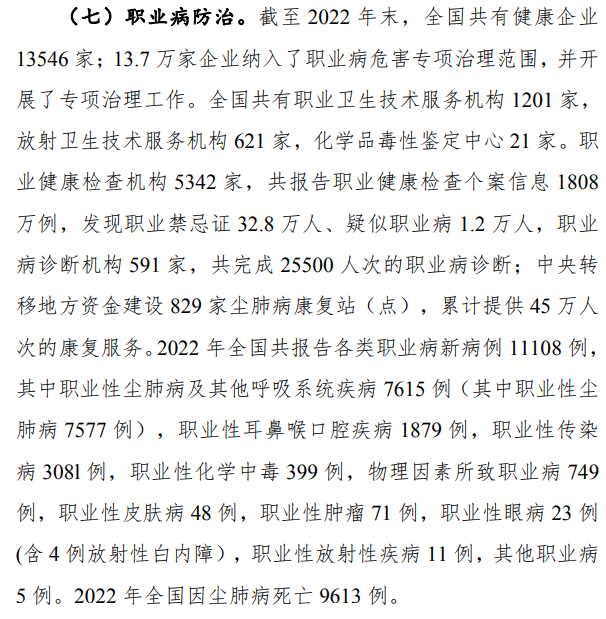
				- [职业病诊断标准目录及PDF文件下载 （截止2022年3月31日）](https://niohp.chinacdc.cn/zyws/wefscvn/202109/t20210914_236249.htm)
					- [截止和截至的使用区别 - 知乎](https://zhuanlan.zhihu.com/p/381058003)
					  id:: 65ee615c-8056-42ba-9ef8-0d632b268c59
				- [劳动保护|什么是职业病？得了职业病，如何申请工伤？_澎湃号·政务_澎湃新闻-The Paper](https://www.thepaper.cn/newsDetail_forward_7642228)
					- >职工职业病合法权益实现要经过四个法定流程。
					  >https://imagepphcloud.thepaper.cn/pph/image/70/139/174.jpg
				- 问题
					- 有些只与特定职业、特定致伤致病因素绑定
					- 近视、腰突、颈椎病等疾病不算在内
					  id:: 65ec4a5e-340a-4e35-9746-0ce5f4369aed
						- 虽然也可能另外因非工作因素导致
							- 但“工作时的久坐会增加非工作时的久坐”吗？
		- ---
		- 行业/职业
			- 学生
				- 学生工
				- ((65bcbf46-d13d-4540-8724-240889cbd584))
			- 制造、加工
				- 机器
					- TODO 振动手麻手抖（影响精细动作能力，可能导致不写字打字学习？）
					- 外伤
				- 粉尘
					- 护目镜
				- 呼吸防护 #苏州植青
				  collapsed:: true
					- [【Tactical Max】呼吸道防护，工业防毒半面罩攻略_哔哩哔哩_bilibili](https://www.bilibili.com/video/BV1ao4y1Y7mz)
					- ((65bcbf52-a002-485b-a42e-e1b2bfd86ef3))
					- 打磨石材等（台球桌大理石板）
						- 外科口罩不够
					- ((65e12b1f-ea35-4038-b536-5fda416db26a))
					- TODO 切割高温释放的气体（颗粒物防护口罩不够？）
					  id:: 65e7ff77-e1f1-4c60-a360-97c75137d0fd
				- 玻璃纤维
				- 污染清洗
				- 药物
					- ((65ff8d64-373b-4a85-be70-c9b912c82b61))
			- 运输
				- 货运司机
					- [【现实观察】工业社会的红细胞|货运司机从业经验分享_哔哩哔哩_bilibili](https://www.bilibili.com/video/BV1ct421Y7zZ)
				- 外卖骑手
					- [【随便聊聊】外卖骑手怎么办_哔哩哔哩_bilibili](https://www.bilibili.com/video/BV1eV4y1R7Z8)
					  id:: 65a3ef31-c693-4b48-a06d-11705c588610
					- 有没有久坐的负面效果？
					- 锂电池爆燃
						- [石墨烯电池，是锂电？还是铅酸电池？ - 知乎](https://zhuanlan.zhihu.com/p/389521624)
			- 卫生工作者
				- #“联合国那边怎么说？”
					- [职业卫生：卫生工作者](https://www.who.int/zh/news-room/fact-sheets/detail/occupational-health--health-workers)
					  id:: 659b89ca-42ed-4f7b-9197-7340dff23ae1
					- [卫生部门的职业危害](https://www.who.int/zh/tools/occupational-hazards-in-health-sector)
					- [卫生人力](https://www.who.int/zh/health-topics/health-workforce#tab=tab_1)
				- ((65f05595-5ef4-4501-8000-854f91f8033d))
				- 医患纠纷
				- 古巴
			- 网络平台内容审核员
				- [肯尼亚鉴黄师的严重心理创伤：240303录播part1_哔哩哔哩_bilibili](https://www.bilibili.com/video/BV1FA4m1F7JC)
				  id:: 65e70844-90d3-4598-995c-021a9dbebc07
		- 致伤致病因素
		  collapsed:: true
			- 为什么有这些致伤因素？这些致伤因素如何起效？
			- 天灾
				- 寒暑、雨雪，对于户外劳动者更可能成为天灾
			- 人祸
			  id:: 65ebd5fb-a9bd-4943-b8d2-ca2da3b5248c
				- 不合理的职业、单位、工作分配
					- 实习
					- 毕业分配
				- 交通事故/车祸（大多主要是“人祸”）
				- 用人单位
				  id:: 65ebfef3-9f2b-4fe1-98ef-a11eff494f70
					- 雇主不提供劳保用品的（比如“个体户”？）
					- 劳动工具（设计）不合理
					- 劳保用品分配不全
					- 劳保用品不合格、（“合格，但”）不适配
						- 劳保用品标准
					- TODO （进一步）增加（明显不必要的）工作量、有害健康的人为制度
					  id:: 65ebd692-0384-4470-8228-4fe7cd6e3bc4
					  collapsed:: true
						- 上班、点外卖、看直播、生病——“训练有素”
						- “美团化”
						  collapsed:: true
							- “哦不对，这帮↑↓太™不讲效率了？！——那就对了？！”
							- [住宅门禁：对基层劳动者的疲敌战术_哔哩哔哩_bilibili](https://www.bilibili.com/video/BV1NN411q7i7)
								- 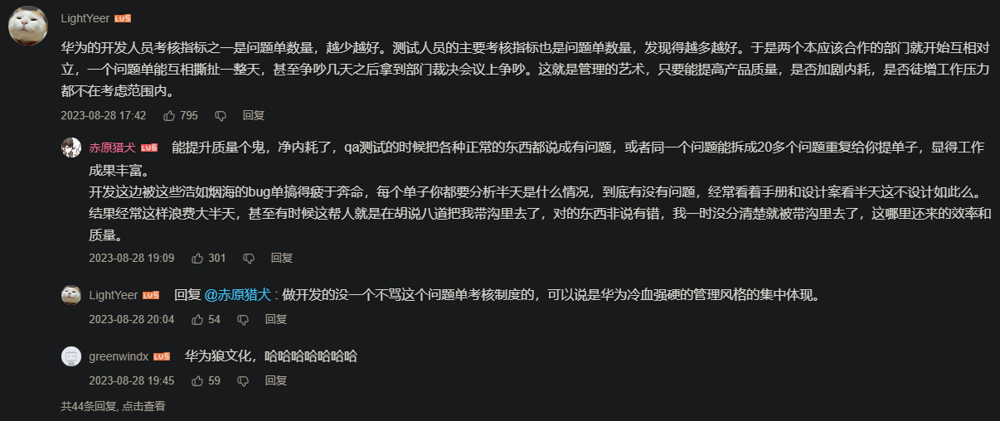
						- ((65e698dc-428f-4ba4-b201-cac076b42b30))
						- “Word病历！”
						  id:: 65f28aeb-564e-4620-8fef-b9e819ab072a
						  collapsed:: true
							- “听我说，写写，你，因为有你，温暖了四季~”
							  id:: 65f28d3d-ca12-43bf-a221-56bf051deb7c
							- 无纸化
							  id:: 65f28be5-c85c-4717-9a4f-e8a073ad00d6
							- 去Word化
								- “我将无Word”
						- 打卡
						  id:: cc954f52-0bff-4223-b5a6-909afe9c20e4
							- “怎么没有‘打卡人’捏？”——“把‘打工人’拆了就是‘打卡人’”
							- 如果早晚存在没有实际工作量（包括开会等学习）的时段，还一大早来一大晚走干什么？
							- 扫码
								- 虚拟定位
									- TODO fakegps（可在apkpure下载）
									  id:: 65e456f9-c905-4d76-a30f-736d01a82029
							- 钉钉打卡
							- “打卡是为了防止后续自杀，早发现早治疗”
							  id:: 65f51af0-1245-4c2f-bb82-5ed79898119a
						- 请假
						  id:: 65c8c2ab-5d5e-4224-aeaf-64f2181c8253
						  collapsed:: true
							- 流行病错峰
								- 假设你是个怕生病的人，办公室里一堆“咳咳咳”时，你想去不？你不想去（“？我看你想去见HR！”）
							- 争取法定节假日能放假
							- 无法正常放假时，需要非常请假
							- 不一定能用的法子
								- 高体温温度计“照骗”
								- 卷纸巾塞鼻孔“鼻塞”打电话
						- 电脑相关
						  collapsed:: true
							- ((65f035d1-5ff6-4d77-b077-0364220f7d45))
							- 抄写
								- 从电脑屏幕上往纸上抄
								  id:: 65f05595-5ef4-4501-8000-854f91f8033d
								  collapsed:: true
									- ((65f28d3d-ca12-43bf-a221-56bf051deb7c))
									- ((65f28aeb-564e-4620-8fef-b9e819ab072a))
									- 美其名曰“备份”，6
									- “至少还给你一些实验班水平的电脑看，相比绝大多数小学和部分初中还算是升级力！”
										- {{embed ((65f10a8c-3565-4ed6-b56d-96696779b684))}}
								- 谁来写？写什么？怎么写？
								- TODO 写字机
								  id:: 65f28c45-0f84-40ea-8fd5-3fa7ba981039
									- >写字机要是加上机器视觉（可能要加笔迹和文本模板）和语音或其他输入，可能也能用来写
									- [曾经爆红网络的“写字机器人”值得购买吗？ - 知乎](https://zhuanlan.zhihu.com/p/260176224)
									- [写字机推荐? - 知乎](https://www.zhihu.com/question/605394576)
								- “谁生的病谁写”
									- >我觉得病历病程应该给患者或家属来写
									  >每个人都是自己健康的第一责任人。
									  >病人写，医生审
										- >医保局要求用术语书写怎么办（）
										  >就算没有医保我们也需要术语
											- AI！
											- 选择题！
											- >在这样的患者之外，有没有可能人为推动一部分，比如年轻群体，线上问诊或买药好像就有“选择题”，就不说什么不太容易发现的ai
								- ((65f28be5-c85c-4717-9a4f-e8a073ad00d6))
							- 保密
							  id:: 65f10b68-f2e6-4e82-bc31-82950dbe6bfd
							  collapsed:: true
								- “禁止外带”（“如果有可能的话，真想把我的脑袋也留下来或者插上管是吧？”）——一方面限制了完成不必要工作量，另一方面更是限制了劳动者的劳动技能的发展，为整个劳动力供给增添了不必要的风险
								- 电脑不联网
									- 有个内网还可能通过内网邮箱等渠道往外传输信息
								- 不能跨软件复制
									- 甚至没有剪切板
								- 插u盘
									- “USB口都给封住了”
							- 工作日志/汇报
								- 抄写工作电脑无法OCR的图片上的文字
									- ((65f10b68-f2e6-4e82-bc31-82950dbe6bfd))
									- ((65f1018b-9870-4a6c-a838-0b021b0497b9))
									- >如果用手机识别，那还得塞进去，可能连不了手机，插不了u盘装离线软件，键盘没法再套一层类似“写字机”的外设，没法短路键盘输入——但我不确定
								- ((65f28aeb-564e-4620-8fef-b9e819ab072a))
								- 交班会PPT
									- 还可能电脑不联网
										- 可能有软件不联网就能ocr或更完整地做ppt啥的
										- 或者就是用手机，
										- （离线）语音输入
										- 该键盘
		- ---
		- ### 预防
		  collapsed:: true
			- 劳保/职业防护
				- 防护技能
					- 防护意识
						- 正面示范
						- 反面恐吓
							- “卖器材的消防培训视频PPT”
								- ((65ca2639-2a6d-4e71-a8fc-0c70a2f19163))
							- 危害、后果
								- “触目惊心”
								- 算！账！
									- ((65e9367d-48f4-45f6-9a8f-a7550bb021d1))
						- 工作量预估
							- “泰勒（指搞“科学管理”的），展开！”
							- TODO 工作问题求助平台
							  id:: 65f70223-3ba9-48f0-871d-57effa3972ac
							- 工作心态
								- >计时不要脸，计件不要命
								- “钱多≠喜欢”
									- “喜欢猫爬架的单子，就拿六十块，两人装了一下午” #苏州植青
					- ((6598f8d3-509d-4e8e-bbd3-91099aa3836e))
				- （专门的）劳动防护用品
				- （校园、职场）霸凌/暴力/PUA
				  id:: 65bcbf46-d13d-4540-8724-240889cbd584
					- ((65b644d1-f687-4191-99ab-7e4b06330ed6))
					- [2024开年陈鹤皋反校园霸凌宣传视频！_哔哩哔哩_bilibili](https://www.bilibili.com/video/BV1HT4y1W7zG)
				- 打电话（客服、外卖员、快递员）
				- 弯腰（建筑工人、快递员）
		- ### 治疗
			- [企业职工患病或非因工负伤医疗期规定_中华人民共和国人力资源和社会保障部](http://www.mohrss.gov.cn/xxgk2020/gzk/gz/202112/t20211228_431556.html)
			- ((65ebf21d-fcb7-4c94-a6e7-6b95f7f2329a))
				- 外伤
					- 换药、换药拆线
				- 骨折
					- 护理、康复训练
			- 慢性职业病的护理
			- 无菌意识
				- 消毒
		- ### 赔偿
		  id:: 65e9367d-48f4-45f6-9a8f-a7550bb021d1
			- 在预防环节造成的损失/支出是否需要赔偿？
				- ((65ebfef3-9f2b-4fe1-98ef-a11eff494f70))
			- 工伤保险
				- 怎样享受工伤保险？
					- 什么是“职工”？
					- 没有签订劳动合同的劳动者能享受工伤保险吗？
				- [工伤保险条例_中华人民共和国人力资源和社会保障部](http://www.mohrss.gov.cn/xxgk2020/fdzdgknr/zcfg/fg/202011/t20201103_394950.html)
					- [工伤保险条例解释：第十四条【应当认定为工伤的情形】(全文)-找法网](https://china.findlaw.cn/laodongfa/laodongbaoxian/gongshangbaoxian/gongshangbaoxianti/78318.html)
				- [工伤认定办法_中华人民共和国人力资源和社会保障部](http://www.mohrss.gov.cn/xxgk2020/gzk/gz/202112/t20211228_431606.html)
					- >**第一条**  为规范工伤认定程序，依法进行工伤认定，维护当事人的合法权益，根据《工伤保险条例》的有关规定，制定本办法
				- [2023版：工伤认定流程及赔偿标准（1-10级、工亡）| 劳动法库_澎湃号·政务_澎湃新闻-The Paper](https://www.thepaper.cn/newsDetail_forward_23272544)
					- id:: 65ebf3da-4cb0-4e8b-850e-33b3e17b032e
					  >根据《工伤保险条例》、《工伤认定办法》的规定，职工发生**事故伤害**或者按照职业病防治法规定被诊断、鉴定为**职业病**
				- [工伤的认定标准、流程及赔偿标准 - 知乎](https://zhuanlan.zhihu.com/p/153261593)
				- [工伤认定+赔偿标准（详细） - 知乎](https://zhuanlan.zhihu.com/p/388094030)
			- （工作单位等的）互助基金会
				- 非法集资问题？
			- 商业保险
			- 与医生沟通，在病历材料中书写医生意见，获取诉讼优势
				- 护理费、营养费、误工费
				- 休息证明
			- 交通事故
			  id:: 65ebf21d-5eea-488d-a590-c8e550536c9a
				- 报警（车牌号）、身份证/驾照照片、联系方式
				- 交通事故责任认定
	- 诊断辅助
	  id:: 65ceb60a-0181-4ccd-ba77-25eeed198d14
		- [UpToDate临床顾问](https://www.uptodate.cn/home)
		- [《默沙东诊疗手册大众版》](https://www.msdmanuals.cn/home)
	- 书籍文献
	  id:: 65c6e42b-96f9-4ce7-b5a3-1782e95df932
	  collapsed:: true
		- “卫生” ((65964bbc-7743-4c1e-8185-a61725fe6e2e))
		  id:: 65c589f9-342d-42c5-818c-f363a95b3847
			- https://link.resilio.com/#f=%E5%8D%AB%E7%94%9F&sz=33E8&t=1&s=O34YEYZ5TU5GLJDQ5UQ4HAF43KP2VR7W&i=CYGZPXLLIJ6QPDBY5JVVHGBDOAE3GVKOB&v=2.7&a=2
			  id:: 65b99bca-8361-4733-87fa-ae570e31ea46
			- 其中有一些“五八内部资料”
			- 文件夹目录可在[Snapshot of C:\\卫生](https://github.com/khtazmt/khtazmt.github.io/blob/main/pages/%E5%8D%AB%E7%94%9F.html)下载查看
				- 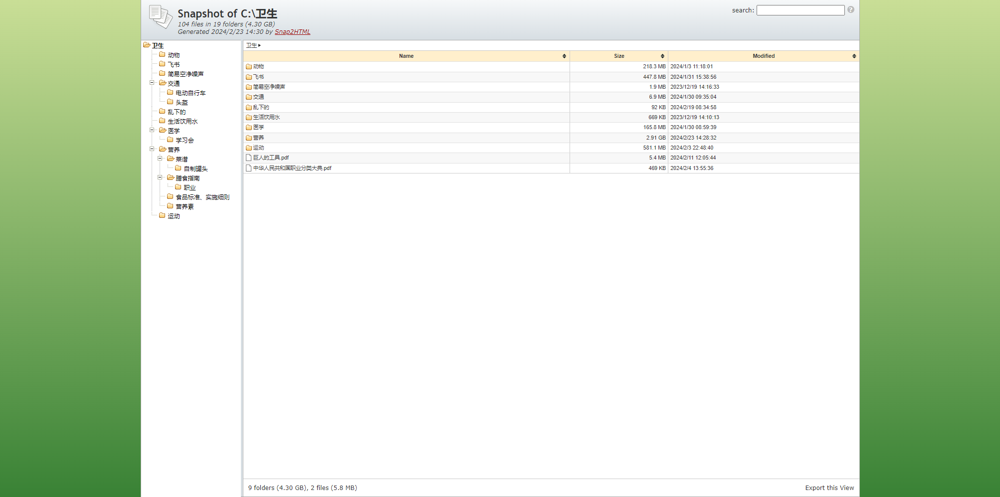
		- 《巨人的工具》
			- [放弃熬夜，做清晨的霸主（人生效率的巨变）_哔哩哔哩_bilibili](https://www.bilibili.com/video/BV1r24y1J7E7)
			- [「膝神」巨人的工具：杰弗逊拉伸_哔哩哔哩_bilibili](https://www.bilibili.com/video/BV1PU4y1q7YS)
			- [费里斯在《巨人的工具》里分享的助眠饮品，我替大家试了，对我还蛮有效的。_哔哩哔哩_bilibili](https://www.bilibili.com/video/BV1Yw41177CR)
		- 《治疗的真相》
			- 包含的部分网站（书后参考里有更多）
				- 疗法评估
					- https://www.cochrane.org/
					- https://www.jla.nihr.ac.uk/
	- 新媒体（一般是“碎媒体”；主要是我看过有点印象的）
	  collapsed:: true
		- ((65bc3c37-68df-49b0-9c4b-2f557dcb3428))
		- 推荐关注[b站五年八班卫生委员](https://space.bilibili.com/3493262790757141)收看健康资讯
		  id:: 65af9856-cb41-420f-9854-e65caee54b8d
		  collapsed:: true
		  新上线网页版健康手册：[劳动者的魔法书 | 劳动者的魔法书](https://labor-book-tcsnzh-db51f1bb3e4c6d314b959b20a2f8ee686d4cb7316ea7c.gitlab.io/) 
		  有不很紧急的健康问题可在微信公众号“五年八班健康助手”咨询：[五年八班卫生委员健康咨询引导~](https://mp.weixin.qq.com/s/hbeauVINjEhKpl6OZe5ezw)，[五年八班卫生委员心理咨询引导～](https://mp.weixin.qq.com/s/OqfjcovgQCwNrQBezrTJGw)
		  想加入我们请查看[五八招新啦~ 为劳动者的健康保驾护航，期待你的加入！_哔哩哔哩_bilibili](https://www.bilibili.com/video/BV1k94y137mv)
			- ((65bcbf4a-1618-478f-bcab-329735085b8b))
			- 有关劳动的法律问题请看
			  collapsed:: true
				- {{embed ((65c6fac5-9a02-4f2d-9390-241ee4d3e590))}}
		- “未圣卫生/卫生未圣”系列（“未明子错在哪？又对在哪？”）
		- 医学
		  collapsed:: true
			- [医痴的木头屋授权的个人空间-医痴的木头屋授权个人主页-哔哩哔哩视频](https://space.bilibili.com/2084669661)
			- [水果医生的个人空间-水果医生个人主页-哔哩哔哩视频](https://space.bilibili.com/291042076)
				- 性化蔬果（“难道不能直接看？”）趣味警示，似乎带起了一波传播范式
			- [Chubbyemu的个人空间-Chubbyemu个人主页-哔哩哔哩视频](https://space.bilibili.com/297786973)
				- 固定句式标题+固定带彩色的扫描影像封面+正常人似乎不会整出来的奇葩医学案例
				- 这个是起因有了，结果不好、“引人注目”但是“模糊“，过程“引人注目”
				- 观众的猎奇收集癖？
			- [豆包OWO的个人空间-豆包OWO个人主页-哔哩哔哩视频](https://space.bilibili.com/45412413)
				- [当医学生用专有名词玩谁是卧底！玩完游戏宿舍都决裂了！_哔哩哔哩_bilibili](https://www.bilibili.com/video/BV1pw411q7Tk)
				- 海龟汤
					- 看起来像是中心化的“谁是卧底”
			- [奇异脑博士的个人空间-奇异脑博士个人主页-哔哩哔哩视频](https://space.bilibili.com/2039176794)（读论文）
			- [脊医博士鹏哥的个人空间-脊医博士鹏哥个人主页-哔哩哔哩视频](https://space.bilibili.com/408907896)
				- ((65bcbf46-e287-466d-9891-f05f337bd977))
			- [田海源 - 知乎](https://www.zhihu.com/people/tian-hai-yuan-35)
				- ((65bcbf46-c5d9-48a7-9a9f-b1d2c2d5de8d))
		- 论坛
		  collapsed:: true
			- 煎蛋（一个无需用邮箱、手机号等注册的古早小论坛，近来“五年八班卫生”在“无聊图”板块有了些影响力）
			- 生存
				- [生存狂吧-百度贴吧--力所能及，同学共治，有备无患，为国分忧--生存狂吧欢迎各相关群体来此畅所欲言，进行友善的交流学习，生存就是活着，祝愿列位的准备永远用不上。](https://tieba.baidu.com/f?kw=%E7%94%9F%E5%AD%98%E7%8B%82)
				  id:: 65cd6999-4dfd-4da9-a825-b86899ee03eb
					- [[罐头]]
		- 健身
		  collapsed:: true
			- [肉崽 - 知乎](https://www.zhihu.com/people/rou-zai-52)
				- [力训研究所连载 - 知乎](https://www.zhihu.com/column/c_1315349725177552896)
				- ((65ae0905-adaa-4f90-a8fc-91fa43cae98c))
			- 精练GymSquare
			- TODO [飞特那斯的个人空间-飞特那斯个人主页-哔哩哔哩视频](https://space.bilibili.com/270885164)  >[2024-02-26](#agenda://?start=1708876800000&end=1708963199000)
			  id:: 65db5a86-95dc-45fc-8e77-777a6d9ae95d
		- ((65b4fa78-9a6f-416f-b4a0-6c0ac62b4698))
		  collapsed:: true
			- [河大基础医学院丁勇的个人空间-河大基础医学院丁勇个人主页-哔哩哔哩视频](https://space.bilibili.com/510028707)
				- [解读2023版成人糖尿病食养指南_哔哩哔哩_bilibili](https://www.bilibili.com/video/BV1z84y1A7S8)
				  id:: 65b8a1b4-0710-49cc-b3a1-38f81f06bf18
					- [卫健委《成人糖尿病食养指南》2023年版 - 哔哩哔哩](https://www.bilibili.com/read/cv22395146)
			- [国家卫生健康委办公厅关于印发成人高尿酸血症与痛风食养指南（2024年版）等4项食养指南的通知](http://www.nhc.gov.cn/sps/s7887k/202402/4a82f053aa78459bb88e35f812d184c3.shtml)
			  id:: 65f6e8a6-ea14-483b-8b3e-e8534e2eb266
			- 成长博士（美国）：知识星球“低碳/正分子/抗衰老/功能医学”（主要是论文解读，顺带销售自己品牌的膳食补充剂，以及培训班、加盟）
				- [低碳/正分子/抗衰老/功能医学](https://public.zsxq.com/groups/28851428188141.html)
			- 易楚（微信公众号“原始饮食”和“向往者”）
			- 木森（微信公众号“无麸质饮食”）
			- AKP健食天（日常机翻搬运Ray Peter等国外专家文章）
			- [维他 - 知乎](https://www.zhihu.com/people/make-peace-with-food)
			- [木木鸟 - 知乎](https://www.zhihu.com/people/mumuwellness)
		- “社会上现有的一些健康实践”
		  id:: 65d2f3f6-9fbf-4892-be56-f7acaf3f961d
		  collapsed:: true
			- [OpenAI炸裂的Sora背后：奥特曼清单法](https://mp.weixin.qq.com/s/WW2OZx5MpuPWiq8DLpo6xQ)
			- [GitHub - geekan/HowToLiveLonger: 程序员延寿指南 | A programmer's guide to live longer](https://github.com/geekan/HowToLiveLonger?tab=readme-ov-file)
			  id:: 65d2f434-e501-4573-81d8-b00e98ee0f68
			- ((65d2f23e-0cb1-4dd3-b027-10af7b4cd166))
		- 百科
			- wikihow
- # 健康习惯
	- 可以视作“预防”的主要部分
	- 暂时按时间顺序排序，运动我选的是八部金刚功，早晨太阳好的话可以在阳台开窗或出门边晒边练，运动完可以吃早饭，然后工作时无论站着坐着都需要对应的防护，最后中午天气好又能抽空可以晒背，回家可以按摩、泡澡等
		- TODO 墨镜、偏光镜？
	- TODO 评估自己和身边人的健康状况
	- ## 健康指标
	  collapsed:: true
		- 炎症特征（眼屎多）
		- 指甲
		  collapsed:: true
			- 半月痕（指甲月牙）
			- 竖纹
			- 横纹
		- 自检
			- 目视检查
			- 脚气
			  id:: 65bcbf46-9b0c-43f5-b21b-e1128ae0c95d
				- 弯曲脚趾
				- 与“（急/慢性）免疫受损”的关系（“当我们看到吸了口袜香然后肺部真菌感染的新闻，我们应能想到其他相对温和的糟糕可能”）
				- 鞋袜
					- 吸湿透气
					- ((65ae0909-47a9-4051-b05d-3428e32f16db))
				- 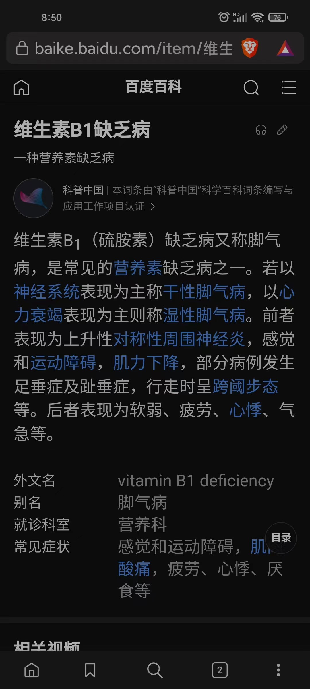
				  id:: 65cd7aea-3b4c-4961-8b7e-4355b950f5a4
					- ((65c974d2-d45c-4ba6-9b45-cbd56c9c5f17))
						- 香肠与鲜肉的b1含量？
						- 消化米糕、运动消耗？
						- 红薯等蔬菜缺失？
	- 仪器
	  collapsed:: true
		- TODO 手机测体温
		  id:: 65ccce98-a9e5-4d64-9658-01efb5f17320
			- ((65ccce61-c8f8-49e9-a439-0aa3d5900296))
				- [An app can transform smartphones into thermometers that accurately detect fevers  |  UW News](https://www.washington.edu/news/2023/06/21/an-app-can-transform-smartphones-into-thermometers-that-accurately-detect-fevers/)
	- ## 社交
		- “你是I人，你看这些帮助你发现你是I人的视频、相应的评论和你发的评论、动态时，你真的不是在热烈地社交？”
		- 话疗——吐槽群
	- ## 运动
	  id:: 65bef01e-6c50-489b-8678-edc291a9be9e
	  collapsed:: true
		- 运动量参考指标
			- ((65a1f76b-62ee-4a74-af5e-5e6638c3e544))
			- ((65bf90a3-741e-4409-9ec4-80e51f9f7435))
			- 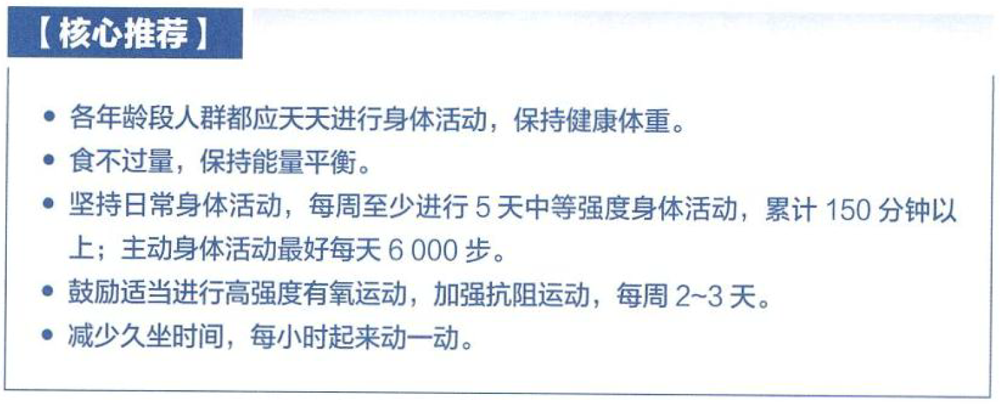{:height 286, :width 687}
		- “没‘时间’运动”怎么办？
		  id:: 65bcbf46-2833-485b-aa32-ef768d35e3ae
		  collapsed:: true
			- “把运动视作逃避现实（的其他部分）/从繁重工作中脱身休息放松的手段/途径”——“就像吃饭和吃饭时看视频，有时更像做饭”
			  id:: 65ddf98e-1e4f-42b5-b851-7d9ccb90a00e
			- 场景
				- 下课拖堂、“放学不存在”
				- 超时劳动
			- 久坐围绕坐具休息/拉伸（开车时自觉安全时可能左脚蹬地离座）
				- 坐位扎马步
					- “听说还有坐马桶蹲马步的”
					- [请问扎马步哪个是标准的？ - 知乎](https://www.zhihu.com/question/345343925)
				- 坐椅扶手双杠
				- 一对硬而稳的椅背作为双杠（可以练直角式、举腿、臀中肌等）
			- “随便练练”
				- ((65bcbf46-cab5-4cd7-bda8-c2ea17780d37))
				- 快走（除夕夜走到附近亲戚家）
				- TODO 不坐时（坐后、洗碗/移碗、扫地拖地、饭局中后期）就站桩、马步
				  id:: 65c6f987-b61e-41fa-b32f-4ca354d07011
				  :LOGBOOK:
				  CLOCK: [2024-02-24 Sat 22:46:19]--[2024-02-26 Mon 17:55:11] =>  43:08:52
				  :END:
				- “城市就是健身房”
				  id:: 65bcbf46-e889-4324-b046-244c9a64ae07
				  collapsed:: true
					- 蹦床袜爬墙（）
					- 爬楼
					  id:: 65558df4-0822-4a5f-a669-658b067dcfe6
					  collapsed:: true
						- [每天爬5层楼可降两成心脏病风险--健康·生活--人民网](http://health.people.com.cn/n1/2023/1025/c14739-40102775.html)
						- “那么深蹲呢？”
					- 等电梯时/电梯里深蹲（“电梯给同向加速度时蹲起还相当于加重量”）
						- 我自重或较小重量时单腿蹲（第一次轻负重蹲时摔了两次，除了自己绷不住外没啥影响），较大重量时双腿蹲
					- 电梯
						- 蹲在电梯时头顶着电梯壁起身（“桥”——“啊朋友再见~”）
					- 路牙快走
					- 连续石墩跑酷
					- 超市健身
					  id:: 65c750b9-8c65-4dae-a610-a06c3da4dde5
						- 超市商场倾斜步道健身
							- 箭步蹲、髂腰肌拉伸
						- 《购物车运动指南》
						  id:: 65c750b9-eeed-4211-adfd-3f59a4083ad5
							- # “购物车🛒漂移太爽力！”
							- 驾驶方式由脚踩（滑板？）改手撑？
							  collapsed:: true
								- 最简单的上杆
							- 分解练习
								- 单手手握推行
								- 跳跃后停车（避免滑行时碰撞）
								- 同侧脚杵地转弯
								- （左脚前滑）直线行驶
								  collapsed:: true
									- 购物车由于常规使用者的重心而磨损，在运动中通常容易右倾右转（然后就马太起来了）
							- 有没有购物车主题碰碰车？
				- 室内单杠
				  id:: 65a9d480-7c33-49fd-a057-eebda1f83cd4
				  collapsed:: true
					- ((65681fc5-cc87-4631-8898-8d7ea3a89656))
				- 宠物
				  collapsed:: true
					- “在家坐久了起来撸撸[[猫]]狗”
					- ((65e9c3f1-211d-4363-b9d3-e7fed2fd368c))
						- 没有猫也可以像猫追猫那样人追人
					- ((65fa768e-013a-42ec-b13f-7eabd9ea1b6f)) （“抱不动小孩我还抱不动你？！”）
		- “一个动作一次都完成不了怎么办？比如引体向上、俯卧撑”
		  id:: 65e493d4-9215-48cc-98c6-1269cca46631
			- 像《囚徒健身》那样循序渐进，
		- [[运动康复]]
		  collapsed:: true
			- 我的理解就是“通过运动康复”
			- [To 体力劳动者：下班后如何放松身体？_哔哩哔哩_bilibili](https://www.bilibili.com/video/BV1qm411Q7dD)
			- PRI
				- [PRI(姿势恢复技术)官方视频及教材学习笔记 - 知乎](https://zhuanlan.zhihu.com/p/462691937)
			- TODO [运动康复推荐一本好书吧，拒绝民科_哔哩哔哩_bilibili](https://www.bilibili.com/video/BV1jS421N79K)
			- 骨盆前/后倾
			  id:: 65ddd7e0-c574-4abb-940d-f8c3da658a2f
				- [骨盆前倾、后倾的康复训练_哔哩哔哩_bilibili](https://www.bilibili.com/video/BV1NC411p7dd)
				  id:: 65ddd7d4-eb44-45f2-ab26-83ea277427cb
					- 弹力带臀桥
						- 弹力带可能用挂钩弹力绑带（长1m宽3cm）代替（我的腿粗于平均，但绕上两圈还是不那么极限地撑开）
							- ((65cec209-9acb-4511-9ebf-d906c094420c))
						- 与 ((65bee97e-832d-4757-bc18-d00c8b707847))？
					- 死虫式
						- 在软床上练不如在硬地板上练
			- 健身操
			  id:: 65ae08cc-ac8b-492a-86b7-7857cdcdeb16
			  collapsed:: true
				- 广播体操
				- 传统健身操
				  collapsed:: true
					- TODO “练功服/表演服为什么流行用那种发亮的化纤？”
					- [[八部金刚功]]
					  id:: 65bcbf46-66d9-4c38-88d0-0bc37ef22330
					  collapsed:: true
						- 注意保暖，张道长的海南温暖，冷的话可以中午再练，不必很早练
						- 起式与第一部合并快练九遍约7分钟（这是“赶时间”的练法，不熟练或身体状况不佳时可能要10分钟以上，请循序渐进、量力而行）
							- DOING [练习八部金刚功速度和效果的思考分享 - 知乎](https://zhuanlan.zhihu.com/p/552787840)
							  id:: 65d88248-90df-4f33-8b78-d5ef512d82ca
							  :LOGBOOK:
							  CLOCK: [2024-02-25 Sun 09:37:36]
							  :END:
						- DOING 八部金刚功融合强化
						  id:: 65d6aa17-df44-4679-b57b-7f304e765bdf
						  :LOGBOOK:
						  CLOCK: [2024-02-25 Sun 20:24:42]
						  :END:
							- 质量不变的情况下加速
							- 第一部
								- 提踵
							- 第二部
								- 弓步拉伸
							- 第三部
								- 哥萨克深蹲
								- TODO 手部上重量
							- 第四部
								- TODO 手部上重量
							- 第五部
								- 箭步蹲/保加利亚深蹲（后者可能有点低效）
							- 第七部
								- 手掌着地
							- 第八部
								- 单腿提踵（可以左右腿交替）
						- TODO 功理分析、功法比较（“内视觉剪辑大手子是吧？”）
							- ((65d45605-fdf4-4936-aa1b-80d8c525a4b4))
						- ((65bcbf60-4a2f-45ca-b122-c1eaf5c2fd4a))
			- 拉伸
			  collapsed:: true
				- 需要拉伸吗？
					- [力量训练后为什么要拉伸？ - 知乎](https://www.zhihu.com/question/441492600)
					- [私教不给我训练后拉伸，也不让我自己拉伸，说要让乳酸堆积长肌肉，这合理吗？ - 知乎](https://www.zhihu.com/question/525395549)
				- “四决”
				  id:: 65bcbf46-cab5-4cd7-bda8-c2ea17780d37
				  collapsed:: true
					- 约2分钟
					- 根据自身情况，一般全天都可以练
						- 我目前一般在睡前练，因为地板和袜子有点滑，而床铺不滑，加上我日常比较忙，而且确实至少应该在睡前练一下放松一下，不然“明日”啊？
					- 《囚徒健身2》的“三重彩”（旧版翻译为“三决”）
					  id:: 65d6aa17-e603-46f7-9d9b-8d7db69b944d
						- [我的囚徒健身之路（十五）：你可以不练《囚徒健身》，但必须打造“刀枪不入的关节”——囚徒秘法“三重彩” - 知乎](https://zhuanlan.zhihu.com/p/330486758)
					- 仰卧束角
					  id:: 65bee97e-832d-4757-bc18-d00c8b707847
						- 我一般先做“三重彩”中的桥，然后是它，再然后是扭转和直角
						- 天热时如果睡前在床上做可以提前，免得汗黏床单
						- 这样的姿势小学时遇过比较粗暴的上去踩大腿拉开的体育老师，自己日常做最多用自己手掰掰大腿可以了
				- 髂腰肌拉伸
				  collapsed:: true
					- [如何拉伸髂腰肌？ - 知乎](https://zhuanlan.zhihu.com/p/360670011)
					- 久坐后拉伸
					- 两腿一前一后，相比两腿同步的桥的角度更大（“那么两腿不同步不就行了？”）
					- 尽量用手把脚后跟往臀上靠
					- 地面硬、没垫子可以一脚踩椅面，另一条腿大腿靠膝盖处抵着椅面侧部拉伸
				- 亚历山大技巧
					- [别再靠墙站了 轻松修正体态 亚历山大技巧 半仰卧放松法_哔哩哔哩_bilibili](https://www.bilibili.com/video/BV16t4y1Y78s)
			- 土耳其起立
				- [土耳其起立——指引你强壮的导师_哔哩哔哩_bilibili](https://www.bilibili.com/video/BV15W4y1G7Pr)
			- 臀中肌
				- ((6137276f-9305-42f3-a67b-783ad4cf6581))（没有爬山之类的训练的话，每周可能要练个一两次）
			- 牛面式
			  id:: 65db3954-5e07-4079-b886-9085bd8b69e5
				- >朋友圈看到的，试了下，换另一侧有点难，比扭头放大了若干倍，不知有没有右手写字、用鼠标的影响
				- TODO 右侧卧对右肩灵活度的影响？
				  id:: 65fa8396-a419-4994-af1e-c4f5667ae898
			- 爬行
				- [爬行健身是否科学？ - 知乎](https://www.zhihu.com/question/20648733)
				- ((65bcbf46-c5d9-48a7-9a9f-b1d2c2d5de8d))
				- ((65e9c3f1-211d-4363-b9d3-e7fed2fd368c))
				- 也可以是心肺训练
				- TODO 可能有助于耐受类似的骑自行车的姿势、增大操控力？
				  id:: 65f852f9-0bc9-4b56-bf3d-6989db1229d0
				- [由于我一直爬一直爬…越来越像猫了_哔哩哔哩_bilibili](https://www.bilibili.com/video/BV1kg411D765)
				- 注意事项
					- 快爬时可以戴护具，头盔、护膝等，注意避免（“顾头不顾脚”）在墙角拉伤脚趾
					- 防滑
						- 蹦床袜
						- TODO 防滑袜套
				- 猫爬
					- [【八大黄金体态减脂动作】第1式：跟我一起学猫爬_哔哩哔哩_bilibili](https://www.bilibili.com/video/BV1ab411h7wq)
					- [这是我见过最好的猫爬_哔哩哔哩_bilibili](https://www.bilibili.com/video/BV1ct411r7QT)
					- “我们一起学猫爬”
						- ((65c6ff25-5b55-4b45-884b-092858872f50))
						- 可能类似全谷物的思路，爬等非步行姿态可以占五分之一以上
						- 而祖先很多也需要伏击、卧倒
			- TODO ((6311e5cf-9e50-48b0-a908-ad7b535aeca4))（以前试了没持续）
			  id:: 65bef01e-dfd2-46dc-95df-f56a76d9ff37
			- TODO 提肛VS凯格尔运动
			  id:: 65db409c-d3d1-4a54-b0e9-bdb754d34982
				- >今天下午看地星直播足球的老哥说冷，我让他深蹲他就扯到提肛但好像这两种不太一样 #杭州地星
				- >凯格尔一大系列，能科学点全身上下哪有问题就练哪。
					- ((65db5a86-95dc-45fc-8e77-777a6d9ae95d))
		- [[自行车]]
		  collapsed:: true
		- 跑步
			- 跑法
				- TODO ((65b25682-901d-435b-943e-dbde0a2ab3d5)) 跑步
				  id:: 65d81afc-655d-4a5c-9ebd-d59ccc739d22
				- [跑步需要学习吗？所谓的“跑步技术”是营销还是科学？|跑步_新浪新闻](https://k.sina.com.cn/article_2687299131_a02cee3b01900zxq2.html)
				  collapsed:: true
					- [我對跑步技術的意見](http://www.tswongsir-runners.guide/articles/my_opinion_technique.htm)
				- [道家的跑步方法](http://www.paobushijie.com/articles2/470-daojia-paobufa)（“挂了”）
				  id:: 65ae08da-c367-47ec-addc-cf34cea7f36e
				  collapsed:: true
					- [道家的跑步方法，不喜忽喷！！_跑步吧_百度贴吧](https://tieba.baidu.com/p/1287820906)
					- [为什么道家不赞成跑步健身？真的会伤气血吗？与站桩有何区别？_哔哩哔哩_bilibili](https://www.bilibili.com/video/BV1H44y1e7M5)
				- 一种跑法同等适合所有种族吗？
			- [[心肺]]
			- TODO [[赤足跑]]
		- 运动装备、耗材
		  collapsed:: true
			- 健身房
				- “免费健身房”
					- “免费健身房避免了社会资源浪费，同时免费使用者免费帮酒店制造了健身房景观，有利酒店客户粘性和社会健康”
			- [[运动饮料]]
			- 蛋白粉
				- 光喝蛋白粉当代餐，营养显然不均衡
		- 运动APP  #长沙橘浪
		  id:: 65ebf042-d4f0-4313-a8eb-865b8e58449e
			- 行者可用于骑车、跑步、走路等
			- 训记用于力量训练比较好
	- ## 饮食
	  id:: 65a920d2-243a-442d-9c1c-da33ffd96a2d
	  collapsed:: true
		- # 接管厨房！
		- “我才不怕吃，一听吃我就高兴”
		- “咽下去了、看不见的便可以不管么？”
		- 饮食的快感机制
		- 家里有人太会太爱做菜怎么健康饮食？
			- （？）可能只需优化家人做的菜并教会便足够
		- 从买菜到菜谱到营养，从疾病到营养
		- 从食品化学到化学
		- [[营养食谱]]
		  collapsed:: true
			- [[买菜]]
			- [[食物功效]]
			- [[菜谱]]
				- [[炭烤]]
			- [[营养素、膳食补充剂]]
			- 宏量营养素比例
				- [【随便聊聊】我个人的减肥方法，仅供成年人参考，非医疗建议_哔哩哔哩_bilibili](https://www.bilibili.com/video/BV1rf4y1377e)
				  id:: 65bcbf46-c7b7-4416-86a2-f90bf18f5e18
			- 用餐次数和用餐时间
				- ((65bcbf46-c7b7-4416-86a2-f90bf18f5e18))
				- 一日N餐
				  id:: 65ab31a2-942b-43f9-8c29-2327ed283d47
				- 不吃早餐真的不好吗？
					- 体力劳动者
					- 脑力劳动者
				- [《JAMA·内科学》：下午3点后不吃，值得坚持！临床试验发现，每天在7-15点间进食，14周减重效果优于不限时丨临床大发现](https://mp.weixin.qq.com/s/lLUbPAO4eef6b8XYgjl8sg)
			- 饮水
			  collapsed:: true
				- 人真的需要每天喝“八杯水”吗？
				- 口水
					- “吞津”真的是没用的吗？
						- 八部金刚功·窃吃昆仑长生酒
						- 唾液酸？
			- 通过饮食检测生理功能
			  collapsed:: true
				- 蛋黄检测胆功能？
		- 炒菜历史
		- 消费替换
		  collapsed:: true
			- 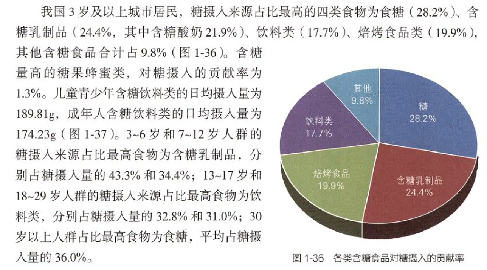
			- ### 代糖
				- [新研究发现代糖「赤藓糖醇」可能增加心脏病风险，如何解读？市面上的无糖饮料还能喝吗？ - 知乎](https://www.zhihu.com/question/586895483)
			- ### 奶
				- [[酸奶]]
				- [[奶茶]]
		- 食品安全
		  collapsed:: true
			- 饭店一次性餐具是否干净
			- 路边摊腹泻
			- [拔鱼刺挂什么科？_哔哩哔哩_bilibili](https://www.bilibili.com/video/BV1sU421d7qY)
			  id:: 65dd32f2-a36b-4229-98bc-bee86cdf0065
		- ### 谷菜——盐油糖肉酒（猪，“香肠的诞生”）
		  id:: 65c5a920-ac35-428e-b3af-f730d355d0c4
		  collapsed:: true
			- 工业化生产（古代产量相对不高，现代是拿陈酿古代尸体换速成现代尸体）
			- 精制谷物
				- 口腔、下颌发育
			- ((65bcbf49-8e56-4e3e-8ecf-73b99f591c2a))
			- 作为一道菜，肉类体积与蔬菜体积对应，造成整体偏大？
			- 定性与定量
			- 通过感官判断食物咸度？
			- 蔬菜多、油多、肉少所以用盐多？味精？
			- 盐
				- 含钠调味料与（食物其余部分中可能已有的）食盐分离
					- TODO 无盐酱（青酱、红酱等）
					  id:: 65e48e90-b778-447a-9382-e4f28dba78a7
			- 添加糖
			  collapsed:: true
				- 可乐
					- 戒饮料的经验
						- >从味道出发我是坚持普通可乐的，但我对咖啡因比较敏感（规律是最晚下午两点前喝），虽然短时间能比较兴奋，拉长几天看对工作效率乃至作息有不良影响，短时间兴奋也不好说（“忘了”）帮助产生了什么实际上很好的成果，加上辞职后收入不确定，以及知道替代品雪碧“不仅不是最好的墨西哥蔗糖可乐“，还多了代糖，后面就连带按重量算比较贵的以前经常一起吃的乐事薯片戒了——顶多过年喝点还不算冰的玩玩
							- >还有（至少曾经）可口可乐占水源显然算作恶，这可乐喝不得啊（
								- ((65bcbf55-d77e-443a-99cb-db4418f5b8f5))
			- “（被允诺的）节（日饮）食”（“你怎么吃得比小孩还不健康？这就叫过年？”；这是“节难”的一部分）
			  id:: 65c5a8e2-0592-4e57-861b-f56ec1981109
				- “有没有相对健康的节日？休假学习不过节之外的？”
				- 过年腌制肉类（主要是香肠、腊肉、咸鱼、火腿这类，主要是通常要凑几种常见畜禽的冷菜）与其他食物合并、同做，或者小份量，减少一菜一调味叠加的更高钠摄入
					- ((65c974d2-d45c-4ba6-9b45-cbd56c9c5f17))
			- [[酒]]
		- 辣醋
		- 食品礼品
		  collapsed:: true
			- 长保与送礼、健康（“最好的请过来，但是并非最好”）
		- 挑食
		  collapsed:: true
			- 从全谷物到精制谷物
			  id:: 65cd87d1-20e2-420e-a0e7-d377fc250c15
				- “精面粮票多的人高级，精面更高级”
				- ((65cd87a8-27b7-4806-97de-f04d68b0c200))
			- 儿童爱吃比较咸的肉类？
		- 餐馆
		  collapsed:: true
			- ((65cc3677-9630-453a-b4db-07ad47f74d91))
			- 前期小盅
				- 小米放后面作主食？小米份量多了浪费？
	- ## 防护
	  collapsed:: true
		- 此处参考佛学的“六根”（“慧根”）“眼耳鼻舌身意”从上到下排序，是按器官/官能/功能分类
		  id:: 65b0f912-6668-4e9f-9c76-e801c2db0684
		- DOING 护眼
		  id:: 65a9d480-dcb8-4078-b919-557a0ceff5df
		  collapsed:: true
		  :LOGBOOK:
		  CLOCK: [2024-03-12 Tue 21:30:50]
		  :END:
			- 光照
				- 通过食物和膳食补充剂摄入叶黄素、虾青素等物质有助于减轻观看常见的手机、电脑的电子屏幕对视力的伤害，但我们完全可以在更靠前的环节调整和控制光照，更有效率地护眼
				- 另外有没有一种可能，因为不够护眼，所以近视，为了看清楚导致姿势改变，进而产生姿势相关的健康问题？
				  id:: 65af20db-6adc-4c87-8656-1997083eb608
				  collapsed:: true
					- 所以近视，所以更靠近屏幕，所以受损更快？
				- （显示区域）深色模式
				  id:: 659e074a-982a-46c6-8116-045309dd7ea7
				  collapsed:: true
					- “减光模式”——“低钠盐”
					- [[冥观：护眼安神的深色模式]]（“慢慢拆”）
					- “黑觑觑是好的”
						- ((65f0443c-0625-4a8a-9d6b-4c88994e992e))
							- LED白光含蓝光
						- {{embed ((65bcbf46-4570-4354-aab6-9e8b5fe1a661))}}
					- ---
					- 桌面壁纸
						- 我是下了一张纯黑图片，也可以截图
					- （可以）“跟随系统”的软件
						- ((63639cfd-485b-4289-b75c-421b6cf0bf80))
					- 网页
					  collapsed:: true
						- 切换本站深色模式
						  id:: 65bcbf46-dfdb-4164-904a-2a5fc2843143
						  collapsed:: true
							- ((65af1d52-bdcf-4bc1-8dea-cef1ffb94882))
							- 右上角“三个点”-“Toggle theme”
						- ((65bcbf4a-96cc-40de-b3c8-f492ffdd55b6))
							- {{embed ((659b89b9-61c9-4018-8d78-5488d98a2999))}}
					- 一些软件
						- 输入法
						- ((65bdc728-d4a7-4ed1-949f-1ee817c4c0f2))
							- >PDF软件我用的acrobat，里面可以直接调成灰底白字，但可能会跟有些图片不兼容。但亲测大多数文献的图片没什么问题
								- [电脑端各类系统+软件的深色模式（dark mode）推荐 - 知乎](https://zhuanlan.zhihu.com/p/399210202?theme=dark)
								- [Adobe Acrobat Pro DC 如何更改主题和文档颜色-百度经验](https://jingyan.baidu.com/article/4d58d541ed668fdcd4e9c0dc.html)（PDF-XChange Editor也可以：“文件”-“首选项”-“辅助功能”）
								  id:: 65f03aba-206c-4b56-88cf-7f7a64aaed99
						- ((65e5a8ed-8e66-49ff-bf36-046a44e8e179))
						- ((65d57e59-30f1-4d00-8a0f-c158fe590073))
					- ((65bcbf46-2c33-4417-90e3-abf503dcb6a7))
					- 部分工作电脑受限无法进行软件调整深色模式的情况
					  id:: 65f035d1-5ff6-4d77-b077-0364220f7d45
						- 旧版操作系统
							- [有没有使win32程序支持深色模式的应用？ - 问题求助❓ - 小众软件官方论坛](https://meta.appinn.net/t/topic/42384)
						- 特定行业/职业的专用操作系统
						  id:: 65f047e7-bf18-4c0f-a47f-1bad4a266e5b
							- 如果系统设置里没法调，又没法装有用的软件，那就用显示器先调亮度（可能调到0还是比较亮）、对比度（可能调到20左右还可以看）
								- TODO 快速切换显示器设置（工作电脑可能是多人共用的）
								- ((65bcbf46-fecb-4935-b55e-217007a23e26))
				- （白天）坐窗边（最好面对窗、居中，以防 ((65bcbf46-c521-4ac8-8f5d-81aeaf740bd8)) ）
				  id:: 65dec081-5e03-4520-9a40-a76206443082
				  collapsed:: true
					- ((658eabb9-4f48-4825-b4a3-12eef5ed1c73))
					- TODO 夜间拉窗帘反光还是不拉窗帘用玻璃窗反光更护眼？
					  id:: 65d425cf-80a0-428c-b1c3-85b68348c3fe
					- TODO 网络接口位置和网线长度（如果无线网卡没有或不太行，就可能接网线；“电脑在，人在”） >[2024-02-27](#agenda://?start=1709037196660&end=1709038996660)
					  id:: 65dc5ee7-00c1-45b8-9ad8-c14e89ed2cf5
				- 防蓝光（主要在夜间防，如果显示器的有害蓝光较强，白天也需要防）
				  id:: 65f0443c-0625-4a8a-9d6b-4c88994e992e
				  collapsed:: true
					- ((65a920ca-c842-481b-988e-794be1a15c7d))
					- ((65bcbf46-2c33-4417-90e3-abf503dcb6a7))
					- ((65bcbf46-fecb-4935-b55e-217007a23e26))
				- 夜间照明
				  collapsed:: true
					- 减
						- 顶灯、吊灯等给书桌/电脑桌照明太浪费，从背后和四周照明也给敏感者压力
						- 早睡，减少夜间低照度和人工照明时间（蓝光也会导致难以早睡，进而延长接触蓝光时间——“经典马太”）
						  collapsed:: true
							- “睡前”（“坏了，芝诺了”）不看手机
								- [今起，请提早关机1小时](https://mp.weixin.qq.com/s/_B3iSajSitnw8qJQmeh0Aw)
								- 一定要看的话，配合此处的光照、饮食等方面的措施，可以减小伤害
					- 加
						- ((65bcbf46-74fa-4e99-ad22-7903a4274bd9))
							- 红光灯
								- 红光LED吊灯
									- TODO 支架
							- TODO 屏幕灯？
								- ((65f04526-9e5e-4a7e-bf50-856035c0bd97))
				- 手游
				  id:: 65af1d52-8876-4bfb-9162-221fadbfc8fc
				  collapsed:: true
					- “另一方面看，MOBA类相比电脑微信还算是深色模式”
					- “娱乐也是劳动哦”
					- “独自匹配网游，输也好，赢也罢，一般不能发展什么现实力量，也算是一种年轻人的无效社交”
					- “玩电脑！”（“边际改善是吧？”）
					  id:: 65b644d1-f687-4191-99ab-7e4b06330ed6
			- 饮食
			  collapsed:: true
				- ((65ae0905-bf45-4911-a80a-63005bcc7943))
			- 眼部休息和练习
			  collapsed:: true
				- 闭眼
					- ((65eaaa96-dda6-4624-b300-6eef15b28bc0))
						- >闭眼也可以啊，记得拿个手或者眼罩把眼睛捂住，制造一个黑暗的环境
				- 平行眼
				  id:: 65eae120-06a4-4e99-a5a0-5227c84864c4
				  collapsed:: true
					- [立体视界的个人空间-立体视界个人主页-哔哩哔哩视频](https://space.bilibili.com/108866238)
						- [【裸眼3d】B站最强过山车：全程高能！_哔哩哔哩_bilibili](https://www.bilibili.com/video/BV1y7411h7ST)
					- >没有看远的环境的话，可以去看那种裸眼3d视频，相当于一种视功能训练。但有点难，可以慢慢训练
						- >好像是“平行眼”，以前看过一些过山车、半条命alyx，还用谷歌盒子玩过纱窗vr
				- TODO 近视渐进拉远？
			- 心理
				- “儿童埋头写写画画不让人看，可能在成长中受到了一些挫折” #小屋 #儿童
			- 疾病
				- 干眼症
				  collapsed:: true
					- 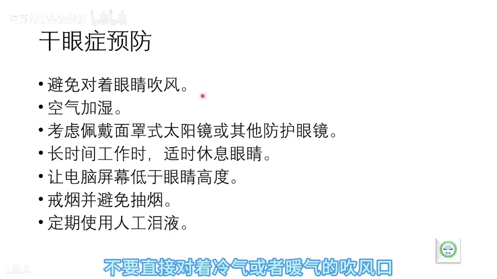
				- 麦粒肿、霰粒肿
			- 学生
			  id:: 65eaa6d4-351e-43e2-a40c-f907eaf595d4
			  collapsed:: true
				- 眼保健操
					- id:: 65eaaa96-dda6-4624-b300-6eef15b28bc0
					  >看近太久后，注意间隔一段时间闭眼，按摩眼周其实都是次要的，午休晚上热敷一下也可以
					  闭眼和看远都可以
				- 趴睡
			- ((65eaa5d8-a5f9-4c16-b1f1-e3015404e60b))
			- ((65ebd692-0384-4470-8228-4fe7cd6e3bc4))
			  collapsed:: true
		- 噪声
		  id:: 65b25bd4-88ae-48d8-a16d-64f253e59226
		  collapsed:: true
			- [耳聋和听力损失：听力安全](https://www.who.int/zh/news-room/questions-and-answers/item/deafness-and-hearing-loss-safe-listening)
			  collapsed:: true
				- [世卫组织发布新标准以应对日益严重的听力损失威胁](https://www.who.int/zh/news/item/02-03-2022-who-releases-new-standard-to-tackle-rising-threat-of-hearing-loss)
			- [长期生活在噪音中对人有什么影响？ - 知乎](https://www.zhihu.com/question/36313274)
			- 先确认系统和软件的音量，再连接耳机（可以先不戴），最后播放（以免音响在耳机连接前突然播放）
			  id:: 65f06356-d42c-41de-98bb-5bab1c102e82
			- 耳塞/耳罩
			  id:: 65bcbf46-7772-4bee-be4a-6b7f8f56a859
			  collapsed:: true
				- 硅胶泥耳塞
				  collapsed:: true
					- [谁说的硅胶耳塞没效果？明明是你不会用_哔哩哔哩_bilibili](https://www.bilibili.com/video/BV1T84y1S7An)
					- 我买的聆舒的掰成两半用效果不错，橙色的拉出来有点像红薯条
				- 发泡耳塞
					- 剪短发泡耳塞至约12~15mm（我目前是剪去较粗的末端；我买的罐装挺多的聚氨酯发泡耳塞，长约24~25mm）能降低降噪效果，同时显著减少各种不适
					  id:: 65cd74da-4e94-495d-a9fe-64a290c58afe
					- 旋转取出可减少可能的取出时的不适
				- 降噪程度较大的话，可能搭配麦克风和骨传导耳机通讯
			- 吸音棉
			- 机器噪声
				- 装修噪声
				  id:: 65e12912-c922-45d1-bba5-08b1a6cdf9b8
			- 宿舍噪声
			  collapsed:: true
				- ((65b644d1-f687-4191-99ab-7e4b06330ed6))
			- 高密度教培机构的小学儿童喧闹噪声
				- “咱就是说，儿童演化出来的能把世界全部灭掉的高音是不是有点太响了？”
				- [教师节特别专题：揭秘耳鸣防护秘籍，让老师的耳朵远离疾病！-潍坊耳鼻喉医院_工作_压力_神经性](https://www.sohu.com/a/719303326_120733263)
				- [全球超15亿人存在听力损失，老师们请进行听力保护 - 知乎](https://zhuanlan.zhihu.com/p/475630404)
			- 耳鸣
			- ((65ebf220-4e85-4836-8998-6b74fc487e17))
			- ((65d94c78-6210-47e6-bfd6-9cb0a03f7c4f))
			- 性别与噪声
				- ((65fa808e-d4bd-40c2-a4a8-8629fcf11bc0))
		- [[呼吸]]
		  id:: 65b25680-602e-47be-bc98-388c9df0abf9
		  collapsed:: true
			- [中医教你学会更健康的呼吸方法--健康·生活--人民网](http://health.people.com.cn/n1/2016/0427/c21471-28307683.html)
			- [科普知识 - 你了解呼吸放松法吗？-北京大学第六医院](https://www.pkuh6.cn/Html/News/Articles/4049.html)
			- 鼻呼吸
			  id:: 65b25682-901d-435b-943e-dbde0a2ab3d5
			  collapsed:: true
				- ==《学会呼吸：重新掌握天生本能》（zlibrary）==
				- 可能光在白天维持鼻呼吸（练习）也能减少睡眠时的口呼吸
				- 鼻呼吸VS洗鼻？
				- ((65b34bd0-3697-42c6-a3a4-3bdd316e32d2))
				- 练习长长短短
				- “刚憋了80步，酸爽了”
				- “老鼻子了”？
				- ((65ae08e0-dd44-4655-8a52-1adb1a4dfe04))
				  collapsed:: true
					- 鼻呼吸增加一氧化氮？
				- 道家
				  collapsed:: true
					- [道家"步行纳气"养生实践方法 - 知乎](https://zhuanlan.zhihu.com/p/225201034)
					- {{embed ((65ae08da-c367-47ec-addc-cf34cea7f36e))}}
				- （防止）口呼吸（口腔干燥、咽喉不适、口腔疾病）
				  collapsed:: true
					- “跑步时的喘气号子也不对哦”
					- 原因
					  collapsed:: true
						- 鼻塞
							- 睡眠
							  collapsed:: true
								- 头部角度
									- 床架、枕头
										- 化纤枕好还是老枕头好？
								- 被子等睡具有霉菌毒素，吸入后鼻塞
								  id:: 65b3af3c-b17a-485b-b7ed-3c9aec6586ee
								  collapsed:: true
									- 为什么会有霉菌？
									  collapsed:: true
										- 没时间晒被子（工作忙，白天没空，只有一床被子）、没地方（高而密的低楼层没阳光、没阳台、没有足够的有阳光空间在外面晒）、公共洗衣机等交叉污染、织物材质不好容易生霉
								- 饮食/空气调整或口呼吸贴
								  collapsed:: true
									- >以前我经常半夜渴醒，经常一口气500ml一瓶水，花了很多年才发现，口呼吸导致的，买了口呼吸贴就好了——网友
									- 口呼吸贴/医用胶带粘合剂、挥发物毒性？
									- 胡须影响口呼吸贴/医用胶带贴力
							- 鼻息肉
						- 舌头位置
						  collapsed:: true
							- 舌抵上腭
						- 颈前筋膜紧张
						  collapsed:: true
							- 是否也独立影响唾液腺造成口干等？
					- 后果
					  collapsed:: true
						- 口干
						- 口臭
						- 龋齿
						- 咽部不适
			- 腹式呼吸
			  collapsed:: true
				- 胎息、闭气、入定
					- [倪师说-什么叫成元归宗，胎息是健康长寿的一种方法_哔哩哔哩_bilibili](https://www.bilibili.com/video/BV1524y1e7xK)
						- 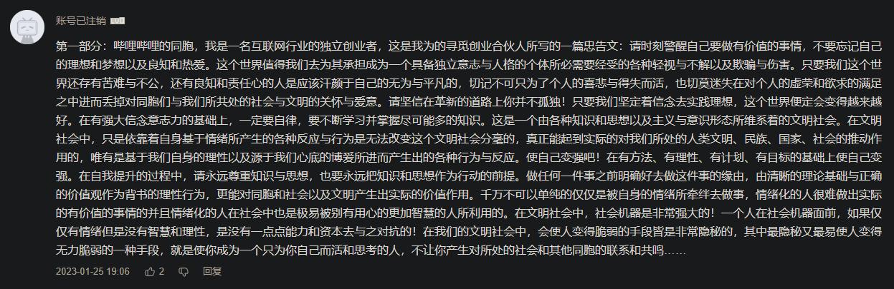
				- 与胸式呼吸
			- 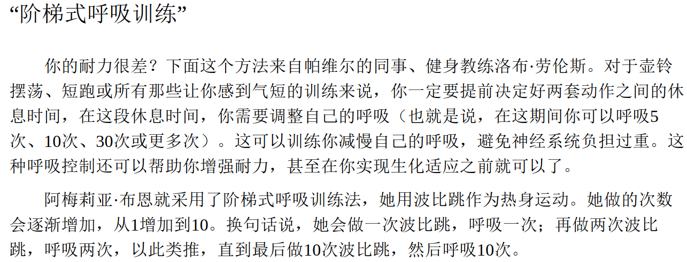 ——《巨人的工具》
			  collapsed:: true
			- [[森林浴]]
				- [【【直播回放】回木渎中学 2024年1月26日14点场】 【精准空降到 10:54】](https://www.bilibili.com/video/BV1dV411Q7yr/?share_source=copy_web&vd_source=24175964b0df2fcc2c022cae23517fdc&t=654)
					- >“森林浴”，虽然密度不够
			- ((65d69eb6-54ad-40e4-a290-5e0028758b75))
			  id:: 65b4fa7e-6b77-4f99-828b-314335481c79
			  collapsed:: true
			- 吸烟
				- 戒烟 #福州交响诗
				  id:: 65dc84e5-3fb1-4019-ab91-0d3d34a9877c
					- TODO 《这书能让你戒烟》
					- “难看烟盒”
					- ((65f27739-b24f-4dea-a7f3-5c2cf59c2e69))
					- ((65fef669-d80e-4348-8bfd-1757234ffcdf))
					- [从烟说开，越来越多的人为什么不再追逐买高价烟？_哔哩哔哩_bilibili](https://www.bilibili.com/video/BV1FK421i78g)
		- 口腔
		  collapsed:: true
			- ((65cd87d1-20e2-420e-a0e7-d377fc250c15))
			- 舌头
				- 舌抵上腭
				- 舌苔
				- 齿痕
			- 叩齿
			  id:: 65ae08de-ca44-4f5a-ad9e-eff5e45d4e61
			  collapsed:: true
				- 张嘴可能看着像“咬牙切齿”
				  id:: 65b3b411-5e36-4705-a226-af05bad23bdb
				- [“叩齿”是否对牙齿有好处？](https://www.zhihu.com/question/20413509/answer/32133431)
				- 牙龈萎缩？
				  collapsed:: true
					- [从牙龈看气血和脏腑 哪些人容易牙龈萎缩？--健康·生活--人民网](http://health.people.com.cn/n1/2020/0119/c14739-31554629.html)
			- 龋齿/蛀牙
				- “我们的目标是——”
				- [蛀牙看着很小，磨着磨着就大啦！_哔哩哔哩_bilibili](https://www.bilibili.com/video/BV1j44y1S7n9)
				  id:: 65dd3343-749e-4d03-8e85-4009fb6c8515
		- 姿势/体态（“点击查询你的姿势水平”）
		  id:: 65bcbf46-9eca-44c6-9842-6dbff0831129
		  collapsed:: true
			- 室内时间延长
			  id:: 65bcbf46-3163-4b45-9305-470217b3ca39
				- [[阳光]]（“你以为你‘逃避’得了阳光？”）
					- [【切片】未明子：无论如何，你有一个未完成任务_哔哩哔哩_bilibili](https://www.bilibili.com/video/BV1Vu4y1L7GS)
				- [【【直播回放】随便走走 2024年1月16日14点场】 【精准空降到 25:28】](https://www.bilibili.com/video/BV18c41147nL/?share_source=copy_web&vd_source=24175964b0df2fcc2c022cae23517fdc&t=1528)
				  id:: 65b70125-6ba8-48a7-8c2a-92d9538ceb24
				- 坐姿
				  id:: 65bcbf46-0a4d-44e3-9f6b-afcac5cb834d
				  collapsed:: true
					- “坐！屁股决定脑袋”
						- TODO 臀围与大脑
					- ((65b70125-6ba8-48a7-8c2a-92d9538ceb24))
					- [适合久坐人群的康复指南：脊柱中立位习惯+强化肌肉_哔哩哔哩_bilibili](https://www.bilibili.com/video/BV1dC4y1e7cv)
					- 桌椅（小孩矮桌低头弯背，且身高不同，但桌椅高度不加增）、显示器的高度、角度
					  collapsed:: true
						- “不随便往椅背上靠”
						- 椅子对腰部等的承托
						  collapsed:: true
							- 是否必要？
							- 普通椅子加装
							- 人体工学椅选品
						- 椅子下陷造成坐姿走形？
						  id:: 65b4fa7e-c324-4f8f-9bae-16416b166809
						- 凳子
							- 高凳矮凳
								- TODO 有些地方更爱用矮凳（尤其是圆筒矮凳），是因为人体工学差异，还是因为更便宜（批发时矮凳可能不到5~6元一个）？
					- ((65af1d52-8876-4bfb-9162-221fadbfc8fc))
					- “不会有人因为显示器不够高而弓着背吧？”
					  collapsed:: true
						- ((65af20db-6adc-4c87-8656-1997083eb608))
					- ((65ddd7e0-c574-4abb-940d-f8c3da658a2f))
					- 颈椎病
					- 腰突
					  collapsed:: true
						- [【Dr.奥运脊医李鹏博士】腰间盘突出现场处理全过程，高能满满_哔哩哔哩_bilibili](https://www.bilibili.com/video/BV1EW4y1w7gi)
						  id:: 65bcbf46-e287-466d-9891-f05f337bd977
						- [年轻人为什么也会患上腰突？ - 知乎](https://www.zhihu.com/question/613027628)
						- [为什么腰突不受到医学界的重视？ - 知乎](https://www.zhihu.com/question/54150707)
						- [腰椎间盘突出恢复分享 - 知乎](https://zhuanlan.zhihu.com/p/182805748)
						- [爬的好没烦恼 爬不好去开刀——爬行的腰突患者 - 知乎](https://zhuanlan.zhihu.com/p/330145076)
						  id:: 65bcbf46-c5d9-48a7-9a9f-b1d2c2d5de8d
						- [有适合腰椎间盘突出的运动吗？ - 知乎](https://www.zhihu.com/question/359497944)
						- [关于腰间盘突出的10个谣言，一次性辟谣！高清讲解！ - 知乎](https://zhuanlan.zhihu.com/p/349624158)
						- ((65d45b0e-9705-4cbf-9a71-6aacc23cd77b))
					- [为什么上课时是学生坐着老师站着？ - 知乎](https://www.zhihu.com/question/317158681)
					  id:: 65b76529-7355-43f0-adf0-36d72e6487a2
					- 不一定要久坐，条件不好的坐可能短时间就有害
					- TODO 用手柄玩能让坐姿更健康，或者不采用坐姿吗？
				- 握持手机姿势
				  collapsed:: true
					- 低头
						- “不要低下你高贵的头颅”
						- “开放姿势”
					- 小指凹陷
					- 自批改
					  collapsed:: true
						- 更快搜题减少人工
					- ((65af1d52-8876-4bfb-9162-221fadbfc8fc))
			- 解剖图
			  id:: 65b73d49-d1de-4f42-b105-bfcfa2bee161
			  collapsed:: true
				- [适合所有人的解剖学课程 | Visible Body学习网站](https://www.visiblebody.com/zh/learn)
				- [人体解剖图e-anatomy: 互动式人体解剖学图集](https://www.imaios.com/cn/e-anatomy)
				- [李哲教你学解剖的个人空间-李哲教你学解剖个人主页-哔哩哔哩视频](https://space.bilibili.com/239442458)
				  collapsed:: true
			- 站姿
				- ((65b76529-7355-43f0-adf0-36d72e6487a2))
				- 与跟腱炎、足底筋膜炎有关？
				- 与鞋袜有关？（“现代版削足适履”）
				- 走姿（“走姿是吧？”）
				  id:: 65bcbf46-97d2-43cc-8117-bb0cce30ec94
				  collapsed:: true
					- [年轻人你根本不懂走路！（教学在东东方方）_哔哩哔哩_bilibili](https://www.bilibili.com/video/BV1Qg411L7bq)
					- [因为你还不会走路用胯_哔哩哔哩_bilibili](https://www.bilibili.com/video/BV1Zb4y1r7p6)
					- [【【直播回放】随便走走 2024年1月16日14点场】 【精准空降到 31:34】](https://www.bilibili.com/video/BV18c41147nL/?share_source=copy_web&vd_source=24175964b0df2fcc2c022cae23517fdc&t=1894)（“速魔未哥”）
				- 跑姿
				- ((65bcbf49-b9a8-4cc5-9edb-7f1fbf275c7f))
				  collapsed:: true
			- 睡姿
				- 婴儿睡姿
				- 卧姿（“不过不睡罢了”）
				  collapsed:: true
					- [[卧姿显示器支架]]
					  id:: 65a87c0a-b6a4-4e3e-b508-449c6a7d9aa2
				- ((65b0f552-fcc1-4bee-9f2f-5490b6d88a34))
			- 搬重物（快递、瓶装水、菜）
		- 洗漱
		  collapsed:: true
			- 喝汤能对口腔、咽喉部位的病原体起到类似漱口、漱喉的效果吗？
			- “乐扣乐扣”饭盒、洗鼻瓶等用后不要留水、盖盖
			- ((65bcbf46-01e7-4853-85fb-739d0a437abf))
			  collapsed:: true
		- 日化用品防护
			- 牙膏（可能与一部分顽固性口腔溃疡有关）、洗发露、沐浴露等的致敏成分等
		- 保暖
		  id:: 65bcbf46-d742-418f-91b2-3f0a752888ac
		  collapsed:: true
			- [[风]]
			- 免疫系统需要热度
			- 与久坐久站、活动水平低有关？
			- 冻疮
				- ((65d14aa8-b265-42a5-a052-bb08f1f021e5)) （少接触水就能在很大程度上避免冻疮发生和恶化；多备几双，潮了能换）
			- 手冷
			  collapsed:: true
				- 手套
			- 脚趾冷
			  collapsed:: true
				- 鞋型、脚型、鞋码、五指袜
				- 脚冷——蜷缩、睡姿变形？
				  id:: 65b0f552-fcc1-4bee-9f2f-5490b6d88a34
				- ((65bcbf46-9b0c-43f5-b21b-e1128ae0c95d))（“暖了，潮了”）
				  collapsed:: true
			- 衣物
				- 发霉
		- 防滑
		  id:: 65d734e8-dc12-46c1-88e2-e5ef1fa5e8b2
		  collapsed:: true
			- ((65bef01e-6c50-489b-8678-edc291a9be9e))
			- “小心地滑”
			- 地板本来就很滑
			- 水
			- 冰
				- 以为没有，但结了薄薄一层冰，就可能造成事故率大幅上升
				- ((65dc9835-4aa9-4d34-83d2-eb1185d675aa))
			- 油
			- ((65dc989a-1515-49ec-9a8c-c9555f3dc849))
		- [[交通]]
		- 家务
		  collapsed:: true
			- 厨房
				- 往保温瓶里倒开水
				  id:: 65fff49e-8aca-40f3-8e54-9c73f6836d8b
					- 保温瓶向前倾斜，烧水壶、电热水壶的出水方向向外错开
				- ((65a9d48e-5419-4505-ba01-d72b66941f1c))
				- 砧板（微生物、塑料碎屑、刀刃损伤）
				- 油烟
				  id:: 65ae08cc-76e1-4826-aab7-5a7e74fcaa27
				  collapsed:: true
					- 油烟机（平板的好像不太行）
					- 烟道止逆阀
					- 防毒面罩
					- [[炭烤]]
				- [燃气热水器一直发出呜呜呜的巨大声音是怎么回事？ - 知乎](https://www.zhihu.com/question/45034851)
			- 收纳
				- “妈，你把我东西顺哪啦？！”
		- 二手烟
		  collapsed:: true
			- ((65ae08cc-76e1-4826-aab7-5a7e74fcaa27))
			- [如何对付在楼道里抽烟的邻居！？ - 知乎](https://www.zhihu.com/question/38041987)
			- TODO 中老年人为了棋牌娱乐、社交乃至赌博到棋牌室吸二手烟、增大传染病风险
			  collapsed:: true
				- “吸，吸二手烟的钱我来出”
				- [惹祸的棋牌室：江苏数量排名第一 为GDP做贡献_腾讯新闻](https://new.qq.com/rain/a/20210809A00J4T00)
				- ((65a920cb-660f-4d17-bd17-09b685e75aff))
				- 老年人牌瘾大，又难上排风、口罩等手段，搞点维D之类的补充（减小传染病伤害）
				- 个人防护的话，可能“怼脸吹”或更新的挂脖新风有用，打牌时像音箱那样架起来偏侧面吹但老人用不用就不清楚了
				- 还有就是教他网络棋牌（
				- >他朋友家里人平常有能碰到嘛，要不去跟比较能说的通理的中年人去试试，让他们管管自己家老孩儿，别让你爷爷在的时候给他蹭二手烟
				- “哈哈，地下车库也给我整上了”
				  id:: 65fff988-542f-454f-9284-47f307bb6724
					- 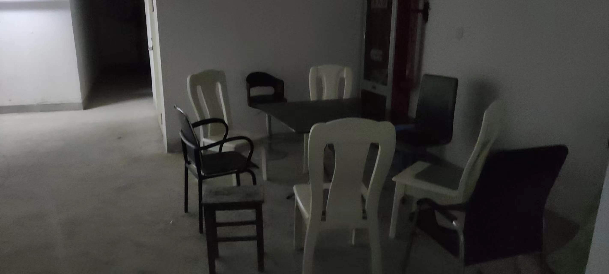
		- 交通工具
			- [[电瓶车]]
				- 楼道、室内停放、充电
					- [发这个视频只有一个目的：就是为了你的安全！_哔哩哔哩_bilibili](https://www.bilibili.com/video/BV1qr421s7Dj)
					- 停放用的电瓶车罩？
				- 电瓶车密集停放风险
				- 锂电池更易爆燃
					- 新国标锂电？
		- 健康设备
		  id:: 65eaa5d8-a5f9-4c16-b1f1-e3015404e60b
		  collapsed:: true
			- 智能手表/手环
				- ((65bcbf60-7816-4675-ace5-b0d49156494d))
				- 经期监测
			- 筋膜枪
			  collapsed:: true
				- id:: 65e7f9c1-d941-410e-b80b-1a86fd1c164e
				  >铁子们，我近期跟导上门诊，遇到两例用筋膜枪打眼周或者振动器按摩眼周导致外伤性白内障、晶状体脱位的，提醒大伙一下不要用类似振动器“按摩眼球”
					- >我发了个朋友圈，好像这个现象有点普遍，我好多眼科的同学都反应了这个情况，主要是最近筋膜枪的风有点大
					- >周一我们上门诊，那个大叔：“疫情期间买了个筋膜枪，天天看手机眼睛酸，拿筋膜枪按摩后还挺爽的”
					  “就是看东西越来越不清楚了”
				- [How to use a Massage Gun | The Beginner's Guide](https://massagegearadvisor.com/massage-gun/how-to-use/)
			- 脸部按摩仪
			  collapsed:: true
				- 不能用于眼周
		- 医疗器械（医用口罩、避孕套、洗鼻器、牙套、人工心脏瓣膜）
		  collapsed:: true
			- [医疗器械分类目录](https://www.nmpa.gov.cn/wwwroot/gyx02302/flml.htm)
			- 口罩
			  collapsed:: true
				- 口罩戴法
					- 为了戴严口罩要注意剃须
					- 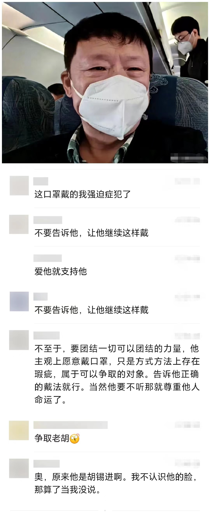
					  id:: 65ec238b-5c44-4390-a7c5-b492337db70e
					- 名侦探柯南942集，毛利小五郎把白色耳挂外科口罩拉到下巴上后又拉回去（“看小孩看看的”）
					  id:: 65f56746-83ce-4173-ae2f-d180ef3e2b46
			- 牙套
			  collapsed:: true
				- 戴牙套可能导致蛀牙？
					- [戴了牙套以后开始蛀牙的人多吗？ - 知乎](https://www.zhihu.com/question/421205964)
					- 电动牙刷、牙线/冲牙器（水龙头冲牙器比较便宜）
			- [冲牙器、牙刷、洗鼻器究竟在哪些国家属于医疗器械? - 知乎](https://zhuanlan.zhihu.com/p/669401115)
			- [口罩是不是属于二类医疗器械？ - 知乎](https://www.zhihu.com/question/378749489)
			- TODO 共享雾化器和雾化剂
		- ((65ab4c5b-4945-4427-8925-4e8eb13742a6))
		- 中毒
		  collapsed:: true
			- 农药中毒
				- 误食农药
					- [父亲生死未卜，为医药费奔波的我不幸小腿严重骨折，多灾多难！_哔哩哔哩_bilibili](https://www.bilibili.com/video/BV1mH4y177jE)
					  id:: 65dc9835-4aa9-4d34-83d2-eb1185d675aa
			- ((65dc97e9-3df2-4356-b0ab-7700d28b7fe8))
		- [[防灾减灾]]
		  collapsed:: true
			- [[核战]]
	- ## （泛）理疗
	  collapsed:: true
		- [【主义主义】气动一元论（2-1-1-2）——阿那克西美尼的哲学制毡术，气象万千之中隐藏的秘密_哔哩哔哩_bilibili](https://www.bilibili.com/video/BV1Mp4y1h735)
		  id:: 65af09a6-e754-4291-a936-e3980c3bc0aa
		  collapsed:: true
			- >这个制毡术，一直到康德的纯粹理性批判还在用。严格意义上来讲，后世所有的构造哲学，都采用了这种Felting的技法，其精妙之处在于这是一种自我构造的机制：凝结，这是理念自己把自己实体化的机制。
			- 洗护烘一体
		- [[射频]]（像是穿透更深的微波炉）
		- 光照
		  collapsed:: true
			- 晒太阳
			  id:: 65a9d480-f240-4ff5-9072-8ed1d4e334d6
			  collapsed:: true
				- ((65996fdc-98c5-49cb-b9d4-36bc3c1a836e))
				- 煮粥用火，但还是有很多水，还是不够纯，太阳光才纯，能除食物、被子的湿气，晒过了被子都有阳光的香气，这样食物吃了被子睡了才健康，人才能健康不得病、长命百岁
		- 暖通/空调/“气调”
		  id:: 65bcbf46-9bce-49d2-9eb6-02ab0e74a745
			- ((65ae0902-a975-4629-a10c-1d4f3f67c68f))
		- （自我）[[按摩]]
			- ((65b25680-602e-47be-bc98-388c9df0abf9))（不止腹式呼吸按摩内脏，鼻呼吸也可能算是按摩呼吸道）
				- 有可能增强鼻腔纤毛划水免疫功能吗？
		- 体外冲击波
		  id:: 65ae08cc-ca69-4db1-acb9-002296b75a65
		  collapsed:: true
			- [髌腱炎做冲击波治疗是种什么样的体验？ - 知乎](https://www.zhihu.com/question/28759866)
			  id:: 65af09a6-6740-42af-bc41-2a59c9313d8d
			- [气压弹道发散式冲击波历史发展回顾 - 知乎](https://zhuanlan.zhihu.com/p/161576191)
			- [瑞士Storz Medical AG医用气动弹道式冲击波治疗仪系统 - 上海涵飞医疗器械有限公司](https://www.hanfeiyl.com/product-i14312.html)
			- TODO 有没有可能低价替代？
				- ((65af09a6-6740-42af-bc41-2a59c9313d8d))
				  collapsed:: true
					- 
					  id:: 65af09a6-81d0-42c4-b961-94c887a82549
					  collapsed:: true
						- [经常拍打膝盖，竟然有这3个好处！看完赶紧做起来 - 知乎](https://zhuanlan.zhihu.com/p/398443069)（“小心轻拍”）
				- [公园大爷为什么爱撞树 - 知乎](https://zhuanlan.zhihu.com/p/100432313)
				- 八部金刚功第八部
		- 水浴
		  id:: 65bcbf46-01e7-4853-85fb-739d0a437abf
			- 洗手
			  id:: 65f6b5ae-6603-4191-982d-39cf7966edd2
				- 七步洗手法
				  id:: 65f6b5b0-b4c7-4208-a963-3ffb77f4f228
					- TODO 洗湿面粉比乱洗更好？
			- 洗鼻/漱喉漱口/洗眼
			  id:: 65c6e42b-6658-42f0-ab39-6ba63d4672ec
				- [网上的一些耳鼻喉医生为什么有说洗鼻反而不好的说法？ - 知乎](https://www.zhihu.com/question/61984593)
				- 温度偏高可放入装冷水的宽口杯（如啤酒杯）之类的容器中冷却
				- 洗液
					- 盐水（日常可用0.9%的等渗/生理盐水，急性期可用高达3%的高渗盐水；有可能无需称重，鼻腔感觉舒服的用量即可）
						- 盐如果是一大袋，建议放在宠物不易接触到的地方（不放在地面）
					- 聚维酮碘次氯酸我还不太习惯
						- 
						  id:: 65ea6b29-ec60-408d-ba41-4e8db1bb765f
				- ((65bcbf49-3b29-4343-8528-fb32f56435fb))
				- 洗鼻姿势：低头，侧头，两手一侧反握洗鼻瓶
				- 洗接近一半后换鼻孔，还剩一些时挤出漱喉漱口
			- 冲凉（一种最常见的“受冷”方式）
				- ((65bcbf47-70c7-4c8d-a215-83623a0187b6))
			- 浸泡
			  collapsed:: true
				- 补镁等
				- [[泡脚]]
				- 泡澡
			- 桑拿（“水蒸气也是水！”）/汗蒸
		- 赤足（“大地，盖亚，安泰俄斯”）
		  collapsed:: true
			- 算不算理疗？
				- 赤足只需要与大地接触，虽然在空中和太空中接触不到，但是否已算“本自具足”，从而可从理疗中排除？毕竟呼吸也需要空气对吧？虽说现代中国人一般不光脚走路，很多人在日常生活中也不容易接触，但空气污染普遍存在，难道呼吸排除了一部分污染物的空气算理疗吗？
			- [[赤足跑]]
	- ## 娱乐
	  collapsed:: true
		- ((65bcbf46-0a4d-44e3-9f6b-afcac5cb834d))
		- [[玩具]]
		- 游戏
		  id:: 65c8c52f-6506-43ec-a82e-cc57a788e3fe
			- ((65d05b3e-1a58-4d4a-bf52-823acabd2dce))
			- ((65cc3677-9630-453a-b4db-07ad47f74d91))
		- 音乐
			- 唱歌
				- >有没有可能，（不太会的部分）可以参考（软件给的）横线升降调 ![[dog]](http://i0.hdslb.com/bfs/live/4428c84e694fbf4e0ef6c06e958d9352c3582740.png@.webp)
		- 电视
			- 大人吃饭开电视作背景音，偏偏小孩真爱看
			- 坚持看完春晚的都是什么人？
		- 红包
		  collapsed:: true
			- 发红包抢红包是规训吗？
			- 抢到钱，必须看别人抢了多少钱，这游戏过程才算相对完整
		- 社交
		  collapsed:: true
			- [聊的越深越尴尬？不，我们可爱听了！](https://mp.weixin.qq.com/s/Ke6cnrIkjUHpJB6hC7Nb8Q)
		- 欲望
			- 性欲
				- 性苦闷
	- ## 睡眠
	  id:: 65d60c75-9e0e-47d0-9a9b-49c70fbfbdbb
	  collapsed:: true
		- “为什么要在晚上睡觉？”
			- ((65f1cd83-d6bd-44f9-b656-0245cbf52e4a))
		- 午睡
			- [经常午睡VS从来不午睡的人，哪个更健康？？？](https://mp.weixin.qq.com/s/qHnBs7voI0xKAoBm5mDNGA)
				- [The benefits of a nap during prolonged work and wakefulness: Work & Stress: Vol 2, No 2](https://www.tandfonline.com/doi/abs/10.1080/02678378808259158)
					- [Full article: To Nap or Not to Nap? A Systematic Review Evaluating Napping Behavior in Athletes and the Impact on Various Measures of Athletic Performance](https://www.tandfonline.com/doi/full/10.2147/NSS.S315556?src=recsys)
		- 倒班
		-
		- 深夜不做决定
			- ((65f7b1f0-8f1b-4b28-a96a-dd3259204cc5))
			- “识时务者为俊杰”——“什么时间做什么事”
				- ((65f7b798-a963-4f27-8df9-d8169703a12d))
			- 深夜一般较少用电脑了，不用电脑对信息的组织、输出能力大幅削弱
			- 什么都不做可能最不差
				- [【主义主义】怀疑主义（2-1-4-2）——皮浪的哲学，智力英雄必备技能：探求“不动心”的平衡游戏；君主、辅臣、将领、幕僚的必修课_哔哩哔哩_bilibili](https://www.bilibili.com/video/BV11K4y127B3)
				  id:: 65f7b702-7360-4df6-b76e-0e1380242385
			- [早上或晚上，什么时候做出重要决定会更好？ - 知乎](https://www.zhihu.com/question/441934474)
		- 睡姿
			- ((65fa8396-a419-4994-af1e-c4f5667ae898))
- # 呼吸道传染病防治
  id:: 65d69eb6-54ad-40e4-a290-5e0028758b75
	- [澳洲上线了C-19安全课程，内容有点棒](https://mp.weixin.qq.com/s/MIurkOvuhU9xMr-0cx6TjA)
	  id:: 65d74859-00df-4482-ae3d-b5dc55de2866
	- 及时预防进一步传染（至少戴个好口罩）的重要性
		- [家人先发烧，为什么我被传染后症状反而更重？](https://mp.weixin.qq.com/s/bi1Id7K4glxe9P7Yar92bQ)
			- [如何避免被发烧咳嗽的家人传染？](https://mp.weixin.qq.com/s/IbvuNzKCVvr3PlS0gvxcYQ)
		- [赈早见琥泊主的动态 - 哔哩哔哩](https://www.bilibili.com/opus/891898307506339896?spm_id_from=333.1365.0.0)
			- [Analysis of SARS-CoV-2 transmission in a university classroom based on real human close contact behaviors - ScienceDirect](https://www.sciencedirect.com/science/article/abs/pii/S0048969724004819)
	- 推荐物品
	  id:: 65d5a2fd-2dde-4448-b3f2-0e6dcf35843c
	  collapsed:: true
		- 可以算在月费或专门的换购里 #俱乐部
		  id:: 65d8991b-d53f-4133-ab51-7400a520c61d
		- ((659a8b11-3aea-4054-bc2d-aa6cd729f133))
		- 团购
		  id:: 65d69eb6-7c41-4445-9cad-f6c7a46f5957
			- 500mL洗鼻瓶
				- 一次买100个的话，约6元一个
				- 之前买过一百个，除了我家自用的都送完了，就是看不到使用数据；洗鼻盐用无添加的日晒海盐细盐即可，1g勺两平勺差不多正好4.5g，兑好或放温的温开水从稍高处倒入再晃几下即可洗鼻
				- 一边用将近一半水，最后漱口漱喉
				- 
				- 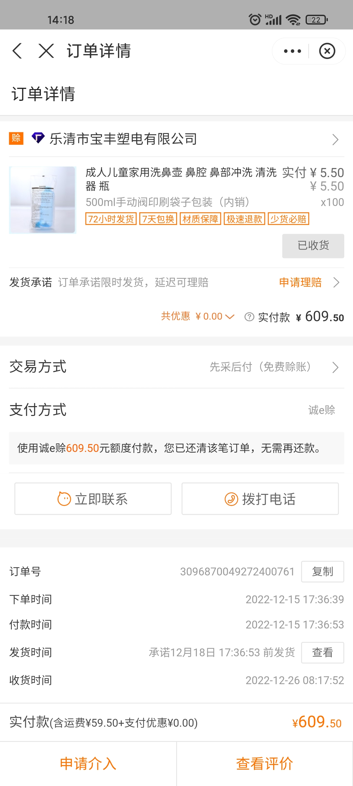
			- 雾化器（“共享雾化”）
		- 营养素
		  collapsed:: true
			- {{embed ((65ae0905-914f-4d3d-a1de-f9419083a2ac))}}
		- 家电家具
			- 加湿器
			  id:: 65ae0902-a975-4629-a10c-1d4f3f67c68f
			  collapsed:: true
				- 美的PD-40V（超声波加湿器，如果门窗不漏风，可能一百平米的房子也差不多够了；建议配合RO净水器使用，购买和安装详见下方块引用的页面）
					- ((65996fc3-2866-4586-b752-e2ac910ac817))
					- TODO 低价替代可能需要超声波雾化头（“假山 25W”）和静音水箱（水从盖子上不滴落或滴落噪声小）
				- 美的SZK-1Y80（冷蒸发加湿器，比较贵；网友推荐）
					- ((65996fc3-d0a6-4987-b32d-eddd30fa04ab))
			- ((65996fc3-ee8e-4d89-9323-036fef554f7e))（用途：生活饮用水、加湿器、卡拉胶鼻喷）
			  collapsed:: true
				- 比瓶装/桶装纯净水便宜，比用普通饮水机的桶装纯净水干净
				- 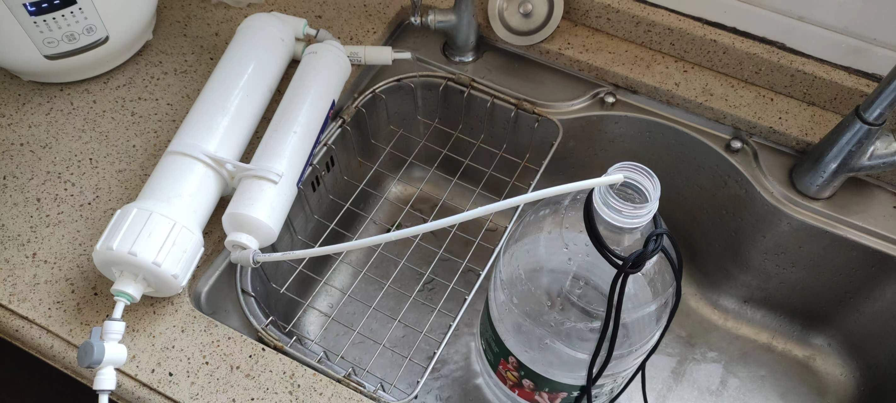
					- “近照”，水桶上伞绳打的大概是[实用的提桶结！_哔哩哔哩_bilibili](https://www.bilibili.com/video/BV1UG4y1P7i7)，拍这张时水桶又掉了个小部件，绳子让家人调整了一下，收紧了还可以用，但稳定性仍然存疑，以后可能弄个更牢靠的解决方案
			- TODO 更便宜的加湿器和净水器组件套餐
			- 空净
			  id:: 65996fe5-92a1-47ca-97c3-5f18e4cbced3
			  collapsed:: true
				- 怼脸吹/便携空净（适合工作时移动较少的用户）
					- [这可能是是目前最牛的怼脸吹空净](https://mp.weixin.qq.com/s/VYOfdxhuCIysFyc4daKRZA)
				- CRBOX（四机箱风扇以上的噪声比那种小米第三方滤芯套风机头的小得多）
				- 单风扇风机头套第三方小米滤芯空净
					- 噪声较大，适合缓冲距离够（一般放阳台，有拐角差不多够了，要不一头阳台一头客厅最好隔十米以上）的房子和懒得挑剔（“上面两种都几百块是吧？”）的耳朵
		- 病原体检测（如果不能从症状判断，又没有足够种类的检测手段，可能导致无法及时对症下药、“早治好得快”）
		  collapsed:: true
			- 荧光自测抗原（别的病原体的自测抗原也可以买，这个不太清楚；已有的自测抗原注意别找不全组件测不了）
				- ((65a87dc0-a213-4114-bb9c-6943ea61ce11))
				- 华大因源
			- 多合一上门检（比较贵）
				- 美团买药居家快检（美团买药）
				- 晓飞检（微信小程序）
		- 抗病毒药
		  collapsed:: true
			- 北京年初有新一批铺货，主要是先诺欣，铺货数量较少的民德维和乐睿灵在美团快递上现已暂时断货，其他地方想用药也要注意可获得性，包括前面的问诊开方环节
			- 部分购买渠道
				- ((65a87dc0-a213-4114-bb9c-6943ea61ce11))
				- 高际互联网医院（微信小程序）-“XX免费咨询”-“问医生购药”，天津发货
			- [NEJM发表卢洪洲教授等中国学者研究成果，国产原研新冠小分子药物再获突破](https://mp.weixin.qq.com/s/wnQRn1X35FnL7zGSjKyB9A)
			- ((65a7b4d7-5506-4f4e-8314-5d6170425aa1))（这个医保肯定是不报销的）
			- 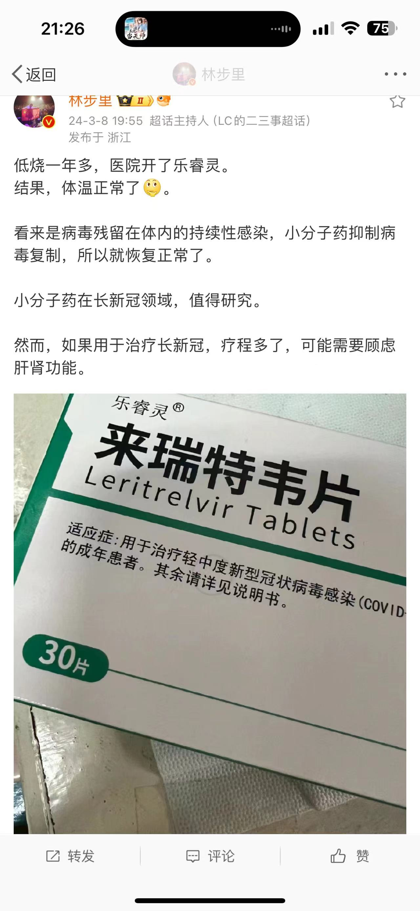
			  id:: 65ec23cd-972c-48d1-8b4a-57ab109186d8
		- [帮主带货合订本，20... - @拍帮主的微博 - 微博](https://weibo.com/7789369753/4975679397433988)（有些贵的可以低成本替代，比如I型卡拉胶鼻喷）
			- ((65a92764-f20b-4196-9895-c69930a7b134))
			- ((65996fe5-92a1-47ca-97c3-5f18e4cbced3))
	- DOING 有症状后的流程
	  id:: 65d469ce-9389-4f9c-8160-efc898ca87f5
	  collapsed:: true
	  :LOGBOOK:
	  CLOCK: [2024-02-21 Wed 10:48:25]
	  :END:
		- [/////健康问题征集活动2.0!/////](https://www.bilibili.com/opus/889043992496308262)
			- [身体不适怎么办？百度、买药、医院看？_哔哩哔哩_bilibili](https://www.bilibili.com/video/BV1Ej411p7AA)
			  id:: 65d588aa-07e3-4113-8cf7-3e575fd031bc
			- 
		- 我的建议
			- 呼吸道传染病的传染主要来自三密（密切：靠得近；密集：人多；密闭：不太通风）场合——当然，只要不是“（独自）家里蹲”或“淡季游”，也是很常见的场合，如果是在经历这类场合后若干天内感到，询问最近见过面、当时明显在生病的熟人（这就是简单的流调），可以优先考虑是呼吸道传染病
			-
			- 先排除口呼吸、空气湿度/温度、空气污染（鼻腔感觉；尽量提前控制变量）等的影响
			- 判断大类（“好像算是呼吸道症状”），
			- 处理
				- 使用自测抗原自测
					- TODO 专门测的必要性
					- TODO 抗原灵敏度是个问题，可能过两三天才测出来
					- 优先用荧光抗原排除新冠，症状有点严重直接上奥司他韦
					- 拖到医院还是测几项，或者不测直接开一堆“大礼包”吃了完事，其中还可以有较多比较贵且自付比例高的中成药，还增加了院感风险，之后不确定要不要等结果出来，一次可能测不准，那么可以一次性从多部位采样
					- 还有可以，但是地区受限
				- 如果自测结果为阳性，那么吃对应病原体的药物，如抗病毒药（如果愿意赌，也可以吃不良反应较小的抗病毒药）
				- 症状不严重的话可以适度练习
				- ((65c6e42b-6658-42f0-ab39-6ba63d4672ec))
				- 补剂吃一吃，没吃饱的话吃点东西，尤其是蛋白质可以适度多吃
					- 说明：这些措施在短期基本上是有益无害的
				- ((65d60c75-9e0e-47d0-9a9b-49c70fbfbdbb))
					- 睡眠一般有助提升免疫力，尤其在缺乏睡眠的情况下，但在睡前如果未及时采取足够的正确的处理措施，也可能拖延病情，那么的确要加上更多角度的诊断
					- ((65c8c2ab-5d5e-4224-aeaf-64f2181c8253))
						- [【广而告之】如果你在近期因健康原因遭遇了劳动权益的损害，我们提供完全免费的劳动保障咨询_哔哩哔哩_bilibili](https://www.bilibili.com/video/BV1oM411U7k4)
				- 在急性期至少要避免保暖工作不够完善的洗浴和晒太阳，并要避免中高强度运动
- # 常见慢性病
  collapsed:: true
	- 鼻炎
	  id:: 65bcbf68-24ab-4e4e-aecb-60d452ca0859
	  collapsed:: true
		- ((65c6e42b-6658-42f0-ab39-6ba63d4672ec))
			- [盐水洗鼻对鼻炎有没有用？](https://zhuanlan.zhihu.com/p/54296565)
		- 鼻塞
			- 缓解
				- 揉穴位、瑜伽、憋气、惊吓
			- [4种方法来疏通鼻塞](https://zh.wikihow.com/%E7%96%8F%E9%80%9A%E9%BC%BB%E5%A1%9E)
		- 空气污染物
			- 半个月前大约是春节期间，燃放烟花爆竹
	- 颞下颌紊乱
		- [“TMD ”竟是一种病，一张嘴就咔咔响的你要注意了_澎湃号·湃客_澎湃新闻-The Paper](https://www.thepaper.cn/newsDetail_forward_23763489)
- # 药物
  id:: 65d2f25e-205d-46dc-b1f0-a2142c4acda5
  collapsed:: true
  :LOGBOOK:
  CLOCK: [2024-02-25 Sun 23:58:01]
  :END:
	- [药物分类 - 维基百科，自由的百科全书](https://zh.wikipedia.org/zh-cn/%E8%8D%AF%E7%89%A9%E5%88%86%E7%B1%BB)
	- [中华人民共和国药典（2020年版）](https://ydz.chp.org.cn/#/main)
		- ((65db5f21-9688-46c9-97bc-bac28146dedb))
		- ((65ab10fa-a1d4-4814-ba9e-9d5df622d554))
		- TODO [分享 | 《中国药典》 2020 年版 四部全 PDF 百度网盘 下载 - 个人博客](https://qweree.cn/index.php/155/)
	- [国家药品监督管理局数据查询](https://www.nmpa.gov.cn/datasearch/)
	  collapsed:: true
		- [基础数据常见问题](https://www.nmpa.gov.cn/datasearch/search-help.html#yp_1_3)
			- 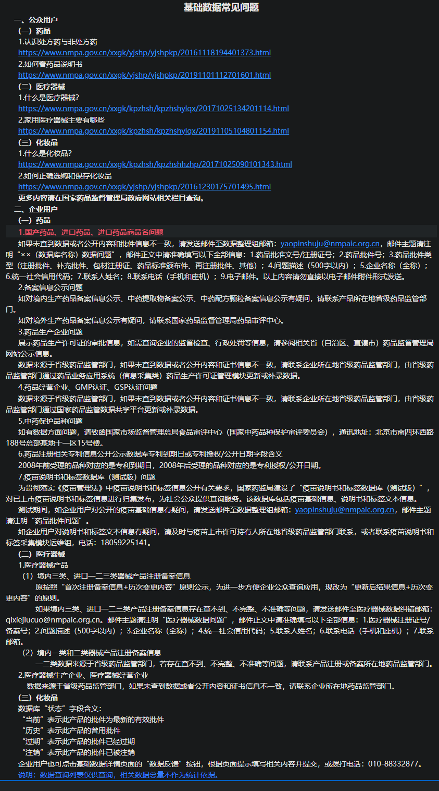
	- [国家基本药物目录（2018年版）](https://www.gov.cn/fuwu/2018-10/30/5335721/files/e7473e46d9b24aadad3eb25127ffd986.pdf)
	  collapsed:: true
		- “主要依据2015年版《中华人民共和国药典》”，而最新版是2020版，所以部分内容可能过时
		- [基本药物 in China](https://www.who.int/china/zh/health-topics/essential-medicines)
			- >中国的基本药物
			  >
			  >基本药物是指能满足公众的医疗卫生服务重点需要的药物。它们可以挽救生命，减少痛苦，改善健康。基本药物的遴选依据包括疾病流行情况、公共卫生相关性、临床功效和安全性的证据、比较成本和成本效益性。日益增长的疾病负担导致对基本药物的需求不断增加，给国家药品体系及预算带来压力。因此，需要投入更多的资源，以确保能够及时提供优质、可靠的药品和合理使用药品。
			  >
			  >为满足日益增长的需要，政府应确保卫生系统和公众负担得起的资源得到高效使用，保护公众不受到假冒伪劣药品的危害，在提高药品可及性的同时控制费用，确保药品供应链的效率和药物的合理使用。让人人都能获得安全、有效和优质的药物及疫苗，是可持续发展目标的子目标之一，也是实现全民健康覆盖（UHC）的必要内容。
			  >
			  >2018年中国药品费用占卫生总费用比重达30%以上。药品领域改革与整体医改密不可分。2019年实施新修订的《药品管理法》，完善药品监管，确保药品安全。通过价格谈判和集中带量采购等措施促进降低药品价格。卫生技术评估证据作为决策依据支持医保服务包内容调整。
		- >三、目录的分类
		  >
		  >化学药品和生物制品主要依据临床药理学分类，共417 个品种；中成药主要依据功能分类，共 268 个品种；中药饮片不列具体品种，用文字表述。药品的使用不受目录分类类别的限制，但应遵照有关规定。
		- id:: 65db4846-735f-4313-801b-f1d75968a209
		  >五、品种的剂型
		  >
		  >品种的剂型主要依据 2015 年版《中华人民共和国药典》“制剂通则”等有关规定进行归类处理，未归类的剂型以目录中标注的为准。
		  >目录收录口服剂型、注射剂型、外用剂型和其他剂型。
		  >口服剂型包括片剂（即普通片）、分散片、咀嚼片、肠溶片、缓释（含控释）片、口腔崩解片、胶囊（即硬胶囊）、软胶囊、肠溶胶囊、肠溶软胶囊、缓释（含控释）胶囊、颗粒剂、缓释（含控释）颗粒、混悬液、干混悬剂、口服溶液剂、合剂（含口服液）、糖浆剂、散剂、粉剂、滴丸剂、丸剂、酊剂、煎膏剂（含膏滋）、酒剂。
		  >注射剂型包括注射液、注射用无菌粉末（含冻干粉针剂）。
		  >外用剂型包括软膏剂、乳膏剂、凝胶剂、外用溶液剂、胶浆剂、贴膏剂、橡胶膏剂、膏药、酊剂、洗剂、涂剂、散剂、冻干粉。其他剂型包括气雾剂、雾化溶液剂、吸入溶液剂、吸入粉雾剂、喷雾剂、鼻喷雾剂、灌肠剂、滴眼剂、眼膏剂、滴剂、滴鼻剂、滴耳剂、栓剂、阴道片、阴道泡腾片、阴道软胶囊。
		- >六、品种的规格
		  >
		  >品种的规格主要依据 2015 年版《中华人民共和国药典》。同一品种剂量相同但表述方式不同的暂视为同一规格；未标注具体规格的，其剂型对应的规格暂以国家药品管理部门批准的规格为准。
	- [国家基本医疗保险、工伤保险和生育保险药品目录（2023 年）](http://www.nhsa.gov.cn/module/download/downfile.jsp?classid=0&filename=2c4edb60b9cb4fd7874488adeeaddf78.pdf)
	  collapsed:: true
		- 另可在微信搜索“国家医保药品目录查询”
	- [[药物剂型]]（参与制作的第一个视频）
	  collapsed:: true
		- [制剂通则](https://ydz.chp.org.cn/#/database?bookId=4&directoryId=98)
		  id:: 65db5f21-9688-46c9-97bc-bac28146dedb
			- >剂型与给药途径
			  >
			  >同一药物可根据临床需求制成多种剂型，采用不同途径给药，其疗效可能不同。给药途径有全身给药和局部给药。全身给药包括口服、静脉注射、舌下含化等，局部给药包括眼部、鼻腔、关节腔、阴道等。通常注射比口服起效快且作用显著，局部注射时水溶液比油溶液和混悬液吸收快，口服时溶液剂比固体制剂容易吸收。缓控释制剂主要通过口服或局部注射给药。剂型和给药途径的选择主要依据临床需求和药物性能等。
		- [药品有哪些基本剂型](https://www.nmpa.gov.cn/xxgk/kpzhsh/kpzhshyp/20171024100701570.html)
		- [科普知识——口服片剂大家族_哔哩哔哩_bilibili](https://www.bilibili.com/video/BV1cV411X7mi)
		  id:: 65dc0a66-a0d7-4ce2-94ba-54d5b7cada05
		- ((65dd4d9f-f32a-4fe2-853a-073d3c0f61c6))
		- [不是所有泡腾片都能口服--健康·生活--人民网](http://health.people.com.cn/n1/2020/0603/c14739-31733305.html)
		- [药物一般进入体内多长时间开始发挥作用？ - 知乎用户ZnptXt的回答 - 知乎](https://www.zhihu.com/question/34950046/answer/60608501)
		- 《药剂学》（第八版，人卫版）
		  id:: 65dc8f6c-b047-48ac-876c-cd3ba2a2c43d
		- 不同常用药的不同剂型
		- 同种药不同剂型
		- 特点：舌下含服
		- 用法/服用方法
			- [『服药小知识』药片适合仰头吞服，胶囊适合低头吞咽。_哔哩哔哩_bilibili](https://www.bilibili.com/video/BV1NT4y1a7EA)
			- 能否突破剂型和说明书用法？
				- 超药品说明书用药
				  collapsed:: true
					- [今日施行！超说明书用药有法可依！ - 丁香园](https://heart.dxy.cn/article/806345)
					- [关于发布《超药品说明书用药目录（2023年版）》的通知-通知公告-广东省药学会网站](http://www.sinopharmacy.com.cn/notification/2797.html)（含表格下载链接）
						- 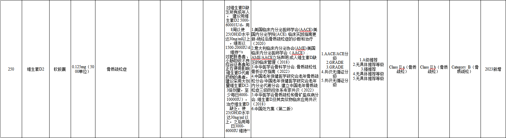{:height 171, :width 594}
						  id:: 65dc2b84-d453-41cc-a821-4b20a31bc37b
				- 葡萄糖酸锌片，剂型是片剂中的口服普通片，但可以当舌下片用（国内暂无“锌”的舌下片和含片）
				  collapsed:: true
					- 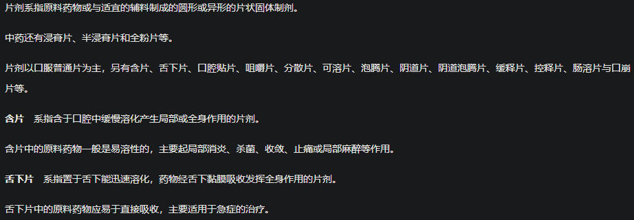
						- ((65db5f21-9688-46c9-97bc-bac28146dedb))
					- 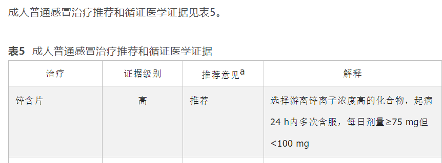{:height 239, :width 625}
		- 药学可视化
			- [Initial_Pharmacy的个人空间-Initial_Pharmacy个人主页-哔哩哔哩视频](https://space.bilibili.com/238299060)
			  id:: 65db696c-abbe-45c0-8a58-dd546757d3f3
				- [极度舒适！拿来救命的药，原来是这样在身体里释放的_哔哩哔哩_bilibili](https://www.bilibili.com/video/BV1bF411q7ue)
				  id:: 65dd4d9f-f32a-4fe2-853a-073d3c0f61c6
		- [迹形](https://cultist.huijiwiki.com/wiki/%E8%BF%B9%E5%BD%A2)
	- 药品/用药安全
	  collapsed:: true
		- [药品安全合作联盟](https://www.psmchina.cn/index)
			- [首页-北京药盾公益基金会](http://psmfoundation.cn/)
			- [PSM药盾公益的个人空间-PSM药盾公益个人主页-哔哩哔哩视频](https://space.bilibili.com/327383590)
				- ((65dc0a66-a0d7-4ce2-94ba-54d5b7cada05))
				- [奥司他韦的正确使用方法_哔哩哔哩_bilibili](https://www.bilibili.com/video/BV1pD4y1M7J3)
				  id:: 65dc8dba-678b-4ba9-967e-b179eceed993
		- 误服药物
			- “可能没按自己想的那样无痛去世也是一种误服”
	- 药品销售数据
	  collapsed:: true
		- “我怎么知道哪些是常用药或用得、卖得比较多、大众更可能有点印象、更可能从家里翻出来看的药呢？”
			- “你怎么不试试主流线上买药平台呢？”
		- [全球药品销售数据查询 - 药智数据](https://db.yaozh.com/ypxs)
		- [怎样查询药品的销售数据？ - 知乎](https://www.zhihu.com/question/489583445)
	- 适应症
	  collapsed:: true
		- 能否突破（药品说明书等的）现有适应症使用？
			- “新冠解热药”——“共识的力量”
		- “那么问题来了，原适应症会变得不适应吗？”
	- 药物不良反应
	  id:: 65dc97e9-3df2-4356-b0ab-7700d28b7fe8
	- 按管制程度/购买限制分类
	  collapsed:: true
		- OTC非处方药
		  id:: 65d2f239-c8ed-4144-bcec-f608bd240043
			- “虎扑‘街药’”
			  id:: 65d2f23e-0cb1-4dd3-b027-10af7b4cd166
				- 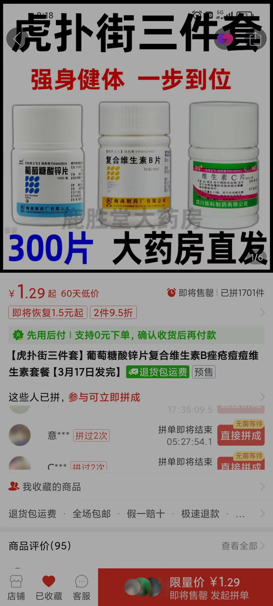
				  id:: 65d2f29f-21ae-42d3-8657-ccb9fb4d01de
				- [【补剂篇】“街药”原来是这样一种药-步行街主干道-虎扑社区](https://bbs.hupu.com/38506321.html)
				- [虎扑老哥的保健史：从提肛300下到20几块的“街药”-36氪](https://www.36kr.com/p/1863606851721091)
	- 选药购药维度
	  collapsed:: true
		- {{embed ((65d40ddd-c951-4403-837f-ab54efba5d4b))}}
	- 硝酸甘油片
		- [不知道这 3 点，还敢说你会用「硝酸甘油」？ - 丁香园](https://heart.dxy.cn/article/741257)
- ((65bcbf49-5341-419a-95c7-adcedd7f4a63))
	- 不要让家里人乱买
- # [[急救]]
  collapsed:: true
	- TODO 伤的来源
	- “急救包”
		- “家庭必备小药箱~”
		- 救生毯 2
		  id:: 65b70783-f731-4212-bc66-4c4e80a2ac3f
			- 在寒风、衣物潮湿的极端情况下保暖，也可应急作雨衣、被子）
		- 消毒喷雾
		  id:: 65b5b60f-3c37-4557-8cc6-58cf5785d1de
		- 口服补液盐散（III）（腹泻后补充电解质，也可冲调成运动饮料在大量出汗后补水和补充电解质，用于后者可适度降低浓度，比如原来一袋500ml的加水到710ml，即一个常见运动水杯的容量）
		  id:: 64631f04-5679-4640-93cb-36876f30ff96
	- 牙齿脱位
		- [【急救】牙磕掉了，怎么办？_哔哩哔哩_bilibili](https://www.bilibili.com/video/BV1S5411e7QQ)
	- 断肢
	- 溺水
		- 公共场所救生设备检查（瘪了的救生衣）
- # 心理
  collapsed:: true
	- 面对家庭争吵，希望对方是演、想逗笑的心态