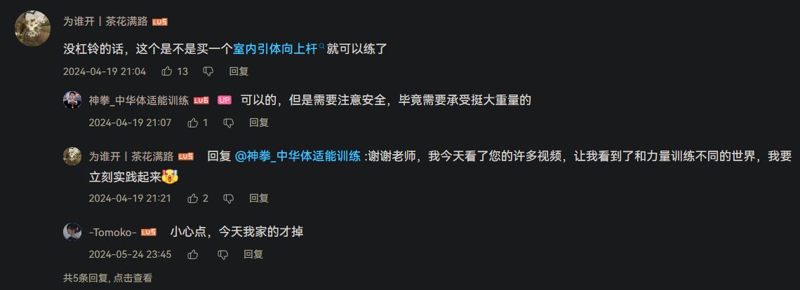
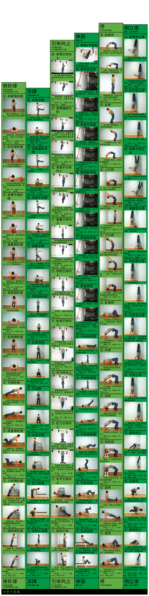
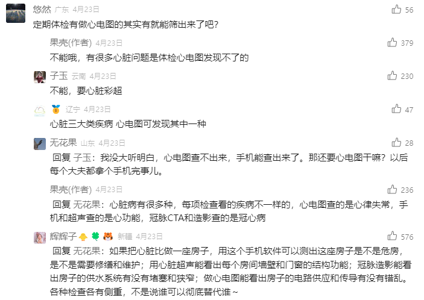

- [[卫生]]
- {{renderer :tocgen2}}
- 本页结构改为“卫生资源配置” [[20240523]]
- 本页结构改为“运动嵌套结构” [[20240723]]
  id:: 664ac66e-8abd-4725-af67-3934ac2f167d
  collapsed:: true
	- 我可能还是很喜欢有机进化论、努斯、仿生学之类的构造方式 [[20240822]] [[20240824]]
		- ((66b5fcde-e9ca-4506-a839-ad036cee0917))
- ---
- 关键词
  collapsed:: true
	- 日常、护理、保健、养生、饮食、营养、健康、安全
	- 健康/疾病/安全/卫生/医疗观/意识/知识/技能
	- 健康
	  collapsed:: true
		-
			- ((66615b93-7cf2-4fd5-9354-38c69e80625f))
			- 你的健康也是生产资料
		- 从“瘫痪在床”到“风驰电掣”，从“（躺/趴）平人”到“立人”
		- ((668ce74d-fb25-40e3-84ad-0233efaafc8f))
		- 什么是健康？
			- [健康 | 联合国](https://www.un.org/zh/global-issues/health) #“联合国那边怎么说？”
			- [规范主义健康概念的重构：对自然主义批评的回应](https://yizhe.dmu.edu.cn/article/doi/10.12014/j.issn.1002-0772.2024.11.01)
			- [国家卫生健康委办公厅关于印发中国公民健康素养 —— 基本知识与技能（2024年版）的通知](https://mp.weixin.qq.com/s/HAzcdAcYW1Lx68PiquG6Jw)
			  id:: 6662abb4-be0d-412b-9cf2-6765f80e0d32
				- [中国公民健康素养——基本知识与技能释义（2024年版）](http://www.nhc.gov.cn/xcs/s3582/202405/8ac849b54c0f4b5a8320ce1f2a0eb160.shtml)
				  id:: 6687e74a-1bab-4a43-a7a1-a85dbf4efbfa
		- 健康在哪里？
		  collapsed:: true
			- “在南京吧”
		- 健康的评价参考系
		  collapsed:: true
			- 评价词
				- 体弱多病
					- 体弱
					- 多病
				- “强壮”
				- “精神”“正常”
			- 绝对的健康
			- 相对的健康
				- 与自己比
				- 与其他人比
					- 与身边人比
		- 安全感
		  collapsed:: true
			- 从众
			- “‘患者’（一个可能是“终于”给定的身份）有耐心吗？”——Patient patient？
		- ((66a62413-c886-4fb2-bda5-0a6bfacf206d))
		- 行为矫正
		  collapsed:: true
			- 不健康的外卖
			- 非理性合群/从众
			  collapsed:: true
				- 合什么样的群
					- 病友俱乐部
						- 网上就有病友群
						- 互相监督
				- “个性”
			- 短视频
			  id:: 678b0492-9bd7-4ea8-9ac0-ba7412cca7f4
			  collapsed:: true
				- [短视频正在“危害”你的大脑吗？](https://mp.weixin.qq.com/s/hVBQoMGlwO3YzFIL_5xzSA)
				  id:: 678d9e51-7964-4dfd-9560-c58c8a89a087
				- TODO （低质量）短视频、有声书、网络电视替代
					- 不够好看，包括收费的，对家人也有伤害
				- 短视频（包括游戏中的分段、切片）的膨胀，身体乐趣的限缩
				  id:: 66a365f0-873d-4851-95c8-4d5dda9236c1
				- [【社会观察】短视频是如何让你陷入无脑循环的_哔哩哔哩_bilibili](https://www.bilibili.com/video/BV1aX4y1P71q)
				- 短视频不断重复
					- ((d37480cc-98b5-4623-b013-cac525128c65))（世界的肢体）
					- 与说脏话利索类似？
				- 短视频模板
					- 音乐
						- 唱诗音乐 #微信
							- [生命の奇迹(Song of Life) - Libera - 单曲 - 网易云音乐](https://music.163.com/song?id=4151849)
								- “生命NO奇迹——一氧化氮充血”
								  id:: 6646e30a-e565-49bb-a88c-761ef7f4567b
				- 冬泳怪鸽在快手宣传片《看见》中说过，不要冷漠地走进未经检验的生活
				- 饱食终日，看短视频比什么都不看好，冬泳怪鸽说过，不要冷漠地走进未经检验的生活
				- 现在科技，获取信息更便利了，不再只是村里的家长里短，城里的，
				- 互联网拉近了每个人的距离
				- 短视频观看奖励
					- 长辈们还刷钱，这也是勤俭持家
				- 但是整天看也有点问题，因为他们还是有点太千奇百怪，观众虽然看着高兴，但有时不好肯定，这是真的还是
				- 作为一种
				- ---
				- 短视频与赶时间——“没时间看短视频辣！”
				- 中老年人看青年爱情电视剧的短视频？
					- 信徒会分辨短视频好坏吗？
					- 中（老）年人网剧（对家庭的影响？看似豪门家族升降关系，实则映射家庭地位关系？前现代：男尊女卑；在家人包括青年和儿童不回避）
					- 言情有声书（虽然深夜收音机上可能有；“地铁老人手机”）
			- 熬夜
			  collapsed:: true
				- 怎样更健康更持久地熬夜（自暴自弃）
					- 熬夜内容的无价值性
			- 吸烟
				- 如果你爱国，除非你别的事都不能做，再去抽烟，否则直接捐给国家都比抽烟好、直接
				- 叼着百醇、薯条
			- 有损身心健康的性行为
			  id:: 66ade372-943f-45df-a3a2-5879e3f9cb7a
			  collapsed:: true
				- 性瘾
				  id:: 66cd8d44-4076-424c-8f69-d0d032c6a55d
					- [【哲学与现实】一次性克服性瘾和焦虑的方法_哔哩哔哩_bilibili](https://www.bilibili.com/video/BV18Z4y147cg)
					- 如何更好地上黄网自慰？
						- 被刻意维持的黄网（“啊，原来我要的就是女体”）
					- [4种方法来克服性瘾](https://zh.wikihow.com/%E5%85%8B%E6%9C%8D%E6%80%A7%E7%98%BE)
		- 死亡
		  id:: 679adce4-7daa-4cee-abca-dd4512f79547
		  collapsed:: true
			- 美、衰老、钱（钱不会死）
			- 现在不过度省钱，以后就能省下更多钱，同时你还收获了健康，双赢！
			- 中国人的大部分钱花在死前
			- 生病后果显示——再是健康效果
			- 骨折，要休息好长时间不能运动，
			  减少运动、意外跌倒、交通事故等造成的骨伤
			- 有尊严的死亡
				- 自然死亡
		- [【回应信件】致沈阳金姓朋友——脑力无产者归根结底是体力无产者_哔哩哔哩_bilibili](https://www.bilibili.com/video/BV1Rc411b7zP)
		- 健康与生病
		  collapsed:: true
			- “ta行我也行”
			- “（没办法；我）要赚钱要享受就必须损害健康！”
			  collapsed:: true
				- “所以我喝酒，所以我熬夜”
					- “我刷短视频，我幽默，我话都不会说了，但我过的是一种离苦得乐的亚生活”
			- “不生病是坠吼滴！人就不该生病！”
			- 不能继续工作生活的才算病，或者才需要处理
			- 让我们疲于应对危机，麻木
			- ((668ce770-cb32-4ec0-830a-f456567ef5e8))
				- 忍痛被传统赞赏
				- “生病很丢面子”
					- 讳疾忌医
						- “有病看医生，看医生有病”
				- 脑子/智商
					- 耻学于师
		- 健康与健身
		- 一健四康
		  collapsed:: true
			- 健康与小康
			- 健康与达康
			- 健康与拉康
		- 健康的传播
		  collapsed:: true
			- 说都会说
				- 不等于绝对正确的不等式：自身经验>了解到的身边人的经验>认为同辈身边人说的经验（父母不一定听子女的，当然也跟过去和子女的方法有关）>不同辈——这个“辈”可以替换成其他，为非是找同找不同——一二三四
			- ((66615b93-7cf2-4fd5-9354-38c69e80625f))
			- 榜样的力量是无穷的
		- 健康饮食
		  collapsed:: true
			- “吃东西可以获得能力”
				- “吃东西可以不死”——“暂时”
				- “我TM吃吃吃吃吃吃”
				- 吃什么样的食物？
					- ((6673d671-c240-418c-9b31-25820c70f614))
					- 吃动物
						- ((666e7469-1be7-43c9-aae3-76ecfc5a0702))
					- 吃人
						- ((6699d14d-680a-4100-b1ba-06493e9bb41f))
						- [[密教模拟器]]
						- “吃大娘，享健康”
				- 吃什么部位？
					- “以形补形”（“多吃，各有各的用”）VS“功能集中制”（“吃一种浓缩、综合的大补丸就够了”）
						- 胎盘（紫河车）/人胎盘片
							- [食胎盘行为 - 维基百科，自由的百科全书](https://zh.wikipedia.org/wiki/%E9%A3%9F%E8%83%8E%E7%9B%98%E8%A1%8C%E4%B8%BA)
						- 胸腺/胸腺肽
						- 心脏
							- 勇气、灵魂
							- 汉尼拔生食心脏
							  id:: 66af717b-4c1b-455f-91bc-10438d71ac43
				- 生食VS熟食
					- ((66af717b-4c1b-455f-91bc-10438d71ac43))
		- 把时间转移到健康行为
		  collapsed:: true
			- [[外卖骑手]]
			- 不就一个赢？
			- [享乐适应理论的发展及应用 - 知乎](https://zhuanlan.zhihu.com/p/662961657)
			- 跟团体验俱乐部活动
	- 卫生
	  collapsed:: true
		- “干净又卫生啊，兄弟们”
- # 运动
  id:: 65bef01e-6c50-489b-8678-edc291a9be9e
  collapsed:: true
	- 运动YYDS——小鹤双拼
	  id:: 6699c64c-937a-408d-a2bb-d7abb086dbe0
	- 健身媒体
	  collapsed:: true
		- [戴夫健身的个人空间-戴夫健身个人主页-哔哩哔哩视频](https://space.bilibili.com/294666436)
		- [人体科学训练讲义的个人空间-人体科学训练讲义个人主页-哔哩哔哩视频](https://space.bilibili.com/703172562)
		- [全景运动链的个人空间-全景运动链个人主页-哔哩哔哩视频](https://space.bilibili.com/1960032367)
		- ---
		- [肉崽 - 知乎](https://www.zhihu.com/people/rou-zai-52)
			- [力训研究所连载 - 知乎](https://www.zhihu.com/column/c_1315349725177552896)
			- ((65ae0905-adaa-4f90-a8fc-91fa43cae98c))
		- 精练GymSquare
		- TODO [飞特那斯的个人空间-飞特那斯个人主页-哔哩哔哩视频](https://space.bilibili.com/270885164)  >[2024-02-26](#agenda://?start=1708876800000&end=1708963199000)
		  id:: 65db5a86-95dc-45fc-8e77-777a6d9ae95d
	- ((66876dfd-d508-45e2-b606-de4960441d40)) 分类
	  collapsed:: true
		- 感知
		  id:: 66ade371-0105-497c-895c-bff0586851ae
		  collapsed:: true
			- 亚历山大技巧/疗法（更静态的“感知”——“以前躺了两三次没整明白”）
			  id:: 667b89d8-e00b-49a5-861b-fddd6de7eed4
			  collapsed:: true
				- [别再靠墙站了 轻松修正体态 亚历山大技巧 半仰卧放松法_哔哩哔哩_bilibili](https://www.bilibili.com/video/BV16t4y1Y78s)
			- [[瑜伽]]
			- ((66a30160-d9e3-4b11-ae9d-d6f58e63f9a7))
			- ((66a5b9e2-d42f-4abd-9a98-f314dced68aa))
			- 流汗，但是让它们流
			- 打嗝
				- 感受体侧（肋骨）提升和扩张拉伸
			- ((66b9348c-0a60-41bb-86fa-a1809d4dedd6))
		- 再生
		  collapsed:: true
			- 泡沫轴、筋膜球按压
			  id:: 6610cadc-35ac-4a9b-9f91-22fe1425a450
			  collapsed:: true
				- ((678b045c-f746-44d7-a50c-e12913d23418))
				- 禁止按压膝关节、下背腰部、颈部等部位
				- [To 体力劳动者：下班后如何放松身体？_哔哩哔哩_bilibili](https://www.bilibili.com/video/BV1qm411Q7dD)
				- 选择
					- [泡沫轴，筋膜枪，按摩器。5000字80图的使用方法+选购攻略！_瑜伽运动_什么值得买](https://post.smzdm.com/p/awx4rwgp/)
						- >EPP（比较硬）
					- >筋膜训练所用的主要是硬泡沫轴，它又称筋膜泡沫轴或者普拉提泡沫轴。你可以选择泡沫轴的硬度，初学者最好选择中等硬度的。
						- ((66876dfd-d508-45e2-b606-de4960441d40)) 第99页
			- ((66a2d7f1-52ca-4e3d-a92c-fcb172ddce07)) 偏再生？
		- 拉伸
		  id:: 65bcbf46-8aee-4304-a26f-8b3ce42fc120
		  collapsed:: true
			- [[呼吸]]
			- 体育课、兴趣班上学的拉伸
			- 静态拉伸
				- 压腿
			- 动态拉伸
				- 伸懒腰
				  id:: 66a05623-8b2f-4158-ac53-a79988d92f76
				  collapsed:: true
					- [站起来伸懒腰更放松--健康·生活--人民网](http://health.people.com.cn/n/2015/1114/c21471-27814998.html)
					- [笑死，都弱到该用伸懒腰当锻炼了，你还……_哔哩哔哩_bilibili](https://www.bilibili.com/video/BV15t4y1R75p)
					  id:: 66a06c9c-9ac5-4745-a23f-276f813d1211
					- 《老人言》：“吃饭伸懒腰丢饭碗”（“伸懒腰工夫被人抢饭碗”）
					- ((66a89a9f-2ab1-439e-83de-960f2d04214a))
					- 打哈欠
						- [这ＵＰ试图教你快速打哈欠_哔哩哔哩_bilibili](https://www.bilibili.com/video/BV1zi4y1B7A5)
					- 更多部位
						- 手臂、手掌姿势（“掌！”）
						- 踮脚
						- 脊柱拉伸
					- ((66821af3-c161-4923-ad56-a4a360934d72))
				- 扭
				  id:: 66a866db-831e-40b2-b068-bfffd1381eca
					- “扭腰”
						- 可以是听电音听的 ((667b8a09-fbee-4028-ab14-9c2eb2adaa2c))
					- 坐着吃饭要找点事做也可以扭上身（斜拉、弓背低头、螺旋等），只要不吃太多应该问题不大
					  id:: 66a866e9-74bb-4692-a7af-cba9fe53089a
						- ((66876dfd-d508-45e2-b606-de4960441d40))的拉伸等动作改为坐位进行罢了（差不多）
				- ((66999fd1-5f06-4664-853e-161f3f051b0a))
			- 需要拉伸吗？
				- [力量训练后为什么要拉伸？ - 知乎](https://www.zhihu.com/question/441492600)
				- [私教不给我训练后拉伸，也不让我自己拉伸，说要让乳酸堆积长肌肉，这合理吗？ - 知乎](https://www.zhihu.com/question/525395549)
			- [thenx拉伸教程与 囚徒健身扭转式_哔哩哔哩_bilibili](https://www.bilibili.com/video/BV1Nx41187B9)
			  id:: 66116a28-37d6-4ea4-a7d2-29c5be5838bf
			- 大部分拉伸动作像是（老）安卓手机的“释放空间”，用时短，又有点用，五十分恢复到六、七十分，比较有性价比
			- 《囚徒健身2》的“三重彩”（旧版翻译为“三决”）
			  id:: 65d6aa17-e603-46f7-9d9b-8d7db69b944d
			  collapsed:: true
				- [我的囚徒健身之路（十五）：你可以不练《囚徒健身》，但必须打造“刀枪不入的关节”——囚徒秘法“三重彩” - 知乎](https://zhuanlan.zhihu.com/p/330486758)
				- ((66116a28-37d6-4ea4-a7d2-29c5be5838bf))
				- 扭转式
				  id:: 66286624-e988-4ad5-bb1a-819803d05783
				  collapsed:: true
					- ((66ade371-d319-48db-9c60-a8290b829eab))
					- 注意主动用力，不要借助惯性
					  collapsed:: true
						- 注意肩关节，扭转时不要响，抓不到就抓筷子抓大腿，不要硬拧
						- ((66aeb8bc-99cc-4734-a480-7a660a71c9ce))
					- >保持以力量为引导
					  >
					  >在熄灯之前，我再给大家一条建议。扭转有很多好处，但你只有正确练习才能获得最大的收益。在扭转中，我所见过的最常见的错误就是运用惯性迅速完成动作。训练者会猛拉自己的身体或左右晃动，尝试使用冲力或通过快速的拉动来完成扭转。
					  >
					  >不要这样做。记住，扭转是主动柔韧技巧，应以力量为引导。它们与桥或直角式没什么不同。不要通过快速活动、猛拉硬拽来进行扭转，而是仅仅使用肌肉力量扭转。正确的方法是使用躯干肌肉的收缩力量扭转，然后在动作的受限处暂停。你使用的技巧应该由你扭转的程度决定，而不是由其他方式决定。
					  >
					  >如果你不能达到自己想扭转的程度，那该怎么办呢？不要着急。从目前的水平开始锻炼。不要强行让自己达到标准。强行拉伸只会让自己的动作失控（比如被动拉伸），那是得不偿失的。三诀体操式中的所有动作都是要消除运动造成的扭结，并改善实用的灵活性。它们并非一无是处的凌波舞比赛，把身体弯曲到走样就可以得分。
					- （完全扭转式）“最汗流浃背、拧湿毛巾的一集”
						- （尤其对于大腿稍粗的人），把整只手拐过去比简单把手指往外伸更有效率
							- 背侧手先到背后撑着帮助躯干旋转
							- 腹侧手摸到较低的大腿按着往前拱
						- 使劲扭转时（尤其是练最后的完全扭转式要碰到手指乃至抓握锁定时）前侧的肩部关节（我不懂解剖，不知道这么描述准不准确）可能滑动，一般没什么问题，但如果觉得（可能）不舒服还是先退一步减小扭转力度慢慢来
							- >正常关节的理想动作幅度并不一定是最大动作幅度。
					- 扭转式的上臂由前绕后，牛面式的上臂直接绕后
					  id:: 66124fe0-4680-49d0-ac82-ef840558abb1
					- 换腿时可以适度后仰抬腿
			- [[瑜伽]]
				- [最详细的开髋体式，拿走不谢~ - 知乎](https://zhuanlan.zhihu.com/p/85909916)
				- 新月式
				  id:: 661ba9c0-bbaa-4ae2-bdca-6962b3feddf1
					- [髂腰肌除了半新月式拉伸还有其他体式吗？ - 知乎](https://www.zhihu.com/question/414046031)
					- [束角式压不下去，应该如何练习？ - 知乎](https://www.zhihu.com/question/51723728)
					  id:: 661ba9cc-b6c5-4b62-80a6-bc91b4812837
				- 仰卧束角
				  id:: 65bee97e-832d-4757-bc18-d00c8b707847
				  collapsed:: true
					- ((661ba9cc-b6c5-4b62-80a6-bc91b4812837))
					- 天热时如果睡前在床上做可以提前，免得汗黏床单
					- 这样的姿势小学时遇过比较粗暴的上去踩大腿拉开的体育老师，自己日常做最多用自己手掰掰大腿可以了
					- 如果有骨盆前倾的话，可能要注意让骨盆后倾一点
					- 可以蹬腿起身
				- 牛面式
				  id:: 65db3954-5e07-4079-b886-9085bd8b69e5
				  collapsed:: true
					- [牛面式_百度百科](https://baike.baidu.com/item/%E7%89%9B%E9%9D%A2%E5%BC%8F/2363033)
					- 标准是两侧臀部都着地，另一侧臀部着地困难也可以就悬着那么几厘米或用脚垫着
					  id:: 66ade371-d319-48db-9c60-a8290b829eab
					- ((66124fe0-4680-49d0-ac82-ef840558abb1))
					- 注意抬头挺胸
					- 可能要注意避免扭到膝关节或手臂从后方推到颈椎
					- >朋友圈看到的，试了下，换另一侧有点难，比扭头放大了若干倍，不知有没有右手写字、用鼠标的影响
					- TODO 右侧卧对右肩灵活度的影响？
					  id:: 65fa8396-a419-4994-af1e-c4f5667ae898
					- 扭转式与牛背式在每一侧（即左侧与右侧）先后穿插
					- 先下腿屈膝，再上腿脚转到位
					- 上臂前臂注意与头颈部错开，不要把头往前顶
					- 牛面式如果感觉上臂紧绷、（有类似“嵌顿”的）疼痛可以再向上向外或向后拉，总之伸展开
					- [牛面式无法背后十指相扣，怎么灵活肩关节？了解原理，做好牛面式并不难！_哔哩哔哩_bilibili](https://www.bilibili.com/video/BV1YL411x7Bt)
					- ((668bbdbc-8d04-4c51-bfe2-ac65c3ac2ad7))
				- 鸽王式
					- [学会这个转肩技巧，让你轻松做到鸽王式？_哔哩哔哩_bilibili](https://www.bilibili.com/video/BV1Er4y1z73U)
			- ((65bcbf46-120c-43c3-bdb1-e8007432fc15))
			  id:: 65bcbf46-120c-43c3-bdb1-e8007432fc15
			  collapsed:: true
		- 弹振
		  id:: 669c6f67-3188-423e-9f83-3cc0b4584f2c
		  collapsed:: true
			- 抖
			  id:: 66a75a82-04fd-4944-9c4e-069e24a275bf
			  collapsed:: true
				- “松活弹抖闪电鞭！”
				  id:: 66ade371-dfdb-48ea-99c7-f375086a6d86
				- “谁还用筋膜枪？！”
				- “抖机灵”
				- 抖腿
				  id:: 668ce77c-0ab6-4a03-afd8-39b2b536a767
					- 至少是“小腿弹振”，你就说抖完了酥不酥麻不麻吧！
					- [抖腿竟然能减肥？妈妈最沉默的一集......_哔哩哔哩_bilibili](https://www.bilibili.com/video/BV1cH4y137Ty)
					- 抖腿与腿部感觉信号因坐姿受阻有关吗？
					- ---
					- 不同抖腿方法
						- 踩横杠横断面（？）
					- 世界坐姿日——“你为什么不抖腿？！”（？）
					- ((669c6f67-cdd2-483f-850d-14dbdb988cef)) 与抖腿（“什么？！你们抖腿时桌子会晃吗？”）（？）
				- ["摇晃医学"——获得身体的自愈能力_哔哩哔哩_bilibili](https://www.bilibili.com/video/BV1654y1w7rK)
					- ((66a57efc-3912-45d2-9693-9e2acecab1db)) 这把真绷不住了，比蓝蓝路还鬼畜
					- 跟练的时候也没绷住，我能看到也能感到我和他做得类似，而那种感觉比“人类一败涂地”好多了
				- ((668ce732-1695-4b8b-b682-6d61c2eadc40)) 时快点、晃
			- 蹦
				- 蹦床
					- [【迷你蹦床】活络淋巴循环的运动_哔哩哔哩_bilibili](https://www.bilibili.com/video/BV14t421p7yi)
			- 两手用较小的幅度来回弹扔瓶装水（可能效率较低，除非没别的可玩）
			  id:: 66a4213c-d52b-4400-a36d-0e19f1a0efff
			- 空击
			  id:: 66ade371-0e26-4122-aa07-40dea22f2162
			  collapsed:: true
				- ((667b8a09-fbee-4028-ab14-9c2eb2adaa2c)) 打拳（电音节人挤人朝天上打）
				  id:: 67402ab2-b658-4500-a11c-eb438227a692
				- 挥（剑）
				  id:: 66ade371-6a86-4e03-845d-a86ceecb4d5d
					- 甩瓶装水
					  id:: 66a46bd4-3db1-456d-a55f-39183384ec03
						- 可以想象自己在舞光剑
						- 可以切换抓握位置
					-
				- 鞭甩
					- ((669c6f67-cdd2-483f-850d-14dbdb988cef))
					- ((66894858-1fe2-4619-96af-9fbbbaa798b0))（18:24）
					- ((66a75ba5-b290-4767-ae3f-56d81be76c04))
					- ((66a779b4-d4ed-43cd-be63-d144d4abcf8c))
			- ((66aeceac-177e-40ca-ab2f-493f59948b3f))
			- ((66aed830-2865-4a46-98d7-244e2549c1f0))
	- 一切都在运动，但运动不是一切
	  collapsed:: true
		- “运动，吉士（芝士）一切”
		- “运动”，云由水构成，是真正的大自然的搬运工
		- 风云
		- 光提供食物、热量，也提供信息（看得见“风云”；“云光”望远镜——这下凑巧了）
		- [[人体象形动作库：互联网时代的百般武艺]]
		- “运动的沉淀”（能量与质量）
	- 运动的相关词辨析
	  collapsed:: true
		- “xx也是keep哦”
		  id:: 6707ab67-83ca-4da2-a523-a4834d67b791
		- ((668ce726-743c-4fac-9cd3-2014c1e38ef5))
			- 营养运输
		- 劳动
		  collapsed:: true
			- ((66a46875-b2f7-49a0-952a-f663b7ca08bc))
			- 生产与运动
				- 运动方式受生产、劳动的异化影响
				- 钢铁产量不上去，不大可能全民有条件撸铁
		- 锻炼
		  collapsed:: true
			- “有一种高强度、打铁、钢铁般意志的美”
		- 训练
		  collapsed:: true
			- Work Out!
			- 训练体系
				- 科学的训练体系一定是数字化的？
		- 练习
		- [[活动]]
		  collapsed:: true
			- “活动一下（身体）”
		- 健身
			- “健身，到底健没健？它真健了吗？”
			- 健身卡、健身环、健身房、健身球
	- 体育运动
	  collapsed:: true
		- [中国运动社会学的可能与可为-中国社会科学网](https://www.cssn.cn/skgz/bwyc/202402/t20240206_5732637.shtml)
		- “有意识”的身体运动？
			- >发展体育运动，增强人民体质
		- 极限运动
		- 体育与外显“物理”指标竞赛
			- “更快，更高，更强”——时空力！
		- 现代体育运动的战争起源？
		- 体测
		  id:: 67b46851-a3ab-4c0d-8bfe-0f48c990fcad
			- 爬楼测试，一次上10层楼
	- 移动运动
	- 卫生运动
	- 社会运动
	  collapsed:: true
		- 如果分“中/大/超大杯”的话，那么大部分人每天都在参与小型社会运动
		- 个体具有生理和意识形态上的社会调节作用
			- ((66bdc4bb-fdf4-4a4b-ad4c-9556514e2d81))
		- 运动能力与社会运动
		  collapsed:: true
			- 运动的目的是什么？
				- >宇宙的目的是什么？
				- “一下子就把我给问傻了”
			- 运动练什么？是不是只能练肌肉？
				- “知识就是力量，学习就是考试，法国就是培根，运动就是肌肉”
			- 新动能与大革命
			  collapsed:: true
				- 弩、火药/线膛金属管这两种用（相对人的生长而言还是太短暂的）时间和资源（能够参与制作和运输能通过爆炸快速产生大量动能的化石能源本质上也是需要大量时间“预储能”的“尸体能源”）的预储能技术大幅降低了使用者门槛、为使用者“赋能”
				- 核武器和则收回了一部分
			- 如果人体本身算一阶的武器，（如果考虑生产，那么劳动就是二阶），思想、物质武器
			  collapsed:: true
				- 能用、敢用核武器
				- 乃至虚构的“枪斗术”
			- 运动为何“停滞”？
			  collapsed:: true
				- “你是说和平吗？和平不好吗？”
					- 从众、躺平
				- 久坐、电视电脑手机削弱？
				- 滞胀
					- 脂肪与市值
					- “我很难瘦，叫医生来”
					- 不运动更耗能
				- ((66a0b1f3-2d71-4c1e-8da6-4443602e53a6))
					- 单元、系统
				- ((66a06c9c-9ac5-4745-a23f-276f813d1211))
			- “（前元宇宙）互联网”时代的运动能力
			  collapsed:: true
				- 在当代的运动能力只要够触屏/用鼠标、拍照、打字、最多敲点代码就够了吗？
				- 如何让中国人运动起来？像美国人那样养行吗？
				- “作物/玻纤/铜线网络对筋膜网络的替代”
					- 弹性网络（筋膜）——“断网”、“网感”
				- ((668ce726-0bd2-457e-a5de-69ed301badc2))
					- 不会在路口左顾右盼而是直接低头看手机扎堆走
					- 旋转
					  id:: 6699e438-5c9b-4b51-9bd8-d5de48079ee6
						- “舞出我人生”
						- “你要跳舞吗”
				- 身体自信
			- 冲击
			- 循序渐进
			- 计划生育与独生子失去模仿对象等进而失去运动能力等
	- ((66f227bd-6282-4e12-8c72-1ed046dfd350))
	- 运动的好处和坏处
	  collapsed:: true
		- [研究表明：经常锻炼可让大脑年轻10岁--健康·生活--人民网](http://health.people.com.cn/n1/2019/0201/c14739-30605275.html)
		- ((66c706cd-f5eb-4d01-a6d9-745d37c241c4))
		- [长期不运动，身体会发生什么？|丁香医生](https://dxy.com/article/163869)
		  id:: 665fbbf1-032c-447e-8b12-3fe59f111d6c
		  collapsed:: true
			- ((664d6cfc-d6e2-4820-bd00-179cb91ebd49))
			- ((662ba579-5713-4a7c-9c12-a913980b914d)) ，然后只知道“保守休息”整天趴着，顶多简单练练单杠，然后 ((665fbb34-34fd-48b5-87b8-144d9d6e5570)) 不好了
			  id:: 665fbc89-c0d7-4a67-bacf-4ee8eb36a8f0
		- TODO 运动增加还是减少总心跳数？
			- [医说心语：人一生的心跳是有数的，谁先跳完谁先走？](https://www.dxy.cn/bbs/newweb/pc/post/44607311)
	- 运动的类型
	  collapsed:: true
		- 我们需要怎样的运动？
			- TODO 现代主流体育运动不是必需，
			- 为什么要额外地专门地运动，让人把东西都送到你家里或小区里？不能送到附近，然后你过去拿吗？
				- ((6717a2d1-f2c3-4440-b0df-d3b3d4b527c8))
			- 再自然化运动
			  id:: 66b05904-f665-4236-892e-bdd54e06ff83
			  collapsed:: true
				- id:: 678860d7-b8cd-4ffc-aca5-d9c30531022c
				  >在最流行的现代生活方式下，不学健身就只会路径依赖让别人帮着动，对此，子女要有适度强迫父母参与体育锻炼的好习惯，比如我经常在家我观察得多，昨天我爸经典弯着腰拿剪刀划大纸箱胶带（坏了，想到猴子捞月），我叫他应蹲尽蹲，都是健身机会
				- >昨天搜到个智能座舱，以后自动驾驶技术大概也会延伸回家里，这下真作茧自缚、信息茧房了，或者再花钱加点理疗生物疗
					- ((678848de-418a-465e-8945-4b604ff3d1d5))
					- “再起不能”、“残疾正常化”的现状
						- id:: 67886018-78c2-46ae-8806-4aae8e77de01
						  >Although we laugh at a movie like *WALL-E*, in which humans of the future are unable to stand up and walk, we are not realizing that walking already has practically become an optional component of modern life. If walking is an option today, it might become nothing but a notion in the world of tomorrow—if not a memory of the past. (Someday we might hear someone say, “You’re telling me people had to MOVE with their body before? No way!”) A person who’s defined as being in “decent shape,” by modern civilized-world standards, might soon mean nothing more than that a person can achieve the extraordinary feat of standing up without technological assistance.
							- ((669c5360-5d03-431f-929e-7e301238fbfa))
							- >努力增长的很大一部分就是为了使用在配套环境下“舒适”的残疾人用品（包括跑鞋等运动用品）
							- >人体机器化、意识数字化这些方向最终或许是好的，但过渡期的“必要的牺牲”大概并非必要
								- ((6289b9fa-30c1-464e-8133-e05cf5117a44))
				- “接受大自然的再教育”
				- 以 ((669c6f67-daa4-4d38-8f0c-1bbae5c3dab1)) 原则规劝现代穿鞋跑者——当你们跑步时，你们在跑什么？
					- 实用、重要、非专项、适应、效率
					  collapsed:: true
						- 实用、重要、非专项
							- 生存、发展
							- ((65ebf042-d4f0-4313-a8eb-865b8e58449e)) 时空数据轨迹/速度曲线、体征数据
							  id:: 67402ab2-a8f2-4c51-a498-5962761b6fec
								- “在小小的操场上呀跑呀跑呀跑”
								- >感觉这种运动轨迹可以搞什么“大地艺术”
									- ((67402b17-6bd5-41d0-ae7e-8e8717eb7c35))
									- “来左边儿跟我一起画个龙，在你右边画一道彩虹”
										- [宝石Gem本尊发布！《野狼Disco》MV来了！老舅+Giao哥，这谁顶得住！_哔哩哔哩_bilibili](https://www.bilibili.com/video/BV1GJ411Q7Ck)
										  id:: 675983e2-f186-411b-9942-d4337ea8f66c
								- 彩色绳状橡皮糖
								- 心肺功能——什么场景下需要的的功能？
								- 医学结论支持（“XX时间XX强度降低XX风险XX%”）
								- ---
								- >之前有个带好像是表现速度的“彩虹条”（小时候有种凝胶类的彩虹糖条零食）的草稿不知哪去了，这下真左手画龙右手画一道彩虹了，昨天才看了MV
									- id:: 675af64c-fb5f-4a6c-a6d9-a999310a0afa
									  >差点又重复，不带ai提示是这样的
										- 注：之前新写的是“运动记录APP”和“运动时空轨迹”
							- 爽感
							- 非专项、适应
								- 跑步能有效防身吗？
								- 跑步能有效救死扶伤吗？
								- 也许，在此设问后，你想起自己也许看过，也许“也许”
								- 效率
									- 跑步是训练心肺功能的最佳训练吗？
									- 跑步是训练跑步的最佳训练吗？
				- 土地运动VS雪地运动
					- 土地运动“土”吗？
						- 脚踏实地
						- 少年毛泽东喜好角力即摔跤
							- ((66a70412-b1c2-4934-b33c-56aec15f915d))
						- 古罗马农业
					- 雪地运动纯洁、高雅吗？
						- 抛开地理禀赋和经过安全训练的参与者、严格执行安全流程的滑雪场
						- “空调”运动、化石能源运动
							- 被空调绑架束缚住了
							- 空调就是“整洁”的外延
						- 回龙观医院与“白骨观”医院
				- 为什么我们要继续坚持在地球上运动？
					- 地球应当是个大学校，我们人类的先锋队虽然已经有过成绩斐然的短暂探索，但还远远没有像三体中的“星舰地球”那样脱离地球乃至凌驾于地球人类之上的各项基础
					- 每个人都想上天，但物质资源是有限的——难道地球就不值得人们留恋了吗？虽然地球目前很大程度上还是个脏乱差的情况，动物们差不多是随地大小便，人类的领域也不总是很干净，但我们应该积极探索地球早已给我们准备好的乐趣和美
					- 有人说我们人类不是非得与人类交配，
		- 运动的主体
		  collapsed:: true
			- 人体运动
			  id:: 66a5b524-eee4-428a-83c3-3ba5df70224b
				- “人类的智慧并不限于通过人体掌握外部世界，其对人体的应用同样能达到演化本身无法企及的高度”
				- 体育运动
				- 时间
					- 现代体育
						- 运动种类和市场的细分
							- 现代运动溯源
								- ((666a2d18-eaf0-4cd5-b61a-dedeecaf51bd)) 、工业化劳动分工、竞技体育、好莱坞、坐标系、选拔性体育教育/培养体系、电脑手机与 ((66a5b524-eee4-428a-83c3-3ba5df70224b))
								  id:: 66a6b955-20e3-46df-8d50-22267d330a58
									- [现代奥林匹克运动会_百度百科](https://baike.baidu.com/item/%E7%8E%B0%E4%BB%A3%E5%A5%A5%E6%9E%97%E5%8C%B9%E5%85%8B%E8%BF%90%E5%8A%A8%E4%BC%9A/7401413)
									- “强和美比小大，所以大就是强和美”
							- 室内运动的（固定）资产性，户外运动的外部性/共产性
								- 运动方式与社会关系再生产模式的联系
						- [[健身]]
							- “运动有什么资格代表健身？”
				- 空间
				  id:: 66db8aae-8eca-4934-998d-2dc2f71d71e7
				  collapsed:: true
					- 调整在同一运动地点的朝向/角度
					  id:: 66b9b15f-964b-4fe1-9d7b-fa5c90de9912
						- 可以让熟悉到乏味的运动地点增添一丝新鲜感——“人体很好骗”
					- 短距离运动
					  id:: 66ade372-1df3-47a4-a6af-20e740d0478f
					  collapsed:: true
						- ((669c6f67-cdd2-483f-850d-14dbdb988cef))
						- 土耳其起立
						  id:: 65c750b9-bb94-4b54-b937-b0b202148c0b
						  collapsed:: true
							- “这下有水平面以上的手部动作的动作都看着像土耳其起立了”
							- [【AchieveFitnessBoston】土耳其起立指南！（从零到一）_哔哩哔哩_bilibili](https://www.bilibili.com/video/BV1Xi4y1u7RN)
							- [土耳其起立——指引你强壮的导师_哔哩哔哩_bilibili](https://www.bilibili.com/video/BV15W4y1G7Pr)
						- [[导引]]
						  id:: 66db8aae-fe2d-4d6f-ad5b-08dd63351aff
						- [[舞蹈]]
						- [[武术]]
					- 水平移动运动
					  id:: 669a000e-312b-41b1-84a6-36273af28504
					  collapsed:: true
						- 在跑步机上走路、跑步，在动感单车上骑车也许不完全算是长距离运动
						- 对现代城市人而言，往往又是比较“数字化”、“指标化”、“商业化”、“社交化”的运动
						- 人类目前可能还没有能够在相当黑暗的情况下随便变换或不变换方向而不容易摔倒、撞击、坠落等的长距离运动场所——但假设有，那么在一片漆黑中我为什么肯定我的确在前进？不需要什么“怪力乱神”让我“原地踏步”，就可能知道人因为两脚的偏差，在没有星月（ ((66db8aeb-8e21-4366-b536-815c5a50834b)) ）等导航的情况下很容易在沙漠之类没有明显、稳定的固定参照物的情况下兜圈子，也就是说，前进不完全
						- 走路
						  collapsed:: true
							- 散步（包括逛街）
								- 特斯拉、乔布斯等在暂时整不出新进展时，他们不会傻傻坐着，而会出去散步
							- [关于走路，你的姿势正确吗！ - 知乎](https://zhuanlan.zhihu.com/p/57330515)
							  collapsed:: true
							- ((664dac68-3f47-4bf2-a5bc-d233d3c28800))
							- 步态
							  id:: 679adce2-6db6-4e02-8976-c926f4dd009f
								- [医学生模拟各种精神病症态_哔哩哔哩_bilibili](https://www.bilibili.com/video/BV1RNSMYLE6E)
							- ((67c7ec4e-fe5b-4e21-a06a-ff742b35237b))
						- 跑步
						  id:: 66335bd5-37f4-46bf-b8c3-ec7ae5998275
						  collapsed:: true
							- 
							- 很多人长年不跑步
							  id:: 664d6cfc-d6e2-4820-bd00-179cb91ebd49
							  collapsed:: true
								- {{embed ((664d595f-eb0c-48f8-9c0b-6f2848986b09))}}
							- [跑者自律：你连续几天不跑步就难受？|有氧运动|成瘾|内啡肽_网易订阅](https://www.163.com/dy/article/FNPBBAM20513EF9U.html)
							  id:: 665fbc63-7c46-46fb-b0d5-f031868b9fb1
							- [「路跑」的資本主義：台灣本地的初步觀察 – 巷仔口社會學 Streetcorner Sociology](https://twstreetcorner.org/2014/12/30/changfengyi/)
							- 跑法
							  collapsed:: true
								- [治疗日记第一期——确定截骨_哔哩哔哩_bilibili](https://www.bilibili.com/video/BV1VU6tYLEZy)
									- >需要筋膜训练和赤足跑，正确的方法可能有更好的调节机制、不会让人倾向于拼命、沉溺舒适圈无法自拔（他结束了吗？才刚开始，当你认为跑步就是有这样的风险，要像身边人一样走流程，你就还没彻底完，你就还要享受吃不完的苦，wake up！），但可能反“直觉”、“常识/自以为的大家都懂的意志”，毕竟演化考虑得还不够多
								- ((65b25682-901d-435b-943e-dbde0a2ab3d5))
								  id:: 65d81afc-655d-4a5c-9ebd-d59ccc739d22
								- “是跑鞋让我这么跑的”（缓冲较多的跑鞋可能设计为让跑者后跟着地）
								- [[赤足跑]]
									- 记录
										- 小区固定路线
											- 3:47、3:26、3:19
											- ((6648ac72-2a1a-46af-963e-ad738d51a5a4)) 后
												- 3:35（明显少磨脚了很多，快结束时疑似感到臀大肌激活了）
								- [跑步需要学习吗？所谓的“跑步技术”是营销还是科学？|跑步_新浪新闻](https://k.sina.com.cn/article_2687299131_a02cee3b01900zxq2.html)
								  collapsed:: true
									- [我對跑步技術的意見](http://www.tswongsir-runners.guide/articles/my_opinion_technique.htm)
								- [道家的跑步方法](http://www.paobushijie.com/articles2/470-daojia-paobufa)（“挂了”）
								  id:: 65ae08da-c367-47ec-addc-cf34cea7f36e
								  collapsed:: true
									- [道家的跑步方法，不喜忽喷！！_跑步吧_百度贴吧](https://tieba.baidu.com/p/1287820906)
									- [为什么道家不赞成跑步健身？真的会伤气血吗？与站桩有何区别？_哔哩哔哩_bilibili](https://www.bilibili.com/video/BV1H44y1e7M5)
									  id:: 66335bd5-67dc-4aa4-91cc-02d588407cab
							- 乐趣
								- 朝人和狗之外的动物跑（小区喜鹊、靠近喜鹊的猫）
							- 待整理
							  collapsed:: true
								- [波马冠军Meb马拉松训练秘密5步法之前3步](https://mp.weixin.qq.com/s/cgial7NYXSg8NlaP17r9ug)
								- [波马冠军Meb马拉松训练秘密5步法之4、5步](https://mp.weixin.qq.com/s/y5AWO6RhMJmayCHA03oVeg)
								- 绿地、旅行、逛街、通勤、出差——随时随地
								- 可包括上下楼梯
								- 新手可按自身情况分段跑，时间够了就行
								- 领跑人自然要起某种带头作用
								- 慢跑注意适当扭胯，可以省力
								- 每次连续跑至少5分钟
								- 树叶稍多的地方不要踩，可能滑倒，尤其是下台阶时
								- [[赤足跑]]
								  id:: 2b6a7836-4012-4313-b3a3-24f32ee17cb8
						- [[自行车]]（如果每天通勤里程在20KM内，可以在天气良好时骑自行车）
						  collapsed:: true
					- 在户外运动
					  collapsed:: true
						- 户外 ((66335bd5-8a97-44d7-addd-2080149906f7)) 相比 ((65a9d480-7c33-49fd-a057-eebda1f83cd4)) 等室内运动（器材）的优点：开阔、没有天花板、能看到令人心旷神怡的蓝天白云等风景（“太美丽啦蓝天！”；引体向上时可以看，印度俯卧撑乃至印度深蹲时也可以看），前往特定运动地点时可以顺路练有氧等
						  id:: 668933da-f58a-4b73-9970-1003511e9a8c
					- ((66f60ac4-b2d6-4576-87ac-769a3ed11701))
				- TODO 均衡运动（“这下消费主义加配给制了”）
				  id:: 6666730f-d398-4134-ad37-b136e5c48c49
				  collapsed:: true
					- id:: 6673d93c-6e5f-444d-9a25-86c884d2b2ea
					  >体育者，人类自养其生之道，使身体平均发达，而有规则次序之可言者也。——毛泽东·《体育之研究》
					- ((6673d671-c240-418c-9b31-25820c70f614))
					- “All exercises matter. ”
					- ((61ed01dd-7d24-4bd8-909a-f23d3a1dbf04))
					- ((6247c5c9-8aaa-4b67-8559-bd00e4aec51a))
						- 均衡也是渐进，分散了单独练容易过量的精力消耗和压力
					- ---
					- 基于“步数”等“动作次数”（还不一定包括完成程度、质量）的“（可比）运动量”的误区
					- 不乱运动
						- 筛查
						  collapsed:: true
							- 日常生活中就可能发现薄弱部位
							- ((668ce730-1200-4046-8311-cd4629db547e))
						- 评估
						  collapsed:: true
							- [科学健身，从运动能力测评开始--健康·生活--人民网](http://health.people.com.cn/n1/2021/0618/c14739-32133435.html)
							- ((668ce783-c151-41d3-9dbc-a1f2cd045523))
							- 稳定性、灵活性/活动度/活动性
							  id:: 66a855be-2d5b-4897-a63e-378818af3122
								- 活动度不够，比如遇到地突然很不滑之类的情况，会导致没有姿态调整空间，就会绊倒
								- “先稳后活还是先活后稳？”
								- 生命充分绽放，身体充分运动/活动（关节活动度）
								- ((66a83687-aa13-409c-bcbe-9cd40f311011))
								- ((66a83550-84d5-4671-be50-2903cdc79c7e))
								- [「德国兄弟」小白打基础（基础中的基础：稳定性&活动度！）_哔哩哔哩_bilibili](https://www.bilibili.com/video/BV1dx411f7wL)--
								- 《动作 功能性动作系统 筛查 评估与纠正策略》
									- >第二个规则是遵守自然定律：灵活性必须先于稳定性。只有灵活性达到标准，反应性训练才有效。这就意味着：如果要想提高运动控制水平就必须先解决灵活性问题。
									- >当测量结果表明灵活性改善了，就没必要通过僵硬和紧绷来代偿了。
							- “动作正确吗？”
								- 发力模式
									- 避免“出偏”受伤
								- （让别人拍）你跑步的视频（其他运动同理）
							- 亚极量运动试验
								- 六分钟步行试验6MWT
									- [六分钟步行试验临床规范应用中国专家共识](http://cr-voice.com/data/upload/2022-06-06/629d5d8f8c16d.pdf)
									- [老年患者6分钟步行试验临床应用中国专家共识 - 中华老年医学杂志](https://cmab.yiigle.com/uploads/guide_html/%E8%80%81%E5%B9%B4%E6%82%A3%E8%80%856%E5%88%86%E9%92%9F%E6%AD%A5%E8%A1%8C%E8%AF%95%E9%AA%8C%E4%B8%B4%E5%BA%8A%E5%BA%94%E7%94%A8%E4%B8%AD%E5%9B%BD%E4%B8%93%E5%AE%B6%E5%85%B1%E8%AF%86.html)
						- 纠正
						  collapsed:: true
						- 训练
						  collapsed:: true
							- 运动中的三无原则
							  id:: 668ce76a-5e88-4535-824b-1e709ccab899
								- >如果身体某个部位你练的时候一直觉得不舒服，那就不要训练了，赶紧停一段时间，不然某一天会突然非常疼，要修养很久，倒霉的也许造成永久性损伤。。😢
									- ((679adcbd-6492-4dd1-bd2b-ee0a6742b7c0))
								- 无痛原则
								  id:: 66db8aae-3246-4c4c-908a-a044d6f6cb42
									- 包括“酸”
										- 代谢能力下降，所以酸痛，可以按摩
										- 运动后立刻酸可以视情况先练别的部位或结束训练，业余人士不确定时少练不受伤优于多练受伤
									- [“无痛中国行动—运动疼痛管理手册”发布，助力全民健身计划_腾讯新闻](https://new.qq.com/rain/a/20230908A0B6PU00)
									- 疼痛
										- 心因性疼痛
											- [很多疼痛诊断不清、怎么也治不好，或许该考虑一下情绪和心理原因｜路桂军 一席第1070位讲者_哔哩哔哩_bilibili](https://www.bilibili.com/video/BV1ry411i74t)
								- 无响原则
									- 控制不响
									- 响了如果没感到痛也可以直接停止动作，至少第二天再试，或者也可以从最小的力度开始试，试到同样的响或痛时停下，看看还要不要减小力度练或停止
										- 有所谓“正常的生理性弹响”吗？而且我怎么知道它正不正常？
										- ((669a2ce4-1ee5-4710-9e0e-ee6481d1d0ef)) 行板等？
								- 无抖（“抽抽”）原则
									- 抖、抽抽不一定是什么“突破”的征象，倒更可能是受伤的
									- 抖还说明稳定度较差
									- 其他人抖还继续坚持做，可能因为他们已经有基础了，所以并不会受伤，但无基础坚持抖就可能受伤了
									- 体测引体向上为了成绩多抖抖甩甩可能问题不大，但自己练不想抖的还抖可能也有一部分自身原因
									- 肌耐力已经不足以维持平衡
									- 之后很容易酸
									- 顶多完成这组就不做了，或者降低难度
									- 不要勉强，不要几天没动，僵硬了、使不上劲了，之前的动作做不好了就勉强让自己受伤，不见好就收，花时间重新适应没啥不好的
									  id:: 66aeb8bc-99cc-4734-a480-7a660a71c9ce
								- 无功能障碍（“无碍”）
								- 赶时间试一个新的训练计划就换下一个动作试试，能练的练了可能就能帮助热身，进而之前痛或响的就不痛、少响了
								- 包括后续DOMS等
						- 记录（问题等）
						  collapsed:: true
							- “过一段时间就不痛啦，虽然次次练次次痛”
					- ((6688d543-42e3-4cb9-befb-acdc7af1bf5a))
					- 热身warmup
					  id:: 66ade372-deeb-482f-b04d-2dfa41f90490
						- 简单的漏水补木桶原理：哪里响、痛热身哪里
							- ((61ed01dd-7d24-4bd8-909a-f23d3a1dbf04))、亡羊补牢
						- [【收藏向】热身理论+实操 训练前给自己加个buff_哔哩哔哩_bilibili](https://www.bilibili.com/video/BV1Dg411N7qa)
						- [长久力量训练的“防弹衣”和“最后一道保险”————温宁热身法_哔哩哔哩_bilibili](https://www.bilibili.com/video/BV1Zb421i7hb)
						- ((66ade371-b38a-47e0-a118-984a84956b16))
						  id:: 66db8aae-3d20-46cb-a307-157f6e77c99d
							- 站着两手抓皮尺、绳子或pvc管两端后摆
							  id:: 66b2ab60-4d15-4af2-ac85-e6f58dbfea33
					- [[城会玩]]
					- ((65681fc5-cc87-4631-8898-8d7ea3a89656))
					- ((669c6f67-daa4-4d38-8f0c-1bbae5c3dab1))
					- [[筋膜]]
					- 不用器械的运动也是运动
					  collapsed:: true
						- 不是“徒手”的运动也是运动
							- ((65558df4-0822-4a5f-a669-658b067dcfe6))
							- 不是“运动”的运动也是运动（“有害罢了”）
								- ((665e4c59-3f49-4002-a9a9-716dee5a5f04))
					- [「The Bioneer」别再只练一样了，参考李小龙的健身观吧！_哔哩哔哩_bilibili](https://www.bilibili.com/video/BV1Vq4y1P73C)
					- 李小龙
					  collapsed:: true
						- [如何科学地像李小龙一样训练（一）总述_哔哩哔哩_bilibili](https://www.bilibili.com/video/BV17p42117iM)
						- 等长训练
							- [如何科学地像李小龙一样训练（二）等长训练_哔哩哔哩_bilibili](https://www.bilibili.com/video/BV1hF4m1P7sJ)
							  id:: 666c4ba7-732c-4868-b112-91374565eca3
								- 
								- ((666c4b0b-b62c-407f-b741-7c8cc8a3cb07))
						- 神经肌肉训练
							- [如何科学地像李小龙一样训练（四）神经力量训练计划_哔哩哔哩_bilibili](https://www.bilibili.com/video/BV1HT421S7YE)
								- 
								  id:: 666c4b0b-b62c-407f-b741-7c8cc8a3cb07
								- 
								  id:: 666c4b4d-e023-4ddf-8937-b6bf1a301200
					- 运动康复
					  id:: 65c750b9-f9e6-4c86-ac85-af0a23d00aa6
					  collapsed:: true
						- 我对这个词的一个理解是“通过运动康复”，或者不那么乏味些，“豆腐渣工程大改造”
						- （也许）如果你是个“文明人”，你就一定需要运动康复，才能成为一个“健康人”
							- 现代人相比原始人都是残疾人，所以运动康复包括这些也是基操勿六
						- 好比其他疾病康复时不要瞎折腾以免加重病情，运动康复做完前也先别乱运动
						- 学习资料
							- [《我所理解的康复、力量、体能、格斗是同一体的底层逻辑》 - 哔哩哔哩](https://www.bilibili.com/opus/919349771345330177)
							  id:: 668ce769-6711-4458-b0f8-857967df9f5a
							- 治别人
								- [运动康复行业没前途？先看看你为之付出了多少！（康复书籍推荐）_哔哩哔哩_bilibili](https://www.bilibili.com/video/BV1jF411P7SA)
								- [从“内脏松弛术”聊到三大主流康复学派～_哔哩哔哩_bilibili](https://www.bilibili.com/video/BV1ZH4y1c7ek)
							- ((666cbf04-e90a-4923-b247-a2b518b6784a))
							- PRI
								- [PRI(姿势恢复技术)官方视频及教材学习笔记 - 知乎](https://zhuanlan.zhihu.com/p/462691937)
							- [运动康复推荐一本好书吧，拒绝民科_哔哩哔哩_bilibili](https://www.bilibili.com/video/BV1jS421N79K)
						- 我的运动康复（旧的）
							- ((65bcbf46-8aee-4304-a26f-8b3ce42fc120))
								- “三重彩”中的桥式，仰卧束角（这两式有点像是把 ((65e5ae6a-eb2e-4bcb-a479-6965f08fd31a)) 拆下来、动态转静态、幅度更大了）、死虫式，“三重彩”中的扭转式（直角式就不练了，在偏软的床上有点难做，举腿也不断练，骨盆前倾还没整好）、牛面式（与扭转式在每一侧穿插，先下腿屈膝，再上腿脚转到位）
								  id:: 66ade372-4ca3-4411-b325-5bf30f96133c
							- 赤足跑、骑自行车等运动后若有或预期酸痛则 ((6610cadc-35ac-4a9b-9f91-22fe1425a450))，目前主要熟悉用泡沫轴给下肢滚一两来回
						- 仿生——“返祖”
						  id:: 668ce769-4843-4f4e-9b2e-9fd5234deead
							- ((668ce769-d3b9-40f9-b221-e02732d24960))
					- [停训综合征 - 《中国大百科全书》第三版网络版](https://www.zgbk.com/ecph/words?SiteID=1&ID=113053&Type=bkzyb&SubID=61539)
					  id:: 665fc1c9-5f92-41ab-9ad1-a46eea79dbf0
						- 运动成瘾的戒断反应？
						- [运动员过度训练综合征 - UpToDate](https://www.uptodate.com/contents/zh-Hans/overtraining-syndrome-in-athletes)
						- ((665fbc63-7c46-46fb-b0d5-f031868b9fb1))
				- 单人运动
					- [[单人性行为]]（“自渎”）
					  collapsed:: true
				- 多人运动
					- 对抗性运动
						- 拔河
						  id:: 66a7918b-aa4f-4cbb-9b22-4e26cc3b3571
							- [【前方高能】大妈拔河助威的万恶之源！_哔哩哔哩_bilibili](https://www.bilibili.com/video/BV15W41127Xr)
						- [[武术]]
						- 拳击
						  id:: 6664d960-4fd9-40a3-900c-4a0f388fd4e3
						  collapsed:: true
							- [[眼]]
							- 脑震荡
								- 颈部训练、全身筋膜训练
									- 颈桥
					- ((66ade382-4522-425f-a5dc-d15c1ee11f36))
					  collapsed:: true
						- 传染
							- “小而狠”
							  id:: 66ade371-4519-4e44-a414-fe2d649a8926
					- 传染
			- 主动被动
				- 自己动，别人动
					- 推流
					  id:: 66dba0ad-5e15-4ff1-b924-94416903fdca
						- “手机爹”
						- 推流往往意味着发布新内容才能让人看到
						- 推流组块（？）
							- 动态
				- 被动
					- 强制
					- 诱惑
					- 忽视
			- 部分动，整体动
		- 运动的能量
		  collapsed:: true
			- 能量表现形式
				- [[人体象形动作库：互联网时代的百般武艺]]
		- 运动的空间
		  collapsed:: true
			- 住处不太宽敞，没有足够（隐私）空间施展，尤其比如 ((66a70412-b1c2-4934-b33c-56aec15f915d))
				- 又不敢“抛头露面” ((66ade372-1df3-47a4-a6af-20e740d0478f)) #社会评价
		- 运动的方向
		  collapsed:: true
			- ((66ade398-5130-4379-8386-5fb00f14043e))
			- 坐标系
			  collapsed:: true
				- 矢状面
					- 进退
						- “为什么‘进退两难’？因为只有进退两个方向”
						- ((668ce726-0bd2-457e-a5de-69ed301badc2))
						- 进步
						  id:: 66ade371-d324-4e89-9bfa-062f9bef1f6b
							- {{embed ((668ce745-5b8e-44aa-a6b3-82f2aa9fdf41))}}
							- “先进”
							- 现代对古代
							- “本体生活质量”意义上的进步
							- 处理历史问题、新增问题意义上的进步
							- “只加不减”
							  id:: 66a62413-c886-4fb2-bda5-0a6bfacf206d
								- “也许赞美健康行为，但是以不健康行为基准，而非反之”
								- “被认为是进步的一般特征的复杂、纯度有用吗？”
						- 退步
							- 衰退
							- 以退为进
							  collapsed:: true
								- “进一步悬崖峭壁，退一步海阔天空”
									- “在悬崖上不应该是进一步至少更海阔吗？”
									- “狭路相逢勇者胜”
				- 冠状面
				  id:: 66a704c3-39b3-47f5-b3ee-7a8c8c0d3116
				  collapsed:: true
					- 侧
			- {{embed ((66a89d8b-4508-47dc-8c3f-44afad27c80f))}}
			- 手性
				- ((66c863f1-28e1-4976-a8bb-56da8a2e09a0))
				- 手气
					- “手气不错”（谷歌中国）
					  id:: 66c86414-d6f0-4407-ad7e-c6c8e4822d8b
				- [当生命“反转” — 镜像生命是人类的终结？| Asimov Press 长文](https://mp.weixin.qq.com/s/HKFrBWqTRZIppot8rvmWcQ)
				  id:: 6781b235-465b-469a-a842-712dfe26e879
			- {{embed ((66a316c4-6548-461d-82b9-cbb9b14c4232))}}
		- 摩擦
		  id:: 66cad6ee-55a8-4c9a-a194-4f7e99487d7f
		- 力量
		- 速度
		  id:: 679adce2-47fb-4cc1-8d12-357fbf5957b1
		  collapsed:: true
			- HIIT
				- ((670656aa-4b18-403b-8933-15c6e67cb736))
					- >你练的hiit是多组中间有休息吗？可以讲究下呼吸，先全吸半呼，然后开始hiit，然后运动间隔先全呼自动半吸降心率（也可以慢呼吸；如果时间还多可以再全吸半呼），之后重复二三两步，但我没试过
		- 效率
		  collapsed:: true
			- ((6666730f-d398-4134-ad37-b136e5c48c49))
			- “健身房练死劲”
			- 过剩（饮食等）
			- ((66ade382-bea2-421e-8912-0f3678c8bc2e))
			- 能源/能量效率
			  id:: 66daca5c-6b6f-4717-acca-04aa08f8d638
				- ((66daca84-a344-4a49-85c6-c83adcbc9347))
			- 低效保就业，高效保进步
		- 动吃医关键词
		  collapsed:: true
			- fitness（体能？）
				- muscle？
				- structure结构
					- ((66db8aae-37cc-46cf-a3d0-44ecaa7242de))
				- function功能
					- 功能医学
					- >Functional maybe, but not practical.
						- ((669c5360-5d03-431f-929e-7e301238fbfa))
				- movement移动
				- practical实用
					- “在社会中实用就是实用”
			- 动作
			- 运动模式、样态
			- ((66a855be-2d5b-4897-a63e-378818af3122))
			- control控制
				- motor control动作控制
			- holistic整体性
			- 还原论
			  id:: 66ade371-677a-48bd-9a9f-a5efdcf1a4e7
				- isolation
				- “整体-局部嵌套序列”
				- 整体论
				  id:: 66b2f7ca-686f-4f80-9082-5c2571e74f0c
					- “整体论与还原论的辩证统一就是系统论”——钱学森
			- 去（不良）现代化
				- natural、
					- “自然人”
				- primal、paleo
			- keto
		- 冲动
		  collapsed:: true
			- 生产冲动
		- 运动转化过程和要素
		  collapsed:: true
			- 精气神形意觉息
			  id:: 66a35904-8b32-4493-8911-fb62b08598d4
				- 意也控制发力细节
				- ((66a38d11-ee83-44ce-8311-c78ba3eeb649))
		- 相对静止
		  collapsed:: true
			- 本可以做但没做的事造就了我们的弱小
	- 风险、安全性
	  collapsed:: true
		- “翻译翻译什么叫TMD坚持运动？！”
			- “运动对健康有好处，但是什么对运动有好处？”
		- “物质不灭，不过运动”
			- ((66fcae54-8b02-4e5a-8f78-484b379d6c19))
		- 运动实际在安全性上不够普及
		- 光线充足、精神专注时运动，增强觉察和动作质量，减小受伤风险
			- ((66a30160-d9e3-4b11-ae9d-d6f58e63f9a7))
		- 修剪指甲趾甲
		- 空间足够（不一定有）
		- 踏空（玻璃桌面）、摔倒（重心不够稳固，踏上去翘起来翻了）、碰倒（瑜伽球附近至少两米内）、掀翻（）、抽离（桌布）、撞墙角（爬行时顾头不顾尾，撞墙角拉到脚趾）、绊倒（被门槛或被固定的袋子
		- 门框要注意是否牢固
		- 地面过硬可以在床上做，尤其是与膝关节、颈椎等接触的旋转、翻滚等的动作
		- 在室外注意交通安全，在路牙上行走时，不仅非机动车道可能撞上，看手机的行人和犬也可能撞上
		- 不建议儿童在无看护或交通繁忙/有疑似风险的情况下踩人行道白块过马路
		- 运动完直接坐下
	- 运动的量
	  collapsed:: true
		- “行动点数”
		- “没‘时间’/‘精力’运动”怎么办？
		  id:: 65bcbf46-2833-485b-aa32-ef768d35e3ae
		  collapsed:: true
			- ((668ce72c-c849-45b3-9a61-9c089142549e))
			- “把运动视作（无论如何是有益的、正确的、有慧根的）逃避现实（的其他部分）/从繁重工作中脱身休息放松的手段/途径”——“就像吃饭和吃饭时看视频，有时更像做饭”
			  id:: 65ddf98e-1e4f-42b5-b851-7d9ccb90a00e
				- >在毛泽东的一生中，游泳是他最喜欢、最擅长的体育项目。他对游泳总结出独到的体会：“游泳最大的好处是可以不想事，让大脑很好地休息。吃安眠药、散步、看戏、跳舞都不行，就是游泳可以做到，因为一想事就会下沉，就会喝水。”
					- ((668ce769-655e-445b-8848-d2b3d7f8783b))
			- 练慢功消耗时间？
			- 利用碎片时间
				- 边吃饭边做家务（可能吃饭也算是一种家务，儿童可能经常被家长要求吃饭）
				- “喂！朋友！在等人傻站犹豫的工夫可能都够你练一两套了！”
			- 避免
			- 场景
			  collapsed:: true
				- 下课拖堂、“放学不存在”
				- 超时劳动
			- 久坐围绕坐具休息/拉伸（开车时自觉安全时可能左脚蹬地离座）
			  collapsed:: true
				- 坐位扎马步
					- “听说还有坐马桶蹲马步的”
					- [请问扎马步哪个是标准的？ - 知乎](https://www.zhihu.com/question/345343925)
				- 坐椅扶手双杠
				- 一对硬而稳的椅背作为双杠（可以练直角式、举腿、臀中肌等）
			- 随时随地健身
			  id:: 679adce2-bf66-4f49-b539-3bc6b52fee60
				- ((677261e7-2f1e-4f25-910f-e8b3a9a4daf8))
				- “随便练练”
					- 不坐时（坐后、洗碗/移碗、揉面、扫地拖地、饭局中后期）就 ((66385cde-9dd5-44f6-abee-28a14ac8135b)) 、马步
					  id:: 65c6f987-b61e-41fa-b32f-4ca354d07011
					  :LOGBOOK:
					  CLOCK: [2024-02-24 Sat 22:46:19]--[2024-02-26 Mon 17:55:11] =>  43:08:52
					  :END:
				- ((66095541-fd54-4170-8d30-9141b2aa3f70))
				- ((66a0eb2a-d50b-4f7e-979e-8d280df64379))
				- ((677d15ac-b294-424f-96c6-8c7788dfc2a0))
				- ((66766a35-7197-4c5c-b1a0-56572cc64851))
				- ((67402ab2-4b97-4f3c-a6c0-68090f631f40))
			- 直接利用现成资源
		- 运动量参考指标（时间、运动强度组合）
		  id:: 66335bd5-bd1b-4c30-b882-cb2535952eb9
		  collapsed:: true
			- 步行量
				- [「每天走路」当锻炼？超过这个步数会伤膝盖！国人研究：目的性步行4000-8000步显著降低膝骨关节炎风险，但随性步行过多反增风险](https://mp.weixin.qq.com/s/PAMhgrYR5zdcNJGDeu29xg)
				  id:: 67b5702a-3e7d-4cd1-8c88-d2cc5e721451
			- BMI正常且每周运动600-3000MET-min（MET值乘分钟数）最利于降低新冠死亡率
			  id:: 65a1f76b-62ee-4a74-af5e-5e6638c3e544
			  collapsed:: true
				- 什么是MET：[代谢当量 - 维基百科，自由的百科全书](https://zh.wikipedia.org/zh-cn/%E4%BB%A3%E8%B0%A2%E5%BD%93%E9%87%8F)
				  collapsed:: true
					- 
				- [Hamrouni: Associations of obesity, physical activity level, inflammation and cardiometabolic health with COVID-19 mortality: a prospective analysis of the UK Biobank cohort [Exercise]](https://c19early.org/hamrouni.html)
				  collapsed:: true
					- 
					- 
				- 假如我下午骑车平均8MET（可能还是有点保守，毕竟全程都多少带点摇车），骑30分钟就是240MET-min，这样骑七天也就1680，高于中等的下限600，但离高水平的下限3000还差不少，不过中和高的死亡率已经相差不大了，甚至细分一下更低
				  collapsed:: true
					- 
					- 
			- [运动过多会降低免疫力？运动与免疫力的联系，看这篇 - 知乎](https://zhuanlan.zhihu.com/p/105174288)
			  id:: 664fe0dc-c22d-49a5-9483-6fb248fe0e2d
				- [运动“过嗨”降低免疫力 2个方法教你判断正确强度--健康·生活--人民网](http://health.people.com.cn/n1/2020/0413/c14739-31670569.html)
			- [【学术前沿】Nature重磅综述：耐力运动对心脏有何影响？灵丹妙药或毒药？_澎湃号·政务_澎湃新闻-The Paper](https://www.thepaper.cn/newsDetail_forward_8818590)
			- [每周运动多久合适？哈佛30年研究：达到此量能长寿、降低死亡率！-健康界](https://www.cn-healthcare.com/article/20220805/content-571928.html)
			  collapsed:: true
				- [Long-term leisure-time physical activity intensity and all-cause and cause-specific mortality: a prospective cohort of US adults - PMC](https://www.ncbi.nlm.nih.gov/pmc/articles/PMC9378548/)
			- ((65bf90a3-741e-4409-9ec4-80e51f9f7435))
			- {:height 286, :width 687}
	- 运动的装备、耗材
	  collapsed:: true
		- 日常支出（）和特定的运动器材
		- 工业无机制品
			- 运动APP
			  id:: 65ebf042-d4f0-4313-a8eb-865b8e58449e
			  collapsed:: true
				- 行者可用于骑车、跑步、走路等
				- 训记用于力量训练比较好
			- ((66335bd5-1094-4c22-9e63-0eef61cf1e50))
			- 止汗带
			- 健身器材
			  id:: 66335bd5-8a97-44d7-addd-2080149906f7
				- 室内单杠
				  id:: 65a9d480-7c33-49fd-a057-eebda1f83cd4
				  collapsed:: true
					- ((65681fc5-cc87-4631-8898-8d7ea3a89656))
					- 室内单杠安装
					  id:: 6648267c-b459-4ee3-a578-f6d95434838b
						- 一部分室内单杠的商品描述和说明书不甚详细
						  collapsed:: true
							- 一部分人可能会“俺寻思”用（更多）蛮力安装，就比如我当初装家里的室内单杠，到货后和我爸一起都没把说明书整明白，但实际上说明书是对的，只是前置步骤没讲明白（就是说“对了，但没完全对”）：先要把两边的管子转到能抵在墙上、自己不会往下掉，再两手往同一方向转泡沫把手拧紧（但实际装的时候、也许比较新的室内单杠容易出现这一点，可能发现红色锁圈在拧得最紧的情况下塞不进卡槽......松一些能塞进去，测试也OK）——而我当时可能把说明书的步骤说明理解成了在两端没基本固定的情况下直接转（也许是两手反向转——谁知道？）
								- [室内单单杠安装视频瓷砖版本+吊环安装_哔哩哔哩_bilibili](https://www.bilibili.com/video/BV1LY4y1z7Eb)（这个视频的单人测试方法可能没我的安全，别的没注意看）
							- 当时我可能是转两端而不是把手固定的，后来比较刺激的玩法有挂秋千前后都荡过了45度，以及脚前伸搭在椅背上接近水平引体——跑别人家装同款用同样的“俺寻思”方法装了两趟后（第二把还上了毛巾包着的锤子敲动一端，还把塑料壳给干裂了一点，但是应该问题不大），我看了下家里的，还是很紧，但确实水平面上还有点斜，也许是当初装的时候就这么斜，也许是荡秋千荡的，谁知道？但我跑了第三趟帮别人用说明书方法装好后，把家里的也调正了不少，可以说是更安心了
						- 如何安全地测试是否安装牢固
						  collapsed:: true
							- 确认竖直面、水平面都基本不斜后，塞入锁圈后，两手握住室内单杠，力气大的单脚着地，蹦
								- 这样不仅测试力度实际上更大，也更安全，而如果是引体向上吊起来再因为室内单杠脱落而落地，脊柱及附近可能会受点内伤（我到别人家第一次装第一次掉是这样的）
						- 如果要室内单杠更更更安全
						  collapsed:: true
							- 当然是不用这个两边撑的，用从地面固定的引体向上架/龙门架啥的（附近有的话还可以用室外单杠练），但如果不是长期固定住所，可能不便放个不便搬运的
								- 床板代替单杠
									- 如果你在宿舍，也许有时不想去操场跑步顺带练一下附近单杠，不方便在宿舍或其他公共房间（比如热水间、厕所等）装室内单杠，而且平板不好握还练指力、增加募集——又赚了宝贝！
								- 地下车库的消防管道
							- 两端架在门框上应该比没架的安全，一端架在门框上不确定
							- 有墙纸的墙面可能比可能相对容易脱皮的白墙更牢固（我家有墙纸，那个别人家是白墙）
							- 承重墙应该比非承重墙更安全
				- 吊环
				  id:: 665451b6-348a-45c3-bd9c-4fd39c289825
				  collapsed:: true
					- 也可以是有机的（桦木、榉木吊环）
					- 有的横杆高了，不想蹦上去，这时把吊环往上一甩（注意别“回旋镖”）就成
					- ((668ce769-defd-41bd-81b9-ff37f1ae9175))
					  id:: 668ce769-defd-41bd-81b9-ff37f1ae9175
					- [网曝多名小学生在公交车内玩耍 把扶手当吊环_哔哩哔哩_bilibili](https://www.bilibili.com/video/BV1PH4y1B7MN)
					- [谈谈吊环与单杠的区别（个人体会）【徒手健身吧】_百度贴吧](https://tieba.baidu.com/p/2913607685)
					- [【徒手器材】如何选择适合自己的吊环？吊环正确安装方法是什么？_哔哩哔哩_bilibili](https://www.bilibili.com/video/BV1Tw411c7jA)
					- [「德国兄弟」吊环的新手指南（健身神器之一）_哔哩哔哩_bilibili](https://www.bilibili.com/video/BV1d7411R7un)
					- ABS吊环一对812g，4m带子一对275g [[20240607]]
					- ((66c0108f-cba4-4b90-a58a-f2770e28faf2))
					- ---
					- TODO 吊环撞钟
					  id:: 67c2d120-69fd-4fee-92f9-5063c05155b7
				- “免费健身房”
					- “免费健身房避免了社会资源浪费，同时免费使用者免费帮酒店制造了健身房景观，有利酒店客户粘性和社会健康”
				- 划船机
				  id:: 678b0492-c443-4961-96f2-f27847971ded
					- [基于物理的皮划艇模拟游戏《Kayak VR》_哔哩哔哩_bilibili](https://www.bilibili.com/video/BV1So4y1X7zq/)
				- 商场里的奇怪机器
					- 左右微摆机
			- [[运动饮料]]
			- [[电解质片]]
			- 蛋白粉 #苏州植青
			  collapsed:: true
				- 光喝蛋白粉当代餐，营养显然不均衡
	- 运动的动作学习（“可能出偏差”）
	  collapsed:: true
		- “一个动作一次都完成不了怎么办？比如常见的引体向上、俯卧撑”
		  id:: 65e493d4-9215-48cc-98c6-1269cca46631
		  collapsed:: true
			- 像《囚徒健身》那样循序渐进
			  collapsed:: true
				- 
				- [《囚徒健身》六艺十式配套中文字幕视频全集_哔哩哔哩_bilibili](https://www.bilibili.com/video/BV1Nb411G7Gi)
				- ((6629da00-3ab2-4ca9-9b83-2e63c2c3ecf7))
				- [调整后的囚徒健身 - 知乎](https://zhuanlan.zhihu.com/p/356878212)
				- [【警说囚徒01】2020年还有人迷信囚徒健身？囚徒健身凭什么值得吹？_哔哩哔哩_bilibili](https://www.bilibili.com/video/BV1z541157M2)
				- 倒立
					- [本人发现重磅消息，哎，练肩倒立深蹲的慎重（转）【囚徒健身吧】_百度贴吧](https://tieba.baidu.com/p/2736414593)
					- [倒立离墙必倒？三大招，带你解锁自由倒立，无保留手倒立教程](https://zhuanlan.zhihu.com/p/42124840)
						- [自由倒立进阶练习，四个动作，增加你自由倒立的控倒时间](https://zhuanlan.zhihu.com/p/42327471)
					- [很多朋友说倒立跑50米，现在，它来了](https://www.bilibili.com/video/BV1DL4y1v77L)（记得以前在囚徒健身吧看过一位老哥倒立上下楼，此外有济南豹跑倒立大爷）
					  id:: 667b89d8-cd4c-426b-b87d-4c851adfc325
					- 肥胖、超重、高血压者不建议直接练习
					- 每次确保后面不要有东西（在黑暗中也至少用脚向后探探），不要落地砸到宠物等
					- 不干净地面戴棉手套（买生蚝可能送）等
					- 蹬地起两腿都要会
					- 整个手的力量要变强（手腕、手掌、手指）以控制全身前后晃动，首先需要较强的手腕力量，可先练俯卧撑、桥、引体等。不靠墙倒立则需要较强的腰腹力量
					- 肩倒立、靠墙倒立（背部朝墙，身体至少一处靠墙，先是肩靠墙，然后减少到头靠墙、脚靠墙，可以一只脚离开墙差不多竖直向上，另一只脚靠墙支撑，逐渐保持和扩大平衡，乃至全身离开墙，直至失衡回到地面，也可以一只脚后跟捶墙反复离开）
					- 在增加离墙时间占比时可以增加下落次数
					- 有视觉辅助时相对易平衡
					- 手腕无力时就会加大弯曲、使头顶墙，这时建议直接停止，避免第二天或更早发现手腕受伤
					- 控制范围从手指向脚趾延伸
		- TODO 对照视频看自己做的视频（固定机位方法：手机之类的支架），更好是找人帮忙看
		- 对陌生内容的注意力有限，一次专注一个角度/部位练熟，而不是囫囵吞枣
		- 动作要不要“标准”、到位/完整？
			- 不要用力，慢慢加力，谨慎些总是没错的
		- >训练早期的话，建议是多看网上的教学视频，不要只看一两个博主的，然后最重要的是，多请教健身房里面练得好的蹲得好的，主动帮他们换杠铃片，虚心请教就好，能得到手把手指点哈哈哈哈
		  大家都是这么过来的，主要是靠身边的健身伙伴带一带，同时请教健身房里的大佬
		  文字教程真的没啥用
		- ((66a41acb-8e8d-48b0-980d-ef81aced309e))
		- 运动所需的反馈、前馈
			- 感觉
- collapsed:: true
  ---
- 四体 [[20240810]]
	- “体就是人本”
- 参考思路
	- ((666a4a04-27ec-45eb-8bbb-4710c111c2de))
- “古法养生”
  id:: 675a6d13-a7d4-4fad-afaf-2c1505ce100e
	- ((675a6d2b-d83a-4d99-91c6-890d636c38f0))
- [[人体]]
  id:: 66dba0ad-aa57-4956-b0f2-11bcd65d61bd
  collapsed:: true
- 字体
  collapsed:: true
	- ((66b18ec0-c709-4bc0-a37f-07bc8c1ee0fc))
	- 哪个算“多能（词）干细胞”？
	- 笔画笔顺/字母
	- 偏旁部首/词根词缀
- [[软件]]
  collapsed:: true
	- “软体”——“软体动物”
	- “翻墙”
- # [[法律]]等具强制力的规定
  collapsed:: true
	- “人不要脸，天下无敌？可惜法律一般还是阻止得了你，至少一般有助阻止你继续”
	- “说法我笑”
	- 法律与政策
		- [政策法律化，法律政策化_哔哩哔哩_bilibili](https://www.bilibili.com/video/BV1zhW8eqE2B/)
	- 犯罪构成
	- 立案追诉标准
	- 掏钱和干活的一类依据，维持监狱也要钱
		- “能，且仅能”
			- 掌握 ((664ac66e-8abd-4725-af67-3934ac2f167d)) 的并非都是卫生工作者
	- “不用法，就没法”
	- ((65c6fac5-9a02-4f2d-9390-241ee4d3e590))
	  collapsed:: true
		- {{embed ((65c8dc1d-5a24-45bd-b357-1bce0ea24c84))}}
	- [【中国庭审公开网】原告上海凤凰颐合文化发展有限公司苏州分公司与被告刘司墨劳动争议纠纷一案_哔哩哔哩_bilibili](https://www.bilibili.com/video/BV1Ro4y1f75D)
	- 故意伤害、故意损毁财物
		- [金牌律师支招：被打后一个小操作, 2w赔偿金秒变20w！_哔哩哔哩_bilibili](https://www.bilibili.com/video/BV1LH4y1c7qF)
- # 卫生工作者与卫生用品
  id:: 668ce769-b97b-47da-b676-36eb4144ba0c
  collapsed:: true
	- >我爸要是能活一千年，应该就能把医疗中的所有注意事项给掌握全了
	- 医学考试
		- [卫生与医学 | 科学 | 可汗学院](https://zh.khanacademy.org/science/health-and-medicine)
		- ((679addaa-fd5c-47a1-87fe-73c4b57de9ad))
		- [医学院在逃小番茄Lynn的个人空间-医学院在逃小番茄Lynn个人主页-哔哩哔哩视频](https://space.bilibili.com/19338046)
		- 考研
		  collapsed:: true
			- [中医考研经验贴:一战成功上岸广州中医药大学！ - 知乎](https://zhuanlan.zhihu.com/p/503790172)
			- 自荐邮件
	- 医学媒体
	  collapsed:: true
		- 医学相关论坛
		  collapsed:: true
			- [始徒 - 学贯中西，兼容并蓄](https://forum.beginner.center/latest)
			  id:: 6698c342-e455-4a90-9cfc-b8e87d951261
				- >这个论坛看起来纯度挺高
		- [B站上有什么学医的宝藏up主？ - 知乎](https://www.zhihu.com/question/425610687)
		  SCHEDULED: <2024-06-21 Fri>
		- [医痴的木头屋授权的个人空间-医痴的木头屋授权个人主页-哔哩哔哩视频](https://space.bilibili.com/2084669661)
		- [水果医生的个人空间-水果医生个人主页-哔哩哔哩视频](https://space.bilibili.com/291042076)
			- 性化蔬果（“难道不能直接看？”）趣味警示，似乎带起了一波传播范式
		- [Chubbyemu的个人空间-Chubbyemu个人主页-哔哩哔哩视频](https://space.bilibili.com/297786973)
			- 固定句式标题+固定带彩色的扫描影像封面+正常人似乎不会整出来的奇葩医学案例
			- 这个是起因有了，结果不好、“引人注目”但是“模糊“，过程“引人注目”
			- 观众的猎奇收集癖？
		- [豆包OWO的个人空间-豆包OWO个人主页-哔哩哔哩视频](https://space.bilibili.com/45412413)
			- [当医学生用专有名词玩谁是卧底！玩完游戏宿舍都决裂了！_哔哩哔哩_bilibili](https://www.bilibili.com/video/BV1pw411q7Tk)
			- 海龟汤
				- 看起来像是中心化的“谁是卧底”
		- [奇异脑博士的个人空间-奇异脑博士个人主页-哔哩哔哩视频](https://space.bilibili.com/2039176794)（读论文）
		- [脊医博士鹏哥的个人空间-脊医博士鹏哥个人主页-哔哩哔哩视频](https://space.bilibili.com/408907896)
			- ((65bcbf46-e287-466d-9891-f05f337bd977))
		- [田海源 - 知乎](https://www.zhihu.com/people/tian-hai-yuan-35)
			- ((65bcbf46-c5d9-48a7-9a9f-b1d2c2d5de8d))
			- ((6615f04c-0ba5-4015-b163-576e49802f19))
	- 医务人员
	  id:: 670fba29-1620-43f8-b6f0-f031a2a58871
	- “XX医学”与“XX疗法”
	  id:: 66db8ae1-0b62-443f-8eca-82cda90367fc
	  collapsed:: true
		- >医学就是政治，政治不过是更大的医学——佛尔楚
		- 个人分类，不一定对
		- medicine
		  collapsed:: true
			- 医学、药物
			- 疗法？
		- 手术
		  id:: 66db8ae1-35c6-4787-a4c3-5ab93eb30a3d
		  collapsed:: true
			- 手术录像
			- 手术指标
			  collapsed:: true
				- 首台手术准时开台率
				  collapsed:: true
					- [多院区日均500多台手术，首台手术准时开台率如何保持90%？| 手术室精益管理](https://mp.weixin.qq.com/s/GlO8Hu8X9RMn7u3MfrrCkQ)
				- “手术成功率”
				  collapsed:: true
					- [徐斌教授：关于手术成功率的问题 - 脑医汇 - 神外资讯 - 神介资讯](https://www.brainmed.com/info/detail?id=22768)
					- 手术完了恢复程度也不能保证完全恢复、每个人都一样
			- 术前四项
			- 手术前洗手
				- 洗手刷
				  id:: 67cc2a61-982e-4cbb-afe5-45f80b6b9c54
					- 塑料毛刷面被很多人用来梳猫，整体还被加价卖成婴儿感统训练用品
			- 术前预康复
			- 能吃药不想动手术
			  collapsed:: true
				- 《一定要手术吗，能不能吃中药调理一下》
			- 手术红包
			- 手术顺序
			  collapsed:: true
				- 第一台可能更好
			- 手术设备
			  collapsed:: true
				- 无影灯
			- 切除（“割以永治？”）
			- 手术后疼得说不出来，嘴里插管
			- 手术后眼睛突出？
			- 术后康复
			  collapsed:: true
				- 手术后筋膜恢复
				- 骨科
				  collapsed:: true
					- [骨松压缩骨折最多躺三天](https://mp.weixin.qq.com/s/xEF_DlPDSB7CxXhHV2QoBQ)
			- 手术微塑料
			  collapsed:: true
				- ((66b9832c-0505-47e4-b72b-aea514febc96))
			- 缝合线头
			  collapsed:: true
				- 拆线剩个线头没看到没拆，之后“长”出来
					- [伤口“长”出个线头，是拆线没拆干净吗？ - 好医术早读文章 - 好医术-赋能医生守护生命](https://www.haoyishu.org/web/article/360)
		- [新辅助治疗与辅助治疗两者有什么异同点？ - 知乎](https://zhuanlan.zhihu.com/p/182405303)
		- [4种方法来用大蒜自然地消除疣](https://zh.wikihow.com/%E7%94%A8%E5%A4%A7%E8%92%9C%E8%87%AA%E7%84%B6%E5%9C%B0%E6%B6%88%E9%99%A4%E7%96%A3)
		- 营养学
		  collapsed:: true
			- 宏量营养素
			  collapsed:: true
				- [时间越久，低碳生酮饮食越值得信赖，请看最新研究！](https://mp.weixin.qq.com/s/vvPP8lpvejCAVDjh4U8eiQ)
			- 古代食物营养没那么不平衡？
		- 预防医学
		  collapsed:: true
			- 疫苗
			  id:: 66db8adf-8b99-446f-b4b4-fda086b1e3ee
			  collapsed:: true
				- https://dissolvingillusions.com/
				- ((627b22e9-fef9-4d90-80b0-6f17b295e2d3))
				- ((679adcce-accd-4b91-8ec9-b34977eb91f9))
				  collapsed:: true
				- 副作用
					- [Comprehensive investigations revealed consistent pathophysiological alterations after vaccination with COVID-19 vaccines](https://www.nature.com/articles/s41421-021-00329-3)
					- ((679add7e-7b56-413d-ab5c-713b8b969ee4))
					- mRNA疫苗
						- [耶鲁大学炸裂研究！mRNA疫苗真把人类给转基因了？](https://mp.weixin.qq.com/s/229w2fnCk0vtDP4ccHQOaQ)
						  id:: 67b81332-0216-41a7-9243-e297c388fd3b
					- ((679add82-8184-49d6-a21d-17ada17ddf38))
					- 佐剂过敏
		- 中医
		  collapsed:: true
			- [医砭](https://yibian.hopto.org/)
			- [雲端中醫經絡養生系統：中草藥、穴道、證候及電子書 - 雲端中醫養生](https://cloudtcm.com/)
			  id:: 673accdb-2f2e-4709-a558-b230ef9eb896
			  collapsed:: true
				- [雲端中醫經絡儀檢測分析系統 - 雲端中醫養生](https://cloudtcm.com/cmas/home)
				- ((673acd4f-7723-44a0-8525-756a45fd5c36))
			- [誉川中医药的个人空间-誉川中医药个人主页-哔哩哔哩视频](https://space.bilibili.com/412608068)
			- ((66f6a7b7-d4d8-41ee-9219-695728f2cc2c))
			- [中医到底应该怎么学？（上）【张景明教授讲中医】_哔哩哔哩_bilibili](https://www.bilibili.com/video/BV1m5411a7z1)
			- ((67402adf-1880-4b85-97b1-494b5640d5ef))
				- [国家卫生健康委就介绍“时令节气与健康”有关情况举行新闻发布会（文字实录）](https://mp.weixin.qq.com/s/oZUwAC3f36MxI2sR5521wg)
			- 中西医差异原因
			  collapsed:: true
				- 农业（草地、人均马匹数）、宗教（内部稳定；人体即神体，文艺复兴，孝（身体发肤受之父母））、战争（远程武器和伤兵率、马车汽车运伤兵、截肢）应该能看出中西医分别在功能、结构医学上的
				- 沙漠，耶稣，裸体，解剖学
				- 文艺复兴
				- 可能有个逻辑链条是火器-远程武器增加了伤兵率
				- 中医非倾入性诊疗，身体发肤受之父母
				- 健美（肌肉线条）
			- 中医人物
			  collapsed:: true
				- 董奉
				  id:: 678eeac7-09a6-46a6-b8ba-4bcd809a1088
					- [杏林_百度百科](https://baike.baidu.com/item/%E6%9D%8F%E6%9E%97/582595)
					  id:: 678ee75c-bbdb-4aaf-aa0c-cccc4672b503
						- >董奉森林，古早公益事业
						- [这个词语全国闻名，据说起源于凤阳这里！_董奉](https://www.sohu.com/a/360232198_366840)
						- [【文史】代指中医学界的“杏林”一词，竟起源于凤阳？](https://www.sohu.com/a/209518665_366840)
						  id:: 678eeb00-b2d7-448e-b263-d3b53dcb1f3c
					- [董奉山国家森林公园_百度百科](https://baike.baidu.com/item/%E8%91%A3%E5%A5%89%E5%B1%B1%E5%9B%BD%E5%AE%B6%E6%A3%AE%E6%9E%97%E5%85%AC%E5%9B%AD/8925067)
					  id:: 678eecc3-a56e-4d03-905c-683974ca3e9a
				- 孙思邈
				  collapsed:: true
					- [孙思邈 - 维基百科，自由的百科全书](https://zh.wikipedia.org/wiki/%E5%AD%99%E6%80%9D%E9%82%88)
					- [道中华丨“药王”很多，为什么孙思邈的流量最大？ - 中国日报网](https://cn.chinadaily.com.cn/a/202311/14/WS655c0a21a310d5acd876fa87.html)
					- ((66e82ab9-9e3f-4392-81c7-69a561c6abee))
			- 中医派别
			  collapsed:: true
				- [什么是经方派，时方派，学院派？这一篇终于讲明白了 - 知乎](https://zhuanlan.zhihu.com/p/568016249)
			- [物理科班出身的人是否更容易对中医抱以开放的态度? - 知乎](https://www.zhihu.com/question/513915506)
			- [为什么一些人对中医学嗤之以鼻？](https://www.zhihu.com/question/368459773)
			- [有胆有识 | 毛主席发烧，老先生用大青龙，1剂热退 ](https://www.sohu.com/a/247006418_124667)
			- [被遗忘的抗疫功臣：“清肺排毒汤”的拟方人民间中医葛又文！](https://www.bilibili.com/video/BV1YX4y1F7up)
			- TODO 废医验药的合理性
			- 中医外科
			  collapsed:: true
				- [中医如何治疗残疾（如新鲜的断肢能接回去吗）？ - 知乎](https://www.zhihu.com/question/372834312)
			- 中药
			  id:: 67402ab2-d7aa-4494-944a-d913dfa3147b
			  collapsed:: true
				- 药方
				  collapsed:: true
					- 张至顺、南怀瑾等
				- 中药炮制
					- 炒药
					  id:: 679f0f28-00bf-46cc-8b53-2dc62b428972
						- id:: 679f0e09-051e-40e2-b882-5f30ecb15c3d
						  >炒药有颠锅的操作吗？
				- 中药现代化/工业化
				  collapsed:: true
					- [张伯礼院士：《中药现代化三十年》编写启动-新华网](http://www.xinhuanet.com/health/20240412/3fa6c51d8e8244419fb4bee202bc140e/c.html)
					- [工业化生产工艺屡获突破 推动中药国际化发展_光明网](https://health.gmw.cn/2022-01/04/content_35426313.htm)
				- [[中成药]]
				- [IF 27.7，张娟、吴艺林团队： 中草药治疗肠癌临床前研究和潜在的临床应用](https://mp.weixin.qq.com/s/O_lAs-9ggZjhkChgy7_yzg)
				- [一天吃透一条产业链：中药行业产业链_哔哩哔哩_bilibili](https://www.bilibili.com/video/BV1rK421x7Vz)
					- 量子波动速看后，不确定能不能吃透，很多账面数字，可能他们是写哪些行业研报的研究员就会倾向于说哪些领域
			- 中医按摩棒
			  id:: 6788d7ad-f212-482e-8677-9fdf2d558b93
				- [中医按摩棒能防身？_哔哩哔哩_bilibili](https://www.bilibili.com/video/BV1AK421x7hP)
			- 鬼门十三针
				- [鬼门十三针传承人_哔哩哔哩_bilibili](https://www.bilibili.com/video/BV17VCuYME7j)
			- [血液循环共振理论_百度百科](https://baike.baidu.com/item/%E8%A1%80%E6%B6%B2%E5%BE%AA%E7%8E%AF%E5%85%B1%E6%8C%AF%E7%90%86%E8%AE%BA/8728520)
			  id:: 677a7f6e-ebfe-498e-b8fa-1e1864e3d74e
			- ((653db7b5-17ab-40e3-a25a-fdc84f9dd41f))
			- [许家栋 治癌_哔哩哔哩_bilibili](https://www.bilibili.com/video/BV1z1421t7Tx)
			- [删除《中医药在两次抗疫中的卓越表现》有什么错？！_科学无神论](http://www.kxwsl.com/html/xueshuzhengming/20210831/29296.html)
			- ((66ff2397-e9c0-4032-a3f4-2135c016bed6))
		- “主流医学”（“西方的主流现代医学”）
		  collapsed:: true
			- 结构医学
			  id:: 66db8aae-37cc-46cf-a3d0-44ecaa7242de
			- 药学
			  collapsed:: true
				- ((65a920d2-db3a-4dad-81aa-5393713aef83))
				- 药代动力学
				  id:: 653a1c64-39ab-4b7c-bcc0-f3b749c2f353
				  collapsed:: true
					- [【一句话理清】药代动力学（PK）参数 - 知乎](https://zhuanlan.zhihu.com/p/581422534)（“喝酒！”）
					  id:: 653a1c67-4b68-4eb8-87f7-9ae6bcfbb429
					- TODO 血浆/血药浓度与器官浓度
		- 转化医学（“西方的主流现代医学，但是‘速！度！’”）
		  collapsed:: true
			- [转化医学 - 维基百科，自由的百科全书](https://zh.wikipedia.org/zh-cn/%E8%BD%89%E8%AD%AF%E9%86%AB%E5%AD%B8)
			- [转化医学（科学术语）_百度百科](https://baike.baidu.com/item/%E8%BD%AC%E5%8C%96%E5%8C%BB%E5%AD%A6/4364649)
		- 功能医学（“西方的整体医学”，通常伴随更精细的生理指标及相关解读）
		  collapsed:: true
			- ((66911e8a-3de7-439c-9911-6f948b55d380))
			- [功能医学新思维破解心血管病难题](http://www.tup.tsinghua.edu.cn/upload/books/yz/073722-01.pdf)
			- [功能醫學新思維: 破解心血管病難題 | 耿世釗 | download on Z-Library](https://zh.1lib.sk/book/23224918/5c932e/%E5%8A%9F%E8%83%BD%E9%86%AB%E5%AD%B8%E6%96%B0%E6%80%9D%E7%B6%AD-%E7%A0%B4%E8%A7%A3%E5%BF%83%E8%A1%80%E7%AE%A1%E7%97%85%E9%9B%A3%E9%A1%8C.html)
			  collapsed:: true
				- ((668b9236-5d6f-45b0-8939-9b76fd2157e3))
			- [循因医学：80%的健康答案在医院之外](https://mp.weixin.qq.com/s/DK6qDLLCo0sieJBtu3TM_Q)
			  collapsed:: true
				- [个人健康管理模型](https://mp.weixin.qq.com/s/uD_ghkOizH8M702BgDul-A)
				- 比较全面的健康自查视角
			- Apoe4
			  collapsed:: true
				- 就我个人来讲，解决Apoe4导致的易炎体质、胰岛素抵抗导致的餐后高血糖问题，才是正解@crissren
		- [现代美国的替代医学及补充医学概况 | ACMES](https://www.acmes.net/cn/blog/2010-10-01-000000)
		- 补充医学Complementary Medicine（“西方的传统医学，补充西方的主流现代医学”）
		  collapsed:: true
			- 自然疗法
			  collapsed:: true
				- ((65a9d480-f240-4ff5-9072-8ed1d4e334d6))
			- 芳香疗法
			  id:: 67ac5ef1-3857-4779-9757-2647da593783
				- >在中世纪，神职人员们强烈谴责亵渎性地使用香水的行为，香水只被用于其药用特性。
				  这些香味有助于防止“坏空气”，并能治疗许多健康问题。事实上，当时人们认为不良气味是疾病的载体。它们通过呼吸令人作呕的气味进入我们的身体。
				  因此，一个新的想法出现了：闻起来很好的东西将有助于对抗疾病！芳香疗法，或使用气味和精油的治疗，就这样被“发明”了。
					- [中世纪的欧洲人和城市的卫生状况到底是什么样的？ - 异世界冒险者M的回答 - 知乎](https://www.zhihu.com/question/19710745/answer/2540255081)
			- [音乐治疗（应用学科）_百度百科](https://baike.baidu.com/item/%E9%9F%B3%E4%B9%90%E6%B2%BB%E7%96%97/121508)
			  collapsed:: true
				- 颂钵
				  id:: 6393d21b-8f0a-46cf-871f-14e5084276ef
		- 顺势医学
		- 结合/综合/整合医学Integrative Medicine（“西方的‘中西医结合’”）
		- 再生医学regenerative medicine
		  collapsed:: true
			- ((67033c2f-739e-4737-ac85-14fe5a78f702))
		- 声音
		  collapsed:: true
			- 体感音乐疗法
			  collapsed:: true
				- 包括 ((66a89a9f-2ab1-439e-83de-960f2d04214a)) 、 ((66c9c172-b0f9-4b43-8a21-313a7507bf1f)) ？
			- ASMR
			  id:: 66c9c172-b0f9-4b43-8a21-313a7507bf1f
			  collapsed:: true
				- [颅内高潮(ASMR)与人格特质有关](https://mp.weixin.qq.com/s/X4F7RtSOjc058Or81uuO8A)
				  id:: 65a9fbce-c6ec-42ac-b637-61a2256be2e6
				  collapsed:: true
					- [男朋友出车祸死掉asmr_哔哩哔哩_bilibili](https://www.bilibili.com/video/BV182421T7Sg)
		- 低温医学
		  collapsed:: true
			- 低温保存
			  collapsed:: true
				- [科学家首次实现心脏过冷储存与复苏，原理来自“可乐沙冰”](https://mp.weixin.qq.com/s/bdiUlQCSMZb7b7b-CRSJcA)
				- [中科院团队提出低温医学新方法，首次实现干细胞-269℃液氦低温保存，此前相关设备已在100多家医院实现临床应用](https://mp.weixin.qq.com/s/05xQp_1KsmQhsPzNNYlW8Q)
		- 生物疗法
		  collapsed:: true
			- 微生物疗法
			  collapsed:: true
				- 粪菌疗法
				  collapsed:: true
					- [他用粪菌治疗80多种疾病，还开创了一个新学科](https://mp.weixin.qq.com/s/q_Yt5OpyTqSDJR0jbh_Euw)
					- [自闭症发病或与免疫、肠道菌群相关，系统治疗全身症状可改善预后--健康·生活--人民网](http://health.people.com.cn/n1/2021/0412/c14739-32075767.html)
					- ((668ce74a-f052-4e29-8ba9-d15cd239a64d))
			- 细胞疗法
			  collapsed:: true
				- 换血
				  collapsed:: true
					- [美国 45 岁富豪不想变老，用 17 岁儿子的血浆换血，用自己血浆给 70 岁父亲换血，如何看待此事？ - 知乎](https://www.zhihu.com/question/602746673)
					- [整整年轻18岁！超200人的换血临床实验公布结果，端粒明显延长 近期抗衰老领域最大热点莫过于“换血延寿”。继5月2日美国加州大学史蒂夫·霍瓦斯发现，老年小鼠输入年轻小鼠血浆生理年龄年轻... - 雪球](https://xueqiu.com/1950128274/151619611)
					- 硅谷新贵老吸血鬼了
					  collapsed:: true
						- 年轻血卖给硅谷养生大布
				- NK细胞体外培养回输
				- 干细胞
				  id:: 67033c2f-739e-4737-ac85-14fe5a78f702
				  collapsed:: true
					- >有用的话大概可以叫作外丹吧
					- 干细胞诊所
					  id:: 6709375a-1e0b-4c79-a2f9-cbdfdc75c615
					  collapsed:: true
						- [欧美开始严格监管干细胞疗法，相关干细胞诊所锐减_澎湃号·湃客_澎湃新闻-The Paper](https://www.thepaper.cn/newsDetail_forward_28970979)
					- [清华大学药学院丁胜团队在《自然》发表突破性全能干细胞创新研究-清华大学药学院](https://www.sps.tsinghua.edu.cn/info/1043/1540.htm)
					- [Nature重磅：只需一针，让免疫系统“返老还童”，新型抗衰老疗法恢复年轻的免疫特征_澎湃号·湃客_澎湃新闻-The Paper](https://www.thepaper.cn/newsDetail_forward_26842222)
					- [如何缓解“衰老焦虑”？干细胞为抗衰老提供新思路_澎湃号·湃客_澎湃新闻-The Paper](https://www.thepaper.cn/newsDetail_forward_22191279)
					- [Mechanism of action and therapeutic effects of oxidative stress and stem cell-based materials in skin aging: Current evidence and future perspectives - PMC](https://www.ncbi.nlm.nih.gov/pmc/articles/PMC9868183/)
					- [Stem cells to reverse aging - PMC](https://www.ncbi.nlm.nih.gov/pmc/articles/PMC9276428/)
					- [Recent clinical trials with stem cells to slow or reverse normal aging processes - PMC](https://www.ncbi.nlm.nih.gov/pmc/articles/PMC10116573/)
					  id:: 67038fba-f3ef-4627-8bab-536ae647fc89
					- ((675e3dd1-e58b-4ec5-be69-128f046b8c69))
				- 外泌体
				  collapsed:: true
					- [干细胞及多种细胞来源外泌体治疗慢性呼吸系统疾病的意义与可能性](https://www.cjter.com/CN/10.12307/2021.019)
					  collapsed:: true
						- >外泌体：是一类由细胞分泌的双层脂质膜结构的微小囊泡，形态呈杯状，直径30-100 nm，外泌体携带蛋白质、RNA等多种活性物质，广泛参与细胞组织间的信息交流，有望成为调控呼吸系统疾病发展的潜在靶点。
					- [长庚、史丹佛研究团队大突破 打造更安全干细胞外泌体治疗 - 健康 - 中时](https://www.chinatimes.com/cn/realtimenews/20230503002467-260418?ctrack=pc_main_rtime_p04&chdtv)
					  collapsed:: true
						- >日本学者山中伸弥2007年证实，人类「诱导多功能干细胞」与「胚胎干细胞」非常相似，同时也克服了之前「胚胎干细胞」一直被诟病的2个重要的疑虑，移植后的免疫排斥、使用人类胚胎的道德考量。
						  林口长庚心臟内科主治医师李振宏指出，越来越多的证据显示，人类「诱导多功能干细胞」可取代「胚胎干细胞」的研究范畴，而且它大部分再生能力在于它分泌的外泌小体，会通过扩散作用，作用于邻近的细胞，诱发再生能力，以达增生修復的效果。外泌小体的治疗有和干细胞治疗的同样效果，甚至增加了细胞本身的存活率。
						  李振宏表示，使用干细胞直接疗法时，实验过程通常需要有非常严格的储存和运输方法才可以维持干细胞的活力和表现，并需要小心使用细胞表徵方法的侦测来避免之后可能的畸胎瘤产生。而外泌小体治疗不易引发排斥，且安全性相对较高，也被发现具有抗发炎、延缓衰老，甚至可穿透血脑屏障等优势，将是未来转译成临床治疗方法的重要的进展。
			- 动物疗法
			  collapsed:: true
				- 动物辅助干预AAI
				  collapsed:: true
					- 宠物疗法/伴侣动物疗法
					  id:: 66ff4c22-f32c-4d82-b741-dff449320767
					- ((66db8b00-6df3-4f05-bcf4-7d382eacba1b))
					- [养宠物真的能帮助心理疾病的康复吗？ - 知乎](https://www.zhihu.com/question/67762116)
				- “动物口术”
				  collapsed:: true
					- 水蛭
					- ((670e3cc0-c845-4b0e-9b21-14d54e263681))
					  collapsed:: true
						- [男子用螳螂吃掉颈部肉瘊子？医生：不科学 可能导致感染_哔哩哔哩_bilibili](https://www.bilibili.com/video/BV1y841167cQ)
		- 信息医学
		  collapsed:: true
			- [Homepage - 信息醫學與健康生活](https://vitabuty.com/)
			  id:: 66f20ed1-b4d2-4d38-824c-5a10b3325c6d
		- 全息医学
		  collapsed:: true
			- >全息大概类似“部分=整体”，“混元“
			- [全息医学_百度百科](https://baike.baidu.com/item/%E5%85%A8%E6%81%AF%E5%8C%BB%E5%AD%A6/3253651)
			- [[经络]]
			- 反射区
			- ((66fdf7ca-759a-4b06-8f77-9130b5199286))
		- 运动疗法
		  id:: 66f227bd-6282-4e12-8c72-1ed046dfd350
		  collapsed:: true
			- “体卫融合”、“体医融合”
			  collapsed:: true
				- [“体卫融合”的日照路径——东日照以运动处方为引领构建健康管理体系_国家体育总局](https://www.sport.gov.cn/n20001280/n20001265/n20067664/c24238557/content.html)
				- “武医融合”
				  collapsed:: true
					- ((66db8aae-7767-40c7-86ff-30065e0eb5e0))
			- 体育医院
			- 运动处方
			  collapsed:: true
				- [《运动处方中国专家共识（2023）》发布——用好运动处方 运动也是良医_国家体育总局](https://www.sport.gov.cn/n20001280/n20001265/n20067664/c25517089/content.html)
				- [健康中国视域中的运动处方库构建 - 道客巴巴](https://www.doc88.com/p-54387013978179.html)
				- [健康中国视域下传统功法处方库的设计与构建 - 中国知网](https://kns.cnki.net/kcms2/article/abstract?v=VIrt19joK6ga44AOUc3CCyJFqcrs4jEr4g6royt-n00pIILA_yqc5PwDdKQZwGlLtIHwTMHVFc7BXT3_XT3gHcK6ult1pRTOGs-7bWcgbiB80wIxku-NbOKiQfbE4eACyEy9b1-1pgFbdrC_USoaqRK10QJFVP3qem34dxhBS8OdJFOS6dxktrkMpCxfYOWw-EQQAiP8o-7p-ef9S2-OIEAPrsYRQ77mtKsRtOB7DEfRnfKwIws950qU83GWJga9&uniplatform=NZKPT)
				- [传统体育养生运动处方库设计研究 - hepec.edu.cn](http://xb.hepec.edu.cn/ch/reader/create_pdf.aspx?file_no=20200414&year_id=2020&quarter_id=4&falg=1)
				- ((66f4b250-e513-4018-8125-45d502d654cc))
				- 国家体育总局运动处方库
				  collapsed:: true
					- 在哪里应用？
					- [国家体育总局运动处方库研究满足健康管理个性化需求-中宏网](https://www.zhonghongwang.com/show-258-160903-1.html)
					  collapsed:: true
						- id:: 66f4ac7f-846d-4a78-9f45-df4bf35d92e0
						  >“为什么这么多年来我们一直提健康理念在提吃动平衡、营养要健康、运动要健康、生活方式要健康，不断出台各种政策但是我们国民的体质还是在不断下降呢？”张漓引用著名的医学杂志《柳叶刀》报道指出，什么样的运动对降低死亡率效果最好？挥拍类的运动，比如羽毛球、网球，而我们过去认为特别好的有氧运动，跑步、游泳这些项目他们对死亡率的降低效果比不上挥拍类运动，为什么？因为挥拍类运动有降低心血管疾病的效果，这方面有它独特的作用，实际上是因为它的运动方式是以高强度间歇的运动方式为主，而这种运动方式极大的提升身体的应激能力，能让我们发生心脏病问题的概率大大下降。
		- 经络疗法
		  collapsed:: true
			- ((66f276a6-3c1e-4e4c-b94e-2bacb15c514e))
		- 患者互助
		  collapsed:: true
			- ((66eeb105-a75d-4c8f-bd95-fdf3c0e3f276))
			- ((66fb972d-9b7f-473e-9bed-1da3033cfa9d))
	- 医学史
	  collapsed:: true
		- 《治疗的真相》
		  collapsed:: true
			- 包含的部分网站（书后参考里有更多）
				- 疗法评估
				  id:: 67b53e38-44bd-4f97-84d8-b64c3589039e
					- https://www.cochrane.org/
					- https://www.jla.nihr.ac.uk/
			- ((65ba628c-4095-4cfc-9141-b0b1b37372c3))
		- 待确认
		  collapsed:: true
			- ((678dd926-b993-4063-8eef-70eae9a07048))
			  collapsed:: true
				- [洛克菲勒是如何扼杀自然疗法来创造大型制药公司的](https://mp.weixin.qq.com/s/-QSBx52z8NhFrdAGhvLsOA)
				  collapsed:: true
					- [How Rockefeller founded modern medicine and killed natural cures | World Affairs](https://worldaffairs.blog/2015/10/20/how-rockefeller-founded-modern-medicine-and-killed-natural-cures/)
					- collapsed:: true
					  >I don’t want a nation of thinkers, I want a nation of workers.
						- [Did John D. Rockefeller Say 'I Don't Want A Nation Of Thinkers, I Want A Nation Of Workers'? | Snopes.com](https://www.snopes.com/fact-check/nation-of-workers/)
	- 工作量
	  collapsed:: true
		- >A：夜勤病栋
		  B：夜里也要勤劳的看病人的栋梁
		  C：给你学明白了
	- 诊疗效率
	  collapsed:: true
		- [看病看破产？！美国TOP医院的医生一天看多少病人？收入有多高？_哔哩哔哩_bilibili](https://www.bilibili.com/video/BV1c1421m79F)
	- 诊断辅助
	  id:: 65ceb60a-0181-4ccd-ba77-25eeed198d14
	  collapsed:: true
		- {{embed ((67b53e38-44bd-4f97-84d8-b64c3589039e))}}
		- [UpToDate临床顾问](https://www.uptodate.cn/home)
		  id:: 66db8aad-6a79-4a77-a2fa-f547694e582e
		- [《默沙东诊疗手册大众版》](https://www.msdmanuals.cn/home)
		- [MedlinePlus - Health Information from the National Library of Medicine](https://medlineplus.gov/)
		- [Prevention.com - Health Advice, Nutrition Tips, Trusted Medical Information](https://www.prevention.com/)
		  collapsed:: true
	- 年薪制
	  collapsed:: true
		- [论医改年薪制推行后，医院各级医生现状](https://www.dxy.cn/bbs/newweb/pc/post/51007945?sf=1&sr=1&dn=2&nm=wechat)
	- 风控
	  collapsed:: true
		- [医保智能风控系统-讯飞医疗-科大讯飞医疗](https://www.iflyhealth.com/product/204.html)
		- [江苏一女生在校昏倒抢救途中被送殡仪馆，官方称当时已无生命体征，还有哪些信息值得关注？ - 知乎](https://www.zhihu.com/question/415350240)
	- 收费
	  collapsed:: true
		- [医院强制下达指令要求医生让患者消费满7000元？事件后续。_哔哩哔哩_bilibili](https://www.bilibili.com/video/BV1cFx5ehEvy)
	- 税收
	  collapsed:: true
		- [医疗服务的增值税问题整理 - 知乎](https://zhuanlan.zhihu.com/p/655509344)
	- [国家卫健委：每年本科以上医学毕业生超50万，“以药养医”旧机制已不复存在](https://mp.weixin.qq.com/s/VRxw0G6Vw4FKOH0IAvjypw)
	- [中国医生薪酬待遇调查_澎湃号·湃客_澎湃新闻-The Paper](https://www.thepaper.cn/newsDetail_forward_24264008)
	- 分类
	- #“联合国那边怎么说？”
	  collapsed:: true
		- [职业卫生：卫生工作者](https://www.who.int/zh/news-room/fact-sheets/detail/occupational-health--health-workers)
		- [卫生部门的职业危害](https://www.who.int/zh/tools/occupational-hazards-in-health-sector)
		- [卫生人力](https://www.who.int/zh/health-topics/health-workforce#tab=tab_1)
	- ((66335c0b-6fb4-4b32-a997-6bfb4188e3c8))
	- 机构
	  collapsed:: true
		- [公共卫生执业医生处方权问题 - 疾控中心 - 公卫人 - Powered by Discuz!](https://www.epiman.cn/thread-268021-1-1.html)
		- [中国疾病预防控制中心](https://www.chinacdc.cn/)
		- 公卫/公共卫生
		  id:: 66335c0b-c77b-4594-8106-9d5c3f6423e0
		  collapsed:: true
			- [衞生防護中心](https://www.chp.gov.hk/tc/index.html)
			- ((65a920d2-a6ed-49d2-aea3-c3cedbd96b8e))
			- [礼赞70年 ：从赤脚医生到健康中国](https://m.cnr.cn/news/20190915/t20190915_524776842.html)
			- 哨点医院
			  collapsed:: true
				- [【哨点医院杂谈】监控体系·其一——后大流行时期的生活269](https://mp.weixin.qq.com/s/4FijmkoYaIJPm29lXEkfBg)
		- 疾控
		  collapsed:: true
			- 测序上传
			  collapsed:: true
				- [GISAID - gisaid.org](https://gisaid.org/)
		- 营养、运动康复、理疗
	- 组织
	  collapsed:: true
		- 中华医学联合会
		- 国际医学生联合会
		  collapsed:: true
			- [Home - IFMSA](https://ifmsa.org/)
		- [中国医学生联合会是一个怎么样的组织？ - 知乎](https://www.zhihu.com/question/40304239)
		- [无国界医生 MSF](https://msf.org.cn/)
		  collapsed:: true
			- [入职要求 | 无国界医生 MSF](https://msf.org.cn/14220)
			- [他们在加沙拯救上万人，却感到越来越无力_哔哩哔哩_bilibili](https://www.bilibili.com/video/BV1xQ4y1b751)
		- ((66db8aad-f7d6-4fb1-be10-6d2d15ebd448))
	- ((66d8fac6-cf75-42f1-942c-ac8f219fc183))
	- 选择“靠谱”医生时的注意事项
	  collapsed:: true
		- 
	- 网络预约
	  collapsed:: true
		- [好大夫在线-看病真方便！](https://www.haodf.com/)
	- 民营医院
	- 线下医疗智能化
	  collapsed:: true
		- ((671a4e85-1560-44c3-8381-7af751faef30))
	- [[分级诊疗]]
	  id:: 66335c0b-fab4-4ad4-97cb-69786dff26ce
	  collapsed:: true
	- 制度
	  collapsed:: true
		- 十八项核心制度
		  collapsed:: true
			- [2021版十八项医疗质量安全核心制度附流程图 - 百度文库](https://wenku.baidu.com/view/34aff6254935eefdc8d376eeaeaad1f34693112f.html)
			- [医院十八项核心制度（流程图版） - 道客巴巴](https://www.doc88.com/p-79729422184931.html)
			- [医院核心制度流程图 - 道客巴巴](https://www.doc88.com/p-3367592906720.html)
		- [医疗行业的信息安全状况如何？ - 安盟信息的回答 - 知乎](https://www.zhihu.com/question/458794054/answer/3560537814)
		  collapsed:: true
			- https://pica.zhimg.com/v2-25f549523c7934b2ec6ae50987409fba.webp
	- 签字
	  collapsed:: true
		- 仿签
		  collapsed:: true
			- 有些地方科教科查
			  collapsed:: true
				- 用阅片灯或手机手电筒等描
	- 出院后
	  id:: 66a41ac5-a433-4b19-9d5f-404cca3d3b5a
	  collapsed:: true
		- 出院后运动量下降
		  collapsed:: true
			- 环境
		- 探望风险
		  collapsed:: true
			- 病人讲好多遍故事，来一次讲一次
			- 探望者带来垃圾食品
			- [[呼吸道传染病防治]]
		- ((6680cd4f-1076-414a-9edf-47307ce7885c))
		  collapsed:: true
			- 被臂不够长的小型红光靠太近烫到，但是一时自己推不开，同时陪护者又一时过不来，进而可能造成家庭矛盾
		- 二次感染
		  collapsed:: true
			- 伤口接触汗水真的不好吗？
			- 能单独降温伤口以免出汗，从而保持在较高温度环境中活动吗？
		- 共享康复设备：红光、吸氧等
	- 药物
	  id:: 65d2f25e-205d-46dc-b1f0-a2142c4acda5
	  collapsed:: true
	  :LOGBOOK:
	  CLOCK: [2024-02-25 Sun 23:58:01]
	  :END:
		- ((65a920d2-db3a-4dad-81aa-5393713aef83))
		- [药物分类 - 维基百科，自由的百科全书](https://zh.wikipedia.org/zh-cn/%E8%8D%AF%E7%89%A9%E5%88%86%E7%B1%BB)
		- [中华人民共和国药典（2020年版）](https://ydz.chp.org.cn/#/main)
		  collapsed:: true
			- ((65db5f21-9688-46c9-97bc-bac28146dedb))
			- ((65ab10fa-a1d4-4814-ba9e-9d5df622d554))
			- TODO [分享 | 《中国药典》 2020 年版 四部全 PDF 百度网盘 下载 - 个人博客](https://qweree.cn/index.php/155/)
		- [国家药品监督管理局数据查询](https://www.nmpa.gov.cn/datasearch/)
		  collapsed:: true
			- [基础数据常见问题](https://www.nmpa.gov.cn/datasearch/search-help.html#yp_1_3)
			  collapsed:: true
				- 
		- [国家基本药物目录（2018年版）](https://www.gov.cn/fuwu/2018-10/30/5335721/files/e7473e46d9b24aadad3eb25127ffd986.pdf)
		  collapsed:: true
			- “主要依据2015年版《中华人民共和国药典》”，而最新版是2020版，所以部分内容可能过时
			- [基本药物 in China](https://www.who.int/china/zh/health-topics/essential-medicines)
			  collapsed:: true
				- >中国的基本药物
				  >
				  >基本药物是指能满足公众的医疗卫生服务重点需要的药物。它们可以挽救生命，减少痛苦，改善健康。基本药物的遴选依据包括疾病流行情况、公共卫生相关性、临床功效和安全性的证据、比较成本和成本效益性。日益增长的疾病负担导致对基本药物的需求不断增加，给国家药品体系及预算带来压力。因此，需要投入更多的资源，以确保能够及时提供优质、可靠的药品和合理使用药品。
				  >
				  >为满足日益增长的需要，政府应确保卫生系统和公众负担得起的资源得到高效使用，保护公众不受到假冒伪劣药品的危害，在提高药品可及性的同时控制费用，确保药品供应链的效率和药物的合理使用。让人人都能获得安全、有效和优质的药物及疫苗，是可持续发展目标的子目标之一，也是实现全民健康覆盖（UHC）的必要内容。
				  >
				  >2018年中国药品费用占卫生总费用比重达30%以上。药品领域改革与整体医改密不可分。2019年实施新修订的《药品管理法》，完善药品监管，确保药品安全。通过价格谈判和集中带量采购等措施促进降低药品价格。卫生技术评估证据作为决策依据支持医保服务包内容调整。
			- >三、目录的分类
			  >
			  >化学药品和生物制品主要依据临床药理学分类，共417 个品种；中成药主要依据功能分类，共 268 个品种；中药饮片不列具体品种，用文字表述。药品的使用不受目录分类类别的限制，但应遵照有关规定。
			- id:: 65db4846-735f-4313-801b-f1d75968a209
			  >五、品种的剂型
			  >
			  >品种的剂型主要依据 2015 年版《中华人民共和国药典》“制剂通则”等有关规定进行归类处理，未归类的剂型以目录中标注的为准。
			  >目录收录口服剂型、注射剂型、外用剂型和其他剂型。
			  >口服剂型包括片剂（即普通片）、分散片、咀嚼片、肠溶片、缓释（含控释）片、口腔崩解片、胶囊（即硬胶囊）、软胶囊、肠溶胶囊、肠溶软胶囊、缓释（含控释）胶囊、颗粒剂、缓释（含控释）颗粒、混悬液、干混悬剂、口服溶液剂、合剂（含口服液）、糖浆剂、散剂、粉剂、滴丸剂、丸剂、酊剂、煎膏剂（含膏滋）、酒剂。
			  >注射剂型包括注射液、注射用无菌粉末（含冻干粉针剂）。
			  >外用剂型包括软膏剂、乳膏剂、凝胶剂、外用溶液剂、胶浆剂、贴膏剂、橡胶膏剂、膏药、酊剂、洗剂、涂剂、散剂、冻干粉。其他剂型包括气雾剂、雾化溶液剂、吸入溶液剂、吸入粉雾剂、喷雾剂、鼻喷雾剂、灌肠剂、滴眼剂、眼膏剂、滴剂、滴鼻剂、滴耳剂、栓剂、阴道片、阴道泡腾片、阴道软胶囊。
			- >六、品种的规格
			  >
			  >品种的规格主要依据 2015 年版《中华人民共和国药典》。同一品种剂量相同但表述方式不同的暂视为同一规格；未标注具体规格的，其剂型对应的规格暂以国家药品管理部门批准的规格为准。
		- [国家基本医疗保险、工伤保险和生育保险药品目录（2023 年）](http://www.nhsa.gov.cn/module/download/downfile.jsp?classid=0&filename=2c4edb60b9cb4fd7874488adeeaddf78.pdf)
		  id:: 66db8aad-1618-4812-ab78-cd7c0b9d5d23
		  collapsed:: true
			- 另可在微信搜索“国家医保药品目录查询”
		- ((67402ab2-d7aa-4494-944a-d913dfa3147b))
		- [[药物剂型]]
		  collapsed:: true
			- [制剂通则](https://ydz.chp.org.cn/#/database?bookId=4&directoryId=98)
			  id:: 65db5f21-9688-46c9-97bc-bac28146dedb
			  collapsed:: true
				- >剂型与给药途径
				  >
				  >同一药物可根据临床需求制成多种剂型，采用不同途径给药，其疗效可能不同。给药途径有全身给药和局部给药。全身给药包括口服、静脉注射、舌下含化等，局部给药包括眼部、鼻腔、关节腔、阴道等。通常注射比口服起效快且作用显著，局部注射时水溶液比油溶液和混悬液吸收快，口服时溶液剂比固体制剂容易吸收。缓控释制剂主要通过口服或局部注射给药。剂型和给药途径的选择主要依据临床需求和药物性能等。
			- [药品有哪些基本剂型](https://www.nmpa.gov.cn/xxgk/kpzhsh/kpzhshyp/20171024100701570.html)
			- [科普知识——口服片剂大家族_哔哩哔哩_bilibili](https://www.bilibili.com/video/BV1cV411X7mi)
			  id:: 65dc0a66-a0d7-4ce2-94ba-54d5b7cada05
			- ((65dd4d9f-f32a-4fe2-853a-073d3c0f61c6))
			- [不是所有泡腾片都能口服--健康·生活--人民网](http://health.people.com.cn/n1/2020/0603/c14739-31733305.html)
			- [药物一般进入体内多长时间开始发挥作用？ - 知乎用户ZnptXt的回答 - 知乎](https://www.zhihu.com/question/34950046/answer/60608501)
			- 《药剂学》（第八版，人卫版）
			  id:: 65dc8f6c-b047-48ac-876c-cd3ba2a2c43d
			- 舌下含片
			  collapsed:: true
				- “卡在里面不动就OK了”
				- [What You Need to Know about Sublingual Vitamins | Psychology Today](https://www.psychologytoday.com/us/blog/food-junkie/201810/what-you-need-know-about-sublingual-vitamins)
				- [4 Reasons Why Sublingual Vitamins Are So Beneficial - Wonder Laboratories](https://wonderlabs.com/4-reasons-why-sublingual-vitamins-are-so-beneficial)
				- ((65ff88d9-d2d1-41fb-957e-3b0ada748de4))
				- TODO ((65bcbf49-5cae-4c75-9ada-a60be11b2cf7))
				  collapsed:: true
					- [Absorption of vitamin C from the human buccal cavity - PubMed](https://pubmed.ncbi.nlm.nih.gov/486391/)
					- [Amazon.com: Superior Source 维生素 C 500 毫克微语言片 - 缓冲维生素 C 浓郁橙融化 - 免疫系统助推器,能量维生素 - 90 粒 : 健康和家居用品](https://www.amazon.com/Superior-Source-Vitamin-Multivitamins-Orange/dp/B008YHQRBW)
			- 舌下滴剂
			  collapsed:: true
				- ((65ae0905-914f-4d3d-a1de-f9419083a2ac))
				  collapsed:: true
					- [SUBLINGUAL VITAMIN D3 EFFECTIVE IN A PATIENT RESISTANT TO CONVENTIONAL VITAMIN D SUPPLEMENTATION - PMC](https://www.ncbi.nlm.nih.gov/pmc/articles/PMC7685416/)
			- 舌下喷雾
			  collapsed:: true
				- [Amazon.com: NanoRush 预冷舌下喷雾 - 免疫系统防御助推器含维生素 C 和锌 : 健康和家居用品](https://www.amazon.com/NanoRush-Pre-Cold-Sublingual-Spray-Defense/dp/B01CT3LWXY)
				- ((65ae0905-914f-4d3d-a1de-f9419083a2ac))
				  collapsed:: true
					- [Efficacy and comparative uptake rates of sublingual and capsular vitamin D preparations | Proceedings of the Nutrition Society | Cambridge Core](https://www.cambridge.org/core/journals/proceedings-of-the-nutrition-society/article/efficacy-and-comparative-uptake-rates-of-sublingual-and-capsular-vitamin-d-preparations/772A5D8BF8DB82C8C5AAFA71F41317C8)
			- 用法/服用方法
			  collapsed:: true
				- [『服药小知识』药片适合仰头吞服，胶囊适合低头吞咽。_哔哩哔哩_bilibili](https://www.bilibili.com/video/BV1NT4y1a7EA)
				- 能否突破剂型和说明书用法？
				  collapsed:: true
					- 超药品说明书用药
					  id:: 67402ab1-86d3-4dff-8e53-e30904155192
					  collapsed:: true
						- [今日施行！超说明书用药有法可依！ - 丁香园](https://heart.dxy.cn/article/806345)
						- [关于发布《超药品说明书用药目录（2023年版）》的通知-通知公告-广东省药学会网站](http://www.sinopharmacy.com.cn/notification/2797.html)（含表格下载链接）
						  collapsed:: true
							- {:height 171, :width 594}
							  id:: 65dc2b84-d453-41cc-a821-4b20a31bc37b
					- 葡萄糖酸锌片，剂型是片剂中的口服普通片，但可以当舌下片用（国内暂无“锌”的舌下片和含片）
					  collapsed:: true
						- 
						  collapsed:: true
							- ((65db5f21-9688-46c9-97bc-bac28146dedb))
						- {:height 239, :width 625}
			- 药学可视化
			  collapsed:: true
				- [Initial_Pharmacy的个人空间-Initial_Pharmacy个人主页-哔哩哔哩视频](https://space.bilibili.com/238299060)
				  id:: 65db696c-abbe-45c0-8a58-dd546757d3f3
				  collapsed:: true
					- [极度舒适！拿来救命的药，原来是这样在身体里释放的_哔哩哔哩_bilibili](https://www.bilibili.com/video/BV1bF411q7ue)
					  id:: 65dd4d9f-f32a-4fe2-853a-073d3c0f61c6
			- 片剂与猫狗粮
			- [迹形](https://cultist.huijiwiki.com/wiki/%E8%BF%B9%E5%BD%A2)
			- ---
			- 外敷
			  collapsed:: true
				- 面膜、“精华液”（蜗牛提取物）
				- 罂粟壳（男性局麻延时）
		- 药品/用药安全
		  collapsed:: true
			- [药品安全合作联盟](https://www.psmchina.cn/index)
			  collapsed:: true
				- [首页-北京药盾公益基金会](http://psmfoundation.cn/)
				- [PSM药盾公益的个人空间-PSM药盾公益个人主页-哔哩哔哩视频](https://space.bilibili.com/327383590)
				  collapsed:: true
					- ((65dc0a66-a0d7-4ce2-94ba-54d5b7cada05))
					- [奥司他韦的正确使用方法_哔哩哔哩_bilibili](https://www.bilibili.com/video/BV1pD4y1M7J3)
					  id:: 65dc8dba-678b-4ba9-967e-b179eceed993
			- 误服药物
			  collapsed:: true
				- “可能没按自己想的那样无痛去世也是一种误服”
			- 私卖药物
			- ((660bf78b-ee22-49e0-a165-4fded668eca1))
		- 药品销售数据
		  collapsed:: true
			- “我怎么知道哪些是常用药或用得、卖得比较多、大众更可能有点印象、更可能从家里翻出来看的药呢？”
			  collapsed:: true
				- “你怎么不试试主流线上买药平台呢？”
			- [全球药品销售数据查询 - 药智数据](https://db.yaozh.com/ypxs)
			- [怎样查询药品的销售数据？ - 知乎](https://www.zhihu.com/question/489583445)
		- 适应症
		  collapsed:: true
			- 能否突破（药品说明书等的）现有适应症使用？
			  collapsed:: true
				- “新冠解热药”——“共识的力量”
			- “那么问题来了，原适应症会变得不适应吗？”
		- 药物不良反应
		  id:: 65dc97e9-3df2-4356-b0ab-7700d28b7fe8
		- 按管制程度/购买限制分类
		  collapsed:: true
			- OTC非处方药
			  id:: 65d2f239-c8ed-4144-bcec-f608bd240043
			  collapsed:: true
				- “虎扑‘街药’”
				  id:: 65d2f23e-0cb1-4dd3-b027-10af7b4cd166
				  collapsed:: true
					- 
					  id:: 65d2f29f-21ae-42d3-8657-ccb9fb4d01de
					- [【补剂篇】“街药”原来是这样一种药-步行街主干道-虎扑社区](https://bbs.hupu.com/38506321.html)
					- [虎扑老哥的保健史：从提肛300下到20几块的“街药”-36氪](https://www.36kr.com/p/1863606851721091)
			- 止痛片（成瘾）
		- 选药购药维度
		  collapsed:: true
			- {{embed ((65d40ddd-c951-4403-837f-ab54efba5d4b))}}
		- 患者/患者家属/公众对部分药物的恐惧、焦虑、排斥等
		  collapsed:: true
			- ((66af37ae-5408-43de-b405-76651c826a7c))
			- ((66af4bd1-0c76-4d92-905c-977f86e5b1cd))
			  collapsed:: true
				- [激素恐惧症？——合理使用激素并没有你想象的那么可怕|激素恐惧症|肾上腺|皮肤病|雌激素|皮质|药物|-健康界](https://www.cn-healthcare.com/articlewm/20221024/content-1455308.html)
				- [临床调查：儿童湿疹激素恐惧普遍存在 - 丁香园](https://derm.dxy.cn/article/142819)
				- 食品领域激素滥用事件的负面印象的泛化
		- ((66ade3a2-397e-4f72-9dfc-63cf17961ac2))
		  collapsed:: true
			- ((65bcbf49-5cae-4c75-9ada-a60be11b2cf7))
		- ---
		- 他汀
		  id:: 6661bf92-785b-4efd-bba4-054ec1be6fbd
		  collapsed:: true
			- 怎么不翻译成“斯大汀”？——已经另有“斯达汀”的译名了是吧？
			  collapsed:: true
				- 是这个药不配那样的译名？
		- 硝酸甘油片
		  collapsed:: true
			- [不知道这 3 点，还敢说你会用「硝酸甘油」？ - 丁香园](https://heart.dxy.cn/article/741257)
		- ---
		- [好奇，美国人吃这么多止痛药都是因为什么？“美国是全球唯一允许处方药做广告的发达国家”“1000粒装布洛芬超市就可以买到”“西方除了律师就属医生最赚钱”-网帖翻译-龙腾网](https://www.ltaaa.cn/article/42413)
		- 自制药物
			- [人人自医：厨房变药房，自己制药！](https://mp.weixin.qq.com/s/UpaJTc5x_RPIWfe0zhZFyg)
	- ((66f4c292-d4d1-4a0e-ba04-fe3f03d32e6a))
	- 麻醉
	  collapsed:: true
		- 针刺麻醉
		  collapsed:: true
			- [上海一癌症患者开刀时几乎没用麻药？医生：真的！此前差点失传...](https://mp.weixin.qq.com/s/zAgqZWnKGu9sP0DmTw14UA)
			- [四千台针麻手术麻醉师：“针刺麻醉”根本没达到麻醉标准 | 熊卫民访谈](https://mp.weixin.qq.com/s/UHv-WyV13MgY4rkn_2oOLA)
			  id:: 6790403a-ab77-4802-8f94-1a156145822b
	- 诊断
	  collapsed:: true
		- [一线医生值班必备锦囊：临床常见十大症状鉴别及处理_哔哩哔哩_bilibili](https://www.bilibili.com/video/BV1yD421L795)
		- [手机放胸口2分钟就能发现致命心脏病？准确率89%](https://mp.weixin.qq.com/s/_yTGDoLz3r8qcxlDLC8pZA)
		  id:: 665521e8-f306-44e3-811f-d6a24739d81f
		  collapsed:: true
			- 
		- [嗅探犬 - 维基百科，自由的百科全书](https://zh.wikipedia.org/wiki/%E5%97%85%E6%8E%A2%E7%8A%AC)
		  id:: 6652b332-592e-458e-88cd-32c6734bea2e
		  collapsed:: true
			- [牧羊犬嗅辨帕金森病：湘雅医院高常青团队发布原创性研究成果_生命科学_澎湃新闻-The Paper](https://www.thepaper.cn/newsDetail_forward_20724777)
			  id:: 66db8aad-d6be-49cf-be5e-10983226f266
			- [犬嗅辨人肺癌敏感性和特异性研究*_参考网](https://m.fx361.com/news/2023/0815/23018322.html)
		- 胃镜
		  collapsed:: true
			- 旁边卖卫生纸的机器？
		- 强制报告
		  collapsed:: true
			- [12岁女孩感染HPV，17岁男子被抓！为何时隔半年才曝光？为何医生报告被“捂嘴”？](https://mp.weixin.qq.com/s/MrwtMbAedbgaMysuPdEOGQ)
			  id:: 67624a26-12d5-4dbe-9c91-21339c260fa6
	- 治疗阈值（考虑到处理速率）
	  collapsed:: true
		- ((66db8aaa-16ea-4b32-9154-9cda7c26f393))
	- 存在的问题
	  collapsed:: true
		- 口头和书面服务不完善，听不清记不住，体检报告等没（详细）说明，写个不明不白的“随访”，后续不持续跟踪（？）
		  id:: 668ce769-2717-4db5-b872-dcef310702c9
		  collapsed:: true
			- >对“病理状态”的程度判定（有些病理状态更病理状态）会不会造成某种优先级序列，进而影响医疗实践，比如在体检报告写个体检者事后发现看不懂的“随访”，也许当时像回答医院里路怎么走一样说了啥，但是体检者带着上学时装着自己懂的心态过了几分钟忘了，过了两三年又查了下发现没救了，可能这样的事并不鲜见
			  现实中的例子让我没法保证他们系统想过就不会在我家人需要时出偏差
			  当然我问了没解决的问题一般还是有可能还在我的优先级序列里，有空有机会再研究下（或者再问下），时间有限，不得不选择
			- 体检报告持续跟踪提醒（单位体检呢？）
			- 体检报告内容太多 不一定随访
		- 患者是aids疾控不通知医院
		- 使用需要低温环境的材料时调空调，触发一下高几度的热风模式导致材料融化被骂
	- 医患关系
	  collapsed:: true
		- 一样的钱，不一样的医术
		- 医闹/医患纠纷
		  id:: 668ce773-758c-479a-8d54-76ab3bd14022
		  collapsed:: true
			- “这可能也是学医的一部分，经典学校没教的东西罢了，人总要面对“死亡”，不幸的案例也需要学习，很多单位疑似被社区外包的商业化上门推销的消防培训的内容可能没比这类不被允许公共传播的冲击力小多少，但是却不用为受训者的健康负责，但从防灾减灾的角度看疑似又有点用”
			- 家庭经济来源与为家庭成员复仇的家庭责任短路
			- ((669a4c6a-93ac-4d08-8d17-04b6ad6b84e5))
			- [山东一地300人围攻医院，副院长被暴力袭击！](https://mp.weixin.qq.com/s/CgAUElE5JH0WTcwg5ETefA)
		- 业内恶性竞争
		- 境外势力干涉
	- 过度检查与医疗事故责任
	  collapsed:: true
		- 拒绝检查要记录
		- 骨折有血栓风险，要查血管彩超
	- ((670c72e5-1db2-4819-b128-5b57b4a5e51c))
	- [突发！欠医务人员8个月工资，多位医护人员医院门口讨薪！官方回应了](https://mp.weixin.qq.com/s/bS1wVcFk1GCZMqMGdO4JJg)
	- 模拟
	  collapsed:: true
		- [『推荐游玩！』真实医院模拟器，循证医学最好的代表之作！丨医院计划丨Project Hospital_哔哩哔哩bilibili](https://www.bilibili.com/video/BV1BY411U7XQ)
		- [清华首个AI医院小镇来了：AI医生自进化击败人类专家，数天诊完1万名患者_澎湃号·湃客_澎湃新闻-The Paper](https://www.thepaper.cn/newsDetail_forward_27310155)
	- 手术视频
	  collapsed:: true
		- [分享一些可以看手术视频的医学网站_哔哩哔哩_bilibili](https://www.bilibili.com/video/BV1Hc411c7Wh)
	- 内部信息共享不畅
	  collapsed:: true
		- 分管（宣教公众号等）
		  collapsed:: true
			- >你这么说我有点怀疑走几步路不同病区的基础设施的信息都不流通了，不会一家大点的医院有好几个公众号管不同的事吧
			- 除了面对面和电话口述，不能手机上网络宣教吗？
		- 隐性知识
		  collapsed:: true
			- [隐性知识学习——以临床模拟为例](https://www.infocomm-journal.com/znkx/CN/10.11959/j.issn.2096-6652.202149)
			- [护士隐性知识共享现状及影响因素分析 - 中华现代护理杂志](https://rs.yiigle.com/CN115399202004/1494482.htm)
	- 对话诊断AI
	  collapsed:: true
		- [ChatDoctor™](https://www.chatdoctor.com/)
		  collapsed:: true
			- [ChatDoctor: 基于医学领域知识的人工智能医疗助手 - 懂AI](https://www.dongaigc.com/a/chatdoctor-ai-medical-assistant)
			- [GitHub - Kent0n-Li/ChatDoctor](https://github.com/Kent0n-Li/ChatDoctor)
		- [GitHub - liuhuanyong/RAGOnMedicalKG: RAGOnMedicalKG，将大模型RAG与KG结合，完成demo级问答，旨在给出基础的思路。](https://github.com/liuhuanyong/RAGOnMedicalKG)
	- ((66db8abb-225b-4728-b094-5a8ba714bea7))
- [社会工作者实践性知识研究-安秋玲-微信读书](https://weread.qq.com/web/bookDetail/1ca32e30813ab8cfdg019e2d)
- 还可以有政体、国体
  collapsed:: true
	- 还有“机体”
- [[“卫生卫生作品集”]]