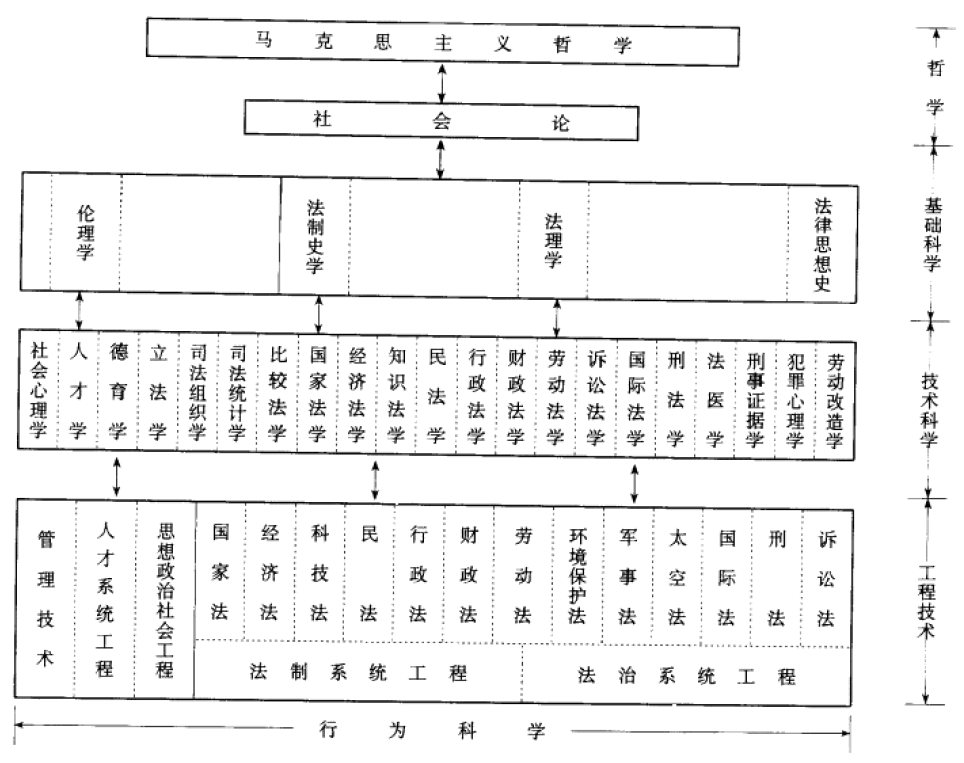
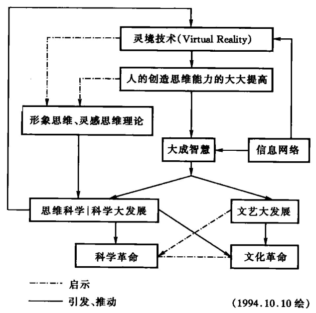

- >人们自己创造自己的历史，但是他们并不是随心所欲地创造，并不是在他们自己选定的条件下创造，而是在直接碰到的、既定的、从过去承继下来的条件下创造 。——马克思
- [地球历史 - 维基百科，自由的百科全书](https://zh.wikipedia.org/wiki/%E5%9C%B0%E7%90%83%E6%AD%B7%E5%8F%B2)
- 史前
  collapsed:: true
	- [卷首语|考古视角的中国海洋文化](https://mp.weixin.qq.com/s/TO0JIW84_7GHOx5M4fFBFA)
- 古代
	- [ “中国”名字的由来？ - 知乎](https://www.zhihu.com/question/22778670)
	- [【史图馆】四分钟看完人类文明发展史 亚非欧_哔哩哔哩_bilibili](https://www.bilibili.com/video/BV1Mb411u7Mh)
	- ((67077601-69fd-4959-aab5-c5b6870526b0))
	- 朝代
		- 商朝
			- 妇好
				- [见器如晤——在考古材料中遇见多面的妇好](https://m.thepaper.cn/baijiahao_22797057)
		- 周朝
			- 春秋
				- [如何评价春秋五霸之一宋襄公？](https://www.zhihu.com/question/265405499)
		- 汉朝
			- 东汉
				- ((62837a19-dc34-4cbb-bfd7-0aa95699beca))
				- 张角
					- [东汉顶流格局有多大？【小约翰】](https://www.bilibili.com/video/BV1o54y1f7JM)
				- [董卓，是咋从正能量好青年变成油腻大叔的](https://mp.weixin.qq.com/s/_9gIV7KhWyXk2U9nEUwPYQ)
		- 唐朝
			- [如何评价「安史之乱」？ - 知乎](https://www.zhihu.com/question/23698288)
		- 宋朝
			- [如何评价宋仁宗？ - 知乎](https://www.zhihu.com/question/22231558)
			  id:: 655acae8-7a8e-414a-a7d5-9d14fbd50480
		- 明朝
			- >《明史》我看了最生气。——毛泽东
				- [毛泽东：《明史》我看了最生气_资讯_凤凰网](https://news.ifeng.com/history/1/midang/200806/0602_2664_573491.shtml)
			- [《大明王朝》改稻为桑的政策是否真实存在？为什么没有推行下去？](https://www.zhihu.com/question/27095149)
				- ((628f7b4d-0034-4f3c-8ce1-fccbefdbb8d6))
			- {{embed ((6555873d-31a8-4f61-b888-6f8d5c20e4a5))}}
			- 张献忠
				- id:: 647015e2-9449-44fc-9236-221a75d99e55
				  >天生万物以养人
					- >人无一物以报天
						- >本来无一物，何处惹尘埃
					- [《七杀诗》燕垒生版与张献忠版对比 - 哔哩哔哩](https://www.bilibili.com/read/cv16740952/)
					  id:: 65338258-f77e-403f-ad0b-a9c191fc5731
				- [张献忠屠蜀真相：是谁塑造了这个“杀人魔王”？_腾讯新闻](https://new.qq.com/rain/a/20200325A0CV0N00)
				- [明史学者张献忠加盟山东大学，曾撰文为明末“张献忠”洗冤_教育家_澎湃新闻-The Paper](https://www.thepaper.cn/newsDetail_forward_20844752)
					- [“张献忠屠蜀”与清朝政治合法性之建构 - 百度文库](https://wenku.baidu.com/view/ef7dd03eb80d4a7302768e9951e79b896902680a?fr=xueshu&_wkts_=1728957554417)
					- [四川：张献忠研究员谈明末张献忠“江口沉银”](https://www.guancha.cn/history/2017_04_07_402559.shtml)
				- ((66b7f695-0fea-48ad-bd37-f3e7a68fbebb))
			- 洪承畴
				- [洪承畴几乎挽救大明，最终却投降清朝，乾隆为何要让他臭名昭著？_腾讯新闻](https://new.qq.com/rain/a/20220212A00XD300)
		- 清朝
			- [为什么很多人把近代中国落后怪到清朝上呢?](https://www.zhihu.com/question/490063140)
			  id:: 20a0613c-978d-4325-8182-0dff172864c4
			- [马克思：太平天国就是魔鬼的化身](https://mp.weixin.qq.com/s/IT294NIhhPCwd6ZIaEC7vQ)
			- 海外移民
				- [兰芳大统制共和国](https://baike.baidu.com/item/%E5%85%B0%E8%8A%B3%E5%A4%A7%E7%BB%9F%E5%88%B6%E5%85%B1%E5%92%8C%E5%9B%BD)
- 历史上的今日
	- [今日（1815年2月26日）——拿破仑逃离厄尔巴岛 - 知乎](https://zhuanlan.zhihu.com/p/609632123)
		- {{embed ((64bf7b15-9926-40d4-826a-502f432aeb49))}}
- ---
- 张国焘
	- [“让子烈同志回家吧！”——毛泽东的铁骨柔情 - 知乎](https://zhuanlan.zhihu.com/p/485382044)
- 冯友兰
	- [毛泽东与冯友兰](https://news.pku.edu.cn/xwzh/129-73835.htm)
- ---
- ((66ade391-3c50-4fc6-ab91-76113d706a46))
- 明治维新
- 甲午
- 战时共产主义
	- [列宁与列宁主义③——什么是新经济政策，新经济政策的思路为什么比较好 - 知乎](https://zhuanlan.zhihu.com/p/454222890)
- ((66de5128-1557-45ba-a78c-afd99c49bd1b))（1951年11月24日）
- 全面学习苏联
  id:: 66b88c78-95e2-4a07-8cfa-fb318be91fa7
	- [蒋南翔留给清华的无尽财富-清华大学](https://www.tsinghua.edu.cn/info/1181/53098.htm)
- 金门炮战
	- [毛泽东在涉台问题上的“联蒋抗美”_凤凰网](https://news.ifeng.com/c/7yN52fF6xUm)
- 千里马运动
	- [从“千里马”到“万里马” 朝鲜式运动是如何发展的-搜狐新闻](https://news.sohu.com/20170315/n483463875.shtml)
- 大跃进
  id:: 66b5c17d-fef2-48bf-9464-a859c8c47dfd
	- 除四害
	  id:: 66b8837d-245a-4d18-b715-ca6f72d9b1cf
		- [除四害 - 维基百科，自由的百科全书](https://zh.wikipedia.org/wiki/%E9%99%A4%E5%9B%9B%E5%AE%B3)
		- [说 说 60年 前 的 “除 四 害” 运 动_澎湃号·政务_澎湃新闻-The Paper](https://www.thepaper.cn/newsDetail_forward_7914407)
	- 浮夸风
	  id:: 66b885a4-dcd4-4ce0-95b4-6b3b21f6fb57
		- [浮夸风 - 维基百科，自由的百科全书](https://zh.wikipedia.org/wiki/%E6%B5%AE%E5%A4%B8%E9%A3%8E)
		- 领导人在战争时期失败较少的自信的过度泛化和过度自信？
		- 战争时期因为目标更统一所以“不敢言”的现象更少？
		- （“一穷二白”、“百废待兴”基础上的）工业化狂热？
			- ((66b887b3-c546-49cb-97d7-d35a508a32fa))，而且学得很快很多
			- “玉米晓夫”殊途同归？
		- ((66b88c78-95e2-4a07-8cfa-fb318be91fa7)) “学苏联（“先进科学”）学的”
		  id:: 66b887b3-c546-49cb-97d7-d35a508a32fa
			- [勒柏辛斯卡娅“新细胞学说”在中国 - 百度文库](https://wenku.baidu.com/view/6c677ad8132de2bd960590c69ec3d5bbfd0adad7.html?_wkts_=1723369386503)
			  id:: 66b887bb-e62c-4343-9f7c-3ab818901985
			- 没有或难以“货（指“芝士”）比三家”
		- [60多年前，中国专家的三种表态与三种结果_腾讯新闻](https://new.qq.com/rain/a/20230112A07KS300)
			- >有同志说，都说风来了要做疾风劲草，要坚持真理，可是这几年在勒柏辛斯卡娅细胞学、威廉士土壤学、农业高产等问题上，没有人敢说话，敢于发表意见坚持真理。到底为什么？他认为可能有三个原因：怕吃亏，怕被戴帽子找麻烦，好汉不吃眼前亏，你要我谈我先躺下，未打先倒；赶时髦，也是原因之一；心中无数，由于认识不清，研究工作未做，或做得少，拿不出站得住脚的理由。
		- “亩产万斤”
			- #毛泽东 #钱学森
			- 高层、中层、基层责任，钱学森开会与编辑，“时代”/“体制”责任
			- 时间线
				- [1956年到1967年全国农业发展纲要 - 维基文库，自由的图书馆](https://zh.wikisource.org/wiki/1956%E5%B9%B4%E5%88%B01967%E5%B9%B4%E5%85%A8%E5%9B%BD%E5%86%9C%E4%B8%9A%E5%8F%91%E5%B1%95%E7%BA%B2%E8%A6%81)
				- 1958年8月4日视察河南徐水县
				- 1958年11月2日至10日 郑州会议
					- 1959年2月27日至3月5日
					- [从1949到1976：公知们为何避而不谈郑州会议？因为这会打他们的脸|庐山|郑州市_网易订阅](https://www.163.com/dy/article/I60BHSRC05449D3A.html)
				- 武昌会议
					- [第二次讲话（一九五八年十一月二十三日中午）](https://www.marxists.org/chinese/maozedong/1968/4-085.htm)
				- 1959年4月29日党内通信
				- 庐山会议
					- [事实揭穿李锐老年继续造假，谎言诋毁毛泽东 - 博客 | 文学城](https://blog.wenxuecity.com/myblog/38686/201008/32543.html)
			- [毛泽东在第一次郑州会议至庐山会议前期“左”的思想历程——读这一时段的《毛泽东年谱》](https://www.dswxyjy.org.cn/n1/2019/0621/c423733-31173643.html)
				- >总之，在庐山会议的前期，毛泽东仍以全力纠“左”，一心想使党的“政策措施一定要适合当前群众的觉悟水平和当前群众的迫切要求”【毛泽东：《党内通信》(1959年3月17日)，《毛泽东文集》第8卷，人民出版社1999年6月版，第33页。】。问题是“大跃进”运动该不该发动，人民公社该不该办等，这些涉及指导思想的“左”的错误，毛泽东还没有认识到。所以当庐山会议的一些意见超越了他的认识范围时，便发生了反右的问题，使纠“左”戛然而止，接着就出现了人们不愿意看到的严重后果，也使事后的毛泽东后悔不已。
				  综上，从第一次郑州会议到庐山会议前期，在9个月的时间里，毛泽东走得很不容易，他时时刻刻都在密切关注形势的发展，不断地调整政策和生产指标，尽量使它们能够符合实际，符合群众的利益。而每一次政策和生产指标的调整，在事实上，都是在纠正着他自己的失误。9个月的纠“左”，收到了比较明显的效果，在一些重要方面，刹住了“左”的思潮的泛滥，使经济混乱的情况有所改变，这是应当肯定的。毛泽东艰难探索的目的，正如他自己在成都会议上所说，是为了“形成一条完整的我们中国建设社会主义的路线”【毛泽东在成都会议上的插话，1958年3月11日。】。
			- >我看中国就是靠精耕细作吃饭。将来，中国要变成世界第一个高产的国家。有的县现在已经是亩产千斤了，半个世纪搞到亩产两千斤行不行呀？将来是不是黄河以北亩产八百斤，淮河以北亩产一千斤，淮河以南亩产两千斤？到二十一世纪初达到这个指标，还有几十年，也许不要那么多时间。我们靠精耕细作吃饭，人多一点，还是有饭吃。我看一个人平均三亩地太多了，将来只要几分地就尽够吃。当然，还是要节制生育，我不是来奖励生育。
				- [做革命的促进派（一九五七年十月九日）](https://www.marxists.org/chinese/maozedong/marxist.org-chinese-mao-19571009.htm)
			- [【毛泽东】、刘少奇和亩产万斤真相-红色中国网](http://redchinacn.net/portal.php?mod=view&aid=9732)
			- [“亩产万斤”这个锅毛主席不背-红色中国网](http://redchinacn.net/portal.php?mod=view&aid=47314)
			- [谁在编造毛泽东和钱学森关于亩产万斤粮的故事? - 新闻 - 加拿大华人网 - 加拿大华人门户网站](https://www.sinoca.com/news/china/2009-11-01/46019.html)
			  collapsed:: true
				- >在中共产党内，毛泽东是发现并在很早（从1958年11月初开始）就提出纠正“浮夸风”的第一人，遗憾的是，“尽管他反复讲不要务虚名而得实祸的道理，仍纠正不了高指标、浮夸风的盛行。1959年4月29日，毛泽东以他个人的名义，用党内通信的形式写信给省、地、县、社、队、小队六级干部。其中说：
				  ‘第一个问题，包产问题……包产一定要落实。根本不要管上级规定的那一套指标。不管这些，只管现实可能性。例如，去年亩产实际只有三百斤的，今年能增产一百斤、二百斤，也就很好了。吹上八百斤、一千斤、一千二百斤甚至更多，吹牛而已，实在办不到，有何益处？
				  第六个问题，讲真话问题。包产能包多少，就讲包多少。……每项都不可讲假话。老实人，敢讲真话的人，归根到底，于人民事业有利，于自己也不吃亏。爱讲假话的人，一害人民，二害自己，总是吃亏。应当说，有许多假话是上面压出来的。上面‘一吹二压三许愿’，使下面很难办。因此，干劲一定要有，假话一定不可讲。’（《建国以来毛泽东文稿》第八册第237页）。”
			- [钱学森“万斤亩”公案始末 | 南方周末](https://www.infzm.com/contents/55822)
				- ((66b33a26-e326-40be-855d-88ac312ca704))（作者）
				- [钱学森“亩产万斤”公案始末   毛泽东思想旗帜网 -  Powered by Discuz!](http://www.maoflag.cc/portal.php?mod=view&aid=7669)（毛泽东生日当天转载）
					- [钱学森“亩产万斤”公案始末   毛泽东思想旗帜网 -  Powered by Discuz!](https://web.archive.org/web/20191226200337/http://www.maoflag.cc/portal.php?mod=view&aid=7669)（当天的网页快照，有当天的评论）
				- [可持续的资源生产途径？ ——钱学森“亩产万斤”说之现实意义略谈](https://user.guancha.cn/wap/content?id=439554)（原文链接来源）
				- [丁礼庭：钱学森老先生既不需文过饰非，也不需道歉_爱思想](https://www.aisixiang.com/data/39328.html)
- ((66db8abf-36e7-46e2-a9a5-cf5e95566a16)) （1963年，中小学）
- [“伯克利黑帮”与印尼40年新自由主义经济实践透析-世界社会主义研究中心](http://socialism-center.cass.cn/yjzl/201005/t20100528_2404664.shtml)
  id:: 67137104-7dc9-462f-91f9-d71019a97494
- 三线建设
  id:: 670d412e-6bc9-4796-8be8-74951028b8e7
	- [人类历史上最大的一场末日工程，大三线建设始末_风闻](https://user.guancha.cn/main/content?id=713340)
	- [三线建设——宏伟深远的超级战略工程](http://dag.yinchuan.gov.cn/dayw/daby/202001/P020200110554473813380.pdf)
- 文革
  id:: 670d40cb-e144-47fb-b790-bd48e21e8b1a
	- [聂元梓等整理的《毛主席关于制止武斗问题的指示》（1968年7月30日）](https://www.marxists.org/chinese/linbiao/mia-chinese-linbiao-19680730.htm)
		- [文革著名造反派聂元梓去世，曾贴出第一张大字报 - 纽约时报中文网](https://cn.nytimes.com/obits/20190905/nie-yuanzi-dead/)
		- [政客聂元梓的文革翻案翻供状——评〈聂元梓口述自传〉_文化传播_华声四海·闽海网](http://www.mhwh.com/culture/showcontent.asp?id=6309)
- 五月风暴
	- “让想象力夺权”
	  id:: 67064cb9-18ec-42ce-8a33-d495594a0fdb
	- [一九六八｜“五月”没有成为遗产，它仍表征着当下社会_思想市场_澎湃新闻-The Paper](https://www.thepaper.cn/newsDetail_forward_2158816)
- 红色高棉
  id:: 66dba0ad-9084-4666-930a-ca8bc2b64026
- ---
- ((66ade391-60c0-463e-a5f9-677268447abc))
	- [新纪元运动 - 维基百科，自由的百科全书](https://zh.wikipedia.org/zh-cn/%E6%96%B0%E7%BA%AA%E5%85%83%E8%BF%90%E5%8A%A8)
		- [新世纪音乐 - 维基百科，自由的百科全书](https://zh.wikipedia.org/zh-cn/%E6%96%B0%E4%B8%96%E7%B4%80%E9%9F%B3%E6%A8%82)
- 人体特异功能研究热
  id:: 66b5c1b3-b3b7-4b3e-9c9c-95319855af72
  collapsed:: true
	- id:: 66b31d42-ec94-4b32-94cb-950eba4ddd50
	  >对即将来临的21世纪····人体科学要做好准备呵！——钱学森
	- ((66b2f002-293b-4154-a556-d3a6807feae0))
		- 主要流行的是气功热吗？为什么？
	- ((66ade384-7659-4513-bead-0cc309dd9a7e))
	- 二战前？
	  collapsed:: true
	- 二战
		- 德国的
	- 美国和苏联的人体特异功能研究
	  id:: 66db8aaf-7f2f-4bf3-b01f-78d78edac594
	  collapsed:: true
		- ((66c7177b-6959-4cbe-b243-1531b43ce137))
		- [美苏两国的“特异功能研究”竞赛_参考网](https://www.fx361.cc/page/2015/0910/9522429.shtml)
		- [一个骗局引发了几十年的竞赛，美苏两国秘密投入巨资研究军事巫术 - 每日头条](https://kknews.cc/zh-cn/military/b2og2j6.html)
		- [冷战时期美苏荒谬的“特异功能”之战_科学无神论](http://www.kxwsl.com/plus/view.php?aid=536)
		- [红警"尤里"横空出世:美苏军备竞赛下的心灵超武|美国|克格勃|斯大林|钱学森_网易新闻](https://www.163.com/news/article/DQRRLJJJ000187UE.html)
	- 印度
		-
	- [钱学森曾以党性担保，人体特异功能是真的_私家历史_澎湃新闻-The Paper](https://www.thepaper.cn/newsDetail_forward_1356238)
	- [【历史影像】钱学森谈特异功能，507所研究档案，中国人体科学探索（珍贵视频资料）_哔哩哔哩_bilibili](https://www.bilibili.com/video/BV1QM4y1P7pW)
	- [揭秘507所和749局神秘的人体特异功能和它的超自然事件研究|钱学森|张宝胜|何祚庥|陆川_网易订阅](https://www.163.com/dy/article/G7PI7KR405522XPA.html)
	- [“749局”档案解密：钱学森为何要成立这支中国通灵部队？|科学|陆川|军衔|二战|校官|神盾局|物理学家_网易订阅](https://www.163.com/dy/article/IATLKNCF0532TSZB.html)
- ((66f4c5a1-59d2-4066-8dac-0d9722750e94))
  id:: 66b2f002-293b-4154-a556-d3a6807feae0
  collapsed:: true
- [萨拉热窝围城战 - 维基百科，自由的百科全书](https://zh.wikipedia.org/zh-cn/%E5%A1%9E%E6%8B%89%E8%80%B6%E4%BD%9B%E5%9C%8D%E5%9F%8E%E6%88%B0%E5%BD%B9)
  id:: 673d2790-c759-4256-ad64-56a7abbb16b0
- [1994年分税制改革 - 维基百科，自由的百科全书](https://zh.wikipedia.org/wiki/1994%E5%B9%B4%E5%88%86%E7%A8%8E%E5%88%B6%E6%94%B9%E9%9D%A9)
- 控枪 #1996年
  collapsed:: true
	- [为什么中国一定要禁枪？以前不是全民持枪吗？ - 知乎](https://zhuanlan.zhihu.com/p/449730710)
- [2010年南海本田工人罢工事件 - 维基百科，自由的百科全书](https://zh.wikipedia.org/zh-cn/2010%E5%B9%B4%E5%8D%97%E6%B5%B7%E6%9C%AC%E7%94%B0%E5%B7%A5%E4%BA%BA%E7%BD%A2%E5%B7%A5%E4%BA%8B%E4%BB%B6)
- UFO热
  collapsed:: true
	- 文明间接触
	- 行星防御理事会
- 系统工程
  collapsed:: true
	- #钱学森
	- [钱学森：系统工程中国学派蔚然成林—新闻—科学网](https://news.sciencenet.cn/htmlnews/2018/9/418141.shtm)
	- 
	- 大成智慧
		- 
- 广场舞热
  id:: 66de50fa-f1b1-4308-a84f-8aead95e4046
  collapsed:: true
	- 唯欲广场舞，必先有广场
	- [广场舞 - 维基百科，自由的百科全书](https://zh.wikipedia.org/wiki/%E5%B9%BF%E5%9C%BA%E8%88%9E)
	- [为什么广场舞在中国突然火爆了起来？ - 知乎](https://www.zhihu.com/question/20833349)
	- [如何评价广场舞在我国的现状？ - 知乎](https://www.zhihu.com/question/60608344)
		- 广场舞（以及具有相似特征的丧乐）的大力传播，对于隔音窗、外墙保温隔音层的普及、倒逼房地产建设质量和社会经济的发展有不可小视的作用，年轻人应当理性地看待此事，对同样“日用而不知”的中老年人多多心怀感恩
	- 迪斯科
		- 喇叭裤
	- 集体[[气功]]的替代品？
	- “卖碟片喽！”
	- [广场舞公约_百度百科](https://baike.baidu.com/item/%E5%B9%BF%E5%9C%BA%E8%88%9E%E5%85%AC%E7%BA%A6/13002936)（2014年1月21日）
		- “广场协定是吧？”
	- 作为年轻人，感觉广场舞还很不自由
- ---
- [里根经济学_百度百科](https://baike.baidu.com/item/%E9%87%8C%E6%A0%B9%E7%BB%8F%E6%B5%8E%E5%AD%A6/6417210)
  id:: 670f4bb3-3dae-438a-aee3-63502292a1b4
- 戈尔巴乔夫改革
	- [苏联经济危机的谎言与真相——基于卡拉-穆尔扎的分析--理论-人民网](http://theory.people.com.cn/n1/2016/0627/c143844-28481098.html)
	- [一部视角独特的力作——读《卢布信用危机与苏联解体》_俄罗斯东欧中亚研究所](http://euroasia.cssn.cn/kycg/sls/201905/t20190510_4878596.shtml)
- 海湾战争
  id:: 670d40cb-7810-4836-bc8b-8ba49a29ff5f
	- [海湾战争 - 维基百科，自由的百科全书](https://zh.wikipedia.org/wiki/%E6%B5%B7%E6%B9%BE%E6%88%98%E4%BA%89)
	- [为什么很多人都说「海湾战争」打醒了全世界？ - 知乎](https://www.zhihu.com/question/507313730)
- 苏联解体
- 计划生育
- 卢布危机
  id:: 670d40cb-9e91-4d17-abae-69be55c0ff01
	- [1998年俄罗斯金融危机 - 维基百科，自由的百科全书](https://zh.wikipedia.org/wiki/1998%E5%B9%B4%E4%BF%84%E7%BD%97%E6%96%AF%E9%87%91%E8%9E%8D%E5%8D%B1%E6%9C%BA)
	  id:: 670d40cb-a2fe-4eb3-ac35-da6167463831
	- ((67073686-1da9-4155-85c9-dc144dd83808))
- ((66f4cdda-9629-4db7-8aff-7d530e1034e9))
- “世纪末”
	- “1999年到底发生了什么？”
		- “出版了不少[[气功]]、养生书，同时法轮功被禁止，气功界被整改， ((66dd28d0-eb72-4539-86ab-38294f0fc919)) 开始极速衰退”
- 入世
	- [中国加入WTO 20年：“入世”如何改变中国与世界 - BBC News 中文](https://www.bbc.com/zhongwen/simp/business-59239732)
	- ((66ade3ab-b054-4654-8ee6-79267c5b9e22))
- 次贷危机
	- [马前卒：2008世界危机之不负责胡扯 - 乌有之乡](https://www.wyzxwk.com/Article/guoji/2009/09/56908.html)
- 奥运热
	- 乒乓球热
- “智能”热
	- ((66dba0e7-859b-4803-be9d-d284c867b3f4))
	- 智能手机
	- 智能马桶
- 佐利克报告
	- ((67074a37-20e4-4fdb-9085-2b950d9169b0))
	- [马耀邦：佐利克与《2030年的中国》_风闻](https://user.guancha.cn/main/content?id=256451)
- ---
- 跨度较大的
	- ((670d4117-15a8-4ae4-8f71-b13bc2c85410))
	- 房地产业
	- 第六次产业革命 #钱学森
	  id:: 6708ebc5-6dc7-4a63-b65d-e4e94ea659d4
		- 农林草海沙
		- 沙产业
			- ((66db8ac2-974f-4bad-95a9-5bfa7306b8fd))
			- 毁林开垦
				- [甘肃阳关林场调查情况公布：存在毁林开垦、无证砍伐等问题_绿政公署_澎湃新闻-The Paper](https://www.thepaper.cn/newsDetail_forward_11782296?hotComm=true)
			- [国家林业和草原局关于印发《全国沙产业发展指南》的通知_国务院部门文件_中国政府网](https://www.gov.cn/zhengce/zhengceku/2022-01/23/content_5670024.htm)
- ---
- [人类命运共同体 - 维基百科，自由的百科全书](https://zh.wikipedia.org/wiki/%E4%BA%BA%E7%B1%BB%E5%91%BD%E8%BF%90%E5%85%B1%E5%90%8C%E4%BD%93)
	- [第一观察 | 习近平主席再谈“同球共济”_腾讯新闻](https://news.qq.com/rain/a/20241012A002AV00)
- [两个不能否定 - 维基百科，自由的百科全书](https://zh.wikipedia.org/wiki/%E5%85%A9%E5%80%8B%E4%B8%8D%E8%83%BD%E5%90%A6%E5%AE%9A)（2013年1月5日）
	- 一带一路（2013年9月）
		- [观点：“一带一路”塑造未来国际权力与财富分配模式 - BBC News 中文](https://www.bbc.com/zhongwen/simp/chinese-news-39922456)
- ((668f7f03-1181-4c87-8540-fcb82ae45d25))