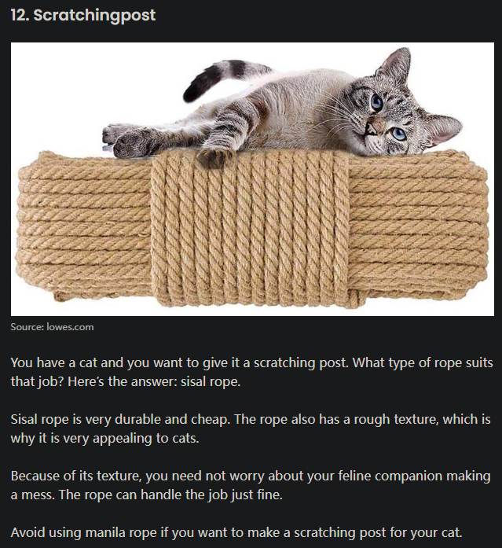
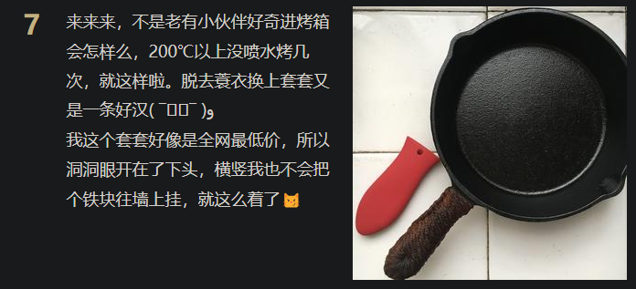
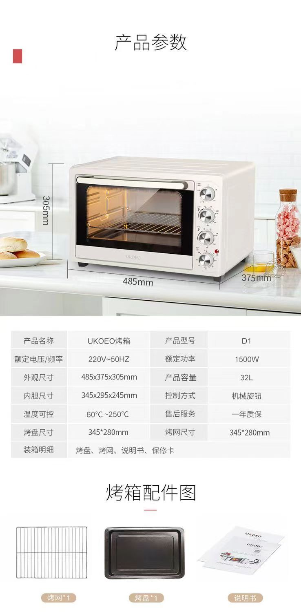
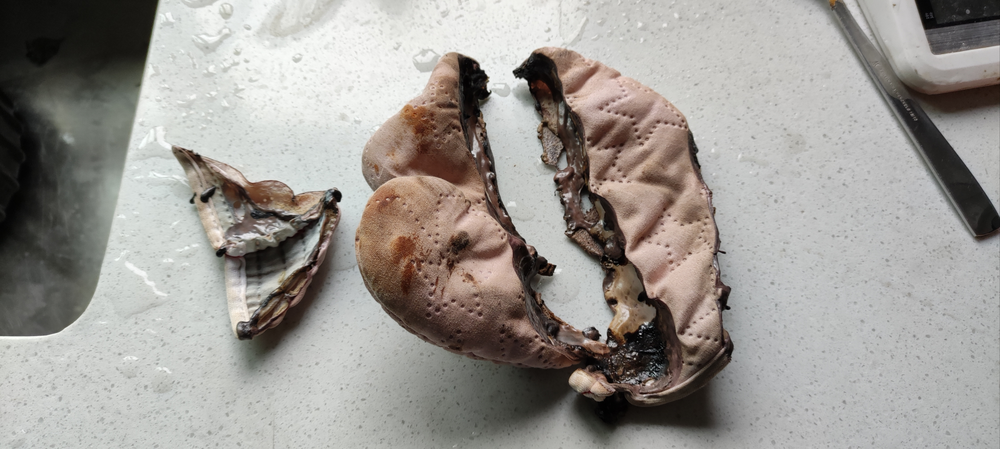
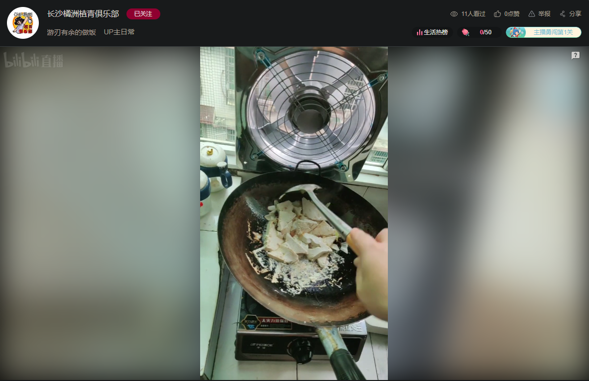

- ((65bcbf48-be5c-46a4-a88e-9cb147c75e42))
- [[净水器]]
- 烟道止逆阀
- 护手
  id:: 65bcbf49-b9a8-4cc5-9edb-7f1fbf275c7f
  collapsed:: true
	- 厨房手套
	  id:: 670d40d8-937f-47bb-a6b9-7a2528bff95f
		- 丁腈手套
		  collapsed:: true
			- 目前用了几个月，感觉比乳胶手套更好
			- 虽然价格更高，但也耐用得多，异味小很多，内部不容易黏，易取下，贴合度对普通厨艺也不是什么问题
		- TODO 乳胶手套（过敏可以用丁腈手套）
		  id:: 65d14aa8-b265-42a5-a052-bb08f1f021e5
		  collapsed:: true
			- 避开高温、日晒，以免加速老化
			- 用后，手套指尖甩不出来，可以换一个方向甩
			- >手套厂可能要“养人”，但我不再忍耐乳胶手套因为开了一点缝漏水就要换或凑合翻过来给另一只手戴的现状
			- 用洗碗机想一次都不脏手，一般也得戴手套，毕竟餐厨具不会自动飞到洗碗机架上
			  id:: 65ebd2a5-9398-48d3-8217-1bb00a32f2f1
			- 品牌：东方红、南洋等
				- 假货、次品鉴别？
			- 不从上部进水（扎住？）
				- 进水后撑开干燥
			- 内部手不潮不脏
				- 保养不糊（滑石粉、玉米淀粉）
				- 手易穿脱
				- “不清洁，多戴一层薄纱手套”
			- 指尖等部位不破
				- 指甲不要太长太尖，不然耗损比较快
				- 补缝
			- 右手手套坏得多怎么办？
				- [餐饮用橡皮手套总是右手的先磨坏，有没有商家以一双左、一双右、或单只的形式销售手套的?](https://www.zhihu.com/question/321960674)
	- 隔热
	  id:: 65f6b597-a311-46e5-b9cd-bd7a61063341
		- 隔热绳（“麻绳还是凯夫拉/芳纶绳更好做锅柄/锅耳、进烤箱？”——“啊？有多少种麻绳啊？”）
		  id:: 65f680ee-353d-440a-b9c4-2b8669aeb42d
		  collapsed:: true
			- [大家编甲用的绳都是什么样的【盔甲吧】_百度贴吧](https://tieba.baidu.com/p/8157273336)
			- [5 Types of Rope with Their Strength, Weakness, and Uses - Avantela Home](https://avantela.com/home/design-decor/types-of-rope/)
			  id:: 65f682d3-0e3f-4865-ad3d-9161297b82b1
				- 
			- [天然纤维绳的历史（主要是麻绳的历史） – TheKnotsWorld](http://theknotsworld.com/index.php/2022/01/07/%E5%A4%A9%E7%84%B6%E7%BA%A4%E7%BB%B4%E7%BB%B3%E7%9A%84%E5%8E%86%E5%8F%B2%EF%BC%88%E4%B8%BB%E8%A6%81%E6%98%AF%E9%BA%BB%E7%BB%B3%E7%9A%84%E5%8E%86%E5%8F%B2%EF%BC%89/)
			- [麻类纤维——我国古代纺织界的“顶梁柱”丨花花万物 - 知乎](https://zhuanlan.zhihu.com/p/416821492)
			- [【铸铁锅之歌🎶（guo）附麻绳捆绑大法的做法视频_做法步骤】_下厨房](https://www.xiachufang.com/recipe/103425301/)
				- 
					- “唉呀，之前没细看，这下多看了三五篇”
		- 湿抹布/毛巾（“捂住口鼻”；临时用，可以叠四层，但实际用时覆盖面积一般较隔热手套小）
		- 隔热手套
		  id:: 65db1962-3ee4-4e8d-b56e-8c02a329c2f1
			- 参考价：8元（厚棉）~20元（外硅胶、里不确定什么“棉”）
			- 我的大铸铁煎锅大火两分半后用硅胶五指隔热手套（一对215g）抓住两侧锅耳移开，在空中端了一分钟，没感到一点烫，表面也无可见变色——但在烤箱250度充分预热后还是会在十秒内感到温热的，但时间够
				- 我的硅胶五指隔热手套在手不干时穿戴可能会把里料棉绒带出
				- 真烫到的话相信会自动脱手
			- 硅胶的还好在外表面防水（未破损的话应该可以进沸水）、易清洁、更防滑
			- “觉得”棉和硅胶的都不够隔热的话，可以里面再套一层手套（比如乳胶手套或棉线手套）、再向内折一倍厚度（但这样抓可能相对不那么牢靠些）、用同材质更厚的（关键词“工业”、“商用”，甚至还更便宜）的——凯夫拉、铝箔的可能重点是更高的温度不会燃烧，而家用烤箱的温度一般用不着考虑
			  id:: 65f6b597-d006-41aa-8193-2371de1793b5
			- 不太厚的棉隔热手套不太推荐浸湿接触高温的铸铁锅耳、烤盘、烤网等高温物体，目前暂未排除沸腾的水蒸气穿透棉布烫伤的可能性
			- 隔热手套没有厨房（防水防油）手套那么灵活，不适合（给较多红薯）翻面（尤其是棉的沾了烤红薯的糖蜜汁还不方便洗），所以即使是同样防水的硅胶手套也不推荐用来代替厨房（防水防油）手套
			- 长度是否覆盖手腕（伸入烤箱翻面等）
			  id:: 65eeaa79-b64f-4a14-9072-fa38d60e2fcd
				- [【【生产生产】面包产线大揭秘！你最喜欢大礼包中的哪一款呢？】 【精准空降到 03:42】](https://www.bilibili.com/video/BV1Au4m1G7RW/?share_source=copy_web&vd_source=24175964b0df2fcc2c022cae23517fdc&t=222)
			- 披萨烤箱预热铸铁锅，有无热风两次，燃气灶预热一次
		- 烤盘取盘夹
		  id:: 65f98149-4376-45ab-8a03-9d74b795263f
			- 在烤盘尤其是烤网
	- 防切伤
	  id:: 66335bd8-a9c4-443d-bc70-c37f431bdaef
		- [未明子6-7手部战损_哔哩哔哩_bilibili](https://www.bilibili.com/video/BV1kf421D7yY)
		  collapsed:: true
		- ((66140f15-fd8c-4c2f-afa6-1dc15c6db8a0))
		- 大块土豆等斜切到较倾斜时把剩下的块转到另一边切，这样刀切下去的方向就朝外而不是朝内了
		- 磁吸刀架，刀口朝下有无放刀时碰到的风险？
		- ((65a9d48e-dd79-4d6f-9a42-28f2bbee3cbd))
- 涂层
  id:: 661f5746-1b76-447f-9b9a-f25b018ee28f
  collapsed:: true
	- ((65bcbf66-680b-48d9-9ba4-ac46827f01bd))
	- 锅铲、饭勺
- 霉菌
  id:: 661f8480-d60a-4d09-bc6b-ae3bd2fa9055
  collapsed:: true
	- 锅铲、饭勺
- 称重
  collapsed:: true
	- 想兼顾大量程、高精度、少花钱的话，可以分两三台买
	- 称量取用的经验丰富后可以做到“心中有杆秤”
	- 或者可以通过记录（购买日期、用完日期等）的方法在较长周期估算和调整
	- ---
	- 体重秤（至少大几斤的物体可以拿着站上去一起称，然后单独称人，再相减）、手提秤（怕电子秤坏或没电可以用弹簧秤）
	- 厨房秤 10（精确到1g，量程5kg，量程可以再大些；如果要称酵母之类重量较小的且不用毫克秤则可以精确到0.1g或001g）
		- 电池盖处可以贴上胶带防水防尘
		- 按钮部位也可以贴上胶带防水防尘（开关按钮可能失灵）
		- 厨房秤维修 #维修
		  id:: 65fbb474-6eea-497b-8b77-2f8a89fa92ec
			- 电源开关按了打不开
			  id:: 65fae257-8cf7-4690-9e06-72b28871e3a2
				- 常见原因：开关触点被杂物挡着或锈蚀了
				- collapsed:: true
				  >只是电源开关键不好用了，每次得拔电池。
					- [简单修理厨房电子秤，0成本，低人工，希望对大家有帮助_电子秤_什么值得买](https://post.smzdm.com/p/a839nm4n/)
						- id:: 65fae2aa-28e3-47f5-ae01-31529a68702b
						  >按键就是薄膜按键，没有密封粘在电路板上，估计进了面粉，所以接触不良，用手打开一个缝，擦擦，吹吹。ok 
				- [拆修一个5000gX1g厨房秤SF-400附4脚立式微动开关拆解 - 拆机乐园 数码之家](https://www.mydigit.cn/thread-79603-1-1.html)（“哈哈，拆到搜开关搜到的，是我的那种厨房秤”）
					- [拆解9.9元包邮的厨房电子秤 准确率不错 打开一看简陋到没朋友_哔哩哔哩_bilibili](https://www.bilibili.com/video/BV1Gq4y1u7ME)（“哈哈，更早看的瞄了几眼忘啦！”）
						- >核心就一个应变电桥，一个牛屎芯片和屏幕
					- [【开箱/拆机】海尔厨房秤拆机，原理大揭秘！结构分析，注塑模具分析；_哔哩哔哩_bilibili](https://www.bilibili.com/video/BV1S24y1R7gm)
				- 显示屏和按钮的面上的贴纸可以扯下，然后能看到螺丝，然后拆拆拆（底部的秤台传感器校准螺丝可能要先拆）
				- 电路板那一行行“金手指”搭在液晶显示屏上供电
				- 锅仔片薄膜开关，我的厨房秤是直径8mm的，圆周上三个凸触点，中间一个凸触点
					- 有一个锈了，据网友说
						- >别用白醋，直接细砂纸蹭，或者刮一下
						- 但
							- >OK，但我今天想到有两个好的就够了，裁了下，好的贴开关和归零上了
							  >然后发现中间换单位键还是能用，可能跟开关固定区域也锈了点有关
								- >干脆用烙铁引出线来买几个按钮接上
								  >用到报废也不坏按钮了（
			- 经常显示低电量（明明电池才充满的）
				- 可能同 ((65fae257-8cf7-4690-9e06-72b28871e3a2))
			- 秤台（受重）倾斜导致测量不准
				- 厨房秤底部有纸挡着的地方能捅开或撕开，内有螺丝
				- 秤台传感器上有两个构成杠杆、调整水平倾斜度的校准螺丝，倾斜可能是靠外的螺丝向外转了
	- 帝衡10g量程的毫克秤 32（可选，称量用量较小膳食补充剂、食品添加剂、香料等的重量）
	  id:: 66ade374-9a3a-4284-aa39-e752c365306d
- 称体积
  collapsed:: true
	- 有时手忙脚乱，不方便用厨房秤，或是厨房秤坏了、没电了，就需要用还没坏的称量方法
	- 量勺
		- ((65efaeff-2117-47f0-876f-1031ea55a01f))
	- 小量杯
		- 之前 ((65f6b597-b90a-4512-a4d2-84694de9575f)) 时用过
	- 量杯
		- ((65ef0b9e-d45d-4324-8898-52325ded63ae))
- 去皮/去壳
  id:: 66db8aba-7744-4ab3-9329-cb21c27cf2e1
  collapsed:: true
	- kisag Y形平齿削皮刀 25（尤其适合削硬果硬皮；上大学时买过，比相对畅销的维氏的歪头削皮刀更顺滑、顺手，后来不知到哪去了，用瑞士力康的锯齿削皮刀也很好也可以通用，但硬皮蔬果可能还是用平齿削皮刀削皮比较好；kisag还有厚皮削皮刀，应该适合削贝贝南瓜；有塑料手柄的和全不锈钢的两种，我现在用的是全不锈钢的）
		- 带挖孔设计的注意朝外挖，以免刮到另一只手
		- ((65e59d27-17ac-42d3-9dd1-145782ca98b3))
	- 瑞士力康Y形锯齿削皮刀（软皮硬皮都好削，用几年了还好用）
	- 削皮姿势
		- 使用Y形削皮刀时，握持食材手的大拇指朝前、其余四指在下、在上方向外削可能相对快且安全
		- “削皮架/桩”
		  id:: 66beb9fe-be53-4f49-84d1-4002d4c5ff3b
			- 蹲在垃圾桶前，肘架在膝附近，往复省力
	- 去蛋壳
	  id:: 675ad7ab-4f13-4319-a8e5-4a676d458c7f
		- “醋蛋”
		- 冷却收缩
		- 小幅敲敲敲
		  id:: 675ad7c7-8461-4adb-93db-f2574c1c6de6
	- 去蒜皮
		- 拍蒜
			- 也可包括将整头大蒜拍散为蒜瓣的过程
			- 缺点
				- 可能会滑飞
		- 抖蒜
		  id:: 675ab72d-2da8-42c1-ac7e-198f47ca5752
			- 手动是用两个相对不锈钢盆等轻的铝盆对扣晃“敲锣”的机械效率较高、比较省力——但铝盆做工粗糙的话盆边可能划手，可以戴手套
- 厨余或其他垃圾
  collapsed:: true
	- TODO 一次性水槽过滤网袋（感觉我家用了段时间又不用了，是降低了下水速率还是嫌每次放麻烦？可能也跟进入水槽的厨余种类有关，如果较细的厨余不多，可能就用不着）
	- [[垃圾袋]]
	- 垃圾桶
		- 可以直接在大口垃圾桶上空削皮
		  id:: 65e59d27-17ac-42d3-9dd1-145782ca98b3
		- 自动开关盖的垃圾桶（可能）只负责手靠近了（探测高度不够）开和关，不负责撑满后换垃圾袋
		- ((65d0ac85-1da4-4678-b0a9-66ddb798426c))
- 清洗
  collapsed:: true
	- 锅底要干净，以减少油烟
	- 海绵块
		- 木浆棉抹布块 1
			- 其实我单用了好久钢丝球才发现这玩意真香，确实要“专业的工具干专业的活”，因为木浆棉抹布块比钢丝球实际接触面积大，更易带走油污和污渍，比海绵块稍硬，对粘黏物体的机械去除能力较强，但又不至于像钢丝球那样对锅的涂层和“镜面”伤害那么大，同时更容易干燥，不那么容易发霉，使用寿命也长
	- TODO 毛刷（==现在好像不咋用了==；刷红薯、土豆等的泥。软毛或中毛，太硬了破皮会导致额外的营养和烹调损失；另有一个[[赤足跑]]后冲水刷脚——我是在淋浴间刷的）
	- [肥皂刷餐具不卫生 去污力、安全性均不及专门的洗涤剂--健康·生活--人民网](http://health.people.com.cn/n1/2019/0313/c14739-30973436.html)
	- 手洗厨餐具/“洗碗”
	  id:: 67402ab5-1722-407f-8f80-9de8f6663bb5
	  collapsed:: true
		- “别搁这洗碗啦，用烤箱做不需要锅盘碗的菜吧”
		- [游戏教学博主的洗碗课，高贵的洗碗机玩家绕道_哔哩哔哩_bilibili](https://www.bilibili.com/video/BV1hL4y1e7kc)
		- [户外露营洗碗方法❗️轻便/好收纳/效率高/省水❗️吃辣火锅都不怕油了_哔哩哔哩_bilibili](https://www.bilibili.com/video/BV1oh4117772)
		  id:: 661545f1-60d2-4650-9142-5eb1a83e23e8
		- [【小屋夜校/D-1-4】神速洗碗大法_哔哩哔哩_bilibili](https://www.bilibili.com/video/BV1oT4y1W742)（“可能比Geist平均水平高，但尚未讲究戴手套护手”）
		- 省水、洗洁精、时间版手洗
		  collapsed:: true
			- 省的钱主要是需要燃气或电加热的热水的钱，冷自来水并不贵，但既然要省了则应省尽省
			- 不用大盆或大锅装水泡，较理想的状态是仅润湿食物残留与厨餐具的接触面
			- 装水量少了——
				- 洗洁精用量也可相应减少，同时维持所需浓度
				- 装水时间也省下来了
				- 装水不多，旋转擦拭也能维持高速而不担心洗得到处都是了，又省了一些时间
			- ---
			- 如果有没多少油的漏盆、洗菜盆、砧板等，先用冷水冲洗，剩下不多时可以开非即热式热水器的热水准备配置热洗洁精溶液
			- 尽快（也是为了尽可能多利用余温；有可能在多人未吃完时就开始处理，争分夺秒啊！）去除流体（“沥沥”）、固体厨余，用清水或洗洁精溶液喷雾保持湿润以防干结
			- 能吸水的洗碗工具吸收热洗洁精溶液（人不多不少时通常一小碗即可）后直接擦拭
				- TODO 有没有可能用不吸水但==足够热（材料不比水的比热容低多少）==的洗碗工具与厨餐具与食物残留的接触面上的热洗洁精溶液配合==溶解、剥离餐厨具表面的食物残留、油污==？——“新材料是吧？”
					- “有没有可能用一次性抹布或厨房纸巾就行，只是稍微贵些？”
			- 最后用适量冷水冲洗
				- 一手转移时另一手就拿下一件
			- ((66a368f5-311e-4d0d-bec0-e5e10fcf03bd))
		- 更省版（不用洗洁精版）
		  id:: 66d14b93-7b72-4d68-8721-626e1156b685
		  collapsed:: true
			- 饭后戴丁腈手套，挪堆叠起来的餐具到水槽水龙头正下方，用小流量自来水接水同时用钢丝球等刷洗，接到大约一两碗水后关水，刷洗后放一边，刷洗完了再开稍大的小流量自来水用手套擦擦转转放一边
		- 软的用木浆棉抹布擦，硬的用钢丝球刮，涂层不能硬刮的电饭锅内胆先和饭勺（如果是金属的可以不泡直接刷）泡着
			- 擦过刮过了先放一边，待会儿一起冲洗
		- 洗碗无聊、等不及？
		  id:: 66db8aba-5f68-4a8f-860b-4599215273cb
			- 可以听书听视频
			- 可以唱歌哼歌
			- 可以记着随时冒出来的想法，回去用 ((65bcac14-f887-4224-92e2-1d16751f358d)) 等记录
			- 可以把总工作量拆成几批，减少“视域内主观易感工作量”，多走动几次搬运，比如靠近水槽的、远离水槽的、餐桌上的餐厨具和餐桌上要清理的垃圾
			  id:: 66fc891c-fad0-42ed-8d05-66972e4f32b0
		- 如果锅会锈，洗锅后剩下的水可以擦去，或者静置一会儿后倒出水（省点燃气）再开火，提前关火
		- ---
		- 洗碗
		  id:: 668ce732-1695-4b8b-b682-6d61c2eadc40
		  collapsed:: true
			- [正確洗碗方法｜碗碟浸水10小時繁殖48萬倍細菌 拆解4大清洗迷思｜好生活百科](https://www.weekendhk.com/lifestyle/%e6%b4%97%e7%a2%97-%e7%b4%b0%e8%8f%8c-%e6%b8%85%e6%b4%97-ctb02-cc-1062687/5/)
			- [洗碗精殘留恐傷腸道、增慢性病風險 8招完全去除超乾淨 - 健康 - 中時新聞網](https://www.chinatimes.com/realtimenews/20240605003172-260418?chdtv)
			- 水槽洗碗趴床
				- ((645636b5-ceb2-4609-85ba-2f48d21290ba))
				- [如何利用健身知识远离洗碗做饭的腰酸背痛？_哔哩哔哩_bilibili](https://www.bilibili.com/video/BV1JF411p7DQ)
			- 干洗
				- ((64564928-257c-4d15-9c0f-2fa63543a828))
					- 纸、砂纸、硅胶橡胶塑料刮板等刮除更多表面污渍放入虫桶，可能剩下的会成为垫料
		- 锅底清洁
		  id:: 67584f2f-b38e-48cb-8895-1756b9d52181
		- ---
		- ((67402ac7-c4a5-4b87-9935-b20ade22a9e5))
			- 切根后快速搅拌清洗、沥干、风干
		- 淘米
			- 超声波淘米？淘米淘的是什么，有必要吗？
	- TODO 洗碗机
	  collapsed:: true
		- ((65ebd2a5-9398-48d3-8217-1bb00a32f2f1))
		- 餐厨具去除较大的固体残留物后，在洗碗机架上朝下朝内摆放
		- 下层的物体不要高到上层，以免卡住
		- 小孔是放勺子等的，方便它们自己在小孔中转，而不是在一个大孔中互相挡
		- TODO 洗碗粉
			- ((65bcc04c-db7f-477c-b8c7-b4e45998a359))
		- TODO 买洗碗机
		- 洗碗机
		  id:: 63317673-51e5-45af-a1b8-6e7386f82f7b
			- 厨柜不匹配、厨房空间有限、上下水已被水槽水龙头和净水器占用的情况下如何安装？
			- 垫高下水架子以便正常使用
				- 之前一个双十一还是六一八买了个，安装师傅大聪明过来说没加高的台子（用建筑材料的那种），洗碗机不好下水，好多家都是这样装不了，建议我们退了，那就退了，后来又看了下，网上有加高的相对轻便的台子卖啊
			- 用法
				- 洗油烟机滤网？
				- [硬核洗碗机低温牛排全过程 可以用洗碗机做低温牛排吗_什么值得买](https://post.smzdm.com/p/a83dxvll)（得找块便宜的）
	- 下水管
	  collapsed:: true
		- 下水管堵塞
		  id:: 66f93270-72dd-43fb-bd37-5c7014bfd2dd
			- {{embed ((66ec01f8-52e8-4e98-9599-f804bb2db1be))}}
- 挡板
  collapsed:: true
	- 飞溅（splash）：“水龙头出水口、手和厨餐具、厨柜台面、水槽底之间的落差以及人体、厨柜外壁、水槽内壁的距离等的矛盾是难以调和的矛盾吗？”
	  id:: 675c1ac3-fce3-46fe-bc10-7faf8e84ef1e
- 切割/搅拌/塑形
  id:: 66db8aba-74d0-4599-b78f-50d6cd7bc416
  collapsed:: true
	- 切割
	  id:: 66ebea5c-cc04-4494-83d4-cf1e19f53782
	  collapsed:: true
		- 片刀（适合切各种，不要买太钝的一般就够用）
			- 用刀安全
				- 除了“跪姿”外，副手可以架在刀背上对可能滑动的食材切块
				- 剩下有切痕但没分开的块可以用刀背配合手掰开
		- 淘宝“新芽家居”TPU砧板（轻薄、可弯折、便携，不适合剁）
		- 龙江切丝器（建议用单买的更安全的护手器，最好再戴手套，食材最后一段建议用刀切，以免无防护硬来削指尖；那种多孔的阻力大、汁水损失多，拿着食材推刨也不安全；要“做大做强”餐饮可以考虑升级买淘宝“熙公子千刃坊”的千叶切菜器，可以切出可用于火锅的“长寿土豆面”、“超长幅藕片胶卷”的效果）
		  id:: 65a9d48e-dd79-4d6f-9a42-28f2bbee3cbd
		- 奶酪刨（可以将大块马苏里拉刨成细条）
		  id:: 66149db3-ed62-4a0e-a7d3-2cf3d8edb08e
		- 椰青塑料软刀（可以挖“椰子蛋”，简单挖半个或整个喝剩下的椰肉也比勺子更好用；牛角的比塑料的贵不少）
	- 硅胶抹刀（刮、舀、抹番茄酱、蛋液、软质奶酪等；刮的可以买末端弯曲的）
	- 搅拌
	  collapsed:: true
		- ukoeo u2打蛋机 46
		  id:: 65d0ac85-476c-4639-9382-48894a2f20b5
		  collapsed:: true
			- “过年涨价啦？”
			- 可搅拌蛋、肉糜、奶油、大啤酒杯中的膳食补充剂等
			- 搅拌肉糜用片棒（弹性小、少卸力，缠绕肉丝少），应该说还是有点吃力，且片棒缠绕的肉丝也需要去除（可以靠近水槽侧角蹭侧向下、从而减少“肉末横飞”的刷子旋转去除，忘了能否去除干净了）
			  id:: 66db8aba-64f4-4f86-b84b-1d2fc797b065
			- 杯子口径小的话可拆下一个搅拌头在杯中搅拌
			- 打蛋头可以抽下来当手动打蛋器用
			- 打蛋机需要更深的 ((65f83416-42d2-4b00-8017-3d75c6b32008)) ，以防把食材甩出来
		- 宜家哈特土豆泥捣具（可以捣[[土豆泥]]等）
		- 手动打蛋棒
		- 厨师机（揉面、搅肉馅等）
		- 盆
		  collapsed:: true
			- 揉面盆（更开口）
			- 打蛋盆（更收口；可以用较深的锅代替）
			  id:: 65f83416-42d2-4b00-8017-3d75c6b32008
			- 也可以用对应形状、大小的碗、锅等代替
		- 搅肉馅
		  id:: 67402ab5-a33b-40eb-b938-fae5c65cee69
		  collapsed:: true
			- 有说用手搅拌更好的，但裸手搅拌肯定洗手麻烦
			- 握筷搅拌一般用两根筷子，可以通过更大重量的搅拌容器、肉馅与平台的摩擦力减小搅拌容器的旋转速率，从而可以用双手握筷搅拌，搅拌时肉馅更容易不沾手；单手握筷搅拌可以切换手指位置或戴手套减少手指抵筷压力
			- ((66db8aba-64f4-4f86-b84b-1d2fc797b065))
		- TODO 不会往上堆的搅拌
			- [[音乐]]
	- 蒜臼
		- 可用 ((65db1962-3ee4-4e8d-b56e-8c02a329c2f1)) 垫着减震，以免影响楼下邻居
	- [[面食]]
- 去水
  collapsed:: true
	- 漏盆（沥水）
	- 蔬菜甩水器（旋转离心甩水，比沥水去水更快，似乎一般的主要用途是做沙拉，但也可用于洗后冷藏备菜）
- 免洗
  id:: 65f78b91-347b-4654-90de-960fb89e3e36
  collapsed:: true
	- 厨房纸
	- 铝箔片/卷
	  id:: 65dd8630-00c1-4f03-969d-216929217c0e
		- 可以烤箱烤完了就放在上面吃，吃完把垃圾一裹扔了
		  id:: 65e2baf4-7574-4d04-bd1a-e15c482de83b
		- 用过的铝箔可以撕下（足够大的）一角当生熟备料碟，还可以弯成漏斗型
		  id:: 66140e5e-0d6d-44c0-931d-38a57ff99803
		- 带食物煎烤减少粘连的方法
			- >有个小方法，铺之前抓一抓把铝箔纸揉皱一点，这样就不会大片食材贴上去粘了[doge]
		- [烘焙时用锡纸应该用哑光面还是亮面？ - 知乎](https://www.zhihu.com/question/30395059)
		- [FoodTalks全球食品资讯网](https://www.foodtalks.cn/news/50520)
- 加油
  collapsed:: true
	- “最加油的一集”
	- 喷油瓶（减油、防粘，一般有预加压和按压两种）
		- [担心买到的喷雾油壶是呲水枪？看了这篇不会踩坑！ - 知乎](https://zhuanlan.zhihu.com/p/531923684)
- 加热
  collapsed:: true
	- ((66335be1-3865-47de-8837-11c61b2312ca))
	- 电饭锅
		- 电饭锅内胆不粘图层
	- 烤箱
	  id:: 65cd7fd5-20a9-403e-b466-9ec2c219eb75
		- 为什么推荐买烤箱？
			- 烤箱很“傻瓜”，与各种锅相比，它非常的工业化、城市化、自动化
			- 能够较大程度地排除“（相对复杂的）厨艺”（“厨艺”能用来锻炼和交友，但并非所有时间都是锻炼和交友的时间）的影响（主要的工作量是放置和翻面，甚至连翻面都不用）
			  id:: 660260ef-e021-47b9-9b5b-2945bc9a38e2
			- 节约时间（可以通过定时插座实现“预约”功能）
			  collapsed:: true
				- >如果你有一个烤箱，你就可以在休息日把红薯、贝贝南瓜、肉圆、披萨全都烤好，
				- >我现在用烤箱烤红薯、贝贝南瓜、贝贝南瓜籽、披萨，比微波炉光波混合模式更好吃——而且（红薯、贝贝南瓜等）整个烤了可以冷藏冷冻慢慢吃，冷冻红薯微波炉1-3分钟就好吃，也可以冷藏或室温解冻若干小时外带班中餐
			- 减少 ((65d0ac87-28c2-44df-be12-26aff2a77a2e)) 伤害（不切菜就不会切到手，至于烫伤，用燃气灶也同样可能被锅烫伤，而烤箱通过“预约”功能还可以预留自然冷却时间）
			- 更好吃/美味
				- 带“光波”的微波炉烤红薯也比烤箱烤红薯的味道差不少
				- 面包等烤了表面酥脆，反正比微波炉的好吃
			- 更营养/健康
				- 炒菜是不是一般要用油？烤箱至少烤红薯、贝贝南瓜可以不用
			- 可以不洗碗
				- 耗材铝箔扔掉就行，一张铝箔还可以多次使用
			- 而在价格上，UKOEO D1烤箱185元，威力20MXP01微波炉249元
			  collapsed:: true
				- 初次加热的耗能一般比复热高不少，且（可能）较少有人满意于微波炉的初次加热效果，因此拿烤箱的耗电量与微波炉的比较是不恰当的，烤箱更应与燃气灶、空气炸锅可能还有电磁炉乃至电陶炉相比——“先不比了”
			- {{embed ((65e1a013-a020-4b98-972e-a36561cf1709))}}
		- 烤箱选品
		  collapsed:: true
			- 关注点
				- 均匀（“均匀，还是TMD的均匀！”）
				  collapsed:: true
					- 增加加热管数量
						- [电烤箱为什么大部分都是4管的，却很少有6管加热的? - 知乎](https://www.zhihu.com/question/379328178)
					- 热风循环
					  id:: 65f44606-9bc0-46fa-974c-619f96f70917
					  collapsed:: true
						- 在不翻面的情况下，可能比增加加热管数量更有效
						- 如果烤双层，相比没有热风循环的烘焙模式加热均匀些
						  collapsed:: true
							- [38L烤箱带热风循环是否可以同时烤两层？ - 知乎](https://www.zhihu.com/question/36229554)
						- 背面（里面）出风优于（右）侧面出风？
						  collapsed:: true
							- [家用烤箱的热风功能很重要吗？ - 知乎](https://www.zhihu.com/question/30856987)
				- 功率
				  collapsed:: true
					- 电线规格
						- 大功率烤箱（风炉、电披萨炉）可能需要查看总线规格
							- 商品描述中可能会提及
			- DOING UKOEO D1
			  id:: 65f39273-8059-4b8c-96a8-abae4e183b61
			  :LOGBOOK:
			  CLOCK: [2024-04-25 Thu 12:52:23]
			  :END:
				- 32L，6管，3层（3槽，最上层可架，但是内侧向下倾斜，烤网有点碰到烤箱灯罩，铸铁锅等重物取出时可能坠落撞击下管），250度，1500W
				- 可烤10寸
				- 四脚差不多能架在20L微波炉上，稍微靠外
				  id:: 66024cda-9718-4b34-bdeb-972ff8f9ad04
				- 没有 ((65f44606-9bc0-46fa-974c-619f96f70917)) ，似乎无法不翻面地均匀烤熟红薯（两侧容易偏生）
				- 
		- [超全的烤箱使用指南来啦，这些问题你是不是也遇到过？ - 知乎](https://zhuanlan.zhihu.com/p/328603893)
		- 配件
		  collapsed:: true
			- 不一定送，便宜烤箱可能就附一个烤盘、一个烤网
			- 烤网
				- 也有比较细密的干果烤网、“炸篮”
			- 玻璃容器
				- 可能对热辐射的利用率更高，但好像金属加热管的热辐射占比不是很高
			- 烤叉（“大吉大利，今晚吃鸡！”）
			- 烤笼
				- 其实一开始搜到是因为想用它给红薯翻面
				- 坚果烤笼：烤栗子、南瓜子等
				- 肉串笼
				- 烤鱼笼
			- ((65dd8630-00c1-4f03-969d-216929217c0e))
			- ((65db1962-3ee4-4e8d-b56e-8c02a329c2f1))
			- ((65f98149-4376-45ab-8a03-9d74b795263f))
			- ((65e1a013-a020-4b98-972e-a36561cf1709))（“可以把烤箱架在上面，节省面积”）
				- ((66024cda-9718-4b34-bdeb-972ff8f9ad04))
			- ---
			- ((66039e3b-656b-4e00-ba89-25d935bfcdf9))
			- ---
			- ((65f5112b-1e17-422c-b8dc-c58ddb417e17))
			- ---
			- 烤箱保温材料
			- 零件（维修用）
				- 参数相同可以买其他品牌的，不付没个所以然的溢价
				- ((999341af-8908-45a2-a5e5-092db6ef5aa6))
		- 使用方法
		  collapsed:: true
			- 初次使用前按说明书空烤
				- 开窗关门，或关窗关门开油烟机，人即离开
				- 说明书的最小空烤时间可能不够，超过后应该可以调到最高温空烤到没什么气味再正常使用
			- 烤箱余热
				- 像冰箱一样在顶部和四周隔开距离
				- 在烤箱加热过程中，烤箱上方的第一道板（乃至全部）如果不太隔热，就会有点热，不把烤箱移开的话，就应当把其上的食品、药品等拿走
				- 如有需要也可利用这些余热，比如将上方的第一道板及其上方空间改成保温（热菜、发酵）/烘干（干燥剂等）柜，或者直接将想要预热的食材（比如红薯，批量烤制时缩短加热时间、减小烤制不均匀度）放在烤箱顶部或顶部的烤盘等容器内（直接接触烤箱顶部可能导致烤箱上部温度在加热的前几分钟略低）
			- 优先烤相似大小的食材，因为翻面麻烦（如果要翻面的话）
			  id:: 65f98e20-c480-4eb3-a0c6-2ef10c1245fa
				- 翻面还可能造成较薄的铝箔破损（比如红薯烤出糖蜜后与铝箔粘黏，随后翻面撕开口子），导致糖蜜滴到下方靠近或接触发热管（一般不会损坏发热管，但会制造焦糊味和固体残留）——对此，可以换用更厚的铝箔，或者换用烤盘或在烤网下叠放烤盘兜底
			- 烤箱的模式图标
			  collapsed:: true
				- 没标字的一般是旋转烤叉、热风循环、旋转烤叉加热风循环
			- TODO 烤盘要不要推到底，抵在烤箱内侧面？（烤盘中心与最中间的加热管中心在垂直面平行时可能没抵到烤箱内侧面）
			  id:: 65dd6df4-1a54-4259-a240-22944c2a11c1
			- 一段加热结束后，用隔热手套将烤盘取出放在烤箱顶上，立刻关门减少烤箱内热量损失（最后一段加热完也一样——除了“返工”外，还可能需要给其他食物保温、加热升温；除非你觉得在烤箱内翻面够快，且隔热手套够长，不会不小心烫到手腕及以上部位）
			  id:: 65dfe613-d8cd-462f-852b-9593d8e51fc4
			  collapsed:: true
				- 没戴（足够长的）隔热手套的手可以不做事，以免被烤箱门上沿、烤盘边、铸铁煎锅把手等烫到
				  id:: 65dfe664-bc03-46e6-be6e-a26412c928dc
				  background-color:: red
					- {{embed ((65eeaa79-b64f-4a14-9072-fa38d60e2fcd))}}
					- ((6600f097-7c03-47ae-b9bc-b5fa87475896))
				- 需要翻面的红薯等食材有糖蜜之类的液体渗出时，如果不想沾到隔热手套，进而沾到烤盘沿、烤箱门把手、旋钮等部位，可以用另一只手使用厨房纸等一次性用品，或者另一只手戴另一只隔热手套“让它脏”
				  id:: 65e14293-bc26-43ea-aa65-d3810ecb718a
			- 内部有冷凝水的，一些材质的内胆可能要注意防锈，加热结束后及时打开烤箱门加快蒸发乃至冷却后擦拭
			- 烤盘拿到其他地方吃后，（因为“较大的红薯没熟”等情况）重新放入烤箱前，检查烤盘底部是否粘有、夹带其他物品（“沾了红薯焦糖的隔热手套就可能沾在底部”）
			  id:: 65deec25-b725-4aae-8ef0-694933f25208
			  collapsed:: true
				- 
			- ((65fed7a1-c470-4ab0-b12c-310f70ade3de))
			- 短路预设模式（不同温度时间组合）
		- 常见问题
		  collapsed:: true
			- 烤箱门缝
				- [烤箱门有缝正常吗？ - 知乎](https://www.zhihu.com/question/309129505)
				- [烤箱门缝冒蒸汽正常吗? - 知乎](https://www.zhihu.com/question/498928918)
				  id:: 6602464a-abf7-46e8-bdbe-6068513993a4
			- 异响
				- 烤箱的板材可能因为热胀冷缩而发出声响，对于这个烤箱而言，可能不是什么问题——“可能类似比较胖的人一般也比较重”
		- ---
		- TODO 清洁烤箱（“哇靠，焦糊味好难闻”）
		  id:: 65db421f-00cf-45ac-8702-67cab81bc5ca
		  collapsed:: true
			- 最高温空烧（不介意的话也可以同时烤食物，比如[[烤红薯]]（尤其是较大的红薯最后高温缩肉收尾）、[[披萨]]）
			- [3 Ways to Clean the Oven - wikiHow Life](https://www.wikihow.life/Clean-the-Oven)
			- [How to Clean an Oven Quickly and Thoroughly](https://www.realsimple.com/home-organizing/cleaning/how-to-clean-an-oven)
			- [如何清洁烤箱？ - 知乎](https://www.zhihu.com/question/27329059)
			- [家里的烤箱都是油渍和脏东西，用什么清洗，求推荐？ - 知乎](https://www.zhihu.com/question/273782170)
			- [超详细的烤箱清洁指南，赶紧mark一下！ - 知乎](https://zhuanlan.zhihu.com/p/405119635)
		- 加热所需时间过长（超出菜谱时间）/上下管加热效果差异过大 #维修
		  id:: 999341af-8908-45a2-a5e5-092db6ef5aa6
		  collapsed:: true
			- 看看加热管是否不红（尤其注意上管，烤箱上层有灯，但应该不会盖过上管的红光），看着不红的话可以进一步用湿纸巾（或者保险点用干纸巾）往加热管上蹭听声音，没声音的话一般是插簧从插片松脱断开连接、老化或加热管损坏
			  id:: 65f3104d-60df-40d8-9fbc-cd9c545062e9
				- 但是具体原因还不好确定（加热管表面看不出破损的话，更可能是插簧与插片断开连接），那么要拆开来看看
				  id:: 65f6facd-f875-4901-bcee-9bd66e8e9573
					- 拔插头，开关转一下放电（可能非必须）
					- 维修用的台面怕脏、擦出黑色划痕可以先拿一次性桌布等垫着
					- 拆前拍照
					- 拆装烤箱时建议戴手套以防被烤箱壁的薄金属板边缘割伤
					- 用十字螺丝起子或 ((65f70460-bee9-49ec-8ef9-d7aa204cb36b)) 拧螺丝拆烤箱外壳（如果有特殊螺丝，还需要对应的螺丝起子或批头）
					- 有的烤箱可能要全拧下来才行，或者后面全拆，底面拆边框，然后将开关盒的侧面钢板巧妙取出
					- 拆开的过程中可能会看到蜘蛛网、小虫子尸体等，如果你有较严重的 ((64f1a167-ae1d-4953-a755-c6739cdb7b67)) ，可以先请别人帮忙
				- 发热管连接线
				  collapsed:: true
					- 6管烤箱不一定是三叉线，相对便宜的小品牌烤箱也可能是中后管用发热管连接线
					- 镀锡更导电，镀镍更耐热，连接发热管、更热的当然选更耐热的镀镍
					- 尺寸是插簧内宽，所以大于4.8mm，OK没问题
					- 或者买插簧加硅胶护套
					- 插簧
						- 在开机状态下，推后面的线让插簧接触插片，应能看到听到击穿空气的电火花，且对应的上管或下管都能正常工作了
						- 相比自身和另一段发黄
				- 装回去
				  id:: 65f94b6d-163a-4dec-b85d-bf5c1e3b7dd3
					- 包在内层的先上螺丝
					- 上螺丝时对侧扶住
					- 螺丝孔朝上时，可以把螺丝先放在孔上
				- ---
				- [烤箱发热管坏了怎么办? - 知乎](https://www.zhihu.com/question/334850871)
				- [烤箱上管不工作问题的尤里卡时刻](https://www.bilibili.com/opus/909067739901984772)（“我的我的”）
				- [自己动手。丰衣足食。 篇五：自己动手换烤箱加热管 温控器，东芝烤箱过保就坏_电烤箱_什么值得买](https://post.smzdm.com/p/a3d767rd/)
				- [长帝烤箱 加热问题 自行维修_电烤箱_什么值得买](https://post.smzdm.com/p/aenzdoxm/)
				- [Changdi长帝CKTF-52GS烤箱拆解 & 维修过程_什么值得买](https://post.smzdm.com/p/454875/)
		- 烤箱改装
			- ((65f44606-9bc0-46fa-974c-619f96f70917))
				- 安个风扇
				- [家用烤箱改造--二手烤箱变身千元精准控温及加装烤箱灯，超多干货 - 知乎](https://zhuanlan.zhihu.com/p/135146635)
			- 自动开烤箱门 #yf
			  id:: 66039d24-5849-444b-9a2f-7e42bbc289dd
				- 到底开不开？
					- ((6602464a-abf7-46e8-bdbe-6068513993a4))
					- {{embed ((66039fb6-84d5-4a3b-b520-43c9e242b33d))}}
					- [烤箱烤完食物需要打开烤箱门散热吗_百度知道](https://zhidao.baidu.com/question/1757278872080477828.html)
					- [Is It Bad To Leave Oven Door Open | Safety Concerns - Dominate Kitchen](https://www.dominatekitchen.com/is-it-bad-to-leave-oven-door-open/)
				- [带有限时自动开门装置的立式烤箱 - 百度文库](https://wenku.baidu.com/view/a27ffe9ebf64783e0912a21614791711cd7979c4.html?_wkts_=1711521833807)
				- 控制方式
					- 声控
						- “叮！”
						  id:: 675c1ac3-0c54-4a58-982f-d1b0466e74d9
						- [今天妈妈不在家原版_哔哩哔哩_bilibili](https://www.bilibili.com/video/BV19x411D7ZA)
					- 共轴机械控制
					- ---
					- 推落配重下坠拉门
						- 推拉式电磁铁好像不适合长时间通电，长时间通电的推力也较小
					- 拉绳拉门
	- 燃气灶
	  collapsed:: true
		- 它一般已经在房子里了，没有且只是偶尔用燃气加热的话也可以用户外气炉
		- ((65f6b597-e671-48c0-b190-450c745a0a71))
		- 五号转一号电池并联转换筒
		  id:: 6600f75d-78fe-40ad-ac11-e34e5361501c
		  collapsed:: true
			- 一个转换筒一节至三节五号电池均可，燃气灶一般需要两个转换筒
			- [燃气灶电池三个月一换正常吗？你们燃气灶电池多久换一次呢？ - 知乎](https://www.zhihu.com/question/478658783)
				- 
				- [5号转1号电池转换器 - 知乎](https://zhuanlan.zhihu.com/p/277665740)
				- [燃气灶充电电池哪个牌子好？ - 知乎](https://www.zhihu.com/question/440178557)
				  id:: 6600f625-203f-4b14-a220-12aadfd282d3
		- 如果打不着火，可能是塑料旋钮滑丝转不到，可以换个旋钮
	- 高压锅
	  id:: 673b0b6c-14c9-457c-9acd-6822d44edbf7
		- wonderchef 5.5L高压锅 355（限压140kpa，比几乎所有的家用压力锅都高；如果要一次做6个以上的500mL或3个以上的750mL的[[罐头]]，以及一天要做9~18个以上罐头的，建议用容量更大的高压灭菌锅）
		  id:: 670d40d8-31f5-4954-8811-d835103731ad
			- 泄压阀不摇、只在下方向侧面喷水汽的话可能是锅盖内侧螺帽没旋紧（“有次做纳豆第一天这样，第二天早上躺床上突然浮现这个画面”）
	- 微波炉
	  id:: 65e1a013-a020-4b98-972e-a36561cf1709
	  collapsed:: true
		- 微波炉的主要优点是加热快，尤其是用于快速复热
		  id:: 66025588-3fd8-4c0a-8cb0-d4558e3ac228
		- 但入门级机械式微波炉其实比入门级机械式烤箱贵不少，而较贵的“微蒸烤”微波炉的蒸不如蒸锅（水波炉好像不错，但也更贵），烤不如烤箱
		- 建议用烤箱且想省钱的话最多买个最简单的就行
		- 没有快速复热的需求（比如剩菜剩饭冷藏再吃几天，下班回家赶时间三分钟内得吃到，或是各地[[俱乐部]]周末凑一起搞厨艺比赛，就两个家用燃气灶头一道一道一道出大几、十余道菜，菜全齐时可能一半菜都有点凉了）可以不买
			- 比如我烤了红薯、贝贝南瓜大部分冷藏或冷冻，烤了披萨大部分冷冻，冷藏的红薯、贝贝南瓜取出就可以吃，较冷的还更甜，冷冻的红薯、贝贝南瓜放冷藏解冻十小时以上、室温解冻四小时以上也可以那样吃——“等待时间甚至比微波炉复热还要短”——而冷冻的披萨复热自然还是用烤箱效果好
			- 如果爱吃米饭、但总剩饭的话可以调整用量，当天吃的米饭可以用电饭锅预约，室温够低时可以泡一白天，室温较高时可以用冰块降温（“往怀里塞冰块”）
				- [【【丹神定喘】神医出手，药到命除，三副药肯定彻底去世】 【精准空降到 02:27】 ](https://www.bilibili.com/video/BV18E411D7oQ/?share_source=copy_web&vd_source=24175964b0df2fcc2c022cae23517fdc&t=147)
				  id:: 6602728d-d67f-4f6f-9e67-787b2b9b1c70
	- 电烤盘（目前不确定有什么较好的用途）
	  collapsed:: true
		- >好像是电烤盘，不粘锅的青春版铁板烧，这种感觉景观成分挺大，还不方便户外使用，商品描述图片看着像是餐馆里的方形卡式炉里整整齐齐的金针菇肉卷、西蓝花、木鱼花、牛仔骨什么的
	- 油烟机
	  id:: 65f78b91-757f-430b-8996-d7ae97e6cb42
	  collapsed:: true
		-  #长沙橘洲
	- 电热水壶
		- [再次用电水壶做饭吃，一口肉一口酒，得劲_哔哩哔哩_bilibili](https://www.bilibili.com/video/BV1ku411r7Zm)
	- 烧水壶
	  collapsed:: true
		- ((6651a398-ac39-4519-bf41-7338bb9135d7))
		- {{embed ((65fff49e-8aca-40f3-8e54-9c73f6836d8b))}}
	- 便携灶具（1688上可能有比较便宜的气炉、锅等）
	  id:: 65d0ac85-916f-4cc8-a6ed-cc0e7d7f4e46
	  collapsed:: true
		- 硬氧铝锅
		  id:: 65f8f36f-8d8c-4ea7-b071-048a68ee0ae2
			- ((65bdbc1e-7a90-4a6c-9a5b-650cf3a8de82))
		- 哈林HK360长气接口防风分体式气炉 50
		  id:: 65d0ac85-47aa-4f22-a798-63f2b6bc56e2
		  collapsed:: true
			- 现在折叠炉头、迷你卡式炉更便宜了
			  collapsed:: true
			- 气炉279/带盒348g
			- 义乌小商品，长气接口款，折叠装在自带塑料盒里，塑料盒放锅里
			- 气炉烧气干净、方便
			- 燃料、看锅时间不充裕的情况下尽量少水快速烹饪，同时注意防止糊锅
			- 卡式炉太大太重清洗不便，不适合人肉背，不推荐，除非物品管理得好，一次只背一个模块，一般比较好看的卡式炉适合配合玻璃锅等比较好看的锅做美食视频，但是不贵的一般也不会特别好看）
			- 挡风板（可选，有时可以利用现场地形和材料挡风）
			- 脉鲜丁烷长气罐250g 9（需要有可靠防爆设计、更安全的牌子买脉鲜的，不需要就可以买便宜些的，正常使用应该不会炸。一般气炉/卡式炉大火约用气150g/小时或2.5g/分钟；扁气罐主要是高山用的；过不了安检）
			- 注意不要直接在水泥地放灶生火，以防水泥地绷不住炸了
		- ((65bcbf68-6029-4eb3-86aa-9d527477530d))
		- 可能的注意点
			- 燃烧器的尺寸、锅的厚度与均匀加热
			  id:: 6603bd77-b26c-4f05-8d1d-925351b785fd
				- 如果炉灶不止用于烧水，一般就需要考虑
				- _(Z-Library)_1_1711520899457_0.png){:height 827, :width 720}
				- _(Z-Library)_2_1711521054519_0.png)
	- id:: 66039e3b-656b-4e00-ba89-25d935bfcdf9
	  collapsed:: true
	  ---
	- ((65d0ac85-02ba-489a-ba42-b0a9dee86763))
	- 测温
	  id:: 65f5112b-1e17-422c-b8dc-c58ddb417e17
	  collapsed:: true
		- [知道这3点，我从此不再为烤箱测温焦虑了_哔哩哔哩_bilibili](https://www.bilibili.com/video/BV1F34y1E7Wm)
		- [烘焙烤箱温度计，厨房油温/水温/奶温/食品温度计，电子探针式/红外激光式，选哪个牌子好？ - 知乎](https://zhuanlan.zhihu.com/p/429933227)
		- 红外测温枪
		  id:: 65d14aa8-85bc-49a6-8783-a183d8107da8
			- 可能更多测油温
			- 我几年前买的针式温度计测油炸油温好像有点慢
	- ((66ade374-316f-49ce-9e0e-032a8a07a696))
	- 防糊监控
- 下锅/灌注/填充
	- 下饺子滑道
	- 调料汁
- 装饭
	- 锅底的饭也装，不然干了粘底，既浪费又不好洗还可能加速不粘涂层（若有）脱落
- 保存
  collapsed:: true
	- 保鲜膜、保鲜膜套（大量买约1分钱一个，还可多次使用）、保鲜袋
	- 硅胶罐头盖（主要给开盖后的小罐头盖上保鲜）
	- 保鲜盒
		- TODO 玻璃保鲜盒选品（盖子质量）
		  id:: 6629e597-8657-4a2c-ad2e-234f2a372098
	- 冰箱/冰柜
		- 每一面都离墙10cm以上
		- 多人一起往里塞东西（以及自己买一大堆又不会摆还记不住）的话，注意查看，避免食物过期（“有些人家的冰箱还是有点可怕的”）
		- ((65d0ac85-02ba-489a-ba42-b0a9dee86763)) 等磁吸工具放在冰箱门靠轴、线速度低的地方不易脱落
		- 手动调挡的单温冰箱/冰柜在临时切换用途时要注意切换，否则原本是冷冻档，之后要烤肉啥的，结果忘调了烤肉食材冻起来了（“是的，我是听说过这么个故事”）
		  id:: 671a39f7-7177-44a6-84d5-8013873fbcf6
		- 速冻
		  collapsed:: true
			- 尽快通过冰晶生成带
			- [对于冷冻食物，-8℃、-18℃、-40℃有什么区别？ - 知乎](https://www.zhihu.com/question/311735398)
		- 解冻
			- [牛排冰鲜转冷冻，到底应该怎么做 - 知乎](https://www.zhihu.com/zvideo/1398272592525107200)
		- 空间利用率
		  collapsed:: true
			- 冰箱挂架
			- ((66ade37d-4388-4529-a185-e49e6f66ad3a))
		- 省电
		  collapsed:: true
			- [把冰柜冰箱改装一下比如保温层加厚到一米会不会非常省电？【生存狂吧】_百度贴吧](https://tieba.baidu.com/p/7825319310)
				- >冰箱换冰柜才真省电～～
				- >有一个小办法的，冰箱待机耗电量并不大，现在的制冷设备保温问题解决的很好了，耗电量多数实在使用时开关冷气泄露，关上冰箱后冰箱需要把里面新进去的空气降温到你设定的温度。你那还装不见到有多大用，你要是能改成上开门估计效果更好，有个办法是冰箱里除了需要的东西外其他空间用卫生纸塞满，可除湿，也可占用空间减少需要降温的空气量。
	- EraClean Max冰箱臭氧机
	  id:: 65ae0902-a5b1-456f-8002-1da81cd74b46
		- 延长保鲜，甚至有可能用于冰箱简易干式熟成
		- 比京东那个小的臭氧量大，DIY可以更便宜
		- 也可以不放在冰箱里用
		- TODO DIY更便宜的
- 外带
  collapsed:: true
	- ((65c1a60a-c424-44d5-9abd-63575619bdb7))
	- TODO 铝膜升温袋（类似袋式柔性太阳灶，如果想吃点温热的熟食又没加热工具可以让太阳帮忙热一下）
- ---
- 餐具
	- ((65bf93b9-ffd4-4083-88a8-6f798a014742))
	- 餐具安全测试
		- 掉色
	- 骨瓷餐具
	  id:: 67402ab5-be2b-4040-8713-799cd95ec515
		- 骨瓷大盘
			- 更易凉菜，但也更易裂
	- 分餐餐盘
	- 餐桌
	  collapsed:: true
		- 折叠桌架
- ---
- 厨房
	- 厨柜边挡板
		- ((645636b9-03ae-4b6e-9869-849c9d370b49))
		- “已经有厨柜边小垃圾篓了是吧？——但不一样”
	- 骨头
		- {{embed ((64564928-257c-4d15-9c0f-2fa63543a828))}}
	- 丁烷喷枪（相比直接将够薄的肉片灼全熟，更适合给肉排来个表面有部分焦黑或接近焦黑的致癌物的三分熟以下，注意再不反弹或风吹烧到手的情况下尽可能贴近肉片，500g肉大概耗气15g，即便如此，这种方便的方法也通常会比炭烤产生更多焦黑而非相对健康的焦棕、焦黄）
		- 铁片（用来垫在肉上，如果灼烧面有燃烧风险或灼烧后影响美观的话）