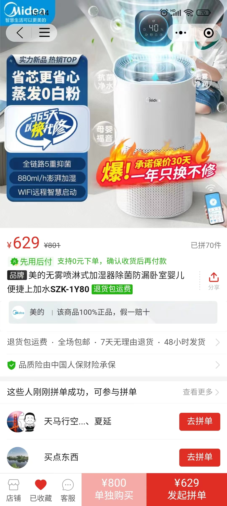
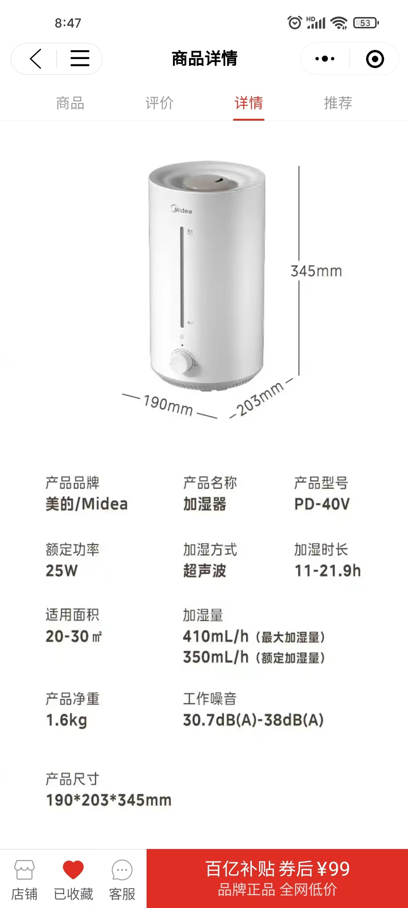
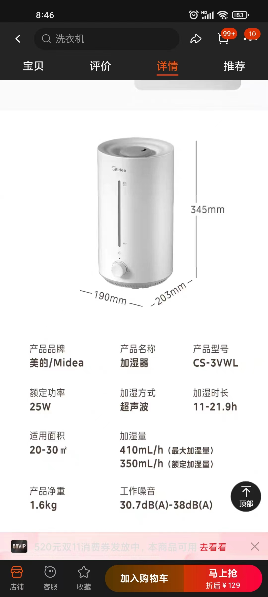
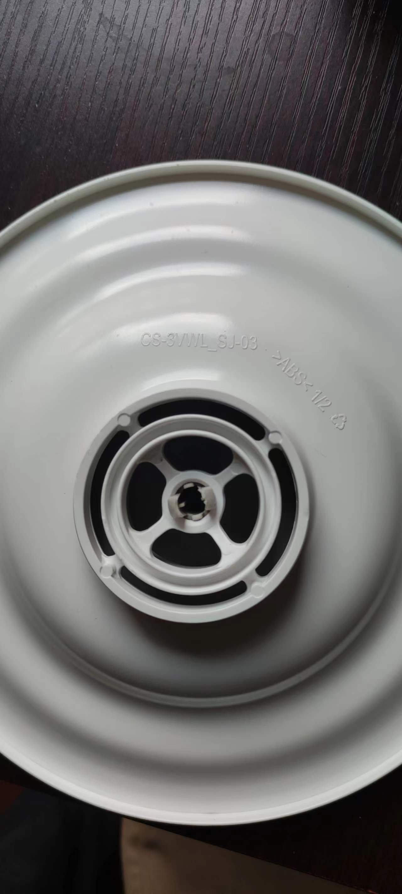
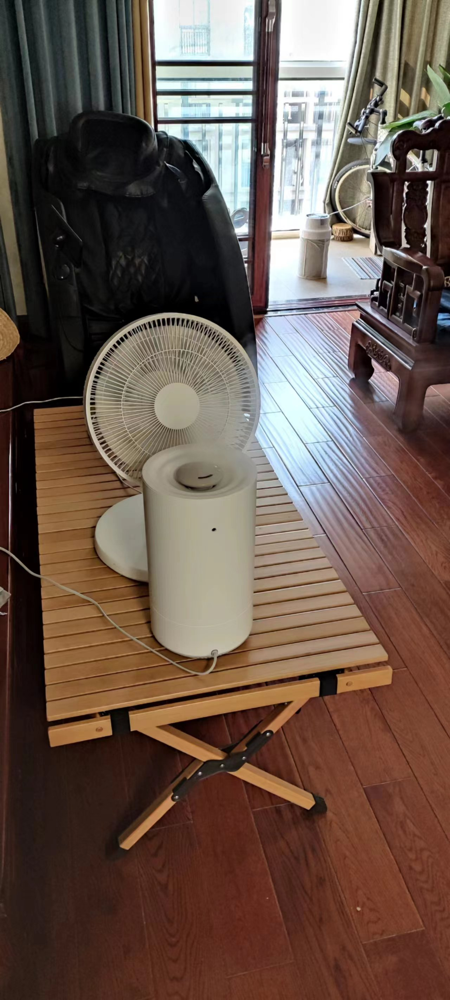

- [只要RO净水机和风扇启动，超声波加湿器、皮肤、舌头、头发就都会好起来的！](https://mp.weixin.qq.com/s/8O_k2MeG83CRnjhRGdFZ-Q)
  id:: 659bead3-35c5-46dc-b02e-87a3422a9e56
- 上一期：[[只要加湿器启动，一切都会好起来的！]]
- 四种加湿器简评
	- 暖气片可以加加湿盒（好像卖得最好的牌子叫“三寿”），但通常不能覆盖所有需要加湿的场景
	- 热蒸发式加湿器可直接用自来水，但功率高、耗电费，取暖可用其他设备
	- 冷蒸发式加湿器可直接用自来水，但风扇噪声较大（如果它是个加载在空气净化器出风口上的加湿模块/“加湿伴侣”，比如小米和华为的空气净化器的，那么虽然这个空气净化器大概率比机箱风扇CRBOX+超声波加湿器的组合噪声大、价格贵，但如果已经有了这样的空净、觉得没什么不好，那确实也可以用，实际上加湿模块还能降噪；但如果它不是空净也不依托空净、新风，那么——你家空气质量很好吗？还是要用空净、新风的吧？何必多一份噪声呢？）、噪声随加湿量增大而增大得较快，设备价格比超声波加湿器高，大空间堆够加湿量成本较高，且使用RO（反渗透）水的滤网会更耐用（“你用过公共浴室的粗糙浴巾吗？”）、少清洗
		- 根据网友推荐，还是推荐个我没用过的
		  id:: 65996fc3-d0a6-4987-b32d-eddd30fa04ab
			- 
	- 超声波加湿器（推荐在拼多多购买美的PD-40V，噪声比别的小，不像有的小牌子虚标加湿量，现在也涨价了，与美的CS-3VWL应该是同样的机器，水箱盖内面上还有后者的标识）可以用纯净水（6升怡宝纯净水约7.9元）救急，但中长期使用建议搭配RO（反渗透）净水器
	  id:: 65996fc3-2866-4586-b752-e2ac910ac817
		- 
		-
		- （“瞧这个拖更”）
		- 
- 超声波加湿器
	- 
	- 超声波加湿器推荐配合风扇使用（USB风扇可能就够了；风扇向水平方向以上吹，空间狭小、人员密集时尽量朝上吹，架在加湿器后时像是植物大战僵尸的火炬树桩，而且可以一次带多个加湿器；还更易定向加湿，其他加湿器不能吧？），以减少水雾落地损失，加快水雾蒸发（喷出的水雾扩散到肉眼看不见后通常仍将以小水滴存在一段时间）、水分扩散（缩小不同距离的湿度差）、湿度上升
		- （上部圆孔是排水口，旋钮和指示灯在另一面，我在卧室用也是这个方向，最小档放塑料凳子上，用一条内裤罩住指示灯；后面风扇是阿尔卡司空气循环扇，799元，噪声小，夏天放背后吹也省空调钱；​在1688买的长120cm的榉木原色蛋卷桌，现在降到280元，目前感觉略有点鸡肋，还没在户外用过，之前在阳台摆拍完了顺手移到客厅放各种东西）
	- 加湿效果不好依次这么做：关门关窗，检查门窗墙等的气密性并用密封条、密封胶泥等封堵，再来一台（如果加湿量没有虚标——量程5kg的厨房秤即可检验）
	- 是否需要易设置的自动化/智能家居？
		- 以下功能常见的两大解决方案是机器自身集成功能和小米、华为、352、美的等的智能家居生态链（以APP为操作中心）
		- 定时开关（下班到家前自动开机工作，上班时间自动关机，避免忘了关或开——忘了的话，家里有人留守也不一定能注意到，毕竟大部分人对湿度变化不是很敏感——注意部分非旋钮/机械机型的加湿器、风扇等电器可能开机后不会直接开始工作，比如有遥控器的加湿器可能要用遥控器按下启动才会开始加湿，可以咨询客服和自行测试）
			- 定时插座
			- 间歇性开机（“你完全可以起来活动一下”）
			- “笑死，加湿量不够，根本用不到”
			- ​“笑死，加湿水用完了就停止加湿了，谁还开超声波加湿器不开风扇湿木地板啊？”
		- 湿度控制（可能叫“智能恒湿”，控制湿度在一定区间内，低于某湿度开始加湿，高于某湿度停止加湿）
			- 很多机器自带湿度控制，但你不一定满意部分机型可能固定的湿度区间（对我来说，50%是高度重视的下限，55-60%是绝对合理的区间，65%是经常忽略的上限——可能因为我没有涂护肤品的习惯，这空气中的水分就成了我的保湿体系的重要组成部分）
			- “凭感觉”（一般而言，在通风的情况下，一个加湿器是比较难够的）
			- “看一眼温湿度计”（公用可以买个大的贴着挂着）
			- “熟练了调好加湿量就不动了”
			- 湿度控制插座
		- 远程开关（更多针对定时开关但一时不回家）
			- 智能/物联网插座（还可实现电器联动，例如将联网传感器数据用于其他电器控制）
	- 使用超声波加湿器的注意事项
		- 安全
			- 雾化片附近温度（用红外线体温计最高测出85度，再靠近超出量程了）高，不要靠近接触（一体式的就没这个问题，想故意开启近距离接触也难）
		- 摆放位置
			- 电源线不够长可以用插排延长
			- 与空净（如果出风吹开水雾的话一般不影响）、口罩等别太近，水雾可能影响它们的净化效率
		- 有水垢时清洗加湿器
			- 加湿器内有明显水垢后，按说明书加入柠檬酸浸泡溶解水垢，使用抹布、海绵擦、杯刷（超声波加湿器导雾管）等擦拭
		- 消毒加湿用水和机器内部（如果水箱等部位不抗菌，也许可以试试）
			- 加入加湿用水前，可对加湿用水充臭氧消毒（“等等，这加湿器自带抑菌功能啊？——你是来找事做的吧！？”），不盖盖（用粉剂、试管和比色卡测了多次，光是堵盖对臭氧溶解效率提升似乎不大，不如省点麻烦）的6升怡宝纯净水的桶里的5-6升水约需500mL/h的臭氧发生器曝气（不同曝气器的效率差别似乎也不大）3-5分钟（臭氧的终点浓度可能在0.2-0.4mg/L之间，低于25度的水温也许会降低测得的臭氧浓度，对生活饮用水而言应该是很够了；建议所在房间开窗通风）
- RO（反渗透）净水器
  id:: 65996fc3-ee8e-4d89-9323-036fef554f7e
	- RO净水器并非仅给超声波加湿器使用，还可改善饮水（有朋友还推荐用更方便的即热式饮水机）、煮饭做菜用水、洗漱洗浴用水等的水质
	- {{embed ((65dc06ad-d1f6-4e5b-ad7b-ac8a900931c9))}}
	- 方案一：加装RO，130元——已有超滤净水器（可能是买厨柜送的——“厨柜说明书上是这么写的，有道理的，并非所有厨柜都要用木材”）的用户可以加装RO
		- 无电小通量方案，即长时间（6升水约50分钟）接水方案
		  collapsed:: true
			- 
			- 
			-  （球阀是后加的）
			- 无泵（电动增压泵；整个方案都不接电）、无桶（压力桶——增压水枪和花洒都玩过吧？压力桶储水，不用手动加压，自来水自带水压）、75G RO滤芯（标准流量是每24小时75美制加仑——美制加仑约3.785升——每分钟约0.2升，属于最常用的小通量）
			- 7楼实测用怡宝纯净水6升桶接水，50分钟差不多装满——真正全家人日常回家后一小时内就睡觉的家庭，可能至少在我们大美镇江不占多数，对饮用水的使用方案应该也有所差异
				- 使用手机语音助手（MIUI似乎只能开一个倒计时——“小爱同学，十分钟后的闹钟”）或拼多多十几块四个的电子计时器（接水一个，做菜至少一个）倒计时提醒
				- 不用来洗澡一般三口之家一天两桶左右（加湿也用水）
				- 淋浴省着点用一遍洗完确实可以用绑带提10升的折叠水桶挂着洗，甚至不用水泵抽水，一根水管和初中物理知识就可以，但天天用自带水压、量大管饱的自来水和花洒的人一般不会去做这种稀奇古怪的事——那么我今天上午又测了下，6升怡宝纯净水桶接近满水，触底放入内径9mm、长一米的硅胶软管，“嘬”通后约2分20秒放完水，训练有素的短发人是来得及洗完的，而且洗后头发好像真的有点柔顺有点DUANG~了
				  id:: 65bcbf47-70c7-4c8d-a215-83623a0187b6
					- [虹吸现象_百度百科](https://baike.baidu.com/item/%E8%99%B9%E5%90%B8%E7%8E%B0%E8%B1%A1/695115)
					  id:: 656b5246-9e5a-4a42-af99-db12f5fc67de
					- （绑带还要再试试别种的，这个弹力绑带是给自行车后货架买的）
					  id:: 65bcbf47-0788-43e7-b789-086929bc82db
				- 泡澡需要的通量/流量大，通常需要管道全屋净水，而且为省钱、空间、噪声等综合考虑一般用软水机而非RO机供水
					- ((6542550f-3b32-4e7d-9e86-764af2c4d21b))
					- [家里不做软水直接做全屋都是反渗透净水。用来洗澡的话，和软水相比，使用起来有什么差别吗？ - 知乎](https://www.zhihu.com/question/440079602)
					- “咱们再来看看接水组的表现”：一小时7升水，用几个可侧面排水的大水箱接一两天（小浴缸妥妥够了），搬水除了用小推车还可以顺带深蹲、农夫行走，浴缸里放“几个”3000W的热得快或用储水式热水器/洗澡机加热，显然也很容易泡上热水澡（或者省点钱干脆冬泳一下，下水出水大喊哈哈、奥利给！）——健身完了泡个澡，合情合理，赢上加赢！
			- 因为讲究洗手、刷牙（不用水杯漱口几年了，感觉为了几口RO水，好像也可以再用起来噢）时尽可能少损伤皮肤和皮肤菌群、口腔黏膜和口腔菌群，所以我用除氯水，这个小通量RO出水慢，所以我在超滤出水口用三通分了两路水，一路到原来的鹅颈龙头，另一路绕到台上球阀再到RO
			- 放台上问题不大，而且不用电磁阀可能不方便控制RO净水、废水两路的出水，所以手动的球阀要放在RO进水口，如果为了“美观”把原本为了用除氯水和方便不弯腰开门拧角阀加的球阀的好处给削了，这好吗？这不好
				- 其实如果原则上“美观”大于“方便”或接电加电磁阀的话，也可以放厨下（有时爸妈也把它放下去）——但现在一天也就接两次水左右，“资源陷阱”，我暂时懒得动
					- （“摆拍一下，干净又卫生啊兄弟们”）
					- 往净水器盖板上一搁，再绕两根管上来就能搞定
					- 要厨下完全关门的话，废水管可以接防臭下水三通/集成排水器，净水管可以在水槽上钻个孔上来（“这里总觉得有点鸡肋噢”）
			- 购物清单（购物车截图见方案二）
				- 方便采购（TDS笔可另买，75G小通量也许可以不买，“舌头会尝出来的”），全快接、插栓方便安装，总价约130元，约等于100升怡宝纯净水，可能两周不到就加湿完。安装不保证十分钟搞定，到处看看盘盘顶多半小时吧
				- 切管刀（普通的不防锈，用后如果沾水可以擦干后用一小节水管或筷子卡在根部蒸发剩余水分）
				- 2分管
					- 一根长管的台上RO方案2米一般够，最多三根长管的厨下RO方案4米一般够
					- 厨下进水三通到滤瓶和滤瓶之间约需50-60cm，滤瓶出水口到台上的一根水管约需90cm
					- 连接中膜壳（“脆皮人别拧扳手时拧伤了”）与小T33的之间的水管4.5cm，这个长度大致能使两滤芯平行，废水口连废水比的3.5cm即可——外丝款小T33实测，可能不完全匹配快接+插栓的小T33
					- “截原有水管的话，很有可能不需要买”
				- 2分T型三通
				- 2分球阀
				- 崧泉快接式1812RO膜壳
				- 75G RO滤芯（一般是买上市公司大牌子汇通，我这原水TDS160左右，小T33出来1-2，我们大美镇江有家惠灵顿膜业，产品性价比可能更高，原水TDS200以下应该可以试试，欢迎反馈）
				- 崧泉快接式小T33碳棒款（我用的是外丝款的，外丝接头拐个弯水管就不用拐弯了；在这选快接式这款，不用拧外丝接头是一方面，但更多是贪相比价格升得更多的水量；RO滤芯过滤后确实比较涩口，而用了后置活性炭滤芯对TDS影响极小）+2个中荷2分L型插栓（可能更方便水管拐弯，试了发现没必要的话欢迎反馈）
				- 子母夹（1812膜壳夹小T33的；夹靠近RO进水口的一端即可）
				- 300CC废水比（固定、不用电、不可调的废水比。也有其他比例的固定的，也有可调的，后者比较贵、用水量不大我就不换了）
				- “6升怡宝”
	- 方案二： {{embed ((654b9e79-5d95-4926-97bb-2b6038f42a0a))}}
	  collapsed:: true
		- 方案三：完全没空买组件DIY的话，淘宝“开泉净水”的成熟方案最低400G 699元，819元上门安装，400G流量妥妥够用，尤其推荐全员赶时间的企业用户
- # 没用到的部分
	- 风速/空气流量、风向（控制不同方向加湿器开机——考虑到空净、新风的普及，可能会比较鸡肋）
	- 需要
	  collapsed:: true
		- 是否需要空气净化功能？（推荐大部分城市）
			- 需要
				- 小米空气净化器2S以上型号（大房间只用一台用pro h或max）+对应的米兽无雾加湿器（）、华为C400+720加湿伴侣（2.9L，可能有点小）
					- [小米空气净化器哪个版本的最好用? - 知乎](https://www.zhihu.com/question/318455005)
					  id:: 65447114-f1fd-45b7-bc6f-aae8eabc8829
					- [2022年空气净化器品牌篇：小米空气净化器所有型号测评分析—2S/4lite/3/4/F1/Pro/4Pro/Proh/X/MAX，除甲醛/TVOC/苯/雾霾/PM2.5/过敏原 - 知乎](https://zhuanlan.zhihu.com/p/492451704)
				- 850+P/N*n
				- 352 H300空净加湿一体机（2500mL/h，不差钱买！）
				- 其他品牌及型号可自行选择
			- 不需要
				-
	- 不需要
	  collapsed:: true
		- 以上和自制/DIY皆可
	- 盖子通常影响出水雾方向和轨迹
	- 减少水雾落地损失，加快水雾蒸发（喷出的水雾扩散到肉眼看不见后通常仍将以小水滴存在一段时间）、水分扩散（缩小不同距离的湿度差）、湿度上升
		- 超声波加湿器确实结构上简单，普遍不加什么够劲的风扇
		- 超声波加湿器的水雾很难在落地前完全蒸发，易导致潮湿/积水（TDS越高，雾滴直径越大、越难蒸发、越易造成潮水/积水；可能对木地板和木制家具有害）和水垢（TDS越高，越易留下水垢）
			- 如果不想落下的水雾造成物体潮湿又不想损失加湿效率（落地就有损失），可以用各种风（空净/新风、空气质量优良的自然风、）以水平以上的角度使水雾远离地面或分散（也能加快水分扩散），USB小风扇即可
				- 架高、放于进风窗口利用自然风吹散也可能有效
				- 挂在阳台晾衣架下
				- 电源线不够长可以插排
			- 用一个廉价（比如塑料凳）或有覆盖的台面，周围地面也覆盖上，而不要用木材等易吸水表面直接接触水雾
	- # 第一个大问题：如何买合适的加湿器？
		- 直接买大牌子（你别说，还真可能正打正着，比如美的的超声波加湿器就不错，冷蒸发式）
		- 看用了各种仪器实测的测评
			- 如何判断评测的可信度？
				- 看是否隐藏了关键数据和相应潜在缺点，更多是拿来学习效率很低的广告贴而非测评
					- [2023年双11加湿器实测：购买加湿器不踩雷，YO、IAM、小熊加湿器、airxh8大pk！哪款更值得入手？ - 知乎](https://zhuanlan.zhihu.com/p/662396302)（在比较热蒸发式和冷蒸发式没有列出功率、计算所需电费对比）
				- 信息不全面，误导价格感知
					- 例如（“欸好忘了要写什么了”）
		- 找DIY文章/视频，因为自己要DIY的“研究员”，大多是花了较大功夫研究过包括评测在内的各种相关信息的
		- 看我推荐（“这下营销号了”）
			- 预先排除了独立（不与其他取暖设备搭配使用）电加热式热蒸发式加热器，因为加热不如空调、油汀、暖气、地暖等，除非你就缺那么点空间摆这些，如果嫌空调出风不干净，可以清洗和过滤（拆机换滤网上的滤棉）
			- 长时间停留的房间有暖气片、暖气管等，且加湿时间与取暖时间基本重合？（主要适用于北方地区）
				- 基本重合
					- 使用暖气加湿器（算是组合式热蒸发）
						- 加湿效果够吗？
							- 够
								- “那就好，那就好”
							- 不够
								- 往下看
				- 并非基本重合
					- 有没有（包括很快有或很快没有）可使用的RO（反渗透）净水器或有RO过滤的直饮水机（“万一公司装了呢？”）？
					  id:: 65437ff6-703f-4f90-aadc-699cc5643d7d
						- 有，且TDS小于20
							- “兄弟/姐妹，把你的RO水给我”——拿水桶水袋装不难吧？一个人家里可能没RO净水机，但十个人、五十个人家里都没的概率就要小得多了吧？算上取水送水成本，加点钱，一升RO水算它五毛至少相比成品纯净水也是划算的——但长期看可能比较麻烦，最多适合体验
							- 可用超声波加湿器，最低60元提供450mL/h加湿量。别的加湿器也可以用，（RO净水器耗材费一年一般也要300元往上，当然不排除买橱柜送或买精装房含的可能），可以延长蒸发式加湿器及耗材寿命、减少清洗频率
								- 标称280mL/h用怡宝纯净水实测320mL/h
						- 有，但TDS大于20
							- 建议更换或升级滤芯等配件
						- 没有
							- 有超滤净水器？
								- 有
									- （“我也有”）我家厨房的自来水和买志邦橱柜送的志邦贴牌、厦门百霖生产的超滤水TDS约150-165
									- 外接RO（“暂不谋求强制改变家人烧开水的习惯，保留使用即热饮水机和平演变的选项”）
										- 如何排除伪需求？
											- 自来水可能没那么差
												- ((65438a01-e164-4676-9f03-9a41c49df81d))
								- 没有
									-
							- 用超声波加湿器和预包装/成品纯净水
								- 怡宝纯净水约1.3元一升，450mL/h、570mL/h每天加湿8小时，一个月140.4/177.8元，成本函数：60+140n、80+180n——搬重物时注意正确姿势，建议转发到“相亲相爱一家人”）
								- 桶装纯净水也可以（宿舍等地可能有供货），但是不要用不卫生的老式饮水机，可以用电动抽水机
								- 蒸发式加湿器在不用空净时（比如空气质量优时）要如何在耗电、噪声、定向加湿等方面胜过超声波加湿器呢？
							- 单独买无空净功能的冷蒸发加湿器我认为是性价比不太大的
							- 软水泡茶炖汤更香
							- 噪声大小
								- 买滤芯+外壳的空净
								- 吸音绵
							- 一年使用多久？
								- 不超过一个月（比如在比较南的南方地区，干燥时间不多，温度也不是太低；）
									- 也可以用冷蒸发式加湿器
										- 是否需要遥控器
								- 超过一个月，甚至可能要三个月以上（比如11月开始就比较干燥，那么对称一下似乎要到3月才能较少干燥）
									- 如果觉得买，建议用