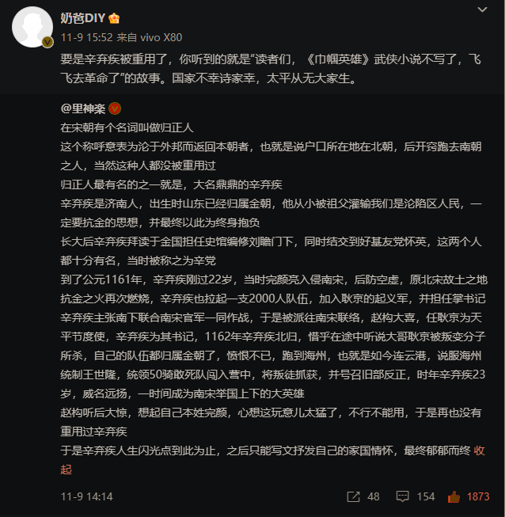

- ((653da952-cda4-4726-b1e3-a5a389f011e5))
- 语用实践的
- 语言之风
	- 当然能，看当前你与风的关系如何，你弱它就强
	  collapsed:: true
		- 你现在在阅读，大概也不在骑车或开车
		- 风对你来说够大时，就算当天晴空万里，你也可能较难注意和欣赏“阳光明媚”
			- 风大时通常气温不高，体感温度更低，穿着衣服晒太阳也不顶用
			- 现在已经不是人力车时代，
			- 骑车时寒潮骤至，没给车换上新衣，骑车时可能光顾着在车上哆嗦，但等红灯停下，风小了些，说不定就比较有兴致看蓝天——“阳光好、蓝天好才是关键”
			- 风已经把人赶进没有UVB的室内，让人至少几小时晒不了甚至见不到阳光了
				- “节能灯能代替日晒吗？”
				- 既然为了挡风把阳光也挡了，那就更要把错过的阳光补回来！
			- 相反，则有
				- “风很大，但是是室外风很大——‘我与狸奴不出门’，嘻嘻”
				- “风很大，同时我要出门，但是防风措施够了”
					- 挡风够了，不影响我，甚至我在家因为门窗密封、适度取暖就没觉得冷，下电梯到地下车库没风吹进来，开车不大开车窗，骑车挡风被也够了，到了单位，电梯上去，空调已经开着了——“我的意识中何处有风？”
					- 今天阳光很好
						- 可以放风筝
	- 大张伟分享的感觉VS内心
	  collapsed:: true
		- 实在论
	- 庄子的天籁之风
		- “风言风语”
		- 列子御风，泠然善也；而御六气之辨
		- ((653fa81d-39cc-4925-88e6-1b2455aada3a))
		  collapsed:: true
			- 以“以言其日消也”注“吹万不同”（“说一千道一万”）
			- ((654a2d13-927f-4c82-bb79-77ef5fa81aad))
		- ((654a28e3-35e9-46a5-80d9-34d518165edf))
			- ## “但是VS同时”·ROUND 2
				- “换我喽！”
				- “今天风很大，但是阳光很好”
				- ((653da952-7041-4ace-8a01-1ad5895efb8a))
					- “不能”可以是对客观对象的判断乃至要求，也可以是对主观态度的选择与坚持
						- ((64631f06-b6a1-4801-b97a-4e32a4fa7c3e))
							- 这句话暂时没找到原创
							- “感觉不重要”
						- “诗意地栖居于大地上”，意味着我们把大地别处的元素的效果视同此处，同一个天地之间
						- 风不需要将阳光打败，风不会将阳光打败
							- 风可以与阳光合作——“风和日丽”
				- 但是不利的因素就是有利的因素
				- 虽然但是，
				- 语言会强化，也会弱化
				- 同时更容易有更多同时，但是则更容易一鼓作气，再而衰，三而竭，它本身就内置了不断压缩、递减的否定性
				- 风光之战需要主体性作中介展开视域
				- 同时，无数的故事在发生，无数的未来在
				- “同时”和“但是”的视角、视域、框架的展开都需要时间，所以你选哪个？
				- “但是”凝缩，“同时”涌现
				- “但是”就是一种“同时”，不要太在意符号/“能指”位置的闻战
				- 因为你久在风中，
				- 我们要有这种同时，同时要在内部有交互和转折
				- 同时永远不是同时
				- 很好VSshugoi
				  id:: 654a2d13-927f-4c82-bb79-77ef5fa81aad
					- ((64a76e73-63a5-47e7-a7ed-152a54b7be06))
					- ((66ade398-0c0e-484c-b78b-c2656a27dfdc))
	- 李清照的鹏举之风（“风休住”）
	  collapsed:: true
		- [戏作：陆游《嘲畜猫》异解 - 知乎](https://zhuanlan.zhihu.com/p/658516811)
		  id:: 65489d31-936a-4b41-9c3a-249a1004177f
			- 辛弃疾在海州
				- 
	- 马良的浪涌之风
	  collapsed:: true
		- 开窗通风
		  collapsed:: true
			- 本文主要内容为推荐开窗通风、使用加湿器等低防疫措施
			- 稀释病毒浓度，减少可能被吸入的病毒载量：
			- 泠风小防，飘风大防，众毒为虚
			- 《开窗通风颂》 #诗
			  开窗来又去，关窗复徘徊
			  初欲排毒瘴，添衫心态螺
			  道理说有尽，微词亦难无
			  风寒非我意，但愿疫线平
			- # **通风**
			  id:: 653366fe-b29d-4251-8a23-d972502b1e87
				- TODO 通风ventilation防感染效果
				- 在学区房开学学生大感染、白领纷纷请假回家等楼栋内感染者较多的时期，厨房、卫生间等连接下水管的房间内可能有较高浓度的气溶胶（这时长时间停留，比如关窗泡澡，就是风险极高的行为），可以在用加水垃圾袋堵地漏后开窗开排风扇，排风扇如果嫌吵，至少用时要开要不要门窗都开着看情况，室内风向合适、空间大就可以开着，实在不行上厕所前戴口罩；另外，冲马桶时先盖盖再冲
				- “起风了，什么风把这篇文章吹来啦？”“什么风把您吹过来啦？”
				- “大部分人都不戴口罩”，大部分人能超脱韭菜的命运吗？
				- 阁下何不同风起，扶摇直上九万里！
					- [上李邕（唐代李白诗作）_百度百科](https://baike.baidu.com/item/%E4%B8%8A%E6%9D%8E%E9%82%95/2806075)
				- “切个题”
					- [中联部举办中国防疫政策专题吹风会！实录来了_北京日报网](https://news.bjd.com.cn/2023/01/07/10292546.shtml)
					  id:: 653db20a-94bc-40c4-87f2-ab91899c74ea
				- 开窗通风的其他理由：午后犯困除了午餐血糖还有二氧化碳浓度
					- 咖啡、茶、巧克力
						- 镁流失，镁缺口扩大，失眠、情绪不稳定、免疫低下可能和程度加重，恶性循环
							- 土壤镁含量
							- 怎样补镁，海产品
								-
									- 生蚝（清蒸蘸醋，堪比蟹肉蟹膏）、大闸蟹
					- 二氧化碳监测
					  id:: 667b89f4-14ad-4bb3-98a2-27cba41a637b
			- 蜿蜒的风道，难以有序通风
			- id:: 65672e7a-fd59-435d-8bf8-137f1518a65f
			  >打开窗子吧！让自由的空气重新进来！让我们呼吸英雄的气息。——罗曼·罗兰《名人传》
				- >我们周围的空气多沉重。老大的欧罗巴在重浊与腐败的气氛中昏迷不醒。鄙俗的物质主义镇压着思想，阻挠着政府与个人的行动。社会在乖巧卑下的自私自利中窒息以死。人类喘不过气来。——打开窗子罢！让自由的空气重新进来！呼吸一下英雄们的气息。
			- 空气质量最佳时开窗通风（AOI逐小时预报）
		- 关窗防风
		  collapsed:: true
			- ## **保暖——温床与温室**
				- 秋冬天冷点一般就可能关窗开空调暖气，然后封闭空间又很容易经由被中央空调“送外卖”交叉感染的风险
				- 如果能穿保暖的衣服（比如高蓬羽绒服、人造棉服、超细美利奴羊毛衣等）、加点挡风板、落地屏风，继续开窗通风，就可能不开（“那就是不买立省百分百咯？”）空气净化器也能降低不小的感染风险
				- 空调降低湿度，
				- 实际情况是，别人已经开了空调，你觉得热，于是脱了外套，或者，你开车开空调没穿外套——而不是把窗开下来灌冷风，大厅里怎么能刮冷风呢？
				- 关窗开中央空调要想保持天气舒适时的同等防疫的环境条件，就得增加空气净化器、空气消毒机等的应用，从而增加防疫成本，听起来可能有点负面对不对？但是不增加防疫成本，就增加生病成本
				- 免费的不用，就得付费
				- 室内风电
					- 空净
					- 你可能不在意，但历史会告诉他们的
		- 行动之风
		  collapsed:: true
			- “你的地球OL有选项冒出来吗？”
			- 风休刮VS风休住
				- ((654973a4-6c89-49ca-a5b0-e19431f6a012))
			- 口罩
				- 口水口气密封条
				- 嘴上拉链
				- 唇上圆环
				- 唇钉
			- 我们放视频时，有不同播放策略，比如选择何种方式播放，是硬解还是软解
				- 硬解（发现不同所指）
					-
				- 软解（确定唯一所指）
					-
			- 从位置着手，或可称之为家风，车风，班风，口风
			- 眼部、鼻腔保持湿润，而非干燥
			- 如果说家里漏点风，无伤大雅，一般也没多少人被吹到，在外就没多少方便取暖的东西了，那从车风更容易看出，毕竟车是要以一个体积千百倍小于家的面目现身的
				- 开车
		- 停车，车风停，阳光暖
		- 风冷冰箱、风箱
	- 符号系统——一切皆流，无物常驻
		- 方言、网络用语、
	- >我心光明
		- “外面大多数人都不戴口罩了，你怎么还戴着，不闷吗？”
		  “我心光明”
		- [【主义主义】“主观唯心主义”（1-3-1-2）——成为“圣人”的最廉价方式，不少聪明人无妨抵挡的诱惑_哔哩哔哩_bilibili](https://www.bilibili.com/video/BV1CN411d7dd)（继续偷偷推未圣，他比我傲得多，因为他远比我聪明，而且视频里说你们是聪明人哩——我知道你们只想听个故事）
	- 阳光的心态
	  id:: 65672e82-0ea0-443b-83a0-72c1937d7d28
		- “因为风大了本身就很令人振奋！”
		  collapsed:: true
			- “风客观上给了阳光压力！”
			- 拼搏进取、不屈不挠、永不言败、乐观向上——“这个是一定要说的”
			  id:: 670d410f-7f80-4c38-bd17-2179a5023081
				- ((624a57b9-24e3-4866-83e3-d1de5aeb6370))
			- 感觉在风口上我们都能起飞！
				- 很多问题实际上是不存在的，我要做一只快乐的猪，不要做没完没了的苏格拉底！
		- 同时心很大
		  collapsed:: true
			- 心能够思考，能够认同
			- 天朗气清，本就容易心胸开阔
			- “强者从不抱怨环境”
				- 自己有意制造的风，那就没什么问题，甚至比较刺激
				- [正能量语录奥利给_哔哩哔哩_bilibili](https://www.bilibili.com/video/BV184411j7Wi)
					- “我也曾在冬天穿条短裤出去赤足跑过几次，我强吗？”
	- “只要心中有沙，哪里都是马尔代夫”、“现实扭曲力场”、“水上乐园”、“i am what i am”、“涤除玄鉴”（细品之下，我认为是可以给它们排序的，虽然可以不唯一，“言之有理即可”，不知“聪明的读者”有没有品出来？——别费时间品了，我自己想第二遍也想不圆），
	- 不太确定以下内容正确性，先随便写写
	  id:: 654f8673-047b-4471-8e9a-17a8ecf02427
	  collapsed:: true
	  1.至少在文章内，陷在了“一个符号/能指有唯一的固定用法/所指”的观点上，换不了，隔不开，断不开——语境结构确定，语用偷跑——“就是写个动态，遇到需要给负面搞正向转折的部分，我也有其他很多方法可选，没必要因为你的一份看似好心而生搬硬套、打乱我先前的语言习惯”
	  2.“心物二元论”，物（包括文字语言符号）（“产生的效果”）是怎样不重要，可以隔开
	  3.语言之类的符号网络生成主体性（，但主体性还在其中受制，仅能断开连接，不甚凸显）
	  4.“大逆势下追寻自由、命令天命的浪漫主义”
	  5.虚构的“真善美”在同一个符号体系中的缝合点上的“屁”面前“不堪一屁”——放在这里也许是为了“螺旋上升”
	  6.从理论到实践对符号体系（“人都没了，还符号体系”）的颠覆性
		- 我可以在1前或12之间塞一个“普通人怎么看”，这是最简单的凑人头
		- “普通人表示我几乎不用但是”
		  
		  “虽说还未到层林尽染，但看暖暖的阳光轻洒，悠闲闲去快乐寻秋，别有一番风味”——除了一则保险广告外，我妈最近的几十条动态里好像就这出现了一个但，还是用另一套方法调整语序绕过了“但是vs同时”
			- 那就可以说，这个词不好，跟它搭配的其他词/内容好，就好啦！
			- 那么就可以有正确积极阳光向上的转折式评论vs白描（隔开）
		- 上大学时有没有学过《高数》里的函数，映射关系还记得吧？没上过大学，“多义词”都在用吧？“（名师、专属客服）一对一（辅导）”“一对多”、多对一、多对多（“P2P，C2C，O2O，E2E......”）难道一个词“呵呵”、一个微信的微笑表情作为符号本身，为了对应多个意义/所指（“你发的这个微笑指的是什么？”“万物一指”）而是多个词/符号/能指吗？难道你的键盘和表情里会有多个看起来同样的微笑表情，旁边附注不同的含义、用法，然后你根据你想表达的情绪，而要从这看起来相同的微笑表情挑最正确的那一个吗？——我们不妨继续假设，如果这就是现实，那么也许在选择表情时表面上的效率会下降外，它倒确实可能“开启民智”，因为它等于从一点大胆地公开了这样一种，那就是即便对应“心情”这种比较主观的东西，对应它的
		  collapsed:: true
			- 线下表情，也就是主要用人脸表露的，也是没有固定用法的，有些令人印象深刻的经典角色，我们会觉得令人忍俊不禁、绷不住，比如乌蝇哥
			- 有种稍微常见的印象，德国人比较严谨，德国古典哲学也很厉害，据说就是因为德语的关系
			- [如何快速理解语言学中的能指和所指？ - 知乎](https://www.zhihu.com/question/356993770)
			- 搞明白这些一下就明白、好像以前就明白的东西有什么用——那你会说话吗？说话完全可以与“只有更会，没有最会”关联起来
			- 那我对叮咚买菜的骑手喊“请放门口”而不是“放门口”（没听清我就说“放门口，谢谢”——“凡事做得别太圆满”），我需要再写一篇鸡汤文吗？不需要了，因为前面已经有了
	- 【【主义主义】形而上神秘主义（2-2-3-2）——手把手教你用哲学识破那些看似精巧的神秘主义形而上学大厦】 【精准空降到 18:44】 https://www.bilibili.com/video/BV17h411U7aA/?share_source=copy_web&vd_source=24175964b0df2fcc2c022cae23517fdc&t=1124
	  collapsed:: true
		- 前两天我的“分风”看着有点像，但是全程把“7”贯彻下去就离谱了
		- 《为什么是7？》
		- “MBTI”
		- 
		- ((654f8673-047b-4471-8e9a-17a8ecf02427))
- 社交之风
- 良好的心态、选择的权利在于不必要的干扰的排除
- 等风大点，凑上去感受下
- 冷热湿燥土气
- 网络之风
  collapsed:: true
	- 交通之风
- 昨天的星空也不错，你看了没？我会让你们有时间看的