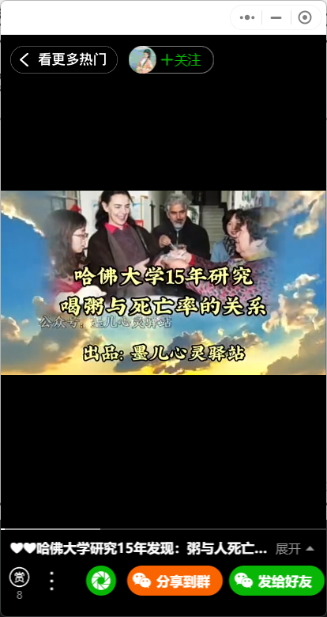
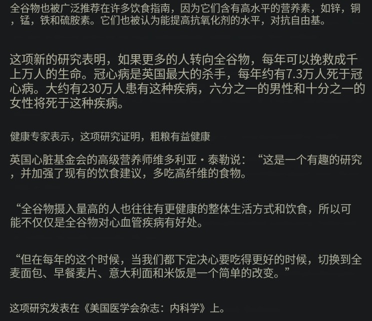

- #早期作品
- 之前看家族群里转发的念稿视频写的草稿，视频来源是微信小程序“票圈”账号“聪明的笨蛋”（公众号“墨儿心灵驿站”）
	- 
	- 
- ---
- 这个视频大致由三个部分拼接而成，后大半段是介绍玉米、南瓜等食材和相应的粥及其（符合时令/“节气/季节限定”的）食疗效果，中间段是中国古代名人喝粥，称，前段是讲了哈佛和中国日报转述了哈佛这个教授的论文，然后再转述一遍评论一下
- 第一部分，研究来源
	- 我知道世上有一些所谓名校顶刊论文是被人编出来的，所以怀疑是否真有，于是先在我常去搜问题的知乎平台搜索，有多篇文章涉及同样的内容，评论区也出现了一些看上去并非全然赞同的评论，但是没找到我想要的答案，接着用搜索引擎搜索，用汉字没搜着，试了几次关键词（“wuyuhong harvard”）搜着了，确实是哈佛的：https://www.researchgate.net/profile/Hongyu-Wu-12
	-
	- 接着找到了这篇她作为第一作者/主要作者投稿JAMA（美国医学会杂志，与柳叶刀齐名的医学顶级期刊之一）的论文
	  《Association Between Dietary Whole Grain Intake and Risk of Mortality Two Large Prospective Studies in US Men and Women/全谷物的膳食摄入量与死亡风险的相关性，涉及美国男性和女性的两个大型前瞻性研究》：
	  https://jamanetwork.com/journals/jamainternalmedicine/fullarticle/2087877
	- 可见，论文的标题是不含“粥与人死亡率的惊人关系！”的
	- 在论文的Results/结论环节截取一小段当作论文的结论
	- >We further estimated that every serving (28 g/d) of whole grain consumption was associated with a 5% (95% CI, 2%-7%) lower total morality（注：此处拼写错误，应为mortality） or a 9% (95% CI, 4%-13%) lower CVD mortality, whereas the same intake level was nonsignificantly associated with lower cancer mortality (HR, 0.98; 95% CI, 0.94-1.02). Similar inverse associations were observed between bran intake and CVD mortality, with a pooled HR of 0.80 (95% CI, 0.73-0.87; P fortrend < .001), whereas germ intake was not associated with CVD mortality after adjustment for bran intake.
		- 我们进一步估计每份（28g/天）全谷物的食用与5%的全因死亡率降低或9%的心血管疾病死亡率降低相关，而同样的摄入水平与更低的癌症死亡率并不显著相关。类似的负相关在麸皮摄入与心血管疾病死亡率之间被观察到，
- 第二部分，粥文化
	- 论文中的“粥”，大概指的是porridge，而它一般意为麦片粥
	- 至于视频标题中的粥是什么，也许通常是水较多、往往还煮得比较烂、更易消化吸收的杂粮粥，是素粥，而皮蛋瘦肉粥这种带荤的粥，可能也主要是在小卖铺（镇江曾有广玉兰早餐车，其中有塑料杯装的皮蛋瘦肉粥，现在早餐车少了很多，金山附近路边看到过一辆，但没见过营业中的；《你家门口的放心早餐车还在吗？》：https://news.jstv.com/a/20150922/1442904914957.shtml）、粥店（镇江有几家来自扬州的绿色吴家粥铺，以前吃过几次，味道还可以，有点咸）、中西快餐店（比如中国的肯德基和麦当劳的早餐粥）里吃
	- 杂粮粥与白米饭，一可能不用大米，二用更多水，三用更久煮更烂——但是今天并非
	- 也可以说问题不大，只是不够具体，但是更确切地说，它说的是全谷物（whole grain），不包括杂粮包括的杂豆，杂粮的范围比全谷物更大（《全谷物、粗粮、杂粮有什么区别？薯类、杂豆类包括哪些？》：https://new.qq.com/rain/a/20220804A02JM400；《五谷杂粮全知道 |全谷物、粗粮和杂粮的区别？》：https://zhuanlan.zhihu.com/p/554060152），而第一项，如果从写文案的角度看，如果要讲究一定的逻辑性，这可能会影响后大半段菜谱的呈现
	- 好奇搜了下“古人喝粥喝的是白粥还是杂粮粥”
	- 古代白米比一般的全谷物贵，普通人全谷物，没有直接的可
	- 有名的古代文人很多并非普通人，可能经济状况更佳，可能本身基因好，又有文化，所以说的话写的诗能传下来，吃粥长寿，也可能有其他原理，我们无法再采访他们
	- 从证明的方式上，可以看出现代科学研究往往采取统计学的方法，队列动辄高达数万人、长达数年，而拿古代名人，则是采用个例的特殊性试图证明某某生活习惯有用的普遍性
	- 再往回推到猜想上，
	- 名人白粥
	- 长寿名人
	- 那么写《食粥》的陆游活了86岁（周岁，下同），高于中国预期寿命79岁7岁，尚属可以，在古代更属高寿，但是这里提到的其他几位有提活了多久吗？
	- 有据该网站称“与科学道理暗合”的“平和简易的养生方法”的张耒活了60岁，苏轼活了64岁，究竟是哪里出了岔子呢？也许有政治境遇，经济状况
		- TODO 而这些因素在是被考虑到了的，
	- 如果要把这几位作为样本平均得算，如果允许用本朝的剑斩前朝的官，三人平均年龄，是不是能得出喝白粥降低预期寿命的结论？
	- 而如果以名人的知名度作为权重，那么是否结论会更负面？
	- 古代观察研究，科学方法是最贵的，看起来很便宜，但当初要逐步获得它，需要很高的成本，不是
	- 在现代科学中，作为证据，个人意见是不顶用的
	- 但是他们不一定是，
	- 怎么不跟百岁老人比？跟平均寿命高的地区比？
	- 如果考虑现代医疗的作用
	- 如果干脆不将古代人物列为样本，那么就回到了现代研究中来
- 第三部分，食物与菜谱
	- 七菜粥，通过谐音讨彩头的方式让我想到了，平安果也是同样原理衍生出的单品，但是由于具有时效性，所以的确是卖苹果的讨到了彩头，因为，所以更多食物能奇妙地组合起来，常见食材可获得性高，不一定算是“打包销售”，但由于可获得性高，所以可能更会让观众感觉“有搞头”，进而转发
	- 那么上传视频的人懂吗？不，它可能是从时间更早的微信公众号文章上抄的视频文案（这篇是从搜索结果中的原澎湃新闻文章下方点“阅读原文”跳转的：《哈佛大学15年研究：长期喝这种加了“料”的粥有助于长寿》：https://www.thepaper.cn/newsDetail_forward_23444853），可能视频上传加加减减，最后选个视频模板包装一下就上传了，就像日常买到的实物商品可能也是好几手货了
	- 实际上，视频所作的加加减减，都没我们想象的那么多，之后我又搜索上一篇文章的标题，搜到了《哈佛大学15年研究：喝粥与死亡率竟有这样的的关系！》：https://www.sohu.com/a/711126841_121124285——在视频开头加了句“”
		- 另外，注意看，该搜狐号发表了2.1万篇文章，像这样的账号（最常见的称呼是“营销号”）中国还有不少，文末标一下“来源：网络，版权归原作者所有”就好了，天底下有这么轻松的事吗？至少写论文没这么轻松，没到引述其他论文的地方，都要打上一个标，附上标题和链接，学术如此严肃，难道生活就不值得严肃对待？毕竟，我们都还要吃不少饭
	- 最后，由于我主要是用电脑看的，所以当我在电脑上注意到视频里飘飘的水印“公众号：墨儿心灵驿站”，然后试着点了下上方的头像——“你也是营销号？”
	- 那么中国日报的原报道呢？中国日报是面向国内外读者的双语媒体，同样是搜英文搜到
	- 文末括号里的“来源：菠萝油八戒”不知为何，编辑似乎也没看出来源或自己的多处翻译的疑点（文中的whole grain大多被翻译为粗粮而非全谷物，但有处为粗磨谷物、五谷，再加上其余几处翻译错误，所以我还有点怀疑它采用了机器翻译，因为合格且正常的人工翻译不至出现如此错误，甚至连是否用了机器翻译都不能确定，是否有故意翻译错，many怎么能被翻译为“所有”而非“很多”呢？longer怎么能被翻译为“更多”而非“更久”呢？found怎么能被翻译为“指出”而非“发现”呢？就是机器翻译也不至于出这样的低级错误——我的心中由是多升起了一丝疑问，而非单纯的怀疑：“这种翻译是可能的吗？它的确是可能的，因为它的确如此，但它是怎么可能的？”），比如
	- 回过头来也发现，它的标题就不甚精确
	- 2015年，全谷物概念可能还不太热门，新闻人也是人，而不一定是对语言敏感的语言学家或爱好者，暂时不清楚如何查询全谷物的中文词源
	- 但
	- 那么中国日报的原报道就是原报道吗？除了上面的“来源：菠萝油八戒”，在文中可以看出含有采访的内容，如果是采访，那么应该会标出采访记者的名字，但是没有，于是我搜了采访内容这段——
	- {:height 648, :width 743}
	- 哈哈哈（华强面对识抬举的封彪的爽朗笑声）
	- 音译汉语人名基本常识译错了，后面一众自媒体又干脆把“（音译）”也去了，服！
	- 算上时差，中国日报的双语文章相比迟了2天9小时，可能编辑就是做这工作的
	- 我没干过那行，中国日报还是事业单位，不“懂行”，不明白他们的KPI
	- 做得不好，学英语都没人拿你的文本学
	- 这时我才注意到，从中国日报开始，只要稍微了解过实际生活中的华人的英文人名及其中译就知道英文人名是名在前、姓在后——啊，我搜了下，并非如此，而是要分情况（《中国人的英文名应该姓在前吗？》：https://www.zhihu.com/question/26071649；此外，我一开始搜就是按中文拼音顺序搜的），更确切地说是英语国家语境的一种惯常，而作为，我们大致可以认为她是根据学术上的投稿规范提供作者姓名，但无论如何，姓名的名的“Hongyu”是无论如何不会被改变顺序音译为“宇红”的
	- （所以这到底是如何翻译出来的呢？）
- 第四部分，懂行
	- 可见，直接拼音、哈佛英文，搜到，翻译网页，就能看出不准确的地方
	- 而我的怀疑行动的经验基础在于了解现代营养学，标题里说的是粥，经常被提及是白粥，而白粥无疑是不太健康的“精碳水”，营养比，膳食纤维，升糖比粗粮快
	- 以及它的叙事方式，没有现代科学的词汇
	- 具体到这个主要是膳食指南以及一些较新的饮食研究信息，同时，我会用电脑，会打字、使用搜索引擎，知道遇到问题除了在中文互联网搜索还可在英文，华人人名可以用拼音搜索，哈佛已经知道是Harvard，
	- 教育的可能结果之一是一种“懂行”，一种“know-how”，一种通常不公开广泛传播的内部技术/经验/“行规”，一种察觉潜在问题的敏感性（包括我在上文在陈述“只要就会”时就本着“真的吗”的态度搜索发现复杂性，以及全文各处临时的拓展阅读，乃至之前就，比如广玉兰餐车那篇是至少前几个月，大概是路过一辆早餐车后搜索到的），农民有农民的懂行——“四体不勤，五谷不分”——论语中孔子认为的务农隐士如此评价孔子（《文史 | 孔子真的“四体不勤，五谷不分”吗？》：https://www.sohu.com/a/406527307_550962），至少可以看出，孔子认为的这个隐士是自信懂他这行的，另外，在现代社会中，不同行业的白领有不同行业的懂行，比如如何应付上级和客户，怎么把不如市场上只要客户愿意就知道的更好的产品和服务卖给客户，不同专业的学生有不同专业的懂行，比如如何应付考试和论文，写论文怎么降重（降低论文文本的查重率），不同的消费者有不同的懂行，比如美食家懂吃，菜用什么食材、配料用什么手法做的......同时，自己知道至少一部分“真相”，也就是“哪里可能有问题”（“这产品和服务不行”、“这论文水得很”、“这百元自助的鲷鱼是罗非鱼，乌鸡卷比牛羊方砖还便宜”），因为“真相”一词本身就蕴含着对尚未看清真相的怀疑，而怀疑本身就蕴含了怀疑的经验基础、识别模式、思维方法等
	- “专业的事交给专业的人”，前提是多少懂行，就算还不能像伯乐能知千里马，也要能知百里马乃至十里马，不能直接看出论文的质量，也要看出转述的质量
	- “哪里可能有问题？”——“菜场买菜一般要送的小葱在哪里？柜台拿饮料吸管在哪里？果盘牙签叉子在哪里？——参考文献，在哪里？”
	- 那么这个论文是第一手的吗？
	- 它采取的指标
- 第五部分，被阻断、被忽视的义务
	- 他们可能并非全为主观故意（包括故意不查证），而只是没有讲究怀疑和查证的意识、方法和习惯，甚至都不会想“没什么大不了”，而是理所当然，根本想不到这个正在运行的理，甚至夸张说大话的习惯也是浑然不觉到了视频制作中
	- 这也是他们的工作，天下有大骗，有不注意的小骗
	- 由家庭供养长过个子、学过知识、上过大学、读过论文乃至英文论文、从而知道遇到有关科学的观点时需要留意“参考文献”的晚辈，并非只有只将通过学习取得的学历和专业资格作为敲门砖转化为工作和货币收入从而回馈家庭的义务，这当然很重要，但至少同样重要的是，还有这么个将自己从学校学到的包括“懂行”在内的知识应用来进行未被社会明确提及的科普义务（请问，以上这些中文媒体人，就这篇论文的报道而言，无论组织内的还是作为个体户的自媒体，哪怕是尽到了对工作的责任吗？），因为从增加家庭收入和减少家庭损失的等效方面，他们同样是有用的，正如人们不光要赚钱，还需要买保险，而通过学习掌握规避风险的知识（包括如何买到合适的保险），就是一种最主动的保险，也许践行这样的义务不利于当今社会中很多产业链的存续和发展，可能会有很多货和对应的互补品（缺了才要补——有没有一种可能，你原本不缺，但可能被别人忽悠缺了呢？）、替代品（“总有更好的”）卖不出去，有些人的收入会下降乃至失业，但社会真正的发展乃至存续正需要这种义务的实践
	- 中国古人喝粥，这个粥是含全谷物的粥吗？如果是白粥，那么它这么说在我看来不太有意思
- 第六部分，信仰一跃
	- [克尔凯郭尔：信仰的纵身一跃 - 哔哩哔哩](https://www.bilibili.com/read/cv11571631)
	  id:: 650edec6-154a-4825-9069-c779f7530329
	- >我们所能有的最美好的经验是奥秘的经验。它是坚守在真正艺术和真正科学发源地上的基本感情。谁要体验不到它，谁要是不再有好奇心，也不再有惊讶的感觉，谁就无异于行尸走肉，他的眼睛便是模糊不清的。就是这样奥秘的经验──虽然掺杂着恐惧──产生了宗教。
	  我们认识到有某种为我们所不能洞察的东西存在，感觉到那种只能以其最原始的形式接近我们的心灵的最深奥的理性和最灿烂的美──正是这种认识和这种情感构成了真正的宗教感情；在这个意义上，而且也只是在这个意义上，我才是一个具有深挚的宗教感情的人。——[爱因斯坦：我的世界观（全文） - 知乎](https://zhuanlan.zhihu.com/p/269704503)
	- 科学研究到生活实践中间是有信仰的一跃的，就像蹦极的人，团建时让大家围一圈抛起接住的人，或者更轻松点，坐跳楼机、过山车的人，下水放开游泳圈游泳、没在水池埋过头的人，因为他们相信这样的保证，这对他们至少是无害的，不会像视频中能看到的那样动辄游乐园机械故障把游客倒挂半空或绕轴旋转，而是甚至非常有趣甚至刺激
		- 而对科学结论的第一人称的实际生活应用，则在于对科学保证的信仰，对小时候可能想成为过的那种科学家的信仰，对高于个人（无论多少个人）意见的世界的规律性、有序性、稳定性的信仰，甘愿撇开熟人网络冒被旁人当傻子、不开窍的代价
		- 可复制性、可重复性
	- 如果我们不光把转发养生等领域的视频看作对家人的关心，同时希望家人真的能够受益，那么如果参考论文，暂且相信它所呈现的相关性大概率就差不多是因果性，或者至少该试试，从而对饮食进行调整的话，每天28g全谷物，如果搀到大米里一起煮，但不是煮粥，而是煮含全谷物的米饭，作为一种改良，那么假设成人每天吃两顿共120g米饭，28g占这120g的23.3%，实际的比例算是比较高了，我家的比例可能顶多5%，所以可以先拿几顿饭试试看能否适应、在消化等方面是否比之前只吃白米饭更好
	- 《BMJ发布PURE研究近15万人队列成果：精制谷物与死亡率升高相关》：https://zhuanlan.zhihu.com/p/350435588
	- 精制谷物定义为去除麸皮和胚芽的小麦谷物产品或面粉，纤维含量低；这个分类下的食品由精制（白）面粉制成，包括面包、面食/面条、早餐谷物、饼干和烘焙产品/甜点。全谷物包括两类形态，一是完整包含谷物所有成分的面粉，由小麦、黑麦、燕麦、大麦、玉米、高粱、荞麦等制成的面粉；二是完整或碾碎的全谷物。
	- 研究显示，中国的精制谷物摄入量最高，其次是东南亚；南亚地区的白米摄入量最高；非洲地区的全谷物摄入量最高。
	- 大米在PURE研究中问题不大
	- 《坚信的膳食观念可能错了？柳叶刀PURE研究冲击膳食指南！》：https://zhuanlan.zhihu.com/p/28942298
	- 另一个一跃，就是让大家跟自己一起跳
- 第七，承诺与展望
	- 世状燕麦片
	  id:: 66db8aaf-6746-4dd2-b613-caa3051c160e
	- 白藜麦，南美产的好像比国产的品质好一些，已水洗去除了更多影响消化的皂苷，而淘米比较难去除
	- 论文最终版本的日期是2015年3月，彼时我尚未进入大学学习，但并非进入大学学习了将近四年后，我就不被人忽悠了，一方面有缺乏在具体的大学框架下学习的动机的原因，另一方面社会仍是一座更大的大学，我最近一次比较认真、量较大、公开发表的“新闻调查”，还是给新冠药物伊维菌素正名，同样揭示了媒体的不可靠
	- 没有任何媒体（包括自媒体）能代替我们采用合理的怀疑方法去保证直接（通过那些媒体）获得全部的真相，包括我比较爱用的知乎平台，在伊维菌素问题上，我是怀疑有人收钱差评的，而非只是因为认为自己很专业而过度自信，就连我关注的知乎用户，似乎每隔一段时间，都发现他们在不同问题的态度上与我的并非一致——但这些我仍不妨假定为真知的来源，当你的阅读队列里不再出现异见，你倒该真开始为自己的认知环境担忧了。我目前的写作，可能是受德国古典哲学/观念论的一位代表人物、哲学家谢林在其早期著作《先验观念论体系》中对观念论的构造方法，恰恰是从相反方向，一定程度上，也像是《中庸》的“执两用中”
	- 大学毕业后（提前交论文答辩完走人），7年半过去了，尤其是近一两月，我领悟到了这个义务，或者说更高大上点，具体的历史使命，就在于优先带领家庭、家族，因为现实地看，人们的确是最优先考虑血缘纽带的，与其说这是什么“亲疏有别”、“自私的基因”，不如说是一种“作为社会共识的（避免浪费的）资源配置/自组织的默认顺序规则”，与其全都原子化各不懂各的，不如先从家庭和家族互相懂起来——而近期才有的猜想正是，社会是期待原子化的，尤其是搞房地产收税的国家，那么家庭和两性矛盾就可能被有意识地激化乃至无中生有地建构起来，只是很多人还没有这个跨领域的“懂行”，认识上没到就这些领域的日常现象大胆假设小心求证的阶段
	- 同样，由于绝大多数人都有家庭和家族，如此的实践和经验的总结就很可能具有可复制性
	- 我有信心，在一年之内，将我目前掌握的与生活相关的知识分享给大家，
	- 新冠感染后两到四周内心血管事件风险率是平常的数十倍
	- 什么样的饮食能够预防新冠？
- ---
- “说”粥养生是因为它不是平时吃的饭？
  id:: 66207e7e-7bfa-4ce0-ad97-7126a0191fa1