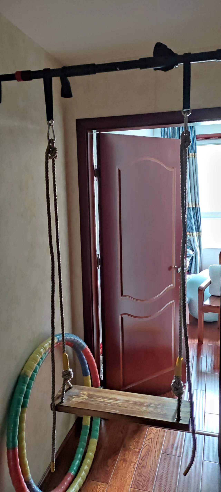

# 同志，你疑似有点太城市化了，得改一改，不然以后得吃大亏
- 娱乐化、渐进、参考考古和仿生的运动
- 为什么现代人类社会（差不多）总是培养不出不用手机电脑等电子设备也能玩得很开心的（成年）公民？（仿“钱学森之问”）
  id:: 66ade373-450c-4d5b-994b-c3d13b8dfef8
	- 只有手机电脑，不会加上家长不让花他们的钱网购玩具——所以只会玩手机电脑游戏（？）
	- 玩手机电脑游戏“隐性剥夺”了其他乐趣
- ---
- “本能运动”：MovNat、动物流（以及类似的五禽戏、形意十二形等；“我没说是人类的本能”）等
  id:: 669c6f67-0fd0-4881-8731-a69e27ccc6ef
  collapsed:: true
	- 这些几年前就听说过，但也是没怎么学过
	- 用城市化的器械也可以做到
	- MovNat
	  id:: 669c6f67-daa4-4d38-8f0c-1bbae5c3dab1
	  collapsed:: true
		- “Move Naturally——这下看懂了”
		- [The Practice of Natural Movement | Erwan Le Corre | download on Z-Library](https://zh.1lib.sk/book/3698979/c520b4/the-practice-of-natural-movement.html)
		  id:: 669c5360-5d03-431f-929e-7e301238fbfa
			- 看得出来学/融合的同行挺多，但提及的同行不多——当然（我了解的人更是不多，比如较多提及的Gray Cook），前半句似乎至少能保证这疑似基于一部分“演化想象”的运动体系的“实际效果”并不差
			- 标志性器材：“树枝（branch）666”
			- 器材用得比动物流多？
			- 协作劳动（抛掷传递重物）
			- 功能，我们需要怎样的功能？坐在电脑前的功能？那么从具体应用场景出发寻找可能比较低效？
			- 专项运动在实用性上的低效，跑步等
		- [How to Incorporate Natural Movement with other Training Modalities - MovNat: Natural Movement Fitness](https://www.movnat.com/how-to-incorporate-natural-movement-with-other-training-modalities/)
		  collapsed:: true
			- https://www.movnat.com/wp-content/uploads/2019/11/movnat_tree_graphic_diagram_progression.jpg
			- >Next, it’s **very important** that you “snack” movement throughout the day (check out #movnatsnacks for inspiration). This is literally 1-5 minutes of Natural Movement at a time.
			  It may not seem like much, but even 1 min x 8 times per day x 7 days per week x 365 days per year = 2912 min. That’s just over 48 hours of movement. See how it adds up?
			  Your body will collect the goodness!
		- [MovNat日常活动度训练_哔哩哔哩_bilibili](https://www.bilibili.com/video/BV15o4y1F7F5)
		- [自然训练 MovNat Follow Along Mobility Practice_哔哩哔哩_bilibili](https://www.bilibili.com/video/BV1Lp411d7nD)
		- [人类的143个本能动作_哔哩哔哩_bilibili](https://www.bilibili.com/video/BV1Hp4y1y7RE)（每天学10个，半个月至少学一遍，学5个，一个月至少学一遍）
		- ---
		- TODO “中华本格自然运动”
		  id:: 68980f92-01eb-42a3-b7c9-27c36a287b74
			- ((6895e1b7-9fed-444c-8c7b-4583c7e248bf))
				- “什么？你那地方的农夫行走没有挑扁担的？！”
				- “铁山靠”
	- 动物流
	  id:: 669cbc36-9074-4845-bfa3-6ff029b783d9
	  collapsed:: true
		- ((669c5036-3c66-4948-a9b8-3608ba6c591d))
		- ((669cbd3d-8f8e-4851-abfa-3ef47390c5fb))
	- ((668ce769-d3b9-40f9-b221-e02732d24960))
- ((68eb4650-1baa-4364-b2a0-50001be52247))
- 跑酷
	- 城市就是健身房
		- 自然训练法则
	- [让红牛看了都不敢赞助的男人_哔哩哔哩_bilibili](https://www.bilibili.com/video/BV1EVtRzgEf8/)
	- 冲 ((68eb466b-1b17-4cd1-a33d-363f1c5defab)) 也是跑酷
- 快闪游戏
	- >前阵子的想法是把快闪游戏大众化，拓宽社交空间
	  能让陌生人在公共场所不尴尬地参与的
	  可以分层，先有大众基础（
	- 快闪游戏，大庭广众下不失态地快速匹配你的玩伴
	- ---
	- 旁观甚至不旁观的NPC
		- “我又幻想了”
- ((66095541-fd54-4170-8d30-9141b2aa3f70))
- ((65d14aa7-1f32-4259-86ef-953db78399eb))
- ((65ea6b28-028b-406d-acaa-5eb1259c021a))
- ((630ddc7a-a4b8-4a60-9fd7-dc20f25739a8))
- ((668ce754-8b71-4712-acd1-cc458b8726ea))
- [[导引]]
- [[原虎鲸计划细目]]
- [[体技心]]
- ((668ce771-c7db-4f9c-ac8a-5d17c00d66b3))
	- 偷偷做家务
- ---
- 不要压抑或许被认为是神秘古怪的生命冲动/激情，冲动来了，兴奋了，兴冲冲了，一定要（首先注意安全）跟随行动释放！
	- ((668ce769-8356-44bf-b6a9-3a96f41726f5))
	- 甚至为了效率，你需要有意识地坚持与你目前的生活模式闹别扭！
		- [[魔怔人心态构件大品评]]
	- “阿克曼！”
	- （尤其在美妙[[音乐]]、“好消息”、睡眠充足等的加持下，）你也可以相对很自然地打出类似“松裹（一说是“活”，但我认为结合[[筋膜]]等作答，“裹”也是对的）弹抖闪电鞭”的“自发动功” [[20241212]]
		- ((668b545f-f4d5-464f-abd3-3668e5575131))
		- [Irgendwie, Irgendwo, Irgendwann - song by Jiyagi, Kontrollverlust | Spotify](https://open.spotify.com/track/1W4YaZtgtVXTGuPBLO3DIv?si=17b97335c1714b19)
		  id:: 675a6766-af16-4d32-a1cd-b23bede4824d
		- ((67402ac7-b47d-4e14-8517-3fa578246ca8))
- 但，不在争强好胜者（很多儿童）视野内展示请勿模仿行为
- [[眼]]
  collapsed:: true
	- 看不见
	  id:: 66a5b9e2-d42f-4abd-9a98-f314dced68aa
		- 交通时不要乱来
		- 往往显著增加平衡类运动的难度
		- [《超越百岁》配套动作——闭眼平衡（中字）_哔哩哔哩_bilibili](https://www.bilibili.com/video/BV1GgGNeREcm)（相比单脚独立，可能更切近实际走路时的步态）
		  id:: 66a740b6-6a8f-400b-b108-88b0501c1deb
		- ((668ce775-74f3-40d3-91ca-3519a9f34cc3))
		- 关灯
			- ((66a4274c-5ef3-4e6a-a3d0-326b227804e0))
			- 黑暗环境捉迷藏、做爱等
- （从树上下来后也要重新掌握立体机动能力灵巧、更赶时间、至少更多姿多彩地）赶路
  id:: 67eb281f-a0ce-4202-9832-d9e024cf47dc
  collapsed:: true
	- ((66ade36f-a813-470e-a4a2-914db121de60))
	- “臂幅鉴”
	  collapsed:: true
		- 用两手分别比划比划你可能很常用的两种姿势（可以在镜子前“无实物表演”）：一只握架手机（不用对着镜子挡住脸那么高；对了，不专门这么比划的话，很多人其实是低头握手机的，这样就更低了）、一只手架在桌面抵着键盘或握着鼠标——你发现了吗？这大概就是你的左膀右臂的（主要）日常（偏静态）最高水平了
		- 小学之后，可能就不怎么主动举手了（“老师！老师！老师！我！我！老师！我！我！我！”）——“回答对了没奖励，回答错了可能有惩罚？”如果有这种潜意识，那它对上课举手这一动作是否有负向强化？
			- ((6667ab34-643c-4b2c-97cf-e4e5db42dd33))
		- 体测完了还练什么球和引体向上吗？
		- “懒”腰还伸吗？每天都坚持伸吗？伸得长、伸得直、伸得持久吗？
		- 往高处走吗？电梯按钮按几次？走楼梯扶扶手吗？不扶的话只是因为觉得脏吗？
		- 如果平时无论为了“健康”还是“赶时间”快走甚至跑步，手臂的运动幅度都能超出前述静态姿势的，但显然不能保证所有人都如此
		- 这样你“年纪轻轻”就肩关节灵活性差才“正常”，更别提看到不太算得上“年纪轻轻”的人们练有点像是要立定跳远但是欸没跳的“平甩”之类的“古怪”动作会觉得不“正常”
		  id:: 66a7091c-6ccf-4e3d-aa93-ec02fc416231
		- 哪个更怪呢？大爷大妈的平甩还是柏拉图甩手、通背拳摇臂、相对直上直下搞折叠的引体向上、体操运动员在单杠上的翻转还是公园里比婴儿更庞大的爬行者？（“Creeper？”）
			- {{embed ((668ce77c-c714-41a1-9e40-a6ae88c5ab70))}}
	- 用手之外的部位（一般是“下位替代”）
	  id:: 67eb281f-92fa-4c06-a3aa-ee8a89325b61
		- “这就是街舞！”
		  collapsed:: true
		- 体侧（能直接推、撞开的“铁山靠”）
		- 脚
		  id:: 67402ab4-6df8-4117-a682-36950f788636
			- 搬东西时肘也碰不到门把手或电梯按钮怎么办？用脚开！
			  id:: 66a7181c-0483-4500-aa60-7821b470d153
			  collapsed:: true
			- 注意落脚安全
			- 避免地面、足底湿滑时开关（比如刚淋浴完脚还没干就出来关灯；尤其是可能触电的，脚湿时插排开关就不要按了、插头就不要拔了）
			  id:: 679add3a-ee00-4ac0-b0bb-be8e71b0b24e
			- 练几次 ((66385cde-9dd5-44f6-abee-28a14ac8135b)) 后明显更稳更快更准
			- 可能是7月中旬或下旬开始练的，差不多三个月，已经相当稳、快、准了，基本赶上手了 [[20241015]]
		- 肘
			- 推拉门开一两个“身位”（“走窄门”），顺利转进后肘抵门把旋转关门
		- 手（但是爬行中 ((66a70418-04f6-4d2d-9d49-f7014bafe512))）
		- 膝 [[20241017]]
	- 室内（“房子就是健身房！”）
	  collapsed:: true
		- 开关门窗
		  id:: 67bd16ab-aedb-49ca-b689-b83712f2ab8c
			- ((67402ab4-6df8-4117-a682-36950f788636))
				- “我的门把脚呢？”
				  id:: 67452219-ad12-4cb5-abf8-a7ba3cf3fa78
				- ((679adcb2-c4b6-4650-8037-fe85f48400a7))
			- 旋转滚动（比如贴在推拉门上转体）
		- 按开关、按钮等电器
		  id:: 679add3a-2354-42e7-a194-2dbe2f073473
		  collapsed:: true
			- 关灯等动作（也）是为了“保护地球  母亲（和她的孩子们）”
			  id:: 679add3a-449d-4f5f-9b4f-f63a8971b807
				- ((66a0e78d-5633-4ebb-b7fd-a82b01d110c5))
				- 开灯的次数越多，关灯练习的次数就越多
				- 有时不爱人造照明不爱开灯，练习的次数就少
				- 在此，我要特别感谢电费很高“年轻人不找工作白居不易”但是自己不省、碳达峰爱好者、历史罪人、我的家人——陪练！
			- ((65f78b91-757f-430b-8996-d7ae97e6cb42)) 开关（难度较高）
				- ((679add3a-ee00-4ac0-b0bb-be8e71b0b24e))
			- ((66ade371-0e26-4122-aa07-40dea22f2162))
			- ((685a79ec-74bc-4e74-b46f-b4ad0b22f1c9))
			  id:: 679add3a-1524-4b33-be74-364fca40c96c
			- ((679c07e4-4e05-441d-abb4-f2da26131384))
			- 显示器
		- 按电梯按钮（抱着一摞东西时懒得先把东西放下即可）
		  id:: 65c9cd5a-009f-4169-9a93-ff058a279b49
		- 提物
		  id:: 66aed830-2865-4a46-98d7-244e2549c1f0
		  collapsed:: true
			- 提提手（手提袋、包包、箱装常温奶等）
			  id:: 66ade373-0a6e-446d-a777-efce7466ad9e
				- 脚
					- 另一只脚可以跳跃、旋转移动
			- 无提手重物
			- 杠杆
		- 使用遥控器（“谁用手谁是小狗！”）
	- 用体侧
	  id:: 669c6f67-9531-4aff-a05d-84792ff45aac
	  collapsed:: true
		- ((66a704c3-39b3-47f5-b3ee-7a8c8c0d3116))
			- 对厨房等房间的灯开关，可以身体在门后，屈膝把腿脚绕过墙，可以参考对面瓷砖上的倒影
	- 成就
	  collapsed:: true
		- 关灯/光菩萨：养成随脚（或随手，爬行中——也可以用脚）关灯的习惯，同时，劝导身边人节约用电
		- 用脚关 ((67402ac6-28c9-48b7-9494-fe71ca23ee5c))
		  id:: 681f57c8-0627-495f-96c9-53c0865c5b2b
		- 油烟机：用脚开关油烟机
			- 第一阶段：注意防滑、不碰到锅碗瓢盆储物架垃圾桶扫帚等（先拿一边去），“体侧线不要绷住！”
			- 我目前用手扶着腿能够到
		- 高脚杯：用脚提高杯子喝水——“高脚高脚，这水瓶就太高了，谁家高足？”
			- 第一阶段：在床上用脚趾抓握、提起空水杯把或杯边，用手接走
	- 用（平地）走路之外的姿态（“重新上树！”）
	  id:: 670d40d6-6ac6-4e1c-9cd4-cb25eb816832
		- 水平面（地面、床面）
			- 床上不动下半身转身摸手机
		- 爬行
		  id:: 668ce769-d3b9-40f9-b221-e02732d24960
		  collapsed:: true
			- “山里灵活的狗！”
			- [「Strength Side」爬行最基础的7个动作—人人都该做_哔哩哔哩_bilibili](https://www.bilibili.com/video/BV1ih4y1A7xz)
			  id:: 669e2e35-d0d1-4a47-9c33-187fdd21972f
				- 这些动作并非很基础，比如如果感觉手支撑较少的猫爬和鳄鱼爬对膝关节压力较大，青蛙爬对脊柱、腰背压力较大，则先练习其他基础
				- 不用一次全学全练
				- 缩短步幅可以降低难度
				- 鳄鱼爬难度大，容易忘，不带手机练前多学学
			- [由于我一直爬一直爬…越来越像猫了_哔哩哔哩_bilibili](https://www.bilibili.com/video/BV1kg411D765)（用来看的，不建议初学者直接模仿）
			- [中科大学生猩猩模仿—表演课期末考试_哔哩哔哩_bilibili](https://www.bilibili.com/video/BV1fe4y1T7un)
			- [我不想被同情，我可以爬。_哔哩哔哩_bilibili](https://www.bilibili.com/video/BV1iRQmYAEke/)
			  id:: 67f7390a-3283-4eb8-9a7d-bdf8c93ec4bc
				- “我们必须想象克里斯蒂娜是幸福的”
					- ((66a41ac0-4d2e-4973-b301-38b43d46adf3))
			- 在光天化日之下、大庭广众之间（乃至之下）爬行，毫无疑问是一项不需要任何口号的无与伦比的智性运动
				- id:: 66aaef1d-0361-45d1-a13b-0c78ba0f609c
				  >这两天没晨练，刚才惩罚自己到小区大草地连滚带爬了，草地有点扎，扎不多得乐
			- 在小区地面练爬行与练瑜伽、站着打太极有多大区别？可能爬行更加动感，也是现代人日常遗忘的一种运动模态，小区还不比公园，更远离“公共空间”
			- 初学者避免连续大力爬行，比如连续蛙跳、连续翻滚，以免手腕受伤
			  id:: 66b55460-ee82-4c00-ac45-f3c12e8bc948
			- 观察、体验动作的稳定度
				- 可以借助目视前方、镜象
				- 可以在背上放个不怕摔下来的东西
			- 软地
				- 比家里的硬地爬着、滚着柔软得多
				- 草地
				  id:: 66aaf629-f994-4b01-8711-d73c333d465b
					- 安全着想，每次先用脚或其他工具探一下较大的风险
					- 如果草地不是很平整的草“坪”，可以尝试走相对稀疏或稠密的路线
					- 注意避开狗屎等杂物
					  id:: 66b2c5b7-e035-4e64-a4f8-daa4ccd01a68
					- ((6688ce78-c1f6-4474-8908-cbc7abd8f751))
			- 躯干稳定不晃，离地时触地肢体继续参与动态平衡，手脚同时落地
			- 人爬道
				- ((679add5c-db4a-43e6-81fe-34ac8047c7fd))
			- ---
			- 猫爬
			  id:: 67402ab4-0b5c-4b5d-a61a-f5ddd51a0c98
				- ((65e9c3f1-211d-4363-b9d3-e7fed2fd368c))（“但不能以牺牲动作质量为代价，至少保质保量了再撒开来”）
				- [跑酷教学-基础篇章-猫爬+爬杆（在家也能练习的爬行动作哦）练完记得评论区打卡哦_哔哩哔哩_bilibili](https://www.bilibili.com/video/BV1BE411t7Sn)
				- [【八大黄金体态减脂动作】第1式：跟我一起学猫爬_哔哩哔哩_bilibili](https://www.bilibili.com/video/BV1ab411h7wq)
				- [这是我见过最好的猫爬_哔哩哔哩_bilibili](https://www.bilibili.com/video/BV1ct411r7QT)
				- [核心训练经典动作：特别像猫🐱的熊🐻的爬！_哔哩哔哩_bilibili](https://www.bilibili.com/video/BV1tg4y1i7FW)
				- [「Strength Side」熊爬的好处_哔哩哔哩_bilibili](https://www.bilibili.com/video/BV1Y3411d78u)
				- “我们一起学猫爬”
				  collapsed:: true
					- ((65c6ff25-5b55-4b45-884b-092858872f50))
					- 可能类似全谷物的思路，爬等非步行姿态可以占五分之一以上
					- 而祖先很多也需要伏击、卧倒
			- 蟹爬
			  id:: 66bc038a-1ebc-4408-952f-ee37607b2e7c
			  collapsed:: true
				- ((66286624-e988-4ad5-bb1a-819803d05783)) 等坐地动作后可转为蟹爬
				- 与猫爬大致对称
			- 倒爬（往后看是有新鲜劲的）
			- 快爬（速度快了也是有新鲜劲的）
			- 边爬边滑
			  id:: 6770bc3f-454c-48c7-91d1-eb41e4b77a22
			  collapsed:: true
				- 穿拖鞋爬发现的，或许以前也发现过——前一会儿想的是 ((67402ab4-f828-4bf7-89a8-d69c82b610a3))
				- “你的平板支撑有点僵化”
				- 也可以用脚爬，用手滑，也可以混合
			- 举手
			  id:: 66a70418-04f6-4d2d-9d49-f7014bafe512
			  collapsed:: true
				- >先天悟了圣体白天发现了三个比较有趣的新动作：倒熊爬、熊爬举手关灯（想到之前看的movnat单个动作）、闭眼坐瑜伽球不触地平衡（今天是加回了手降低点难度）——经由这本晚上想到重新下了次的老书回溯 [[20240729]]
				- 拉起（如果在较低位置）
			- 转向
			  collapsed:: true
				- 腹背朝向翻转
				- 手脚靠近但是转向 ((66a70412-b1c2-4934-b33c-56aec15f915d))
			- ((66a7918b-aa4f-4cbb-9b22-4e26cc3b3571))
			- [爬行健身是否科学？ - 知乎](https://www.zhihu.com/question/20648733)
			- ((65bcbf46-c5d9-48a7-9a9f-b1d2c2d5de8d))
			- [【锐博康复科普】爬行治腰痛？你真的爬对了吗！ - 运动康复陈老师的文章 - 知乎](https://zhuanlan.zhihu.com/p/612243063)
			- TODO 可能有助于耐受类似的骑自行车的姿势、增大操控力？
			  id:: 65f852f9-0bc9-4b56-bf3d-6989db1229d0
			- 注意事项
			  collapsed:: true
				- 快爬时可以戴护具，头盔、护膝等，注意避免（“顾头不顾脚”）在墙角拉伤脚趾
				- 起身时注意头不要撞到桌底、桌边等，可以提前点起身
				- 防滑
				  id:: 679add3a-fa9b-4369-8227-2db83c6f6fc4
					- 露出足跟可能就够了
					- 蹦床袜
					- ((679add3a-95ab-4941-ac3a-5a7967893be1))
			- ---
			- 爬上床等
		- 爬坡
		  collapsed:: true
			- 足背不屈
				- 爬楼梯
				  id:: 65558df4-0822-4a5f-a669-658b067dcfe6
				  collapsed:: true
					- {{embed ((6664fc71-22b3-4bc4-941f-a349ebb8c173))}}
					  id:: 66123fce-5769-4c4a-bd28-5c3574478f9b
					- [Gluteus Maximus Activation during Common Strength and Hypertrophy Exercises: A Systematic Review - PMC](https://www.ncbi.nlm.nih.gov/pmc/articles/PMC7039033/)（step-up）
						- 一次爬几级台阶
					- “那么深蹲呢？”
					- 倒爬楼梯
					  id:: 66b07334-8847-49ca-9fc4-9dbf09b01b54
						- ((66ade373-0aea-4c94-a415-32b66aa63f7f))
						- 一开始还是站着、扶扶手
						- 脚可以逐渐转向
					- 带领家人一起爬楼，不行就自己爬
			- 足背屈
		- 攀爬
		  id:: 66ade373-b0fb-455b-8945-32cdd43d3970
		  collapsed:: true
			- >家里的撑墙单杠有点靠天花板，还是要出去，很实用的技能，游戏里都需要攀爬
			  游戏人物还是有点蛇皮了，一点点高就爬不了，能力很不平衡——《观双力臂》
			- “城市屋顶跑酷”
			  id:: 675464bb-4acc-4a6e-82f8-769250ca0d5e
			- 超市商场等的自动人行道运动
			  collapsed:: true
				- 箭步蹲、髂腰肌拉伸
			- 用各种“双杠”（比如稳固的椅背、桌面、板凳面等）撑起身体
			- “这客厅、这包厢/KTV有这么大的沙发，这不得狠狠爬一爬？”
			  id:: 679add3a-f56a-4662-a287-7cf55929fa58
			- [男孩在家徒手爬光滑墙壁,上蹿下跳如履平地,网友壁虎游墙功_哔哩哔哩_bilibili](https://www.bilibili.com/video/BV1hh411k72E)
			- [会爬墙功的小孩，像壁虎一样，真是厉害！_哔哩哔哩_bilibili](https://www.bilibili.com/video/BV1fs411J7x6)
			- [广东河源 ，5岁小女孩爬墙如履平地！妈妈：从小就爱各类云动。_哔哩哔哩_bilibili](https://www.bilibili.com/video/BV11B4y1b7fQ)
			- 爬大石墩子
			- [[爬树]]
			  id:: 6312b7e1-df6b-4b00-95c1-2a5e596c9657
			- 爬路灯（“鸟鸟可以上路灯，我怎么就不能上？”——“对了，我要挂个东西！”）
			- 攀岩
			  id:: 67eb281f-30e7-42aa-9bec-7ff422ca767b
			  collapsed:: true
			  :LOGBOOK:
			  CLOCK: [2022-01-20 Thu 10:11:25]
			  :END:
				- 先滑翔伞开始
				- [攀岩人大魏 | 一场中国大地上的垂直之旅](https://www.163.com/dy/article/GHKMI8U705249LSJ.html)
				- [真【壁虎游墙】_哔哩哔哩_bilibili](https://www.bilibili.com/video/BV1Np4y1X7qy)
				- 个人记录（虽然攀的比例不高）
					- 普通大石头1/？
						- ((61dee40e-0ac3-4785-875c-47297d651a01))
					- 人造岩壁4
			- 穿蹦床袜爬墙（比如室内的狭窄走廊）
		- 翻滚
		  id:: 66a70412-b1c2-4934-b33c-56aec15f915d
		  collapsed:: true
			- [动画锻炼！XX 同一屋檐下第3集-番剧-全集-高清正版在线观看-bilibili-哔哩哔哩](https://www.bilibili.com/bangumi/play/ep96359)
			- [在一个撒满暖阳的中午，我们来到了一片大的斜坡草地，于是玩起了滚草地，欢乐声满地翻滚～_哔哩哔哩_bilibili](https://www.bilibili.com/video/BV1de41127Ws)
			- 翻滚起床
			- “滚去翻来”
			- ((66aaf629-f994-4b01-8711-d73c333d465b))
				- 草地上翻滚（如果没穿衣服或不够防扎）扎到皮肤可能使接触部位产生轻微皮炎和瘙痒，一般会在数小时内自行消退
				  id:: 66aaf2e9-2430-4e70-9c48-c154374d31ab
					- 其间可以来回拉伸对应部位体验不同感受
					- 可能起到类似 ((66ac888e-daee-43a0-8264-72bf8c16d2eb)) 、 ((66ac8891-d1e5-4a4b-972e-06d15bc3b80a)) 等的效果？
					- ((66aaef1d-0361-45d1-a13b-0c78ba0f609c))
			- 侧翻（“在，把”）
				- ((66999fd1-5f06-4664-853e-161f3f051b0a))
				- 肩滚
				  id:: 66db8ab0-49f6-4360-b20a-4568fd25f336
					- 一开始不要完整、连贯动作，先“往前送”、“下放”，把肩靠到地面上、往前推着接触更多、转到合适的角度再松开重心自然滚过去——熟练了再逐渐“回收”
					- 注意避免头、手臂尤其是手肘撑地、砸地
			- 斜翻
			- 正翻
			- ---
			- [吊环后空翻_哔哩哔哩_bilibili](https://www.bilibili.com/video/BV1f54y1e7Pi)
			  id:: 66c0108f-cba4-4b90-a58a-f2770e28faf2
		- 跳跃
		  id:: 669c6f67-b6c8-4551-93d4-df2f3322e2cd
		  collapsed:: true
			- 完全可以“跳过”阻碍“捷足先登”，而不用绕开或“冲！”
			- 避障
				- 地面静态障碍（可以是“自然形成的杂物集合”——“不要破坏我的障碍矩阵！”）
					- ((68a69cac-a212-41d4-9859-c9ddbe23ad0f))
				- 动态障碍
					- 跳绳
					  id:: 669c6f67-cdd2-483f-850d-14dbdb988cef
						- [跳绳带来独一无二的训练益处](https://mp.weixin.qq.com/s/SGQm8PT7MiC0U1UJlERMgA)
						- 计数跳绳
						  id:: 67f8e8e9-5d85-458a-9b70-831a840d46f9
							- ((67f8e129-32ab-4919-9a05-e5fd9f7e82a6))
						- 无绳跳绳
							- “发明无绳跳绳的现代社会多少有点逆天了”
					- ((68bbaaf0-a9b8-431e-a6d7-7e5bb48d7a8a))
			- 不要跳上床、以免意外碰到床边并落地碰伤膝关节
			- 家庭跑酷
			  id:: 669b3143-9c38-482d-8b43-db782620a59c
				- 跳矮墙、手撑登上较高的矮墙？
			- 楼梯冲锋
				- “错峰出行”，比如一下课就赶时间去食堂，一脚下几级台阶，我在高中时发现大部分这么做的是学霸班的男生
				- 可以抓扶手缓冲
			- 地下车库
				- 在地下车库通道侧蹬墙起飞（“想蹬出个枢木朱雀是吧？”）
			- （足够紧凑的）连续石墩子（在体育公园、景区、停车场等的出入口可能有）跑酷
			  id:: 68eb4666-dcea-484b-b9d6-c51c70096e67
			- 蹦床
			  id:: 67eb281f-03ba-4091-bcba-be51d0da6fc9
				- 可尝试在蹦床或弹性软床上跪姿旋转跳（可以戴护膝）
				- [【迷你蹦床】活络淋巴循环的运动_哔哩哔哩_bilibili](https://www.bilibili.com/video/BV14t421p7yi)
				- 蹦床馆（练好脖子）
					- [去蹦床馆之前要注意些什么？](https://www.zhihu.com/question/415262346)
					- [蹦床馆，滑雪爱好者们的第二江湖](https://zhuanlan.zhihu.com/p/361637955)
					- 蹦床空翻（练好了可能买运动相机拍）
			- 蹦极（先滑翔伞开始）
				- 爬两棵大树（活套结固定荡过去？）中间连绳子蹦
				- 蹦极相关
					- 蹦极床（儿童）
					- ((66dba0ae-4047-4b34-8f02-ac7f07f55898))
		- 旋转
		  collapsed:: true
			- [【音MAD】俄罗斯铁砧_哔哩哔哩_bilibili](https://www.bilibili.com/video/BV1Nz63Y7EQY)
				- “俄罗斯方块，下落会消失，旭日旗，工，康，卡，黄色，旋转，重复，变频”
				- [普京的《俄罗斯方块》旋转半分钟_哔哩哔哩_bilibili](https://www.bilibili.com/video/BV1XVroYREqK)
					- [《普京（被迫）旋转一分钟》_哔哩哔哩_bilibili](https://www.bilibili.com/video/BV1BrrpYBEW1)
			- ((6699e438-5c9b-4b51-9bd8-d5de48079ee6))
			- 绝大多数动作需要经由关节的旋转（此处重新定义一下旋转：包括屈伸和收展）
			- ((66a75a82-04fd-4944-9c4e-069e24a275bf))
			- [脊柱螺旋_顶级大师的身体保养秘诀_哔哩哔哩_bilibili](https://www.bilibili.com/video/BV12z42197En)
			- 更多 ((65bcbf46-0a4d-44e3-9f6b-afcac5cb834d)) （“这些是Mod吗？”）
				- ((66a7653f-cb3e-4bbc-b785-c24ece502500)) 为赶时间或 ((669c6f67-759b-4da4-abcc-b178662bba09)) 而侧身坐，或腿折叠放上椅面
			- 躯干
			  collapsed:: true
				- 转身
					- 更灵活的单脚旋转（前掌、后跟来回切换）
						- 坐姿转身后用脚掌内侧转回来
				- ((68070390-4915-4141-b645-36d02c3ca172)) （尤其是那种能往后躺较多的）
			- 肢体
			  collapsed:: true
				- 转头
					- 打喷嚏（借“喷嚏劲”“甩狙”，尽量少把喷嚏内容物弄屏幕、书、前面或对面的人身上）
					- 洗头后甩水
						- ((66692492-ba63-4e0f-a102-dfb84ba36b42))
				- 甩鞭/浴巾/毛巾/红领巾（“先烈一定希望少先队员茁壮成长”）
				  id:: 66a75ba5-b290-4767-ae3f-56d81be76c04
					- 末段回拉发出响声
					- [甩鞭子时为什么有爆炸声？最简易的超音速聚能武器_哔哩哔哩_bilibili](https://www.bilibili.com/video/BV1t64y1R7uh)
				- 摆荡（偏肢体旋转）
				  collapsed:: true
					- ((668b545f-f4d5-464f-abd3-3668e5575131))
					- “开摆！”
					- ((66999fd1-5f06-4664-853e-161f3f051b0a))
					- ((66ade371-6a86-4e03-845d-a86ceecb4d5d))
					- ((66db8af3-4a66-40d9-ad69-c996ea38bb24))
					- 甩手提物
						- “快乐旋转！”
					- 电梯
						- 蹲在电梯时头顶着电梯壁起身（“桥”——“啊朋友再见~”）
						- ((661f847c-ad62-4fa4-b347-ba2cca1261fd))
					- 太空漫步机
					  id:: 679add3a-0135-45ff-b0c9-95f625f70810
						- 健身公园常见——“来健身公园必玩器械”
						- [太空漫步机的作用也绝对不仅是用来慢悠悠的漫步](https://www.zhihu.com/question/407930298/answer/1351365566)
						- 还可双手握杆、两侧同向前后晃并从站到蹲荡着玩
						- 还可用作水平引体向上的单杠
						- 
					- 跷跷板
					  id:: 679add3a-a48c-4287-baaa-1ad967617fdb
						- 双弹簧柱的（体重差很多也能玩、不容易把轻者翘老高，但也变得费力、运动角度变小、少了很多乐趣）
						- [美墨边境变“家庭游乐场”！孩子隔屏障玩“跨国跷跷板”_哔哩哔哩_bilibili](https://www.bilibili.com/video/BV1Vt411c7iW)
						- ((68bf955a-c978-49f5-ae76-e9653fdef0c1))
					- 秋千
					  id:: 6311e5df-edb6-4162-94b8-63506e6dabe9
					  collapsed:: true
						- [我 和 你 荡 高 压 线](https://www.bilibili.com/video/BV1kJ41197Gy?p=1)
						  id:: 332ab4e2-f75d-4776-bc2e-6913ea16ab0c
							- > 我和你荡秋千，荡到那天外天
						- 我的荡秋千史
							- 大概小学时在焦山古炮台前面现在那个茶室里的空地（还有前面的“金盆洗手”和后面的水车小溪）上大概架在木梁上的秋千荡得可爽了
						- 可以挂健身公园单杠、空中横梁、粗树枝（也许可以在两棵大树间，拉开距离荡起来更像吊床）等
							- [如何在树上悬挂秋千](https://zh.cathedralcollege.org/colgar-un-columpio-en-un-rbol-6580)
						- 在 ((65a9d480-7c33-49fd-a057-eebda1f83cd4)) 下荡
						  id:: 65fff989-6849-401c-8ec6-d305ea214fa9
						  collapsed:: true
							- 
								- 只建议用打孔穿钢筋的室内单杠，以下是按压式室内单杠的小测逝，大概不适合长期或剧烈荡秋千
									- ((66db8b0f-ff7d-4846-9a23-cac848a66572))
									- 戴头盔，底下有条件铺软毯或气垫（气垫床），清空附近区域
									- 先挂上去，再拉绳、打结，下压（上方的杆可以手扶）确认
									- 晃到四十五度还没啥问题，也就是撞附近门框、上方带子可能有缝点间脱落或拉伸而有滚动阻力和噪声，在较高点有几声嘎吱不知哪来
										- 所以装室内单杠时可以预留不会荡到撞到哪的空间装秋千
						- （可）室内秋千
						  id:: 67d8d2d1-dfd4-4ca8-9a55-9fcd619065ed
							- 绳子环带秋千
							  id:: 66a39458-efcf-445e-bd89-5248fd01a0b5
								- 有人在需要固定的室内单杠上挂载秋千
							- [我要在家引体向上和荡秋千：墙上单杠+室内秋千安装过程全记录](https://post.smzdm.com/p/747972/)
							- [家里装个秋千，可行吗？](https://www.zhihu.com/question/25010044)
							- 装完了简单点可以戴[[头盔]]极低高度测承重（“兄弟抱一下！”）
						- 秋千种类
							- 秋千椅（长椅形或大多单人的环绕式接近球形笼）
								- 兴奋跳上去可能会摔
									- [家里装个秋千，可行吗？ - 管大刀的回答 - 知乎](https://www.zhihu.com/question/25010044/answer/43247050)
							- 空中瑜伽吊床
								- [家里装个秋千，可行吗？ - hellolee的回答 - 知乎](https://www.zhihu.com/question/25010044/answer/136738516)
							- 吊床
							  id:: 678b0495-424c-4edc-9806-6065a5cca364
								- [为什么几个世纪以来水手们在船上睡觉时使用吊床，而不是像现在这样普通的床？_睡眠_欧洲_空间](https://www.sohu.com/a/683629716_121447415)
								  id:: 678f53cb-e284-4dbf-a041-902122537c00
								- 绳网吊床
								  id:: 6826b444-5065-4c07-888d-63e644dcb90e
									- [6mm机编网_哔哩哔哩_bilibili](https://www.bilibili.com/video/BV1uR4y1r7dF/)
							- 秋千
								- 坐板、坐垫
									- 木质、塑料坐板在结实（也要考虑其他环节， ((61ed01dd-7d24-4bd8-909a-f23d3a1dbf04)) ）的同时重量、惯性大，有撞伤的风险
							- ((665451b6-348a-45c3-bd9c-4fd39c289825))
								- 双脚/单脚踩吊环抓单杠等摇摆
								- 还可以把手臂当一部分绳子或伸腿进吊环荡秋千
								- ((621d75b3-7bf4-49f5-b444-8e769864c7c7))
							- 空中秋千（大概是硬杆高空秋千，或者比较高的秋千，可能带来类似坐过山车的体验）
								- [这位98岁的少女，告诉你人生从来没有太晚的开始](https://mp.weixin.qq.com/s/a0q78tWOVYWvQihnkZlwIQ)
					- 呼啦圈
						- 呼啦圈重量要与体重适配，偏轻的转起来频率会更高更费力
						- ((66db8aad-8887-4313-8fa6-831ce503cc95)) 不适可能暂时别练
						- 玩法
							- 调速
							- 滚铁环
							- 双臂、双腿、脖子转
							- 投掷（套圈、投远、抛接）
						- 彩光呼啦圈
							- ((6790d6c7-7744-4a09-acd3-d2976f55b997))
						- 呼啦圈trap（？）
						  id:: 682042a6-b372-4a2f-b8a6-582303cd43d5
					- ((621d75b3-7bf4-49f5-b444-8e769864c7c7))
						- ((66a39458-efcf-445e-bd89-5248fd01a0b5))
					- ((668ce778-547e-4cff-8392-ff8d5dbbf5f6))
					- ((668ce77c-fd06-4399-b852-a97bdfb34191))
			- 用手脚关门都可以旋转“卸力”（尤其是滑动门），有挨着的比如卧室独卫门还可以在旋转中“顺路”一起关
			- 可以增大每一步的旋转角度
			- ((6699e438-5c9b-4b51-9bd8-d5de48079ee6))
			- ((6778af6c-3d11-48b8-a3c5-c05e68d1712f))
		- 滑行
		  collapsed:: true
			- “小心地滑”
			  id:: 668ce76a-5925-484d-b0ca-f0eb4d84a06a
			- 代步
			  id:: 670d40d6-45b4-452d-bc29-12d0b156fb4f
				- 走不动？厌倦走路？
				- ((668ce77a-d196-422c-ba6f-b0e862fe55a1))
				- 滑梯
				  id:: 678b0495-87c1-41f9-a789-dfea01cfae94
					- （上来下去不亦乐乎）
					- 坐那种塑料硬壳滑
					- “不能碰的滑梯”——泛指独立自主地打开新世界的大门的第一步，毕竟家长可能已经弱爆了抱不动或懒，无法代劳
					  id:: 669b2e37-661d-42af-be76-f5ed99d2f3f5
					- 沙丘
					- 塑胶滑梯
						- >穿棉服玩塑胶滑梯,每次下来都带电——评论
							- ((679317e4-cb63-45b7-aa04-da6d1f23a88a))
					- ((67f656bb-1d5e-495b-802e-5c619ff14c48)) 滑梯
					- [太奶见面通道_哔哩哔哩_bilibili](https://www.bilibili.com/video/BV1vw41117QN)
					- [苍耳收割梯，笑死了_哔哩哔哩_bilibili](https://www.bilibili.com/video/BV18g41197pz)
					  id:: 67ccffd4-985d-43cc-9ade-df74799a8ba3
				- 浮
					- 游泳圈
						- 鸭鹅游泳圈（？）
					- 玩具快艇
					- ((68a6e599-d228-46c4-a2f9-fd31bee15aa0))
					- 水翼
					- 桨板
					  id:: 68a69cb2-ccdb-43b0-b11e-6ba55087e607
				- ((669a61e0-94ff-4459-b15f-f5451ef45de0))
				- 轮子
				  id:: 679add3a-b898-46e3-b277-020e298e6e97
				  collapsed:: true
					- 轮子是滚动不是滑行，但轮子上的人是
					- 不载人
						- 四驱车
						  id:: 62a870bf-1a5a-4b95-923d-52b874867093
							- “老年轻人的第一个机械动力”
						- 遥控车
					- 载人
					  collapsed:: true
						- 站
						  collapsed:: true
							- 把手
								- 购物车
								  id:: 65bcbf49-20bf-4af7-9d4a-6cdec028e4f3
									- 《购物车运动指南》
									  id:: 65c750b9-eeed-4211-adfd-3f59a4083ad5
										- # “购物车🛒漂移太爽力！”
										- 驾驶方式由脚踩（滑板？）改手撑？
											- 最简单的上杆
										- 分解练习
											- 单手手握推行
											- 跳跃后停车（避免滑行时碰撞）
											- 同侧脚杵地转弯
											- （左脚前滑）直线行驶
												- 购物车由于常规使用者的重心而磨损，在运动中通常容易右倾右转（然后就马太起来了）
										- 有没有购物车主题碰碰车？
											- 防撞条
									- 玩之前先原地抓扶手撑起来看看会不会翘（两侧也可以在扶手角落），翘也可以玩，关键要熟悉
									- 有需要可戴自行车头盔等护具
									- 注意不要伤人或把商品乃至较轻的货架撞倒
										- [两人争抢超市手推车撞伤老太膝盖谁该担责？超市称需起诉认定责任_腾讯新闻](https://new.qq.com/rain/a/20220421A0116P00)
										- [超市扶梯上，一辆购物车快速下滑……](https://m.thepaper.cn/baijiahao_26558364)
									- [《超市尖叫购物车》宣传视频_哔哩哔哩_bilibili](https://www.bilibili.com/video/BV1H4411576Z)
								- 滑板车
								  id:: 670d40d6-5269-478d-86a6-aa4512170372
									- 腰带滑板车
									  id:: 6804b294-6983-41e8-84ee-00179abd81d3
										- [可以缠在腰上的折叠滑板车！_哔哩哔哩_bilibili](https://www.bilibili.com/video/BV18P411y7CJ/)
										  id:: 6804ae0c-9450-40f3-86f3-99161f221140
							- [[滑板]]
							  id:: 668ce77a-b472-4a2c-b421-2bfc2aa6b2a1
							- 平衡车
							  id:: 66dba0ae-6a88-4138-bc56-e19037b86638
								- 相当于自动、一体、但是练不了平衡的漂移板，略微类似蛇行板之于陆地冲浪板
						- 低坐
						  collapsed:: true
							- ((679add4e-19f7-4057-a119-2a0216783c6f))
								- TODO 坐行李箱滑行（可能成年人也行）
								  id:: 67aee263-54c1-4bd1-8cf7-652ff826adea
							- 学步车
								- [学步车的危害，远远超乎你想象​_澎湃号·湃客_澎湃新闻-The Paper](https://www.thepaper.cn/newsDetail_forward_6449789)（“邯郸学步是吧？”）
							- 扭扭车
							  id:: 66dba0ae-cd40-4474-81b8-cc0835138a35
								- [扭扭车对低龄幼儿有什么危害-百度经验](https://jingyan.baidu.com/article/4b07be3c75b30a48b380f327.html)
								- 张亮
								  id:: 669b42fb-dc18-4136-8b89-10bfe2ae42ef
									- [励志！安徽扭扭车男孩高考成绩超一本线44分！_哔哩哔哩_bilibili](https://www.bilibili.com/video/BV1gU4y1Q7RC)
									- [今天，人民日报再次关注扭扭车男孩！_澎湃号·媒体_澎湃新闻-The Paper](https://www.thepaper.cn/newsDetail_forward_22607339)
									- [400米用了40分钟，“扭扭车男孩”第一次站着走去教室｜面谈_武汉_新闻中心_长江网_cjn.cn](http://news.cjn.cn/csqpd/wh_20004/202304/t4518858.htm)
										- >站立的感觉非常震撼，从脚传到整个身体的感官冲击力是我前所未有的体验。站起来后，我感觉自己变高了，视野也更高更远。
										- >在获悉张亮想通过3D打印技术实现梦想后，大江资讯记者通过多方联络，联系安徽春谷3D打印智能装备产业园，为他提供技术指导和专业帮助；联系皖南康复医院为张亮提供免费医疗检查和康复训练……越来越多的社会机构和爱心人士加入张亮圆梦助力行动中，这些爱心和力量的靠拢，让张亮深受感动。
									- [01年“扭扭车男孩”张亮，大二期间创立翰林科技，研发人体外骨骼设备立志帮助更多残障人士_哔哩哔哩_bilibili](https://www.bilibili.com/video/BV17142117ib)
							- 碰碰车
							  id:: 678b0495-89f0-42d7-aa45-a3f984146cb8
							- 卡丁车
							- 汽车
						- 高坐
						  collapsed:: true
							- [[自行车]]
							  id:: 636a40b7-3058-475b-a6cd-3d9e5f805f6a
								- ((670d413b-250a-4ea8-a3b0-80839cd43eba))
								- TODO 护裆工具？
								  id:: 679add3a-5831-4b97-afdf-ecfb98cd4989
								- 共享单车
								  id:: 670d40d6-0f5a-4849-b124-84232960013e
								  collapsed:: true
									- 目前左膝因之前的伤和赤足跑切换过快而暂时不敢继续跑和过多玩陆冲，骑车就好很多，甚至感觉有助康复
									- 共享单车，支付宝，出行，骑行，拖地图，有点就是车
									- 但看知乎上不建议骑共享单车，说是伤膝盖，后来我的哈罗单车7天5次卡用完后换成 ((2b6a7836-4012-4313-b3a3-24f32ee17cb8)) 了，很好
									- [郑州骑共享单车到开封_百度百科](https://baike.baidu.com/item/%E9%83%91%E5%B7%9E%E9%AA%91%E5%85%B1%E4%BA%AB%E5%8D%95%E8%BD%A6%E5%88%B0%E5%BC%80%E5%B0%81/65066604)
									  id:: 672f3f4b-d667-4c4e-96c6-4bbb01d43992
										- [一觉醒来，郑州的单车都到开封了_腾讯新闻](https://news.qq.com/rain/a/20241105A09BB800)
										- [郑州部分高校严查夜不归宿，禁止大学生夜骑开封：出事了谁负责？_单车_淄博_家长](https://www.sohu.com/a/823965707_120925298)
										- [科学网—共享单车“夜骑开封”背后的几个有趣的问题 - 段含明的博文](https://blog.sciencenet.cn/blog-3416370-1458523.html)
										- [郑州大学生跨城50公里夜骑开封！共享单车加强调度保障“青春热血”_腾讯新闻](https://news.qq.com/rain/a/20241103A068R000)
											- >你们觉得这件事很正能量是吧？！在我看来，这就是一群假装自己很能吃苦的没素质的货！我昨天骑了一辆哈罗单车肯定是他们从郑州骑过来的，扫的时候系统也没有提示说这是郑州的车，结果关的时候怎么着都关不掉了！最后在那原地等了半天车自己给锁上了！
										- [第一个夜骑的她找到了！开封大学生开始“反击”？越玩越大……_澎湃号·媒体_澎湃新闻-The Paper](https://www.thepaper.cn/newsDetail_forward_29253919)
										- 部分地区景点淡季从十一月开始（但主要是近期景点对夜骑大学生免费？），8号周五，时间上是比较合理的
										- 吃灌汤包前运动预支热量，合理
										- 车队很密，前面人停车了也绕不过去，后面还有车，所以也跟着停车，合理
										- >做生意能减少拥挤成本也好，日常比这拥挤的地方也不是没有，什么有名头的店开业不排队呢？只要队够长，规则就会发生改变
										  学生一来奔着免费、给平平无奇的大学生活刷点成就、共享单车逐渐稀缺争先恐后，二来没人教、兴头里也想不到小学数学题、“隧道效应”（用错了，应为“幽灵堵车”）、社会影响啥的，共享单车不想从起点开始限量锁车，那就只能苦一苦有关部门上标题了
										  如果共享单车企业要限量控制往返、减少运营成本同时保留跨区业务，那得跟学校沟通——但好像在那之前还有打通分区管理共享单车的问题，
										  中途提示“分享”骑行计划（包括回程的），自动分配骑到对方城市不同大学旁的单车数量，招募学生志愿者管理（打折、免单、未来骑行优惠，这是企业能做的），加大违约处罚力度（比如限制使用共享单车），剩下坐公交到景点
											- >可以摇号出行
									- 分区管理
										- [共享单车该不该分区管理？听证代表们“吵翻天”_南方plus_南方+](https://static.nfapp.southcn.com/content/201912/12/c2890594.html)
								- 车轮轧脆叶
									- >想起来了，主要是初中骑自行车时喜欢轧秋天的梧桐叶，
									  强大的即时反馈系统，太伟大了大自然！
										- ((67440890-f21a-4eb0-b340-b589a19e6ca4))
									- [超美！在马塍路上扎过满地的梧桐叶，这个秋天才不算白过_落叶](https://www.sohu.com/a/430683272_99959897)
							- 电轻摩
						- 趴
							- ((679add4e-19f7-4057-a119-2a0216783c6f))
							  id:: 67ad5421-9688-4013-9c81-27dc5bdc2894
								- TODO 趴行李箱滑行（儿童可以；成年人也应该可以，强化！）
					- ((668ce77a-f421-47b7-bb3d-aa9fd085066f))
					- ((683ba686-de7d-4662-bb69-0610aa9b72f9))
					- ((67cbab1d-45d9-421d-b7eb-093c80816b7a))
					- ---
					- ((67fda4ec-5b09-4d8b-be9d-71e67f8803d6))
				- ((67eb280e-0e29-4433-a3eb-eecc2cf48195))
			- ((d04b86db-4172-4e10-a3e6-c55e9bfb6b7c)) 一般比穿鞋滑，赤足一段时间、足茧增厚后滑
			- 滑沙
			  id:: 68d88c68-e355-44d7-81d9-f2a1fca41cba
				- [世界上的滑沙胜地，惊险的旅程，体验从沙丘最高处一滑而下的刺激 - 知乎](https://zhuanlan.zhihu.com/p/110949313)
			- 冰雪运动
				- 溜冰（户外大场地优先，不容易撞着人）
				  :LOGBOOK:
				  CLOCK: [2022-01-26 Wed 09:13:53]--[2022-01-26 Wed 09:13:54] =>  00:00:01
				  :END:
					- 雪圈（看网友拉绳甩孩子玩的）
				- 滑雪
				- 雪坡、冰坡
				- 雪橇
				  id:: 67402ab4-f828-4bf7-89a8-d69c82b610a3
				- 黄土运动主动上坡路，白雪运动被动下坡路
				  id:: 676ea515-6811-4c05-9ab3-504e49138a2a
				  白雪运动更多包裹身体，更不透气、接地气
		- 举重
		  id:: 67402ab4-ece5-4aef-bc68-1c4ec175b3bb
		  collapsed:: true
			- [举重运动员有多牛？ - 运动分子的回答 - 知乎 ](https://www.zhihu.com/question/373511126/answer/1608008791)
			  id:: 67eb281f-f7fc-43ff-9358-f73ad2098400
			- 等电梯时/电梯里深蹲（“电梯给同向加速度时蹲起还相当于加重量”）
				- 我自重或较小重量时单腿蹲（第一次轻负重蹲时摔了两次，除了自己绷不住外没啥影响），较大重量时双腿蹲
		- 平衡
		  collapsed:: true
			- ((66a5b9e2-d42f-4abd-9a98-f314dced68aa))
			- ((66a83f0f-19f7-4990-9377-59cd33dff962))
			- 平衡板
			  id:: 67eb281f-311a-478c-b074-6d43b5ae0968
			  collapsed:: true
				- 平衡棍
					- 粗树枝架在（平）石头上平衡
						- 
							- “什么（御剑飞行式的飞天扫帚、）商场电动振动板和平衡板”
							  id:: 679add3a-92c5-4dae-9fe8-cde2236d91c1
				- 手持平衡板赛跑（？）
			- 坐电瓶车上平衡
	- 走路
	  collapsed:: true
		- ((d04b86db-4172-4e10-a3e6-c55e9bfb6b7c))
		- ((667b89d8-cba2-41ea-b85e-b11c5c0d89c0))
		- “不胫而走”
		  collapsed:: true
			- ((66a888e5-195d-46b2-a74f-52ee9ee3f6c0))
		- 屈膝骨盆后倾倒走/正走（感受腿前两侧绷）
		- 快走（比如春节期间快走到附近亲戚家或餐馆）
		  collapsed:: true
			- 路牙快走
				- ((669c5360-5d03-431f-929e-7e301238fbfa)) 第26章
		- 盲道
		  collapsed:: true
			- 边走边看手机相对好的路线
		- 爬坡
		  collapsed:: true
			- 足背屈，改善
			- ((679add3a-3988-4d7f-9751-5561101497dd))
		- ((66f3c092-67ad-44de-8651-0870aba57ae1))
		  collapsed:: true
		- 转着走
			- “笑着玩”
			- ((66f3cc94-5812-4d00-902e-66673156962b))
			- 走箩筐
				- [传统武术竟然真的有走箩筐！！！自然门基本功走箩筐，精彩！_哔哩哔哩_bilibili](https://www.bilibili.com/video/BV1NY4y1a7s7)
		- 前臂和肘连续推墙走（例如在相对狭窄的过道）
	- 接触土地后防寄生虫等
	  id:: 66b2b090-72a6-44c6-a6ec-d7a463e8e90e
	  collapsed:: true
		- 洗手
		- 暂停用脚 ((66a7181c-0483-4500-aa60-7821b470d153))，或者先洗脚
	- ((65bcbf46-0a4d-44e3-9f6b-afcac5cb834d)) 转转、荡荡、抬腿练核心
	- collapsed:: true
	  ---
	- 变换角度
	- 减少动作次数
	  id:: 669c6f67-759b-4da4-abcc-b178662bba09
	  collapsed:: true
		- “不要这多”步数等；“按需”，长时间运动可能不适合需要保持
		- （比如坐着时）单脚起身转身前倾迈步
	- 增大动作频率
	  collapsed:: true
		- 转弯时快速绕圈倾斜走
		- “电脑桌-餐桌往返”
		  id:: 66a7653f-cb3e-4bbc-b785-c24ece502500
			- “ ((66335bea-e054-49b0-89cc-3d88d3d2f697)) 是这样的，还有很多也是这样的”
	- 减小音量
	  collapsed:: true
		- 更安静地使用触摸屏
		- 带上滑动门时精准施力，或者在滑动末段加点阻力
		- 带上转动门时在关门附近转动门闩减少冲击
	- 加减使用部位数量
	  collapsed:: true
		- “独走”
			- 单脚跳、爬等
		- 爬行至少一开始没（纯路人）走路快吧？
	- ((679add3a-1b5a-49c3-9061-c06ce8d1cbb1))
	  id:: 679add3a-1b5a-49c3-9061-c06ce8d1cbb1
	  collapsed:: true
		- 一击命中
			- 餐桌落座抓筷子
		- 能量效率
			- 让滑动门正好关上，而不是撞上后回弹
	- ---
	- 桌椅墙球
	- 瓶装水
	  collapsed:: true
		- ((66a4213c-d52b-4400-a36d-0e19f1a0efff))
		- ((66a46bd4-3db1-456d-a55f-39183384ec03))
	- 椅子
	  id:: 65cb7616-7bda-47ee-bfb0-4e94caaad106
	  collapsed:: true
		- “椅子就那样趴在那儿感觉怪怪的，咱们换个姿势上它吧！（”
		- “咱们为什么不挂在树上吃饭捏？”
		- 以下的椅子要稳固
		- 各种方式快速从椅子上起身、转身、入座
		- 跑酷的跳箱
			- 如果你离开电脑桌、书桌到其他地方的路径上或附近有椅子，那么你可以至少跳一个
			- “餐桌跑酷，上桌起步”
		- 搬椅子
			- “拿得起，放得下”
			- ((66a41ac0-4d2e-4973-b301-38b43d46adf3))
		- 臀桥
		- 脱鞋打坐
		- 撑在椅背上随椅子往后倒或人体更前倾平衡
		- ((66876dfd-d508-45e2-b606-de4960441d40)) 椅子支撑拉伸
		- ((88eb6dcb-2718-4509-b325-34b91732af7f)) 攀其他比较稳的椅子
		- 音乐暂停抢椅子坐
	- 瑜伽球
	  id:: 668ce77a-758e-409b-83b7-b640e203d535
	  collapsed:: true
		- “瑜伽球，应该就是瑜伽球吧？”
		- “有球娱人nia！”
		- “玩球喽！”
		- 可能很多儿童都挺爱玩
		- 就实用效率而言可能不是很高，但乐趣这块相对而言是可以点很高的
		- 此处默认是大瑜伽球，一般就是常见型号中最大的
		- 可能出乎意料的受伤原因
			- ((66a711a8-0547-4d89-bb20-6215c73ce214))
			- ((66ab6fe9-30d5-4a73-8671-e4b1d53885b2))
		- ---
		- 耳贴球面听声
			- 敲、拍球鼓
		- 推球（走、跑等）
			- （“相对不矮的人”）俯身两手在球上向前滚动，脚跟着
		- 踢球（可以用全身各处“踢”，甚至包括甩出去的拖鞋；儿童玩时可能会迁移其他游戏的规则，比如在客厅划定区域）
			- 技术、环境到位或有更多人了就可以（间断地）（更靠近球）踢
		- （两手）手掌朝上（像乒乓球拍、羽毛球拍那样）颠球（远离可能被瑜伽球砸坏的物品）
		- [利用瑜伽球矫正不良体态和圆肩驼背，简单有效的两种居家健身动作_哔哩哔哩_bilibili](https://www.bilibili.com/video/BV1g44y1z7uA)
		- ---
		- 以下注意膝、踝、腕等热身、强化，减小失去平衡后触地支撑时扭伤关节的风险
		  id:: 66a711a8-0547-4d89-bb20-6215c73ce214
		- 躺球
			- 晃晃（“啊~~~~~~”）
		- 坐球前滚，延迟脚着地，感受“lunarglide”（耐克跑步鞋的一个系列）
			- 脚着地后可以重复连续滚，也可进一步前滚躺地后举球前移，两腿架上球，手把身体往球上推滚，重复
		- 在球上不触地平衡（至少身体一部分不触地）
		  id:: 63888d79-2ddd-4c70-bd3f-0b2165b03ea4
		  collapsed:: true
			- 降低难度：屈膝、气少些（凹陷面积更大、更平坦）、更大的瑜伽球（这个不确定）
			- 提升难度和运动量、追求刺激
				- 夹球坐（类似骑马，比如坐在电脑桌前）
					- ((669ce9a6-1ecf-4c42-a136-1fa48712876d))
				- id:: 678a4de6-5205-4a29-a692-fb898cee9d97
				  >让我们一起摇摆！”
				- 不触地弹蹦（“属于是动态微缩蹦床公园了”）
				- ((66a5b9e2-d42f-4abd-9a98-f314dced68aa))
					- 可以先从有光时睁眼看别的方向过渡
					- 可以把手加回去
					- 或者干脆躺或趴球上“休息一下”
						- 第一次这么玩就发生了意外：从球上下来坐在地上时屈肘往侧后方的球上靠想把球拉回来当靠背（可能要撑球起身），但是接触靠外，球滚了，肘空了往地上一砸——“想得不够多导致的”
						  id:: 66ab6fe9-30d5-4a73-8671-e4b1d53885b2
				- 从一个球到另一个球
				- 坐姿转跪姿/手脚爬姿
					- 从体侧转
					- ((670d40d6-1805-422f-b3c2-6c751fa8215a))
				- 蹲球上
					- [「jockey_reo91」这平衡性~_哔哩哔哩_bilibili](https://www.bilibili.com/video/BV1Hz42187Mm)
					- 可以先手扶靠墙或重桌子的椅子的椅面平衡
					- 还可以先双手加单腿平衡
		- 下斜俯卧撑
		- 上斜俯卧撑
			- 有平衡难度，所以相对危险，比较可能脱手硬撑地伤到手腕、手指、肩部，建议只在面积、缓冲能力足够的软垫上尝试，并可按需加上护腕等
			- 成年人大概只能窄距
		- 趴在球上然后两手爬行滚动前进
		  id:: 63872aa0-7ad2-4387-bd03-44017484f9c5
			- 球很快滚到小腿乃至脚背了，如何继续前进？
				- 可以后退往返——“以退为进”（指玩球技术和身体健康得到相对扎实可靠的进步）
				- 也可以用（至少初学时是）跪姿的小腿和脚推球前进的同时在球上弹起，然后腿、脚（背）落在向前移动后的球上
					- 略像 ((66eeb9aa-ed44-4e9e-857e-53bbfbecb900)) 的虎戏，只是“起点比较高”
					- 注意爬行路径上不要有茶几、椅凳、空气净化器、其他球、体重秤等障碍物，以免脚腾空后球碰到障碍物后偏离，脚落空摔到脚背（“不幸中的万幸”——指幸亏动作相对标准、没有其他因素干扰，没有摔到其他更脆弱的部位，可能疼一会儿就好了；“真好啊，刚写就收获了防受伤经验”）乃至脚趾、膝盖——建议先在面积、缓冲能力足够的软垫上尝试，或者按需加上护脚、护膝等；增大腿间距也可以增大捕获可靠度
					- TODO “旋转，跳跃，我闭着眼”
		- [巴西柔术大师Jeff glover展示用瑜伽球进行柔术基本功训练_哔哩哔哩_bilibili](https://www.bilibili.com/video/BV1ua411973f)
		  id:: 670d40d6-1805-422f-b3c2-6c751fa8215a
	- 人在球内
	  collapsed:: true
		- 陆上轨道滚筒、水上步行球等——安全：注意看护和避免漂走）
		- 陆上内滚球（有吗？老仓鼠球了）
		  id:: 636cdc01-f604-43b1-a272-9997d1182bcd
	- 场景奇行种
	  collapsed:: true
		- ((6680c6f6-a83a-4e11-9819-41d3fab7c23e))
		- 小区（基本同上，而且还多了赤膊、穿条短裤晒太阳，目前还没 ((667b89db-93e3-485b-9b12-0f5f52661d3b)) ）
		- 
		  id:: 66a83398-045c-4a18-a1d2-715f16023f08
			- ((66a83386-e325-4e09-856d-95acf385600b))
- ---
- “茹毛饮血”
	- ((67983ba0-6b97-4320-a698-d612ff7af3cc))
- 狩猎、采集
  collapsed:: true
	- 摘花
	- 摘枇杷等果实（可能用到长杆工具）
	- ((67402ab3-4c34-4b3a-9ad3-cef7e0f65c15))
	- 捕虫
	  collapsed:: true
		- ((66f4b1b8-f144-4606-a0ee-ee4aee90f0b8))
		  id:: 66db8ab0-e6de-49e9-a137-36d56f80f7b9
			- 有可能抓活的，但捕获虫尸也是捕虫
			- ((665d508b-0c4f-4258-b349-288ac0fb6c3b))
			  id:: 66335be1-04ad-4195-8e80-e1e23b14bfdc
			- 灭蝇拍（疑似不太流行了）
				- [通背拳 掸手打苍蝇_哔哩哔哩_bilibili](https://www.bilibili.com/video/BV1s2421Z7ks)
				  id:: 66a484a5-d044-4627-acf5-f7c6a3d0a63e
		- ((65ab10fa-1fe3-4ff0-a931-bcfd92e35518))
		- [[蟋蟀]]
	- 潜行越过障碍（绿化灌木）吓飞鸟
	- 山区打野猪（依托林业局的赏金猎人团队）
	- ((645076b5-bd28-455d-a136-bc7c416dca63))
- 手工
  collapsed:: true
	- ((67b2c100-6085-4e92-8cb6-7c0b24e7acfb))
	- ((65b75ee2-0d62-4973-8c57-ee9f7520ecde))
	  id:: 65b75ee2-0d62-4973-8c57-ee9f7520ecde
	- 观察
		- 显微镜
		  id:: 65ab10fa-0c21-4608-9cbb-2384f4bd250a
			- [猫猫显微镜教程丨①显微镜类型及选择_哔哩哔哩_bilibili](https://www.bilibili.com/video/BV1yJBFYCE6J/)
			- [地下科学家_的个人空间-地下科学家_个人主页-哔哩哔哩视频](https://space.bilibili.com/1315944671)
				- [我的英语老师不干了，去改造显微镜了？_澎湃号·湃客_澎湃新闻-The Paper](https://www.thepaper.cn/newsDetail_forward_24410216)
				  id:: 66695efa-3791-4587-a174-0c407d3d4886
			- 双目、电子目镜
			- ---
			- 指甲垢
			- 死皮
			- 疤
	- ((66975f62-8787-470c-ba2d-152fc023c7eb))
	- 结绳
	- 修理
		- “坏了？拍一下！”
		  id:: 67a94b10-b4fa-4bac-b25c-e2c9a030a87f
		- 拼图
		  id:: 679add38-a1b8-4e4d-9d5b-9ae2f1a61d90
			- 七巧板
				- [让传统冲破维度，七巧板三维计划。时光玲珑，莫使空空。 - 摩点 - 发现新奇好物](https://zhongchou.modian.com/item/113729.html?_ga=2.39842016.2136559758.1630587220-336020074.1622701208)
- 力工（可能偏建筑向）
  collapsed:: true
	- 推箱子
	  id:: 678b0495-6d1c-40ba-8f18-7546227c1cab
		- “我们家要有小推车”
	- 轮胎
	  id:: 668ce77a-f421-47b7-bb3d-aa9fd085066f
		- 翻轮胎（硬拉的实用进阶；要有硬拉基础，否则容易受伤，下背拉伸和桥恢复）
		- 圈内转手举胎农夫行走？
		- 轮胎内塞一个人在里面滚
		- 踹一脚
		- 爬上去走保持平衡
		- 在大轮胎上绕圈跑
	- ((665451b6-348a-45c3-bd9c-4fd39c289825))
	- 滚石、擂石
		- 但是一般不高，滚不远
	- 石锤、打桩机
		- 脚踩翘起大石头，松开就可以砸向其他物体
			-  [[20250117]]
				- 这块是自己裂了一小块
					- >对石源的她，我献上我的新我从旧我分离的那一霎那
						- ((670d4117-d802-4e9c-b2bc-e5854bbccc4a))
		- 用绳子吊起就可以玩打桩
- 家畜
  id:: 669a61e0-94ff-4459-b15f-f5451ef45de0
  collapsed:: true
	- ((66db8aba-f3b7-4ad1-be8f-cfddb29578b9))
		- “工作前先不整理家里物品”
	- [牛越驯服 大脑越小—论文—科学网](https://news.sciencenet.cn/htmlpaper/2021/6/20216132321291564178.shtm)
	  id:: 679add38-181a-48d7-be11-c7610391907c
	- 宠物
		- [[猫]]
		  id:: 65d55d4f-a43a-4cb2-9d63-f31265900cb7
		  collapsed:: true
			- “今天爱猫，明天爱人”
			- TODO （室内）远程逗室内猫
			  id:: 67a07513-81ff-4975-916b-e1a4991025fe
			  collapsed:: true
				- 又看到对面楼的 ((679add8d-629e-407d-8f25-9229ff284f84)) ，在阳台落地窗边小凳上朝外四处张望，主要看地，或许还是在“观鸟”，我挥一挥手，它没看过来——“关爱空巢哈基米，哈基人义不容辞”
				  id:: 67a07516-9b62-4eeb-bcd4-796f2071686d
				- 比如使用（索道遥控；靠近可以解锁更多俯角）激光笔逗猫，然后如果主人发现了（除了“登门拜访”、“隔空对喊”外）可以用[[直接光通讯]]解除或扩大误会——“手工耿不住这么相对高密度高楼层的方式，怕是想不到这么美吧？”
			- 猫抓板
			  collapsed:: true
				- 麻绳，瓦楞纸板，哪个更适合猫抓？
				- ((65b75ee2-0d62-4973-8c57-ee9f7520ecde))
				- 麻绳种类
					- {{embed ((65f682d3-0e3f-4865-ad3d-9161297b82b1))}}
				- ((67db5f48-5ce4-4ef8-a12c-598296da2d36))
			- 逗猫杆
			  id:: 678a4de6-6845-42ae-9ac6-43f369d9ca9c
				- “钓猫”
				- [猫 格 分 裂_哔哩哔哩_bilibili](https://www.bilibili.com/video/BV1Dy4y1H7ZD)
			- （逗猫）软球
			  id:: 65d9feda-f198-4a75-b00b-ef0dc182e1f8
			  collapsed:: true
			  :LOGBOOK:
			  CLOCK: [2024-02-24 Sat 22:37:50]--[2025-02-10 Mon 15:42:15] =>  8441:04:25
			  :END:
				- 彩色球比单色球在滚动时对猫更有吸引力？
				- 球垂直运动多些（上抛多些）可以减少猫为了靠进球而运动的距离和时间，使猫在靠近球后球仍能继续运动较长时间，且更易延长猫的关注时间和捕获球的概率，还可能让猫自己推开球再运动一段
				- 手抛
					- 抛/扔到猫附近，且垂直方向要有弹跳，水平方向速度不能太快
					- 有多个球可以一起拿着，等一个让猫玩完了再扔下一个
				- 和猫一起踢（小）足球
				  id:: 65d9e7ea-4967-4270-bc94-608c799c96c9
					- 铲球
					- 避免击中猫头
				- “往多只猫之间扔”
				  id:: 65eade12-ac5c-485b-a203-e275fc9503ed
				- （毛绒小熊头）上抛到正在捕猎练习状态的猫身边吓她一跳
				  id:: 65eb1aab-22fa-4e8c-af83-49877a71c733
			- 激光逗猫
			  id:: 679088c4-abc6-4046-a285-4ba35e52feca
				- [激光制导捣蛋_哔哩哔哩_bilibili](https://www.bilibili.com/video/BV1R1421b7rr)
				- [把激光笔装在猫咪头上，作孽啊_哔哩哔哩_bilibili](https://www.bilibili.com/video/BV1xs411C7yn)
			- ((65d55b64-52c2-439a-88d5-7fd8597ca8e8))
			  id:: 65d55d55-b1f9-4393-be08-fa46ac293633
				- 踩上去“喵喵”响
				- 可以需要从高处比如桌面跳下才足够触发
			- 脚踏逗猫（“抖腿逗猫两不误”）
			- （沙发）猫滑梯
			  id:: 65d83577-d2fb-48cc-8339-f465051ad449
			- 猫秋千
			- 躲猫猫
			  id:: 65dc970c-1b17-4f72-a2de-b6d29de4e642
				- “这下真躲猫猫了”
				- 夜间关灯可能更好玩
				- “坏了，白天也让它躲赢了”
				  id:: 65ded228-670d-4415-a554-946ee8836c1f
				- “互相躲，互相跑酷找是吧？”
			- TODO 逗猫、遛猫轨道
			  id:: 681581ec-2db9-4235-8931-3224756e5ea2
				- ((67da628d-4208-43f7-b269-523a8d1e4697))
				- ((678a4de6-6845-42ae-9ac6-43f369d9ca9c))
				- ((68065839-e032-475a-aabb-20860a9194bb))
		- id:: 66127692-a109-4080-b0c2-d0be7851cd28
		  >我觉得对宠物可以有三个角度：认识公共宠物（动物园、观鸟，可以再延伸到其他议题上），拿宠物训练（“猫爬”、当力量训练负重），训练宠物（垄断度较低、更易接近现实的动物社会运行模式的知识）
			- >重要的是一定是狗和鸟跟人打配合最密切
			  >左牵黄右擎苍，老哥们争取哪天也去试下
				- >做野生动物救助最有可能
		- “在家坐久了起来撸撸[[猫]]狗”
		- ((65e9c3f1-211d-4363-b9d3-e7fed2fd368c))
			- 没有猫也可以像猫追猫那样人追人
		- ((65fa768e-013a-42ec-b13f-7eabd9ea1b6f))
		- ((660a4631-86b6-43cd-bc16-da7144800acf))
			- ((66a21d83-fbb1-479e-8cc8-13501ac4c017))
- 社会性动物
  collapsed:: true
	- 把裤子等衣物用腿脚甩出去
	- 捉迷藏
	  id:: 678b0495-560b-48f8-9cfb-bce76331e388
		- ((65dc970c-1b17-4f72-a2de-b6d29de4e642))
		- ((67ad9459-6eed-481e-ab64-5c0cb376dd27))
		- ((669c5ce6-7c5a-4555-97af-450f69f29914))
		- ((672efebd-64e3-492d-ad82-be03144cc448))
		- ((67ca9702-4007-4262-ac74-dac451247f8e))
		- ((64f09e1b-e5b5-4054-b9d9-bf1f6d125fc8))
		- [如何训练狗玩捉迷藏？ - 知乎](https://www.zhihu.com/question/36390148)
		  id:: 68a69d78-23fb-4a94-bba7-ec93c1ce719a
	- [[饮食游戏]]
		- ((679adce7-c52a-4fbf-bf49-f164ccda7cf5))
		  id:: 65cc3677-9630-453a-b4db-07ad47f74d91
			- 在室内跑酷时，注意避免将餐桌上的物体坠落或桌垫拉动（进而造成其他物体坠落）
			- 上桌
			- 钻桌
			  id:: 669c5ce6-7c5a-4555-97af-450f69f29914
	- 背儿童
	  id:: 668ce77a-d196-422c-ba6f-b0e862fe55a1
	- TODO 薯片罐伞绳传声筒
	- “自然的小动作”
		- ((66a05623-8b2f-4158-ac53-a79988d92f76))
	- ((66db8ac0-f2ef-47bb-8224-9492c1d93c5f))
	  collapsed:: true
		- 躲 ((66db8aba-f3b7-4ad1-be8f-cfddb29578b9))
		- ((668ce730-193d-4c94-9804-36e87e7abdf9))
		- 跳舞毯
		  id:: 65d55b64-52c2-439a-88d5-7fd8597ca8e8
			- [用跳舞毯和手柄同时击败两个女武神！《艾尔登法环》终极挑战](https://www.bilibili.com/video/BV1yR4y1m7WX)
	- 我倒
	  id:: 669bb5c3-9e95-4ce0-88fb-fbca6442c263
	  collapsed:: true
		- ((66a7918b-aa4f-4cbb-9b22-4e26cc3b3571))
		  collapsed:: true
		- 打水仗（开放水体、公共浴池、泳池、水上游乐园等；人多了就不好玩了——“人多了就不好玩了？”）
			- ((669a2ce4-326a-430c-8fab-7a258820b141))
		- ((65e5bb8d-9564-489f-8ef7-358cacef502d))游戏
		  id:: 65e5bd77-c4cc-4607-b739-b8c3ab85391f
		- 臀打（传武利用整体结构的一种打法，但此处指互相撞屁股）
			- [竞女第01集在线免费观看 - 日本动漫 - 樱花动漫](https://www.yhdm9.cc/bofang/3477-1-1.html)（“我跟我亲戚讲‘动画锻炼’，然后他告诉我的”）
		- 摔跤
		  id:: 66dac322-f9b9-4471-ade2-24c606e71a1f
			- [「sportscenter」腿摔跤（很好玩的样子）_哔哩哔哩_bilibili](https://www.bilibili.com/video/BV1Wm421g72T)
			  id:: 66ade373-e57e-4243-a4ed-3f021c98ee8f
	- [【校园生活】让你爱上校园生活的中二游戏大盘点：不用手机不充钱，一样可以玩得尽兴_哔哩哔哩_bilibili](https://www.bilibili.com/video/BV1Dq4y1Z7z1)
	  id:: 67402ab4-820a-4156-9fa2-d7a4d4c82d8e
	- 烟花爆竹
	  id:: 679add38-cb27-4676-8960-570eeab43984
	  collapsed:: true
		- ((68c4d098-6682-4931-a89a-753c2631df88))
		- “我觉得春节是一场战争，你认为呢？”
		- “元宵节deadline未爆品集中销毁”
		  collapsed:: true
		- 玩法
			- [见过民间狠人放炮，才懂什么叫疯狂](https://mp.weixin.qq.com/s/g70gn6kGclFNb_4wjsItRw)
			  id:: 67962113-adc2-4d7f-bf6a-23fcc0c5aa2a
			- [村际弹道导弹，三级点火！春节放炮骚操作TOP10盘点！](https://mp.weixin.qq.com/s/-mpnLi8Ol121-X__o5tpAQ)
			  id:: 67996c0d-7639-4759-b892-3310b8d19a6f
			- TODO “烟花爆竹wargame冬训”（“爆”）
			  id:: 65c9caf1-c2a3-4ece-acc2-e3d3a116feff
			  collapsed:: true
				- “这与常规wargame比有啥突出的优势？”
				- 法律风险？
					- 模仿（但没模仿全）风险
				- 防护
					- [杭州一医院除夕夜接诊16位烟花爆竹伤患者：有人眼睛被炸4个洞_腾讯新闻](https://new.qq.com/rain/a/20240211A04ADN00)（包括“纯路人”）
					- “这样一来，玩的话至少应该会戴手套、头盔、防毒面罩”——“经典曲线安全”
					- 爆炸防护
						- 相对安全的姿势
							- [春节放烟花心得【生存狂吧】_百度贴吧](https://tieba.baidu.com/p/8896797609)
							  id:: 65cd6859-2dbd-4b88-a4eb-e923959f12f1
								- >我们本地的杨家埠木板年画上，反映过年的年画，出过典型教程：侧身，侧脸，斜眼，余光，看着点引信，至少能保证不糊脸上。
						- 测得最长安全脱手时间
						- 小装药爆竹
							- “可以纯玩小金鱼，但可能是集束的那种”
						- 至少戴大镜片半盔+厚头套
						- 如何与外凸的防毒面罩戴到一起？
						- 配重块，扔得快、远的同时避免（点燃擦炮后在掐秒扔雷时）意外直接在手上爆炸
					- 爆炸噪声防护
						- 3/4盔、全盔
						- 或者，隔音耳塞、耳罩
							- 主动降噪耳机会否降噪过度？
					- ((66db8abb-050c-4368-a0bf-4035b0528285))
				- 计分、淘汰方式
				- 炮种
					- 冷烟花
						- 夜战照明、报点和敌我识别？
					- 摔炮
						- 砂炮（“拜个早年”）
						  id:: 644b817a-05b6-4ece-bede-e3f9fb9cb620
							- 小金鱼、大鲨鱼
							- [小金鱼摔炮原理是什么？ - 知乎](https://www.zhihu.com/question/267244440)
						- [发明项目：摔炮子弹 发明人：肺雾初中生_哔哩哔哩_bilibili](https://www.bilibili.com/video/BV15zPKeLEZy/)
						  id:: 67cf91c7-f0ed-43bc-87c3-8cf64f6ea347
					- 拉炮（“大约的确是没得卖了”）
					  id:: 65bcbf68-8216-4e2d-8d83-0ac3db753007
						- “绊线地雷”
							- 大约能用摔炮、擦炮等改
						- [DIY露营狩猎警报器【生存狂吧】_百度贴吧](https://tieba.baidu.com/p/1333060574)
				- （最好可复用的）固定机构
				- 点燃方式
					- ((65cd6859-2dbd-4b88-a4eb-e923959f12f1))
						- 打火机
						- >小时候放烟花大人都是用香烟点的，小孩则是拿一截蚊香。
					- 禁打火机局（“钱扣七百多，打火机也没了”）
					  id:: 67402ab4-1445-4a93-9864-cca136b63a1d
					- 集束大擦板
				- 其他玩法
					- 比谁扔得远、准
						- 放飞镖、飞针尖端前或后（“穿甲弹！”）
					- 球拍弹雷（“轮盘赌”）
					- 炸物体（炸破气球、炸倒塑料瓶；投掷、弹弓）
					- ((670d40d6-18fe-4e48-8952-f1dd059b32ac))
						- [飞盘式擦炮助投器_哔哩哔哩_bilibili](https://www.bilibili.com/video/BV1N1NBesECz)
					- [[弹弓]]
						- TODO 弹弓砂炮兜（防捏爆）
						  id:: 67996c52-56c4-4136-a40a-3415881066b3
							- 年夜饭餐桌上看到砂炮想的
						- TODO 速射砂炮弹弓
						  id:: 67aac87e-3da8-4cbf-bc5a-41098b594adf
							- ((677a650b-68f3-4e99-80ab-bfed0dfc220e))
						- “‘一生二，二生三，三生万物’，再接下来是区别于‘打火机集束’的人力全自动，然后是更多品种，弹弓、烟花爆竹、玻璃、家纺、家具、家电等的厂家、销售和装修工人狂喜，医院、消防、学校巨忙，保险巨亏，弹弓、烟花爆竹被严管，我也可能被请去喝茶，本网站也可能永久关闭，人类暂时躲过一位活阎王”
					- 穿甲弹
						- 杠杆压爆砂炮
			- ((67fe15d3-9bf2-4018-b8d1-6fe25e2028b1)) （“并非玩法”）
			  id:: 67fe15df-4f8a-4ada-8759-19b964f1af80
			- [初八了，祝大家开工大吉，来个版的简易版铁树新花给大家助助兴_哔哩哔哩_bilibili](https://www.bilibili.com/video/BV1nAP2eAEQt/)
			  id:: 685fd6e7-1466-43ed-9886-82055334ff30
			- [我在身上绑了3600根火药！点燃之后真的很炸！_哔哩哔哩_bilibili](https://www.bilibili.com/video/BV1jXKqzPE1Z/)
		- [中国烟花是怎么占领全世界的？](https://mp.weixin.qq.com/s/pVkuS_v3SbyaqkczIQ_Hvg)
		  id:: 679a11a3-0597-496b-8ff2-fe01c56e928f
		- 危险燃放烟花爆竹
		  id:: 679ac2bb-8ea3-4602-81a3-cba437be4339
		  collapsed:: true
			- [奶奶把烟花当香烧了_哔哩哔哩_bilibili](https://www.bilibili.com/video/BV1wz4y1T7Yq)
			  id:: 678b0495-497b-4797-953d-8b5542c89eb2
			- [起火、燃烧、爆裂！随意燃放烟花爆竹后果惨不忍睹！](https://mp.weixin.qq.com/s/SbzXwnr2cubefGevo7Rnrg)
			  id:: 679ac226-ca25-4352-ae50-008f1d785200
			- [轰！孩子鞭炮炸井盖致路面地下管线彻底炸毁+百万豪车炸翻！](https://mp.weixin.qq.com/s/8rcxJDaGQA0nt3aS8wWLIA)
			  id:: 679bffea-ea65-4cc6-ac1b-447383ed560a
		- 加长引线
		  collapsed:: true
			- ((67fe15df-4f8a-4ada-8759-19b964f1af80))
	- ((66095541-fd54-4170-8d30-9141b2aa3f70))
	  collapsed:: true
	- ((66a0eb2a-d50b-4f7e-979e-8d280df64379))
	- “寝技”
	- ((66dac322-f9b9-4471-ade2-24c606e71a1f))
- ((679b7f52-1201-48ab-b770-49cff906fd71))
- ---
- [[陀螺]]
  id:: 62a870bf-e7b0-4e08-8250-71a4df91590b
  collapsed:: true
- 室外设施
  collapsed:: true
	- 无动力
		- {{embed ((64631eff-60b6-4698-8bf1-658c8fb5e969))}}
	- 充气城堡
		- 安全
			- >这充气城堡小时候玩有次关了电差点埋里面
	- [[游乐设施]]
- 解压
  collapsed:: true
	- （“因为不方便或没法玩别的？”）
	- 呐喊
		- 车里大喊（“车载音响”罢了）
			- 一般场景隔音够吗？（“玻璃能隔什么音？”）
	- 破坏
		- ((636a40b2-3df3-4e8a-8a43-aee98ef1bdb4))
		- ((678b0495-475a-4e76-8113-13e0f220b673))
- [[卡牌生存热带岛屿]]