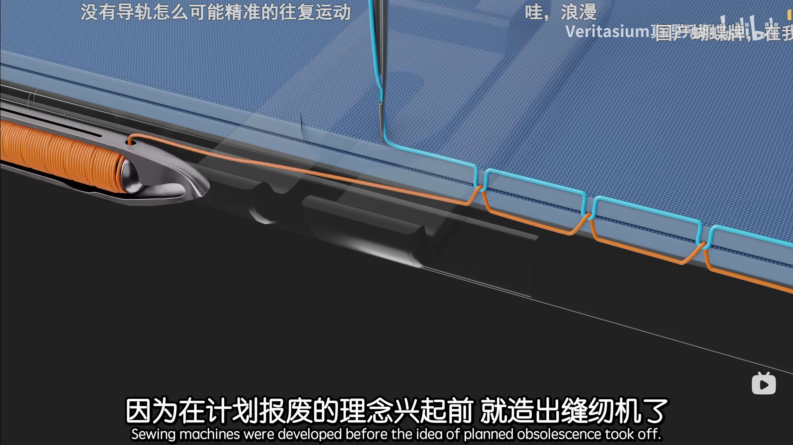
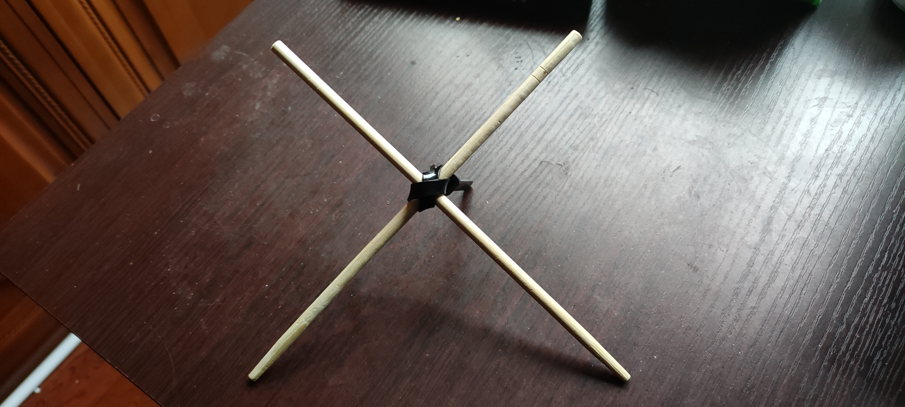
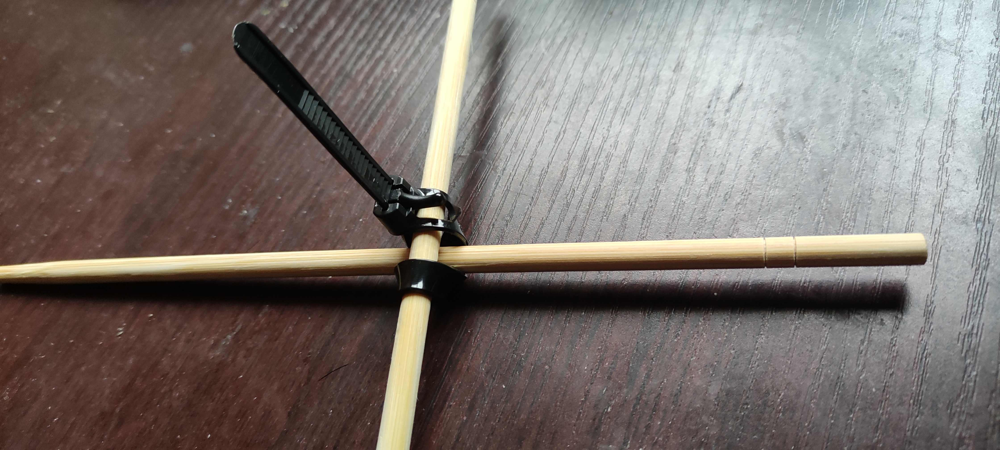

- 原名市场流程，现名基米说经济 [[20251106]]
- “疯狂的👈👉朋友们，你们的原创思想、惊世智慧有没有真正的强制力啊？💪🤓👊”
                                                                                                                         🦵🔞
	- [⚡两分钟，大师带你走向成功⚡_哔哩哔哩_bilibili](https://www.bilibili.com/video/BV1Df4y1A7jq)
	- >将来大家看的都是我画的漫画，大家唱的都是我写的歌~
		- “玩的都是我想的游戏”
	- ((690847cc-6fc9-474d-8031-d888a4084a92))
	- [Get Down - song and lyrics by Vertex | Spotify](https://open.spotify.com/track/6AQnk9tYaKyGYdwBxVExc2?si=609c62f8886e4760)
		- [Vertex - Get Down lyrics • Frenchcore](https://www.lololyrics.com/lyrics/42990.html)
- [基米说完整版_哔哩哔哩_bilibili](https://www.bilibili.com/video/BV1Dua2zyE4G/)
	- “啊？”
	- ~~“欸只跟咱差一个字——家人们，这是我义妹！”~~
	- [【哈基米音乐】基米说（伯虎说停顿卡点&完整版）_哔哩哔哩_bilibili](https://www.bilibili.com/video/BV1sdaHzTEe7/)
	- “我可能该试试进军音乐界”
- 基尼系数
	- [基尼系数_百度百科](https://baike.baidu.com/item/%E5%9F%BA%E5%B0%BC%E7%B3%BB%E6%95%B0/88365)
	- ((678a4e01-c062-47fe-b2e9-63591bb28e42))
- ((690848d9-da12-4e67-b3ca-a603bec9bcad))
- ((67599ec5-3994-48ae-8b9f-b0ea2e26fe85))
- ---
- “来看下情况”
- 需求
  id:: 67d6d8e7-1700-4d7e-a3d5-91d7b82adc6c
  collapsed:: true
	- 先提取需求，把相关实物透明化
	- ---
	- 如何确定“需求”？
	  id:: 670f0c7a-373d-4fe1-88e9-39ae16b7d900
		- [⚡领 导 讲 话⚡_哔哩哔哩_bilibili](https://www.bilibili.com/video/BV1La41197wZ/)
		- [人类真的想象不出从来没见过的东西吗？ - 知乎](https://www.zhihu.com/question/266668858)
		- ((68bae48f-8684-4c32-b945-d8a56ed9d4ca))
		- “什么是需求？”
			- [“计划经济按照需求进行生产”这个说法为什么是错误的？ - 知乎](https://www.zhihu.com/question/496157736)
			  id:: 6717a2d1-f2c3-4440-b0df-d3b3d4b527c8
			  collapsed:: true
				- “人类的需求究竟是个什么东西，是否无穷无尽，是否是瞬息万变的，是否见了爱的就爱的不行，是否吃着碗里看着锅里的，一不供应上就给你抑郁躁狂的，世界各地的大学研究了很多年，也并没有完全搞清楚，可能还是斯大林的思路比较好”
				  collapsed:: true
					- ((67402ae3-eb71-44b3-b320-249d8edde652))
		- “我帮别人确定不就得了！”
		  collapsed:: true
			- 对需求的需求
				- 社会学习
				  id:: 68a69caf-41ea-47d6-a942-603c42f88e8e
					- “在‘供给/供应’里挑”
						- “你平时都吃些什么啊？”
						- “比价”
						- 面目更完整、启发式的
							- “我不到啊！看看你的”
						- “攀比”
						  id:: 678a4de0-f33a-4106-b977-3b87b79d5897
							- >做人不要太攀比，踏踏实实做自己，如果非要比一比，那就比比激光雨
							- “人无我有，人有我优”
								- “人无我忧”
								  collapsed:: true
									- “人未有忧而我忧”
									  collapsed:: true
										- “先天下之忧而忧”
								- “人有我忧”
								  collapsed:: true
									- “小小震撼”
									  collapsed:: true
										- “震撼可能无穷无尽，但同一来源的震撼大概有限”
										- “日本震撼”
										- “苏联震撼”
										  collapsed:: true
											- ((670d412f-ed74-4e27-b3eb-03bc359ee0b3))
											- [1184. “苏联震撼”——前苏联/俄罗斯雕塑，建筑一览（部分）_凤凰网](https://history.ifeng.com/c/8XXMmEwkjse)
										- “美国震撼”
										  collapsed:: true
											- ((670f4bb3-3dae-438a-aee3-63502292a1b4))
											- ((670d40cb-7810-4836-bc8b-8ba49a29ff5f))
											- [你见过哪些美国震撼？ - 知乎](https://www.zhihu.com/question/631189964)
										- “中国震撼”
								- “人无我无”
								  collapsed:: true
									- “太好了，你也没有！”
								- “人有我有”
						- 跨栏
							- 考核指标
								- “我从小考到大！”
						- 权力层级制
							- “下属不许啵上司嘴”
							- >正是这些大企业主，银行家或者商人，我们看见他们在忙完事务之余，宅在家里，周遭一切似乎显得与他们格格不入：四壁促狭，房间堆满了没用的东西，有一种令人作呕的气氛。房间笼罩着各种谎言，诸如欧卜松、秋季沙龙，各种无聊风格的小玩意儿。他们看上去局促不安，就像关在笼子里的老虎那样了无生气：看得出来，他们似乎在工厂里或者银行里会快乐许多。我们以轮船、飞机和汽车的名义，恳求获得健康、逻辑、勇气、和谐和完美。——柯布西耶《走向新建筑》
							- “你不许参加[[impart]]！”
								- “我是（公共、集体的一）部分（I'M PART），我必须参加！”
							- 层级多少
							  collapsed:: true
								- 多层
								  collapsed:: true
									- “我们（“那我们呢？”）认为以下真理是不言而喻的：”
									  collapsed:: true
										- 人被杀，就会死
										- 人也可以饿死
									- “相同权重”的投票
									  collapsed:: true
										- “你投上去的人还是和你不在一个层级啊”
								- “扁平”
								  collapsed:: true
									- “我是本站的一把手，读者需要什么资讯，虽然海专精算不太全我要我觉得，我不要你觉得”
									  collapsed:: true
										- “什么公平？不就是要我的位子？竞争是吧？”
							- 黑白名单
							- “人性是吧？”
							- “用户传播”
				- ((69084757-a3c4-49bd-9b16-3cfc1874742f))
					- 微观说下——说累了得喝水、含润喉糖
					- ((679add4a-0125-4341-b35d-129cc29dc604)) 累了要搞大小保健
					- 拉屎蹲久了会麻，不蹲久不会，非线性关系
				- “没有需求也要创造需求”
				- 先需求后技术，天生万物以养人，机器能搞定的尽量不用人，但受各种影响，人们或多或少或好或坏地没有困难也要创造困难
				- 钱是用来干什么的？一定要“那比这好”才有动力？这部分的钱与那部分的钱如何平衡实现“效用”最大化？比如有害的加工食品增加的卫生支出能否被弥补？或者反过来，减少的卫生支出能否用于有害的加工食品的消费？相对健康的生活方式的传播会受制于“经济考量”而止步不前吗？
				- 浪费和损坏
				  collapsed:: true
					- 节约悖论
					  id:: 67c3e4f0-799f-4eff-861f-65caff7a2694
					  collapsed:: true
						- [节约悖论_百度百科](https://baike.baidu.com/item/%E8%8A%82%E7%BA%A6%E6%82%96%E8%AE%BA/10152693)
						- [什么叫经济学中的“节约悖论”？财经小白求解释！ - 知乎](https://www.zhihu.com/question/24201362)
						  id:: 679adcda-a01d-48d9-bd38-3d90ba075b6f
						  collapsed:: true
							- >患者自己选择买药的，也可以选择纯中医或平时注意点清淡饮食，推荐后没看到或看到没被供应上需求也可以不看，看得多了就有示范效应，进一步帮符合条件的劳动力省去一部分自己动脑试错的风险，调动开发自身潜力的积极性（而不是将“大胸”之类的身体特征视为负担），至于这样对不对，没有人是全知全能全善的，换成图灵涨胸可能他就因此自杀了，如果有极端倾向的人看了大胸行动力下降也是好事，如果多消费实际上有害商品，就可以更快生产疾病，就可以给医疗工作者带来收入，市场具有自发性、盲目性、滞后性嘛，可能存在没有这些性质的市场吗？ [[20241117]]
						- “但我还是愿意信奉亚当·史密斯专员的理论”
					- 经济损失
					  collapsed:: true
						- ((677bc4bc-2527-4a7b-9e50-c5cb923cb306))
						- [直接经济损失_百度百科](https://baike.baidu.com/item/%E7%9B%B4%E6%8E%A5%E7%BB%8F%E6%B5%8E%E6%8D%9F%E5%A4%B1/9746259)
						  id:: 678af4f5-164d-4171-9468-785ff0939e00
						- [安全生产事故的直接经济损失和间接经济损失计算 - 知乎](https://zhuanlan.zhihu.com/p/697108353)
						- ---
						- 经济损失带来的经济增长和存量
						  collapsed:: true
							- “降质复购”
							- 破窗理论
							  id:: 679adcda-d74a-48ea-9af1-d08e78c318ad
							  collapsed:: true
								- [破窗理论（经济学理论）_百度百科](https://baike.baidu.com/item/%E7%A0%B4%E7%AA%97%E7%90%86%E8%AE%BA/56623327)
								- >是谁在敲打我窗——《被遗忘的时光》
								- “X、反X”
								- “辞旧迎新”
								  collapsed:: true
									- “旧的不去，新的不来”
									- “计划报废”
									  id:: 688b27f9-05f4-4012-a764-efdf3a801431
									  collapsed:: true
										- 
										  collapsed:: true
											- ((67d68523-c84a-4406-99d3-9dd0aff1f066))
										- “过保即坏”
										  collapsed:: true
											- “精准的工业控制！”
											- [产品刚过保就坏是一种什么感觉？ - 知乎](https://www.zhihu.com/question/301640245)
										- [过保就坏，聊聊那些缩短产品寿命的设计](https://baijiahao.baidu.com/s?id=1807601727217183170)
								- ((67402b15-f797-44b1-8cd3-4a044587f42d))
								- ((67402aa2-a84d-4a83-96bd-55f8355fcc54))
								- ((67402acd-c1cf-425c-acd5-ff5b2d034d3a))
								- 消费主义制造信息茧房并污染日常乃至专业话语的语料库，然后用[[AI]]帮忙救回来（“真的吗？”）
								- ---
								- [破窗效应 - 维基百科，自由的百科全书](https://zh.wikipedia.org/wiki/%E7%A0%B4%E7%AA%97%E6%95%88%E5%BA%94)
								  id:: 687718c5-f088-4292-92ef-9a68c5dc3dbe
								- ((67402ab7-753c-4680-94ca-e7516d6516fc))
							- 单透膜效应
							  id:: 679ec253-eb5d-4afc-8516-16c55236b145
							  collapsed:: true
								- ((679de143-381d-4beb-8e2c-cb224b5ae04c))
								- 不同人、时、空、向
								- ((66db8ad1-dbae-4ba9-935d-af5571f1f0db))
								  collapsed:: true
									- 因为不知道“捷径”就会多花钱，就会多“养人”，所以无知是福
				- （特定）经济活动的效率/性价比
				  collapsed:: true
					- 减少为XX的投入/消费的劳动能比不变带来更好的健康效果吗？
					  id:: 66b5ebdf-cd0d-4d0b-9005-6aa49e35503a
				- ---
				- 代代大经济
				  id:: 66ff89c6-cadf-4826-a523-0dec75d4007a
					- “健康”替代
					  collapsed:: true
						- ((66db8b16-aca4-4ce9-bfcf-91d27b90b577))
						- ((66ff6100-8f4e-40b7-89bf-efa00bd58ff6))
					- 价格替代
					  collapsed:: true
						- ((679add8a-a717-4ecc-9b14-91ac67ca6a7e))
						- 国产替代
					- 消费者时间替代
					  id:: 69084762-bf92-4fee-9806-f381f51f2f32
						- collapsed:: true
						  >中国人，你要知道你有多善良、多大的贡献、多感动中国，光是通过上班，你就通过网约车、外卖、工会、积分商城、捐款等多种途径，已经帮助并将继续帮助很多很多人，使他们能够通过劳动收获更美好的生活
							- >没有蚂蚁森林？
						- 交通时间成本
						  collapsed:: true
							- 峰谷期
							  collapsed:: true
								- collapsed:: true
								  >外卖、网约车、医疗，一个比一个低频、少人（应该是吧），外卖劳动力供应丰富可以力大砖飞，网约车一次接一单、不会有人在马路上绕着车转，还有空驶费补偿，医院就没有什么峰时扎堆费了
									- “但可能已经平均了？”
								- ((670504b7-2e15-410a-9b51-ba6068addafa))
							- 停车
							  collapsed:: true
								- “所以买电车啊， ((67e69d6b-9b1b-437e-a0dd-6274e65baa9a)) ”
							- [[电梯]]
						- 消费者速度（还有时间）替代
						  collapsed:: true
							- 代排队/取号抢号经济圈
							  collapsed:: true
								- 黄牛
								  id:: 6705076b-3d29-4b32-a793-3d47f4ad875d
								  collapsed:: true
									- [医生挂自己号也得找黄牛？治黄牛有人放大招了_腾讯新闻](https://new.qq.com/rain/a/20230829A090DB00)
									- [镇江警方全链条斩断一特大“黄牛”倒票团伙_新华网江苏频道](http://js.news.cn/20250110/32a37bb2ec4644aa868163bf0959ebed/c.html)
							- 代练代打
							  collapsed:: true
								- ((670d4123-f501-4840-9534-aa5c134eddf0))
								- [[胖猫事件]]
					- ((67078011-d84f-480d-bd17-56b9670d2294))
				- 劳动
					- 作为人的劳动
					  collapsed:: true
						- “草木无情（并非）也可以自己长”
						- 职业
						  id:: 66db8aad-16c2-4c9c-9cf3-eff3cc938102
						  collapsed:: true
							- [曾风靡全球的励志神曲《B What U Wanna B》（无损音质）：励志歌曲也有这么轻松好听的旋律！_哔哩哔哩_bilibili](https://www.bilibili.com/video/BV1gr4y1U7SE)
							- [中华人民共和国职业分类大典（2022年版）.pdf](http://guojian.org.cn/%E4%B8%AD%E5%8D%8E%E4%BA%BA%E6%B0%91%E5%85%B1%E5%92%8C%E5%9B%BD%E8%81%8C%E4%B8%9A%E5%88%86%E7%B1%BB%E5%A4%A7%E5%85%B8%EF%BC%882022%E5%B9%B4%E7%89%88%EF%BC%89.pdf)
							  collapsed:: true
								- [职业分类大典系统](http://osta.mohrss.gov.cn/career)
							- [[职业卫生]]
							- [[多零工]]
							- [为应对时局变化，我们会尽全力为职业青年提供线上线下的就业辅导和失业帮助。-未明子的动态-哔哩哔哩](https://t.bilibili.com/1053316767780175873)
							  id:: 67f61964-1963-4813-9257-f7552ce4a6a6
							- [职务、职位、岗位、职能、职级、职责、职权、职称、职业_区别和联系 - 知乎](https://zhuanlan.zhihu.com/p/454277070)
							- 职业资格
							  id:: 670d40c8-a7e0-4c9b-87e8-29d4545b7c66
							  collapsed:: true
								- [职业资格目录](http://www.osta.org.cn/evaluation)
								- [国家职业资格目录（2021年版）](https://www.gov.cn/zhengce/zhengceku/2021-12/03/5655553/files/86876724c6ee4cdcb3d0be524aee036f.pdf)
							- 职业技能等级
							  id:: 68a69caf-12ef-443b-9835-e3320912a631
							  collapsed:: true
								- [国家职业技能标准查询系统](http://osta.mohrss.gov.cn/skillStandard)
								  collapsed:: true
									- “技能要求——这下能能能能了”
								- [一篇读懂！职称与职业技能等级证书的区别与联系 - 知乎](https://zhuanlan.zhihu.com/p/660969478)
							- 职称
							  collapsed:: true
								- [三分钟看懂，什么是职称？如何获取职称？ - 知乎](https://zhuanlan.zhihu.com/p/269045968)
								- [职称 - 维基百科，自由的百科全书](https://zh.wikipedia.org/wiki/%E8%81%8C%E7%A7%B0)
								- 层级结构，有多少教授、主任、经理、总工、导师
							- 岗位
							  collapsed:: true
								- “包袱岗”
								  collapsed:: true
									- “技术储备岗”
									  collapsed:: true
										- [应届大学生进车企做技术储备岗，小心入坑了，被PUA了。_哔哩哔哩_bilibili](https://www.bilibili.com/video/BV1pk4y1e7mm/)
							- 疗休养
							  id:: 67e415e4-e500-4a9c-a7a4-afc61e49c031
							  collapsed:: true
								- 回扣
								- 山高路远坑深
							- ---
							- TODO [中国的工资、就业与劳动份额 (豆瓣)](https://book.douban.com/subject/36840443/)
							- [中国最新工作岗位分类标准——中国教育在线](https://www.eol.cn/html/c/gwfl/index.shtml)（这个可能是这网站整理设计的，好像是按“职能”和“行业”混合分类的）
							- ((66db8aad-0c3b-4dcc-94e6-50f9d02a09b9))
							- [麦可思研究院《2024年中国本科生就业报告》](https://user.guancha.cn/wap/content?id=1250189)
							- [出走格子间，去做“体力活”的年轻人怎样了？｜有数_澎湃号·湃客_澎湃新闻-The Paper](https://www.thepaper.cn/newsDetail_forward_22775961)
							  id:: 669c6313-6008-4123-a812-98eb980ed68f
							- ((679adcd9-4cab-4e0f-8a24-892407a7369d))
							- “农民工”
							  collapsed:: true
								- [2023年农民工监测调查报告 - 国家统计局](https://www.stats.gov.cn/sj/zxfb/202404/t20240430_1948783.html)
								  id:: 6724e874-b761-4498-8657-2c2eb0555e38
								- [农民合同制工人_百度百科](https://baike.baidu.com/item/%E5%86%9C%E6%B0%91%E5%90%88%E5%90%8C%E5%88%B6%E5%B7%A5%E4%BA%BA/3850562)
								- [农村合同制工人和城镇合同制工人有什么区别？ - 知乎](https://www.zhihu.com/question/63545329)
						- 雇主
						  collapsed:: true
							- 商事主体
							- [法人单位_百度百科](https://baike.baidu.com/item/%E6%B3%95%E4%BA%BA%E5%8D%95%E4%BD%8D/5094642)
							- ((6710f79d-5235-49b1-b914-869191626b3e))
							- [资本家为什么说资本家不劳动，脑力劳动不算劳动吗？ - 知乎](https://www.zhihu.com/question/611703561)
							- 营业执照
							- 参保人数
							- 企业
							  collapsed:: true
								- 公司
								  id:: 68a69caf-8ca6-440e-9b01-2020d17913b6
								  collapsed:: true
									- 什么“公”司？都是“公”司吗？不如司康
									- [[公司给的生活]]
								- [经营范围规范表述查询系统](https://jyfwyun.com/)
								- [吊销、撤销和注销三者的区别 - 知乎](https://zhuanlan.zhihu.com/p/297675737)
								- 企业相关权
								  id:: 6806d598-3165-4113-b604-0fb301752c72
								  collapsed:: true
									- [怎样保证你不是AGI独裁者？马斯克为何退出OpenAI？早期邮件公开了](https://mp.weixin.qq.com/s/EXTrZDtmahiGL-4bnHql0g)
									  id:: 67eb282a-c27e-49a8-8ab6-b4f19eaa425c
									- [企业管理权、经营权、所有权、控制权的不同以及各属于哪些机构（如董事局、股东大会。。。）？谢谢！-ZOL问答](https://ask.zol.com.cn/x/24096063.html)
									- [企业管理权 - MBA智库百科](https://wiki.mbalib.com/wiki/%E4%BC%81%E4%B8%9A%E7%AE%A1%E7%90%86%E6%9D%83)
								- 称号
								  id:: 670cc5f3-9f43-4028-affe-730bb2999233
								  collapsed:: true
									- 收入规模
									  collapsed:: true
										- “进规”、“进限”
										  collapsed:: true
											- [商贸企业进限奖励-随州市人民政府门户网站](http://www.suizhou.gov.cn/zt/zwzt/2021zt/hqskzc/hqblzn/202211/t20221118_1057734.shtml)
										- [【县统计局】县统计局开展“大个体”人库核查指导](http://www.chongxin.gov.cn/xwzx/bmxx/art/2022/art_81d6d31e2639441bbbc48e88071d1f3b.html)
									- ((6773a6a8-b65a-4909-9f5a-61061a003644))
									- collapsed:: true
									  >根据本文内容，可以将企业分为以下几类：
									  1. 瞪羚企业（即成长速度快、创新能力强、发展潜力大的企业）
									  2. 独角兽企业（即具有颠覆式创新、爆发式成长、未来产值大的企业）
									  3. 隐形冠军企业（即在某一细分领域内占据领先地位的企业）
									  4. 专精特新企业（即专注于某个特定领域的高成长性企业）
										- >小巨人企业也是文中提到的一种类型，是指在特定领域内具备核心竞争力、发展前景广阔的小型高成长性企业。
										- ((670b1745-aba8-4be7-86da-a005cc579f44))
									- 专精特新
									- 隐形（单项）冠军
									- 瞪羚、独角兽
									- 小巨人
									- 上市
									- 健康企业
									- 美好企业
									  collapsed:: true
										- ((6806441a-23fd-45a8-af49-b6c45e323304))
								- [一图看懂单位、企业、公司、个体户分类 - 知乎](https://zhuanlan.zhihu.com/p/411420470)
								- [【涨知识】一文带你了解个体工商户、个人独资企业、一人有限责任公司的区别_澎湃号·政务_澎湃新闻-The Paper](https://www.thepaper.cn/newsDetail_forward_20912029)
								- ---
								- 国企
								  collapsed:: true
									- 国企冒险的资本
								- ((670d40c8-99f8-4acf-add1-7a39d588741b))
								- [奇怪的分类：“私营”和“非私营” _中国经济网——国家经济门户](http://views.ce.cn/view/economy/201105/05/t20110505_22402035.shtml)
								- 企业家
								  collapsed:: true
									- 企业家精神（并不是说有精神就都是好的）
									  collapsed:: true
										- [“中国企业的根本优势, 如今西方仍未参透”| 文化纵横](https://mp.weixin.qq.com/s/syuwIbkf1Unbac13eb-wuA)
										- 要是觉得这行业没一个能打的，你就自己创业，这就是企业家精神——在豹豹群的发言
										- 其实是觉得能把看不过去的行业乱象整得更好
										- >企业家必须有这样的境界和胸怀。国家会因为有你而强大，社会会因为有你而进步，人民会因为有你而富足！
									- 赴美上市速度（企业“忠诚”与否）
							- ((670d447d-ae41-4890-b8f3-f06482f918c5))
							  collapsed:: true
								- [市场监管总局：截至今年8月底 我国实有个体工商户1.25亿户|个体工商户_新浪财经_新浪网](https://finance.sina.com.cn/jjxw/2024-10-14/doc-incsnusx5402609.shtml)
								  collapsed:: true
									- >证券时报网讯，国新办10月14日上午就加大助企帮扶力度有关情况举行发布会。市场监督管理总局局长罗文在会上表示，个体工商户是我国数量最多的经营主体，截至今年8月底，我国实有个体工商户1.25亿户，占我国经营主体总数的三分之二。个体工商户在稳就业、惠民生、促发展方面发挥着重要作用。市场监管总局将个体工商户分为生存、成长、发展三个类型和名、特、优、新四个类别，将在今年年底前建成全国统一的分型分类“个体工商户名录库”。在此基础上，我们将会同相关部门在税收、社保、就业、融资等领域出台更有针对性的政策，推动地方政府在场地、成本、培训、招工等方面对个体工商户实施精准帮扶。
							- 就业形态
							  id:: 678a4de0-918a-472f-821a-40d8420fd59c
							  collapsed:: true
								- “应该怪谁呢？不会动不会说话的生产资料？”
								  id:: 68a69caf-dbd4-472e-a2c3-6f48396b813f
								  collapsed:: true
									- # “生产资料，回答我！”
									- “生产资料不语”
									- “你们生产资料别以为装聋作哑就能蒙混过关！”
									- ((68020f7a-88b1-4375-858f-6a20ad15f625))
									- ((68049e2f-f397-4cc0-8f60-8f4c415dd49a))
									- 让生产资料自己动（？）
									- ((67eb282a-d300-4d07-a8e8-37125f245dbc))
									- ((664da4b6-e1ed-482e-832c-f71c8a63615b))
									- ((6419a8b2-8327-4f53-8ced-6ebaad77aec2))
								- [“灵活用工”与“自然人代开”的区别 - 知乎](https://zhuanlan.zhihu.com/p/516817787)
								- [《劳动合同法》缘起及历史脉络-](http://www.jjykj.com/view202105050505.asp)
								- [历史上的今天｜劳动制度改革的岁月变迁_澎湃号·媒体_澎湃新闻-The Paper](https://www.thepaper.cn/newsDetail_forward_3900654)
								- [劳动论_澎湃新闻-The Paper](https://www.thepaper.cn/newsDetail_forward_100875)
								- [2025年最新！劳动关系和劳务关系有哪些区别？ 附：用工模式一览表 - 知乎](https://zhuanlan.zhihu.com/p/31389779718)
								- [最高院：劳动关系与劳务关系的八大区别 - 知乎](https://zhuanlan.zhihu.com/p/588283958)
								- 劳动关系
								- 劳务关系
								  collapsed:: true
									- [中华人民共和国人力资源和社会保障部令（第22号）　　劳务派遣暂行规定__2014年第12号国务院公报_中国政府网](https://www.gov.cn/gongbao/content/2014/content_2667613.htm)
									- [劳动论丨派遣工和外包工的前世今生（上）_思想市场_澎湃新闻-The Paper](https://www.thepaper.cn/newsDetail_forward_17164457)
									  id:: 67e21ce9-0b52-4d97-98f9-103c8f8d3711
									  collapsed:: true
										- [劳动论丨派遣工和外包工的前世今生（下）_思想市场_澎湃新闻-The Paper](https://www.thepaper.cn/newsDetail_forward_17164459)
									- ((67de6d34-d64f-4b2e-bd25-e4fdcc0df284))
									  collapsed:: true
										- “老吴”猫是被劳务派遣吗？
										  collapsed:: true
											- 有人想看，有人上传（“派来消遣”），所以是的，但实际是外包外做
									- “我是农民工，这就是劳务”
									- ((670d40d9-26ff-4f12-bb86-77348af96355))
									- ((677246f7-8ce6-4d72-b679-f67cd2f2c8df))
									- [如何在外包劳务中釜底抽薪](https://mp.weixin.qq.com/s/KneSB-R8_kI79aSkEYBJEA)
									  id:: 6777b6ff-4445-4c3d-9632-0a4e9e0be7d5
									- 劳务也可以说保就业，只是更不负责、更没动力劳保
								- ---
								- 灵活就业
								  id:: 679adcda-b306-4476-941f-fd5d3fa82374
								  collapsed:: true
									- “可能还是 ((679adcd9-f011-44c7-8427-c573062724fb)) 的就业比较不够灵活”
									- [最高法：灵活用工的劳动关系认定需遵循“三要素” - 知乎](https://zhuanlan.zhihu.com/p/689593444)
									- [灵活就业人员参保怎么办？与职工参保有什么不同？这篇说清楚__中国政府网](https://www.gov.cn/yaowen/liebiao/202305/content_6855917.htm)
									  collapsed:: true
										- >按照《国务院办公厅关于支持多渠道灵活就业的意见》（国办发〔2020〕27号）规定，灵活就业人员包括个体经营、非全日制以及新就业形态等从业人员。
									- [[多零工]]
									  id:: 67281e96-b2db-4148-88a5-68a5bb40cfe7
									- ((67e22f6c-bb79-4920-913c-105a558993a6))
							- 雇佣程序（？）
							  collapsed:: true
								- [湖南衡阳一医院误把内部用人需求备注公开发布，被称“直白敞亮，建议推广”_哔哩哔哩_bilibili](https://www.bilibili.com/video/BV1H2oNYKEER/)
								  id:: 6800b84b-a214-4cc6-8f06-2ed949784109
								- [流浪汉就业指导，如何避坑使用各种招聘软件，最全的找工作途径全在这里，你一份我一份，大家一起当牛马_哔哩哔哩_bilibili](https://www.bilibili.com/video/BV1whbke9Ey5/)
								- [入社会必看!打工人必看!学生工必看!流水线必看!做保安必看!防骗防诈防传销!生活知识百科!打工百科!找工作必看!_哔哩哔哩_bilibili](https://www.bilibili.com/video/BV1FaoBYREMw/)
								- ((67f8c303-f073-4ad2-a321-2023485b69a3))
								- TODO 工作信息聚合、筛选、比较、分析
								  id:: 67792219-4a7a-4052-8a97-f824440854bd
								  collapsed:: true
									- 一个个单位、一个个城市地看？或许还是有点慢了，而且如何比较？
									- ((674bf371-e51e-4922-9dad-aee42bdd800d))
									- ---
									- 实际招聘方式统计
								- 群
								  collapsed:: true
									- 不进群自己找可能效率较低，也可能看不到什么内部资料
									- 先问应聘单位工人了解情况
								- 扣留
								  id:: 67402ab0-cdfa-4c1c-8553-cb5959fdf534
								  collapsed:: true
									- 档案
									  collapsed:: true
										- 档案被扣
									- 健康证
									  collapsed:: true
										- 我忘了以前在超市“实习”时健康证咋回事了，反正后面没要回来
										  id:: 679adcda-b4cd-4352-89ad-8c7e3172c92b
										- [健康证离职可以带走吗 - 法律快车](https://www.lawtime.cn/zhishi/a3971460.html)
								- 解雇程序
								  collapsed:: true
									- 离职证明
									  collapsed:: true
										- [如何看待离职证明被公司写上负面评语？ - 知乎](https://www.zhihu.com/question/64322451)
							- 招转培诈骗
							- ((67eb2856-24ac-4387-ad69-e2554b3cdc01))
							- 出差
							  collapsed:: true
								- [遭遇公司恶意安排出差怎么办？](https://mp.weixin.qq.com/s/kkwkQWJTRzvUCMFoobTTRQ)
							- [中华人民共和国劳动法 - 国家法律法规数据库](https://flk.npc.gov.cn/detail2.html?ZmY4MDgwODE2ZjEzNWY0NjAxNmYyMGYxNmVlMTE3Mzc%3D)
						- [[求职]]
						- [[特征]]
						  id:: 62faf6da-03a5-4c32-95e3-b768aec41120
						- [[杂务]]
						- ((67f3c5e0-7997-4aca-a2dc-63005073aa63))
					- 工程
					  collapsed:: true
						- [【47集】工程学速成班-中英cc字幕-土木工程-机械工程-网络工程-生物工程-电气工程-英语听力口语单词-CrashCourse_哔哩哔哩_bilibili](https://www.bilibili.com/video/BV1MG4y1d7nU)
						  id:: 67b53e38-71fe-4a57-9ccf-5ef46b8a6e55
						  collapsed:: true
							- 对赶时间开干的人还是慢了点
					- 工艺
					  id:: 67402ab0-228f-4a39-aa1a-b6ef9e333345
					  collapsed:: true
						- 无痕破坏、有痕破坏（场景破坏）、使用、创造
						- （现代）工艺观赏
						  collapsed:: true
							- “愉悦工艺”
							  collapsed:: true
								- “没有灵魂”
								  id:: 68172ec5-e0ad-43e6-9775-efe0d9b86d44
								  collapsed:: true
									- >蚜虫吃青草，锈吃铁，虚伪吃灵魂——契诃夫《我的一生》
									- ((68186ed7-cb61-4721-b01e-7faa24794d25))
								- [那些看起来让人愉悦的工业机器和巧妙工具_哔哩哔哩_bilibili](https://www.bilibili.com/video/BV15Y4y1H7FB)
								  id:: 6799b16c-5055-42cf-883e-2684c8d0066f
								- ((62485142-b44b-4c92-9c31-f66f0b1bef55))
								- “快！”
								  collapsed:: true
									- [速度就是生产力_哔哩哔哩_bilibili](https://www.bilibili.com/video/BV1Ui4y1c7go)
							- [难以想象这是上世纪的产物_哔哩哔哩_bilibili](https://www.bilibili.com/video/BV1HxrrYaEMh)
							  id:: 67999955-bd77-411a-8bea-b564843b19c8
							- ((68172e25-503a-48ab-938a-bc17f04f92c0))
							- 较完整的工艺
							  collapsed:: true
								- 国内工艺
								  collapsed:: true
									- [一切的流程的个人空间-一切的流程个人主页-哔哩哔哩视频](https://space.bilibili.com/3493082129500984)
									- [MiracleProcess的个人空间-MiracleProcess个人主页-哔哩哔哩视频](https://space.bilibili.com/369308230)
									- [可心造物的个人空间-可心造物个人主页-哔哩哔哩视频](https://space.bilibili.com/476961512)
								- 世界各地的工艺
								  collapsed:: true
									- [造物指南的个人空间-造物指南个人主页-哔哩哔哩视频](https://space.bilibili.com/10605501)
									- [发光的三极管yoyo的个人空间-发光的三极管yoyo个人主页-哔哩哔哩视频](https://space.bilibili.com/1135981288)
									  id:: 688b27f9-dfa7-439a-91e9-916dc5187c02
							- 从精致生产视频到繁重生产视频
						- 古代工艺
						  collapsed:: true
							- ((679adcde-cf2a-466c-b937-c5e53601cc2d))
							- ((67d03aad-0797-4c0c-b107-bd6cbcdcbb20))
							- 《天工开物》（明·宋应星）
							  id:: 688b27f9-1384-437d-8edf-947c8664185c
							  collapsed:: true
								- [太牛啦！七旬老人复原天工开物古工具！_哔哩哔哩_bilibili](https://www.bilibili.com/video/BV14T4y1a7Wg)
								  id:: 67b32996-5823-4c99-9804-148292e3b6a6
								- [鲁磊的个人空间-鲁磊个人主页-哔哩哔哩视频](https://space.bilibili.com/1922513266)
								- [【天工开物】古法制造传习之旅【15集全】_哔哩哔哩_bilibili](https://www.bilibili.com/video/BV1Fx411u79N)
								  id:: 67b327e1-beb0-4a2a-aafd-0a0c01ccd557
								- ---
								- [天工开物 – 书格（旧版）](https://old.shuge.org/ebook/tian-gong-kai-wu/)
						- 木工
						  id:: 67b43ac6-4c6b-4a59-8fec-afe054a98df3
						  collapsed:: true
							- [“当代鲁班”！63岁中国爷爷成油管网红_哔哩哔哩_bilibili](https://www.bilibili.com/video/BV1g54y1q7QD)
							- 木工修边器
							- ((6865c676-e3c6-483e-a764-89676bb75000))
						- bushcraft
						  id:: 683febb6-ed98-4bc3-98af-e18a51d66485
						- 研发
						  collapsed:: true
							- [什么是研究与试验发展（R&D）经费 - 国家统计局](https://www.stats.gov.cn/zs/tjws/zytjzbqs/yjysy/202409/t20240910_1956367.html)
						- ---
						- 与“岗位”、“工具”、“工件”更贴近
						- [人们常说的的技术和工艺有什么区别？分别是什么？ - 知乎](https://www.zhihu.com/question/31531593)
						- [设计、工程、技术、工艺的区别和联系是什么？它们在现代社会是怎样融合在一起的？ - 知乎](https://www.zhihu.com/question/66759222)
						- 工段、工序
						  collapsed:: true
							- [安全生产管理丨化工生产过程中“工段”与“工序”的区别](https://baijiahao.baidu.com/s?id=1786958386005074458)
						- [写给设计师的工艺全书 (豆瓣)](https://book.douban.com/subject/35101669/)
						- 工艺交流
						  id:: 67127072-19b5-41b4-accd-60ce5deb0ac5
						  collapsed:: true
							- ((67b2b6a5-aefb-4d06-b7d2-5a06eb18c59d))
						- [张一兵丨工艺学与历史唯物主义深层构境——马克思《伦敦笔记》中的“工艺学笔记”研究（回到马克思）书评](https://book.douban.com/review/14991386/)
						- ---
						- [[人体象形动作库：互联网时代的百般武艺]]
						- ((67e3f7cc-1225-411d-a94a-c4b80379e3e6))
						- ---
						- [[测量]]
						  id:: 68292258-170c-49bd-a387-3a8338217fe8
							- 时间、空间，我们都比较熟悉，因为这是社会生活一般的要求
							- 重量、体积，除了学带数字的菜谱、看买的东西有没有缺斤少两外，还可以尝试配置（可能更多是仿制）补剂、日化产品（往往需要配合电脑和互联网使用），这也是低门槛（“初中化学”/~~套用那个五字神人理论的~~“化学阶段”、“我会自己学造饭”）的省钱乃至创业（“实在不行先包装到会费、活动费里”）门道
							- 长度，可以帮助设计、选择或自制家具，而且不光是做加法新增物品，动线设计也很重要
						- [[生物]]
						- 种植基质布设
						- 浇铸
						- 注塑
						  collapsed:: true
							- TODO [先进注塑模设计手册_哔哩哔哩_bilibili](https://www.bilibili.com/video/BV1nWUzY6EXB/)
							- [3分钟带你了解注塑工艺_哔哩哔哩_bilibili](https://www.bilibili.com/video/av82717052/)
							- [小哥在家注塑生产护目镜，劳动节劳动一下！_哔哩哔哩_bilibili](https://www.bilibili.com/video/BV16k4y1r7JQ)
							  id:: 67a2f648-142a-476d-866a-f9f7d8df50aa
							- [因使用微型注塑机，被全网劝退，叫我别搞了！_哔哩哔哩_bilibili](https://www.bilibili.com/video/BV1Pe4y197Vd/)
							- 注塑气泡
							  collapsed:: true
								- [注塑产品有气泡是什么原因？如何解决 - 知乎](https://zhuanlan.zhihu.com/p/161323465)
								- [透明产品有气泡，怎么办？ - 知乎](https://zhuanlan.zhihu.com/p/531375653)
						- 洗选
						- 压
						  collapsed:: true
							- 压路
						- 粉碎
						  collapsed:: true
							- 碾
							  collapsed:: true
								- 石碾
						- 馏
						  collapsed:: true
							- 干馏
							- 蒸馏
						- 增材
						  collapsed:: true
							- [增材制造技术（采用材料逐渐累加的方法制造实体零件的技术）_百度百科](https://baike.baidu.com/item/%E5%A2%9E%E6%9D%90%E5%88%B6%E9%80%A0%E6%8A%80%E6%9C%AF/1106573)
							- [[3D打印]]
							- [格智百科 | 电弧增材不就是焊接吗 - 知乎](https://zhuanlan.zhihu.com/p/541177135)
						- 电线杆水泥柱模具
						- 精度
						  collapsed:: true
							- [互换性、公差、配合、加工精度，关于公差的基础知识详细解读 - 知乎](https://zhuanlan.zhihu.com/p/493265444)
							- 加工精度
							  collapsed:: true
								- ((67e0d137-bfa1-426a-9fa9-e48ba151ba45))
								- [各类机加工方式所能达到的精度&粗糙度 - 知乎](https://zhuanlan.zhihu.com/p/354685915)
								- [第4课：公差设定与加工精度等级_哔哩哔哩_bilibili](https://www.bilibili.com/video/BV1kf421X7G9?spm_id_from=333.788.player.switch&vd_source=760fd7e6083addcc60d79ccf89caa139&p=4)
								- ((67f65725-1f53-4bef-8ac0-80fa922d23f3))
							- 配合
							  collapsed:: true
								- [就喜欢这刚刚好的一瞬间_哔哩哔哩_bilibili](https://www.bilibili.com/video/BV1odoqYJEwy/)
								- [公差配合：如何为工程应用选择配合 - 韦克快速成型](https://waykenrm.cn/blogs/types-of-engineering-fits/)
								- ((67fccd3e-eb1d-48e5-b2e1-49508eba106d))
							- ((67eb2820-c906-4312-b1e5-5c04f544dd4e))
						- [金属表面处理（看了不一定会，但不看绝对不会） - 知乎](https://zhuanlan.zhihu.com/p/263276939)
						- 切割
						- 旋转
						  id:: 679adcda-0acc-497c-a5c5-56d888ec4fbb
						  collapsed:: true
							- ((679adcda-0acc-497c-a5c5-56d888ec4fbb))
							- 攻丝
						- 焊
						  id:: 67e3cbc3-003a-4d7d-b779-f2d56170b3e1
						  collapsed:: true
							- [职业安全健康展：电焊工的职业危害因素有哪些？](https://www.ciosh.com/news/2475)
							- [焊工证有四种，你分得清自己要考哪种吗？ - 知乎](https://zhuanlan.zhihu.com/p/194286901)
							- [“电焊工”你们体检了吗 ？_澎湃号·政务_澎湃新闻-The Paper](https://www.thepaper.cn/newsDetail_forward_16021263)
							- [【焊接常识一】焊接作业对眼部的危害及防护措施 ](http://www.timewelder.com/uppic/20150728/55b6de4ecc766.pdf)
							- [史上最全防护攻略——焊接时该如何保护眼睛？_电焊](https://www.sohu.com/a/440153538_100286989)
							- [电焊工安全操作规程详解](https://baijiahao.baidu.com/s?id=1781784303806947852)
							- 单手焊
							  collapsed:: true
								- 单手焊枪
							- 不裸露皮肤
							- ((67eb9310-66ee-4cb3-afbe-5d064af0c591))
							- ((67eb2820-c1a2-4e2f-b0c9-53eb116f2b72))
							- 焊枪吸烟
							  id:: 68d28431-3856-4108-931e-2cdf5a7e654d
							  collapsed:: true
								- [拯救焊工的肺！20元自制吸烟神器_哔哩哔哩_bilibili](https://www.bilibili.com/video/BV1qYtJzzEe5/)
							- 焊机
							  collapsed:: true
								- [焊机维修销售-阿海的个人空间-焊机维修销售-阿海个人主页-哔哩哔哩视频](https://space.bilibili.com/3546562227604225)
						- 吹制
						  id:: 67cbb326-97c8-418f-b3c7-71171e9233d1
						  collapsed:: true
							- ((67ea00b1-0a5e-49dd-840a-76dd9aed922a))
							- ((67d3cf41-8468-4e5d-b67c-37121daf2d40))
							- ((67e557de-c3d4-4461-af76-512ed66b65a9))
							- ((679adda6-9124-44ab-aa4a-457de558cd5e))
						- 喷漆
						  id:: 67402ab0-1490-45c3-865d-dd1d5ab49dc9
						  collapsed:: true
							- [专业的喷漆师傅_哔哩哔哩_bilibili](https://www.bilibili.com/video/BV14V411v7Gy)
							- 大管道内喷漆
							  collapsed:: true
								- [什么是管内喷涂技术？给管道内壁喷上一层保护膜，延长寿命数十年_哔哩哔哩_bilibili](https://www.bilibili.com/video/BV1sp421R7Pu)
								- 
								  collapsed:: true
									- [通义tongyi.ai_你的全能AI助手-通义千问](https://lxblog.com/qianwen/share?shareId=0bf5f61b-7197-40a1-bf60-2fa36f33d812)
									- >还有就是不懂师傅在干什么，管道内为什么有那么多不像是喷而是漏出来的漆
									  手下方比较细的可能是气管，喷漆枪不知道什么类型的，没看到上面大概要有的漆罐
									  管道地上的可能是手电，像是都被喷上了，不知道怎么抓的，总不至于叼着吧？但也可能是用了较长时间没去洗
									  可能还应该有个头灯
									  从头发看可能有60岁以上？
									  坏了，显示器比较暗，调亮了看到里面喷过的一些漆了（）
									  漆要是喷多了也可能滚下来，这个管道有两根角铁固定住，如果因为漆罐不密封、供气气压不可调等导致喷漆角度受限，可能要转个几次才能喷完，可能还要等漆干再踩上去
									  一次喷不完，可能他得斜着喷
									  还有就是他为什么不离开管道到外面溜达，而是可能基于什么不离开岗位的工作伦理继续在管道内闻味，看着刚喷的漆面或接下来要喷的区域
									  如果图中的管道只喷了那一片区域，为什么手臂（看起来）和衣服都有油漆色？因为工具不好？因为他不止喷一个管道（但看起来他在等这个管道，而不是频繁切换）？还是他的工作服像手电筒那样是洗得少？裤子更容易沾到？
									  喷漆滤罐是朝下的，他那个也有点包浆
						- 抛光
						  collapsed:: true
							- [在化学面前人工抛光被秒成渣_哔哩哔哩_bilibili](https://www.bilibili.com/video/BV12E411N7bE)
						- 清洁、涂抹
						  collapsed:: true
							- 刷子
							  id:: 67fb92b2-f8f5-4753-a87e-eea7ef421f13
							  collapsed:: true
								- [小镇小手艺 做成百亿大产业_光明网](https://economy.gmw.cn/2023-07/26/content_36721686.htm)
								- [小伙用刷子制作“禾下乘凉”丰收季节，成品一出网友惊呼：创意好_哔哩哔哩_bilibili](https://www.bilibili.com/video/BV1vb4y1h7X4/)
								  id:: 67eb9e9b-1956-4f1c-9142-c94dcab97685
								- [大叔用刷子墙上写字堪比印刷体：月入过万邀约不断_哔哩哔哩_bilibili](https://www.bilibili.com/video/BV1Xi4y1j7sb)
								- 医疗刷
								  collapsed:: true
									- [医疗刷自动组装设备_哔哩哔哩_bilibili](https://www.bilibili.com/video/BV1tj421Z7kf/)
						- 半导体工艺
						  collapsed:: true
							- [制造工艺书籍：萧宏_Introduction to Semiconductor Manufacturing Technology - 第3页 - 生产/封装资料区 -  EETOP 创芯网论坛 (原名：电子顶级开发网) -](https://bbs.eetop.cn/thread-951046-3-1.html)
						- 偶然凝视沉思劳动的痕迹
					- 标准
					  id:: 67402ab0-6f4f-4f5d-a7c6-52aafddba9f1
					  collapsed:: true
						- [非标产品_百度百科](https://baike.baidu.com/item/%E9%9D%9E%E6%A0%87%E4%BA%A7%E5%93%81/1755418)
						  id:: 67b3e608-5b35-4870-a083-c0e46b37ae9c
						  collapsed:: true
							- “先非标后（可能成为）标准”
						- 可查看产品包装上的“执行标准”、“产品标准号”
						- [国家标准全文公开](https://openstd.samr.gov.cn/bzgk/gb/index)
						  id:: 66db8aad-f2b5-42f7-99b8-0844904bd3ee
						- [首页 - 全国标准信息公共服务平台](https://std.samr.gov.cn/)
						  id:: 67eb2acc-724a-4339-8b6f-18846768f605
						  collapsed:: true
							- 在搜索引擎搜可能更多搜到它，可以点右侧“全文”跳转阅读、下载页面
							- >食品安全、环境保护、工程建设方面的国家标准未纳入本系统，请咨询相关部委。
						- ((670b7782-0fbf-4768-a570-9ae6592d4e54))
						- [食品伙伴网下载中心_食品行业资料和标准交流_食品伙伴网](http://down.foodmate.net/)
						- [工艺标准与质量标准有什么区别?_百度知道](https://zhidao.baidu.com/question/493971114.html)
						- 标准的切换
						  collapsed:: true
							- 初级农产品、矿产怎么变成食品？
						- ---
						- [标准、规范、规程的区别与联系](http://www.360doc.com/content/23/0904/10/272091_1095163071.shtml)
						  id:: 666edf09-c993-4291-811e-86c67c7bc692
						- 找相关标准（也可以在知道执行标准后再搜），看检测报告（一般在商品描述里有也看不清细节，要问客服）和执行标准（商品评论的图片里可能有，或者问客服），对照检测报告和执行标准确认商品在执行标准中的性能、分类、等级等
						  collapsed:: true
							- 以及标准的检验方法的标准
						- 有需要还可对比不同的标准（新版老版、国内外、国家标准、行业标准、企业标准等），因为有些标准在性能等方面要求更高，或者旧标准的性能要求也够了
						- 标准查询和比较解读
						  collapsed:: true
							- [[头盔]]
						- ---
						- “标准化”
						  collapsed:: true
							- 标准件与人体工学
							  id:: 68c67a40-2450-4f7e-8f3e-9e433e154535
							- 货架、货车、加工设备等环节的标准化
							- 标准化特化
						- 标准化定制服务（？）
					- 劳动体验
					  collapsed:: true
						- [垃圾工作 - MBA智库百科](https://wiki.mbalib.com/wiki/%E5%9E%83%E5%9C%BE%E5%B7%A5%E4%BD%9C)
						  id:: 679adcda-9ec2-4bb7-bd64-bc42b4f82303
						  collapsed:: true
							- [《狗屁工作》大部分工作无意义、违反人性甚至危害社会 - 知乎](https://zhuanlan.zhihu.com/p/103474691)
							- [垃圾工作 Bullshit Jobs - 知乎](https://zhuanlan.zhihu.com/p/50783441)
						- 伊斯特林悖论
						  id:: 66db8aad-aba1-4d7a-9d6c-3c6d1ebf708d
						  collapsed:: true
							- ((66fc8559-9163-4dbc-a547-ecbf46876c43))
							- 如何让恩格尔系数进一步失灵——“高恩格尔系数与高幸福指数”
					- [[无效劳动]]
					- 如何让消费者相信应该用更多的劳动换取更少的供应？
						- 需求战
						  id:: 686a8779-adcd-46b4-bfc6-9b3a4be2fcd3
						  collapsed:: true
							- ~~《每天一个大脑升级词》~~
							- 历史上的强国通过先发优势为消费品等制定“X国标准”（“American Standard”；以美国人民的健康、钱包等为代价）进而“国际标准”，制造不必要的需求，通过对资源的不必要但由于“使用习惯”而难于发现其不合理性（说个大家不一定同意、不一定认为说的道理的例子：空调需要把你房间乃至房子里所有空间都变凉快吗？你可能只需要坐着的那一小块空间凉快对吧？）的持续浪费创造资源等方面的稀缺，通过对资源的控制进行全产业的国际剥削——比如石油，国家很想省石油不是吗？
						- 补偿性支出
							- ((68a69caa-92e0-411f-a676-fbd5b61b315f))
				- 竞争对手的需求
					- 资源/原料/材料战
						- 稀土战
		- 你想模仿还是超越，共存还是替代？
	- [解决方案/技术方案分析框架 - 知乎](https://zhuanlan.zhihu.com/p/360776479)
	- [[信念系统]]
- ((670d40c8-f2c4-4525-8dda-e040946f50af))
- [[地球]]
  collapsed:: true
	- “看看世界各地需求的满足情况？”
- [[行业]]
	- 行业选择
		- [首富教你如何定目标_哔哩哔哩_bilibili](https://www.bilibili.com/video/BV1Hs41167Mo)
	- 体验
	  collapsed:: true
		- 你很难没有任何关于当前生火
		- [[玩]]
		- [[尼古拉·特斯拉]]很擅长想象，但他从小已经盘过很多工件，很熟悉了，所以脑内建模、运转相对容易，而且这种学习可能像语言学习一样越早效率越高（“或者说越晚效率越低”）
		- 有的劳动一开始可能并不十分快乐
		  collapsed:: true
			- 做家务时不情不愿，做多久这情绪就持续多久——有什么好处？我要化输为赢！
				- 至少可以先这么做
					- {{embed ((66db8aba-5f68-4a8f-860b-4599215273cb))}}
		- 我大概比大部分年轻人在家时间长、做的家务多（“点外卖或不吃配额的单位食堂亏是”），所以我在家用领域有点沉淀也很合理
		- 羽毛球下落，鱼鳍摆动、浴缸晃水（？）
	- 测评、推荐等
	  collapsed:: true
		- 什么值得买
			- alpha boy（电动牙刷、燃气灶电池等，知乎也有）
				- ((66591b42-9ad4-4e77-ade1-7ae5c171bd5e))
		- [三亿世代实验室的个人空间-三亿世代实验室个人主页-哔哩哔哩视频](https://space.bilibili.com/1354622011)
		- [买错了 - 关注消费者购买决策 | 生活方式 | 产品体验 | 购物推荐](https://www.maicuole.com/)
		- [Avantela - Your Dream Life Starts Here!](https://avantela.com/)
			- ((65f682d3-0e3f-4865-ad3d-9161297b82b1))
		- ---
		- [王迅找茬是什么梗【梗指南】_哔哩哔哩_bilibili](https://www.bilibili.com/video/BV1e34y157Te)
		  id:: 67402aa3-b889-4af0-acd2-ccd4d88b504e
	- 竞品分析
		- 根据竞争者反馈进行客观的竞品优缺点分析
	- 供应
	- [[工伤预防]]
	- 替代
	  collapsed:: true
		- “因为没多少不占用受众资源的新东西”
		- 产品替代
			- 更好材料
				- “拼多多很多商品还是有不少优化的空间”
			- 需求替代
				- 寻回、拼接、扩大我们的线下生活
		- “企业责任”
		  collapsed:: true
			- “龙场悟道”（“可选”——“可选？必选！心中的监狱！”）
			  id:: 688b2808-b538-4893-a979-4ab334e77741
			  collapsed:: true
				- [为什么硬核狠人都要工程师出生和进行一次龙场悟道呢? - 知乎](https://www.zhihu.com/question/523096445)
				- # “资本主义，你好强大啊！你简直总比我还强！”
				- “旁门左道”
					- “职业革命家你不当有的是人当”
			- “平滑过渡”、“削峰填谷”
				- “欸！好像更有挑战性！”
				- [[增量]]
				- 被替代品再利用
				  id:: 6908476e-3421-4882-bfd0-4aba726f04d1
					- “滚起来辣！”
						- ((679addae-a9bd-44df-b8ce-22e23c9a57a7))
					- ((67c07040-7883-42cc-bf7a-74e389474974))
					- “那我家里现有的这些东西干啥啊？”
					- 回收
					  id:: 67a45c17-6d0d-458d-a76f-4fd84fdd15a6
					  collapsed:: true
						- “低买高卖是吧？”
							- >专收长头发！收旧手机，二十元一个，看机说价！
								- “咱这个小区早该管管了！”
							- “闲鱼收购倒卖”
								- 换人和公司推销、回收
						- 垃圾
						- ((67a47c9c-da5b-4ce9-bb5b-9ad33c76b6a1))
						- ((67b54d8b-ef40-46e0-a61f-46f9b4b51bd5))
						- ((67848a20-e485-4693-a2dc-fa0a1f3c7c74))
						- 翻新
						  id:: 68a69cc6-4ed7-4073-a0fd-4193e2b8bccd
					- 做空
					- 收购
					  collapsed:: true
						- “让我看看又（会）有多少企业或其资源可以买个好价钱”
							- “这下什么都想购了”
						- “生产资料，过来！”
				- 兜底
				  collapsed:: true
					- “不能叫兜底，不好听，让人走不出旧有意识形态的陷阱，应该叫想想从未有过的美好生活”
					- [[I人亿面]]
					- [[学]]
					- [[多零工]]
					- [[饮食套件]]
					- [[随便活活]]
					- 顾问
						- ((678a4dd6-7b9c-4a24-97cb-0c076ffc4f66))
- TODO [[经济]]
  id:: 670d40c8-1dcb-4f74-bc08-c3cfd8c761ea
- ---
- 可以用电脑甚至只用人脑搞定的——“俺寻思能跑”
- “增强个人硬实力”
  collapsed:: true
	- ((6221b0d9-1369-4f26-960c-0ab96949d060))
	- [踩了坑才知道自己错了什么：普通人无远见，终成没有技术的技术人员_哔哩哔哩_bilibili](https://www.bilibili.com/video/BV1Zb421H7RX/)
	- 问题/项目导向
	  collapsed:: true
		- ~~“照本宣科拉完了的学生思维收收味”~~
		- 从难题开始，找学习资料
	- 知疑、怀疑
	  collapsed:: true
		- 知疑你会搜会问，没搞定的疑就怀着，要么找雅典最聪明的人帮你助产，要么自己生出来
		- >魔鬼藏在细节里
		- ((66db8aad-9896-42fd-802e-1a0037523751))
		- ((65f7b702-7360-4df6-b76e-0e1380242385))（历史、科学）
	- ((68b82730-d18f-44c7-a1de-b3da1d5c1da7))
	- ((679adcc5-f214-4411-97c9-b8b3c3df6c42))
	  collapsed:: true
		- ~~“那很欲盖弥彰了”~~
		- ~~“女同志拳头硬就行”~~
	- ((6669ad2d-7391-4a8e-882a-edeedb1cfd3c))
	- ((66095541-fd54-4170-8d30-9141b2aa3f70))
	- 四季生活指南
	  id:: 66f7dde3-e16a-4154-a4fd-cca0f2673bfc
	  collapsed:: true
		- [[春日指南]]
		- [[夏季增强]]（塞，都往里塞，然后每个季节相对简单地调个包）
		- [[秋日指南]]
		- [[冬日爆改包]]（“哈基米的反应速度是人类的七倍！”）
	- [[简单再生餐]]
	- [[呼吸道传染病防治]]
	- [[家政]]
	- [[我的日常]]
		- 供大家参考，我的“自由支配时间”应该是相对很多，但目前我的研发想法的最关键阶段就是在实际劳动中“发现需求”和之后初步的观察、想象啥的，而非之后在电脑前用更多“空想”完善，“总得有个头啊”对吧？——当然，也有很多看到之前的想法记录继续想的，所以要多想并多记——如果我觉得一切OK，对家务啥的忍一忍就行，那我当然就不会想什么家用工具
		- “挤出时间”，往往也意味着涓涓细流般的发明
		- ---
		- 干到点“下班”睡觉，哪怕有时连续多天像是没解决什么想要每天睡前至少出一个“里程碑”的问题，至少过得充实，甚至可以说把地球继续相对健康地转下去了，我们必须想象我们是幸福的
			- “蚊子也确实会通过更强攻势的发动提醒我们早睡早起，蚊子好，人没把蚊子打死，人好”
			  id:: 682b3b6e-ec57-4c3c-8175-e8d765a359c8
- 创意
  id:: 67a5d2e7-821a-465e-a4d1-347e899925d3
  collapsed:: true
	- 关于现有物的知识
	  collapsed:: true
		- 刷 ((66ade36f-b510-4059-82d2-e01b7e265e12))
		  id:: 679addab-072a-477e-83c0-247402a96345
		  collapsed:: true
			- ((624d1fef-b51c-4666-b599-375029480545))
				- “但别人可能需要”
			- “你连拼多多都不愿意用，还敢说自己是网左！”
			- 想到什么就搜（可能比在别处搜更快找到你想到的），“料敌从宽”，查一下有没有“前辈”已经整出来了，整出来的也看看整得好不好
				- ((679addab-a1bb-48c1-b0e2-734978b0c3c5))
				- 如果你想造车，那么除了不要闭门外，还不要重复发明轮子，也一般不用重复造轮子
				- 看得多了，以前最多想到就放弃解决的问题一下就解决
			- 朋友圈里的大工程师们又出新作了，不要光愣着，赶快打开拼多多拍照识别看看他们用了哪些材料和工具
			  id:: 67d8c481-6d60-463c-b57e-486c8a44ee5a
			- 收藏
		- 看知名企业产品
		  collapsed:: true
			- [3M 科技 改善生活 | 3M官方网站 | 3M 中国](https://www.3m.com.cn/3M/zh_CN/company-cn/)
		- 多逛高集中度的线下（专门）市场（比如华强北）
		- 多换住处与更多高手切磋
		  collapsed:: true
			- ((6827e302-54ec-48d2-9d33-8761ee49d9e9))
			- ~~“我的房子还蛮大的”~~
		- ---
		- “（日常生活）（简单手工艺）小妙招”
		  collapsed:: true
			- ((68a69d0c-ac8b-4eed-9295-d27a5079d10e))
			- ((686a2754-a64e-4192-8eb6-c5a504f661c1))
			- [看了就忘小妙招_哔哩哔哩_bilibili](https://www.bilibili.com/video/BV1s1421b7Hb)
			  collapsed:: true
				- 扎带交叉缠绕固定两根互相垂直的杆
				  id:: 6791ca00-c88b-48d5-b47e-cf6f4221f8fc
					- [【看了就忘小妙招】 【精准空降到 02:13】](https://www.bilibili.com/video/BV1s1421b7Hb/?share_source=copy_web&vd_source=24175964b0df2fcc2c022cae23517fdc&t=133)
					- 可拆卸扎带比较宽，可能没更窄的不可拆卸扎带那么紧；事实上无法阻止稍大力的旋转；具体应用中也可能产生 ((6645c052-7bce-4b03-9f0d-6354d964b588)) ，不一定适用于食物
						- 
						  
					- 替代 ((678b04ed-bf75-4d72-9c52-02f193283af7))
						- [此绳结被农村人誉为，木匠扣，打法简单实用，很多地方都能用到它_哔哩哔哩_bilibili](https://www.bilibili.com/video/BV1K64y1R7Qs)
						  id:: 6795fe01-9ec7-42d3-b844-8d45baf8d6b4
			- [来自劳动人民的大智慧，只要思想不滑坡，办法总比困难多_哔哩哔哩_bilibili](https://www.bilibili.com/video/BV1rsdTYNE57/)
			  id:: 68089273-7fff-4342-8300-f9c0ed5a7398
			- ((678b04ed-bf75-4d72-9c52-02f193283af7))
			- [3 Incredible Ideas and Life hacks_哔哩哔哩_bilibili](https://www.bilibili.com/video/BV1Ls411x7oH/)
		- ((6243b4b6-9e05-4657-8fec-006aab8d01c7))
		- 常见工具、机械、电子设备、工程及其工作原理
		  collapsed:: true
			- [萌萌战队的个人空间-萌萌战队个人主页-哔哩哔哩视频](https://space.bilibili.com/357669580)
			- [OMG黑科技的个人空间-OMG黑科技个人主页-哔哩哔哩视频](https://space.bilibili.com/455753798)
				- ((679addab-ec9e-4db8-800e-fe486c63e85d))
			- [萨尔的尤舒拉的个人空间-萨尔的尤舒拉个人主页-哔哩哔哩视频](https://space.bilibili.com/39101693)
			- ---
			- ((67c41a77-968e-4373-b660-10ac327459f7))
			- ((67b4867a-bbad-4376-887f-db01599a9297))
			- ((67a555fc-b2cc-49c4-a40b-d571127d7930))
			- [[汽车]]
			  collapsed:: true
				- {{embed ((678b048b-fdd6-4592-b808-28d421c654d4))}}
				- ((679addab-817c-48f5-b698-1ef6529a4932))
					- 车钥匙弹簧轨道
					- 车钥匙凸点设计，不看也知道
				- 汽车可调空调扇叶
				- 门开关（？）
				- 弹簧手机支架
			- 往复、旋转切换
				- 曲柄
				- 连杆
			- TODO 合并同类项视频
		- 发明史、技术史
		  collapsed:: true
			- 你喜不喜欢“（“失落的”、“因为配套条件尚不满足而未流行、留存”的）古代原型被现代真正发掘利用”的故事？我喜欢，因为人类就是会因为各种原因大规模死亡或以现有的技术骄傲自满、凑合而健忘、分散注意力
			  id:: 679f3820-5c3e-4ea4-ba6f-8977ebc9b257
				- ((67836539-36e5-43eb-b5e1-10f801c44d1d))
				- ((67402ab5-1aa1-4321-bc40-62b50b0040b4))
			- ((65c589f9-342d-42c5-818c-f363a95b3847))
			- [[发明家]]
			- ((67402ab0-228f-4a39-aa1a-b6ef9e333345))
			- ((679adcd9-9f55-4544-93c3-a90a3965de85))
			- ((679add4e-0238-4cc1-813e-1f3c952c2893))
			- [美国制造:改变世界的10项历史性创新](https://baijiahao.baidu.com/s?id=1702886931857631290)
			  id:: 67de9b56-bc61-4a7f-983c-a43c484205d0
			- ((679387ca-fcf8-40d6-8a41-695a54168108))
			- [ChrisLex工业设计的个人空间-ChrisLex工业设计个人主页-哔哩哔哩视频](https://space.bilibili.com/7760409)
			- 四大发明
			  id:: 68b26daa-8d60-472b-a1ba-46606cbbd399
				- [为什么感觉四大发明很空洞？ - 知乎](https://www.zhihu.com/question/541716186)
				  id:: 68b26d79-ab13-4713-b818-23ecc7df8b3b
			- ---
			- ((679add81-e7c3-408b-8f17-8415d427556d))
			  collapsed:: true
				- 仿生学
					- “演化科技，小子！”
					- “厉害了我的动物朋友们！”
					- ---
					- 扑翼机
					  id:: 67eb2866-e1be-4cfe-a036-7f2f5700fd05
					- 蛾翅吸波
					- 鲨鱼肠道
						- ((679add47-4ac7-411c-84bd-e35cb521a776))
					- 章鱼触手
					  id:: 67d93cd9-ee27-4384-9420-8f402f0eb9d9
						- [中科大研发章鱼机械触手，机器人何必用人手！_哔哩哔哩_bilibili](https://www.bilibili.com/video/BV1UBrYYnEUR/)
						  id:: 67d93cd5-5aaa-49f7-af44-38713b0b6428
				- [[人体]]
					- ((666a2d18-eaf0-4cd5-b61a-dedeecaf51bd))
			- 动物的发明
				- 新喀鸦也会制造工具
				- [只有人类才会制造工具？这13种动物会让你怀疑人生 - 知乎](https://zhuanlan.zhihu.com/p/60880099)
				- “本能、模仿、学习、发明？对于相同的工具，人与动物谁先应用？”
			- 环境特化
				- 航海
					- {{embed ((678b0495-424c-4edc-9806-6065a5cca364))}}
					- {{embed ((6766c596-9755-485d-8520-53d0cf6ebc62))}}
				- 作案手法
					- 或许纯虚构的有福尔摩斯、 ((678b04b6-fba8-418b-9b03-5dffa5b06053)) 、 ((68dfbdf6-d323-4ecb-ad66-178b549fe8d7)) 之类的
					- [柯南、金田一和侦探学院的诡计手法合集 - 哔哩哔哩](https://www.bilibili.com/opus/480370501265851590)
					- [【图片】【科普240216】柯南与金田一 同种作案手法收集贴【推理吧】_百度贴吧](https://tieba.baidu.com/p/8897830333)
			- 多专业背景跨学科
				- ((6777ef19-4a21-496d-9925-d48cdd6f4dbc))
			- “有关系吗？想办法组个CP”
				- ((6767ff71-9679-4f76-98fa-7cd1e0ffba4d))
		- 创业经验
		  collapsed:: true
			- [极客公园 x BiliBili x 宇树科技创始人王兴兴_哔哩哔哩_bilibili](https://www.bilibili.com/video/BV1iT4y177aD)
			  id:: 67c658ce-9dd1-4a6e-a5a6-3925bbdd68a1
			- [王兴兴和郭杰瑞_哔哩哔哩_bilibili](https://www.bilibili.com/video/BV1WEFCeSE5r)
		- 一些我暂时没空搞的项目
		  collapsed:: true
			- 《巨人的工具》
			  collapsed:: true
				- [放弃熬夜，做清晨的霸主（人生效率的巨变）_哔哩哔哩_bilibili](https://www.bilibili.com/video/BV1r24y1J7E7)
				- [「膝神」巨人的工具：杰弗逊拉伸_哔哩哔哩_bilibili](https://www.bilibili.com/video/BV1PU4y1q7YS)
				- [费里斯在《巨人的工具》里分享的助眠饮品，我替大家试了，对我还蛮有效的。_哔哩哔哩_bilibili](https://www.bilibili.com/video/BV1Yw41177CR)
				- ((664f4245-097c-46f8-be76-5b96958ef946))
			- [【美音】超越百岁：长寿的科学与艺术 原作者朗读 Outlive: The Science and Art of Longevity 英文原版书_哔哩哔哩_bilibili](https://www.bilibili.com/video/BV1o1421i7UG)
			- 待下载（没搜到的）
			  collapsed:: true
				- TODO [这不科学！ (豆瓣)](https://book.douban.com/subject/35169064)
				- {{query (and "(豆瓣)" (task TODO))}}
			- 视频课：自我介绍、魔法展示、建议（这视频可能不出了）
			  collapsed:: true
				- 我（“小时候”、分类、省钱不干活等）、时间（“都没时间”、“探索”）、“外围”（迪化：建议方式、知乎问题、素体）、模仿（视频、直播等景观的有效性？）、运动（饮食、理疗）、软件（笔记、博客、流程图、顺带旧项目介绍、其他、网络）
	- [[发明方向]]
	  id:: 67a56029-5598-45b8-becb-495a0e0b7852
	- [[形状]]
	- [[材料]]
	- 能源（含“动力”）
	  collapsed:: true
		- [[更多能源]]
	- 控制（含[[布设]]、[[信念系统]]）
	  collapsed:: true
		- 发明创造的心理建设
			- “端正心态、奇妙开关是成功的一半——不信你随便找个人鸡同鸭讲、对牛弹琴试试？他们可能觉得他们做儿子当员工挣得蛮好的，小发明人搞发明高风险低收益，狗都不干！”
			- >青年人要敢想、敢说、敢干，要振奋大无畏的创造精神，不要被名人、权威吓倒。——毛泽东
			- [对共青团九大的指示（一九六四年）](https://www.marxists.org/chinese/maozedong/1968/5-078.htm)
			- [“世界是你们的”——毛主席对青年期望什么、寄托什么？ - 红歌会网](https://m.szhgh.com/Article/wsds/youth/2022-11-18/315755.html)
			- ---
			- “发明真简单！”
				- # 发明家天然不是人（），但人天然是发明家
				- # “我上我也行！”
				- 不必“原创”什么“实物”
				  collapsed:: true
					- >发明涉及装置和方法，装置之前已有人做过，而方法则是我首创的。——《特斯拉自传》
					- ((67cc4b87-03ab-4e36-bcfa-f9ad847da97a))
				- 不必先“实测”
				  collapsed:: true
					- 专利申报都不用“实测”
					- 实际的长期发明过程更需要考虑效率
				- 不用已知第一个发明——“第一名”了不起啊？
				  id:: 679addab-a1bb-48c1-b0e2-734978b0c3c5
				  collapsed:: true
					- 有时我们可能懒得先搜自己有没有“重复造轮子”（事后可能又痛心多花了不少时间本可以整出更多发明），或许更多情况下我们的确是，但处理人生各种各样问题的乐趣的一个关键源泉就在于不（总是）先看答案
					  id:: 679addab-24ba-45b8-8a3a-9f56a51393aa
						- [有哪些你想发明却已经被人发明了的东西？ - 知乎](https://www.zhihu.com/question/31937124)
						  id:: 67bdb4bd-2441-46bf-976f-ab4b67be9b39
					- “（基础发明的）应用怎么想都想不完吧？”
					  collapsed:: true
						- “先有发明后有（更多、更实际、更有价值的）应用”很常见，别人的发明可能先是用在了并非“价值最大化”之类的用途上，我们给它的 ((67ab494f-1529-4bc8-94e3-42cf99c65884)) 也可以算发明
							- [先有发明还是先有需求，这是个问题-虎嗅网](https://www.huxiu.com/article/489871.html)
							- [在数学上首先发明，其后才在物理/工程上得到应用的例子有哪些？ - 知乎](https://www.zhihu.com/question/30982294)
							- ((6777ef19-4a21-496d-9925-d48cdd6f4dbc))
							- “科学发现算发明吗？”
							  collapsed:: true
								- [科学网—科学理论是发现还是发明的? invention和discovery不可同日而语! - 刘全慧的博文](https://blog.sciencenet.cn/blog-3377-882973.html)
							- “以上有些需求，也有不少发明（比如文字——“那么思维——也应该二分？”），听懂掌声！”
								- 小孩或巨婴嚷嚷“我要XX”，这就是对需求不够明晰，至少表达得不够明晰，那么从需求≈（“真好用啊符号！”）发明看，他们大概不太能发明——他们如果闹赢了，但如果从“发明＝大赢”看，大概是顶多是小赢，甚至还要亏不少，所以一定要坚持赢麻，平时只想着小我、小家子消费是没法提供充足的发明动力的，不想下大棋的人最多只能成为棋盘的一部分
					- 有时——可能确实是“第一名”，甚至“天不生老子，万古如长夜”对吧？以下为可能的原因（“主要是低效分工”）
					  collapsed:: true
						- “知道问题的人不知道答案，知道答案的人不知道问题”
						  id:: 679addab-0fe8-4bcd-9a96-a01ddb996e0e
						  collapsed:: true
							- id:: 67595d2b-a52b-4019-a9a1-6ef8f40bb242
							  >很多简单的小商品（可能只是熟悉物品的不常见用法，可能因为分工、“没有时空交集”等因素没有跨场景，发现了可能会想“太简单了这能赚钱吗怎么没人赚这个钱啊”）可以做成各种场景的套件、整合包、大礼包，而通常为对应的使用方法等知识的免费部分则与其相辅相成，一些比较有市场价值的商品也可能需要通过专利等手段应对有复制、传播优势者的竞争
							- >巫医乐师百工之人，君子不齿——韩愈《师说》
							- 很多家庭的家庭成员各有各的分工侧重，至少以前主要是妻子做家务，尤其是饮食家务，妻子很可能因为职业上也有差异，不一定操作更多工具、机器，在家务中用来用去就是这么多工具乃至方法（“菜谱”），相对缺少想到新办法的经验材料——而很多丈夫因为下班时间晚正好没看到妻子做饭、累了躺先、“君子远庖厨”、夫妻生活不和谐等因素不太管妻子的家务，要关注也主要关注结果而非过程，明天还要上班，周末要看电视、钓鱼、打牌，等等——因此，如果他是“工人”，他也不一定把自己了解的工具、机器等的知识迁移到妻子日常使用的[[厨具、餐具]]上来
					- [牛顿定律不是牛顿先发现的，你被骗了很多年](https://mp.weixin.qq.com/s/tqG8e0sPTP7oWKuSpJWN9Q)
					  id:: 688cc988-569a-41b6-9f9c-8fa7b5914070
				- 不一定要学理科，甚至不一定要上学
				  id:: 677cbc7e-840f-49d9-8b47-80ed68462119
				  collapsed:: true
					- ((67c4f816-2da1-4acf-83ae-bb801cefe201))
					- collapsed:: true
					  >你是否缺乏大学教育？这不要紧。看看爱迪生、林肯或莱布尼兹就知道自学的力量。
						- ((6221b0d9-1369-4f26-960c-0ab96949d060))
					- 我目前的这些研发想法，好像没用到什么（“势能”——“初中物理”；“虹吸”——“初中物理”）——呃，气压、水压这些用不着学吧，有些魔法在日常生活中也能学到，随便刷视频也能学到好多魔法
					- 既然是“速成”，那么我以己度人（但不排除各位天才只是恰好缺点这里的参考信息），假设你的学校知识的最高可能水准是高数及格，别的科目都没了，因此此处建议的方向基本上只有“新用途”、“新工艺”（包括“原工艺外物品的新用途”），搞出“新理论”、“新模型”、“新元器件”等更前端、或许更具革命性的发明不在此处讨论范围内
					  collapsed:: true
						- ((679addab-5cc4-47e4-9ce0-377864b4d90f))
					- 简单流程的实现，除了简单到机械结构（或电路）都不需要考虑的外，可能用通用模块 ((679addab-8572-4aa8-a8c4-1eb01133ccf6)) 绕过技术原理，别说专业课了，就连更精简的若干小时的网课也不用学——更何况“以后有[[AI]]”
					  id:: 679b75b6-802c-44dd-9418-f54b6bf0a2fb
					- ((679add3e-6367-4bfc-a7be-297633576b79))
				- 不一定要用最新或较新的技术
				  id:: 679addab-0623-424a-9174-65bb98eddce9
				  collapsed:: true
					- 创新、发明≠用最新或较新的技术创新、发明
					- 旧技术都用好了吗？新技术全都比旧技术好用？在不同地区、领域，中间有跳跃吗？所有的漏洞都堵上了吗？
					- “低科技/Low Tech”
					  id:: 688b55a0-37c6-441c-b1ef-b578e89fe7b0
						- # “沉淀！”
						- [Low technology - Wikipedia](https://en.wikipedia.org/wiki/Low_technology)
						  id:: 68c0e143-3bc4-453c-979c-ca6f8c9d469c
							- [Nomade des mers: Le tour du monde des innovations low-tech (Hors collection) (French Edition) - Anna’s Archive](https://annas-archive.se/md5/cb5920c3f1fe46b7a7571f4f008bdfd1)
							- [The Age of Low Tech: Towards a Technologically Sustainable Civilization | Philippe Bihouix | download on Z-Library](https://z-lib.fm/book/25904373/bb31c4/the-age-of-low-tech-towards-a-technologically-sustainable-civilization.html)
							- retro-tech
								- [RETROSPEKT - Reviving Retro Tech for a New Generation](https://retrospekt.com/)
							- ((68c0fa74-c1a6-403c-bc9d-146ebd9c864c))
							- easy-tech
								- “快来领取易科之力！”
									- ((68acfd1f-1789-4186-9ac6-6157fcb9ebdc))
							- no-tech —— ((68a69d2c-7194-4e79-9fe5-78a6a9b7b8cb))
								- [NO TECH MAGAZINE – Technology for Luddites](https://www.notechmagazine.com/)
								  id:: 68d532cd-9bf5-4a4c-903c-ebd749a8b92f
							- “我也来想一个”
								- [Urban Dictionary: tricknology](https://www.urbandictionary.com/define.php)
									- “可译为：奇技淫巧”
						- ((68e3af93-fd36-4cf8-a36e-237395f6a87e))
						- [OpenSourceLowTech - YouTube](https://www.youtube.com/@OpenSourceLowTech)
						  id:: 68d4abbb-e095-4bf5-952f-d1024e43e1aa
							- [Open Source Low Tech](https://opensourcelowtech.org/index.html)
							- [Anarchist DIYS : r/Socialism_101](https://www.reddit.com/r/Socialism_101/comments/11lcxti/anarchist_diys/)
						- [Low-tech Lab – Home](https://lowtechlab.org/en)
							- [Group:Low-tech Lab (English) - Low-tech Lab](https://wiki.lowtechlab.org/wiki/Group:Low-tech_Lab_(English))
							- [倡导“低技术”：让社会发展回归自然可持续_法国_研究_人们](https://www.sohu.com/a/733303442_99890339)
							  id:: 688b55a2-d4c5-4acd-959f-516fe2a26114
							- ((688b60e5-eb6b-42a5-a3e3-e483c77068d8))
						- [LOW←TECH MAGAZINE](https://solar.lowtechmagazine.com/)
						- [Can Decreix](https://candecreix.degrowth.net/)
							- [Is living low tech the answer?](https://shado-mag.com/articles/can-tech/is-living-low-tech-the-answer/)
							  id:: 688b5924-1392-4953-b81d-35bb97c78ae9
						- [Low Technology Institute – postindustrial | subsistence | technology](https://lowtechinstitute.org/)
						- [We Are Practical Action](https://practicalaction.org/)
						- [低科技 (豆瓣)](https://movie.douban.com/subject/36251559/)
						- “为什么（又）是法国（大致主导）？”
							- >2014 年，法国工程师菲利普·比胡伊（Philippe Bihouix）出版了《低科技时代》（L'âge des low tech），提出了像法国这样的矿产和能源资源匮乏的欧洲国家如何能够成为一个“低科技”国家（而不是“初创”国家），以更好地符合该国的可持续发展目标。
								- ((68c0e143-3bc4-453c-979c-ca6f8c9d469c))
						- “为什么中国将主导？”
							- 中国是低科技材料在产量上的主要生产国，同时材料性价比很高
							- 中国在其各大互联网平台有广大的DIY创作者、社群
						- ---
						- 需求被统一了，柔性生产就没有必要了
							- 市场上五花八门的供应，无论个体还是整体，都并非无懈可击，因为总可能有黑天鹅、灰犀牛等
							- “尽可能满足别人的需求才是好”？非也，君不见“让所有人都不满意”？
						- “大讨论”
							- 线性进步观、增长观（以及“发展必须增长”）等一边去
							- “承包制”、“污染前先治理”
								- 旧时代遗留问题可以让旧时代势力解决，新时代势力要优先照顾好自己产生的新问题
									- ((675912ac-6f42-4a8d-8a46-965906714ca7))
									- “机器人不准干低端工作！用更简单的机器就够了，杀鸡焉用牛刀”
							- “有多少工业垃圾的诞生是因为新技术和上级路径依赖、放不下沉没成本（“机器往最大寿命或坏里用，人往死里用，用完才能换，略像菜不能剩不能冷，塑料袋要囤着当垃圾袋扔垃圾”）呢？”
						- 多用人
						  id:: 68beb505-3b7b-4dd5-9569-ee64cb292092
							- “我劝各位不要小看人类智能”
							- 你关灯怎么关？需要用遥控器、手机遥控、喊小爱同学、叫机器人代你随时走过去关吗？不需要吧？只要先修好路，这条路可以关，那条路也可以关，不必在一条路上路径依赖，关灯的电线在墙里墙外都不怎么碍事，你走过去、爬过去关也不碍事（“XX可以走向开关”），把鱼线走墙上也可以拉着关、按着关、踩着关，发射泡沫弹（比如 ((685a79ec-74bc-4e74-b46f-b4ad0b22f1c9)) 的）也可以关——“喜欢怎么关就怎么关”
								- ((679add3a-2354-42e7-a194-2dbe2f073473))
							- “不直接用人就会弯弯绕绕”
								- ((67a4aeab-6b21-43c7-8ccc-4a1fb1c0aae2))
							- “欠运动的人”
								- ((679add59-264f-4c75-8174-4bdbf7365eb0))
								- 减脂服务，像在监狱一样免费蹬
								- # “按吃分劳，多吃多劳”——《大食经济学》
								- 
									- ((67da8276-ec32-4ba6-9ace-e2a08c375bc1))
						- ((68bd6216-c29e-43ef-b662-f00645f21e1b))
						- “至少入门简单很重要，而低技术更多是入门简单的”
						- 好好的人别被“科技风/皮”限制思路了
							- （成品）能只少用电子就少用电子
								- “机械动力，启动！”
						- 企业主、员工都被复杂加工给干傻了失去通过简单产品创新的意识和能力了
						- “看好复杂技术的知识普及难度下降趋势”
							- ((679b75b6-802c-44dd-9418-f54b6bf0a2fb))
						- 简便自动化
							- [简便自动化怎么消失了？人类弄丢了简单化的能力_哔哩哔哩_bilibili](https://www.bilibili.com/video/BV1vjEfzHETb/)
							  id:: 68febb7d-5ce8-4284-811c-9c43b6ff8196
								- 弄丢了简单问题简单解决的能力，反而大沟打钩教教教培养了简单问题复杂化的能力
					- ---
					- 战斗是时时刻刻都在发生，越来越依赖绝大多数兜大圈子的“科技”的人类用自己的小聪明送了太多，无来由但难以抗拒的错误的安全感是致命的，“怀疑一切，打倒一切”是重要的突围策略，玩游戏不这么玩很浪费时间体验了吗？家里人想买？（？）
				- 不一定要用比较贵的材料、加工等
				  collapsed:: true
					- # “怎么这么简单的东西都XXXX年了还没有让我看到啊？是不是挺能藏的那些聪明人嫌不赚钱还是怕死不敢公开？”
					- 可以直接用标准产品（标品），甚至不用（人体之外的）任何工具加工，甚至不用加工（“你不知道的功能、用途等”），甚至不用材料（“你不知道的人体的功能、用途等”）
					  id:: 67b3e69c-7613-453f-8b1f-8edd5a67dad6
					  collapsed:: true
						- ((67b3e608-5b35-4870-a083-c0e46b37ae9c))
						- ((67b091cf-2215-402c-a75e-390b766c0365))
					- ((679585f0-7ab6-4dd0-8fe5-f5338245568f))
					- ((67bace09-da13-4fba-a720-5738a55213bc))
					- “网左们是不是觉得只有传统工厂里才有靠谱的工业生产资料？”
					  id:: 67a5685f-6f85-4b77-b6d0-7dd8fb863a4c
					- “什么吉列斗争？就是如无必要，勿增实体”
					- ---
					- ((69101ccf-f8ac-4236-9828-8458fc754556))
				- ((6882dd0d-5796-470a-ad1f-a731f560d8c1))
				- ---
				- 先想得很简单，可能更容易继续想下去
				- “只要思想不滑坡，办法总比困难多”
				- 现在的商品种类比几十、上百年前多得多（应该是吧），所以你的发明（专利）数量超过那些闻名的发明家也不是不可能
				- 先合并计划好准备好可以高效批量实现，8小时搞定100项原型并非不可能（“8100香造工程”）
				  id:: 679b8086-a925-4f11-a5fa-277f1d71f8e1
				- 不用担心“拖延症”
					- 创意、工具、技能和会大致按顺序裂变，想着买着用着就一身本事了，有时不确定就会买b、c计划，买了不会闲着就会用，用了就会
					- “先做个垃圾出来”
					  id:: 67e680d5-feca-4eac-92ca-15005388d7c7
						- [发个高清无码版的“先做个垃圾出来” ​​​，适合做成壁纸 - @宝玉xp的微博 - 微博](https://m.weibo.cn/status/P42pfnK9Y)
				- 多次不成功也是成果
				  collapsed:: true
					- ((67bdd41d-869f-4492-ae65-6dd14af30356))
				- ~~“不想再花时间的可能的确相对而言没啥价值”~~
				- 同人类个体的创造力上限比你想象的要高，因为你生活的社会会影响你
				- ---
				- “当今中国或世界真的培育或出现不了达·芬奇那样能够很大程度上独立工作的全才/通才吗？”
				  collapsed:: true
					- ((679add58-8f9b-4f67-9ed7-46197e5aae34))
					- “全栈”是啥？
					- 达·芬奇也没把笔记里的工程都实践啊
					- ((6289ba07-901c-4527-86a9-fa4fcbb39e72))
				- “为什么别人会觉得难？”
					- ~~“连弯腰还是下蹲都决定不了的人又能干什么呢？”~~
					- 自然误导（？）
						- 身体本身就会误导你，根据形状决定范式
					- ((679add82-475f-48b6-a605-2a2680f62cc8))
						- 避免“脏手”、急于洗手、扔“垃圾”的倾向导致实践环节被跳过
					- 从生产者说，他们骗了消费者，消费者自然不会了，而因为路径依赖，生产者也会变笨，或者至少说不会考虑其他颠覆他们生意的可能——很简单的反噬
						- ((688b283a-c587-42c3-923b-8eda3d7750b3))
					- 很多讲究投机取巧的人可能实际上也太“老实”太“路径依赖”、“爱走流程”而想象力不足了（这样的人更可能说什么“想象空间不足”），这并不是说他们不成功，也不是说他们不够聪明，要圆滑老套地说就是“路径依赖”、“（自认为）隔行如隔山”、“求仁得仁”，他们追求的就不是发明各种“稀奇古怪”的玩意，而是按他们认为“可靠”（很大程度上，确实，比如相对稳定的竞争体系由大致很稳定的人构成，关键之一就是搞定“人际关系”，而且发明家也难以例外）的方式搞货币搞情人搞权力
					  collapsed:: true
						- ((67bc6ccf-19c1-46cf-a452-fbe4ef27ba8b))
				- “逆向”、“倒行逆施”、“开历史倒车”
					- “有多少人会坚持逆行呢？”
					- # “你知道？”
				- 当个（“青春版”）上帝，相信自己的“消费主张”，从“纯粹消费者”（“啥也不是！买的办法！”）的角色出走多想几层，更充分地了解、体验、评价、想象、测量一切，宁似生搬硬套，胜过奔赴下家
				  id:: 678eda4c-429b-4e40-a001-4d3c411ea627
				  collapsed:: true
			- “很有发明的必要”
			  collapsed:: true
				- “需求驱动”
					- “责任越大，能力越大！”
						- [能 力 越 小，责 任 越 小_哔哩哔哩_bilibili](https://www.bilibili.com/video/BV1dKSJY5EBc/)
				- [如何看待“不要拿你的业余(爱好)去挑战别人的专业(饭碗)”这句话? - 知乎](https://www.zhihu.com/question/395587867)
					- “你信吗？我反正是不信”
				- 对不好用的现状“零容忍”
					- ((622368ac-7efb-4e7a-a01e-42bfbe8c2519))
				- 我们每天（“客观意义上”）不得不做的事，难道不应该被消灭吗？
				- 技术进步恰恰拓宽了发明空间，因为技术进步能（“路径依赖”）掩盖、拖延很多问题和答案，就像人类的健康问题，解决了吗？当你只是想着治疗方案还能怎么创新、怎么降价（或者更粗疏的“有病看医生”）时，你自然没有想着预防方案可以是怎样的
				- ((67c3e135-9cd8-4c36-a1ef-728f249bce64))
				- 挑剔家，找茬家
					- {{embed ((67dfcb60-e737-42e5-9697-534a63ae7bc2))}}
					- 别人的新商品、服务一开始就是完满的吗？不需要改进或配件吗？可能他们折腾得越多，我们的机会就越多或越大
					- 敏锐察觉不满、需求、改进点
						- ((67ccfbf1-8f46-4a97-b809-17356787e481))
					- 习惯“找茬”（“有一个人前来找茬”），强制认定有很多东西（包括你自己的生活）如果不必彻底淘汰至少也应该改进（而不是“我努力工作就是为了这些残次品”），强制相信你将主导这一过程（否则“天不生夫子，万古如长夜”），强制拒绝无论何时何地冒出来的“万物已近极致”、“科学（物理学）大厦已经建好了，后人小修小补就行了”、“地球上这么多人具体应用肯定也碰不到新的”、“从工业革命开始一直吹到现在AI代替人类劳动，人类可以被技术解放基本不用或再也不用劳动”之类的观点，当然，这些也不是定的，还需要灵活逆反、左右横跳
					- “有那么麻烦？！我手动一下两下就好了，哪用得着专门做/买个东西？”
						- 有没有一种可能，你实际做事时，会因为这些麻烦而降低部分物品的使用频率？
				- 适度夸张（严重性、有用性、传播性等）是好的
				  collapsed:: true
					- ((678a4e13-fc71-4a28-be66-5b7736e7e751))
					- {{embed ((677e748f-3b09-4ffa-bc59-f00985923643))}}
					- 关于“暴力倾向”、“你疑似有点极端了”
						- ((678f9830-5b02-4775-b274-e6e1f9d49190))
						- “打开想象空间的必要之举”
						- {{embed ((67402acd-6d02-407a-9d37-f1e3d918bddb))}}
						- “人们”对战争的（“台面上的”）评价往往是偏负面的，但（“不可否认”）战争时期往往是人类科技进步快得多的时期，军事需要催生了大量塑造现代生活的“军转民”科技
							- “暴力倾向”这一词，从一个侧面反映了暴力现代化、专业化、集中于国家和专业人员（包括军人和屠宰业工人，很多“现代君子”怕是不太能平和接受“死”鱼抽搐的现实）、全球相对和平的时代背景，出于“治安”、“经济”等的需要，“尚武”精神在平民中被忽视乃至刻意压抑，好比不同群体经常被继续教育应该如何生活以便维持共同体的运转
							- 语言是军事发明吗？人类对其他生物的军事行动？
							- ((65bcbf5d-d63d-432f-b62e-757f2077ce9d))
							- 墨子、阿基米德、沈括、达·芬奇、马克沁、爱迪生、特斯拉（粒子束、遥控无人武器）都有过军用发明，因为他们当时所处的社会或保护人需要，甚至极其迫切、压倒一切地需要
								- ((67a6f644-8a5d-400f-8503-85e919994383))
								- 马克沁的电灯泡在专利官司上败于爱迪生才发明了马克沁机枪
									- ((674db011-c9ec-4439-9884-9c1ba90edd55))
										- >但是，显然爱迪生在如何打赢专利官司方面更胜一筹，争夺专利落败的马克沁被迫离开美国去了大洋彼岸的英国伦敦，然后默默沉寂了一年之久。
										  1882年在维也纳的酒吧里，借酒浇愁的马克沁偶遇一位美国老朋友，朋友看他对未来发明之路满脸愁容，对他建议：“去你大爷的化学和电灯吧！如果你想赚大钱，就发明一种能让这些欧洲人更容易自相残杀的东西。”
										- id:: 67ac683d-07e0-43dc-b416-0c016b929ba6
										  >马克沁患有支气管炎，因此他曾发明了一种薄荷醇吸入器和大号烟斗，他给烟斗取名为“和平烟斗”，这种烟斗的工作原理就是加热混合了药物的水，然后将水蒸气吸入舒缓喉咙，能有效缓解哮喘、花粉症等问题。
										  但是人们纷纷嘲笑马克沁是江湖郎中，是个推销虚假医疗手段的庸医。这让老年的马克沁非常羞怒，他生气的反驳道：“在人们眼里，发明杀人机器是一件非常值得称赞的事情，而发明一种防止人类受苦的装置则是一种耻辱。”
									- “没钱了才研发来钱的战争机器”
								- ((679addab-08b3-4866-94c1-47574d1c686b))
									- >不过，美国海军部并没有应用这些发明、改造，因为海军部也只是想借用爱迪生的威望使公众相信政府，对爱迪生对海军的作用并不是十分信任。
									  所以，几年以后，爱迪生说：“在战争期间，我作了大约40项发明；每一项发明都十分成功，可是他们一项也没采用，都闲置了起来。海军官员讨厌平民插手他们的工作。这些人开办的似乎是封闭公司。”
							- ((67ab5649-ee8e-4eca-99e1-a8772677877c))
						- 比如“哈基米”就不能说“啥也不是”，而是也给了“爱猫人士”各种“爱猫”灵感
						- 现在很和平吗？至少“商战”是无时无刻不再发生的，在所谓“和平”环境下不是硝烟滚滚、血流成河罢了
						- “你什么都不想破坏，你疑似有点保了”
				- {{embed ((678b04be-0d1b-46a3-b700-167a58a392d0))}}
				- {{embed ((664f5951-f4f1-4058-9206-54e556f7ec20))}}
				- 你想教育你的身边人吗？比如过年时老老小小的亲戚
				- “不一定是‘我爱发明！’但有想法了很难完全忽略，就像‘天命难违’，别人有别人的洒脱/躺平法——我有我的！”
				- 想发明意味着高效、饱满的学习和超限能力
				- ~~别人不懂，你懂，别人不敢，你敢~~
			- “没必要全都很有用”
			  collapsed:: true
				- 觉得自己或别人至少暂时不太可能用到的东西也可以想，都可以想，有什么不能想的？！什么都不想，就什么都想不到！想让想象力夺权，就先给想象力松绑！
				- 有些创意的过程就是娱乐放松（不信你去问问达·芬奇或希特勒画画是不是工作？），别追求全都立刻马上非常有用，现实中很多生产都有不少副产物
				  id:: 678f9830-5b02-4775-b274-e6e1f9d49190
					- [大瓠之种_百度百科](https://baike.baidu.com/item/%E5%A4%A7%E7%93%A0%E4%B9%8B%E7%A7%8D/10825517)
					  id:: 67a018f6-08d3-4fb0-9169-a8af27bdd411
						- “这是啥？游泳壶、跟屁虫？好像真有用！”
					- 有的整给别人看也有娱乐放松的效果
						- ((67e50a8f-7003-4be4-93f9-38d3fe735b19))
						  id:: 679f319a-58df-492b-b437-0a152e56edee
						- ((679f319a-58df-492b-b437-0a152e56edee))
						- ((67eca839-7c2e-401d-89a3-7ecf46be24c2))
						- ((67debedc-56ae-4556-b299-659a69c88b22))
					- “高射炮打蚊子”、“牛刀杀鸡”——有什么问题吗？
				- 多联想
					- 游戏文本
						- 宣传时或许有用
						- 喜欢什么游戏，为我所用，至少我们这些发明家同行可能愿意为了你那点发明稍微了解一下自己不会玩的游戏
				- ((6221b0d9-1369-4f26-960c-0ab96949d060))
				- “你以为有/没用的就是有/没用的？”
				- ((678b04ba-4387-4d8e-908a-fc58fc2e6cb9))
				- “勿以善小而不为”
				- [短暂存在过的发明_哔哩哔哩_bilibili](https://www.bilibili.com/video/BV1wM4y1Y7bx)
				- 儿童发明
					- [无厘头设计师带领一帮小屁孩脑洞大开搞发明 | TOPYS创意内容平台](https://www.topys.cn/article/19729)
					  id:: 67cefc9b-0e7c-4d46-821e-9bfc0003d65d
	- ---
	- [[想象]]
	- 记录
	  collapsed:: true
		- ((66335bea-e054-49b0-89cc-3d88d3d2f697))
		- [[Logseq]]等载体上的长期记录
		- 复杂想法可能需要多点描述防忘
	- [[记忆]]
	- 测算
	  collapsed:: true
		- ((66975f62-8787-470c-ba2d-152fc023c7eb))
		- 具体需要的尺寸等
	- 潜在社会影响审查
	  id:: 6870aa22-01a3-413a-be4b-ad0f012fb128
	  collapsed:: true
		- 不是所有东西都值得上市（或者一般意义上的公开），只要还存在一个关键坏处（比如可能导致规模欠薪、失业、传播者被“报复”），即使有一千个好处也不能上市
			- 工作性质对就业等的影响
				- （或多或少）脱离大市场
					- “家里蹲”
						- “我早就是家里蹲人了”
					- “共享家园”
						- 包括[[宗教]]的
							- ((68a69d00-4eb5-4a5e-9e26-ed6ff3458f94))
					- “遗世而独立”
						- 游商
				- 志愿服务，性质可以说类似药品集采，能够在人力短缺的公务员体系外给缺乏消费能力和动力的相对贫困、需要帮助的人提供免费服务乃至产品，减小他们在教育、医疗等方面的无谓损失——“救火队员”
				- 帮上游卖货、材料，增大或维持了市场总量、货币流通等
				  collapsed:: true
					- 买一件亚文化、 ((6785f0fe-53a1-4363-905c-8a442ea609fd)) 商品——“那真是极好的”
						- [为什么我卖苏打水？](https://zhuanlan.zhihu.com/p/393917538)
				- 出国工作，稍微缓解国内就业压力（至于比方说进入相对摸鱼的日企会否导致求职失败者就业困难或不良，我反正是不知道的，相信日本人民能解决自己的问题），甚至开拓国际市场，相对高的收入可能也会回国
				  collapsed:: true
					- [如何看待时下被部分网民力推的“双输好过单输”观念？ - NIO倒闭了嘛的回答 - 知乎](https://www.zhihu.com/question/1913900000091551603/answer/1917993075160114985)
				- 不买一件商品服务，一般没啥影响（除非其他很多人也“独立自主”地这么做）
				- 学一项技术，市场不饱和时同行反而帮忙宣传，市场饱和时一般顶多在劳动量上代替一两个人，往往最多降低时薪而非导致失业
				- 仿制一项成本优势不明显的商品服务，一般只是给多个竞争者添堵，在细分市场打得有来有回
				- 搞一项（与“技术进步”关系不大的）竞品，一般顶多影响友商当年一小部分销售额
				- 资本家的逐利倾向导致的技术扩散——“是背景板”
					- >蒸汽、电力和自动纺织机甚至是比巴尔贝斯、拉斯拜尔和布朗基诸位公民更危险万分的革命家——马克思
						- [《马克思恩格斯文集》第二卷——卡·马克思 在《人民报》创刊纪念会上的演说](https://www.marxists.org/chinese//marx-engels2/02/10.htm)
				- （没想明白的）发明、发明家更容易大规模害人（“经济斗争伦理”）
				  id:: 688b2837-ff0b-4173-99c6-56f8326907a9
					- “技术进步”很多是他们直接搞的，但“技术进步”的效果不都是好的
						- 比如“技术进步”被用来给垃圾生产续命
						- ((6891f55d-7ceb-41d7-88d4-06cba6d60120))
						- ~~“人类的工业化、城市化误入歧途”~~
							- ((633175cc-ef78-40e6-baac-c1063e1ff45c))
				- “充分让利”的低成本技术扩散，甚至没人感谢你，甚至发视频的收入都没研发成本高，代替的却可能是容纳少说数万就业的行业，甚至是各类公共服务时间的必要性，一些需求是近乎刚性不可再生的
					- 我们可以想象一个很晚才会用火、新技术冲击“生”物市场的世界吗？
					  id:: 690847c4-89b3-4f3b-84ee-1604c75d454e
						- [为什么人类用火这么多年中没有其他动物用火或者进一步地加工火？ - 知乎](https://www.zhihu.com/question/492850496)
					- 很多人（包括我）吃饱了就不太能确定下一顿“想吃”什么了——“这还不算”
					- 很多人玩了手机电脑，很多线下娱乐就受到影响，很多
					- 不像豪车之类的奢侈品可以在很多方向雕花，只要看着像是那么回事、比消费者狐朋狗友家的高端就有人买
					- 最后，发明家大多也有软肋，（实际）破产老板、老员工、税收受影响的地方政府等一干人等都可能溯源并报复（这种报复在“人性”层面是天然正义的，就像迈完左脚迈右脚，雨滴从天上掉下来，无论发明家当初把自己想得多好），所以无论发明家看重哪一边，都有很大理由谨慎行事
				- 市场自发行为抵消局部负面影响没那么快，甚至还会追尾扩大，在人均手机上网的时代，黄金、土地都不一定够抗风险
			- 如果你不幸有了那样的东西（包括其更早的阶段形态），不要灰心失望，你还可以给它（们）分几个保密等级
			  collapsed:: true
				- 不想（“那很神秘、人皆圣贤了”）
				- 不造（“什么偷懒的借口？”）
				- 不用（“什么害怕实际用起来不行的借口？”）
				- 纯自用（仍有泄密风险；使用场景限制等也可能可以）
				- 特定先锋队（就是说这样的其他人不太容易泄密）
					- [[丹道]]
						- “不利于生产”——所以黑话多，（进而）骗子多
				- 特定劳动者（“我给工友们炫耀了没事吧？工友们，我做得对吗？！”）
				- 非特定劳动者
				- “大众”
					- ((68a69cd3-632a-437f-863e-1b4c4407a117))
						- 同丹道
						- 可能就算没法轮功的事也要很快降温了，也许吧
			- 不应向大众传播的，自制自用须严禁外传（包括避免经由安检暴露），避免没来得及“想到你想到的那一层”的“好心人”线上转发、线下“大狗教教教”好心办坏事
			- 发明家的抉择（“真的吗？我不信！”）
				- “不要拦着我！”
					- “如果一个普通人碰运气捣腾出来的一项相对高效的发明竟然会对社会有害，恐怕这样的社会至少应该是更有问题的”
						- 可能发明家不得不面对一个类似[[INSIDE]]的背景
						- “难道发明家应该漠视生命冲动，无聊到陷入基于不知道啥玩意的功利主义算计吗？”
						- “难道人们不应该从当前低效的生活中解放自己，省下时间来少竞争多学习健身合作，多动动脑做点有意义的事吗？”
				- “我再想想”
					- “我有资格干涉别人的生活吗，如果我认为他们还没做好准备？”
				- 不服气是不太容易的，但胆小也是真的
					- “战绩查不到”，但没有充分理由认为这次不是第一次
					- 缩量相对容易整出大事，怕的话可以做增量，比如不用专用组件，提供一个通用解决方案，把消费者已有的东西搞成套件
				- 不公开（可能）就行
					- ((67de9651-7e1e-4cb3-ae81-959ff228b1cb))
						- “还小范围展示了下，心大这块”
						- “然后呢？”
					- 发明家“使（自己）有什佰之器而不用”（甚至自己有也不用），“以无事取天下”，或许就已经是人类的大善人、自己的英雄了，这样想是不是非常客来碗呢？
					- 不得了的均匀害人
						- [[更多支点]]
					- 总之不能停止技术储备（“哈哈，技术储备，可能明天就没用了”）
					  id:: 67eb2866-a9ac-4c6b-9509-9715e1f8f2c9
				- “想象、体验一个低技术的世界”
				- ((68707354-d1ee-4d29-a914-932c5efda6bc))
			- 别人干坏事你别参与，勿以恶小而为之
				- “看不见、看得见的手都会调节，看看日本大米等，好东西还怕它成本低？自然（天灾还是有的）或人为的供不应求难道不是一直都有吗？”
					- ~~“资本主义是不是在挑逗我？”~~
						- ~~“资本主义别在我放大招前崩了！”~~
			- ((670d40c8-f2c4-4525-8dda-e040946f50af))
			  id:: 6873a8ab-fb41-4269-b66a-e935f823117c
			- 不懂可以问AI
		- >做到低成本不难，难些的是商品化、货币化，难得多的则有平衡（除了“家有软肋”外，比方说基于冰柜整赚钱或不赚钱的活但不至于把基于空调的现有产业链搞成不稳定因素，这应该是我未来开展全行业研究的一大出发点）、垄断（除了“一想到别人一模仿就把很大一部分赚去就来气”外，做太多偏公益的但进账太少可能也不利于发展；而如果主要靠线下大规模同步销售，相关问题就又很多了）
			- 你不卖有的是人卖，还可能卖更贵，然后冰也给你把商铺、带冷冻的自动售货机等谈收费了
			  id:: 68d38773-1fd6-40c2-9c17-deb3dd2a3253
				- 有冰杯就能有共享冰片
		- >前几月简单了解相关观点后保留“包括专利这些都能被很快绕开，然后把控不了应用方向”的可能，所以从就业（“反内卷”）、把控应用方向等角度出发，我目前对于比较容易转化的创意就是没想好算好后果就先不公开（“攒波大的”），而是先搞这样那样的“通识”学习和分享
			- “我去拖到现在才发我怎么那么坏啊！”
		- ---
		- [分类:画作 - 密教模拟器中文维基 - 灰机wiki - 北京嘉闻杰诺网络科技有限公司](https://cultist.huijiwiki.com/wiki/%E5%88%86%E7%B1%BB:%E7%94%BB%E4%BD%9C)
			- [请问一下画司辰是百分百成功吗？_看图_密教模拟器吧_百度贴吧](https://tieba.baidu.com/photo/p?tid=7691549893#!/pid10385343fbf2b2116c90919f8f8065380dd78ea1/pn1)
		- ((68cc070e-e475-4a67-800d-f2e2d356798e))
	- （时间）计划
	  collapsed:: true
		- ((678b0495-d45c-499b-874c-0897487b947f))
		- [[节日]]
		- ((66f7dde3-e16a-4154-a4fd-cca0f2673bfc))
	- 问AI（可选；要保密的话别乱问）
	  id:: 6882dd0d-5796-470a-ad1f-a731f560d8c1
	  collapsed:: true
		- XX元内（可能已有的、回收的等可不计入），使用通用组件的XX，或能实现相同功能、用途的其他形态，社会影响（含替代效应；注：这个加上去一起问好像小D更容易压缩技术方案篇幅）
			- AI脱离互联网搜索信息绕过成品溢价印象、现有方案的想象力这一块还得练
- [0-产品工程课程介绍_哔哩哔哩_bilibili](https://www.bilibili.com/video/BV1Sm411o7TF/)
- 测试、验证、演示
  id:: 67cc41d3-2635-42f0-958e-b586ed82f83d
  collapsed:: true
	- 不一定要有（更接近成品的）原型了再验证：用一个勺子、最多几根筷子（或者只用手指架勺子），就可以验证一下投石机的技术
	  id:: 690847c4-e0d4-4b7b-b4dd-37e559bcd680
	- [[布设]]
		- 如果产品够简单，可能连“机械”都疑似算不上，可能“加工”、“量产”都不需要......只需把什么东西放到哪儿
			- ((67b3e69c-7613-453f-8b1f-8edd5a67dad6))
- ((690c00f6-66ba-4d9d-bc52-84a0333881c1))
- （成品）[[设计]]
- [[机械]]
- [[电路]]
- [[编程]]
  collapsed:: true
	- [【一文读懂自动化行业，PLC工程师有多轻松？】 【精准空降到 03:25】](https://www.bilibili.com/video/BV19m421n7yW/?share_source=copy_web&vd_source=24175964b0df2fcc2c022cae23517fdc&t=205)
- ---
- 可选
  collapsed:: true
	- 团队
		- [「MV」Rule The World - Vau Boy_哔哩哔哩_bilibili](https://www.bilibili.com/video/BV1Sm4y157vp/)
		- 即便你是能站在巨人肩膀上用“中世纪技术（思路）”整出比AI相关危机更迅猛的后资本主义经济危机（最好没有危机，人类做了一场大梦，醒来已然改天换地）的超文艺复兴级全栈工程师，为了尽可能高的市占率和进一步掌握生产资料，你也需要团队协作补齐短板、越补越高
			- ((67b71bd6-d049-408c-92ec-e71579a768a9))
		- 分工
		  collapsed:: true
			- ((6806d598-3165-4113-b604-0fb301752c72))
			- 发明环境与发明权属
			  id:: 679addab-1515-4041-a71c-dd04a6a7e970
			  collapsed:: true
				- 职务发明
				  collapsed:: true
					- [职务发明_百度百科](https://baike.baidu.com/item/%E8%81%8C%E5%8A%A1%E5%8F%91%E6%98%8E/1907145)
				- ((678b04a4-41bd-48c2-8e40-fa5006f5ddd4))
			- 发挥比较优势
			  id:: 67c2dc62-a1b3-4daf-80be-6e8bea0c04bd
				- 生产动力
					- 简单的玩具可以让儿童造
					  id:: 690d4dc4-f380-4d1a-b68d-b10a63f2dfce
			- 生产要素（含“决策权”、“名誉”）分配量或比例的决定方式
			- 收入分配
			  id:: 679add33-0661-4e0a-83b4-7e217ad3993f
			  collapsed:: true
				- 资本
				  collapsed:: true
					- 为了发展
					- “发展、项目基金”
					- 资本来源优先分配权
						- 包括自己要、给别人（“嗯？这构成投资关系吗？”）
						- 跨团队跨项目资金，基金申请
				- 工资
				  collapsed:: true
					- 可以都拿，也可以（在资本积累尚不乐观、说不定多花点就买不起需要的设备时）只支取生活费
					- 先前股份（股利分配比率）
						- 当然，入股方式也多种多样，但常见的是后来者越拿越少
					- 劳动效果
						- 效益
							- 可以开价，可以谈
							- [施泰因门茨的一条线和一万美元的故事是真是假？ - 知乎](https://www.zhihu.com/question/41216973)
						- “灵感”
						  id:: 6806f0e5-139f-4faa-9e44-f8072f6aef2a
							- （“创设目标的”）起步灵感
								- “突然就冒出来了，算上笔记时间也就十分钟，这怎么算工作时间啊？”
								- “其他人也能想到（“真的吗？我不信！”），但为什么是我、是这会儿？”
								- 先前材料学习成本
								- 也能想到，甚至想到，但不知道是否适合做、现在做（任务规划、调度）
									-
							- “灵感孤”
								- “德不孤，但灵感孤”
						- 计件
							- 更多是重复性工作，更多是被雇主算好了的，相对不太能谈
					- 劳动时间/计时
						- 同劳动时间同酬
							- ~~“就当这婚还没结”~~
							- 能做到这步，相信生活成本已不是问题
							- 时间按目前的“客观估计”大致不会差几个数量级
								- 如果要照顾人对客观差异的不满，那么可以有特定个体预期寿命的换算
									- 比方说我们有个渐冻症、早衰症天才，或是百岁长寿基因携带者
									  id:: 68a69cc6-3059-4500-baa8-9b49ce35b734
							- ---
							- 除个人垫付的支出优先报销外，个人按比例灵活取用，可以把自己挣来的那一份全拿走，也可以认为暂时不差钱就把自己挣来的那一份留在公账上作为未来项目资金，进一步读者能想到的问题都从略，参与后就知道啦！；按劳动时间分配，不一定就是“计时工资”，“生命属于人只有一次”，为了守护自己现在和未来的劳动成果，其他人会对在他们看来你的有意无意的“磨洋工”行为提供各种提高劳动效率的指指点点，乃至只吃西瓜最甜那一口，撺掇你去多揽几个项目分散劳动时间，或许这里面多少有些嫉妒，但或许也有更挣钱的项目
								- 比方说你很牛，很敢想，很能想，平均每天给大伙儿开五个坑（“项目”），平均一个坑从开坑到填完坑要干20天，你和其他人平均每天花的时间一样（实际上也可能花更多时间，抛开梦中劳动不谈，别人晚上下班回家再干3小时，你在家一天干15小时，你的劳动时间就是别人的5倍，合情合理），那么平均每20天，100个坑你的劳动时间就是1%，其他人可能也差不多，非常的公平
								- 主要以基于对劳动者的创造欲、创造力和创造潜力的尊重（而非将劳动者视作赚取更多价值符号的工具）
									- [The Power of Love of Power (DJ Edit) - S3RL/Starstruck - 单曲 - 网易云音乐](https://music.163.com/song?id=1391302869&uct2=U2FsdGVkX1/hztjuHkrDmukJY5+rabh0sQczL/UNr/Y=)
								- 保护包括研发者在内的广大劳动者的最大利益。
							- ---
							- 选择时薪
								- 最低10元？（大致保证全职能活）
							- 住房等的补贴
						- 提高工作效果
							- “越健康、快乐、有激情，拿得越多”
				- 采用相同的个人报酬方式
				- 实际工作条件的情报、分享你的
			- 监工
			  id:: 679add33-b61a-4e97-81aa-c6c290a55774
			  collapsed:: true
				- “个人创作者被催更也意味着分工”
				- 相对精细的线上劳动监督
				  collapsed:: true
					- 线下有共同工作的时间的团队成员可能互相视听监督，线上如果难直接比较工作成果（“我是1，你是0！”），（有必要的话）可能需要 ((66db8b0c-0180-4c7e-8a87-6df0379118bd)) 之类的工具进行监督，将个人的具体劳动归结到特定项目的特定部分
					- ((67b7bfdb-7cd1-4a38-bb3a-94d12805a8c2))
					  id:: 67b7bfdb-7cd1-4a38-bb3a-94d12805a8c2
					- ((62e40407-9a06-4626-b968-c271a9a13915))
				- 可视化的项目仪表盘
				  collapsed:: true
					- 比如 ((670d40f2-eb12-44cd-9c58-0341cec7f720)) 的
					- “人们可能对图像比对数字等文字更敏感”
					- 同时，可能也需要添加自定义单位
					- 库存管理
				- ((67cb8cea-d393-46d0-ab1e-ace91064d5b5))
			- [[多零工]]
			- [[聚人阵]]
			  collapsed:: true
				- 俱乐部人满为患？可能很大一方面原因是家具的规制，被它们的规格（这又是因为它们的材料特性、制造、运输方式和用途）制约了，所以空间利用率较低
					- ((68c2c779-175f-486f-968a-32ebe7f8e373))
		- ---
		- [[青年未派]]
	- [[交通]]
	- 商标
	  collapsed:: true
		- 增加消费者选择率，可能多数消费者除了查看历史订单、分享链接就是说牌子；还没具体产品乃至具体产品想法时也可以想个好名字
		- [商标不同类目，可以注册一样的名字吗？ - 知乎](https://www.zhihu.com/question/435679766)
		- [商标近似如何判断，请看新版《商标审查审理指南》解读——文字商标篇 - 知乎](https://zhuanlan.zhihu.com/p/443684595)
		- 共用商标？
			- [商标授权_百度百科](https://baike.baidu.com/item/%E5%95%86%E6%A0%87%E6%8E%88%E6%9D%83/7394158)
		- 吉祥物
		  id:: 680ec6a3-6589-4bf7-bcf0-4d8048f304a9
		  collapsed:: true
			- 软件Logo
				- [开源动物园一日游，技术圈的这些吉祥物有多少是你认识的？ - 知乎](https://zhuanlan.zhihu.com/p/343057512)
				- ((6705f144-ae01-42e6-8591-ac37d7207123))
				- ((66c07b92-f8a3-4429-b70d-c6d27f146aa7))
			- ((66e78c35-776b-48ad-ac96-1fce586f03b3))
		- “咱们来搜一下未明子（无）、阳和平（有几个申请人名）、马前卒（已注册）、马督工（申请中）、章北海（有几个已注册）、张正午（有1个申请人名）、钢鞭哥（有1个已注册）、齐泽克（有1个已注册）、以太假说（无）、歼20（有一堆成飞申请已注册的）”
		  id:: 6778cf33-b749-4cb9-8c1f-5dba9cb04385
		- [商标分类表_百度百科](https://baike.baidu.com/item/%E5%95%86%E6%A0%87%E5%88%86%E7%B1%BB%E8%A1%A8/9204053)
		- 多品牌（经典“自由竞争”市场疲劳战术）
		  collapsed:: true
			- 多结果，多店，多品牌，多带货
			- 一物多上，不同封面等
			- “市场覆盖”
			- “（自由市场）有限理性/选择策略”
			- ---
			- 软文，推荐一种和推荐多种，但是偏心
		- collapsed:: true
		  ---
		- （以下“莫须有”是开玩笑的，各大品牌方不要太当真）
		- 苏菲（“什么神智学？”）
		- 污蔑群众
		  collapsed:: true
			- 卫生纸
				- 雪亮（taste pure）
					- “下面的眼也是眼是吧？”
		- 污蔑女性
		  collapsed:: true
			- 污蔑已婚女性为家庭主（“煮”）妇
				- 调味料
				  collapsed:: true
					- 太太乐
						- [【广告】太太乐2011年广告_哔哩哔哩_bilibili](https://www.bilibili.com/video/BV1b7411x7LF)
						  id:: 67a6f88d-d1a7-4512-ab1a-c4bae797a575
						- [支持真国货，从抵制假的国货太太乐做起！_哔哩哔哩_bilibili](https://www.bilibili.com/video/BV1uC4y1U79r)
				- ((679adce8-f920-4864-b259-cdfe69bb1ed6))
				  collapsed:: true
					- 巧媳妇/好媳妇
					  id:: 679add33-66e3-404f-a949-251a9cad2e51
					  collapsed:: true
						- [巧媳妇 - 商标信息查询 - 爱企查](https://aiqicha.baidu.com/mark/markDetail?dataId=f94140fdb5e043a6b26c164a7aa3bfb6)
						- “婆婆买刀？”
						- “哈哈，‘巧丈夫’真有”
						- ---
						- 以前的
							- 这把武器只能哪个NPC用，不然不起效得劲
							- 这是垄断和强加？
							- 阳江不锈钢，阳江刀
							- 传统日本女性，自然是家庭妇女
							- 嗯嗯～，崇拜日本可以理解，日本对传统文化的保护和宣传好也是事实，但为什么不崇拜美国印个美国媳妇？
							- 德国双立人又是什么意思？
							- 日本厨师用刀又是体现匠气而非小家子气
							- 历史书英雄多男性，性别不同，同样信息基于性认同的价值认同就不一样
				- 好嫂子
				  collapsed:: true
					- “‘媳妇’被抢注了？”
				- 厨房纸巾
				  collapsed:: true
					- 后宫
					- 妮好
					- 女主角
			- 污蔑女性为乳牛
			  collapsed:: true
				- 认养一头牛
					- “像养女儿”
			- 污蔑女性为公妻
				- ((679adcbd-8c88-46cf-92c3-0e2785a9b172))
	- ((66adee71-01d4-4cea-b01b-ad0a969a21bd)) 、专利
	  collapsed:: true
		- 可能增加竞争者时间成本
		- [领先的一站式_专利申请代理知识产权服务平台_乐知网](http://www.lzpat.com/)
		- [一文看懂 发明专利申请周期多久，专利申请需要多长时间？ - 知乎](https://zhuanlan.zhihu.com/p/635270964)
		- 申请专利不需要实物（“最纸上谈兵的一集”），只要想得美，并且实际上也很美，不实测也能整出有用的专利
		- ((679addab-1515-4041-a71c-dd04a6a7e970))
		- 专利代理人/专利代理师
			- [【长文】可能是全网唯一一份专利代理人入门手册 - 知乎](https://zhuanlan.zhihu.com/p/31471125)
		- ((67ea61ac-7003-4489-acdb-a9c291f8abb6))
		- 查询、申报、维权
		- 撤回
			- [发明专利申请公布后的撤回？说明发明人有专利吗？ - 知乎](https://www.zhihu.com/question/487270112)
		- 双报专利
			- [发明专利已经申请5年了可是专利局一直没有消息怎么办？ - 知乎](https://www.zhihu.com/question/653949488)
		- 专利年费
			- [专利未缴年费终止失效可以恢复吗？ - 知乎](https://www.zhihu.com/question/636710918)
		- ((68821777-dabe-4449-ae35-f173039efe82))
		- ---
		- ((67595d2b-a52b-4019-a9a1-6ef8f40bb242))
		- ((67de94bd-b2f0-4c89-8d82-a5674e8307a1))
		- ((674db011-c9ec-4439-9884-9c1ba90edd55))
		- ((678f6627-3ad6-4770-a9b1-970afcecac2f))
		- ((673ec846-6415-4aae-9850-7882079b4ee7))
		- ((67931914-6bcc-4eb3-b124-32ab1887c26d))
- ---
- 更可能（对常规市场竞争者等）公开——保密这一块
- 采购
  id:: 67b96652-d93d-4d97-ae7b-31b21e2d1767
  collapsed:: true
	- 采购用时
	  collapsed:: true
		- 目前是我最费时的环节，我要考虑的“无（有害）胶”（可能快完结的）、“更简单便宜的设计”（可能比较耐久的）等要求是有点难办
			- ((683108c7-5c6c-484e-81c3-91867871d96d))
		- 如果总想拖着不采购
			- 平时懒得买也可以多些理由：“信用卡刷几笔免年费”
		- 多项目合并采购
			- TODO 这步我会加标签，把材料（包括工具、使用场景）相同或相近的创意集中，一天几十项
				- ((679b8086-a925-4f11-a5fa-277f1d71f8e1))
				- ((687222b4-77eb-4eb2-858a-8435679d701f))
		- ~~“不懂又（不好意思问人又）想赶时间可以先都买”~~
		- 网购延时
			- “节奏这块把握好”，“木桶这块补好”
	- ((68799cab-571e-4ba4-a801-43f927345122))
	- ((67402ab0-6f4f-4f5d-a7c6-52aafddba9f1))
	- ((68fd800f-6a27-4e20-b5cb-cfdc1cebf643))
		- ~~“让广大玩家们分布式采购、常备可调用的玩家社区资源是吧？”~~
	- ---
	- 记账
		- 爸妈讨论这几年（应该是他们花的）钱去哪了
	- ---
	- 审核的环节：合同、订单、报账
	- 做材料盖章麻烦
- （批量）生产
  collapsed:: true
	- 电子信息、软件或许在销售、运输环节接近即时生产，且生产效率极高、生产成本极低，但还有其他很多东西并非如此
	  id:: 67bdd69e-206b-428f-8913-d82a1e9e9888
	  collapsed:: true
		- ((67bed219-2f77-4995-9c35-9ec43e3b69ac))
	- 你有不亚于 ((67dea48a-e811-4bf7-a395-f0c125794730)) 的对个体供应者而言也算高性价比的创意乃至已可量产的发明吗？
	- 原型、样品
	  id:: 690c00f6-66ba-4d9d-bc52-84a0333881c1
	  collapsed:: true
		- [浅谈产品研发的各个阶段——A样？B样？C样？ - 知乎](https://zhuanlan.zhihu.com/p/525653981)
	- 组装
	  collapsed:: true
		- 面向制造及装配的产品设计（DFMA）
		- 消费者可能认为自行组装需要点非家常工具的或有几十上百组件的有点大可不必
		- 高效组装
			- 你还在对 ((67da6b88-c8b3-40e1-9d08-01c6fe896261)) 这样的标品也徒手组装吗？是时候分分钟破吨了！
			- 组装辅助件
			- 组装后拆卸、替换
				- 可以简单拆掉活动件替换为不可动件（？）
	- 生产工艺保密
	  collapsed:: true
		- “电商现状”罢了，大多并没有“高清特写”、“产品规格”对吧？能把各种多少跨点领域的零件认全了也不一定能精准判定规格，如果还得一个个试，工厂大概会很赶，手工人的产能也不一定跟得上
		- 等卖差不多了再看要不要公开技术细节，公开的话或许意味着竞争者之前的逆向工程多少白干了
	- 质检/质控/质量/品控/品管
	  id:: 68065a59-59ad-4950-aa09-04fb851bc986
	  collapsed:: true
		- [六西格玛_百度百科](https://baike.baidu.com/item/%E5%85%AD%E8%A5%BF%E6%A0%BC%E7%8E%9B/3346517)
		  collapsed:: true
		- qms
		- [QHSE管理体系_百度百科](https://baike.baidu.com/item/QHSE%E7%AE%A1%E7%90%86%E4%BD%93%E7%B3%BB/4981908)
			- 质量管理
				- [质量管理五大工具详解：APQP,PPAP,MSA,FMEA, SPC_哔哩哔哩_bilibili](https://www.bilibili.com/video/BV1Tg4y1T7kv)
					- “搜 ((67a5d975-a3f2-406f-8964-0f061736892a)) 搜的 ”
			- 测试
		- 目视
			- [猜猜她在干嘛？电源适配器制造工序工艺_哔哩哔哩_bilibili](https://www.bilibili.com/video/BV1ga411u7wr/)
			  id:: 67eb9310-1e60-4392-8cd9-d482070ffe29
			- [流水线专家，熟能生巧👍🏻👍🏻👍🏻_哔哩哔哩_bilibili](https://www.bilibili.com/video/BV1Kw41187cw/)
				- >洗牌码牌~摸牌看牌~
		- 显微镜
		- ((67ec98bb-fb63-4497-95dd-d7f5b323eea2))
		- 影像测量仪
		  id:: 6816ca4e-21e1-4496-bdb0-8ab31c5fa6b2
			- [如何区别二次元、2.5次元、三次元？](https://www.tontruth.com/newsview/513.html)
			- [二次元影像测量仪_哔哩哔哩_bilibili](https://www.bilibili.com/video/BV1gP411h7QL/)
			- [科曼尼二次元影像测量仪手动影像测量仪2.5次元测量仪2.5D投影仪二维影像仪高精准度快速测量厂家直销_哔哩哔哩_bilibili](https://www.bilibili.com/video/BV1u3411W7Aq/)
			- [员工抱怨测量太难测了，我拿出了这个三坐标测量仪，他就不吭声了！！！_哔哩哔哩_bilibili](https://www.bilibili.com/video/BV1azGgegEUp/)
			- [质检员的一天工作_哔哩哔哩_bilibili](https://www.bilibili.com/video/BV1bb421z71W/)
				- >我做了两个月质检员，简直是噩梦，质检严点，生产的有意见（因为不良品多），松点自己上级有意见，有个小瑕疵，生产的叽里呱啦说可以过，不给过又被生产投诉上级，最后挨骂的还是自己！最讨厌的还是一个小瑕疵，自己人说可以，生产的说可以，最后又被投诉，两边都不帮我说话，最后落得个人不人，鬼不鬼的下场，还被全群通报，不干了，妈的，气死个人——评论区
			- TODO 挪（到）仪（器边）辅助
			  id:: 68049e2f-f397-4cc0-8f60-8f4c415dd49a
				- ((68058c3c-2a8b-4b54-a62d-f9eb6ba94d77))
				- 分体，旋转
				- ((68070390-4915-4141-b645-36d02c3ca172))
				- 坡道
			- ~~“你们说的那个祥子，她干过二次元吗？”~~
		- [5000块的QC质检员到1w多的质量工程师，需要多久？_哔哩哔哩_bilibili](https://www.bilibili.com/video/BV1jZ421b74D/)
	- ---
	- 相同品质产能（包括传播产能）的有限性与假冒伪劣产品
- 销售/运输
  collapsed:: true
	- 销售方式极大影响运转难度和竞争烈度
	- 也可以卖情报、反情报服务，商标也可以抢注，创意也可以不走专利直接卖人，产品也可以预售，也可以有毫无理由的赞助，等等，但还是按一般的顺序放最后，毕竟通常最后还得有个运输
	- 更高市占率
	  id:: 67c63951-1f28-4d87-a976-7b5ed63252a2
	  collapsed:: true
		- ~~“你够快吗？”~~
		- 如果只是想掀起波澜，（除此之外）没有各种世俗的欲望，那固然简单些，但掀大波者往往并非绝对乐观，万一在自己掌控之外出个岔子，比如天网发动全面核战争（可能比无核武器的机器人暴动难顶些），而我在那之前没钱准备生存工程怎么办？
		- 对于一个追求市占率尽可能100%的啸生意，拖、拉长销售时间窗口是致命的，想绕过千奇百怪的“中间商”就要 ((67a40bac-2171-474d-b859-e7913b4b9ef2)) ，因为精明的消费者和竞争者都会拖和赶时间等价格或（通过更快的研发生产广告发货、研发新工艺或换换零件改改尺寸绕过专利等将）平均成本降下来省钱或把你的市占率抢走，最快不到一天就能超过，现实中的你再强大，也没有“别人”强大，所以，在那之前，保密也非常重要，不要让网线那头的黑客（“‘涉密不上网，上网不涉密’，你的上网真的全环节安全吗？”）、窗外架望远镜的邻居（“布豪，是窗外势力！”）、口风不严的身边人（“自信热心传播，但有意无意不懂话里有话的传统文化，优秀的匹配机制”）给泄露了
			- [如何通过十发子弹管理 100 人? - 知乎](https://www.zhihu.com/question/26995308)
			- 如果你还有很多[[套件]]——“那很好了”
				- ((67b2b554-acd8-46b2-8705-62fc803aa883))
		- 更进一步：纯自产自销100%市占率
			- “一比8B，优势在我，一口吃下，富得流油”可能做到吗？
		- ---
		- 垄断
			- [托拉斯 - 维基百科，自由的百科全书](https://zh.wikipedia.org/wiki/%E6%89%98%E6%8B%89%E6%96%AF)
	- 限价
	  collapsed:: true
		- “建议零售价”
			- “高于这个价买到——卖家就是奸商！”
		- 可以蹭汤喝，但得守规矩
		- [公平贸易 - 维基百科，自由的百科全书](https://zh.wikipedia.org/wiki/%E5%85%AC%E5%B9%B3%E8%B2%BF%E6%98%93)
	- 集中需求
	  collapsed:: true
		- “为什么消费者要分散在全地上，让我到处跑？”
			- [【BBC】无比震撼的纪录片——沙丁鱼盛宴_哔哩哔哩_bilibili](https://www.bilibili.com/video/BV1Ep4y1D7rw)
			  id:: 67a45b3e-a733-489e-9b9d-959dd1e25e6b
	- ((679adcce-123c-44e2-9612-725dbfd7981e))
	- 销售心态
		- “我知道消费者在哪，我在哪，消费者就在哪”
	- [[地图]]
	- 客户维护、拓展
	  collapsed:: true
	- 消费者教育（可选）
	  collapsed:: true
		- （“只要口碑够夯”）没现货甚至没图也可以预订、预定，还可以更靠前地广告
		- ~~“王婆卖瓜，自卖自夸”、“黑的说成白的，白的说成黑的”~~
		- 开辟市场空间、增加消费者选择率
		- 有最初的创意后就可以带着丰富商品描述了，否则甚至不一定能让合作者完全搞懂
		- 市场调查，筛选合作方，消费者教育，awareness
		- ((679adcc8-97d8-4a11-a126-1e2d263f96eb))
		- 对比用视频（“情景短片”）
		- 怎样算商用？分享给消费者看算吗？
		- TODO 辅助购物清单软件
		  id:: 67ca9fe4-5b69-43e5-b192-e5bcbeaf8140
			- “宜家是吧？”
			- 不用急于下单，货管够，给消费一点思考时间
			- ---
			- 物品分类（“冰箱、空调、洗衣机”）
			- 特点分类（“多用途”、“省人工”）
			- TODO 人体模型产品目录
			  id:: 67ca9fc1-206d-48e8-9589-5706f6dad118
				- “全生命周期”
				- ((670d40f0-0a50-4e4e-9685-05cda75398f2))
		- 商品描述
		  collapsed:: true
			- “这是什么？（吃一口！）”
			- “实物”的材料成本也可能极其低，但如果使用方法略复杂，加上生产者的观察不细、语文不好、甚至简单的AI都不会用，就整不出简单易懂的商品（“可以拍短视频啊”）
			- 预期管理
				- >这个未明子可能在对细分市场消费群体做预期管理，拉高预期，对米哈游发动商战，小约翰可汗之前好像有期讲早期笔记本电脑时讲过，第二代宣布太早，消费者都想买第二代，第一代滞销公司就倒闭了
					- [如何在年入上亿后迅速破产？【小约翰】_哔哩哔哩_bilibili](https://www.bilibili.com/video/BV1kv4y1d7Y8)
					  id:: 678f61a6-f007-4ae2-b7bf-427bf1e0e6ec
			- 性能
			  collapsed:: true
				- 多快好省
			- 游戏百科型商品封面
		- ((67b2aca6-bc71-4376-a39e-9afcb47fbf4c))
		- ((679add83-46b1-4c5f-99a8-2d1addfd01b4))
		- [[西方那一套运动承接]]
		- ((677f6c87-31dc-47ec-bfc8-077088d9b0aa))
		- 亚文化夹带骗门
		- “（买办/进口商等的）历史发明”
		  collapsed:: true
			- ((66c8329d-ef55-42d5-877b-3359ae5eae07))
		- 定义/重新定义
		  collapsed:: true
			- ((67a6f88d-d1a7-4512-ab1a-c4bae797a575))
		- “学科魔法的战略推演”
		  collapsed:: true
			- 摆谱/推演/现场演算/道理展示
				- 数学道理，帮你推理
					- “健康是1，其他是0”
					- “复利”（“复利堂皇”）
					- “每天进步一点点/1%”
			- “翻译翻译”
				- “芘丽芙代表信任”
		- TODO 消费技能学习
		  id:: 67c5478c-036f-4350-b7ff-8feb764ee90b
			- ((679adcce-123c-44e2-9612-725dbfd7981e))
			- ((679add8a-e464-4eec-a91f-1bce4ab4dcb7))
			  collapsed:: true
	- collapsed:: true
	  ---
	- 销售渠道/形态
		- 从居民出发
		- “消费者怎么基本上都住在建筑物里，真神奇啊！”
		- [[居民全栈服务]]
		  id:: 674cfdac-a55c-4b1f-82da-57939bbfd74b
		  collapsed:: true
		- 线下聚集活动
		  collapsed:: true
			- 电梯广告
			  collapsed:: true
				- 艺术品（比如“像是儿童画的画”）广告
			- 麻将馆
			  collapsed:: true
				- ((679add46-ead1-414a-a48d-1e61203b89a8))
				- 一楼麻将室，门廊亮灯
			- 露天电影（有较大空地的小区）
			- ((67e6397d-18ad-47c8-b817-67a47c408fbf))
			- 超市
			- 逢年过节
			  collapsed:: true
				- ((67a576e9-3603-4499-a9a1-37b3afb2c813))
				- ((6799d088-f7d3-4e34-ba74-93f5980535f5))
			- 红白事
			  collapsed:: true
				- [[喜糖]]
			- ((67dd0338-6ec3-4b76-b726-a0a53e635f04))
		- 社区经济（可能C2C、直销为主）
		  collapsed:: true
			- “有两个人就是社区了吧？”
			- 预交货/“先用后付”/“未下单，期待付款”
			  id:: 67b6f845-7ce7-4499-aeef-a34f165cac97
			  collapsed:: true
				- [未付款，期待发货！_哔哩哔哩_bilibili](https://www.bilibili.com/video/BV1om411X7iU)
				- 像 ((679adda7-9eff-43c6-a6fe-e1fbb6832cf1)) 一样别在门把上或哪里：“好用请付款”
				  collapsed:: true
					- 赶时间不想费时费力地送货上楼可以简单放单元门上或附近
					- 注意别被人换了付款码
					- 还在门外的可以另雇保洁员等回收
				- ((67bed681-e8d2-4598-8f94-5cff7050814a))
			- ((67bac57a-981f-4a8a-897b-1c1438db9470))
			- [[机器人]]销售（肯定有限额，包括出租方的）
			  collapsed:: true
			- ---
			- 社区团餐
			- 公共工坊/人人随时随地生产
			  collapsed:: true
				- 更细分的
					- TODO 公益割瓶区
					  id:: 67a47c9c-da5b-4ce9-bb5b-9ad33c76b6a1
						- 带热风枪啥的朋友可以驻点（有垃圾回收行业竞争者恶意找茬还可以多带点合法的工具）或路过收费（或者加入更长期的计划，比如承诺不扔瓶、送瓶打卡啥的）加工，可以做LV包包、刺绣、缠呼啦圈、藤椅等松弛家具啥的
						  id:: 67a47d1d-53bc-4536-8dc0-2c9d905c2ad9
						- 手拉手割瓶
							- “小手拉大手”——让儿童拉着玩
								- “下次带新的瓶子过来给割割好不好？”——破案了，割割还是旁边小卖部卖瓶装饮料或向小卖部、超市推销装置和商业模式的
								- 能帮助搞掉 ((6706103a-07bf-441f-bb46-d144c378ac8a)) 吗？塑料瓶积分制，可以“再来一瓶”或换别的
				- 更通用的
					- ((67cbac76-ac81-464a-966c-925c2eb68c5e))
			- ((67872c98-e3ad-4701-b1cd-c73ff7fe5ae0))
		- 本地销售（就）（专人）本地采购、生产
		  id:: 67eb282a-68d4-48cc-9380-fbe177ab2945
		  collapsed:: true
			- “最赋能量的一集”
			- 原材料不必由中心生产和运输，至少低运输成本，本地销售也可以支持本地经济，减少排放，降低运输成本、社会物流总费用，这应该也算是区块链的实践
			  collapsed:: true
				- ((679a140d-9c15-47bd-b1e2-ee664fa2e4dd))
			- 现场生产
				- 观赏
		- ((660e6a5a-b012-4175-ba9e-d2dea2a93618))
		  collapsed:: true
			- [[骑卖新闻]]
			- ---
			- 更多销售、运输
				- 代销分成
					- ((65d367ca-7a9d-4e9b-a7ba-cc0556bfda5d))
					  collapsed:: true
					- ((679adda8-7a4c-4f2e-9195-7ccaac8857b0))
					- ((679adcd9-0c63-431e-aca3-0c59a332423b))
				- [[快递门到门自动化]]
					- ((679adcce-c1b2-4690-bd51-072800865efd))
						- AI客服
		- ((67402ab7-6f86-47a2-92f2-708dfc0a8083))
		  collapsed:: true
			- “抢生意，没规定不能卖对吧？”
		- 热点
		  id:: 67a9c57b-3feb-48a2-a826-0cba807c311e
		  collapsed:: true
			- 热点不太可能发生在你家，比如全红婵家和梁文峰爷爷家
			- speed
		- 推销拉锯掰扯
			- 把用户绑住，然后不断推销
	- ---
	- 捐款
	  collapsed:: true
		- “人人都捐，他才不乱”
		- ((66ea318a-cbb6-4d60-b9f7-6ddfdd95b4cf)) 也有一部分是捐款，本来全在企业内部循环，或者往相对不需要帮助的中高端消费跑，现在往扶贫方向跑
		- 筹款
		  id:: 670d40c8-5e7c-46c6-b311-e86f7c9f72d4
			- “确有困难”
			  collapsed:: true
				- “咱看不起可以，可别让人看不起啊”
			- 直接筹款
			  collapsed:: true
				- 如何比当前的筹款中介更令社会满意？
				- 实名制
					- 证明人实名、职业
					- 捐款人可选择是否实名
			- 筹款中介
			  id:: 66db8ac2-2bf1-47e3-b274-6a135a3ee040
			  collapsed:: true
				- “筹得越多，抽得越多呐！”
				- [水滴筹现在还能筹到钱吗？ - 知乎](https://www.zhihu.com/question/520305916)
				- [募捐1万轻松筹顾问抽走八千，水滴筹也曾曝出高抽成，何以至此？_新浪财经_新浪网](https://finance.sina.com.cn/tech/internet/2023-04-20/doc-imyqytft7648366.shtml)
				  collapsed:: true
					- >2020年4月15日，有网友爆料称河北医科大学第一医院内，轻松筹和水滴筹平台推广人员因扫楼扫病房劝病人立项，碰到对手抢生意，发生了肢体冲突。现场画面中，一位穿蓝色上衣的男子仰面倒在地上，黑衣男子用脚踹其头部和颈部，一位女子则在旁边大声喊道：“水滴筹打人了！”
					- “商战是吧？”
					- ((66db8aad-63f5-4896-b908-818d3c20e52c)) 可以兼职吗？
					- 医院、地方、拼多多（“砍一刀！”）、美团不能搞更惠民、有公信力的筹款平台吗？
				- [医院陪护的日子让我再也不会给水滴筹筹款 - 知乎](https://zhuanlan.zhihu.com/p/370827109)
				- {{embed ((66f9f1a1-5d16-476a-8bad-e721e398ef45))}}
			- 因为个人、家庭因疾病、事故等临时缺钱能“有偿捐款”吗？没有利息返本金，本金不全打折或送礼品乃至锦旗证书贺卡邮件短信也好，不返给捐款人能把爱心传递下去也好
				- ((67075cbb-9d2e-4be6-8e2a-054d42c632a8))
		- 彩票
	- 诈骗
	  id:: 67402ab0-9f21-4cf0-a6a5-55d5c612306e
	  collapsed:: true
		- # “骗人就是骗人！”
		  collapsed:: true
		- X托
			- 如房托、酒托、零食托、气氛组、刷单，还有相对中性的软文软广告
			- ((67da8e64-1cc8-4aff-841b-2a14f630888e))
			- ((67a47bcb-e3db-4f1e-8d82-1d5398eaac8a))
		- 类诈骗销售
		  id:: 67e66458-bfbf-4840-afd0-e27b00491817
			- ((67d38072-5ba9-48d8-893f-d9387273ca01))
		- 线下诈骗
		  id:: 67b1b027-02b7-4902-bdbe-a0f6b20b9637
		- （黑）劳务中介/网络招聘诈骗
		  collapsed:: true
			- “统一了标准，分散了火力”——“包劳官”
			- [亲身经历聊聊黑中介：盘剥工具是怎么诞生的_哔哩哔哩_bilibili](https://www.bilibili.com/video/BV1ZM4m1B79R)
			- 58系
			  id:: 62394920-fec4-46ec-afaf-a304307ee153
				- [我现在总算是知道，58同城哪来那么大的民愤了。](https://mp.weixin.qq.com/s/LFMITgtFS-R10JLrZan4Ag)
				  id:: 62457dd7-0bf6-4243-9ff4-2cc2dd90ebaa
				- [失去孩子后，他一直在控诉58到家。](https://mp.weixin.qq.com/s/G_hA03idMja0Taz43WZFDw)
			- ((6780c583-8fb4-424c-9c81-d6243a552225))
		- ((6705076b-3d29-4b32-a793-3d47f4ad875d))（至少骗了供应者）
		- 电诈
		  id:: 6780c575-c869-41b3-9772-3dd851cbf475
		  collapsed:: true
			- [电诈园区不是消灭干净了吗？怎么又冒出来一批？_腾讯新闻](https://news.qq.com/rain/a/20250108A0AMK500)
			- [“园区里都是铁栏杆”！缅北电诈更多犯罪细节曝光_诈骗_邱鑫_张昌慧](https://www.sohu.com/a/847802414_161794)
			- [反诈宣传：妙瓦底kk园区最新航拍，深度了解电诈局势！-摄影视频-搜狐视频](https://tv.sohu.com/v/dXMvMzQ5MzExNjg3LzQzMTc0ODIxNC5zaHRtbA==.html)
			- [100元就可转发招人通告，妙瓦底疯狂渗透招聘圈？](https://mp.weixin.qq.com/s/k005q01BV_dMpniCuYE6wg)
			  id:: 6780c583-8fb4-424c-9c81-d6243a552225
			- [缅北逃脱者：勿信当地警方和村民，可能是赏金猎人，藏山上更安全](https://baijiahao.baidu.com/s?id=1774829121423741585)
			  id:: 6781c6f8-b0ef-4fbb-a30d-9a2f98843c4a
			- [逃出妙瓦底：被贩卖的人与“捞人”的民间救援者 | 端传媒 Initium Media](https://theinitium.com/zh-hans/article/20240613-international-myanmar-telecom-scam-center-rescue)
			- [摧毁妙瓦底，只需公安部，不用解放军](https://mp.weixin.qq.com/s/tj1EhoIlR99j_4XCzY8IoA)
			  id:: 678452ca-e366-4dc7-8393-6204b747eb01
			- [派轰20六代机直接炸平缅甸电诈园区不行吗？中国为什么不能出兵抓人？](https://mp.weixin.qq.com/s/OhCRsnnGgIT2vRTyWu0m2Q)
			- [[全民反诈]]
			  id:: 6781c883-89b0-4852-bbfc-b94b3b5f6b6f
		- 群控/数字生命
		  id:: 69084762-fd69-474c-a3ac-e3c5f39dec50
		  collapsed:: true
			- [套路了几个灰产贩子，我发现造一批水军只要2000块钱。](https://mp.weixin.qq.com/s/Lu2CggwOW6vmxecinVSImA)
			  id:: 624f9261-410b-4daf-a685-9ebdf7ef82b4
		- 快递诈骗
		  id:: 67dcbfbf-1c76-4512-a973-a76ce0e4d1cf
			- [诈骗包裹疯狂收割，给骗子递刀的韵达们早该被查了……](https://mp.weixin.qq.com/s/OB3BMxxkRUsv3I_1bgNFRw)
		- 参与促成消费、投资、资助等，有或多或少的提成或人脉收获等。有身份通常较明显的，如谈判（“砍价师”）
	- 消费
	  collapsed:: true
		- [【行动建议】我们应如何消费_哔哩哔哩_bilibili](https://www.bilibili.com/video/BV11d4y1o7K4/)
		- 边际消费
			- 如果租客合租剩下来的钱能比房东花更多，那么合租是可被接受的
		- “按（原用途）（消费者的）运动量或强度从大到小排的”——“比博燃”
		- [国家发展改革委等部门印发《关于打造消费新场景培育消费新增长点的措施》的通知](https://www.mct.gov.cn/preview/whhlyqyzcxxfw/yshjxf/202407/t20240708_953949.html)
		- ((67f74015-dd41-4ec7-b2a1-011a05167028))
		- [你可能不信：在中国，月入2000元也可以过的很舒服！](https://mp.weixin.qq.com/s/8zj4VglKrQvPxfXoRL2uFg)
		- 体育
		  collapsed:: true
			- 体育
			- [国家标准|GB/T 23868-2019体育用品的分类](https://openstd.samr.gov.cn/bzgk/gb/newGbInfo?hcno=8F191CB223732323A946770F5DC183C5)
			- 竞技体育
			  id:: 668ce780-ef30-48f8-8502-7332e498c059
				- 青训
				  id:: 67b131c5-45e8-49e1-ae0a-276c8d2f6156
					- “经典高价低质”
					- ((67b132b1-7dde-4e7e-9fbd-55cc0cf6c229))
					- 乒乓球青训
						- [刺激！国乒元老吴敬平炮轰***引发大动荡！王皓马琳下场表态](https://mp.weixin.qq.com/s/01BZztCcik4viIXtxOT6Gw)
				- 赛马
					- 《赛马娘》
						- 东海帝王
			- 体育用品
			  id:: 67ebe7a6-c843-45f2-9f1f-397eb33c7f1d
				- 运动的装备、耗材
				  collapsed:: true
					- 健身器材
					  id:: 66335bd5-8a97-44d7-addd-2080149906f7
						- 毛巾
							- 垫、擦汗
						- 弹力带
						  id:: 68798c46-2013-44c8-b489-6944aa2a251b
							- ((66123ec6-2468-4858-b62b-dfc6cc85c741))
							- ((68170def-1a3a-4009-b2b8-e6c1e7773a96))
						- 室内单杠
						  id:: 68170df0-b9c9-482f-8d55-788f6df82c6f
						  collapsed:: true
							- ((65681fc5-cc87-4631-8898-8d7ea3a89656))
							  collapsed:: true
							- 室内单杠安装
								- 一部分室内单杠的商品描述和说明书不甚详细
								  collapsed:: true
									- 一部分人可能会“俺寻思”用（更多）蛮力安装，就比如我当初装家里的室内单杠，到货后和我爸一起都没把说明书整明白，但实际上说明书是对的，只是前置步骤没讲明白（就是说“对了，但没完全对”）：先要把两边的管子转到能抵在墙上、自己不会往下掉，再两手往同一方向转泡沫把手拧紧（但实际装的时候、也许比较新的室内单杠容易出现这一点，可能发现红色锁圈在拧得最紧的情况下塞不进卡槽......松一些能塞进去，测试也OK）——而我当时可能把说明书的步骤说明理解成了在两端没基本固定的情况下直接转（也许是两手反向转——谁知道？）
										- [室内单单杠安装视频瓷砖版本+吊环安装_哔哩哔哩_bilibili](https://www.bilibili.com/video/BV1LY4y1z7Eb)（这个视频的单人测试方法可能没我的安全，别的没注意看）
									- 当时我可能是转两端而不是把手固定的，后来比较刺激的玩法有挂秋千前后都荡过了45度，以及脚前伸搭在椅背上接近水平引体——跑别人家装同款用同样的“俺寻思”方法装了两趟后（第二把还上了毛巾包着的锤子敲动一端，还把塑料壳给干裂了一点，但是应该问题不大），我看了下家里的，还是很紧，但确实水平面上还有点斜，也许是当初装的时候就这么斜，也许是荡秋千荡的，谁知道？但我跑了第三趟帮别人用说明书方法装好后，把家里的也调正了不少，可以说是更安心了
								- 如何安全地测试是否安装牢固
								  collapsed:: true
									- 确认竖直面、水平面都基本不斜后，塞入锁圈后，两手握住室内单杠，力气大的单脚着地，蹦
										- 这样不仅测试力度实际上更大，也更安全，而如果是引体向上吊起来再因为室内单杠脱落而落地，脊柱及附近可能会受点内伤（我到别人家第一次装第一次掉是这样的）
								- 如果要室内单杠更更更安全
								  collapsed:: true
									- 当然是不用这个两边撑的，用从地面固定的引体向上架/龙门架啥的（附近有的话还可以用室外单杠练），但如果不是长期固定住所，可能不便放个不便搬运的
										- 床板代替单杠
											- 如果你在宿舍，也许有时不想去操场跑步顺带练一下附近单杠，不方便在宿舍或其他公共房间（比如热水间、厕所等）装室内单杠，而且平板不好握还练指力、增加募集——又赚了宝贝！
										- 地下车库的消防管道
									- 两端架在门框上应该比没架的安全，一端架在门框上不确定
									- 有墙纸的墙面可能比可能相对容易脱皮的白墙更牢固（我家有墙纸，那个别人家是白墙）
									- 承重墙应该比非承重墙更安全
						- 吊环
						  id:: 665451b6-348a-45c3-bd9c-4fd39c289825
						  collapsed:: true
							- 也可以是有机的（桦木、榉木吊环）
							- 有的横杆高了，不想蹦上去，这时把吊环往上一甩（注意别“回旋镖”）就成
							- [谈谈吊环与单杠的区别（个人体会）【徒手健身吧】_百度贴吧](https://tieba.baidu.com/p/2913607685)
							- [【徒手器材】如何选择适合自己的吊环？吊环正确安装方法是什么？_哔哩哔哩_bilibili](https://www.bilibili.com/video/BV1Tw411c7jA)
							- [「德国兄弟」吊环的新手指南（健身神器之一）_哔哩哔哩_bilibili](https://www.bilibili.com/video/BV1d7411R7un)
							- ABS吊环一对812g，4m带子一对275g [[20240607]]
							- ((66c0108f-cba4-4b90-a58a-f2770e28faf2))
							- ---
							- ((67e50758-192e-49cb-b299-8c7ba580ee71))
							- TODO 吊环撞钟
							  id:: 67c2d120-69fd-4fee-92f9-5063c05155b7
						- 杠铃
						  id:: 6863e4aa-67d5-4fc3-9376-dee8117f1d1e
						  collapsed:: true
							- 自制杠铃
								- TODO PVC管+哑铃
								- 木棍+塑料瓶
									- [Home exercise家庭版训练: 教你如何省钱在家自制一个“杠铃”（可以进行拳击辅助训练和健身塑形训练）_哔哩哔哩_bilibili](https://www.bilibili.com/video/BV1Mu4y1y7vV/)
								- 钢管+PVC管+钢桶环+混凝土
									- [杠铃片制作过程，希望对你有所启发！_哔哩哔哩_bilibili](https://www.bilibili.com/video/BV16g411s779/)
						- 泡沫轴
							- TODO 太极柱泡沫轴
							  id:: 6880dcf4-3bbf-46b1-ba6c-7c16f87f058a
								- ((6880d6ef-5ecf-4adf-95b4-cb34ebc1f5c5))
							- 泡沫轴擀薄卷
							  id:: 6880e507-3d57-4c84-bce4-a7e6c07664c4
						- “免费健身房”
						  collapsed:: true
							- “免费健身房避免了社会资源浪费，同时免费使用者免费帮酒店制造了健身房景观，有利酒店客户粘性和社会健康”
						- 划船机
						  id:: 688b27f9-c786-4fb1-89bb-e204d9c8c509
						  collapsed:: true
							- [基于物理的皮划艇模拟游戏《Kayak VR》_哔哩哔哩_bilibili](https://www.bilibili.com/video/BV1So4y1X7zq/)
						- ((687dec3e-0e8b-4b14-ae7f-5b09bd949e7b))
						- 商场里的奇怪机器
						  collapsed:: true
							- 左右微摆机
					- 日常支出（）和特定的运动器材
					- 运动APP
					  id:: 65ebf042-d4f0-4313-a8eb-865b8e58449e
					  collapsed:: true
						- 行者可用于骑车、跑步、走路等
						- 训记用于力量训练比较好
						- 运动数据
						  id:: 67e4c304-8972-4823-9be4-794fee2f2e28
					- ((66335bd5-1094-4c22-9e63-0eef61cf1e50))
					- 止汗带
					- 帽檐吸汗贴
					  id:: 6874582d-8e57-4c71-b06d-edc937032936
					- ((67ebe7a6-c843-45f2-9f1f-397eb33c7f1d))
					- 运动地垫
						- 瑜伽垫
						- 体操垫
					- [[运动饮料]]
					- [[电解质片]]
					- 蛋白粉 #苏州植青
					  collapsed:: true
						- 光喝蛋白粉当代餐，营养显然不均衡
				- ---
				- ((68170df0-c6c6-43a8-8a11-e54a3801ff77))
				- 跑步机
				  id:: 67eba470-2587-402f-b2e7-e1eda0b2b9fa
					- [小猫都在做有氧_哔哩哔哩_bilibili](https://www.bilibili.com/video/BV1zc9GYuEtx/)
				- 现代运动产业的钟表、橡胶、钢铁、数字、可视化
		- [[旅游]]
		- 宠物
		  collapsed:: true
			- 宠物视频推动宠物经济
			- 宠物殡葬业
				- [“不敢声张”的宠物殡葬业：选址是每家店都会遇到的难题](https://www.thepaper.cn/newsDetail_forward_16233014)
		- ((66de50fa-f1b1-4308-a84f-8aead95e4046))
		- 迪厅
		  collapsed:: true
			- [把猫窝改成迪厅，猫：我就是蹦迪王！_哔哩哔哩_bilibili](https://www.bilibili.com/video/BV1Th411v7vP/)
		- KTV
		  id:: 67aed69c-1631-41d7-b207-6a060d49122e
		  collapsed:: true
			- ((679add3a-f56a-4662-a287-7cf55929fa58))
			- ((67a48d08-5aa2-4bc6-bbfc-52436be072a6))
			- 禁止自带酒水
				- [本店禁止自带酒水，可以带甘蔗_哔哩哔哩_bilibili](https://www.bilibili.com/video/BV1yNUWYqEtj/)
			- “为什么只能卖歌不能卖片？”
			  id:: 67bec236-9f6c-498e-a190-eae8006f1953
			- KTV亭
			  id:: 67c283e0-8722-4ddd-ae5b-9477c4dbb029
			- KTV陪酒
			  id:: 67d009c4-73df-434f-9a65-b427ad9c90a3
			  collapsed:: true
				- “在餐馆陪‘领导’喝酒也是陪酒”
				- [KTV陪酒到底违法不? - 知乎](https://www.zhihu.com/question/499688970)
		- 舞厅
		  id:: 67aed17d-40fa-491d-a6ad-d38b1e8042b0
		  collapsed:: true
			- “中国的大部分舞厅疑似有点太舒缓了”
				- “我是否在寻找：迪厅？”
			- ((679adda6-f981-4c5b-aff1-930ff561f274))
			- [ワールズエンド・ダンスホール（世末舞厅） - wowaka/巡音ルカ/初音ミク - 单曲 - 网易云音乐](https://music.163.com/song?id=4888353&uct2=U2FsdGVkX1/7ek4WoC3moZaN3YwHQkA37NxiYN8Mj3s=)
			- [记者探访“黑灯舞厅”，大姐:20块钱随便摸_哔哩哔哩_bilibili](https://www.bilibili.com/video/BV1qi4y13721/)
			- [苏州舞厅，南京舞厅，上海舞厅，无锡舞厅，杭州舞厅，现场随拍！_哔哩哔哩_bilibili](https://www.bilibili.com/video/BV1Cc411z79B/)
			- [上海人气夜店榜No.1——新梦舞厅娱乐手册_哔哩哔哩_bilibili](https://www.bilibili.com/video/BV1mR4y1G7qy/)
		- 扮演
		  id:: 670d40c8-e99f-4e46-afe6-9dee305a0a3b
		  collapsed:: true
			- cosplay
			  id:: 67402ab0-7d01-49bd-b39c-676fea601131
			  collapsed:: true
				- [我国Cosplay产业发展现状分析 - 道客巴巴](https://www.doc88.com/p-21399083516674.html#)
				- cos委托
				  id:: 66d2dee2-3bbe-4eac-82dc-811b2ea91806
					- “（分类中）cos委托有没有陪跑步服务啊？”
						- [【龟龟｜无声铃鹿cos陪跑】20分钟一镜到底陪跑跟练五公里_哔哩哔哩_bilibili](https://www.bilibili.com/video/BV1314y1r7Ng/)
							- “年轻人还得练！”
						- [cosplay 去跑马拉松是怎样的一番体验？ - 知乎](https://www.zhihu.com/question/322236567)
					- [500元一天，和纸片人约会到底值不值_澎湃号·湃客_澎湃新闻-The Paper](https://www.thepaper.cn/newsDetail_forward_28407444)
						- id:: 67063883-4dd9-4742-bb5c-c58cdc9398d6
						  >并不是每一个人都能理解这个二次元业务，但不能否认的是，已经有越来越多的人，愿意为其买单。在某社交分享平台，和“cos委托”相关的笔记有19万条，是“家政服务”的26倍以上。
						  尽管买来的关爱限时限价，但片刻的情感体验，在当代生活中仍然显得异常宝贵。在这个甚至还不能称为“行业”的行业背后，我们也能看到一群渴望打破孤独的年轻人。
							- “这不得来个‘cos委托家政服务’？”
							  id:: 67063907-b624-41f9-aa03-4d2505ade47f
						- >友情向的cos委托像是亲密关系的乌托邦。在这里，单主可以毫无心理压力地享受coser的照顾和陪伴，而不需要像现实中的人际交往那样，担心该如何偿还对方的人情。潜意识里，也会得到一种万事以自己为先的“我本位”和“第一性”感受。
						- [CB向 - 萌娘百科 万物皆可萌的百科全书](https://moegirl.uk/index.php?title=CB%E5%90%91&variant=zh-cn)
					- [从社交变生意的“cos委托”还能野蛮生长多久？丨前瞻_腾讯新闻](https://new.qq.com/rain/a/20240404A03XRZ00)
					- “cos委托类似 ((67d009c4-73df-434f-9a65-b427ad9c90a3)) 吗？”
					- [想问一下大家对委托cos是个怎样看法？ - 知乎](https://www.zhihu.com/question/478594194)
						- “迪士尼公主陪侍就不违法吗？”
					- [童心怡：“COS委托”刑事法律风险防范手册](https://www.houqilawyer.com/ThickPointOfView/info.aspx)
				- 漫展
				  collapsed:: true
					- [“夏日祭”取消、COSER被打、展商数腰斩，漫展行业走向何方？-36氪](https://www.36kr.com/p/1845209604901509)
						- “走向cos委托”（即答
				- ---
				- ((678a4dea-6371-46e7-a68c-f6ff77ea5a44))
				- ((67402ab2-c9b2-499f-827b-eed6eab10a26))
				- ((67848aa2-7ad4-4b41-8afe-90e250eafc86))
				- ---
				- 语C
				  id:: 67b17b1c-80ac-463b-97ed-24231907b448
					- [你 也 喜 欢 讲 话 加 括 号 吗_哔哩哔哩_bilibili](https://www.bilibili.com/video/BV1Ua4y1s7NK)
					- [论互联网最抽象之一的圈子能有多恶俗！语C圈的罪恶之禁emoji_哔哩哔哩_bilibili](https://www.bilibili.com/video/BV1Pg4y1C74F)
					  id:: 67b17b20-b988-4275-96fe-25a004a56b0c
			- 出租女/男友
			  id:: 66db8ac1-43dd-4c7f-a2bd-92594791252e
			  collapsed:: true
				- >（大人）过家家是这样的
				- ((66d2dee2-3bbe-4eac-82dc-811b2ea91806))
			- 剧本杀
			  id:: 67aed721-52aa-47ae-8f97-c166f9a3c07a
			  collapsed:: true
				- [厌倦剧本杀后，“跑团”成为周末游戏新宠_澎湃号·湃客_澎湃新闻-The Paper](https://www.thepaper.cn/newsDetail_forward_22203424)
		- 零售
		  collapsed:: true
			- 网络零售
				- [网经社:《2023年度中国网络零售市场数据报告》|淘宝|京东|天猫|小红书|生鲜电商|大电商平台_网易订阅](https://www.163.com/dy/article/J4IS5QHU0514BOS2.html)
				- [2024中国网络零售TOP 100总销售规模达1.91万亿元 | 德勤中国 | 消费行业](https://www2.deloitte.com/cn/zh/pages/consumer-business/articles/top-100-china-online-retail-2024.html)
				- [淘宝村_百度百科](https://baike.baidu.com/item/%E6%B7%98%E5%AE%9D%E6%9D%91/1702235)
			- 积分商城
			  id:: 66ea318a-cbb6-4d60-b9f7-6ddfdd95b4cf
			  collapsed:: true
				- [你的积分，助力他们脱贫！“积分扶贫”让滞销变畅销|农产品|积分|椪柑_新浪新闻](https://news.sina.com.cn/o/2019-02-18/doc-ihrfqzka6992204.shtml)
				- “线上运动会”（“体能运动”、“智力运动”）
				  id:: 67402ab0-ebd5-4fda-bdf4-a4743c024889
					- 动力跃博
					- “还要运动、做题，不直接给爷是吧？”
			- 礼品
			  collapsed:: true
				- TODO 春节推荐礼品
				  id:: 679cd43b-52c4-4b83-9aa2-de76c00325fe
				  collapsed:: true
					- 不推荐的
						- 传统（？）糕点
							- >还有月饼、绿豆糕、过年的云片糕各种糕，这东西节日限定，做得更差点人不忘也会买，这和春晚不一样，花钱的
							  当然春晚其实也可能让人们花钱 [[20231008]]
					- 免买菜的
						- ((67402ab3-d34d-4337-b761-68d9412e4179)) （虽然很多人并不是很喜欢喝）
					- ((679addaf-0eee-46cb-aa8b-72e853552d2c))
				- 合法“贿赂”
			- ((679adcc6-d59c-4c5a-9bf5-f90708bad37f))
			- [[直播]]
			  id:: 6705ffa6-6fab-4749-a4d9-775d47a6d5f6
			  collapsed:: true
			- 广告
			  id:: 670f9425-53fc-4e1f-b860-5b0d77ceb2a1
			  collapsed:: true
				- APP开屏广告
					- TODO 女性用户会有二次元游戏的性暗示开屏广告吗？
				- 视频里的广告就不算平台的广告？
				- 微商
					- [2021年中国微商市场研究白皮书](http://report.iresearch.cn/report_pdf.aspx?id=3765)
					- ((66db8ac1-464f-4b0e-a531-cafde2f55809))
					- 微商平台
						- 快团团
						  id:: 679adcd9-0c63-431e-aca3-0c59a332423b
							- [在你没注意的角落，拼多多把微商们都拿下了。](https://mp.weixin.qq.com/s/roEyStJDv7H2fNyvbi6Oag)
							  id:: 67860696-3899-49e8-aae5-8eacdb2b617b
				- 艺术性夸张
				- [专业思考丨互联网广告和非广告信息的区分_澎湃号·政务_澎湃新闻-The Paper](https://www.thepaper.cn/newsDetail_forward_3977272)
				  id:: 671c7ff1-6964-46d5-9e30-5a8bd84d84fc
				- ((670f93e0-5cab-43d5-8b2e-f99cd722f174))
				- ---
				- ((672b38b3-a183-4aea-9209-ad5a50383b32))
				- “您已关注xxx满1年，”
				  id:: 67c24a85-3cf6-41e9-b833-8cc6b3380e6d
				- “旺铺转让”
			- 促销
			  collapsed:: true
				- ((679adcab-4760-4ebe-a999-db14db46693f))
				- 国补
				- 免税店/区
				  id:: 66dba0be-3082-480b-8259-4e0c326acbdd
				  collapsed:: true
					- 海南
						- 中国中免
							- [中国中免的100种博弈](https://mp.weixin.qq.com/s/eie5mGSbD0YxP06Mq23pMg)
			- 大概是线下
			  collapsed:: true
				- “扫街”
				- “站街”
					- 发 ((679add58-2d75-4b9c-ae11-ecba30be9133))
				- 地摊/摊位
					- ((6289c427-89c4-4066-b84d-97a2423d7990))
					- [地摊经济对于商铺的发展是不是重大利空？ - 知乎](https://www.zhihu.com/question/398304325)
					- “简单描述，别真给摊地上啊！套圈啊？”
					- 车摊
					  id:: 679adcd8-bbbc-4c42-aa54-fed9ea35f6f9
						- 一般是“小本”生意，推车摆摊走路，摊饼糖艺果雕气球竖蜻蜓这种，没有店面，做了卖或直接卖的东西成本低利润高，如果有祖传秘方工序之类的竞争力可以做大成固定店面
						  id:: 67e635e4-e83e-42a6-8e30-2e7c25af7100
						- 收摊前消费获取城市情报
						  id:: 681c29c0-f213-4390-b557-b572bc870cc0
					- 摆摊钢琴
						- 键盘操作？
				- 商铺
					- [便利店（位于居民区附近的实体店或网上虚拟店）_百度百科](https://baike.baidu.com/item/%E4%BE%BF%E5%88%A9%E5%BA%97/3237606)
					  id:: 66db8ac2-1e04-4311-a290-6be318604682
					  collapsed:: true
					- [深度解锁日本零售“廉价王”唐吉诃德的运营模式！](https://new.qq.com/omn/20210702/20210702A0AD1W00.html)
					- 非遗
					  id:: 670d40db-a8d7-4a28-a8eb-bd3f91a864ed
						- [各种所谓的非物质文化遗产有没有传承的必要？ - 知乎](https://www.zhihu.com/question/27666342)
						- 刻板印象：“富人喜欢收藏的手工品”
						- 3D打印能与非遗“有机结合”吗？
						- 据说过年期间做某种即将失传的糕点可以日入三万以上
					- 进口商店
						- 俄货店
							- [关于俄货店的一切：造假？割韭菜？还是被误解的好生意？](https://mp.weixin.qq.com/s/8LfEpvJm_VRfV0pN3EhrRw)
					- ---
					- 有自然光的商铺
						- 豪华路景座位
				- 集市
				  id:: 67e6397d-18ad-47c8-b817-67a47c408fbf
					- [市集还是集市 - 知乎](https://zhuanlan.zhihu.com/p/576631894)
					- [KSHMR & Marnik - Bazaar(Official Sunburn Goa 2015 Anthem](https://www.bilibili.com/video/BV12s41197V9)
					  id:: 679adc86-1e4e-478d-8685-5e0467bf3a6d
					- ((67e63bfd-a3a3-40aa-910f-3b614f78c4a6))
					- ((67a58b6c-0e2d-4b6f-b703-8c902ab8aee5))
					- 商业街
						- 步行圈经济/步行经济圈
							- [步行城市Walkable City——城市宜居性的思考与行动 - 知乎](https://zhuanlan.zhihu.com/p/77231840)
							- 步行街
								- ((66db8aaf-5a8a-4df2-87c6-c6118454838a))
							- ((66dba0ac-6d99-46a5-b2d2-93e84a98a2c9))
								- “嗷我是行动迟缓的患者和患者家属啊，那我可能跑不动”
					- 超市
					  id:: 67a9fe1c-33bd-4a75-a98d-ead6e2d0143c
					  collapsed:: true
						- “实体超市商品琳琅满目极大丰富、音乐柔和舒缓、 ((65bcbf49-20bf-4af7-9d4a-6cdec028e4f3)) 漂移空间宽敞，爽！”
						- 胖东来
						  id:: 6806441a-23fd-45a8-af49-b6c45e323304
							- [胖东来也没有奇迹](https://mp.weixin.qq.com/s/4Zo5vceHJDcVl7eoEF5V-w)
							  id:: 67a9fe1f-2073-4077-a09c-ae193f1a2146
							- [胖东来，彻底“透明” 经营数据全公开_新闻频道_中华网](https://news.china.com/socialgd/10000169/20250326/48133051_all.html)
							- 胖东来调改
							  id:: 6809f6f8-baaa-4721-9793-c5f7bcd1f09a
								- [胖东来光环失效？ 永辉“胖改”半年降热度，供应商直言“难持续” | BUG_新浪财经_新浪网](https://finance.sina.com.cn/tech/shenji/2025-04-22/doc-inetytxa8036224.shtml)
						- “一切皆超市”、“XX超市”
							- “反诈超市”（老居民社区可能有？）
							- “超市主义”（一指鼠目寸光的小市民仿佛认为商品都是超市货架上长的）
								- “左眼普遍比右眼视力好、远视”
						- ((67eb2831-4842-4745-a4a7-5bf4b4d445e1))
						- ((67402af2-5b85-4dc2-ada8-34ccc5f91154))
					- 商场
						- [商场里开店，不公开的“规矩”_哔哩哔哩_bilibili](https://www.bilibili.com/video/BV1JX6oYKE3L)
						- 电器卖场
							- [陈晓私下揭国美潜规则 当事记者道歉但不悔恨](https://finance.qq.com/a/20110511/001977.htm)
						- 商场销售柜台
						- ((68f48f36-ac5a-4f2b-8dae-dc71b7012323))
				- （本地）商家联盟
					- 买卡打包购买加盟商家优惠券
					- [联盟模式探究：电商联盟vs本地生活联盟_腾讯新闻](https://new.qq.com/rain/a/20240924A023CG00)
			- 15分钟生活圈/1km生活圈
			  id:: 68a69caf-48f6-44b4-9ec2-644e8975b3e9
			  collapsed:: true
				- “应该叫方便面，谁赞成，谁反对？”
				- [如何理解「15分钟生活圈」的概念？有哪些规划能达成呢？ - 知乎](https://www.zhihu.com/question/320835093)
			- TODO “拼好符”
			  id:: 67f5ecbd-906e-4f82-aa50-968bf0c41bd5
			  collapsed:: true
				- ((67eb2811-9e93-4276-b773-d73fc43b3257))
				- “我怒斥人民群众不够表面、浅薄！”
				- >大胆点，不要期待人的期待，努力把综艺节目、消费魔术全部关掉，才能守护所有人比如眉笔不能买便宜点的吗？不能自己造吗？人的生理决定了人的需求并不是无穷无尽的，看起来世界上有乱七八糟一大堆东西，但了解得越多，简化的方法就越多
				- >那不就更简单了（？），蛇皮袋（“这下蛇皮了”），“拼好符”
				  之前还看过一篇写镀金首饰的，够过年回家戴一下就行
				- 吃不好的非洲某国某某族、日本中学生穿得也可以，可见食物并不一定是人类的第一需要，很多人多少还是有点前反思的本末倒置了
				- 还可以共享、还可以回收，
				- ---
				- “突然仿佛多了点对[超级个体孵化器的个人空间-超级个体孵化器个人主页-哔哩哔哩视频](https://space.bilibili.com/319495465)的理解”
				- 共享（租赁）
					- [百格-一个让你用到‘‘爽’’的奢侈品租赁平台](https://www.bgbaobao.cn/)
						- >用更多的好包，花更少的钱
						  自信的女人都在用百格
						  10天不换包你就OUT了
						- “我还真是个格格不入的女人啊！”
				- 回收
					- “ ((67ae7cd3-0c8c-4b9d-aa47-529ba832fc58)) 翻垃圾桶”
				- 原创
					- “都是假的”、“并非正品”、“少于无”、“挂/存包树”（“出个树形包”）
					- “不加敌卫龙”（“辣条分你一半！”）、“红心尔康”（“最具前瞻性的一集”）
					- “AV”、“VV”
						- ((67cfa470-fbe6-4b0b-b73b-94f628fa248c))
						- ((67f31423-c27c-46cb-9f05-2bd6e68dd9be))
					- “富强粉”
					- “proda”（普罗大众）
					- ---
					- “拼好符”（指“所有logo全都康复了~”）
						- “功夫符”
						- 角度反光
						- 品牌串烧歌
							- ((66335c17-cef8-4f71-973a-d886b4b09304))
						- “拼豪符”
							- “自豪的豪”
								- ((67eb2812-9252-451e-a3db-8401caf422c3))
									- “（你知道吗？）XX是个人物！”
									- 与奢侈品绑定的“明星”VS“企业家”、“二次元”
									  id:: 67f5f677-8819-4ace-9128-8f7213bd2f7b
										- ((67eb287a-d134-4185-80f5-8e78d98f0258))
											- “豪汀/庭的豪”
									- “你喜欢谁？把他们印上去！”
										- “ 雅 典 学 院 ”
										- ((67a6f644-6d15-451a-ba78-0dddfa5ff93c)) 人体几何图
											- 折叠设计
								- “豪大大鸡排”
							- “拼潮符”
								- “高潮的潮”
								- “拼脑符”
								- “拼熬符”
							- “钱之外的符”
								- “生活必需品”
									- ((67eb280d-97b8-40aa-a16e-9f099b787803))
								- “你会花吗？！”
									- “公益慈善”
					- “拼好福”
						- “找呀找呀找偏旁”
						- “健康、情感状况”
							- “一下打死七个”
								- [勇敢的小裁缝（德国格林兄弟著童话）_百度百科](https://baike.baidu.com/item/%E5%8B%87%E6%95%A2%E7%9A%84%E5%B0%8F%E8%A3%81%E7%BC%9D/11020108)
					- “拼好服”
						- “高性能（复合材料）服装”
						- “社会评价”
							- “补丁”
							- “工服”
								- ((679adda9-ebf8-4b4d-9c2d-73b7a5906ac0))
						- “服用的服”
					- “拼好fu”
						- [【fufu知识补完计划】如何科学地养好一只fufu，2024年科学养fu指南！_哔哩哔哩_bilibili](https://www.bilibili.com/video/BV13oivYEECT/)
					- “暴发hu/fu”
						- “湖建的朋友们让我看到你们的双手！”
					- ---
					- “定义未被定义的”、“重新定义”
					- “真宝主从不鉴宝”
					- ---
					- ((678f0940-5987-4772-81b3-a5bf612664a7))
				- 非原创（“唉！”）
					- “路易微蹲”
					  id:: 67f5f5f1-71db-4184-a27b-ed9de92cd994
						- [你买“路易微蹲” 包包吗--24小时滚动新闻--人民网](http://www.people.com.cn/24hour/n/2013/0816/c25408-22581600.html)
						- ((67eb287a-c011-46c2-af2b-e2fdf5a27c92))
						- “欸？商标未注册？”
			- ---
			- 拆下来卖可以卖更多
			  id:: 679adcd9-aa1c-4b73-8c69-d8ffc073cb22
			  collapsed:: true
				- “少即是多”
				- 赌购
					- “盲盒”/“福袋”
					  id:: 6705ffa6-daba-40bc-89b3-fb18939a119e
					  collapsed:: true
						- ((66c86414-d6f0-4407-ad7e-c6c8e4822d8b))
						- “十连抽”
						- “从小孩抓起，福报大大滴有！”
						- ((66dba0be-38cf-435b-93e5-f74f2d46155b))
						- 非统一整套销售桌游卡牌
						  collapsed:: true
							- ((68eb466a-5a62-4678-b3d1-1c338bc6b320))
							- 赌卡
							  id:: 6706103a-07bf-441f-bb46-d144c378ac8a
								- id:: 680b5a1f-4928-4e2d-b1fe-3b24ab44f8ba
								  >学校可以提倡家长给学生带羽毛球器材，多花点时间有助体育考试，控制近视，还可以帮学生省搞烟卡的时间和钱——这样家长可能不至于五十块不愿意花
								  教师如果课间不用守在教室也可以去打，碰到不友好学生也可能激将：“你看其他班学生都会打，你会打吗？敢不敢跟我比划比划！”
								  烟卡绑在球上
									- ((67cede84-e9d8-44b2-8e83-a2700c7aae4c))
								- “↑↓”是吧？
								- 跟IP授权方、厂家、经销商等赌（“那很有统计学特征了”）
								- 干脆面卡
									- 魔法士
										- “初中至少有段时期经常啃这玩意吧，不为别的，就为验证一下自己的手气”
								- 比卡
									- “哔咔”是吧？
									  id:: 6706155e-53dd-49a7-92a8-dbb5e7953f6b
									- ((66fca3d4-53b2-4eec-9b6b-3bc8c30512b3))
									- 小马宝莉卡
									  id:: 670a66e4-2d7d-44dd-b56a-b8f57878f95e
									  collapsed:: true
										- [警觉！！小马宝莉卡游对中小学生的“危害渗透”。_哔哩哔哩_bilibili](https://www.bilibili.com/video/BV1Cz421i75o/)
										- [“孩子沉迷小马宝莉卡，我该怎么办？”-36氪](https://www.36kr.com/p/2983806376943361)
											- “怎么，我大马卡还没这人币香？”
											- >江勤说，没收卡片最常见的场景，其实是学生之间相互举报，比如女孩之间的小团体，还有男孩举报女孩。有一次，他没收了一整盒卡——从一个内向、木讷的女孩那里，因为一个男学生对他说“老师！她带了那么大一盒卡”，江勤只好走到她面前，让她“把东西拿出来”。
											- >在江勤工作的学校，学生们的一天大概这样安排：早上8点到8点10分早读，8点10分到25分去操场跑步或者做操，接下来是正常的40分钟一节课，每个课间有10分钟的休息时间，第2节课下课，要做课间操。
											  “我觉得不能称为课间操，就是手部操，也是在教室里做。”江勤说，他基本不允许学生们在课间去操场踢足球，因为会耽搁回来上课的时间，而且一身臭汗。短暂的课间休息，大部分时候是男生女生各自聚成小堆，在座位上叽叽喳喳。
											  在江勤看来，学生们的生活称得上丰富，他们有固定的、每天一节的体育课，放学后如果家长不能及时来接，可以自愿参与社团课，还有编程教室、漫画社、校园乐队等等，各个节日有家长进校园，定期有读书月、游园会，过段时间还要外出秋游。
											  “只是他们不太感兴趣。”江勤说，“大部分学生还是更喜欢选那些轻松的社团课，比如看看电影、讲讲国学的，然后在教室角落说小话。”
												- ((670e1ad7-5904-4cdf-86d2-874dbb134c7d)) “是这样吗？”
											- id:: 0d817c3b-7e8e-4190-9919-88827a8784bd
											  >还有“减负”的影响。如今，学校可以组织考试，了解学生的学习进度——这被称为“综合素质测评”——但不能把成绩以任何形式透露给家长。“教育部是这样规定的，现在6年级的学生，每天每科的作业也不应超过30分钟。”江勤对我说，“但家长们总是会问成绩，也总是希望加点作业。”
										- [整理小马宝莉集卡册‼️😆终于集齐所有紫悦稀缺卡‼️ #小马宝莉卡牌 #小学生 #人类幼崽的整活日记_哔哩哔哩_bilibili](https://www.bilibili.com/video/BV1yw4m1S7hu)
										- [小学生抽小马宝莉卡牌近乎疯狂 卡牌盲盒正全方位“围猎”未成年_哔哩哔哩_bilibili](https://www.bilibili.com/video/BV1pU411S7YN)
											- >全套系列稀有卡，淘宝140。我买了，保真。
											  因为我闺女学校已经有孩子100一张买稀有卡了。
											  我一跟她说几十张140，单张不到4块，孩子一下懵了，感觉价值观都崩塌了。
											  这就是信息差啊，每天拿学校几张卡卖，还别多了，一个月下来大几千玩一样。
											  感慨现在孩子有钱，也感慨信息有时候这么透明。
											  无非就抓住了孩子用不了淘宝的劣势🤣
									- ((670ccc0c-6c3d-44e9-bd3f-79426c174a9e))
								- 打卡
								  id:: 670610f4-4f81-4b3a-b878-e7fbb7e82f6a
								  collapsed:: true
									- “这下从小开始打卡了”
										- “你们这个‘打卡’是不是要把我们高性价比的‘打卡’娱乐彻底被遗忘？！”
									- “二级市场——打卡小舞台，能打你就来！”
									- ((6706148f-4462-4e33-a15c-8f14ed031a87)) 导致的
									- 我小时候打的大概是神奇宝贝那类的圆卡，可能也有方卡，还有自己用纸叠的正方形厚纸饼
									- 把别人的卡打得翻个面，卡就归你，有些卡对应动画里更强的角色，或者有一些名称、闪光加工，就更稀有，所以一般人都想要，而不是只为了打和赢
									- id:: 670cc845-b855-4804-9d90-cd986fb659e2
									  >小时候男生打圆卡，现在的方卡都不太能打，自由竞争和二级市场的机制不够完善
									- 烟卡
									  id:: 670ccc0c-6c3d-44e9-bd3f-79426c174a9e
									  collapsed:: true
										- [用喷射器帮小孩戒掉烟卡_哔哩哔哩_bilibili](https://www.bilibili.com/video/BV1hr421A7CH/)
										- >可以这么说：现在假烟盒、假烟卡很多，利润率比抢劫还高，你们年纪小没经过社会历练，有眼无珠看不出来真假，以后还是换点不那么容易亏的娱乐方式
											- [初中生骑车抢小男孩烟卡，男孩想要回惨遭拖行！【1521期】_哔哩哔哩_bilibili](https://www.bilibili.com/video/BV1YT421Y7Vw/)
											  id:: 680b51f7-daf8-4906-90dc-cf8bed43cfef
										- [小学生沉迷的烟卡，到底是什么？-36氪](https://www.36kr.com/p/2832491820583424)
											- >商家售卖的烟卡从何而来？部分烟盒是回收而来，而另外一部分可能是商家擅自将“中华”“和天下”等带有商标的烟盒进行印刷销售。甚至有商家反馈，假的挣得比真的多多了。
											- >“烟卡”的流行反映了目前学生课余生活看似丰富，实则课余时间被挤压、户外活动的匮乏的问题。当下孩子们可以一起玩的游戏确实不多，“宅”在家里拼命按键盘、手机可能是舒适的，但终究少了一些温暖和乐趣。
											  意识到这些问题后，为了满足孩子们多样化有的学校设立了多种兴趣课程，有意识地引导孩子走到户外，参与羽毛球、足球等有益身心健康的活动。
											  此外，不少网友也表示，卡牌类活动容易吸引学生注意力，要是能将卡牌内容换成西游记这样的名著，这样不就能轻松游戏也能熟悉名著。
											  意识到这些问题后，为了满足孩子们多样化有的学校设立了多种兴趣课程，有意识地引导孩子走到户外，参与羽毛球、足球等有益身心健康的活动。
												- “早该打点记忆卡片了”
												  id:: 670614df-24a1-4e56-9ac2-961607ba9b5f
											- >利好烟草创收，先赚点，出问题了再管不迟。吗蛋，我记得小时候玩的是火柴盒，属于又转回来了——评论区
										- [流行真是一个圈？“烟卡”再次席卷小学生_腾讯新闻](https://news.qq.com/rain/a/20250103A0A5QW00)
										- 乐，今天一出门回来路上就听到一个（大概是低年级）小学生跟家长说“烟卡”，你真该有个“艾连·烟卡”
										  id:: 67c1c4f5-b21f-453d-978f-1987fd21a524
											- ((679adcd9-c352-4d47-a5f8-8506051acff7))
										- ---
										- TODO 烟卡制作器
											- 远不止切割成品烟盒，还能从零到一制作
									- ((688b2837-134d-4849-bc91-b559ef96cdeb))
								- “还是我们叶卡派安卡好啊！”
								  id:: 679adcd9-c352-4d47-a5f8-8506051acff7
								  collapsed:: true
									- [艾连·叶卡 | 進擊的巨人wiki | Fandom](https://shingekinokyojin.fandom.com/zh/wiki/%E8%89%BE%E9%80%A3%C2%B7%E8%91%89%E5%8D%A1)
									- ((66dba0bd-6edc-4eef-9003-de21e9af324c))
									- [安卡·莱恩贝尔加 - 萌娘百科 万物皆可萌的百科全书](https://mzh.moegirl.org.cn/%E5%AE%89%E5%8D%A1%C2%B7%E8%8E%B1%E6%81%A9%E8%B4%9D%E5%B0%94%E5%8A%A0)
							- ---
							- 集卡与打卡的合并与分离
								- 日退美进
								- 电攻传守
									- ((691016df-846a-4fef-a88f-f7405aafaab2))
									- “所以，是谁呢？”
								- ~~“没一个是我设计的嗷”~~
						- >中南财经政法大学经济学院大一学生李姿颖告诉记者，这是学校和团市委联合推出的课程。他们精心设计了几个环节，既有动手制作的环节，也有货币概念的启蒙，还有市场交易模拟，让孩子们在做手工的过程中明白价格的变化，以及盲盒存在的风险。
							- ((67a71e00-8149-45ac-91ff-723c858c183d))
						- “碰碰抽取拼（替身主播）手气”（“什么互联网抓娃娃机”）
							- 经常网购的朋友都知道，10个甚至100个都不一定比“2个1个”贵，互联网是懂二进制的，而直播有人工附加值
							- [全红婵深夜观看乌龟对对碰，主播喊话：你别买！全妹语音回应：我手痒痒了，但我不会买的，我怕你封号了我没得看了。_哔哩哔哩_bilibili](https://www.bilibili.com/video/BV1VU4EeTERc/)
							- [街边一毛一个没人要，直播间大家酷酷抢哈哈哈哈哈_哔哩哔哩_bilibili](https://www.bilibili.com/video/BV1iZ421N7Lz/)
						- TODO 明盒打包、发货直播
						  id:: 67cf8682-67dd-4934-b2e6-6c24093fd176
						  collapsed:: true
							- “正大光明，童叟无欺”
							- [[快递门到门自动化]]
							- 立体无遮轨道
								- ((67cf9178-8395-4292-b3f9-80e3ec66c436))
									- “中途停止、没单不走的多米诺骨牌”
										- ((62bd6283-6ded-49d1-9620-b5d85f395642))
								- ((679addae-12d1-4e18-a4ba-5ab19f246c49))
									- “美啊！很美啊！不同道道上的人事物，我们不该一目了然吗？”
									  id:: 67cf98bd-f1ba-4973-8596-1e373a81762c
							- 全程确定物品所在容器的
								- “笑死，好货不靠前，消费者预期没多少人碰运气抢时根本没人买”
									- “那就把所有商品都搞复杂起来，包括‘保底’，听懂掌声！”
								- 可以有点技巧性，这下不得不看了
									- 数数辅助
									  id:: 67cf8857-926e-466a-aba5-a45ee2cd6a9a
									- 流量大了可以跟平台搞直播专线降低延迟
							- 或者“都一样，拿了就走”——“将抽奖权交给快递员”（“这下加剧社会矛盾了”——“继续预判！”）
				- “超薄”~~（“越薄越爽，超薄爽啊！”）~~
				- “轻食”~~（“少吃饿苗条好钓凯子”）~~
				- 播放量、完播率、片段（比如广告片段）观看率也许都会更好看
				- 短视频（包括游戏中的分段、切片）的膨胀，身体乐趣的限缩
					- 内容真能挣钱？大部分还是靠硬要沾点关系也可以沾点的广告吧？
					  id:: 66a49e83-7ce0-471b-93c9-d525cda6cb53
		- ---
		- 以下大多坐着
		- 心理咨询
		  collapsed:: true
			- “怎么能让有钱人良心清白、理直气壮呢？这样的人要怎样去改变呢？——不过还是要给他们机会”
			- [当「焦虑」成为一种普遍情绪｜2023-2024 心理健康及行业人群洞察报告 | CBNData](https://www.cbndata.com/information/292334)
			- [我们调研了4万人，发现大众对“心理咨询”的态度有了这些变化｜2020大众心理健康洞察报告 - 知乎](https://zhuanlan.zhihu.com/p/344064737)
			- >证书水分普遍较高，人社部发的稍微靠谱点，但2019年就停止发证了
			  现代人很多身心问题，如果你懂的超出了的心理咨询的范畴，可能会更好；——可能是网友
		- 国学
		  collapsed:: true
			- 加入有特定，可以更好地帮助年轻人
			- “可能还是国术比较能打”
				- [[武术]]
			- 卖高价茶叶
		- [[外貌]]
		  collapsed:: true
			- “不是消费，是自我投资哦”
			- 素颜
				- 你敢长多丑？
			- ((679adcc0-3b30-47bb-9084-c3fbde798b71))
			- 美发
			  id:: 67e15d9c-fbe1-4966-a30b-f720c5b84893
				- ((67cafb65-3915-4e05-a6fb-dcaea4ec1945))
				- 马色拉菌
			- ((679cc2fc-3817-4652-8094-9d28abdff83c))
			- 植发
			  id:: 679adcd8-3dbe-4d27-9bd7-bd4f0b83da37
			- 美容
				- 医美（偏软的整容）
					- 易成瘾（到期不做会打回原形）
			- ((66c98c84-e59d-41cc-b561-791a57c2bd0d))
			- 传销
				- [用半年的亲身经历，告诉你全球直销巨头背后的传销真相](https://www.bilibili.com/video/BV15S4y1D7uv)
		- 合法黄赌毒
		  id:: 670692e4-8dde-4f76-bd35-40c3c476a40c
		  collapsed:: true
			- 软色情、儿童色情
				- 软色情比硬色情还花钱，所以说更养人
				- ((66c98c84-e59d-41cc-b561-791a57c2bd0d))
			- ((6705ffa6-daba-40bc-89b3-fb18939a119e))
			- ((6657e134-141c-4b2c-bb71-35eb306a0412))-
			- ---
			- ((679addad-9512-4ad8-88c6-8b3aa0fbdd53))
		- 技艺表演
		  collapsed:: true
			- “你比泰深还牛逼！”
			- 劈 ((6645b76d-844c-47e8-980b-945ba05eaa96))
		- 演员
		  id:: 679adcd8-e2dd-499c-8a20-f073c5070b00
		  collapsed:: true
			- “郝哥”李广奇的面部受颜料腐蚀？
			  id:: 670d40c8-b081-4cd6-b025-95d5d9bf1330
			- [姜文:“彭于晏他不是一般人”_哔哩哔哩_bilibili](https://www.bilibili.com/video/BV1ia411r7Aa)
		- ---
		- 以下大多躺着或趴着
		- ((679add45-9f96-47fa-82d1-f0f8a992f839))
		- ((67aeb0ce-da22-4407-9e6e-e9b14b9a48e4))
		- [[养老]]
		- [[按摩]]
		- 医疗
		  collapsed:: true
			- [[卫生卫生]]
			- ((66335c0b-858e-45c4-a11c-84713861d75c))
			- “重在预防”
			- [丁香医生真的是在为医疗行业做贡献吗？](https://www.zhihu.com/question/312154291)
			- 集采导致利润相对较低
			- 核酸检测
				- [采样员月薪 1.5 万，检测员 2.6 万：核酸检测成新兴职业](https://mp.weixin.qq.com/s/ZxuKnW0b3LqiFjvFFfwXZA)
			- 人造子宫
				- [马斯克等人建议用“人造子宫”代替女性怀孕，技术及伦理上能否过关？](https://mp.weixin.qq.com/s/2vlv29ak0-9Gp3_0vYueog)
			- 3D打印器官
				- [【南方都市报】钟世镇院士团队打印出“真正的骨头”-南方医科大学新闻中心](https://news.smu.edu.cn/info/1019/3863.htm)
		- 殡葬
		  id:: 67c15c1c-6ea0-4379-a960-0a9cdcb82433
		  collapsed:: true
			- [[天堂与公墓]]
			- 很多老小区正对门殡葬一条龙？
			- 扔硬币
			  id:: 68a172e5-77d1-436b-975c-e6c034edec6f
				- [啊这…大爷大妈自制“吸钱”神器，冲进车流专捡过路灵车洒下的硬币_哔哩哔哩_bilibili](https://www.bilibili.com/video/BV1wV411a7Kg)
			- ---
			- 土葬，法事与火葬（？）
			- “后事如何？”
			  collapsed:: true
				- 不穿寿衣的自由
				- [人去世后为什么要穿寿衣呢？ - 知乎](https://www.zhihu.com/question/23563484)
				- 要穿什么衣服？寿衣？我不喜欢怎么办，平时穿的衣服挺好，不想换，到时候要扒下来吗？给谁继承，会不会直接扔掉卖掉？
				- 你喜欢死后被人绕着转和瞻仰吗？多浪费人时间和感情
				- 如果我要延续生命，能不能做成肥料喂自家花草树木
				- 偷偷死去
				- 平时睡觉都不穿衣服，要死了就为了让他们看而穿衣服，要死了还要那么多束缚活受罪
			- 骨灰
				- 生命晶玉（骨灰玉）
					- [倡导绿色殡葬，南京推出“生命晶玉”生态葬_骨灰](https://www.sohu.com/a/464853172_120621294)
			- 骨灰盒殡仪馆定死价，不放家里寄存，网上可以买到更便宜的但不买
- 破产
  collapsed:: true
	- ~~“我没说是谁破产”~~
	- 个人破产
		- [个人可以申请破产，欠债真的不用还了？ - 知乎](https://zhuanlan.zhihu.com/p/75762435)
		- [全国首宗个人破产案：让“诚实而不幸”的人获得新生-中国法院网](https://www.chinacourt.org/article/detail/2022/03/id/6563743.shtml)
	- # “人类不给你破的产，大自然帮你破！来吧！”
	- TODO “避债帮”、“处处避”
	  id:: 67d03d0a-530c-4fab-8d46-6e6a0737c939