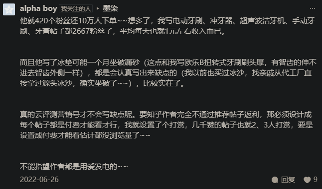
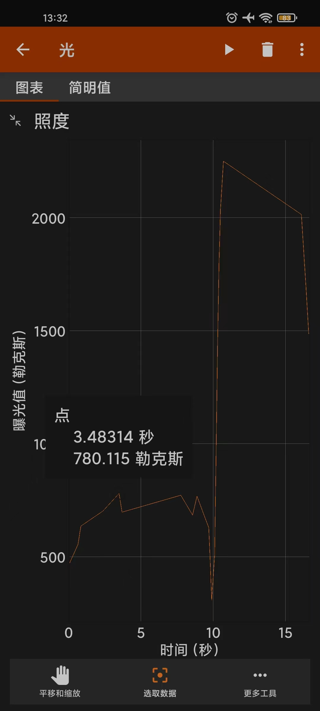
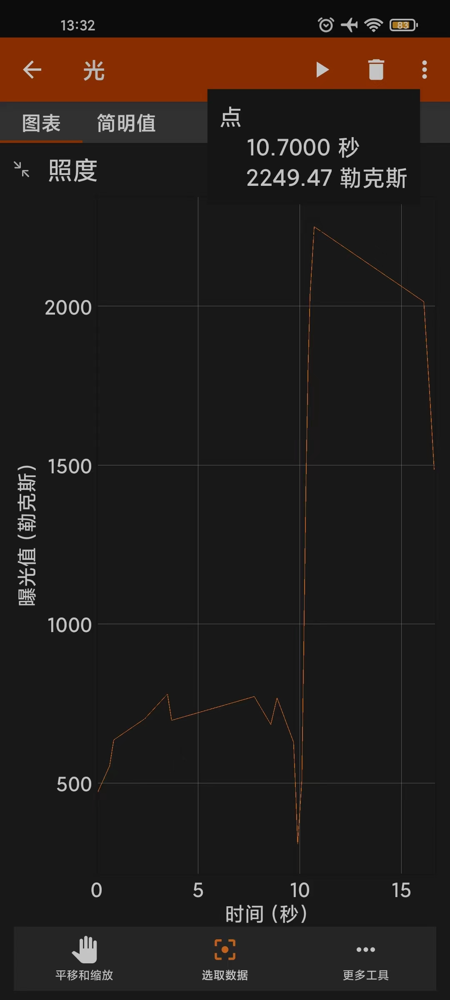
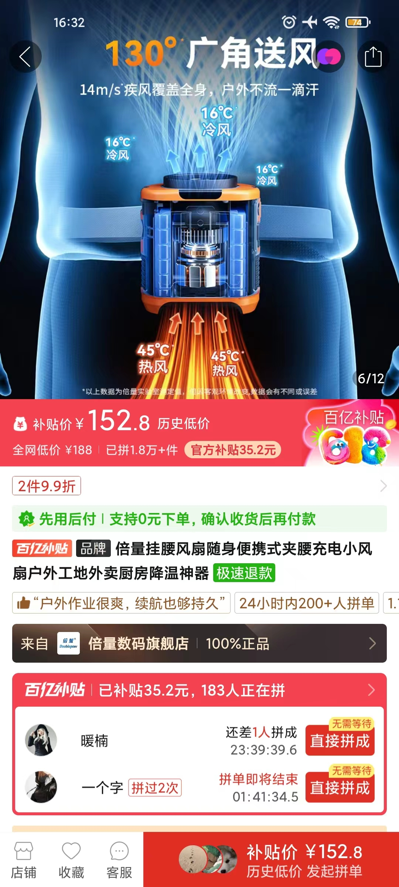
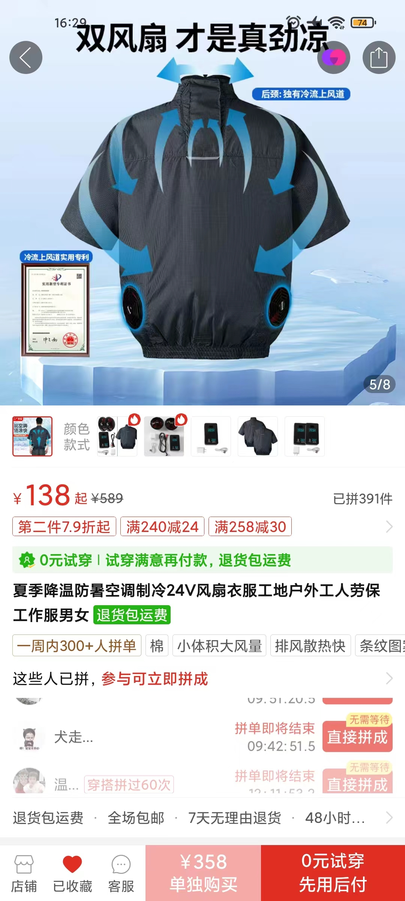
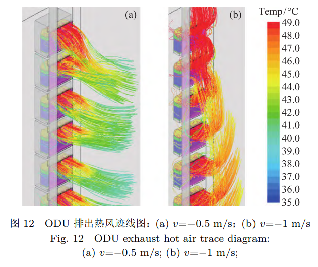
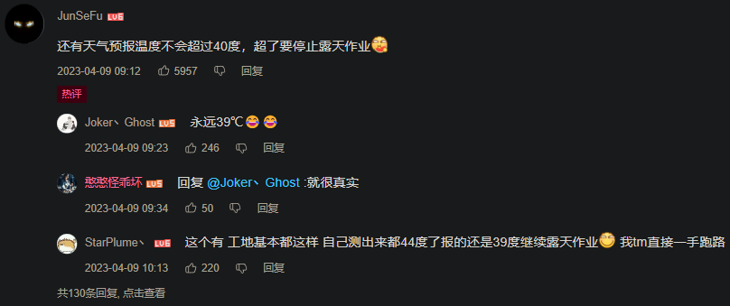
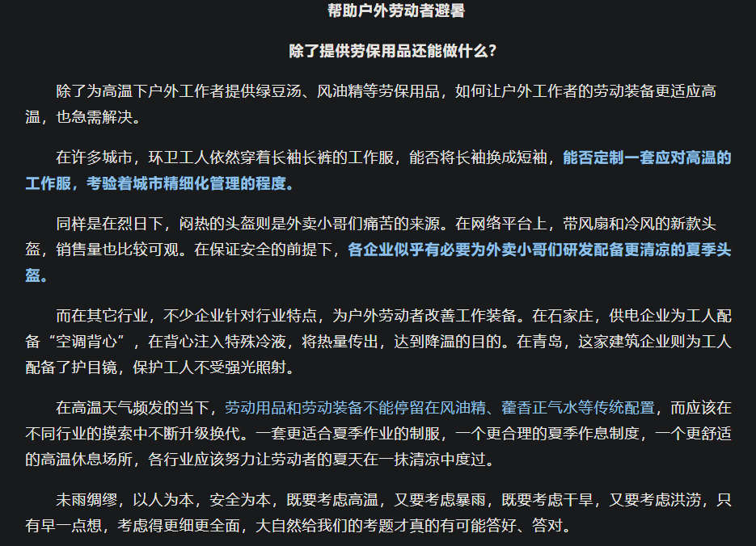

- 本文主版本的几种查看方式
	- 博客网页（我手动更新）： https://khtazmt.github.io/#/page/%E5%A4%8F%E6%97%A5%E7%88%86%E6%94%B9%E5%8C%85
	  logseq.order-list-type:: number
		- 国内可能不便访问github，可以在软件steam++中加速github
	- ((65964bbc-7743-4c1e-8185-a61725fe6e2e))（即时自动更新，但免费版本好像不支持分享者之外的人编辑，不确定能有多大用，但可以拿来在本地编辑、学习）： ((6651bbc2-907d-476b-b14c-51cc17933ff6))
	  logseq.order-list-type:: number
	- 飞书文档： https://nvvkdqimzw9.feishu.cn/docx/JNWDdmPFyo85rdxPhhecvmfUnJd?from=from_copylink
	  logseq.order-list-type:: number
		- 不一定更新几次，因为md文档“导入为在线文档”只能在一开始导入一次
		- ((65bcbf4a-0d20-4136-a209-893ff69421b3))（可能这次用不着）
			- 飞书文档“任务列表”“复选框”（“但是单选”，如果要多人点？）
- 编辑方式
	- 飞书文档里直接编辑或==在此文档群交流==（然后我会整理，或者先理论理论）可能比较高效，因为我一般比较熟悉相关内容，且看上去可能比较会整理东整理西，还因为时间关系（包括“我要在更感兴趣的内容上浪费更多时间！”），并非所有相关内容都已经（详细地）搬到这儿或给出（容易看的）链接，这个“目录”、“写作大纲”里的具体内容我究竟折腾到了什么程度（“消息可靠吗？”——一般以“？”结尾的就是还不太懂、不太确定中不中的，带“TODO”等待办标记的大概是可以试着折腾而不用太担心连环撞车的，而“相当一部分”内容需要“文字描述”，毕竟不能指望大部分受众看这 ((664df554-88e8-45b8-a4fe-443bd39c92ce)) 就很喜欢就“噢噢IC”），可能其他参与者会比我更不清楚——所以我提供一般低延误的人工咨询服务，==疑似缺啥、拒绝重复劳动等就问我==
		- 
- ---
- 可能发布时间（可能多次发布）：高考结束（6.8/9/10）、端午节（6.10；虫蛇）、高考出分6.23~25、录取通知书、庆祝结束后、中考结束、 ((664ddf18-1220-4d7e-8ff3-238985dfb6f4)) 、暑假、开学（清北大概8.18左右）、军训、新生运动会
- 制作节奏：可能做完些“更基础的”，剩下的“点播”、让受众参与进来“干中学”
- 动态
	- ((4eedd2d5-4f80-4fb7-998a-55a2116dc5d6))
		- 
		  id:: 6674b04c-7354-473b-9611-08605fae7947
	- 在今后的盛夏中，我们准备了很多我们搜集、整理、认证的健康生活知识，帮助劳动者及其家属健康快乐地穿越夏季并茁壮成长、憧憬未来，包括但不限于如何做到不怕热、更强壮、更好看、蚊不叮、省电费、防中暑和晒伤、把握夏季时光“冬病夏治”
		- 对于长时间近距离用眼工作/学习者，如何控制近视、视疲劳等眼部问题和久坐相关问题
		- 对于学生，如何充分利用暑假多交朋友，解决“原生家庭”问题，为接下来的军训、校园生活等作准备
	- 后续将给出文章和视频
	- 期待的话请多多为我们点赞转发吧！
- 视频
	- 拍成若干人的短片？
		- 从“打铁”开始？
	- TODO “内容确实不算很少，那就先剪个文档宣传片吧”
		- 音频
		  collapsed:: true
			- [Far Too Loud - Firestorm - YouTube](https://www.youtube.com/watch?v=uPjmiLNX8Ok)（巧了，未圣散步讲话剪完14秒正好停顿一下“燥”出来）
			- ((65b70125-6ba8-48a7-8c2a-92d9538ceb24))
			- ((666687f9-086e-4c4a-94ee-a61c17f379cd))
			- ((665a9b31-1ed1-4b6a-bcbd-8adb80b8ae01))
			- ((664f2846-0f45-4466-81f5-b308fd8497c9))
			- [D-Fence - Covid-19 - YouTube](https://www.youtube.com/watch?v=ly1MfjnIkX0)（1:11——“心忧炭贱愿天寒”，但是反向是吧？）
		- 视频
			- ((65b70125-6ba8-48a7-8c2a-92d9538ceb24))
			- [【【4K顶级画质60FPS】蔡徐坤《只因你太美》原版完整版现场！一晃眼6年过去了】 【精准空降到 00:49】](https://www.bilibili.com/video/BV1ct4y1n7t9/?share_source=copy_web&vd_source=24175964b0df2fcc2c022cae23517fdc&t=49)
		- 图片
			- 问题截图
- ---
- 这是我在捣鼓的（时间可能更多花在找各种“证据”上了，部分可能归属于这些引用链接在其他页面的上级块） {{query (and (page [[夏日爆改包]]) (task DOING))}}
- 大家可以（优先）挑一些我标记的TODO，然后“接手通知”、链接、摘抄、截图、（你的）评论啥的发群里，有必要（比如万一多了记不住）我加个“姓”或你自定义的标签，可在博客网站搜索到 {{query (and (page [[夏日爆改包]]) (task TODO))}}
  collapsed:: true
- ---
- 任务
	- # WHAT IS YOUR MISSION IN SUMMER！
	  id:: 66542b35-f763-4035-bdba-e2e375596807
	- 清凉夏日特别爆改行动
	- 自然地炼体变强，战胜“热肿（怂）”，穿越夏季
		- “夏季的印象”，并不总是碧海蓝天、干爽沙滩、悠闲飞舞鸣叫的海鸥、清凉的海风和帅哥辣妹、往返起落的排球，也不是一瞬深秋的空调房、红脆冰甜的爽口西瓜、屏上跃动的斑斓影像，还有毒辣眩目的太阳、聒噪不绝的蝉鸣、争分夺秒的热风、滚烫蒸腾的沥青路、咸咸的汗水、黝黑的皮肤
		- “是挑战也是机遇”
	- 在此期间，尽你所能训练，做最优质的战士，掌握回溯时间的法力，如闪电般归来（或“初次见面”），拯救所有人！
		- [Life In Reverse - NIVIRO - 单曲 - 网易云音乐](https://music.163.com/song?id=1468382716)
		- ((66542b35-f763-4035-bdba-e2e375596807))
			- {{embed ((6657c27f-ef13-493e-87aa-9295edf6d5ff))}}
- “精神氮泵”
  id:: 664f4e90-f8f7-49d5-b83f-a32c6dc30249
	- [【4K/无损】周杰伦《阳光宅男》MV - 流一点汗，让美女缺氧！_哔哩哔哩_bilibili](https://www.bilibili.com/video/BV1VP4y1K7p8)（“别说你不能~woow~”）
	  id:: 664f2846-0f45-4466-81f5-b308fd8497c9
	- ((66335be1-4def-4ff7-8f3e-1e19070b229c))
		- ((6650780c-5fc9-463e-bca6-7d79642e3742))
	- “真有魔法吗？这个世界真有魔法吗？你相信魔法吗？你是否认为这个世界充斥着魔法？如果你能看到蛛丝马迹，你是否希望掌握它们？”
	  collapsed:: true
		- [复旦保送天才押中2023高考作文！_哔哩哔哩_bilibili](https://www.bilibili.com/video/BV1Nk4y1p74z)
			- [【生存论】人生是一条单行道？所以要及时行乐？当然不是！情况比你想象的复杂无数倍_哔哩哔哩_bilibili](https://www.bilibili.com/video/BV1CZ4y197Ck)
			  id:: 664f4fd4-7cb2-40ed-a640-23ac6abb808c
	- ((66861e76-62e9-4c56-97ee-c18a91f7cab8))
- ---
- # ==以下已开始制图，（可能）用ABC标识完成状态==
  id:: 666fed31-3b62-478a-b46f-6e5521c7b078
- 高温天气/“热”
  id:: 664d8011-0a7a-42d7-92c0-69fa945b638a
	- “迪丽热吗？”
	- “天很热，工作/学习很苦，我很难受，心情烦躁，不想思考，就想吹空调，吃冰镇西瓜、乐事薯片，喝冰镇可乐，”
	- [Heat and Health](https://www.who.int/news-room/fact-sheets/detail/climate-change-heat-and-health)
	  id:: 6651ccd0-d055-4fab-be18-e265dc344b0f
	- [衞生防護中心 - 夏日炎炎慎防中暑](https://www.chp.gov.hk/tc/static/90064.html)
	  id:: 664f06ef-2578-47ac-b939-cf827465d5cf
	- ((65bcbf4a-9e93-444b-abf8-8d4254e5989c))
	- 热适应
	  id:: 665287d5-1840-474e-bf0e-ffcdd0c96aad
	  collapsed:: true
		- 通过皮肤、（从血液中抽水排热的）汗液在体表散热，通过穿堂风等“自然风”、速干衣服、人动或机器动的空气流动加快汗液蒸发和蒸发吸热，开窗通风引入低于室内温度的“自然风”（“大自然是有橐龠、压缩机的”），的“”降低环境温度加快导热
		- 增强身体的耐热能力
		- 被动散热
		- （减少）产热
		- ---
		- 就算空调“是好的，而且没有任何坏处”，也较难在户外随时随地使用，而不耐热可能极大影响运动、线下社交等方面的行动力和安全
		  id:: 664d7803-6b81-45c3-a3d9-ec757340d002
		- ((6652a9ec-ca74-4038-9fc7-60aff1b35167))
		- “主动招热”
		  collapsed:: true
			- 脱敏（让人体的温度感受器别太敏感）
				- 通过较短时间较高温度/热量给人体的温度感受器脱敏
				- 心理脱敏
					- “忍着”
					- “舍生忘死”
					- “心静自然凉”
						- ((66335c32-33a2-4414-800a-803b8ba2e353))
					- “分心”——忙得不易“热乎？”
						- “别热，我在思考！”
						- “煮不在乎”
					- “不论汗流浃背，胜似空调滴水”
						- TODO “汗流浃背了吧，老弟”
						  id:: 666c1469-2649-4fd6-9f23-5f611cc348cd
			- 主动散热（静态人力、动态人力）
		- 被动散热（无动力、有动力）
			- 减脂/降低体脂率（减小保温层厚度，降低表面质量比，降低人体的被动保温能力，提升被动散热能力）
			  id:: 6652f71f-c903-4791-9264-6a2be120dff4
			  collapsed:: true
				- “能忍就不用其他降温手段”——主动散热也消耗能量
				- TODO 减脂说法（可能不用）
				  collapsed:: true
					- 在现代劳役生活中堆积出来的“垃圾”脂肪往往是既不能在炎热环境有效散热、又不能在严寒环境中有效产热（棕色脂肪组织很低）、还不能短时间适应饥饿加速代谢（要不然平时为什么会胖呢？）避免在脂肪大量消耗前就饿死的沉重负担
						- {{embed ((666adfa1-5e9c-4c82-8a05-fefa693793dd))}}
					- 有很多新颖但有争议的，同时，包括前者在内，有很多营销成分公然占据你的你不得不看的视频平台推送流，而非收费或不收费的高质量研究论文和书籍
				- “都试试”
				- [1个多月瘦了42斤 我到底经历了什么_哔哩哔哩_bilibili](https://www.bilibili.com/video/BV1ev411a7cm)
					- [两个月练出6块腹肌，但我却不快乐了。。。。。。_哔哩哔哩_bilibili](https://www.bilibili.com/video/BV1mg411u77i)（“能不能搞快点？这死要老二次元身份乱来活受罪的训练方案疑似有点欲速则不达了”）
						- [健身一年半，我终于放弃了精神内耗_哔哩哔哩_bilibili](https://www.bilibili.com/video/BV15B4y137J6)
				- ((6653f2b6-0ed5-42d8-a978-032ae8432312))
				- ((657a53f7-4140-470c-b802-e283f774cc45))
		- ((6653f6b8-3afe-4c4b-8a27-4c33efdb741d))（“冰火两重天”，“炼体”的最激烈的部分，进一步增强人体的调温能力；“哥们一块来热辣滚烫嗷”）
		  collapsed:: true
		  :LOGBOOK:
		  CLOCK: [2024-05-26 Sun 08:34:03]
		  :END:
			- 有条件还可尝试 ((66335bd5-8ede-4627-a031-6b602d049970))
		- ((6669611d-3fc4-4c1e-a2d0-eed20a668838))
		- ((65a9d480-f240-4ff5-9072-8ed1d4e334d6))
		- ((6653f2b8-5ef9-44e3-bea8-2f41d77b5964))
			- [研究发现，年轻人的耐热能力可能会因缺乏锻炼而暴减](https://mp.weixin.qq.com/s/X2Kl3tIDCDK7iqj89wdhcA)
			  id:: 667b89da-de52-4cc6-8202-eaae4398fe46
		- [[营养素、膳食补充剂]]
		  collapsed:: true
			- 心脏支持（人体主动散热增强时，心跳会加快）
			  id:: 66591b42-262e-40ed-9607-4129702edbcc
				- [天气热心跳会加快吗-有来医生](https://m.youlai.cn/video/article/B697D0P48l.html)
				  id:: 666be1e6-3505-4824-8197-8f5043b7307c
				- ((65bcbf49-78bc-4443-9bfe-477b7f61e3e8))（食品添加剂即可；一瓶“红牛维生素牛磺酸饮料”约含375mg）
		- ---
		- [Shifting focus: Time to look beyond the classic physiological adaptations associated with human heat acclimation - PMC](https://www.ncbi.nlm.nih.gov/pmc/articles/PMC10988689/)
		- [Short-term heat acclimation protocols for an aging population: Systematic review - PMC](https://www.ncbi.nlm.nih.gov/pmc/articles/PMC9980817/)（老年人群的短期热适应方案:系统评价）
		- [[科普中国]-人体热调节](https://cloud.kepuchina.cn/h5/detail?id=6969128486966644736)
		  id:: 667b89da-bb3e-44a8-8a57-260aec7ba1b1
		- [热适应训练能如何帮助户外工作者度过炎热天气？ | 世界经济论坛](https://cn.weforum.org/agenda/2023/08/how-to-use-heat-acclimation-to-protect-workers/)
		  id:: 666cd3ec-ecbf-479d-be34-247b74ca85e1
		- [高温对跑步影响贼大？你的耐热基因会让你适应它_跑步频道_新浪竞技风暴_新浪网](https://sports.sina.com.cn/run/2020-06-30/doc-iircuyvk1163444.shtml)
		  id:: 666cfa1a-fd66-4cec-990c-d5cf4d76533a
			- id:: 666cfa79-9a55-4294-b75c-175b23ce1a61
			  >丹尼尔·利伯曼（Daniel Lieberman）《综合生理学》发表论文称，人类的耐热性可能源自于我们的祖先，他们需要在正午的非洲大草原上捕猎和放牧。如果不能更好地应对高温，就要被那些耐热性更好的捕食者淘汰。虽然之后人类在这颗星球上开枝散叶，但是不论我们生活在地球的哪个角落，仍旧很大程度上延续了这些古老的耐热基因。
			  所以，不要害怕，高温环境是可以通过适应训练克服的。
				- “怎么又是你？这下书不得不下载了”
					- [丹尼尔·利伯曼 Daniel E. Lieberman(豆瓣)](https://www.douban.com/personage/30119251/)
					  id:: 666d03be-b987-4b4b-af82-77f4b2781715
		- [How to Build Up Your Heat Tolerance for a Hotter World | TIME](https://time.com/6207087/improve-heat-tolerance/)
		- [Deliberate Heat Exposure Protocols for Health & Performance - Huberman Lab - Huberman Lab](https://www.hubermanlab.com/newsletter/deliberate-heat-exposure-protocols-for-health-and-performance)
	- ((66335bd8-363a-4ab8-8bad-a029359fffda))
	  id:: 1071895c-b584-4f8d-99de-a3311f4f56fb
	  collapsed:: true
		- “（应季）穿衣自由”
		- ((665c0696-41e5-4956-a6ad-9fa9a81b81fb))
		  id:: 665a9bfe-7180-4f7a-9fa8-c570bb8e326e
		- 降温脖环
			- 122g [[20240607]]
		- ((664d77c1-1409-4394-9020-98988eca47de))
		- ((d04b86db-4172-4e10-a3e6-c55e9bfb6b7c))（增强散热，合情合理）
		- ((6664f6cb-d62c-4322-9e5e-933bca821acb))
		- ((66287494-3882-4406-8c7d-7300db63e6d1))（==买了==；最好做一个原型出来；避免衣服在衣柜里放发霉了穿不了；包括学生留在学校的衣服）
		  :LOGBOOK:
		  CLOCK: [2024-05-27 Mon 19:12:54]
		  :END:
		- 经期可以将相对闷热的卫生巾换为卫生棉条、月经杯等
		  id:: 66529a3f-b7ad-4fe5-addb-5edbc3b0b2b8
			- TODO ((66554936-9464-4c92-81e1-891eb6848b71))
		- 外在形象改造、社会评价反应模式（不习惯“衣着暴露”、“不符合标准性别特征”/“怂”） #孙 #赤虹社
		  id:: 664de344-9dc2-4bfd-a522-675c5b7fda1a
			- ((664f2846-0f45-4466-81f5-b308fd8497c9))
			  id:: 6652944e-d884-4e20-aefa-64050a1bee9c
			- 身体羞耻
				- “男权主义”的后果？
				- 可能路上看得到你的绝大多数人并非你想象中的会把你联想成变态的美少女/男，他们可能最多主要有一种“奇特”的感觉
					- 而且你很可能不靠他们生活，可以说他们对你的印象和评价（可能不会与别人分享）不是很重要
				- ((66889533-6762-4f9c-b290-32e5c76a7329))
				  collapsed:: true
			- ((66692492-ba63-4e0f-a102-dfb84ba36b42))
			- ((6649d454-31d6-4c7b-b9ab-bdca4f3e0c3c))
			- ((65c750b9-f9e6-4c86-ac85-af0a23d00aa6))
			- ((66643cde-24cf-4f7b-8bec-8f85c5b20dc4)) #孙
				- ((66335bd5-8527-490f-8789-9b8cc2760152))
			- （假性）男性乳腺发育症
			  collapsed:: true
				- “不要怕漏出胸膛~”
					- ((664f2846-0f45-4466-81f5-b308fd8497c9))
				- ((66335bd5-8527-490f-8789-9b8cc2760152))
				- [男性乳房增大（男性乳房发育症） - 症状与病因 - 妙佑医疗国际](https://www.mayoclinic.org/zh-hans/diseases-conditions/gynecomastia/symptoms-causes/syc-20351793)
				- [男生胸部的脂肪很多，胸部凸出来，穿衣服胸前两个“大包”，一直被人嘲笑，该怎么办？ - 知乎](https://www.zhihu.com/question/28963014)
				  id:: 66529493-0487-4cf9-a13e-6a66c637ae08
				- [减掉脂肪胸必须要做的减脂训练（跟练版），有效改善脂肪胸部堆积_哔哩哔哩_bilibili](https://www.bilibili.com/video/BV1AT4y1U7gq)
				- ((6652f71f-c903-4791-9264-6a2be120dff4))
				  id:: 6652f78b-e4fe-4f6b-9241-6c32bbf2565d
				- 塑形（定向拉伸、增肌，应该主要是这样）
				- ---
				- “原神？”
					- [逆天，原神启动要减肥了_哔哩哔哩_bilibili](https://www.bilibili.com/video/BV1Xw4m1y7X7)
			- 大腿粗
			  id:: 6652fce0-b288-4c97-a0d3-9d057be96818
				- [大腿粗，其实是件好事|丁香医生](https://dxy.com/article/170877)
			- ((665c0696-41e5-4956-a6ad-9fa9a81b81fb))
			- ((664dae25-8270-4bd4-98ad-afaf73a1131d))
		- ---
		- ((66335bd5-e17c-4a43-9fd3-6e5e9c176983))（公共场合、杨柳絮、“闷得脱妆我去”）
		  id:: 664d7812-ca16-4590-834f-422536586633
			- 杨柳絮
			  id:: 66595008-69e1-478d-b670-2d49e5c68ed9
				- [进入杨柳飞絮期，如何科学防护？-媒体报道-北京市园林绿化局（首都绿化委员会办公室）](https://yllhj.beijing.gov.cn/ztxx/zlylfxgcyjhj/ylfxdtxx/202405/t20240528_3697271.shtml)（“大家好啊，今天来点大家想看的春日爆改包！”）
				  id:: 66594f6a-7962-4eae-920a-b7d5710e27fb
				- [夏天到了，为啥柳絮们还总是想上天？_百科TA说](https://baike.baidu.com/tashuo/browse/content?id=b35c4763c553370a433cc8a7)
		- ((665063a0-605a-4b0c-b2e8-3ae9f2d10cd4))
		- ((66542b38-24cd-4792-82cd-93de91dbca42))
		- ((665a8f4f-bce4-4da2-871c-2ecde64b145b))
		- ---
		- [Nature Sustainability：清华张如范联合南大朱嘉团队研发出一种多场景适用的人体辐射制冷织物_腾讯新闻](https://new.qq.com/rain/a/20230829A0395Z00)
	- ((65a920d2-243a-442d-9c1c-da33ffd96a2d))
	  id:: 664da59d-3364-460c-aedb-4af236cfd9ba
	  collapsed:: true
		- ((65bef01e-499b-4679-8d0b-aae2ab3e9bca))
		  id:: 66529a3f-6263-4b52-9bdc-c911462d7a12
			- ((666be1e6-3505-4824-8197-8f5043b7307c))
			- 尿液淡黄色
		- ((667b89d9-3297-4bf3-b181-e6856462a1c8))
		- 水果
			- 西瓜
				- 一个人应不应该吃这么大的瓜？
		- 大量出汗/脱水（前）后补充电解质
		  id:: 6656f553-d291-4b56-98e2-6230d0c82b76
			- [[运动饮料]]
				- ((6655e888-8d40-4d5c-9dd0-040bdadab569))
				- [[电解质片]]
		- 低产热食物/食谱
		  id:: 664dcab6-5fb0-49d0-ac8e-8cd5253e7c21
		  collapsed:: true
			- ((6656dfcc-8bf4-4d28-8f46-e9aa5792de87)) 不足以覆盖风险，少让[[外卖骑手]]大热天跑（尤其是中午前后），自己做着吃，自己买菜一次能买更多食物还可以顺路跑步、骑自行车
			- ((66335be5-2067-4804-b83e-3ce63b0b8de0))
			- “凉食”
			  collapsed:: true
			  :LOGBOOK:
			  CLOCK: [2024-05-28 Tue 13:26:17]
			  :END:
				- 或者仅作建议或推荐
				- [一碗凉皮的营养真相：你吃进去的大概只有热量了……_腾讯新闻](https://new.qq.com/rain/a/20200629A0E87D00)
				- DOING ((6655d813-f5c4-4f04-87dd-f0c72c8d5d1b))
				  :LOGBOOK:
				  CLOCK: [2024-05-29 Wed 13:38:48]
				  :END:
				- DOING ((65b70785-3af7-4d85-9b7d-d60be6234190))
				  :LOGBOOK:
				  CLOCK: [2024-05-29 Wed 13:38:40]
				  :END:
				- 米皮（传统配料看起来不是很健康）
					- [自制黑米米皮的做法_自制黑米米皮怎么做_万山红的菜谱_美食天下](https://m.meishichina.com/recipe/131146/)
					  id:: 6655ed3c-f401-4392-b3e3-39ea3ea6dc4d
			- [食物热效应_百度百科](https://baike.baidu.com/item/%E9%A3%9F%E7%89%A9%E7%83%AD%E6%95%88%E5%BA%94/8333143)
			- [暑热天少吃高蛋白食物 “食物热效应”越吃越热 --人民网食品频道--人民网](http://shipin.people.com.cn/n/2013/0814/c85914-22559393.html)
			  collapsed:: true
				- >蛋白质所含能量的30%会变成热量从体表发散出来，而碳水化合物所含热量仅有5%至6%作为热量散失，脂肪则略低，仅为4%至5%。
					- >岂知灌顶有醍醐，能使清凉头不热。——顾况《行路难》
				- 少吃（主要是蛋白质）、错峰（傍晚前或体感温度较高时少吃，尤其是蛋白质）
			- ((66335bd7-e6ae-491d-baa8-ae6fa55a4e5b))
		- ((66335bd5-8678-43d8-b7e2-e8855d857724))
		  id:: 66542b35-e378-4325-954c-6f30a6977133
		  collapsed:: true
			- 水果
				- [裹保鲜膜西瓜暴增细菌？那吃不完的西瓜咋办啊？_澎湃号·政务_澎湃新闻-The Paper](https://www.thepaper.cn/newsDetail_forward_13283849)（放冷藏OK）
				- [撕又撕不掉，吃也吃不得，水果上的贴纸到底干嘛用的？](https://mp.weixin.qq.com/s/oAbZ1X8FNE3NQrO97SiaHQ)
			- 烧烤（“疑似管得有点宽了？”——“鸭肉！”）
				- [“羊肉卷”8成原料是鸭肉？一图分清真假羊肉_澎湃号·湃客_澎湃新闻-The Paper](https://www.thepaper.cn/newsDetail_forward_25038069)
					- TODO >当然，吃到“假羊肉”的消费者并未维权无门，若出现以下两种情况，商家必须承担责任。一是为了让食材更像羊肉而非法使用添加剂，涉嫌违反《食品安全法》；二是并未如实告知产品为合成羊肉，甚至故意隐瞒，就涉嫌违反《消费者权益保护法》《反不正当竞争法》等。
			- TODO 海鲜（购买，包括游客、宰客；海鲜过敏，没吃过的种类少量测试；部分地区的海鲜生食风险）
				- [过两天带孩子媳妇去青岛，住栈桥附近，想吃海鲜去哪呢？听说去海鲜市场买了找排挡加工比较好？ - 知乎](https://www.zhihu.com/question/66392393)
			- ((64631f04-5679-4640-93cb-36876f30ff96))
		- ((666640bb-f8e6-4d76-a172-c6da7ecb8011))
	- 睡眠
	  collapsed:: true
		- ((666a228b-faf9-416d-8208-ab14fc03655c))
		- 早睡早起
		  id:: 665acbe8-3050-4447-9b90-abe2e05889eb
			- 珍惜较凉快时段，少熬夜
			- 晚上早睡均温较低，而白天你可能不在家，空调效率较高
			- ((6666e220-49c5-4655-a1c3-4f1eac37e9ba))
		- ((6653f2b8-4f4b-4603-b5c2-e394a8972a8f))
		- TODO 床品（选品或者简单给个指南）
			- 床垫
			- 凉席
			- 蚕沙枕、决明子枕（“决明子是吧？”）、真丝枕巾等
			- 蚕丝被等
		- TODO 室外午睡
			- 脱衣、树荫、长凳/平石/行军床/垫子草地
			- ((6656f553-542e-49cc-b6ac-b2384a3256f7))？
	- 环境降温
	  collapsed:: true
		- 不用空调和风扇等电器降温（“厨房和卫生间一般有风扇”）
		  id:: 668ce770-9603-4080-9a11-aefe888be8c2
		  collapsed:: true
			- ((668ce772-dad0-43b5-9eec-6b84d4c69a7b))
			- 坐垫
			  id:: 6653f2b7-2487-411f-a994-c3b8d819f448
			  collapsed:: true
				- 痔疮、痤疮？
				- [久坐屁股疼，买什么样的坐垫比较好？ - 知乎](https://www.zhihu.com/question/38691939)（减压、降温）
					- 
					  id:: 66591b42-9ad4-4e77-ade1-7ae5c171bd5e
						- “《简单理解[[信任网络]]》”
				- “空气纤维”坐垫（目前主要是POE材质，一般7元以上可买较小尺寸`35*24*4`的；不同厂家生产的硬度可能不同，偏硬的可能不太适合只穿个薄裤子坐在裸坐垫上，且与化纤摩擦后静电较大）
				- 通风坐垫
				  id:: 6658475b-8d23-41eb-992a-df196913c08f
				  collapsed:: true
					- 开车窗“自然”通风（“立起来的中空三角形或锥形”，略扎，将衣服与坐椅皮隔开、大幅减少闷汗，同时使风流经降温）
					  logseq.order-list-type:: number
					  id:: 6658475d-9b5e-477b-965e-4b67660cffc2
						- 轿车可能在60~80km/h以下行驶时开窗通风比关窗开空调省油，但车速较高时开窗噪声也较大、乘客体验也可能不太好。气温较高时开空调有助驾驶安全
							- [夏天开车，别再为开空调还是开窗犹豫了！教你如何用车更省心！_懂车帝](https://www.dongchedi.com/article/7252608714056745472)
							- [汽车之家|开空调与开窗户那个省油 测试结果让你大跌眼镜|标致308|论坛](https://club.autohome.com.cn/bbs/thread/eed053ca29bdd0cb/15625268-1.html)
							- [实测：开窗和关窗开空调，到底哪个更省油？_腾讯新闻](https://new.qq.com/rain/a/20200418A0907700)
					- 加风扇吹风
					  logseq.order-list-type:: number
					- 接车载空调出风口引风并用风扇吹风
					  logseq.order-list-type:: number
					- （没有车载空调或车载空调没有对应出风口时）半导体制冷（相同制冷功率下，比压缩机制冷耗油、耗电，但较小范围地用于通风坐垫时，应该是更不明显）并用风扇吹风
					  logseq.order-list-type:: number
			- 开窗通风（排热，减少热量堆积）
			  collapsed:: true
				- 没蚊虫（主要还是蚊子，食物不暴露的话苍蝇飞进来也不是什么大问题）的时段可以完全开窗（但有时白天包括中午也可能进蚊子）
				- 穿堂风（可能要换个房间待着以减少风量拐弯损失，比如把电脑搬到客厅北边窗前，床铺放在客厅或阳台）
				  id:: 6653f2b8-4f4b-4603-b5c2-e394a8972a8f
					- 高透纱窗
					  collapsed:: true
						- [差点成了纱窗大冤种，63元自装纱窗详细教程！高透金刚网纱窗女孩子真的可以自装！_哔哩哔哩_bilibili](https://www.bilibili.com/video/BV1EM4y1n7oP)
						- ((66552047-29bb-4d0b-b903-03c0ce419eb5))（假设风速不变，测照度代替？）
							- {:height 1259, :width 563} 普通方孔金刚网 [[20240529]]
								- 
				- ((6658475d-9b5e-477b-965e-4b67660cffc2))
			- ((665287d5-1840-474e-bf0e-ffcdd0c96aad))
			- ((664dcab6-5fb0-49d0-ac8e-8cd5253e7c21))
			- 没外人时可以少穿衣
			  id:: 667b89da-330b-4bdc-9d28-12f73adaafd5
			  collapsed:: true
				- ((66766a35-7197-4c5c-b1a0-56572cc64851))
				- “人们应当想象男性腹毛下方是阴毛和外生殖器，正如人们应当想象女性乳沟两侧偏下是乳房和乳头吗？”
				  id:: 66889533-6762-4f9c-b290-32e5c76a7329
				- 穿短裙、围裙（包括较短的半身围裙；火锅店可能送）、“遮羞布”（可用随便一块布或反光偏热的铝塑救生毯自制）、随便什么布料（“世界名画”般用手挡也未尝不可，但要用双手时可能就不太行了）或不穿（用反光的窗膜、铝塑救生毯或遮光的窗帘遮住桌前侧、窗，或者，“只能看，不能录像，更不能分享、上传，人没有上帝视角——很遗憾呐”）
				  id:: 66765437-dae3-47b4-86c8-884baa959aac
					- ((66335be9-b70e-4f6e-94e6-8365f8b74ba0))
					- ((664da45f-345f-485b-a3c4-6156f9ebf1e0))
					- 穿短裙还可以帮助少坐多站（尤其是男性），因为坐时分腿相对凉快，但也相对容易“走光”（“漏牛至”），那么就可能倾向于站着
					  id:: 66861fe2-e9a1-43dd-8ed6-5523c0b013fa
						- ((66666af9-e634-4f9a-9b80-3f3ebe0cfd25))
						- 穿短裙还可以帮助训练后链，因为蹲下搬运物品可能容易“走光”——当然，搬重物时不蹲下和直背也可能受伤
						  id:: 6687511c-6863-4e29-93ed-58d2edc97182
					- ((668ce772-dad0-43b5-9eec-6b84d4c69a7b))
		- （低噪声）风扇
		  id:: 6650124a-dfbf-48c0-98a7-a661458aaa9f
		  collapsed:: true
			- [【硬核】电风扇，绝不是一分钱一分货！别瞎买循环扇了！高销量+大品牌，实测+盘点，一次搞懂电扇选购！美的格力艾美特小米海尔华凌长城长虹志高_哔哩哔哩_bilibili](https://www.bilibili.com/video/BV13i421Q7Do)
			- TODO 可穿戴风扇（体验、长时间使用是否伤身、电池安全性、使用寿命？）
			  collapsed:: true
				- [空调衣服、挂腰风扇到底哪种更实用？16款户外工作者的降温神器大评测_哔哩哔哩_bilibili](https://www.bilibili.com/video/BV1Xb421i7c8)（“倍量”这种像是比较大牌的没有测）
				- 
				- 
				-
			- 可以朝上吹
				- ((6664f6cb-d62c-4322-9e5e-933bca821acb))
		- 开空调
		  collapsed:: true
			- 集体宿舍拥挤空调外机降低其他空调外机能效和性能的负外部性、“规模不经济”？
			  id:: 66658425-41c1-4064-845d-0de423524913
				- [不同环境风速下建筑外空调室外机热环境分析](http://nht.xjtu.edu.cn/paper/cn/zhangzhuo.pdf)
					- 
				- [拥挤、集聚和城市结构-区域政策研究中心](https://chinareal.nankai.edu.cn/info/1196/8059.htm)
				- [负外部性 (视频) | 外部性 | 可汗学院](https://zh.khanacademy.org/economics-finance-domain/ap-microeconomics/ap-consumer-producer-surplus/externalities/v/negative-externalities)
			- [「汽车空调」到底温度低耗油？还是风量大耗油？5大问题一篇看懂_懂车帝](https://www.dongchedi.com/article/6774926214231491083)
			- ((664d406b-42d4-49c2-9f6e-c76bcbabe422))（“倡议”）
			- 车顶空调
			- 反光（减缓室内空气蓄热升温，在关窗时比较重要；视频：以下品种图）
			  collapsed:: true
				- 单向窗膜反光（白天在家时需要；不贴也可以挂着）
				  id:: 664da45f-345f-485b-a3c4-6156f9ebf1e0
				- 全遮光窗帘（有时有的窗口不用来采光）
				  id:: 6656f553-aac1-4d53-94dc-e1548161ded4
				- 遮光保温窗帘（同上）
			- ((664d8011-d7ec-4c29-87bd-f06b4cfce039))（大概能减少一些风扇功耗损失；链接）
			- 除湿模式
			  id:: 664d8011-707c-440c-9a65-2675f1fdcad5
				- [除湿机是不是智商税？用空调除湿好吗？工程狗用科学告诉你答案！_家电安装_什么值得买](https://post.smzdm.com/p/730289/)
			- 气密
			  id:: 664f2846-86a8-43ba-8fe1-136cc64d7b60
				- TODO ((65ab10fb-1915-428a-bad5-ba7e7675dbb5))
				- TODO 窗缝
				  id:: 666265db-0c62-40ca-9044-49118f6ed5cf
					- 推拉窗缝气密性就很可疑，有些窗还晃晃，或者看起来没抵到窗框
					- 纱窗边缘没并拢、互相漏缝
				- 避免蚊虫从窗缝、纱窗与窗的缝等进入室内
				- 减弱蝉鸣等噪声
				  id:: 665411ae-6900-4fab-abcc-9f0e17f370ce
				- 冬季保暖，继续省（“大家好啊，今天来点大家想看的冬日爆改包！”）
				- 窗帘、（推拉）门也能减缓导热
				- 配合[[空净]]
					- 减少经由同住者感染呼吸道传染病的风险
					- 减少空调滤网、电脑机箱积灰、耗电、清灰频率、打扫时间，延长电脑配件寿命
			- 空调定时关机
			- 防治“空调病”
			  id:: 667b89da-7f38-4d67-b947-fb47fd5a0712
				- 身体热调节能力
					- ((665287d5-1840-474e-bf0e-ffcdd0c96aad))
					- ((6651b2fd-3d2d-4917-a8ba-2a492419c22e))
					- ((667b89da-bb3e-44a8-8a57-260aec7ba1b1))
					- ((667b89da-de52-4cc6-8202-eaae4398fe46))
				- “颈椎”、 ((662ba579-5713-4a7c-9c12-a913980b914d))
					- [通宵吹空调“吹出”腰椎间盘突出_光明网](https://yangsheng.gmw.cn/2021-06/22/content_34939041.htm)
					- [腰突夏季高发？冬病夏治，大热天如何治疗更有效？](https://baijiahao.baidu.com/s?id=1668658254157207551)
					  id:: 666579da-b18b-484a-9113-4bfc768b65c9
					- [为什么骨科医生很少患腰椎间盘突出？医生教你5个护腰方法！_澎湃号·媒体_澎湃新闻-The Paper](https://www.thepaper.cn/newsDetail_forward_24650129)
				- [[眼]]（“更不怎么出门了，看手机电脑电视暑假作业辅导班......眼部健康受损”）
				- 调高温度
				  id:: 66528433-e15d-416e-a481-4f096469b14f
					- 空调破坏耐热性，使人们倾向于参与室内经济？
						- TODO 空调可能减少线下乃至线上社交（找研究）
							- “警惕私人空调打原子化牌！”
							- “不把钱花在空调上，就可以花在森林、海滩或泳池里”
					- 可能有些人夏天除了户外，都是待在空调里，也懒得或不便换衣服，就把空调调得比较低
						- 多层连通，下层会更冷、更需要“御寒”
					- 冷时多穿，热时少穿
				- 空调滤网
				  id:: 664d8011-d7ec-4c29-87bd-f06b4cfce039
					- 空调滤网积灰不清洗也可能吹出更多成分复杂的 PM2.5 等加剧污染，造成鼻炎症状（“什么嘛，我说怎么有点鼻塞了，原来是我爸开空调了”）
					  id:: 66335c04-c658-4375-a237-2b09751998c9
						- [空调吹久会缺氧？PM2.5 会上升？真相都在这！ - 知乎](https://zhuanlan.zhihu.com/p/343932269)
						- [【橘帮帮家政】三分钟教会你如何在家清洗空调_哔哩哔哩_bilibili](https://www.bilibili.com/video/BV1GN4y1C7TP)
						- [一分钟了解「中央空调清洗」过滤网「清洗」方法 - 知乎](https://zhuanlan.zhihu.com/p/355456237)
					- ((665a7cc2-afef-414f-9036-23de8e09bb02))（空调当中低过滤效率的[[空净]]用）
					- ((66335bd5-e17c-4a43-9fd3-6e5e9c176983))
				- 空调挡风板
				- ((65ae0902-a975-4629-a10c-1d4f3f67c68f))
		- 别处避暑纳凉
		  collapsed:: true
			- 图书馆、纳凉点、森林、海边、山洞等，主要在白天，可能用图书馆等公共场所的空调
			- ((65b70125-6ba8-48a7-8c2a-92d9538ceb24))
			- ((664d7812-ca16-4590-834f-422536586633))
			- 外卖骑手驿站/休息点
			  id:: 6656f553-542e-49cc-b6ac-b2384a3256f7
				- [26000家蓝骑士驿站，请所有外卖骑手歇歇脚_腾讯新闻](https://new.qq.com/rain/a/20200909A0PLZX00)
					- >除了茶叶、枸杞、零食、雨衣，驿站的柜子里还放有卫生巾等女性用品，方便女性骑士。
						- ((66529a3f-b7ad-4fe5-addb-5edbc3b0b2b8))
		- TODO （工作场所）虚报温度？（解决方案）
		  collapsed:: true
			- 高温津贴
			  id:: 6656dfcc-8bf4-4d28-8f46-e9aa5792de87
				- ((65c6fa81-7a8b-4ddf-9aa1-b412d1b45036)) 9.1.3
			- 
			- ((664d7803-6b81-45c3-a3d9-ec757340d002))
		- ((66335bd5-1bf3-4d00-bd31-9460e5b62dca))
		  :LOGBOOK:
		  CLOCK: [2024-05-25 Sat 18:04:37]
		  :END:
		- 夜间关灯/减少照明能降温吗？（通过减轻压力、降低代谢率？）
		  id:: 66509a97-0df2-44fa-a6bf-b4f7344a7cb2
	- ---
	- ((65bef01e-6c50-489b-8678-edc291a9be9e))
	  id:: 6653f2b8-5ef9-44e3-bea8-2f41d77b5964
	  collapsed:: true
		- [请收好这份夏日运动指南_国家体育总局](https://www.sport.gov.cn/n20001280/n20001265/n20066978/c24323571/content.html)
		- TODO ((66335bd4-0911-445f-bfb3-b5002bdb20d1))
			- 游泳、水上运动、海边游玩
			- [夏天应该怎么过_哔哩哔哩_bilibili](https://www.bilibili.com/video/BV1Ah4y1772J)
		- TODO 夜跑夜骑安全
	- 烫伤
	  collapsed:: true
		- 露天停放的车表面、坐垫（树荫、车罩、用前盖块布、提前开窗开门）
		- 手机过热（玩、往地上一放、汽车导航支架晒太阳）
			- 耗电过快、关机、烫伤、爆炸、影响电池寿命
		- 滑梯（“这是碰都不能碰的滑梯！”；公园等）、长凳、金属扶手
		- ((d04b86db-4172-4e10-a3e6-c55e9bfb6b7c))
		- ((66966270-94b9-4dbc-a1b4-ec2a17a8e615))
	- 中暑、晒伤 #韩
	  id:: 664d83e1-94aa-4b18-8ba6-1392a857d867
	  collapsed:: true
		- ((664f06ef-2578-47ac-b939-cf827465d5cf))
		- ((6651ccd0-d055-4fab-be18-e265dc344b0f))
		- TODO 热防护缺失或不完善的情况（讨论补充）
			- [[外卖骑手]]可能想送背着的多单硬撑
				- 附近有有冰块、冷饮的商铺或运输冷饮的骑手？（也许骑手都会）
			- 导游
				- [北京一导游中暑身亡，当天工作细节披露！_新浪新闻](https://news.sina.com.cn/s/2023-07-09/doc-imzaazyi5862041.shtml?tj=cxvertical_pc_pager_spt&tr=174)（导游也可能、甚至更可能硬撑）
					- 
					  id:: 6652add6-1a5b-4c4b-90f5-51080f93a091
			- 塔吊司机、货车司机等可能落单
				- [近30米高空塔吊司机中暑晕倒，消防绳索救援_腾讯新闻](https://new.qq.com/rain/a/20210706A0CCKV00)
					- >当然，消防部门也要借此提醒广大市民：预防中暑，露天工作时间不宜过久，尽量采用轮换或者间隙作业；降低劳动强度，备好防暑降温饮料，尽量多补充淡盐开水或含盐饮料；要保证充足睡眠，多吃些营养丰富的水果和蔬菜；**尽量穿透气、散热的棉质衣服**。一旦发现中暑现象，应该及时就医。
				- [工人中暑晕倒在60米高塔吊！鹤山工友，室外作业这些安全事项要注意～_腾讯新闻](https://new.qq.com/rain/a/20220715A05X9G00)
				- [货车司机在车内重度中暑，幸好他们及时发现！|保安|服务区|小货车|驾驶员|油门当刹车_网易订阅](https://www.163.com/dy/article/IBVC7HDK0552JR7A.html)（在车上睡眠没开窗开门或开空调，但可能有时开窗开门或开空调也不够；如果周围没人看就更危险了；他还喝了酒）
				- [【党史学习教育】司机高温中暑，收费员紧急施救](https://m.thepaper.cn/baijiahao_13612788)
					- >鸳鸯池收费站副站长张波第一时间意识到司机可能中暑，立刻从站内便民医药箱中拿出**藿香正气水**助其服用
						- [有些中暑不能喝藿香正气，这么多年都喝错了？_澎湃号·湃客_澎湃新闻-The Paper](https://www.thepaper.cn/newsDetail_forward_13905458)
							- id:: 6652a9ec-ca74-4038-9fc7-60aff1b35167
							  >阴暑：如空调吹多了或是空调过冷、经常进出空调房，而引起的恶心、头晕等症状；
				- [高速司机中暑昏迷 中暑后急救的6种方法](https://www.guancha.cn/broken-news/2015_08_02_329072.shtml)
					- >夏季长途跑车，长途司机往往为省钱不开空调
				- ((65c1a60a-c424-44d5-9abd-63575619bdb7))
			- 出租车司机
				- ((665c3b2d-6aab-4838-a775-f6957c99559e))
			- 司机 ((66641823-5cf9-4269-a20f-c91eb4857323))
		- 一次性冰袋（塑料）
		- 冷冻喷雾（如果内容物可燃，那么密闭空间使用不安全）
		- 治疗用的能不能用来预防？
	- TODO 灾害（“可能还不太习惯”；搜索，夏季灾害）
	  collapsed:: true
		- 冰雹
		- 暴雨
			- ((66335bec-7b85-4528-8a8e-5b594912ee46))（逃生、备用物品）
			- 滑倒
			- 触电
		- ((65ca2639-9d83-48ef-8021-c660857f299f))
			- ((66335bec-bad6-4f5f-a08b-ae9d3481c918))
- TODO ((66335c19-c6d4-4498-afe8-e445080da3cd))/“肿”（也可以有点“怂”）
  collapsed:: true
	- ((6284f308-344a-49f5-8948-6d65c3783dff))
		- “蚊子、蝉”
			- “蝉在叫，人坏掉”
				- ((666e746a-417e-4c70-bce0-021c33a4a21f))
				- “朋友，好吃”
	- {{embed ((64a2c9bd-21b2-4115-a029-7238a4cfdf78))}}
	- 不挠痒
	- 止痒/消炎
		- 罗浮山百草油、泰国青草膏、无比滴等
	- 蚊
	  id:: 664d8011-e2fe-44c3-99d9-286bf61da3fb
	  collapsed:: true
		- “蚊肿”
		- “夏季傍晚开始大量生成的微型怪物”
		- 登革热
			- [衞生防護中心 - 登革熱](https://www.chp.gov.hk/tc/features/38847.html)
			- [科普丨漫画图解登革热，让你不再被蚊子“叮！叮！叮！”_澎湃号·政务_澎湃新闻-The Paper](https://www.thepaper.cn/newsDetail_forward_24552577)
			- [登革热媒介伊蚊控制指南](https://www.chinacdc.cn/jkzt/crb/zl/dgr/jszl_2235/201810/P020181010391456228647.pdf)
			  id:: 6662654e-7072-4542-bafe-7e18efefa569
		- [打扫干净场所再工作v2【灭蚊主义】 - 哔哩哔哩](https://www.bilibili.com/opus/934346865165467653?spm_id_from=333.999.0.0) #毛
		- [3种方法来驱除蚊子](https://zh.wikihow.com/%E9%A9%B1%E9%99%A4%E8%9A%8A%E5%AD%90)
		  id:: 665d5622-d67a-4ae3-9d3f-099a2a445ea8
		- [吸引并消灭蚊子的方法！介绍藏身之处和有效的工具_蚊虫_二氧化碳_黑色](https://www.sohu.com/a/647727408_121336882)
		- [The olfactory gating of visual preferences to human skin and visible spectra in mosquitoes | Nature Communications](https://www.nature.com/articles/s41467-022-28195-x)
		  id:: 665d5245-2c5a-49de-9d1e-933b043d1dc6
		  collapsed:: true
			- [New Study Says Mosquitoes Are Most Attracted to One Specific Color](https://www.prevention.com/health/a39024582/red-attracts-mosquitoes/)
			- [网传深色衣服比浅色衣服更容易惹蚊子 实验证实的确如此--24小时滚动新闻--人民网](http://www.people.com.cn/24hour/n/2013/0709/c25408-22137388.html)（“可惜了一篇nature（子刊）”）
				- >为什么深色衣服更容易吸引蚊子?据与本栏目联合主办本次实验的央视二套《是真的吗》栏目专家介绍,蚊子最喜欢弱光,全暗或强光它都不喜欢。深色衣服反射的光线较弱,浅色衣服反射的光线较强,所以深色比浅色更易招蚊子。
				  >此外,深色衣服吸热后人体的温度会升高,人更容易出汗,也会更容易散发出气味,从而引来蚊子。而浅色衣服反射光线后热量低,人体上的气味不易散发,蚊子自带的化学感受器就探测不到了。
		- ---
		- 减少蚊子孳生
		  collapsed:: true
			- TODO 积水
			  id:: 665d50c8-cc1b-4622-9fea-7fc0d143e48c
				- [防蚊灭蚊宣传知识要点](http://www.nhc.gov.cn/jkj/s5899/201602/e9f1d8a4612c4aa3abf5f6fcc727f66f.shtml)
				- ((6662654e-7072-4542-bafe-7e18efefa569))
				- （推拉）窗槽会不会积水？
				- 雨后不漏水的花盆（以及花盆托盘，还不好放小鱼生物防治）是蚊幼虫的孳生场所，打开纱窗，它们就能进来，开了门，就可以坐电梯抵达其他楼层
				- 花瓶（尤其是“水生植物”）、花盆接水盘、浇水、鱼缸（尤其是没有鱼的）
				- 地漏、水槽水管积水？
					- [下水道滋生蚊虫 居民全家上阵上演“人蚊大战”_腾讯新闻](https://new.qq.com/rain/a/20210508A01HB300)
				- （小区等可能有的）不用的游泳池雨后积水，功能包括养蚊子
		- 隔离（“多层防护”）
			- 关窗关门
				- 窗缝（卧室）门缝
					- 推拉窗槽
					- 如果白天没时间看，晚上可以用手机手电筒等照着看
				- “犄角旮旯的都关了吗？比如卫生间可能附的拖把间的窗？”
				- ((664f2846-86a8-43ba-8fe1-136cc64d7b60))
			- 磁吸门帘
				- 磁吸门帘装在门内走道？
			- 光照（蚊子倾向于避开较亮的区域，可以照明覆盖桌下等死角以减少蚊子对裸露的腿部等部位的叮咬，或是帮助将蚊子的路径规划在容易打到的区域）
			- ((6650124a-dfbf-48c0-98a7-a661458aaa9f))（“近防风扇，吹得近不了身！”——而且不用多大的风）
			- 蚊帐（会减少自然风量）
			  id:: 6311e5d1-6abf-47f9-a9da-c111792d975d
				- 坐椅用腿部蚊帐
				  id:: 633175da-b5bf-415b-b5b2-f82285656353
				- 纱网隔间
				  id:: 633175da-f920-405c-8fef-57bc52b7521e
			- 喝
			- TODO 腿震动仪（“一直震动的话大概蚊子就停不了了”）
		- 灭蚊
		  id:: 665d508b-0c4f-4258-b349-288ac0fb6c3b
			- “她只想吸我的血，我却要她的命！”
			- “白加黑”助您安眠
			  id:: 66502b63-ec8c-417d-8f47-7576df8bca2a
			  collapsed:: true
				- 白色不易使蚊子落脚，如果蚊子落脚的话，就更容易被发现，在人类停留区尤其是睡眠区要多搞
				- 黑吸引蚊子停留、躲避，方便人类围剿
					- TODO 深色电蚊器
						- 房间内包括床下等处在内只留一处深暗高电压区
						- 时刻通电、间隔通电或停留/光照感应
						- ---
						- 黑纸黑布+电蚊拍
					- “（暗黑显示器）灭蚊模式”
					  id:: 65bcbf46-4570-4354-aab6-9e8b5fe1a661
						- 蚊子倾向于停在深色表面
						- >前几天升温，这两三天每天至少拍死两三只蚊子，今天要粘第二只蚊子喂小蜘蛛了，谢谢你让我站起来
						- {{embed ((628a1713-cffd-4907-bc03-1fffca627dcb))}}
			- TODO 物理灭蚊（大面积：柔性、电击、声波；投掷、散射/喷雾）
			  id:: 66335c1e-fb36-4d10-90e4-c8c69f55ec50
			  collapsed:: true
				- 柔性电蚊拍
					- 电蚊拍要是能像苍蝇拍那样软就好了，最好再加大，并且适当减少风阻，这样容错率高，最近一两次我是用杂志在天花板和窗帘挡上拍死的
	- ((6650752c-7c6b-437b-aeba-7c3405bc6269))
	- ((65ab10fa-1fe3-4ff0-a931-bcfd92e35518))
		- ((665411ae-6900-4fab-abcc-9f0e17f370ce))
			-
		- ((65bcbf46-7772-4bee-be4a-6b7f8f56a859))
	- 蝽
	- 主要在户外：狗、蜱、蛇
	- {{embed ((66335be1-be8b-4286-9eed-b14567455ea6))}}
- [[交通安全]]
  collapsed:: true
	- TODO 头盔（别嫌热不戴了）
	  id:: 665063a0-605a-4b0c-b2e8-3ae9f2d10cd4
		- 半盔
		- 防晒镜片（透明镜片够吗？）
		- 浅色头盔隔着缓冲材料能明显降温吗？
		- 全盔内风扇？
			- [炎热的夏天给头盔安装“空调”，你会考虑吗？](https://baijiahao.baidu.com/s?id=1603096509434292778)
- ((664d78ae-7a23-4cc4-9f88-1549fa3ec976))
	- ((666579da-b18b-484a-9113-4bfc768b65c9))
	- ((65a9d480-f240-4ff5-9072-8ed1d4e334d6))
	  collapsed:: true
		- 不要只突击晒一天，提前开始适应
		  id:: 664da806-ad86-4548-a4ee-0a5f191874f9
			- “黎明晒一遍，黄昏晒一遍，二十天就把三伏天的背给晒完了，剩下的二十天就用来等天晴”
				- ((65ae08db-7b92-4199-8748-f67f160e0fa5))
			- {{embed ((664d6cd2-0320-4b18-98d7-83904c46fc3b))}}
		- [[防晒]]
			- ((66542a78-6f54-4fc7-a847-e6bf9db73123)) #韩
	- ((d04b86db-4172-4e10-a3e6-c55e9bfb6b7c))
	  id:: 664d8011-462e-4ed4-935e-0a6084e38809
		- ((664f2a2d-a4e4-410a-8d27-6ac17cbbcf92))
		- ((664d8011-e275-4f26-a698-c3604977f78d))（久站足底筋膜炎，正步伤脚踝）
			- [迷彩色的九月 | 国护来教萌新们如何踢正步！](https://www.sohu.com/a/194516966_173997)
		- [[清华大学新生赤足运动会]]（推广用的公开信）
	- ((6653f6b8-3afe-4c4b-8a27-4c33efdb741d))
- ---
- 学生
	- 考生
		- [高考后的暑假，怎么安排才合理、过得有意义？ - 知乎](https://www.zhihu.com/question/31284169)
		- ((664dae25-8270-4bd4-98ad-afaf73a1131d))
		- “报复性娱乐”/“怂”
			- “这把阔了？”
			- 本来好好玩王者和原神的为什么要切换？
			- ((6652f71f-c903-4791-9264-6a2be120dff4))
			- ((667b89d8-b35f-49ec-9508-f05d9a528ef7))
			- [[眼]]
			- ((65c750b9-f9e6-4c86-ac85-af0a23d00aa6))
			- ((664dae2f-6959-43e9-8c7e-b4a39ec13d08))
		- 填志愿
		  collapsed:: true
			- 对接学长学姐“助教”
		- “学习”的误区（“我要看豆瓣高分书！”）
		- 驾考
		  collapsed:: true
			- ((664d8011-0a7a-42d7-92c0-69fa945b638a))
			- ((665c0696-41e5-4956-a6ad-9fa9a81b81fb))
		- 军训
		  id:: 664d8011-e275-4f26-a698-c3604977f78d
		  collapsed:: true
			- 可能参考
				- [【准高一必看05】军训建议/必备清单/注意事项/学姐分享_哔哩哔哩_bilibili](https://www.bilibili.com/video/BV1ZT411u7F2)
				- [大学生生存指南之军训篇_哔哩哔哩_bilibili](https://www.bilibili.com/video/BV15u4y197SS)
				- [一些准备开学军训的经验 - 知乎](https://zhuanlan.zhihu.com/p/260450812)
				- [军训装备指南 | 防晒霜、降温贴、卫生巾等等，教你如何更好的度过军训 - 买错了](https://www.maicuole.com/discriminate/military-training-save-life-guide.html)
			- 军训价值与策略
				- 军训评价体系如果对评优等没啥影响，那么重要的一般首先就是交朋友，在部分专业，这甚至可能影响未来的就业
				- ((66335c16-4ef9-4348-88ac-f6f8db2a5532))
			- 提前适应
			  id:: 664da540-f122-4a58-abee-5367eba74895
				- ((664dae25-8270-4bd4-98ad-afaf73a1131d))
					- [[防晒]]
			- ((66495e6e-d26c-4525-9f18-3ee3d6bbea9f))缓冲
				- ((d04b86db-4172-4e10-a3e6-c55e9bfb6b7c))
				- 卫生巾？
					- [军训的人鞋子里为什么要放卫生巾，拉练是什么？ - 知乎](https://www.zhihu.com/question/402639844)
			- 调整军训内容标准（“校领导你听我说~”）
	- 在校生把自行车从学校长途带回家
	  collapsed:: true
		- TODO 通过铁路等途径运回家（可能简单找个指南）
			- ((66335be7-b0dc-4c97-8639-27b56513efb1))
		- 骑回家（疑似有点特种兵了——“看看”）
			- ((66018a33-3256-4953-94ae-55cf51cc9d69))
	- 家庭
		- 生活费
			- 为了实现饮食等部分，自己买菜会是比较靠谱的举措，因为家人接受新事物不一定比你快，为此，你就需要可以自己支配的钱
			- 你需要了解家里的电费、天然气费/用量及其构成
		- 家庭健康
			- ((66554936-6c6d-4613-8bf8-eed5f0e8fed7))
	- ((65bcbf46-d13d-4540-8724-240889cbd584))
- 夏令营/“快乐暑假”
  id:: 664dae25-8270-4bd4-98ad-afaf73a1131d
	- ((664de344-9dc2-4bfd-a522-675c5b7fda1a))
	- ((664da759-04f1-4e2a-b76e-140da9e9af5a))
	- 组队
		- 联系各地俱乐部，有些项目他们是有的
		- 群
		- 转发（我们的）动态
		- b站用户相似度识别
	- 户外
	  collapsed:: true
		- ((66335bd9-b084-44e0-914b-23d0677a449d))
		- ((d04b86db-4172-4e10-a3e6-c55e9bfb6b7c)) 、 ((66335bd5-37f4-46bf-b8c3-ec7ae5998275)) 、[[自行车]]、[[游泳]]
		  collapsed:: true
			- [[观鸟]]（“顺带的”）
			- {{embed ((6656a69e-ce80-4df6-a31c-69e87eaa69c1))}}
		- （建议）线下集体活动
			- 徒步（赶海）、钓鱼（“烤鱼”）、[[炭烤]]
			- 献血（“亚空间歃血为盟是吧？”）
				- ((666c0b8e-10e4-4e77-9770-e987739e72c3))
			- ((66335be1-be8b-4286-9eed-b14567455ea6))（可以线上）
	- 室内（“网课”）
	  id:: 664dae2f-6959-43e9-8c7e-b4a39ec13d08
	  collapsed:: true
		- [【随便聊聊】为什么在学习中跌倒，远好于在现实中跌倒_哔哩哔哩_bilibili](https://www.bilibili.com/video/BV1iU4y1j7gz)
		- [[简单再生餐]]
		- 买电脑装机
			- [[为什么要用电脑？]]
		- [[软件]]
		- [[Minecraft]]（“怎样玩懂XXX？”）
		- [[审美]]
		- 看论文、写作文
			- ((666bf4bd-4e87-4831-ae56-7e84cdcb12e4))
				- ((666adfa1-e507-4461-9f3c-7942ba388c3d))
			- 学习技能
				- [【切片】脱产学生为什么不愿学习？‖学习就是社会化的劳动力的自我意识及其参与分工能力再生产‖什么是小布尔乔亚？‖我们要与生产资料打成一片_哔哩哔哩_bilibili](https://www.bilibili.com/video/BV1FC4y1Q72L)
				- ((666a47ea-579c-459c-bae6-ce364b194ddb))
					- TODO 把手机等电子设备带入学校
		- 暑假工
			- [【行动建议】坚持劳动者的尊严，拒绝耻辱性的哲学_哔哩哔哩_bilibili](https://www.bilibili.com/video/BV1Xa411W7vU)
			- [【生活建议】不要轻易地退而求其次——以应试教育和劳务派遣为例_哔哩哔哩_bilibili](https://www.bilibili.com/video/BV1ZL411c7J6)
				- “真的吗？我不信！”
			- ((6654595e-f6ee-43c0-80a4-0545148fda4c))（夏季因为环境温度较高而难度较高）
	- #人间蒸发俱乐部
	  id:: 666e27b8-de01-42ca-8dfd-8182e205dea8
		- ((665287d5-1840-474e-bf0e-ffcdd0c96aad))