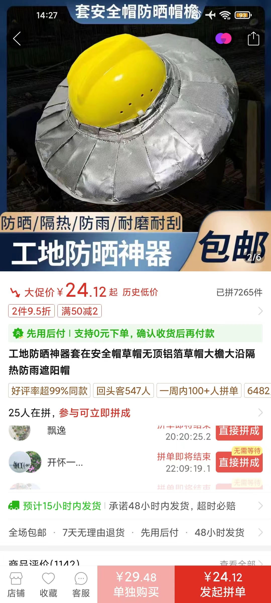

- 本文主版本的几种查看方式
	- 博客网页（我手动更新）： https://khtazmt.github.io/#/page/%E5%A4%8F%E6%97%A5%E7%88%86%E6%94%B9%E5%8C%85
	  logseq.order-list-type:: number
		- 国内可能不便访问github，可以在软件steam++中加速github
	- ((65964bbc-7743-4c1e-8185-a61725fe6e2e))（即时自动更新，但免费版本好像不支持分享者之外的人编辑，不确定能有多大用）： ((6651bbc2-907d-476b-b14c-51cc17933ff6))
	  logseq.order-list-type:: number
	- 飞书文档： https://nvvkdqimzw9.feishu.cn/docx/JNWDdmPFyo85rdxPhhecvmfUnJd?from=from_copylink
	  logseq.order-list-type:: number
		- 不一定更新几次，因为md文档“导入为在线文档”只能在一开始导入一次
		- ((65bcbf4a-0d20-4136-a209-893ff69421b3))（可能这次用不着）
			- 飞书文档“任务列表”“复选框”（“但是单选”，如果要多人点？）
- 编辑方式
	- 飞书文档里直接编辑或==在此文档群交流==（然后我会整理，或者先理论理论）可能比较高效，因为我一般比较熟悉相关内容，且看上去可能比较会整理东整理西，还因为时间关系（包括“我要在更感兴趣的内容上浪费更多时间！”），并非所有相关内容都已经（详细地）搬到这儿或给出（容易看的）链接，这个“目录”、“写作大纲”里的具体内容我究竟折腾到了什么程度（“消息可靠吗？”——一般以“？”结尾的就是还不太懂、不太确定中不中的，带“TODO”等待办标记的大概是可以试着折腾而不用太担心连环撞车的，而“相当一部分”内容需要“文字描述”，毕竟不能指望大部分受众看这 ((664df554-88e8-45b8-a4fe-443bd39c92ce)) 就很喜欢就“噢噢IC”），可能其他参与者会比我更不清楚——所以我提供一般低延误的人工咨询服务，==疑似缺啥、拒绝重复劳动等就问我==
		- 
- ---
- 可能发布时间：高考结束（6.8/9/10）、端午节（6.10；虫蛇）、 ((664ddf18-1220-4d7e-8ff3-238985dfb6f4)) 、暑假、开学（清北大概8.18左右）、军训、新生运动会
- 完成度：可能做完些“更基础的”，剩下“点播”
- 视频
	- 拍成若干人的短片？
		- 从“打铁”开始？
	- TODO “内容确实不算很少，那就先剪个文档宣传片吧”
		- 音频
			- [Far Too Loud - Firestorm - YouTube](https://www.youtube.com/watch?v=uPjmiLNX8Ok)（巧了，未圣散步讲话剪完14秒正好停顿一下“燥”出来）
			- ((65b70125-6ba8-48a7-8c2a-92d9538ceb24))
			- ((664f2846-0f45-4466-81f5-b308fd8497c9))
			- [D-Fence - Covid-19 - YouTube](https://www.youtube.com/watch?v=ly1MfjnIkX0)（1:11——“心忧炭贱愿天寒”，但是反向是吧？）
	- 素材：需要买或做的东西大概要有图片
- ---
- 这是我在捣鼓的（时间可能更多花在找各种“证据”上了，部分可能归属于这些引用链接在其他页面的上级块） {{query (and (page [[夏日爆改包]]) (task DOING))}}
- 大家可以（优先）挑一些我标记的TODO，然后“接手通知”、链接、摘抄、截图、（你的）评论啥的发群里，有必要（比如万一多了记不住）我加个“姓”或你自定义的标签，可在博客网站搜索到 {{query (and (page [[夏日爆改包]]) (task TODO))}}
  collapsed:: true
- ---
- 任务
	- # WHAT IS YOUR MISSION IN SUMMER！
	  id:: 66542b35-f763-4035-bdba-e2e375596807
	- 战胜“热肿（怂）”，穿越夏季
		- “夏季的印象”，并不总是碧海蓝天、干爽沙滩、悠闲飞舞鸣叫的海鸥、清凉的海风和帅哥辣妹、往返起落的排球，也不是一瞬深秋的空调房、红脆冰甜的爽口西瓜、屏上跃动的斑斓影像，还有毒辣眩目的太阳、聒噪不绝的蝉鸣、争分夺秒的热风、滚烫蒸腾的沥青路、咸咸的汗水、黝黑的皮肤
		- “是挑战也是机遇”
	- 在此期间，尽你所能训练，做最优质的战士，掌握回溯时间的法力，如闪电般归来（或“初次见面”），拯救所有人！
		- [Life In Reverse - NIVIRO - 单曲 - 网易云音乐](https://music.163.com/song?id=1468382716)
		- ((66542b35-f763-4035-bdba-e2e375596807))
			- {{embed ((6657c27f-ef13-493e-87aa-9295edf6d5ff))}}
- “精神氮泵”
	- [【4K/无损】周杰伦《阳光宅男》MV - 流一点汗，让美女缺氧！_哔哩哔哩_bilibili](https://www.bilibili.com/video/BV1VP4y1K7p8)（“别说你不能~woow~”）
	  id:: 664f2846-0f45-4466-81f5-b308fd8497c9
	- ((66335be1-4def-4ff7-8f3e-1e19070b229c))
		- ((6650780c-5fc9-463e-bca6-7d79642e3742))
	- “真有魔法吗？这个世界真有魔法吗？你相信魔法吗？你是否认为这个世界充斥着魔法？如果你能看到蛛丝马迹，你是否希望掌握它们？”
	  collapsed:: true
		- [复旦保送天才押中2023高考作文！_哔哩哔哩_bilibili](https://www.bilibili.com/video/BV1Nk4y1p74z)
			- [【生存论】人生是一条单行道？所以要及时行乐？当然不是！情况比你想象的复杂无数倍_哔哩哔哩_bilibili](https://www.bilibili.com/video/BV1CZ4y197Ck)
			  id:: 664f4fd4-7cb2-40ed-a640-23ac6abb808c
- ---
- 高温天气/“热”
  id:: 664d8011-0a7a-42d7-92c0-69fa945b638a
	- “天很热，工作/学习很苦，我很难受，心情烦躁，不想思考，就想吹空调，吃冰镇西瓜、乐事薯片，喝冰镇可乐，”
	- [Heat and Health](https://www.who.int/news-room/fact-sheets/detail/climate-change-heat-and-health)
	  id:: 6651ccd0-d055-4fab-be18-e265dc344b0f
	- [衞生防護中心 - 夏日炎炎慎防中暑](https://www.chp.gov.hk/tc/static/90064.html)
	  id:: 664f06ef-2578-47ac-b939-cf827465d5cf
	- ((65bcbf4a-9e93-444b-abf8-8d4254e5989c))
	- （增强）耐热（能力）/热适应
	  id:: 665287d5-1840-474e-bf0e-ffcdd0c96aad
	  collapsed:: true
		- 就算空调“是好的，而且没有任何坏处”，也较难在户外随时随地使用，而不耐热可能极大影响运动、线下社交等方面的行动力和安全
		- ((6652a9ec-ca74-4038-9fc7-60aff1b35167))
		- 减脂（降低人体的被动保温能力）
		  id:: 6652f71f-c903-4791-9264-6a2be120dff4
			- TODO 减脂说法（可能不用）
			  collapsed:: true
				- 在现代劳役生活中堆积出来的“垃圾”脂肪往往是既不能在炎热环境有效散热、又不能在严寒环境中有效产热（棕色脂肪组织很低）、还不能短时间适应饥饿加速代谢（要不然平时为什么会胖呢？）避免在脂肪大量消耗前就饿死的沉重负担
				- 有很多新颖但有争议的，同时，包括前者在内，有很多营销成分公然占据你的你不得不看的视频平台推送流，而非收费或不收费的高质量研究论文和书籍
			- “都试试”
			- [1个多月瘦了42斤 我到底经历了什么_哔哩哔哩_bilibili](https://www.bilibili.com/video/BV1ev411a7cm)
				- [两个月练出6块腹肌，但我却不快乐了。。。。。。_哔哩哔哩_bilibili](https://www.bilibili.com/video/BV1mg411u77i)（“能不能搞快点？这死要老二次元身份乱来活受罪的训练方案疑似有点欲速则不达了”）
					- [健身一年半，我终于放弃了精神内耗_哔哩哔哩_bilibili](https://www.bilibili.com/video/BV15B4y137J6)
			- ((6653f2b6-0ed5-42d8-a978-032ae8432312))
			- ((657a53f7-4140-470c-b802-e283f774cc45))
		- ((6653f6b8-3afe-4c4b-8a27-4c33efdb741d))（“冰火两重天”，进一步增强人体的调温能力；“哥们一块来热辣滚烫嗷”）
		  :LOGBOOK:
		  CLOCK: [2024-05-26 Sun 08:34:03]
		  :END:
			- 有条件还可尝试 ((66335bd5-8ede-4627-a031-6b602d049970))
		- ((65a9d480-f240-4ff5-9072-8ed1d4e334d6))
		- ((6653f2b8-5ef9-44e3-bea8-2f41d77b5964))
			- [研究发现，年轻人的耐热能力可能会因缺乏锻炼而暴减](https://mp.weixin.qq.com/s/X2Kl3tIDCDK7iqj89wdhcA)
		- [[营养素、膳食补充剂]]
		  collapsed:: true
			- 心脏支持（“欸！”）
				- ((65bcbf49-78bc-4443-9bfe-477b7f61e3e8))（食品添加剂即可；一瓶“红牛维生素牛磺酸饮料”约含375mg）
		- ---
		- [Shifting focus: Time to look beyond the classic physiological adaptations associated with human heat acclimation - PMC](https://www.ncbi.nlm.nih.gov/pmc/articles/PMC10988689/)
		- [Short-term heat acclimation protocols for an aging population: Systematic review - PMC](https://www.ncbi.nlm.nih.gov/pmc/articles/PMC9980817/)（老年人群的短期热适应方案:系统评价）
		- [How to Build Up Your Heat Tolerance for a Hotter World | TIME](https://time.com/6207087/improve-heat-tolerance/)
		- [Deliberate Heat Exposure Protocols for Health & Performance - Huberman Lab - Huberman Lab](https://www.hubermanlab.com/newsletter/deliberate-heat-exposure-protocols-for-health-and-performance)
	- ((65a920d2-243a-442d-9c1c-da33ffd96a2d))
	  id:: 664da59d-3364-460c-aedb-4af236cfd9ba
	  collapsed:: true
		- 水（尿液淡黄色）
		- 大量出汗/脱水（前）后补充电解质
		  collapsed:: true
			- [[运动饮料]]
				- ((6655e888-8d40-4d5c-9dd0-040bdadab569))
			- TODO [[电解质片]]
		- 低产热食物/食谱
		  id:: 664dcab6-5fb0-49d0-ac8e-8cd5253e7c21
			- ((6656dfcc-8bf4-4d28-8f46-e9aa5792de87)) 不足以覆盖风险，少让[[外卖骑手]]大热天跑（尤其是中午前后），自己做着吃，自己买菜一次能买更多食物还可以顺路跑步、骑自行车
			- ((66335be5-2067-4804-b83e-3ce63b0b8de0))
			- “凉食”
			  collapsed:: true
			  :LOGBOOK:
			  CLOCK: [2024-05-28 Tue 13:26:17]
			  :END:
				- 或者仅作建议或推荐
				- [一碗凉皮的营养真相：你吃进去的大概只有热量了……_腾讯新闻](https://new.qq.com/rain/a/20200629A0E87D00)
				- DOING ((6655d813-f5c4-4f04-87dd-f0c72c8d5d1b))
				  :LOGBOOK:
				  CLOCK: [2024-05-29 Wed 13:38:48]
				  :END:
				- DOING ((65b70785-3af7-4d85-9b7d-d60be6234190))
				  :LOGBOOK:
				  CLOCK: [2024-05-29 Wed 13:38:40]
				  :END:
				- 米皮（传统配料看起来不是很健康）
					- [自制黑米米皮的做法_自制黑米米皮怎么做_万山红的菜谱_美食天下](https://m.meishichina.com/recipe/131146/)
					  id:: 6655ed3c-f401-4392-b3e3-39ea3ea6dc4d
			- [食物热效应_百度百科](https://baike.baidu.com/item/%E9%A3%9F%E7%89%A9%E7%83%AD%E6%95%88%E5%BA%94/8333143)
			- [暑热天少吃高蛋白食物 “食物热效应”越吃越热 --人民网食品频道--人民网](http://shipin.people.com.cn/n/2013/0814/c85914-22559393.html)
				- >蛋白质所含能量的30%会变成热量从体表发散出来，而碳水化合物所含热量仅有5%至6%作为热量散失，脂肪则略低，仅为4%至5%。
					- >岂知灌顶有醍醐，能使清凉头不热。——顾况《行路难》
				- 少吃（主要是蛋白质）、错峰（傍晚前或体感温度较高时少吃，尤其是蛋白质）
			- ((66335bd7-e6ae-491d-baa8-ae6fa55a4e5b))
		- 食品安全
			- 水果
				- [裹保鲜膜西瓜暴增细菌？那吃不完的西瓜咋办啊？_澎湃号·政务_澎湃新闻-The Paper](https://www.thepaper.cn/newsDetail_forward_13283849)（放冷藏OK）
			- 烧烤（“疑似管得有点宽了？”——“鸭肉！”）
				- [“羊肉卷”8成原料是鸭肉？一图分清真假羊肉_澎湃号·湃客_澎湃新闻-The Paper](https://www.thepaper.cn/newsDetail_forward_25038069)
					- TODO >当然，吃到“假羊肉”的消费者并未维权无门，若出现以下两种情况，商家必须承担责任。一是为了让食材更像羊肉而非法使用添加剂，涉嫌违反《食品安全法》；二是并未如实告知产品为合成羊肉，甚至故意隐瞒，就涉嫌违反《消费者权益保护法》《反不正当竞争法》等。
			- TODO 海鲜（购买，包括游客、宰客；海鲜过敏，没吃过的种类少量测试；部分地区的海鲜生食风险）
				- [过两天带孩子媳妇去青岛，住栈桥附近，想吃海鲜去哪呢？听说去海鲜市场买了找排挡加工比较好？ - 知乎](https://www.zhihu.com/question/66392393)
			- ((64631f04-5679-4640-93cb-36876f30ff96))
	- ((66335bd8-363a-4ab8-8bad-a029359fffda))
	  id:: 1071895c-b584-4f8d-99de-a3311f4f56fb
	  collapsed:: true
		- “（应季）穿衣自由”
		- ((665015fe-f34e-416e-ac1f-26875e6ae2bd))（还防飞虫）
		- 速干衣
		  id:: 664d77c1-1409-4394-9020-98988eca47de
		- DOING ((66287494-3882-4406-8c7d-7300db63e6d1))（==买了==；最好做一个原型出来；避免衣服在衣柜里放发霉了穿不了；包括学生留在学校的衣服）
		  :LOGBOOK:
		  CLOCK: [2024-05-27 Mon 19:12:54]
		  :END:
		- 经期可以将相对闷热的卫生巾换为卫生棉条、月经杯等
		  id:: 66529a3f-b7ad-4fe5-addb-5edbc3b0b2b8
			- TODO ((66554936-9464-4c92-81e1-891eb6848b71))
		- 外在形象改造、社会评价反应模式（不习惯“衣着暴露”、“不符合标准性别特征”/“怂”）
		  id:: 664de344-9dc2-4bfd-a522-675c5b7fda1a
		  collapsed:: true
			- ((65c750b9-f9e6-4c86-ac85-af0a23d00aa6))
			- ((664f2846-0f45-4466-81f5-b308fd8497c9))
			  id:: 6652944e-d884-4e20-aefa-64050a1bee9c
			- （假性）男性乳腺发育症
				- [男性乳房增大（男性乳房发育症） - 症状与病因 - 妙佑医疗国际](https://www.mayoclinic.org/zh-hans/diseases-conditions/gynecomastia/symptoms-causes/syc-20351793)
				- [男生胸部的脂肪很多，胸部凸出来，穿衣服胸前两个“大包”，一直被人嘲笑，该怎么办？ - 知乎](https://www.zhihu.com/question/28963014)
				  id:: 66529493-0487-4cf9-a13e-6a66c637ae08
				- [减掉脂肪胸必须要做的减脂训练（跟练版），有效改善脂肪胸部堆积_哔哩哔哩_bilibili](https://www.bilibili.com/video/BV1AT4y1U7gq)
				- ((6652f71f-c903-4791-9264-6a2be120dff4))
				  id:: 6652f78b-e4fe-4f6b-9241-6c32bbf2565d
				- “原神？”
					- [逆天，原神启动要减肥了_哔哩哔哩_bilibili](https://www.bilibili.com/video/BV1Xw4m1y7X7)
			- 大腿粗
			  id:: 6652fce0-b288-4c97-a0d3-9d057be96818
				- [大腿粗，其实是件好事|丁香医生](https://dxy.com/article/170877)
			- ((664dae25-8270-4bd4-98ad-afaf73a1131d))
		- ---
		- ((66335bd5-e17c-4a43-9fd3-6e5e9c176983))（“闷得脱妆我去”）
		  id:: 664d7812-ca16-4590-834f-422536586633
		- ((665063a0-605a-4b0c-b2e8-3ae9f2d10cd4))
		- 斗笠
		  collapsed:: true
			- ((6656f553-bef2-4848-90ea-02600fc7ceb9))
		- 安全帽
		  collapsed:: true
			- 铝箔帽檐
			  id:: 6656f553-bef2-4848-90ea-02600fc7ceb9
				- TODO 铝箔主要是包在上面，下面是草帽——这草帽肯定是不咋透气了，如果换成其他材质说不定能更轻
				- 
			- [怎么解决因为热不想带安全帽的问题？ - 知乎](https://www.zhihu.com/question/408068195)
			- [怎么解决安全帽带着热又保证安全的问题？ - 知乎](https://www.zhihu.com/question/394031801)
		-
	- （在贴身衣物之外）降温
		- 不用空调和风扇降温（“厨房和卫生间一般有风扇”）
			- ((664d77c1-1409-4394-9020-98988eca47de))
			- 坐垫
			  id:: 6653f2b7-2487-411f-a994-c3b8d819f448
				- 痔疮、痤疮？
				- [久坐屁股疼，买什么样的坐垫比较好？ - 知乎](https://www.zhihu.com/question/38691939)（减压、降温）
				  collapsed:: true
					- 
						- “《简单理解[[信任网络]]》”
				- “空气纤维”坐垫（目前主要是POE材质，一般7元以上可买较小尺寸`35*24*4`的）
				- 通风坐垫
				  id:: 6658475b-8d23-41eb-992a-df196913c08f
					- 开车窗“自然”通风（“立起来的中空三角形或锥形”，将衣服与坐垫皮隔开，同时能让风流经；轿车可能在60~80km/h以下行驶时开窗通风比关窗开空调省油，但车速较高开窗噪声也较大，气温较高时开空调也有助驾驶安全）
					  logseq.order-list-type:: number
					  id:: 6658475d-9b5e-477b-965e-4b67660cffc2
						- [夏天开车，别再为开空调还是开窗犹豫了！教你如何用车更省心！_懂车帝](https://www.dongchedi.com/article/7252608714056745472)
						- [汽车之家|开空调与开窗户那个省油 测试结果让你大跌眼镜|标致308|论坛](https://club.autohome.com.cn/bbs/thread/eed053ca29bdd0cb/15625268-1.html)
						- [实测：开窗和关窗开空调，到底哪个更省油？_腾讯新闻](https://new.qq.com/rain/a/20200418A0907700)
					- 加风扇吹风
					  logseq.order-list-type:: number
					- 接车载空调出风口引风并用风扇吹风
					  logseq.order-list-type:: number
					- （没有车载空调或车载空调没有对应出风口时）半导体制冷（相同制冷功率下，比压缩机制冷耗油、耗电，但较小范围地用于通风坐垫时，应该是更不明显）并用风扇吹风
					  logseq.order-list-type:: number
			- 开窗通风（排热，减少热量堆积）
				- 没蚊虫（主要还是蚊子，食物不暴露的话苍蝇飞进来也不是什么大问题）的时段可以完全开窗
				- 穿堂风（可能要换个房间待着以减少风量拐弯损失，比如把电脑搬到客厅北边窗前，床铺放在客厅或阳台）
				  id:: 6653f2b8-4f4b-4603-b5c2-e394a8972a8f
					- 高透纱窗
					  collapsed:: true
						- [差点成了纱窗大冤种，63元自装纱窗详细教程！高透金刚网纱窗女孩子真的可以自装！_哔哩哔哩_bilibili](https://www.bilibili.com/video/BV1EM4y1n7oP)
						- ((66552047-29bb-4d0b-b903-03c0ce419eb5))（假设风速不变，测照度代替？）
							- {:height 1259, :width 563} 普通方孔金刚网 [[20240529]]
								- 
				- ((6658475d-9b5e-477b-965e-4b67660cffc2))
			- ((665287d5-1840-474e-bf0e-ffcdd0c96aad))
			- ((664dcab6-5fb0-49d0-ac8e-8cd5253e7c21))
			- 没外人时可以少穿衣
			  collapsed:: true
				- ((664da45f-345f-485b-a3c4-6156f9ebf1e0))
				- TODO 空调可能减少线下乃至线上社交（找研究）
					- “警惕私人空调打原子化牌！”
					- “不把钱花在空调上，就可以花在森林、海滩或泳池里”
			- 睡眠
			  collapsed:: true
				- 珍惜较凉快时段，少熬夜
				- ((6653f2b8-4f4b-4603-b5c2-e394a8972a8f))
				- TODO 床品（选品或者简单给个指南）
					- 床垫
					- 凉席
					- 蚕沙枕、决明子枕（“决明子是吧？”）、真丝枕巾等
					- 蚕丝被等
				- TODO 室外午睡
					- 脱衣、树荫、长凳/平石/行军床/垫子草地）
					- ((6656f553-542e-49cc-b6ac-b2384a3256f7))？
		- （低噪声）风扇
			- [【硬核】电风扇，绝不是一分钱一分货！别瞎买循环扇了！高销量+大品牌，实测+盘点，一次搞懂电扇选购！美的格力艾美特小米海尔华凌长城长虹志高_哔哩哔哩_bilibili](https://www.bilibili.com/video/BV13i421Q7Do)
			- TODO 可穿戴风扇（体验、长时间使用是否伤身、电池安全性、使用寿命？）
			  collapsed:: true
				- [空调衣服、挂腰风扇到底哪种更实用？16款户外工作者的降温神器大评测_哔哩哔哩_bilibili](https://www.bilibili.com/video/BV1Xb421i7c8)
				- 
				- 
				-
		- 开空调
			- [「汽车空调」到底温度低耗油？还是风量大耗油？5大问题一篇看懂_懂车帝](https://www.dongchedi.com/article/6774926214231491083)
			- ((664d406b-42d4-49c2-9f6e-c76bcbabe422))（“倡议”）
			- 车顶空调
			- 反光（减缓室内空气蓄热升温，在关窗时比较重要；视频：以下品种图）
			  collapsed:: true
				- 单向窗膜反光（白天在家时需要；不贴也可以挂着）
				  id:: 664da45f-345f-485b-a3c4-6156f9ebf1e0
				- 全遮光窗帘（有时有的窗口不用来采光）
				- 遮光保温窗帘（同上）
			- ((664d8011-d7ec-4c29-87bd-f06b4cfce039))（大概能减少一些风扇功耗损失；链接）
			- 除湿模式
			  id:: 664d8011-707c-440c-9a65-2675f1fdcad5
			- 气密
			  id:: 664f2846-86a8-43ba-8fe1-136cc64d7b60
			  collapsed:: true
				- TODO ((65ab10fb-1915-428a-bad5-ba7e7675dbb5))
				- 避免蚊虫从窗缝、纱窗与窗的缝等进入室内
				- 减弱蝉鸣等噪声
				  id:: 665411ae-6900-4fab-abcc-9f0e17f370ce
				- 冬季保暖，继续省（“大家好啊，今天来点大家想看的冬日爆改包！”）
				- 窗帘、（推拉）门也能减缓导热
				- 配合[[空净]]
					- 减少经由同住者感染呼吸道传染病的风险
					- 减少空调滤网、电脑机箱积灰、耗电、清灰频率、打扫时间，延长电脑配件寿命
			- 空调定时关机
			- 防治“空调病”
			  id:: 664d7803-6b81-45c3-a3d9-ec757340d002
			  collapsed:: true
				- 调高温度
				  id:: 66528433-e15d-416e-a481-4f096469b14f
				  collapsed:: true
					- 可能有些人夏天除了户外，都是待在空调里，也懒得或不便换衣服，就把空调调得比较低
						- 多层连通，下层会更冷、更需要“御寒”
					- 冷时多穿，热时少穿
				- 空调滤网清洗
				  id:: 664d8011-d7ec-4c29-87bd-f06b4cfce039
				  collapsed:: true
					- 空调滤网积灰不清洗也可能吹出更多成分复杂的 PM2.5 等加剧污染，造成鼻炎症状（“什么嘛，我说怎么有点鼻塞了，原来是我爸开空调了”）
					  id:: 66335c04-c658-4375-a237-2b09751998c9
						- [空调吹久会缺氧？PM2.5 会上升？真相都在这！ - 知乎](https://zhuanlan.zhihu.com/p/343932269)
						- [一分钟了解「中央空调清洗」过滤网「清洗」方法 - 知乎](https://zhuanlan.zhihu.com/p/355456237)（“简单版：可以花钱请人上门清洗，最好看一遍学会”）
					- ((66335bd5-e17c-4a43-9fd3-6e5e9c176983))
				- 空调挡风板
				- ((65ae0902-a975-4629-a10c-1d4f3f67c68f))
		- 别处避暑纳凉
		  collapsed:: true
			- 图书馆、森林、海边、山洞等，主要在白天，可能用图书馆等公共场所的空调
			- ((65b70125-6ba8-48a7-8c2a-92d9538ceb24))
			- ((664d7812-ca16-4590-834f-422536586633))
			- 外卖骑手驿站/休息点
			  id:: 6656f553-542e-49cc-b6ac-b2384a3256f7
				- [26000家蓝骑士驿站，请所有外卖骑手歇歇脚_腾讯新闻](https://new.qq.com/rain/a/20200909A0PLZX00)
					- >除了茶叶、枸杞、零食、雨衣，驿站的柜子里还放有卫生巾等女性用品，方便女性骑士。
						- ((66529a3f-b7ad-4fe5-addb-5edbc3b0b2b8))
		- TODO （工作场所）虚报温度？（解决方案）
		  collapsed:: true
			- 高温津贴
			  id:: 6656dfcc-8bf4-4d28-8f46-e9aa5792de87
				- ((65c6fa81-7a8b-4ddf-9aa1-b412d1b45036)) 9.1.3
			- 
			- ((664d7803-6b81-45c3-a3d9-ec757340d002))
		- ((66335bd5-1bf3-4d00-bd31-9460e5b62dca))
		  :LOGBOOK:
		  CLOCK: [2024-05-25 Sat 18:04:37]
		  :END:
		- 夜间关灯/减少照明能降温吗？（通过减轻压力、降低代谢率？）
	- ---
	- ((65bef01e-6c50-489b-8678-edc291a9be9e))
	  id:: 6653f2b8-5ef9-44e3-bea8-2f41d77b5964
		- [请收好这份夏日运动指南_国家体育总局](https://www.sport.gov.cn/n20001280/n20001265/n20066978/c24323571/content.html)
		- TODO ((66335bd4-0911-445f-bfb3-b5002bdb20d1))
			- 游泳、水上运动、海边游玩
			- [夏天应该怎么过_哔哩哔哩_bilibili](https://www.bilibili.com/video/BV1Ah4y1772J)
		- TODO 夜跑夜骑安全
	- 烫伤
		- 露天停放的车表面、坐垫（树荫、车罩、用前盖块布、提前开窗开门）
		- 手机过热（玩、往地上一放、汽车导航支架晒太阳）
			- 耗电过快、关机、烫伤、爆炸、影响电池寿命
		- 滑梯（“这是碰都不能碰的滑梯！”；公园等）、长凳、金属扶手
		- ((d04b86db-4172-4e10-a3e6-c55e9bfb6b7c))
	- 中暑 #韩
	  collapsed:: true
		- ((66542b38-cee4-438a-b8cb-6c090e6ba21a))
		- ((664f06ef-2578-47ac-b939-cf827465d5cf))
		- ((6651ccd0-d055-4fab-be18-e265dc344b0f))
		- TODO 热防护缺失或不完善的情况（讨论补充）
			- [[外卖骑手]]可能想送背着的多单硬撑
				- 附近有有冰块、冷饮的商铺或运输冷饮的骑手？（也许骑手都会）
			- 塔吊司机、货车司机等可能落单
				- [近30米高空塔吊司机中暑晕倒，消防绳索救援_腾讯新闻](https://new.qq.com/rain/a/20210706A0CCKV00)
					- >当然，消防部门也要借此提醒广大市民：预防中暑，露天工作时间不宜过久，尽量采用轮换或者间隙作业；降低劳动强度，备好防暑降温饮料，尽量多补充淡盐开水或含盐饮料；要保证充足睡眠，多吃些营养丰富的水果和蔬菜；**尽量穿透气、散热的棉质衣服**。一旦发现中暑现象，应该及时就医。
				- [工人中暑晕倒在60米高塔吊！鹤山工友，室外作业这些安全事项要注意～_腾讯新闻](https://new.qq.com/rain/a/20220715A05X9G00)
				- [货车司机在车内重度中暑，幸好他们及时发现！|保安|服务区|小货车|驾驶员|油门当刹车_网易订阅](https://www.163.com/dy/article/IBVC7HDK0552JR7A.html)（在车上睡眠没开窗开门或开空调，但可能有时开窗开门或开空调也不够；如果周围没人看就更危险了；他还喝了酒）
				- [【党史学习教育】司机高温中暑，收费员紧急施救](https://m.thepaper.cn/baijiahao_13612788)
					- >鸳鸯池收费站副站长张波第一时间意识到司机可能中暑，立刻从站内便民医药箱中拿出**藿香正气水**助其服用
						- [有些中暑不能喝藿香正气，这么多年都喝错了？_澎湃号·湃客_澎湃新闻-The Paper](https://www.thepaper.cn/newsDetail_forward_13905458)
							- id:: 6652a9ec-ca74-4038-9fc7-60aff1b35167
							  >阴暑：如空调吹多了或是空调过冷、经常进出空调房，而引起的恶心、头晕等症状；
				- [高速司机中暑昏迷 中暑后急救的6种方法](https://www.guancha.cn/broken-news/2015_08_02_329072.shtml)
					- >夏季长途跑车，长途司机往往为省钱不开空调
				- [北京一导游中暑身亡，当天工作细节披露！_新浪新闻](https://news.sina.com.cn/s/2023-07-09/doc-imzaazyi5862041.shtml?tj=cxvertical_pc_pager_spt&tr=174)（导游也可能、甚至更可能硬撑）
					- 
					  id:: 6652add6-1a5b-4c4b-90f5-51080f93a091
				- ((65c1a60a-c424-44d5-9abd-63575619bdb7))
		- 一次性冰袋（塑料）
		- 冷冻喷雾（如果内容物可燃，那么密闭空间使用不安全）
		- 治疗用的能不能用来预防？
	- TODO 灾害（“可能还不太习惯”；搜索，夏季灾害）
		- 冰雹
		- 暴雨
			- ((66335bec-7b85-4528-8a8e-5b594912ee46))（逃生、备用物品）
			- 滑倒
			- 触电
		- ((65ca2639-9d83-48ef-8021-c660857f299f))
			- ((66335bec-bad6-4f5f-a08b-ae9d3481c918))
- TODO ((66335c19-c6d4-4498-afe8-e445080da3cd))/“肿”（也可以有点“怂”）
  collapsed:: true
	- 不挠痒
	- {{embed ((64a2c9bd-21b2-4115-a029-7238a4cfdf78))}}
	- 蚊
		- 磁吸门帘
		- ((664f2846-86a8-43ba-8fe1-136cc64d7b60))
		- 积水
			- （推拉）窗槽会不会积水？
		- 登革热
			- [衞生防護中心 - 登革熱](https://www.chp.gov.hk/tc/features/38847.html)
	- ((6650752c-7c6b-437b-aeba-7c3405bc6269))
	- ((65ab10fa-1fe3-4ff0-a931-bcfd92e35518))
		- ((665411ae-6900-4fab-abcc-9f0e17f370ce))
		- ((65bcbf46-7772-4bee-be4a-6b7f8f56a859))
	- 主要在户外：狗、蜱、蛇
	- {{embed ((66335be1-be8b-4286-9eed-b14567455ea6))}}
- [[交通安全细节]]
  collapsed:: true
	- TODO 头盔（别嫌热不戴了）
	  id:: 665063a0-605a-4b0c-b2e8-3ae9f2d10cd4
		- 防晒镜片（透明镜片够吗？）
		- 浅色头盔隔着缓冲材料能明显降温吗？
		- 全盔内风扇？
			- [炎热的夏天给头盔安装“空调”，你会考虑吗？](https://baijiahao.baidu.com/s?id=1603096509434292778)
- ((664d78ae-7a23-4cc4-9f88-1549fa3ec976))
	- ((65a9d480-f240-4ff5-9072-8ed1d4e334d6))
		- 不要只突击晒一天，提前开始适应
		  id:: 664da806-ad86-4548-a4ee-0a5f191874f9
			- {{embed ((664d6cd2-0320-4b18-98d7-83904c46fc3b))}}
		- [[防晒]]
			- ((66542a78-6f54-4fc7-a847-e6bf9db73123)) #韩
	- ((d04b86db-4172-4e10-a3e6-c55e9bfb6b7c))
	  id:: 664d8011-462e-4ed4-935e-0a6084e38809
		- ((664f2a2d-a4e4-410a-8d27-6ac17cbbcf92))
		- ((664d8011-e275-4f26-a698-c3604977f78d))（久站足底筋膜炎，正步伤脚踝）
			- [迷彩色的九月 | 国护来教萌新们如何踢正步！](https://www.sohu.com/a/194516966_173997)
		- [[清华大学新生赤足运动会]]（推广用的公开信）
	- ((6653f6b8-3afe-4c4b-8a27-4c33efdb741d))
- ---
- 学生
	- 考生
		- [高考后的暑假，怎么安排才合理、过得有意义？ - 知乎](https://www.zhihu.com/question/31284169)
		- ((664dae25-8270-4bd4-98ad-afaf73a1131d))
		- “报复性娱乐”/“怂”
			- ((65a9d480-dcb8-4078-b919-557a0ceff5df))
			- ((65c750b9-f9e6-4c86-ac85-af0a23d00aa6))
			- ((664dae2f-6959-43e9-8c7e-b4a39ec13d08))
		- 填志愿
			- 对接学长学姐“助教”
		- “学习”的误区（“我要看豆瓣高分书！”）
		- 学车
			- ((664d8011-0a7a-42d7-92c0-69fa945b638a))
			- ((665015fe-f34e-416e-ac1f-26875e6ae2bd))
		- 军训
		  id:: 664d8011-e275-4f26-a698-c3604977f78d
			- 可能参考
				- [【准高一必看05】军训建议/必备清单/注意事项/学姐分享_哔哩哔哩_bilibili](https://www.bilibili.com/video/BV1ZT411u7F2)
				- [大学生生存指南之军训篇_哔哩哔哩_bilibili](https://www.bilibili.com/video/BV15u4y197SS)
			- 军训价值与策略
				- 军训评价体系如果对评优等没啥影响，那么重要的一般首先就是交朋友，在部分专业，这甚至可能影响未来的就业
				- ((66335c16-4ef9-4348-88ac-f6f8db2a5532))
			- 提前适应
			  id:: 664da540-f122-4a58-abee-5367eba74895
				- ((664dae25-8270-4bd4-98ad-afaf73a1131d))
					- [[防晒]]
			- ((66495e6e-d26c-4525-9f18-3ee3d6bbea9f))缓冲
				- ((d04b86db-4172-4e10-a3e6-c55e9bfb6b7c))
			- 调整军训内容标准（“校领导你听我说~”）
	- 在校生把自行车从学校长途带回家
		- TODO 通过铁路等途径运回家（可能简单找个指南）
			- ((66335be7-b0dc-4c97-8639-27b56513efb1))
		- 骑回家（疑似有点特种兵了——“看看”）
			- ((66018a33-3256-4953-94ae-55cf51cc9d69))
	- 家庭
		- 生活费
			- 为了实现饮食等部分，自己买菜会是比较靠谱的举措，因为家人接受新事物不一定比你快，为此，你就需要可以自己支配的钱
			- 你需要了解家里的电费、天然气费/用量及其构成
		- 家庭健康
			-
	- ((65bcbf46-d13d-4540-8724-240889cbd584))
- 夏令营/“快乐暑假”
  id:: 664dae25-8270-4bd4-98ad-afaf73a1131d
	- ((664da759-04f1-4e2a-b76e-140da9e9af5a))
	- 户外
		- ((66335bd9-b084-44e0-914b-23d0677a449d))
		- ((d04b86db-4172-4e10-a3e6-c55e9bfb6b7c)) 、 ((66335bd5-37f4-46bf-b8c3-ec7ae5998275)) 、[[自行车]]、[[游泳]]
			- [[观鸟]]（“顺带的”）
			- {{embed ((6656a69e-ce80-4df6-a31c-69e87eaa69c1))}}
		- （建议）线下集体活动
			- 徒步（赶海）、钓鱼（“烤鱼”）、[[炭烤]]
			- ((66335be1-be8b-4286-9eed-b14567455ea6))（可以线上）
	- 室内（“网课”）
	  id:: 664dae2f-6959-43e9-8c7e-b4a39ec13d08
		- [[简单再生餐]]
		- 买电脑装机
			- [[为什么要用电脑？]]
		- [[软件]]
		- [[Minecraft]]（“怎样玩懂XXX？”）
		- 规划、上学/劳动技能、暑假工
			- ((6654595e-f6ee-43c0-80a4-0545148fda4c))