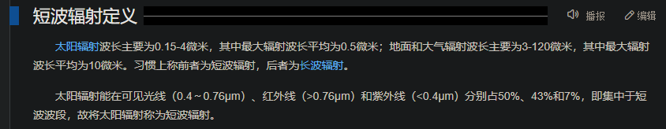

- [[航天]]
  id:: 64631f04-be25-42de-a960-55f0beb1b326
- [为什么目前中国中小学阶段不开设天文课程？](https://www.zhihu.com/question/292535061)
- 地外文明
  id:: 6437d183-ded4-496e-825e-fdbc79354e88
	- 电磁波
		- [中国天眼发现地外文明可疑信号，相关团队正进一步排查，信号如被证实存在这将意味着什么？ - ncc21382的回答 - 知乎](https://www.zhihu.com/question/537647710/answer/2528581418)
	- （未普遍确认发现的）地外存在、地外存在/不属于地球的飞行物
	- 接触符号被垄断扭曲
		- [宇宙骗局揭露、警惕虚假外星入侵、UFO外星人理论真相、宇宙级水门事件、 The Cosmic Hoax: An Exposé -Dr. Steven Greer_哔哩哔哩_bilibili](https://www.bilibili.com/video/BV1Xv411J7xc)
		  id:: 64631f04-307d-44d5-94c5-3ecef743a098
			- [如何评价Dr. Steven Greer的外星人第五类接触系列纪录片？外星人真的已经和人类有接触了？ - 知乎](https://www.zhihu.com/question/427675628)
			- [《宇宙级骗局》 - 知乎](https://zhuanlan.zhihu.com/p/387574357)
			- 我暂时更想学哲学甚至什么都不做，大家感兴趣可以对照研我的回忆大纲（带着偏否认的怀疑态度添油加醋不少，你可以相信某某是秦始皇）确认一下这个视频中观点的真实性
			- 美国官方已经发现了外星人吗？
				- 为什么隐瞒
					- 如果已经得到了力场技术，为什么封锁技术？会损害统治利益吗？
						- 工业集团是法西斯主义者，想要支配整个地球的生产分配模式，并且封锁获取的反重力科技（或者说人造力场）
						- 为了保持“最后这张牌”？
						- 为什么封锁反重力技术，不用于民用乃至实用的军用领域？
							- 一种可能：“与外星人开战后一段时间宣称从意外坠落或击落的UFO逆向工程成功”——这样做有什么好处？就算能解决生产和保密问题，反重力飞行器闪电战能保证获取战略优势而不引发高超音速导弹和核弹反击，或者说强于这些选项吗？如果外星人真存在，它们会阻拦被学习的反重力技术用于人类之间的战争吗？如果会阻拦，那么是否这张牌就算在计划中，实际上也没用？
					- 如果存在“最后的牌”的计划
						- 为什么它是有效的？
							- 外星人会干涉打着恶意外星人旗号的战争动员吗？
						- 战争动员
							- 恶意侵略的外星人形象牌作为美国维持霸权的“最后的牌”
								- 为什么“最后的牌”是它，而非其他？
									- “温水煮青蛙、慢刀子割肉、俄罗斯轮盘赌的新冠不是就挺好？就算只是输得慢点，也比什么都不做能给人添麻烦？
										- “新冠非实验室产物”是（默契）妥协后的共识吗？
									- 核弹远远不够开打[[核战]]
										- 真的主要是核武器保证了冷战后的大和平吗？
									- 常规战争打不过
									- 颜色革命没有可靠支点支楞不起来
									- 有没有一种可能，实际上中美力量对比及其趋势比官方宣传版本还要大得多，于是反映为社会现实？国家强大，人民不一定都差不多富有，反之亦然”）的必要性和可行性，
								- 如果足够多的假UFO开始袭击美国，美国就能朝军工复合体的复兴方向生产吗？
								- 它们能只袭击美国而不袭击美国敌对国家，进而被击落或意外坠落被揭露吗？
								- 还有多少张牌？
								- 恶意外星人形象宣传
									- 是否源于官方已确定无法与外星人合作维持霸权？
									- 外星人电影多为恶意入侵是为了潜移默化民众对外星人的印象（而不是单纯的美国形象宣传？）
									- 还是作为冷战星球大战的假想敌苏联的替代品？（在不引发对苏联的科幻级恐惧的前提下通过比苏联更科幻的外星人来提振美国自信心？）
									- 还是只是找“未来题材”拍片赚钱？
									- 有官媒新闻，有反情报专家的访谈评论
										- 这是否只是一种习惯化的解读？
										- 与走近科学有相似之处吗？
									- TODO 美国艺术界的地外文明威胁论（游戏半条命等）
			- 你们这些人的身份和证据真实吗？
				- 我为国内外多任总统报告，包括俄国普京，我是权威，但是没人采纳我的建议
				- 我们这群UFO专家多年前在白宫开过一个盛大的研讨会，电视转播信号没几分钟被掐得基本无了，看到的人相对很少
				- 我们有证物，老照片，老照片专家看了都说真
				- 上世纪的科学家文稿里就透露着已经发现外星人的事实
				- 我们有证人，证人；证人的家人见过官方研究的；证人是少数族裔，外星人能通过心灵感应传递自己的感觉乃至情绪；证人见证外星人击毁美军往大气层外发射的导弹
				- 我们和不直接提供证据的官方反情报专家打交道套话，他们在隐瞒事实
				- 我们开发了一个​APP用于与外星人沟通，包括一些冥想、音乐等的知识，需要付费3还是6美元
					- [冥想真的能够召唤外星人吗？ - 知乎](https://www.zhihu.com/question/506750812)
			- 就算他们编的故事是假的，也不能否定外星人乃至这种大概遵守自己文明法律或星际法律/条约的中性或中性偏善的外星人的存在
			- 而如果是这样的，那么似乎人类就更有天不怕地不怕的理由了
		- 外星人何时进入人类视野？
			- 第一次核爆后？（还是说增加了监控等级？）
	- 照相机
- 大爆炸？聚变元素，尘埃岩石，引力岩浆
- 北斗七星
	- [斗转星移（汉语成语）_百度百科](https://baike.baidu.com/item/%E6%96%97%E8%BD%AC%E6%98%9F%E7%A7%BB/3950690)
- 观星
  id:: 6312b7ec-5baf-48db-903c-68d5745a16d7
	- 天文望远镜
		- 哈勃望远镜
			- [只因头发丝直径1/50大的误差，所有观测都变成了毫无价值的“浆糊”……|哈勃望远镜_新浪财经_新浪网](https://finance.sina.com.cn/wm/2023-07-20/doc-imzciazv6148153.shtml)
- 太阳
  id:: 66335c1c-092b-4686-965f-f3e6bac62899
	- 日华（多云天气，太阳镜在白天可能短暂一瞥，傍晚多云可能肉眼直接看）
	- [短波辐射_百度百科](https://baike.baidu.com/item/%E7%9F%AD%E6%B3%A2%E8%BE%90%E5%B0%84/1459521)
	  id:: 65672e82-3a82-46d0-b757-ad1922b622a9
		- [太阳辐射_百度百科](https://baike.baidu.com/item/%E5%A4%AA%E9%98%B3%E8%BE%90%E5%B0%84/5211804)
		- ((65672e82-818d-4eb9-861c-2835bea96a84))
		- 
		- [Solar radiation = Shortwave radiation? - Physics Stack Exchange](https://physics.stackexchange.com/questions/599848/solar-radiation-shortwave-radiation)
		- [不同污染条件下气溶胶对短波辐射通量影响的模拟研究](http://qxxb.cmsjournal.net/cn/article/doi/10.11676/qxxb2018.031)
		- [辐射通量_百度百科](https://baike.baidu.com/item/%E8%BE%90%E5%B0%84%E9%80%9A%E9%87%8F/4924207)
		- [科学网—太阳辐射光谱和大气透过 - 陈兴峰的博文](https://blog.sciencenet.cn/home.php?mod=space&uid=474887&do=blog&id=1035120)
		- [光谱辐照度 | PVEducation](https://www.pveducation.org/zh-hans/pvcdrom/%E9%98%B3%E5%85%89%E7%9A%84%E5%B1%9E%E6%80%A7/%E5%85%89%E8%B0%B1%E8%BE%90%E7%85%A7%E5%BA%A6)
		  id:: 665d17be-ac24-4593-903f-9a55a4308cee
		- [Electromagnetic (EM) Spectrum | Center for Science Education](https://scied.ucar.edu/learning-zone/earth-system/electromagnetic-spectrum)
		  collapsed:: true
			- https://scied.ucar.edu/sites/default/files/styles/extra_large/public/images/solar-spectrum1.jpg.webp?itok=DApErSkf
			  id:: 665d1d19-4e9f-4a12-b76c-4bbd120b3f63
		- 云
			- [中国东南部春季云短波辐射效应的维持机制及其年际变化研究获进展----中国科学院](https://www.cas.cn/syky/202006/t20200629_4751375.shtml)
			  id:: 665d220c-5e79-4f40-b015-53748deadd36
- 月亮
  id:: 64a3ad1d-341d-4cc8-b41a-8fca85d54720
	- 月华（比暗色模式的手机屏幕亮）
		- [为什么有时候天上有云却还能清楚的看到月亮，包括它的细节都能看清楚? - 知乎](https://www.zhihu.com/question/350566129)
	- 月晕
		- [晚上的月亮周围为什么有一个大光圈？ - 知乎](https://www.zhihu.com/question/267817817)