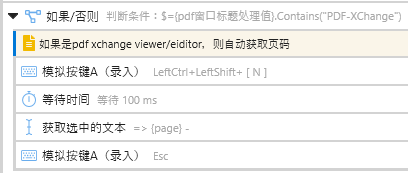
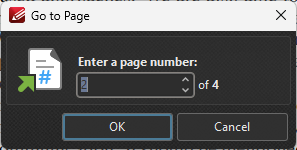

- ((66ade371-7d28-48b6-a8a1-809cd2203636))
- 如果学生们在狭义的教育阶段就认同认定了通向未来谋生手段的途径，那么他们就很难产生变化
- [开放科学 | UNESCO](https://www.unesco.org/zh/open-science)
- OA（Open Access）
  id:: 66fb963b-ba83-422c-a3cf-bd4808b4031e
  collapsed:: true
	- [开放存取_百度百科](https://baike.baidu.com/item/%E5%BC%80%E6%94%BE%E5%AD%98%E5%8F%96/1688963)
	- [开放获取 - 维基百科，自由的百科全书](https://zh.wikipedia.org/wiki/%E5%BC%80%E6%94%BE%E8%8E%B7%E5%8F%96)
	- OA（Open Access）开放获取运动
	  id:: 66f4cdda-9629-4db7-8aff-7d530e1034e9
	- [arXiv - 维基百科，自由的百科全书](https://zh.wikipedia.org/zh-cn/ArXiv)
	- [Open Access Library (OALib)](https://www.oalib.com/)
	- [COAJ](https://www.coaj.cn/home)
	- [一篇文章，带你了解什么是开放获取（Open Access） - 知乎](https://zhuanlan.zhihu.com/p/144939000)
	- ((6823dcb8-1e16-4c10-a7f6-4d5549df9731))
	- ((66a57f13-e830-4e69-857a-c23d85b367c7))
	- 出版业
- 学术生产
  collapsed:: true
	- “欸！我们被美团污染的学术净土！”
	- [《自然》发表数据：中国科学在哪方面落后于美国](https://mp.weixin.qq.com/s/tnygPPzxZfB2umnhHhiqeA)
	  id:: 67830858-7fc6-4ac0-879e-bc467c7aaac1
	- [研究生学术生产的叙事研究 - 知乎](https://zhuanlan.zhihu.com/p/87794507)
	- 本科大三身边人好多篇文章，翘课搞科研
	- [玛丽女王学院](https://qmul.ncu.edu.cn/)
		- 人均一篇sci
		- [说说伦敦大学玛丽女王学院（QMUL）在中国的生物医学和临床医学联合培养项目 - 知乎](https://zhuanlan.zhihu.com/p/21599540)
		- [在南昌大学玛丽女王学院读书是怎么一种体验? - 知乎](https://www.zhihu.com/question/280292473)
		- [南昌大学医学院和伦敦玛丽女王大学合作的临床医学项目怎么样？前景如何？ - 知乎](https://www.zhihu.com/question/30244398)
- 文献
  id:: 670d40d8-8762-45bc-8b11-809e3680b54b
  collapsed:: true
	- “要文献，不要武献”
	  id:: 66b7f695-0fea-48ad-bd37-f3e7a68fbebb
	- [学术论文，期刊，文献三者是什么关系？ - 知乎](https://www.zhihu.com/question/56998348)
	- ((679addd8-0f88-4f85-9880-a4b3091a1535))
	- 版权
	  id:: 66adee71-01d4-4cea-b01b-ad0a969a21bd
	  collapsed:: true
		- [马克思主义著作的版权纷争--知识产权--人民网](http://ip.people.com.cn/n/2014/0505/c136655-24975602.html)
		- [数字千年版权法 - 维基百科，自由的百科全书](https://zh.wikipedia.org/wiki/%E6%95%B8%E5%AD%97%E5%8D%83%E5%B9%B4%E7%89%88%E6%AC%8A%E6%B3%95)
		- [中国独特的版权制度, 竟是“二创”文化兴起的根本原因？](https://mp.weixin.qq.com/s/j9lCfMlBecBo50IuzI1prA)
		- ((67a96eec-9e44-4202-a108-5547d210b2a0))
		- [MV、歌手演唱节目片段、体育赛事直播画面，究竟属于视听作品or录像制品？ - 知乎](https://zhuanlan.zhihu.com/p/553098569)
		  id:: 681ae832-9e8c-49dc-ae7b-f02355193ee5
	- 图书
	  id:: 66fb6ecd-e619-4678-a98c-a63a57b762fd
	  collapsed:: true
		- id:: 67eb2820-cebb-4f44-a238-763241e1c6a8
		  >阅读使人充实，会谈使人敏捷，写作使人精确。——培根《论读书》
			- [培根的《论读书》英汉对照（附王佐良、水天同译文）_夏冬红_新浪博客](https://blog.sina.com.cn/s/blog_536f61420100c85m.html)
		- id:: 67402ab5-6c93-4fbc-86c7-289758026f72
		  >一本书遭到了批评，实际上说明它引起了真实的、毫不虚假的关注，表明它不是一本无聊的书，要知道，无聊是一本书最致命的缺陷。——塔勒布《反脆弱》
		- “从百草园（互联网廉价惊异）到三味书屋”
		- 出版社
			- [1990年撤销的出版社都去了哪里？ - 知乎](https://zhuanlan.zhihu.com/p/656838377)
			- [改革出版社 - 维基百科，自由的百科全书](https://zh.wikipedia.org/wiki/%E6%94%B9%E9%9D%A9%E5%87%BA%E7%89%88%E7%A4%BE)
		- 盗版图书
		  id:: 66fb6d6b-3620-4b32-9c39-21e43b24e45e
		  collapsed:: true
			- 影子图书馆、海盗图书馆
			  id:: 670c8cd8-6068-4dbc-b6b4-47e0ef93b791
			- 安娜的档案（2022年11月10日）
			  id:: 668f7f03-1181-4c87-8540-fcb82ae45d25
			  collapsed:: true
				- “知识的春天！”
				- [安娜的档案 - 维基百科，自由的百科全书](https://zh.wikipedia.org/zh-cn/%E5%AE%89%E5%A8%9C%E7%9A%84%E6%AA%94%E6%A1%88)
					- >2023年11月，安娜的档案宣布获得一位匿名人士捐赠的750万本共约350TB中文图书资源，资源来自超星网的读秀数据库，该数据库的盗版资源长期在互联网上暗中流传。安娜的档案发文寻求大语言模型合作伙伴完成该系列资源的OCR文字提取工作，合作者可获得1年或更久的该资源独家访问权。
					- [Anna’s Archive 集成超星读秀500多万本图书资源，提供BT种子下载 - 知乎](https://zhuanlan.zhihu.com/p/688265961)
						- >[去年11月](https://annas-blog.org/duxiu-exclusive.html) Anna’s Archive 获得了超星读秀750万/350TB的中文非虚构图书。
						  [2.21日](https://t.me/annasarchiveorg/67)在其官网以 [BT种子形式发布了超星读秀图书资源](https://annas-archive.org/torrents/duxiu)，合计有500多万本。
						  [3.19号宣布](https://t.me/annasarchiveorg/72) 已经在Anna’s Archive 资源库整合了超星读秀的500多万本图书资源，可以直接在官网搜索相关资源。
				- >az（“经典az环节”）一起用比较爽，一个全、好像没有每日下载限额，一个快、文件名比较短
				- zlibrary上没有或“因版权方投诉，本书无法下载”的书，anna上可能有
					- ((66274c70-5f32-4659-8f56-1131940c81b3))
				- zlibrary上有的书，anna上可能有更清晰的版本（比如可能是读秀的资源）
				- 所以可以先搜anna，然后若有多个结果，可以根据文件大小（“epub本来就不大，那就下大些的吧，虽然我也不懂”）或点开其中的zlibrary链接查看评分等信息判断下哪个
					- ((670d40d8-2515-42d9-9202-80520fdbff9b))
				- “zlib”字样意味着文件来自zlibrary，用anna下载得慢（而且文件名也比较长），可以~~根据文件名、大小（anna上可能会显示得大些）等找到zlibrary对应文件并下载~~点“show external downloads”跳转下载
					- 需要等待的慢速下载有的也可能很快，文件稍大（比方说大于20~50MB，有较大可能下载失败，且一次下载成功的时间也可能比需要等待的慢速下载长）都可以先试试
						- 而且可以多个一起等，有时不用等
				- 有些标题可能是“a”或数字或乱码，可以看作者、搜索结果页完整路径里的文件名或点击更多看到另外的名称，有时多册书正好缺一册，可能就是那个
				- 读秀的pdf可能更清晰、文件更大，加上按文件大小排序或只显示读秀来源的话都可能顺带下一些好书
				- 点书的标题右侧放大镜可以快速搜索标题
				- [Anna’s Archive](https://annas-archive.org/)
				  id:: 66ade373-7ea1-469c-97aa-62d9cdae1bf3
					- [安娜的档案 - ITEM](https://www.item.ink/archives/annas.html)
				- [海盗图书馆的关键时期 - Anna’s Blog](https://annas-archive.li/blog/critical-window-chinese.html)
				  id:: 670c8cb7-1d13-4c40-b118-8e5ddeeb1e94
				- ((66dcfbcb-024a-4e1e-a831-c0dab8bdf081))
			- Zlibrary
			  id:: 678a4de7-e463-476c-b7e9-46cba4758283
			  collapsed:: true
				- https://zh.z-lib.gs/
					- id:: 66e17c6e-073f-44ec-9572-68fa7c549d7f
					  >这个也是anna的外链zlibrary站点链接（之前用了好一阵子别的相对备用的链接），固定用一个链接也方便从浏览器历史记录查当初怎么下的某些书，感觉历史记录挺难用的
				- “盗家思想真好读啊！”
				- 今年（2024年）开始我终于“机缘巧合”发现在zlibrary上淘书找“魔法”比在几年前的网易云音乐隔段时间的每日推荐还爽太多
				- 同一本书，zlibrary中不同文件的图像质量/清晰度（通常与文件大小相关）、是否OCR可能有差异，也可能因此造成评分的差异
				  id:: 670d40d8-2515-42d9-9202-80520fdbff9b
				- tor浏览器上下载慢、失败可以把下载链接复制到其他浏览器
				- APP（之前挂了一次，目前还没重新使用）
					- 有时可能停住不下了，要关了APP重开在下载历史里找到重新下载
				- 
					- “支持正义白嫖？”
				- >但凡出版社是 epub掌上书苑 的书，里面都是一堆广告，很影响阅读体验。
					- [毛泽东读书笔记解析(上下册) |  | download on Z-Library](https://z-lib.gs/book/17837938/81b505)
			- {{embed ((678a4e04-139c-49c7-86ae-78775426306f))}}
				- 这里只有zlibrary有，所以能能能能
		- 图书馆
		  id:: 670d40d8-7881-453d-9743-e11f5037b0f2
		  collapsed:: true
			- 电子图书馆
				- “电子书副本数量可能有限（1本），需要等候约xx周、几个月，借阅有期限，我哈哈大笑”
				  id:: 6708893a-bc4e-4b5c-bc9f-57f91aee1570
					- ((670cc845-b855-4804-9d90-cd986fb659e2))
				- Libby
				  id:: 67087279-eb3b-4518-95c4-b1cbb83c97ee
					- 部分国内图书馆的读者证可在微信小程序上注册
					- [Libby电子图书馆保姆教程 - 小花生](https://www.xiaohuasheng.cn/blog/97894c6677021d0f)
					- [欢迎访问OverDrive, Inc.（赛阅公司）中国子公司网站！](http://overdrivechina.cn/)
			- [读者云门户](http://read.nlc.cn/user/index)
		- 公有领域图书
		  collapsed:: true
			- [公有领域 - 维基百科，自由的百科全书](https://zh.wikipedia.org/zh-cn/%E5%85%AC%E6%9C%89%E9%A2%86%E5%9F%9F)
			- [Free eBooks | Project Gutenberg](https://www.gutenberg.org/)
				- [谷登堡计划 - 维基百科，自由的百科全书](https://zh.wikipedia.org/zh-cn/%E5%8F%A4%E8%85%BE%E5%A0%A1%E8%AE%A1%E5%88%92)
					- [约翰内斯·谷登堡 - 维基百科，自由的百科全书](https://zh.wikipedia.org/zh-cn/%E7%BA%A6%E7%BF%B0%E5%86%85%E6%96%AF%C2%B7%E8%B0%B7%E7%99%BB%E5%A0%A1)
		- [2019年的狄奥尼索斯：防弹少年团学术热背后的美国种族政治与科学话语共同体转型_思想市场_澎湃新闻-The Paper](https://www.thepaper.cn/newsDetail_forward_28322559)
		  id:: 66c7f09c-aace-4e9d-a9ec-294cf422bf34
		- 百科
		  id:: 679adcbd-f619-40e0-aabc-61ab00617726
		  collapsed:: true
			- [有哪些值得你推荐的百科全书? - 知乎](https://www.zhihu.com/question/24730824)
			- [《中国大百科全书》第三版网络版](https://www.zgbk.com/)
			  id:: 665fc46c-7205-40b8-8533-bbb15e1de3da
			- [wikiHow：你可以信赖的万事指南](https://zh.wikihow.com/%E9%A6%96%E9%A1%B5)
		- 纸质书
		  collapsed:: true
			- 图书论斤卖
				- 八佰伴精装绘本等23元一斤 [[20240518]]
		- [GitHub - ruanyf/free-books: 互联网上的免费书籍](https://github.com/ruanyf/free-books)
		- ---
		- ((68539f90-6143-40d5-822f-a587a4ba58c8))
	- 报刊/报纸
	  collapsed:: true
		- [GitHub - hehonghui/awesome-english-ebooks: 经济学人(含音频)、纽约客、卫报、连线、大西洋月刊等英语杂志免费下载,支持epub、mobi、pdf格式, 每周更新](https://github.com/hehonghui/awesome-english-ebooks?tab=readme-ov-file)
		  id:: 6718382f-fce1-4877-9d68-bf58b010acac
			- [考研英语题源分析，看看题目来自于哪里 - 知乎](https://zhuanlan.zhihu.com/p/25051680)
			  id:: 6718f749-a7d2-4292-a0ea-0feece324f8e
		- [人民日报1946-2003在线全文检索 - 论坛](https://rmrb.online/simple/)
		  id:: 679add41-6e3f-47d8-a2fe-70f2f9fd279f
		- 杂志
		  id:: 665e585b-f301-4c19-9363-57f6a0701018
			- [学校卫生杂志社](http://www.cjsh.org.cn/)
			- [中国卫生政策研究](http://journal.healthpolicy.cn/ch/index.aspx)
			- ---
			- [杂志和期刊的区别 - 知乎](https://zhuanlan.zhihu.com/p/74952162)
			- [期刊与杂志：差异与比较](https://askanydifference.com/zh-CN/difference-between-journal-and-magazine/)
	- 论文
	  id:: 670d40d8-c210-4c47-b754-8523588e0f75
	  collapsed:: true
		- ((67a4a408-1341-4086-886c-7bdddfa23fa1))
		- 论文类型
		  collapsed:: true
			- 学位论文/毕业论文
			  id:: 66fb95ba-3626-448c-b99a-1e34461d99c0
				- [学术论文和学位论文的区别。你真的清楚吗？ - 知乎](https://zhuanlan.zhihu.com/p/382565928)
				- 学位论文内容要求
					- [科学网—论文那么多，哪有那么多创新？ - 阮思余的博文](https://blog.sciencenet.cn/blog-3597820-1430096.html)
				- 学位论文答辩
					- ((679addab-584b-4cba-b061-f57a87ea5cab))
				- [为什么，某些学校的硕博学位论文不上传知网公开？_腾讯新闻](https://new.qq.com/rain/a/20210801A0829100)
				  id:: 66fb9f47-8e2f-4833-bc7b-4c6a1776f134
			- 学术论文/期刊论文
				- 高校、医院等的学术竞赛
				  id:: 66b7f730-9c70-40dc-954a-ac4e5e5681fa
					- [破一本要求研究生作为一作或者独立作者发表论文，合理吗？ - 知乎](https://www.zhihu.com/question/447512795)
					- [向民众科普医院医生的众生相，并且详细介绍学阀、科研至上、规培制度是如何在摧毁大家（同时向张雪峰老师递原始资料） - 知乎](https://zhuanlan.zhihu.com/p/713948300)
					  id:: 66db8aae-f6bd-4fc8-b2c2-2df9433f58a1
						- [中国医学界的弊端及改革方向（浅薄建议） - 知乎](https://zhuanlan.zhihu.com/p/716335443)
				- 综述
					-
					- ((66db8ae2-1540-4a30-a72e-7f13d6e15dc4))
		- 论文及其内容的创作、传播流程
		  collapsed:: true
			- 选题
			  collapsed:: true
				- 分配导师
				- 自找课题组（医学的一般是医院医生带）
			- 开题（学位论文）
			- 资金
			  collapsed:: true
				- 学位论文基金
				- 基金申请
					- [重磅！国家杰青/优青项目没了！避免“帽子化”](https://mp.weixin.qq.com/s/mtoATL47XWz81xhvJTi08g)
					  id:: 678ef374-6268-460a-8873-e1200f3e8f41
			- 研究
				- [一文详解临床研究分类，速收藏！ - 知乎](https://zhuanlan.zhihu.com/p/409622969)
				  id:: 670d40d8-2d04-495d-9784-148cdcc1e568
				- 研究设计
					- [交叉设计与分析（cross-over design） - 知乎](https://zhuanlan.zhihu.com/p/338128402)
				- 计算机模拟
					- [科学家首次证实计算机模拟“虚拟患者”临床试验的有效性_腾讯新闻](https://new.qq.com/rain/a/20210702A06GVV00.html)
					- [从不同方面来讲是做模拟的好一点还是做实验的还一点？【研究生吧】_百度贴吧](https://tieba.baidu.com/p/8942559688)
					- [斯坦福用AI模拟科学家自动寻找新冠病毒抗体](https://mp.weixin.qq.com/s/OFfPMwK4-HyuJGdqlWNjpA)
					  id:: 674d4124-55d8-4c51-9afc-54ead3ba9662
				- 实验
					- [化学实验室安全教育：安全第一 (Starting with Safety) ACS 美国化学联合会 1991 （中英字幕）_哔哩哔哩_bilibili](https://www.bilibili.com/video/BV1hhjzzpEE2/)
					- 实验器材
						- ((680ae3be-bfba-4e1e-844b-8528960c6c09))
						- [下次买东西记得看清楚单位_哔哩哔哩_bilibili](https://www.bilibili.com/video/BV1Na4y1F7Kz/)
						  id:: 6801ec7f-69c4-43bd-aab2-1cee282fd271
					- 实验试剂
						- 试剂毒性
							- ((67e10450-6797-49ed-a30a-a52a0ca3400e))
							- 致癌实验试剂
							  id:: 67d3da7e-bc9a-41f6-acd5-311467bb515f
							- 实验室沾染
						- 通风橱
							- TODO 通风橱检修、强化
							  id:: 681566b2-a3b6-4a3a-b66d-e2ed04cfcf31
						- ((67e101aa-843a-4912-b914-2c14e2bd0407))
						- TODO 手套上试剂快速加热挥发（手势、声控照射灯）、吹离
						  id:: 681566c6-f9c2-45d1-a6d9-a02b99e6d0a7
						- ((67eb2820-273b-4641-ad0b-354786b06678))
						- [为省时间，博士生在实验室吃汉堡，直接夺走了他年仅28岁的生命](https://mp.weixin.qq.com/s/wu3R4ls1zNgl1ohltAHTzg)
					- 临床试验
						- RCT
							- [权威发布 | RCT报告规范CONSORT 2025解读](https://mp.weixin.qq.com/s/0ARdwTmdxAMzkT2Abyh28Q)
					- 研究生
					  id:: 67e1046e-e98c-4cc0-87a7-72e0d6e89f7d
						- 硕士研究生
							- 考研
								- ((67b53e38-f402-4ddb-8618-1f8c866c8dab))
								- [跨专业考研选专业指南（必看） - 知乎](https://zhuanlan.zhihu.com/p/60792163)
						- 博士研究生
						- 博士后
							- [4.5万名研究员的职业生涯告诉你：超40%博后离开了学术圈，有高被引论文更容易获得教职](https://mp.weixin.qq.com/s/w-7tzYCMogXkhNNLiIJ5Xg)
				- 定量研究
				  collapsed:: true
					- {{embed ((66a6f7d7-26fb-4b99-a727-7fbada282a6b))}}
			- 参考文献
			  id:: 66fb70ce-79a5-46ac-84c1-b7ff4844aa57
			  collapsed:: true
				- 引用
					- [学位（毕业）论文参考文献插入教程，附网页文献引用、et al 等 问题解决办法_哔哩哔哩_bilibili](https://www.bilibili.com/video/BV1Tu41117be)
					- 引用限制（？）——“不可被选中/锁定”、“防抖测试”
					- 请求访问、文献援助、来源请求
					- ((67bd7ab2-fc9d-4ccc-9fb3-7622ee826770))
				- 脚注
					- [脚注和参考文献那点事 - 知乎](https://zhuanlan.zhihu.com/p/149690571)
					- 脚注和参考文献自动排序
				- [学术论文的参考文献能不能引自电子书或各种阅读类App（正版）？以后会是趋势吗？ - 知乎](https://www.zhihu.com/question/57165547)
			- 文献协作
			  collapsed:: true
				- >现在的一个学生（可能被要求要是一作，这下更难共享了）写论文发论文学术范式效率可能不太高，就是有那么点优秀论文又咋样呢？其他人得不到提升，去干让自己的学习本身显得更没啥意义、社会资源进一步浪费的工作了。
				  同样多的人，每几个人写原先几分之一篇论文，优秀论文数有可能更多吗？
				- [用好这几个工具，帮助你更高效地完成学术型小组作业 - 少数派](https://sspai.com/post/74853)
				- 潜在问题
					- 草稿防盗
					- 回报、互助模式
				- 作者排名
					- 挂名
					  id:: 66fbf2d4-d525-412e-bc1d-27b2bb5ae71e
			- 投稿
			  collapsed:: true
				- 一稿多投
				  id:: 66fbb358-9931-436d-abc8-12cdc7c726ef
					- ((66fbb383-fd40-49f4-a913-09d2286ea289))
					  id:: 66fbb3be-f829-4e9d-bae8-c3f3536a5f46
					- [被拒稿后另投他刊，仍旧被判定“一稿多投”？“一稿多投”是怎么被发现的？|学术|文章|论文|退稿|编辑部_网易订阅](https://www.163.com/dy/article/J2QS8V9L0536NCEV.html)
			- 拒稿
			- 预印本
			  id:: 66fb9505-4399-45c2-83a1-b3ae52b992b4
			  collapsed:: true
				- [什么是预印本？它的利弊？ - 知乎](https://zhuanlan.zhihu.com/p/684091998)
			- 查重
			  id:: 66b7fa5f-62fc-4a8c-bc2f-88e7855a5198
			  collapsed:: true
				- ((66fb95ba-3626-448c-b99a-1e34461d99c0))
				- ((66fb9505-4399-45c2-83a1-b3ae52b992b4))
				- 查重行业
				- 查重时间范围？（同一年的毕业论文查不查重？）
				- 图片查重
				  id:: 677a1577-1b9d-4c8e-aaee-4cfe07458cc9
					- 诚信科研
					  id:: 677a154c-a6a8-40f7-9693-8473b826de4c
						- ((66fb3f9a-106c-491b-a9ed-a7713920d097))
						- [不可思议！中国学者刚刚发表的Nature及Nature子刊就出现图片重复使用](https://mp.weixin.qq.com/s/-iGIIVRP8DXajbZmnNg_sw)
						  id:: 677a1558-f20b-42c8-80bb-5d69c34a6ceb
				- ---
				- 文本查重：网页标题、内容、
			- 降重
			  collapsed:: true
				- [论文24h极限降重40%的秘诀（附降重指令） - 小红书](https://www.xiaohongshu.com/explore/65f5a0720000000013026026?app_platform=android&ignoreEngage=true&app_version=8.58.0&share_from_user_hidden=true&xsec_source=app_share&type=normal&xsec_token=CBPaTSegJt4pUSTVSpNWH_PAacm7NP0IHmcGdtsxW18mU=&author_share=1&xhsshare=WeixinSession&shareRedId=ODY0QTY3OT02NzUyOTgwNjY0OTc6Njo5&apptime=1730821280&share_id=8907e68afcd54cfabc7996c5fdd52833)
			- 审稿/评审
			- 同行评议
			  id:: 66fba5a7-002e-423e-bb96-f9e070e2d53b
			  collapsed:: true
				- ((66fbe17b-458b-46b0-aa05-7f2c95586f20))
				- {{embed ((679adcea-8329-4838-8746-f1ede07b9e9d))}}
				- 发表后同行评议PPPR
				  id:: 66fb45ab-84c1-4995-9eec-174a4953ba85
				  collapsed:: true
					- “评了都是同行”
					- 有利可图吗？
					- [发表后同行评审的三大平台——ResearchGate、Peeref和PubPeer - 微信精选文章 - 详情页 - 美国LetPub专业SCI论文编辑](https://www.letpub.com.cn/index.php?page=wechat_refined_article_details&article_id=84)
					- ((66fbdcf7-ee4c-46f4-ac17-7a566a7cc8b4))
					- [Post-publication critique at top-ranked journals across scientific disciplines: a cross-sectional assessment of policies and practice | Royal Society Open Science](https://royalsocietypublishing.org/doi/10.1098/rsos.220139)
					- [Reviewing post-publication peer review - PMC](https://www.ncbi.nlm.nih.gov/pmc/articles/PMC4472664/)
					- ((66fb5228-0d00-4560-9fc4-6f0d08c24064))
					- 学术不端
					  id:: 66fbdc25-381b-4f6e-bd15-ed292ca2197c
						- 偏离现实、不考虑研究对象之间差异的研究
							- 指标偏离现实
								- [全球诚信度中国最低？14所大学师生自筹经费推翻《科学》论文_教育家_澎湃新闻-The Paper](https://www.thepaper.cn/newsDetail_forward_25019102)
								  id:: 66db8aba-dd2a-401b-9f5f-c89041674524
						- 图片造假
							- “图片可以PS，所以可能是假的”
						- ((66335bd7-d403-4895-af28-0a04f2ebac74))
						- ((66fbf2d4-d525-412e-bc1d-27b2bb5ae71e))
						- [实验室宫斗之：你敢举报我论文造假，我就把你变成精神病！](https://mp.weixin.qq.com/s/aaxxjiUZ8Yh69gL4gtH3tw)
						  id:: 67a828ae-76b4-4fbb-919e-8195233c5624
					- 学术打假
						- “比学术妲己多个小a”
						- http://www.xys.org/dajia/ （方舟子的“打假”栏目，不光是学术打假）
							- ((65605bde-af3b-422d-94c6-95e4e18411e3))
						- ((65bcbf55-4a1f-47fa-8ae7-d0024f080c7a))
						- [Science Integrity Digest – A blog about science integrity, by Elisabeth Bik, for Harbers-Bik LLC. Support my work at Patreon.com/elisabethbik](https://scienceintegritydigest.com/)
			- 撤稿
			  id:: 670d40d8-d560-4302-8d05-d1fa47a9b8e7
			  collapsed:: true
				- [Retraction Watch – Tracking retractions as a window into the scientific process](https://retractionwatch.com/)
				- [一文了解3种撤稿方式的区别！-查尔斯沃思](https://www.cwauthors.com.cn/article/retraction_20230313)
				- [撤稿论文更博人眼球，撤回仍难阻止错误信息传播_澎湃号·湃客_澎湃新闻-The Paper](https://www.thepaper.cn/newsDetail_forward_18692870)
				- [253篇新冠疫情相关撤稿文章的学术特征研究及启示](https://www.cjstp.cn/CN/rich_html/10.11946/cjstp.202208150619)
				  id:: 66fb447a-b2a4-400c-aa68-2e56fdbb82bc
				- [史无前例：中国首次对论文撤稿和科研不端行为进行全国性审查_腾讯新闻](https://new.qq.com/rain/a/20240213A033IN00)
				  id:: 65d48d50-bd9a-44e7-a750-492b55930773
					- >目前还不清楚具体的惩罚形式是什么，但我们可以参考之前的情况，2021年，中国国家卫生健康委员会发布了对一批撤稿论文的调查结果，惩罚措施包括减薪、取消奖金、降职和暂停申请研究经费和奖励。
					- [China conducts first nationwide review of retractions and research misconduct](https://www.nature.com/articles/d41586-024-00397-x)
				- ((66fb3a62-2416-4c52-ad11-108fd391ad1a))
				- ((66fb5228-0d00-4560-9fc4-6f0d08c24064))
				- [为何哈佛教授造假17年才暴雷](https://mp.weixin.qq.com/s/X0E0STYaP-deZfNlmbETsA)
				  id:: 6780481b-4718-4136-94fb-c859dc2f7bd9
				- ---
				- 撤稿、删除与记忆清除
			- 出版
			  collapsed:: true
				- [DOI - 维基百科，自由的百科全书](https://zh.wikipedia.org/zh-cn/DOI)
			- 报道
			  collapsed:: true
				- 本单位（高校、研究所等）报道
				- 再报道
					- ((66fb45ab-84c1-4995-9eec-174a4953ba85))
					- XX新闻、XX公众号
					- 广告
					- 转发
					- 评论
					- 转发
			- 应用
			  collapsed:: true
				- 学术创业/商业化
				  id:: 678b04a4-41bd-48c2-8e40-fa5006f5ddd4
					- [科研可否商业化？ - 丁香园](https://paper.dxy.cn/article/55074)
					- [学术创业：动态竞争理论 从无到有的历程](https://bus.sysu.edu.cn/qjm/sites/journalmanagement.prod.dpcms8.sysu.edu.cn/files/2018-11/%E5%AD%A6%E6%9C%AF%E5%88%9B%E4%B8%9A%EF%BC%9A%E5%8A%A8%E6%80%81%E7%AB%9E%E4%BA%89%E7%90%86%E8%AE%BA%E4%BB%8E%E6%97%A0%E5%88%B0%E6%9C%89%E7%9A%84%E8%BF%9B%E7%A8%8B.pdf)
					- [从学术到创业之路](https://worldscience.cn/c/2021-12-27/638158.shtml)
			- 反馈
			  collapsed:: true
				- 未能重复
				  id:: 66fbb02d-0a39-4ee5-9f1e-f8c41c6b9ca8
					- 被多次重复就是真的吗？
				- ((66b2f393-d8a5-430a-9ab0-158bf21c3cfe))
		- 论文阅读与外语学习
		  id:: 6724c556-3216-4a98-b9d1-e4872f3d0bbf
		  collapsed:: true
			- 不排除若干篇论文的主题阅读直接把可能的生词看会了的可能
			- 论文中的专业英语对于相对普通的外语考试可能不够“均衡”
			  id:: 6724c42a-8f07-4775-babe-d5f19ed6f510
			- “记忆靶点”
			  id:: 67238ead-5ffd-432e-b1c7-fca95dee6f39
				- “都什么年代了还在看一堆缄默缩写、没啥图的传统论文？”
		- 论文竞赛
		  collapsed:: true
			- [大创大挑来袭，本科科研竞赛：是“镀金”捷径还是学术启蒙？_澎湃号·湃客_澎湃新闻-The Paper](https://www.thepaper.cn/newsDetail_forward_29067009)
			- 自办竞赛，夺取镀金权
		- ((6709342d-d1e0-4bc0-bbca-ec526bb26ca1))
	- 学术出版商
	  id:: 66fb76db-4313-4972-8bd8-8c7b8964725a
	  collapsed:: true
		- 期刊
		  id:: 670d40d8-8313-45fa-bd97-ae8dded268d2
			- ((679adcea-1458-456f-b530-86be773039ed))
			- 期刊排版
			  collapsed:: true
				- [为什么大多数文献用双栏排版？ - 知乎](https://www.zhihu.com/question/21952490)
				- [有没有让两栏论文变单栏的软件/插件? - 知乎](https://www.zhihu.com/question/459057083)
				  id:: 67258d24-c45c-451c-b66c-51a732fa114d
					- “复制粘贴”（就变成单栏了）
					- ((67c54f59-8b56-4deb-ba65-0db96d8bb26e))（粘贴了滚动播放更窄的单栏）
					- ---
					- 放大瞬移
					  id:: 67c8063d-dc3b-418e-ae09-313458b1eccf
						- [publications - Difficulty reading scientific papers in two columns - Academia Stack Exchange](https://academia.stackexchange.com/questions/112214/difficulty-reading-scientific-papers-in-two-columns)
							- “你们（可能）说得对（指文本宽度窄些看起来更快），但是双栏可以进一步分成相同阅读位置的两个单栏阅读，不用眼珠子左右横跳”
							- 最下面的回答：竖屏、放大到280%左右、拖滚动条居中、阅读
						- 放大瞬移横屏版： ((65d2b96f-a901-4642-b354-642fd07c3534)) 分屏（可以是自带三分屏布局的较大居中，也可以调成更窄的并保存布局）+ ((673edb30-68eb-44a9-a867-6115ab372287))
						- 应该也可以通过 ((66db8ac4-d558-458d-9528-499eb66f69ee)) 等实现自动化
							- “懂了，不依赖软件给的翻页信号，恍然大悟”
								- 方案零（“已完成”）：鼠标手势（目前还没做）左划右划（模拟按键A（录入）左右键若干下）
									- [左键33下 - by khtazmt - 动作信息 - Quicker](https://getquicker.net/Sharedaction)
									  id:: 680b26ae-a1c1-4056-bd68-4ef74b25b91d
									- [右键33下 - by khtazmt - 动作信息 - Quicker](https://getquicker.net/Sharedaction)
									  id:: 680b26c8-71b3-4fc2-8e45-3f0943b1b1d2
								- 方案一：同向切换左右栏与翻页用两个键，右键循环依次（拖滚动条或瞬间右键多少下）切换到下一栏、翻页（“不显示完翻啥页？？）
							- 需要获取翻页信号的
								- 方案二：同向切换左右栏与翻页用一个键，下键或滚轮页码加1时返回、从左栏（拖滚动条或瞬间右键多少下）到右栏，第二次再翻页并回到左栏
									- 目前的半（“存疑”）成品
										- [双栏互切 - by khtazmt - 动作信息 - Quicker](https://getquicker.net/Sharedaction?code=e2fa595d-e37b-472b-af00-08dd5ba67dcf)
										  id:: 67eb2820-30dd-48d6-833d-c9beb8f4b510
									- 获取当前页码
										- [pdf 标注跳转——随写随引 - Dawn99 的回帖 - 链滴](https://ld246.com/article/1619536691753)
											- [摘录助手-增强版 - by zplusless - 动作信息 - Quicker](https://getquicker.net/sharedaction?code=623da485-f979-4fda-414e-08d84e0e87c8)
												- 
												- 
												- 乐，是 ((65c87486-2409-4dc2-9a78-144d3e313ac3)) 的打开跳转到特定页码的窗口的快捷键，其中可以选择复制当前的页码
										- ---
										- 暂未成功的
											- [窗口界面控制（预览） - Quicker](https://getquicker.net/KC/Help/Doc/uiautomation)（FlaUI）获取窗口控件信息，但选择控件后里面的当前页码数字还不清楚怎么获取
											- [求教，怎样使用脚本获取页码 - Quicker](https://getquicker.net/Common/Topics/ViewTopic/26297)
												- >免费版不支持外部启动功能。
									- 判断当前要翻页还是换栏（“完全难得倒他！”）
			- 版面费
			  id:: 66fbb142-69f2-41af-adfa-f46b5ee6b209
			- 影响因子（IF）
				- [什么叫“影响因子”？ - 知乎](https://zhuanlan.zhihu.com/p/142975701)
				- 无影响因子和掠夺性期刊
					- [投稿时必须要警惕的 6 个热门出版物_期刊](https://www.sohu.com/a/434946444_120865534)
					  id:: 66db8aae-2928-4391-89d8-459b0ee3adf3
					- [Web of Science puts mega-journals Cureus and Heliyon on hold – Retraction Watch](https://retractionwatch.com/2024/09/30/web-of-science-puts-mega-journals-cureus-and-heliyon-on-hold/)
			- [终于搞懂了！| 一文讲明白影响因子和杂志分区（附最新影响因子下载） - 哔哩哔哩](https://www.bilibili.com/read/cv27276553)
			- 自引用率
				- “我是千年一遇的学术天才，无中生有的学科始祖，区区自引率100%算得上什么问题吗？”
				- [Nature：百名科学家自引用率超50%，最高自引94%-腾讯云开发者社区-腾讯云](https://cloud.tencent.com/developer/article/1492052)
			- 培养基：不同概念在不同期刊上的长期生存率
			  id:: 66fb57fa-4302-4bda-9370-d3fec95e5e5e
				- ((66fb54a7-e9ac-4146-a1e5-1c92c5e1cc34))
			- 撤稿敲诈
				- [撤稿要交1万元"赎金"！这本AI期刊竟用假编委、假影响因子“绑架”论文，学者怒斥：这是敲诈！](https://mp.weixin.qq.com/s/gc0aizFgOEfkWZmu_XqDfA)
	- 文献库
	  collapsed:: true
		- [【科普】四大检索网站—知网 - 知乎](https://zhuanlan.zhihu.com/p/415578049)
		- [中国知网](https://www.cnki.net/)
			- [中国知网什么来头和背景？ - 知乎](https://www.zhihu.com/question/367012582)
			- [中国学术期刊网与中国知网关系 - 知乎](https://zhuanlan.zhihu.com/p/144670958)
			- ((66fb9f47-8e2f-4833-bc7b-4c6a1776f134))
			- [知网模式，不得不变_腾讯新闻](https://new.qq.com/rain/a/20220209A01VPN00)
			- [中科院都用不起“知网”了，国外文献也存在“天价订阅费”吗？_澎湃号·湃客_澎湃新闻-The Paper](https://www.thepaper.cn/newsDetail_forward_17704591)
		- [中华医学期刊全文数据库](https://www.yiigle.com/index)
		- ((66fb76db-4313-4972-8bd8-8c7b8964725a))
		- [过期杂志阅读平台_参考网](https://www.fx361.cc/)
	- 文献搜索平台
	  collapsed:: true
		- [超详细！web of science数据库检索指南，十分钟轻松上手！_哔哩哔哩_bilibili](https://www.bilibili.com/video/BV1Ph411q7Tp)
		- [X-MOL学术平台](https://www.x-mol.com)（翻译标题和摘要、文献高级搜索）
		  id:: 66ade371-02cb-4a04-960f-d5e59a756034
		- [PlatoHealth - 临床平方](https://platohealth.ai/zh-CN/)（可能不太全；AI效果不清楚）
		  id:: 66666a41-cfb2-4e67-abe0-79cade1bae3d
		- 文献关系图谱
		  collapsed:: true
			- （可能是需求）
				- 关键词、主题（可能更方便找新方向、新课题？；可以环绕文献节点或另开图层）
			- {{embed ((629f61c9-4aa8-433c-ba2e-0ab4344d9b84))}}
			- [文献关联分析图谱——connected papers网站（免费）_explore connected papers in a visual graph-CSDN博客](https://blog.csdn.net/quxuexi/article/details/124594887)
				- [ConnectedPapers 半分钟厘清领域内重要论文/论文关系网状图/文献综述小助手_哔哩哔哩_bilibili](https://www.bilibili.com/video/BV1h54y1U7kr)
					- 评论里看来的另两个
						- [【Citespace】从下载到图谱分析  详细教程  CNKI和WOS为例—陈同学_哔哩哔哩_bilibili](https://www.bilibili.com/video/BV1di4y1d7ot)
						- [科研之门 – SCI科研神器](https://s2.libraries.cn/)
	- 期刊订阅/RSS聚合
	  id:: 66fb7411-6e8e-4443-a22b-b0c8bfd929e0
	  collapsed:: true
		- 适合经常看新文献
		- ((670d40f3-28c0-4e53-8d05-d4b1a70d59e5))
		- [Rss·Cafe — 建造自由内容生态](https://rss.cafe/)
		  id:: 640c10b4-ec23-44f2-9597-42e3dfe6ac52
			- [从RSS到个人知识库 - 知乎](https://zhuanlan.zhihu.com/p/481776080)
			- 偏学术、学习向
			- 不支持第三方订阅源（现在呢？）
	- 文献插件
	  id:: 65bcbf4a-c8bf-45a1-9402-70cd437268d4
	  collapsed:: true
		- [easyScholar | 显示期刊等级\SCI分区](https://www.easyscholar.cc/)
		  id:: 66b81382-3551-4af2-9e35-d7d3a945e90c
		- [PubPeer - Chrome 应用商店](https://chromewebstore.google.com/detail/pubpeer/fmcdfigcdfkdghdklblbbpacikcchbbh?pli=1)
		  id:: 66fbdcf7-ee4c-46f4-ac17-7a566a7cc8b4
			- >这下找到一个发布后同行评议的入口了，看方舟子看的
		- TODO ((670d40d8-d560-4302-8d05-d1fa47a9b8e7)) 风险评估与预警
		- Google学术搜索按钮
		- ((670d40d8-a9ba-416f-8784-7e1e5a1ef985))
		  id:: 670d40d8-a9ba-416f-8784-7e1e5a1ef985
	- ((65bcbf4a-6246-4e84-872a-0604435c9b17))
	- 盗版文献
	  id:: 66fb6d7b-77c0-437a-a500-dda39ce659f1
	  collapsed:: true
		- Sci-Hub
		  id:: 6823dcb8-1e16-4c10-a7f6-4d5549df9731
			- [Sci-Hub: 将知识带给每个人](https://www.sci-hub.st/)
			  id:: 66f4cda3-f208-4083-bd54-3b4fca923c56
				- id:: 66f4ceaa-6f9a-49a3-b731-5e8a476314e7
				  >科学必须是开放的，而共产主义和通信是同根同源的词。
				- [开放科学的理念](https://www.sci-hub.st/misc/alexandra/open-science-idea.pdf)
				  id:: 66ffaa91-ed73-471c-b4ef-838f218dcb98
					- “这是什么？嗷，原来是姐姐的神话研究和盗家思想宣传”
					- [论文共享网站sci-hub的标识为什么是一只衔钥匙的乌鸦？ - 知乎](https://www.zhihu.com/question/426603127)
						- [What does the scihub raven logo signify? : r/scihub](https://www.reddit.com/r/scihub/comments/rgd7zk/what_does_the_scihub_raven_logo_signify/?rdt=34233)
						- 渡鸦库尔基Kurkyl
						  id:: 66ffac51-cf7c-4a65-a82f-d80187febffc
							- [О КУРКЫЛЕ – ГЕРОЕ ЧУКОТСКОГО ВОРОНЬЕГО ЦИКЛА.. | Духовная культура народов России | VK](https://vk.com/wall-211778008_1904)
				- [Sci-Hub | Открытый доступ к научной информации | VK](https://vk.com/sci_hub)
				- [ChatGPT online free](https://www.mfc972.com/)
				- [Collection of scientific research tools](https://www.helicard.com/)
		- [文献免费下载，这几个网站比肩sci.hub - 知乎](https://zhuanlan.zhihu.com/p/66878094)
		- 文献互助/文献传递
			- [文献互助平台 - 科研通(AbleSci.com)](https://www.ablesci.com/)
				- [如何评价“科研通”？ - 知乎](https://www.zhihu.com/question/455192055)
			- [Science hub Mutual Aid community](https://www.smartquantai.com/)
			- ---
			- [像百度学术或者research gate之类的文献互助，会不会引发版权问题？ - 知乎](https://www.zhihu.com/question/38265335)
	- ((670d40d8-799b-4119-8eea-2289bb8597da))
	- [Collection of scientific research tools](https://www.helicard.com/)
- 学者印象、形象
  collapsed:: true
	- 科研民工
		- [马老师69岁，是研究生⚡ 马保研老师的答辩现场_哔哩哔哩_bilibili](https://www.bilibili.com/video/BV1h541157Kb)
		  id:: 65a49554-56e5-4e4d-b945-dec6cb5aefaa
	- 学术妲己
	  id:: 66335bd7-d403-4895-af28-0a04f2ebac74
		- 学术纣王
- ---
- 自动/批量查询作者状况（年龄、职位、退休、死亡等）
  id:: 68914860-a295-441d-8ffc-fa2dae07d8e6