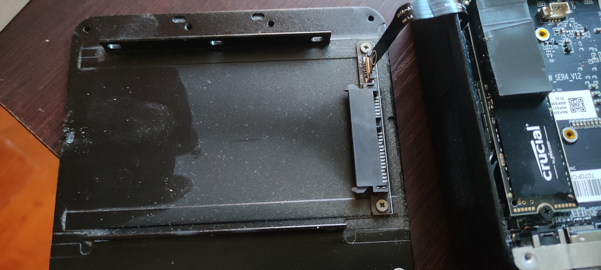
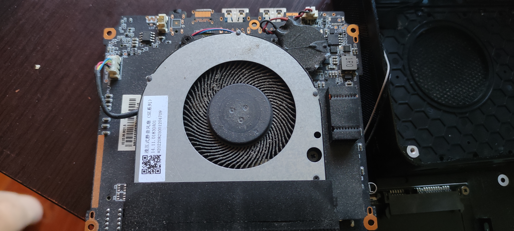
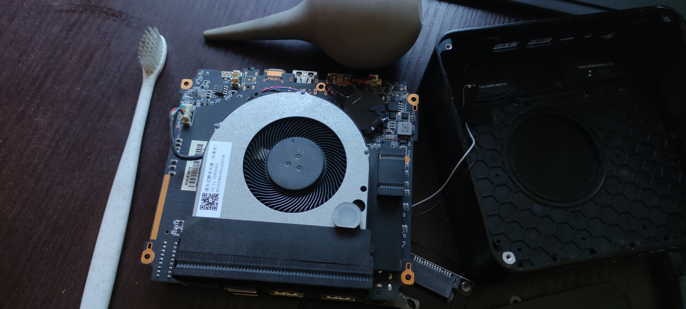

- [[二手闲置]]
  id:: 65d0ac85-2a5b-4cb1-bd4b-585bbf0b5151
- 改为“重返文明”、“植物大战僵尸”分类序列 [[20240902]]
	- 哎没改完呢
- “大家好啊，我是住家儿子”
- [[呼吸道传染病防治]]
  id:: 65ae0902-37eb-48ad-b6b6-152fbafbed9b
- TODO 烹饪蒸汽往上面柜门缝喷
	- ((66287494-3882-4406-8c7d-7300db63e6d1))
- 温湿度计
	- 机械式温湿度计
	  id:: 67b4867a-bbad-4376-887f-db01599a9297
		- [不怕死的商家送来温湿度计要我评测，我们叫他知道什么是鸡蛋里挑骨头_哔哩哔哩_bilibili](https://www.bilibili.com/video/BV18J41197pY)
- ((65b25bd4-88ae-48d8-a16d-64f253e59226))
	- 地板、门轴噪声
- 户外
  collapsed:: true
	- “渴望铺装路面下的泥土”
	- “户外？宇内！”
	- ((66ade399-f496-49a0-aa23-60f33c19f626))
	- [户外_百度百科](https://baike.baidu.com/item/%E6%88%B7%E5%A4%96/444665)
	- ((65bcbf4a-9e93-444b-abf8-8d4254e5989c))
	- 羽毛球网架
	- 买票记得带身份证
	- 五角星pm0002 50L户外背包 130
	  id:: 65ae08d2-1102-440a-9daa-2a38f72ea301
	  collapsed:: true
		- 有肩带、胸带、腰带，背部悬空，总的来说就是“背负系统”，与背着闷汗、往下赖的书包、电脑包不一样
		  collapsed:: true
			- 注意肩带仍可能磨到裸露的脖子
		- 背包（不含防水罩）1292g，背包防水罩60g
		- 口袋不少，可调部位和小设计（肩带挂夹、胸带口哨）较多，背部合金条加镂空胶网隔开背部和背包透气（取出可增大背包容积，但会降低背负舒适度）
		- 软背架结构长约47.5cm
			- ((670d4119-2b8b-4a63-ae0f-3ebaafa9fd30))
		- ((6311e5df-edb6-4162-94b8-63506e6dabe9))
			- 秋千板在中间上下放置刚刚好，用力拉上拉链后有点撑，为减少磨损延长背包寿命可以给秋千套个塑料袋之类的
			- 秋千、睡袋、充气床（含电泵、气嘴、充气枕、修补包）刚好稍微撑下，再放别的加少许衣物也够
	- 手拉车
	  id:: 65fe4c7d-0932-478f-ad33-a01e4fdcd270
	  collapsed:: true
		- >试试固定角度绑腰上 ![[dog]](http://i0.hdslb.com/bfs/live/4428c84e694fbf4e0ef6c06e958d9352c3582740.png@.webp) #宁波绯雪
	- 登山
	  id:: 66335bd8-8ac7-4e4e-ade2-65d6019ee076
	  collapsed:: true
		- ((d04b86db-4172-4e10-a3e6-c55e9bfb6b7c))
		  collapsed:: true
		- 两步路户外助手APP
		- {{embed ((65e2cbf9-0156-4e09-acdc-8bdeb0ae52c4))}}
		- 登山杖
		  id:: 65f78b91-3cd4-49e2-9bc3-f34aa448a1d2
			- #南京春泥 基本上都有了
			- 可以“相对合法”地采伐地上的粗枝（竹？），也就是重些，强度也不太确定 #杭州地星
			  id:: 65e2b614-2a39-40c8-9ce8-5c735593d7f5
			- TODO 登山杖与 ((661d1152-687a-4ffb-9f85-28869282adbf)) 的替代关系？
			  id:: 661f97d4-d269-47a2-9d59-aedb93fb608e
		- 下坡
		  collapsed:: true
			- 挡泥防磨防刺垫（在下山坡时滑倒，轻则屁股沾泥，而重则“可能不是所有人都有以太假说大毛巾和周日杰的好运气”） #杭州地星
				- [【植青俱乐部】第一届·灵白线定向越野大赛！_哔哩哔哩_bilibili](https://www.bilibili.com/video/BV1BQ4y1G7HQ)
			- 协调能力
				- ((66385cde-9dd5-44f6-abee-28a14ac8135b)) 等训练？
			- 下山防滑、鞋
	- [[自行车]]
	  id:: 65d0ac85-fb86-47c1-86a0-5c914d9fa599
	  collapsed:: true
		- 自行车半盔
		  id:: 65fe401f-afbf-44f2-a79c-5aa011e5b147
			- MOON KS29
			  id:: 65d0ac85-8460-40a3-acc9-513b772fdbae
				- 比较便宜的带MIPS的头盔，我买的那家店磁扣、插扣可能随机发货，我的是更方便的磁扣，嘻嘻
				  collapsed:: true
		- 风镜
		  id:: 65bcbf4a-1700-4143-969d-37f2ecce335b
			- 我在小区内骑电瓶车一般不戴头盔，暂时用的成楷科技的风镜，一个原因是我家暂无够好的全盔，而还没买的原因是我打算有点空时先骑自行车试试半盔加风镜的表现，不够的话再买全盔
			  id:: 66081305-70f4-4f28-bf54-9e7c18a96b6b
		- ((65bcbf4a-33de-4861-88f8-748ea2152346))
		- 防风保湿快脱不吓人面罩
		  id:: 67035a21-ac71-45fb-bf95-3ebe16c6498c
		- 棉线手套
			- 不太冷时戴
		- TODO 护腕
		  id:: 660b700d-6874-4fc8-92f9-e0b10ca4670d
		  collapsed:: true
			- 直接套上去的松紧圆环护腕没有缠绕式护腕支撑力度大
			- [骑行一个月走过的坑和经验。_骑行吧_百度贴吧](https://tieba.baidu.com/p/8874689598)
			- [摔车扭到手腕了，有没有骑行的护腕推荐_骑行吧_百度贴吧](https://tieba.baidu.com/p/8807629808)
				- >腱鞘炎 腕带就行
			- [【安全】为了骑山地车们的健康，特发此贴！_山地车吧_百度贴吧](https://tieba.baidu.com/p/2474500284)
			- 几个帖子推荐“661护腕”
			- 肌肉贴
				- [户外骑行时的护腕和护膝如何挑选？ - 知乎](https://www.zhihu.com/question/636854704)
				- [建议大家配带护腕，避免手腕受伤_哔哩哔哩_bilibili](https://www.bilibili.com/video/BV1x34y1q7hE)
					- >其实用肌肉贴是最好的，轻薄且透气，不会妨碍手腕运动。缺点就是成本比较高，一次性的。UP主推荐的那种护腕实测是有效的，我平时训练的时候就带，正式比赛的时候才贴肌肉贴。但这种护腕清洗的次数多了，就会松弛，过段时间还是需要更换的。
				- [肌肉贴布与运动护具有什么不同？ - 知乎](https://www.zhihu.com/question/37199479)
				- [保护膝盖脂肪垫的肌贴贴法_哔哩哔哩_bilibili](https://www.bilibili.com/video/BV1VT4y1k7xd)
				- ((65bcbf60-4326-46e2-a665-ce9dd86479ab))
					- [运动弹力绷带和肌贴哪个好用？ - 知乎](https://www.zhihu.com/question/430911339)
		- ((65ab10fa-19b7-4d6e-8906-97175010d54e))
	- ((65e698dc-f0b5-4fdd-81bc-6408861341f0))
	  collapsed:: true
		- [江南春天的野菜，比肉还好吃！ - 知乎](https://zhuanlan.zhihu.com/p/25750689)
		- TODO 摘野菜姿势
		  id:: 661f943c-750b-4593-bc81-7e0ce3b8934c
			- 硬拉？
				- ((648af2ba-caeb-44ee-a1ee-938fac543ade))
		- ((65e2baed-49e8-4ddc-af1a-880cdeb7108e))
		- 芹菜
		- 苜蓿
		  id:: 67402ab5-17ae-4bb0-8e99-f5d09a28c918
			- 秧草
			- ((65bcbf4b-642b-40d6-a9f1-60fbe0630af4))
	- 火车
	  collapsed:: true
		- 一些信用卡可以打九折
		- 临时乘车身份证明
	- ((65d0ac85-916f-4cc8-a6ed-cc0e7d7f4e46))
	  collapsed:: true
		- ((661545f1-60d2-4650-9142-5eb1a83e23e8))
	- 露营（晒太阳、聚餐、飞盘）
- [[衣物]]
  id:: 65f78b91-281f-41fa-87a3-c02cf6709cc4
- 房子（特指住房）
  collapsed:: true
	- [建筑面积/套内面积/使用面积/公摊面积，一看就懂 - 知乎](https://zhuanlan.zhihu.com/p/99692311)
	- 比一比
		- [爆改上海0平米棺材房_哔哩哔哩_bilibili](https://www.bilibili.com/video/BV1kZ421Y7XS)
		- 文明监狱
		- 日内瓦公约战俘
		- 肠道展开
	- ((672f18aa-087d-4067-b419-9a768ee203ae))
	- 大号存包柜？
		- ((672ebd0f-5267-491b-a278-01e181eae675))
		- 平摊密度
		- 物品收纳后体积
		- 存包柜租金
		- 存包柜
	- 顶楼
		- [家住顶楼，总有臭味如何处理](https://baijiahao.baidu.com/s?id=1660147455245802512)
		- [顶层住户的下水管有没有必要包管隔音？ - 知乎](https://zhuanlan.zhihu.com/p/140838181)
	- “在室内进行的都是些什么呢？”
	- 房子的便捷性
	  collapsed:: true
		- 集中规模效应，方便将居住者多快好省地投入劳动市场，接受老板们英明的领导，参与有意义（比如说“养家糊口”）或没有意义也要创造意义的工作
		- 也方便在高易得性的生活用品市场进行消费并将未用完的商品继续放在房子内保存，以便第二天和之后的日子都可以继续这种生活
		- 此外，在互联网时代，基于房子的居民宽带也是高速上网的一种方式，使居住者得以接受层出不穷的信息乃至知识的洗礼，“不出户，知天下”，而且居民宽带固定上网比手机流量移动上网便宜
		- 应该说，很大程度上，房子本身也是这种生活的保证之一
	- 房子的延展性
		- 树木虽然有很多外部性，但本身不会长成人们不断变化的需要的形状，而房子就可以
		- 房子还可以大规模接入水电气网，树木好像不太行
	- 房子的保密性
	  collapsed:: true
		- 声密
			- 放视频、放音乐、蹦跳、大笑、大哭、大叫、吵架、做爱的声音即便传到邻居耳中，一般也不会太多，而如果不能正常地发出这些声音，一直压抑着的话，想必也会导致很严重的心理问题、家庭问题乃至社会问题
		- 光密
			- 在夜晚，墙和窗帘能够不被别家、路灯、商业建筑广告牌的影响睡眠
			- 在白天，墙和单向窗膜/Low-E玻璃、窗帘可以避免机密外泄
		- 水密
			- 不至于“床头屋漏无干处，雨脚如麻未断绝”
		- ((664f2846-86a8-43ba-8fe1-136cc64d7b60))
			- 需要风更大时，可以用风扇、空调，需要无风时，一般关窗就可以解决
		- 温密
			- 相比没有树木的空地，能够减少一日之内的温差
	- 租房
	  collapsed:: true
		- [《因为一个热评而我做了视频这件事（租房经验）》_哔哩哔哩_bilibili](https://www.bilibili.com/video/BV1iM4y157Uq)
		- [房东不退押金就别要了_哔哩哔哩_bilibili](https://www.bilibili.com/video/BV1UV4y1U725)
		- ((664d406b-42d4-49c2-9f6e-c76bcbabe422))
		- 租房替换
			- 床垫等睡具（“换垫！”）
		- [民法典中租户享有业主权利吗 - 法律快车](https://www.lawtime.cn/zhishi/a4184213.html)
- 家装/家居设计
  id:: 679add45-7803-4dd6-a2df-7f2c8f42fd6b
	- [自由设计你的家](https://www.ikea.cn/cn/zh/ideas/rooms-inspiration/wu2-xian4-ling2-gan3-wei2-ni3-de-jia1-da3-zao4-shu1-shi4-kong1-jian1-pub4f362060)
	- ---
	- [设计师王姨的个人空间-设计师王姨个人主页-哔哩哔哩视频](https://space.bilibili.com/2053293051)
		- [100个学生，一间宿舍就够了！！！_哔哩哔哩_bilibili](https://www.bilibili.com/video/BV1HM411C7kB)
	- [疯狂设计家的个人空间-疯狂设计家个人主页-哔哩哔哩视频](https://space.bilibili.com/1852801426)
		- [爆改上海2㎡棺材房_哔哩哔哩_bilibili](https://www.bilibili.com/video/BV1au4m1u7ES)
- TODO “你好邻居”
  id:: 679add83-313e-4683-a5dd-299e93604da9
  collapsed:: true
	- 排水
	  collapsed:: true
		- 溢流
			- 中间高，溢流到两侧之外
			- 塑料膜卷起
		- ((6776863c-e8ff-432b-a0d4-39f11ee46868))
		- ((67768752-9d43-426f-91dd-23cff37cbb5f))
	- ((675a8d61-56eb-4f6b-b061-e8adfdfe282b))
	- ((67789de2-83ff-4109-84cb-cc7028c6a018))
- ((670d40ca-082f-401d-8aff-5219951b6585))
- [[家务]]
	- id:: 67402ab5-9492-4e7f-8105-fc9c33105208
	  > 苏格拉底曾对一个名叫尼各马希代斯的人说，“管理私事与管理公事只是量上的区别。在其它方面，二者完全相同。所以，你不应该轻视善于管理家务的人。”——色诺芬《回忆苏格拉底》
	- [一个效率专家对家务上的优化建议（1） - 知乎](https://zhuanlan.zhihu.com/p/22099605)
	- 不要让家务耽误更重要的事情
	  collapsed:: true
		- [加快推进家务劳动社会化_澎湃号·媒体_澎湃新闻-The Paper](https://www.thepaper.cn/newsDetail_forward_26575706)
		  id:: 670c9e07-c62a-4ad1-b778-ba218659c568
		- id:: 66ebc97c-a64d-4e17-8f7d-d0778968521f
		  >可能正确的理论不需要那么多他律、强制手段，家务、家务外包（比如外卖）都可以生产出来，同样也可以不生产，可以大搞室内空气净化、公共食堂、生食、辟谷等，开水、刀、油、油烟、灰尘不碰了，就少很多家务，其他方面也类似，就不用在这些影响人自由全面发展的事情上浪费时间
		  劳动者的理论和实践并不需要这么单调，
		- ((66db8aba-8e8b-47e9-af03-a6c98445f362))
		- ((66db8aac-5e73-4751-ba9e-c0941a8c92a3))
		- 不 ((66db8aba-7744-4ab3-9329-cb21c27cf2e1)) 更省时、安全、营养健康
		  collapsed:: true
			- 备菜时间可能超过用餐时间，削皮量大（尤其在单个重量较小、形状不讨好时）、对切细等精细工艺不熟练时是这样的，熟练了则可能搞更复杂的工艺把省下来的时间又加回去
			  id:: 66ebeb46-9348-45ab-b27c-0e9f088a22f2
			- 削皮刀也可能削到手
				- 土豆等批量去皮可以用专门的去皮机
			- 土豆等连皮加热保留更多汁液、味道和口感（水煮时减少水渗入），可能也保留更多营养
			  id:: 66ebeecd-d4db-41ca-9fd1-732629ef8fdd
		- 不 ((66ebea5c-cc04-4494-83d4-cf1e19f53782)) 更省时、安全、营养健康
		  collapsed:: true
			- ((66ebeb46-9348-45ab-b27c-0e9f088a22f2))
			- 持刀、按菜姿势不对，食材硬且刀钝，都会增大切伤风险
			- ((66ebeecd-d4db-41ca-9fd1-732629ef8fdd))
		- ((66ebcd7a-25e7-4795-9daa-27624ffb44f4))
			- ((66ebe54f-af5b-4bcf-bf9f-874ff6ea3a50))
				- ((66ebe9fc-7e81-48e8-94a4-425bb36277e6))
	- [[儿童]]及相关事务并没有想象中那么可怕
	  collapsed:: true
		- 一个关键问题在于你都这么大个人了还不会玩
			- [[城会玩]]
		- 另一个关键问题在于你都这么大个人了还不会投机取巧、提高效率
			- 被主流，然后儿童
	- 家务相关的家暴
	  id:: 66ebc8d7-8476-496b-8f75-aacfb8cb6032
	  collapsed:: true
		- 烧白开水相关家暴
		  id:: 66ebcb7f-6b50-4188-864b-796d4fe7f3f8
			- “呜呜呜呜呜呜呜呜呜呜~”“怎么还不关火？！”“水灌了没？！”“呜呜呜呜呜呜呜呜呜呜~”
	- ---
	- TODO 扫地
	  id:: 65d9ed4a-4d43-454b-89e3-536c9eb182f8
	  collapsed:: true
	  :LOGBOOK:
	  CLOCK: [2024-02-24 Sat 22:35:48]--[2025-02-10 Mon 15:42:31] =>  8441:06:43
	  :END:
		- 扫地除了花时间，主要就是对腰背不太友好，因此要
			- “不扫啦不扫啦！”
			- 减少腰背负担
				- 扫地机器人
				  id:: 66db8aba-f3b7-4ad1-be8f-cfddb29578b9
					- 卡在轻微凸起（包括不到1cm厚的地毯、木地板挡水条）上下不去（“这个扫地机器人就是逊啦！”）
					- 电池容量下降/“老化”
					- 借/租扫地机器人
				- 尽可能使上身正直
					- 扫帚加长
					- 屈膝
						- ((65c6f987-b61e-41fa-b32f-4ca354d07011))
						- 弓/箭步蹲
						  id:: 667b89da-4d97-4556-8383-19052a06ca50
			- 强化腰背
		- 扫帚的握把可能需要在人体工学上优化
	- 拖地
	  collapsed:: true
		- 硅胶地刮/刮水拖把 30（45cm宽，小空间可能要窄些的，不确定；在瓷砖等防水地面洒水后拖，污物拖到一起去除固体后吸水，轻度到中度清洁，略顽固的污渍可以用硅胶角小面积加大力度清除；可能比脚踩抹布蹭要舒适、安全些）
	- 擦玻璃
	  id:: 66db8aba-9b5b-40bf-bfb3-75588e6ceca0
	  collapsed:: true
		- 玻璃表面的不透明物质的分类
		  id:: 6759696e-6116-4209-9211-385660893ab7
			- 白色水渍
				- ((66db8ae4-eee6-4d0b-a42d-af7c2e74e995))
				- 未RO的自来水洗手、盆、轻薄砧板后甩水（“污染者竟是我自己”）
				- 推拉窗插销对应区域及其周围的未清洁白色污渍
				- 晾衣后不洗手开关窗
			- 白色按推手印
				- ((677a48d3-11b9-489d-98cd-1902db9f3f64))
				- 打电话开窗摸窗——我爸是这样的
			- 黄色泥渍
				- 花台花盆土壤（“雨泥啵啵”；搬走或搬远点；还可能有楼上的）
			- 点状粉尘
				- 玻璃风吹静电吸附？
				- 被子、衣物等的“屑”？
		- 擦玻璃防下滴
		  id:: 67768752-9d43-426f-91dd-23cff37cbb5f
			- 敲门没人应（“还是不要跟他们说了，知道了心里膈应”——我不说谁说的），防滴水到楼下邻居的室外晾晒物上
			- ---
			- 挡布夹（可能晾衣夹就够）晾衣杆、护栏（两者可以连起来）
				- 如果护栏下部没延长杆夹且人不翻窗夹，可以用配重放到落地窗外小平台（“中空未固定的大夹子也可以滑下去”）
		- 吸盘支点擦外面玻璃
		  id:: 67ab490c-a3fd-4c8f-896a-50fa0a47d33d
			- [小伙发明擦玻璃“黑科技”，自带支点轻松省力，刮的玻璃干净透亮_哔哩哔哩_bilibili](https://www.bilibili.com/video/BV1ME411r7Ds)
			  id:: 67ab4902-975f-42a0-b488-5b494a5923da
		- [钢丝球会不会划坏玻璃？ - 知乎](https://www.zhihu.com/question/35883616)
		- ---
		- 《擦玻璃》好吗？
		  id:: 65c32c2c-caa8-40c0-a618-04a960ee7df8
			- “让我们一起擦玻璃”
			- “可能还是擦波离比较好”
			  id:: 67bdbb5d-8e55-4799-a7f6-dce649ee7910
			- “擦玻璃，拉窗帘，手腕花，手花圈，”
- [独立女生小课堂的个人空间-独立女生小课堂个人主页-哔哩哔哩视频](https://space.bilibili.com/3546610334173705)
- 与 ((6646de8a-3cac-4e9a-bc18-96fe4da6910f)) 类似，镜头、界面、市场等因素有意无意的选择性表达和刻意误导会扭曲人的“自然天性”，进而
- [[饮食]]
	- 对大多数人而言，由家庭之外提供的食物是不太便宜的，而且如果要吃得健康些也会贵，或者可能离得远，无论是少数食物相对干净的自助餐厅或是俱乐部
	- [[买菜]]
	- 不炒菜等高温烹饪更省时、安全、健康
	  id:: 66ebcd7a-25e7-4795-9daa-27624ffb44f4
	  collapsed:: true
		- 省时
			- ((66ebeb46-9348-45ab-b27c-0e9f088a22f2))
			- 炒一道菜后如果还要炒，为了减少粘锅和有害物质积累，一般要先洗锅，而蒸煮一般没这个问题，清洗更简单、换盘更快捷
			- 洗碗时间可能超过用餐时间，高温烹饪多出来、一般不会吃喝干净（“舔盘”可能不代表实际行为）的食用油和食物油脂更难洗
			  id:: 66ec01f8-52e8-4e98-9599-f804bb2db1be
				- 此外，还参与下水道堵塞（当然可能主要是相对固态的动物油脂），下水速率也可能延长在水槽洗碗时间
				  id:: 66ec0204-09fb-47cd-88aa-bfa04e639662
		- 安全
			- ((66ebe67a-aa74-46d9-943e-ef53c03edbf5))
			- ((65ae08cc-76e1-4826-aab7-5a7e74fcaa27))
				- [陈建民课题组在烹饪油烟暴露健康效应研究方面取得新进展](https://environment.fudan.edu.cn/5a/55/c26494a285269/page.htm)
					- id:: 66ebdc23-b32d-4d9a-9503-a97d8af27fe4
					  >2018年全球癌症统计数据表明肺癌占中国所有癌症死亡的24.1%，全球约15%的男性肺癌病例和53%的女性肺癌病例与吸烟无关。中国的吸烟女性仅占4%，但肺癌的发病率却高于其他吸烟率相对较高的国家。相关研究表明烹饪油烟可能增加罹患呼吸系统疾病的风险，尤其对于吸烟率较低的国家。
						- ((66ebdeec-bc74-4b35-b19f-61afc0b19f6d))
				- 几百上千的 ((65f78b91-757f-430b-8996-d7ae97e6cb42)) 到底行不行？
		- 健康
			- 丙烯酰胺
			  collapsed:: true
				- [【炒菜致癌？】高溫炒菜恐增致癌風險！公開22種炒菜丙烯酰胺含量](https://urbanlifehk.com/article/78188/%E7%82%92%E8%8F%9C%E8%87%B4%E7%99%8C-%E8%87%B4%E7%99%8C%E8%94%AC%E8%8F%9C-%E9%A3%9F%E7%89%A9%E5%AE%89%E5%85%A8-%E8%94%AC%E8%8F%9C%E7%87%9F%E9%A4%8A-%E8%87%B4%E7%99%8C%E7%89%A9) 。
		- [炒菜时的7个“坏”习惯最伤身！为了家人健康，尽快改正！_澎湃号·媒体_澎湃新闻-The Paper](https://www.thepaper.cn/newsDetail_forward_26871692)
		- “所以最终解决方案是什么？炒菜等高温烹饪的家务平均分摊？”
	- TODO 不烹饪可能更安全、健康
	  id:: 66ebe54f-af5b-4bcf-bf9f-874ff6ea3a50
		- 不自己烹饪，交给熟练的人或机器烹饪
		- [[生食]]
	- TODO 不吃更省时、可能更安全、健康
	  id:: 66ebe9fc-7e81-48e8-94a4-425bb36277e6
		- 不吃就不用拉
		- ((66db8b00-f2a9-4d51-b6f2-0b63868c66ec))
	- [[厨具、餐具]]
	  collapsed:: true
- ((6646de8a-3cac-4e9a-bc18-96fe4da6910f))
- ((66ade371-c4ec-4825-8423-d3f3ffc279f7))
- 家居自动化/智能化
  id:: 670d40d8-f60a-45b9-956b-5837814020ef
  collapsed:: true
	- ((65bcbf47-0d41-4e53-9039-0c97c057b1c6))
	- 插座
		- 定时插座
		  id:: 65fed7a1-c470-4ab0-b12c-310f70ade3de
			- 控制通电即可工作的（机械式）电饭锅、烤箱的开关，实现预约功能（比如实现烤箱的加热或预热）
			- 就是在家也可能用上预约功能——“有没有一种可能，很多时候一投入一忘我天就黑了”
			- TODO 电子式（按键式）烤箱可以通电后直接工作吗？
			  id:: 660d5fad-2831-4bd7-9064-752168e84e78
				- 能记忆菜单吗？
		- 智能插座
		  id:: 670d40d8-d3c2-4593-bf0e-55e0fa61ce1f
			- 比定时插座多个联网，可以用手机APP遥控开关
	- [如何实现远程控制家中的智能家居系统HomeAssistant+cpolar_哔哩哔哩_bilibili](https://www.bilibili.com/video/BV15C411h7Jc)
	  id:: 679add45-c069-475f-86df-fa9430aa7de9
	- 智能冷藏冷冻
		- 条形码、生产日期、保质期、保存方式（防误放）
		- 计划解冻
	- 厨房看板设计出餐软件
		- 出餐速率（千卡/分）、热量（时间）价格比
		- 实际食用率、速率
	- ((65ebf21e-8495-48ad-8ce7-2cec7357380d))
	- ((662107e0-3944-4111-a2eb-0a923ee5a556))
- 收纳
  id:: 679add45-f75d-407b-ac23-e6a7fafa4cf6
	- “比游戏里的箱子还乱”
	- 我找我身份证，最后我妈在之前找过的六斗柜抽屉里的纸碗里找到了，叠在我妈的一张会员卡下面露了一点边 [[20250302]]
	  id:: 67c422ca-633b-4f15-8016-2631f8671ffb
	- 阶梯弹卡盒
	- 门内侧标签，考察现有收纳
	- 厨房置物架
	- 手机遥控开门（“什么快递柜？”）
- 个人卫生
	- 洗漱
		- ((66a57f42-00bd-4303-a0f0-f72a31880766))
		- 水龙头冲牙器
		  id:: 67402ab5-a988-4b10-928e-3c9e59a1458a
	- 抽纸
	  id:: 679add45-09ea-4e85-8f29-376e0aee086f
	  collapsed:: true
		- [抽纸是怎么被发明的？ - 知乎](https://www.zhihu.com/question/27836835)
		- “请问如何少用抽纸呢？”——葛朗台
		- 注意张和抽不一样，1抽一般可能有1-6层/张
		- 悬挂式抽纸
			- 可以用挂钩挂门（包括柜门）上、墙上
			- 性价比更高？
- ((66335bd5-8a97-44d7-addd-2080149906f7))
- ((66db8aaa-c42b-4c3e-8cfd-e37bc44cc7a3))
- [[眼镜]]
- ---
- 灯
	- 灯光昏暗发黄，可能是灯罩塑料老化，可以换个灯罩
	- 吧台灯更大更亮更不受约束，且离桌面较近
	  id:: 65a7a546-e293-4400-9f47-aa086ed9ad91
- [[硬件]]
- ---
-
- 网线（之前 ((65dec081-5e03-4520-9a40-a76206443082)) 发现原有的网线不够长——“噢！原来我是连网线上网的啊！”）
  id:: 65f709ed-6ab5-4498-91eb-3608591b7da2
  collapsed:: true
	- ((66c069bb-d6ed-472b-adf6-34fd174519c0))
- ---
- 清灰（像打扫卫生一样，要戴口罩）
  collapsed:: true
	- 
	- 
	- 
	- id:: 66a57f42-00bd-4303-a0f0-f72a31880766
	  >昨晚整理到了我的置顶flomo，早上简单清一下快两年的迷你主机的灰，只用容易找到的手、手机螺丝起子套装、皮吹（没找吹风机，可能普通吹风机的瞬时风量也没那么高）和旅馆牙刷（硅脂小袋里有，但是找不到；感觉挺伤牙，还是电动牙刷刷得比较光滑），灰尘主要在顶盖下的CPU风扇叶上及附近，然后就是底盖里面及硬盘附近，最后（风扇中间后来擦了下）装好了开机一直吹风不开机，拿根牙签戳一下“CLR（应该是Clear） CMOS”孔搞定
- 电子计时器
  id:: 65d0ac85-02ba-489a-ba42-b0a9dee86763
  collapsed:: true
	- 可以提醒查看烹饪情况、RO净水器接水情况、久坐之后休息，帮助实验和稳定菜谱，以及其他时间规划等
- [[电视]]
  id:: 65d04192-2838-46ce-b178-52ee459ee3a7
- 电热毯
  collapsed:: true
	- 沿海和成都等潮湿地区被褥开电热毯防潮？
	  id:: 67402ab5-8d57-4281-9476-c25dfec424f0