- [[二手闲置]]
  id:: 65d0ac85-2a5b-4cb1-bd4b-585bbf0b5151
- 改为“重返文明”、“植物大战僵尸”分类序列 [[20240902]]
	- 哎没改完呢
- 家装套餐（“改善型住房”）
  id:: 670d40d9-eff5-4db5-82f8-2e3022480665
	- ((66287494-3882-4406-8c7d-7300db63e6d1))
	- ((670d40ca-082f-401d-8aff-5219951b6585))
	- ((670d4131-076c-4a24-b7e5-8d0f08079020))
	- ((66db8abf-65aa-4a63-9e1d-52bafea68415))
	- ((670d40d8-f60a-45b9-956b-5837814020ef))
	- ((672f18aa-087d-4067-b419-9a768ee203ae))
- ((65d69eb6-54ad-40e4-a290-5e0028758b75))
  id:: 65ae0902-37eb-48ad-b6b6-152fbafbed9b
- 怎样买东西？
  id:: 665beb6c-b312-408e-beb0-c9b486f60d72
  collapsed:: true
	- 可能有用的学习资料
	  collapsed:: true
		- [三亿世代实验室的个人空间-三亿世代实验室个人主页-哔哩哔哩视频](https://space.bilibili.com/1354622011)
		- [买错了 - 关注消费者购买决策 | 生活方式 | 产品体验 | 购物推荐](https://www.maicuole.com/)
		- [Avantela - Your Dream Life Starts Here!](https://avantela.com/)
			- ((65f682d3-0e3f-4865-ad3d-9161297b82b1))
	- 测评
	  collapsed:: true
		- 什么值得买
			- alpha boy（知乎也有）
				- ((66591b42-9ad4-4e77-ade1-7ae5c171bd5e))
	- ((66606227-d22e-42f3-b92c-c0af15fa786f))
	  collapsed:: true
		- [标准、规范、规程的区别与联系](http://www.360doc.com/content/23/0904/10/272091_1095163071.shtml)
		  id:: 666edf09-c993-4291-811e-86c67c7bc692
		- 找相关标准（也可以在知道执行标准后再搜），看检测报告（一般在商品描述里有也看不清细节，要问客服）和执行标准（商品评论的图片里可能有，或者问客服），对照检测报告和执行标准确认商品在执行标准中的性能、分类、等级等
			- 以及标准的检验方法的标准
		- 有需要还可对比不同的标准（新版老版、国内外、国家标准、行业标准、企业标准等），因为有些标准在性能等方面要求更高，或者旧标准的性能要求也够了
		- 标准查询和比较解读
			- [[头盔]]
			-
	- 测算
	  collapsed:: true
		- 具体需要的尺寸等
- 户外
  collapsed:: true
	- “户外？宇内！”
	- ((66ade399-f496-49a0-aa23-60f33c19f626))
	- [户外_百度百科](https://baike.baidu.com/item/%E6%88%B7%E5%A4%96/444665)
	- ((65bcbf4a-9e93-444b-abf8-8d4254e5989c))
	- 羽毛球网架
	- 买票记得带身份证
	- 五角星pm0002 50L户外背包 130
	  id:: 65ae08d2-1102-440a-9daa-2a38f72ea301
	  collapsed:: true
		- 有肩带、胸带、腰带，背部悬空，总的来说就是“背负系统”，与背着闷汗、往下赖的书包、电脑包不一样
		  collapsed:: true
			- 注意肩带仍可能磨到裸露的脖子
		- 背包（不含防水罩）1292g，背包防水罩60g
		- 口袋不少，可调部位和小设计（肩带挂夹、胸带口哨）较多，背部合金条加镂空胶网隔开背部和背包透气（取出可增大背包容积，但会降低背负舒适度）
		- 软背架结构长约47.5cm
			- ((670d4119-2b8b-4a63-ae0f-3ebaafa9fd30))
		- ((6311e5df-edb6-4162-94b8-63506e6dabe9))
			- 秋千板在中间上下放置刚刚好，用力拉上拉链后有点撑，为减少磨损延长背包寿命可以给秋千套个塑料袋之类的
			- 秋千、睡袋、充气床（含电泵、气嘴、充气枕、修补包）刚好稍微撑下，再放别的加少许衣物也够
	- 手拉车
	  id:: 65fe4c7d-0932-478f-ad33-a01e4fdcd270
	  collapsed:: true
		- >试试固定角度绑腰上 ![[dog]](http://i0.hdslb.com/bfs/live/4428c84e694fbf4e0ef6c06e958d9352c3582740.png@.webp) #宁波绯雪
	- 登山
	  id:: 66335bd8-8ac7-4e4e-ade2-65d6019ee076
	  collapsed:: true
		- ((d04b86db-4172-4e10-a3e6-c55e9bfb6b7c))
		  collapsed:: true
		- 两步路户外助手APP
		- {{embed ((65e2cbf9-0156-4e09-acdc-8bdeb0ae52c4))}}
		- 登山杖
		  id:: 65f78b91-3cd4-49e2-9bc3-f34aa448a1d2
			- #南京春泥 基本上都有了
			- 可以“相对合法”地采伐地上的粗枝（竹？），也就是重些，强度也不太确定 #杭州地星
			  id:: 65e2b614-2a39-40c8-9ce8-5c735593d7f5
			- TODO 登山杖与 ((661d1152-687a-4ffb-9f85-28869282adbf)) 的替代关系？
			  id:: 661f97d4-d269-47a2-9d59-aedb93fb608e
		- 下坡
		  collapsed:: true
			- 挡泥防磨防刺垫（在下山坡时滑倒，轻则屁股沾泥，而重则“可能不是所有人都有以太假说大毛巾和周日杰的好运气”） #杭州地星
				- [【植青俱乐部】第一届·灵白线定向越野大赛！_哔哩哔哩_bilibili](https://www.bilibili.com/video/BV1BQ4y1G7HQ)
			- 协调能力
				- ((66385cde-9dd5-44f6-abee-28a14ac8135b)) 等训练？
			- 下山防滑、鞋
	- [[自行车]]
	  id:: 65d0ac85-fb86-47c1-86a0-5c914d9fa599
	  collapsed:: true
		- 自行车半盔
		  id:: 65fe401f-afbf-44f2-a79c-5aa011e5b147
			- MOON KS29
			  id:: 65d0ac85-8460-40a3-acc9-513b772fdbae
				- 比较便宜的带MIPS的头盔，我买的那家店磁扣、插扣可能随机发货，我的是更方便的磁扣，嘻嘻
				  collapsed:: true
		- 风镜
		  id:: 65bcbf4a-1700-4143-969d-37f2ecce335b
			- 我在小区内骑电瓶车一般不戴头盔，暂时用的成楷科技的风镜，一个原因是我家暂无够好的全盔，而还没买的原因是我打算有点空时先骑自行车试试半盔加风镜的表现，不够的话再买全盔
			  id:: 66081305-70f4-4f28-bf54-9e7c18a96b6b
		- ((65bcbf4a-33de-4861-88f8-748ea2152346))
		- 防风保湿快脱不吓人面罩
		  id:: 67035a21-ac71-45fb-bf95-3ebe16c6498c
		- 棉线手套
			- 不太冷时戴
		- TODO 护腕
		  id:: 660b700d-6874-4fc8-92f9-e0b10ca4670d
		  collapsed:: true
			- 直接套上去的松紧圆环护腕没有缠绕式护腕支撑力度大
			- [骑行一个月走过的坑和经验。_骑行吧_百度贴吧](https://tieba.baidu.com/p/8874689598)
			- [摔车扭到手腕了，有没有骑行的护腕推荐_骑行吧_百度贴吧](https://tieba.baidu.com/p/8807629808)
				- >腱鞘炎 腕带就行
			- [【安全】为了骑山地车们的健康，特发此贴！_山地车吧_百度贴吧](https://tieba.baidu.com/p/2474500284)
			- 几个帖子推荐“661护腕”
			- 肌肉贴
				- [户外骑行时的护腕和护膝如何挑选？ - 知乎](https://www.zhihu.com/question/636854704)
				- [建议大家配带护腕，避免手腕受伤_哔哩哔哩_bilibili](https://www.bilibili.com/video/BV1x34y1q7hE)
					- >其实用肌肉贴是最好的，轻薄且透气，不会妨碍手腕运动。缺点就是成本比较高，一次性的。UP主推荐的那种护腕实测是有效的，我平时训练的时候就带，正式比赛的时候才贴肌肉贴。但这种护腕清洗的次数多了，就会松弛，过段时间还是需要更换的。
				- [肌肉贴布与运动护具有什么不同？ - 知乎](https://www.zhihu.com/question/37199479)
				- [保护膝盖脂肪垫的肌贴贴法_哔哩哔哩_bilibili](https://www.bilibili.com/video/BV1VT4y1k7xd)
				- ((65bcbf60-4326-46e2-a665-ce9dd86479ab))
					- [运动弹力绷带和肌贴哪个好用？ - 知乎](https://www.zhihu.com/question/430911339)
		- ((65ab10fa-19b7-4d6e-8906-97175010d54e))
	- [[开车]]
	  collapsed:: true
		- 汽车遮阳用品
		  id:: 66654f47-0162-4c01-83ef-6267d60b1557
			- （自带）遮阳板
			  id:: 66654fe7-9ad9-4dbc-8191-c52fad74d5c6
				- [国外小哥得知遮阳板隐藏用法，亲身示范后难以相信：还有这功能？_哔哩哔哩_bilibili](https://www.bilibili.com/video/BV15Y4y1G7nC)（部分遮阳板可以旋转、滑到侧面挡侧面的光）
			- 车内遮阳用品可能影响行程记录仪？
			  id:: 66654f4c-cfe9-40b6-b6ed-d735accb8cbe
			- 布包（放眼镜）
			- [【撸车师兄】汽车遮阳用品真的都有用吗？顶着中午的太阳，帮车主们测一测_哔哩哔哩_bilibili](https://www.bilibili.com/video/BV1Gt4y1p7Yq)
	- ((65e698dc-f0b5-4fdd-81bc-6408861341f0))
	  collapsed:: true
		- [江南春天的野菜，比肉还好吃！ - 知乎](https://zhuanlan.zhihu.com/p/25750689)
		- TODO 摘野菜姿势
		  id:: 661f943c-750b-4593-bc81-7e0ce3b8934c
			- 硬拉？
				- ((648af2ba-caeb-44ee-a1ee-938fac543ade))
		- ((65e2baed-49e8-4ddc-af1a-880cdeb7108e))
		- 芹菜
		- 苜蓿
			- 秧草
			- ((65bcbf4b-642b-40d6-a9f1-60fbe0630af4))
	- 火车
	  collapsed:: true
		- 一些信用卡可以打九折
		- 临时乘车身份证明
	- ((65d0ac85-916f-4cc8-a6ed-cc0e7d7f4e46))
	  collapsed:: true
		- ((661545f1-60d2-4650-9142-5eb1a83e23e8))
	- 露营（晒太阳、聚餐、飞盘）
- 房子（特指住房）
  collapsed:: true
	- 大号存包柜
		- ((672ebd0f-5267-491b-a278-01e181eae675))
		- 平摊密度
		- 物品收纳后体积
		- 存包柜租金
		- 存包柜
	- 顶楼
		- [家住顶楼，总有臭味如何处理](https://baijiahao.baidu.com/s?id=1660147455245802512)
		- [顶层住户的下水管有没有必要包管隔音？ - 知乎](https://zhuanlan.zhihu.com/p/140838181)
	- “在室内进行的都是些什么呢？”
	- 房子的便捷性
	  collapsed:: true
		- 集中规模效应，方便将居住者多快好省地投入劳动市场，接受老板们英明的领导，参与有意义（比如说“养家糊口”）或没有意义也要创造意义的工作
		- 也方便在高易得性的生活用品市场进行消费并将未用完的商品继续放在房子内保存，以便第二天和之后的日子都可以继续这种生活
		- 此外，在互联网时代，基于房子的居民宽带也是高速上网的一种方式，使居住者得以接受层出不穷的信息乃至知识的洗礼，“不出户，知天下”，而且居民宽带固定上网比手机流量移动上网便宜
		- 应该说，很大程度上，房子本身也是这种生活的保证之一
	- 房子的延展性
		- 树木虽然有很多外部性，但本身不会长成人们不断变化的需要的形状，而房子就可以
		- 房子还可以大规模接入水电气网，树木好像不太行
	- 房子的保密性
	  collapsed:: true
		- 声密
			- 放视频、放音乐、蹦跳、大笑、大哭、大叫、吵架、做爱的声音即便传到邻居耳中，一般也不会太多，而如果不能正常地发出这些声音，一直压抑着的话，想必也会导致很严重的心理问题、家庭问题乃至社会问题
		- 光密
			- 在夜晚，墙和窗帘能够不被别家、路灯、商业建筑广告牌的影响睡眠
			- 在白天，墙和单向窗膜/Low-E玻璃、窗帘可以避免机密外泄
		- 水密
			- 不至于“床头屋漏无干处，雨脚如麻未断绝”
		- ((664f2846-86a8-43ba-8fe1-136cc64d7b60))
			- 需要风更大时，可以用风扇、空调，需要无风时，一般关窗就可以解决
		- 温密
			- 相比没有树木的空地，能够减少一日之内的温差
	- 租房
	  collapsed:: true
		- [《因为一个热评而我做了视频这件事（租房经验）》_哔哩哔哩_bilibili](https://www.bilibili.com/video/BV1iM4y157Uq)
		- [房东不退押金就别要了_哔哩哔哩_bilibili](https://www.bilibili.com/video/BV1UV4y1U725)
		- ((664d406b-42d4-49c2-9f6e-c76bcbabe422))
		- [民法典中租户享有业主权利吗 - 法律快车](https://www.lawtime.cn/zhishi/a4184213.html)
- 挂钩
  collapsed:: true
	- ((65bcbf46-cf75-4d3a-aa47-2fae3758c074))、[[头盔]]、 ((65f78b91-281f-41fa-87a3-c02cf6709cc4))等可能忘带的都可以挂或搁在门上（包括卧室门上，比如挂自己的口罩）的挂钩上
- 垫子
  collapsed:: true
	- “没垫子滚得不舒服”
	- TODO 沙发海绵垫下无纺布/浆长时间使用或老化粉碎灰尘难去除
- 水龙头
  collapsed:: true
	- 精准或分档水龙头（节水；那种推的开关不容易精准控制）
	  id:: 66a368f5-311e-4d0d-bec0-e5e10fcf03bd
- 衣物
  id:: 65f78b91-281f-41fa-87a3-c02cf6709cc4
  collapsed:: true
	- 衣物颜色
	  id:: 665beb6b-140a-46c2-95ba-744a32ff738c
	  collapsed:: true
		- 夏季宜穿“红与黑”
		  id:: 665c0839-ef78-4553-830c-58bb09da6815
		  collapsed:: true
			- [夏日防晒，宜穿深色棉质衣服_时尚台_央视网(cctv.com)](https://style.cctv.com/2022/06/21/ARTIR8LEBU6e8UX2TWszMsZb220614.shtml)
			  collapsed:: true
				- >深色服装更凉爽。美国哈佛大学曾做过一项实验表明，夏季穿深色服装比穿白色服装更凉爽。因为黑色衣服比白色衣服吸热多，吸收的热量可在衣服内形成对流的动力，将皮肤表面的汗液和部分热量带走，人体自然就会感觉凉爽。**当然，衣服应选宽松一些的，可以使“对流”加强。**
					- [Why do Bedouins wear black robes in hot deserts? | Nature](https://www.nature.com/articles/283373a0)（贝都因人的黑袍比较宽松，黑袍之下的气流有较好的烟囱效应带走热量——但是我们的T恤乃至防晒衣有那么宽松吗？）
						- [Strange but true: science's most improbable research | Science | The Guardian](https://www.theguardian.com/science/2012/aug/19/most-improbable-scientific-research-abrahams)
						  id:: 665bf3fe-0845-479f-a9f1-a01c4503d344
						- [(PDF) WHY DARK CLOTHES CAN PROVIDE BETTER THERMAL COMFORT IN HOT CLIMATE THEN CLEAR CLOTHES](https://www.researchgate.net/publication/264200556_WHY_DARK_CLOTHES_CAN_PROVIDE_BETTER_THERMAL_COMFORT_IN_HOT_CLIMATE_THEN_CLEAR_CLOTHES)
							- >在这项研究中，使用了一个物理模型模拟一个穿着不同颜色外衣的人，他穿着内衣并受到辐射加热，通过实验测定了该服装系统中的传热和传质情况。实验中使用了一种薄的聚酰胺纳米纤维无纺布作为人造皮肤，卤素灯泡作为辐射源。为了实现模拟皮肤所需的对流冷却，纳米纤维织物被持续浸湿。相关传递过程的简单数学模型已经建立，数值模拟正在准备中。实验结果表明，黑色衣服吸收了更多的太阳辐射，包括可见光和红外线，从而导致外层布料温度升高。由于烟囱原理，这种效应导致衣服缝隙中的自由对流速度加快。因此，内衣或皮肤上的水分（汗液）的对流蒸发量也会增加，从而产生所需的冷却效果。与预期相反，结果表明黑色无纺布也能提供强烈的体冷，从而为穿着者提供令人满意的热舒适度。测量结果证实，穿黑衣服的人比穿白衣服的人更聪明，因为只要外层布（或皮肤）和内层布（或皮肤）之间的缝隙足够大，足以支持缝隙中的自由对流，他们的黑衣服可能比白衣服更能冷却身体。
				- >另外，在室内或阴天时穿黑色衣服，此时阳光少，黑色反而会发挥其散热快的本领，快速排走皮肤表面的热量，让人感觉凉快不少。
					- >另外，在室内或是阴天时穿黑色衣服，会发挥它散热快的功能，能快速排走皮肤表面的热量，让人感觉凉快不少。陈老师指出，黑色衣服在没阳光的时候穿是最凉快的。可以在室内穿，或者阴天的时候穿，因为这个时候阳光少，黑色不会发挥吸热快的本性，反倒只发挥它散热快的本领，这样就能快速排走皮肤表面的热量，自然要比其他颜色的衣服感觉凉快不少。
						- ((665c0595-5a47-46f2-92b9-c45f8379e7fb))
						- “这把铁柱大导演既视感了”
							- [铁柱大导演的个人空间-铁柱大导演个人主页-哔哩哔哩视频](https://space.bilibili.com/489618859)
							  id:: 665c0a2b-7587-4ee2-933d-a0179fae8bda
				- >而红色光波较长，可大量吸收日光中的紫外线，如果长期在阳光下，穿红色衣服会更凉快。
					- [夏天什么颜色衣服最防晒？红色衣服防晒效果最好_央广网](https://health.cnr.cn/life/20150729/t20150729_519346077.shtml)（“原来前面那篇基本上是复制这里的”）
					  id:: 665c0595-5a47-46f2-92b9-c45f8379e7fb
						- https://health.cnr.cn/life/20150729/W020150729319472922225.jpg
				- >棉质衣服防紫外线效果更好。衣服的防紫外线作用不仅取决于颜色，还跟衣服的质料有关。**夏天人体出汗量大，化纤布料虽然比较轻薄，但吸水性、透气性差，皮肤很难通过汗液蒸发进行散热**，汗液过多滞留会使皮肤分泌物腐败、发酵，加之合成纤维在生产过程中会混入单体氨、甲醇等化学成分，对皮肤刺激较大，容易诱发过敏和皮炎。而棉、麻、丝等天然纤维则是夏天的首选，丝绸亲肤性好、更加轻薄，穿上通体凉快；棉质衣物吸汗，透气性好；亚麻材质孔隙大，透气性和吸水性好。此外，棉质衣服防晒值为15—40，浅色聚酯纤维衣服防晒值为7—10，浅色针织衣服防晒值为4—9。因此防紫外线，最好穿深色棉质衣服。
					- 目前速干衣的主要原料大多是改性聚酯纤维，性能比棉好很多，“时代变了”
					- >衣服的防紫外线能力不仅取决于色泽，还跟质料相关。**棉质衣服的SPF值（防晒值）为15~40**；浅色聚酯纤维衣服的SPF值为7~10；浅色针织衣服的SPF值为4~9；裸露的臂部肌肤最好用纱质披肩以及套袖保护。所以，如果你想防紫外线，最好穿深色棉质衣服。
						- ((665c0595-5a47-46f2-92b9-c45f8379e7fb))
						- [防晒类化妆品人体功效测试标准对比及法规解读-CTI华测检测官方商城](https://www.ctimall.com/journalismDetails/958)
						- （目前） ((665c1f1e-fba1-4086-8176-e4c4bf93e667)) 的指标为UPF而非SPF
							- 
								- [Sun Protective Clothing - The Skin Cancer Foundation](https://www.skincancer.org/skin-cancer-prevention/sun-protection/sun-protective-clothing)
								- “但是有多少人穿白T恤（导致覆盖范围内）**晒伤**？”
							- [Clothing as protection from ultraviolet radiation: which fabric is most effective?](https://sci-hub.st/10.1046/j.1365-4362.1997.00046.x)（“是SPF，但是先看看”）
								- >Polyester fabrics offered increased protection over cotton. The presence of dyes increased protection considerably.
								- 
								- 
									- “哈哈哈”
								- [🆚What is the difference between "weave" and "knit" ? "weave" vs "knit" ? | HiNative](https://hinative.com/questions/24300932)
								- “综上易知”，深色聚酯纤维织物的SPF值很可能不低于12
								  id:: 665c2518-3fb9-4b51-b556-b812cb7c073d
							- ((65ab10fb-d826-45c5-8ada-2dc9a1704823))
								- ((665c2518-3fb9-4b51-b556-b812cb7c073d))
									- 应该也很不容易晒伤——==普通衣服应该就够防晒伤了==
								- 很可能就安全地接收UVB进而提升维生素D水平而言，UPF15已相当足够（“笑死，没得卖”；而且防晒衣不一定单独贴身穿，配合其他衣物，总UPF会更高）
							- ==较高UPF（比如市面上常见的UPF50+，较低的倒很不常见）的防晒衣的主要市场优势可能在于不涂防晒霜时就防晒黑（UVA）而非晒伤（UVB）==
							  id:: 665c4965-006a-42c8-8db4-c77f94272c4a
								- 轻薄的防晒衣适合“糙活”吗？
							- 如果要综合防晒和热量控制，可能 ((664d77c1-1409-4394-9020-98988eca47de)) 就是很好、可能比 ((665c1f1e-fba1-4086-8176-e4c4bf93e667)) 更好（因为可能防晒衣的速干性能往往不如速干衣）的选择
			- “蚊子也可能更喜欢这样穿的你”
				- {{embed ((665d5245-2c5a-49de-9d1e-933b043d1dc6))}}
		- 冬季室内穿深色也更保暖
		  collapsed:: true
			- [Effects of the clothing colors on heat transfer and thermal sensation under indoor solar radiation in winter - ScienceDirect](https://www.sciencedirect.com/science/article/pii/S2214157X23012054)
		- [Clothes make the leader! How leaders can use attire to impact followers’ perceptions of charisma and approval - ScienceDirect](https://www.sciencedirect.com/science/article/pii/S0148296320307797)
		  id:: 65f78b91-b64c-4be3-adef-b6e78f9c33fe
		  collapsed:: true
	- 夏装
	  id:: 668ce772-dad0-43b5-9eec-6b84d4c69a7b
	  collapsed:: true
		- 速干衣
		  id:: 664d77c1-1409-4394-9020-98988eca47de
		- 凉感
		  collapsed:: true
			- [夏季服饰面料大排雷，如何买到一件凉快的衣服？【三亿】_哔哩哔哩_bilibili](https://www.bilibili.com/video/BV1sS421d7R7)
			- {{embed ((6669aea4-0c0f-4cd8-b7e2-54ed7bb98484))}}
		- 胸罩
		  id:: 6669903e-b75f-4006-b24e-9cb3d9de1020
		  collapsed:: true
			- 减少依赖
				- [长期不穿内衣，会发生什么？|丁香医生](https://dxy.com/article/102687)
				- [[赤足跑]]减少垂直跳动进而减少乳房晃动？
				- [[筋膜]]训练限位？
			- [冰丝没那么凉快！夏天真正舒服的内衣，其实长这样......|丁香医生](https://dxy.com/article/176187)
		- 内裤
		  id:: 6669903c-9399-4b41-9db0-2d430f3bdfb9
		  collapsed:: true
			- [中国服饰极简史：古人穿内裤吗？_腾讯新闻](https://new.qq.com/rain/a/20220407A090UA00)
			- 减少依赖
				- [[赤足跑]]减少垂直跳动进而减少阴囊晃动？
			- 站姿
				- 粗筒（宽松）低裆裤
			- 坐姿
			  id:: 6669ae95-b96c-42b4-b447-b676f90e5419
				- 痛点：大腿（尤其是较粗的大腿）和阴囊容易接触，影响散热，造成热量堆积，尤其是开车时，男性裆部可能闷热黏湿
				- 在腹股沟隔开大腿和阴囊
					- 贴身内裤
						- 里料：薄（网孔）（凉感）冰丝、冰丝（面料莫代尔）、莫代尔（面料冰丝）
						  id:: 6669aea4-0c0f-4cd8-b7e2-54ed7bb98484
							- [凉感纺织品标准有哪些？接触凉感系数要求是多少？_纤维](https://www.sohu.com/a/458596673_182917)
						- “泳裤”
							- ((66335c3c-96f2-4ea9-8030-dde9654ec5a2))
							- “哈哈，小伙子又练跑游两项啦？”
							- [【罕见影像】丘吉尔在泳池滑水时弄掉了他的泳裤(1934)_哔哩哔哩_bilibili](https://www.bilibili.com/video/BV19v411p75n)
							- [日本恶搞综艺，遇水就溶解的游泳裤_哔哩哔哩_bilibili](https://www.bilibili.com/video/BV19a411A7At)
						- 阴茎朝向
						  id:: 66ade374-d2aa-4557-b98b-a77736a17d98
							- 可能从最大化阴囊散热的角度看，应该朝上
							- [【官方MV】LMFAO - Sexy And I Know It_哔哩哔哩_bilibili](https://www.bilibili.com/video/BV1tZ4y1N7aR)
							  id:: 66766a35-7197-4c5c-b1a0-56572cc64851
							- [男士，骑行裤应该怎么穿？大象鼻子应该如何摆放？_哔哩哔哩_bilibili](https://www.bilibili.com/video/BV17s421K7Nr)
					- ((6669aee4-6617-443c-877e-d43d55d4b6da))
					  id:: 6669aee4-6617-443c-877e-d43d55d4b6da
				- ((6658475b-8d23-41eb-992a-df196913c08f))
		- 薄底人字拖
		  id:: 6678b409-5501-404a-83d7-0095f2cf2afd
		  collapsed:: true
			- [[赤足跑] 自製人字拖鞋 | Fitz 運動平台](https://fitz.hk/sports/running/%E8%B5%A4%E8%B6%B3%E8%B7%91-%E8%87%AA%E8%A3%BD%E4%BA%BA%E5%AD%97%E6%8B%96%E9%9E%8B/)
			  id:: 666d59f7-6420-46a4-a306-66ef63eee821
			- [台灣好多人改著人字拖跑步 | Fitz 運動平台](https://fitz.hk/sports/running/%E5%8F%B0%E7%81%A3%E5%A5%BD%E5%A4%9A%E4%BA%BA%E6%94%B9%E8%91%97%E4%BA%BA%E5%AD%97%E6%8B%96%E8%B7%91%E6%AD%A5/)
		- ((665c1f1e-fba1-4086-8176-e4c4bf93e667))
		- ---
		- 比基尼
			- [比基尼与核爆简史](https://mp.weixin.qq.com/s/N_FrvdyehbkrLWrDbsj6nA)
			- ((6289ba01-f095-43f7-89c0-c855cf13f13e))
		- 人体彩绘
			- [【BuzzFeed】穿一天人体彩绘出门是什么体验 @柚子木字幕组_哔哩哔哩_bilibili](https://www.bilibili.com/video/BV1qs41167Kb)
	- 冬
	  id:: 66db8aba-5a1f-48ce-91c7-76ea90c0bba2
	  collapsed:: true
		- ((65ab10fb-9acf-48a8-9562-b322fc793432))
		- ((65ae0909-05ee-4c98-8114-0dec2408bd95))
	- ((6709d0e8-7484-4f6a-b6f5-777a5de330f3))
	- 洗涤剂
	  id:: 66ade371-1f23-4cec-9baa-860412080918
	  collapsed:: true
		- TODO 对皮肤安全吗？如果能造成皮肤疾病，是否在更频繁换洗衣服时会更频繁造成皮肤疾病，比如在夏季？（“我妈都觉得我说的道理”）
		- 气味遮盖与面对面社交有关的体味进而影响社交？
	- 洗衣机
	  id:: 6613c61c-eb37-40d2-a13c-b3fa3a869442
	  collapsed:: true
		- 洗衣袋（避免缠绕，袜子等小件衣物洗后直接开袋倒在晾晒网上）
		  collapsed:: true
			- [用烘干机烘干衣服需要套洗衣袋吗？ - 知乎](https://www.zhihu.com/question/306862320)
	- 晾衣
	  collapsed:: true
		- 没钱买或身边人不同意买烘衣机可能令人沮丧，但既然不行，那么也可以在晾衣中得到一点运动乃至“道进乎技”
		- 如果要室外晾晒，应当综合天气预报、空气质量预报、经验（可能包括楼上下邻居的晾晒习惯，别滴水影响别人晾晒）等判断洗衣时机，提升晾晒效率、质量，减少晾晒过程中生成或附着的霉菌、空气污染物等
		  id:: 6709d0e8-7484-4f6a-b6f5-777a5de330f3
			- 如果床单等大件已经洗好，但室外空气不佳，可以用夹子、衣架、杆子等晾在室内
				- ((6664f6cb-d62c-4322-9e5e-933bca821acb))
		- 衣服多用大深盆，放在（滚筒）洗衣机开口下，掏衣服捞进去，滚筒转一圈看看还有没有游离的袜子啥的，把盆放在阳台中间小桌上
		- 我身高够，比较习惯把衣架先放在升降晾衣架上，然后把衣服套上去
		- 在不难取出（或带出袜子等）的情况下，顺序一般是衣架>夹子（胸罩、内裤等）>晾晒网（袜子、真丝、羊毛等）
		- 衣服正过来（这里主要还是迁就照顾一下无意识家人的懒惰，替他们“正衣冠”，而不是讲究什么洗衣晾衣法）
		- 品质较差的晾衣夹会裂，可以用不锈钢的晾衣夹
		- 晾晒网
		  collapsed:: true
			- 只剩袜子了可以拿盆往里一倒
			- 收衣物时可以拥到一边带走，或者把整个晾晒网取下倒出衣物
			- 网上卖得多的竖直带子可能比较偷工减料容易断，我是等它们断了差不多后用捆扎绳绑的，如果礼盒带子够长可以
		- 衣架
			- 塑料微绒布衣架
			  id:: 670b0dee-4218-4f2a-b957-17130fc24ed3
		- 成就
		  collapsed:: true
			- 寸步不移：不移动脚晾10件以上衣物
			- ((66ea29bd-4ae8-4d4a-a6c9-80ec450f86dc))
	- 可用[[空净]]吹风加速衣物水分蒸发（“上升气流，启动！”）
	  id:: 6664f6cb-d62c-4322-9e5e-933bca821acb
	  collapsed:: true
		- 
	- 烘衣机
	  id:: 65e3ec4c-c589-46b3-ab26-07a9aec32547
	  collapsed:: true
		- {{embed ((65e3ea59-d273-4552-9719-55a2bb5ed2cd))}}
		- 腾出的晾衣架用于吊挂芳香植物等
	- 干燥、防尘、隐蔽的衣物存放空间
	  id:: 66274c74-f3a8-433d-ae2f-7d1dd8e9e413
	  collapsed:: true
		- 干燥主要是为了防霉，霉了一般就不能穿了
		- 防尘是为了防尘
		- 隐蔽可能是为了美观或会客需求
		- 气密除湿衣柜
		  id:: 66287494-3882-4406-8c7d-7300db63e6d1
		  collapsed:: true
			- 痛点：（“啊？衣服一股霉味？穿还是不穿？”，或者）夏季除湿剂、除湿袋等耗材用量偏大——因为衣柜不够气密
			  collapsed:: true
				- [家用的除湿盒/除湿剂/除湿袋等真实性探究？ - 知乎](https://www.zhihu.com/question/47484784)
			- “可能较少人一年到头就几件可以到处放的衣服，衣柜可能还是一种有用的家具，再说了，衣柜里又不是只能放衣服，有时我们很难不对已然存在的衣柜物尽其用”
			- 提升固定衣柜的气密性
			  collapsed:: true
				- 问题：袋装/桶装氯化钙用量不小，但是，效果好像没多好
				  collapsed:: true
					- 阴暗走廊墙边的嵌入式衣柜可能由于冷凝而比衣柜外更潮湿？（“真倒霉”）
					- 门板很可能四个边都有缝，都能直接或用手电照了看出来
					- 有凹凸造型的柜门板上都可能有中间嵌板（？）的缝
					- 衣服多了贴在一起也容易潮？
				- 方案
				  collapsed:: true
					- 装修前设计
					- 从柜门铰链（？）后开始固定（可能普通透明胶带就够，但也可能不够耐用；那么胶水可以试试）一圈透明塑料膜，上下拉开（底部用重物压着密封，或者磁吸）或中间竖着用磁吸（类似“磁吸空调门帘”；可能与柜门联动）或拉链打开
					  id:: 6629b4a7-8395-4129-b09f-b1baf276c55c
					  collapsed:: true
						- TODO 密封机构用封口机等固定到塑料膜上
						  id:: 66691c6a-8a93-4920-a465-a53d0c346dec
						- [po膜_百度百科](https://baike.baidu.com/item/po%E8%86%9C/3410312)（感觉高透的还是偏蓝了些，可能还是PE膜就行）
						  collapsed:: true
							- [大棚建造建造为啥大多采用PO膜 - 知乎](https://zhuanlan.zhihu.com/p/141079512)
			- 自制可移动落地衣柜
			  id:: 6629b497-2550-4ada-a75e-9c82972f8ed4
			  collapsed:: true
				- 方底PE塑料袋+PVC管（管+立体三通）或万能角钢+桶装氯化钙（可以固定防倾倒）+类似“水气球条/游泳圈”的柔性落地密封圈/环（拿起时挂在衣架顶部附近，不用时松手落地即可实现气密）
				  collapsed:: true
					- TODO 或者，袋口朝上，方便把衣架杆架上去（“这下种海带了”）、取放衣架而不是把袋子提起来，==袋口不够摊平气密就做成抽拉的束口袋==——可能还是改装固定衣柜方案省事些
					  id:: 66690c48-0b67-4af1-9649-7dc85a58f155
					  collapsed:: true
						- ((66691c6a-8a93-4920-a465-a53d0c346dec))
						- 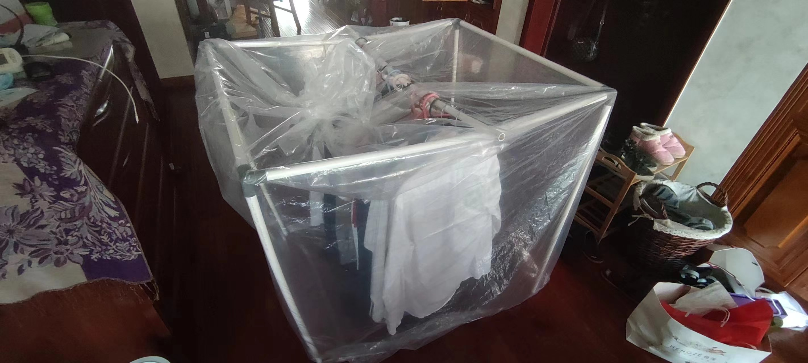{:height 304, :width 657}
						- 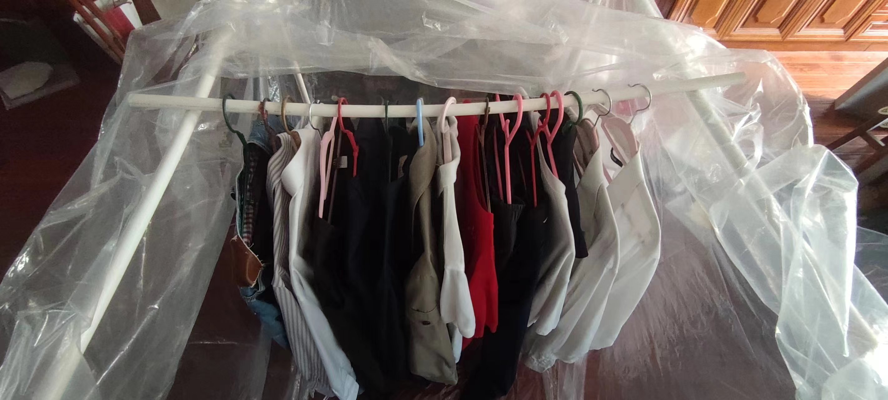
						- 20mm的PVC管分别长1m、0.8m（用PVC管剪和皮尺剪的），方底塑料袋1×1×2，“差不多”能挂15件衣服
						- 接下来有空测一下气密性
					- >预防先于治疗，可以搞个气密衣柜（可能大部分衣柜每一侧都漏气，需要用相关的密封条，但好像都不够？；或者直接用大厚塑料袋套在PVC管框架上作极简衣柜），里面放桶装、袋装的生石灰（不太灵敏，可能不用）、氯化钙除湿
					  >再大点就是房间、全屋气密、除湿 ![[doge]](https://i0.hdslb.com/bfs/emote/3087d273a78ccaff4bb1e9972e2ba2a7583c9f11.png@48w_48h.webp)
					- [几种食品包装用塑料膜阻透性能比较-Comparison on the Barrier Properties of Several Plastic Films for Food Packaging](http://packjour.ijournals.cn/bzgcgk/ch/reader/create_pdf.aspx?file_no=201801014&flag=1&journal_id=bzgcgk&year_id=2018)
					  collapsed:: true
						- 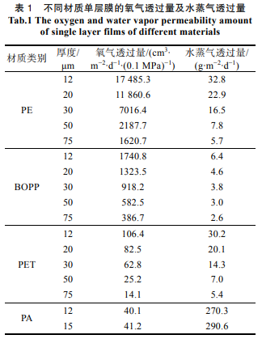
						  collapsed:: true
							- 1丝=10\mu\m，市面上的PE方底塑料袋的厚度大多在10丝以上，五面共5平米的话，理论水蒸气透过量小于每天28.5g，应该还行
						- [双向拉伸聚丙烯薄膜_百度百科](https://baike.baidu.com/item/%E5%8F%8C%E5%90%91%E6%8B%89%E4%BC%B8%E8%81%9A%E4%B8%99%E7%83%AF%E8%96%84%E8%86%9C/7111020)
					- “透明”？
					  collapsed:: true
						- 不鼓励你的室友通过排除法推测你今天穿了什么，可能去见什么人，或是又买了什么新衣服
			- 下层剩余空间（若有）放其他
			  collapsed:: true
				- 硅胶干燥剂（需要在更低湿度储存的食品、药品、纸制品等）
		- [3个方法，轻松修复损坏的柜门铰链！_哔哩哔哩_bilibili](https://www.bilibili.com/video/BV1EL411y7XB)
	- ((665985ce-8b50-4a04-a91b-a167f62b7dd6))
- 园艺
  id:: 63317673-a5f0-46c9-ac60-c9fe943786c6
  collapsed:: true
	- 芳香植物
	  id:: 63317673-f6cc-4691-b8f1-817c3a13278d
		- [[香气]]
		- 采腊梅、栀子花等
		  id:: 63317673-4a54-42a8-817f-3c136670c98b
		- 容器、基质（轻或无，方便移动，争取让妈妈也用上）、种苗
		  id:: 6364f654-e7a9-41d0-835b-fa9ccc324a5a
			- ((624702d6-c99f-41b2-ae69-258c5b812606))
			  id:: 63317673-16ac-415b-895a-d228dd1fcab5
				- [罗勒，紫苏，香茅和薄荷](https://zhuanlan.zhihu.com/p/28539116)
				- [九层塔、罗勒、紫苏在烹饪上有什么区别？](https://www.zhihu.com/question/39476734/answer/1295505879)
		- 肥料
			- 黄粉虫粪
				- 厨余
			- 人肥
				- 尿肥
				- 粪肥
		- 高效开窗让卧室植物晒太阳的方法
			- ((63650f91-0f3b-4ce1-9ce7-7b506d040aa7))
		- 干花
- ((670d40ca-082f-401d-8aff-5219951b6585))
- [[空净]]
  collapsed:: true
	- 使用空气净化器比打扫省钱、省时、健康
	  id:: 66db8aba-8e8b-47e9-af03-a6c98445f362
		- 省钱
			- 颗粒物原来100降到20，少80%就可能降低打扫频率到原来的20%
			  id:: 66db8aba-4406-4dd6-b010-9b89833ea615
				- 假设清洁地面需要半小时，请人工30元一小时（可能还有点低，我家请的是“大部分打扫”50元一小时），就是15元（不清楚能不能最短半小时），半个月打扫一次的话，一个月就是30元。而滤芯20元寿命6个月，加上电费一个月约20元，虽然相差可能也不太大，但你还额外收获了呼吸和 ((65d69eb6-54ad-40e4-a290-5e0028758b75)) 等方面的健康、减少了“外人”的打扰，更何况，一般的人工清洁覆盖范围还比较有限
				- 如果使用 ((66db8aba-f3b7-4ad1-be8f-cfddb29578b9))
				  id:: 66ebe718-400b-4bf5-93d5-bc7bb0a00ea9
		- 省时
			- ((66db8aba-4406-4dd6-b010-9b89833ea615))
				- 请人工也需要沟通和配合其工作的安排，打扫到你所在的位置了，你为了配合打扫大概会让，如果你用台式机，那么不一定能继续用，你可以去阳台 ((65a9d480-f240-4ff5-9072-8ed1d4e334d6)) 看手机，但有时你还是更想不中断用台式机
				- ((66db8aba-f3b7-4ad1-be8f-cfddb29578b9)) 也要让
				- 当然，你也可以外出，也许一时外出一时爽，一直外出一直爽，但那样就不太像是有一般意义上的家务了
		- 健康
			- 请人工，抛开“厚障壁”啥的不谈，陌生人在家不一定比陌生人不在家舒服，有些人是膈应的，对他们来说，家是很私密的场所，别人来打扫了，自己又“贪玩迷恋”舍不得出门，巴不得别人早点打扫早点出门
- [[家务]]
  collapsed:: true
	- > 苏格拉底曾对一个名叫尼各马希代斯的人说，“管理私事与管理公事只是量上的区别。在其它方面，二者完全相同。所以，你不应该轻视善于管理家务的人。”——色诺芬《回忆苏格拉底》
	- [一个效率专家对家务上的优化建议（1） - 知乎](https://zhuanlan.zhihu.com/p/22099605)
	- 不要让家务耽误更重要的事情
	  collapsed:: true
		- [加快推进家务劳动社会化_澎湃号·媒体_澎湃新闻-The Paper](https://www.thepaper.cn/newsDetail_forward_26575706)
		  id:: 670c9e07-c62a-4ad1-b778-ba218659c568
		- id:: 66ebc97c-a64d-4e17-8f7d-d0778968521f
		  >可能正确的理论不需要那么多他律、强制手段，家务、家务外包（比如外卖）都可以生产出来，同样也可以不生产，可以大搞室内空气净化、公共食堂、生食、辟谷等，开水、刀、油、油烟、灰尘不碰了，就少很多家务，其他方面也类似，就不用在这些影响人自由全面发展的事情上浪费时间
		  劳动者的理论和实践并不需要这么单调，
		- ((66db8aba-8e8b-47e9-af03-a6c98445f362))
		- ((66db8aac-5e73-4751-ba9e-c0941a8c92a3))
		- 不 ((66db8aba-7744-4ab3-9329-cb21c27cf2e1)) 更省时、安全、营养健康
		  collapsed:: true
			- 备菜时间可能超过用餐时间，削皮量大（尤其在单个重量较小、形状不讨好时）、对切细等精细工艺不熟练时是这样的，熟练了则可能搞更复杂的工艺把省下来的时间又加回去
			  id:: 66ebeb46-9348-45ab-b27c-0e9f088a22f2
			- 削皮刀也可能削到手
				- 土豆等批量去皮可以用专门的去皮机
			- 土豆等连皮加热保留更多汁液、味道和口感（水煮时减少水渗入），可能也保留更多营养
			  id:: 66ebeecd-d4db-41ca-9fd1-732629ef8fdd
		- 不 ((66ebea5c-cc04-4494-83d4-cf1e19f53782)) 更省时、安全、营养健康
		  collapsed:: true
			- ((66ebeb46-9348-45ab-b27c-0e9f088a22f2))
			- 持刀、按菜姿势不对，食材硬且刀钝，都会增大切伤风险
			- ((66ebeecd-d4db-41ca-9fd1-732629ef8fdd))
		- ((66ebcd7a-25e7-4795-9daa-27624ffb44f4))
			- ((66ebe54f-af5b-4bcf-bf9f-874ff6ea3a50))
				- ((66ebe9fc-7e81-48e8-94a4-425bb36277e6))
	- [[儿童]]及相关事务并没有想象中那么可怕
	  collapsed:: true
		- 一个关键问题在于你都这么大个人了还不会玩
			- [[城会玩]]
		- 另一个关键问题在于你都这么大个人了还不会投机取巧、提高效率
			- 被主流，然后儿童
	- 家务相关的家暴
	  id:: 66ebc8d7-8476-496b-8f75-aacfb8cb6032
	  collapsed:: true
		- 烧白开水相关家暴
		  id:: 66ebcb7f-6b50-4188-864b-796d4fe7f3f8
			- “呜呜呜呜呜呜呜呜呜呜~”“怎么还不关火？！”“水灌了没？！”“呜呜呜呜呜呜呜呜呜呜~”
	- ---
	- DOING 扫地
	  id:: 65d9ed4a-4d43-454b-89e3-536c9eb182f8
	  collapsed:: true
	  :LOGBOOK:
	  CLOCK: [2024-02-24 Sat 22:35:48]
	  :END:
		- 扫地除了花时间，主要就是对腰背不太友好，因此要
			- “不扫啦不扫啦！”
			- 减少腰背负担
				- 扫地机器人
				  id:: 66db8aba-f3b7-4ad1-be8f-cfddb29578b9
					- 卡在轻微凸起（包括不到1cm厚的地毯、木地板挡水条）上下不去（“这个扫地机器人就是逊啦！”）
					- 电池容量下降/“老化”
					- 借/租扫地机器人
				- 尽可能使上身正直
					- 扫帚加长
					- 屈膝
						- ((65c6f987-b61e-41fa-b32f-4ca354d07011))
						- 弓/箭步蹲
						  id:: 667b89da-4d97-4556-8383-19052a06ca50
			- 强化腰背
		- 扫帚的握把可能需要在人体工学上优化
	- 拖地
	  collapsed:: true
		- 硅胶地刮/刮水拖把 30（45cm宽，小空间可能要窄些的，不确定；在瓷砖等防水地面洒水后拖，污物拖到一起去除固体后吸水，轻度到中度清洁，略顽固的污渍可以用硅胶角小面积加大力度清除；可能比脚踩抹布蹭要舒适、安全些）
	- 擦玻璃
	  id:: 66db8aba-9b5b-40bf-bfb3-75588e6ceca0
	  collapsed:: true
		- 玻璃污物组成
			- 白色水渍
				- 未RO的自来水洗手、洗砧板后甩水
			- 黄色
				- 花台花盆土壤（“雨泥啵啵”；搬走或搬远点）
		- 《擦玻璃》好吗？
		  id:: 65c32c2c-caa8-40c0-a618-04a960ee7df8
			- “让我们一起擦玻璃”
- [独立女生小课堂的个人空间-独立女生小课堂个人主页-哔哩哔哩视频](https://space.bilibili.com/3546610334173705)
- 与 ((6646de8a-3cac-4e9a-bc18-96fe4da6910f)) 类似，镜头、界面、市场等因素有意无意的选择性表达和刻意误导会扭曲人的“自然天性”，进而
- [[饮食]]
  collapsed:: true
	- 对大多数人而言，由家庭之外提供的食物是不太便宜的，而且如果要吃得健康些也会贵，或者可能离得远，无论是少数食物相对干净的自助餐厅或是俱乐部
	- [[买菜]]
	- 不炒菜等高温烹饪更省时、安全、健康
	  id:: 66ebcd7a-25e7-4795-9daa-27624ffb44f4
	  collapsed:: true
		- 省时
			- ((66ebeb46-9348-45ab-b27c-0e9f088a22f2))
			- 炒一道菜后如果还要炒，为了减少粘锅和有害物质积累，一般要先洗锅，而蒸煮一般没这个问题，清洗更简单、换盘更快捷
			- 洗碗时间可能超过用餐时间，高温烹饪多出来、一般不会吃喝干净（“舔盘”可能不代表实际行为）的食用油和食物油脂更难洗
			  id:: 66ec01f8-52e8-4e98-9599-f804bb2db1be
				- 此外，还参与下水道堵塞（当然可能主要是相对固态的动物油脂），下水速率也可能延长在水槽洗碗时间
				  id:: 66ec0204-09fb-47cd-88aa-bfa04e639662
		- 安全
			- ((66ebe67a-aa74-46d9-943e-ef53c03edbf5))
			- ((65ae08cc-76e1-4826-aab7-5a7e74fcaa27))
				- [陈建民课题组在烹饪油烟暴露健康效应研究方面取得新进展](https://environment.fudan.edu.cn/5a/55/c26494a285269/page.htm)
					- id:: 66ebdc23-b32d-4d9a-9503-a97d8af27fe4
					  >2018年全球癌症统计数据表明肺癌占中国所有癌症死亡的24.1%，全球约15%的男性肺癌病例和53%的女性肺癌病例与吸烟无关。中国的吸烟女性仅占4%，但肺癌的发病率却高于其他吸烟率相对较高的国家。相关研究表明烹饪油烟可能增加罹患呼吸系统疾病的风险，尤其对于吸烟率较低的国家。
						- ((66ebdeec-bc74-4b35-b19f-61afc0b19f6d))
				- 几百上千的 ((65f78b91-757f-430b-8996-d7ae97e6cb42)) 到底行不行？
		- 健康
			- 丙烯酰胺
			  collapsed:: true
				- [【炒菜致癌？】高溫炒菜恐增致癌風險！公開22種炒菜丙烯酰胺含量](https://urbanlifehk.com/article/78188/%E7%82%92%E8%8F%9C%E8%87%B4%E7%99%8C-%E8%87%B4%E7%99%8C%E8%94%AC%E8%8F%9C-%E9%A3%9F%E7%89%A9%E5%AE%89%E5%85%A8-%E8%94%AC%E8%8F%9C%E7%87%9F%E9%A4%8A-%E8%87%B4%E7%99%8C%E7%89%A9) 。
		- [炒菜时的7个“坏”习惯最伤身！为了家人健康，尽快改正！_澎湃号·媒体_澎湃新闻-The Paper](https://www.thepaper.cn/newsDetail_forward_26871692)
		- “所以最终解决方案是什么？炒菜等高温烹饪的家务平均分摊？”
	- TODO 不烹饪可能更安全、健康
	  id:: 66ebe54f-af5b-4bcf-bf9f-874ff6ea3a50
		- 不自己烹饪，交给熟练的人或机器烹饪
		- [[生食]]
	- TODO 不吃更省时、可能更安全、健康
	  id:: 66ebe9fc-7e81-48e8-94a4-425bb36277e6
		- 不吃就不用拉
		- ((66db8b00-f2a9-4d51-b6f2-0b63868c66ec))
	- 厨具
	  id:: 65a9d48e-5419-4505-ba01-d72b66941f1c
	  collapsed:: true
		- ((65bcbf48-be5c-46a4-a88e-9cb147c75e42))
		- [[净水器]]
		- 烟道止逆阀
		- 护手
		  id:: 65bcbf49-b9a8-4cc5-9edb-7f1fbf275c7f
		  collapsed:: true
			- 厨房手套
			  id:: 670d40d8-937f-47bb-a6b9-7a2528bff95f
				- 丁腈手套
					- 目前用了几个月，感觉比乳胶手套更好
					- 虽然价格更高，但也更耐用，异味小很多，内部不容易黏，易取下，贴合度对普通厨艺也不是什么问题
				- 乳胶手套
					- 避开高温、日晒，以免加速老化
					- 用后，手套指尖甩不出来，可以换一个方向甩
					- >手套厂可能要“养人”，但我不再忍耐乳胶手套因为开了一点缝漏水就要换或凑合翻过来给另一只手戴的现状
		- 涂层
		  id:: 661f5746-1b76-447f-9b9a-f25b018ee28f
		  collapsed:: true
			- ((65bcbf66-680b-48d9-9ba4-ac46827f01bd))
			- 锅铲、饭勺
		- 霉菌
		  id:: 661f8480-d60a-4d09-bc6b-ae3bd2fa9055
		  collapsed:: true
			- 锅铲、饭勺
		- 称重
		  collapsed:: true
			- 想兼顾大量程、高精度、少花钱的话，可以分两三台买
			- 称量取用的经验丰富后可以做到“心中有杆秤”
			- 或者可以通过记录（购买日期、用完日期等）的方法在较长周期估算和调整
			- ---
			- 体重秤（至少大几斤的物体可以拿着站上去一起称，然后单独称人，再相减）、手提秤（怕电子秤坏或没电可以用弹簧秤）
			- 厨房秤 10（精确到1g，量程5kg，量程可以再大些；如果要称酵母之类重量较小的且不用毫克秤则可以精确到0.1g或001g）
				- 电池盖处可以贴上胶带防水防尘
				- 按钮部位也可以贴上胶带防水防尘（开关按钮可能失灵）
				- 厨房秤维修 #维修
				  id:: 65fbb474-6eea-497b-8b77-2f8a89fa92ec
					- 电源开关按了打不开
					  id:: 65fae257-8cf7-4690-9e06-72b28871e3a2
						- 常见原因：开关触点被杂物挡着或锈蚀了
						- collapsed:: true
						  >只是电源开关键不好用了，每次得拔电池。
							- [简单修理厨房电子秤，0成本，低人工，希望对大家有帮助_电子秤_什么值得买](https://post.smzdm.com/p/a839nm4n/)
								- id:: 65fae2aa-28e3-47f5-ae01-31529a68702b
								  >按键就是薄膜按键，没有密封粘在电路板上，估计进了面粉，所以接触不良，用手打开一个缝，擦擦，吹吹。ok 
						- [拆修一个5000gX1g厨房秤SF-400附4脚立式微动开关拆解 - 拆机乐园 数码之家](https://www.mydigit.cn/thread-79603-1-1.html)（“哈哈，拆到搜开关搜到的，是我的那种厨房秤”）
							- [拆解9.9元包邮的厨房电子秤 准确率不错 打开一看简陋到没朋友_哔哩哔哩_bilibili](https://www.bilibili.com/video/BV1Gq4y1u7ME)（“哈哈，更早看的瞄了几眼忘啦！”）
								- >核心就一个应变电桥，一个牛屎芯片和屏幕
							- [【开箱/拆机】海尔厨房秤拆机，原理大揭秘！结构分析，注塑模具分析；_哔哩哔哩_bilibili](https://www.bilibili.com/video/BV1S24y1R7gm)
						- 显示屏和按钮的面上的贴纸可以扯下，然后能看到螺丝，然后拆拆拆（底部的秤台传感器校准螺丝可能要先拆）
						- 电路板那一行行“金手指”搭在液晶显示屏上供电
						- 锅仔片薄膜开关，我的厨房秤是直径8mm的，圆周上三个凸触点，中间一个凸触点
							- 有一个锈了，据网友说
								- >别用白醋，直接细砂纸蹭，或者刮一下
								- 但
									- >OK，但我今天想到有两个好的就够了，裁了下，好的贴开关和归零上了
									  >然后发现中间换单位键还是能用，可能跟开关固定区域也锈了点有关
										- >干脆用烙铁引出线来买几个按钮接上
										  >用到报废也不坏按钮了（
					- 经常显示低电量（明明电池才充满的）
						- 可能同 ((65fae257-8cf7-4690-9e06-72b28871e3a2))
					- 秤台（受重）倾斜导致测量不准
						- 厨房秤底部有纸挡着的地方能捅开或撕开，内有螺丝
						- 秤台传感器上有两个构成杠杆、调整水平倾斜度的校准螺丝，倾斜可能是靠外的螺丝向外转了
			- 帝衡10g量程的毫克秤 32（可选，称量用量较小膳食补充剂、食品添加剂、香料等的重量）
			  id:: 66ade374-9a3a-4284-aa39-e752c365306d
		- 称体积
		  collapsed:: true
			- 有时手忙脚乱，不方便用厨房秤，或是厨房秤坏了、没电了，就需要用还没坏的称量方法
			- 量勺
				- ((65efaeff-2117-47f0-876f-1031ea55a01f))
			- 小量杯
				- 之前 ((65f6b597-b90a-4512-a4d2-84694de9575f)) 时用过
			- 量杯
				- ((65ef0b9e-d45d-4324-8898-52325ded63ae))
		- 去皮
		  id:: 66db8aba-7744-4ab3-9329-cb21c27cf2e1
		  collapsed:: true
			- kisag平齿削皮刀 25（上大学时买过，比相对畅销的维氏的歪头削皮刀更顺滑、顺手，后来不知到哪去了，用瑞士力康的锯齿削皮刀也很好也可以通用，但硬皮蔬果可能还是用平齿削皮刀削皮比较好；kisag还有厚皮削皮刀，应该适合削贝贝南瓜；有塑料手柄的和全不锈钢的两种，我现在用的是全不锈钢的）
				- 带挖孔设计的注意朝外挖，以免刮到另一只手
				- ((65e59d27-17ac-42d3-9dd1-145782ca98b3))
			- “削皮架”
			  id:: 66beb9fe-be53-4f49-84d1-4002d4c5ff3b
				- 蹲在垃圾桶前，肘架在膝附近，往复省力
		- 厨余或其他垃圾
		  collapsed:: true
			- TODO 一次性水槽过滤网袋（感觉我家用了段时间又不用了，是降低了下水速率还是嫌每次放麻烦？可能也跟进入水槽的厨余种类有关，如果较细的厨余不多，可能就用不着）
			- [[垃圾袋]]
			- 垃圾桶
				- 可以直接在大口垃圾桶上空削皮
				  id:: 65e59d27-17ac-42d3-9dd1-145782ca98b3
				- 自动开关盖的垃圾桶（可能）只负责手靠近了（探测高度不够）开和关，不负责撑满后换垃圾袋
				- ((65d0ac85-1da4-4678-b0a9-66ddb798426c))
		- 清洗
		  collapsed:: true
			- 锅底要干净，以减少油烟
			- 海绵块
				- 木浆棉抹布块 1
					- 其实我单用了好久钢丝球才发现这玩意真香，确实要“专业的工具干专业的活”，因为木浆棉抹布块比钢丝球实际接触面积大，更易带走油污和污渍，比海绵块稍硬，对粘黏物体的机械去除能力较强，但又不至于像钢丝球那样对锅的涂层和“镜面”伤害那么大，同时更容易干燥，不那么容易发霉，使用寿命也长
			- TODO 毛刷（==现在好像不咋用了==；刷红薯、土豆等的泥。软毛或中毛，太硬了破皮会导致额外的营养和烹调损失；另有一个[[赤足跑]]后冲水刷脚——我是在淋浴间刷的）
			- 手洗厨餐具方法
			  collapsed:: true
				- “别搁这洗碗啦，用烤箱做不需要锅盘碗的菜吧”
				- [游戏教学博主的洗碗课，高贵的洗碗机玩家绕道_哔哩哔哩_bilibili](https://www.bilibili.com/video/BV1hL4y1e7kc)
				- [户外露营洗碗方法❗️轻便/好收纳/效率高/省水❗️吃辣火锅都不怕油了_哔哩哔哩_bilibili](https://www.bilibili.com/video/BV1oh4117772)
				  id:: 661545f1-60d2-4650-9142-5eb1a83e23e8
				- [【小屋夜校/D-1-4】神速洗碗大法_哔哩哔哩_bilibili](https://www.bilibili.com/video/BV1oT4y1W742)（“可能比Geist平均水平高，但尚未讲究戴手套护手”）
				- 省水、洗洁精、时间版手洗
				  collapsed:: true
					- 省的钱主要是需要燃气或电加热的热水的钱，冷自来水并不贵，但既然要省了则应省尽省
					- 不用大盆或大锅装水泡，较理想的状态是仅润湿食物残留与厨餐具的接触面
					- 装水量少了——
						- 洗洁精用量也可相应减少，同时维持所需浓度
						- 装水时间也省下来了
						- 装水不多，旋转擦拭也能维持高速而不担心洗得到处都是了，又省了一些时间
					- ---
					- 如果有没多少油的漏盆、洗菜盆、砧板等，先用冷水冲洗，剩下不多时可以开非即热式热水器的热水准备配置热洗洁精溶液
					- 尽快（也是为了尽可能多利用余温；有可能在多人未吃完时就开始处理，争分夺秒啊！）去除流体（“沥沥”）、固体厨余，用清水或洗洁精溶液喷雾保持湿润以防干结
					- 能吸水的洗碗工具吸收热洗洁精溶液（人不多不少时通常一小碗即可）后直接擦拭
						- TODO 有没有可能用不吸水但==足够热（材料不比水的比热容低多少）==的洗碗工具与厨餐具与食物残留的接触面上的热洗洁精溶液配合==溶解、剥离餐厨具表面的食物残留、油污==？——“新材料是吧？”
							- “有没有可能用一次性抹布或厨房纸巾就行，只是稍微贵些？”
					- 最后用适量冷水冲洗
						- 一手转移时另一手就拿下一件
					- ((66a368f5-311e-4d0d-bec0-e5e10fcf03bd))
				- 更省版（不用洗洁精版）
				  id:: 66d14b93-7b72-4d68-8721-626e1156b685
				  collapsed:: true
					- 饭后戴丁腈手套，挪堆叠起来的餐具到水槽水龙头正下方，用小流量自来水接水同时用钢丝球等刷洗，接到大约一两碗水后关水，刷洗后放一边，刷洗完了再开稍大的小流量自来水用手套擦擦转转放一边
				- 软的用木浆棉抹布擦，硬的用钢丝球刮，涂层不能硬刮的电饭锅内胆先和饭勺（如果是金属的可以不泡直接刷）泡着
					- 擦过刮过了先放一边，待会儿一起冲洗
				- 洗碗无聊、等不及？
				  id:: 66db8aba-5f68-4a8f-860b-4599215273cb
				  collapsed:: true
					- 可以听书听视频
					- 可以记着随时冒出来的想法，回去用 ((65bcac14-f887-4224-92e2-1d16751f358d)) 等记录
					- 可以把总工作量拆成几批，减少“视域内主观易感工作量”，多走动几次搬运，比如靠近水槽的、远离水槽的、餐桌上的餐厨具和餐桌上要清理的垃圾
					  id:: 66fc891c-fad0-42ed-8d05-66972e4f32b0
				- 如果锅会锈，洗锅后剩下的水可以擦去，或者静置一会儿后倒出水（省点燃气）再开火，提前关火
				- ---
				- 洗碗
				  id:: 668ce732-1695-4b8b-b682-6d61c2eadc40
				  collapsed:: true
					- [正確洗碗方法｜碗碟浸水10小時繁殖48萬倍細菌 拆解4大清洗迷思｜好生活百科](https://www.weekendhk.com/lifestyle/%e6%b4%97%e7%a2%97-%e7%b4%b0%e8%8f%8c-%e6%b8%85%e6%b4%97-ctb02-cc-1062687/5/)
					- [洗碗精殘留恐傷腸道、增慢性病風險 8招完全去除超乾淨 - 健康 - 中時新聞網](https://www.chinatimes.com/realtimenews/20240605003172-260418?chdtv)
					- 水槽洗碗趴床
						- ((645636b5-ceb2-4609-85ba-2f48d21290ba))
						- [如何利用健身知识远离洗碗做饭的腰酸背痛？_哔哩哔哩_bilibili](https://www.bilibili.com/video/BV1JF411p7DQ)
					- 干洗
						- ((64564928-257c-4d15-9c0f-2fa63543a828))
							- 纸、砂纸、硅胶橡胶塑料刮板等刮除更多表面污渍放入虫桶，可能剩下的会成为垫料
			- TODO 洗碗机
			  collapsed:: true
				- ((65ebd2a5-9398-48d3-8217-1bb00a32f2f1))
				- 餐厨具去除较大的固体残留物后，在洗碗机架上朝下朝内摆放
				- 下层的物体不要高到上层，以免卡住
				- 小孔是放勺子等的，方便它们自己在小孔中转，而不是在一个大孔中互相挡
				- TODO 洗碗粉
					- ((65bcc04c-db7f-477c-b8c7-b4e45998a359))
				- TODO 买洗碗机
				- 洗碗机
				  id:: 63317673-51e5-45af-a1b8-6e7386f82f7b
					- 厨柜不匹配、厨房空间有限、上下水已被水槽水龙头和净水器占用的情况下如何安装？
					- 垫高下水架子以便正常使用
						- 之前一个双十一还是六一八买了个，安装师傅大聪明过来说没加高的台子（用建筑材料的那种），洗碗机不好下水，好多家都是这样装不了，建议我们退了，那就退了，后来又看了下，网上有加高的相对轻便的台子卖啊
					- 用法
						- 洗油烟机滤网？
						- [硬核洗碗机低温牛排全过程 可以用洗碗机做低温牛排吗_什么值得买](https://post.smzdm.com/p/a83dxvll)（得找块便宜的）
			- 下水管
			  collapsed:: true
				- 下水管堵塞
				  id:: 66f93270-72dd-43fb-bd37-5c7014bfd2dd
					- {{embed ((66ec01f8-52e8-4e98-9599-f804bb2db1be))}}
		- 切割/搅拌/塑形
		  id:: 66db8aba-74d0-4599-b78f-50d6cd7bc416
		  collapsed:: true
			- 切割
			  id:: 66ebea5c-cc04-4494-83d4-cf1e19f53782
				- 片刀（适合切各种，不要买太钝的一般就够用）
					- 用刀安全
						- 除了“跪姿”外，副手可以架在刀背上对可能滑动的食材切块
						- 剩下有切痕但没分开的块可以用刀背配合手掰开
				- 淘宝“新芽家居”TPU砧板（轻薄、可弯折、便携，不适合剁）
				- 龙江切丝器（建议用单买的更安全的护手器，最好再戴手套，食材最后一段建议用刀切，以免无防护硬来削指尖；那种多孔的阻力大、汁水损失多，拿着食材推刨也不安全；要“做大做强”餐饮可以考虑升级买淘宝“熙公子千刃坊”的千叶切菜器，可以切出可用于火锅的“长寿土豆面”、“超长幅藕片胶卷”的效果）
				  id:: 65a9d48e-dd79-4d6f-9a42-28f2bbee3cbd
				- 奶酪刨（可以将大块马苏里拉刨成细条）
				  id:: 66149db3-ed62-4a0e-a7d3-2cf3d8edb08e
				- 椰青塑料软刀（可以挖“椰子蛋”，简单挖半个或整个喝剩下的椰肉也比勺子更好用；牛角的比塑料的贵不少）
			- 硅胶抹刀（刮、舀、抹番茄酱、蛋液、软质奶酪等；刮的可以买末端弯曲的）
			- 搅拌
				- ukoeo u2打蛋机 46
				  id:: 65d0ac85-476c-4639-9382-48894a2f20b5
				  collapsed:: true
					- “过年涨价啦？”
					- 可搅拌蛋、肉糜、奶油、大啤酒杯中的膳食补充剂等
					- 搅拌肉糜用片棒（弹性小、少卸力，缠绕肉丝少），应该说还是有点吃力，且片棒缠绕的肉丝也需要去除（可以靠近水槽侧角蹭侧向下、从而减少“肉末横飞”的刷子旋转去除，忘了能否去除干净了）
					  id:: 66db8aba-64f4-4f86-b84b-1d2fc797b065
					- 杯子口径小的话可拆下一个搅拌头在杯中搅拌
					- 打蛋头可以抽下来当手动打蛋器用
					- 打蛋机需要更深的 ((65f83416-42d2-4b00-8017-3d75c6b32008)) ，以防把食材甩出来
				- 宜家哈特土豆泥捣具（可以捣[[土豆泥]]等）
				- 手动打蛋棒
				- 厨师机（揉面、搅肉馅等）
				- 盆
				  collapsed:: true
					- 揉面盆（更开口）
					- 打蛋盆（更收口；可以用较深的锅代替）
					  id:: 65f83416-42d2-4b00-8017-3d75c6b32008
					- 也可以用对应形状、大小的碗、锅等代替
				- 搅肉馅
					- 有说用手搅拌更好的，但裸手搅拌肯定洗手麻烦
					- 握筷搅拌一般用两根筷子，可以通过更大重量的搅拌容器、肉馅与平台的摩擦力减小搅拌容器的旋转速率，从而可以用双手握筷搅拌，搅拌时肉馅更容易不沾手；单手握筷搅拌可以切换手指位置或戴手套减少手指抵筷压力
					- ((66db8aba-64f4-4f86-b84b-1d2fc797b065))
			- [[面食]]
		- 去水
		  collapsed:: true
			- 漏盆（沥水）
			- 蔬菜甩水器（旋转离心甩水，比沥水去水更快，似乎一般的主要用途是做沙拉，但也可用于洗后冷藏备菜）
		- 免洗
		  id:: 65f78b91-347b-4654-90de-960fb89e3e36
		  collapsed:: true
			- 厨房纸
			- 铝箔片/卷
			  id:: 65dd8630-00c1-4f03-969d-216929217c0e
				- 可以烤箱烤完了就放在上面吃，吃完把垃圾一裹扔了
				  id:: 65e2baf4-7574-4d04-bd1a-e15c482de83b
				- 用过的铝箔可以撕下（足够大的）一角当生熟备料碟，还可以弯成漏斗型
				  id:: 66140e5e-0d6d-44c0-931d-38a57ff99803
				- 带食物煎烤减少粘连的方法
					- >有个小方法，铺之前抓一抓把铝箔纸揉皱一点，这样就不会大片食材贴上去粘了[doge]
				- [烘焙时用锡纸应该用哑光面还是亮面？ - 知乎](https://www.zhihu.com/question/30395059)
				- [FoodTalks全球食品资讯网](https://www.foodtalks.cn/news/50520)
		- 加油
		  collapsed:: true
			- “最加油的一集”
			- 喷油瓶（减油、防粘，一般有预加压和按压两种）
				- [担心买到的喷雾油壶是呲水枪？看了这篇不会踩坑！ - 知乎](https://zhuanlan.zhihu.com/p/531923684)
		- 加热
		  collapsed:: true
			- ((66335be1-3865-47de-8837-11c61b2312ca))
			- 电饭锅
				- 电饭锅内胆不粘图层
			- 烤箱
			  id:: 65cd7fd5-20a9-403e-b466-9ec2c219eb75
			  collapsed:: true
				- 为什么推荐买烤箱？
				  collapsed:: true
					- 烤箱很“傻瓜”，与各种锅相比，它非常的工业化、城市化、自动化
					- 能够较大程度地排除“（相对复杂的）厨艺”（“厨艺”能用来锻炼和交友，但并非所有时间都是锻炼和交友的时间）的影响（主要的工作量是放置和翻面，甚至连翻面都不用）
					  id:: 660260ef-e021-47b9-9b5b-2945bc9a38e2
					- 节约时间（可以通过定时插座实现“预约”功能）
					  collapsed:: true
						- >如果你有一个烤箱，你就可以在休息日把红薯、贝贝南瓜、肉圆、披萨全都烤好，
						- >我现在用烤箱烤红薯、贝贝南瓜、贝贝南瓜籽、披萨，比微波炉光波混合模式更好吃——而且（红薯、贝贝南瓜等）整个烤了可以冷藏冷冻慢慢吃，冷冻红薯微波炉1-3分钟就好吃，也可以冷藏或室温解冻若干小时外带班中餐
					- 减少 ((65d0ac87-28c2-44df-be12-26aff2a77a2e)) 伤害（不切菜就不会切到手，至于烫伤，用燃气灶也同样可能被锅烫伤，而烤箱通过“预约”功能还可以预留自然冷却时间）
					- 更好吃/美味（带“光波”的微波炉烤红薯也比烤箱烤红薯的味道差不少）
					- 更营养/健康
						- 炒菜是不是一般要用油？烤箱至少烤红薯、贝贝南瓜可以不用
					- 可以不洗碗
						- 耗材铝箔扔掉就行，一张铝箔还可以多次使用
					- 而在价格上，UKOEO D1烤箱185元，威力20MXP01微波炉249元
					  collapsed:: true
						- 初次加热的耗能一般比复热高不少，且（可能）较少有人满意于微波炉的初次加热效果，因此拿烤箱的耗电量与微波炉的比较是不恰当的，烤箱更应与燃气灶、空气炸锅可能还有电磁炉乃至电陶炉相比——“先不比了”
					- {{embed ((65e1a013-a020-4b98-972e-a36561cf1709))}}
				- 烤箱选品
				  collapsed:: true
					- 关注点
						- 均匀（“均匀，还是TMD的均匀！”）
						  collapsed:: true
							- 增加加热管数量
								- [电烤箱为什么大部分都是4管的，却很少有6管加热的? - 知乎](https://www.zhihu.com/question/379328178)
							- 热风循环
							  id:: 65f44606-9bc0-46fa-974c-619f96f70917
							  collapsed:: true
								- 在不翻面的情况下，可能比增加加热管数量更有效
								- 如果烤双层，相比没有热风循环的烘焙模式加热均匀些
								  collapsed:: true
									- [38L烤箱带热风循环是否可以同时烤两层？ - 知乎](https://www.zhihu.com/question/36229554)
								- 背面（里面）出风优于（右）侧面出风？
								  collapsed:: true
									- [家用烤箱的热风功能很重要吗？ - 知乎](https://www.zhihu.com/question/30856987)
						- 功率
						  collapsed:: true
							- 电线规格
								- 大功率烤箱（风炉、电披萨炉）可能需要查看总线规格
									- 商品描述中可能会提及
					- DOING UKOEO D1
					  id:: 65f39273-8059-4b8c-96a8-abae4e183b61
					  :LOGBOOK:
					  CLOCK: [2024-04-25 Thu 12:52:23]
					  :END:
						- 32L，6管，3层（3槽，最上层可架，但是内侧向下倾斜，烤网有点碰到烤箱灯罩，铸铁锅等重物取出时可能坠落撞击下管），250度，1500W
						- 可烤10寸
						- 四脚差不多能架在20L微波炉上，稍微靠外
						  id:: 66024cda-9718-4b34-bdeb-972ff8f9ad04
						- 没有 ((65f44606-9bc0-46fa-974c-619f96f70917)) ，似乎无法不翻面地均匀烤熟红薯（两侧容易偏生）
						- 
				- [超全的烤箱使用指南来啦，这些问题你是不是也遇到过？ - 知乎](https://zhuanlan.zhihu.com/p/328603893)
				- 配件
				  collapsed:: true
					- 不一定送，便宜烤箱可能就附一个烤盘、一个烤网
					- 烤网
						- 也有比较细密的干果烤网、“炸篮”
					- 玻璃容器
						- 可能对热辐射的利用率更高，但好像金属加热管的热辐射占比不是很高
					- 烤叉（“大吉大利，今晚吃鸡！”）
					- 烤笼
						- 其实一开始搜到是因为想用它给红薯翻面
						- 坚果烤笼：烤栗子、南瓜子等
						- 肉串笼
						- 烤鱼笼
					- ((65dd8630-00c1-4f03-969d-216929217c0e))
					- ((65db1962-3ee4-4e8d-b56e-8c02a329c2f1))
					- ((65f98149-4376-45ab-8a03-9d74b795263f))
					- ((65e1a013-a020-4b98-972e-a36561cf1709))（“可以把烤箱架在上面，节省面积”）
						- ((66024cda-9718-4b34-bdeb-972ff8f9ad04))
					- ---
					- ((66039e3b-656b-4e00-ba89-25d935bfcdf9))
					- ---
					- ((65f5112b-1e17-422c-b8dc-c58ddb417e17))
					- ---
					- 烤箱保温材料
					- 零件（维修用）
						- 参数相同可以买其他品牌的，不付没个所以然的溢价
						- ((999341af-8908-45a2-a5e5-092db6ef5aa6))
				- 使用方法
					- 初次使用前按说明书空烤
						- 开窗关门，或关窗关门开油烟机，人即离开
						- 说明书的最小空烤时间可能不够，超过后应该可以调到最高温空烤到没什么气味再正常使用
					- 烤箱余热
						- 像冰箱一样在顶部和四周隔开距离
						- 在烤箱加热过程中，烤箱上方的第一道板（乃至全部）如果不太隔热，就会有点热，不把烤箱移开的话，就应当把其上的食品、药品等拿走
						- 如有需要也可利用这些余热，比如将上方的第一道板及其上方空间改成保温（热菜、发酵）/烘干（干燥剂等）柜，或者直接将想要预热的食材（比如红薯，批量烤制时缩短加热时间、减小烤制不均匀度）放在烤箱顶部或顶部的烤盘等容器内（直接接触烤箱顶部可能导致烤箱上部温度在加热的前几分钟略低）
					- 优先烤相似大小的食材，因为翻面麻烦（如果要翻面的话）
					  id:: 65f98e20-c480-4eb3-a0c6-2ef10c1245fa
						- 翻面还可能造成较薄的铝箔破损（比如红薯烤出糖蜜后与铝箔粘黏，随后翻面撕开口子），导致糖蜜滴到下方靠近或接触发热管（一般不会损坏发热管，但会制造焦糊味和固体残留）——对此，可以换用更厚的铝箔，或者换用烤盘或在烤网下叠放烤盘兜底
					- 烤箱的模式图标
					  collapsed:: true
						- 没标字的一般是旋转烤叉、热风循环、旋转烤叉加热风循环
					- TODO 烤盘要不要推到底，抵在烤箱内侧面？（烤盘中心与最中间的加热管中心在垂直面平行时可能没抵到烤箱内侧面）
					  id:: 65dd6df4-1a54-4259-a240-22944c2a11c1
					- 一段加热结束后，用隔热手套将烤盘取出放在烤箱顶上，立刻关门减少烤箱内热量损失（最后一段加热完也一样——除了“返工”外，还可能需要给其他食物保温、加热升温；除非你觉得在烤箱内翻面够快，且隔热手套够长，不会不小心烫到手腕及以上部位）
					  id:: 65dfe613-d8cd-462f-852b-9593d8e51fc4
					  collapsed:: true
						- 没戴（足够长的）隔热手套的手可以不做事，以免被烤箱门上沿、烤盘边、铸铁煎锅把手等烫到
						  id:: 65dfe664-bc03-46e6-be6e-a26412c928dc
						  background-color:: red
							- {{embed ((65eeaa79-b64f-4a14-9072-fa38d60e2fcd))}}
							- ((6600f097-7c03-47ae-b9bc-b5fa87475896))
						- 需要翻面的红薯等食材有糖蜜之类的液体渗出时，如果不想沾到隔热手套，进而沾到烤盘沿、烤箱门把手、旋钮等部位，可以用另一只手使用厨房纸等一次性用品，或者另一只手戴另一只隔热手套“让它脏”
						  id:: 65e14293-bc26-43ea-aa65-d3810ecb718a
					- 内部有冷凝水的，一些材质的内胆可能要注意防锈，加热结束后及时打开烤箱门加快蒸发乃至冷却后擦拭
					- 烤盘拿到其他地方吃后，（因为“较大的红薯没熟”等情况）重新放入烤箱前，检查烤盘底部是否粘有、夹带其他物品（“沾了红薯焦糖的隔热手套就可能沾在底部”）
					  id:: 65deec25-b725-4aae-8ef0-694933f25208
					  collapsed:: true
						- 
					- ((65fed7a1-c470-4ab0-b12c-310f70ade3de))
					- 短路预设模式（不同温度时间组合）
				- 常见问题
				  collapsed:: true
					- 烤箱门缝
						- [烤箱门有缝正常吗？ - 知乎](https://www.zhihu.com/question/309129505)
						- [烤箱门缝冒蒸汽正常吗? - 知乎](https://www.zhihu.com/question/498928918)
						  id:: 6602464a-abf7-46e8-bdbe-6068513993a4
					- 异响
						- 烤箱的板材可能因为热胀冷缩而发出声响，对于这个烤箱而言，可能不是什么问题——“可能类似比较胖的人一般也比较重”
				- ---
				- TODO 清洁烤箱（“哇靠，焦糊味好难闻”）
				  id:: 65db421f-00cf-45ac-8702-67cab81bc5ca
				  collapsed:: true
					- 最高温空烧（不介意的话也可以同时烤食物，比如[[烤红薯]]（尤其是较大的红薯最后高温缩肉收尾）、[[披萨]]）
					- [3 Ways to Clean the Oven - wikiHow Life](https://www.wikihow.life/Clean-the-Oven)
					- [How to Clean an Oven Quickly and Thoroughly](https://www.realsimple.com/home-organizing/cleaning/how-to-clean-an-oven)
					- [如何清洁烤箱？ - 知乎](https://www.zhihu.com/question/27329059)
					- [家里的烤箱都是油渍和脏东西，用什么清洗，求推荐？ - 知乎](https://www.zhihu.com/question/273782170)
					- [超详细的烤箱清洁指南，赶紧mark一下！ - 知乎](https://zhuanlan.zhihu.com/p/405119635)
				- 加热所需时间过长（超出菜谱时间）/上下管加热效果差异过大 #维修
				  id:: 999341af-8908-45a2-a5e5-092db6ef5aa6
				  collapsed:: true
					- 看看加热管是否不红（尤其注意上管，烤箱上层有灯，但应该不会盖过上管的红光），看着不红的话可以进一步用湿纸巾（或者保险点用干纸巾）往加热管上蹭听声音，没声音的话一般是插簧从插片松脱断开连接、老化或加热管损坏
					  id:: 65f3104d-60df-40d8-9fbc-cd9c545062e9
						- 但是具体原因还不好确定（加热管表面看不出破损的话，更可能是插簧与插片断开连接），那么要拆开来看看
						  id:: 65f6facd-f875-4901-bcee-9bd66e8e9573
							- 拔插头，开关转一下放电（可能非必须）
							- 维修用的台面怕脏、擦出黑色划痕可以先拿一次性桌布等垫着
							- 拆前拍照
							- 拆装烤箱时建议戴手套以防被烤箱壁的薄金属板边缘割伤
							- 用十字螺丝起子或 ((65f70460-bee9-49ec-8ef9-d7aa204cb36b)) 拧螺丝拆烤箱外壳（如果有特殊螺丝，还需要对应的螺丝起子或批头）
							- 有的烤箱可能要全拧下来才行，或者后面全拆，底面拆边框，然后将开关盒的侧面钢板巧妙取出
							- 拆开的过程中可能会看到蜘蛛网、小虫子尸体等，如果你有较严重的 ((64f1a167-ae1d-4953-a755-c6739cdb7b67)) ，可以先请别人帮忙
						- 发热管连接线
						  collapsed:: true
							- 6管烤箱不一定是三叉线，相对便宜的小品牌烤箱也可能是中后管用发热管连接线
							- 镀锡更导电，镀镍更耐热，连接发热管、更热的当然选更耐热的镀镍
							- 尺寸是插簧内宽，所以大于4.8mm，OK没问题
							- 或者买插簧加硅胶护套
							- 插簧
								- 在开机状态下，推后面的线让插簧接触插片，应能看到听到击穿空气的电火花，且对应的上管或下管都能正常工作了
								- 相比自身和另一段发黄
						- 装回去
						  id:: 65f94b6d-163a-4dec-b85d-bf5c1e3b7dd3
							- 包在内层的先上螺丝
							- 上螺丝时对侧扶住
							- 螺丝孔朝上时，可以把螺丝先放在孔上
						- ---
						- [烤箱发热管坏了怎么办? - 知乎](https://www.zhihu.com/question/334850871)
						- [烤箱上管不工作问题的尤里卡时刻](https://www.bilibili.com/opus/909067739901984772)（“我的我的”）
						- [自己动手。丰衣足食。 篇五：自己动手换烤箱加热管 温控器，东芝烤箱过保就坏_电烤箱_什么值得买](https://post.smzdm.com/p/a3d767rd/)
						- [长帝烤箱 加热问题 自行维修_电烤箱_什么值得买](https://post.smzdm.com/p/aenzdoxm/)
						- [Changdi长帝CKTF-52GS烤箱拆解 & 维修过程_什么值得买](https://post.smzdm.com/p/454875/)
				- 烤箱改装
					- ((65f44606-9bc0-46fa-974c-619f96f70917))
						- 安个风扇
					- [家用烤箱改造--二手烤箱变身千元精准控温及加装烤箱灯，超多干货 - 知乎](https://zhuanlan.zhihu.com/p/135146635)
			- 燃气灶
			  collapsed:: true
				- 它一般已经在房子里了，没有且只是偶尔用燃气加热的话也可以用户外气炉
				- ((65f6b597-e671-48c0-b190-450c745a0a71))
				- 五号转一号电池并联转换筒
				  id:: 6600f75d-78fe-40ad-ac11-e34e5361501c
				  collapsed:: true
					- 一个转换筒一节至三节五号电池均可，燃气灶一般需要两个转换筒
					- [燃气灶电池三个月一换正常吗？你们燃气灶电池多久换一次呢？ - 知乎](https://www.zhihu.com/question/478658783)
						- 
						- [5号转1号电池转换器 - 知乎](https://zhuanlan.zhihu.com/p/277665740)
						- [燃气灶充电电池哪个牌子好？ - 知乎](https://www.zhihu.com/question/440178557)
						  id:: 6600f625-203f-4b14-a220-12aadfd282d3
				- 如果打不着火，可能是塑料旋钮滑丝转不到，可以换个旋钮
			- 高压锅
			  id:: 673b0b6c-14c9-457c-9acd-6822d44edbf7
				- wonderchef 5.5L高压锅 355（限压140kpa，比几乎所有的家用压力锅都高；如果要一次做6个以上的500mL或3个以上的750mL的[[罐头]]，以及一天要做9~18个以上罐头的，建议用容量更大的高压灭菌锅）
				  id:: 670d40d8-31f5-4954-8811-d835103731ad
			- 微波炉
			  id:: 65e1a013-a020-4b98-972e-a36561cf1709
			  collapsed:: true
				- 微波炉的主要优点是加热快，尤其是用于快速复热
				  id:: 66025588-3fd8-4c0a-8cb0-d4558e3ac228
				- 但入门级机械式微波炉其实比入门级机械式烤箱贵不少，而较贵的“微蒸烤”微波炉的蒸不如蒸锅（水波炉好像不错，但也更贵），烤不如烤箱
				- 建议用烤箱且想省钱的话最多买个最简单的就行
				- 没有快速复热的需求（比如剩菜剩饭冷藏再吃几天，下班回家赶时间三分钟内得吃到，或是各地[[俱乐部]]周末凑一起搞厨艺比赛，就两个家用燃气灶头一道一道一道出大几、十余道菜，菜全齐时可能一半菜都有点凉了）可以不买
					- 比如我烤了红薯、贝贝南瓜大部分冷藏或冷冻，烤了披萨大部分冷冻，冷藏的红薯、贝贝南瓜取出就可以吃，较冷的还更甜，冷冻的红薯、贝贝南瓜放冷藏解冻十小时以上、室温解冻四小时以上也可以那样吃——“等待时间甚至比微波炉复热还要短”——而冷冻的披萨复热自然还是用烤箱效果好
					- 如果爱吃米饭、但总剩饭的话可以调整用量，当天吃的米饭可以用电饭锅预约，室温够低时可以泡一白天，室温较高时可以用冰块降温（“往怀里塞冰块”）
						- [【【丹神定喘】神医出手，药到命除，三副药肯定彻底去世】 【精准空降到 02:27】 ](https://www.bilibili.com/video/BV18E411D7oQ/?share_source=copy_web&vd_source=24175964b0df2fcc2c022cae23517fdc&t=147)
						  id:: 6602728d-d67f-4f6f-9e67-787b2b9b1c70
			- 电烤盘（目前不确定有什么较好的用途）
			  collapsed:: true
				- >好像是电烤盘，不粘锅的青春版铁板烧，这种感觉景观成分挺大，还不方便户外使用，商品描述图片看着像是餐馆里的方形卡式炉里整整齐齐的金针菇肉卷、西蓝花、木鱼花、牛仔骨什么的
			- 油烟机
			  id:: 65f78b91-757f-430b-8996-d7ae97e6cb42
			  collapsed:: true
				-  #长沙橘洲
			- 烧水壶
			  collapsed:: true
				- ((6651a398-ac39-4519-bf41-7338bb9135d7))
				- {{embed ((65fff49e-8aca-40f3-8e54-9c73f6836d8b))}}
			- 便携灶具（1688上可能有比较便宜的气炉、锅等）
			  id:: 65d0ac85-916f-4cc8-a6ed-cc0e7d7f4e46
			  collapsed:: true
				- 硬氧铝锅
				  id:: 65f8f36f-8d8c-4ea7-b071-048a68ee0ae2
					- ((65bdbc1e-7a90-4a6c-9a5b-650cf3a8de82))
				- 哈林HK360长气接口防风分体式气炉 50
				  id:: 65d0ac85-47aa-4f22-a798-63f2b6bc56e2
				  collapsed:: true
					- 现在折叠炉头、迷你卡式炉更便宜了
					  collapsed:: true
					- 气炉279/带盒348g
					- 义乌小商品，长气接口款，折叠装在自带塑料盒里，塑料盒放锅里
					- 气炉烧气干净、方便
					- 燃料、看锅时间不充裕的情况下尽量少水快速烹饪，同时注意防止糊锅
					- 卡式炉太大太重清洗不便，不适合人肉背，不推荐，除非物品管理得好，一次只背一个模块，一般比较好看的卡式炉适合配合玻璃锅等比较好看的锅做美食视频，但是不贵的一般也不会特别好看）
					- 挡风板（可选，有时可以利用现场地形和材料挡风）
					- 脉鲜丁烷长气罐250g 9（需要有可靠防爆设计、更安全的牌子买脉鲜的，不需要就可以买便宜些的，正常使用应该不会炸。一般气炉/卡式炉大火约用气150g/小时或2.5g/分钟；扁气罐主要是高山用的；过不了安检）
					- 注意不要直接在水泥地放灶生火，以防水泥地绷不住炸了
				- ((65bcbf68-6029-4eb3-86aa-9d527477530d))
				- 可能的注意点
					- 燃烧器的尺寸、锅的厚度与均匀加热
					  id:: 6603bd77-b26c-4f05-8d1d-925351b785fd
						- 如果炉灶不止用于烧水，一般就需要考虑
						- _(Z-Library)_1_1711520899457_0.png){:height 827, :width 720}
						- _(Z-Library)_2_1711521054519_0.png)
			- id:: 66039e3b-656b-4e00-ba89-25d935bfcdf9
			  collapsed:: true
			  ---
			- ((65d0ac85-02ba-489a-ba42-b0a9dee86763))
			- 测温
			  id:: 65f5112b-1e17-422c-b8dc-c58ddb417e17
			  collapsed:: true
				- [知道这3点，我从此不再为烤箱测温焦虑了_哔哩哔哩_bilibili](https://www.bilibili.com/video/BV1F34y1E7Wm)
				- [烘焙烤箱温度计，厨房油温/水温/奶温/食品温度计，电子探针式/红外激光式，选哪个牌子好？ - 知乎](https://zhuanlan.zhihu.com/p/429933227)
				- 红外测温枪
				  id:: 65d14aa8-85bc-49a6-8783-a183d8107da8
					- 可能更多测油温
					- 我几年前买的针式温度计测油炸油温好像有点慢
			- ((66ade374-316f-49ce-9e0e-032a8a07a696))
			- 防糊监控
		- 装饭
			- 锅底的饭也装，不然干了粘底，既浪费又不好洗还可能加速不粘涂层（若有）脱落
		- 保存
		  collapsed:: true
			- 保鲜膜、保鲜膜套（大量买约1分钱一个，还可多次使用）、保鲜袋
			- 硅胶罐头盖（主要给开盖后的小罐头盖上保鲜）
			- 保鲜盒
				- TODO 玻璃保鲜盒选品（盖子质量）
				  id:: 6629e597-8657-4a2c-ad2e-234f2a372098
			- 冰箱/冰柜
			  collapsed:: true
				- 每一面都离墙10cm以上
				- 多人一起往里塞东西（以及自己买一大堆又不会摆还记不住）的话，注意查看，避免食物过期（“有些人家的冰箱还是有点可怕的”）
				- ((65d0ac85-02ba-489a-ba42-b0a9dee86763)) 等磁吸工具放在冰箱门靠轴、线速度低的地方不易脱落
				- 手动调挡的单温冰箱/冰柜在临时切换用途时要注意切换，否则原本是冷冻档，之后要烤肉啥的，结果忘调了烤肉食材冻起来了（“是的，我是听说过这么个故事”）
				  id:: 671a39f7-7177-44a6-84d5-8013873fbcf6
				- 速冻
				  collapsed:: true
					- 尽快通过冰晶生成带
					- [对于冷冻食物，-8℃、-18℃、-40℃有什么区别？ - 知乎](https://www.zhihu.com/question/311735398)
				- 空间利用率
				  collapsed:: true
					- 冰箱挂架
					- ((66ade37d-4388-4529-a185-e49e6f66ad3a))
				- 省电
					- [把冰柜冰箱改装一下比如保温层加厚到一米会不会非常省电？【生存狂吧】_百度贴吧](https://tieba.baidu.com/p/7825319310)
						- >冰箱换冰柜才真省电～～
						- >有一个小办法的，冰箱待机耗电量并不大，现在的制冷设备保温问题解决的很好了，耗电量多数实在使用时开关冷气泄露，关上冰箱后冰箱需要把里面新进去的空气降温到你设定的温度。你那还装不见到有多大用，你要是能改成上开门估计效果更好，有个办法是冰箱里除了需要的东西外其他空间用卫生纸塞满，可除湿，也可占用空间减少需要降温的空气量。
			- EraClean Max冰箱臭氧机
			  id:: 65ae0902-a5b1-456f-8002-1da81cd74b46
				- 延长保鲜，甚至有可能用于冰箱简易干式熟成
				- 比京东那个小的臭氧量大，DIY可以更便宜
				- 也可以不放在冰箱里用
				- TODO DIY更便宜的
		- 外带
		  collapsed:: true
			- ((65c1a60a-c424-44d5-9abd-63575619bdb7))
			- TODO 铝膜升温袋（类似袋式柔性太阳灶，如果想吃点温热的熟食又没加热工具可以让太阳帮忙热一下）
	- 餐具
	  collapsed:: true
		- ((65bf93b9-ffd4-4083-88a8-6f798a014742))
		- 骨瓷大盘更易凉菜，但也更难洗和易裂
		- 分餐餐盘
		- 餐桌
		  collapsed:: true
			- 折叠桌架
- ((6646de8a-3cac-4e9a-bc18-96fe4da6910f))
- ((66ade371-c4ec-4825-8423-d3f3ffc279f7))
  collapsed:: true
	- 空调清洁
	  collapsed:: true
		- 玻璃和地面不注意清洁一般也没啥大问题，无非是玻璃采光差些、隔着玻璃视觉效果不够“真”些，地面 ((d04b86db-4172-4e10-a3e6-c55e9bfb6b7c)) 走了脚底容易黑，实际上搅不起多少灰尘被吸入，但空调就不一定了，就算自己没有用空调的习惯，家人也会用，而且也很可能被波及
		- 有点霉味就说明肯定需要清洁了
		  id:: 669a011a-0679-427b-9e55-4dd1849efe31
		- ((66cb1fae-cd70-47a2-8134-4a64cd6ab414))
		- 空调滤网等积灰不清洗也可能吹出更多成分复杂的 PM2.5 等加剧污染，造成鼻炎症状（“什么嘛，我说怎么有点鼻塞了，原来是我爸开空调了”）
		  id:: 66335c04-c658-4375-a237-2b09751998c9
			- [空调吹久会缺氧？PM2.5 会上升？真相都在这！ - 知乎](https://zhuanlan.zhihu.com/p/343932269)
			- 壁挂空调
				- [【橘帮帮家政】三分钟教会你如何在家清洗空调_哔哩哔哩_bilibili](https://www.bilibili.com/video/BV1GN4y1C7TP)
			- 中央空调
				- [一分钟了解「中央空调清洗」过滤网「清洗」方法 - 知乎](https://zhuanlan.zhihu.com/p/355456237)
				- 用毛巾清洁回风口扣板叶片的效率可能不高，因为受限于形状，一片扇叶的背面可能就需要一根（可能更多根同时擦也行，还没试过）手指擦拭上（大致是个平面）中（手指内扣）下（叶片下端）三个部位，擦到毛巾上一个点脏了就换点，最后沾去湿灰团
					- 毛巾重心可能影响手臂体力
				- 可能不如弯曲刷头的刷子省时省力（但刷子应该要多蘸水清洁）
			- 清洁剂、接水袋可能提高清洁效率
		- 增强过滤
			- ((665a7cc2-afef-414f-9036-23de8e09bb02))（空调当中低过滤效率的[[空净]]用，一定程度上也能当 ((66ade373-cd0c-496d-bc01-6dbe00ddfecf)) ）
			- ((66335bd5-e17c-4a43-9fd3-6e5e9c176983))
- ((65bcbf46-9bce-49d2-9eb6-02ab0e74a745))
  collapsed:: true
	- 手动开关挂式空调：开盖，拿铅笔钝端、筷子等戳右侧小孔
	- 租空调
	  id:: 664d406b-42d4-49c2-9f6e-c76bcbabe422
	  collapsed:: true
		- “租空调”有没有可能成为一个（好）生意？有的出租屋空调能耗比较大，可能一个月多花几十上百的电费（“那你开空调啊！”），要是能拆下来就放一边，用租来的空调代替，当然通风管和室外机可能也要匹配
			- [出租房是租空调还是买空调，或者是买空调扇？ - 知乎](https://www.zhihu.com/question/277385301)
			- [怎么看海尔空调的老版24位产品出厂编号？ - 知乎](https://www.zhihu.com/question/267821838)
			- [前两天最热的时候我家热得快炸了，那你开空调啊！_哔哩哔哩_bilibili](https://www.bilibili.com/video/BV19J411u7UL)
		- 进一步还可以加一些全屋低能耗改造（窗膜反光、门窗墙洞气密，可能还有隔热、除湿），还可以把换下来的空调租给有需要的还没空调的人（这里可能有点风险）
		- 这种“出租屋改造套餐”疑似可以有
		- >😂有可能，被别人调换跑路了怎么办
			- >押空调市场价70%，拆装费按次，租金按月单独收取，押金退租归还
			- 辨识真住户（“把租房合同和身份证拿出来！”）
			- 空调出厂编号
			- 还可以加防伪手段
		- 
			- [你们要的五级能效空调耗电量来了！出租房真实环境测评！房东最爱，租客噩梦_哔哩哔哩_bilibili](https://www.bilibili.com/video/BV1kN411S7r1)
- [[维修]]
  collapsed:: true
	- 电动螺丝起子/手电钻（螺丝多了手动拧烦；手电钻功率大些，可以有更多功能）
	  id:: 65f70460-bee9-49ec-8ef9-d7aa204cb36b
	- 零件盒（比如拆烤箱之类的电器，一般会有一种以上的螺丝，拆了确认问题所在后等零件时可能要把螺丝收起来，混一起怎么办？——当然，不讲究放到一个小盒子里的话可以简单用几个袋子装）
	- 电烙铁
		- ((65f7b798-a963-4f27-8df9-d8169703a12d))
- 自动化/智能化
  id:: 670d40d8-f60a-45b9-956b-5837814020ef
  collapsed:: true
	- ((65bcbf47-0d41-4e53-9039-0c97c057b1c6))
	- 定时插座
	  id:: 65fed7a1-c470-4ab0-b12c-310f70ade3de
		- 控制通电即可工作的（机械式）电饭锅、烤箱的开关，实现预约功能（比如实现烤箱的加热或预热）
		- 就是在家也可能用上预约功能——“有没有一种可能，很多时候一投入一忘我天就黑了”
		- TODO 电子式（按键式）烤箱可以通电后直接工作吗？
		  id:: 660d5fad-2831-4bd7-9064-752168e84e78
			- 能记忆菜单吗？
	- 智能插座
	  id:: 670d40d8-d3c2-4593-bf0e-55e0fa61ce1f
		- 比定时插座多个联网，可以用手机APP遥控开关
	- TODO 自动开烤箱门
	  id:: 66039d24-5849-444b-9a2f-7e42bbc289dd
	  collapsed:: true
		- {{embed ((66039fb6-84d5-4a3b-b520-43c9e242b33d))}}
		- ((6602464a-abf7-46e8-bdbe-6068513993a4))
		- 到底开不开？
			- [烤箱烤完食物需要打开烤箱门散热吗_百度知道](https://zhidao.baidu.com/question/1757278872080477828.html)
			- [Is It Bad To Leave Oven Door Open | Safety Concerns - Dominate Kitchen](https://www.dominatekitchen.com/is-it-bad-to-leave-oven-door-open/)
		- [带有限时自动开门装置的立式烤箱 - 百度文库](https://wenku.baidu.com/view/a27ffe9ebf64783e0912a21614791711cd7979c4.html?_wkts_=1711521833807)
		- 推落配重下坠拉门
			- 推拉式电磁铁好像不适合长时间通电，长时间通电的推力也较小
		- 拉绳拉门
	- [如何实现远程控制家中的智能家居系统HomeAssistant+cpolar_哔哩哔哩_bilibili](https://www.bilibili.com/video/BV15C411h7Jc)
	- 燃气灶自动关火
	  id:: 66ade374-316f-49ce-9e0e-032a8a07a696
		- 燃气灶定时关火器（转动旋钮）
		- ((6600f625-203f-4b14-a220-12aadfd282d3))
			- >那种要么考虑燃气灶前置数字定时停气阀，要么就是热电偶的那根线上接一个7000次寿命的老式洗衣机发条定时器开关……）
	- 厨房看板设计出餐软件
		- 出餐速率（千卡/分）、热量（时间）价格比
		- 实际食用率、速率
	- ((65ebf21e-8495-48ad-8ce7-2cec7357380d))
	- ((662107e0-3944-4111-a2eb-0a923ee5a556))
- 收纳
  collapsed:: true
	- “比游戏里的箱子还乱”
	- 门内侧标签，考察现有收纳
	- 厨房置物架
	- 手机遥控开门（“什么快递柜？”）
- 个人卫生
  collapsed:: true
	- 洗漱
		- ((66a57f42-00bd-4303-a0f0-f72a31880766))
		- 水龙头冲牙器
	- 如厕
	  id:: 66ade374-689c-4169-89ce-0896d5aeb10e
	  collapsed:: true
		- 抽纸
		  collapsed:: true
			- [抽纸是怎么被发明的？ - 知乎](https://www.zhihu.com/question/27836835)
			- “请问如何少用抽纸呢？”——葛朗台
			- 注意张和抽不一样，1抽一般可能有1-6层/张
			- 悬挂式抽纸
				- 可以用挂钩挂门（包括柜门）上、墙上
				- 性价比更高？
		- 厕所手机支架/置物架
		  id:: 65f7acac-8dab-40db-b24c-14dee26f9649
		  collapsed:: true
			- [本人今天在医院上厕所蹲坑时，从裤子里拿出手机甩飞了，用手接来接去，手机在空中飞舞几下后成功落入我的怀中并被我用胳膊夹住，差点掉入厕所。现在浑身冷汗，望周知。](https://www.bilibili.com/opus/905236440080711680)
				- “大家都在很努力地工作呐，上厕所的时间也同样在争分夺秒，一来手机掉下去要花时间捡、中断工作，二来手机还可能损坏、极大影响工作进度，三来就是不掉手机，拿纸擦时也要放下手机、中断忙碌的工作，宝贵的时间就这样一次一次一次地浪费掉了，没有手机支架/置物架的厕所还真是不太人性化捏”
				- 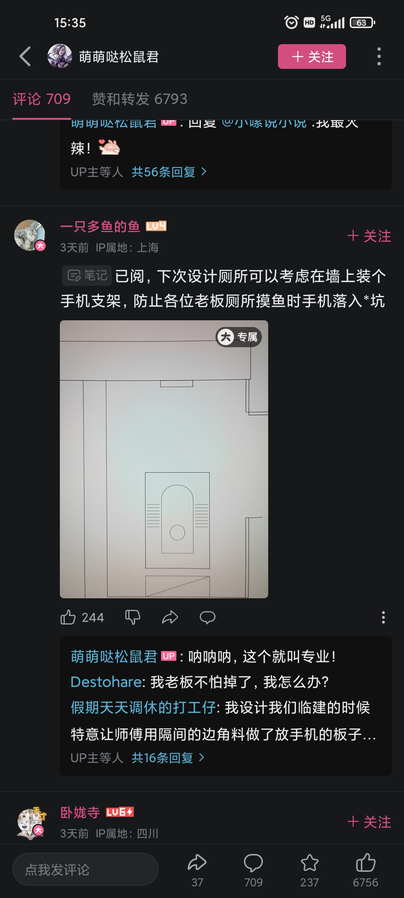
		- [古代人拉屎之后怎么擦屁股的？ - 知乎](https://www.zhihu.com/question/268582089)
- ((66335bd5-8a97-44d7-addd-2080149906f7))
- ((66db8aaa-c42b-4c3e-8cfd-e37bc44cc7a3))
- 电器
  collapsed:: true
	- 灯
		- 灯光昏暗发黄，可能是灯罩塑料老化，可以换个灯罩
	- 手机、电脑及配件
	  id:: 65a7a546-e293-4400-9f47-aa086ed9ad91
	  collapsed:: true
		- [[硬件]]
		- 手机
		  collapsed:: true
			- 红米K30s（当时比较好的LED屏幕，应该比较护眼。我网购的柜台展示机，==现在再买性价比不清楚==；买手机尽量买大存储容量的）
			  collapsed:: true
				- {{embed ((66234e93-525f-4589-8433-225809cb4088))}}
				- [兄弟们，小米手机MIUI14系统数据占了68G，这什么情况？怎么清理？ - 知乎](https://www.zhihu.com/question/591355250)（哈哈，我这里有一半、约30G是手机微信的文件，竟然还有一半）
				  id:: 66129e8b-1999-4c95-a7ab-46847bf4b207
				- [[MIUI玩法篇 29] | MIUI手机备份和还原 打造攻略 - 知乎](https://zhuanlan.zhihu.com/p/65963209)
					- 图片（主要是照片）、视频
						- 连接电脑后，复制手机的DCIM文件夹（好像有点相当慢，可以睡前开始复制）
					- [MiPhoneAssistant 小米手机助手下载合集 – MIUI历史版本](https://miuiver.com/mi-phone-assistant/)
				- [【图片】求助，插sim卡无信号，红米k30s【维修手机吧】_百度贴吧](https://tieba.baidu.com/p/8619537474)
				  id:: 66129661-7cfc-47d5-8f59-d85cc0c25b8c
					- 首先排除法，拿其他手机和其他卡分别在两台手机上测试
					- 拆后盖一般用吹风机（质量不好的话可能很快吹过热然后关机锁死）、吸盘（暂时没用）、撬片（我用的指甲和 ((65bd9f1a-3fd9-4f43-a953-b29fc4046fa2)) ）
					- 拧螺丝要用较小的“精修螺丝刀”，比“细螺丝刀”更细，一般家里没有
					- [手机不读SIM卡，换到别的手机是正常的！_哔哩哔哩_bilibili](https://www.bilibili.com/video/BV1Fh411g7iR)
						- 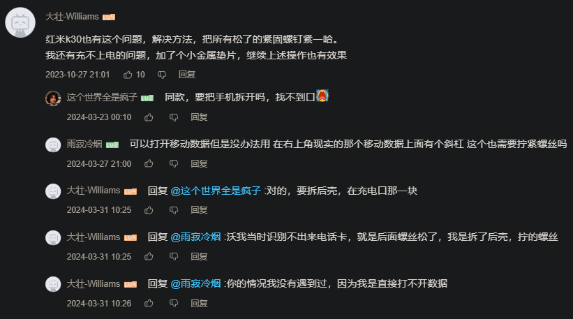
				- [红米K30S出现大量烧主板_哔哩哔哩_bilibili](https://www.bilibili.com/video/BV1XL411P7Vi)
			- ---
			- （帮家人们）找手机
				- 翻被子等遮盖物
				- 关灯拉窗帘打电话
			- [保护手机安全，教你几招有用的方法 - IT之家](https://www.ithome.com/0/730/015.htm)
			- TODO 手机防盗
			  id:: 66626842-11d3-4cc5-a2c9-9359bccc79f3
			  collapsed:: true
				- 使用习惯（“一不留神放哪的习惯”）
				- 物理/硬件防盗
					- 手机挂绳？
				- 软件防盗
					- 关机报警
					- 后门
						- 静默开机
					- 异常加速度（iphone？）
					- [如何最大限度的防止手中的iPhone被偷？ - 知乎](https://www.zhihu.com/question/24035441)
					- [在 iPhone 上使用“失窃设备保护” - 官方 Apple 支持 (中国)](https://support.apple.com/zh-cn/guide/iphone/iph17105538b/ios)
					- [手机防盗，科技能为我们做些什么 - 纽约时报中文网](https://cn.nytimes.com/business/20130518/cc18luochao/)
			- [把手机电量，维持在30%到80%，真的可以保护电池吗？ - 知乎](https://www.zhihu.com/question/633288553)
			- 省电
				- 用电脑、不需要很快接微信电话可以关闭手机微信等的自启动权限
			- TODO 手机壳（含正面）
			  collapsed:: true
				- 散热手机壳
			- 握持省力
				- TODO 手机单手操作带
			- 维修模式（交给别人维修前开启，保护隐私）
			- TODO 话费
			  id:: 6622366f-6440-41e8-bd6b-88d0b04cc506
				- 一个月多一天饭钱这样看也确实不算少，先不说能不能多一小时学习
				- ((65c0ee2f-33b5-4967-bc29-66798dc4ac06))
				- ((660d5ab5-0892-4c5d-bbdd-b1fa1e3e7961))
				- ((660ff8fe-ad37-44d0-ac93-7d3cbd787049))
			- 陌生电话不接
				- 有些是很初级的 ((65d547ee-c15f-478f-ad5b-1f57c27ceec8)) 预录制推销电话——“很多人听不出来”
			- ((66335bd7-9995-457a-ba79-9139e732e51d))
			- 共用手机号（“省钱”）
				- 两手机共用
				- 手机号与设备绑定绕开
		- ---
		- 便携显示器包
		  id:: 65f2790c-618c-4b93-a016-03c1e9422233
		  collapsed:: true
			- 便携显示器附的，没手提带
			- 以下可以装进去带出去跑，为什么不买笔记本电脑，因为一般屏幕和键盘不分开，用得不舒服
			- 别处简称“电脑包”
			- ---
			- 零刻SER5 PRO迷你主机 2077
			  id:: 65f78b91-84e4-4c20-a7ae-2a57d74dc901
			  collapsed:: true
				- 16G+500G。==现在是旧款了==，CPU是似乎并不比新款的R7-5700U差的R5-5600H，日常开logseq、飞书、浏览器看直播、上传到GitHub加起来CPU利用率一般不超过30%，内存使用量不到80%，500G硬盘不玩太多大游戏、下啥视频素材够用（“现在是有点不太够用了”）
					- 网卡连接稳定性差、网速慢，导致（抛开显卡也不够好不谈）用 ((66c1a0f2-3e27-43dc-8b89-26f4ee5c5218)) 串流时因为家里WiFi难连、易断连而基本玩不了一点
					  id:: 66c1a4c1-c569-4702-88bc-0af29922a694
					- 一些不大的游戏能玩（“3A大作”大概都不怎么能玩），最高能玩 [[we happy few]] 最高画质，有时快速移动鼠标时有点卡
					- 要干点活就更有点不太够用了，建议大家的主力机配置不低于我这台
					  collapsed:: true
						- {:height 263, :width 454}
							- ((668d4673-4f2f-4a63-a58a-6ff2db904fbe))
								- ((66934b21-3076-44f9-ab9c-c9c1b2e488c6))也差不多
				- 实际上没有徒步背包移动需求的话买大点的itx主机能便宜几百，空间大拓展性还更好，拎上车，自行车后货架也能装，骑车到处跑都不一定需要迷你主机——但好像需要220V电源，而220V移动电源好的比较贵
					- [1000元ITX装机！白色侧透颜值爆表，畅玩网游原子之心！【如舟】_哔哩哔哩_bilibili](https://www.bilibili.com/video/BV1fs4y157Hh)
					- [带着ITX主机去教室是什么体验？_哔哩哔哩_bilibili](https://www.bilibili.com/video/BV1bd4y147EH)
					- 别装花里胡哨的“光污染”风扇灯，因为真的是光污染
				- ((65ba5239-07b1-45c4-8b47-fe09a78658a0))
			- 19V5A锂电池 80（可直接给迷你主机供电，忙点4-5小时用完）、21V充电器（可以给锂电池充电，不确定是不是买时附的）
			- 插头保护套（防尘、打包外带防挤压、剐蹭，原装的注意放好，省得到时再买）
			- DC电源延长线（之前在一图书馆坐桌边发现迷你主机的原装电源线不够长）
			- Type-C全功能线（便携显示器附的，从迷你主机供电）
				- 可能用了一段时间后像其他线一样变松了，在用 ((66c17637-410c-429e-80b9-d7644352b02d)) 有线串流时稍微动一下就断连
			- HDMI线（可能带；我的迷你主机没有DP口，有些地方用的是DP口，且一时不能从电视等处搞到HDMI线）
			- 相思豆F760静音鼠标 10（可能比大多数静音鼠标静音）
				- >10元左右，很静音，护手方面也没觉得比之前多彩的垂直鼠标（有点不适应）还有罗技的轨迹球鼠标差，最近打算再加个腕托
			- 罗技K380薄膜蓝牙键盘 100（薄膜本就比较静音，指甲不长就行；据说山业的也不错，还有V型折叠键盘；小键盘较窄，可能更易导致圆肩（键盘靠近身体可能缓解圆肩，但手腕等不一定舒服））
			- Eweihome Q1 16寸便携显示器 1000
			  id:: 65a7a546-99df-4fb2-a6ce-77dd67b8e329
				- “买贵了是吧？”
				- [全新升级519元2K+CNC 14寸触摸屏推荐，加量不加价，附赠副屏专用桌面软件_哔哩哔哩_bilibili](https://www.bilibili.com/video/BV1wD421A7XH)
				- [299元拿下16寸 2.5K 100%色域 500亮度的显示器  真香定律 PS4 PS5 SWITCH 游戏机便携屏 便携式显示器_哔哩哔哩_bilibili](https://www.bilibili.com/video/BV1NZ1RYQEVZ)
				- [史上最丐最便宜的便携式显示器便携屏17寸便携屏幕_哔哩哔哩_bilibili](https://www.bilibili.com/video/BV1oz4y1H7Ww)
				- [18寸 240HZ 100%P3色域 便携显示器 仅支持DP信号  高端显卡游戏玩家看过来_哔哩哔哩_bilibili](https://www.bilibili.com/video/BV1xG2PY5Ej8)
				- [[卧姿显示器支架]]
		- 飞利浦243S7EHMB 24寸显示器 1000（算是比较护眼的常规显示器，现在买性价比不清楚，可能不算高）
		  id:: 65a920d3-c65f-42f8-a13f-2772302b747e
		- 网线（之前 ((65dec081-5e03-4520-9a40-a76206443082)) 发现原有的网线不够长——“噢！原来我是连网线上网的啊！”）
		  id:: 65f709ed-6ab5-4498-91eb-3608591b7da2
			- ((66c069bb-d6ed-472b-adf6-34fd174519c0))
		- 24寸显示器包（应该能把这里的都装进去）
		- ---
		- 闪克AU902麦克风 290（之前买过瘦些的PM401，给我爸用了，但可能他现在用的频率比我还低；现在用得多起来了，心形指向能够在爸妈在家时减少干扰）
		- 蓝牙耳机 420（感觉性价比OK）
		  collapsed:: true
			- 【淘宝】https://m.tb.cn/h.5J5RjE4676gWiM5?tk=KL1CW7vimV3 CZ0001 「发烧主动降噪蓝牙头戴式耳机手工定制智能重低音游戏other/其他无」
			  点击链接直接打开 或者 淘宝搜索直接打开
		- 清灰（像打扫卫生一样，要戴口罩）
		  collapsed:: true
			- 
			- 
			- 
			- id:: 66a57f42-00bd-4303-a0f0-f72a31880766
			  >昨晚整理到了我的置顶flomo，早上简单清一下快两年的迷你主机的灰，只用容易找到的手、手机螺丝起子套装、皮吹（没找吹风机，可能普通吹风机的瞬时风量也没那么高）和旅馆牙刷（硅脂小袋里有，但是找不到；感觉挺伤牙，还是电动牙刷刷得比较光滑），灰尘主要在顶盖下的CPU风扇叶上及附近，然后就是底盖里面及硬盘附近，最后（风扇中间后来擦了下）装好了开机一直吹风不开机，拿根牙签戳一下“CLR（应该是Clear） CMOS”孔搞定
	- 其他电子设备及配件
	  collapsed:: true
		- 电子计时器
		  id:: 65d0ac85-02ba-489a-ba42-b0a9dee86763
		  collapsed:: true
			- 可以提醒查看烹饪情况、RO净水器接水情况、久坐之后休息，帮助实验和稳定菜谱，以及其他时间规划等
		- 淘宝“菜青虫手工店”七里顶5/7号充电电池
		  collapsed:: true
			- 1节7号：按钮 ((65d0ac85-02ba-489a-ba42-b0a9dee86763))
			- 2节7号：厨房秤、毫克秤、体重秤、手提秤、红外线体温计、指压式脉搏血氧仪、血压计、电视遥控器
			- 还需另购充电器（不带伸缩和短卡槽的还需要7号转5号电池转换筒）
		- [[电视]]
		  id:: 65d04192-2838-46ce-b178-52ee459ee3a7
	- 电热毯
		- 沿海和成都等潮湿地区被褥开电热毯防潮？
- 眼镜
  collapsed:: true
	- 开车等活动有偏光需求的，建议买偏光镜
	  collapsed:: true
	- 清洗
	- 近视镜
		- 学校附近眼镜店
		- [最实用配眼镜攻略：如何选近视镜片？99%的人都被坑过 - 简书](https://www.jianshu.com/p/a97d915a06f7)
		- [【知识分享】近视和近视镜片科普——如何挑选近视眼镜，近视应当注意什么？_哔哩哔哩_bilibili](https://www.bilibili.com/video/BV1xf421D7Wy)
	- [国家标准|GB 10810.3-2006 眼镜镜片及相关眼镜产品 透射比规范及测量方法](https://openstd.samr.gov.cn/bzgk/gb/newGbInfo?hcno=A4086E378EB6208644543725784EF89B)
	  id:: 65ab10fb-ff71-41c5-b733-7174e745e2d9
		- 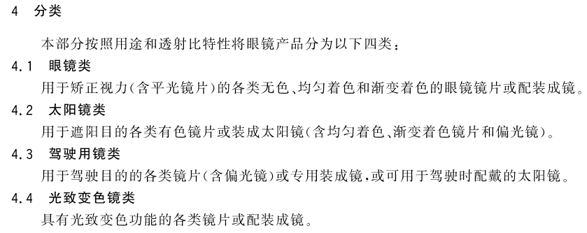
		  id:: 665bfc72-5de1-4db6-b030-ea7917b0fe23
		- 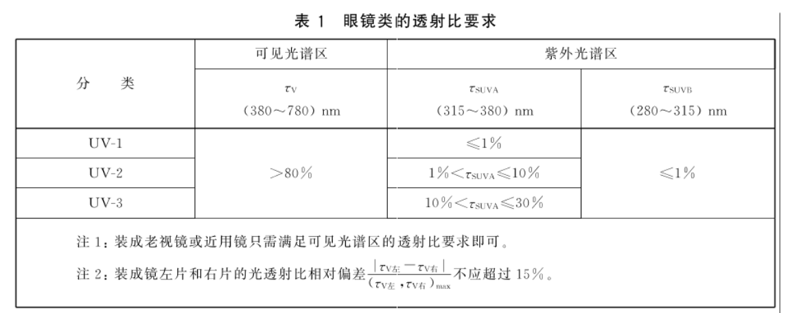
		  id:: 665da687-cbf7-4be5-b4a7-00647df79012
		- 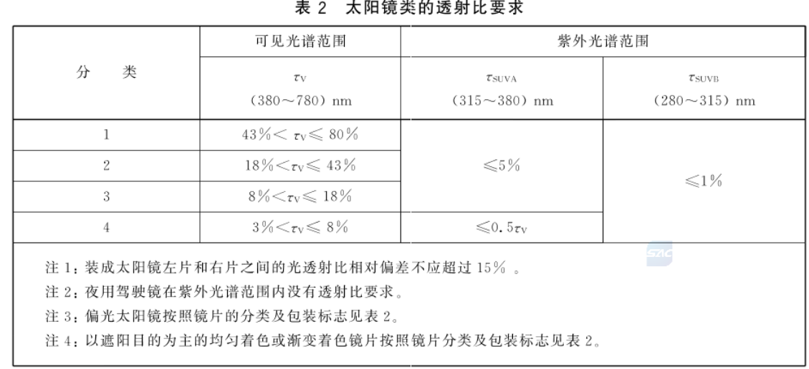
	- 太阳镜
	  id:: 665c0696-41e5-4956-a6ad-9fa9a81b81fb
	  collapsed:: true
		- 还防飞虫、“社恐”者可能在意的别人的目光
		  id:: 666910be-bc54-4523-a96c-73303ae3e4fa
			- ![[墨镜]](https://i0.hdslb.com/bfs/emote/3a03aebfc06339d86a68c2d893303b46f4b85771.png@48w_48h.webp)👌🏻🕶️ ![[大哭]](https://i0.hdslb.com/bfs/emote/2caafee2e5db4db72104650d87810cc2c123fc86.png@48w_48h.webp)
		- [国家标准|GB 39552.1-2020 太阳镜和太阳镜片 第1部分：通用要求](https://openstd.samr.gov.cn/bzgk/gb/newGbInfo?hcno=0960BB7C75AEBC8095288FA3E29803B0)（好像市面上很多太阳镜还没用这个新国标）
		  id:: 65ab10fb-c0ab-4185-b652-d0f5f6a86d88
		  collapsed:: true
			- 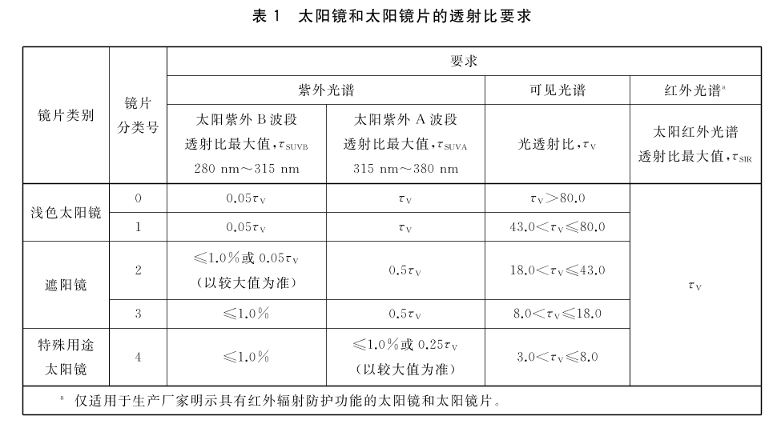
			  id:: 665d431f-9f42-4f79-a718-7e03d51590f9
				- ((665d42c9-fb6c-492f-af29-05f9282c43cd))
					- TODO 那么问题来了，有没有（明确）防蓝光的太阳镜？
			- [【拼夕夕9.9吊打奢侈品？太阳镜差价这么大，到底差在哪？【三亿】】 【精准空降到 03:49】](https://www.bilibili.com/video/BV11b421b7Rn/?share_source=copy_web&vd_source=24175964b0df2fcc2c022cae23517fdc&t=229)
			- 不执行新国标的太阳镜也很可能有效防紫外线
				- 不执行新国标的太阳镜一般执行 ((66600b35-7bd0-4dc1-85dd-6fa25fc4737a))
					- UVB透射比为可见光透射比的一半，在光透射比与新国标相仿的遮阳镜分类，UVB透射比不大于20%
					- 很可能还同时执行 ((65ab10fb-c0ab-4185-b652-d0f5f6a86d88))
						- 而对用于矫正视力的眼镜镜片的紫外线透射比要求更小，UVB透射比不大于1%（“旧标胜新标，赢麻！”）
				- 两个测评中，最便宜（低于30元）的太阳镜都能有效防紫外线
					- [30 块 vs 1600 块的墨镜，到底差在哪了？|丁香医生](https://dxy.com/article/191261)
					- [几十到几百元太阳镜测评 |  太阳镜测评_什么值得买](https://post.smzdm.com/p/apz089v7/)
						- >镜片颜色对视物效果的影响还是比较大的，灰色系镜片是最还原景物原本色彩的。如果你想视野更清晰明朗，那选择灰色系镜片准没错。
			- 对用于矫正视力的眼镜镜片的紫外线透射比要求更小，UVB透射比不大于1%，但眼镜的覆盖面积较太阳镜小，可能不适合阳光强烈时更
			  id:: 66602c30-f80f-484d-b141-439f3d92368c
			- [新国标-GB 39552.1-2020《太阳镜和太阳镜片 第1部分：通用要求》|墨镜|gb|眼镜|太阳眼镜_网易订阅](https://www.163.com/dy/article/GBV6OA6F05528PBJ.html)
				- >随着眼镜行业的快速发展，特别是新材料，新工艺的应用，现行行业标准QB 2457-1999已不能适应行业发展需要，因此新的国家强制性标准GB 39552.1-2020发布。
			- [关于《太阳镜和太阳镜片》系列国家标准的发布实施情况说明](https://oge.dhu.edu.cn/2022/0810/c21852a298279/page.htm)
			- [QB 2457-1999 轻工标准 太阳镜 - 道客巴巴](https://www.doc88.com/p-180692086228.html)（有些太阳镜的合格证上可能会标成GB）
			  id:: 66600b35-7bd0-4dc1-85dd-6fa25fc4737a
				- 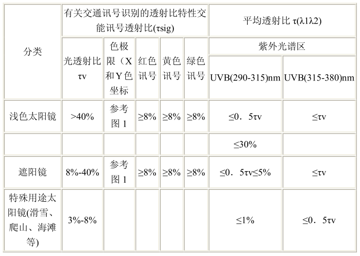
					- 最右边这个UVB应为UVA
		- [墨镜上写了适合的脸型，只是没人告诉你_哔哩哔哩_bilibili](https://www.bilibili.com/video/BV1SS4y137ou)
			- 
		- TODO [人人都能在夏日戴着太阳镜遮阳吗？事实并非如此--健康·生活--人民网](http://health.people.com.cn/n1/2018/0605/c14739-30036995.html)
		- TODO 太阳镜夹片
		- ((66654fe7-9ad9-4dbc-8191-c52fad74d5c6)) 眼镜夹
			- 避免多次取下眼镜后随手乱扔造成镜片磨损——“真的会有这样的情况吗？”
				- 或者可以往包袋里扔
		- 没有太阳镜（乃至 ((66542b38-24cd-4792-82cd-93de91dbca42)) ）时如何应急？
			- 可以用手（“像电视剧《西游记》里的孙悟空那样”）、书本等遮挡一部分
			- 在步行时，在确保安全的情况下还可闭眼再短暂睁眼（也可用于减少异物入眼；但不建议在跑步骑车开车等较快的运动时这么做）
			  id:: 2f3c2230-b578-4906-b9e3-d3fd7c966c6b
			- 开车可用 ((66654fe7-9ad9-4dbc-8191-c52fad74d5c6))
	- 防蓝光眼镜/镜片
	  id:: 65bcbf46-fecb-4935-b55e-217007a23e26
	  collapsed:: true
		- TODO 近视眼镜的镜片防蓝光吗？
			- ((665da687-cbf7-4be5-b4a7-00647df79012))
				- 可见光谱区比较宽，可能对其中波长较短的蓝光还是有相对较小的透射比
		- [国家标准|GB/T 38120-2019 蓝光防护膜的光健康与光安全应用技术要求](https://openstd.samr.gov.cn/bzgk/gb/newGbInfo?hcno=A587E31519ED1F6BFF23FC9132469137)
			- 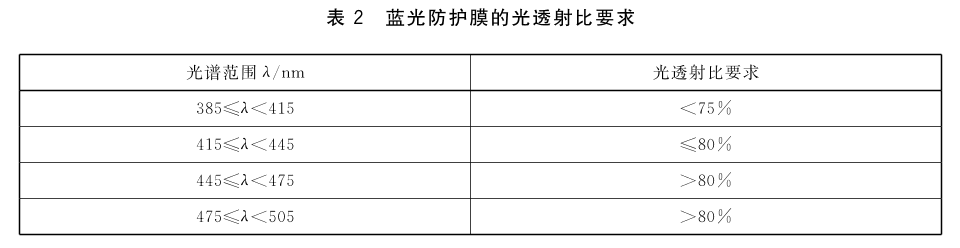
			  id:: 665d42c9-fb6c-492f-af29-05f9282c43cd
				- “那么问题来了，这样抗近视的360~400nm的紫光不是又（明确地）被削了？”
					- ((658eabb9-4f48-4825-b4a3-12eef5ed1c73))
			- 网友选的
				- 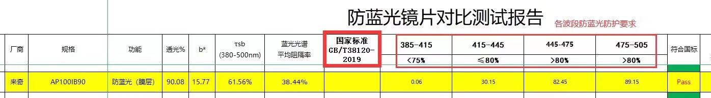
	- ((65bcbf4a-1700-4143-969d-37f2ecce335b))
	- [眼睫毛太长，总是碰到镜片，有什么好的解决办法吗？ - 知乎](https://www.zhihu.com/question/21196797)