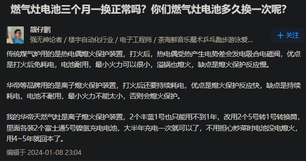

- [[二手闲置]]
- ((65d69eb6-54ad-40e4-a290-5e0028758b75))
  id:: 65ae0902-37eb-48ad-b6b6-152fbafbed9b
- 衣物
  collapsed:: true
	- ((65ab10fb-9acf-48a8-9562-b322fc793432))
	- ((65ae0909-05ee-4c98-8114-0dec2408bd95))
- 家务
	- [[买菜]]
	- 厨具 #俱乐部
	  id:: 65a9d48e-5419-4505-ba01-d72b66941f1c
	  collapsed:: true
		- ((65bcbf48-be5c-46a4-a88e-9cb147c75e42))
		- 洗碗教程
		  id:: 65bcbf49-b9a8-4cc5-9edb-7f1fbf275c7f
			- [【小屋夜校/D-1-4】神速洗碗大法_哔哩哔哩_bilibili](https://www.bilibili.com/video/BV1oT4y1W742)（“可能比Geist平均水平高，但尚未讲究戴手套”）
			- 不立刻洗的先（尽快）尽量去除固体厨余，然后用个大不锈钢盆之类的容器泡水里
			  collapsed:: true
				- 尽快洗建议用温热水
				- TODO 不尽快洗可以用冷水，洗前可以倒掉再加热水？
			- 戴手套，固体多的先沥掉液体然后将固体倒入垃圾桶，要洗的厨具餐具多了放炒锅或大盆里加热水洗洁精泡，软的用木浆棉抹布擦，硬的用钢丝球刮，涂层不能硬刮的电饭锅内胆先和饭勺（如果是金属的可以不泡直接刷）泡着
				- 擦过刮过了先放一边，待会儿一起冲洗
			- 洗碗无聊？可以听书听视频
			- TODO 买洗碗机
		- TODO 乳胶手套（过敏可以用丁腈手套）
		  collapsed:: true
			- 品牌：东方红、南洋等
				- 假货、次品鉴别？
			- 不从上部进水（扎住？）
				- 进水后撑开干燥
			- 内部手不潮不脏
				- 保养不糊（滑石粉、玉米淀粉）
				- 手易穿脱
				- “不清洁，多戴一层薄纱手套”
			- 指尖等部位不破
				- 指甲不要太长太尖，不然耗损比较快
				- 补缝
			- 右手手套坏得多怎么办？
				- [餐饮用橡皮手套总是右手的先磨坏，有没有商家以一双左、一双右、或单只的形式销售手套的?](https://www.zhihu.com/question/321960674)
		- TODO 一次性水槽过滤网袋（感觉我家用了段时间又不用了，是降低了下水速率还是嫌每次放麻烦？）
		- 毛刷（刷毛别太软，刷红薯、土豆等的泥，刷差不多干净了吃时放嘴里嚼也行；另有一个[[赤足跑]]后冲水刷脚——我是在淋浴间刷的）
		- ukoeo u2打蛋机 46 （“过年涨价啦？；”可搅拌蛋、肉糜、奶油、大啤酒杯中的膳食补充剂等；搅拌肉糜用片棒；杯子口径小的话可拆下一个搅拌头在杯中搅拌）
		- 大不锈钢盆（如果没有用过的炒锅，就用它来装要洗的厨具、餐具）
		- 不锈钢漏盆（沥水）
		- 木浆棉抹布块 1（其实我单用了好久钢丝球才发现这玩意真香，确实要“专业的工具干专业的活”，因为木浆棉抹布块比钢丝球实际接触面积大，更易带走油污和污渍，比海绵块稍硬，对粘黏物体的机械去除能力较强，但又不至于像钢丝球那样对锅的涂层和“镜面”伤害那么大，同时更容易干燥，不那么容易发霉，使用寿命也长）
		- 淘宝“新芽家居”TPU砧板（轻薄、可弯折、便携，不适合剁）
		- 龙江切丝器（用护手器，最好再戴手套，食材最后一段建议用刀切，以免无防护硬来削指尖；那种多孔的阻力大、汁水损失多，拿着食材推刨也不安全；要“做大做强”餐饮可以考虑升级买淘宝“熙公子千刃坊”的千叶切菜器，可以切出可用于火锅的“长寿土豆面”、“超长幅藕片胶卷”的效果）
		  id:: 65a9d48e-dd79-4d6f-9a42-28f2bbee3cbd
		- 硅胶抹刀（刮碗中蛋液、舀番茄酱、抹软质奶酪；刮的可以买末端弯曲的）
		- 椰青塑料软刀（挖“椰子蛋”的工具，简单挖半个或整个喝剩下的椰肉也比勺子更好用）
		- 硅胶罐头盖（主要给开盖后的小金属罐头盖上保鲜）
		- 厨房秤 10（精确到1g，量程5kg，量程可以再大些）
		- 帝衡10g量程的毫克秤 32（称量膳食补充剂、食品添加剂、香料等的重量）
		- TODO 红外测温枪（可能更多测油温；我几年前买的针式温度计测油炸油温好像有点慢）
		- EraClean Max冰箱臭氧机（延长保鲜，甚至有可能用于冰箱简易干式熟成；比京东那个小的臭氧量大，DIY可以更便宜）
		  id:: 65ae0902-a5b1-456f-8002-1da81cd74b46
			- TODO DIY更便宜的
		- 隔热手套
		- wonderchef 5.5L高压锅 355（限压140kpa，比几乎所有的家用压力锅都高；如果要批量做[[罐头]]，建议用容量更大的高压灭菌锅）
		- 冰箱
			- 离墙10cm以上
			- 多人一起往里塞东西（以及自己买一大堆又不会摆还记不住）的话，注意查看，避免食物过期（“有些人家的冰箱还是有点可怕的”）
		- TODO 烤箱（可以烤，可以保温——微波炉不能带金属容器）
		  id:: 65cd7fd5-20a9-403e-b466-9ec2c219eb75
			- TODO 清洁烤箱（“哇靠，焦糊味好难闻”）
			  id:: 65db421f-00cf-45ac-8702-67cab81bc5ca
				- [3 Ways to Clean the Oven - wikiHow Life](https://www.wikihow.life/Clean-the-Oven)
				- [How to Clean an Oven Quickly and Thoroughly](https://www.realsimple.com/home-organizing/cleaning/how-to-clean-an-oven)
				- [如何清洁烤箱？ - 知乎](https://www.zhihu.com/question/27329059)
				- [家里的烤箱都是油渍和脏东西，用什么清洗，求推荐？ - 知乎](https://www.zhihu.com/question/273782170)
				- [超详细的烤箱清洁指南，赶紧mark一下！ - 知乎](https://zhuanlan.zhihu.com/p/405119635)
		- ((65c1a60a-c424-44d5-9abd-63575619bdb7))
		- 垃圾桶
			- 自动开关盖的垃圾桶（可能）只负责手靠近了开和关，不负责撑满后换垃圾袋
	- 餐具
		- ((65bf93b9-ffd4-4083-88a8-6f798a014742))
		- 分餐餐盘
	- 拖地
		- 硅胶地刮/刮水拖把 30（45cm宽，小空间可能要窄些的，不确定；在瓷砖等防水地面洒水后拖，污物拖到一起去除固体后吸水，轻度到中度清洁，略顽固的污渍可以用硅胶角小面积加大力度清除；可能比脚踩抹布蹭要舒适、安全些）
	- DOING 扫地
	  id:: 65d9ed4a-4d43-454b-89e3-536c9eb182f8
	  :LOGBOOK:
	  CLOCK: [2024-02-24 Sat 22:35:48]
	  :END:
		- 扫地除了花时间，主要就是对腰背不太友好，因此要
			- 减少腰背负担
				- 尽可能使上身正直
					- 扫帚加长
					- 屈膝
						- ((65c6f987-b61e-41fa-b32f-4ca354d07011))
						- 弓/箭步蹲
			- 强化腰背
		- 扫帚的握把可能需要在人体工学上优化
	- 衣物
	  collapsed:: true
		- 洗衣袋（避免缠绕，袜子等小件衣物洗后直接开袋倒在晾晒网上）
		- 晾晒网（收衣物时可以拥到一边带走，或者把整个晾晒网取下倒出衣物；网上卖得多的竖直带子可能比较偷工减料容易断，我是等它们断了差不多后用捆扎绳绑的）
	- 擦玻璃
		- 玻璃污物组成
			- 白色水渍
				- 未RO的自来水洗手、洗砧板后甩水
			- 黄色
				- 花台花盆土壤（搬走或搬远点）
		- 《擦玻璃》好吗？
		  id:: 65c32c2c-caa8-40c0-a618-04a960ee7df8
			- “让我们一起擦玻璃”
- 个人卫生
	- 抽纸
		- [抽纸是怎么被发明的？ - 知乎](https://www.zhihu.com/question/27836835)
		- “请问如何少用抽纸呢？”——葛朗台
- 手机、电脑及配件
  id:: 65a7a546-e293-4400-9f47-aa086ed9ad91
  collapsed:: true
	- 红米K30Plus（当时比较好的LED屏幕，应该比较护眼。我买的柜台展示机，现在再买性价比不清楚；买手机尽量买大存储容量的）
	- TODO 手机云台（“走出个宽体普京是吧？”）、防风毛衣
	- 便携显示器包（便携显示器附的，没手提带；以下可以装进去带出去跑，为什么不买笔记本电脑，因为一般屏幕和键盘不分开，用得不舒服；别处简称“电脑包”）
		- 零刻SER5 PRO迷你主机 2077（16G+500G。现在是旧款了，CPU是似乎并不比R7-5700U差的R5-5600H，日常开logseq、飞书、浏览器看直播、上传到GitHub加起来CPU利用率一般不超过30%，内存使用量不到80%，500G硬盘不玩啥大游戏、下啥视频素材够用；一些不大的游戏能玩，最高能玩 [[we happy few]] 最高画质，有时快速移动鼠标时有点卡；），）
			- 实际上没有徒步背包移动需求的话买大点的itx主机能便宜几百，空间大拓展性还更好，拎上车，自行车后货架也能装，骑车到处跑都不一定需要迷你主机——但好像需要220V电源，而220V移动电源好的比较贵，所以
			- [1000元ITX装机！白色侧透颜值爆表，畅玩网游原子之心！【如舟】_哔哩哔哩_bilibili](https://www.bilibili.com/video/BV1fs4y157Hh)
			- [带着ITX主机去教室是什么体验？_哔哩哔哩_bilibili](https://www.bilibili.com/video/BV1bd4y147EH)
			- 别装花里胡哨的“光污染”风扇灯，因为真的是光污染
			- ((65ba5239-07b1-45c4-8b47-fe09a78658a0))
		- 19V5A锂电池 80（可直接给迷你主机供电，忙点4-5小时用完）、21V充电器（可以给锂电池充电，不确定是不是买时附的）
		- type-c全功能线（便携显示器附的，从迷你主机供电）
		- HDMI线（可能带；我的迷你主机没有DP口，有些地方用的是DP口，且一时不能从电视等处搞到HDMI线）
		- 相思豆F760静音鼠标 10（可能比大多数静音鼠标静音）
		- 罗技K380薄膜蓝牙键盘 100（薄膜本就比较静音，指甲不长就行；据说山业的也不错，还有V型折叠键盘；小键盘较窄，可能更易导致圆肩（键盘靠近身体可能缓解圆肩，但手腕等不一定舒服））
		- Eweihome Q1 16寸便携显示器 1000
		  id:: 65a7a546-99df-4fb2-a6ce-77dd67b8e329
			- [[卧姿显示器支架]]
	- 飞利浦243S7EHMB 24寸显示器 1000（算是比较护眼的常规显示器，现在买性价比不清楚）
	  id:: 65a920d3-c65f-42f8-a13f-2772302b747e
	- 24寸显示器包（应该能把这里的都装进去）
	- 闪克AU902麦克风 290（之前买过瘦些的PM401，给我爸用了，但可能他现在用的频率比我还低）
	- 蓝牙耳机 420（感觉性价比OK）
	  collapsed:: true
		- 【淘宝】https://m.tb.cn/h.5J5RjE4676gWiM5?tk=KL1CW7vimV3 CZ0001 「发烧主动降噪蓝牙头戴式耳机手工定制智能重低音游戏other/其他无」
		  点击链接直接打开 或者 淘宝搜索直接打开
- 其他电子设备及配件
	- 电子计时器（可以提醒查看烹饪情况、RO净水器接水情况、久坐之后休息，帮助实验和稳定菜谱，以及其他时间规划等）
	- 淘宝“菜青虫手工店”（过年隐藏商品了？）七里顶5/7号充电电池、电池转换筒、4节充电器
		- 电子计时器1节7号，厨房秤、毫克秤、红外线体温计、指压式脉搏血氧仪、电视遥控器2节7号
		- 血压计
	- 燃气灶电池
		- [燃气灶电池三个月一换正常吗？你们燃气灶电池多久换一次呢？ - 知乎](https://www.zhihu.com/question/478658783)
			- 
	- [[电视]]
	  id:: 65d04192-2838-46ce-b178-52ee459ee3a7
- 户外
  collapsed:: true
	- TODO 羽毛球网架
	- [[自行车]]半盔
		- MOON KS29（比较便宜的带MIPS的头盔，我买的那家店磁扣、插扣可能随机发货，我的是更方便的磁扣，嘻嘻）
	- 五角星pm0002 50L户外背包 130（有肩带、胸带、腰带，背部悬空，总的来说就是“背负系统”，与背着闷汗、往下赖的书包、电脑包不一样；注意肩带仍可能磨到裸露的脖子）
	  id:: 65ae08d2-1102-440a-9daa-2a38f72ea301
	  collapsed:: true
		- 背包（不含防水罩）1292g，背包防水罩60g
		- 口袋不少，可调部位和小设计（肩带挂夹、胸带口哨）较多，背部合金条加镂空胶网隔开背部和背包透气（取出可增大背包容积，但会降低背负舒适度）
		- 秋千板在中间上下放置刚刚好，用力拉上拉链后有点撑，为减少磨损延长背包寿命可以给秋千套个塑料袋之类的
		- 秋千、睡袋、充气床（含电泵、气嘴、充气枕、修补包）刚好稍微撑下，再放别的加少许衣物也够
	- 户外厨具（1688上可能有比较便宜的气炉、锅等）
		- HK360分体式气炉 50（义乌小商品，长气接口款，折叠装在自带塑料盒里，塑料盒放锅里）
			- 气炉烧气干净、方便
			- 燃料、看锅时间不充裕的情况下尽量少水快速烹饪，同时注意防止糊锅
			- 卡式炉太大太重清洗不便，不适合人肉背，不推荐，除非物品管理得好，一次只背一个模块，一般比较好看的卡式炉适合配合玻璃锅等比较好看的锅做美食视频，但是不贵的一般也不会特别好看）
			- 挡风板（可选，有时可以利用现场地形和材料挡风）
			- 脉鲜丁烷长气罐250g 9（需要有可靠防爆设计、更安全的牌子买脉鲜的，不需要就可以买便宜些的，正常使用应该不会炸。一般气炉/卡式炉大火约用气150g/小时或2.5g/分钟；扁气罐主要是高山用的；过不了安检）
			- 注意不要直接在水泥地放灶生火，以防水泥地绷不住炸了
		- ((65bdbc1e-7a90-4a6c-9a5b-650cf3a8de82))