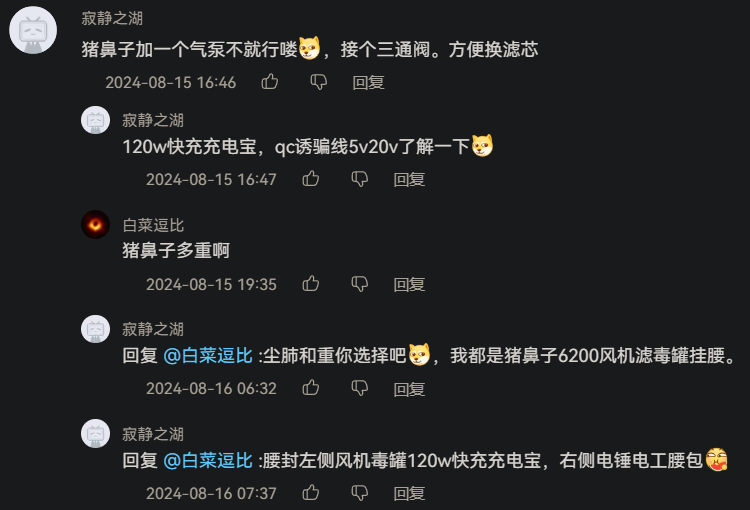
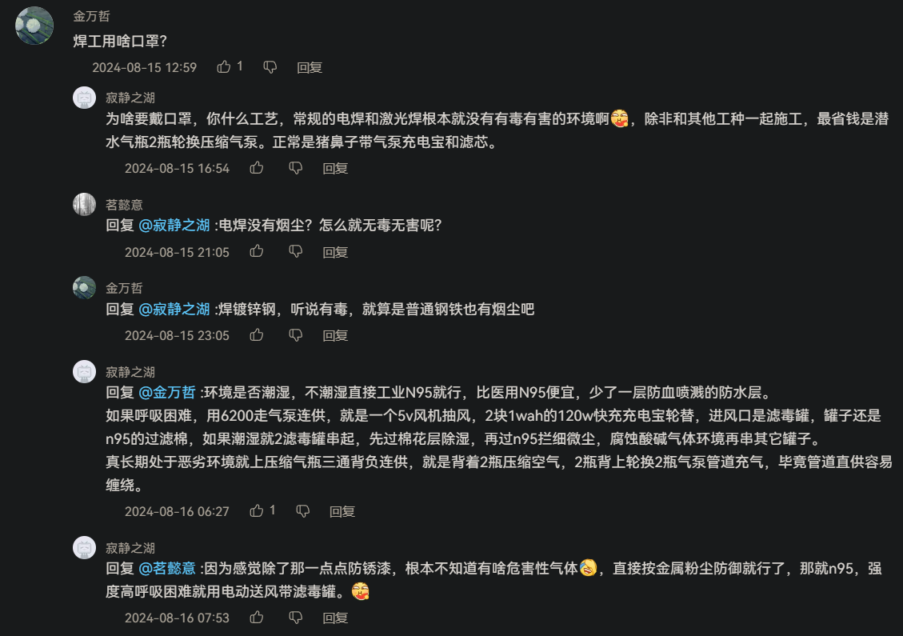
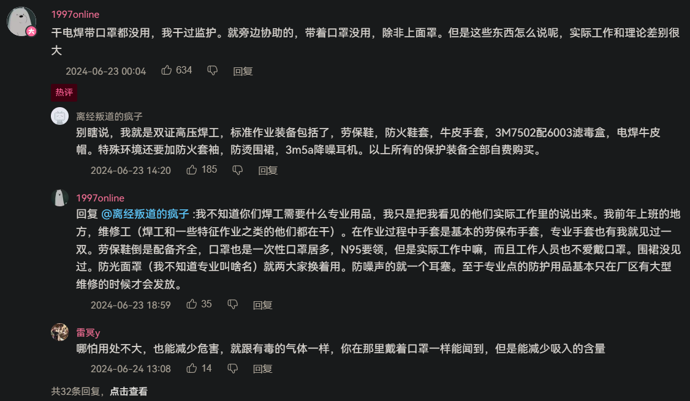
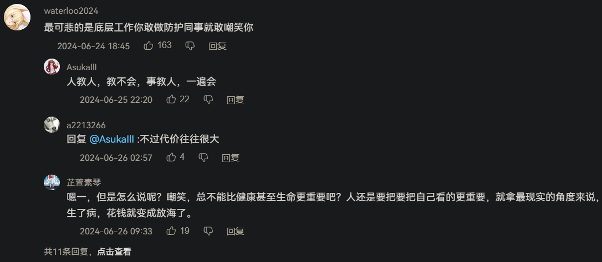

- 工伤的预防
	- 筛选条件
		- 产业、多少、季节、地域、轻重、急慢、是否工伤（是否剔除“二手烟”等）、预防治疗成本/比例
	- 题目
		- 公司的义务(应该提供什么防护?是否合格?)
		- 工人防护意识不足?
			- ==我打算各个角度的金钱、生活质量、意识形态等的账都算一下==
		- 工作时的呼吸防护
		  collapsed:: true
			- 固定抽风管道
			- 吹风机
			- [在水泥厂或者工地搬水泥戴什么口罩最好呢？_哔哩哔哩_bilibili](https://www.bilibili.com/video/BV15x4y1s793/)
			  id:: 66bfffe3-93ab-4304-be64-1344fdcf9344
				- 
				- 
				- 
				- 工作时间延长，更快实现财务目标
					- 或者减少工作疲劳，实现家庭和睦，避免妻子出轨，增加孩子教育时间分配
		- 做焊接、切割时，怎么保护眼睛?
	- ai
	  collapsed:: true
		- 工伤的预防是保障员工身体健康和安全的重要措施。以下是一些相关信息：
		  collapsed:: true
			- ### 公司的义务
				- 1.  [**提供防护用品**：公司应及时合理地发放合格的劳动保障用品，如手套、安全帽、防尘口罩等](https://www.wenshebao.com/article/79922.html)[1](https://www.wenshebao.com/article/79922.html)。
				- 2.  [**安全培训**：公司应对职工特别是新职工进行职业培训，强化安全意识，提高自我保护能力](https://www.wenshebao.com/article/79922.html)[2](https://china.findlaw.cn/laodongfa/gongshangshigu/gszhis/1263004.html)。
				- 3.  [**安全管理制度**：公司应完善科学管理制度，落实各项安全生产防护措施](https://www.wenshebao.com/article/79922.html)[2](https://china.findlaw.cn/laodongfa/gongshangshigu/gszhis/1263004.html)。
				- 4.  [**设备维护**：定期对企业生产设备进行检测和维护，防止因生产设备的原因发生事故](https://www.wenshebao.com/article/79922.html)[2](https://china.findlaw.cn/laodongfa/gongshangshigu/gszhis/1263004.html)。
			- ### 工人防护意识不足
				- 工人防护意识不足是导致工伤事故的重要原因之一。公司应通过以下措施提高工人的防护意识：
					- 1.  [**安全教育**：定期开展安全生产专项培训，提高广大职工的安全生产意识](https://www.wenshebao.com/article/79922.html)[2](https://china.findlaw.cn/laodongfa/gongshangshigu/gszhis/1263004.html)。
					- 2.  [**宣传标语**：在危险岗位醒目位置张贴安全生产警示标志](https://www.wenshebao.com/article/79922.html)[1](https://www.wenshebao.com/article/79922.html)。
					- 3.  [**监督检查**：建立安全生产的标准程序，并严格监督执行](https://www.wenshebao.com/article/79922.html)[1](https://www.wenshebao.com/article/79922.html)。
			- ### 工作时的呼吸防护
				- 在工作时，工人应佩戴适当的呼吸防护设备，以防止吸入有害物质。以下是一些建议：
					- 1.  [**防尘口罩**：在涉粉尘工种中，应配备防尘口罩](https://www.wenshebao.com/article/79922.html)[3](https://www.gov.cn/zhengce/zhengceku/2021-01/19/5580999/files/10d98ecac8cd4c68a887b0519b56768b.pdf)。
					- 2.  [**防毒面具**：在喷涂、打磨等作业中，应佩戴防毒面具或长管呼吸器等呼吸防护用品](https://www.wenshebao.com/article/79922.html)[4](https://bing.com/search?q=%E5%B7%A5%E4%BA%BA%E5%91%BC%E5%90%B8%E9%98%B2%E6%8A%A4%E8%A6%81%E6%B1%82)。
					- 3.  [**通风设备**：确保作业场地良好的通风状况](https://www.wenshebao.com/article/79922.html)[4](https://bing.com/search?q=%E5%B7%A5%E4%BA%BA%E5%91%BC%E5%90%B8%E9%98%B2%E6%8A%A4%E8%A6%81%E6%B1%82)。
			- ### 焊接、切割时的眼睛保护
				- 在进行焊接和切割作业时，工人应采取以下措施保护眼睛：
					- 1.  [**焊接眼镜**：佩戴焊接眼镜以过滤掉焊接过程中产生的有害光线和辐射，如紫外线、红外线和可见光](https://www.gzyyppe.com/article_read_1370.html)[5](https://www.gzyyppe.com/article_read_1370.html)。
					- 2.  [**定期检查**：定期检查焊接眼镜的镜片和镜框是否损坏，如有破损应及时更换](https://www.wenshebao.com/article/79922.html)[6](https://bing.com/search?q=%E7%84%8A%E6%8E%A5%E5%88%87%E5%89%B2%E7%9C%BC%E7%9D%9B%E4%BF%9D%E6%8A%A4%E6%96%B9%E6%B3%95)。
					- 3.  [**避免化学物质接触**：在使用焊接眼镜时，避免与其他化学物质接触，如油漆、溶剂等](https://www.wenshebao.com/article/79922.html)[6](https://bing.com/search?q=%E7%84%8A%E6%8E%A5%E5%88%87%E5%89%B2%E7%9C%BC%E7%9D%9B%E4%BF%9D%E6%8A%A4%E6%96%B9%E6%B3%95)。
				- 通过以上措施，可以有效预防工伤事故的发生，保障工人的安全和健康。
- {{query (and (page [[工伤]]) (task TODO))}}
  collapsed:: true
- ---
- [保护工人健康](https://www.who.int/zh/news-room/fact-sheets/detail/protecting-workers'-health)
  id:: 666bcd43-5614-4982-8e1b-a561d941602f
- # 工伤预防
	- [工伤预防_百度百科](https://baike.baidu.com/item/%E5%B7%A5%E4%BC%A4%E9%A2%84%E9%98%B2/689655)
	- [工伤预防五年行动计划（2021-2025年）_百度百科](https://baike.baidu.com/item/%E5%B7%A5%E4%BC%A4%E9%A2%84%E9%98%B2%E4%BA%94%E5%B9%B4%E8%A1%8C%E5%8A%A8%E8%AE%A1%E5%88%92%EF%BC%882021-2025%E5%B9%B4%EF%BC%89/55897236)
		- [【一图看懂】工伤预防五年行动计划（2021-2025年）](https://www.mohrss.gov.cn/SYrlzyhshbzb/zcfg/SYzhengcejiedu/202102/t20210204_409130.html)
	- [高某人-职业病防护的个人空间-高某人-职业病防护个人主页-哔哩哔哩视频](https://space.bilibili.com/483127150)
	  id:: 66bffe8e-484d-4826-9704-52b3aad58dae
		- >可以当素材参考 虽然有点模板化——网友
		- ((66bfffe3-93ab-4304-be64-1344fdcf9344))
		- ((66c006f4-7720-448f-949f-f2a36d743854))
	- [没钱，就不用害怕职业病吗？_哔哩哔哩_bilibili](https://www.bilibili.com/video/BV1oT421a77p)
	  id:: 66c006f4-7720-448f-949f-f2a36d743854
		- 
		- 
	- 防护措施
	  id:: 666adfa3-27aa-4da4-9d48-13d6f31650fa
		- 动线观察（在家厨房里你也会碰到各种锅柄）
		- ((65ebf21d-fcb7-4c94-a6e7-6b95f7f2329a))
		  collapsed:: true
			- 工作场所之外的工伤
				- 详见 ((65c6fa81-7a8b-4ddf-9aa1-b412d1b45036)) 8.1.1
				- ((66db8abb-2773-47e1-a326-23a3bfbc4773))
			- 工作场所内与工作不直接相关的摔伤、砸伤、撞伤、夹伤等外伤
				- 本体感觉的分散（“注意力集中于外物及与外物互动部位，忘了自身其他部位的位置”）
					- [[筋膜]]？
						- [【揭秘为什么有些人看着瘦小但是力气却很大】 【精准空降到 03:06】](https://www.bilibili.com/video/BV1Hx421U74U/?share_source=copy_web&vd_source=24175964b0df2fcc2c022cae23517fdc&t=186)
						  id:: 666c3211-4bf8-4e86-9e23-8641bd8240e3
						- [【筋膜训练——治愈运动伤病的"金丹"】 【精准空降到 00:59】](https://www.bilibili.com/video/BV1pi421X7Nd/?share_source=copy_web&vd_source=24175964b0df2fcc2c022cae23517fdc&t=59)
						  id:: 666cbca3-d2e6-401d-89b7-5b8e8cb9170f
		- ((666adfa3-22c1-4103-a874-9475c7809c21))
		- （专门的）劳动防护用品
			- [【化学防护】常用口罩可能无效？！手套化学防护数据整理，你猜对了么？_哔哩哔哩_bilibili](https://www.bilibili.com/video/BV1pFH5edEHj)
		- 工伤预防费（来自统筹地区工伤保险基金，用于宣传、培训）
		  id:: 666b91ac-7b90-4737-9480-aa45c29476f4
		  collapsed:: true
			- [人力资源社会保障部财政部国家卫生计生委国家安全监管总局关于印发工伤预防费使用管理暂行办法的通知_中华人民共和国人力资源和社会保障部](https://www.mohrss.gov.cn/xxgk2020/fdzdgknr/zcfg/gfxwj/shbx/201708/t20170821_276037.html)
				- >第二条  本办法所称工伤预防费是指统筹地区工伤保险基金中依法用于开展工伤预防工作的费用。
				- >第四条  工伤预防费用于下列项目的支出：
				  （一）工伤事故和职业病预防宣传；
				  （二）工伤事故和职业病预防培训。
			- 工伤预防项目
				- [《关于发布2023年度工伤预防重点领域和项目申报指南的通知》的政策问答-社会保障-深圳市人力资源和社会保障局网站](https://hrss.sz.gov.cn/zmhd/cjwt/cjwt/shbz/content/post_10137660.html)
				- [深圳市人力资源和社会保障局关于发布2024年工伤预防实施项目的通知-通知公告-深圳市人力资源和社会保障局网站](https://hrss.sz.gov.cn/tzgg/content/post_11180817.html)
				- [工伤预防知识宣传专题-深圳市社会保险基金管理局](https://hrss.sz.gov.cn/szsi/zxbs/zdyw/gsyfxc/)
				  id:: 666b984e-befc-4562-9d30-dc1c3ccd328e
					- [工伤认定-深圳市社会保险基金管理局](https://hrss.sz.gov.cn/szsi/zxbs/zdyw/gsrd/index.html)
						- [工伤医疗保险定点机构-深圳市社会保险基金管理局](https://hrss.sz.gov.cn/szsi/zxbs/wscx/ddyb/gs/index.html)
					- >还有游戏是好的，但是人物形象、疑似有点浮夸的题目答案文案和没有针对错误点的图像指引还是有点蛇皮
					- 
						- “又想打工人了”
				- 工伤预防培训
					- [《工伤事故预防培训》企业安全生产培训PPT精品课件 - 百度文库](https://wenku.baidu.com/view/f36df64d40323968011ca300a6c30c225801f049.html?_wkts_=1718284401623)
		- 防护意愿
		  collapsed:: true
			- ==可能出多版本，发不同平台，组合成一个工具包——比如读者如果要劝说他人重视工伤后果或使用防护用品，那么让他人看那么长的手册而不是一篇文章？手册好像目前也不能跳转到对应位置==
			- 重视工伤后果的意识
			  collapsed:: true
				- “工伤觉知欲？”
					- [宫商角徵羽（中国传统五声音调名称）_百度百科](https://baike.baidu.com/item/%E5%AE%AB%E5%95%86%E8%A7%92%E5%BE%B5%E7%BE%BD/85388)
				- “风险敞口”、“不可保风险”
				- 劳动者的工伤成本
				  id:: 667b89da-6fc5-4399-a691-260b29b930ef
				  collapsed:: true
					- ((666ae539-6f97-497c-9017-057ad3ec49ba))
					- [[现值观]]
					- 0、100%与88.5%
					  collapsed:: true
						- 劳动者要在战略上藐视很多，同样，也要在战术上重视很多
						- 我们要想搞明白工伤，就不能孤立地研究工伤那段时间，但时间有限，我们先来聊聊
						- 0
							- 工伤概率不大（哪些算工伤——上下班交通；是其他行业或岗位的事）
							- 因为概率不大，所以不会发生在我或我家人身上
							- 概率都是统计出来的过去的事件，没发生就是0%，发生在自己或家人身上就是100%
							- 不少人受了工伤后才知道，原来同一单位的工友以前也受过工伤
							- 车祸，过马路，热天不戴头盔，冷天挡风被影响安全
							- 像骑车一样，严守规则不越界，不为了往前靠一点（可能是不被挡着）
						- 100%
							- （可能达不到工伤标准的）“身体不好”则是接近100%，但是因为这样觉得，就不想去防了，那么再感染一次新冠的概率是多大呢？0%？
						- 88.5%
						  id:: 66911e8d-2f0d-47f3-b3b6-a8ab36cf72fe
							- ((65c22be5-bbf9-462e-a6cb-5d295ab0cce5))
							- 《胜率88.5%》（游戏、考试、工作、点菜等）
							  id:: 6688fecf-90d0-4ad8-a60d-5486360efe1e
						- 你是否重视自己的身体、个人发展与家庭
						- 工伤后果不清楚
						- 因为疲劳、对自身和外界的感知能力
						- 你戴什么口罩？防得住吗？
						- 新冠感染率比工伤发生率高多了，但也没到100%
						- 身体不好的人也是，但也没到100%，如果有1%的人身体，但是要付出点努力，也就是少做其他事情的
						- 不舒服、累
						- 抛开一部分的护具的确佩戴不舒适不谈，这恰恰说明，你已经不太健康了，需要恢复，以降低工伤风险
						- ---
						- “工伤酝酿中”
							- 班中餐
								- 包吃的，正如包住的多人宿舍那样，会优先考虑以最少的金钱换最多的热量，即米面油最多的，可能采购的食材质量也不太能令人恭维
								- 环卫工可能吃的是泡沫塑料的餐盒，有别于很多外卖的坚实塑料和喷淋了塑料膜的纸桶，当然，其中也有相对较软的塑料餐盒
							- 运动，乃至玩游戏也可以不舒服、累
							- 充分休息，减少运动康复等之外的非必要的劳动
							- 家务不要太勤劳，能不做家务就不做家务，不要让自己或家人对互相的爱拖垮
							- 长期休息不足，反应就会下降、更易疲劳
							- 要继续保持对新冠等不太自然的传染病的防护，因为新冠感染也可能造成类似休息不足的症状，进而增大工伤风险
							- 碍于表面上的“社交压力”，可能不太容易讨论
					- 生理痛苦与心理痛苦
					- “亡后幻想”
						- 首先，很难事先确定造成工伤的因素是否会造成更严重的死亡或持续的意识丧失，机器只是伤其一指还是把整个人拽进去是难以肯定的
							- 被“我死之后哪管洪水滔天”这类意识形态俘获的人自然很可悲，而重视死亡带来影响的倒也不必幻想“老婆改嫁”、“子女在继任者那受亏待”之类（“难道不该幻想家人在抢救室焦急等待、在葬礼上痛哭的揪心场景么？”），因为那不是此处问题的重点，实际上
					- 潜在财务损失（工伤保险可能无法完全赔付实际财务损失，康复治疗费用和后续各类支出，比如残障用品、药物费用，）
						- “20万能在打工的地方买套房吗？能在老家盖套房后吃几年？”
						- ((666bbe46-2037-44d6-8218-437c44e8aeb0))
						- TODO 工伤可能影响当前用人单位后续的定岗定薪？
					- 次生疾病
					- 原先相对较好的结构恶化，更容易使不上劲，更费力，需要更多的抗
					- 发生意外的几率也加大
					- 预期寿命（进而养老金损失）
					- 生活质量下降
						- 残疾是定格
						- “尚不满足工伤认定条件，但官能确实受损了”
						  id:: 666bbe46-2037-44d6-8218-437c44e8aeb0
					- 后续求职、学习劳动技能、考取劳动资质的难度增大
						- 有些岗位在实际操作中偏向
						- 无论是影响玩电子游戏、健身运动，视力不可逆受损影响阅读——进而也可能影响交友
					- 婚恋难度增大
						- 客观存在，即便对象不在意，可能对象父母乃至一大家子会在意，而那样至少可能造成不少不愉快
					- 劳动力丧失
						- 家务，不排除家庭关系恶化的可能
						- 养老和的费用，需要请护工等，增加
				- 用人单位的工伤成本
				  id:: 666adfa3-f1b2-416a-9492-ffaf0f7df183
				  collapsed:: true
					- 工伤保险是用人单位交，如果讲究逐利，用人单位可能采取多种手段“全过程”控制包含工伤保险成本在内的工伤相关成本
					- ((666ae539-6f97-497c-9017-057ad3ec49ba))
					- [超出工伤报销范围的医疗费 该谁买单？-中国法院网](https://www.chinacourt.org/article/detail/2023/09/id/7524881.shtml)
					- [工伤保险与安全生产责任保险的区别-找法网](https://china.findlaw.cn/laodongfa/laodongbaoxian/gongshangbaoxian/gongshangbaoxianzh/78058.html)
					- [用人单位在30天内申请工伤认定应当注意的6个实务要点_行政诉讼](https://www.sohu.com/a/473342008_121123853)
					- [公司如何规避工伤,公司如何规避工伤问题 - 工伤保险 - 问社保](https://www.wenshebao.com/article/79922.html)
					- [2、李春梅：企业工伤预防和化解实务操作技巧](https://baike.baidu.com/video?secondId=83602757)
					- 部分用人单位可能倾向于事后阻挠劳动者的工伤申请而非事前加强工伤预防
					  collapsed:: true
						- 部分用人单位对内部分管工伤的职工可能有“零工伤奖金”等“工伤预防”奖惩办法，该职工可能阻挠工伤职工的工伤申请
							- 寄希望于拖延一段时间后劳动者会自愿放弃工伤认定？
								- >特别注意：依据《工伤保险条例》第17条规定，如果单位没有这30日内提交工伤认定申请，在此期间发生的工伤待遇等有关费用由该用人单位负担。
									- ((666a5801-8142-40bd-8c71-5dc83f6b10e0))
						- 用人单位内部的工伤预防宣传口径大不了？
					- 不排除社会上仍有恶意而无知的用人单位选择刻意忽视乃至刻意增加风险？
				- collapsed:: true
				  ---
				- 侥幸心理
				  collapsed:: true
					- 劳动者干活，拿钱，但是用人单位提供的防护措施不齐全，但是之前的活都完成了，而且没有受伤，是不是就可以安心继续这一每日常规呢？显然是不行的，劳动者都需要动力来预防工伤、避免工伤发生的真实
						- 用人单位多花点钱提供防护措施往往并不会导致自身倒闭，进而导致需要有人被裁员，正如劳动者用同样的金额自行购置基本的劳动防护用品可以说是与倾家荡产毫不沾边——显然，未提供防护措施的用人单位不过是想“白嫖”劳动者的劳动罢了，内部早已某种程度联合了起来，劳动者则要避免过度为用人单位着想，而应更多关注自身权益
					- 在家务劳动中被厨刀或刀片削过手或其他部位、或是在运动锻炼中因未掌握安全知识（详见我们五八的《休息手册》）或意外受伤的劳动者都清楚，受伤不是一件好事，而工伤往往造成的不可逆的伤残程度更大
					- 不罚款
					- 一丝疏忽就可能发生
				- “不敢伤、不能伤、不想伤”
				  collapsed:: true
					- 不敢伤
						- 劳动者需要供子女、父母生活，用人单位省下来的利润最终，是对家人的不负责，因为对家人的负责不光体现在“赚钱”上，也体现在处理家庭关系，进行合理的家务分配/协作（包括子女教育、养老）等，当然，也包括避免需要超额消耗金钱和家务劳动的工伤/职业病上
						- 反面恐吓
							- “对伤病成本刻意无知是吧？”
							- “借着 ((65ca2639-2a6d-4e71-a8fc-0c70a2f19163))（向个人）卖（可能高溢价的）器材的恐怖  视频PPT”
							- 危害、后果
								- “触目惊心”
								- 算！账！
						- 正面示范
					- 不能伤
						- 劳动者和用人单位做好防护，在可能发生工伤的各环节，避免达到工伤的真实
					- 不想伤
						- 用人单位还是更多基于对赔偿和替换劳动力成本的预期决策，劳动者
				- 很多风险因素不是独立的，而是相互关联相互影响的
			- 重视使用防护用品的意识
			  collapsed:: true
				- “我过马路会注意看的，你们教的[[交通安全]]我也学了些，感觉又安全了好多好多，我骑车就不戴头盔了”——或者 ((65ab10f9-6483-40e1-b39e-8b280a690f0e))
				- 了解工作中的工伤风险因素
				- 使用合适的防护用品能够改善工作体验、提高工作效率
				- 使用不合适的防护用品可能增大工伤风险
					- ((66665eee-7db0-44be-b7cf-9ce2eb3c86af))
				- 劳动者敦促用人单位购置防护用品（“那如果不买或不够好呢？”）
			- 劳动者个人选购防护用品的困难
			- 富士康的椅子
			- 及时休息恢复，不勉强开工复工
			  collapsed:: true
				- >第五十六条　劳动者在劳动过程中必须严格遵守安全操作规程。
				  劳动者对用人单位管理人员违章指挥、强令冒险作业，有权拒绝执行；对危害生命安全和身体健康的行为，有权提出批评、检举和控告。
					- [中华人民共和国劳动法_中华人民共和国人力资源和社会保障部](https://www.mohrss.gov.cn/xxgk2020/fdzdgknr/zcfg/fl/202011/t20201102_394625.html)
				- 工作量预估
					- “泰勒（指搞“科学管理”的），展开！”
					  id:: 66db8abb-6b41-4db4-9cee-a779ee1bf800
					- TODO 工作问题求助平台
					  id:: 65f70223-3ba9-48f0-871d-57effa3972ac
					- 固定工资与不适配、不固定的劳动
						- 小地方人少、工作量大，“虎落平阳被犬欺”、《嫁给大山的女人》
					- 工作心态
						- >计时不要脸，计件不要命
						- “钱多≠喜欢”
							- “喜欢猫爬架的单子，就拿六十块，两人装了一下午” #苏州植青
			- 不在工伤保险覆盖范围内的更广义的“工伤”
			  collapsed:: true
				- 不良习惯
					- 长期疲劳即便不发生相对剧烈、迅速的意外事故，也已经很损害健康了
						- 而且长期疲劳的习惯增大了后续求职、学习劳动技能、考取劳动资质的难度
				- “重复劳动都是工伤”
					- TODO 未明子评论保安工作
				- [什么是五劳七伤--健康·生活--人民网](http://health.people.com.cn/n1/2020/0717/c14739-31787177.html)
				- 根据对职业风险的评估换行或购置相关保险
				- 问题
				  collapsed:: true
					- 不同职业的相对风险
					- 有些只与特定职业、特定致伤致病因素绑定
					- 近视、腰突、颈椎病等疾病不算在内
					  id:: 65ec4a5e-340a-4e35-9746-0ce5f4369aed
						- 虽然也可能另外因非工作因素导致
							- 但“工作时的久坐会增加非工作时的久坐”吗？
					- 电梯
						- ((6646a5a1-536d-4d31-8762-f53f3a005798))
						- [[外卖骑手]]
		- 防护技能
		  collapsed:: true
			- [[交通安全]]
			- 主动休息
				- 运动受伤是很多的，就是他们一定要有个数字出来，不然不得劲，还有就是没有评估就开练
				- 工作也一样，很多用人单位一方面希望你干个不停，另一方面又希望你别受伤，为此保持感知、主动休息是很重要的，如果你的上级要求你回到工作状态，你就说继续下去可能会显著增大工伤风险，管工伤这块的负责人（若有就说）要考虑的也很多，
		- ---
		- 因所在用人单位服务不够满意而被报复
			- ((668ce773-758c-479a-8d54-76ab3bd14022))
		- （校园、职场）霸凌/暴力/PUA
		  id:: 65bcbf46-d13d-4540-8724-240889cbd584
		  collapsed:: true
			- ((65b644d1-f687-4191-99ab-7e4b06330ed6))
			- [2024开年陈鹤皋反校园霸凌宣传视频！_哔哩哔哩_bilibili](https://www.bilibili.com/video/BV1HT4y1W7zG)
			  id:: 66335bd5-3700-4466-b323-478317a2194e
			- [最高法公布一指导案例：初中生持刀反击15名霸凌者被认定正当防卫_腾讯新闻](https://new.qq.com/rain/a/20240530A057Y700)
			- 实习
			- [校园霸凌再现！小儿麻痹男生被同学逼迫吃大便，警方已介入调查……](https://www.sohu.com/a/152176666_252526)
			  id:: 66cb1645-d2c5-4c1f-bcb5-a0cdb3836f3f
			- [山西10岁男生遭凌辱2年，两魔鬼同学逼饮尿，舔肛，轮流鸡奸 | 星岛环球网](https://www.stnn.cc/c/2023-09-24/3843072.shtml)
			  id:: 66cb1800-5884-450a-b4df-87fa08260e58
		- 打电话（客服、外卖员、快递员）
		- 弯腰（建筑工人、快递员）
		- 点外卖买水也是工伤
		  id:: 66a4c62c-6b56-494a-9488-b3915b1d4b26
		- 行业/职业
		  collapsed:: true
			- 职业病-致伤致病因素-行业/职业/工作场所/生产线==（目录是疾病排的，我想增加“筛选条件”）==
				- 工伤
				- 鉴定的“诊断原则”（不“限于”的实际上也可能“限于”？比如限定）
					-
			- 致伤致病因素（可能挑一些拿出来）
			  collapsed:: true
				- 为什么有这些致伤因素？这些致伤因素如何起效？
				- 天灾
				  collapsed:: true
					- 寒暑、雨雪，对于户外劳动者更可能成为天灾
				- 人祸
				  id:: 65ebd5fb-a9bd-4943-b8d2-ca2da3b5248c
				  collapsed:: true
					- 不合理的职业、单位、工作分配
						- 实习
						- 毕业分配
					- ((66db8abb-2773-47e1-a326-23a3bfbc4773)) （大多主要是“人祸”）
					- 用人单位
					  id:: 65ebfef3-9f2b-4fe1-98ef-a11eff494f70
					  collapsed:: true
						- 雇主不提供劳保用品的（比如“个体户”？）
						- 劳动工具（设计）不合理
						- 劳保用品分配不全
						- 劳保用品不合格、（“合格，但”）不适配
							- 劳保用品标准
						- TODO （进一步）增加（明显不必要的）工作量、有害健康的人为制度
						  id:: 65ebd692-0384-4470-8228-4fe7cd6e3bc4
						  collapsed:: true
							- 招聘、上班、点外卖、看直播、生病——“训练有素”
							- 通过学历筛选客观上起到了筛选不愿放弃沉没成本的劳动者的效果
							  id:: 66db8abb-e261-4ec5-b090-8a815d17b595
							- [8年级妹妹价值888的“监督笔”：笔里有摄像头，通过 app老师可以监督作业情况_哔哩哔哩_bilibili](https://www.bilibili.com/video/BV1FJ4m1n7aR)
							- “美团化”
							  collapsed:: true
								- “哦不对，这帮↑↓太™不讲效率了？！——那就对了？！”
								- [住宅门禁：对基层劳动者的疲敌战术_哔哩哔哩_bilibili](https://www.bilibili.com/video/BV1NN411q7i7)
									- 
							- ((65e698dc-428f-4ba4-b201-cac076b42b30))
							- “Word病历！”
							  id:: 65f28aeb-564e-4620-8fef-b9e819ab072a
							  collapsed:: true
								- “听我说，写写，你，因为有你，温暖了四季~”
								- 无纸化
								- 去Word化
									- “我将无Word”
									- ((65bcbf54-e62b-41fe-b24d-e728c2ab7599))
							- 考勤
							  id:: 66db8abb-edcb-4b4e-99f8-4ae57593893e
							  collapsed:: true
								- 点名
									-
								- 打卡
									- “怎么没有‘打卡人’捏？”——“把‘打工人’拆了就是‘打卡人’”
									- 如果早晚存在没有实际工作量（包括开会等学习）的时段，还一大早来一大晚走干什么？
									- 扫码
									  collapsed:: true
										- 虚拟定位
											- TODO fakegps（可在apkpure下载）
											  id:: 65e456f9-c905-4d76-a30f-736d01a82029
									- 钉钉打卡
									- “打卡是为了防止后续自杀，早发现早治疗”
									  id:: 65f51af0-1245-4c2f-bb82-5ed79898119a
							- 请假
							  id:: 666a6d98-acb5-4bc5-a909-86e4fe70232b
							  collapsed:: true
								- 流行病错峰
									- 假设你是个怕生病的人，办公室里一堆“咳咳咳”时，你想去不？你不想去（“？我看你想去见HR！”）
								- 争取法定节假日能放假
								- 需要线下请假，但是 ((66212103-1762-424d-addc-60462404d764)) 扭到脚
								- 无法正常放假时，需要非常请假
								- 不一定能用的法子
								  collapsed:: true
									- 高体温温度计“照骗”
									- 卷纸巾塞鼻孔“鼻塞”打电话
									- ((669bb5c3-9e95-4ce0-88fb-fbca6442c263))
							- 电脑相关
							  collapsed:: true
								- ((65f035d1-5ff6-4d77-b077-0364220f7d45))
								- 抄写
								  id:: 66ade374-4908-4477-b330-2bc5ef465e43
									- 从电脑屏幕上往纸上抄
									  id:: 65f05595-5ef4-4501-8000-854f91f8033d
									  collapsed:: true
										- ((65f28d3d-ca12-43bf-a221-56bf051deb7c))
										- ((65f28aeb-564e-4620-8fef-b9e819ab072a))
										- 美其名曰“备份”，6
										- “至少还给你一些实验班水平的电脑看，相比绝大多数小学和部分初中还算是升级力！”
											- {{embed ((65f10a8c-3565-4ed6-b56d-96696779b684))}}
									- 谁来写？写什么？怎么写？
									- TODO 写字机
									  id:: 65f28c45-0f84-40ea-8fd5-3fa7ba981039
										- >写字机要是加上机器视觉（可能要加笔迹和文本模板）和语音或其他输入，可能也能用来写
										- [曾经爆红网络的“写字机器人”值得购买吗？ - 知乎](https://zhuanlan.zhihu.com/p/260176224)
										- [写字机推荐? - 知乎](https://www.zhihu.com/question/605394576)
									- “谁生的病谁写”
										- >我觉得病历病程应该给患者或家属来写
										  >每个人都是自己健康的第一责任人。
										  >病人写，医生审
											- >医保局要求用术语书写怎么办（）
											  >就算没有医保我们也需要术语
												- AI！
												- 选择题！
												- >在这样的患者之外，有没有可能人为推动一部分，比如年轻群体，线上问诊或买药好像就有“选择题”，就不说什么不太容易发现的ai
									- ((65f28be5-c85c-4717-9a4f-e8a073ad00d6))
								- 保密
								  id:: 65f10b68-f2e6-4e82-bc31-82950dbe6bfd
								  collapsed:: true
									- “禁止外带”（“如果有可能的话，真想把我的脑袋也留下来或者插上管是吧？”）——一方面限制了完成不必要工作量，另一方面更是限制了劳动者的劳动技能的发展，为整个劳动力供给增添了不必要的风险
									- 电脑不联网
										- 有个内网还可能通过内网邮箱（OA上的）等渠道往外传输信息
										  id:: 664ea37c-c627-4b2a-955e-c94615b35f91
									- 不能跨软件复制
										- 甚至没有剪切板
									- 插u盘
										- “USB口都给封住了”
								- 工作日志/汇报
									- 抄写工作电脑无法OCR的图片上的文字
										- ((65f10b68-f2e6-4e82-bc31-82950dbe6bfd))
										- ((65f1018b-9870-4a6c-a838-0b021b0497b9))
										- >如果用手机识别，那还得塞进去，可能连不了手机，插不了u盘装离线软件，键盘没法再套一层类似“写字机”的外设，没法短路键盘输入——但我不确定
									- ((65f28aeb-564e-4620-8fef-b9e819ab072a))
									- 交班会PPT
										- 还可能电脑不联网
											- 可能有软件不联网就能ocr或更完整地做ppt啥的
											- 或者就是用手机，
											- （离线）语音输入
											- 该键盘
							- ((660d5981-cfba-4deb-837f-6028bf4dd15e))
							- ((65bcbf53-2176-4e04-8c49-f10f3887140c))
							- 数字劳动
								- ((6672b662-b393-4956-bb70-0cc179695ab2))
					- “市场”
						- 夜班
						  id:: 66115c44-558f-4477-b44f-af38aa7e0483
							- 货车司机疲劳驾驶
							- [一次通宵天天困趴，如何科学「倒时差」？-医院汇-丁香园](https://y.dxy.cn/hospital/254/719756.html)
							- TODO 夜班后见阳光晒太阳是否有助睡眠
							  id:: 661fb3b1-1499-4a9a-b686-3b8df3c9c437
							- 提前几小时防蓝光？
							- 分心？
			- ((59b46253-5861-4f43-bb42-9212c5efc6c5))
			- 学生
			  collapsed:: true
				- 学生工
				- ((65bcbf46-d13d-4540-8724-240889cbd584))
			- 制造、加工
			  collapsed:: true
				- 机器
					- TODO 振动手麻手抖（影响精细动作能力，可能导致不写字打字学习？）
					- 外伤
						- 撞伤
							- 类似在厨房 ((6661af4c-2897-4673-892f-87ef27ccb93f))
								- 垫珍珠棉等
						- ((668f457a-da7d-48d9-9c8c-0ff3ad95e51b))
					- 不等冷却就取出
				- 粉尘
				  id:: 65ec4a5e-3105-44f8-b8be-f2d575be28fe
					- 护目镜
				- 呼吸防护 #苏州植青
					- [【Tactical Max】呼吸道防护，工业防毒半面罩攻略_哔哩哔哩_bilibili](https://www.bilibili.com/video/BV1ao4y1Y7mz)
					- ((65bcbf52-a002-485b-a42e-e1b2bfd86ef3))
					- [油性颗粒物的识别及呼吸防护知识](https://m.baidu.com/bh/m/detail/ar_9176251851746430498)
					- 打磨石材等（台球桌大理石板）
						- 外科口罩不够
					- ((65e12b1f-ea35-4038-b536-5fda416db26a))
					- TODO 切割高温释放的气体（颗粒物防护口罩不够？）
					  id:: 65e7ff77-e1f1-4c60-a360-97c75137d0fd
				- 玻璃纤维
				- 污染清洗
				- 药物
					- ((65ff8d64-373b-4a85-be70-c9b912c82b61))
				- 焊工
				  id:: 666a5801-f930-4bb2-aa57-f4ff70af77e8
					- [“电焊工”你们体检了吗 ？_澎湃号·政务_澎湃新闻-The Paper](https://www.thepaper.cn/newsDetail_forward_16021263)
					- [【焊接常识一】焊接作业对眼部的危害及防护措施 ](http://www.timewelder.com/uppic/20150728/55b6de4ecc766.pdf)
					- [史上最全防护攻略——焊接时该如何保护眼睛？_电焊](https://www.sohu.com/a/440153538_100286989)
					- [电焊工安全操作规程详解](https://baijiahao.baidu.com/s?id=1781784303806947852)
					- 不裸露皮肤
			- 运输
			  collapsed:: true
				- ((6661b1fc-a50a-4486-b696-609ff5ff61b9))
				- [[司机]]
				- 货车司机
				  id:: 66335bd5-4d05-4cbc-895f-f812c4a68459
					- [中国物流与采购联合会发布《2021年货车司机从业状况调查报告》_联合会快讯_中国物流与采购网](http://www.chinawuliu.com.cn/lhhzq/202106/29/553128.shtml)
					- [2022年货车司机从业状况调查报告_联合会快讯_中国物流与采购网](http://www.chinawuliu.com.cn/lhhzq/202304/07/603134.shtml)
					- [96位货车司机生存报告：中年多病，贷款缠身，凌晨赶路](https://mp.weixin.qq.com/s?__biz=MzA3NTc2NDY5MA==&mid=2653083671&idx=1&sn=3a276afcf208c81ad922e839849e0ac6)
					- [【现实观察】工业社会的红细胞|货运司机从业经验分享_哔哩哔哩_bilibili](https://www.bilibili.com/video/BV1ct421Y7zZ)
					- 货车
						- 目前中国的“大货车”仍主要是安全性、舒适度较差，风阻、油耗比长头卡车高的平头卡车
							- [中国长头重卡为什么竞争不过平头车？原因在这里！_车家号_发现车生活_汽车之家](https://chejiahao.autohome.com.cn/info/5510099)
					- ((66335bd5-a064-4091-9616-77e9b023dd56))
					- 有时货车司机参与卸货？
					- 货车司机饮料
						- 红牛
							- [【上海随机给陌生人钱——60岁老大爷拒绝消费，40岁货车司机全买....】 【精准空降到 01:12】](https://www.bilibili.com/video/BV1EF411R7Uj/?share_source=copy_web&vd_source=24175964b0df2fcc2c022cae23517fdc&t=72)（全买成品饮料要不少钱）
							  id:: 66555f26-de1a-41b5-9634-9def43588a27
							- [科普 | 红牛的前世今生，你了解多少？](https://www.sohu.com/a/221722013_654180)
							- [红牛能量饮料 - 维基百科，自由的百科全书](https://zh.wikipedia.org/wiki/%E7%B4%85%E7%89%9B%E8%83%BD%E9%87%8F%E9%A3%B2%E6%96%99)
							- ((65bcbf49-78bc-4443-9bfe-477b7f61e3e8))
						- “你们这饮料比红牛还牛逼，货车司机喝了使劲开，出事故创死了，你们这个群真是害人不浅呐！”
						- ((65bcbf49-78bc-4443-9bfe-477b7f61e3e8))
						- 含咖啡因、可可碱等其他提神物质的食材，比如茶叶、咖啡、可可粉
						- 饮食中增加猪肝等富含维生素B族的食物
					- ((65c1a60a-c424-44d5-9abd-63575619bdb7))
				- 快递站
				- 快递员
				- [[外卖骑手]]
					- [【随便聊聊】外卖骑手怎么办_哔哩哔哩_bilibili](https://www.bilibili.com/video/BV1eV4y1R7Z8)
					- 有没有久坐的负面效果？
					- 锂电池爆燃
						- [石墨烯电池，是锂电？还是铅酸电池？ - 知乎](https://zhuanlan.zhihu.com/p/389521624)
			- ((668ce769-b97b-47da-b676-36eb4144ba0c))
			  collapsed:: true
			- 演员
				- “郝哥”李广奇的面部
			- 网络平台内容审核员
				- [肯尼亚鉴黄师的严重心理创伤：240303录播part1_哔哩哔哩_bilibili](https://www.bilibili.com/video/BV1FA4m1F7JC)
				  id:: 65e70844-90d3-4598-995c-021a9dbebc07
- # 工伤治疗
	- [企业职工患病或非因工负伤医疗期规定_中华人民共和国人力资源和社会保障部](http://www.mohrss.gov.cn/xxgk2020/gzk/gz/202112/t20211228_431556.html)
	  id:: 666a5801-a4b9-458b-92cc-d66591d5ba15
	- ((65ebf21d-fcb7-4c94-a6e7-6b95f7f2329a))
		- 外伤
			- 换药、换药拆线
		- 骨折
			- 护理、康复训练
	- 慢性职业病的护理
	- 无菌意识
		- 消毒
	- 停工留薪期
		- “工伤休假”
- # 工伤赔偿
  id:: 65e9367d-48f4-45f6-9a8f-a7550bb021d1
	- {{embed ((666b984e-befc-4562-9d30-dc1c3ccd328e))}}
	- 在预防环节造成的损失/支出是否需要赔偿？
		- ((65ebfef3-9f2b-4fe1-98ef-a11eff494f70))
	- ((666a5801-a4b9-458b-92cc-d66591d5ba15))
	- 工伤认定
		- 工伤认定标准
			- 有些工伤约等于限定时间内工亡，不然不算工伤（家人：不行了时间快到了，医生还是拔管吧）
		- [专题专栏-深圳市社会保险基金管理局](https://hrss.sz.gov.cn/szsi/ztzl/)
		- 工伤认定申请材料
			- 不同地方人社局需要的申请材料可能不同，而且所需的申请材料经询问工作人员后，可能实际非必需，比如“现场目击证人出具的证人证言（附上证人的身份证复印件和联系电话）”（深圳）、“两人以上现场目击证人证明材料(签名，填写联系方式，同时附证人身份证复印件)”（南京）
			  id:: 665fc4fc-170e-4c62-a31f-8dd4ae66373e
				- “人社局对劳动者和用人单位的说法相同吗？”
					- 为了拖省预算？防骗保？
		- ((65ebf3da-4cb0-4e8b-850e-33b3e17b032e))
		- 与医生沟通，在病历材料中书写医生意见
		  id:: 664ea37c-8cf7-4039-9506-997c25c8eab6
			- 护理费、营养费、误工费
			- 休息证明
		- ### 事故伤害
		  id:: 65ebf21d-fcb7-4c94-a6e7-6b95f7f2329a
		  collapsed:: true
			- 交通事故
			  id:: 65ebf21d-5eea-488d-a590-c8e550536c9a
				- 报警（车牌号）、身份证/驾照照片、联系方式
				- 交通事故责任认定
				- [《民法典》施行后，出了交通事故如何赔偿？超详细！ （计算表+诉讼证据表）_澎湃号·政务_澎湃新闻-The Paper](https://www.thepaper.cn/newsDetail_forward_19382836)
		- ### 职业病
		  id:: 666adfa3-22c1-4103-a874-9475c7809c21
		  collapsed:: true
			- [劳动保护|什么是职业病？得了职业病，如何申请工伤？_澎湃号·政务_澎湃新闻-The Paper](https://www.thepaper.cn/newsDetail_forward_7642228)
				- >职工职业病合法权益实现要经过四个法定流程。
				  >https://imagepphcloud.thepaper.cn/pph/image/70/139/174.jpg
			- [职业病分类和目录_百度百科](https://baike.baidu.com/item/%E8%81%8C%E4%B8%9A%E7%97%85%E5%88%86%E7%B1%BB%E5%92%8C%E7%9B%AE%E5%BD%95)
				- [卫生计生委等关于印发《职业病分类和目录》的通知](https://www.gov.cn/gzdt/2013-12/30/content_2557352.htm)
				- [2022年我国卫生健康事业发展统计公报](https://www.gov.cn/lianbo/bumen/202310/P020231012649046990925.pdf)
				  collapsed:: true
					- 
					- [职业健康检查管理办法_国家卫生健康委员会_中国政府网](https://www.gov.cn/zhengce/2015-03/26/content_5713802.htm)
					- [《职业健康检查管理办法》解读](http://www.nhc.gov.cn/zyjks/pgzdt/201904/8a184698289f4b13bee79fc82bc29abf.shtml)
				- [职业病诊断标准目录及PDF文件下载 （截止2022年3月31日）](https://niohp.chinacdc.cn/zyws/wefscvn/202109/t20210914_236249.htm)
				  collapsed:: true
					- “综合分析，方可诊断”
					- TODO 部分职业病对“慢性中毒”的诊断原则需要“根据5年及以上密切接触XXX的职业史”，如果未达5年会否无法被诊断为相应职业病？
					- [职业病诊断难在哪?如何破解? 中国疾控中心相关专家详解--健康·生活--人民网](http://health.people.com.cn/n1/2022/0425/c14739-32408162.html)
						- >李涛表示，按照职业病防治法的规定，职业病诊断要综合分析病人的职业史、职业病危害接触史和工作场所职业病危害因素的检测结果、病人的临床表现以及辅助检查结果，与其他疾病进行鉴别诊断，才能做出职业病的诊断。
					- [截止和截至的使用区别 - 知乎](https://zhuanlan.zhihu.com/p/381058003)
					  id:: 65ee615c-8056-42ba-9ef8-0d632b268c59
				- [关于印发《职业病危害因素分类目录》的通知](http://www.nhc.gov.cn/cms-search/xxgk/getManuscriptXxgk.htm?id=4b286806231a42058d0111aa64053aac)
				  id:: 666b9a1b-9d90-441d-b57f-ccb4bc000191
					- [职业病防治法概述与职业危害因素识别及防护—范磊_腾讯视频](https://v.qq.com/x/page/h0958g2mfgc.html)
					  id:: 666b9d2f-c9c4-4b57-8798-0aae593d46f0
						- 
					- TODO >以上未提及的可导致职业病的其他物理因素
				- 物理因素
					- 非电离辐射
						- [[科普中国]-工频电场- · 科普中国网](https://www.kepuchina.cn/article/articleinfo?business_type=100&classify=0&ar_id=280222)
						- [不可忽视的工作场所职业病危害因素——工频电场](https://sxws.sx.gov.cn/art/2022/9/22/art_1511129_58926611.html)
					- 其他因素
						- [职业性重度手臂振动病一例 - 中华劳动卫生职业病杂志](https://rs.yiigle.com/CN121094201902/1121787.htm)
				- 其他因素
					- [金属烟热_百度百科](https://baike.baidu.com/item/%E9%87%91%E5%B1%9E%E7%83%9F%E7%83%AD/793181)
						- >冶炼、铸造作业应尽量采用密闭化生产、加强通风以防止金属烟尘和有害气体选出，并回收加以利用。在通风不良的场所进行焊接、切割时，应加强通风，操作者应戴送风面罩或防尘面罩，并缩短工作时间。
				- ---
				-
			- ---
		- [GB/T 16180-2014 劳动能力鉴定 职工工伤与职业病致残等级](https://forensic.fudan.edu.cn/assets/GBT161802014.pdf)
		- ---
		- 报道
			- [发生工伤怎么办？“处理流程五步走”请收好_服务信息_中国政府网](https://www.gov.cn/fuwu/2020-01/08/content_5467431.htm)
		- [工伤保险条例_中华人民共和国人力资源和社会保障部](http://www.mohrss.gov.cn/xxgk2020/fdzdgknr/zcfg/fg/202011/t20201103_394950.html)
			- [工伤保险条例解释：第十四条【应当认定为工伤的情形】(全文)-找法网](https://china.findlaw.cn/laodongfa/laodongbaoxian/gongshangbaoxian/gongshangbaoxianti/78318.html)
		- [工伤保险经办服务规范（LD/T 04—2021)_中华人民共和国人力资源和社会保障部](https://www.mohrss.gov.cn/xxgk2020/fdzdgknr/ghtj/bzhjs/202107/t20210706_417780.html)
			- >各地可结合实际
		- [人力资源社会保障部办公厅关于印发工伤保险经办规程的通知_滁州市人民政府](https://www.chuzhou.gov.cn/xxgk/zcwjk/1111728816.html)
		- [工伤认定办法_中华人民共和国人力资源和社会保障部](http://www.mohrss.gov.cn/xxgk2020/gzk/gz/202112/t20211228_431606.html)
		  collapsed:: true
			- >**第一条**  为规范工伤认定程序，依法进行工伤认定，维护当事人的合法权益，根据《工伤保险条例》的有关规定，制定本办法
		- [2023版：工伤认定流程及赔偿标准（1-10级、工亡）| 劳动法库_澎湃号·政务_澎湃新闻-The Paper](https://www.thepaper.cn/newsDetail_forward_23272544)
		  id:: 666a5801-8142-40bd-8c71-5dc83f6b10e0
		  collapsed:: true
			- id:: 65ebf3da-4cb0-4e8b-850e-33b3e17b032e
			  >根据《工伤保险条例》、《工伤认定办法》的规定，职工发生**事故伤害**或者按照职业病防治法规定被诊断、鉴定为**职业病**
			- >根据《工伤认定办法》的规定，提出工伤认定申请应当填写《工伤认定申请表》，并提交下列材料：
			  （一）劳动、聘用合同文本复印件或者与用人单位存在劳动关系（包括事实劳动关系）、人事关系的其他证明材料；
			  （二）医疗机构出具的受伤后诊断证明书或者职业病诊断证明书（或者职业病诊断鉴定书）。
		- [中华人民共和国国家卫生健康委员会令（第6号）　　职业病诊断与鉴定管理办法__2021年第10号国务院公报_中国政府网](https://www.gov.cn/gongbao/content/2021/content_5598121.htm)
		- 流程
			- [工伤认定及伤残鉴定程序（最新全面）——工伤认定流程图及相关文书范本-王科律师律师文集-法律快车王科律师网](https://www.lawtime.cn/article/lll890522895616oo548624)
			- [工伤的认定标准、流程及赔偿标准 - 知乎](https://zhuanlan.zhihu.com/p/153261593)
			- [工伤认定+赔偿标准（详细） - 知乎](https://zhuanlan.zhihu.com/p/388094030)
			- [【一图看懂】工伤保险全流程_中华人民共和国人力资源和社会保障部](https://www.mohrss.gov.cn/xxgk2020/fdzdgknr/zcjd/zcjdwz/202204/t20220421_444479.html)
			- [工伤赔偿的法定流程（附流程图）](https://baijiahao.baidu.com/s?id=1700192815075175859)
			- [工伤申报流程图 - 百度文库](https://wenku.baidu.com/view/bb6bae7e9a8fcc22bcd126fff705cc1755275f8c.html?_wkts_=1718602079227)
			- [职工发生工伤后，这幅流程图告诉你怎么做_腾讯新闻](https://new.qq.com/rain/a/20210324A0CRWW00)
			- [工伤管理流程图_永律通](http://www.yj-lawfirm.cn/down_gsgl.html?introId=23)
			- [阅读笔记|工伤赔偿全流程及图示（含法律法规）](https://weibo.com/ttarticle/p/show?id=2309404562728403468359)（NBNB）
			- [工伤申报流程 流程图模板_ProcessOn思维导图、流程图](https://www.processon.com/view/61c286400791290c9efd023e)
			  id:: 668203f0-7728-4bbd-a70a-b20df69b201c
	- 工伤保险
	  :LOGBOOK:
	  CLOCK: [2024-03-09 Sat 11:13:02]
	  :END:
		- [您想看的”工伤保险”内容在这里](https://mp.weixin.qq.com/s/9EHDaI0-ue4K_O2b9JrL_w)
		- 政府
		  collapsed:: true
			- [中华人民共和国社会保险法释义（十三）](https://www.mohrss.gov.cn/SYrlzyhshbzb/rdzt/syshehuibaoxianfa/bxffaguijijiedu/201208/t20120808_28574.html)
			- [31省市汇总：一次性工伤医疗补助金/一次性伤残就业补助金标准一览表！_腾讯新闻](https://new.qq.com/rain/a/20221227A00POR00)
			- [南通市工伤保险基金管理中心2021年度单位决算公开 - 部门预决算（含“三公”）](https://rsj.nantong.gov.cn/ntsrsj/bmyjshsg/content/e2fff62e-4321-435d-a11c-a5e5245e32da.html)
				- >（五）工伤预防和工伤康复工作情况
				  在“两在两同”建新功、“攻坚有我”显担当行动，中心以工伤预防线下培训项目为行动出发点，制定攻坚行动方案，明确工作目标、攻坚时间、攻坚措施，全面推进工伤预防工作。今年采取“线上＋线下”模式，全方位推进工伤预防培训工作。线下培训继续采用滚动体验式工伤预防项目监管模式，同时全面加强对工伤预防项目实施和考核情况的监督管理。**截至12月1日，线下培训6672人，线上共注册人数68464人。**
				  做好工伤康复待遇支付工作，本年度享受待遇人次为224。建立**独立于工伤康复中心的医疗专家评审队伍**，介入工伤康复全过程。对工伤职工进入康复程序进行至少三次**监督评价**，即前期评估——中期评价——终期评价，有效加强对工伤康复机构的**监督管理**。同时，引入**工伤职工评价机制**，通过面对面询问或书面打分方式对服务态度、治疗方案、治疗质量和康复效果等作出评价，提升康复效率。
				- >三是信息共享，减少待遇支付工作中的人为因素等。
			- [武汉市预算绩效评价报告（缩略版）](https://rsj.wuhan.gov.cn/zwgk_17/fdzdgknr/czzj_71157/czzxzjgs_71159/202201/P020230403395495003448.pdf)
			- 工伤保险统筹考核
				- [山西省工伤保险省级统筹考核奖惩办法（全文-2023年1月1日起执行）](https://si12333.cn/policy/mcbir.html)
				- 决算偏离预算
				- TODO 政府的工伤保险统筹考核会影响到用人单位吗？
			- ((666b91ac-7b90-4737-9480-aa45c29476f4))
		- 用人单位缴纳
		  collapsed:: true
			- [工伤保险的基数与费率 - 知乎](https://zhuanlan.zhihu.com/p/648602454)
				- >**工伤保险浮动费率是根据用人单位上年度的工伤保险支缴率和工伤事故发生率等因素来确定的**。工伤事故发生率好理解，工伤保险支缴率的官方解释是“一个自然年度内，工伤保险基金支付的工伤保险待遇费用占该单位按行业基准费率缴纳工伤保险费的比例”。通俗来讲就是工伤保险基金花在单位上的钱÷单位缴纳的工伤保险总额*100%。
					- 假设工伤职工与其他职工的基数/月平均工资相同都是5000元，四类行业用人单位10位职工，缴纳0.9%基准费率的工伤保险，一年5400元，工伤保险对工伤职工的工伤的支出1万（平均而言可能偏少了），那么工伤保险支缴率就是185%>150%，费率上浮二档为1.35%，即基准费率的150%，下一年其他情况不变的话，用人单位需要多缴纳工伤保险2700元
					- “你一个人工伤，害公司和大家多交这么多工伤保险”
					- 而如果上一年支缴率为0（无认定的工伤）、费率为0.45%，或者等比例搜，用人单位需要多缴纳的工伤保险的绝对金额或相对比例就会更“可观”
					- 如果用人单位还有“工伤预防奖惩办法”，比如费率不变给500元奖金，费率上浮一档扣200元，按比例看说多不多说少不少，那么负责人即潜在受益人除了，还可能在工伤发生后采取各种方式阻挠工伤职工进行工伤认定，反正对此类行为并没有明确的惩罚措施（？），为什么不试试“工伤认定预防”来保住自己的奖金呢？
					- 用人单位应在30天内申请，否则如果工伤认定了，用人单位需要承担更多费用，但是但是不提供工伤认定申请材料中的现场证人材料（可能这也起到了一些防骗保的作用），没人作证，那么用人单位这30天是不用，
					- 用人单位有充裕的时间（尤其在工伤职工停工期间）影响其他职工不作证——“他工伤，你作证，害公司和大家多交这么多工伤保险”
						- TODO 用人单位能知道证人身份吗？
					- 30天后，劳动者一来被拖了一个月，二来发现，三来如果材料要求有证人，而实际上可以没证人，没有多问，那么劳动者可能暂时放弃工伤认定，一年内没有工伤认定，基本就
			- [人力资源社会保障部 财政部 关于调整工伤保险费率政策的通知](https://www.mohrss.gov.cn/SYrlzyhshbzb/shehuibaozhang/zcwj/gongshang/201507/t20150729_216271.html)
		- [工伤赔偿费用清单：用人单位和社保基金各自支付哪些？_澎湃号·政务_澎湃新闻-The Paper](https://www.thepaper.cn/newsDetail_forward_20290464)
		  id:: 666ae539-6f97-497c-9017-057ad3ec49ba
		- ---
		- [工伤保险（社会保险制度）_百度百科](https://baike.baidu.com/item/%E5%B7%A5%E4%BC%A4%E4%BF%9D%E9%99%A9/1835823)
		- [中国统计年鉴—2023](https://www.stats.gov.cn/sj/ndsj/2023/indexch.htm)
		  collapsed:: true
			- https://www.stats.gov.cn/sj/ndsj/2023/html/C24-31.jpg
		- ((65f299a2-fc32-4b3e-9b24-70c256e201a8))
		- ((65c6fa81-7a8b-4ddf-9aa1-b412d1b45036)) 8.1
		- “扩面”
			- [4项举措，扩大社会保险覆盖面！_澎湃号·政务_澎湃新闻-The Paper](https://www.thepaper.cn/newsDetail_forward_24507400)
		- ---
		- 职业伤害
			- [职业伤害 - 维基百科，自由的百科全书](https://zh.wikipedia.org/zh-cn/%E8%81%B7%E6%A5%AD%E5%82%B7%E5%AE%B3)
			- [世卫组织/国际劳工组织：每年有近200万人死于工作相关因素](https://www.who.int/zh/news/item/16-09-2021-who-ilo-almost-2-million-people-die-from-work-related-causes-each-year)
		- 其他角度
		  collapsed:: true
			- [8亿打工人之痛：通勤、外卖、短视频_哔哩哔哩_bilibili](https://www.bilibili.com/video/BV1ar421b7Ga)
			- 从/向非工作时间、非特定职业延伸？
				- ((65ec4a5e-340a-4e35-9746-0ce5f4369aed))
				- 森林脑炎-蜱虫-户外活动参与者
				- ((65f84c04-3e6e-4ffa-8c33-075dfae9f2a7))
				- ((661f5c3c-0dd4-4d46-8b88-8608aff37c3f))
			- “错过的劳动技能和体验”
				- ((66027cec-ecb9-4d08-ac69-db87cd555e36))
		- 自杀怎样算工伤？
			- [职工施工中头部受伤后自杀 判决确认自杀为工伤-中国法院网](https://www.chinacourt.org/article/detail/2008/10/id/324930.shtml)
			- [员工因精神疾病自残或自杀 可以认定为工伤吗？ | 普法周刊_澎湃号·媒体_澎湃新闻-The Paper](https://www.thepaper.cn/newsDetail_forward_7701116)
		- 学生工伤？
			- 辅导员工伤？
	- （用人单位等的）互助基金会
	  collapsed:: true
		- 非法集资问题？
	- 商业保险