alias:: 平安果的几大前因

- #早期作品
- {{renderer :wordcount-page_, 10615}}
- [平安果的几大前因](https://mp.weixin.qq.com/s/gWiTUgucXMUre24ZjIc0aA)
- 摘要：“平安果”词源
- 关键词：词源、以旧换新
- {{renderer :tocgen2}}
- 耶稣如来中国，遇见懂的都懂的郭教授，郭教授在胸前画了个大十字，恭恭敬敬地问，“您吃平安果吗？”耶稣会不会问“平安果是什么？”
- 我认为不会，因为耶稣“早就知道平安果了”
- # 水果摊主和包装商的“尤里卡时刻”？：古早平安果与年轻人的第一个水果礼盒
	- 人们大多知道，苹果是在平安夜寓意“平安”的“平安果”的说法，主要是基于“讨个彩头”的谐音，当然，有些人（可能不太爱吃苹果）还会想一下这是不是果商在搞“苹果滞销，帮帮我们”
		- {{query "asset"}}
		  collapsed:: true
		- 
		  id:: 66ade3a1-6e26-4479-a811-6ee015975491
		- 以苹果为默认选项的“平安果”出现在中国可能比很多人的印象乃至想象中早，维基百科引用链接中最早的网上报道出现在2006年， 商家想方设法包装显然也不是因为苹果、包装材料或新闻的“滞销”
			- [一个苹果用了一百张包装纸 “平安果”喊价180元一个(图)-搜狐新闻](https://news.sohu.com/20061224/n247226223.shtml)
				- 
			- [苹果滞销真相](http://journal.crnews.net/ncpsczk/2016n/dssq11/912837_20160413020534.html)
				- 2016年的新闻评论，基本不滞销
	- 水果礼盒的小型化
		- 从前面的报道截图，我们可以看到高端的平安果可以包装得像是大束鲜花（虽然这会儿我也想到了“花圈”），虽然现实中的鲜花好像不会直接在花中间长出水果来
		- 女朋友只有一个，求婚只能一次，“薄利多销”的还是一个也能装的小型化苹果礼盒——“年轻人的送礼文化要从平安夜的平安果抓起！”
- 但光是知道“早就有平安果了”、“平安果可以看成小型水果礼盒”还不够，这“平安果”总得有个头哇！
- 注意看，“平安果”三个字，一般会断成“平安”和“果”，可以说是分别来自“平安夜”和“苹果”，而“平安夜”显然源于“圣诞节”
- # 圣诞节在12月25日的由来：历法偏差加宇宙/天体象征？
	- 这部分尽管花了我比较多的时间，却似乎是本文最不扎实的一部分，因为尚未全盘考察易发现的现有观点——毕竟我只是一般路过，没那个经院时间翻故纸堆（“我没有，读者更没有”——《海专精算》），但是地球公转不等人，所以以下简要引用两篇比较典型的文章，涉及两大点：圣诞节与冬至的历法偏差，以及对圣诞节是否出于教会“覆盖”异教节日意图而“得节不正”的争议——
	- [圣诞节的源头原来是西方历法里的冬至_格里](https://www.sohu.com/a/283962958_100301095)
		- 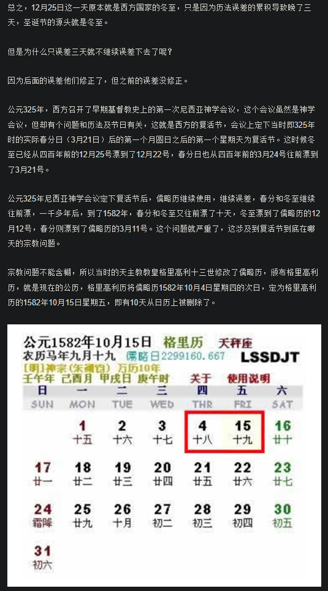
			- “我仅代表我个人，谢谢西方的老祖宗（指古罗马）帮助我们多了个节”
		- 
	- [(PDF) "Sol Invictus, the Winter Solstice, and the Origins of Christmas", Mouseion, Number 47/3 (2003), 377-398 | Steven Hijmans - Academia.edu](https://www.academia.edu/968841)
		- 因为“地球公转对我来说太快了”，我东看西看，最终在论文方面只来得及看了个Steven Hijmans的《Sol Invictus, the Winter Solstice, and the Origins of Christmas》（《无敌索尔、冬至和圣诞节的起源》）的开头和结尾
			- 他提出重点在于教会是否出于取代异教节日的意图而选择12月25日
			- 按他的解读，那位叙利亚主教的著作抄本上的那个边注是一位东正教人士留下的对圣诞节日期由来的恶意评论，且最先翻译该边注的Usener在引用这一评论时还断章取义，进而到了互联网时代有些作者为了搞大新闻连“据说”都不提了
			- 他认为教会选择12月25日作为圣诞节是出于对关于“永恒”的“cosmic symbolism”（“宇宙象征”）的偏好（“太阳节是吧？”），与夏至相关的仲夏节/圣约翰日及两人分别在春分和秋分的受孕日同理
				- 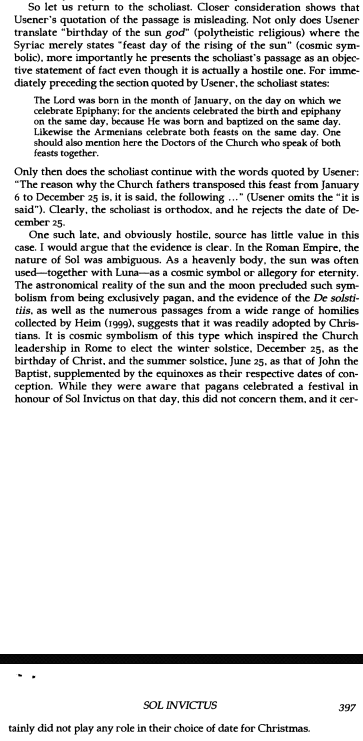
			- 拓展阅读
				- 
				- [为什么西方人会认为异端比异教徒更可恨? - 知乎](https://www.zhihu.com/question/35823223)
				  id:: 67a3fce5-7a9e-4a5e-a795-5d6c12b44844
					- 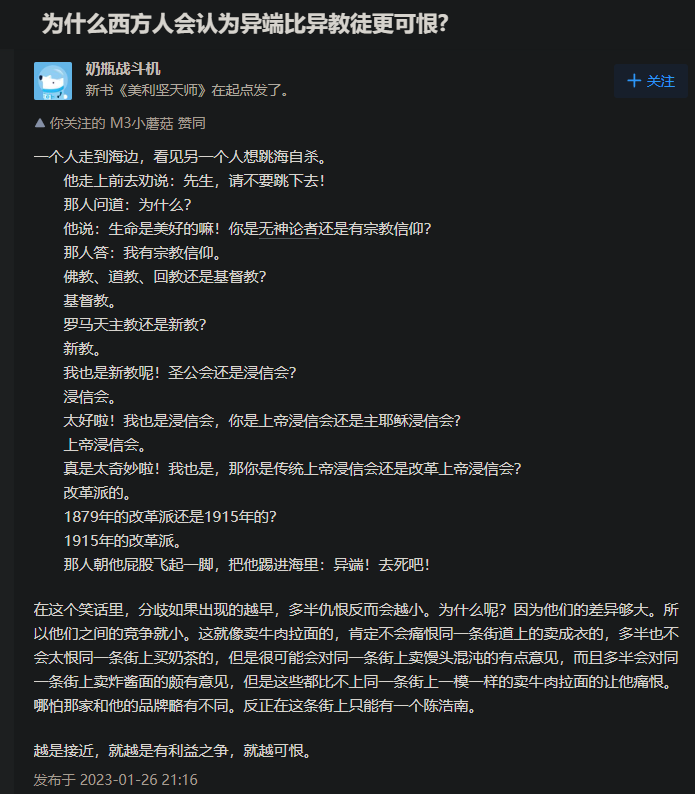
					- （之前搜那个被炸的加沙医院名称看到了这个问题）
						- {{embed ((65339816-f3cd-4868-865b-6993dc309f10))}}
- # 西节东渐的几点原因
	- 过去的人们想借“耶稣生日”暂时忘却战乱频仍，当今的人们享用平安果免不了无数烈士流血牺牲
		- [从“外国冬至”到“圣诞节”：耶稣诞辰在近代中国的节日化 - Globethics](https://www.globethics.net/pdfs/CNKI/CJFD/XSYK201212022.pdf)
		  id:: 657ed85f-fecc-441b-8793-a36929ba595d
			- [从“外国冬至”到“圣诞节”： 耶稣诞辰在近代中国的节日化](https://mp.weixin.qq.com/s/97KKeBYgpSXf9vIQygmgKw)
			- （“读者先看”）
			- 当时的中国人可能是在缺乏对耶稣和基督教的了解（和讲解）的情况下，自然地以前三天的冬至为基准，称之为“外/西国冬至”
		- 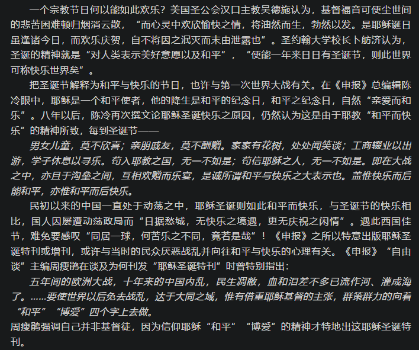
		- 列强争夺殖民地和国际市场，军阀火并，“后起之秀”日本要把中国全吞了——著名歌曲《恭喜恭喜》给我们描绘了这样一幅画面：抗日战争胜利后，活下来的人们自然是平平安安，见面互道恭喜恭喜
			- [原版《恭喜恭喜》——这一天来了，我们活下来了！_哔哩哔哩_bilibili](https://www.bilibili.com/video/BV1ab4y1S7Te)
				- 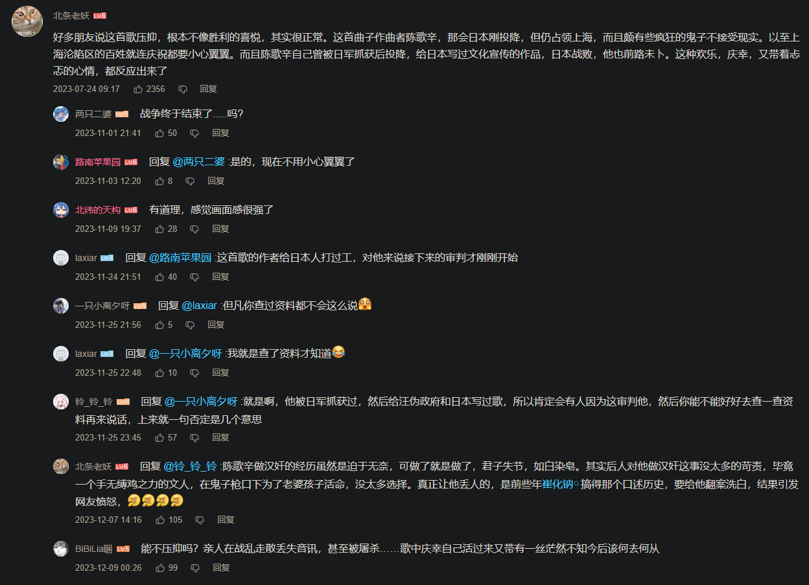
		- 但战争尚未结束，再接下来是解放战争，再接下来是抗美援朝战争
			- 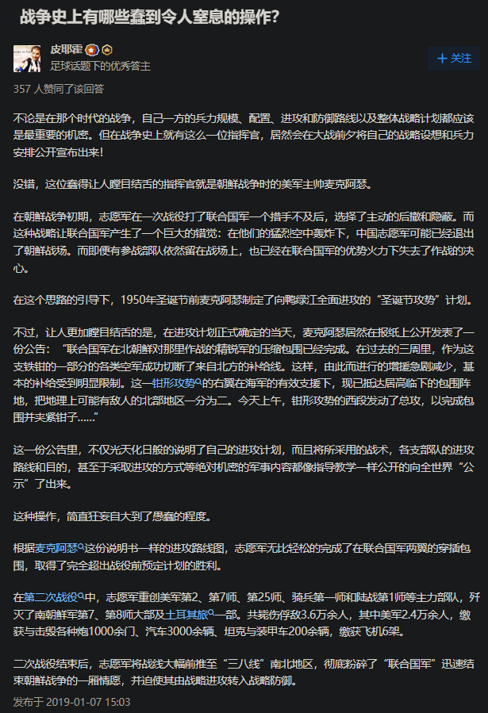
			- 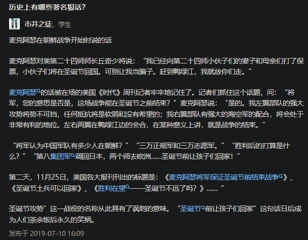
			- [回忆：人民志愿军给“联合国军”战俘过圣诞节_新闻中心_文化_新浪网](https://news.sina.com.cn/cul/2005-03-01/4346.html)
				- 
			- [晚年麦克阿瑟为何反对战争？ - 知乎](https://zhuanlan.zhihu.com/p/556606294)
				- 
			- [大型纪录片《毛主席传奇》_哔哩哔哩_bilibili](https://www.bilibili.com/video/BV14C4y1U7UC)
	- 民国期间圣诞节对中国传统冬至节的“挤占”，可能源于民国时期国民党政府对其政权合法性的高度重视、传统冬至节不易改造成消费节，以及节日间隔短导致“强者恒强”的”马太效应“
		- 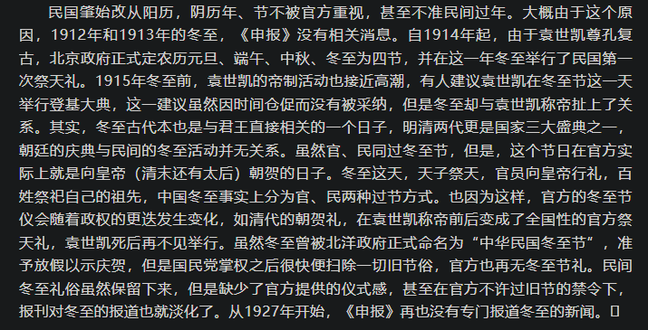
		- 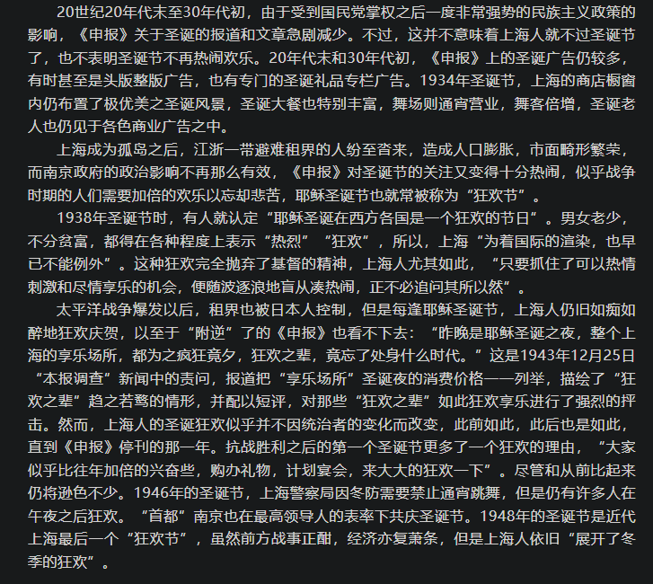
		- [少帅，你还让不让蒋公过圣诞啊！](https://mp.weixin.qq.com/s/H8zh07L-z8fdUO9xXCs8NA)
		- 这个部分我也没完全理清，但标题已经在那儿了（“我是谁？我从哪里来？我要写什么？”），那我就简单碎碎念几点
			- 我上大学时收了同学几个平安果。我家前天冬至晚上吃的带一点“科技与狠活”的便宜甜芝麻汤圆，还有饭店充卡送的锅贴，吃完爸妈下楼烧纸祭祖，我小时候玩够火了，加上一股烟味也不健康，就没下去烧纸——我认为我这两个节过得OK，虽说如有闲暇，我还可以试试给它们狠狠创新一下，让这两个节都能过得更具多样性
		- 1.圣诞节在历史上融合及被融合（比如可口可乐与穿红衣的圣诞老人）了不同民族和地域的习俗，可以说是“抓手”众多，于是我们可能看到高大满彩的一棵圣诞树与浅白味单（连烧的纸大多也是工工整整的黄纸，闻起来味道也差不多）的一盘饺子汤圆的对比
		- 2.蓝海市场比红海市场更易耕耘——不是改传统节日的过法，来自长辈们的阻力就小很多（“你说你抠死普累的是孔子？孔子穿成圣诞老人那样还得了？！还是用孔庙祈福的笔多做几张卷子吧！”）
		- 3.冬至（还有元旦）间隔短，消费和娱乐也是要蓄力的，圣诞节用掉大半时间金钱精力的话，剩下冬至和元旦消费什么？所以可能看起来有“强者恒强”（或者说“马太效应”）的现象
		- 4.大学里不少店，很多水果店在上下课必经之路上，相比小区中的家庭，大学校园可以说是一个高度同质化的社区，即便绝大多数学生和教职工不信教，出于融入集体（“大家都在买和送平安果！”）一起凑热闹的心态，买几个平安果送同学也是很自然的现象
- # “音乐节”：《平安夜》与平安夜
	- 圣诞节前一天晚上叫“平安夜”，英文叫“Christmas Eve”，为什么不直译为“圣诞节前夕/夜”？
		- 因为“平安夜”实际上是对一首奥地利牧师作词的歌曲的英文版本（Silent Night；有个有点名气的互动小说手游系列的第三作叫《生命线：静夜》，也是“Silent Night”，在那儿“静夜”就是直译）的中文意译（不直译的外国节日挺多的），因为确有群众、信众基础，于是就这么约定俗成了
		- [圣诞节前夜被称为“平安夜”，源自一个“误译”？_einsam](https://www.sohu.com/a/440332073_231759)
			- 
- # “蘋苹无奇，但一字千金”
	- 字体本位
		- 从以下两截图中则似乎能瞥见繁体字本位用户的“懂了，但没完全懂”——“反正我是不确定他们有没有完全懂，我甚至似乎有点理不清自己懂不懂他们懂不懂，也许我才是简简单单地陷在简体字本位中难以自拔”（建议读者跳过这一节，不要像我一样假装纠结）
			- 
				- [收集各地奇趣聖誕餐單！　日本人食炸雞美國猶人卻流行吃中餐？](https://www.hk01.com/%E8%97%9D%E6%96%87/850327/%E6%94%B6%E9%9B%86%E5%90%84%E5%9C%B0%E5%A5%87%E8%B6%A3%E8%81%96%E8%AA%95%E9%A4%90%E5%96%AE-%E6%97%A5%E6%9C%AC%E4%BA%BA%E9%A3%9F%E7%82%B8%E9%9B%9E%E7%BE%8E%E5%9C%8B%E7%8C%B6%E4%BA%BA%E5%8D%BB%E6%B5%81%E8%A1%8C%E5%90%83%E4%B8%AD%E9%A4%90)
			- 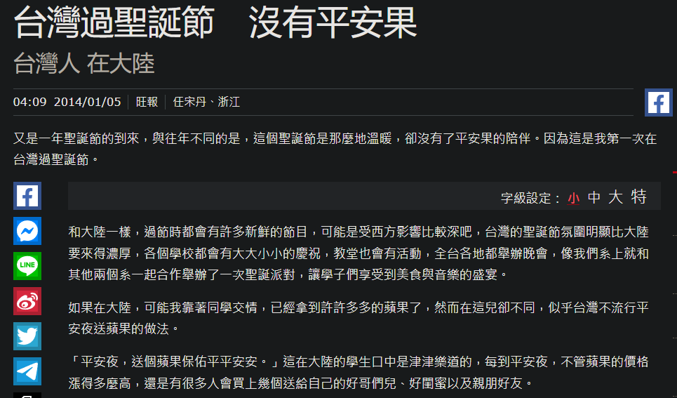
	- “苹果”的“苹”从哪里来？
		- 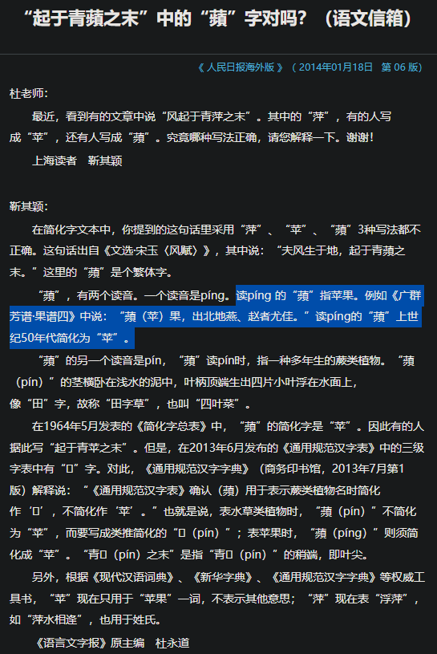
			- [“起于青蘋之末”中的“蘋”字对吗？（语文信箱）](http://paper.people.com.cn/rmrbhwb/html/2014-01/18/content_1380394.htm)
			- 
				- “优雅，太优雅啦！”
				- [呦呦鹿鸣！翘首以盼的梅花鹿叫声来啦！_哔哩哔哩_bilibili](https://www.bilibili.com/video/BV1dL411W73x)
					- [小鹿崽儿的叫声_哔哩哔哩_bilibili](https://www.bilibili.com/video/BV1qM4y1h7bc)
		- ### 草与木，蘋与㰋：槟（榔）对苹（果）的偏旁的“抢注”
		  id:: 66335c21-080d-4e87-9979-601bf715a547
			- [苹果是树上长的，为什么苹字是草字头？ - 知乎](https://www.zhihu.com/question/380181462)
				- 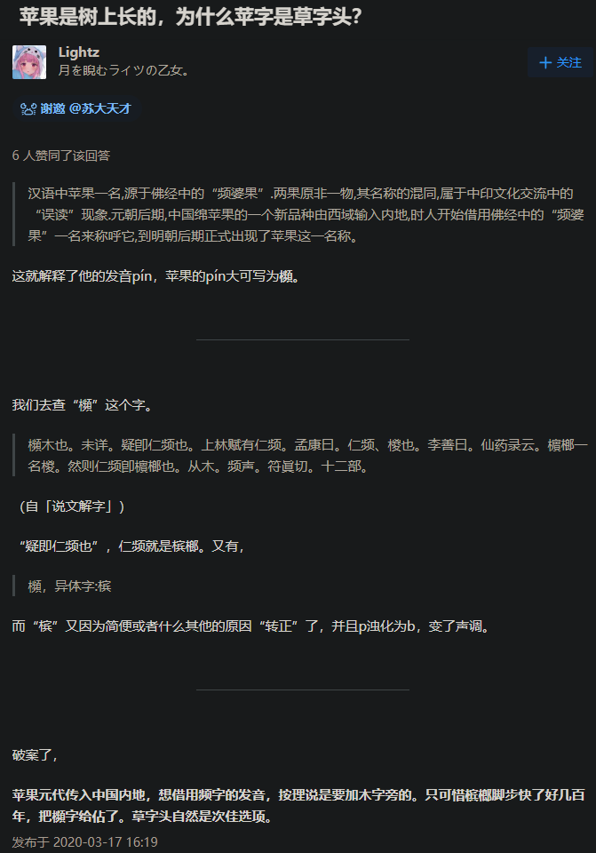
	- “苹果”的“果”的大类占位
		- “果”一般指什么？对喽，不是因果、果报，就是水果
		- 常见水果以果字结尾的好像真不多，我一时就想不出别的（想到了，雪莲果、人参果、百香果，要么不常吃，要么一般不直接整个吃吧？更别提印字了），虽说如果（“如~果~”）别的水果成了“平安夜该吃的水果”，也不一定叫“平安桃”、“平安梨”、“平安莲”
		- 所以说，优势在苹果，平安果就是苹果！
- 没喽！一小篇说多不多，但可能也够啃了，来不及写完的“桃子”（“拉胯冬桃毁我平安果不等式”）和“苹果”（“苹果文化大串联”）可能明年和后年再发