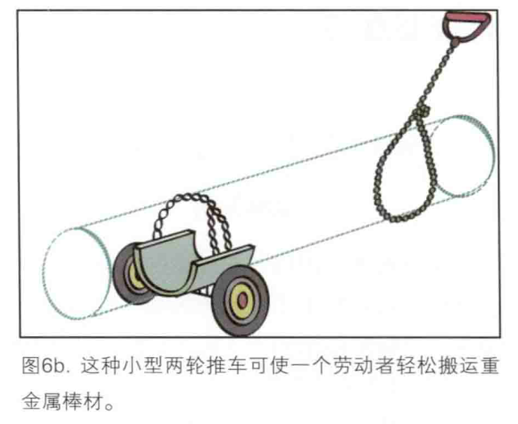

- 建筑是生产再生产（睡觉）和消费（可以存放消费品，相当于“仓储”）空间的过程
  id:: 688d5983-1174-4e24-ba14-82c75c2af36d
	- 空间小了也影响家具等的消费？所以大点也好？当然也能卖出更多钱，与地方人口和经济相匹配
- ((67c4f814-897a-422f-9626-14421b9024ae))
  collapsed:: true
- ((67e9e109-d878-4fe8-a572-32f42d7a44e2))
- [2024年建筑业发展统计分析](https://mp.weixin.qq.com/s/l0Jof4ZbyP0wvYGO32MYRQ)
- [什么是建筑物和构筑物？它们之间的区别是什么？ - 知乎](https://zhuanlan.zhihu.com/p/96759444)
- 工地，搬砖扛钢筋这样的活不需要培训考试，收入也比普通白领高不少
- 建筑设计
- 第四代住宅
  id:: 673f18aa-087d-4067-b419-9a768ee203ae
  collapsed:: true
	- 高空强化绿化、采光等的住宅
	- [第四代住宅，机遇与挑战并存](https://mp.weixin.qq.com/s?__biz=MzIxOTQyMjE2MA==&mid=2247509174&idx=1&sn=c2827f93f3baca5d9ac7c2111130fe88&chksm=97d96809a0aee11f1998d202d3185433a9f91ffd699019b251b9b78e628823102bbb3520ee56&scene=21#wechat_redirect)
	- ((676fac77-a06b-44e8-87ec-c8abeaa7d45d))
	- ---
	- 第四代住宅应当解决前几代住宅普遍未解决的历史遗留问题
	- 灭火系统
	- 防虫香料植物堆叠代替没啥用还麻烦费钱招蚊子的物业摇钱树
	- TODO “窗花”
	  id:: 67a5aa8f-4b35-4057-a357-07054234f7bf
		- 不少小区不让装室外花台，那么贴个“窗花”总行吧？
	- TODO 出窗花架
	  id:: 67baaf0a-bb45-4e81-b916-4f91bdd9399f
		- “没有在室外、外立面固定哦”
		- 出云花台沿外墙展开
			- ((67b5759a-ec9e-4261-8636-127c2a6962b0))
		- 防盗
- 装配式建筑
	- ((67e9ffe0-079f-4dc4-88cd-dffa08f41d86))
- [只限制宽度？这是你说的啊！_哔哩哔哩_bilibili](https://www.bilibili.com/video/BV1tjRUYZEdB/)
  id:: 67f73877-7575-480b-9495-a64c9fdc28cf
- 土木工程
  collapsed:: true
	- 道路桥梁
		- [路桥工程_百度百科](https://baike.baidu.com/item/%E8%B7%AF%E6%A1%A5%E5%B7%A5%E7%A8%8B/6582154)
		- [贝雷桥_百度百科](https://baike.baidu.com/item/%E8%B4%9D%E9%9B%B7%E6%A1%A5/6553820)
- 建材
  id:: 630c1640-5204-4da6-b1cc-63dd4cf782f4
  collapsed:: true
	- 砖
	  id:: 6645b76d-844c-47e8-980b-945ba05eaa96
	  collapsed:: true
		- [地面砖_百度百科](https://baike.baidu.com/item/%E5%9C%B0%E9%9D%A2%E7%A0%96/2907014)
			- [小布来了｜这周小布做了这些事儿→_澎湃号·政务_澎湃新闻-The Paper](https://www.thepaper.cn/newsDetail_forward_27341131)
			  id:: 66449311-e8b5-465d-b63d-54600199c21d
				- [“郑州发布”表现称职吗？ - 知乎](https://zhuanlan.zhihu.com/p/577636956)
				- [小布助手_百度百科](https://baike.baidu.com/item/%E5%B0%8F%E5%B8%83%E5%8A%A9%E6%89%8B/55695512)
				  id:: 6645b76d-1e21-4315-b25c-7f9c19ed72ee
				- >“但是另一方面来看”，这也可以视作坚守主流话语阵地的体现，“小布”岂是如此不便之物？只要用的人少、危害不大，我就可以不“屌（丝）”你，甚至可能帮你无害化
		- [景观材料详解——铺地砖系列篇一（透水砖）_混凝土](https://www.sohu.com/a/411606776_120770377)
		- [砖铺路面_百度百科](https://baike.baidu.com/item/%E7%A0%96%E9%93%BA%E8%B7%AF%E9%9D%A2/22202093)
		- [把屎做成砖，可能就是建筑业的未来_百科TA说](https://baike.baidu.com/tashuo/browse/content?id=5c3a2427ceb9912dcb71252d)
	- 水泥
	  collapsed:: true
		- 王进喜搅水泥
		- 水泥标号
			- 水泥标号高可能导致装修工具失效，事先了解
			  id:: 681b576a-e0ef-43bd-9505-949596af0726
		- [台泥工厂邀请村邻参观厂区！_发展](https://www.sohu.com/a/444374892_653352)
		- ---
		- 开地槽辅助支架
	- 混凝土
	  collapsed:: true
		- [用竹子替代钢筋，竟然不算豆腐渣工程？_哔哩哔哩_bilibili](https://www.bilibili.com/video/BV1eg41137gC/)
		- [钢筋混凝土的寿命只有50年？日本研发新型材料，替代螺纹钢_哔哩哔哩_bilibili](https://www.bilibili.com/video/BV18GUCYeE9M/)
		- [砼核/concretecore - 看起来不真实的地方_哔哩哔哩_bilibili](https://www.bilibili.com/video/BV1fBQrYUEPb/)
			- 化学
				- 碱骨料反应
			- ((630773f7-8f4c-4360-8cf2-1808203bec20))
			- “灰”
			  collapsed:: true
				- “五十度灰”
				- [不同时期剩灰_哔哩哔哩_bilibili](https://www.bilibili.com/video/BV1okPHetEz5/)
			- [砼核/concretecore - 看起来不真实的地方_哔哩哔哩_bilibili](https://www.bilibili.com/video/BV1fBQrYUEPb/)
		- [为什么工地禁止人工搅拌混凝土？而是必须去搅拌站？不多此一举吗_哔哩哔哩_bilibili](https://www.bilibili.com/video/BV14g411Q7dZ/)
	- ---
	- 瓷砖
	  id:: 68103ed8-9e0b-41b8-9287-37578d864619
		- [德国工具独自一人完成淋浴间防水及贴瓷砖施工，防水严丝合缝，瓷砖横平竖直，利用辅助工具，贴出了瓦工界的最高水平 #瓦工铺贴瓷砖#卫生间防水#瓦工的最高境界_哔哩哔哩_bilibili](https://www.bilibili.com/video/BV1shF7e1ETn/)
		- 瓷砖吸盘
		- TODO 铺瓷砖器
		  id:: 67fa20fe-0b98-437f-a58e-4d2977bad5ca
			- >瓷砖也可以高效输送，最好也是能从推车开始一摞瓷砖遇瓷砖与地面形成的台阶一级一级自动放下的，拼多多上的吸盘看起来还是有点太手动了
			- 瓷砖摞中的一片瓷砖直接滑动会磨花其中一片瓷砖吗？
		- 瓷砖找平器
		  id:: 67fa2103-7159-405d-82f1-c87b15b02705
			- >看起来只是尽量把瓷砖们互相夹到一个平面
			- ---
			- 瓷砖找平底座、插片
			  id:: 6808f3a2-82cd-4a04-af71-1ccc6448ccae
		- 瓷砖倒角机
		- 瓷砖顶高器
		  id:: 6806ffe1-fbd7-4b04-bff9-ee86c5615adc
		- ---
		- 美缝
		  collapsed:: true
			- [最强美缝材料诞生？2000+小时实验告诉你美缝材料到底怎么选（住小帮）_哔哩哔哩_bilibili](https://www.bilibili.com/video/BV1bh4y1E768/)
			- [手把手教你做美缝_哔哩哔哩_bilibili](https://www.bilibili.com/video/BV1wh4y1X7XV/)
			- [假如美缝师傅说真话_哔哩哔哩_bilibili](https://www.bilibili.com/video/BV1FV4y197P4)
				- 趴着美缝
				  id:: 67d272ea-cc24-422d-ab3b-88fc7cdda6df
					- 
			- 坐着上美缝胶（？）
			  id:: 67d27b87-0689-486d-8fa6-bbcde997e4b8
				- ((67d24aca-bda3-41a0-bbce-6dbc858fa822))
			- 清（之前的）美缝胶
				- [[做工具]手搓一个锂电美缝清缝机_哔哩哔哩_bilibili](https://www.bilibili.com/video/BV1tJkSYaELU/)
	- 油漆
	  id:: 680f7607-c41c-4499-bb76-9c00c4df4633
	- ---
	- 建材集采
	  collapsed:: true
		- 采筑
			- [​房地产最大的平权运动](https://mp.weixin.qq.com/s/WUuQ232ZKRws48fmE3TlSQ)
			  id:: 630c2e4d-efa7-4194-900d-7ce1a5b53794
	- 我不太满意家里的装修，正好借着行业研究的机会、从建材行业角度切入搞明白为什么包括我家在内的装修的视觉风格与功能体验都让我不太满意——《建材晨会》
- [当施工进行到一半突然看懂图纸的你_哔哩哔哩_bilibili](https://www.bilibili.com/video/BV1ou411B7d9/)
- [土木狗哥的个人空间-土木狗哥个人主页-哔哩哔哩视频](https://space.bilibili.com/473689640)
- 工地
  id:: 67eb282b-8315-4d3b-9af1-05f5c480888c
  collapsed:: true
	- [施工现场人员配备新标准来了！住建部要求2025年在建项目施工现场中级工占比达到20%，高级工及以上达到5%！](https://www.cnwb.net/list/newscontent/34717.html)
	- 安全帽
	  id:: 67f8d043-ee88-484d-a0c4-f1939f2f9a9f
		- [天气热就可以不戴安全帽吗？回答我_哔哩哔哩_bilibili](https://www.bilibili.com/video/BV1XhZBYEEiT/)
		- ((679addc5-ff93-4850-a6c7-d65dfd238a77))
		- ((681dedfe-c0f4-442b-9392-df9bcfffb2f3))
		  id:: 681dedfe-c0f4-442b-9392-df9bcfffb2f3
		- ---
		- [hard hat - The Hitchhiker's Guide to the Cataclysm](https://cdda-guide.nornagon.net/item/hat_hard)
		- [summer hard hat - The Hitchhiker's Guide to the Cataclysm](https://cdda-guide.nornagon.net/item/hat_hard_hooded)
	- 地基
	  collapsed:: true
		- 地基夯实
			- [强夯机的重锤有多重？ #科普 #解压 #强夯机 #打地基 #冷知识_哔哩哔哩_bilibili](https://www.bilibili.com/video/BV17c1mYmEq3/)
			- [强夯法与重锤夯实法有哪些不同？ - 知乎](https://zhuanlan.zhihu.com/p/587459952)
			- [重锤夯实法_百度百科](https://baike.baidu.com/item/%E9%87%8D%E9%94%A4%E5%A4%AF%E5%AE%9E%E6%B3%95/610428)
			- ---
			- “（终于）看清楚了，（原来是内个）‘大力’！”
			- 以前稍近（10-30m大概）感受过（“一次！”）地面传导的大概是重锤夯实（但可能记错了，可能就是小型强夯机的矮圆柱而非圆球）的机械波冲击，有点震撼！
				- 频率应该比sub bass还低
					- [【听这种音乐比较能装屄（7）· Drum&Bass】 【精准空降到 03:36】](https://www.bilibili.com/video/BV1KZ421x7u1/?share_source=copy_web&vd_source=24175964b0df2fcc2c022cae23517fdc&t=216)
			- 小时候小伙伴间也有说大概是“夯不夯”、“你夯啊”啥的
			- TODO “好像没有这个（dynamic compactor）暴爽低频采样？”
			  id:: 67e7e030-7350-4a28-b0ef-a90d2b03ddcc
	- 建材工地搬运
	  collapsed:: true
		- 塔吊
			- [工地“烂尾”，为啥塔吊不拆走呢？五大原因都很真实](https://baijiahao.baidu.com/s?id=1753635888072353732)
		- 重力夹
		  id:: 67e00c00-c51b-49c7-86ad-db88f0c8c141
			- [劳动人民的智慧！利用杠杆原理和重力搬运重物。 #科普 #解压 #杠杆原理 #劳动人民的智慧 #物理_哔哩哔哩_bilibili](https://www.bilibili.com/video/BV16zyaYkEW2/)
			  id:: 67e00be0-adc1-4338-a2a7-3473c0d1260e
			- 砖夹
			- 袋夹
				- 袋边夹
				  id:: 67e14001-cc6d-4bc1-b3f0-5edb4236b830
		- 搬水泥
			- 人力搬水泥
				- 向上层搬运
				  collapsed:: true
					- 大概是差不多浇好一层往上搬一层
					- [跟着日结大神阿明，一天搬运七百包水泥，赚了240块钱，感觉不划算。_哔哩哔哩_bilibili](https://www.bilibili.com/video/BV1Zp4y1M7zr/)
						- 为什么（这种）上层只开个小洞吊水泥上去？为什么不能把叉车运上去？
						- 费力杠杆？
						- 这个视频是23年的，但好像禁止现场搅拌水泥更早就有了，所以是为了不用塔吊以免被发现？还是工地太小用不了塔吊？
					- [[問題] 如何用不受傷的方式搬起50公斤水泥 - 看板 MuscleBeach - 批踢踢實業坊](https://www.ptt.cc/bbs/MuscleBeach/M.1501852309.A.C6C.html)
					- TODO 工地现搭水泥吊机
					  id:: 67e018ff-5fff-4047-bfa5-3620b4a1de5a
						- “我要我觉得！杠了上面就该自动杠下面！”
						- “经典没活硬整环节”
							- ((679add3a-a48c-4287-baaa-1ad967617fdb))
							- 摩天轮
							- ((656b5246-9e5a-4a42-af99-db12f5fc67de))
							- 炮弹装填机，手摇高射炮/机枪
							- id:: 67eb282b-0823-401b-8513-02ebcd064b23
							  >十五个吊桶打水——七上八下
							- ((67cf9178-8395-4292-b3f9-80e3ec66c436))
						- ---
						- ((67e14001-cc6d-4bc1-b3f0-5edb4236b830)) 2个
							- 好，又想到游戏~~奈落落~~ ((67e1496d-5f60-455d-b14e-5a7d4530276c)) 了
							- 能自动夹、放当然更好，比如碰到障碍打开
						- ((67e13e31-ddd2-4351-9b7d-7b5d066d5438))
							- 不用别的可以做个“担架”（可能吊多个？），钢丝也可能不用？
						- 工地手推车
							- 车斗或车把也可能作为支点
							- 联动？
								- 上下摆传动？
								- 车轮连棘轮？
								  id:: 67e1509c-475a-4a5d-84da-ab3b2915fed1
						- # 你有50kg以上的启动重量吗？
							- 不清楚需不需要，也许这也不需要呢？
						- ---
						- 跷跷板交替夹取
							- 总之，左右交替夹（如果夹子承重够大概能直接间接夹多袋），然后移动，保持较高、最好可灵活旋转的支点
						- 旋转上车
							- 弹簧斜旋杆？
								- “恍然大悟，重新发明吊机”
								- 旋转劈砍，很美啊！~~但可能有点难和不安全~~
							- 下部配重固定
								- 可以挤在袋摞之间
							- “这两步融合或衔接应该有办法，简单点可以先试试加法，再用一根杆挑起扁担旋转转移”
						- ((67e1509c-475a-4a5d-84da-ab3b2915fed1)) 吊起然后连吊具滑到车上（方）
				- 同层搬运
					- [民工牛人发明自制的搬水泥神器，轻便省力，这下轻松多了](https://www.sohu.com/a/689166627_121420362)
					- [大叔发明手推车搬水泥神器，不用油不用电，轻松搬起水泥省力方便](https://www.sohu.com/a/463199809_120488303)
				- 搬水泥教育
				  id:: 6802358b-9e55-4dce-a027-a9ec2309bb7e
					- [“不爱背书包，就去扛大包”！青岛“虎爸”带女儿到工地体验生活_澎湃号·媒体_澎湃新闻-The Paper](https://www.thepaper.cn/newsDetail_forward_22625363)
					  id:: 6802358f-5992-4e64-9dfc-c408f21844fa
		- 搬钢筋
			- ((67e26ea7-e023-41ac-81ac-ad6ecce03e7f))
			- 搬钢筋教育
			  id:: 67e15743-3247-4958-97a4-e023a3781ec3
				- [这就是生活！12岁网瘾少年工地体验妈妈搬钢筋后，态度大转变！_哔哩哔哩_bilibili](https://www.bilibili.com/video/BV1M34y1j7TJ/)
				- [男孩不愿读书要打工，被爸爸带到工地搬钢筋。父亲：干了一天半就想通了。_哔哩哔哩_bilibili](https://www.bilibili.com/video/BV1Fe4y147eC/)
			- ((67e15fa8-37df-4f68-ab69-53124ba1ce54))
			- TODO ~~长条堆吊机~~钢筋拉车
			  id:: 67e0ae52-d062-49f1-b0af-756a6471d63a
				- “最脱离实际的一集”（指还没没确认要搬什么、怎么搬就开始硬想了——“应当想着搬点啥，怎么描述？长条？什么是长条？水泥条？呃，好像没搜着要搬这个？”）
				- “想办法看起来合理的启动动画”
					- （躺或趴）水平蹬长条堆侧面拉出长条大半（“我当然知道螺纹钢是拉不出的，但我先想着”）
						- ((67d24f64-344d-4be2-a24b-0bb2dcbc4740))
					- 脚踩翘起第二条、第三条，三脚架差不多有了，但是好像没啥用
				- ---
				- [[绳]]
				- ((679add4e-5907-4625-a172-d3297bcd698a))
				- 短钢筋车架
				- ((683ba686-de7d-4662-bb69-0610aa9b72f9))
					- “可能会磨费几个脚轮，但那算不上什么，劳动者的健康是无价的，听懂掌声！”
				- ---
				- ——《工效学检查要点》
					- “所以到底需不需要批量拉钢筋？”
		- ---
		- [最傻苦力代课教师-李小棚，扛钢筋搬水泥筹建六所学校_哔哩哔哩_bilibili](https://www.bilibili.com/video/BV1ip4y1g7cD/)
		  id:: 67e168c9-e66e-49a4-84d2-f539cf834cc7
		- 钢筋杠杆
	- 脚手架
		- 脚手架脚轮
		  id:: 6808f117-d2ce-4c67-ac68-f6f03485ab56
	- 扎/绑钢筋
	  collapsed:: true
		- id:: 6827f62a-b6b4-4ce5-ba5c-0cb7a454eb0b
		  >是钢筋工不，扎钢筋的时候下面木工已经把模板制好了，模板被太阳晒了，表面温度得有60℃以上，再加上太阳晒，就跟铁板鱿鱼一样。汗水得眼睛都睁不开，不补充点糖分，就是低血糖的下场——评论区
			- ((67e26ea7-e023-41ac-81ac-ad6ecce03e7f))
		- [实习生绑钢筋_哔哩哔哩_bilibili](https://www.bilibili.com/video/BV1Wf4y1H7Yw)
		- [工程人的福音，绑扎钢筋再也不用手了_哔哩哔哩_bilibili](https://www.bilibili.com/video/BV1Xv4y1o71D)
		- [21岁大学生发明“扎钢筋”机器人，6秒钟扎一个，一小时扎600个_哔哩哔哩_bilibili](https://www.bilibili.com/video/BV1LJ411u7h7/)
		- [这机器人专业搬钢筋绑钢筋，以后工地搬砖，学历低了怕是不行_哔哩哔哩_bilibili](https://www.bilibili.com/video/BV1G94y167Mo/)
		  id:: 67e15fa8-37df-4f68-ab69-53124ba1ce54
		- [楼梯绑扎钢筋工艺_哔哩哔哩_bilibili](https://www.bilibili.com/video/BV1as421P7As/)
	- 钢筋调直
	  collapsed:: true
		- [工地热门设备鉴定之钢筋调直机_哔哩哔哩_bilibili](https://www.bilibili.com/video/BV1jr4y1H7eg/)
	- [[运动饮料]]
	- TODO 工地睡具
	  id:: 682c1193-524d-4960-996a-15f7b6530136
	- ---
	- [安全员:今日无安全隐患!_哔哩哔哩_bilibili](https://www.bilibili.com/video/BV1r9SEYpEDy/)
	- [POV:你是工地安全员_哔哩哔哩_bilibili](https://www.bilibili.com/video/BV1ze411o7FU)
	- [安全员第一天上班瑟瑟发抖_哔哩哔哩_bilibili](https://www.bilibili.com/video/BV13z2mY1Eyq)
	- [现场安全员已全身瘫软！_哔哩哔哩_bilibili](https://www.bilibili.com/video/BV1XFPse9Ejq)
- [这些工效数据，每个工程人都应该烂熟于心_哔哩哔哩_bilibili](https://www.bilibili.com/video/BV1c34y1p7VV/)
- 外立面
  id:: 67678701-178b-4f62-a179-9bb14a82da40
	- [就“擅自改动建筑物外立面是否合法”问题，潮州律师普法解答_南方+_南方plus](https://static.nfapp.southcn.com/content/202305/25/c7720068.html)
	- ((67d9534a-77d5-44fd-b327-507ce78da3a3))
- 柱
  id:: 670d40c8-29f6-4bb2-b6a5-d1e43f0185e2
	- [西方古典建筑五种基础柱式简介 | ArchDaily](https://www.archdaily.cn/cn/894318/xi-fang-gu-dian-jian-zhu-wu-chong-ji-chu-zhu-shi-jian-jie)
	- ((672f05f2-0cf7-43fa-b904-accfad22bb9c))
- 膜结构
- 沉降
	- [每年超过0.3厘米的下沉？我们的房子怎么办？](https://mp.weixin.qq.com/s/Oc-p6Kn0j9kClyun1XnlqA)
- ---
- 赫鲁晓夫楼
  collapsed:: true
	- [为什么全中国的“老破小”楼房，都丑得一模一样？_赫鲁晓夫](https://www.sohu.com/a/427478565_220034)
	- 隐私差
		- 凸出式阳台厨房
		- 有助早睡早起？
- 事故
	- 自建房倒塌
		- [长沙”4.29“特别重大自建房倒塌事故调查报告_哔哩哔哩_bilibili](https://www.bilibili.com/video/BV1V14y1C7Ym/)
- ((683e5198-0853-41c6-a605-a69f691bdd38))