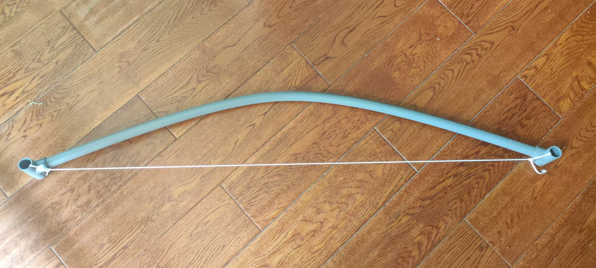
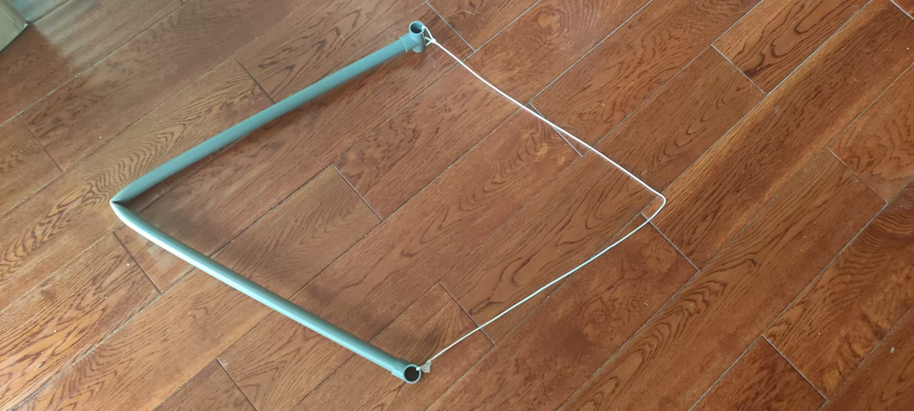

- 为什么应当玩弓？
	- 合法
	- 锻炼身体，比如为了拉好大磅、比一比（箭比常规弹弓弹药大，对观者而言，射击结果更显眼、可视化）而锻炼
	- 可防身
		- ((685fe60e-3aab-41cb-ac64-807d79f2c94c))
		- ((685ce0ca-b768-4041-8ac4-02c669dd0575))
		- ((685f7b0c-7e30-4387-9ef2-6858feeaf1a9))
	- 比（普通）弹弓安全
		- 箭头搭在弓前，不会打手，弹弓弹药在弹弓后，可能打手，尤其是无架弹弓，且快准狠（玩上瘾了比较难不用）的钢珠等弹药可造成的伤害较大
		- 弹弓皮筋弹性倍儿棒，断了可能抽脸，弓弦没啥弹性，哪里断都不会抽脸
	- ---
	- “我再看看想想”
		- （抛开各种融合形态和 ((685febb8-64bc-4a20-a1c2-349a77b467b6)) 不谈——“布豪！好像抛不开！”）比弹弓想象空间大，或者说更容易想象更多用途（另一方面，什么都不玩就想不了一点，最多玩点fake game这辈子有了吧！），箭相比各种弹珠能量大、保持好、可带多种物体、更易拓展用途、可向下兼容（“可以不用，不能没有”）
- [反曲弓与传统弓的区别是什么？ - 知乎](https://www.zhihu.com/question/369260609)
- [长弓和短弓的区别是什么？？ - 知乎](https://www.zhihu.com/question/57961372)
- 塑料弓
	- PVC管弓
	  id:: 68593f54-6987-4b24-b762-d31d7b3c457f
		- [学大佬做PVC小稍弓翻车，却意外得到一把三角弓_哔哩哔哩_bilibili](https://www.bilibili.com/video/BV1nH4y1L7pG)
		  id:: 685fce82-c2de-4534-976e-423b27fa9c90
		- 塞玻纤棒等增强
		  id:: 685f4d83-194d-4454-9cc9-9ae6e323d198
		- 上弦
			- 目前已知的似乎靠谱的弓弦布局
				- 快接堵头钻孔穿弦
					- [【补档】自制极简末日废土级水管弓_哔哩哔哩_bilibili](https://www.bilibili.com/video/BV1Zoe7e4E8d/)
					  id:: 68593f58-9c98-417c-b574-6ad32d076535
						- 快接堵头需要 ((683f832c-92c7-4bb4-98ff-04a12fe855ba)) 后穿弦，弦末端可以打结增粗后（“像土电话那样”）卡在内部
						- ((68593fee-9679-44b7-a936-4af2bc63cccc))
				- 45度弯头开槽挂弦
					- [阿尔图宁-offical的动态 - 哔哩哔哩](https://www.bilibili.com/opus/1063358298194968585)
					  id:: 68593fee-9679-44b7-a936-4af2bc63cccc
						- 这种是挂弦在45度弯头的弦槽里
						- 45度弯头的弦槽看起来可以手工线锯（可以先用其他锯齿较长的锯竖切两道）、锉（可以先锯再打磨）或机器线锯、砂轮、铣
							- ((67d3f1ab-53dd-4da6-a2ac-3488b9661488))
					- ((683f832c-92c7-4bb4-98ff-04a12fe855ba)) 穿弦应该也行，但取下弓弦可能不容易比挂弦方便
				- 三通穿弦
					-  [[20250628]]
						- 1米20mm管
						- 一时找不到（“手提秤！”）以前买的尺寸差些的竹棒，吸管套筷子也不好深塞筷子粗端，暂时射不了
						- 胆小拉到12磅就不敢继续拉了——下一次拉到锁定是12.4磅，又缓慢拉了一次就弯了（“原来如此——那还怕啥？”）磅数差不多掉完了（“什么临门一脚”）
						- 拉动时发现弦可能突然在三通管内滑动一小段——“这个结构是这样的”
						- 
							- ((685fce82-c2de-4534-976e-423b27fa9c90))
					- 立体三通
					- Y型三通
				- 管内穿弦
					- ((685f4d83-194d-4454-9cc9-9ae6e323d198))
				- ---
				- 与弦接触部位都可以锉
			- 先给一端上弦
				- 可预留打活结、装配件等的长度
				- 一般打八字结
					- 扎带锁结？
					- 边角防断
			- 上弦、测试时的个人防护
				- 尤其要保护面部、外生殖器等部位
				- 可以穿戴头盔（含大镜片）等护甲
				- 可以隔着椅背（椅背有些镂空可能问题不大，也可放沙发垫等阻挡）
				- 可以从侧面弯弓、拉弓，可以脚推管（同时弦可以靠在椅背等家具上）
			- 弯管
				- 借助自重下压两端搭着悬空的PVC管
					- 小磅数可坐在地上，PVC管一端着地，一端搭在靠墙的椅子等上，腿（大概是小腿）在管和弦之间、搭在管上下压
					- ---
					- 凳子、椅子上（够大够结实的炒锅、浴缸等也可能），控制住用臀部缓慢下压PVC管至充分弯曲，有条件可用更多人、臀部PVC管限位装置、墙、防滑楔、软垫等稳定、防滑、防PVC管意外滑开或断裂后跌伤
						- 好像不方便上弦，但也可能是没侧坐
			- 各种调整、对齐
		- 测磅数
			- ((67fb7da0-74ba-41d0-84bb-4ca943153843))
		- ---
		- 握把
		- 辅助瞄准
		- TODO 弓弦快拆
		  id:: 685ce0ca-b768-4041-8ac4-02c669dd0575
			- “近战弓兵”
		- 防身配件
		  id:: 685fe60e-3aab-41cb-ac64-807d79f2c94c
	- PPR管弓
		- [PPR水管弓制作，超低成本，极致的回报比。_哔哩哔哩_bilibili](https://www.bilibili.com/video/BV1ci421d78Q/)
- 竹片弓
	- [简易竹弓的升级以及个人射箭技巧分享_哔哩哔哩_bilibili](https://www.bilibili.com/video/BV16h4y1k7yb/)
- 复合弓
id:: 67a550e1-a5d5-4e83-bba0-0adbd784ceb2
	- ((67f8db8f-1dd8-43cb-9522-1b55bbeeea67))
	- [网上在售的复合弓能打弹珠靠谱吗，和空放有什么区别？ - 知乎](https://www.zhihu.com/question/462670245)
	- 两用弓
		- [【唐槐射艺】更新啦，赶紧来围观吧！_哔哩哔哩_bilibili](https://www.bilibili.com/video/BV15D421K7Ke/)
		  id:: 685ff9a4-274e-45c8-bb08-8046d23aea47
- 反曲弓
	- “弓”应该是反曲弓，听懂掌声！
	- ((67fe1222-3543-45a6-967c-b258e1b571e1))
	- [国产灵云弓屌炸天测试_哔哩哔哩_bilibili](https://www.bilibili.com/video/BV1wx411N7Y5/)
	- [四步搞定反曲弓上弦](https://www.sohu.com/a/136938609_500763)
- ---
- 拉开省力
- 拉开后
	- 扳指
		- [【【拉车背架】废土赛博外骨骼拉弓搭箭辅助器初版】 【精准空降到 04:10】](https://www.bilibili.com/video/BV1c34y1V7ro/?share_source=copy_web&vd_source=24175964b0df2fcc2c022cae23517fdc&t=250)
		- [水晶塑料坡桶扳指太好用了！_哔哩哔哩_bilibili](https://www.bilibili.com/video/BV1HE42157gm/)
	- 其他部位的保持省力
		- 锁定
			- “微力锁定”
				- ((677a650b-68f3-4e99-80ab-bfed0dfc220e))
- 近战
  id:: 685f7b0c-7e30-4387-9ef2-6858feeaf1a9
	- 矛弓
		- [真正的近战弓兵 | 丹麦矛弓_哔哩哔哩_bilibili](https://www.bilibili.com/video/BV1N2MyzuEyF/)
	- 加装刺刀
		- [牛头801，弓剑手，远可射，近可刺！_哔哩哔哩_bilibili](https://www.bilibili.com/video/BV1Rn4y1Q7bS/)
- ---
- 弩
	- [木人加弓，先来个半成品_哔哩哔哩_bilibili](https://www.bilibili.com/video/BV1K8jyzbEtg/)
- ---
- 箭
	- [初学射箭，怎么选择箭 - 知乎](https://zhuanlan.zhihu.com/p/142780519)
	- 竹箭
		- 竹棒箭
			- 大概上不了大磅数
			- [【补档】如何制作废土级箭支，简易箭尾。_哔哩哔哩_bilibili](https://www.bilibili.com/video/BV1b5xke9EbW)
			  id:: 685a7486-9af4-46c9-aa81-cef822cce766
			- [全网最详细，最低成本 （每只箭不足两元）简单上手 真羽木制箭矢制作_哔哩哔哩_bilibili](https://www.bilibili.com/video/BV1wUp1e7EAm/)
			- 校直
				- 选箭器
					- ((68065a59-59ad-4950-aa09-04fb851bc986))
					- 批量检查可能比一根根看高效
					- [选箭器使用视频，如何判断箭支直度的好坏_哔哩哔哩_bilibili](https://www.bilibili.com/video/BV1nK421Y7jR/)
					- [【射箭】DIY箭杆直度测试仪 - 大神们打比赛之前都会挑几支好一点的箭，知道怎么做到的吗？用箭杆直度测试仪。今天自己做了一个电动的，一起来看看效果如何_哔哩哔哩_bilibili](https://www.bilibili.com/video/BV1fp4y1D7ge/)
					  id:: 685f7eac-c196-4fc9-8e46-9051dfe9d6af
				- 压直
					- [如何校直木箭杆_哔哩哔哩_bilibili](https://www.bilibili.com/video/BV1SFsTeWEJn/)
					- 批量紧扎
				- 加热后压直
					- [箭杆校直片段，过程略枯燥，能看完的也是有耐心的_哔哩哔哩_bilibili](https://www.bilibili.com/video/BV1Wg411q723/)
					- [[炭烤]]
				- [一种竹箭杆校直机的制作方法](https://www.xjishu.com/zhuanli/08/201510185740.html)
			- 防潮
		- 拼竹箭
			- [竹子的加强之法。_哔哩哔哩_bilibili](https://www.bilibili.com/video/BV1t1421C7gX/)
			- [拼竹，一种古老工艺。_哔哩哔哩_bilibili](https://www.bilibili.com/video/BV1hZ421u7vy/)
			- [加强竹，拼竹做箭杆。_哔哩哔哩_bilibili](https://www.bilibili.com/video/BV1cM4m1U7XB/)
			- ---
			- [【手工制作】我用凉席和竹签做了一根拼竹箭！！_哔哩哔哩_bilibili](https://www.bilibili.com/video/BV1ucKpzCEG6/)
	- 木箭
		- [【弓箭】如何用最少的钱制作箭支木箭_哔哩哔哩_bilibili](https://www.bilibili.com/video/BV15rY9enEg3)
		- [从零开始手搓掏裆子箭教程（清战箭）_哔哩哔哩_bilibili](https://www.bilibili.com/video/BV1qdjtziEeT/)
	- 飞行稳定
		- 箭羽
		  id:: 685a5ab6-c4af-49d5-9200-1d35968f892d
			- ((67eb282a-5487-4d82-b268-39f42bed86da))
			- [[观鸟]]
		- 滑翔箭
		- 无羽箭
			- [谁说做箭一定要有羽，无羽箭也很香_哔哩哔哩_bilibili](https://www.bilibili.com/video/BV16Y4y157tr)
		- ---
		- 制导
			- [自制 激光制导 箭_哔哩哔哩_bilibili](https://www.bilibili.com/video/BV14Y4y1V7qR/)
		- 中继（多次发射，突破“一射之地”）
			- 漏斗、滑道
			- [[无人机]]
	- 箭头
		- 多表面附着
			- “处处靶”
			- 吸盘
			- ((67960091-1a53-4cfb-9ea9-adc4b54ecd3e))
			- ((67d680af-79c2-4b88-a6f3-e751af5fad6f))
			- ---
			- 缓冲
			- 锁定
				- ((685fe1d6-9690-4c16-9d8c-7f11f2f21d16))
	- 回收
		- 拉线
			- 箭、箭靶拉回？
		- 回收锁定
		  id:: 685fe1d6-9690-4c16-9d8c-7f11f2f21d16
			- “没有完全回收”
			- 战斗用可以使用“使绊子”、“高压线”等战术
			- 栅栏
- 箭囊
	- [【拉车背架】背架箭囊，用PPR水管弄了张弓，拿小拉车当个箭囊。_哔哩哔哩_bilibili](https://www.bilibili.com/video/BV1hu411A772/)
	  id:: 685fd2e3-049e-485a-abc5-843d048129cb
		- [【拉车背架】废土赛博外骨骼拉弓搭箭辅助器初版_哔哩哔哩_bilibili](https://www.bilibili.com/video/BV1c34y1V7ro)
		  id:: 685fdcfe-5df7-4479-bed8-1e1e9ffc556f
- 箭靶
	- [【靶场DIY】自制百元万次靶_哔哩哔哩_bilibili](https://www.bilibili.com/video/BV1JBUVYNEKq/)
	- 快速投放箭靶