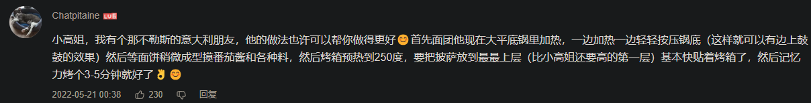

- 文化
	- “吃披萨是青春版分蛋糕
	- “肉盖馍”
		- ((65e83631-bc19-4f5f-86e7-edb0f63c4655))
	- [披萨比西安肉夹馍、手抓饼高明在哪里？ - 知乎](https://www.zhihu.com/question/29292009)
	- [意大利语小故事：披萨！ - 知乎](https://zhuanlan.zhihu.com/p/28412706)
		- [爸爸的雷达原曲《We No Speak Americano》我们不说美国话MV(伪4K60帧)【双语字幕】_哔哩哔哩_bilibili](https://www.bilibili.com/video/BV1vF411f7Em)
			- [Tu Vuo' Fa' L'Americano original version_哔哩哔哩_bilibili](https://www.bilibili.com/video/BV1dv411W78Q)
	- [🇮🇹意大利——吃货们的幸福“天堂”（一）披萨篇🍕 - 知乎](https://zhuanlan.zhihu.com/p/116760609)
- 可能一个最大的区别是（“菠萝菠萝哒！”；“美式=多快省”），意式披萨的饼底慢发酵，美式披萨的饼底快发酵，就好像都是同一家小超市卖的（保质期较长的）预包装切片面包，“醇熟”面包就比其他的要松软
- 饼底，启动！
	- 从面粉开始做披萨饼底
		- 面粉
			- 我用的白燕牌特制高筋粉（分装），它有一点添加剂，好像比意大利00粉粗糙，可能也更黏手，第一次揉面，光面一开始没找着要领，“少量多次”加干粉后，大概完成了六七成，算不上光
			  id:: 65ef0b9e-d45d-4324-8898-52325ded63ae
			- [做意式那不勒斯披萨的专用面粉丨意大利"00"面粉drpizza](https://www.douban.com/note/602066152/?_i=0166043zITh3RA)
		- 酵母
			- [看完这篇，别再用错酵母了！关于酵母的一切问题，从0开始解答！ - 知乎](https://zhuanlan.zhihu.com/p/679534977)
				- 常用的（买面粉可能送一小袋的）即溶干酵母无需温水活化，那么可直接与冷水混合，这样省了一个装温水的容器，增加了冰水量和面包相对低温的时间（可能有助在冷藏前的室温环境控制发酵节奏）
		- [【喃猫料理】披萨宝典！做了40多张披萨后，我终于能在家做出那不勒斯披萨了_哔哩哔哩_bilibili](https://www.bilibili.com/video/BV1Ki4y1G7EW)
			- 
			  id:: 65e88d1f-a7d3-4b1a-bc32-794e91204226
			- [玛格丽塔比萨 - 维基百科，自由的百科全书](https://zh.wikipedia.org/zh-cn/%E7%91%AA%E6%A0%BC%E9%BA%97%E5%A1%94%E6%8A%AB%E8%96%A9)
		- [【小高姐】详细的解说，带你做出真正经典的意大利披萨_哔哩哔哩_bilibili](https://www.bilibili.com/video/BV1dt411m73Y)
		- [【小高姐】那不勒斯披萨_哔哩哔哩_bilibili](https://www.bilibili.com/video/BV1AU4y1U7Df)
			- 
			- 
			  id:: 65e8776d-8a03-4894-aa40-42fc7b982806
		- 缩短发酵时间的（“美式饼底”）
			- [众所周知：披萨有两种，意式披萨和其他披萨｜免揉！【1小时速成】薄底脆皮大气孔「意式披萨」_哔哩哔哩_bilibili](https://www.bilibili.com/video/BV11z4y157fk)
				- 
			- [3分钟快速免揉配方，做出最好吃的披萨饼皮_哔哩哔哩_bilibili](https://www.bilibili.com/video/BV1DU4y1G7Sm)
			- [【至尊披萨简易做法 】自制披萨酱和饼底，配方详细，柔软拉丝，好好吃~_哔哩哔哩_bilibili](https://www.bilibili.com/video/BV1ua4y1e7MN)（“不知道哪儿‘至尊’了”）
		- “为了那一口老老实实买食材”
			- 面粉
				- [买面粉：要分清高筋、中筋、低筋，差别很大，建议弄懂再买不会错_澎湃号·湃客_澎湃新闻-The Paper](https://www.thepaper.cn/newsDetail_forward_17751638)
			- 糖化麦芽粉（好像买“麦芽粉”就行）
				- [写给工友的情书：做一个好吃的披萨也许没你想的那么难  - 少数派](https://sspai.com/post/70416)
				- [怎样从选面粉开始制作健康好味的【纽约贝果NewYorkBagels】](https://www.douban.com/note/758786186/?_i=9792214zITh3RA)
					- >麦芽粉 Malt Powder – 糖化麦芽粉很常见，是一种面包添加剂，用来帮助面包发酵，面包粉里大多含有麦芽粉。非糖化麦芽粉，只有比较专业的烘焙行才有卖，比如KA。
	- 用成品披萨饼底
	  collapsed:: true
		- [没有比这更简单的披萨了_哔哩哔哩_bilibili](https://www.bilibili.com/video/BV1NZ4y1m7Ub)
	- 用其他食材代替披萨饼底
	  collapsed:: true
		- 用恰巴塔面包代替披萨饼底
			- [屠龙者终成龙，浓眉大眼的文森佐也做三分钟披萨了_哔哩哔哩_bilibili](https://www.bilibili.com/video/BV1vM4y1Z7Ui)
				- [免揉无糖多孔❗️这都学不会的话，我给你投币好伐？！【🇮🇹恰巴塔面包ciabatta】_哔哩哔哩_bilibili](https://www.bilibili.com/video/BV1Ba41177fF)
		- 用普通面包（比如“吐司”）代替披萨饼底
			- [第151道空气炸锅，芝香披萨，这是我做过最成功的芝士披萨了，好吃到爆炸了兄弟姐妹们，赶紧做做看吧！_哔哩哔哩_bilibili](https://www.bilibili.com/video/BV1D44y197pA)
		- 用大米饼底
			- [【大米披萨的做法步骤图，大米披萨怎么做好吃】无麸质小厨_下厨房](https://www.xiachufang.com/recipe/106538161/)
			- [大米做披萨的做法大全-抖音](https://www.douyin.com/shipin/7311017258640345138)
- 发酵
	- 如果拿烤盘发酵，注意其他用途是否还够，不够可以提前 ((65d364f4-35e7-4c86-b25c-2867d6338848)) 再买烤盘
- 加顶料
	- [[罗勒]]
	- 意式披萨饼底增加容量？（加厚饼底？）
- 加热
	- 烤箱温度建议最高有250度
	- 怕预热费电？除了一次多烤几张披萨，还可以先烤别的，比如 ((65e1eac1-ae97-4bb3-8ce9-b425359d6c89))
	- 普通烤箱用铁盘（厚铸铁煎锅可以，燃气上加热不仅省时省钱，最高温度和蓄热量还更高更大，就是从燃气灶移动时要注意防烫）和/或石板蓄热，两块比一块好
		- 烤盘/烤箱的面积（放得下铸铁锅/铁盘/石板）、承重（放了重点的不会塌下去，有些导轨可能有点松，可以另外配重模拟披萨，比如铸铁锅可以带上原来的盖子）测试
		- ((65e88d1f-a7d3-4b1a-bc32-794e91204226))
	- [【冷冻披萨🍕最好吃的加热方法（烤箱、空气炸锅、微波炉）3种加热方式测评的做法步骤图】我是大吃货洋y_下厨房](https://www.xiachufang.com/recipe/105822256/)
- TODO “哈哈，大家平时都吃什么披萨啊？”
  id:: 65e860bb-d37c-4bfb-b00c-b0d4f6d5c48c
	- 五花肉片/丁、肉糜/肉圆、猪肝/肝油酱、鱼片
	- 黄油、
	- 南瓜、红薯
	- 皮蛋披萨
		- [【喜欢皮蛋一定要试试的皮皮皮蛋披萨的做法步骤图】青春的前小腿_下厨房](https://xiachufang.com/recipe/104598139/)
		- [香菜+皮蛋的炸裂组合！网友：简直捅了香菜窝|牛肉|青椒|披萨|芝士|辣椒|芫荽|香草|香菜叶|蛋类食品|适量清水_网易订阅](https://www.163.com/dy/article/IRUGSG0S0514CCT2.html)
		  id:: 65e846e1-fb25-4aee-8b66-2b2381908060
	- 稻米油、猪油饼底